cola Report for Consensus Partitioning
==================

**Date**: 2019-12-03 17:15:45 CET, **cola version**: 1.3.2

----------------------------------------------------------------

<style type='text/css'>

body, td, th {
   font-family: Arial,Helvetica,sans-serif;
   background-color: white;
   font-size: 13px;
  max-width: 800px;
  margin: auto;
  margin-left:210px;
  padding: 0px 10px 0px 10px;
  border-left: 1px solid #EEEEEE;
  line-height: 150%;
}

tt, code, pre {
   font-family: 'DejaVu Sans Mono', 'Droid Sans Mono', 'Lucida Console', Consolas, Monaco, 

monospace;
}

h1 {
   font-size:2.2em;
}

h2 {
   font-size:1.8em;
}

h3 {
   font-size:1.4em;
}

h4 {
   font-size:1.0em;
}

h5 {
   font-size:0.9em;
}

h6 {
   font-size:0.8em;
}

a {
  text-decoration: none;
  color: #0366d6;
}

a:hover {
  text-decoration: underline;
}

a:visited {
   color: #0366d6;
}

pre, img {
  max-width: 100%;
}
pre {
  overflow-x: auto;
}
pre code {
   display: block; padding: 0.5em;
}

code {
  font-size: 92%;
  border: 1px solid #ccc;
}

code[class] {
  background-color: #F8F8F8;
}

table, td, th {
  border: 1px solid #ccc;
}

blockquote {
   color:#666666;
   margin:0;
   padding-left: 1em;
   border-left: 0.5em #EEE solid;
}

hr {
   height: 0px;
   border-bottom: none;
   border-top-width: thin;
   border-top-style: dotted;
   border-top-color: #999999;
}

@media print {
   * {
      background: transparent !important;
      color: black !important;
      filter:none !important;
      -ms-filter: none !important;
   }

   body {
      font-size:12pt;
      max-width:100%;
   }

   a, a:visited {
      text-decoration: underline;
   }

   hr {
      visibility: hidden;
      page-break-before: always;
   }

   pre, blockquote {
      padding-right: 1em;
      page-break-inside: avoid;
   }

   tr, img {
      page-break-inside: avoid;
   }

   img {
      max-width: 100% !important;
   }

   @page :left {
      margin: 15mm 20mm 15mm 10mm;
   }

   @page :right {
      margin: 15mm 10mm 15mm 20mm;
   }

   p, h2, h3 {
      orphans: 3; widows: 3;
   }

   h2, h3 {
      page-break-after: avoid;
   }
}
</style>


## Summary


All available functions which can be applied to this `res_list` object:


```r
res_list
```

```
#> A 'ConsensusPartitionList' object with 24 methods.
#>   On a matrix with 4537 rows and 166 columns.
#>   Top rows are extracted by 'SD, CV, MAD, ATC' methods.
#>   Subgroups are detected by 'hclust, kmeans, skmeans, pam, mclust, NMF' method.
#>   Number of partitions are tried for k = 2, 3, 4, 5, 6.
#>   Performed in total 30000 partitions by row resampling.
#> 
#> Following methods can be applied to this 'ConsensusPartitionList' object:
#>  [1] "cola_report"           "collect_classes"       "collect_plots"         "collect_stats"        
#>  [5] "colnames"              "functional_enrichment" "get_anno_col"          "get_anno"             
#>  [9] "get_classes"           "get_matrix"            "get_membership"        "get_stats"            
#> [13] "is_best_k"             "is_stable_k"           "ncol"                  "nrow"                 
#> [17] "rownames"              "show"                  "suggest_best_k"        "test_to_known_factors"
#> [21] "top_rows_heatmap"      "top_rows_overlap"     
#> 
#> You can get result for a single method by, e.g. object["SD", "hclust"] or object["SD:hclust"]
#> or a subset of methods by object[c("SD", "CV")], c("hclust", "kmeans")]
```

The call of `run_all_consensus_partition_methods()` was:


```
#> run_all_consensus_partition_methods(data = mat, mc.cores = 4, anno = anno)
```

Dimension of the input matrix:


```r
mat = get_matrix(res_list)
dim(mat)
```

```
#> [1] 4537  166
```

### Density distribution

The density distribution for each sample is visualized as in one column in the
following heatmap. The clustering is based on the distance which is the
Kolmogorov-Smirnov statistic between two distributions.


```r
library(ComplexHeatmap)
densityHeatmap(mat, top_annotation = HeatmapAnnotation(df = get_anno(res_list), 
    col = get_anno_col(res_list)), ylab = "value", cluster_columns = TRUE, show_column_names = FALSE,
    mc.cores = 4)
```

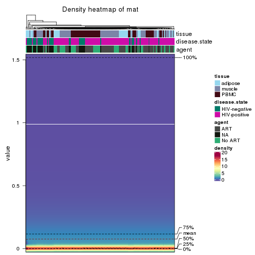


### Suggest the best k


Folowing table shows the best `k` (number of partitions) for each combination
of top-value methods and partition methods. Clicking on the method name in
the table goes to the section for a single combination of methods.

[The cola vignette](http://bioconductor.org/packages/devel/bioc/vignettes/cola/inst/doc/cola.html#toc_13)
explains the definition of the metrics used for determining the best
number of partitions.


```r
suggest_best_k(res_list)
```


|                            | The best k| 1-PAC| Mean silhouette| Concordance|   |
|:---------------------------|----------:|-----:|---------------:|-----------:|:--|
|[ATC:mclust](#ATC-mclust)   |          2| 1.000|           0.962|       0.978|** |
|[MAD:kmeans](#MAD-kmeans)   |          2| 0.964|           0.940|       0.963|** |
|[ATC:skmeans](#ATC-skmeans) |          2| 0.950|           0.940|       0.975|*  |
|[MAD:mclust](#MAD-mclust)   |          2| 0.908|           0.942|       0.973|*  |
|[ATC:NMF](#ATC-NMF)         |          3| 0.905|           0.890|       0.956|*  |
|[MAD:NMF](#MAD-NMF)         |          2| 0.862|           0.904|       0.956|   |
|[SD:NMF](#SD-NMF)           |          2| 0.807|           0.902|       0.958|   |
|[ATC:kmeans](#ATC-kmeans)   |          3| 0.776|           0.884|       0.925|   |
|[ATC:pam](#ATC-pam)         |          3| 0.731|           0.817|       0.917|   |
|[CV:NMF](#CV-NMF)           |          2| 0.715|           0.877|       0.942|   |
|[SD:mclust](#SD-mclust)     |          3| 0.640|           0.789|       0.893|   |
|[SD:skmeans](#SD-skmeans)   |          2| 0.598|           0.868|       0.931|   |
|[MAD:skmeans](#MAD-skmeans) |          2| 0.542|           0.814|       0.913|   |
|[CV:skmeans](#CV-skmeans)   |          2| 0.538|           0.886|       0.933|   |
|[SD:kmeans](#SD-kmeans)     |          3| 0.511|           0.677|       0.811|   |
|[CV:mclust](#CV-mclust)     |          3| 0.462|           0.801|       0.864|   |
|[MAD:pam](#MAD-pam)         |          2| 0.385|           0.717|       0.857|   |
|[CV:pam](#CV-pam)           |          2| 0.301|           0.652|       0.839|   |
|[SD:pam](#SD-pam)           |          2| 0.256|           0.784|       0.854|   |
|[CV:kmeans](#CV-kmeans)     |          2| 0.183|           0.682|       0.803|   |
|[ATC:hclust](#ATC-hclust)   |          2| 0.155|           0.666|       0.813|   |
|[CV:hclust](#CV-hclust)     |          3| 0.105|           0.553|       0.693|   |
|[MAD:hclust](#MAD-hclust)   |          3| 0.052|           0.379|       0.634|   |
|[SD:hclust](#SD-hclust)     |          2| 0.024|           0.493|       0.683|   |

\*\*: 1-PAC > 0.95, \*: 1-PAC > 0.9


### CDF of consensus matrices

Cumulative distribution function curves of consensus matrix for all methods.


```r
collect_plots(res_list, fun = plot_ecdf)
```

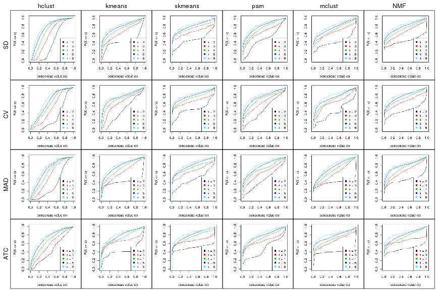


### Consensus heatmap

Consensus heatmaps for all methods. ([What is a consensus heatmap?](http://bioconductor.org/packages/devel/bioc/vignettes/cola/inst/doc/cola.html#toc_9))


<style type='text/css'>


.ui-helper-hidden {
	display: none;
}
.ui-helper-hidden-accessible {
	border: 0;
	clip: rect(0 0 0 0);
	height: 1px;
	margin: -1px;
	overflow: hidden;
	padding: 0;
	position: absolute;
	width: 1px;
}
.ui-helper-reset {
	margin: 0;
	padding: 0;
	border: 0;
	outline: 0;
	line-height: 1.3;
	text-decoration: none;
	font-size: 100%;
	list-style: none;
}
.ui-helper-clearfix:before,
.ui-helper-clearfix:after {
	content: "";
	display: table;
	border-collapse: collapse;
}
.ui-helper-clearfix:after {
	clear: both;
}
.ui-helper-zfix {
	width: 100%;
	height: 100%;
	top: 0;
	left: 0;
	position: absolute;
	opacity: 0;
	filter:Alpha(Opacity=0); 
}

.ui-front {
	z-index: 100;
}


.ui-state-disabled {
	cursor: default !important;
	pointer-events: none;
}


.ui-icon {
	display: inline-block;
	vertical-align: middle;
	margin-top: -.25em;
	position: relative;
	text-indent: -99999px;
	overflow: hidden;
	background-repeat: no-repeat;
}

.ui-widget-icon-block {
	left: 50%;
	margin-left: -8px;
	display: block;
}


.ui-widget-overlay {
	position: fixed;
	top: 0;
	left: 0;
	width: 100%;
	height: 100%;
}
.ui-accordion .ui-accordion-header {
	display: block;
	cursor: pointer;
	position: relative;
	margin: 2px 0 0 0;
	padding: .5em .5em .5em .7em;
	font-size: 100%;
}
.ui-accordion .ui-accordion-content {
	padding: 1em 2.2em;
	border-top: 0;
	overflow: auto;
}
.ui-autocomplete {
	position: absolute;
	top: 0;
	left: 0;
	cursor: default;
}
.ui-menu {
	list-style: none;
	padding: 0;
	margin: 0;
	display: block;
	outline: 0;
}
.ui-menu .ui-menu {
	position: absolute;
}
.ui-menu .ui-menu-item {
	margin: 0;
	cursor: pointer;
	
	list-style-image: url("data:image/gif;base64,R0lGODlhAQABAIAAAAAAAP///yH5BAEAAAAALAAAAAABAAEAAAIBRAA7");
}
.ui-menu .ui-menu-item-wrapper {
	position: relative;
	padding: 3px 1em 3px .4em;
}
.ui-menu .ui-menu-divider {
	margin: 5px 0;
	height: 0;
	font-size: 0;
	line-height: 0;
	border-width: 1px 0 0 0;
}
.ui-menu .ui-state-focus,
.ui-menu .ui-state-active {
	margin: -1px;
}


.ui-menu-icons {
	position: relative;
}
.ui-menu-icons .ui-menu-item-wrapper {
	padding-left: 2em;
}


.ui-menu .ui-icon {
	position: absolute;
	top: 0;
	bottom: 0;
	left: .2em;
	margin: auto 0;
}


.ui-menu .ui-menu-icon {
	left: auto;
	right: 0;
}
.ui-button {
	padding: .4em 1em;
	display: inline-block;
	position: relative;
	line-height: normal;
	margin-right: .1em;
	cursor: pointer;
	vertical-align: middle;
	text-align: center;
	-webkit-user-select: none;
	-moz-user-select: none;
	-ms-user-select: none;
	user-select: none;

	
	overflow: visible;
}

.ui-button,
.ui-button:link,
.ui-button:visited,
.ui-button:hover,
.ui-button:active {
	text-decoration: none;
}


.ui-button-icon-only {
	width: 2em;
	box-sizing: border-box;
	text-indent: -9999px;
	white-space: nowrap;
}


input.ui-button.ui-button-icon-only {
	text-indent: 0;
}


.ui-button-icon-only .ui-icon {
	position: absolute;
	top: 50%;
	left: 50%;
	margin-top: -8px;
	margin-left: -8px;
}

.ui-button.ui-icon-notext .ui-icon {
	padding: 0;
	width: 2.1em;
	height: 2.1em;
	text-indent: -9999px;
	white-space: nowrap;

}

input.ui-button.ui-icon-notext .ui-icon {
	width: auto;
	height: auto;
	text-indent: 0;
	white-space: normal;
	padding: .4em 1em;
}


input.ui-button::-moz-focus-inner,
button.ui-button::-moz-focus-inner {
	border: 0;
	padding: 0;
}
.ui-controlgroup {
	vertical-align: middle;
	display: inline-block;
}
.ui-controlgroup > .ui-controlgroup-item {
	float: left;
	margin-left: 0;
	margin-right: 0;
}
.ui-controlgroup > .ui-controlgroup-item:focus,
.ui-controlgroup > .ui-controlgroup-item.ui-visual-focus {
	z-index: 9999;
}
.ui-controlgroup-vertical > .ui-controlgroup-item {
	display: block;
	float: none;
	width: 100%;
	margin-top: 0;
	margin-bottom: 0;
	text-align: left;
}
.ui-controlgroup-vertical .ui-controlgroup-item {
	box-sizing: border-box;
}
.ui-controlgroup .ui-controlgroup-label {
	padding: .4em 1em;
}
.ui-controlgroup .ui-controlgroup-label span {
	font-size: 80%;
}
.ui-controlgroup-horizontal .ui-controlgroup-label + .ui-controlgroup-item {
	border-left: none;
}
.ui-controlgroup-vertical .ui-controlgroup-label + .ui-controlgroup-item {
	border-top: none;
}
.ui-controlgroup-horizontal .ui-controlgroup-label.ui-widget-content {
	border-right: none;
}
.ui-controlgroup-vertical .ui-controlgroup-label.ui-widget-content {
	border-bottom: none;
}


.ui-controlgroup-vertical .ui-spinner-input {

	
	width: 75%;
	width: calc( 100% - 2.4em );
}
.ui-controlgroup-vertical .ui-spinner .ui-spinner-up {
	border-top-style: solid;
}

.ui-checkboxradio-label .ui-icon-background {
	box-shadow: inset 1px 1px 1px #ccc;
	border-radius: .12em;
	border: none;
}
.ui-checkboxradio-radio-label .ui-icon-background {
	width: 16px;
	height: 16px;
	border-radius: 1em;
	overflow: visible;
	border: none;
}
.ui-checkboxradio-radio-label.ui-checkboxradio-checked .ui-icon,
.ui-checkboxradio-radio-label.ui-checkboxradio-checked:hover .ui-icon {
	background-image: none;
	width: 8px;
	height: 8px;
	border-width: 4px;
	border-style: solid;
}
.ui-checkboxradio-disabled {
	pointer-events: none;
}
.ui-datepicker {
	width: 17em;
	padding: .2em .2em 0;
	display: none;
}
.ui-datepicker .ui-datepicker-header {
	position: relative;
	padding: .2em 0;
}
.ui-datepicker .ui-datepicker-prev,
.ui-datepicker .ui-datepicker-next {
	position: absolute;
	top: 2px;
	width: 1.8em;
	height: 1.8em;
}
.ui-datepicker .ui-datepicker-prev-hover,
.ui-datepicker .ui-datepicker-next-hover {
	top: 1px;
}
.ui-datepicker .ui-datepicker-prev {
	left: 2px;
}
.ui-datepicker .ui-datepicker-next {
	right: 2px;
}
.ui-datepicker .ui-datepicker-prev-hover {
	left: 1px;
}
.ui-datepicker .ui-datepicker-next-hover {
	right: 1px;
}
.ui-datepicker .ui-datepicker-prev span,
.ui-datepicker .ui-datepicker-next span {
	display: block;
	position: absolute;
	left: 50%;
	margin-left: -8px;
	top: 50%;
	margin-top: -8px;
}
.ui-datepicker .ui-datepicker-title {
	margin: 0 2.3em;
	line-height: 1.8em;
	text-align: center;
}
.ui-datepicker .ui-datepicker-title select {
	font-size: 1em;
	margin: 1px 0;
}
.ui-datepicker select.ui-datepicker-month,
.ui-datepicker select.ui-datepicker-year {
	width: 45%;
}
.ui-datepicker table {
	width: 100%;
	font-size: .9em;
	border-collapse: collapse;
	margin: 0 0 .4em;
}
.ui-datepicker th {
	padding: .7em .3em;
	text-align: center;
	font-weight: bold;
	border: 0;
}
.ui-datepicker td {
	border: 0;
	padding: 1px;
}
.ui-datepicker td span,
.ui-datepicker td a {
	display: block;
	padding: .2em;
	text-align: right;
	text-decoration: none;
}
.ui-datepicker .ui-datepicker-buttonpane {
	background-image: none;
	margin: .7em 0 0 0;
	padding: 0 .2em;
	border-left: 0;
	border-right: 0;
	border-bottom: 0;
}
.ui-datepicker .ui-datepicker-buttonpane button {
	float: right;
	margin: .5em .2em .4em;
	cursor: pointer;
	padding: .2em .6em .3em .6em;
	width: auto;
	overflow: visible;
}
.ui-datepicker .ui-datepicker-buttonpane button.ui-datepicker-current {
	float: left;
}


.ui-datepicker.ui-datepicker-multi {
	width: auto;
}
.ui-datepicker-multi .ui-datepicker-group {
	float: left;
}
.ui-datepicker-multi .ui-datepicker-group table {
	width: 95%;
	margin: 0 auto .4em;
}
.ui-datepicker-multi-2 .ui-datepicker-group {
	width: 50%;
}
.ui-datepicker-multi-3 .ui-datepicker-group {
	width: 33.3%;
}
.ui-datepicker-multi-4 .ui-datepicker-group {
	width: 25%;
}
.ui-datepicker-multi .ui-datepicker-group-last .ui-datepicker-header,
.ui-datepicker-multi .ui-datepicker-group-middle .ui-datepicker-header {
	border-left-width: 0;
}
.ui-datepicker-multi .ui-datepicker-buttonpane {
	clear: left;
}
.ui-datepicker-row-break {
	clear: both;
	width: 100%;
	font-size: 0;
}


.ui-datepicker-rtl {
	direction: rtl;
}
.ui-datepicker-rtl .ui-datepicker-prev {
	right: 2px;
	left: auto;
}
.ui-datepicker-rtl .ui-datepicker-next {
	left: 2px;
	right: auto;
}
.ui-datepicker-rtl .ui-datepicker-prev:hover {
	right: 1px;
	left: auto;
}
.ui-datepicker-rtl .ui-datepicker-next:hover {
	left: 1px;
	right: auto;
}
.ui-datepicker-rtl .ui-datepicker-buttonpane {
	clear: right;
}
.ui-datepicker-rtl .ui-datepicker-buttonpane button {
	float: left;
}
.ui-datepicker-rtl .ui-datepicker-buttonpane button.ui-datepicker-current,
.ui-datepicker-rtl .ui-datepicker-group {
	float: right;
}
.ui-datepicker-rtl .ui-datepicker-group-last .ui-datepicker-header,
.ui-datepicker-rtl .ui-datepicker-group-middle .ui-datepicker-header {
	border-right-width: 0;
	border-left-width: 1px;
}


.ui-datepicker .ui-icon {
	display: block;
	text-indent: -99999px;
	overflow: hidden;
	background-repeat: no-repeat;
	left: .5em;
	top: .3em;
}
.ui-dialog {
	position: absolute;
	top: 0;
	left: 0;
	padding: .2em;
	outline: 0;
}
.ui-dialog .ui-dialog-titlebar {
	padding: .4em 1em;
	position: relative;
}
.ui-dialog .ui-dialog-title {
	float: left;
	margin: .1em 0;
	white-space: nowrap;
	width: 90%;
	overflow: hidden;
	text-overflow: ellipsis;
}
.ui-dialog .ui-dialog-titlebar-close {
	position: absolute;
	right: .3em;
	top: 50%;
	width: 20px;
	margin: -10px 0 0 0;
	padding: 1px;
	height: 20px;
}
.ui-dialog .ui-dialog-content {
	position: relative;
	border: 0;
	padding: .5em 1em;
	background: none;
	overflow: auto;
}
.ui-dialog .ui-dialog-buttonpane {
	text-align: left;
	border-width: 1px 0 0 0;
	background-image: none;
	margin-top: .5em;
	padding: .3em 1em .5em .4em;
}
.ui-dialog .ui-dialog-buttonpane .ui-dialog-buttonset {
	float: right;
}
.ui-dialog .ui-dialog-buttonpane button {
	margin: .5em .4em .5em 0;
	cursor: pointer;
}
.ui-dialog .ui-resizable-n {
	height: 2px;
	top: 0;
}
.ui-dialog .ui-resizable-e {
	width: 2px;
	right: 0;
}
.ui-dialog .ui-resizable-s {
	height: 2px;
	bottom: 0;
}
.ui-dialog .ui-resizable-w {
	width: 2px;
	left: 0;
}
.ui-dialog .ui-resizable-se,
.ui-dialog .ui-resizable-sw,
.ui-dialog .ui-resizable-ne,
.ui-dialog .ui-resizable-nw {
	width: 7px;
	height: 7px;
}
.ui-dialog .ui-resizable-se {
	right: 0;
	bottom: 0;
}
.ui-dialog .ui-resizable-sw {
	left: 0;
	bottom: 0;
}
.ui-dialog .ui-resizable-ne {
	right: 0;
	top: 0;
}
.ui-dialog .ui-resizable-nw {
	left: 0;
	top: 0;
}
.ui-draggable .ui-dialog-titlebar {
	cursor: move;
}
.ui-draggable-handle {
	-ms-touch-action: none;
	touch-action: none;
}
.ui-resizable {
	position: relative;
}
.ui-resizable-handle {
	position: absolute;
	font-size: 0.1px;
	display: block;
	-ms-touch-action: none;
	touch-action: none;
}
.ui-resizable-disabled .ui-resizable-handle,
.ui-resizable-autohide .ui-resizable-handle {
	display: none;
}
.ui-resizable-n {
	cursor: n-resize;
	height: 7px;
	width: 100%;
	top: -5px;
	left: 0;
}
.ui-resizable-s {
	cursor: s-resize;
	height: 7px;
	width: 100%;
	bottom: -5px;
	left: 0;
}
.ui-resizable-e {
	cursor: e-resize;
	width: 7px;
	right: -5px;
	top: 0;
	height: 100%;
}
.ui-resizable-w {
	cursor: w-resize;
	width: 7px;
	left: -5px;
	top: 0;
	height: 100%;
}
.ui-resizable-se {
	cursor: se-resize;
	width: 12px;
	height: 12px;
	right: 1px;
	bottom: 1px;
}
.ui-resizable-sw {
	cursor: sw-resize;
	width: 9px;
	height: 9px;
	left: -5px;
	bottom: -5px;
}
.ui-resizable-nw {
	cursor: nw-resize;
	width: 9px;
	height: 9px;
	left: -5px;
	top: -5px;
}
.ui-resizable-ne {
	cursor: ne-resize;
	width: 9px;
	height: 9px;
	right: -5px;
	top: -5px;
}
.ui-progressbar {
	height: 2em;
	text-align: left;
	overflow: hidden;
}
.ui-progressbar .ui-progressbar-value {
	margin: -1px;
	height: 100%;
}
.ui-progressbar .ui-progressbar-overlay {
	background: url("");
	height: 100%;
	filter: alpha(opacity=25); 
	opacity: 0.25;
}
.ui-progressbar-indeterminate .ui-progressbar-value {
	background-image: none;
}
.ui-selectable {
	-ms-touch-action: none;
	touch-action: none;
}
.ui-selectable-helper {
	position: absolute;
	z-index: 100;
	border: 1px dotted black;
}
.ui-selectmenu-menu {
	padding: 0;
	margin: 0;
	position: absolute;
	top: 0;
	left: 0;
	display: none;
}
.ui-selectmenu-menu .ui-menu {
	overflow: auto;
	overflow-x: hidden;
	padding-bottom: 1px;
}
.ui-selectmenu-menu .ui-menu .ui-selectmenu-optgroup {
	font-size: 1em;
	font-weight: bold;
	line-height: 1.5;
	padding: 2px 0.4em;
	margin: 0.5em 0 0 0;
	height: auto;
	border: 0;
}
.ui-selectmenu-open {
	display: block;
}
.ui-selectmenu-text {
	display: block;
	margin-right: 20px;
	overflow: hidden;
	text-overflow: ellipsis;
}
.ui-selectmenu-button.ui-button {
	text-align: left;
	white-space: nowrap;
	width: 14em;
}
.ui-selectmenu-icon.ui-icon {
	float: right;
	margin-top: 0;
}
.ui-slider {
	position: relative;
	text-align: left;
}
.ui-slider .ui-slider-handle {
	position: absolute;
	z-index: 2;
	width: 1.2em;
	height: 1.2em;
	cursor: default;
	-ms-touch-action: none;
	touch-action: none;
}
.ui-slider .ui-slider-range {
	position: absolute;
	z-index: 1;
	font-size: .7em;
	display: block;
	border: 0;
	background-position: 0 0;
}


.ui-slider.ui-state-disabled .ui-slider-handle,
.ui-slider.ui-state-disabled .ui-slider-range {
	filter: inherit;
}

.ui-slider-horizontal {
	height: .8em;
}
.ui-slider-horizontal .ui-slider-handle {
	top: -.3em;
	margin-left: -.6em;
}
.ui-slider-horizontal .ui-slider-range {
	top: 0;
	height: 100%;
}
.ui-slider-horizontal .ui-slider-range-min {
	left: 0;
}
.ui-slider-horizontal .ui-slider-range-max {
	right: 0;
}

.ui-slider-vertical {
	width: .8em;
	height: 100px;
}
.ui-slider-vertical .ui-slider-handle {
	left: -.3em;
	margin-left: 0;
	margin-bottom: -.6em;
}
.ui-slider-vertical .ui-slider-range {
	left: 0;
	width: 100%;
}
.ui-slider-vertical .ui-slider-range-min {
	bottom: 0;
}
.ui-slider-vertical .ui-slider-range-max {
	top: 0;
}
.ui-sortable-handle {
	-ms-touch-action: none;
	touch-action: none;
}
.ui-spinner {
	position: relative;
	display: inline-block;
	overflow: hidden;
	padding: 0;
	vertical-align: middle;
}
.ui-spinner-input {
	border: none;
	background: none;
	color: inherit;
	padding: .222em 0;
	margin: .2em 0;
	vertical-align: middle;
	margin-left: .4em;
	margin-right: 2em;
}
.ui-spinner-button {
	width: 1.6em;
	height: 50%;
	font-size: .5em;
	padding: 0;
	margin: 0;
	text-align: center;
	position: absolute;
	cursor: default;
	display: block;
	overflow: hidden;
	right: 0;
}

.ui-spinner a.ui-spinner-button {
	border-top-style: none;
	border-bottom-style: none;
	border-right-style: none;
}
.ui-spinner-up {
	top: 0;
}
.ui-spinner-down {
	bottom: 0;
}
.ui-tabs {
	position: relative;
	padding: .2em;
}
.ui-tabs .ui-tabs-nav {
	margin: 0;
	padding: .2em .2em 0;
}
.ui-tabs .ui-tabs-nav li {
	list-style: none;
	float: left;
	position: relative;
	top: 0;
	margin: 1px .2em 0 0;
	border-bottom-width: 0;
	padding: 0;
	white-space: nowrap;
}
.ui-tabs .ui-tabs-nav .ui-tabs-anchor {
	float: left;
	padding: .5em 1em;
	text-decoration: none;
}
.ui-tabs .ui-tabs-nav li.ui-tabs-active {
	margin-bottom: -1px;
	padding-bottom: 1px;
}
.ui-tabs .ui-tabs-nav li.ui-tabs-active .ui-tabs-anchor,
.ui-tabs .ui-tabs-nav li.ui-state-disabled .ui-tabs-anchor,
.ui-tabs .ui-tabs-nav li.ui-tabs-loading .ui-tabs-anchor {
	cursor: text;
}
.ui-tabs-collapsible .ui-tabs-nav li.ui-tabs-active .ui-tabs-anchor {
	cursor: pointer;
}
.ui-tabs .ui-tabs-panel {
	display: block;
	border-width: 0;
	padding: 1em 1.4em;
	background: none;
}
.ui-tooltip {
	padding: 8px;
	position: absolute;
	z-index: 9999;
	max-width: 300px;
}
body .ui-tooltip {
	border-width: 2px;
}

.ui-widget {
	font-family: Arial,Helvetica,sans-serif;
	font-size: 1em;
}
.ui-widget .ui-widget {
	font-size: 1em;
}
.ui-widget input,
.ui-widget select,
.ui-widget textarea,
.ui-widget button {
	font-family: Arial,Helvetica,sans-serif;
	font-size: 1em;
}
.ui-widget.ui-widget-content {
	border: 1px solid #c5c5c5;
}
.ui-widget-content {
	border: 1px solid #dddddd;
	background: #ffffff;
	color: #333333;
}
.ui-widget-content a {
	color: #333333;
}
.ui-widget-header {
	border: 1px solid #dddddd;
	background: #e9e9e9;
	color: #333333;
	font-weight: bold;
}
.ui-widget-header a {
	color: #333333;
}


.ui-state-default,
.ui-widget-content .ui-state-default,
.ui-widget-header .ui-state-default,
.ui-button,


html .ui-button.ui-state-disabled:hover,
html .ui-button.ui-state-disabled:active {
	border: 1px solid #c5c5c5;
	background: #f6f6f6;
	font-weight: normal;
	color: #454545;
}
.ui-state-default a,
.ui-state-default a:link,
.ui-state-default a:visited,
a.ui-button,
a:link.ui-button,
a:visited.ui-button,
.ui-button {
	color: #454545;
	text-decoration: none;
}
.ui-state-hover,
.ui-widget-content .ui-state-hover,
.ui-widget-header .ui-state-hover,
.ui-state-focus,
.ui-widget-content .ui-state-focus,
.ui-widget-header .ui-state-focus,
.ui-button:hover,
.ui-button:focus {
	border: 1px solid #cccccc;
	background: #ededed;
	font-weight: normal;
	color: #2b2b2b;
}
.ui-state-hover a,
.ui-state-hover a:hover,
.ui-state-hover a:link,
.ui-state-hover a:visited,
.ui-state-focus a,
.ui-state-focus a:hover,
.ui-state-focus a:link,
.ui-state-focus a:visited,
a.ui-button:hover,
a.ui-button:focus {
	color: #2b2b2b;
	text-decoration: none;
}

.ui-visual-focus {
	box-shadow: 0 0 3px 1px rgb(94, 158, 214);
}
.ui-state-active,
.ui-widget-content .ui-state-active,
.ui-widget-header .ui-state-active,
a.ui-button:active,
.ui-button:active,
.ui-button.ui-state-active:hover {
	border: 1px solid #003eff;
	background: #007fff;
	font-weight: normal;
	color: #ffffff;
}
.ui-icon-background,
.ui-state-active .ui-icon-background {
	border: #003eff;
	background-color: #ffffff;
}
.ui-state-active a,
.ui-state-active a:link,
.ui-state-active a:visited {
	color: #ffffff;
	text-decoration: none;
}


.ui-state-highlight,
.ui-widget-content .ui-state-highlight,
.ui-widget-header .ui-state-highlight {
	border: 1px solid #dad55e;
	background: #fffa90;
	color: #777620;
}
.ui-state-checked {
	border: 1px solid #dad55e;
	background: #fffa90;
}
.ui-state-highlight a,
.ui-widget-content .ui-state-highlight a,
.ui-widget-header .ui-state-highlight a {
	color: #777620;
}
.ui-state-error,
.ui-widget-content .ui-state-error,
.ui-widget-header .ui-state-error {
	border: 1px solid #f1a899;
	background: #fddfdf;
	color: #5f3f3f;
}
.ui-state-error a,
.ui-widget-content .ui-state-error a,
.ui-widget-header .ui-state-error a {
	color: #5f3f3f;
}
.ui-state-error-text,
.ui-widget-content .ui-state-error-text,
.ui-widget-header .ui-state-error-text {
	color: #5f3f3f;
}
.ui-priority-primary,
.ui-widget-content .ui-priority-primary,
.ui-widget-header .ui-priority-primary {
	font-weight: bold;
}
.ui-priority-secondary,
.ui-widget-content .ui-priority-secondary,
.ui-widget-header .ui-priority-secondary {
	opacity: .7;
	filter:Alpha(Opacity=70); 
	font-weight: normal;
}
.ui-state-disabled,
.ui-widget-content .ui-state-disabled,
.ui-widget-header .ui-state-disabled {
	opacity: .35;
	filter:Alpha(Opacity=35); 
	background-image: none;
}
.ui-state-disabled .ui-icon {
	filter:Alpha(Opacity=35); 
}


.ui-icon {
	width: 16px;
	height: 16px;
}
.ui-icon,
.ui-widget-content .ui-icon {
	background-image: url("images/ui-icons_444444_256x240.png");
}
.ui-widget-header .ui-icon {
	background-image: url("images/ui-icons_444444_256x240.png");
}
.ui-state-hover .ui-icon,
.ui-state-focus .ui-icon,
.ui-button:hover .ui-icon,
.ui-button:focus .ui-icon {
	background-image: url("images/ui-icons_555555_256x240.png");
}
.ui-state-active .ui-icon,
.ui-button:active .ui-icon {
	background-image: url("images/ui-icons_ffffff_256x240.png");
}
.ui-state-highlight .ui-icon,
.ui-button .ui-state-highlight.ui-icon {
	background-image: url("images/ui-icons_777620_256x240.png");
}
.ui-state-error .ui-icon,
.ui-state-error-text .ui-icon {
	background-image: url("images/ui-icons_cc0000_256x240.png");
}
.ui-button .ui-icon {
	background-image: url("images/ui-icons_777777_256x240.png");
}


.ui-icon-blank { background-position: 16px 16px; }
.ui-icon-caret-1-n { background-position: 0 0; }
.ui-icon-caret-1-ne { background-position: -16px 0; }
.ui-icon-caret-1-e { background-position: -32px 0; }
.ui-icon-caret-1-se { background-position: -48px 0; }
.ui-icon-caret-1-s { background-position: -65px 0; }
.ui-icon-caret-1-sw { background-position: -80px 0; }
.ui-icon-caret-1-w { background-position: -96px 0; }
.ui-icon-caret-1-nw { background-position: -112px 0; }
.ui-icon-caret-2-n-s { background-position: -128px 0; }
.ui-icon-caret-2-e-w { background-position: -144px 0; }
.ui-icon-triangle-1-n { background-position: 0 -16px; }
.ui-icon-triangle-1-ne { background-position: -16px -16px; }
.ui-icon-triangle-1-e { background-position: -32px -16px; }
.ui-icon-triangle-1-se { background-position: -48px -16px; }
.ui-icon-triangle-1-s { background-position: -65px -16px; }
.ui-icon-triangle-1-sw { background-position: -80px -16px; }
.ui-icon-triangle-1-w { background-position: -96px -16px; }
.ui-icon-triangle-1-nw { background-position: -112px -16px; }
.ui-icon-triangle-2-n-s { background-position: -128px -16px; }
.ui-icon-triangle-2-e-w { background-position: -144px -16px; }
.ui-icon-arrow-1-n { background-position: 0 -32px; }
.ui-icon-arrow-1-ne { background-position: -16px -32px; }
.ui-icon-arrow-1-e { background-position: -32px -32px; }
.ui-icon-arrow-1-se { background-position: -48px -32px; }
.ui-icon-arrow-1-s { background-position: -65px -32px; }
.ui-icon-arrow-1-sw { background-position: -80px -32px; }
.ui-icon-arrow-1-w { background-position: -96px -32px; }
.ui-icon-arrow-1-nw { background-position: -112px -32px; }
.ui-icon-arrow-2-n-s { background-position: -128px -32px; }
.ui-icon-arrow-2-ne-sw { background-position: -144px -32px; }
.ui-icon-arrow-2-e-w { background-position: -160px -32px; }
.ui-icon-arrow-2-se-nw { background-position: -176px -32px; }
.ui-icon-arrowstop-1-n { background-position: -192px -32px; }
.ui-icon-arrowstop-1-e { background-position: -208px -32px; }
.ui-icon-arrowstop-1-s { background-position: -224px -32px; }
.ui-icon-arrowstop-1-w { background-position: -240px -32px; }
.ui-icon-arrowthick-1-n { background-position: 1px -48px; }
.ui-icon-arrowthick-1-ne { background-position: -16px -48px; }
.ui-icon-arrowthick-1-e { background-position: -32px -48px; }
.ui-icon-arrowthick-1-se { background-position: -48px -48px; }
.ui-icon-arrowthick-1-s { background-position: -64px -48px; }
.ui-icon-arrowthick-1-sw { background-position: -80px -48px; }
.ui-icon-arrowthick-1-w { background-position: -96px -48px; }
.ui-icon-arrowthick-1-nw { background-position: -112px -48px; }
.ui-icon-arrowthick-2-n-s { background-position: -128px -48px; }
.ui-icon-arrowthick-2-ne-sw { background-position: -144px -48px; }
.ui-icon-arrowthick-2-e-w { background-position: -160px -48px; }
.ui-icon-arrowthick-2-se-nw { background-position: -176px -48px; }
.ui-icon-arrowthickstop-1-n { background-position: -192px -48px; }
.ui-icon-arrowthickstop-1-e { background-position: -208px -48px; }
.ui-icon-arrowthickstop-1-s { background-position: -224px -48px; }
.ui-icon-arrowthickstop-1-w { background-position: -240px -48px; }
.ui-icon-arrowreturnthick-1-w { background-position: 0 -64px; }
.ui-icon-arrowreturnthick-1-n { background-position: -16px -64px; }
.ui-icon-arrowreturnthick-1-e { background-position: -32px -64px; }
.ui-icon-arrowreturnthick-1-s { background-position: -48px -64px; }
.ui-icon-arrowreturn-1-w { background-position: -64px -64px; }
.ui-icon-arrowreturn-1-n { background-position: -80px -64px; }
.ui-icon-arrowreturn-1-e { background-position: -96px -64px; }
.ui-icon-arrowreturn-1-s { background-position: -112px -64px; }
.ui-icon-arrowrefresh-1-w { background-position: -128px -64px; }
.ui-icon-arrowrefresh-1-n { background-position: -144px -64px; }
.ui-icon-arrowrefresh-1-e { background-position: -160px -64px; }
.ui-icon-arrowrefresh-1-s { background-position: -176px -64px; }
.ui-icon-arrow-4 { background-position: 0 -80px; }
.ui-icon-arrow-4-diag { background-position: -16px -80px; }
.ui-icon-extlink { background-position: -32px -80px; }
.ui-icon-newwin { background-position: -48px -80px; }
.ui-icon-refresh { background-position: -64px -80px; }
.ui-icon-shuffle { background-position: -80px -80px; }
.ui-icon-transfer-e-w { background-position: -96px -80px; }
.ui-icon-transferthick-e-w { background-position: -112px -80px; }
.ui-icon-folder-collapsed { background-position: 0 -96px; }
.ui-icon-folder-open { background-position: -16px -96px; }
.ui-icon-document { background-position: -32px -96px; }
.ui-icon-document-b { background-position: -48px -96px; }
.ui-icon-note { background-position: -64px -96px; }
.ui-icon-mail-closed { background-position: -80px -96px; }
.ui-icon-mail-open { background-position: -96px -96px; }
.ui-icon-suitcase { background-position: -112px -96px; }
.ui-icon-comment { background-position: -128px -96px; }
.ui-icon-person { background-position: -144px -96px; }
.ui-icon-print { background-position: -160px -96px; }
.ui-icon-trash { background-position: -176px -96px; }
.ui-icon-locked { background-position: -192px -96px; }
.ui-icon-unlocked { background-position: -208px -96px; }
.ui-icon-bookmark { background-position: -224px -96px; }
.ui-icon-tag { background-position: -240px -96px; }
.ui-icon-home { background-position: 0 -112px; }
.ui-icon-flag { background-position: -16px -112px; }
.ui-icon-calendar { background-position: -32px -112px; }
.ui-icon-cart { background-position: -48px -112px; }
.ui-icon-pencil { background-position: -64px -112px; }
.ui-icon-clock { background-position: -80px -112px; }
.ui-icon-disk { background-position: -96px -112px; }
.ui-icon-calculator { background-position: -112px -112px; }
.ui-icon-zoomin { background-position: -128px -112px; }
.ui-icon-zoomout { background-position: -144px -112px; }
.ui-icon-search { background-position: -160px -112px; }
.ui-icon-wrench { background-position: -176px -112px; }
.ui-icon-gear { background-position: -192px -112px; }
.ui-icon-heart { background-position: -208px -112px; }
.ui-icon-star { background-position: -224px -112px; }
.ui-icon-link { background-position: -240px -112px; }
.ui-icon-cancel { background-position: 0 -128px; }
.ui-icon-plus { background-position: -16px -128px; }
.ui-icon-plusthick { background-position: -32px -128px; }
.ui-icon-minus { background-position: -48px -128px; }
.ui-icon-minusthick { background-position: -64px -128px; }
.ui-icon-close { background-position: -80px -128px; }
.ui-icon-closethick { background-position: -96px -128px; }
.ui-icon-key { background-position: -112px -128px; }
.ui-icon-lightbulb { background-position: -128px -128px; }
.ui-icon-scissors { background-position: -144px -128px; }
.ui-icon-clipboard { background-position: -160px -128px; }
.ui-icon-copy { background-position: -176px -128px; }
.ui-icon-contact { background-position: -192px -128px; }
.ui-icon-image { background-position: -208px -128px; }
.ui-icon-video { background-position: -224px -128px; }
.ui-icon-script { background-position: -240px -128px; }
.ui-icon-alert { background-position: 0 -144px; }
.ui-icon-info { background-position: -16px -144px; }
.ui-icon-notice { background-position: -32px -144px; }
.ui-icon-help { background-position: -48px -144px; }
.ui-icon-check { background-position: -64px -144px; }
.ui-icon-bullet { background-position: -80px -144px; }
.ui-icon-radio-on { background-position: -96px -144px; }
.ui-icon-radio-off { background-position: -112px -144px; }
.ui-icon-pin-w { background-position: -128px -144px; }
.ui-icon-pin-s { background-position: -144px -144px; }
.ui-icon-play { background-position: 0 -160px; }
.ui-icon-pause { background-position: -16px -160px; }
.ui-icon-seek-next { background-position: -32px -160px; }
.ui-icon-seek-prev { background-position: -48px -160px; }
.ui-icon-seek-end { background-position: -64px -160px; }
.ui-icon-seek-start { background-position: -80px -160px; }

.ui-icon-seek-first { background-position: -80px -160px; }
.ui-icon-stop { background-position: -96px -160px; }
.ui-icon-eject { background-position: -112px -160px; }
.ui-icon-volume-off { background-position: -128px -160px; }
.ui-icon-volume-on { background-position: -144px -160px; }
.ui-icon-power { background-position: 0 -176px; }
.ui-icon-signal-diag { background-position: -16px -176px; }
.ui-icon-signal { background-position: -32px -176px; }
.ui-icon-battery-0 { background-position: -48px -176px; }
.ui-icon-battery-1 { background-position: -64px -176px; }
.ui-icon-battery-2 { background-position: -80px -176px; }
.ui-icon-battery-3 { background-position: -96px -176px; }
.ui-icon-circle-plus { background-position: 0 -192px; }
.ui-icon-circle-minus { background-position: -16px -192px; }
.ui-icon-circle-close { background-position: -32px -192px; }
.ui-icon-circle-triangle-e { background-position: -48px -192px; }
.ui-icon-circle-triangle-s { background-position: -64px -192px; }
.ui-icon-circle-triangle-w { background-position: -80px -192px; }
.ui-icon-circle-triangle-n { background-position: -96px -192px; }
.ui-icon-circle-arrow-e { background-position: -112px -192px; }
.ui-icon-circle-arrow-s { background-position: -128px -192px; }
.ui-icon-circle-arrow-w { background-position: -144px -192px; }
.ui-icon-circle-arrow-n { background-position: -160px -192px; }
.ui-icon-circle-zoomin { background-position: -176px -192px; }
.ui-icon-circle-zoomout { background-position: -192px -192px; }
.ui-icon-circle-check { background-position: -208px -192px; }
.ui-icon-circlesmall-plus { background-position: 0 -208px; }
.ui-icon-circlesmall-minus { background-position: -16px -208px; }
.ui-icon-circlesmall-close { background-position: -32px -208px; }
.ui-icon-squaresmall-plus { background-position: -48px -208px; }
.ui-icon-squaresmall-minus { background-position: -64px -208px; }
.ui-icon-squaresmall-close { background-position: -80px -208px; }
.ui-icon-grip-dotted-vertical { background-position: 0 -224px; }
.ui-icon-grip-dotted-horizontal { background-position: -16px -224px; }
.ui-icon-grip-solid-vertical { background-position: -32px -224px; }
.ui-icon-grip-solid-horizontal { background-position: -48px -224px; }
.ui-icon-gripsmall-diagonal-se { background-position: -64px -224px; }
.ui-icon-grip-diagonal-se { background-position: -80px -224px; }


.ui-corner-all,
.ui-corner-top,
.ui-corner-left,
.ui-corner-tl {
	border-top-left-radius: 3px;
}
.ui-corner-all,
.ui-corner-top,
.ui-corner-right,
.ui-corner-tr {
	border-top-right-radius: 3px;
}
.ui-corner-all,
.ui-corner-bottom,
.ui-corner-left,
.ui-corner-bl {
	border-bottom-left-radius: 3px;
}
.ui-corner-all,
.ui-corner-bottom,
.ui-corner-right,
.ui-corner-br {
	border-bottom-right-radius: 3px;
}


.ui-widget-overlay {
	background: #aaaaaa;
	opacity: .3;
	filter: Alpha(Opacity=30); 
}
.ui-widget-shadow {
	-webkit-box-shadow: 0px 0px 5px #666666;
	box-shadow: 0px 0px 5px #666666;
} 
</style>
<script src='js/jquery-1.12.4.js'></script>
<script src='js/jquery-ui.js'></script>

<script>
$( function() {
	$( '#tabs-collect-consensus-heatmap' ).tabs();
} );
</script>
<div id='tabs-collect-consensus-heatmap'>
<ul>
<li><a href='#tab-collect-consensus-heatmap-1'>k = 2</a></li>
<li><a href='#tab-collect-consensus-heatmap-2'>k = 3</a></li>
<li><a href='#tab-collect-consensus-heatmap-3'>k = 4</a></li>
<li><a href='#tab-collect-consensus-heatmap-4'>k = 5</a></li>
<li><a href='#tab-collect-consensus-heatmap-5'>k = 6</a></li>
</ul>
<div id='tab-collect-consensus-heatmap-1'>
<pre><code class="r">collect_plots(res_list, k = 2, fun = consensus_heatmap, mc.cores = 4)
</code></pre>

<p>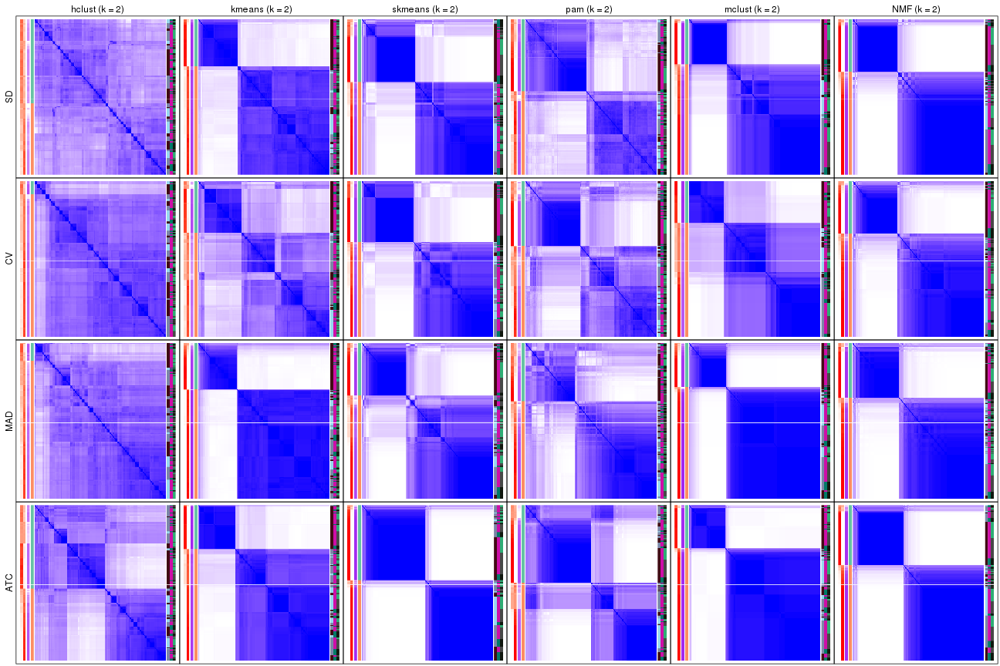</p>

</div>
<div id='tab-collect-consensus-heatmap-2'>
<pre><code class="r">collect_plots(res_list, k = 3, fun = consensus_heatmap, mc.cores = 4)
</code></pre>

<p>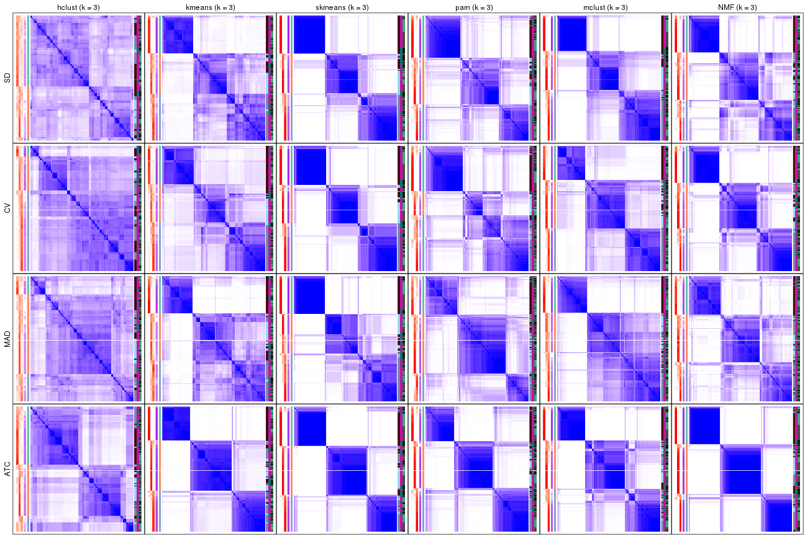</p>

</div>
<div id='tab-collect-consensus-heatmap-3'>
<pre><code class="r">collect_plots(res_list, k = 4, fun = consensus_heatmap, mc.cores = 4)
</code></pre>

<p>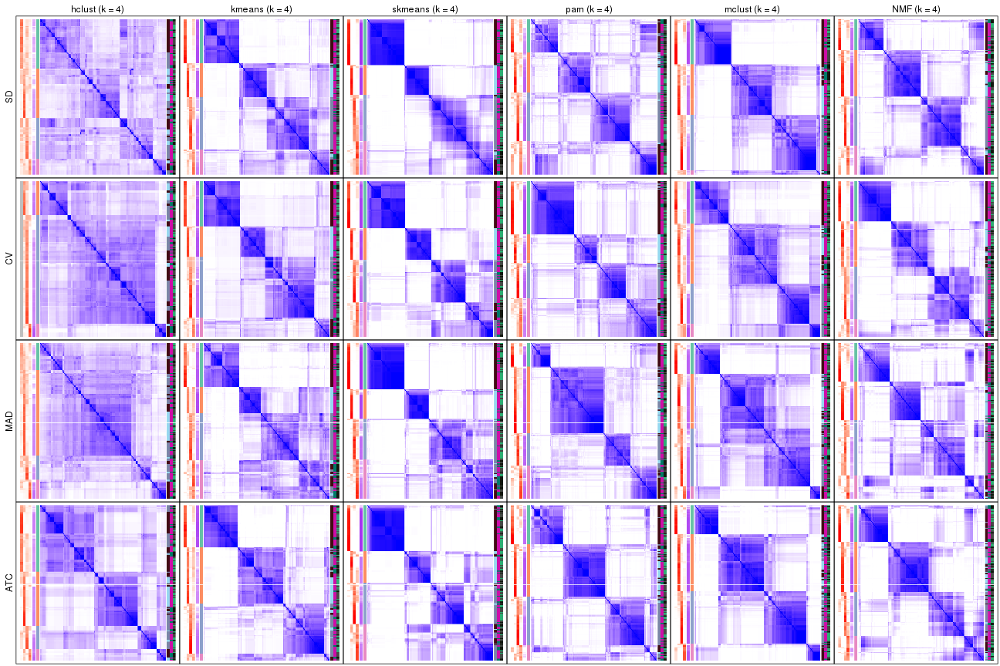</p>

</div>
<div id='tab-collect-consensus-heatmap-4'>
<pre><code class="r">collect_plots(res_list, k = 5, fun = consensus_heatmap, mc.cores = 4)
</code></pre>

<p>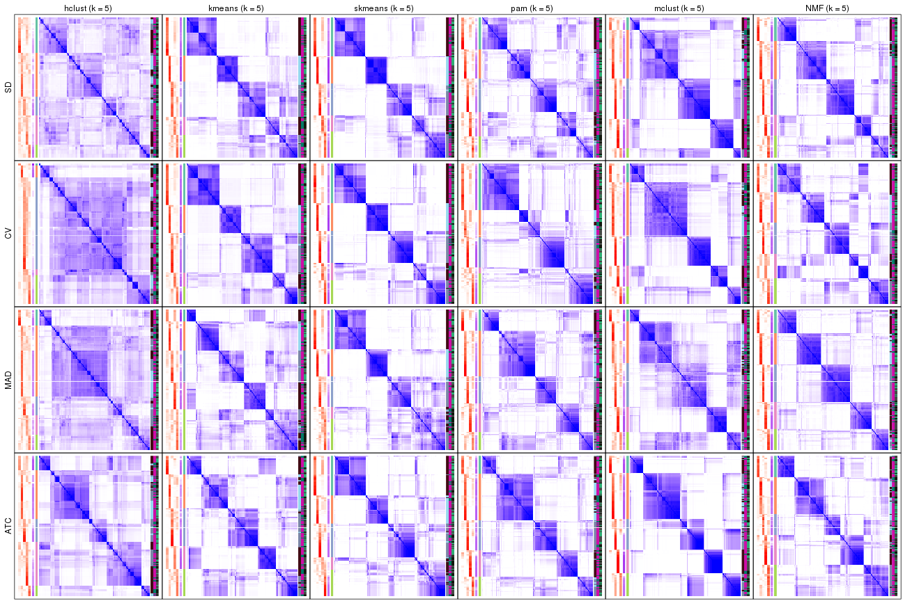</p>

</div>
<div id='tab-collect-consensus-heatmap-5'>
<pre><code class="r">collect_plots(res_list, k = 6, fun = consensus_heatmap, mc.cores = 4)
</code></pre>

<p>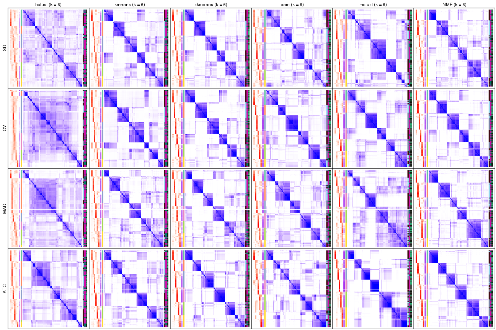</p>

</div>
</div>


### Membership heatmap

Membership heatmaps for all methods. ([What is a membership heatmap?](http://bioconductor.org/packages/devel/bioc/vignettes/cola/inst/doc/cola.html#toc_12))


<script>
$( function() {
	$( '#tabs-collect-membership-heatmap' ).tabs();
} );
</script>
<div id='tabs-collect-membership-heatmap'>
<ul>
<li><a href='#tab-collect-membership-heatmap-1'>k = 2</a></li>
<li><a href='#tab-collect-membership-heatmap-2'>k = 3</a></li>
<li><a href='#tab-collect-membership-heatmap-3'>k = 4</a></li>
<li><a href='#tab-collect-membership-heatmap-4'>k = 5</a></li>
<li><a href='#tab-collect-membership-heatmap-5'>k = 6</a></li>
</ul>
<div id='tab-collect-membership-heatmap-1'>
<pre><code class="r">collect_plots(res_list, k = 2, fun = membership_heatmap, mc.cores = 4)
</code></pre>

<p>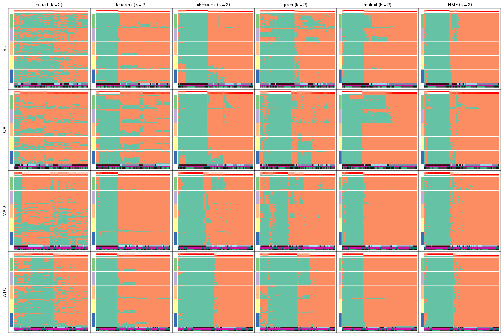</p>

</div>
<div id='tab-collect-membership-heatmap-2'>
<pre><code class="r">collect_plots(res_list, k = 3, fun = membership_heatmap, mc.cores = 4)
</code></pre>

<p>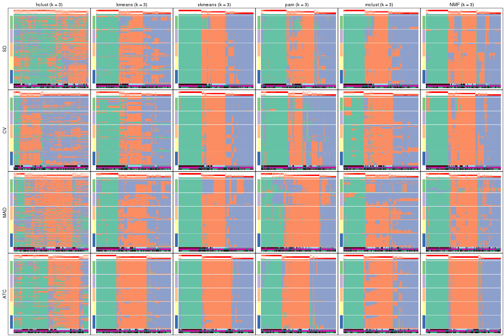</p>

</div>
<div id='tab-collect-membership-heatmap-3'>
<pre><code class="r">collect_plots(res_list, k = 4, fun = membership_heatmap, mc.cores = 4)
</code></pre>

<p>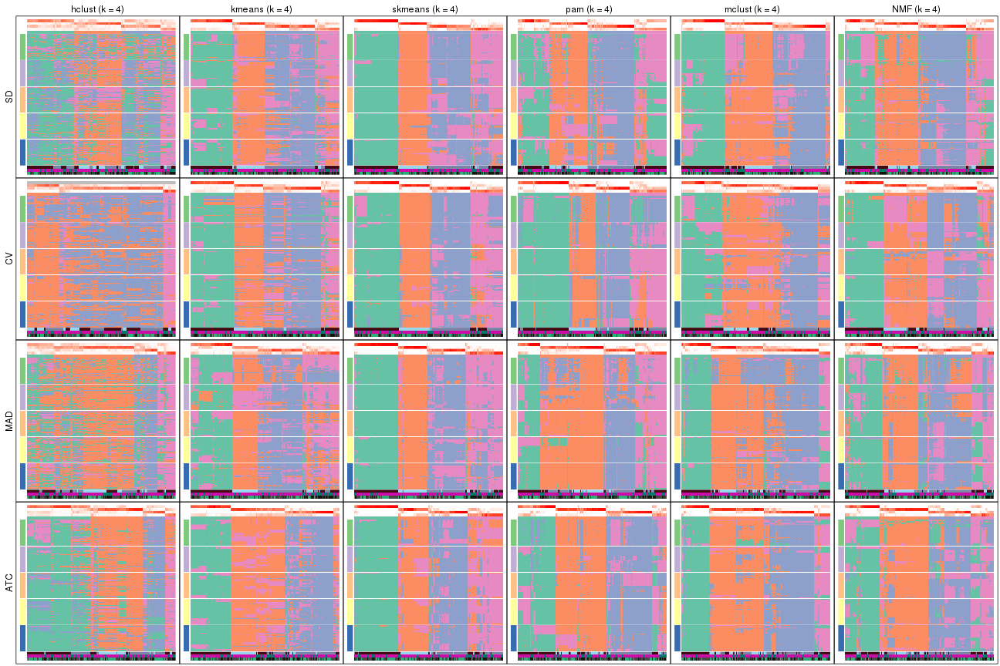</p>

</div>
<div id='tab-collect-membership-heatmap-4'>
<pre><code class="r">collect_plots(res_list, k = 5, fun = membership_heatmap, mc.cores = 4)
</code></pre>

<p>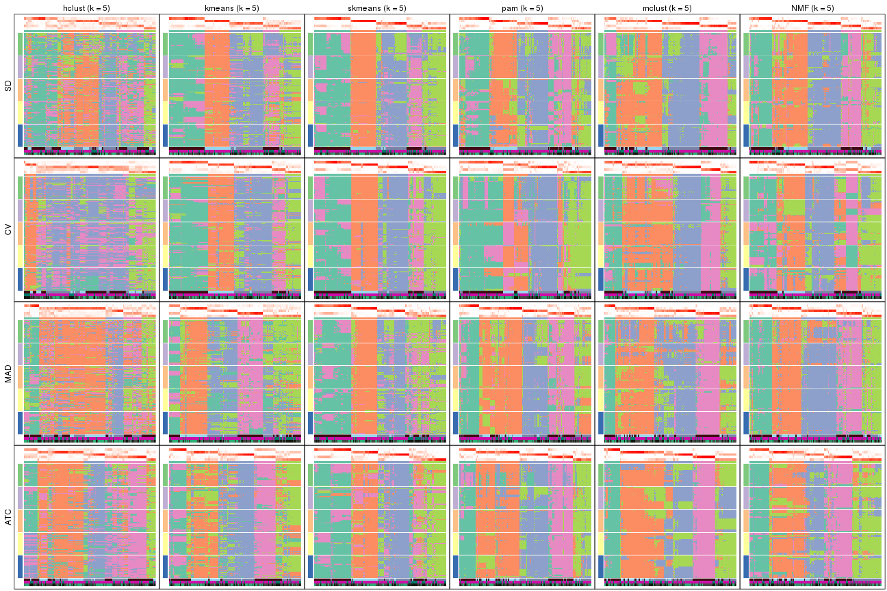</p>

</div>
<div id='tab-collect-membership-heatmap-5'>
<pre><code class="r">collect_plots(res_list, k = 6, fun = membership_heatmap, mc.cores = 4)
</code></pre>

<p>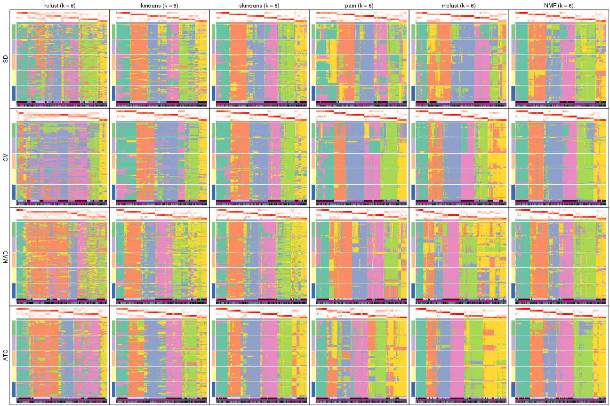</p>

</div>
</div>


### Signature heatmap

Signature heatmaps for all methods. ([What is a signature heatmap?](http://bioconductor.org/packages/devel/bioc/vignettes/cola/inst/doc/cola.html#toc_22))


Note in following heatmaps, rows are scaled.


<script>
$( function() {
	$( '#tabs-collect-get-signatures' ).tabs();
} );
</script>
<div id='tabs-collect-get-signatures'>
<ul>
<li><a href='#tab-collect-get-signatures-1'>k = 2</a></li>
<li><a href='#tab-collect-get-signatures-2'>k = 3</a></li>
<li><a href='#tab-collect-get-signatures-3'>k = 4</a></li>
<li><a href='#tab-collect-get-signatures-4'>k = 5</a></li>
<li><a href='#tab-collect-get-signatures-5'>k = 6</a></li>
</ul>
<div id='tab-collect-get-signatures-1'>
<pre><code class="r">collect_plots(res_list, k = 2, fun = get_signatures, mc.cores = 4)
</code></pre>

<p>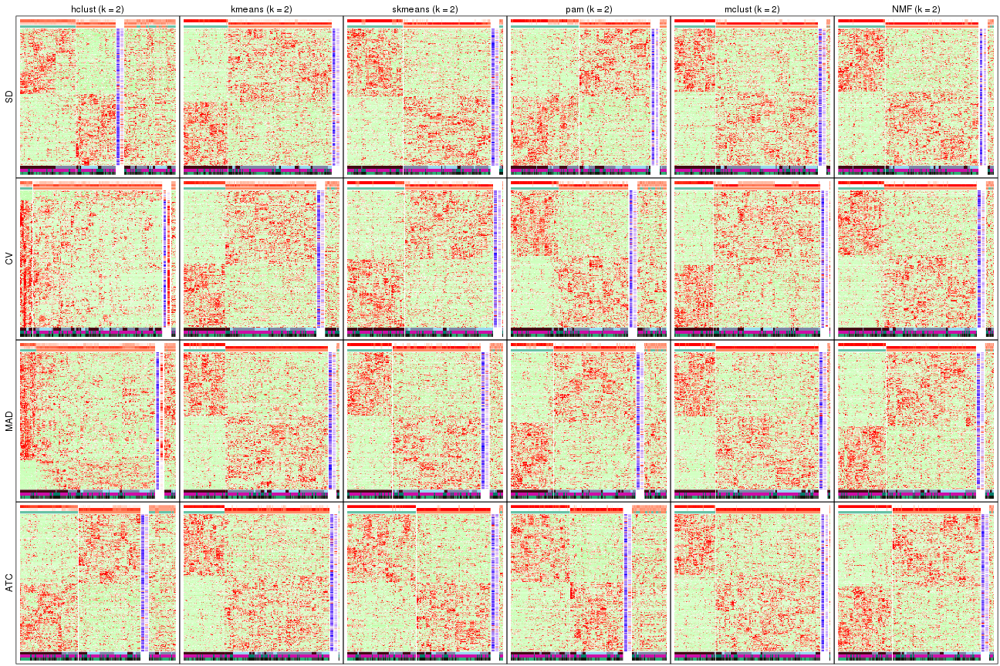</p>

</div>
<div id='tab-collect-get-signatures-2'>
<pre><code class="r">collect_plots(res_list, k = 3, fun = get_signatures, mc.cores = 4)
</code></pre>

<p>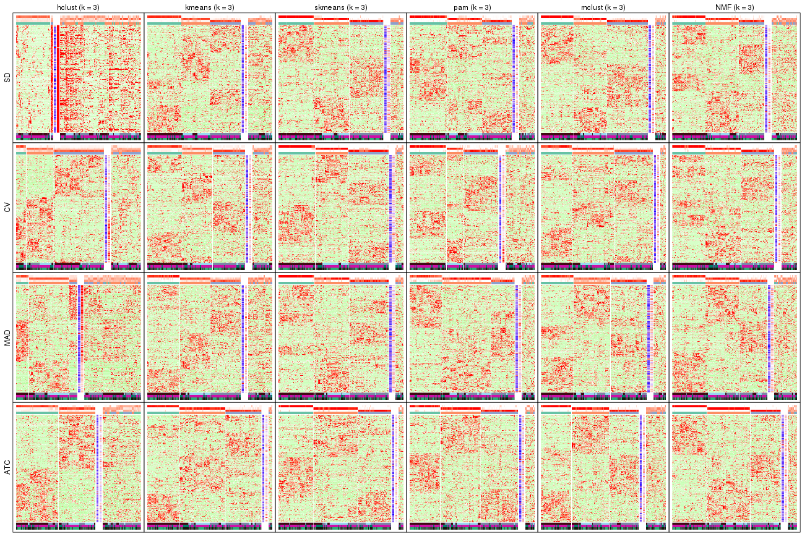</p>

</div>
<div id='tab-collect-get-signatures-3'>
<pre><code class="r">collect_plots(res_list, k = 4, fun = get_signatures, mc.cores = 4)
</code></pre>

<p>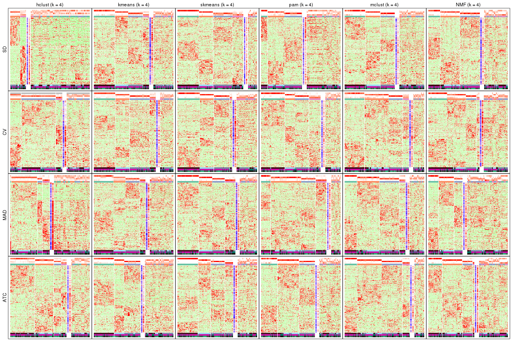</p>

</div>
<div id='tab-collect-get-signatures-4'>
<pre><code class="r">collect_plots(res_list, k = 5, fun = get_signatures, mc.cores = 4)
</code></pre>

<p>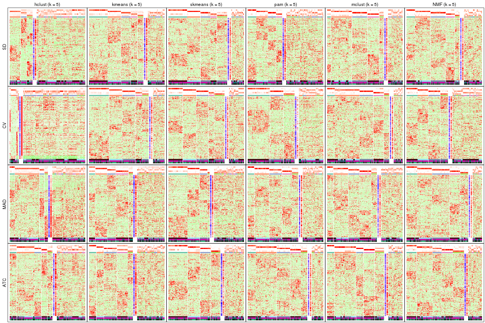</p>

</div>
<div id='tab-collect-get-signatures-5'>
<pre><code class="r">collect_plots(res_list, k = 6, fun = get_signatures, mc.cores = 4)
</code></pre>

<p>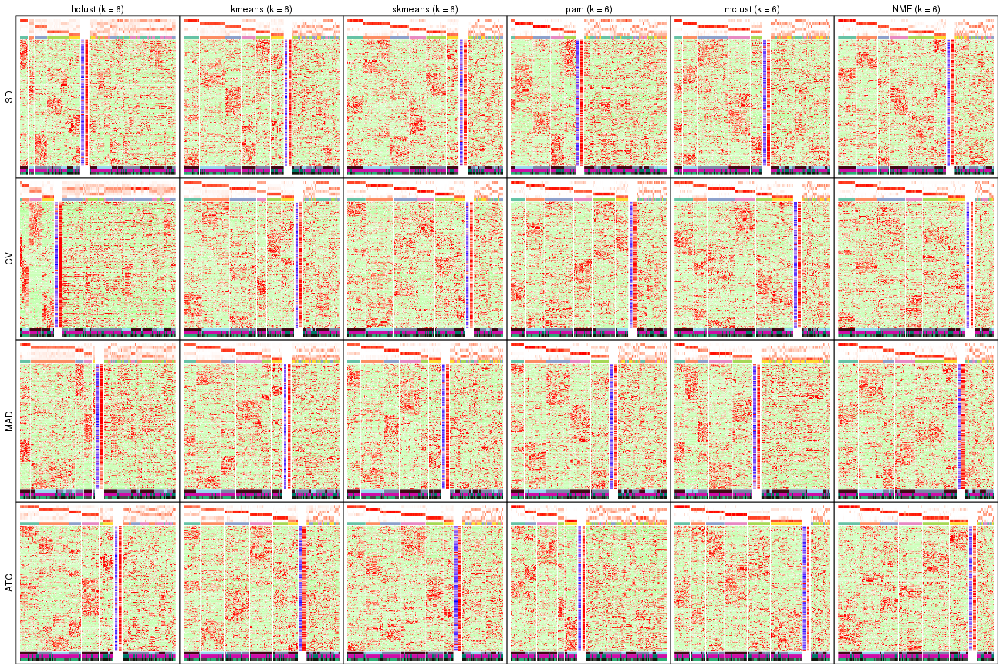</p>

</div>
</div>


### Statistics table

The statistics used for measuring the stability of consensus partitioning.
([How are they
defined?](http://bioconductor.org/packages/devel/bioc/vignettes/cola/inst/doc/cola.html#toc_13))


<script>
$( function() {
	$( '#tabs-get-stats-from-consensus-partition-list' ).tabs();
} );
</script>
<div id='tabs-get-stats-from-consensus-partition-list'>
<ul>
<li><a href='#tab-get-stats-from-consensus-partition-list-1'>k = 2</a></li>
<li><a href='#tab-get-stats-from-consensus-partition-list-2'>k = 3</a></li>
<li><a href='#tab-get-stats-from-consensus-partition-list-3'>k = 4</a></li>
<li><a href='#tab-get-stats-from-consensus-partition-list-4'>k = 5</a></li>
<li><a href='#tab-get-stats-from-consensus-partition-list-5'>k = 6</a></li>
</ul>
<div id='tab-get-stats-from-consensus-partition-list-1'>
<pre><code class="r">get_stats(res_list, k = 2)
</code></pre>

<pre><code>#&gt;             k  1-PAC mean_silhouette concordance area_increased  Rand Jaccard
#&gt; SD:NMF      2 0.8066           0.902       0.958          0.461 0.550   0.550
#&gt; CV:NMF      2 0.7154           0.877       0.942          0.460 0.550   0.550
#&gt; MAD:NMF     2 0.8616           0.904       0.956          0.465 0.543   0.543
#&gt; ATC:NMF     2 0.8989           0.926       0.968          0.478 0.523   0.523
#&gt; SD:skmeans  2 0.5981           0.868       0.931          0.485 0.516   0.516
#&gt; CV:skmeans  2 0.5383           0.886       0.933          0.489 0.521   0.521
#&gt; MAD:skmeans 2 0.5420           0.814       0.913          0.475 0.550   0.550
#&gt; ATC:skmeans 2 0.9496           0.940       0.975          0.502 0.498   0.498
#&gt; SD:mclust   2 0.7247           0.890       0.942          0.432 0.586   0.586
#&gt; CV:mclust   2 0.5056           0.819       0.867          0.425 0.608   0.608
#&gt; MAD:mclust  2 0.9083           0.942       0.973          0.402 0.592   0.592
#&gt; ATC:mclust  2 1.0000           0.962       0.978          0.407 0.597   0.597
#&gt; SD:kmeans   2 0.6231           0.921       0.932          0.440 0.576   0.576
#&gt; CV:kmeans   2 0.1829           0.682       0.803          0.447 0.554   0.554
#&gt; MAD:kmeans  2 0.9644           0.940       0.963          0.412 0.581   0.581
#&gt; ATC:kmeans  2 0.6834           0.915       0.941          0.430 0.592   0.592
#&gt; SD:pam      2 0.2563           0.784       0.854          0.493 0.500   0.500
#&gt; CV:pam      2 0.3009           0.652       0.839          0.486 0.511   0.511
#&gt; MAD:pam     2 0.3851           0.717       0.857          0.468 0.529   0.529
#&gt; ATC:pam     2 0.5367           0.675       0.873          0.473 0.497   0.497
#&gt; SD:hclust   2 0.0240           0.493       0.683          0.435 0.501   0.501
#&gt; CV:hclust   2 0.0563           0.707       0.792          0.317 0.845   0.845
#&gt; MAD:hclust  2 0.0469           0.689       0.754          0.363 0.796   0.796
#&gt; ATC:hclust  2 0.1550           0.666       0.813          0.460 0.500   0.500
</code></pre>

</div>
<div id='tab-get-stats-from-consensus-partition-list-2'>
<pre><code class="r">get_stats(res_list, k = 3)
</code></pre>

<pre><code>#&gt;             k  1-PAC mean_silhouette concordance area_increased  Rand Jaccard
#&gt; SD:NMF      3 0.5732           0.665       0.847          0.442 0.732   0.534
#&gt; CV:NMF      3 0.6437           0.757       0.892          0.448 0.711   0.506
#&gt; MAD:NMF     3 0.5344           0.683       0.837          0.424 0.738   0.539
#&gt; ATC:NMF     3 0.9049           0.890       0.956          0.391 0.739   0.533
#&gt; SD:skmeans  3 0.7203           0.833       0.920          0.373 0.707   0.486
#&gt; CV:skmeans  3 0.7887           0.845       0.928          0.369 0.730   0.519
#&gt; MAD:skmeans 3 0.6520           0.787       0.884          0.402 0.734   0.537
#&gt; ATC:skmeans 3 0.8575           0.886       0.950          0.326 0.751   0.540
#&gt; SD:mclust   3 0.6400           0.789       0.893          0.517 0.743   0.565
#&gt; CV:mclust   3 0.4616           0.801       0.864          0.502 0.722   0.544
#&gt; MAD:mclust  3 0.4435           0.686       0.768          0.511 0.736   0.557
#&gt; ATC:mclust  3 0.6534           0.746       0.886          0.611 0.731   0.552
#&gt; SD:kmeans   3 0.5109           0.677       0.811          0.483 0.756   0.576
#&gt; CV:kmeans   3 0.3240           0.670       0.782          0.413 0.753   0.565
#&gt; MAD:kmeans  3 0.4275           0.623       0.758          0.550 0.752   0.573
#&gt; ATC:kmeans  3 0.7763           0.884       0.925          0.526 0.731   0.552
#&gt; SD:pam      3 0.5522           0.726       0.862          0.338 0.735   0.518
#&gt; CV:pam      3 0.5256           0.638       0.829          0.313 0.791   0.614
#&gt; MAD:pam     3 0.4740           0.703       0.821          0.342 0.773   0.593
#&gt; ATC:pam     3 0.7306           0.817       0.917          0.393 0.724   0.501
#&gt; SD:hclust   3 0.0203           0.347       0.589          0.375 0.906   0.826
#&gt; CV:hclust   3 0.1053           0.553       0.693          0.637 0.648   0.584
#&gt; MAD:hclust  3 0.0521           0.379       0.634          0.573 0.663   0.580
#&gt; ATC:hclust  3 0.2268           0.512       0.734          0.281 0.880   0.763
</code></pre>

</div>
<div id='tab-get-stats-from-consensus-partition-list-3'>
<pre><code class="r">get_stats(res_list, k = 4)
</code></pre>

<pre><code>#&gt;             k 1-PAC mean_silhouette concordance area_increased  Rand Jaccard
#&gt; SD:NMF      4 0.586           0.568       0.783         0.1150 0.801   0.497
#&gt; CV:NMF      4 0.631           0.579       0.737         0.1228 0.864   0.633
#&gt; MAD:NMF     4 0.523           0.442       0.715         0.1189 0.774   0.452
#&gt; ATC:NMF     4 0.605           0.559       0.760         0.1190 0.821   0.538
#&gt; SD:skmeans  4 0.737           0.707       0.809         0.1252 0.851   0.596
#&gt; CV:skmeans  4 0.679           0.698       0.836         0.1163 0.858   0.608
#&gt; MAD:skmeans 4 0.727           0.693       0.821         0.1210 0.851   0.593
#&gt; ATC:skmeans 4 0.686           0.646       0.811         0.1238 0.859   0.612
#&gt; SD:mclust   4 0.599           0.523       0.787         0.0940 0.946   0.845
#&gt; CV:mclust   4 0.508           0.630       0.756         0.1043 0.941   0.827
#&gt; MAD:mclust  4 0.459           0.627       0.791         0.1223 0.896   0.721
#&gt; ATC:mclust  4 0.649           0.729       0.854         0.0827 0.905   0.737
#&gt; SD:kmeans   4 0.573           0.610       0.762         0.1310 0.895   0.700
#&gt; CV:kmeans   4 0.567           0.668       0.771         0.1374 0.931   0.799
#&gt; MAD:kmeans  4 0.479           0.561       0.671         0.1364 0.858   0.612
#&gt; ATC:kmeans  4 0.615           0.550       0.770         0.1203 0.969   0.909
#&gt; SD:pam      4 0.514           0.476       0.695         0.1245 0.808   0.506
#&gt; CV:pam      4 0.551           0.642       0.779         0.1308 0.810   0.532
#&gt; MAD:pam     4 0.521           0.683       0.808         0.1402 0.874   0.677
#&gt; ATC:pam     4 0.616           0.576       0.767         0.1084 0.908   0.739
#&gt; SD:hclust   4 0.123           0.318       0.525         0.1594 0.756   0.512
#&gt; CV:hclust   4 0.163           0.513       0.655         0.1790 0.906   0.833
#&gt; MAD:hclust  4 0.170           0.429       0.629         0.1504 0.814   0.637
#&gt; ATC:hclust  4 0.290           0.513       0.704         0.1510 0.907   0.773
</code></pre>

</div>
<div id='tab-get-stats-from-consensus-partition-list-4'>
<pre><code class="r">get_stats(res_list, k = 5)
</code></pre>

<pre><code>#&gt;             k 1-PAC mean_silhouette concordance area_increased  Rand Jaccard
#&gt; SD:NMF      5 0.659           0.613       0.792         0.0691 0.875   0.579
#&gt; CV:NMF      5 0.625           0.454       0.650         0.0626 0.802   0.408
#&gt; MAD:NMF     5 0.681           0.718       0.825         0.0704 0.853   0.524
#&gt; ATC:NMF     5 0.651           0.606       0.759         0.0701 0.813   0.428
#&gt; SD:skmeans  5 0.704           0.631       0.779         0.0656 0.884   0.600
#&gt; CV:skmeans  5 0.725           0.656       0.807         0.0685 0.916   0.692
#&gt; MAD:skmeans 5 0.650           0.481       0.709         0.0650 0.875   0.578
#&gt; ATC:skmeans 5 0.666           0.528       0.721         0.0629 0.937   0.760
#&gt; SD:mclust   5 0.633           0.554       0.747         0.0679 0.903   0.709
#&gt; CV:mclust   5 0.640           0.680       0.795         0.0704 0.915   0.726
#&gt; MAD:mclust  5 0.506           0.535       0.731         0.0944 0.887   0.655
#&gt; ATC:mclust  5 0.720           0.659       0.776         0.0906 0.895   0.661
#&gt; SD:kmeans   5 0.614           0.587       0.704         0.0686 0.886   0.611
#&gt; CV:kmeans   5 0.652           0.660       0.771         0.0773 0.919   0.728
#&gt; MAD:kmeans  5 0.577           0.515       0.658         0.0797 0.863   0.551
#&gt; ATC:kmeans  5 0.621           0.516       0.685         0.0671 0.840   0.526
#&gt; SD:pam      5 0.584           0.445       0.713         0.0739 0.871   0.557
#&gt; CV:pam      5 0.559           0.552       0.725         0.0738 0.937   0.775
#&gt; MAD:pam     5 0.582           0.533       0.742         0.0887 0.895   0.659
#&gt; ATC:pam     5 0.629           0.626       0.779         0.0733 0.889   0.639
#&gt; SD:hclust   5 0.284           0.324       0.542         0.0911 0.831   0.499
#&gt; CV:hclust   5 0.189           0.149       0.553         0.0885 0.939   0.888
#&gt; MAD:hclust  5 0.277           0.412       0.599         0.0905 0.916   0.781
#&gt; ATC:hclust  5 0.396           0.465       0.661         0.1006 0.922   0.765
</code></pre>

</div>
<div id='tab-get-stats-from-consensus-partition-list-5'>
<pre><code class="r">get_stats(res_list, k = 6)
</code></pre>

<pre><code>#&gt;             k 1-PAC mean_silhouette concordance area_increased  Rand Jaccard
#&gt; SD:NMF      6 0.680           0.585       0.736         0.0482 0.887   0.539
#&gt; CV:NMF      6 0.769           0.706       0.833         0.0455 0.911   0.606
#&gt; MAD:NMF     6 0.711           0.650       0.805         0.0441 0.946   0.750
#&gt; ATC:NMF     6 0.785           0.758       0.843         0.0470 0.901   0.579
#&gt; SD:skmeans  6 0.720           0.619       0.779         0.0435 0.915   0.629
#&gt; CV:skmeans  6 0.745           0.667       0.806         0.0416 0.915   0.632
#&gt; MAD:skmeans 6 0.685           0.531       0.732         0.0456 0.879   0.518
#&gt; ATC:skmeans 6 0.744           0.618       0.801         0.0469 0.884   0.534
#&gt; SD:mclust   6 0.655           0.502       0.711         0.0550 0.913   0.673
#&gt; CV:mclust   6 0.696           0.628       0.794         0.0794 0.895   0.591
#&gt; MAD:mclust  6 0.516           0.472       0.668         0.0523 0.850   0.489
#&gt; ATC:mclust  6 0.753           0.722       0.846         0.0607 0.906   0.617
#&gt; SD:kmeans   6 0.669           0.558       0.707         0.0431 0.920   0.651
#&gt; CV:kmeans   6 0.715           0.605       0.735         0.0417 0.945   0.765
#&gt; MAD:kmeans  6 0.644           0.556       0.709         0.0477 0.905   0.606
#&gt; ATC:kmeans  6 0.662           0.598       0.737         0.0455 0.926   0.673
#&gt; SD:pam      6 0.655           0.438       0.651         0.0407 0.925   0.669
#&gt; CV:pam      6 0.697           0.643       0.788         0.0564 0.878   0.539
#&gt; MAD:pam     6 0.649           0.554       0.738         0.0494 0.927   0.688
#&gt; ATC:pam     6 0.664           0.442       0.684         0.0512 0.896   0.583
#&gt; SD:hclust   6 0.387           0.363       0.543         0.0538 0.890   0.571
#&gt; CV:hclust   6 0.266           0.303       0.554         0.0769 0.802   0.598
#&gt; MAD:hclust  6 0.350           0.360       0.580         0.0634 0.914   0.746
#&gt; ATC:hclust  6 0.493           0.482       0.687         0.0503 0.957   0.837
</code></pre>

</div>
</div>

Following heatmap plots the partition for each combination of methods and the
lightness correspond to the silhouette scores for samples in each method. On
top the consensus subgroup is inferred from all methods by taking the mean
silhouette scores as weight.


<script>
$( function() {
	$( '#tabs-collect-stats-from-consensus-partition-list' ).tabs();
} );
</script>
<div id='tabs-collect-stats-from-consensus-partition-list'>
<ul>
<li><a href='#tab-collect-stats-from-consensus-partition-list-1'>k = 2</a></li>
<li><a href='#tab-collect-stats-from-consensus-partition-list-2'>k = 3</a></li>
<li><a href='#tab-collect-stats-from-consensus-partition-list-3'>k = 4</a></li>
<li><a href='#tab-collect-stats-from-consensus-partition-list-4'>k = 5</a></li>
<li><a href='#tab-collect-stats-from-consensus-partition-list-5'>k = 6</a></li>
</ul>
<div id='tab-collect-stats-from-consensus-partition-list-1'>
<pre><code class="r">collect_stats(res_list, k = 2)
</code></pre>

<p>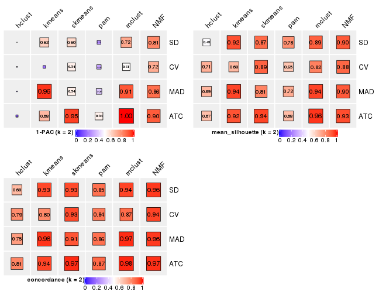</p>

</div>
<div id='tab-collect-stats-from-consensus-partition-list-2'>
<pre><code class="r">collect_stats(res_list, k = 3)
</code></pre>

<p>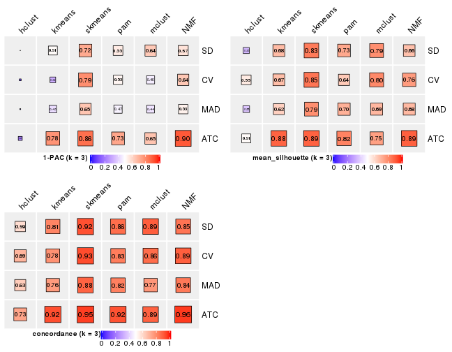</p>

</div>
<div id='tab-collect-stats-from-consensus-partition-list-3'>
<pre><code class="r">collect_stats(res_list, k = 4)
</code></pre>

<p>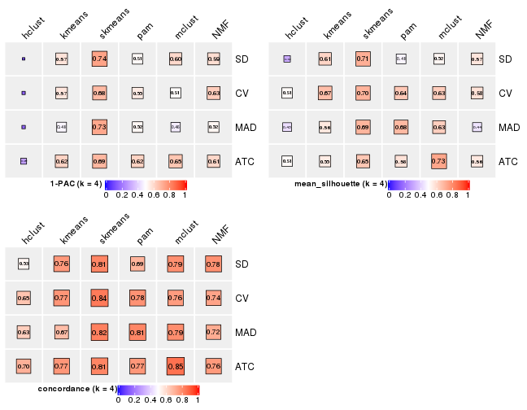</p>

</div>
<div id='tab-collect-stats-from-consensus-partition-list-4'>
<pre><code class="r">collect_stats(res_list, k = 5)
</code></pre>

<p>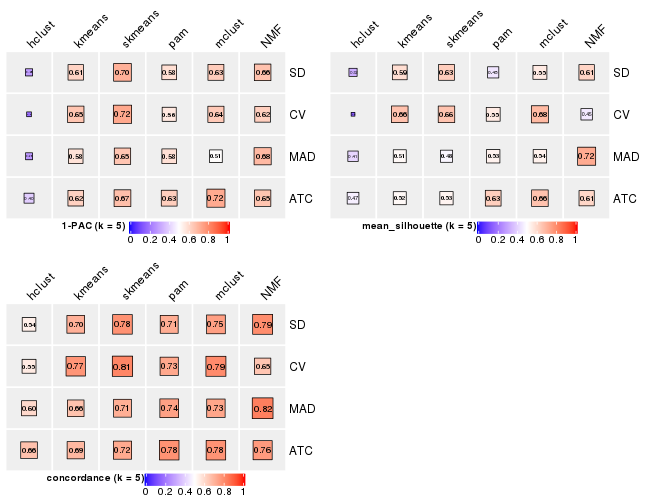</p>

</div>
<div id='tab-collect-stats-from-consensus-partition-list-5'>
<pre><code class="r">collect_stats(res_list, k = 6)
</code></pre>

<p>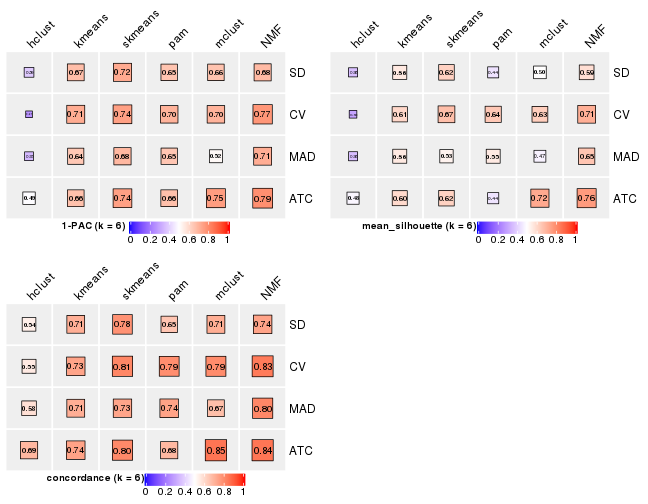</p>

</div>
</div>

### Partition from all methods


Collect partitions from all methods:


<script>
$( function() {
	$( '#tabs-collect-classes-from-consensus-partition-list' ).tabs();
} );
</script>
<div id='tabs-collect-classes-from-consensus-partition-list'>
<ul>
<li><a href='#tab-collect-classes-from-consensus-partition-list-1'>k = 2</a></li>
<li><a href='#tab-collect-classes-from-consensus-partition-list-2'>k = 3</a></li>
<li><a href='#tab-collect-classes-from-consensus-partition-list-3'>k = 4</a></li>
<li><a href='#tab-collect-classes-from-consensus-partition-list-4'>k = 5</a></li>
<li><a href='#tab-collect-classes-from-consensus-partition-list-5'>k = 6</a></li>
</ul>
<div id='tab-collect-classes-from-consensus-partition-list-1'>
<pre><code class="r">collect_classes(res_list, k = 2)
</code></pre>

<p>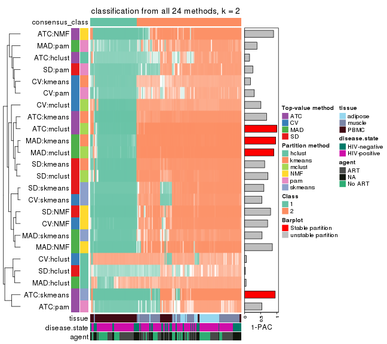</p>

</div>
<div id='tab-collect-classes-from-consensus-partition-list-2'>
<pre><code class="r">collect_classes(res_list, k = 3)
</code></pre>

<p>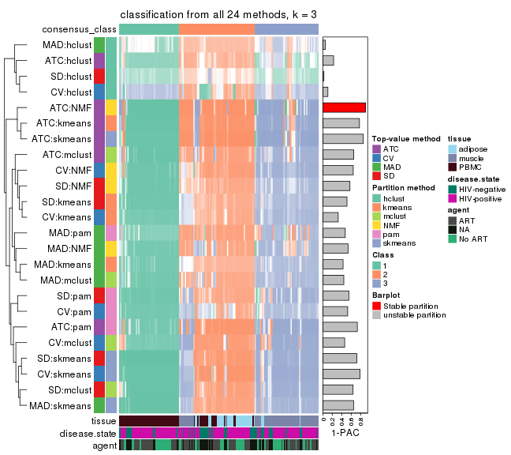</p>

</div>
<div id='tab-collect-classes-from-consensus-partition-list-3'>
<pre><code class="r">collect_classes(res_list, k = 4)
</code></pre>

<p>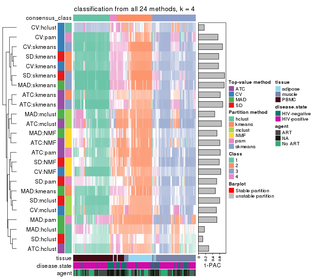</p>

</div>
<div id='tab-collect-classes-from-consensus-partition-list-4'>
<pre><code class="r">collect_classes(res_list, k = 5)
</code></pre>

<p>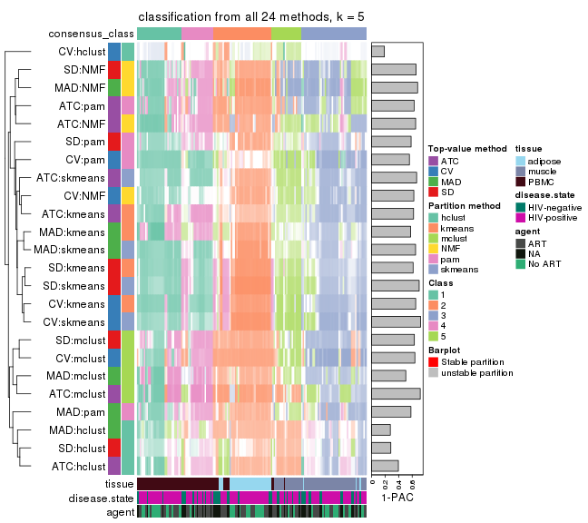</p>

</div>
<div id='tab-collect-classes-from-consensus-partition-list-5'>
<pre><code class="r">collect_classes(res_list, k = 6)
</code></pre>

<p>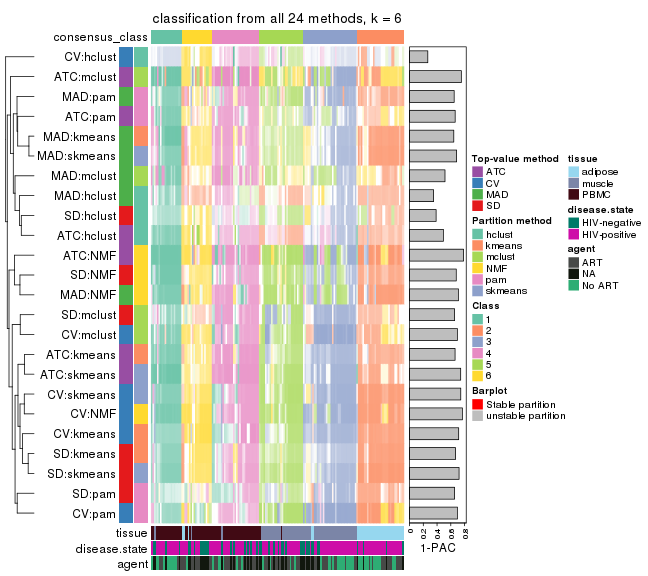</p>

</div>
</div>


### Top rows overlap


Overlap of top rows from different top-row methods:


<script>
$( function() {
	$( '#tabs-top-rows-overlap-by-euler' ).tabs();
} );
</script>
<div id='tabs-top-rows-overlap-by-euler'>
<ul>
<li><a href='#tab-top-rows-overlap-by-euler-1'>top_n = 454</a></li>
<li><a href='#tab-top-rows-overlap-by-euler-2'>top_n = 908</a></li>
<li><a href='#tab-top-rows-overlap-by-euler-3'>top_n = 1361</a></li>
<li><a href='#tab-top-rows-overlap-by-euler-4'>top_n = 1814</a></li>
<li><a href='#tab-top-rows-overlap-by-euler-5'>top_n = 2268</a></li>
</ul>
<div id='tab-top-rows-overlap-by-euler-1'>
<pre><code class="r">top_rows_overlap(res_list, top_n = 454, method = &quot;euler&quot;)
</code></pre>

<p>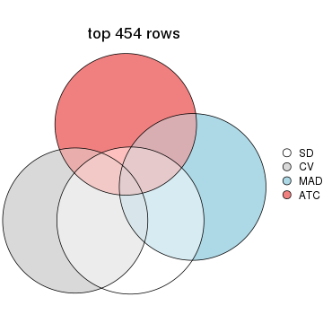</p>

</div>
<div id='tab-top-rows-overlap-by-euler-2'>
<pre><code class="r">top_rows_overlap(res_list, top_n = 908, method = &quot;euler&quot;)
</code></pre>

<p>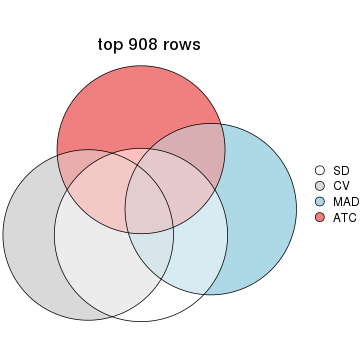</p>

</div>
<div id='tab-top-rows-overlap-by-euler-3'>
<pre><code class="r">top_rows_overlap(res_list, top_n = 1361, method = &quot;euler&quot;)
</code></pre>

<p>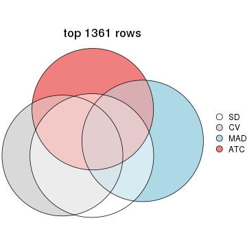</p>

</div>
<div id='tab-top-rows-overlap-by-euler-4'>
<pre><code class="r">top_rows_overlap(res_list, top_n = 1814, method = &quot;euler&quot;)
</code></pre>

<p>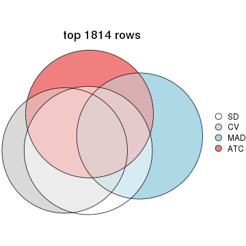</p>

</div>
<div id='tab-top-rows-overlap-by-euler-5'>
<pre><code class="r">top_rows_overlap(res_list, top_n = 2268, method = &quot;euler&quot;)
</code></pre>

<p>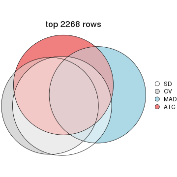</p>

</div>
</div>

Also visualize the correspondance of rankings between different top-row methods:


<script>
$( function() {
	$( '#tabs-top-rows-overlap-by-correspondance' ).tabs();
} );
</script>
<div id='tabs-top-rows-overlap-by-correspondance'>
<ul>
<li><a href='#tab-top-rows-overlap-by-correspondance-1'>top_n = 454</a></li>
<li><a href='#tab-top-rows-overlap-by-correspondance-2'>top_n = 908</a></li>
<li><a href='#tab-top-rows-overlap-by-correspondance-3'>top_n = 1361</a></li>
<li><a href='#tab-top-rows-overlap-by-correspondance-4'>top_n = 1814</a></li>
<li><a href='#tab-top-rows-overlap-by-correspondance-5'>top_n = 2268</a></li>
</ul>
<div id='tab-top-rows-overlap-by-correspondance-1'>
<pre><code class="r">top_rows_overlap(res_list, top_n = 454, method = &quot;correspondance&quot;)
</code></pre>

<p>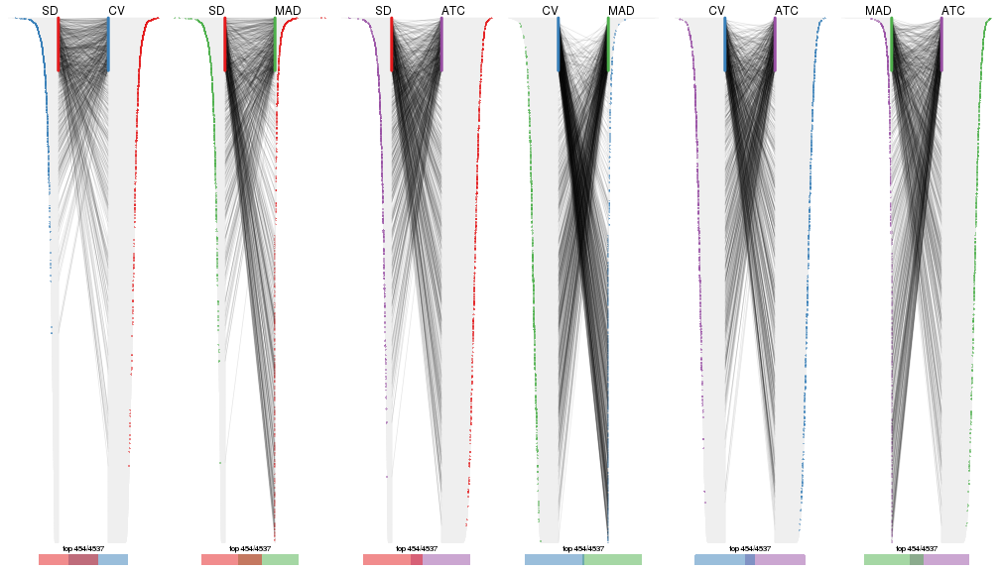</p>

</div>
<div id='tab-top-rows-overlap-by-correspondance-2'>
<pre><code class="r">top_rows_overlap(res_list, top_n = 908, method = &quot;correspondance&quot;)
</code></pre>

<p>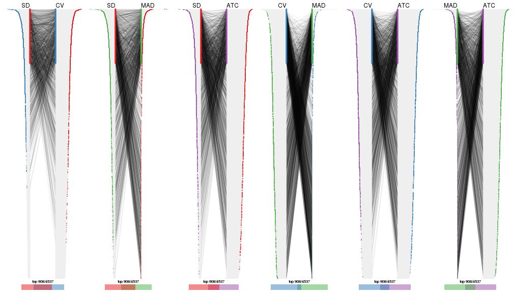</p>

</div>
<div id='tab-top-rows-overlap-by-correspondance-3'>
<pre><code class="r">top_rows_overlap(res_list, top_n = 1361, method = &quot;correspondance&quot;)
</code></pre>

<p>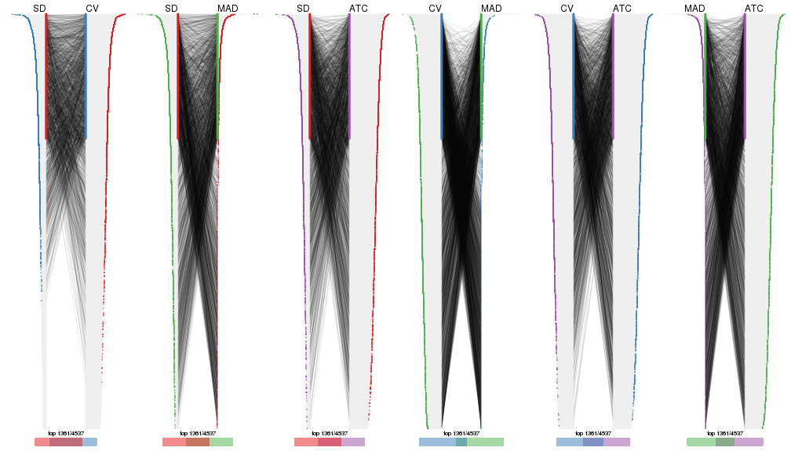</p>

</div>
<div id='tab-top-rows-overlap-by-correspondance-4'>
<pre><code class="r">top_rows_overlap(res_list, top_n = 1814, method = &quot;correspondance&quot;)
</code></pre>

<p>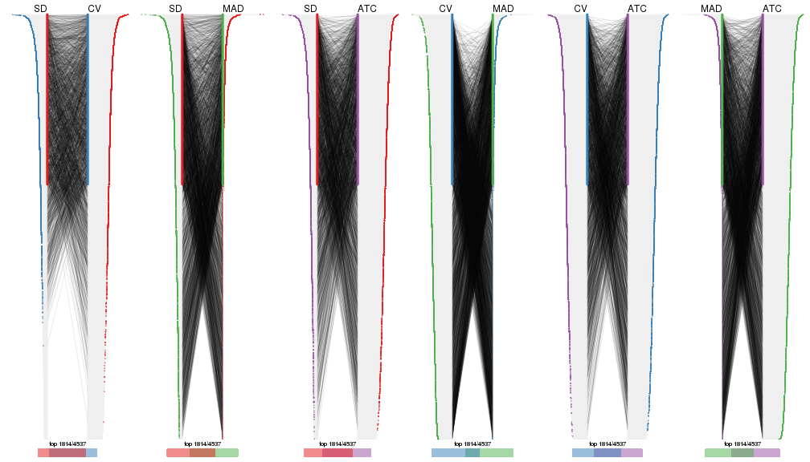</p>

</div>
<div id='tab-top-rows-overlap-by-correspondance-5'>
<pre><code class="r">top_rows_overlap(res_list, top_n = 2268, method = &quot;correspondance&quot;)
</code></pre>

<p>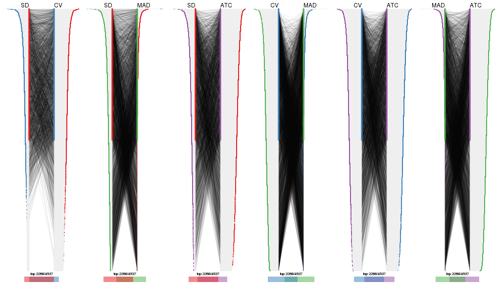</p>

</div>
</div>


Heatmaps of the top rows:


<script>
$( function() {
	$( '#tabs-top-rows-heatmap' ).tabs();
} );
</script>
<div id='tabs-top-rows-heatmap'>
<ul>
<li><a href='#tab-top-rows-heatmap-1'>top_n = 454</a></li>
<li><a href='#tab-top-rows-heatmap-2'>top_n = 908</a></li>
<li><a href='#tab-top-rows-heatmap-3'>top_n = 1361</a></li>
<li><a href='#tab-top-rows-heatmap-4'>top_n = 1814</a></li>
<li><a href='#tab-top-rows-heatmap-5'>top_n = 2268</a></li>
</ul>
<div id='tab-top-rows-heatmap-1'>
<pre><code class="r">top_rows_heatmap(res_list, top_n = 454)
</code></pre>

<p>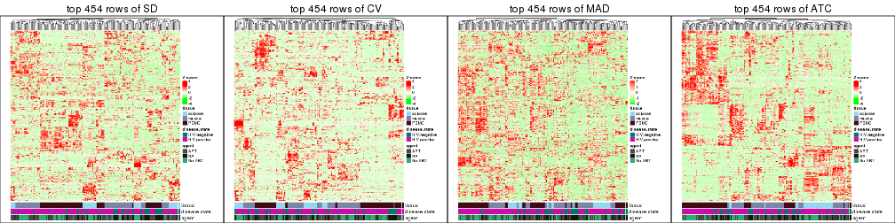</p>

</div>
<div id='tab-top-rows-heatmap-2'>
<pre><code class="r">top_rows_heatmap(res_list, top_n = 908)
</code></pre>

<p>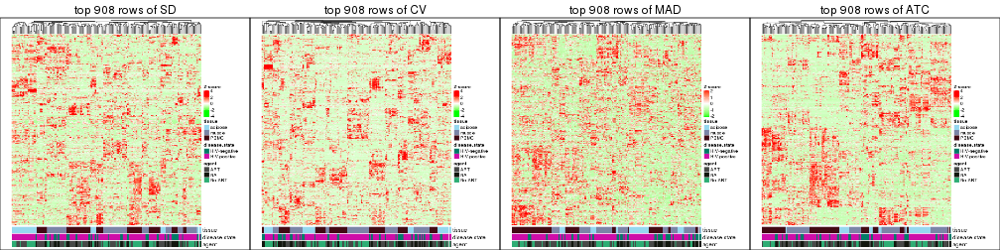</p>

</div>
<div id='tab-top-rows-heatmap-3'>
<pre><code class="r">top_rows_heatmap(res_list, top_n = 1361)
</code></pre>

<p>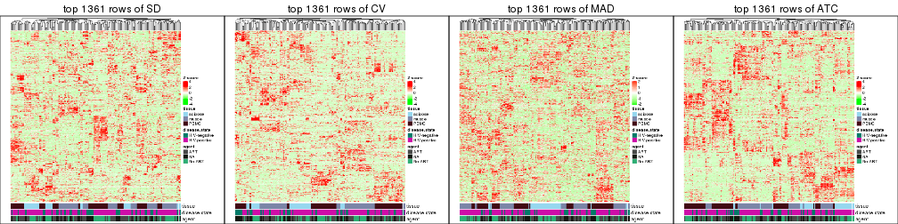</p>

</div>
<div id='tab-top-rows-heatmap-4'>
<pre><code class="r">top_rows_heatmap(res_list, top_n = 1814)
</code></pre>

<p>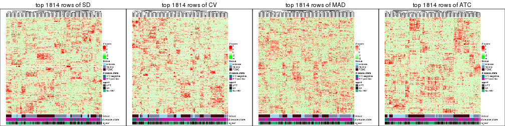</p>

</div>
<div id='tab-top-rows-heatmap-5'>
<pre><code class="r">top_rows_heatmap(res_list, top_n = 2268)
</code></pre>

<p>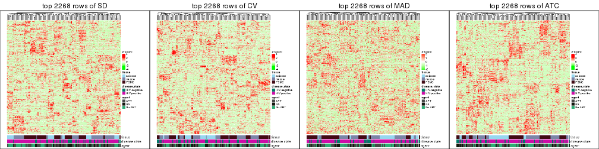</p>

</div>
</div>


### Test to known annotations


Test correlation between subgroups and known annotations. If the known
annotation is numeric, one-way ANOVA test is applied, and if the known
annotation is discrete, chi-squared contingency table test is applied.


<script>
$( function() {
	$( '#tabs-test-to-known-factors-from-consensus-partition-list' ).tabs();
} );
</script>
<div id='tabs-test-to-known-factors-from-consensus-partition-list'>
<ul>
<li><a href='#tab-test-to-known-factors-from-consensus-partition-list-1'>k = 2</a></li>
<li><a href='#tab-test-to-known-factors-from-consensus-partition-list-2'>k = 3</a></li>
<li><a href='#tab-test-to-known-factors-from-consensus-partition-list-3'>k = 4</a></li>
<li><a href='#tab-test-to-known-factors-from-consensus-partition-list-4'>k = 5</a></li>
<li><a href='#tab-test-to-known-factors-from-consensus-partition-list-5'>k = 6</a></li>
</ul>
<div id='tab-test-to-known-factors-from-consensus-partition-list-1'>
<pre><code class="r">test_to_known_factors(res_list, k = 2)
</code></pre>

<pre><code>#&gt;               n tissue(p) disease.state(p) agent(p) k
#&gt; SD:NMF      159  3.05e-23          0.74006  0.85578 2
#&gt; CV:NMF      157  1.94e-23          0.56581  0.73506 2
#&gt; MAD:NMF     156  2.47e-21          1.00000  0.98117 2
#&gt; ATC:NMF     161  1.71e-12          0.38803  0.55559 2
#&gt; SD:skmeans  162  1.43e-31          0.96598  0.81680 2
#&gt; CV:skmeans  165  2.25e-31          0.78253  0.75524 2
#&gt; MAD:skmeans 151  4.34e-26          0.34388  0.50729 2
#&gt; ATC:skmeans 162  6.17e-09          0.31434  0.41321 2
#&gt; SD:mclust   162  1.20e-22          0.11902  0.19465 2
#&gt; CV:mclust   165  2.86e-20          0.16191  0.25061 2
#&gt; MAD:mclust  163  2.98e-22          0.06605  0.11675 2
#&gt; ATC:mclust  165  4.98e-20          0.13906  0.22050 2
#&gt; SD:kmeans   166  1.10e-23          0.13103  0.21996 2
#&gt; CV:kmeans   150  6.28e-28          0.27762  0.42918 2
#&gt; MAD:kmeans  163  6.55e-23          0.05445  0.09399 2
#&gt; ATC:kmeans  165  5.52e-21          0.13906  0.22050 2
#&gt; SD:pam      158  1.05e-09          0.27317  0.31062 2
#&gt; CV:pam      133  1.94e-19          1.00000  0.95160 2
#&gt; MAD:pam     141  2.60e-17          1.00000  0.96370 2
#&gt; ATC:pam     127  5.46e-11          0.16389  0.24938 2
#&gt; SD:hclust   108  3.48e-09          0.00982  0.01214 2
#&gt; CV:hclust   161  5.09e-03          0.00731  0.00668 2
#&gt; MAD:hclust  153  8.76e-08          0.57298  0.10539 2
#&gt; ATC:hclust  136  1.97e-10          0.34372  0.51441 2
</code></pre>

</div>
<div id='tab-test-to-known-factors-from-consensus-partition-list-2'>
<pre><code class="r">test_to_known_factors(res_list, k = 3)
</code></pre>

<pre><code>#&gt;               n tissue(p) disease.state(p) agent(p) k
#&gt; SD:NMF      130  1.33e-34          0.20051   0.4494 3
#&gt; CV:NMF      144  2.23e-37          0.19944   0.4823 3
#&gt; MAD:NMF     134  4.04e-24          0.43920   0.7087 3
#&gt; ATC:NMF     153  5.97e-19          0.25085   0.2672 3
#&gt; SD:skmeans  148  7.19e-45          0.12185   0.3738 3
#&gt; CV:skmeans  155  1.30e-51          0.37855   0.6670 3
#&gt; MAD:skmeans 155  9.83e-47          0.18126   0.4446 3
#&gt; ATC:skmeans 159  1.25e-26          0.22798   0.1806 3
#&gt; SD:mclust   151  3.79e-46          0.46827   0.7377 3
#&gt; CV:mclust   158  9.32e-45          0.11760   0.3426 3
#&gt; MAD:mclust  149  2.78e-32          0.10576   0.3309 3
#&gt; ATC:mclust  138  1.91e-26          0.21382   0.4383 3
#&gt; SD:kmeans   132  4.69e-46          0.77559   0.9636 3
#&gt; CV:kmeans   138  1.70e-43          0.40550   0.7626 3
#&gt; MAD:kmeans  132  8.90e-44          0.13087   0.3786 3
#&gt; ATC:kmeans  161  1.05e-25          0.18521   0.1813 3
#&gt; SD:pam      144  4.40e-39          0.14088   0.3299 3
#&gt; CV:pam      125  7.45e-49          0.76007   0.2918 3
#&gt; MAD:pam     148  6.73e-26          0.89673   0.9056 3
#&gt; ATC:pam     153  1.12e-34          0.24242   0.4565 3
#&gt; SD:hclust    52  5.11e-12          0.94945   0.2473 3
#&gt; CV:hclust   124  3.71e-09          0.00722   0.0260 3
#&gt; MAD:hclust   86  3.22e-14          0.16160   0.0214 3
#&gt; ATC:hclust  112  9.62e-13          0.84749   0.9126 3
</code></pre>

</div>
<div id='tab-test-to-known-factors-from-consensus-partition-list-3'>
<pre><code class="r">test_to_known_factors(res_list, k = 4)
</code></pre>

<pre><code>#&gt;               n tissue(p) disease.state(p) agent(p) k
#&gt; SD:NMF      114  4.55e-34         3.79e-01 2.52e-01 4
#&gt; CV:NMF      113  4.21e-31         9.03e-03 5.10e-02 4
#&gt; MAD:NMF      76  4.36e-23         2.02e-01 4.33e-01 4
#&gt; ATC:NMF     102  2.52e-19         7.70e-02 1.78e-01 4
#&gt; SD:skmeans  146  1.66e-52         4.30e-07 2.42e-06 4
#&gt; CV:skmeans  121  1.90e-48         4.76e-02 1.64e-01 4
#&gt; MAD:skmeans 128  1.64e-46         5.61e-07 4.24e-06 4
#&gt; ATC:skmeans 123  2.10e-45         1.23e-01 2.09e-01 4
#&gt; SD:mclust   111  1.68e-44         7.19e-01 9.16e-01 4
#&gt; CV:mclust   142  3.37e-40         1.80e-01 2.99e-01 4
#&gt; MAD:mclust  134  9.74e-28         2.17e-01 2.98e-01 4
#&gt; ATC:mclust  144  1.34e-25         5.78e-01 3.32e-01 4
#&gt; SD:kmeans   122  7.85e-50         4.12e-03 1.35e-02 4
#&gt; CV:kmeans   137  3.02e-56         7.99e-03 1.89e-02 4
#&gt; MAD:kmeans  114  2.46e-45         2.29e-07 5.39e-06 4
#&gt; ATC:kmeans  104  9.64e-37         5.78e-01 7.31e-01 4
#&gt; SD:pam       91  3.17e-31         1.47e-01 4.76e-02 4
#&gt; CV:pam      132  9.92e-48         4.28e-01 9.06e-02 4
#&gt; MAD:pam     145  4.13e-24         1.65e-01 4.79e-03 4
#&gt; ATC:pam     119  1.59e-31         4.11e-01 7.55e-01 4
#&gt; SD:hclust    35  3.07e-01         2.74e-01 6.81e-02 4
#&gt; CV:hclust   115  1.20e-06         3.62e-03 7.82e-03 4
#&gt; MAD:hclust   87  7.59e-13         2.24e-01 1.08e-02 4
#&gt; ATC:hclust  125  3.50e-18         5.79e-02 2.50e-02 4
</code></pre>

</div>
<div id='tab-test-to-known-factors-from-consensus-partition-list-4'>
<pre><code class="r">test_to_known_factors(res_list, k = 5)
</code></pre>

<pre><code>#&gt;               n tissue(p) disease.state(p) agent(p) k
#&gt; SD:NMF      124  1.55e-37         6.30e-02 1.96e-03 5
#&gt; CV:NMF       97  3.59e-39         2.03e-01 1.17e-01 5
#&gt; MAD:NMF     144  3.24e-38         5.05e-01 2.70e-01 5
#&gt; ATC:NMF     134  1.00e-29         3.36e-01 2.39e-01 5
#&gt; SD:skmeans  137  1.39e-54         4.37e-03 5.97e-03 5
#&gt; CV:skmeans  131  1.36e-49         5.61e-03 5.96e-03 5
#&gt; MAD:skmeans  96  9.56e-39         5.25e-01 2.53e-01 5
#&gt; ATC:skmeans 121  1.12e-44         2.27e-01 2.43e-01 5
#&gt; SD:mclust   132  1.78e-35         3.53e-01 3.56e-01 5
#&gt; CV:mclust   145  1.17e-36         1.93e-01 5.51e-02 5
#&gt; MAD:mclust  116  2.56e-33         6.10e-01 1.85e-01 5
#&gt; ATC:mclust  133  1.31e-21         3.10e-01 4.08e-02 5
#&gt; SD:kmeans   127  2.44e-50         7.12e-04 1.55e-03 5
#&gt; CV:kmeans   139  1.24e-52         1.68e-02 4.65e-02 5
#&gt; MAD:kmeans  102  9.17e-40         1.49e-05 8.16e-05 5
#&gt; ATC:kmeans  102  1.14e-36         3.23e-01 4.72e-02 5
#&gt; SD:pam       81  1.03e-29         2.56e-03 9.54e-04 5
#&gt; CV:pam      109  5.37e-19         2.02e-01 9.60e-02 5
#&gt; MAD:pam     118  4.21e-36         3.99e-01 2.82e-03 5
#&gt; ATC:pam     139  2.27e-32         4.22e-01 2.02e-01 5
#&gt; SD:hclust    53  7.56e-03         2.68e-03 1.33e-03 5
#&gt; CV:hclust    21  1.38e-03         3.04e-01 6.44e-01 5
#&gt; MAD:hclust   89  1.56e-13         1.27e-01 3.35e-03 5
#&gt; ATC:hclust  100  3.38e-15         1.25e-01 1.19e-02 5
</code></pre>

</div>
<div id='tab-test-to-known-factors-from-consensus-partition-list-5'>
<pre><code class="r">test_to_known_factors(res_list, k = 6)
</code></pre>

<pre><code>#&gt;               n tissue(p) disease.state(p) agent(p) k
#&gt; SD:NMF      122  3.01e-44         0.017145 1.09e-03 6
#&gt; CV:NMF      144  3.69e-44         0.100569 4.98e-04 6
#&gt; MAD:NMF     134  2.16e-43         0.122702 4.33e-02 6
#&gt; ATC:NMF     147  7.25e-33         0.208489 5.54e-02 6
#&gt; SD:skmeans  126  2.06e-48         0.009638 6.13e-04 6
#&gt; CV:skmeans  133  5.18e-49         0.001386 2.05e-04 6
#&gt; MAD:skmeans 106  7.24e-39         0.000632 6.80e-05 6
#&gt; ATC:skmeans 120  9.36e-35         0.031199 3.52e-03 6
#&gt; SD:mclust    99  1.50e-37         0.203697 4.27e-02 6
#&gt; CV:mclust   134  3.90e-36         0.192252 3.65e-03 6
#&gt; MAD:mclust   89  1.50e-28         0.936402 3.78e-01 6
#&gt; ATC:mclust  144  2.34e-24         0.561900 2.83e-02 6
#&gt; SD:kmeans   113  5.92e-43         0.003398 2.41e-04 6
#&gt; CV:kmeans   125  2.58e-44         0.031883 7.89e-03 6
#&gt; MAD:kmeans  112  2.24e-41         0.013393 6.18e-04 6
#&gt; ATC:kmeans  129  9.20e-44         0.211896 1.24e-01 6
#&gt; SD:pam       73  1.34e-27         0.011907 1.33e-04 6
#&gt; CV:pam      133  8.10e-45         0.826207 2.84e-03 6
#&gt; MAD:pam     112  1.30e-37         0.868214 4.07e-02 6
#&gt; ATC:pam      75  9.54e-22         0.904120 1.87e-01 6
#&gt; SD:hclust    68  1.07e-10         0.002545 3.09e-04 6
#&gt; CV:hclust    38  7.35e-06         0.024701 2.53e-05 6
#&gt; MAD:hclust   85  5.53e-15         0.210017 1.23e-02 6
#&gt; ATC:hclust  106  1.43e-17         0.109783 3.32e-04 6
</code></pre>

</div>
</div>


 
## Results for each method


---------------------------------------------------


### SD:hclust


The object with results only for a single top-value method and a single partition method 
can be extracted as:

```r
res = res_list["SD", "hclust"]
# you can also extract it by
# res = res_list["SD:hclust"]
```

A summary of `res` and all the functions that can be applied to it:

```r
res
```

```
#> A 'ConsensusPartition' object with k = 2, 3, 4, 5, 6.
#>   On a matrix with 4537 rows and 166 columns.
#>   Top rows (454, 908, 1361, 1814, 2268) are extracted by 'SD' method.
#>   Subgroups are detected by 'hclust' method.
#>   Performed in total 1250 partitions by row resampling.
#>   Best k for subgroups seems to be 2.
#> 
#> Following methods can be applied to this 'ConsensusPartition' object:
#>  [1] "cola_report"             "collect_classes"         "collect_plots"          
#>  [4] "collect_stats"           "colnames"                "compare_signatures"     
#>  [7] "consensus_heatmap"       "dimension_reduction"     "functional_enrichment"  
#> [10] "get_anno_col"            "get_anno"                "get_classes"            
#> [13] "get_consensus"           "get_matrix"              "get_membership"         
#> [16] "get_param"               "get_signatures"          "get_stats"              
#> [19] "is_best_k"               "is_stable_k"             "membership_heatmap"     
#> [22] "ncol"                    "nrow"                    "plot_ecdf"              
#> [25] "rownames"                "select_partition_number" "show"                   
#> [28] "suggest_best_k"          "test_to_known_factors"
```

`collect_plots()` function collects all the plots made from `res` for all `k` (number of partitions)
into one single page to provide an easy and fast comparison between different `k`.

```r
collect_plots(res)
```

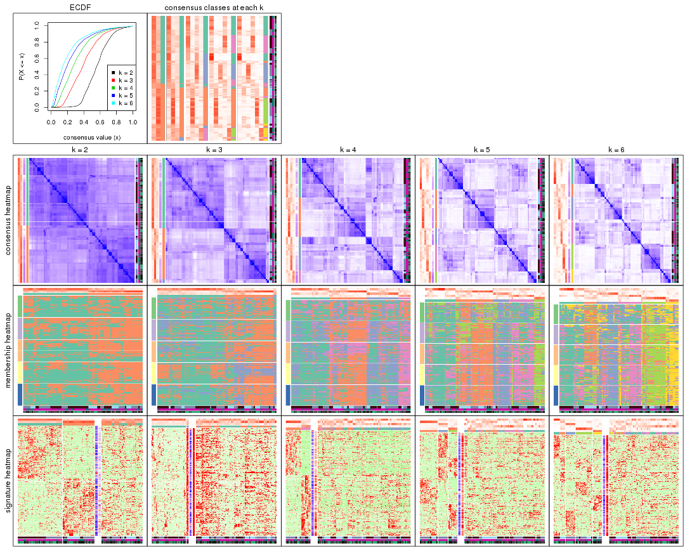

The plots are:

- The first row: a plot of the ECDF (Empirical cumulative distribution
  function) curves of the consensus matrix for each `k` and the heatmap of
  predicted classes for each `k`.
- The second row: heatmaps of the consensus matrix for each `k`.
- The third row: heatmaps of the membership matrix for each `k`.
- The fouth row: heatmaps of the signatures for each `k`.

All the plots in panels can be made by individual functions and they are
plotted later in this section.

`select_partition_number()` produces several plots showing different
statistics for choosing "optimized" `k`. There are following statistics:

- ECDF curves of the consensus matrix for each `k`;
- 1-PAC. [The PAC
  score](https://en.wikipedia.org/wiki/Consensus_clustering#Over-interpretation_potential_of_consensus_clustering)
  measures the proportion of the ambiguous subgrouping.
- Mean silhouette score.
- Concordance. The mean probability of fiting the consensus class ids in all
  partitions.
- Area increased. Denote $A_k$ as the area under the ECDF curve for current
  `k`, the area increased is defined as $A_k - A_{k-1}$.
- Rand index. The percent of pairs of samples that are both in a same cluster
  or both are not in a same cluster in the partition of k and k-1.
- Jaccard index. The ratio of pairs of samples are both in a same cluster in
  the partition of k and k-1 and the pairs of samples are both in a same
  cluster in the partition k or k-1.

The detailed explanations of these statistics can be found in [the cola
vignette](http://bioconductor.org/packages/devel/bioc/vignettes/cola/inst/doc/cola.html#toc_13).

Generally speaking, lower PAC score, higher mean silhouette score or higher
concordance corresponds to better partition. Rand index and Jaccard index
measure how similar the current partition is compared to partition with `k-1`.
If they are too similar, we won't accept `k` is better than `k-1`.

```r
select_partition_number(res)
```

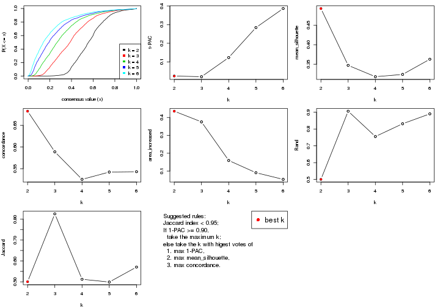

The numeric values for all these statistics can be obtained by `get_stats()`.

```r
get_stats(res)
```

```
#>   k  1-PAC mean_silhouette concordance area_increased  Rand Jaccard
#> 2 2 0.0240           0.493       0.683         0.4350 0.501   0.501
#> 3 3 0.0203           0.347       0.589         0.3753 0.906   0.826
#> 4 4 0.1232           0.318       0.525         0.1594 0.756   0.512
#> 5 5 0.2843           0.324       0.542         0.0911 0.831   0.499
#> 6 6 0.3867           0.363       0.543         0.0538 0.890   0.571
```

`suggest_best_k()` suggests the best $k$ based on these statistics. The rules are as follows:

- All $k$ with Jaccard index larger than 0.95 are removed because the increase of
  the partition number does not provides enough extra information. If all $k$ are removed,
  the best $k$ is assigned by `NA`.
- For $k$ with 1-PAC larger than 0.9, the maximal $k$ is taken as the "best k". Other $k$ is called "optional k".
- If it does not fit the second rule. The $k$ with the highest vote of highest
  1-PAC, mean silhouette and concordance is taken as the "best k".

```r
suggest_best_k(res)
```

```
#> [1] 2
```


Following shows the table of the partitions (You need to click the **show/hide
code output** link to see it). The membership matrix (columns with name `p*`)
is inferred by
[`clue::cl_consensus()`](https://www.rdocumentation.org/link/cl_consensus?package=clue)
function with the `SE` method. Basically the value in the membership matrix
represents the probability to belong to a certain group. The finall class
label for an item is determined with the group with highest probability it
belongs to.

In `get_classes()` function, the entropy is calculated from the membership
matrix and the silhouette score is calculated from the consensus matrix.


<script>
$( function() {
	$( '#tabs-SD-hclust-get-classes' ).tabs();
} );
</script>
<div id='tabs-SD-hclust-get-classes'>
<ul>
<li><a href='#tab-SD-hclust-get-classes-1'>k = 2</a></li>
<li><a href='#tab-SD-hclust-get-classes-2'>k = 3</a></li>
<li><a href='#tab-SD-hclust-get-classes-3'>k = 4</a></li>
<li><a href='#tab-SD-hclust-get-classes-4'>k = 5</a></li>
<li><a href='#tab-SD-hclust-get-classes-5'>k = 6</a></li>
</ul>

<div id='tab-SD-hclust-get-classes-1'>
<p><a id='tab-SD-hclust-get-classes-1-a' style='color:#0366d6' href='#'>show/hide code output</a></p>
<pre><code class="r">cbind(get_classes(res, k = 2), get_membership(res, k = 2))
</code></pre>

<pre><code>#&gt;           class entropy silhouette    p1    p2
#&gt; GSM751298     1   0.833     0.6311 0.736 0.264
#&gt; GSM751304     2   0.939     0.4875 0.356 0.644
#&gt; GSM751305     2   0.939     0.4875 0.356 0.644
#&gt; GSM751307     2   0.917     0.5140 0.332 0.668
#&gt; GSM751310     1   0.913     0.5924 0.672 0.328
#&gt; GSM751314     1   0.904     0.5829 0.680 0.320
#&gt; GSM751316     1   0.913     0.5929 0.672 0.328
#&gt; GSM751318     1   0.952     0.4637 0.628 0.372
#&gt; GSM751342     1   0.969     0.4505 0.604 0.396
#&gt; GSM751346     1   0.821     0.6129 0.744 0.256
#&gt; GSM751347     1   0.821     0.6129 0.744 0.256
#&gt; GSM751348     2   0.563     0.6354 0.132 0.868
#&gt; GSM751349     2   0.563     0.6354 0.132 0.868
#&gt; GSM751352     2   0.808     0.5961 0.248 0.752
#&gt; GSM751353     2   0.808     0.5961 0.248 0.752
#&gt; GSM751354     2   0.921     0.4925 0.336 0.664
#&gt; GSM751355     2   0.921     0.4925 0.336 0.664
#&gt; GSM751358     2   0.753     0.6288 0.216 0.784
#&gt; GSM751359     2   0.753     0.6288 0.216 0.784
#&gt; GSM751294     2   1.000     0.0526 0.492 0.508
#&gt; GSM751296     1   0.795     0.6342 0.760 0.240
#&gt; GSM751297     1   0.866     0.6038 0.712 0.288
#&gt; GSM751299     2   0.943     0.4540 0.360 0.640
#&gt; GSM751300     1   0.767     0.6349 0.776 0.224
#&gt; GSM751301     2   0.998     0.2798 0.472 0.528
#&gt; GSM751302     1   0.833     0.6040 0.736 0.264
#&gt; GSM751303     1   0.943     0.5305 0.640 0.360
#&gt; GSM751306     1   0.946     0.5244 0.636 0.364
#&gt; GSM751308     1   0.999     0.1465 0.516 0.484
#&gt; GSM751309     1   0.961     0.4887 0.616 0.384
#&gt; GSM751311     1   0.961     0.4887 0.616 0.384
#&gt; GSM751312     1   0.913     0.5929 0.672 0.328
#&gt; GSM751313     1   0.788     0.6198 0.764 0.236
#&gt; GSM751315     1   0.900     0.6001 0.684 0.316
#&gt; GSM751317     1   0.891     0.6022 0.692 0.308
#&gt; GSM751320     1   0.900     0.5855 0.684 0.316
#&gt; GSM751321     1   0.904     0.5981 0.680 0.320
#&gt; GSM751322     1   0.900     0.5855 0.684 0.316
#&gt; GSM751324     1   0.886     0.5517 0.696 0.304
#&gt; GSM751325     1   0.895     0.5544 0.688 0.312
#&gt; GSM751332     1   0.925     0.5386 0.660 0.340
#&gt; GSM751334     1   0.925     0.5386 0.660 0.340
#&gt; GSM751339     1   0.904     0.5936 0.680 0.320
#&gt; GSM751341     1   0.963     0.4804 0.612 0.388
#&gt; GSM751343     1   0.952     0.4637 0.628 0.372
#&gt; GSM751344     2   0.833     0.5844 0.264 0.736
#&gt; GSM751345     2   0.833     0.5844 0.264 0.736
#&gt; GSM751356     2   0.952     0.4200 0.372 0.628
#&gt; GSM751357     2   0.952     0.4200 0.372 0.628
#&gt; GSM751293     2   0.998     0.2798 0.472 0.528
#&gt; GSM751295     1   0.833     0.6040 0.736 0.264
#&gt; GSM751319     1   0.900     0.6001 0.684 0.316
#&gt; GSM751323     1   0.895     0.6126 0.688 0.312
#&gt; GSM751326     1   0.788     0.6310 0.764 0.236
#&gt; GSM751327     1   0.833     0.6312 0.736 0.264
#&gt; GSM751328     1   0.936     0.5116 0.648 0.352
#&gt; GSM751329     1   0.833     0.6244 0.736 0.264
#&gt; GSM751330     1   0.844     0.6241 0.728 0.272
#&gt; GSM751331     1   0.844     0.5985 0.728 0.272
#&gt; GSM751333     1   0.833     0.6238 0.736 0.264
#&gt; GSM751335     1   0.839     0.6246 0.732 0.268
#&gt; GSM751336     1   0.844     0.5985 0.728 0.272
#&gt; GSM751337     1   0.866     0.6258 0.712 0.288
#&gt; GSM751338     1   0.904     0.5936 0.680 0.320
#&gt; GSM751340     1   0.973     0.3024 0.596 0.404
#&gt; GSM751350     1   0.833     0.6040 0.736 0.264
#&gt; GSM751351     1   0.833     0.6040 0.736 0.264
#&gt; GSM751362     1   0.900     0.5920 0.684 0.316
#&gt; GSM751363     1   0.966     0.4831 0.608 0.392
#&gt; GSM751367     1   0.936     0.4809 0.648 0.352
#&gt; GSM751368     2   0.949     0.3709 0.368 0.632
#&gt; GSM751371     1   0.983     0.4285 0.576 0.424
#&gt; GSM751375     2   0.605     0.6361 0.148 0.852
#&gt; GSM751376     2   0.932     0.4664 0.348 0.652
#&gt; GSM751378     2   0.866     0.5607 0.288 0.712
#&gt; GSM751379     2   0.932     0.4664 0.348 0.652
#&gt; GSM751382     2   0.574     0.6331 0.136 0.864
#&gt; GSM751386     2   0.662     0.6315 0.172 0.828
#&gt; GSM751388     2   0.689     0.6282 0.184 0.816
#&gt; GSM751391     2   1.000    -0.1578 0.496 0.504
#&gt; GSM751410     1   0.939     0.5328 0.644 0.356
#&gt; GSM751414     1   0.969     0.4635 0.604 0.396
#&gt; GSM751361     2   0.921     0.4466 0.336 0.664
#&gt; GSM751365     1   0.952     0.5564 0.628 0.372
#&gt; GSM751366     1   0.932     0.5618 0.652 0.348
#&gt; GSM751369     1   0.991     0.3798 0.556 0.444
#&gt; GSM751370     1   0.900     0.5920 0.684 0.316
#&gt; GSM751372     1   0.969     0.5187 0.604 0.396
#&gt; GSM751373     1   0.955     0.5203 0.624 0.376
#&gt; GSM751374     2   0.932     0.4664 0.348 0.652
#&gt; GSM751377     2   0.900     0.4650 0.316 0.684
#&gt; GSM751380     1   0.855     0.5745 0.720 0.280
#&gt; GSM751381     2   0.653     0.6321 0.168 0.832
#&gt; GSM751383     2   0.697     0.6272 0.188 0.812
#&gt; GSM751384     2   0.671     0.6291 0.176 0.824
#&gt; GSM751385     2   0.802     0.6220 0.244 0.756
#&gt; GSM751387     2   0.697     0.6223 0.188 0.812
#&gt; GSM751389     1   0.839     0.5848 0.732 0.268
#&gt; GSM751393     2   0.936     0.4770 0.352 0.648
#&gt; GSM751394     2   0.653     0.6321 0.168 0.832
#&gt; GSM751395     2   0.936     0.4770 0.352 0.648
#&gt; GSM751397     2   0.615     0.6328 0.152 0.848
#&gt; GSM751398     2   0.644     0.6329 0.164 0.836
#&gt; GSM751404     1   0.917     0.5785 0.668 0.332
#&gt; GSM751406     1   0.795     0.5032 0.760 0.240
#&gt; GSM751411     1   0.955     0.4744 0.624 0.376
#&gt; GSM751413     1   0.999     0.2738 0.516 0.484
#&gt; GSM751415     1   0.839     0.5848 0.732 0.268
#&gt; GSM751416     2   0.999    -0.1567 0.480 0.520
#&gt; GSM751417     2   0.999    -0.1567 0.480 0.520
#&gt; GSM751421     1   0.983     0.4285 0.576 0.424
#&gt; GSM751422     1   0.983     0.4285 0.576 0.424
#&gt; GSM751360     1   1.000     0.2584 0.508 0.492
#&gt; GSM751364     2   0.999    -0.1567 0.480 0.520
#&gt; GSM751390     2   0.738     0.6190 0.208 0.792
#&gt; GSM751392     2   0.634     0.6370 0.160 0.840
#&gt; GSM751396     2   0.653     0.6397 0.168 0.832
#&gt; GSM751399     1   0.904     0.5309 0.680 0.320
#&gt; GSM751400     1   0.788     0.5879 0.764 0.236
#&gt; GSM751401     1   0.788     0.5879 0.764 0.236
#&gt; GSM751402     1   0.788     0.5879 0.764 0.236
#&gt; GSM751403     1   0.795     0.5885 0.760 0.240
#&gt; GSM751405     1   0.795     0.5041 0.760 0.240
#&gt; GSM751407     1   0.788     0.5879 0.764 0.236
#&gt; GSM751408     1   0.833     0.5907 0.736 0.264
#&gt; GSM751409     1   0.866     0.5762 0.712 0.288
#&gt; GSM751412     1   0.833     0.5907 0.736 0.264
#&gt; GSM751418     1   0.981     0.4684 0.580 0.420
#&gt; GSM751419     1   0.981     0.4684 0.580 0.420
#&gt; GSM751420     1   0.881     0.5253 0.700 0.300
#&gt; GSM751425     2   0.625     0.6154 0.156 0.844
#&gt; GSM751429     1   0.808     0.3929 0.752 0.248
#&gt; GSM751430     2   0.900     0.5539 0.316 0.684
#&gt; GSM751433     2   0.866     0.5234 0.288 0.712
#&gt; GSM751437     1   0.808     0.3976 0.752 0.248
#&gt; GSM751448     1   0.767     0.4209 0.776 0.224
#&gt; GSM751451     2   0.861     0.5216 0.284 0.716
#&gt; GSM751423     2   0.993     0.1841 0.452 0.548
#&gt; GSM751424     2   0.844     0.5472 0.272 0.728
#&gt; GSM751428     2   0.995     0.1148 0.460 0.540
#&gt; GSM751431     2   0.866     0.5234 0.288 0.712
#&gt; GSM751432     2   0.900     0.5539 0.316 0.684
#&gt; GSM751434     2   0.900     0.5553 0.316 0.684
#&gt; GSM751435     2   0.999     0.0228 0.480 0.520
#&gt; GSM751436     2   0.866     0.5234 0.288 0.712
#&gt; GSM751440     1   0.996     0.0838 0.536 0.464
#&gt; GSM751444     2   0.900     0.5607 0.316 0.684
#&gt; GSM751446     1   0.998     0.0574 0.524 0.476
#&gt; GSM751449     2   0.833     0.6013 0.264 0.736
#&gt; GSM751450     2   0.992     0.1851 0.448 0.552
#&gt; GSM751452     2   0.844     0.5472 0.272 0.728
#&gt; GSM751426     2   0.866     0.5267 0.288 0.712
#&gt; GSM751427     2   0.995     0.1148 0.460 0.540
#&gt; GSM751438     2   0.943     0.3683 0.360 0.640
#&gt; GSM751439     1   1.000    -0.0309 0.504 0.496
#&gt; GSM751441     2   0.615     0.6239 0.152 0.848
#&gt; GSM751442     2   0.998     0.0563 0.476 0.524
#&gt; GSM751443     1   0.788     0.4152 0.764 0.236
#&gt; GSM751445     2   0.833     0.6013 0.264 0.736
#&gt; GSM751447     2   0.615     0.6239 0.152 0.848
#&gt; GSM751453     2   0.605     0.6256 0.148 0.852
#&gt; GSM751454     2   0.605     0.6256 0.148 0.852
#&gt; GSM751455     2   0.998     0.0563 0.476 0.524
#&gt; GSM751456     2   0.998     0.0563 0.476 0.524
#&gt; GSM751457     2   0.615     0.6210 0.152 0.848
#&gt; GSM751458     2   0.615     0.6210 0.152 0.848
</code></pre>

<script>
$('#tab-SD-hclust-get-classes-1-a').parent().next().next().hide();
$('#tab-SD-hclust-get-classes-1-a').click(function(){
  $('#tab-SD-hclust-get-classes-1-a').parent().next().next().toggle();
  return(false);
});
</script>
</div>

<div id='tab-SD-hclust-get-classes-2'>
<p><a id='tab-SD-hclust-get-classes-2-a' style='color:#0366d6' href='#'>show/hide code output</a></p>
<pre><code class="r">cbind(get_classes(res, k = 3), get_membership(res, k = 3))
</code></pre>

<pre><code>#&gt;           class entropy silhouette    p1    p2    p3
#&gt; GSM751298     1   0.725    0.54281 0.704 0.100 0.196
#&gt; GSM751304     2   0.927   -0.25126 0.156 0.428 0.416
#&gt; GSM751305     2   0.927   -0.25126 0.156 0.428 0.416
#&gt; GSM751307     2   0.943   -0.32792 0.180 0.448 0.372
#&gt; GSM751310     1   0.788    0.52782 0.668 0.160 0.172
#&gt; GSM751314     1   0.821    0.49830 0.636 0.148 0.216
#&gt; GSM751316     1   0.767    0.53368 0.684 0.160 0.156
#&gt; GSM751318     1   0.969    0.29804 0.460 0.268 0.272
#&gt; GSM751342     1   0.967    0.28290 0.460 0.248 0.292
#&gt; GSM751346     1   0.538    0.55627 0.820 0.068 0.112
#&gt; GSM751347     1   0.538    0.55627 0.820 0.068 0.112
#&gt; GSM751348     2   0.432    0.41796 0.088 0.868 0.044
#&gt; GSM751349     2   0.432    0.41796 0.088 0.868 0.044
#&gt; GSM751352     2   0.734    0.19616 0.100 0.696 0.204
#&gt; GSM751353     2   0.734    0.19616 0.100 0.696 0.204
#&gt; GSM751354     2   0.911   -0.24278 0.140 0.432 0.428
#&gt; GSM751355     2   0.911   -0.24278 0.140 0.432 0.428
#&gt; GSM751358     2   0.618    0.36191 0.120 0.780 0.100
#&gt; GSM751359     2   0.618    0.36191 0.120 0.780 0.100
#&gt; GSM751294     2   0.965    0.07498 0.380 0.412 0.208
#&gt; GSM751296     1   0.668    0.55244 0.744 0.088 0.168
#&gt; GSM751297     1   0.639    0.56463 0.768 0.112 0.120
#&gt; GSM751299     2   0.912    0.12553 0.232 0.548 0.220
#&gt; GSM751300     1   0.632    0.55811 0.764 0.076 0.160
#&gt; GSM751301     3   0.992    0.47890 0.272 0.352 0.376
#&gt; GSM751302     1   0.579    0.54809 0.796 0.068 0.136
#&gt; GSM751303     1   0.907    0.42970 0.548 0.192 0.260
#&gt; GSM751306     1   0.910    0.42433 0.544 0.192 0.264
#&gt; GSM751308     1   0.936    0.12831 0.440 0.392 0.168
#&gt; GSM751309     1   0.931    0.38305 0.516 0.208 0.276
#&gt; GSM751311     1   0.931    0.38305 0.516 0.208 0.276
#&gt; GSM751312     1   0.767    0.53368 0.684 0.160 0.156
#&gt; GSM751313     1   0.563    0.56644 0.804 0.064 0.132
#&gt; GSM751315     1   0.744    0.52408 0.700 0.136 0.164
#&gt; GSM751317     1   0.754    0.52486 0.692 0.136 0.172
#&gt; GSM751320     1   0.793    0.51450 0.664 0.176 0.160
#&gt; GSM751321     1   0.749    0.52185 0.696 0.136 0.168
#&gt; GSM751322     1   0.793    0.51450 0.664 0.176 0.160
#&gt; GSM751324     1   0.913    0.41816 0.544 0.204 0.252
#&gt; GSM751325     1   0.905    0.42487 0.552 0.196 0.252
#&gt; GSM751332     1   0.893    0.43734 0.568 0.196 0.236
#&gt; GSM751334     1   0.893    0.43734 0.568 0.196 0.236
#&gt; GSM751339     1   0.798    0.56682 0.660 0.172 0.168
#&gt; GSM751341     1   0.955    0.33307 0.480 0.228 0.292
#&gt; GSM751343     1   0.969    0.29804 0.460 0.268 0.272
#&gt; GSM751344     2   0.855   -0.12211 0.116 0.560 0.324
#&gt; GSM751345     2   0.855   -0.12211 0.116 0.560 0.324
#&gt; GSM751356     2   0.920    0.13665 0.248 0.536 0.216
#&gt; GSM751357     2   0.920    0.13665 0.248 0.536 0.216
#&gt; GSM751293     3   0.992    0.47890 0.272 0.352 0.376
#&gt; GSM751295     1   0.579    0.54809 0.796 0.068 0.136
#&gt; GSM751319     1   0.744    0.52408 0.700 0.136 0.164
#&gt; GSM751323     1   0.728    0.55291 0.712 0.144 0.144
#&gt; GSM751326     1   0.639    0.56061 0.768 0.108 0.124
#&gt; GSM751327     1   0.637    0.56615 0.768 0.100 0.132
#&gt; GSM751328     1   0.919    0.39705 0.536 0.208 0.256
#&gt; GSM751329     1   0.594    0.56392 0.792 0.088 0.120
#&gt; GSM751330     1   0.593    0.56430 0.792 0.084 0.124
#&gt; GSM751331     1   0.605    0.54945 0.784 0.080 0.136
#&gt; GSM751333     1   0.587    0.57081 0.796 0.088 0.116
#&gt; GSM751335     1   0.600    0.56566 0.788 0.084 0.128
#&gt; GSM751336     1   0.605    0.54945 0.784 0.080 0.136
#&gt; GSM751337     1   0.772    0.57082 0.680 0.148 0.172
#&gt; GSM751338     1   0.798    0.56682 0.660 0.172 0.168
#&gt; GSM751340     1   0.937    0.29771 0.504 0.292 0.204
#&gt; GSM751350     1   0.579    0.54809 0.796 0.068 0.136
#&gt; GSM751351     1   0.579    0.54809 0.796 0.068 0.136
#&gt; GSM751362     1   0.784    0.54116 0.664 0.208 0.128
#&gt; GSM751363     1   0.885    0.42463 0.552 0.300 0.148
#&gt; GSM751367     1   0.869    0.47494 0.596 0.196 0.208
#&gt; GSM751368     2   0.918    0.04939 0.324 0.508 0.168
#&gt; GSM751371     1   0.947    0.41364 0.488 0.300 0.212
#&gt; GSM751375     2   0.429    0.40683 0.092 0.868 0.040
#&gt; GSM751376     2   0.966   -0.18330 0.220 0.440 0.340
#&gt; GSM751378     2   0.663    0.37439 0.212 0.728 0.060
#&gt; GSM751379     2   0.966   -0.18330 0.220 0.440 0.340
#&gt; GSM751382     2   0.364    0.41639 0.084 0.892 0.024
#&gt; GSM751386     2   0.517    0.37983 0.092 0.832 0.076
#&gt; GSM751388     2   0.555    0.37451 0.112 0.812 0.076
#&gt; GSM751391     1   0.967    0.14069 0.396 0.392 0.212
#&gt; GSM751410     1   0.873    0.53938 0.588 0.236 0.176
#&gt; GSM751414     1   0.859    0.46063 0.588 0.268 0.144
#&gt; GSM751361     2   0.875    0.12102 0.292 0.564 0.144
#&gt; GSM751365     1   0.861    0.49926 0.596 0.244 0.160
#&gt; GSM751366     1   0.830    0.51849 0.624 0.232 0.144
#&gt; GSM751369     1   0.976    0.34295 0.428 0.332 0.240
#&gt; GSM751370     1   0.784    0.54116 0.664 0.208 0.128
#&gt; GSM751372     1   0.838    0.46712 0.596 0.284 0.120
#&gt; GSM751373     1   0.853    0.49637 0.600 0.252 0.148
#&gt; GSM751374     2   0.966   -0.18330 0.220 0.440 0.340
#&gt; GSM751377     2   0.795    0.21385 0.260 0.636 0.104
#&gt; GSM751380     1   0.859    0.53993 0.604 0.180 0.216
#&gt; GSM751381     2   0.384    0.41622 0.116 0.872 0.012
#&gt; GSM751383     2   0.554    0.37544 0.116 0.812 0.072
#&gt; GSM751384     2   0.392    0.41835 0.120 0.868 0.012
#&gt; GSM751385     2   0.715    0.35893 0.176 0.716 0.108
#&gt; GSM751387     2   0.489    0.39680 0.124 0.836 0.040
#&gt; GSM751389     1   0.797    0.54106 0.660 0.156 0.184
#&gt; GSM751393     2   0.966   -0.18393 0.224 0.444 0.332
#&gt; GSM751394     2   0.498    0.38340 0.096 0.840 0.064
#&gt; GSM751395     2   0.966   -0.18393 0.224 0.444 0.332
#&gt; GSM751397     2   0.448    0.40017 0.096 0.860 0.044
#&gt; GSM751398     2   0.517    0.37926 0.092 0.832 0.076
#&gt; GSM751404     1   0.822    0.53378 0.636 0.212 0.152
#&gt; GSM751406     1   0.841    0.49411 0.616 0.152 0.232
#&gt; GSM751411     1   0.890    0.45242 0.552 0.292 0.156
#&gt; GSM751413     1   0.949    0.24040 0.444 0.368 0.188
#&gt; GSM751415     1   0.797    0.54237 0.660 0.156 0.184
#&gt; GSM751416     1   0.922    0.18786 0.448 0.400 0.152
#&gt; GSM751417     1   0.922    0.18786 0.448 0.400 0.152
#&gt; GSM751421     1   0.947    0.41364 0.488 0.300 0.212
#&gt; GSM751422     1   0.947    0.41364 0.488 0.300 0.212
#&gt; GSM751360     1   0.950    0.24494 0.440 0.372 0.188
#&gt; GSM751364     1   0.922    0.18786 0.448 0.400 0.152
#&gt; GSM751390     2   0.511    0.39943 0.144 0.820 0.036
#&gt; GSM751392     2   0.451    0.39943 0.092 0.860 0.048
#&gt; GSM751396     2   0.490    0.39031 0.092 0.844 0.064
#&gt; GSM751399     1   0.855    0.51136 0.608 0.216 0.176
#&gt; GSM751400     1   0.787    0.52935 0.664 0.136 0.200
#&gt; GSM751401     1   0.787    0.52935 0.664 0.136 0.200
#&gt; GSM751402     1   0.787    0.52935 0.664 0.136 0.200
#&gt; GSM751403     1   0.789    0.53133 0.664 0.140 0.196
#&gt; GSM751405     1   0.842    0.49653 0.616 0.156 0.228
#&gt; GSM751407     1   0.787    0.52935 0.664 0.136 0.200
#&gt; GSM751408     1   0.787    0.54525 0.668 0.156 0.176
#&gt; GSM751409     1   0.826    0.53728 0.636 0.184 0.180
#&gt; GSM751412     1   0.787    0.54525 0.668 0.156 0.176
#&gt; GSM751418     1   0.890    0.45241 0.552 0.292 0.156
#&gt; GSM751419     1   0.890    0.45241 0.552 0.292 0.156
#&gt; GSM751420     1   0.891    0.49617 0.572 0.212 0.216
#&gt; GSM751425     2   0.558    0.39774 0.084 0.812 0.104
#&gt; GSM751429     1   0.856    0.43531 0.596 0.148 0.256
#&gt; GSM751430     3   0.941    0.65374 0.176 0.380 0.444
#&gt; GSM751433     2   0.853    0.18308 0.188 0.612 0.200
#&gt; GSM751437     1   0.861    0.42721 0.592 0.152 0.256
#&gt; GSM751448     1   0.832    0.44763 0.600 0.116 0.284
#&gt; GSM751451     2   0.844    0.19749 0.192 0.620 0.188
#&gt; GSM751423     2   0.899    0.11271 0.392 0.476 0.132
#&gt; GSM751424     2   0.926   -0.19479 0.216 0.528 0.256
#&gt; GSM751428     2   0.915    0.00526 0.424 0.432 0.144
#&gt; GSM751431     2   0.848    0.19423 0.196 0.616 0.188
#&gt; GSM751432     3   0.941    0.65374 0.176 0.380 0.444
#&gt; GSM751434     3   0.931    0.64278 0.164 0.384 0.452
#&gt; GSM751435     1   0.918    0.05332 0.444 0.408 0.148
#&gt; GSM751436     2   0.853    0.18308 0.188 0.612 0.200
#&gt; GSM751440     1   0.903    0.09259 0.476 0.388 0.136
#&gt; GSM751444     2   0.851    0.28775 0.212 0.612 0.176
#&gt; GSM751446     1   0.896    0.08263 0.472 0.400 0.128
#&gt; GSM751449     2   0.767    0.34024 0.168 0.684 0.148
#&gt; GSM751450     2   0.894    0.11176 0.392 0.480 0.128
#&gt; GSM751452     2   0.926   -0.19479 0.216 0.528 0.256
#&gt; GSM751426     2   0.848    0.18890 0.192 0.616 0.192
#&gt; GSM751427     2   0.915    0.00526 0.424 0.432 0.144
#&gt; GSM751438     2   0.890    0.26765 0.232 0.572 0.196
#&gt; GSM751439     2   0.957    0.07423 0.380 0.424 0.196
#&gt; GSM751441     2   0.548    0.39726 0.076 0.816 0.108
#&gt; GSM751442     2   0.968    0.09852 0.368 0.416 0.216
#&gt; GSM751443     1   0.846    0.44159 0.592 0.128 0.280
#&gt; GSM751445     2   0.767    0.34024 0.168 0.684 0.148
#&gt; GSM751447     2   0.548    0.39726 0.076 0.816 0.108
#&gt; GSM751453     2   0.539    0.39813 0.072 0.820 0.108
#&gt; GSM751454     2   0.539    0.39813 0.072 0.820 0.108
#&gt; GSM751455     2   0.968    0.09852 0.368 0.416 0.216
#&gt; GSM751456     2   0.968    0.09852 0.368 0.416 0.216
#&gt; GSM751457     2   0.564    0.39650 0.080 0.808 0.112
#&gt; GSM751458     2   0.564    0.39650 0.080 0.808 0.112
</code></pre>

<script>
$('#tab-SD-hclust-get-classes-2-a').parent().next().next().hide();
$('#tab-SD-hclust-get-classes-2-a').click(function(){
  $('#tab-SD-hclust-get-classes-2-a').parent().next().next().toggle();
  return(false);
});
</script>
</div>

<div id='tab-SD-hclust-get-classes-3'>
<p><a id='tab-SD-hclust-get-classes-3-a' style='color:#0366d6' href='#'>show/hide code output</a></p>
<pre><code class="r">cbind(get_classes(res, k = 4), get_membership(res, k = 4))
</code></pre>

<pre><code>#&gt;           class entropy silhouette    p1    p2    p3    p4
#&gt; GSM751298     1   0.707    0.17936 0.548 0.040 0.360 0.052
#&gt; GSM751304     4   0.757    0.65621 0.084 0.192 0.100 0.624
#&gt; GSM751305     4   0.757    0.65621 0.084 0.192 0.100 0.624
#&gt; GSM751307     4   0.851    0.64346 0.156 0.188 0.112 0.544
#&gt; GSM751310     1   0.687    0.40155 0.668 0.036 0.168 0.128
#&gt; GSM751314     1   0.548    0.47252 0.764 0.032 0.148 0.056
#&gt; GSM751316     1   0.690    0.39305 0.664 0.036 0.176 0.124
#&gt; GSM751318     1   0.776    0.34668 0.612 0.116 0.184 0.088
#&gt; GSM751342     1   0.710    0.38081 0.676 0.104 0.124 0.096
#&gt; GSM751346     3   0.718    0.07518 0.420 0.036 0.488 0.056
#&gt; GSM751347     3   0.718    0.07518 0.420 0.036 0.488 0.056
#&gt; GSM751348     2   0.356    0.54005 0.036 0.880 0.056 0.028
#&gt; GSM751349     2   0.356    0.54005 0.036 0.880 0.056 0.028
#&gt; GSM751352     2   0.708    0.12603 0.020 0.572 0.092 0.316
#&gt; GSM751353     2   0.708    0.12603 0.020 0.572 0.092 0.316
#&gt; GSM751354     4   0.762    0.65582 0.068 0.192 0.124 0.616
#&gt; GSM751355     4   0.762    0.65582 0.068 0.192 0.124 0.616
#&gt; GSM751358     2   0.641    0.50059 0.120 0.716 0.048 0.116
#&gt; GSM751359     2   0.641    0.50059 0.120 0.716 0.048 0.116
#&gt; GSM751294     3   0.948   -0.04140 0.124 0.308 0.364 0.204
#&gt; GSM751296     1   0.663    0.16890 0.568 0.036 0.364 0.032
#&gt; GSM751297     3   0.751    0.05187 0.436 0.068 0.452 0.044
#&gt; GSM751299     2   0.875   -0.13530 0.052 0.424 0.220 0.304
#&gt; GSM751300     1   0.651    0.14011 0.560 0.028 0.380 0.032
#&gt; GSM751301     4   0.911    0.28194 0.368 0.152 0.108 0.372
#&gt; GSM751302     3   0.742    0.07021 0.412 0.040 0.480 0.068
#&gt; GSM751303     1   0.621    0.44827 0.732 0.060 0.132 0.076
#&gt; GSM751306     1   0.627    0.44639 0.728 0.060 0.132 0.080
#&gt; GSM751308     3   0.979    0.10724 0.236 0.260 0.336 0.168
#&gt; GSM751309     1   0.656    0.43571 0.712 0.076 0.128 0.084
#&gt; GSM751311     1   0.656    0.43571 0.712 0.076 0.128 0.084
#&gt; GSM751312     1   0.690    0.39305 0.664 0.036 0.176 0.124
#&gt; GSM751313     1   0.726    0.01574 0.464 0.036 0.440 0.060
#&gt; GSM751315     1   0.583    0.43021 0.736 0.020 0.156 0.088
#&gt; GSM751317     1   0.594    0.45038 0.728 0.028 0.172 0.072
#&gt; GSM751320     1   0.588    0.46248 0.724 0.032 0.192 0.052
#&gt; GSM751321     1   0.589    0.43055 0.732 0.020 0.156 0.092
#&gt; GSM751322     1   0.588    0.46248 0.724 0.032 0.192 0.052
#&gt; GSM751324     1   0.648    0.41995 0.696 0.048 0.184 0.072
#&gt; GSM751325     1   0.635    0.42602 0.704 0.048 0.184 0.064
#&gt; GSM751332     1   0.628    0.41415 0.700 0.044 0.200 0.056
#&gt; GSM751334     1   0.628    0.41415 0.700 0.044 0.200 0.056
#&gt; GSM751339     3   0.808    0.14153 0.328 0.084 0.508 0.080
#&gt; GSM751341     1   0.744    0.38031 0.644 0.100 0.160 0.096
#&gt; GSM751343     1   0.776    0.34668 0.612 0.116 0.184 0.088
#&gt; GSM751344     4   0.820    0.45544 0.076 0.356 0.092 0.476
#&gt; GSM751345     4   0.820    0.45544 0.076 0.356 0.092 0.476
#&gt; GSM751356     2   0.891   -0.08731 0.060 0.412 0.244 0.284
#&gt; GSM751357     2   0.891   -0.08731 0.060 0.412 0.244 0.284
#&gt; GSM751293     4   0.911    0.28194 0.368 0.152 0.108 0.372
#&gt; GSM751295     3   0.742    0.07021 0.412 0.040 0.480 0.068
#&gt; GSM751319     1   0.583    0.43021 0.736 0.020 0.156 0.088
#&gt; GSM751323     1   0.637    0.39544 0.664 0.032 0.252 0.052
#&gt; GSM751326     1   0.614    0.30631 0.632 0.020 0.312 0.036
#&gt; GSM751327     1   0.660    0.29707 0.600 0.024 0.324 0.052
#&gt; GSM751328     1   0.681    0.40799 0.684 0.064 0.168 0.084
#&gt; GSM751329     1   0.689    0.21473 0.564 0.024 0.348 0.064
#&gt; GSM751330     1   0.697    0.20242 0.564 0.028 0.344 0.064
#&gt; GSM751331     3   0.756    0.03909 0.424 0.044 0.460 0.072
#&gt; GSM751333     1   0.741    0.14488 0.528 0.052 0.360 0.060
#&gt; GSM751335     1   0.702    0.18857 0.556 0.032 0.352 0.060
#&gt; GSM751336     3   0.756    0.03909 0.424 0.044 0.460 0.072
#&gt; GSM751337     1   0.737    0.09321 0.456 0.036 0.440 0.068
#&gt; GSM751338     3   0.808    0.14153 0.328 0.084 0.508 0.080
#&gt; GSM751340     3   0.909    0.26991 0.172 0.212 0.476 0.140
#&gt; GSM751350     3   0.742    0.07021 0.412 0.040 0.480 0.068
#&gt; GSM751351     3   0.742    0.07021 0.412 0.040 0.480 0.068
#&gt; GSM751362     1   0.777    0.30846 0.576 0.076 0.260 0.088
#&gt; GSM751363     1   0.812    0.35918 0.584 0.128 0.180 0.108
#&gt; GSM751367     3   0.878    0.02534 0.372 0.068 0.392 0.168
#&gt; GSM751368     2   0.929    0.05208 0.316 0.388 0.184 0.112
#&gt; GSM751371     3   0.902    0.11011 0.308 0.136 0.436 0.120
#&gt; GSM751375     2   0.375    0.53437 0.036 0.872 0.036 0.056
#&gt; GSM751376     4   0.906    0.64491 0.112 0.200 0.220 0.468
#&gt; GSM751378     2   0.619    0.48451 0.056 0.728 0.148 0.068
#&gt; GSM751379     4   0.906    0.64491 0.112 0.200 0.220 0.468
#&gt; GSM751382     2   0.314    0.53771 0.036 0.900 0.032 0.032
#&gt; GSM751386     2   0.542    0.51477 0.092 0.784 0.048 0.076
#&gt; GSM751388     2   0.573    0.52141 0.092 0.768 0.068 0.072
#&gt; GSM751391     3   0.966    0.13758 0.232 0.220 0.380 0.168
#&gt; GSM751410     1   0.860   -0.01595 0.408 0.112 0.392 0.088
#&gt; GSM751414     1   0.838    0.34970 0.528 0.160 0.240 0.072
#&gt; GSM751361     2   0.892    0.25383 0.280 0.460 0.160 0.100
#&gt; GSM751365     1   0.877    0.21900 0.440 0.160 0.324 0.076
#&gt; GSM751366     1   0.807    0.17301 0.448 0.136 0.380 0.036
#&gt; GSM751369     1   0.935    0.00264 0.364 0.136 0.344 0.156
#&gt; GSM751370     1   0.777    0.30846 0.576 0.076 0.260 0.088
#&gt; GSM751372     1   0.847    0.30690 0.528 0.156 0.232 0.084
#&gt; GSM751373     1   0.818    0.19964 0.460 0.156 0.348 0.036
#&gt; GSM751374     4   0.906    0.64491 0.112 0.200 0.220 0.468
#&gt; GSM751377     2   0.790    0.31415 0.312 0.532 0.092 0.064
#&gt; GSM751380     3   0.720    0.35087 0.196 0.080 0.648 0.076
#&gt; GSM751381     2   0.367    0.54451 0.052 0.876 0.040 0.032
#&gt; GSM751383     2   0.553    0.52521 0.088 0.780 0.068 0.064
#&gt; GSM751384     2   0.364    0.54795 0.056 0.876 0.044 0.024
#&gt; GSM751385     2   0.751    0.44726 0.104 0.644 0.120 0.132
#&gt; GSM751387     2   0.462    0.54381 0.076 0.828 0.060 0.036
#&gt; GSM751389     3   0.656    0.35874 0.172 0.084 0.696 0.048
#&gt; GSM751393     4   0.906    0.63895 0.108 0.204 0.224 0.464
#&gt; GSM751394     2   0.523    0.51878 0.096 0.792 0.036 0.076
#&gt; GSM751395     4   0.906    0.63895 0.108 0.204 0.224 0.464
#&gt; GSM751397     2   0.436    0.53488 0.076 0.840 0.028 0.056
#&gt; GSM751398     2   0.532    0.51228 0.092 0.788 0.040 0.080
#&gt; GSM751404     3   0.799   -0.13845 0.416 0.124 0.424 0.036
#&gt; GSM751406     3   0.630    0.40915 0.120 0.060 0.728 0.092
#&gt; GSM751411     1   0.896    0.17157 0.432 0.192 0.296 0.080
#&gt; GSM751413     1   0.871    0.30747 0.524 0.200 0.132 0.144
#&gt; GSM751415     3   0.660    0.36008 0.172 0.092 0.692 0.044
#&gt; GSM751416     1   0.853    0.29539 0.504 0.272 0.140 0.084
#&gt; GSM751417     1   0.853    0.29539 0.504 0.272 0.140 0.084
#&gt; GSM751421     3   0.902    0.11011 0.308 0.136 0.436 0.120
#&gt; GSM751422     3   0.902    0.11011 0.308 0.136 0.436 0.120
#&gt; GSM751360     1   0.869    0.30421 0.524 0.204 0.128 0.144
#&gt; GSM751364     1   0.853    0.29539 0.504 0.272 0.140 0.084
#&gt; GSM751390     2   0.476    0.55341 0.080 0.816 0.080 0.024
#&gt; GSM751392     2   0.409    0.53877 0.036 0.856 0.048 0.060
#&gt; GSM751396     2   0.469    0.52905 0.044 0.824 0.048 0.084
#&gt; GSM751399     3   0.758    0.31642 0.188 0.148 0.612 0.052
#&gt; GSM751400     3   0.585    0.41281 0.128 0.076 0.752 0.044
#&gt; GSM751401     3   0.585    0.41281 0.128 0.076 0.752 0.044
#&gt; GSM751402     3   0.585    0.41281 0.128 0.076 0.752 0.044
#&gt; GSM751403     3   0.586    0.41191 0.124 0.080 0.752 0.044
#&gt; GSM751405     3   0.643    0.40724 0.124 0.064 0.720 0.092
#&gt; GSM751407     3   0.585    0.41281 0.128 0.076 0.752 0.044
#&gt; GSM751408     3   0.648    0.34829 0.180 0.096 0.692 0.032
#&gt; GSM751409     3   0.655    0.36412 0.172 0.100 0.692 0.036
#&gt; GSM751412     3   0.648    0.34829 0.180 0.096 0.692 0.032
#&gt; GSM751418     1   0.857    0.19978 0.424 0.172 0.352 0.052
#&gt; GSM751419     1   0.857    0.19978 0.424 0.172 0.352 0.052
#&gt; GSM751420     3   0.746    0.35110 0.180 0.100 0.636 0.084
#&gt; GSM751425     2   0.526    0.49590 0.060 0.784 0.032 0.124
#&gt; GSM751429     3   0.775    0.31985 0.160 0.084 0.616 0.140
#&gt; GSM751430     4   0.791    0.59248 0.216 0.152 0.056 0.576
#&gt; GSM751433     2   0.878    0.35637 0.284 0.472 0.092 0.152
#&gt; GSM751437     3   0.830    0.30217 0.160 0.120 0.572 0.148
#&gt; GSM751448     3   0.616    0.37291 0.084 0.048 0.732 0.136
#&gt; GSM751451     2   0.878    0.35944 0.280 0.476 0.096 0.148
#&gt; GSM751423     2   0.944    0.08783 0.228 0.372 0.288 0.112
#&gt; GSM751424     2   0.899    0.10475 0.300 0.384 0.060 0.256
#&gt; GSM751428     2   0.943   -0.01321 0.236 0.348 0.312 0.104
#&gt; GSM751431     2   0.878    0.35934 0.280 0.476 0.096 0.148
#&gt; GSM751432     4   0.791    0.59248 0.216 0.152 0.056 0.576
#&gt; GSM751434     4   0.776    0.59300 0.220 0.156 0.044 0.580
#&gt; GSM751435     2   0.951   -0.08026 0.260 0.328 0.304 0.108
#&gt; GSM751436     2   0.878    0.35637 0.284 0.472 0.092 0.152
#&gt; GSM751440     3   0.954    0.07232 0.260 0.296 0.332 0.112
#&gt; GSM751444     2   0.871    0.39401 0.120 0.520 0.208 0.152
#&gt; GSM751446     3   0.950    0.06839 0.256 0.304 0.332 0.108
#&gt; GSM751449     2   0.781    0.44833 0.084 0.608 0.180 0.128
#&gt; GSM751450     2   0.943    0.08746 0.224 0.376 0.288 0.112
#&gt; GSM751452     2   0.899    0.10475 0.300 0.384 0.060 0.256
#&gt; GSM751426     2   0.882    0.35461 0.276 0.472 0.092 0.160
#&gt; GSM751427     2   0.943   -0.01321 0.236 0.348 0.312 0.104
#&gt; GSM751438     2   0.807    0.33307 0.060 0.536 0.280 0.124
#&gt; GSM751439     3   0.907   -0.02112 0.136 0.336 0.408 0.120
#&gt; GSM751441     2   0.538    0.50176 0.056 0.776 0.036 0.132
#&gt; GSM751442     3   0.910   -0.06610 0.124 0.372 0.372 0.132
#&gt; GSM751443     3   0.614    0.37176 0.072 0.060 0.736 0.132
#&gt; GSM751445     2   0.781    0.44833 0.084 0.608 0.180 0.128
#&gt; GSM751447     2   0.538    0.50176 0.056 0.776 0.036 0.132
#&gt; GSM751453     2   0.530    0.50344 0.052 0.780 0.036 0.132
#&gt; GSM751454     2   0.530    0.50344 0.052 0.780 0.036 0.132
#&gt; GSM751455     3   0.910   -0.06610 0.124 0.372 0.372 0.132
#&gt; GSM751456     2   0.910    0.02565 0.124 0.372 0.372 0.132
#&gt; GSM751457     2   0.538    0.49620 0.056 0.776 0.036 0.132
#&gt; GSM751458     2   0.538    0.49620 0.056 0.776 0.036 0.132
</code></pre>

<script>
$('#tab-SD-hclust-get-classes-3-a').parent().next().next().hide();
$('#tab-SD-hclust-get-classes-3-a').click(function(){
  $('#tab-SD-hclust-get-classes-3-a').parent().next().next().toggle();
  return(false);
});
</script>
</div>

<div id='tab-SD-hclust-get-classes-4'>
<p><a id='tab-SD-hclust-get-classes-4-a' style='color:#0366d6' href='#'>show/hide code output</a></p>
<pre><code class="r">cbind(get_classes(res, k = 5), get_membership(res, k = 5))
</code></pre>

<pre><code>#&gt;           class entropy silhouette    p1    p2    p3    p4    p5
#&gt; GSM751298     1   0.605    0.30823 0.616 0.024 0.056 0.288 0.016
#&gt; GSM751304     5   0.613    0.71263 0.112 0.064 0.080 0.036 0.708
#&gt; GSM751305     5   0.613    0.71263 0.112 0.064 0.080 0.036 0.708
#&gt; GSM751307     5   0.706    0.67188 0.168 0.076 0.048 0.080 0.628
#&gt; GSM751310     1   0.646    0.18034 0.536 0.000 0.028 0.328 0.108
#&gt; GSM751314     4   0.545    0.14570 0.380 0.000 0.020 0.568 0.032
#&gt; GSM751316     1   0.643    0.19233 0.548 0.000 0.028 0.316 0.108
#&gt; GSM751318     4   0.550    0.37455 0.100 0.056 0.060 0.752 0.032
#&gt; GSM751342     4   0.485    0.38811 0.092 0.036 0.040 0.792 0.040
#&gt; GSM751346     1   0.250    0.44708 0.912 0.016 0.048 0.012 0.012
#&gt; GSM751347     1   0.250    0.44708 0.912 0.016 0.048 0.012 0.012
#&gt; GSM751348     2   0.432    0.54676 0.024 0.824 0.044 0.036 0.072
#&gt; GSM751349     2   0.432    0.54676 0.024 0.824 0.044 0.036 0.072
#&gt; GSM751352     2   0.684    0.17182 0.096 0.492 0.044 0.004 0.364
#&gt; GSM751353     2   0.684    0.17182 0.096 0.492 0.044 0.004 0.364
#&gt; GSM751354     5   0.604    0.71464 0.112 0.064 0.068 0.040 0.716
#&gt; GSM751355     5   0.604    0.71464 0.112 0.064 0.068 0.040 0.716
#&gt; GSM751358     2   0.623    0.51326 0.008 0.680 0.080 0.116 0.116
#&gt; GSM751359     2   0.623    0.51326 0.008 0.680 0.080 0.116 0.116
#&gt; GSM751294     3   0.968    0.03270 0.140 0.228 0.268 0.112 0.252
#&gt; GSM751296     1   0.551    0.34413 0.664 0.016 0.056 0.256 0.008
#&gt; GSM751297     1   0.492    0.41665 0.788 0.028 0.068 0.080 0.036
#&gt; GSM751299     2   0.878   -0.08232 0.112 0.344 0.164 0.044 0.336
#&gt; GSM751300     1   0.522    0.36383 0.692 0.008 0.060 0.232 0.008
#&gt; GSM751301     4   0.827   -0.11903 0.100 0.092 0.048 0.392 0.368
#&gt; GSM751302     1   0.174    0.45071 0.944 0.008 0.032 0.008 0.008
#&gt; GSM751303     4   0.563    0.30127 0.248 0.012 0.028 0.668 0.044
#&gt; GSM751306     4   0.556    0.30079 0.248 0.012 0.028 0.672 0.040
#&gt; GSM751308     4   0.986   -0.14127 0.144 0.192 0.224 0.268 0.172
#&gt; GSM751309     4   0.532    0.34590 0.204 0.012 0.028 0.712 0.044
#&gt; GSM751311     4   0.532    0.34590 0.204 0.012 0.028 0.712 0.044
#&gt; GSM751312     1   0.643    0.19233 0.548 0.000 0.028 0.316 0.108
#&gt; GSM751313     1   0.324    0.44037 0.868 0.008 0.036 0.080 0.008
#&gt; GSM751315     1   0.582    0.15057 0.536 0.000 0.016 0.388 0.060
#&gt; GSM751317     1   0.569    0.05266 0.508 0.000 0.024 0.432 0.036
#&gt; GSM751320     4   0.525    0.16575 0.392 0.000 0.020 0.568 0.020
#&gt; GSM751321     1   0.583    0.14671 0.532 0.000 0.016 0.392 0.060
#&gt; GSM751322     4   0.525    0.16575 0.392 0.000 0.020 0.568 0.020
#&gt; GSM751324     4   0.550    0.34664 0.192 0.012 0.056 0.708 0.032
#&gt; GSM751325     4   0.541    0.33539 0.216 0.012 0.044 0.700 0.028
#&gt; GSM751332     4   0.550    0.25228 0.308 0.024 0.024 0.632 0.012
#&gt; GSM751334     4   0.550    0.25228 0.308 0.024 0.024 0.632 0.012
#&gt; GSM751339     1   0.827   -0.25481 0.368 0.016 0.284 0.260 0.072
#&gt; GSM751341     4   0.551    0.36342 0.156 0.040 0.036 0.732 0.036
#&gt; GSM751343     4   0.550    0.37455 0.100 0.056 0.060 0.752 0.032
#&gt; GSM751344     5   0.715    0.46876 0.108 0.248 0.024 0.052 0.568
#&gt; GSM751345     5   0.715    0.46876 0.108 0.248 0.024 0.052 0.568
#&gt; GSM751356     2   0.910   -0.04426 0.100 0.320 0.192 0.072 0.316
#&gt; GSM751357     2   0.910   -0.04426 0.100 0.320 0.192 0.072 0.316
#&gt; GSM751293     4   0.827   -0.11903 0.100 0.092 0.048 0.392 0.368
#&gt; GSM751295     1   0.174    0.45071 0.944 0.008 0.032 0.008 0.008
#&gt; GSM751319     1   0.582    0.15057 0.536 0.000 0.016 0.388 0.060
#&gt; GSM751323     1   0.549    0.01767 0.492 0.004 0.016 0.464 0.024
#&gt; GSM751326     1   0.523    0.17792 0.572 0.008 0.020 0.392 0.008
#&gt; GSM751327     1   0.534    0.20088 0.596 0.008 0.020 0.360 0.016
#&gt; GSM751328     4   0.581    0.30441 0.256 0.036 0.024 0.656 0.028
#&gt; GSM751329     1   0.435    0.36751 0.744 0.012 0.008 0.224 0.012
#&gt; GSM751330     1   0.419    0.38041 0.764 0.012 0.008 0.204 0.012
#&gt; GSM751331     1   0.148    0.45074 0.956 0.012 0.004 0.016 0.012
#&gt; GSM751333     1   0.362    0.40810 0.816 0.016 0.004 0.156 0.008
#&gt; GSM751335     1   0.402    0.38431 0.776 0.012 0.008 0.196 0.008
#&gt; GSM751336     1   0.148    0.45074 0.956 0.012 0.004 0.016 0.012
#&gt; GSM751337     4   0.752    0.08730 0.344 0.012 0.244 0.380 0.020
#&gt; GSM751338     1   0.827   -0.25481 0.368 0.016 0.284 0.260 0.072
#&gt; GSM751340     3   0.965    0.29342 0.216 0.136 0.324 0.136 0.188
#&gt; GSM751350     1   0.186    0.45126 0.940 0.008 0.032 0.012 0.008
#&gt; GSM751351     1   0.186    0.45126 0.940 0.008 0.032 0.012 0.008
#&gt; GSM751362     1   0.772    0.17101 0.532 0.072 0.048 0.252 0.096
#&gt; GSM751363     1   0.866   -0.04818 0.380 0.116 0.060 0.336 0.108
#&gt; GSM751367     1   0.793    0.24221 0.540 0.036 0.164 0.112 0.148
#&gt; GSM751368     2   0.927   -0.12195 0.172 0.320 0.120 0.304 0.084
#&gt; GSM751371     4   0.870   -0.11197 0.168 0.044 0.324 0.364 0.100
#&gt; GSM751375     2   0.467    0.54908 0.032 0.804 0.040 0.040 0.084
#&gt; GSM751376     5   0.731    0.65711 0.064 0.080 0.200 0.060 0.596
#&gt; GSM751378     2   0.670    0.50080 0.064 0.656 0.164 0.048 0.068
#&gt; GSM751379     5   0.731    0.65711 0.064 0.080 0.200 0.060 0.596
#&gt; GSM751382     2   0.407    0.55121 0.032 0.840 0.036 0.032 0.060
#&gt; GSM751386     2   0.523    0.53517 0.040 0.772 0.048 0.052 0.088
#&gt; GSM751388     2   0.567    0.53847 0.056 0.748 0.056 0.076 0.064
#&gt; GSM751391     3   0.930    0.15248 0.108 0.124 0.344 0.288 0.136
#&gt; GSM751410     1   0.883   -0.02782 0.372 0.056 0.240 0.252 0.080
#&gt; GSM751414     4   0.860    0.11293 0.348 0.136 0.064 0.372 0.080
#&gt; GSM751361     2   0.880    0.11735 0.128 0.416 0.112 0.272 0.072
#&gt; GSM751365     1   0.885   -0.07226 0.380 0.140 0.124 0.300 0.056
#&gt; GSM751366     4   0.841    0.18176 0.328 0.092 0.184 0.372 0.024
#&gt; GSM751369     4   0.921    0.03859 0.232 0.056 0.276 0.308 0.128
#&gt; GSM751370     1   0.772    0.17101 0.532 0.072 0.048 0.252 0.096
#&gt; GSM751372     1   0.840    0.04881 0.468 0.136 0.064 0.252 0.080
#&gt; GSM751373     4   0.844    0.19258 0.328 0.112 0.156 0.380 0.024
#&gt; GSM751374     5   0.731    0.65711 0.064 0.080 0.200 0.060 0.596
#&gt; GSM751377     2   0.811    0.26448 0.168 0.512 0.056 0.196 0.068
#&gt; GSM751380     3   0.774    0.55962 0.224 0.028 0.504 0.196 0.048
#&gt; GSM751381     2   0.379    0.55624 0.044 0.856 0.028 0.032 0.040
#&gt; GSM751383     2   0.548    0.54095 0.056 0.760 0.052 0.072 0.060
#&gt; GSM751384     2   0.379    0.55814 0.044 0.856 0.032 0.036 0.032
#&gt; GSM751385     2   0.771    0.45518 0.056 0.576 0.140 0.084 0.144
#&gt; GSM751387     2   0.460    0.55568 0.052 0.812 0.040 0.060 0.036
#&gt; GSM751389     3   0.774    0.58633 0.236 0.060 0.500 0.184 0.020
#&gt; GSM751393     5   0.750    0.65504 0.068 0.096 0.192 0.060 0.584
#&gt; GSM751394     2   0.525    0.53604 0.052 0.768 0.032 0.052 0.096
#&gt; GSM751395     5   0.750    0.65504 0.068 0.096 0.192 0.060 0.584
#&gt; GSM751397     2   0.436    0.54914 0.044 0.824 0.024 0.048 0.060
#&gt; GSM751398     2   0.528    0.53456 0.044 0.768 0.040 0.056 0.092
#&gt; GSM751404     4   0.847    0.14405 0.320 0.084 0.220 0.352 0.024
#&gt; GSM751406     3   0.698    0.63158 0.200 0.020 0.608 0.096 0.076
#&gt; GSM751411     1   0.934   -0.05538 0.344 0.184 0.148 0.248 0.076
#&gt; GSM751413     4   0.904    0.15504 0.296 0.144 0.072 0.364 0.124
#&gt; GSM751415     3   0.773    0.58742 0.236 0.064 0.496 0.188 0.016
#&gt; GSM751416     4   0.903    0.14038 0.284 0.252 0.068 0.316 0.080
#&gt; GSM751417     4   0.903    0.14038 0.284 0.252 0.068 0.316 0.080
#&gt; GSM751421     4   0.870   -0.11197 0.168 0.044 0.324 0.364 0.100
#&gt; GSM751422     4   0.870   -0.11197 0.168 0.044 0.324 0.364 0.100
#&gt; GSM751360     4   0.906    0.15723 0.296 0.140 0.076 0.364 0.124
#&gt; GSM751364     4   0.903    0.14038 0.284 0.252 0.068 0.316 0.080
#&gt; GSM751390     2   0.467    0.56374 0.068 0.804 0.052 0.056 0.020
#&gt; GSM751392     2   0.491    0.55204 0.036 0.792 0.056 0.040 0.076
#&gt; GSM751396     2   0.536    0.54176 0.036 0.760 0.052 0.048 0.104
#&gt; GSM751399     3   0.847    0.50484 0.216 0.128 0.448 0.180 0.028
#&gt; GSM751400     3   0.726    0.65433 0.240 0.052 0.564 0.116 0.028
#&gt; GSM751401     3   0.726    0.65433 0.240 0.052 0.564 0.116 0.028
#&gt; GSM751402     3   0.726    0.65433 0.240 0.052 0.564 0.116 0.028
#&gt; GSM751403     3   0.734    0.65141 0.248 0.052 0.552 0.120 0.028
#&gt; GSM751405     3   0.706    0.62992 0.200 0.024 0.604 0.096 0.076
#&gt; GSM751407     3   0.726    0.65433 0.240 0.052 0.564 0.116 0.028
#&gt; GSM751408     3   0.769    0.56743 0.252 0.076 0.488 0.176 0.008
#&gt; GSM751409     3   0.790    0.59806 0.220 0.084 0.500 0.176 0.020
#&gt; GSM751412     3   0.769    0.56743 0.252 0.076 0.488 0.176 0.008
#&gt; GSM751418     4   0.886    0.17592 0.312 0.152 0.156 0.344 0.036
#&gt; GSM751419     4   0.886    0.17592 0.312 0.152 0.156 0.344 0.036
#&gt; GSM751420     3   0.799    0.48932 0.168 0.032 0.496 0.232 0.072
#&gt; GSM751425     2   0.599    0.50352 0.032 0.708 0.056 0.060 0.144
#&gt; GSM751429     3   0.740    0.26100 0.372 0.048 0.460 0.028 0.092
#&gt; GSM751430     5   0.681    0.61134 0.116 0.064 0.024 0.160 0.636
#&gt; GSM751433     2   0.814    0.31271 0.076 0.432 0.064 0.344 0.084
#&gt; GSM751437     3   0.776    0.26907 0.336 0.080 0.464 0.032 0.088
#&gt; GSM751448     3   0.602    0.46290 0.196 0.024 0.668 0.016 0.096
#&gt; GSM751451     2   0.817    0.31536 0.076 0.436 0.068 0.336 0.084
#&gt; GSM751423     2   0.915    0.10570 0.288 0.352 0.112 0.168 0.080
#&gt; GSM751424     2   0.889    0.13997 0.104 0.336 0.040 0.276 0.244
#&gt; GSM751428     1   0.910   -0.04632 0.332 0.320 0.124 0.152 0.072
#&gt; GSM751431     2   0.826    0.31350 0.080 0.432 0.076 0.332 0.080
#&gt; GSM751432     5   0.681    0.61134 0.116 0.064 0.024 0.160 0.636
#&gt; GSM751434     5   0.683    0.61167 0.108 0.068 0.028 0.156 0.640
#&gt; GSM751435     1   0.923    0.00627 0.352 0.284 0.128 0.148 0.088
#&gt; GSM751436     2   0.814    0.31271 0.076 0.432 0.064 0.344 0.084
#&gt; GSM751440     1   0.909    0.01964 0.348 0.280 0.128 0.188 0.056
#&gt; GSM751444     2   0.853    0.42699 0.068 0.492 0.168 0.148 0.124
#&gt; GSM751446     1   0.909    0.01249 0.348 0.288 0.128 0.176 0.060
#&gt; GSM751449     2   0.780    0.46932 0.044 0.560 0.172 0.112 0.112
#&gt; GSM751450     2   0.913    0.10741 0.288 0.356 0.112 0.164 0.080
#&gt; GSM751452     2   0.889    0.13997 0.104 0.336 0.040 0.276 0.244
#&gt; GSM751426     2   0.838    0.32254 0.080 0.432 0.076 0.316 0.096
#&gt; GSM751427     1   0.910   -0.04632 0.332 0.320 0.124 0.152 0.072
#&gt; GSM751438     2   0.795    0.35471 0.064 0.500 0.276 0.064 0.096
#&gt; GSM751439     2   0.921    0.10937 0.156 0.332 0.300 0.140 0.072
#&gt; GSM751441     2   0.598    0.51158 0.044 0.716 0.056 0.056 0.128
#&gt; GSM751442     2   0.900    0.13649 0.152 0.368 0.296 0.112 0.072
#&gt; GSM751443     3   0.611    0.45877 0.196 0.036 0.668 0.016 0.084
#&gt; GSM751445     2   0.780    0.46932 0.044 0.560 0.172 0.112 0.112
#&gt; GSM751447     2   0.598    0.51158 0.044 0.716 0.056 0.056 0.128
#&gt; GSM751453     2   0.592    0.51395 0.044 0.720 0.052 0.056 0.128
#&gt; GSM751454     2   0.592    0.51395 0.044 0.720 0.052 0.056 0.128
#&gt; GSM751455     2   0.900    0.13649 0.152 0.368 0.296 0.112 0.072
#&gt; GSM751456     2   0.900    0.13649 0.152 0.368 0.296 0.112 0.072
#&gt; GSM751457     2   0.611    0.50242 0.032 0.700 0.068 0.056 0.144
#&gt; GSM751458     2   0.611    0.50242 0.032 0.700 0.068 0.056 0.144
</code></pre>

<script>
$('#tab-SD-hclust-get-classes-4-a').parent().next().next().hide();
$('#tab-SD-hclust-get-classes-4-a').click(function(){
  $('#tab-SD-hclust-get-classes-4-a').parent().next().next().toggle();
  return(false);
});
</script>
</div>

<div id='tab-SD-hclust-get-classes-5'>
<p><a id='tab-SD-hclust-get-classes-5-a' style='color:#0366d6' href='#'>show/hide code output</a></p>
<pre><code class="r">cbind(get_classes(res, k = 6), get_membership(res, k = 6))
</code></pre>

<pre><code>#&gt;           class entropy silhouette    p1    p2    p3    p4    p5    p6
#&gt; GSM751298     1   0.624   3.62e-01 0.584 0.044 0.052 0.280 0.016 0.024
#&gt; GSM751304     6   0.553   6.36e-01 0.092 0.040 0.064 0.028 0.044 0.732
#&gt; GSM751305     6   0.553   6.36e-01 0.092 0.040 0.064 0.028 0.044 0.732
#&gt; GSM751307     6   0.684   5.92e-01 0.140 0.056 0.052 0.072 0.052 0.628
#&gt; GSM751310     1   0.650   2.49e-01 0.492 0.036 0.024 0.340 0.000 0.108
#&gt; GSM751314     4   0.528   1.05e-01 0.344 0.016 0.020 0.584 0.000 0.036
#&gt; GSM751316     1   0.653   2.61e-01 0.496 0.036 0.028 0.336 0.000 0.104
#&gt; GSM751318     4   0.555   3.76e-01 0.076 0.088 0.076 0.720 0.028 0.012
#&gt; GSM751342     4   0.421   3.91e-01 0.048 0.032 0.044 0.820 0.020 0.036
#&gt; GSM751346     1   0.306   5.24e-01 0.876 0.020 0.060 0.012 0.012 0.020
#&gt; GSM751347     1   0.306   5.24e-01 0.876 0.020 0.060 0.012 0.012 0.020
#&gt; GSM751348     5   0.415   5.82e-01 0.016 0.052 0.020 0.040 0.820 0.052
#&gt; GSM751349     5   0.415   5.82e-01 0.016 0.052 0.020 0.040 0.820 0.052
#&gt; GSM751352     5   0.764   1.74e-02 0.088 0.148 0.044 0.000 0.380 0.340
#&gt; GSM751353     5   0.764   1.74e-02 0.088 0.148 0.044 0.000 0.380 0.340
#&gt; GSM751354     6   0.551   6.36e-01 0.096 0.048 0.056 0.024 0.044 0.732
#&gt; GSM751355     6   0.551   6.36e-01 0.096 0.048 0.056 0.024 0.044 0.732
#&gt; GSM751358     5   0.686   5.13e-01 0.012 0.152 0.040 0.100 0.600 0.096
#&gt; GSM751359     5   0.686   5.13e-01 0.012 0.152 0.040 0.100 0.600 0.096
#&gt; GSM751294     3   0.919  -2.69e-02 0.096 0.124 0.332 0.064 0.144 0.240
#&gt; GSM751296     1   0.568   4.06e-01 0.636 0.048 0.048 0.248 0.008 0.012
#&gt; GSM751297     1   0.508   4.90e-01 0.764 0.048 0.060 0.068 0.020 0.040
#&gt; GSM751299     6   0.877   2.30e-01 0.096 0.128 0.192 0.012 0.256 0.316
#&gt; GSM751300     1   0.530   4.31e-01 0.668 0.048 0.048 0.224 0.000 0.012
#&gt; GSM751301     4   0.813  -6.46e-02 0.092 0.108 0.028 0.360 0.056 0.356
#&gt; GSM751302     1   0.190   5.28e-01 0.924 0.020 0.048 0.000 0.004 0.004
#&gt; GSM751303     4   0.527   2.90e-01 0.208 0.036 0.028 0.684 0.000 0.044
#&gt; GSM751306     4   0.520   2.90e-01 0.208 0.036 0.028 0.688 0.000 0.040
#&gt; GSM751308     3   0.964   1.17e-01 0.096 0.124 0.268 0.228 0.128 0.156
#&gt; GSM751309     4   0.490   3.35e-01 0.168 0.024 0.040 0.728 0.000 0.040
#&gt; GSM751311     4   0.490   3.35e-01 0.168 0.024 0.040 0.728 0.000 0.040
#&gt; GSM751312     1   0.653   2.61e-01 0.496 0.036 0.028 0.336 0.000 0.104
#&gt; GSM751313     1   0.327   5.18e-01 0.856 0.020 0.052 0.064 0.004 0.004
#&gt; GSM751315     1   0.580   2.28e-01 0.496 0.032 0.012 0.404 0.000 0.056
#&gt; GSM751317     1   0.560   1.32e-01 0.476 0.024 0.024 0.444 0.000 0.032
#&gt; GSM751320     4   0.545   1.33e-01 0.356 0.032 0.032 0.564 0.000 0.016
#&gt; GSM751321     1   0.580   2.23e-01 0.492 0.032 0.012 0.408 0.000 0.056
#&gt; GSM751322     4   0.545   1.33e-01 0.356 0.032 0.032 0.564 0.000 0.016
#&gt; GSM751324     4   0.565   3.44e-01 0.164 0.068 0.068 0.680 0.004 0.016
#&gt; GSM751325     4   0.573   3.31e-01 0.196 0.064 0.060 0.660 0.004 0.016
#&gt; GSM751332     4   0.531   2.34e-01 0.292 0.044 0.028 0.624 0.008 0.004
#&gt; GSM751334     4   0.531   2.34e-01 0.292 0.044 0.028 0.624 0.008 0.004
#&gt; GSM751339     3   0.819   3.03e-01 0.300 0.076 0.344 0.196 0.004 0.080
#&gt; GSM751341     4   0.512   3.62e-01 0.112 0.040 0.036 0.752 0.024 0.036
#&gt; GSM751343     4   0.555   3.76e-01 0.076 0.088 0.076 0.720 0.028 0.012
#&gt; GSM751344     6   0.730   4.97e-01 0.096 0.088 0.036 0.032 0.188 0.560
#&gt; GSM751345     6   0.730   4.97e-01 0.096 0.088 0.036 0.032 0.188 0.560
#&gt; GSM751356     6   0.886   2.16e-01 0.080 0.152 0.224 0.016 0.228 0.300
#&gt; GSM751357     6   0.886   2.16e-01 0.080 0.152 0.224 0.016 0.228 0.300
#&gt; GSM751293     4   0.813  -6.46e-02 0.092 0.108 0.028 0.360 0.056 0.356
#&gt; GSM751295     1   0.190   5.28e-01 0.924 0.020 0.048 0.000 0.004 0.004
#&gt; GSM751319     1   0.580   2.28e-01 0.496 0.032 0.012 0.404 0.000 0.056
#&gt; GSM751323     1   0.536   5.46e-02 0.472 0.028 0.032 0.460 0.000 0.008
#&gt; GSM751326     1   0.513   2.24e-01 0.548 0.032 0.024 0.392 0.000 0.004
#&gt; GSM751327     1   0.505   2.50e-01 0.580 0.032 0.024 0.360 0.000 0.004
#&gt; GSM751328     4   0.525   2.98e-01 0.228 0.036 0.024 0.680 0.016 0.016
#&gt; GSM751329     1   0.402   4.41e-01 0.756 0.024 0.012 0.200 0.004 0.004
#&gt; GSM751330     1   0.386   4.56e-01 0.776 0.024 0.012 0.180 0.004 0.004
#&gt; GSM751331     1   0.188   5.25e-01 0.932 0.004 0.036 0.012 0.008 0.008
#&gt; GSM751333     1   0.341   4.88e-01 0.824 0.012 0.016 0.136 0.008 0.004
#&gt; GSM751335     1   0.384   4.60e-01 0.780 0.020 0.016 0.176 0.004 0.004
#&gt; GSM751336     1   0.188   5.25e-01 0.932 0.004 0.036 0.012 0.008 0.008
#&gt; GSM751337     4   0.752  -1.76e-02 0.276 0.088 0.292 0.332 0.000 0.012
#&gt; GSM751338     3   0.819   3.03e-01 0.300 0.076 0.344 0.196 0.004 0.080
#&gt; GSM751340     3   0.899   2.47e-01 0.168 0.100 0.384 0.088 0.068 0.192
#&gt; GSM751350     1   0.182   5.28e-01 0.928 0.016 0.048 0.000 0.004 0.004
#&gt; GSM751351     1   0.182   5.28e-01 0.928 0.016 0.048 0.000 0.004 0.004
#&gt; GSM751362     1   0.786   2.35e-01 0.496 0.056 0.076 0.236 0.052 0.084
#&gt; GSM751363     1   0.866   8.68e-05 0.336 0.092 0.072 0.336 0.076 0.088
#&gt; GSM751367     1   0.791   2.84e-01 0.512 0.080 0.156 0.084 0.028 0.140
#&gt; GSM751368     4   0.930   1.22e-01 0.128 0.112 0.128 0.308 0.256 0.068
#&gt; GSM751371     3   0.831   3.03e-01 0.092 0.196 0.380 0.260 0.020 0.052
#&gt; GSM751375     5   0.401   5.90e-01 0.024 0.044 0.016 0.028 0.828 0.060
#&gt; GSM751376     6   0.601   5.72e-01 0.032 0.040 0.192 0.044 0.032 0.660
#&gt; GSM751378     5   0.585   4.89e-01 0.040 0.132 0.112 0.016 0.680 0.020
#&gt; GSM751379     6   0.601   5.72e-01 0.032 0.040 0.192 0.044 0.032 0.660
#&gt; GSM751382     5   0.329   5.94e-01 0.024 0.032 0.008 0.028 0.868 0.040
#&gt; GSM751386     5   0.511   5.73e-01 0.040 0.056 0.024 0.052 0.764 0.064
#&gt; GSM751388     5   0.593   5.47e-01 0.052 0.064 0.060 0.064 0.712 0.048
#&gt; GSM751391     3   0.873   2.83e-01 0.060 0.256 0.360 0.188 0.076 0.060
#&gt; GSM751410     1   0.874  -7.33e-02 0.312 0.084 0.284 0.216 0.044 0.060
#&gt; GSM751414     4   0.853   6.15e-02 0.304 0.056 0.100 0.376 0.096 0.068
#&gt; GSM751361     5   0.898   2.64e-02 0.108 0.120 0.108 0.272 0.340 0.052
#&gt; GSM751365     1   0.892  -6.94e-02 0.312 0.072 0.224 0.248 0.104 0.040
#&gt; GSM751366     4   0.837   1.17e-01 0.264 0.068 0.252 0.336 0.056 0.024
#&gt; GSM751369     3   0.908   1.33e-01 0.172 0.152 0.292 0.256 0.028 0.100
#&gt; GSM751370     1   0.786   2.35e-01 0.496 0.056 0.076 0.236 0.052 0.084
#&gt; GSM751372     1   0.850   9.53e-02 0.420 0.068 0.084 0.256 0.100 0.072
#&gt; GSM751373     4   0.849   1.63e-01 0.264 0.072 0.220 0.348 0.072 0.024
#&gt; GSM751374     6   0.601   5.72e-01 0.032 0.040 0.192 0.044 0.032 0.660
#&gt; GSM751377     5   0.812   2.47e-01 0.144 0.080 0.044 0.200 0.476 0.056
#&gt; GSM751380     3   0.653   5.42e-01 0.136 0.072 0.628 0.120 0.012 0.032
#&gt; GSM751381     5   0.293   5.98e-01 0.036 0.020 0.012 0.024 0.888 0.020
#&gt; GSM751383     5   0.570   5.49e-01 0.052 0.064 0.056 0.056 0.728 0.044
#&gt; GSM751384     5   0.284   5.96e-01 0.036 0.016 0.016 0.024 0.892 0.016
#&gt; GSM751385     5   0.750   4.57e-01 0.040 0.136 0.108 0.048 0.564 0.104
#&gt; GSM751387     5   0.450   5.72e-01 0.052 0.028 0.056 0.048 0.800 0.016
#&gt; GSM751389     3   0.572   5.40e-01 0.124 0.036 0.696 0.100 0.032 0.012
#&gt; GSM751393     6   0.629   5.70e-01 0.036 0.036 0.188 0.040 0.056 0.644
#&gt; GSM751394     5   0.497   5.79e-01 0.044 0.048 0.012 0.060 0.768 0.068
#&gt; GSM751395     6   0.629   5.70e-01 0.036 0.036 0.188 0.040 0.056 0.644
#&gt; GSM751397     5   0.379   5.93e-01 0.036 0.028 0.008 0.048 0.840 0.040
#&gt; GSM751398     5   0.517   5.71e-01 0.040 0.060 0.016 0.060 0.756 0.068
#&gt; GSM751404     3   0.831  -8.04e-02 0.252 0.068 0.304 0.304 0.048 0.024
#&gt; GSM751406     3   0.514   5.45e-01 0.100 0.016 0.748 0.048 0.020 0.068
#&gt; GSM751411     1   0.936  -5.35e-02 0.288 0.088 0.192 0.220 0.152 0.060
#&gt; GSM751413     4   0.922   1.18e-01 0.248 0.144 0.088 0.328 0.080 0.112
#&gt; GSM751415     3   0.575   5.40e-01 0.128 0.036 0.692 0.096 0.040 0.008
#&gt; GSM751416     4   0.902   1.26e-01 0.248 0.088 0.068 0.328 0.196 0.072
#&gt; GSM751417     4   0.902   1.26e-01 0.248 0.088 0.068 0.328 0.196 0.072
#&gt; GSM751421     3   0.831   3.03e-01 0.092 0.196 0.380 0.260 0.020 0.052
#&gt; GSM751422     3   0.831   3.03e-01 0.092 0.196 0.380 0.260 0.020 0.052
#&gt; GSM751360     4   0.924   1.24e-01 0.240 0.140 0.096 0.332 0.080 0.112
#&gt; GSM751364     4   0.902   1.26e-01 0.248 0.088 0.068 0.328 0.196 0.072
#&gt; GSM751390     5   0.453   5.66e-01 0.060 0.032 0.072 0.036 0.792 0.008
#&gt; GSM751392     5   0.466   5.86e-01 0.028 0.044 0.044 0.028 0.792 0.064
#&gt; GSM751396     5   0.523   5.78e-01 0.028 0.044 0.044 0.040 0.752 0.092
#&gt; GSM751399     3   0.731   4.81e-01 0.136 0.056 0.576 0.112 0.096 0.024
#&gt; GSM751400     3   0.495   5.76e-01 0.124 0.028 0.756 0.040 0.032 0.020
#&gt; GSM751401     3   0.495   5.76e-01 0.124 0.028 0.756 0.040 0.032 0.020
#&gt; GSM751402     3   0.495   5.76e-01 0.124 0.028 0.756 0.040 0.032 0.020
#&gt; GSM751403     3   0.510   5.76e-01 0.132 0.028 0.744 0.044 0.032 0.020
#&gt; GSM751405     3   0.526   5.44e-01 0.104 0.016 0.740 0.048 0.024 0.068
#&gt; GSM751407     3   0.495   5.76e-01 0.124 0.028 0.756 0.040 0.032 0.020
#&gt; GSM751408     3   0.621   5.23e-01 0.152 0.048 0.652 0.096 0.044 0.008
#&gt; GSM751409     3   0.601   5.51e-01 0.120 0.052 0.680 0.088 0.052 0.008
#&gt; GSM751412     3   0.621   5.23e-01 0.152 0.048 0.652 0.096 0.044 0.008
#&gt; GSM751418     4   0.890   1.65e-01 0.224 0.084 0.236 0.320 0.104 0.032
#&gt; GSM751419     4   0.890   1.65e-01 0.224 0.084 0.236 0.320 0.104 0.032
#&gt; GSM751420     3   0.719   5.09e-01 0.080 0.120 0.584 0.140 0.024 0.052
#&gt; GSM751425     5   0.575   5.13e-01 0.000 0.228 0.028 0.032 0.636 0.076
#&gt; GSM751429     3   0.811   2.16e-01 0.252 0.248 0.360 0.012 0.036 0.092
#&gt; GSM751430     6   0.597   5.25e-01 0.104 0.024 0.024 0.152 0.028 0.668
#&gt; GSM751433     2   0.779   4.75e-01 0.044 0.332 0.016 0.280 0.296 0.032
#&gt; GSM751437     3   0.839   1.92e-01 0.208 0.264 0.356 0.012 0.076 0.084
#&gt; GSM751448     3   0.674   3.71e-01 0.116 0.176 0.580 0.004 0.020 0.104
#&gt; GSM751451     2   0.769   4.76e-01 0.040 0.344 0.016 0.276 0.296 0.028
#&gt; GSM751423     2   0.857   5.38e-01 0.184 0.376 0.064 0.116 0.236 0.024
#&gt; GSM751424     4   0.893  -2.38e-01 0.076 0.128 0.028 0.292 0.260 0.216
#&gt; GSM751428     2   0.855   5.62e-01 0.220 0.364 0.076 0.104 0.220 0.016
#&gt; GSM751431     2   0.763   4.76e-01 0.040 0.340 0.012 0.284 0.296 0.028
#&gt; GSM751432     6   0.597   5.25e-01 0.104 0.024 0.024 0.152 0.028 0.668
#&gt; GSM751434     6   0.598   5.25e-01 0.100 0.036 0.016 0.152 0.028 0.668
#&gt; GSM751435     2   0.886   5.38e-01 0.240 0.336 0.080 0.112 0.200 0.032
#&gt; GSM751436     2   0.779   4.75e-01 0.044 0.332 0.016 0.280 0.296 0.032
#&gt; GSM751440     2   0.841   5.62e-01 0.244 0.368 0.064 0.140 0.176 0.008
#&gt; GSM751444     2   0.811   3.23e-01 0.032 0.364 0.116 0.076 0.356 0.056
#&gt; GSM751446     2   0.839   5.66e-01 0.244 0.372 0.064 0.132 0.180 0.008
#&gt; GSM751449     5   0.736  -1.96e-01 0.012 0.364 0.116 0.040 0.416 0.052
#&gt; GSM751450     2   0.859   5.43e-01 0.184 0.372 0.064 0.120 0.236 0.024
#&gt; GSM751452     4   0.893  -2.38e-01 0.076 0.128 0.028 0.292 0.260 0.216
#&gt; GSM751426     2   0.777   4.68e-01 0.040 0.336 0.012 0.272 0.300 0.040
#&gt; GSM751427     2   0.855   5.62e-01 0.220 0.364 0.076 0.104 0.220 0.016
#&gt; GSM751438     5   0.777   2.35e-02 0.024 0.232 0.264 0.028 0.404 0.048
#&gt; GSM751439     2   0.877   4.59e-01 0.108 0.312 0.260 0.084 0.216 0.020
#&gt; GSM751441     5   0.617   5.18e-01 0.008 0.220 0.048 0.032 0.624 0.068
#&gt; GSM751442     2   0.875   4.44e-01 0.100 0.276 0.272 0.072 0.256 0.024
#&gt; GSM751443     3   0.687   3.65e-01 0.112 0.188 0.572 0.004 0.032 0.092
#&gt; GSM751445     5   0.736  -1.96e-01 0.012 0.364 0.116 0.040 0.416 0.052
#&gt; GSM751447     5   0.617   5.18e-01 0.008 0.220 0.048 0.032 0.624 0.068
#&gt; GSM751453     5   0.617   5.17e-01 0.008 0.220 0.048 0.032 0.624 0.068
#&gt; GSM751454     5   0.617   5.17e-01 0.008 0.220 0.048 0.032 0.624 0.068
#&gt; GSM751455     2   0.875   4.44e-01 0.100 0.276 0.272 0.072 0.256 0.024
#&gt; GSM751456     2   0.875   4.44e-01 0.100 0.276 0.272 0.072 0.256 0.024
#&gt; GSM751457     5   0.597   5.07e-01 0.000 0.232 0.040 0.032 0.620 0.076
#&gt; GSM751458     5   0.597   5.07e-01 0.000 0.232 0.040 0.032 0.620 0.076
</code></pre>

<script>
$('#tab-SD-hclust-get-classes-5-a').parent().next().next().hide();
$('#tab-SD-hclust-get-classes-5-a').click(function(){
  $('#tab-SD-hclust-get-classes-5-a').parent().next().next().toggle();
  return(false);
});
</script>
</div>
</div>

Heatmaps for the consensus matrix. It visualizes the probability of two
samples to be in a same group.


<script>
$( function() {
	$( '#tabs-SD-hclust-consensus-heatmap' ).tabs();
} );
</script>
<div id='tabs-SD-hclust-consensus-heatmap'>
<ul>
<li><a href='#tab-SD-hclust-consensus-heatmap-1'>k = 2</a></li>
<li><a href='#tab-SD-hclust-consensus-heatmap-2'>k = 3</a></li>
<li><a href='#tab-SD-hclust-consensus-heatmap-3'>k = 4</a></li>
<li><a href='#tab-SD-hclust-consensus-heatmap-4'>k = 5</a></li>
<li><a href='#tab-SD-hclust-consensus-heatmap-5'>k = 6</a></li>
</ul>
<div id='tab-SD-hclust-consensus-heatmap-1'>
<pre><code class="r">consensus_heatmap(res, k = 2)
</code></pre>

<p>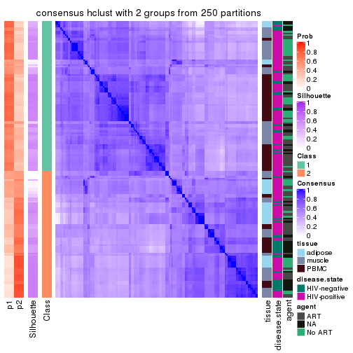</p>

</div>
<div id='tab-SD-hclust-consensus-heatmap-2'>
<pre><code class="r">consensus_heatmap(res, k = 3)
</code></pre>

<p>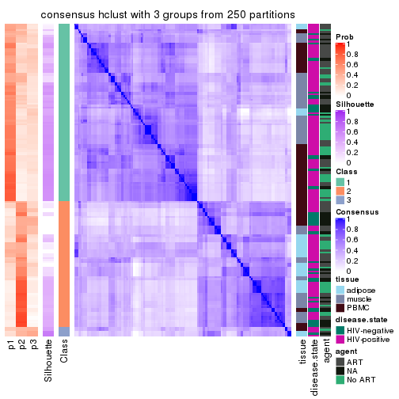</p>

</div>
<div id='tab-SD-hclust-consensus-heatmap-3'>
<pre><code class="r">consensus_heatmap(res, k = 4)
</code></pre>

<p>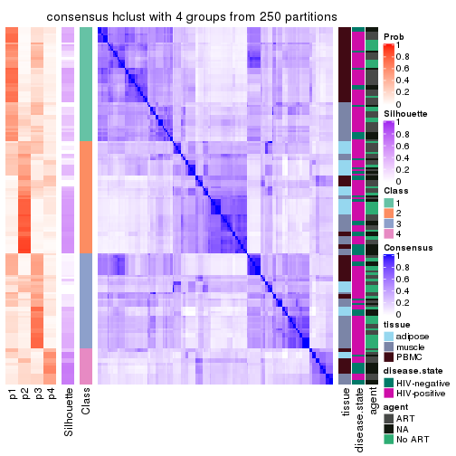</p>

</div>
<div id='tab-SD-hclust-consensus-heatmap-4'>
<pre><code class="r">consensus_heatmap(res, k = 5)
</code></pre>

<p>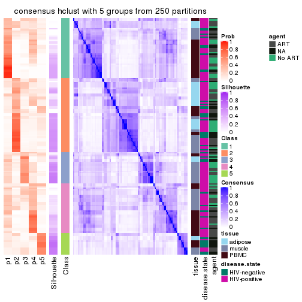</p>

</div>
<div id='tab-SD-hclust-consensus-heatmap-5'>
<pre><code class="r">consensus_heatmap(res, k = 6)
</code></pre>

<p>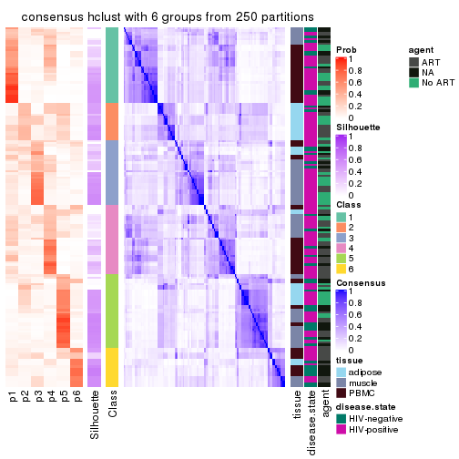</p>

</div>
</div>

Heatmaps for the membership of samples in all partitions to see how consistent they are:


<script>
$( function() {
	$( '#tabs-SD-hclust-membership-heatmap' ).tabs();
} );
</script>
<div id='tabs-SD-hclust-membership-heatmap'>
<ul>
<li><a href='#tab-SD-hclust-membership-heatmap-1'>k = 2</a></li>
<li><a href='#tab-SD-hclust-membership-heatmap-2'>k = 3</a></li>
<li><a href='#tab-SD-hclust-membership-heatmap-3'>k = 4</a></li>
<li><a href='#tab-SD-hclust-membership-heatmap-4'>k = 5</a></li>
<li><a href='#tab-SD-hclust-membership-heatmap-5'>k = 6</a></li>
</ul>
<div id='tab-SD-hclust-membership-heatmap-1'>
<pre><code class="r">membership_heatmap(res, k = 2)
</code></pre>

<p>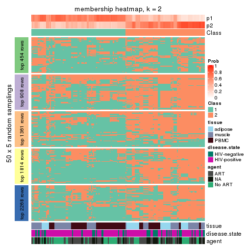</p>

</div>
<div id='tab-SD-hclust-membership-heatmap-2'>
<pre><code class="r">membership_heatmap(res, k = 3)
</code></pre>

<p>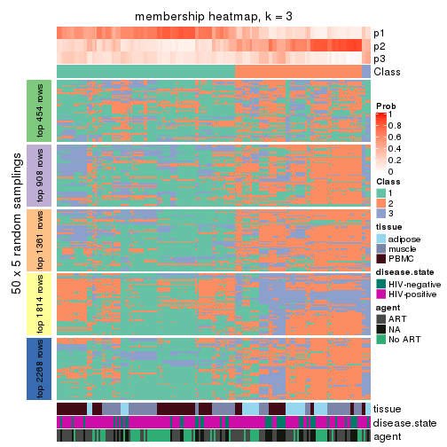</p>

</div>
<div id='tab-SD-hclust-membership-heatmap-3'>
<pre><code class="r">membership_heatmap(res, k = 4)
</code></pre>

<p>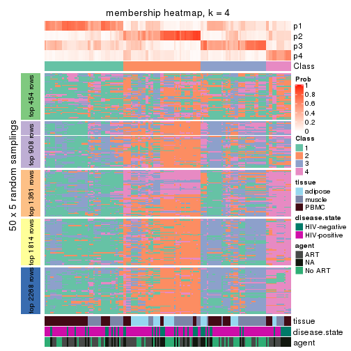</p>

</div>
<div id='tab-SD-hclust-membership-heatmap-4'>
<pre><code class="r">membership_heatmap(res, k = 5)
</code></pre>

<p>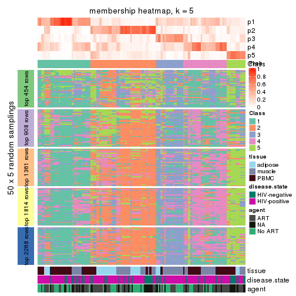</p>

</div>
<div id='tab-SD-hclust-membership-heatmap-5'>
<pre><code class="r">membership_heatmap(res, k = 6)
</code></pre>

<p>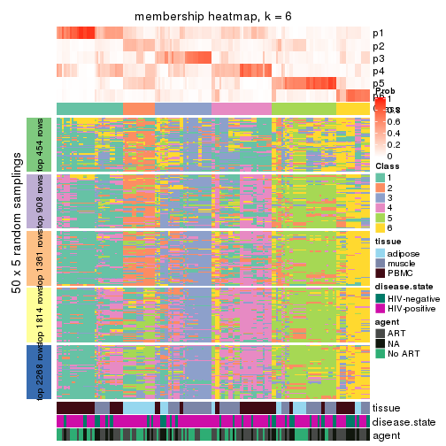</p>

</div>
</div>

As soon as we have had the classes for columns, we can look for signatures
which are significantly different between classes which can be candidate marks
for certain classes. Following are the heatmaps for signatures.


Signature heatmaps where rows are scaled:


<script>
$( function() {
	$( '#tabs-SD-hclust-get-signatures' ).tabs();
} );
</script>
<div id='tabs-SD-hclust-get-signatures'>
<ul>
<li><a href='#tab-SD-hclust-get-signatures-1'>k = 2</a></li>
<li><a href='#tab-SD-hclust-get-signatures-2'>k = 3</a></li>
<li><a href='#tab-SD-hclust-get-signatures-3'>k = 4</a></li>
<li><a href='#tab-SD-hclust-get-signatures-4'>k = 5</a></li>
<li><a href='#tab-SD-hclust-get-signatures-5'>k = 6</a></li>
</ul>
<div id='tab-SD-hclust-get-signatures-1'>
<pre><code class="r">get_signatures(res, k = 2)
</code></pre>

<p>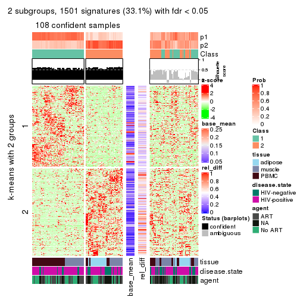</p>

</div>
<div id='tab-SD-hclust-get-signatures-2'>
<pre><code class="r">get_signatures(res, k = 3)
</code></pre>

<p>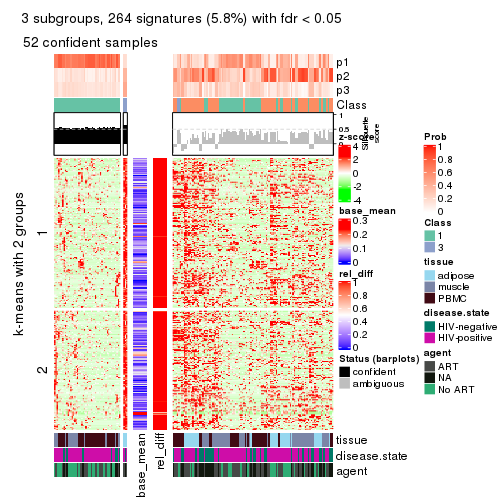</p>

</div>
<div id='tab-SD-hclust-get-signatures-3'>
<pre><code class="r">get_signatures(res, k = 4)
</code></pre>

<p>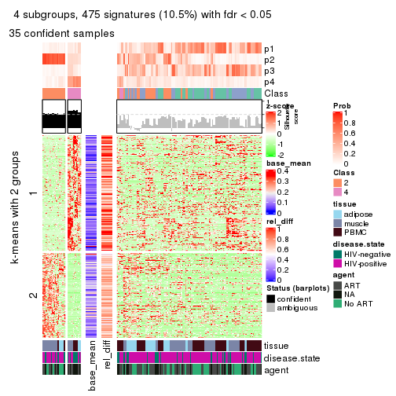</p>

</div>
<div id='tab-SD-hclust-get-signatures-4'>
<pre><code class="r">get_signatures(res, k = 5)
</code></pre>

<p>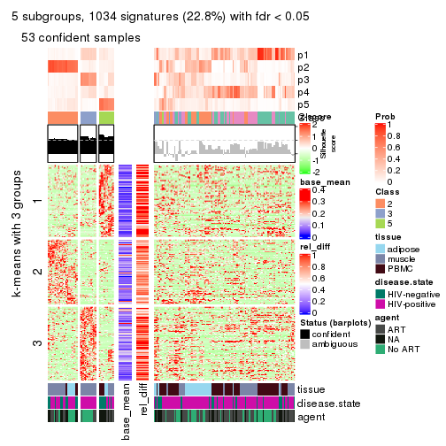</p>

</div>
<div id='tab-SD-hclust-get-signatures-5'>
<pre><code class="r">get_signatures(res, k = 6)
</code></pre>

<p>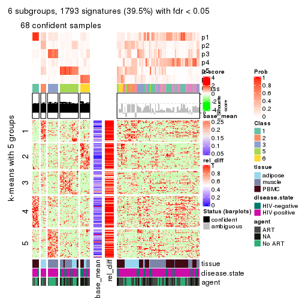</p>

</div>
</div>


Signature heatmaps where rows are not scaled:


<script>
$( function() {
	$( '#tabs-SD-hclust-get-signatures-no-scale' ).tabs();
} );
</script>
<div id='tabs-SD-hclust-get-signatures-no-scale'>
<ul>
<li><a href='#tab-SD-hclust-get-signatures-no-scale-1'>k = 2</a></li>
<li><a href='#tab-SD-hclust-get-signatures-no-scale-2'>k = 3</a></li>
<li><a href='#tab-SD-hclust-get-signatures-no-scale-3'>k = 4</a></li>
<li><a href='#tab-SD-hclust-get-signatures-no-scale-4'>k = 5</a></li>
<li><a href='#tab-SD-hclust-get-signatures-no-scale-5'>k = 6</a></li>
</ul>
<div id='tab-SD-hclust-get-signatures-no-scale-1'>
<pre><code class="r">get_signatures(res, k = 2, scale_rows = FALSE)
</code></pre>

<p>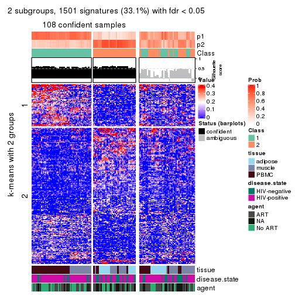</p>

</div>
<div id='tab-SD-hclust-get-signatures-no-scale-2'>
<pre><code class="r">get_signatures(res, k = 3, scale_rows = FALSE)
</code></pre>

<p>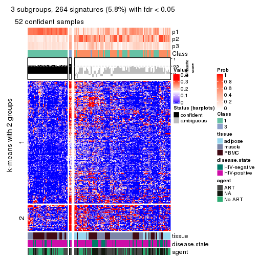</p>

</div>
<div id='tab-SD-hclust-get-signatures-no-scale-3'>
<pre><code class="r">get_signatures(res, k = 4, scale_rows = FALSE)
</code></pre>

<p>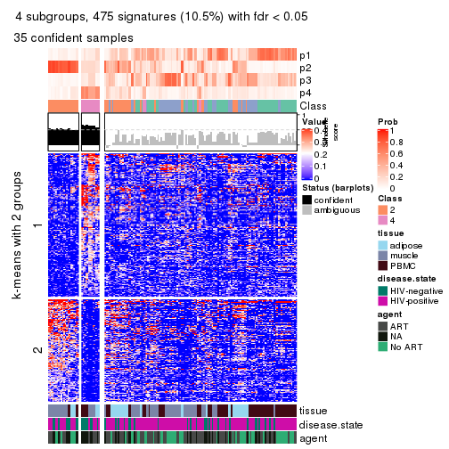</p>

</div>
<div id='tab-SD-hclust-get-signatures-no-scale-4'>
<pre><code class="r">get_signatures(res, k = 5, scale_rows = FALSE)
</code></pre>

<p>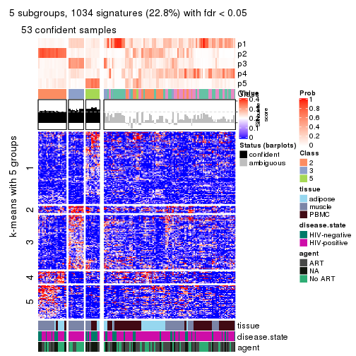</p>

</div>
<div id='tab-SD-hclust-get-signatures-no-scale-5'>
<pre><code class="r">get_signatures(res, k = 6, scale_rows = FALSE)
</code></pre>

<p>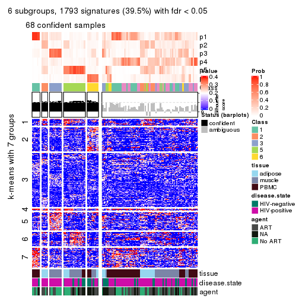</p>

</div>
</div>


Compare the overlap of signatures from different k:

```r
compare_signatures(res)
```

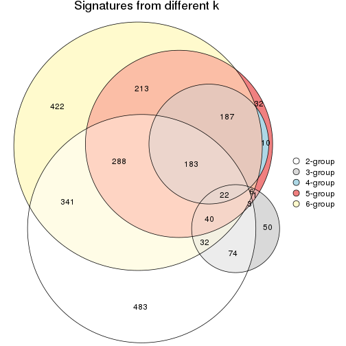

`get_signature()` returns a data frame invisibly. TO get the list of signatures, the function
call should be assigned to a variable explicitly. In following code, if `plot` argument is set
to `FALSE`, no heatmap is plotted while only the differential analysis is performed.

```r
# code only for demonstration
tb = get_signature(res, k = ..., plot = FALSE)
```

An example of the output of `tb` is:

```
#>   which_row         fdr    mean_1    mean_2 scaled_mean_1 scaled_mean_2 km
#> 1        38 0.042760348  8.373488  9.131774    -0.5533452     0.5164555  1
#> 2        40 0.018707592  7.106213  8.469186    -0.6173731     0.5762149  1
#> 3        55 0.019134737 10.221463 11.207825    -0.6159697     0.5749050  1
#> 4        59 0.006059896  5.921854  7.869574    -0.6899429     0.6439467  1
#> 5        60 0.018055526  8.928898 10.211722    -0.6204761     0.5791110  1
#> 6        98 0.009384629 15.714769 14.887706     0.6635654    -0.6193277  2
...
```

The columns in `tb` are:

1. `which_row`: row indices corresponding to the input matrix.
2. `fdr`: FDR for the differential test. 
3. `mean_x`: The mean value in group x.
4. `scaled_mean_x`: The mean value in group x after rows are scaled.
5. `km`: Row groups if k-means clustering is applied to rows.


UMAP plot which shows how samples are separated.


<script>
$( function() {
	$( '#tabs-SD-hclust-dimension-reduction' ).tabs();
} );
</script>
<div id='tabs-SD-hclust-dimension-reduction'>
<ul>
<li><a href='#tab-SD-hclust-dimension-reduction-1'>k = 2</a></li>
<li><a href='#tab-SD-hclust-dimension-reduction-2'>k = 3</a></li>
<li><a href='#tab-SD-hclust-dimension-reduction-3'>k = 4</a></li>
<li><a href='#tab-SD-hclust-dimension-reduction-4'>k = 5</a></li>
<li><a href='#tab-SD-hclust-dimension-reduction-5'>k = 6</a></li>
</ul>
<div id='tab-SD-hclust-dimension-reduction-1'>
<pre><code class="r">dimension_reduction(res, k = 2, method = &quot;UMAP&quot;)
</code></pre>

<p>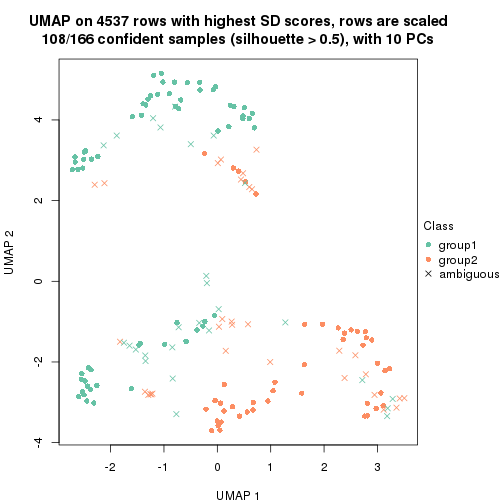</p>

</div>
<div id='tab-SD-hclust-dimension-reduction-2'>
<pre><code class="r">dimension_reduction(res, k = 3, method = &quot;UMAP&quot;)
</code></pre>

<p>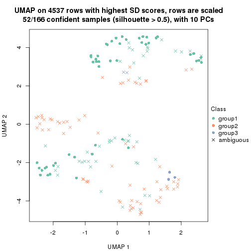</p>

</div>
<div id='tab-SD-hclust-dimension-reduction-3'>
<pre><code class="r">dimension_reduction(res, k = 4, method = &quot;UMAP&quot;)
</code></pre>

<p>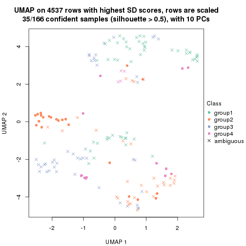</p>

</div>
<div id='tab-SD-hclust-dimension-reduction-4'>
<pre><code class="r">dimension_reduction(res, k = 5, method = &quot;UMAP&quot;)
</code></pre>

<p>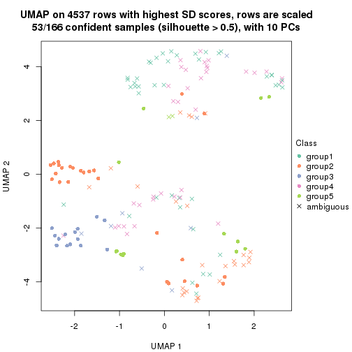</p>

</div>
<div id='tab-SD-hclust-dimension-reduction-5'>
<pre><code class="r">dimension_reduction(res, k = 6, method = &quot;UMAP&quot;)
</code></pre>

<p>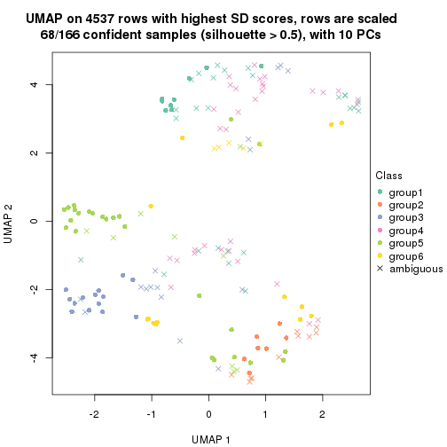</p>

</div>
</div>


Following heatmap shows how subgroups are split when increasing `k`:

```r
collect_classes(res)
```

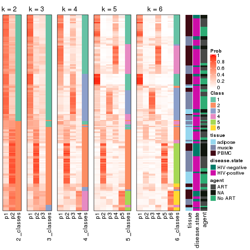


Test correlation between subgroups and known annotations. If the known
annotation is numeric, one-way ANOVA test is applied, and if the known
annotation is discrete, chi-squared contingency table test is applied.

```r
test_to_known_factors(res)
```

```
#>             n tissue(p) disease.state(p) agent(p) k
#> SD:hclust 108  3.48e-09          0.00982 0.012140 2
#> SD:hclust  52  5.11e-12          0.94945 0.247269 3
#> SD:hclust  35  3.07e-01          0.27418 0.068071 4
#> SD:hclust  53  7.56e-03          0.00268 0.001330 5
#> SD:hclust  68  1.07e-10          0.00255 0.000309 6
```


If matrix rows can be associated to genes, consider to use `GO_Enrichment(res,
...)` to perform function enrichment for the signature genes.


 

---------------------------------------------------


### SD:kmeans


The object with results only for a single top-value method and a single partition method 
can be extracted as:

```r
res = res_list["SD", "kmeans"]
# you can also extract it by
# res = res_list["SD:kmeans"]
```

A summary of `res` and all the functions that can be applied to it:

```r
res
```

```
#> A 'ConsensusPartition' object with k = 2, 3, 4, 5, 6.
#>   On a matrix with 4537 rows and 166 columns.
#>   Top rows (454, 908, 1361, 1814, 2268) are extracted by 'SD' method.
#>   Subgroups are detected by 'kmeans' method.
#>   Performed in total 1250 partitions by row resampling.
#>   Best k for subgroups seems to be 3.
#> 
#> Following methods can be applied to this 'ConsensusPartition' object:
#>  [1] "cola_report"             "collect_classes"         "collect_plots"          
#>  [4] "collect_stats"           "colnames"                "compare_signatures"     
#>  [7] "consensus_heatmap"       "dimension_reduction"     "functional_enrichment"  
#> [10] "get_anno_col"            "get_anno"                "get_classes"            
#> [13] "get_consensus"           "get_matrix"              "get_membership"         
#> [16] "get_param"               "get_signatures"          "get_stats"              
#> [19] "is_best_k"               "is_stable_k"             "membership_heatmap"     
#> [22] "ncol"                    "nrow"                    "plot_ecdf"              
#> [25] "rownames"                "select_partition_number" "show"                   
#> [28] "suggest_best_k"          "test_to_known_factors"
```

`collect_plots()` function collects all the plots made from `res` for all `k` (number of partitions)
into one single page to provide an easy and fast comparison between different `k`.

```r
collect_plots(res)
```

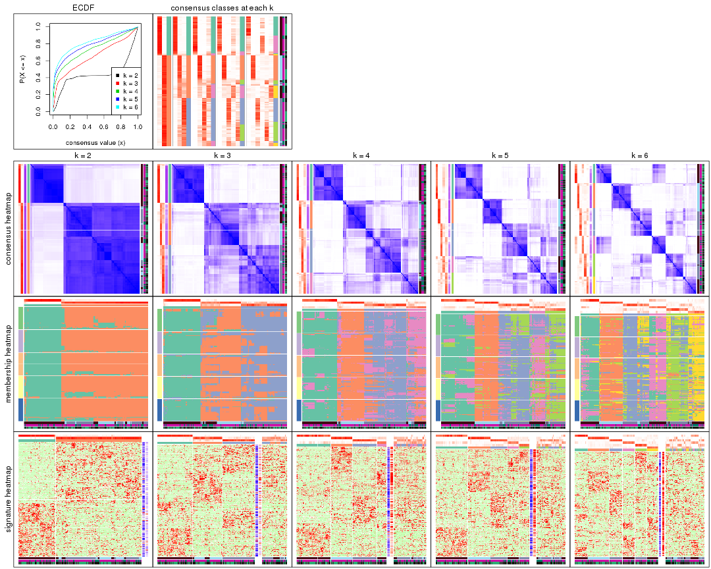

The plots are:

- The first row: a plot of the ECDF (Empirical cumulative distribution
  function) curves of the consensus matrix for each `k` and the heatmap of
  predicted classes for each `k`.
- The second row: heatmaps of the consensus matrix for each `k`.
- The third row: heatmaps of the membership matrix for each `k`.
- The fouth row: heatmaps of the signatures for each `k`.

All the plots in panels can be made by individual functions and they are
plotted later in this section.

`select_partition_number()` produces several plots showing different
statistics for choosing "optimized" `k`. There are following statistics:

- ECDF curves of the consensus matrix for each `k`;
- 1-PAC. [The PAC
  score](https://en.wikipedia.org/wiki/Consensus_clustering#Over-interpretation_potential_of_consensus_clustering)
  measures the proportion of the ambiguous subgrouping.
- Mean silhouette score.
- Concordance. The mean probability of fiting the consensus class ids in all
  partitions.
- Area increased. Denote $A_k$ as the area under the ECDF curve for current
  `k`, the area increased is defined as $A_k - A_{k-1}$.
- Rand index. The percent of pairs of samples that are both in a same cluster
  or both are not in a same cluster in the partition of k and k-1.
- Jaccard index. The ratio of pairs of samples are both in a same cluster in
  the partition of k and k-1 and the pairs of samples are both in a same
  cluster in the partition k or k-1.

The detailed explanations of these statistics can be found in [the cola
vignette](http://bioconductor.org/packages/devel/bioc/vignettes/cola/inst/doc/cola.html#toc_13).

Generally speaking, lower PAC score, higher mean silhouette score or higher
concordance corresponds to better partition. Rand index and Jaccard index
measure how similar the current partition is compared to partition with `k-1`.
If they are too similar, we won't accept `k` is better than `k-1`.

```r
select_partition_number(res)
```

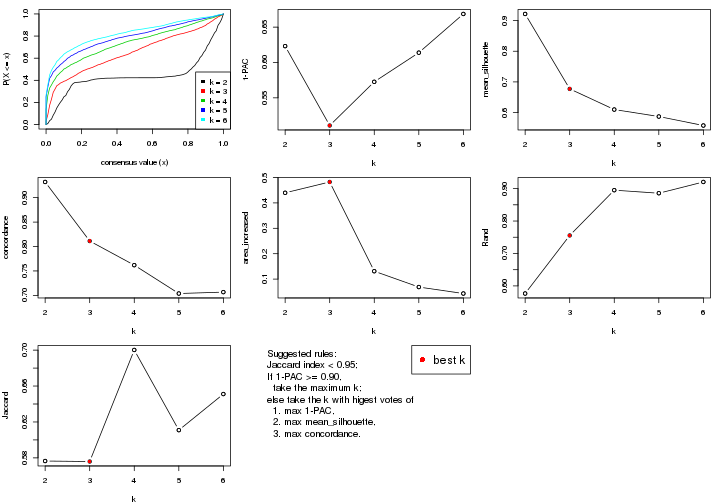

The numeric values for all these statistics can be obtained by `get_stats()`.

```r
get_stats(res)
```

```
#>   k 1-PAC mean_silhouette concordance area_increased  Rand Jaccard
#> 2 2 0.623           0.921       0.932         0.4399 0.576   0.576
#> 3 3 0.511           0.677       0.811         0.4825 0.756   0.576
#> 4 4 0.573           0.610       0.762         0.1310 0.895   0.700
#> 5 5 0.614           0.587       0.704         0.0686 0.886   0.611
#> 6 6 0.669           0.558       0.707         0.0431 0.920   0.651
```

`suggest_best_k()` suggests the best $k$ based on these statistics. The rules are as follows:

- All $k$ with Jaccard index larger than 0.95 are removed because the increase of
  the partition number does not provides enough extra information. If all $k$ are removed,
  the best $k$ is assigned by `NA`.
- For $k$ with 1-PAC larger than 0.9, the maximal $k$ is taken as the "best k". Other $k$ is called "optional k".
- If it does not fit the second rule. The $k$ with the highest vote of highest
  1-PAC, mean silhouette and concordance is taken as the "best k".

```r
suggest_best_k(res)
```

```
#> [1] 3
```


Following shows the table of the partitions (You need to click the **show/hide
code output** link to see it). The membership matrix (columns with name `p*`)
is inferred by
[`clue::cl_consensus()`](https://www.rdocumentation.org/link/cl_consensus?package=clue)
function with the `SE` method. Basically the value in the membership matrix
represents the probability to belong to a certain group. The finall class
label for an item is determined with the group with highest probability it
belongs to.

In `get_classes()` function, the entropy is calculated from the membership
matrix and the silhouette score is calculated from the consensus matrix.


<script>
$( function() {
	$( '#tabs-SD-kmeans-get-classes' ).tabs();
} );
</script>
<div id='tabs-SD-kmeans-get-classes'>
<ul>
<li><a href='#tab-SD-kmeans-get-classes-1'>k = 2</a></li>
<li><a href='#tab-SD-kmeans-get-classes-2'>k = 3</a></li>
<li><a href='#tab-SD-kmeans-get-classes-3'>k = 4</a></li>
<li><a href='#tab-SD-kmeans-get-classes-4'>k = 5</a></li>
<li><a href='#tab-SD-kmeans-get-classes-5'>k = 6</a></li>
</ul>

<div id='tab-SD-kmeans-get-classes-1'>
<p><a id='tab-SD-kmeans-get-classes-1-a' style='color:#0366d6' href='#'>show/hide code output</a></p>
<pre><code class="r">cbind(get_classes(res, k = 2), get_membership(res, k = 2))
</code></pre>

<pre><code>#&gt;           class entropy silhouette    p1    p2
#&gt; GSM751298     1  0.0672      0.968 0.992 0.008
#&gt; GSM751304     2  0.3584      0.927 0.068 0.932
#&gt; GSM751305     2  0.3879      0.928 0.076 0.924
#&gt; GSM751307     2  0.4562      0.921 0.096 0.904
#&gt; GSM751310     1  0.1184      0.967 0.984 0.016
#&gt; GSM751314     1  0.1184      0.967 0.984 0.016
#&gt; GSM751316     1  0.1843      0.960 0.972 0.028
#&gt; GSM751318     1  0.0672      0.968 0.992 0.008
#&gt; GSM751342     1  0.1414      0.966 0.980 0.020
#&gt; GSM751346     1  0.1633      0.958 0.976 0.024
#&gt; GSM751347     1  0.7299      0.733 0.796 0.204
#&gt; GSM751348     2  0.4298      0.927 0.088 0.912
#&gt; GSM751349     2  0.2043      0.928 0.032 0.968
#&gt; GSM751352     2  0.8144      0.734 0.252 0.748
#&gt; GSM751353     2  0.2778      0.929 0.048 0.952
#&gt; GSM751354     2  0.3584      0.925 0.068 0.932
#&gt; GSM751355     2  0.1414      0.927 0.020 0.980
#&gt; GSM751358     2  0.3114      0.932 0.056 0.944
#&gt; GSM751359     2  0.2043      0.928 0.032 0.968
#&gt; GSM751294     2  0.2236      0.928 0.036 0.964
#&gt; GSM751296     1  0.1184      0.962 0.984 0.016
#&gt; GSM751297     1  0.4298      0.915 0.912 0.088
#&gt; GSM751299     2  0.8207      0.711 0.256 0.744
#&gt; GSM751300     1  0.1184      0.962 0.984 0.016
#&gt; GSM751301     1  0.4161      0.899 0.916 0.084
#&gt; GSM751302     1  0.1633      0.958 0.976 0.024
#&gt; GSM751303     1  0.1184      0.967 0.984 0.016
#&gt; GSM751306     1  0.1184      0.967 0.984 0.016
#&gt; GSM751308     1  0.7299      0.745 0.796 0.204
#&gt; GSM751309     1  0.1184      0.967 0.984 0.016
#&gt; GSM751311     1  0.0938      0.967 0.988 0.012
#&gt; GSM751312     1  0.1184      0.967 0.984 0.016
#&gt; GSM751313     1  0.1414      0.960 0.980 0.020
#&gt; GSM751315     1  0.0938      0.967 0.988 0.012
#&gt; GSM751317     1  0.1184      0.967 0.984 0.016
#&gt; GSM751320     1  0.0672      0.968 0.992 0.008
#&gt; GSM751321     1  0.1184      0.967 0.984 0.016
#&gt; GSM751322     1  0.0938      0.967 0.988 0.012
#&gt; GSM751324     1  0.0672      0.968 0.992 0.008
#&gt; GSM751325     1  0.0938      0.967 0.988 0.012
#&gt; GSM751332     1  0.0938      0.967 0.988 0.012
#&gt; GSM751334     1  0.0938      0.967 0.988 0.012
#&gt; GSM751339     1  0.1633      0.958 0.976 0.024
#&gt; GSM751341     1  0.0938      0.967 0.988 0.012
#&gt; GSM751343     1  0.0672      0.968 0.992 0.008
#&gt; GSM751344     2  0.4939      0.899 0.108 0.892
#&gt; GSM751345     2  0.4939      0.899 0.108 0.892
#&gt; GSM751356     2  0.7950      0.740 0.240 0.760
#&gt; GSM751357     2  0.7950      0.740 0.240 0.760
#&gt; GSM751293     1  0.4022      0.903 0.920 0.080
#&gt; GSM751295     1  0.1633      0.958 0.976 0.024
#&gt; GSM751319     1  0.0938      0.967 0.988 0.012
#&gt; GSM751323     1  0.0376      0.967 0.996 0.004
#&gt; GSM751326     1  0.0938      0.965 0.988 0.012
#&gt; GSM751327     1  0.0672      0.968 0.992 0.008
#&gt; GSM751328     1  0.0938      0.967 0.988 0.012
#&gt; GSM751329     1  0.0938      0.967 0.988 0.012
#&gt; GSM751330     1  0.0376      0.967 0.996 0.004
#&gt; GSM751331     1  0.1843      0.959 0.972 0.028
#&gt; GSM751333     1  0.1184      0.962 0.984 0.016
#&gt; GSM751335     1  0.0376      0.967 0.996 0.004
#&gt; GSM751336     1  0.1633      0.958 0.976 0.024
#&gt; GSM751337     1  0.1414      0.960 0.980 0.020
#&gt; GSM751338     1  0.1633      0.958 0.976 0.024
#&gt; GSM751340     1  0.8713      0.564 0.708 0.292
#&gt; GSM751350     1  0.1633      0.958 0.976 0.024
#&gt; GSM751351     1  0.1633      0.958 0.976 0.024
#&gt; GSM751362     2  0.5408      0.898 0.124 0.876
#&gt; GSM751363     2  0.3733      0.928 0.072 0.928
#&gt; GSM751367     2  0.5946      0.896 0.144 0.856
#&gt; GSM751368     2  0.2603      0.931 0.044 0.956
#&gt; GSM751371     2  0.5842      0.903 0.140 0.860
#&gt; GSM751375     2  0.2043      0.928 0.032 0.968
#&gt; GSM751376     2  0.2603      0.930 0.044 0.956
#&gt; GSM751378     2  0.0938      0.926 0.012 0.988
#&gt; GSM751379     2  0.2948      0.930 0.052 0.948
#&gt; GSM751382     2  0.2043      0.928 0.032 0.968
#&gt; GSM751386     2  0.1843      0.928 0.028 0.972
#&gt; GSM751388     2  0.2236      0.929 0.036 0.964
#&gt; GSM751391     2  0.2423      0.931 0.040 0.960
#&gt; GSM751410     2  0.5842      0.899 0.140 0.860
#&gt; GSM751414     2  0.5737      0.898 0.136 0.864
#&gt; GSM751361     2  0.2236      0.929 0.036 0.964
#&gt; GSM751365     2  0.5519      0.905 0.128 0.872
#&gt; GSM751366     2  0.5842      0.897 0.140 0.860
#&gt; GSM751369     2  0.5629      0.899 0.132 0.868
#&gt; GSM751370     2  0.5737      0.898 0.136 0.864
#&gt; GSM751372     2  0.5408      0.906 0.124 0.876
#&gt; GSM751373     2  0.5737      0.902 0.136 0.864
#&gt; GSM751374     2  0.2948      0.930 0.052 0.948
#&gt; GSM751377     2  0.2236      0.929 0.036 0.964
#&gt; GSM751380     2  0.5294      0.899 0.120 0.880
#&gt; GSM751381     2  0.1843      0.928 0.028 0.972
#&gt; GSM751383     2  0.2603      0.930 0.044 0.956
#&gt; GSM751384     2  0.1633      0.928 0.024 0.976
#&gt; GSM751385     2  0.0672      0.926 0.008 0.992
#&gt; GSM751387     2  0.2043      0.928 0.032 0.968
#&gt; GSM751389     2  0.3879      0.922 0.076 0.924
#&gt; GSM751393     2  0.0938      0.928 0.012 0.988
#&gt; GSM751394     2  0.1843      0.928 0.028 0.972
#&gt; GSM751395     2  0.1184      0.927 0.016 0.984
#&gt; GSM751397     2  0.1843      0.928 0.028 0.972
#&gt; GSM751398     2  0.1843      0.928 0.028 0.972
#&gt; GSM751404     2  0.5519      0.898 0.128 0.872
#&gt; GSM751406     2  0.5408      0.901 0.124 0.876
#&gt; GSM751411     2  0.5294      0.911 0.120 0.880
#&gt; GSM751413     2  0.2603      0.930 0.044 0.956
#&gt; GSM751415     2  0.5294      0.899 0.120 0.880
#&gt; GSM751416     2  0.2778      0.930 0.048 0.952
#&gt; GSM751417     2  0.2778      0.930 0.048 0.952
#&gt; GSM751421     2  0.5737      0.900 0.136 0.864
#&gt; GSM751422     2  0.5737      0.900 0.136 0.864
#&gt; GSM751360     2  0.5519      0.907 0.128 0.872
#&gt; GSM751364     2  0.4939      0.917 0.108 0.892
#&gt; GSM751390     2  0.2236      0.930 0.036 0.964
#&gt; GSM751392     2  0.1843      0.928 0.028 0.972
#&gt; GSM751396     2  0.2236      0.929 0.036 0.964
#&gt; GSM751399     2  0.4690      0.911 0.100 0.900
#&gt; GSM751400     2  0.5178      0.908 0.116 0.884
#&gt; GSM751401     2  0.5629      0.897 0.132 0.868
#&gt; GSM751402     2  0.5737      0.897 0.136 0.864
#&gt; GSM751403     2  0.5294      0.906 0.120 0.880
#&gt; GSM751405     2  0.5519      0.898 0.128 0.872
#&gt; GSM751407     2  0.5408      0.903 0.124 0.876
#&gt; GSM751408     2  0.5059      0.908 0.112 0.888
#&gt; GSM751409     2  0.3879      0.921 0.076 0.924
#&gt; GSM751412     2  0.5059      0.908 0.112 0.888
#&gt; GSM751418     2  0.5629      0.904 0.132 0.868
#&gt; GSM751419     2  0.5629      0.904 0.132 0.868
#&gt; GSM751420     2  0.3879      0.923 0.076 0.924
#&gt; GSM751425     2  0.2236      0.929 0.036 0.964
#&gt; GSM751429     2  0.5294      0.910 0.120 0.880
#&gt; GSM751430     2  0.3114      0.931 0.056 0.944
#&gt; GSM751433     2  0.4161      0.920 0.084 0.916
#&gt; GSM751437     2  0.4562      0.919 0.096 0.904
#&gt; GSM751448     2  0.5629      0.902 0.132 0.868
#&gt; GSM751451     2  0.4161      0.920 0.084 0.916
#&gt; GSM751423     2  0.2423      0.928 0.040 0.960
#&gt; GSM751424     2  0.4161      0.920 0.084 0.916
#&gt; GSM751428     2  0.3879      0.920 0.076 0.924
#&gt; GSM751431     2  0.4161      0.920 0.084 0.916
#&gt; GSM751432     2  0.3879      0.923 0.076 0.924
#&gt; GSM751434     2  0.4161      0.920 0.084 0.916
#&gt; GSM751435     2  0.4022      0.920 0.080 0.920
#&gt; GSM751436     2  0.4161      0.920 0.084 0.916
#&gt; GSM751440     2  0.4161      0.920 0.084 0.916
#&gt; GSM751444     2  0.3733      0.920 0.072 0.928
#&gt; GSM751446     2  0.3431      0.923 0.064 0.936
#&gt; GSM751449     2  0.1843      0.927 0.028 0.972
#&gt; GSM751450     2  0.4161      0.920 0.084 0.916
#&gt; GSM751452     2  0.4161      0.920 0.084 0.916
#&gt; GSM751426     2  0.4161      0.920 0.084 0.916
#&gt; GSM751427     2  0.3733      0.921 0.072 0.928
#&gt; GSM751438     2  0.3274      0.923 0.060 0.940
#&gt; GSM751439     2  0.5629      0.906 0.132 0.868
#&gt; GSM751441     2  0.2423      0.928 0.040 0.960
#&gt; GSM751442     2  0.3879      0.919 0.076 0.924
#&gt; GSM751443     2  0.4939      0.918 0.108 0.892
#&gt; GSM751445     2  0.2043      0.927 0.032 0.968
#&gt; GSM751447     2  0.2603      0.928 0.044 0.956
#&gt; GSM751453     2  0.3879      0.921 0.076 0.924
#&gt; GSM751454     2  0.3879      0.921 0.076 0.924
#&gt; GSM751455     2  0.3879      0.919 0.076 0.924
#&gt; GSM751456     2  0.3879      0.919 0.076 0.924
#&gt; GSM751457     2  0.1843      0.927 0.028 0.972
#&gt; GSM751458     2  0.1843      0.927 0.028 0.972
</code></pre>

<script>
$('#tab-SD-kmeans-get-classes-1-a').parent().next().next().hide();
$('#tab-SD-kmeans-get-classes-1-a').click(function(){
  $('#tab-SD-kmeans-get-classes-1-a').parent().next().next().toggle();
  return(false);
});
</script>
</div>

<div id='tab-SD-kmeans-get-classes-2'>
<p><a id='tab-SD-kmeans-get-classes-2-a' style='color:#0366d6' href='#'>show/hide code output</a></p>
<pre><code class="r">cbind(get_classes(res, k = 3), get_membership(res, k = 3))
</code></pre>

<pre><code>#&gt;           class entropy silhouette    p1    p2    p3
#&gt; GSM751298     1   0.191     0.9392 0.956 0.028 0.016
#&gt; GSM751304     2   0.781     0.4122 0.056 0.548 0.396
#&gt; GSM751305     2   0.795     0.4248 0.064 0.548 0.388
#&gt; GSM751307     2   0.747     0.5464 0.072 0.656 0.272
#&gt; GSM751310     1   0.232     0.9299 0.944 0.028 0.028
#&gt; GSM751314     1   0.244     0.9301 0.940 0.032 0.028
#&gt; GSM751316     1   0.456     0.8777 0.860 0.064 0.076
#&gt; GSM751318     1   0.256     0.9376 0.936 0.036 0.028
#&gt; GSM751342     1   0.232     0.9319 0.944 0.028 0.028
#&gt; GSM751346     1   0.275     0.9277 0.924 0.064 0.012
#&gt; GSM751347     1   0.425     0.8950 0.872 0.080 0.048
#&gt; GSM751348     2   0.772     0.5857 0.068 0.612 0.320
#&gt; GSM751349     2   0.596     0.5549 0.008 0.692 0.300
#&gt; GSM751352     2   0.822     0.5439 0.152 0.636 0.212
#&gt; GSM751353     2   0.618     0.6038 0.024 0.716 0.260
#&gt; GSM751354     2   0.766     0.4462 0.052 0.572 0.376
#&gt; GSM751355     2   0.679     0.5148 0.028 0.648 0.324
#&gt; GSM751358     2   0.753     0.4380 0.040 0.536 0.424
#&gt; GSM751359     2   0.618     0.4964 0.008 0.660 0.332
#&gt; GSM751294     2   0.728     0.4738 0.036 0.588 0.376
#&gt; GSM751296     1   0.191     0.9391 0.956 0.028 0.016
#&gt; GSM751297     1   0.660     0.7322 0.748 0.084 0.168
#&gt; GSM751299     2   0.828     0.5425 0.160 0.632 0.208
#&gt; GSM751300     1   0.206     0.9359 0.948 0.044 0.008
#&gt; GSM751301     1   0.280     0.9166 0.924 0.060 0.016
#&gt; GSM751302     1   0.275     0.9277 0.924 0.064 0.012
#&gt; GSM751303     1   0.244     0.9301 0.940 0.032 0.028
#&gt; GSM751306     1   0.244     0.9301 0.940 0.032 0.028
#&gt; GSM751308     1   0.885     0.3862 0.568 0.264 0.168
#&gt; GSM751309     1   0.244     0.9301 0.940 0.032 0.028
#&gt; GSM751311     1   0.205     0.9337 0.952 0.020 0.028
#&gt; GSM751312     1   0.295     0.9218 0.920 0.060 0.020
#&gt; GSM751313     1   0.205     0.9375 0.952 0.028 0.020
#&gt; GSM751315     1   0.117     0.9382 0.976 0.008 0.016
#&gt; GSM751317     1   0.219     0.9320 0.948 0.024 0.028
#&gt; GSM751320     1   0.177     0.9400 0.960 0.024 0.016
#&gt; GSM751321     1   0.232     0.9299 0.944 0.028 0.028
#&gt; GSM751322     1   0.164     0.9395 0.964 0.016 0.020
#&gt; GSM751324     1   0.164     0.9395 0.964 0.016 0.020
#&gt; GSM751325     1   0.192     0.9390 0.956 0.024 0.020
#&gt; GSM751332     1   0.192     0.9390 0.956 0.024 0.020
#&gt; GSM751334     1   0.177     0.9398 0.960 0.024 0.016
#&gt; GSM751339     1   0.392     0.9031 0.884 0.036 0.080
#&gt; GSM751341     1   0.164     0.9381 0.964 0.016 0.020
#&gt; GSM751343     1   0.177     0.9398 0.960 0.024 0.016
#&gt; GSM751344     2   0.767     0.5830 0.084 0.648 0.268
#&gt; GSM751345     2   0.767     0.5830 0.084 0.648 0.268
#&gt; GSM751356     2   0.876     0.4929 0.160 0.576 0.264
#&gt; GSM751357     2   0.876     0.4929 0.160 0.576 0.264
#&gt; GSM751293     1   0.280     0.9166 0.924 0.060 0.016
#&gt; GSM751295     1   0.275     0.9277 0.924 0.064 0.012
#&gt; GSM751319     1   0.177     0.9357 0.960 0.016 0.024
#&gt; GSM751323     1   0.177     0.9400 0.960 0.024 0.016
#&gt; GSM751326     1   0.191     0.9397 0.956 0.028 0.016
#&gt; GSM751327     1   0.177     0.9398 0.960 0.024 0.016
#&gt; GSM751328     1   0.148     0.9392 0.968 0.012 0.020
#&gt; GSM751329     1   0.177     0.9392 0.960 0.024 0.016
#&gt; GSM751330     1   0.223     0.9385 0.944 0.044 0.012
#&gt; GSM751331     1   0.249     0.9309 0.932 0.060 0.008
#&gt; GSM751333     1   0.238     0.9377 0.940 0.044 0.016
#&gt; GSM751335     1   0.223     0.9385 0.944 0.044 0.012
#&gt; GSM751336     1   0.265     0.9295 0.928 0.060 0.012
#&gt; GSM751337     1   0.231     0.9381 0.944 0.032 0.024
#&gt; GSM751338     1   0.231     0.9395 0.944 0.032 0.024
#&gt; GSM751340     1   0.930     0.1683 0.456 0.164 0.380
#&gt; GSM751350     1   0.275     0.9277 0.924 0.064 0.012
#&gt; GSM751351     1   0.275     0.9277 0.924 0.064 0.012
#&gt; GSM751362     3   0.215     0.6983 0.016 0.036 0.948
#&gt; GSM751363     3   0.520     0.6405 0.004 0.236 0.760
#&gt; GSM751367     3   0.689     0.5940 0.112 0.152 0.736
#&gt; GSM751368     3   0.619     0.5102 0.004 0.364 0.632
#&gt; GSM751371     3   0.454     0.6082 0.016 0.148 0.836
#&gt; GSM751375     2   0.581     0.4805 0.000 0.664 0.336
#&gt; GSM751376     3   0.623     0.3395 0.012 0.316 0.672
#&gt; GSM751378     3   0.556     0.4267 0.000 0.300 0.700
#&gt; GSM751379     3   0.623     0.3395 0.012 0.316 0.672
#&gt; GSM751382     2   0.593     0.4260 0.000 0.644 0.356
#&gt; GSM751386     3   0.626     0.2893 0.000 0.448 0.552
#&gt; GSM751388     3   0.631     0.2565 0.000 0.488 0.512
#&gt; GSM751391     3   0.483     0.5294 0.004 0.204 0.792
#&gt; GSM751410     3   0.303     0.6726 0.012 0.076 0.912
#&gt; GSM751414     3   0.384     0.7029 0.012 0.116 0.872
#&gt; GSM751361     3   0.573     0.5580 0.000 0.324 0.676
#&gt; GSM751365     3   0.457     0.6933 0.012 0.160 0.828
#&gt; GSM751366     3   0.392     0.7118 0.016 0.112 0.872
#&gt; GSM751369     3   0.407     0.6382 0.016 0.120 0.864
#&gt; GSM751370     3   0.384     0.7029 0.012 0.116 0.872
#&gt; GSM751372     3   0.475     0.6875 0.012 0.172 0.816
#&gt; GSM751373     3   0.497     0.6838 0.012 0.188 0.800
#&gt; GSM751374     3   0.623     0.3395 0.012 0.316 0.672
#&gt; GSM751377     3   0.583     0.5399 0.000 0.340 0.660
#&gt; GSM751380     3   0.290     0.7085 0.016 0.064 0.920
#&gt; GSM751381     3   0.624     0.2929 0.000 0.440 0.560
#&gt; GSM751383     3   0.631     0.2400 0.000 0.496 0.504
#&gt; GSM751384     3   0.590     0.4815 0.000 0.352 0.648
#&gt; GSM751385     3   0.412     0.6613 0.000 0.168 0.832
#&gt; GSM751387     3   0.631     0.2488 0.000 0.488 0.512
#&gt; GSM751389     3   0.240     0.7095 0.004 0.064 0.932
#&gt; GSM751393     3   0.259     0.7018 0.004 0.072 0.924
#&gt; GSM751394     3   0.624     0.2826 0.000 0.440 0.560
#&gt; GSM751395     3   0.587     0.3812 0.004 0.312 0.684
#&gt; GSM751397     3   0.623     0.2936 0.000 0.436 0.564
#&gt; GSM751398     3   0.623     0.3030 0.000 0.436 0.564
#&gt; GSM751404     3   0.377     0.7084 0.016 0.104 0.880
#&gt; GSM751406     3   0.215     0.6914 0.016 0.036 0.948
#&gt; GSM751411     3   0.304     0.7109 0.008 0.084 0.908
#&gt; GSM751413     3   0.566     0.5730 0.004 0.284 0.712
#&gt; GSM751415     3   0.309     0.7081 0.016 0.072 0.912
#&gt; GSM751416     3   0.550     0.5993 0.000 0.292 0.708
#&gt; GSM751417     3   0.550     0.5993 0.000 0.292 0.708
#&gt; GSM751421     3   0.336     0.6685 0.016 0.084 0.900
#&gt; GSM751422     3   0.336     0.6685 0.016 0.084 0.900
#&gt; GSM751360     3   0.200     0.7050 0.012 0.036 0.952
#&gt; GSM751364     3   0.522     0.6684 0.012 0.208 0.780
#&gt; GSM751390     3   0.618     0.4240 0.000 0.416 0.584
#&gt; GSM751392     2   0.631    -0.0734 0.000 0.512 0.488
#&gt; GSM751396     2   0.630    -0.1251 0.000 0.528 0.472
#&gt; GSM751399     3   0.309     0.7153 0.016 0.072 0.912
#&gt; GSM751400     3   0.414     0.7038 0.016 0.124 0.860
#&gt; GSM751401     3   0.385     0.7009 0.016 0.108 0.876
#&gt; GSM751402     3   0.336     0.7061 0.016 0.084 0.900
#&gt; GSM751403     3   0.336     0.7061 0.016 0.084 0.900
#&gt; GSM751405     3   0.238     0.6887 0.016 0.044 0.940
#&gt; GSM751407     3   0.414     0.7038 0.016 0.124 0.860
#&gt; GSM751408     3   0.448     0.7061 0.016 0.144 0.840
#&gt; GSM751409     3   0.203     0.7033 0.016 0.032 0.952
#&gt; GSM751412     3   0.448     0.7061 0.016 0.144 0.840
#&gt; GSM751418     3   0.527     0.6687 0.012 0.212 0.776
#&gt; GSM751419     3   0.527     0.6687 0.012 0.212 0.776
#&gt; GSM751420     3   0.499     0.5979 0.024 0.160 0.816
#&gt; GSM751425     2   0.392     0.7080 0.004 0.856 0.140
#&gt; GSM751429     3   0.651     0.3855 0.028 0.284 0.688
#&gt; GSM751430     2   0.613     0.4990 0.016 0.700 0.284
#&gt; GSM751433     2   0.374     0.7199 0.036 0.892 0.072
#&gt; GSM751437     3   0.647     0.2632 0.016 0.332 0.652
#&gt; GSM751448     3   0.644     0.4038 0.028 0.276 0.696
#&gt; GSM751451     2   0.355     0.7194 0.036 0.900 0.064
#&gt; GSM751423     2   0.390     0.7135 0.008 0.864 0.128
#&gt; GSM751424     2   0.374     0.7199 0.036 0.892 0.072
#&gt; GSM751428     2   0.341     0.7237 0.028 0.904 0.068
#&gt; GSM751431     2   0.374     0.7199 0.036 0.892 0.072
#&gt; GSM751432     2   0.371     0.7193 0.032 0.892 0.076
#&gt; GSM751434     2   0.374     0.7199 0.036 0.892 0.072
#&gt; GSM751435     2   0.308     0.7230 0.024 0.916 0.060
#&gt; GSM751436     2   0.374     0.7199 0.036 0.892 0.072
#&gt; GSM751440     2   0.346     0.7208 0.036 0.904 0.060
#&gt; GSM751444     2   0.420     0.7257 0.024 0.864 0.112
#&gt; GSM751446     2   0.407     0.7251 0.016 0.864 0.120
#&gt; GSM751449     2   0.426     0.7200 0.012 0.848 0.140
#&gt; GSM751450     2   0.353     0.7216 0.032 0.900 0.068
#&gt; GSM751452     2   0.374     0.7199 0.036 0.892 0.072
#&gt; GSM751426     2   0.374     0.7199 0.036 0.892 0.072
#&gt; GSM751427     2   0.305     0.7239 0.020 0.916 0.064
#&gt; GSM751438     2   0.420     0.7228 0.024 0.864 0.112
#&gt; GSM751439     2   0.666     0.5048 0.028 0.668 0.304
#&gt; GSM751441     2   0.414     0.7275 0.020 0.864 0.116
#&gt; GSM751442     2   0.440     0.7225 0.028 0.856 0.116
#&gt; GSM751443     2   0.692     0.2804 0.016 0.536 0.448
#&gt; GSM751445     2   0.447     0.7085 0.004 0.820 0.176
#&gt; GSM751447     2   0.399     0.7278 0.020 0.872 0.108
#&gt; GSM751453     2   0.298     0.7232 0.024 0.920 0.056
#&gt; GSM751454     2   0.298     0.7232 0.024 0.920 0.056
#&gt; GSM751455     2   0.440     0.7225 0.028 0.856 0.116
#&gt; GSM751456     2   0.440     0.7225 0.028 0.856 0.116
#&gt; GSM751457     2   0.599     0.6164 0.008 0.688 0.304
#&gt; GSM751458     2   0.599     0.6164 0.008 0.688 0.304
</code></pre>

<script>
$('#tab-SD-kmeans-get-classes-2-a').parent().next().next().hide();
$('#tab-SD-kmeans-get-classes-2-a').click(function(){
  $('#tab-SD-kmeans-get-classes-2-a').parent().next().next().toggle();
  return(false);
});
</script>
</div>

<div id='tab-SD-kmeans-get-classes-3'>
<p><a id='tab-SD-kmeans-get-classes-3-a' style='color:#0366d6' href='#'>show/hide code output</a></p>
<pre><code class="r">cbind(get_classes(res, k = 4), get_membership(res, k = 4))
</code></pre>

<pre><code>#&gt;           class entropy silhouette    p1    p2    p3    p4
#&gt; GSM751298     1  0.0376    0.86749 0.992 0.004 0.000 0.004
#&gt; GSM751304     4  0.5132    0.63668 0.000 0.184 0.068 0.748
#&gt; GSM751305     4  0.5250    0.63227 0.000 0.196 0.068 0.736
#&gt; GSM751307     4  0.6598    0.50074 0.036 0.300 0.044 0.620
#&gt; GSM751310     1  0.3544    0.81352 0.852 0.008 0.012 0.128
#&gt; GSM751314     1  0.3432    0.81663 0.860 0.008 0.012 0.120
#&gt; GSM751316     1  0.5453    0.56952 0.620 0.008 0.012 0.360
#&gt; GSM751318     1  0.1256    0.86321 0.964 0.008 0.000 0.028
#&gt; GSM751342     1  0.3272    0.81596 0.860 0.008 0.004 0.128
#&gt; GSM751346     1  0.4803    0.80096 0.732 0.008 0.012 0.248
#&gt; GSM751347     1  0.5155    0.78923 0.716 0.008 0.024 0.252
#&gt; GSM751348     4  0.7684    0.46489 0.064 0.328 0.072 0.536
#&gt; GSM751349     2  0.7049   -0.08477 0.000 0.484 0.124 0.392
#&gt; GSM751352     4  0.5396    0.60487 0.016 0.240 0.028 0.716
#&gt; GSM751353     4  0.5669    0.44736 0.004 0.372 0.024 0.600
#&gt; GSM751354     4  0.4978    0.63417 0.004 0.180 0.052 0.764
#&gt; GSM751355     4  0.5416    0.57935 0.000 0.260 0.048 0.692
#&gt; GSM751358     4  0.7373    0.59128 0.044 0.232 0.112 0.612
#&gt; GSM751359     4  0.6805    0.31808 0.000 0.400 0.100 0.500
#&gt; GSM751294     4  0.5598    0.63122 0.000 0.220 0.076 0.704
#&gt; GSM751296     1  0.2530    0.86349 0.912 0.008 0.008 0.072
#&gt; GSM751297     4  0.6086   -0.21354 0.412 0.008 0.032 0.548
#&gt; GSM751299     4  0.5313    0.60122 0.012 0.244 0.028 0.716
#&gt; GSM751300     1  0.4569    0.81815 0.760 0.008 0.012 0.220
#&gt; GSM751301     1  0.3353    0.84489 0.880 0.060 0.004 0.056
#&gt; GSM751302     1  0.4803    0.80096 0.732 0.008 0.012 0.248
#&gt; GSM751303     1  0.3598    0.80828 0.848 0.008 0.012 0.132
#&gt; GSM751306     1  0.3489    0.81386 0.856 0.008 0.012 0.124
#&gt; GSM751308     4  0.8150    0.08033 0.412 0.120 0.048 0.420
#&gt; GSM751309     1  0.3489    0.81386 0.856 0.008 0.012 0.124
#&gt; GSM751311     1  0.2597    0.84128 0.904 0.008 0.004 0.084
#&gt; GSM751312     1  0.4800    0.75549 0.720 0.008 0.008 0.264
#&gt; GSM751313     1  0.4420    0.82542 0.776 0.008 0.012 0.204
#&gt; GSM751315     1  0.1398    0.85883 0.956 0.000 0.004 0.040
#&gt; GSM751317     1  0.2860    0.83636 0.888 0.004 0.008 0.100
#&gt; GSM751320     1  0.0779    0.86783 0.980 0.004 0.000 0.016
#&gt; GSM751321     1  0.3489    0.81386 0.856 0.008 0.012 0.124
#&gt; GSM751322     1  0.0524    0.86645 0.988 0.004 0.000 0.008
#&gt; GSM751324     1  0.0524    0.86645 0.988 0.004 0.000 0.008
#&gt; GSM751325     1  0.0376    0.86678 0.992 0.004 0.000 0.004
#&gt; GSM751332     1  0.0188    0.86681 0.996 0.004 0.000 0.000
#&gt; GSM751334     1  0.0895    0.86788 0.976 0.004 0.000 0.020
#&gt; GSM751339     1  0.5277    0.78605 0.740 0.008 0.048 0.204
#&gt; GSM751341     1  0.2457    0.84425 0.912 0.008 0.004 0.076
#&gt; GSM751343     1  0.0376    0.86678 0.992 0.004 0.000 0.004
#&gt; GSM751344     4  0.5278    0.56169 0.008 0.284 0.020 0.688
#&gt; GSM751345     4  0.5278    0.56169 0.008 0.284 0.020 0.688
#&gt; GSM751356     4  0.5774    0.62992 0.016 0.216 0.056 0.712
#&gt; GSM751357     4  0.5774    0.62992 0.016 0.216 0.056 0.712
#&gt; GSM751293     1  0.2944    0.85564 0.900 0.044 0.004 0.052
#&gt; GSM751295     1  0.4803    0.80096 0.732 0.008 0.012 0.248
#&gt; GSM751319     1  0.2382    0.84449 0.912 0.004 0.004 0.080
#&gt; GSM751323     1  0.1543    0.86759 0.956 0.008 0.004 0.032
#&gt; GSM751326     1  0.2810    0.85992 0.896 0.008 0.008 0.088
#&gt; GSM751327     1  0.1543    0.86759 0.956 0.008 0.004 0.032
#&gt; GSM751328     1  0.0188    0.86663 0.996 0.000 0.000 0.004
#&gt; GSM751329     1  0.1732    0.86715 0.948 0.008 0.004 0.040
#&gt; GSM751330     1  0.4420    0.82503 0.776 0.008 0.012 0.204
#&gt; GSM751331     1  0.4803    0.80096 0.732 0.008 0.012 0.248
#&gt; GSM751333     1  0.4496    0.82131 0.768 0.008 0.012 0.212
#&gt; GSM751335     1  0.4294    0.82683 0.780 0.008 0.008 0.204
#&gt; GSM751336     1  0.4772    0.80373 0.736 0.008 0.012 0.244
#&gt; GSM751337     1  0.3006    0.85938 0.888 0.008 0.012 0.092
#&gt; GSM751338     1  0.3916    0.84228 0.816 0.008 0.008 0.168
#&gt; GSM751340     4  0.6674    0.46226 0.136 0.012 0.200 0.652
#&gt; GSM751350     1  0.4803    0.80096 0.732 0.008 0.012 0.248
#&gt; GSM751351     1  0.4803    0.80096 0.732 0.008 0.012 0.248
#&gt; GSM751362     3  0.3710    0.58101 0.000 0.004 0.804 0.192
#&gt; GSM751363     3  0.5816    0.55892 0.008 0.068 0.700 0.224
#&gt; GSM751367     3  0.7441   -0.02086 0.064 0.044 0.476 0.416
#&gt; GSM751368     3  0.5736    0.57218 0.004 0.208 0.708 0.080
#&gt; GSM751371     3  0.6538    0.12948 0.012 0.052 0.540 0.396
#&gt; GSM751375     2  0.7387   -0.11217 0.000 0.444 0.164 0.392
#&gt; GSM751376     4  0.6663    0.38727 0.000 0.100 0.344 0.556
#&gt; GSM751378     3  0.7586    0.08968 0.000 0.200 0.436 0.364
#&gt; GSM751379     4  0.6690    0.37084 0.000 0.100 0.352 0.548
#&gt; GSM751382     2  0.7534   -0.07907 0.000 0.448 0.192 0.360
#&gt; GSM751386     3  0.7218    0.37892 0.000 0.316 0.520 0.164
#&gt; GSM751388     3  0.6991    0.38494 0.000 0.324 0.540 0.136
#&gt; GSM751391     3  0.6818   -0.00544 0.008 0.076 0.504 0.412
#&gt; GSM751410     3  0.6024    0.23223 0.012 0.028 0.584 0.376
#&gt; GSM751414     3  0.3089    0.65088 0.008 0.044 0.896 0.052
#&gt; GSM751361     3  0.5079    0.59652 0.004 0.156 0.768 0.072
#&gt; GSM751365     3  0.2221    0.65388 0.008 0.044 0.932 0.016
#&gt; GSM751366     3  0.2549    0.64943 0.004 0.024 0.916 0.056
#&gt; GSM751369     3  0.6300    0.13405 0.008 0.044 0.544 0.404
#&gt; GSM751370     3  0.3170    0.65062 0.008 0.044 0.892 0.056
#&gt; GSM751372     3  0.2632    0.65063 0.008 0.048 0.916 0.028
#&gt; GSM751373     3  0.3544    0.65385 0.008 0.076 0.872 0.044
#&gt; GSM751374     4  0.6690    0.37084 0.000 0.100 0.352 0.548
#&gt; GSM751377     3  0.5226    0.58066 0.000 0.180 0.744 0.076
#&gt; GSM751380     3  0.3266    0.63098 0.000 0.024 0.868 0.108
#&gt; GSM751381     3  0.7218    0.37892 0.000 0.316 0.520 0.164
#&gt; GSM751383     3  0.7020    0.37793 0.000 0.332 0.532 0.136
#&gt; GSM751384     3  0.6563    0.49068 0.000 0.208 0.632 0.160
#&gt; GSM751385     3  0.6091    0.39948 0.000 0.060 0.596 0.344
#&gt; GSM751387     3  0.7006    0.38141 0.000 0.328 0.536 0.136
#&gt; GSM751389     3  0.3495    0.61923 0.000 0.016 0.844 0.140
#&gt; GSM751393     3  0.4327    0.59598 0.000 0.016 0.768 0.216
#&gt; GSM751394     3  0.7268    0.37531 0.000 0.312 0.516 0.172
#&gt; GSM751395     4  0.6648    0.30222 0.000 0.092 0.372 0.536
#&gt; GSM751397     3  0.7374    0.36265 0.000 0.308 0.504 0.188
#&gt; GSM751398     3  0.7149    0.38173 0.000 0.316 0.528 0.156
#&gt; GSM751404     3  0.3308    0.63702 0.000 0.036 0.872 0.092
#&gt; GSM751406     3  0.4608    0.42131 0.000 0.004 0.692 0.304
#&gt; GSM751411     3  0.1610    0.65414 0.000 0.016 0.952 0.032
#&gt; GSM751413     3  0.6371    0.54144 0.004 0.132 0.664 0.200
#&gt; GSM751415     3  0.3080    0.63607 0.000 0.024 0.880 0.096
#&gt; GSM751416     3  0.4963    0.60132 0.004 0.152 0.776 0.068
#&gt; GSM751417     3  0.4963    0.60132 0.004 0.152 0.776 0.068
#&gt; GSM751421     3  0.6131    0.28664 0.008 0.044 0.600 0.348
#&gt; GSM751422     3  0.6131    0.28664 0.008 0.044 0.600 0.348
#&gt; GSM751360     3  0.4235    0.60486 0.004 0.016 0.792 0.188
#&gt; GSM751364     3  0.3915    0.63525 0.008 0.088 0.852 0.052
#&gt; GSM751390     3  0.6488    0.48782 0.000 0.244 0.628 0.128
#&gt; GSM751392     2  0.7666   -0.15577 0.000 0.396 0.392 0.212
#&gt; GSM751396     3  0.7419    0.18304 0.000 0.396 0.436 0.168
#&gt; GSM751399     3  0.2635    0.64646 0.000 0.020 0.904 0.076
#&gt; GSM751400     3  0.3497    0.63519 0.000 0.036 0.860 0.104
#&gt; GSM751401     3  0.3435    0.63541 0.000 0.036 0.864 0.100
#&gt; GSM751402     3  0.3523    0.62990 0.000 0.032 0.856 0.112
#&gt; GSM751403     3  0.3557    0.63375 0.000 0.036 0.856 0.108
#&gt; GSM751405     3  0.4456    0.46847 0.000 0.004 0.716 0.280
#&gt; GSM751407     3  0.3372    0.63733 0.000 0.036 0.868 0.096
#&gt; GSM751408     3  0.3056    0.64662 0.000 0.040 0.888 0.072
#&gt; GSM751409     3  0.3105    0.62876 0.000 0.012 0.868 0.120
#&gt; GSM751412     3  0.2908    0.64812 0.000 0.040 0.896 0.064
#&gt; GSM751418     3  0.2673    0.65292 0.008 0.080 0.904 0.008
#&gt; GSM751419     3  0.2673    0.65292 0.008 0.080 0.904 0.008
#&gt; GSM751420     3  0.6277    0.17742 0.000 0.068 0.572 0.360
#&gt; GSM751425     2  0.1807    0.77785 0.000 0.940 0.008 0.052
#&gt; GSM751429     4  0.7054    0.32364 0.004 0.112 0.372 0.512
#&gt; GSM751430     2  0.7568    0.22467 0.012 0.532 0.284 0.172
#&gt; GSM751433     2  0.2483    0.77617 0.012 0.920 0.012 0.056
#&gt; GSM751437     4  0.7561    0.35419 0.000 0.200 0.348 0.452
#&gt; GSM751448     4  0.6758    0.28009 0.000 0.096 0.400 0.504
#&gt; GSM751451     2  0.1749    0.78345 0.012 0.952 0.012 0.024
#&gt; GSM751423     2  0.1767    0.78293 0.000 0.944 0.012 0.044
#&gt; GSM751424     2  0.2563    0.77418 0.012 0.916 0.012 0.060
#&gt; GSM751428     2  0.1807    0.78966 0.000 0.940 0.008 0.052
#&gt; GSM751431     2  0.1909    0.78345 0.004 0.940 0.008 0.048
#&gt; GSM751432     2  0.2874    0.77135 0.012 0.904 0.020 0.064
#&gt; GSM751434     2  0.2641    0.77569 0.012 0.912 0.012 0.064
#&gt; GSM751435     2  0.1042    0.79144 0.000 0.972 0.008 0.020
#&gt; GSM751436     2  0.2563    0.77418 0.012 0.916 0.012 0.060
#&gt; GSM751440     2  0.0859    0.78901 0.004 0.980 0.008 0.008
#&gt; GSM751444     2  0.2593    0.77727 0.000 0.904 0.016 0.080
#&gt; GSM751446     2  0.3080    0.75889 0.000 0.880 0.024 0.096
#&gt; GSM751449     2  0.3182    0.75566 0.000 0.876 0.028 0.096
#&gt; GSM751450     2  0.1822    0.78504 0.004 0.944 0.008 0.044
#&gt; GSM751452     2  0.2563    0.77418 0.012 0.916 0.012 0.060
#&gt; GSM751426     2  0.2186    0.78034 0.008 0.932 0.012 0.048
#&gt; GSM751427     2  0.1510    0.79044 0.000 0.956 0.016 0.028
#&gt; GSM751438     2  0.3015    0.75951 0.000 0.884 0.024 0.092
#&gt; GSM751439     2  0.5724    0.52044 0.000 0.716 0.140 0.144
#&gt; GSM751441     2  0.2730    0.77109 0.000 0.896 0.016 0.088
#&gt; GSM751442     2  0.2882    0.76363 0.000 0.892 0.024 0.084
#&gt; GSM751443     4  0.7821    0.32456 0.000 0.344 0.260 0.396
#&gt; GSM751445     2  0.3037    0.74830 0.000 0.880 0.020 0.100
#&gt; GSM751447     2  0.2542    0.77124 0.000 0.904 0.012 0.084
#&gt; GSM751453     2  0.1256    0.79100 0.000 0.964 0.008 0.028
#&gt; GSM751454     2  0.1256    0.79100 0.000 0.964 0.008 0.028
#&gt; GSM751455     2  0.2882    0.76363 0.000 0.892 0.024 0.084
#&gt; GSM751456     2  0.2882    0.76363 0.000 0.892 0.024 0.084
#&gt; GSM751457     2  0.5799    0.41834 0.000 0.668 0.068 0.264
#&gt; GSM751458     2  0.5799    0.41834 0.000 0.668 0.068 0.264
</code></pre>

<script>
$('#tab-SD-kmeans-get-classes-3-a').parent().next().next().hide();
$('#tab-SD-kmeans-get-classes-3-a').click(function(){
  $('#tab-SD-kmeans-get-classes-3-a').parent().next().next().toggle();
  return(false);
});
</script>
</div>

<div id='tab-SD-kmeans-get-classes-4'>
<p><a id='tab-SD-kmeans-get-classes-4-a' style='color:#0366d6' href='#'>show/hide code output</a></p>
<pre><code class="r">cbind(get_classes(res, k = 5), get_membership(res, k = 5))
</code></pre>

<pre><code>#&gt;           class entropy silhouette    p1    p2    p3    p4    p5
#&gt; GSM751298     1  0.2054    0.73975 0.916 0.008 0.000 0.072 0.004
#&gt; GSM751304     4  0.5452    0.70873 0.000 0.068 0.136 0.724 0.072
#&gt; GSM751305     4  0.5504    0.70189 0.000 0.072 0.120 0.724 0.084
#&gt; GSM751307     4  0.6930    0.68098 0.008 0.108 0.124 0.616 0.144
#&gt; GSM751310     1  0.5257    0.54297 0.616 0.004 0.004 0.332 0.044
#&gt; GSM751314     1  0.5197    0.58144 0.652 0.008 0.004 0.292 0.044
#&gt; GSM751316     4  0.5636    0.08417 0.308 0.000 0.028 0.616 0.048
#&gt; GSM751318     1  0.3247    0.71233 0.840 0.008 0.000 0.136 0.016
#&gt; GSM751342     1  0.5078    0.58083 0.656 0.008 0.004 0.296 0.036
#&gt; GSM751346     1  0.5406    0.65130 0.676 0.000 0.016 0.228 0.080
#&gt; GSM751347     1  0.5458    0.64414 0.668 0.000 0.016 0.236 0.080
#&gt; GSM751348     4  0.9153    0.53591 0.072 0.180 0.144 0.392 0.212
#&gt; GSM751349     5  0.7986    0.07312 0.000 0.228 0.148 0.176 0.448
#&gt; GSM751352     4  0.6865    0.71448 0.004 0.160 0.124 0.612 0.100
#&gt; GSM751353     4  0.7655    0.61888 0.000 0.188 0.120 0.500 0.192
#&gt; GSM751354     4  0.6454    0.70738 0.000 0.096 0.132 0.644 0.128
#&gt; GSM751355     4  0.7152    0.65609 0.000 0.116 0.124 0.564 0.196
#&gt; GSM751358     4  0.7281    0.64057 0.060 0.068 0.152 0.616 0.104
#&gt; GSM751359     4  0.7547    0.43681 0.000 0.096 0.128 0.444 0.332
#&gt; GSM751294     4  0.6605    0.70720 0.000 0.124 0.176 0.620 0.080
#&gt; GSM751296     1  0.2853    0.73454 0.876 0.000 0.000 0.072 0.052
#&gt; GSM751297     4  0.7720   -0.06209 0.364 0.004 0.132 0.408 0.092
#&gt; GSM751299     4  0.6813    0.71384 0.004 0.164 0.120 0.616 0.096
#&gt; GSM751300     1  0.4911    0.67950 0.720 0.000 0.008 0.196 0.076
#&gt; GSM751301     1  0.3558    0.69912 0.840 0.036 0.000 0.108 0.016
#&gt; GSM751302     1  0.5432    0.64795 0.672 0.000 0.016 0.232 0.080
#&gt; GSM751303     1  0.5366    0.48497 0.584 0.004 0.004 0.364 0.044
#&gt; GSM751306     1  0.5226    0.55041 0.624 0.004 0.004 0.324 0.044
#&gt; GSM751308     4  0.7296    0.33844 0.364 0.080 0.076 0.468 0.012
#&gt; GSM751309     1  0.5187    0.57087 0.644 0.008 0.004 0.304 0.040
#&gt; GSM751311     1  0.4821    0.61021 0.680 0.008 0.000 0.276 0.036
#&gt; GSM751312     4  0.5485   -0.23309 0.384 0.000 0.012 0.560 0.044
#&gt; GSM751313     1  0.4985    0.67977 0.720 0.000 0.012 0.192 0.076
#&gt; GSM751315     1  0.4210    0.66937 0.756 0.004 0.000 0.204 0.036
#&gt; GSM751317     1  0.5070    0.58561 0.648 0.004 0.004 0.304 0.040
#&gt; GSM751320     1  0.0955    0.74746 0.968 0.000 0.000 0.028 0.004
#&gt; GSM751321     1  0.5119    0.57542 0.648 0.004 0.004 0.300 0.044
#&gt; GSM751322     1  0.2414    0.73528 0.900 0.008 0.000 0.080 0.012
#&gt; GSM751324     1  0.2474    0.73413 0.896 0.008 0.000 0.084 0.012
#&gt; GSM751325     1  0.1717    0.74329 0.936 0.008 0.000 0.052 0.004
#&gt; GSM751332     1  0.1331    0.74550 0.952 0.008 0.000 0.040 0.000
#&gt; GSM751334     1  0.0324    0.74803 0.992 0.000 0.000 0.004 0.004
#&gt; GSM751339     1  0.5757    0.62865 0.688 0.000 0.080 0.176 0.056
#&gt; GSM751341     1  0.4211    0.66863 0.764 0.008 0.004 0.200 0.024
#&gt; GSM751343     1  0.1717    0.74329 0.936 0.008 0.000 0.052 0.004
#&gt; GSM751344     4  0.6722    0.70901 0.000 0.160 0.108 0.616 0.116
#&gt; GSM751345     4  0.6722    0.70901 0.000 0.160 0.108 0.616 0.116
#&gt; GSM751356     4  0.5728    0.71777 0.008 0.116 0.108 0.716 0.052
#&gt; GSM751357     4  0.5728    0.71777 0.008 0.116 0.108 0.716 0.052
#&gt; GSM751293     1  0.3507    0.70240 0.844 0.036 0.000 0.104 0.016
#&gt; GSM751295     1  0.5432    0.64795 0.672 0.000 0.016 0.232 0.080
#&gt; GSM751319     1  0.4752    0.61815 0.684 0.004 0.000 0.272 0.040
#&gt; GSM751323     1  0.0451    0.74804 0.988 0.000 0.000 0.004 0.008
#&gt; GSM751326     1  0.2903    0.73261 0.872 0.000 0.000 0.080 0.048
#&gt; GSM751327     1  0.0579    0.74782 0.984 0.000 0.000 0.008 0.008
#&gt; GSM751328     1  0.2589    0.73259 0.888 0.008 0.000 0.092 0.012
#&gt; GSM751329     1  0.1549    0.74449 0.944 0.000 0.000 0.040 0.016
#&gt; GSM751330     1  0.4702    0.68543 0.732 0.000 0.004 0.192 0.072
#&gt; GSM751331     1  0.5432    0.64795 0.672 0.000 0.016 0.232 0.080
#&gt; GSM751333     1  0.4887    0.67894 0.720 0.000 0.008 0.200 0.072
#&gt; GSM751335     1  0.4702    0.68543 0.732 0.000 0.004 0.192 0.072
#&gt; GSM751336     1  0.5406    0.65039 0.676 0.000 0.016 0.228 0.080
#&gt; GSM751337     1  0.3197    0.73147 0.864 0.000 0.008 0.076 0.052
#&gt; GSM751338     1  0.4356    0.70967 0.776 0.000 0.012 0.156 0.056
#&gt; GSM751340     4  0.6191    0.45617 0.052 0.008 0.352 0.556 0.032
#&gt; GSM751350     1  0.5432    0.64795 0.672 0.000 0.016 0.232 0.080
#&gt; GSM751351     1  0.5432    0.64795 0.672 0.000 0.016 0.232 0.080
#&gt; GSM751362     3  0.4162    0.55618 0.000 0.000 0.768 0.056 0.176
#&gt; GSM751363     5  0.6331    0.26188 0.000 0.008 0.356 0.132 0.504
#&gt; GSM751367     3  0.5314    0.49346 0.012 0.012 0.708 0.200 0.068
#&gt; GSM751368     5  0.5743    0.33995 0.000 0.068 0.392 0.008 0.532
#&gt; GSM751371     3  0.4423    0.51485 0.004 0.020 0.768 0.180 0.028
#&gt; GSM751375     5  0.7449    0.28851 0.000 0.192 0.168 0.112 0.528
#&gt; GSM751376     3  0.6532    0.14755 0.000 0.076 0.560 0.304 0.060
#&gt; GSM751378     5  0.7257    0.25144 0.000 0.100 0.380 0.084 0.436
#&gt; GSM751379     3  0.6537    0.15500 0.000 0.072 0.560 0.304 0.064
#&gt; GSM751382     5  0.7265    0.36483 0.000 0.204 0.180 0.080 0.536
#&gt; GSM751386     5  0.4403    0.67803 0.000 0.112 0.092 0.012 0.784
#&gt; GSM751388     5  0.4377    0.66822 0.000 0.112 0.108 0.004 0.776
#&gt; GSM751391     3  0.4347    0.48525 0.000 0.028 0.756 0.200 0.016
#&gt; GSM751410     3  0.4705    0.52449 0.008 0.008 0.756 0.168 0.060
#&gt; GSM751414     3  0.4818   -0.01620 0.000 0.000 0.520 0.020 0.460
#&gt; GSM751361     5  0.5205    0.50754 0.000 0.040 0.280 0.020 0.660
#&gt; GSM751365     3  0.4627    0.11915 0.000 0.000 0.544 0.012 0.444
#&gt; GSM751366     3  0.3491    0.53581 0.000 0.000 0.768 0.004 0.228
#&gt; GSM751369     3  0.3667    0.54315 0.000 0.012 0.812 0.156 0.020
#&gt; GSM751370     3  0.4979   -0.05609 0.000 0.000 0.492 0.028 0.480
#&gt; GSM751372     5  0.4738    0.02226 0.000 0.000 0.464 0.016 0.520
#&gt; GSM751373     3  0.4127    0.41480 0.000 0.000 0.680 0.008 0.312
#&gt; GSM751374     3  0.6537    0.15500 0.000 0.072 0.560 0.304 0.064
#&gt; GSM751377     5  0.4536    0.57383 0.000 0.048 0.240 0.000 0.712
#&gt; GSM751380     3  0.2773    0.57410 0.000 0.000 0.836 0.000 0.164
#&gt; GSM751381     5  0.4503    0.67720 0.000 0.112 0.092 0.016 0.780
#&gt; GSM751383     5  0.4519    0.66503 0.000 0.112 0.120 0.004 0.764
#&gt; GSM751384     5  0.4523    0.65198 0.000 0.064 0.160 0.012 0.764
#&gt; GSM751385     5  0.6266    0.39938 0.000 0.024 0.360 0.088 0.528
#&gt; GSM751387     5  0.4240    0.67580 0.000 0.112 0.088 0.008 0.792
#&gt; GSM751389     3  0.3343    0.57160 0.000 0.000 0.812 0.016 0.172
#&gt; GSM751393     3  0.5987    0.39489 0.000 0.000 0.556 0.140 0.304
#&gt; GSM751394     5  0.4507    0.67565 0.000 0.112 0.100 0.012 0.776
#&gt; GSM751395     3  0.6694    0.12323 0.000 0.032 0.528 0.308 0.132
#&gt; GSM751397     5  0.4655    0.67140 0.000 0.112 0.112 0.012 0.764
#&gt; GSM751398     5  0.4118    0.67777 0.000 0.112 0.088 0.004 0.796
#&gt; GSM751404     3  0.3074    0.56257 0.000 0.000 0.804 0.000 0.196
#&gt; GSM751406     3  0.2012    0.57263 0.000 0.000 0.920 0.060 0.020
#&gt; GSM751411     3  0.4446    0.05959 0.000 0.000 0.520 0.004 0.476
#&gt; GSM751413     5  0.6685    0.39786 0.000 0.036 0.296 0.128 0.540
#&gt; GSM751415     3  0.3109    0.56248 0.000 0.000 0.800 0.000 0.200
#&gt; GSM751416     5  0.5183    0.46227 0.000 0.036 0.308 0.016 0.640
#&gt; GSM751417     5  0.5183    0.46227 0.000 0.036 0.308 0.016 0.640
#&gt; GSM751421     3  0.3876    0.53837 0.000 0.012 0.796 0.168 0.024
#&gt; GSM751422     3  0.3876    0.53837 0.000 0.012 0.796 0.168 0.024
#&gt; GSM751360     3  0.5678    0.37676 0.000 0.000 0.612 0.128 0.260
#&gt; GSM751364     5  0.4931    0.31527 0.000 0.012 0.372 0.016 0.600
#&gt; GSM751390     5  0.4552    0.64235 0.000 0.068 0.168 0.008 0.756
#&gt; GSM751392     5  0.5665    0.62482 0.000 0.144 0.140 0.028 0.688
#&gt; GSM751396     5  0.4935    0.62995 0.000 0.160 0.112 0.004 0.724
#&gt; GSM751399     3  0.3366    0.53387 0.000 0.000 0.768 0.000 0.232
#&gt; GSM751400     3  0.3143    0.56010 0.000 0.000 0.796 0.000 0.204
#&gt; GSM751401     3  0.3143    0.56010 0.000 0.000 0.796 0.000 0.204
#&gt; GSM751402     3  0.2891    0.57043 0.000 0.000 0.824 0.000 0.176
#&gt; GSM751403     3  0.3109    0.56242 0.000 0.000 0.800 0.000 0.200
#&gt; GSM751405     3  0.3359    0.57087 0.000 0.000 0.844 0.072 0.084
#&gt; GSM751407     3  0.3143    0.56010 0.000 0.000 0.796 0.000 0.204
#&gt; GSM751408     3  0.3461    0.54045 0.000 0.000 0.772 0.004 0.224
#&gt; GSM751409     3  0.2806    0.57442 0.000 0.000 0.844 0.004 0.152
#&gt; GSM751412     3  0.3461    0.54045 0.000 0.000 0.772 0.004 0.224
#&gt; GSM751418     3  0.4510    0.15409 0.000 0.000 0.560 0.008 0.432
#&gt; GSM751419     3  0.4510    0.15409 0.000 0.000 0.560 0.008 0.432
#&gt; GSM751420     3  0.3477    0.55272 0.000 0.036 0.852 0.088 0.024
#&gt; GSM751425     2  0.2409    0.88115 0.000 0.908 0.012 0.020 0.060
#&gt; GSM751429     3  0.6410    0.34030 0.004 0.096 0.628 0.216 0.056
#&gt; GSM751430     5  0.7839    0.21075 0.000 0.336 0.104 0.160 0.400
#&gt; GSM751433     2  0.3413    0.85181 0.000 0.832 0.000 0.044 0.124
#&gt; GSM751437     3  0.6562    0.27927 0.000 0.196 0.604 0.152 0.048
#&gt; GSM751448     3  0.5908    0.37392 0.000 0.080 0.660 0.212 0.048
#&gt; GSM751451     2  0.2795    0.87175 0.000 0.872 0.000 0.028 0.100
#&gt; GSM751423     2  0.2444    0.88338 0.000 0.904 0.016 0.012 0.068
#&gt; GSM751424     2  0.3460    0.84958 0.000 0.828 0.000 0.044 0.128
#&gt; GSM751428     2  0.2264    0.88354 0.000 0.912 0.004 0.024 0.060
#&gt; GSM751431     2  0.3090    0.86411 0.000 0.856 0.000 0.040 0.104
#&gt; GSM751432     2  0.4098    0.82390 0.000 0.796 0.012 0.048 0.144
#&gt; GSM751434     2  0.3507    0.84963 0.000 0.828 0.000 0.052 0.120
#&gt; GSM751435     2  0.1282    0.88980 0.000 0.952 0.000 0.004 0.044
#&gt; GSM751436     2  0.3460    0.84958 0.000 0.828 0.000 0.044 0.128
#&gt; GSM751440     2  0.2006    0.88479 0.000 0.916 0.000 0.012 0.072
#&gt; GSM751444     2  0.1525    0.88429 0.000 0.948 0.004 0.012 0.036
#&gt; GSM751446     2  0.1471    0.87608 0.000 0.952 0.024 0.020 0.004
#&gt; GSM751449     2  0.1372    0.87593 0.000 0.956 0.024 0.016 0.004
#&gt; GSM751450     2  0.2983    0.86895 0.000 0.864 0.000 0.040 0.096
#&gt; GSM751452     2  0.3460    0.84958 0.000 0.828 0.000 0.044 0.128
#&gt; GSM751426     2  0.3141    0.86216 0.000 0.852 0.000 0.040 0.108
#&gt; GSM751427     2  0.1369    0.88759 0.000 0.956 0.008 0.008 0.028
#&gt; GSM751438     2  0.1885    0.86971 0.000 0.936 0.032 0.020 0.012
#&gt; GSM751439     2  0.3262    0.78371 0.000 0.856 0.104 0.020 0.020
#&gt; GSM751441     2  0.2002    0.87120 0.000 0.932 0.020 0.028 0.020
#&gt; GSM751442     2  0.1799    0.87198 0.000 0.940 0.028 0.020 0.012
#&gt; GSM751443     3  0.6628    0.00402 0.000 0.400 0.452 0.128 0.020
#&gt; GSM751445     2  0.1117    0.87859 0.000 0.964 0.020 0.016 0.000
#&gt; GSM751447     2  0.1804    0.87302 0.000 0.940 0.024 0.024 0.012
#&gt; GSM751453     2  0.1605    0.88864 0.000 0.944 0.004 0.012 0.040
#&gt; GSM751454     2  0.1605    0.88864 0.000 0.944 0.004 0.012 0.040
#&gt; GSM751455     2  0.1799    0.87198 0.000 0.940 0.028 0.020 0.012
#&gt; GSM751456     2  0.1799    0.87198 0.000 0.940 0.028 0.020 0.012
#&gt; GSM751457     2  0.5539    0.56495 0.000 0.700 0.148 0.124 0.028
#&gt; GSM751458     2  0.5539    0.56495 0.000 0.700 0.148 0.124 0.028
</code></pre>

<script>
$('#tab-SD-kmeans-get-classes-4-a').parent().next().next().hide();
$('#tab-SD-kmeans-get-classes-4-a').click(function(){
  $('#tab-SD-kmeans-get-classes-4-a').parent().next().next().toggle();
  return(false);
});
</script>
</div>

<div id='tab-SD-kmeans-get-classes-5'>
<p><a id='tab-SD-kmeans-get-classes-5-a' style='color:#0366d6' href='#'>show/hide code output</a></p>
<pre><code class="r">cbind(get_classes(res, k = 6), get_membership(res, k = 6))
</code></pre>

<pre><code>#&gt;           class entropy silhouette    p1    p2    p3    p4    p5    p6
#&gt; GSM751298     4  0.4022   0.563748 0.360 0.000 0.004 0.628 0.000 0.008
#&gt; GSM751304     6  0.4204   0.719049 0.048 0.032 0.008 0.072 0.028 0.812
#&gt; GSM751305     6  0.4601   0.700834 0.040 0.032 0.008 0.116 0.028 0.776
#&gt; GSM751307     6  0.5549   0.679678 0.040 0.060 0.012 0.088 0.076 0.724
#&gt; GSM751310     4  0.4985   0.714851 0.184 0.004 0.012 0.708 0.016 0.076
#&gt; GSM751314     4  0.4788   0.724162 0.196 0.004 0.008 0.712 0.012 0.068
#&gt; GSM751316     4  0.6390   0.284169 0.152 0.004 0.012 0.484 0.016 0.332
#&gt; GSM751318     4  0.3998   0.603561 0.316 0.004 0.004 0.668 0.000 0.008
#&gt; GSM751342     4  0.3595   0.706784 0.180 0.004 0.000 0.780 0.000 0.036
#&gt; GSM751346     1  0.1116   0.717963 0.960 0.000 0.008 0.004 0.000 0.028
#&gt; GSM751347     1  0.1313   0.711339 0.952 0.000 0.016 0.004 0.000 0.028
#&gt; GSM751348     6  0.7187   0.419660 0.008 0.040 0.020 0.192 0.308 0.432
#&gt; GSM751349     5  0.6124   0.254226 0.000 0.076 0.028 0.044 0.588 0.264
#&gt; GSM751352     6  0.5355   0.722785 0.120 0.052 0.000 0.032 0.080 0.716
#&gt; GSM751353     6  0.5490   0.700408 0.076 0.080 0.000 0.016 0.132 0.696
#&gt; GSM751354     6  0.4675   0.721858 0.088 0.044 0.008 0.028 0.052 0.780
#&gt; GSM751355     6  0.5011   0.713967 0.076 0.056 0.012 0.024 0.072 0.760
#&gt; GSM751358     6  0.5717   0.605797 0.000 0.016 0.032 0.264 0.076 0.612
#&gt; GSM751359     6  0.6400   0.493307 0.000 0.028 0.028 0.112 0.308 0.524
#&gt; GSM751294     6  0.5652   0.727220 0.064 0.048 0.024 0.052 0.088 0.724
#&gt; GSM751296     1  0.3560   0.530502 0.732 0.000 0.004 0.256 0.000 0.008
#&gt; GSM751297     1  0.4615   0.353281 0.688 0.000 0.024 0.020 0.012 0.256
#&gt; GSM751299     6  0.5420   0.722927 0.120 0.060 0.000 0.032 0.076 0.712
#&gt; GSM751300     1  0.1148   0.721541 0.960 0.000 0.004 0.020 0.000 0.016
#&gt; GSM751301     1  0.5986   0.001218 0.472 0.028 0.004 0.408 0.004 0.084
#&gt; GSM751302     1  0.1116   0.717963 0.960 0.000 0.008 0.004 0.000 0.028
#&gt; GSM751303     4  0.4992   0.672548 0.136 0.004 0.012 0.720 0.016 0.112
#&gt; GSM751306     4  0.4873   0.712875 0.176 0.004 0.012 0.720 0.016 0.072
#&gt; GSM751308     6  0.6845   0.381517 0.256 0.032 0.024 0.152 0.012 0.524
#&gt; GSM751309     4  0.4751   0.721117 0.184 0.004 0.012 0.720 0.008 0.072
#&gt; GSM751311     4  0.4705   0.724630 0.192 0.004 0.012 0.720 0.008 0.064
#&gt; GSM751312     4  0.6535   0.353756 0.192 0.004 0.012 0.480 0.016 0.296
#&gt; GSM751313     1  0.1218   0.717775 0.956 0.000 0.004 0.028 0.000 0.012
#&gt; GSM751315     4  0.5107   0.706595 0.260 0.004 0.008 0.656 0.016 0.056
#&gt; GSM751317     4  0.5028   0.720664 0.212 0.004 0.012 0.692 0.016 0.064
#&gt; GSM751320     4  0.3989   0.337427 0.468 0.000 0.004 0.528 0.000 0.000
#&gt; GSM751321     4  0.4993   0.720543 0.192 0.004 0.012 0.704 0.016 0.072
#&gt; GSM751322     4  0.3862   0.541685 0.388 0.000 0.004 0.608 0.000 0.000
#&gt; GSM751324     4  0.3807   0.573235 0.368 0.000 0.004 0.628 0.000 0.000
#&gt; GSM751325     4  0.3950   0.446080 0.432 0.000 0.004 0.564 0.000 0.000
#&gt; GSM751332     4  0.3950   0.439807 0.432 0.000 0.004 0.564 0.000 0.000
#&gt; GSM751334     1  0.3997  -0.247087 0.508 0.000 0.004 0.488 0.000 0.000
#&gt; GSM751339     1  0.4589   0.570576 0.732 0.000 0.052 0.172 0.000 0.044
#&gt; GSM751341     4  0.3807   0.697151 0.228 0.000 0.004 0.740 0.000 0.028
#&gt; GSM751343     4  0.3944   0.456311 0.428 0.000 0.004 0.568 0.000 0.000
#&gt; GSM751344     6  0.5464   0.723485 0.100 0.068 0.000 0.032 0.088 0.712
#&gt; GSM751345     6  0.5464   0.723485 0.100 0.068 0.000 0.032 0.088 0.712
#&gt; GSM751356     6  0.6542   0.704749 0.084 0.048 0.020 0.132 0.072 0.644
#&gt; GSM751357     6  0.6542   0.704749 0.084 0.048 0.020 0.132 0.072 0.644
#&gt; GSM751293     1  0.5821  -0.006344 0.476 0.028 0.004 0.412 0.000 0.080
#&gt; GSM751295     1  0.1116   0.717963 0.960 0.000 0.008 0.004 0.000 0.028
#&gt; GSM751319     4  0.5080   0.719346 0.220 0.004 0.012 0.684 0.016 0.064
#&gt; GSM751323     1  0.3890   0.146657 0.596 0.000 0.004 0.400 0.000 0.000
#&gt; GSM751326     1  0.3163   0.558027 0.764 0.000 0.004 0.232 0.000 0.000
#&gt; GSM751327     1  0.3852   0.204878 0.612 0.000 0.004 0.384 0.000 0.000
#&gt; GSM751328     4  0.3728   0.603513 0.344 0.000 0.004 0.652 0.000 0.000
#&gt; GSM751329     1  0.3795   0.279715 0.632 0.000 0.004 0.364 0.000 0.000
#&gt; GSM751330     1  0.0713   0.718947 0.972 0.000 0.000 0.028 0.000 0.000
#&gt; GSM751331     1  0.0777   0.719986 0.972 0.000 0.004 0.000 0.000 0.024
#&gt; GSM751333     1  0.0603   0.720157 0.980 0.000 0.004 0.016 0.000 0.000
#&gt; GSM751335     1  0.0713   0.718947 0.972 0.000 0.000 0.028 0.000 0.000
#&gt; GSM751336     1  0.0692   0.720517 0.976 0.000 0.004 0.000 0.000 0.020
#&gt; GSM751337     1  0.3298   0.549538 0.756 0.000 0.008 0.236 0.000 0.000
#&gt; GSM751338     1  0.3231   0.606604 0.800 0.000 0.008 0.180 0.000 0.012
#&gt; GSM751340     6  0.6172   0.560370 0.144 0.000 0.172 0.068 0.008 0.608
#&gt; GSM751350     1  0.1003   0.719410 0.964 0.000 0.004 0.004 0.000 0.028
#&gt; GSM751351     1  0.1003   0.719410 0.964 0.000 0.004 0.004 0.000 0.028
#&gt; GSM751362     3  0.5857   0.504625 0.012 0.000 0.628 0.052 0.216 0.092
#&gt; GSM751363     5  0.6213   0.430934 0.000 0.004 0.216 0.068 0.584 0.128
#&gt; GSM751367     3  0.7295   0.356907 0.068 0.004 0.484 0.080 0.072 0.292
#&gt; GSM751368     5  0.6454   0.321940 0.000 0.048 0.372 0.048 0.484 0.048
#&gt; GSM751371     3  0.6116   0.402503 0.000 0.000 0.548 0.096 0.068 0.288
#&gt; GSM751375     5  0.5956   0.388451 0.000 0.076 0.052 0.032 0.640 0.200
#&gt; GSM751376     6  0.6686   0.152392 0.004 0.060 0.332 0.064 0.036 0.504
#&gt; GSM751378     5  0.6574   0.314364 0.000 0.032 0.208 0.028 0.548 0.184
#&gt; GSM751379     6  0.6686   0.152392 0.004 0.060 0.332 0.064 0.036 0.504
#&gt; GSM751382     5  0.5779   0.434014 0.000 0.076 0.052 0.028 0.660 0.184
#&gt; GSM751386     5  0.2383   0.676695 0.000 0.052 0.020 0.000 0.900 0.028
#&gt; GSM751388     5  0.2506   0.668217 0.000 0.052 0.068 0.000 0.880 0.000
#&gt; GSM751391     3  0.5740   0.410832 0.000 0.000 0.572 0.080 0.048 0.300
#&gt; GSM751410     3  0.6376   0.422936 0.012 0.000 0.548 0.088 0.072 0.280
#&gt; GSM751414     5  0.5578   0.215410 0.000 0.004 0.412 0.048 0.500 0.036
#&gt; GSM751361     5  0.4722   0.553045 0.000 0.004 0.216 0.048 0.704 0.028
#&gt; GSM751365     3  0.5054   0.059517 0.000 0.004 0.544 0.036 0.400 0.016
#&gt; GSM751366     3  0.3719   0.547992 0.012 0.004 0.784 0.012 0.180 0.008
#&gt; GSM751369     3  0.5813   0.429338 0.000 0.004 0.584 0.080 0.048 0.284
#&gt; GSM751370     5  0.5730   0.280832 0.000 0.004 0.368 0.052 0.528 0.048
#&gt; GSM751372     5  0.5397   0.284620 0.000 0.004 0.376 0.048 0.544 0.028
#&gt; GSM751373     3  0.4662   0.388521 0.000 0.004 0.668 0.032 0.276 0.020
#&gt; GSM751374     6  0.6686   0.152392 0.004 0.060 0.332 0.064 0.036 0.504
#&gt; GSM751377     5  0.4609   0.584086 0.000 0.016 0.196 0.036 0.728 0.024
#&gt; GSM751380     3  0.2174   0.606649 0.008 0.000 0.896 0.000 0.088 0.008
#&gt; GSM751381     5  0.2461   0.675636 0.000 0.048 0.020 0.004 0.900 0.028
#&gt; GSM751383     5  0.2724   0.664403 0.000 0.052 0.084 0.000 0.864 0.000
#&gt; GSM751384     5  0.2818   0.675312 0.000 0.036 0.044 0.008 0.884 0.028
#&gt; GSM751385     5  0.5384   0.494169 0.000 0.008 0.132 0.024 0.668 0.168
#&gt; GSM751387     5  0.2681   0.674809 0.000 0.048 0.044 0.008 0.888 0.012
#&gt; GSM751389     3  0.4123   0.578736 0.000 0.004 0.788 0.032 0.116 0.060
#&gt; GSM751393     3  0.7066   0.291808 0.000 0.008 0.396 0.052 0.252 0.292
#&gt; GSM751394     5  0.2459   0.673835 0.000 0.052 0.020 0.000 0.896 0.032
#&gt; GSM751395     6  0.6585   0.102268 0.000 0.016 0.312 0.064 0.100 0.508
#&gt; GSM751397     5  0.2693   0.671279 0.000 0.048 0.024 0.004 0.888 0.036
#&gt; GSM751398     5  0.2316   0.678860 0.000 0.044 0.024 0.004 0.908 0.020
#&gt; GSM751404     3  0.2653   0.591208 0.012 0.000 0.844 0.000 0.144 0.000
#&gt; GSM751406     3  0.4219   0.586965 0.012 0.000 0.776 0.024 0.044 0.144
#&gt; GSM751411     5  0.4700   0.062779 0.000 0.000 0.472 0.028 0.492 0.008
#&gt; GSM751413     5  0.6908   0.376862 0.000 0.012 0.176 0.100 0.528 0.184
#&gt; GSM751415     3  0.2794   0.593680 0.012 0.000 0.840 0.004 0.144 0.000
#&gt; GSM751416     5  0.4750   0.536671 0.000 0.004 0.232 0.048 0.692 0.024
#&gt; GSM751417     5  0.4750   0.536671 0.000 0.004 0.232 0.048 0.692 0.024
#&gt; GSM751421     3  0.5908   0.450819 0.000 0.000 0.580 0.088 0.064 0.268
#&gt; GSM751422     3  0.5908   0.450819 0.000 0.000 0.580 0.088 0.064 0.268
#&gt; GSM751360     3  0.7112   0.333813 0.000 0.000 0.448 0.124 0.244 0.184
#&gt; GSM751364     5  0.5181   0.436080 0.000 0.004 0.304 0.048 0.616 0.028
#&gt; GSM751390     5  0.3190   0.661935 0.000 0.044 0.100 0.008 0.844 0.004
#&gt; GSM751392     5  0.4485   0.606673 0.000 0.068 0.064 0.020 0.784 0.064
#&gt; GSM751396     5  0.5506   0.587367 0.004 0.112 0.132 0.024 0.696 0.032
#&gt; GSM751399     3  0.2913   0.560465 0.000 0.004 0.812 0.000 0.180 0.004
#&gt; GSM751400     3  0.2872   0.586867 0.012 0.004 0.832 0.000 0.152 0.000
#&gt; GSM751401     3  0.2692   0.591207 0.012 0.000 0.840 0.000 0.148 0.000
#&gt; GSM751402     3  0.2455   0.601589 0.012 0.000 0.872 0.004 0.112 0.000
#&gt; GSM751403     3  0.2653   0.593309 0.012 0.000 0.844 0.000 0.144 0.000
#&gt; GSM751405     3  0.4549   0.587683 0.012 0.000 0.748 0.016 0.076 0.148
#&gt; GSM751407     3  0.2768   0.585788 0.012 0.000 0.832 0.000 0.156 0.000
#&gt; GSM751408     3  0.3018   0.572265 0.012 0.004 0.816 0.000 0.168 0.000
#&gt; GSM751409     3  0.2418   0.604942 0.000 0.000 0.884 0.008 0.092 0.016
#&gt; GSM751412     3  0.3053   0.568512 0.012 0.004 0.812 0.000 0.172 0.000
#&gt; GSM751418     3  0.5137   0.036171 0.000 0.004 0.536 0.036 0.404 0.020
#&gt; GSM751419     3  0.5137   0.036171 0.000 0.004 0.536 0.036 0.404 0.020
#&gt; GSM751420     3  0.4424   0.527332 0.004 0.000 0.732 0.032 0.032 0.200
#&gt; GSM751425     2  0.3714   0.809745 0.000 0.832 0.032 0.028 0.080 0.028
#&gt; GSM751429     3  0.7853   0.135885 0.052 0.112 0.404 0.044 0.044 0.344
#&gt; GSM751430     2  0.8593  -0.000358 0.008 0.292 0.112 0.080 0.276 0.232
#&gt; GSM751433     2  0.4592   0.794788 0.004 0.768 0.004 0.072 0.096 0.056
#&gt; GSM751437     3  0.7443   0.138781 0.008 0.200 0.420 0.040 0.036 0.296
#&gt; GSM751448     3  0.6941   0.265489 0.028 0.080 0.500 0.032 0.036 0.324
#&gt; GSM751451     2  0.4158   0.814822 0.004 0.800 0.004 0.068 0.080 0.044
#&gt; GSM751423     2  0.3388   0.827848 0.004 0.852 0.012 0.024 0.076 0.032
#&gt; GSM751424     2  0.4592   0.794788 0.004 0.768 0.004 0.072 0.096 0.056
#&gt; GSM751428     2  0.3415   0.826998 0.004 0.856 0.012 0.044 0.040 0.044
#&gt; GSM751431     2  0.4123   0.808353 0.004 0.804 0.004 0.064 0.072 0.052
#&gt; GSM751432     2  0.5495   0.760957 0.004 0.720 0.044 0.072 0.100 0.060
#&gt; GSM751434     2  0.4649   0.792470 0.004 0.764 0.004 0.072 0.096 0.060
#&gt; GSM751435     2  0.2627   0.833362 0.004 0.892 0.004 0.032 0.056 0.012
#&gt; GSM751436     2  0.4592   0.794788 0.004 0.768 0.004 0.072 0.096 0.056
#&gt; GSM751440     2  0.2812   0.830045 0.004 0.876 0.000 0.032 0.072 0.016
#&gt; GSM751444     2  0.2875   0.828583 0.004 0.884 0.008 0.048 0.024 0.032
#&gt; GSM751446     2  0.2439   0.809653 0.000 0.904 0.040 0.008 0.020 0.028
#&gt; GSM751449     2  0.2444   0.808322 0.000 0.904 0.036 0.008 0.020 0.032
#&gt; GSM751450     2  0.4012   0.811102 0.004 0.812 0.004 0.064 0.064 0.052
#&gt; GSM751452     2  0.4592   0.794788 0.004 0.768 0.004 0.072 0.096 0.056
#&gt; GSM751426     2  0.4178   0.806726 0.004 0.800 0.004 0.068 0.072 0.052
#&gt; GSM751427     2  0.2358   0.829187 0.000 0.908 0.012 0.020 0.044 0.016
#&gt; GSM751438     2  0.3387   0.795697 0.004 0.860 0.048 0.028 0.024 0.036
#&gt; GSM751439     2  0.3484   0.773084 0.012 0.848 0.080 0.012 0.016 0.032
#&gt; GSM751441     2  0.3402   0.798059 0.004 0.860 0.044 0.032 0.028 0.032
#&gt; GSM751442     2  0.3083   0.805095 0.004 0.876 0.048 0.024 0.024 0.024
#&gt; GSM751443     3  0.7243   0.038363 0.024 0.352 0.356 0.016 0.016 0.236
#&gt; GSM751445     2  0.2327   0.807919 0.000 0.908 0.028 0.008 0.012 0.044
#&gt; GSM751447     2  0.3175   0.805244 0.004 0.872 0.040 0.020 0.032 0.032
#&gt; GSM751453     2  0.2775   0.831573 0.000 0.888 0.020 0.024 0.048 0.020
#&gt; GSM751454     2  0.2775   0.831573 0.000 0.888 0.020 0.024 0.048 0.020
#&gt; GSM751455     2  0.3000   0.805402 0.004 0.880 0.048 0.020 0.024 0.024
#&gt; GSM751456     2  0.3000   0.805402 0.004 0.880 0.048 0.020 0.024 0.024
#&gt; GSM751457     2  0.6672   0.405960 0.004 0.564 0.116 0.056 0.028 0.232
#&gt; GSM751458     2  0.6672   0.405960 0.004 0.564 0.116 0.056 0.028 0.232
</code></pre>

<script>
$('#tab-SD-kmeans-get-classes-5-a').parent().next().next().hide();
$('#tab-SD-kmeans-get-classes-5-a').click(function(){
  $('#tab-SD-kmeans-get-classes-5-a').parent().next().next().toggle();
  return(false);
});
</script>
</div>
</div>

Heatmaps for the consensus matrix. It visualizes the probability of two
samples to be in a same group.


<script>
$( function() {
	$( '#tabs-SD-kmeans-consensus-heatmap' ).tabs();
} );
</script>
<div id='tabs-SD-kmeans-consensus-heatmap'>
<ul>
<li><a href='#tab-SD-kmeans-consensus-heatmap-1'>k = 2</a></li>
<li><a href='#tab-SD-kmeans-consensus-heatmap-2'>k = 3</a></li>
<li><a href='#tab-SD-kmeans-consensus-heatmap-3'>k = 4</a></li>
<li><a href='#tab-SD-kmeans-consensus-heatmap-4'>k = 5</a></li>
<li><a href='#tab-SD-kmeans-consensus-heatmap-5'>k = 6</a></li>
</ul>
<div id='tab-SD-kmeans-consensus-heatmap-1'>
<pre><code class="r">consensus_heatmap(res, k = 2)
</code></pre>

<p>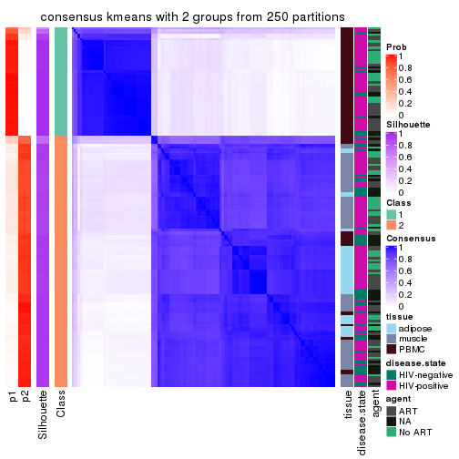</p>

</div>
<div id='tab-SD-kmeans-consensus-heatmap-2'>
<pre><code class="r">consensus_heatmap(res, k = 3)
</code></pre>

<p>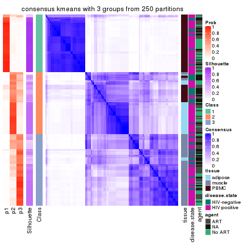</p>

</div>
<div id='tab-SD-kmeans-consensus-heatmap-3'>
<pre><code class="r">consensus_heatmap(res, k = 4)
</code></pre>

<p>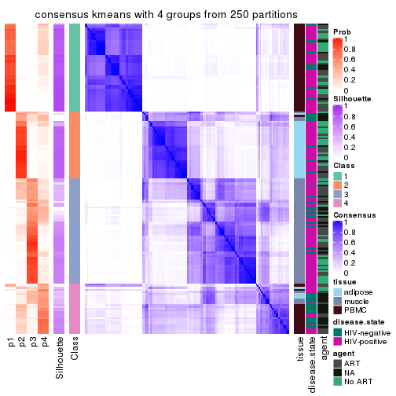</p>

</div>
<div id='tab-SD-kmeans-consensus-heatmap-4'>
<pre><code class="r">consensus_heatmap(res, k = 5)
</code></pre>

<p>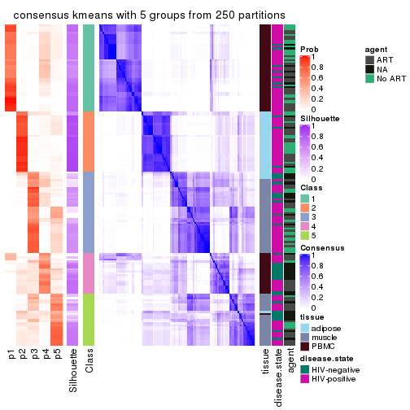</p>

</div>
<div id='tab-SD-kmeans-consensus-heatmap-5'>
<pre><code class="r">consensus_heatmap(res, k = 6)
</code></pre>

<p>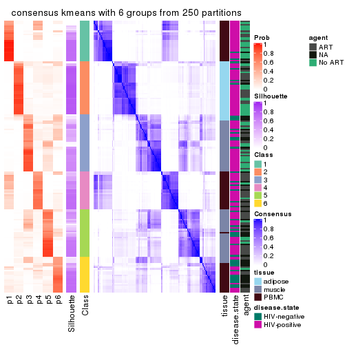</p>

</div>
</div>

Heatmaps for the membership of samples in all partitions to see how consistent they are:


<script>
$( function() {
	$( '#tabs-SD-kmeans-membership-heatmap' ).tabs();
} );
</script>
<div id='tabs-SD-kmeans-membership-heatmap'>
<ul>
<li><a href='#tab-SD-kmeans-membership-heatmap-1'>k = 2</a></li>
<li><a href='#tab-SD-kmeans-membership-heatmap-2'>k = 3</a></li>
<li><a href='#tab-SD-kmeans-membership-heatmap-3'>k = 4</a></li>
<li><a href='#tab-SD-kmeans-membership-heatmap-4'>k = 5</a></li>
<li><a href='#tab-SD-kmeans-membership-heatmap-5'>k = 6</a></li>
</ul>
<div id='tab-SD-kmeans-membership-heatmap-1'>
<pre><code class="r">membership_heatmap(res, k = 2)
</code></pre>

<p>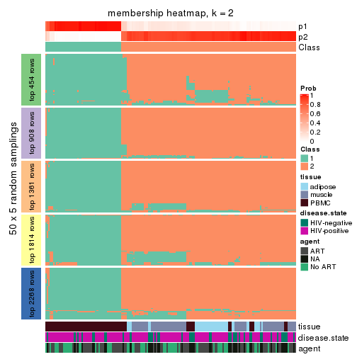</p>

</div>
<div id='tab-SD-kmeans-membership-heatmap-2'>
<pre><code class="r">membership_heatmap(res, k = 3)
</code></pre>

<p>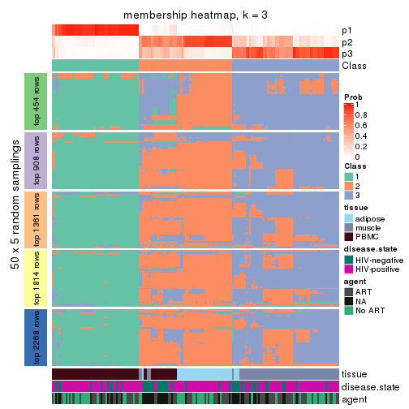</p>

</div>
<div id='tab-SD-kmeans-membership-heatmap-3'>
<pre><code class="r">membership_heatmap(res, k = 4)
</code></pre>

<p>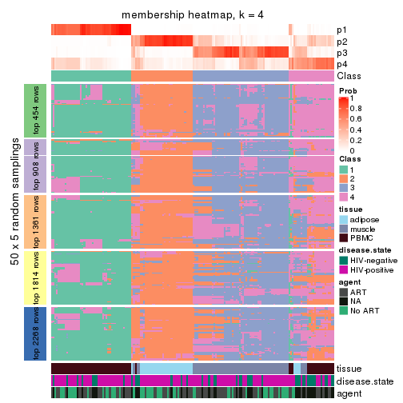</p>

</div>
<div id='tab-SD-kmeans-membership-heatmap-4'>
<pre><code class="r">membership_heatmap(res, k = 5)
</code></pre>

<p>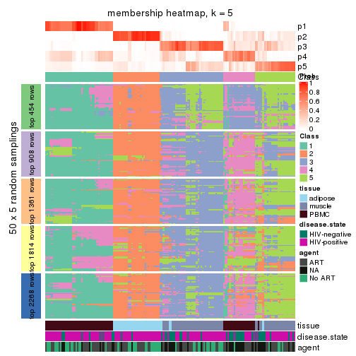</p>

</div>
<div id='tab-SD-kmeans-membership-heatmap-5'>
<pre><code class="r">membership_heatmap(res, k = 6)
</code></pre>

<p>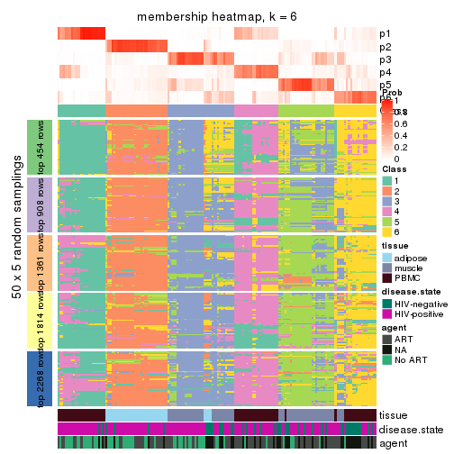</p>

</div>
</div>

As soon as we have had the classes for columns, we can look for signatures
which are significantly different between classes which can be candidate marks
for certain classes. Following are the heatmaps for signatures.


Signature heatmaps where rows are scaled:


<script>
$( function() {
	$( '#tabs-SD-kmeans-get-signatures' ).tabs();
} );
</script>
<div id='tabs-SD-kmeans-get-signatures'>
<ul>
<li><a href='#tab-SD-kmeans-get-signatures-1'>k = 2</a></li>
<li><a href='#tab-SD-kmeans-get-signatures-2'>k = 3</a></li>
<li><a href='#tab-SD-kmeans-get-signatures-3'>k = 4</a></li>
<li><a href='#tab-SD-kmeans-get-signatures-4'>k = 5</a></li>
<li><a href='#tab-SD-kmeans-get-signatures-5'>k = 6</a></li>
</ul>
<div id='tab-SD-kmeans-get-signatures-1'>
<pre><code class="r">get_signatures(res, k = 2)
</code></pre>

<p>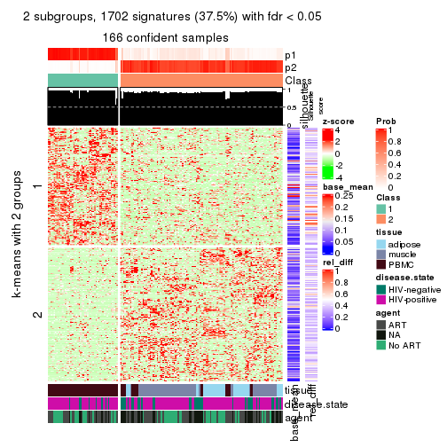</p>

</div>
<div id='tab-SD-kmeans-get-signatures-2'>
<pre><code class="r">get_signatures(res, k = 3)
</code></pre>

<p>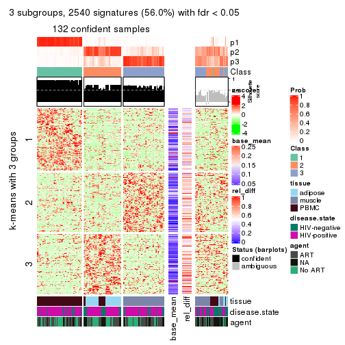</p>

</div>
<div id='tab-SD-kmeans-get-signatures-3'>
<pre><code class="r">get_signatures(res, k = 4)
</code></pre>

<p>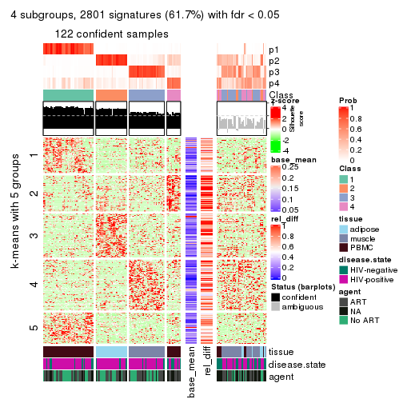</p>

</div>
<div id='tab-SD-kmeans-get-signatures-4'>
<pre><code class="r">get_signatures(res, k = 5)
</code></pre>

<p>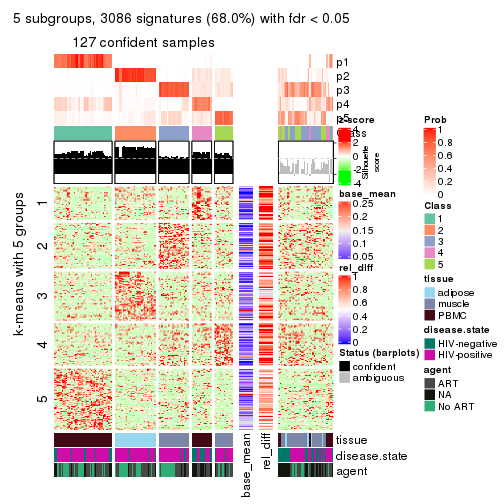</p>

</div>
<div id='tab-SD-kmeans-get-signatures-5'>
<pre><code class="r">get_signatures(res, k = 6)
</code></pre>

<p>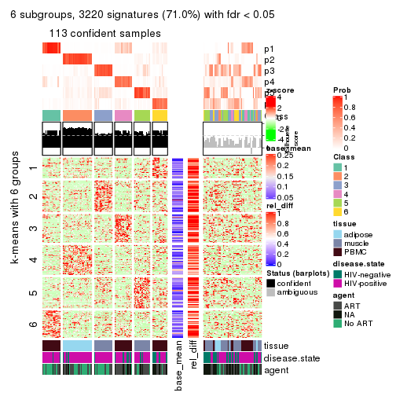</p>

</div>
</div>


Signature heatmaps where rows are not scaled:


<script>
$( function() {
	$( '#tabs-SD-kmeans-get-signatures-no-scale' ).tabs();
} );
</script>
<div id='tabs-SD-kmeans-get-signatures-no-scale'>
<ul>
<li><a href='#tab-SD-kmeans-get-signatures-no-scale-1'>k = 2</a></li>
<li><a href='#tab-SD-kmeans-get-signatures-no-scale-2'>k = 3</a></li>
<li><a href='#tab-SD-kmeans-get-signatures-no-scale-3'>k = 4</a></li>
<li><a href='#tab-SD-kmeans-get-signatures-no-scale-4'>k = 5</a></li>
<li><a href='#tab-SD-kmeans-get-signatures-no-scale-5'>k = 6</a></li>
</ul>
<div id='tab-SD-kmeans-get-signatures-no-scale-1'>
<pre><code class="r">get_signatures(res, k = 2, scale_rows = FALSE)
</code></pre>

<p>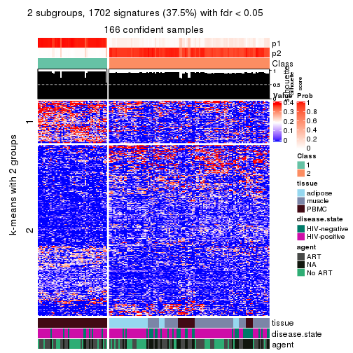</p>

</div>
<div id='tab-SD-kmeans-get-signatures-no-scale-2'>
<pre><code class="r">get_signatures(res, k = 3, scale_rows = FALSE)
</code></pre>

<p>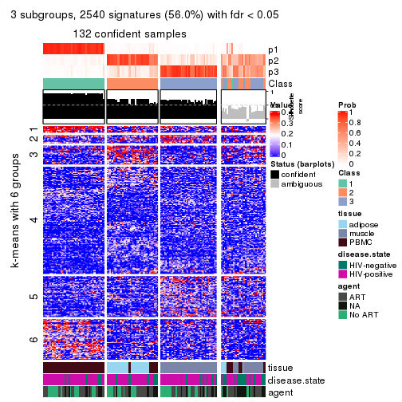</p>

</div>
<div id='tab-SD-kmeans-get-signatures-no-scale-3'>
<pre><code class="r">get_signatures(res, k = 4, scale_rows = FALSE)
</code></pre>

<p>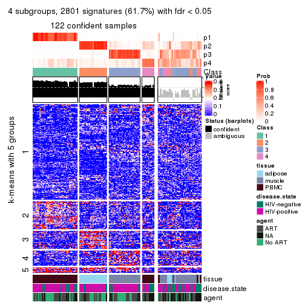</p>

</div>
<div id='tab-SD-kmeans-get-signatures-no-scale-4'>
<pre><code class="r">get_signatures(res, k = 5, scale_rows = FALSE)
</code></pre>

<p>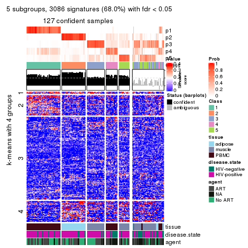</p>

</div>
<div id='tab-SD-kmeans-get-signatures-no-scale-5'>
<pre><code class="r">get_signatures(res, k = 6, scale_rows = FALSE)
</code></pre>

<p>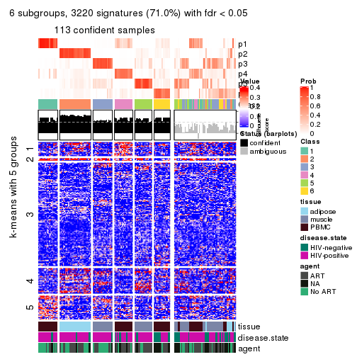</p>

</div>
</div>


Compare the overlap of signatures from different k:

```r
compare_signatures(res)
```

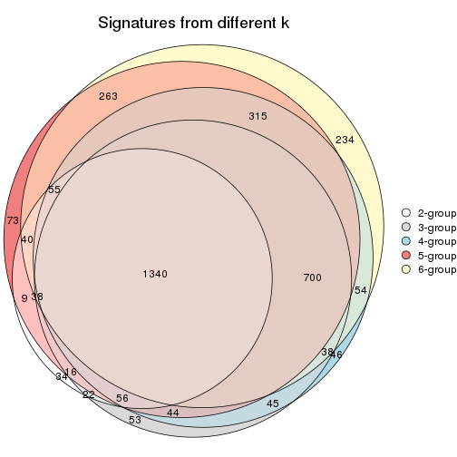

`get_signature()` returns a data frame invisibly. TO get the list of signatures, the function
call should be assigned to a variable explicitly. In following code, if `plot` argument is set
to `FALSE`, no heatmap is plotted while only the differential analysis is performed.

```r
# code only for demonstration
tb = get_signature(res, k = ..., plot = FALSE)
```

An example of the output of `tb` is:

```
#>   which_row         fdr    mean_1    mean_2 scaled_mean_1 scaled_mean_2 km
#> 1        38 0.042760348  8.373488  9.131774    -0.5533452     0.5164555  1
#> 2        40 0.018707592  7.106213  8.469186    -0.6173731     0.5762149  1
#> 3        55 0.019134737 10.221463 11.207825    -0.6159697     0.5749050  1
#> 4        59 0.006059896  5.921854  7.869574    -0.6899429     0.6439467  1
#> 5        60 0.018055526  8.928898 10.211722    -0.6204761     0.5791110  1
#> 6        98 0.009384629 15.714769 14.887706     0.6635654    -0.6193277  2
...
```

The columns in `tb` are:

1. `which_row`: row indices corresponding to the input matrix.
2. `fdr`: FDR for the differential test. 
3. `mean_x`: The mean value in group x.
4. `scaled_mean_x`: The mean value in group x after rows are scaled.
5. `km`: Row groups if k-means clustering is applied to rows.


UMAP plot which shows how samples are separated.


<script>
$( function() {
	$( '#tabs-SD-kmeans-dimension-reduction' ).tabs();
} );
</script>
<div id='tabs-SD-kmeans-dimension-reduction'>
<ul>
<li><a href='#tab-SD-kmeans-dimension-reduction-1'>k = 2</a></li>
<li><a href='#tab-SD-kmeans-dimension-reduction-2'>k = 3</a></li>
<li><a href='#tab-SD-kmeans-dimension-reduction-3'>k = 4</a></li>
<li><a href='#tab-SD-kmeans-dimension-reduction-4'>k = 5</a></li>
<li><a href='#tab-SD-kmeans-dimension-reduction-5'>k = 6</a></li>
</ul>
<div id='tab-SD-kmeans-dimension-reduction-1'>
<pre><code class="r">dimension_reduction(res, k = 2, method = &quot;UMAP&quot;)
</code></pre>

<p>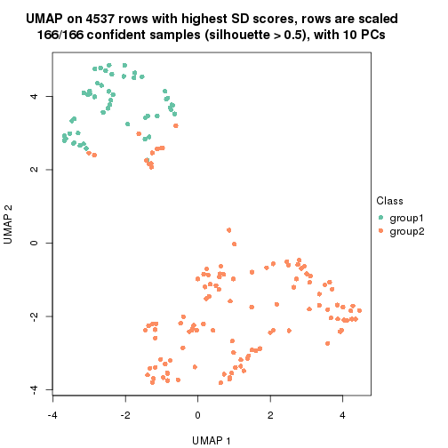</p>

</div>
<div id='tab-SD-kmeans-dimension-reduction-2'>
<pre><code class="r">dimension_reduction(res, k = 3, method = &quot;UMAP&quot;)
</code></pre>

<p>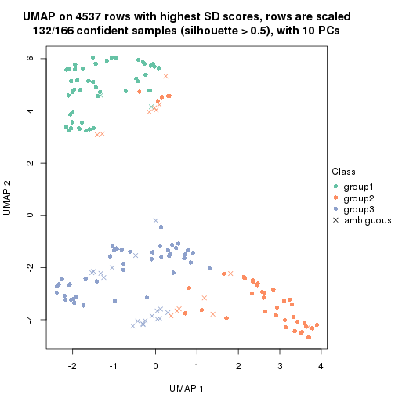</p>

</div>
<div id='tab-SD-kmeans-dimension-reduction-3'>
<pre><code class="r">dimension_reduction(res, k = 4, method = &quot;UMAP&quot;)
</code></pre>

<p>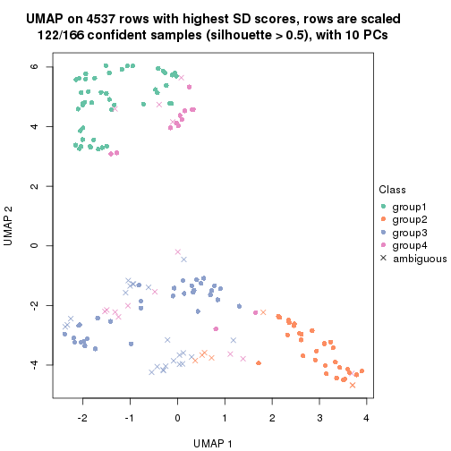</p>

</div>
<div id='tab-SD-kmeans-dimension-reduction-4'>
<pre><code class="r">dimension_reduction(res, k = 5, method = &quot;UMAP&quot;)
</code></pre>

<p>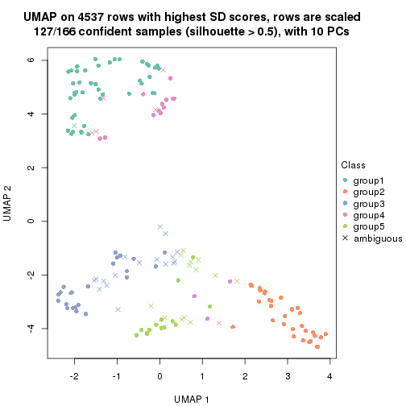</p>

</div>
<div id='tab-SD-kmeans-dimension-reduction-5'>
<pre><code class="r">dimension_reduction(res, k = 6, method = &quot;UMAP&quot;)
</code></pre>

<p>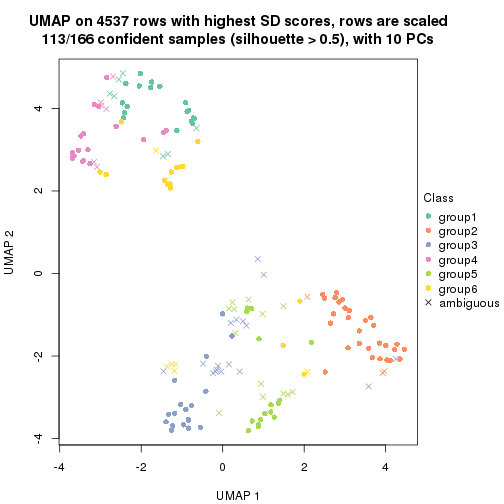</p>

</div>
</div>


Following heatmap shows how subgroups are split when increasing `k`:

```r
collect_classes(res)
```

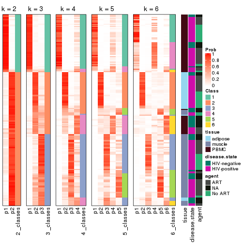


Test correlation between subgroups and known annotations. If the known
annotation is numeric, one-way ANOVA test is applied, and if the known
annotation is discrete, chi-squared contingency table test is applied.

```r
test_to_known_factors(res)
```

```
#>             n tissue(p) disease.state(p) agent(p) k
#> SD:kmeans 166  1.10e-23         0.131028 0.219963 2
#> SD:kmeans 132  4.69e-46         0.775590 0.963588 3
#> SD:kmeans 122  7.85e-50         0.004120 0.013521 4
#> SD:kmeans 127  2.44e-50         0.000712 0.001546 5
#> SD:kmeans 113  5.92e-43         0.003398 0.000241 6
```


If matrix rows can be associated to genes, consider to use `GO_Enrichment(res,
...)` to perform function enrichment for the signature genes.


 

---------------------------------------------------


### SD:skmeans


The object with results only for a single top-value method and a single partition method 
can be extracted as:

```r
res = res_list["SD", "skmeans"]
# you can also extract it by
# res = res_list["SD:skmeans"]
```

A summary of `res` and all the functions that can be applied to it:

```r
res
```

```
#> A 'ConsensusPartition' object with k = 2, 3, 4, 5, 6.
#>   On a matrix with 4537 rows and 166 columns.
#>   Top rows (454, 908, 1361, 1814, 2268) are extracted by 'SD' method.
#>   Subgroups are detected by 'skmeans' method.
#>   Performed in total 1250 partitions by row resampling.
#>   Best k for subgroups seems to be 2.
#> 
#> Following methods can be applied to this 'ConsensusPartition' object:
#>  [1] "cola_report"             "collect_classes"         "collect_plots"          
#>  [4] "collect_stats"           "colnames"                "compare_signatures"     
#>  [7] "consensus_heatmap"       "dimension_reduction"     "functional_enrichment"  
#> [10] "get_anno_col"            "get_anno"                "get_classes"            
#> [13] "get_consensus"           "get_matrix"              "get_membership"         
#> [16] "get_param"               "get_signatures"          "get_stats"              
#> [19] "is_best_k"               "is_stable_k"             "membership_heatmap"     
#> [22] "ncol"                    "nrow"                    "plot_ecdf"              
#> [25] "rownames"                "select_partition_number" "show"                   
#> [28] "suggest_best_k"          "test_to_known_factors"
```

`collect_plots()` function collects all the plots made from `res` for all `k` (number of partitions)
into one single page to provide an easy and fast comparison between different `k`.

```r
collect_plots(res)
```

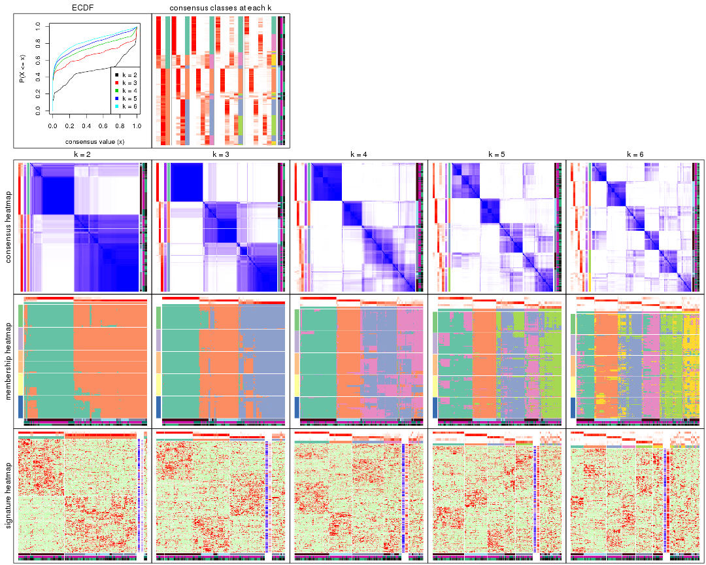

The plots are:

- The first row: a plot of the ECDF (Empirical cumulative distribution
  function) curves of the consensus matrix for each `k` and the heatmap of
  predicted classes for each `k`.
- The second row: heatmaps of the consensus matrix for each `k`.
- The third row: heatmaps of the membership matrix for each `k`.
- The fouth row: heatmaps of the signatures for each `k`.

All the plots in panels can be made by individual functions and they are
plotted later in this section.

`select_partition_number()` produces several plots showing different
statistics for choosing "optimized" `k`. There are following statistics:

- ECDF curves of the consensus matrix for each `k`;
- 1-PAC. [The PAC
  score](https://en.wikipedia.org/wiki/Consensus_clustering#Over-interpretation_potential_of_consensus_clustering)
  measures the proportion of the ambiguous subgrouping.
- Mean silhouette score.
- Concordance. The mean probability of fiting the consensus class ids in all
  partitions.
- Area increased. Denote $A_k$ as the area under the ECDF curve for current
  `k`, the area increased is defined as $A_k - A_{k-1}$.
- Rand index. The percent of pairs of samples that are both in a same cluster
  or both are not in a same cluster in the partition of k and k-1.
- Jaccard index. The ratio of pairs of samples are both in a same cluster in
  the partition of k and k-1 and the pairs of samples are both in a same
  cluster in the partition k or k-1.

The detailed explanations of these statistics can be found in [the cola
vignette](http://bioconductor.org/packages/devel/bioc/vignettes/cola/inst/doc/cola.html#toc_13).

Generally speaking, lower PAC score, higher mean silhouette score or higher
concordance corresponds to better partition. Rand index and Jaccard index
measure how similar the current partition is compared to partition with `k-1`.
If they are too similar, we won't accept `k` is better than `k-1`.

```r
select_partition_number(res)
```

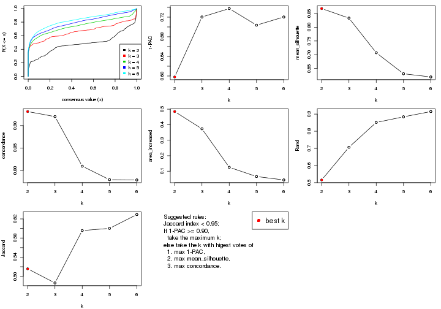

The numeric values for all these statistics can be obtained by `get_stats()`.

```r
get_stats(res)
```

```
#>   k 1-PAC mean_silhouette concordance area_increased  Rand Jaccard
#> 2 2 0.598           0.868       0.931         0.4846 0.516   0.516
#> 3 3 0.720           0.833       0.920         0.3734 0.707   0.486
#> 4 4 0.737           0.707       0.809         0.1252 0.851   0.596
#> 5 5 0.704           0.631       0.779         0.0656 0.884   0.600
#> 6 6 0.720           0.619       0.779         0.0435 0.915   0.629
```

`suggest_best_k()` suggests the best $k$ based on these statistics. The rules are as follows:

- All $k$ with Jaccard index larger than 0.95 are removed because the increase of
  the partition number does not provides enough extra information. If all $k$ are removed,
  the best $k$ is assigned by `NA`.
- For $k$ with 1-PAC larger than 0.9, the maximal $k$ is taken as the "best k". Other $k$ is called "optional k".
- If it does not fit the second rule. The $k$ with the highest vote of highest
  1-PAC, mean silhouette and concordance is taken as the "best k".

```r
suggest_best_k(res)
```

```
#> [1] 2
```


Following shows the table of the partitions (You need to click the **show/hide
code output** link to see it). The membership matrix (columns with name `p*`)
is inferred by
[`clue::cl_consensus()`](https://www.rdocumentation.org/link/cl_consensus?package=clue)
function with the `SE` method. Basically the value in the membership matrix
represents the probability to belong to a certain group. The finall class
label for an item is determined with the group with highest probability it
belongs to.

In `get_classes()` function, the entropy is calculated from the membership
matrix and the silhouette score is calculated from the consensus matrix.


<script>
$( function() {
	$( '#tabs-SD-skmeans-get-classes' ).tabs();
} );
</script>
<div id='tabs-SD-skmeans-get-classes'>
<ul>
<li><a href='#tab-SD-skmeans-get-classes-1'>k = 2</a></li>
<li><a href='#tab-SD-skmeans-get-classes-2'>k = 3</a></li>
<li><a href='#tab-SD-skmeans-get-classes-3'>k = 4</a></li>
<li><a href='#tab-SD-skmeans-get-classes-4'>k = 5</a></li>
<li><a href='#tab-SD-skmeans-get-classes-5'>k = 6</a></li>
</ul>

<div id='tab-SD-skmeans-get-classes-1'>
<p><a id='tab-SD-skmeans-get-classes-1-a' style='color:#0366d6' href='#'>show/hide code output</a></p>
<pre><code class="r">cbind(get_classes(res, k = 2), get_membership(res, k = 2))
</code></pre>

<pre><code>#&gt;           class entropy silhouette    p1    p2
#&gt; GSM751298     1  0.0000     0.9175 1.000 0.000
#&gt; GSM751304     1  0.8327     0.7114 0.736 0.264
#&gt; GSM751305     1  0.8555     0.6907 0.720 0.280
#&gt; GSM751307     1  0.6623     0.7950 0.828 0.172
#&gt; GSM751310     1  0.0000     0.9175 1.000 0.000
#&gt; GSM751314     1  0.0000     0.9175 1.000 0.000
#&gt; GSM751316     1  0.0000     0.9175 1.000 0.000
#&gt; GSM751318     1  0.0000     0.9175 1.000 0.000
#&gt; GSM751342     1  0.0000     0.9175 1.000 0.000
#&gt; GSM751346     1  0.0000     0.9175 1.000 0.000
#&gt; GSM751347     1  0.0376     0.9149 0.996 0.004
#&gt; GSM751348     1  0.7299     0.7708 0.796 0.204
#&gt; GSM751349     2  0.1843     0.9167 0.028 0.972
#&gt; GSM751352     1  0.7815     0.7420 0.768 0.232
#&gt; GSM751353     2  0.7056     0.7264 0.192 0.808
#&gt; GSM751354     1  0.9323     0.5802 0.652 0.348
#&gt; GSM751355     2  0.6148     0.7851 0.152 0.848
#&gt; GSM751358     1  1.0000     0.1906 0.500 0.500
#&gt; GSM751359     2  0.0000     0.9279 0.000 1.000
#&gt; GSM751294     1  0.8443     0.7019 0.728 0.272
#&gt; GSM751296     1  0.0000     0.9175 1.000 0.000
#&gt; GSM751297     1  0.0000     0.9175 1.000 0.000
#&gt; GSM751299     1  0.7815     0.7420 0.768 0.232
#&gt; GSM751300     1  0.0000     0.9175 1.000 0.000
#&gt; GSM751301     1  0.4690     0.8506 0.900 0.100
#&gt; GSM751302     1  0.0000     0.9175 1.000 0.000
#&gt; GSM751303     1  0.0000     0.9175 1.000 0.000
#&gt; GSM751306     1  0.0000     0.9175 1.000 0.000
#&gt; GSM751308     1  0.0672     0.9130 0.992 0.008
#&gt; GSM751309     1  0.0000     0.9175 1.000 0.000
#&gt; GSM751311     1  0.0000     0.9175 1.000 0.000
#&gt; GSM751312     1  0.0000     0.9175 1.000 0.000
#&gt; GSM751313     1  0.0000     0.9175 1.000 0.000
#&gt; GSM751315     1  0.0000     0.9175 1.000 0.000
#&gt; GSM751317     1  0.0000     0.9175 1.000 0.000
#&gt; GSM751320     1  0.0000     0.9175 1.000 0.000
#&gt; GSM751321     1  0.0000     0.9175 1.000 0.000
#&gt; GSM751322     1  0.0000     0.9175 1.000 0.000
#&gt; GSM751324     1  0.0000     0.9175 1.000 0.000
#&gt; GSM751325     1  0.0000     0.9175 1.000 0.000
#&gt; GSM751332     1  0.0000     0.9175 1.000 0.000
#&gt; GSM751334     1  0.0000     0.9175 1.000 0.000
#&gt; GSM751339     1  0.0000     0.9175 1.000 0.000
#&gt; GSM751341     1  0.0000     0.9175 1.000 0.000
#&gt; GSM751343     1  0.0000     0.9175 1.000 0.000
#&gt; GSM751344     1  0.8144     0.7206 0.748 0.252
#&gt; GSM751345     1  0.8081     0.7251 0.752 0.248
#&gt; GSM751356     1  0.7883     0.7381 0.764 0.236
#&gt; GSM751357     1  0.7883     0.7381 0.764 0.236
#&gt; GSM751293     1  0.4562     0.8532 0.904 0.096
#&gt; GSM751295     1  0.0000     0.9175 1.000 0.000
#&gt; GSM751319     1  0.0000     0.9175 1.000 0.000
#&gt; GSM751323     1  0.0000     0.9175 1.000 0.000
#&gt; GSM751326     1  0.0000     0.9175 1.000 0.000
#&gt; GSM751327     1  0.0000     0.9175 1.000 0.000
#&gt; GSM751328     1  0.0000     0.9175 1.000 0.000
#&gt; GSM751329     1  0.0000     0.9175 1.000 0.000
#&gt; GSM751330     1  0.0000     0.9175 1.000 0.000
#&gt; GSM751331     1  0.0000     0.9175 1.000 0.000
#&gt; GSM751333     1  0.0000     0.9175 1.000 0.000
#&gt; GSM751335     1  0.0000     0.9175 1.000 0.000
#&gt; GSM751336     1  0.0000     0.9175 1.000 0.000
#&gt; GSM751337     1  0.0000     0.9175 1.000 0.000
#&gt; GSM751338     1  0.0000     0.9175 1.000 0.000
#&gt; GSM751340     1  0.0000     0.9175 1.000 0.000
#&gt; GSM751350     1  0.0000     0.9175 1.000 0.000
#&gt; GSM751351     1  0.0000     0.9175 1.000 0.000
#&gt; GSM751362     2  0.8081     0.7442 0.248 0.752
#&gt; GSM751363     2  0.1184     0.9259 0.016 0.984
#&gt; GSM751367     1  0.8955     0.4991 0.688 0.312
#&gt; GSM751368     2  0.0000     0.9279 0.000 1.000
#&gt; GSM751371     1  0.9795     0.2169 0.584 0.416
#&gt; GSM751375     2  0.0000     0.9279 0.000 1.000
#&gt; GSM751376     2  0.0938     0.9265 0.012 0.988
#&gt; GSM751378     2  0.0000     0.9279 0.000 1.000
#&gt; GSM751379     2  0.0938     0.9265 0.012 0.988
#&gt; GSM751382     2  0.0000     0.9279 0.000 1.000
#&gt; GSM751386     2  0.0000     0.9279 0.000 1.000
#&gt; GSM751388     2  0.0000     0.9279 0.000 1.000
#&gt; GSM751391     2  0.1414     0.9255 0.020 0.980
#&gt; GSM751410     1  0.6973     0.7273 0.812 0.188
#&gt; GSM751414     2  0.7602     0.7804 0.220 0.780
#&gt; GSM751361     2  0.0000     0.9279 0.000 1.000
#&gt; GSM751365     2  0.5059     0.8813 0.112 0.888
#&gt; GSM751366     2  0.7883     0.7600 0.236 0.764
#&gt; GSM751369     2  0.7745     0.7731 0.228 0.772
#&gt; GSM751370     2  0.7883     0.7594 0.236 0.764
#&gt; GSM751372     2  0.5059     0.8813 0.112 0.888
#&gt; GSM751373     2  0.7602     0.7804 0.220 0.780
#&gt; GSM751374     2  0.0938     0.9265 0.012 0.988
#&gt; GSM751377     2  0.0000     0.9279 0.000 1.000
#&gt; GSM751380     2  0.7453     0.7912 0.212 0.788
#&gt; GSM751381     2  0.0000     0.9279 0.000 1.000
#&gt; GSM751383     2  0.0000     0.9279 0.000 1.000
#&gt; GSM751384     2  0.0000     0.9279 0.000 1.000
#&gt; GSM751385     2  0.0000     0.9279 0.000 1.000
#&gt; GSM751387     2  0.0000     0.9279 0.000 1.000
#&gt; GSM751389     2  0.3274     0.9089 0.060 0.940
#&gt; GSM751393     2  0.0000     0.9279 0.000 1.000
#&gt; GSM751394     2  0.0000     0.9279 0.000 1.000
#&gt; GSM751395     2  0.0000     0.9279 0.000 1.000
#&gt; GSM751397     2  0.0000     0.9279 0.000 1.000
#&gt; GSM751398     2  0.0000     0.9279 0.000 1.000
#&gt; GSM751404     2  0.6887     0.8222 0.184 0.816
#&gt; GSM751406     2  0.6712     0.8297 0.176 0.824
#&gt; GSM751411     2  0.4690     0.8877 0.100 0.900
#&gt; GSM751413     2  0.0000     0.9279 0.000 1.000
#&gt; GSM751415     2  0.7056     0.8142 0.192 0.808
#&gt; GSM751416     2  0.0000     0.9279 0.000 1.000
#&gt; GSM751417     2  0.0000     0.9279 0.000 1.000
#&gt; GSM751421     2  0.7219     0.8049 0.200 0.800
#&gt; GSM751422     2  0.7219     0.8049 0.200 0.800
#&gt; GSM751360     2  0.6343     0.8463 0.160 0.840
#&gt; GSM751364     2  0.3114     0.9117 0.056 0.944
#&gt; GSM751390     2  0.0000     0.9279 0.000 1.000
#&gt; GSM751392     2  0.0000     0.9279 0.000 1.000
#&gt; GSM751396     2  0.0000     0.9279 0.000 1.000
#&gt; GSM751399     2  0.4161     0.8969 0.084 0.916
#&gt; GSM751400     2  0.3431     0.9073 0.064 0.936
#&gt; GSM751401     2  0.6887     0.8222 0.184 0.816
#&gt; GSM751402     2  0.6973     0.8181 0.188 0.812
#&gt; GSM751403     2  0.4690     0.8877 0.100 0.900
#&gt; GSM751405     2  0.6712     0.8297 0.176 0.824
#&gt; GSM751407     2  0.6148     0.8509 0.152 0.848
#&gt; GSM751408     2  0.4690     0.8877 0.100 0.900
#&gt; GSM751409     2  0.3114     0.9106 0.056 0.944
#&gt; GSM751412     2  0.5842     0.8607 0.140 0.860
#&gt; GSM751418     2  0.5059     0.8813 0.112 0.888
#&gt; GSM751419     2  0.5059     0.8813 0.112 0.888
#&gt; GSM751420     2  0.4022     0.9007 0.080 0.920
#&gt; GSM751425     2  0.0000     0.9279 0.000 1.000
#&gt; GSM751429     1  0.9977    -0.0488 0.528 0.472
#&gt; GSM751430     2  0.0376     0.9278 0.004 0.996
#&gt; GSM751433     2  0.1414     0.9235 0.020 0.980
#&gt; GSM751437     2  0.6623     0.8335 0.172 0.828
#&gt; GSM751448     2  0.9522     0.5173 0.372 0.628
#&gt; GSM751451     2  0.0938     0.9263 0.012 0.988
#&gt; GSM751423     2  0.0000     0.9279 0.000 1.000
#&gt; GSM751424     2  0.0672     0.9273 0.008 0.992
#&gt; GSM751428     2  0.0938     0.9263 0.012 0.988
#&gt; GSM751431     2  0.1184     0.9251 0.016 0.984
#&gt; GSM751432     2  0.0376     0.9277 0.004 0.996
#&gt; GSM751434     2  0.1414     0.9235 0.020 0.980
#&gt; GSM751435     2  0.2236     0.9136 0.036 0.964
#&gt; GSM751436     2  0.1184     0.9251 0.016 0.984
#&gt; GSM751440     2  0.1184     0.9251 0.016 0.984
#&gt; GSM751444     2  0.1184     0.9251 0.016 0.984
#&gt; GSM751446     2  0.1184     0.9251 0.016 0.984
#&gt; GSM751449     2  0.0000     0.9279 0.000 1.000
#&gt; GSM751450     2  0.0672     0.9273 0.008 0.992
#&gt; GSM751452     2  0.0672     0.9273 0.008 0.992
#&gt; GSM751426     2  0.1184     0.9251 0.016 0.984
#&gt; GSM751427     2  0.0672     0.9273 0.008 0.992
#&gt; GSM751438     2  0.0672     0.9273 0.008 0.992
#&gt; GSM751439     2  0.6531     0.8431 0.168 0.832
#&gt; GSM751441     2  0.0000     0.9279 0.000 1.000
#&gt; GSM751442     2  0.1184     0.9251 0.016 0.984
#&gt; GSM751443     2  0.6531     0.8423 0.168 0.832
#&gt; GSM751445     2  0.0000     0.9279 0.000 1.000
#&gt; GSM751447     2  0.0000     0.9279 0.000 1.000
#&gt; GSM751453     2  0.0672     0.9273 0.008 0.992
#&gt; GSM751454     2  0.0672     0.9273 0.008 0.992
#&gt; GSM751455     2  0.1184     0.9251 0.016 0.984
#&gt; GSM751456     2  0.1184     0.9251 0.016 0.984
#&gt; GSM751457     2  0.0000     0.9279 0.000 1.000
#&gt; GSM751458     2  0.0000     0.9279 0.000 1.000
</code></pre>

<script>
$('#tab-SD-skmeans-get-classes-1-a').parent().next().next().hide();
$('#tab-SD-skmeans-get-classes-1-a').click(function(){
  $('#tab-SD-skmeans-get-classes-1-a').parent().next().next().toggle();
  return(false);
});
</script>
</div>

<div id='tab-SD-skmeans-get-classes-2'>
<p><a id='tab-SD-skmeans-get-classes-2-a' style='color:#0366d6' href='#'>show/hide code output</a></p>
<pre><code class="r">cbind(get_classes(res, k = 3), get_membership(res, k = 3))
</code></pre>

<pre><code>#&gt;           class entropy silhouette    p1    p2    p3
#&gt; GSM751298     1  0.0000      0.998 1.000 0.000 0.000
#&gt; GSM751304     2  0.5466      0.799 0.160 0.800 0.040
#&gt; GSM751305     2  0.5355      0.801 0.160 0.804 0.036
#&gt; GSM751307     2  0.6654      0.276 0.456 0.536 0.008
#&gt; GSM751310     1  0.0000      0.998 1.000 0.000 0.000
#&gt; GSM751314     1  0.0000      0.998 1.000 0.000 0.000
#&gt; GSM751316     1  0.0000      0.998 1.000 0.000 0.000
#&gt; GSM751318     1  0.0000      0.998 1.000 0.000 0.000
#&gt; GSM751342     1  0.0000      0.998 1.000 0.000 0.000
#&gt; GSM751346     1  0.0000      0.998 1.000 0.000 0.000
#&gt; GSM751347     1  0.0424      0.990 0.992 0.000 0.008
#&gt; GSM751348     2  0.5024      0.764 0.220 0.776 0.004
#&gt; GSM751349     2  0.4002      0.759 0.000 0.840 0.160
#&gt; GSM751352     2  0.4861      0.788 0.192 0.800 0.008
#&gt; GSM751353     2  0.4453      0.815 0.152 0.836 0.012
#&gt; GSM751354     2  0.5178      0.802 0.164 0.808 0.028
#&gt; GSM751355     2  0.5331      0.806 0.076 0.824 0.100
#&gt; GSM751358     2  0.2492      0.869 0.016 0.936 0.048
#&gt; GSM751359     2  0.4399      0.721 0.000 0.812 0.188
#&gt; GSM751294     2  0.4196      0.839 0.112 0.864 0.024
#&gt; GSM751296     1  0.0000      0.998 1.000 0.000 0.000
#&gt; GSM751297     1  0.0661      0.987 0.988 0.008 0.004
#&gt; GSM751299     2  0.4755      0.794 0.184 0.808 0.008
#&gt; GSM751300     1  0.0000      0.998 1.000 0.000 0.000
#&gt; GSM751301     1  0.0000      0.998 1.000 0.000 0.000
#&gt; GSM751302     1  0.0000      0.998 1.000 0.000 0.000
#&gt; GSM751303     1  0.0000      0.998 1.000 0.000 0.000
#&gt; GSM751306     1  0.0000      0.998 1.000 0.000 0.000
#&gt; GSM751308     1  0.1832      0.952 0.956 0.036 0.008
#&gt; GSM751309     1  0.0000      0.998 1.000 0.000 0.000
#&gt; GSM751311     1  0.0000      0.998 1.000 0.000 0.000
#&gt; GSM751312     1  0.0000      0.998 1.000 0.000 0.000
#&gt; GSM751313     1  0.0000      0.998 1.000 0.000 0.000
#&gt; GSM751315     1  0.0000      0.998 1.000 0.000 0.000
#&gt; GSM751317     1  0.0000      0.998 1.000 0.000 0.000
#&gt; GSM751320     1  0.0000      0.998 1.000 0.000 0.000
#&gt; GSM751321     1  0.0000      0.998 1.000 0.000 0.000
#&gt; GSM751322     1  0.0000      0.998 1.000 0.000 0.000
#&gt; GSM751324     1  0.0000      0.998 1.000 0.000 0.000
#&gt; GSM751325     1  0.0000      0.998 1.000 0.000 0.000
#&gt; GSM751332     1  0.0000      0.998 1.000 0.000 0.000
#&gt; GSM751334     1  0.0000      0.998 1.000 0.000 0.000
#&gt; GSM751339     1  0.0424      0.990 0.992 0.000 0.008
#&gt; GSM751341     1  0.0000      0.998 1.000 0.000 0.000
#&gt; GSM751343     1  0.0000      0.998 1.000 0.000 0.000
#&gt; GSM751344     2  0.4233      0.812 0.160 0.836 0.004
#&gt; GSM751345     2  0.4233      0.812 0.160 0.836 0.004
#&gt; GSM751356     2  0.5072      0.783 0.196 0.792 0.012
#&gt; GSM751357     2  0.5072      0.783 0.196 0.792 0.012
#&gt; GSM751293     1  0.0000      0.998 1.000 0.000 0.000
#&gt; GSM751295     1  0.0000      0.998 1.000 0.000 0.000
#&gt; GSM751319     1  0.0000      0.998 1.000 0.000 0.000
#&gt; GSM751323     1  0.0000      0.998 1.000 0.000 0.000
#&gt; GSM751326     1  0.0000      0.998 1.000 0.000 0.000
#&gt; GSM751327     1  0.0000      0.998 1.000 0.000 0.000
#&gt; GSM751328     1  0.0000      0.998 1.000 0.000 0.000
#&gt; GSM751329     1  0.0000      0.998 1.000 0.000 0.000
#&gt; GSM751330     1  0.0000      0.998 1.000 0.000 0.000
#&gt; GSM751331     1  0.0000      0.998 1.000 0.000 0.000
#&gt; GSM751333     1  0.0000      0.998 1.000 0.000 0.000
#&gt; GSM751335     1  0.0000      0.998 1.000 0.000 0.000
#&gt; GSM751336     1  0.0000      0.998 1.000 0.000 0.000
#&gt; GSM751337     1  0.0000      0.998 1.000 0.000 0.000
#&gt; GSM751338     1  0.0000      0.998 1.000 0.000 0.000
#&gt; GSM751340     1  0.1643      0.954 0.956 0.000 0.044
#&gt; GSM751350     1  0.0000      0.998 1.000 0.000 0.000
#&gt; GSM751351     1  0.0000      0.998 1.000 0.000 0.000
#&gt; GSM751362     3  0.0000      0.848 0.000 0.000 1.000
#&gt; GSM751363     3  0.1529      0.839 0.000 0.040 0.960
#&gt; GSM751367     3  0.5706      0.506 0.320 0.000 0.680
#&gt; GSM751368     3  0.4178      0.755 0.000 0.172 0.828
#&gt; GSM751371     3  0.1636      0.838 0.016 0.020 0.964
#&gt; GSM751375     2  0.4605      0.699 0.000 0.796 0.204
#&gt; GSM751376     3  0.5859      0.433 0.000 0.344 0.656
#&gt; GSM751378     3  0.5591      0.581 0.000 0.304 0.696
#&gt; GSM751379     3  0.5760      0.469 0.000 0.328 0.672
#&gt; GSM751382     2  0.5016      0.638 0.000 0.760 0.240
#&gt; GSM751386     3  0.6045      0.473 0.000 0.380 0.620
#&gt; GSM751388     3  0.6062      0.471 0.000 0.384 0.616
#&gt; GSM751391     3  0.3752      0.753 0.000 0.144 0.856
#&gt; GSM751410     3  0.3116      0.777 0.108 0.000 0.892
#&gt; GSM751414     3  0.0475      0.848 0.004 0.004 0.992
#&gt; GSM751361     3  0.3192      0.800 0.000 0.112 0.888
#&gt; GSM751365     3  0.0237      0.849 0.000 0.004 0.996
#&gt; GSM751366     3  0.0237      0.849 0.000 0.004 0.996
#&gt; GSM751369     3  0.0000      0.848 0.000 0.000 1.000
#&gt; GSM751370     3  0.0424      0.846 0.008 0.000 0.992
#&gt; GSM751372     3  0.0592      0.847 0.000 0.012 0.988
#&gt; GSM751373     3  0.0592      0.848 0.000 0.012 0.988
#&gt; GSM751374     3  0.5760      0.469 0.000 0.328 0.672
#&gt; GSM751377     3  0.3482      0.789 0.000 0.128 0.872
#&gt; GSM751380     3  0.0237      0.849 0.000 0.004 0.996
#&gt; GSM751381     3  0.6062      0.465 0.000 0.384 0.616
#&gt; GSM751383     3  0.6062      0.471 0.000 0.384 0.616
#&gt; GSM751384     3  0.3816      0.768 0.000 0.148 0.852
#&gt; GSM751385     3  0.0747      0.847 0.000 0.016 0.984
#&gt; GSM751387     3  0.6095      0.454 0.000 0.392 0.608
#&gt; GSM751389     3  0.0000      0.848 0.000 0.000 1.000
#&gt; GSM751393     3  0.0237      0.848 0.000 0.004 0.996
#&gt; GSM751394     3  0.6062      0.465 0.000 0.384 0.616
#&gt; GSM751395     3  0.3038      0.795 0.000 0.104 0.896
#&gt; GSM751397     3  0.6045      0.473 0.000 0.380 0.620
#&gt; GSM751398     3  0.6045      0.473 0.000 0.380 0.620
#&gt; GSM751404     3  0.0237      0.849 0.000 0.004 0.996
#&gt; GSM751406     3  0.0000      0.848 0.000 0.000 1.000
#&gt; GSM751411     3  0.0000      0.848 0.000 0.000 1.000
#&gt; GSM751413     3  0.3551      0.786 0.000 0.132 0.868
#&gt; GSM751415     3  0.0237      0.849 0.000 0.004 0.996
#&gt; GSM751416     3  0.2356      0.824 0.000 0.072 0.928
#&gt; GSM751417     3  0.2356      0.824 0.000 0.072 0.928
#&gt; GSM751421     3  0.0000      0.848 0.000 0.000 1.000
#&gt; GSM751422     3  0.0000      0.848 0.000 0.000 1.000
#&gt; GSM751360     3  0.0237      0.848 0.000 0.004 0.996
#&gt; GSM751364     3  0.0747      0.846 0.000 0.016 0.984
#&gt; GSM751390     3  0.4555      0.719 0.000 0.200 0.800
#&gt; GSM751392     3  0.6225      0.355 0.000 0.432 0.568
#&gt; GSM751396     3  0.6204      0.381 0.000 0.424 0.576
#&gt; GSM751399     3  0.0000      0.848 0.000 0.000 1.000
#&gt; GSM751400     3  0.0237      0.849 0.000 0.004 0.996
#&gt; GSM751401     3  0.0237      0.849 0.000 0.004 0.996
#&gt; GSM751402     3  0.0237      0.849 0.000 0.004 0.996
#&gt; GSM751403     3  0.0237      0.849 0.000 0.004 0.996
#&gt; GSM751405     3  0.0000      0.848 0.000 0.000 1.000
#&gt; GSM751407     3  0.0237      0.849 0.000 0.004 0.996
#&gt; GSM751408     3  0.0237      0.849 0.000 0.004 0.996
#&gt; GSM751409     3  0.0000      0.848 0.000 0.000 1.000
#&gt; GSM751412     3  0.0237      0.849 0.000 0.004 0.996
#&gt; GSM751418     3  0.0592      0.848 0.000 0.012 0.988
#&gt; GSM751419     3  0.0592      0.848 0.000 0.012 0.988
#&gt; GSM751420     3  0.1529      0.833 0.000 0.040 0.960
#&gt; GSM751425     2  0.0237      0.888 0.000 0.996 0.004
#&gt; GSM751429     3  0.9281      0.195 0.172 0.340 0.488
#&gt; GSM751430     2  0.4654      0.689 0.000 0.792 0.208
#&gt; GSM751433     2  0.0000      0.890 0.000 1.000 0.000
#&gt; GSM751437     2  0.6204      0.192 0.000 0.576 0.424
#&gt; GSM751448     3  0.7377      0.130 0.032 0.452 0.516
#&gt; GSM751451     2  0.0000      0.890 0.000 1.000 0.000
#&gt; GSM751423     2  0.0000      0.890 0.000 1.000 0.000
#&gt; GSM751424     2  0.0000      0.890 0.000 1.000 0.000
#&gt; GSM751428     2  0.0000      0.890 0.000 1.000 0.000
#&gt; GSM751431     2  0.0000      0.890 0.000 1.000 0.000
#&gt; GSM751432     2  0.0237      0.888 0.000 0.996 0.004
#&gt; GSM751434     2  0.0000      0.890 0.000 1.000 0.000
#&gt; GSM751435     2  0.0000      0.890 0.000 1.000 0.000
#&gt; GSM751436     2  0.0000      0.890 0.000 1.000 0.000
#&gt; GSM751440     2  0.0237      0.889 0.000 0.996 0.004
#&gt; GSM751444     2  0.0000      0.890 0.000 1.000 0.000
#&gt; GSM751446     2  0.0237      0.889 0.000 0.996 0.004
#&gt; GSM751449     2  0.0237      0.889 0.000 0.996 0.004
#&gt; GSM751450     2  0.0000      0.890 0.000 1.000 0.000
#&gt; GSM751452     2  0.0000      0.890 0.000 1.000 0.000
#&gt; GSM751426     2  0.0000      0.890 0.000 1.000 0.000
#&gt; GSM751427     2  0.0237      0.889 0.000 0.996 0.004
#&gt; GSM751438     2  0.0237      0.889 0.000 0.996 0.004
#&gt; GSM751439     2  0.3551      0.776 0.000 0.868 0.132
#&gt; GSM751441     2  0.0000      0.890 0.000 1.000 0.000
#&gt; GSM751442     2  0.0237      0.889 0.000 0.996 0.004
#&gt; GSM751443     2  0.5926      0.367 0.000 0.644 0.356
#&gt; GSM751445     2  0.0000      0.890 0.000 1.000 0.000
#&gt; GSM751447     2  0.0000      0.890 0.000 1.000 0.000
#&gt; GSM751453     2  0.0000      0.890 0.000 1.000 0.000
#&gt; GSM751454     2  0.0000      0.890 0.000 1.000 0.000
#&gt; GSM751455     2  0.0237      0.889 0.000 0.996 0.004
#&gt; GSM751456     2  0.0237      0.889 0.000 0.996 0.004
#&gt; GSM751457     2  0.0892      0.883 0.000 0.980 0.020
#&gt; GSM751458     2  0.0892      0.883 0.000 0.980 0.020
</code></pre>

<script>
$('#tab-SD-skmeans-get-classes-2-a').parent().next().next().hide();
$('#tab-SD-skmeans-get-classes-2-a').click(function(){
  $('#tab-SD-skmeans-get-classes-2-a').parent().next().next().toggle();
  return(false);
});
</script>
</div>

<div id='tab-SD-skmeans-get-classes-3'>
<p><a id='tab-SD-skmeans-get-classes-3-a' style='color:#0366d6' href='#'>show/hide code output</a></p>
<pre><code class="r">cbind(get_classes(res, k = 4), get_membership(res, k = 4))
</code></pre>

<pre><code>#&gt;           class entropy silhouette    p1    p2    p3    p4
#&gt; GSM751298     1  0.0000     0.9612 1.000 0.000 0.000 0.000
#&gt; GSM751304     4  0.6089     0.6317 0.000 0.080 0.280 0.640
#&gt; GSM751305     4  0.6136     0.6297 0.000 0.080 0.288 0.632
#&gt; GSM751307     4  0.8991     0.5229 0.116 0.144 0.288 0.452
#&gt; GSM751310     1  0.1109     0.9518 0.968 0.000 0.004 0.028
#&gt; GSM751314     1  0.1004     0.9541 0.972 0.000 0.004 0.024
#&gt; GSM751316     1  0.4018     0.7233 0.772 0.000 0.004 0.224
#&gt; GSM751318     1  0.0188     0.9610 0.996 0.000 0.000 0.004
#&gt; GSM751342     1  0.0817     0.9555 0.976 0.000 0.000 0.024
#&gt; GSM751346     1  0.1022     0.9545 0.968 0.000 0.000 0.032
#&gt; GSM751347     1  0.1398     0.9490 0.956 0.004 0.000 0.040
#&gt; GSM751348     4  0.8342     0.5828 0.088 0.108 0.292 0.512
#&gt; GSM751349     3  0.7894    -0.4135 0.000 0.292 0.364 0.344
#&gt; GSM751352     4  0.7066     0.6304 0.020 0.112 0.264 0.604
#&gt; GSM751353     4  0.7425     0.5672 0.000 0.212 0.280 0.508
#&gt; GSM751354     4  0.6307     0.6260 0.000 0.092 0.288 0.620
#&gt; GSM751355     4  0.7142     0.5645 0.000 0.152 0.324 0.524
#&gt; GSM751358     4  0.6906     0.6285 0.036 0.068 0.280 0.616
#&gt; GSM751359     4  0.6857     0.5078 0.000 0.104 0.404 0.492
#&gt; GSM751294     4  0.5873     0.6375 0.000 0.076 0.256 0.668
#&gt; GSM751296     1  0.0000     0.9612 1.000 0.000 0.000 0.000
#&gt; GSM751297     1  0.4382     0.6016 0.704 0.000 0.000 0.296
#&gt; GSM751299     4  0.6854     0.6240 0.004 0.136 0.260 0.600
#&gt; GSM751300     1  0.0817     0.9577 0.976 0.000 0.000 0.024
#&gt; GSM751301     1  0.0336     0.9592 0.992 0.008 0.000 0.000
#&gt; GSM751302     1  0.1118     0.9527 0.964 0.000 0.000 0.036
#&gt; GSM751303     1  0.1004     0.9541 0.972 0.000 0.004 0.024
#&gt; GSM751306     1  0.1109     0.9518 0.968 0.000 0.004 0.028
#&gt; GSM751308     1  0.6058     0.3470 0.604 0.024 0.020 0.352
#&gt; GSM751309     1  0.1004     0.9541 0.972 0.000 0.004 0.024
#&gt; GSM751311     1  0.0376     0.9605 0.992 0.000 0.004 0.004
#&gt; GSM751312     1  0.1902     0.9380 0.932 0.000 0.004 0.064
#&gt; GSM751313     1  0.0817     0.9573 0.976 0.000 0.000 0.024
#&gt; GSM751315     1  0.0376     0.9605 0.992 0.000 0.004 0.004
#&gt; GSM751317     1  0.0524     0.9600 0.988 0.000 0.004 0.008
#&gt; GSM751320     1  0.0000     0.9612 1.000 0.000 0.000 0.000
#&gt; GSM751321     1  0.1004     0.9541 0.972 0.000 0.004 0.024
#&gt; GSM751322     1  0.0188     0.9610 0.996 0.000 0.000 0.004
#&gt; GSM751324     1  0.0188     0.9610 0.996 0.000 0.000 0.004
#&gt; GSM751325     1  0.0188     0.9610 0.996 0.000 0.000 0.004
#&gt; GSM751332     1  0.0000     0.9612 1.000 0.000 0.000 0.000
#&gt; GSM751334     1  0.0000     0.9612 1.000 0.000 0.000 0.000
#&gt; GSM751339     1  0.2973     0.8392 0.856 0.000 0.000 0.144
#&gt; GSM751341     1  0.0469     0.9598 0.988 0.000 0.000 0.012
#&gt; GSM751343     1  0.0188     0.9610 0.996 0.000 0.000 0.004
#&gt; GSM751344     4  0.7201     0.5889 0.000 0.188 0.268 0.544
#&gt; GSM751345     4  0.7201     0.5889 0.000 0.188 0.268 0.544
#&gt; GSM751356     4  0.6313     0.6368 0.004 0.092 0.260 0.644
#&gt; GSM751357     4  0.6313     0.6368 0.004 0.092 0.260 0.644
#&gt; GSM751293     1  0.0188     0.9606 0.996 0.004 0.000 0.000
#&gt; GSM751295     1  0.1118     0.9527 0.964 0.000 0.000 0.036
#&gt; GSM751319     1  0.0376     0.9605 0.992 0.000 0.004 0.004
#&gt; GSM751323     1  0.0000     0.9612 1.000 0.000 0.000 0.000
#&gt; GSM751326     1  0.0000     0.9612 1.000 0.000 0.000 0.000
#&gt; GSM751327     1  0.0000     0.9612 1.000 0.000 0.000 0.000
#&gt; GSM751328     1  0.0000     0.9612 1.000 0.000 0.000 0.000
#&gt; GSM751329     1  0.0000     0.9612 1.000 0.000 0.000 0.000
#&gt; GSM751330     1  0.0817     0.9574 0.976 0.000 0.000 0.024
#&gt; GSM751331     1  0.1118     0.9527 0.964 0.000 0.000 0.036
#&gt; GSM751333     1  0.0921     0.9559 0.972 0.000 0.000 0.028
#&gt; GSM751335     1  0.0817     0.9574 0.976 0.000 0.000 0.024
#&gt; GSM751336     1  0.1118     0.9527 0.964 0.000 0.000 0.036
#&gt; GSM751337     1  0.0000     0.9612 1.000 0.000 0.000 0.000
#&gt; GSM751338     1  0.0921     0.9577 0.972 0.000 0.000 0.028
#&gt; GSM751340     4  0.4608     0.4474 0.304 0.000 0.004 0.692
#&gt; GSM751350     1  0.1118     0.9527 0.964 0.000 0.000 0.036
#&gt; GSM751351     1  0.1118     0.9527 0.964 0.000 0.000 0.036
#&gt; GSM751362     3  0.5000     0.5325 0.000 0.000 0.504 0.496
#&gt; GSM751363     3  0.4123     0.5747 0.000 0.008 0.772 0.220
#&gt; GSM751367     4  0.5873     0.3603 0.232 0.004 0.076 0.688
#&gt; GSM751368     3  0.5369     0.6234 0.000 0.112 0.744 0.144
#&gt; GSM751371     4  0.2847     0.4954 0.016 0.004 0.084 0.896
#&gt; GSM751375     3  0.7599    -0.4147 0.000 0.200 0.424 0.376
#&gt; GSM751376     4  0.1936     0.5806 0.000 0.028 0.032 0.940
#&gt; GSM751378     4  0.6214     0.3910 0.000 0.052 0.468 0.480
#&gt; GSM751379     4  0.1936     0.5806 0.000 0.028 0.032 0.940
#&gt; GSM751382     3  0.7731    -0.3515 0.000 0.248 0.436 0.316
#&gt; GSM751386     3  0.2342     0.5262 0.000 0.080 0.912 0.008
#&gt; GSM751388     3  0.2011     0.5319 0.000 0.080 0.920 0.000
#&gt; GSM751391     4  0.1867     0.5132 0.000 0.000 0.072 0.928
#&gt; GSM751410     4  0.4203     0.4460 0.068 0.000 0.108 0.824
#&gt; GSM751414     3  0.4331     0.6630 0.000 0.000 0.712 0.288
#&gt; GSM751361     3  0.3048     0.6254 0.000 0.016 0.876 0.108
#&gt; GSM751365     3  0.4331     0.6627 0.000 0.000 0.712 0.288
#&gt; GSM751366     3  0.4776     0.6348 0.000 0.000 0.624 0.376
#&gt; GSM751369     4  0.2530     0.4699 0.000 0.004 0.100 0.896
#&gt; GSM751370     3  0.4356     0.6624 0.000 0.000 0.708 0.292
#&gt; GSM751372     3  0.4250     0.6634 0.000 0.000 0.724 0.276
#&gt; GSM751373     3  0.4564     0.6520 0.000 0.000 0.672 0.328
#&gt; GSM751374     4  0.1936     0.5806 0.000 0.028 0.032 0.940
#&gt; GSM751377     3  0.3734     0.6203 0.000 0.044 0.848 0.108
#&gt; GSM751380     3  0.4967     0.5840 0.000 0.000 0.548 0.452
#&gt; GSM751381     3  0.2473     0.5239 0.000 0.080 0.908 0.012
#&gt; GSM751383     3  0.2011     0.5319 0.000 0.080 0.920 0.000
#&gt; GSM751384     3  0.2214     0.5525 0.000 0.044 0.928 0.028
#&gt; GSM751385     3  0.4584     0.0399 0.000 0.004 0.696 0.300
#&gt; GSM751387     3  0.2342     0.5262 0.000 0.080 0.912 0.008
#&gt; GSM751389     3  0.4996     0.5472 0.000 0.000 0.516 0.484
#&gt; GSM751393     3  0.4916     0.5722 0.000 0.000 0.576 0.424
#&gt; GSM751394     3  0.2473     0.5239 0.000 0.080 0.908 0.012
#&gt; GSM751395     4  0.4482     0.5944 0.000 0.008 0.264 0.728
#&gt; GSM751397     3  0.2915     0.5089 0.000 0.080 0.892 0.028
#&gt; GSM751398     3  0.2342     0.5262 0.000 0.080 0.912 0.008
#&gt; GSM751404     3  0.4877     0.6200 0.000 0.000 0.592 0.408
#&gt; GSM751406     4  0.3528     0.3182 0.000 0.000 0.192 0.808
#&gt; GSM751411     3  0.4356     0.6627 0.000 0.000 0.708 0.292
#&gt; GSM751413     3  0.4004     0.5906 0.000 0.024 0.812 0.164
#&gt; GSM751415     3  0.4961     0.5879 0.000 0.000 0.552 0.448
#&gt; GSM751416     3  0.3249     0.6420 0.000 0.008 0.852 0.140
#&gt; GSM751417     3  0.3249     0.6420 0.000 0.008 0.852 0.140
#&gt; GSM751421     4  0.3208     0.4013 0.000 0.004 0.148 0.848
#&gt; GSM751422     4  0.3157     0.4065 0.000 0.004 0.144 0.852
#&gt; GSM751360     3  0.5161     0.5102 0.000 0.004 0.520 0.476
#&gt; GSM751364     3  0.4122     0.6624 0.000 0.004 0.760 0.236
#&gt; GSM751390     3  0.2002     0.5620 0.000 0.044 0.936 0.020
#&gt; GSM751392     3  0.4881     0.3401 0.000 0.196 0.756 0.048
#&gt; GSM751396     3  0.4283     0.3486 0.000 0.256 0.740 0.004
#&gt; GSM751399     3  0.4830     0.6290 0.000 0.000 0.608 0.392
#&gt; GSM751400     3  0.4925     0.6053 0.000 0.000 0.572 0.428
#&gt; GSM751401     3  0.4941     0.5987 0.000 0.000 0.564 0.436
#&gt; GSM751402     3  0.4967     0.5840 0.000 0.000 0.548 0.452
#&gt; GSM751403     3  0.4955     0.5916 0.000 0.000 0.556 0.444
#&gt; GSM751405     4  0.4543    -0.1213 0.000 0.000 0.324 0.676
#&gt; GSM751407     3  0.4877     0.6200 0.000 0.000 0.592 0.408
#&gt; GSM751408     3  0.4843     0.6271 0.000 0.000 0.604 0.396
#&gt; GSM751409     3  0.4967     0.5840 0.000 0.000 0.548 0.452
#&gt; GSM751412     3  0.4843     0.6271 0.000 0.000 0.604 0.396
#&gt; GSM751418     3  0.4331     0.6627 0.000 0.000 0.712 0.288
#&gt; GSM751419     3  0.4331     0.6627 0.000 0.000 0.712 0.288
#&gt; GSM751420     4  0.2593     0.4725 0.000 0.004 0.104 0.892
#&gt; GSM751425     2  0.0376     0.9330 0.000 0.992 0.004 0.004
#&gt; GSM751429     4  0.4100     0.5827 0.032 0.080 0.036 0.852
#&gt; GSM751430     2  0.6055     0.2176 0.000 0.520 0.436 0.044
#&gt; GSM751433     2  0.1004     0.9259 0.000 0.972 0.024 0.004
#&gt; GSM751437     4  0.4361     0.5430 0.000 0.208 0.020 0.772
#&gt; GSM751448     4  0.2057     0.5612 0.008 0.032 0.020 0.940
#&gt; GSM751451     2  0.0469     0.9319 0.000 0.988 0.012 0.000
#&gt; GSM751423     2  0.0336     0.9324 0.000 0.992 0.008 0.000
#&gt; GSM751424     2  0.1004     0.9259 0.000 0.972 0.024 0.004
#&gt; GSM751428     2  0.0524     0.9323 0.000 0.988 0.008 0.004
#&gt; GSM751431     2  0.0779     0.9295 0.000 0.980 0.016 0.004
#&gt; GSM751432     2  0.1004     0.9259 0.000 0.972 0.024 0.004
#&gt; GSM751434     2  0.1004     0.9259 0.000 0.972 0.024 0.004
#&gt; GSM751435     2  0.0000     0.9335 0.000 1.000 0.000 0.000
#&gt; GSM751436     2  0.1004     0.9259 0.000 0.972 0.024 0.004
#&gt; GSM751440     2  0.0188     0.9330 0.000 0.996 0.004 0.000
#&gt; GSM751444     2  0.0921     0.9275 0.000 0.972 0.000 0.028
#&gt; GSM751446     2  0.1211     0.9239 0.000 0.960 0.000 0.040
#&gt; GSM751449     2  0.1211     0.9239 0.000 0.960 0.000 0.040
#&gt; GSM751450     2  0.0469     0.9316 0.000 0.988 0.012 0.000
#&gt; GSM751452     2  0.1004     0.9259 0.000 0.972 0.024 0.004
#&gt; GSM751426     2  0.1004     0.9259 0.000 0.972 0.024 0.004
#&gt; GSM751427     2  0.0336     0.9327 0.000 0.992 0.000 0.008
#&gt; GSM751438     2  0.1211     0.9239 0.000 0.960 0.000 0.040
#&gt; GSM751439     2  0.2662     0.8707 0.000 0.900 0.016 0.084
#&gt; GSM751441     2  0.1545     0.9218 0.000 0.952 0.008 0.040
#&gt; GSM751442     2  0.1211     0.9239 0.000 0.960 0.000 0.040
#&gt; GSM751443     4  0.5483     0.0717 0.000 0.448 0.016 0.536
#&gt; GSM751445     2  0.1211     0.9239 0.000 0.960 0.000 0.040
#&gt; GSM751447     2  0.1211     0.9239 0.000 0.960 0.000 0.040
#&gt; GSM751453     2  0.0000     0.9335 0.000 1.000 0.000 0.000
#&gt; GSM751454     2  0.0000     0.9335 0.000 1.000 0.000 0.000
#&gt; GSM751455     2  0.1211     0.9239 0.000 0.960 0.000 0.040
#&gt; GSM751456     2  0.1211     0.9239 0.000 0.960 0.000 0.040
#&gt; GSM751457     2  0.4193     0.6197 0.000 0.732 0.000 0.268
#&gt; GSM751458     2  0.4193     0.6197 0.000 0.732 0.000 0.268
</code></pre>

<script>
$('#tab-SD-skmeans-get-classes-3-a').parent().next().next().hide();
$('#tab-SD-skmeans-get-classes-3-a').click(function(){
  $('#tab-SD-skmeans-get-classes-3-a').parent().next().next().toggle();
  return(false);
});
</script>
</div>

<div id='tab-SD-skmeans-get-classes-4'>
<p><a id='tab-SD-skmeans-get-classes-4-a' style='color:#0366d6' href='#'>show/hide code output</a></p>
<pre><code class="r">cbind(get_classes(res, k = 5), get_membership(res, k = 5))
</code></pre>

<pre><code>#&gt;           class entropy silhouette    p1    p2    p3    p4    p5
#&gt; GSM751298     1  0.2719     0.7191 0.884 0.000 0.000 0.068 0.048
#&gt; GSM751304     4  0.3613     0.7577 0.000 0.012 0.016 0.812 0.160
#&gt; GSM751305     4  0.3573     0.7555 0.000 0.012 0.016 0.816 0.156
#&gt; GSM751307     4  0.5107     0.7326 0.040 0.028 0.000 0.696 0.236
#&gt; GSM751310     1  0.4645     0.5912 0.688 0.000 0.000 0.268 0.044
#&gt; GSM751314     1  0.4468     0.6107 0.716 0.000 0.000 0.240 0.044
#&gt; GSM751316     4  0.4883     0.1100 0.300 0.000 0.000 0.652 0.048
#&gt; GSM751318     1  0.2830     0.7094 0.876 0.000 0.000 0.080 0.044
#&gt; GSM751342     1  0.4573     0.5950 0.700 0.000 0.000 0.256 0.044
#&gt; GSM751346     1  0.4478     0.5055 0.628 0.000 0.004 0.360 0.008
#&gt; GSM751347     1  0.5087     0.4694 0.600 0.000 0.020 0.364 0.016
#&gt; GSM751348     4  0.7273     0.4675 0.260 0.016 0.004 0.396 0.324
#&gt; GSM751349     5  0.4339     0.4165 0.000 0.084 0.004 0.136 0.776
#&gt; GSM751352     4  0.4876     0.7169 0.096 0.020 0.000 0.752 0.132
#&gt; GSM751353     4  0.5300     0.6656 0.000 0.068 0.000 0.604 0.328
#&gt; GSM751354     4  0.4063     0.7540 0.004 0.016 0.008 0.768 0.204
#&gt; GSM751355     4  0.4752     0.6863 0.000 0.036 0.000 0.648 0.316
#&gt; GSM751358     4  0.6647     0.5221 0.172 0.008 0.024 0.588 0.208
#&gt; GSM751359     5  0.5012    -0.0289 0.000 0.016 0.012 0.404 0.568
#&gt; GSM751294     4  0.4573     0.7462 0.000 0.020 0.024 0.728 0.228
#&gt; GSM751296     1  0.1430     0.7203 0.944 0.000 0.000 0.052 0.004
#&gt; GSM751297     4  0.6398     0.0108 0.384 0.000 0.024 0.496 0.096
#&gt; GSM751299     4  0.4745     0.7476 0.060 0.032 0.000 0.764 0.144
#&gt; GSM751300     1  0.4003     0.5870 0.704 0.000 0.000 0.288 0.008
#&gt; GSM751301     1  0.1704     0.7153 0.928 0.004 0.000 0.068 0.000
#&gt; GSM751302     1  0.4341     0.5046 0.628 0.000 0.000 0.364 0.008
#&gt; GSM751303     1  0.4817     0.5363 0.656 0.000 0.000 0.300 0.044
#&gt; GSM751306     1  0.4597     0.5908 0.696 0.000 0.000 0.260 0.044
#&gt; GSM751308     1  0.5598     0.0274 0.548 0.008 0.016 0.400 0.028
#&gt; GSM751309     1  0.4597     0.5908 0.696 0.000 0.000 0.260 0.044
#&gt; GSM751311     1  0.4441     0.6164 0.720 0.000 0.000 0.236 0.044
#&gt; GSM751312     4  0.4843     0.0658 0.292 0.000 0.000 0.660 0.048
#&gt; GSM751313     1  0.3957     0.5918 0.712 0.000 0.000 0.280 0.008
#&gt; GSM751315     1  0.4031     0.6717 0.772 0.000 0.000 0.184 0.044
#&gt; GSM751317     1  0.4441     0.6170 0.720 0.000 0.000 0.236 0.044
#&gt; GSM751320     1  0.0566     0.7286 0.984 0.000 0.000 0.012 0.004
#&gt; GSM751321     1  0.4547     0.5991 0.704 0.000 0.000 0.252 0.044
#&gt; GSM751322     1  0.2230     0.7191 0.912 0.000 0.000 0.044 0.044
#&gt; GSM751324     1  0.2514     0.7147 0.896 0.000 0.000 0.060 0.044
#&gt; GSM751325     1  0.1195     0.7273 0.960 0.000 0.000 0.028 0.012
#&gt; GSM751332     1  0.0865     0.7285 0.972 0.000 0.000 0.004 0.024
#&gt; GSM751334     1  0.0000     0.7276 1.000 0.000 0.000 0.000 0.000
#&gt; GSM751339     1  0.4212     0.6236 0.736 0.000 0.024 0.236 0.004
#&gt; GSM751341     1  0.3995     0.6568 0.776 0.000 0.000 0.180 0.044
#&gt; GSM751343     1  0.1082     0.7278 0.964 0.000 0.000 0.028 0.008
#&gt; GSM751344     4  0.4506     0.7471 0.004 0.036 0.000 0.716 0.244
#&gt; GSM751345     4  0.4506     0.7471 0.004 0.036 0.000 0.716 0.244
#&gt; GSM751356     4  0.3367     0.7558 0.000 0.016 0.016 0.840 0.128
#&gt; GSM751357     4  0.3367     0.7558 0.000 0.016 0.016 0.840 0.128
#&gt; GSM751293     1  0.1410     0.7176 0.940 0.000 0.000 0.060 0.000
#&gt; GSM751295     1  0.4341     0.5046 0.628 0.000 0.000 0.364 0.008
#&gt; GSM751319     1  0.4441     0.6324 0.720 0.000 0.000 0.236 0.044
#&gt; GSM751323     1  0.0162     0.7276 0.996 0.000 0.000 0.004 0.000
#&gt; GSM751326     1  0.1282     0.7215 0.952 0.000 0.000 0.044 0.004
#&gt; GSM751327     1  0.0162     0.7276 0.996 0.000 0.000 0.004 0.000
#&gt; GSM751328     1  0.2830     0.7078 0.876 0.000 0.000 0.080 0.044
#&gt; GSM751329     1  0.0771     0.7257 0.976 0.000 0.000 0.020 0.004
#&gt; GSM751330     1  0.4165     0.5572 0.672 0.000 0.000 0.320 0.008
#&gt; GSM751331     1  0.4341     0.5046 0.628 0.000 0.000 0.364 0.008
#&gt; GSM751333     1  0.4218     0.5444 0.660 0.000 0.000 0.332 0.008
#&gt; GSM751335     1  0.4127     0.5654 0.680 0.000 0.000 0.312 0.008
#&gt; GSM751336     1  0.4341     0.5046 0.628 0.000 0.000 0.364 0.008
#&gt; GSM751337     1  0.1502     0.7194 0.940 0.000 0.000 0.056 0.004
#&gt; GSM751338     1  0.3430     0.6493 0.776 0.000 0.000 0.220 0.004
#&gt; GSM751340     4  0.5177     0.6587 0.112 0.000 0.080 0.748 0.060
#&gt; GSM751350     1  0.4341     0.5046 0.628 0.000 0.000 0.364 0.008
#&gt; GSM751351     1  0.4341     0.5046 0.628 0.000 0.000 0.364 0.008
#&gt; GSM751362     3  0.3093     0.6218 0.000 0.000 0.824 0.008 0.168
#&gt; GSM751363     5  0.4101     0.6921 0.000 0.000 0.184 0.048 0.768
#&gt; GSM751367     3  0.7039     0.4654 0.060 0.000 0.552 0.200 0.188
#&gt; GSM751368     5  0.5325     0.5042 0.000 0.028 0.460 0.012 0.500
#&gt; GSM751371     3  0.6253     0.5409 0.020 0.000 0.608 0.184 0.188
#&gt; GSM751375     5  0.2707     0.5467 0.000 0.024 0.008 0.080 0.888
#&gt; GSM751376     3  0.6726     0.2857 0.000 0.012 0.464 0.348 0.176
#&gt; GSM751378     5  0.5066     0.3881 0.000 0.004 0.260 0.064 0.672
#&gt; GSM751379     3  0.6735     0.3000 0.000 0.012 0.468 0.340 0.180
#&gt; GSM751382     5  0.2853     0.5499 0.000 0.040 0.004 0.076 0.880
#&gt; GSM751386     5  0.3611     0.7490 0.000 0.004 0.208 0.008 0.780
#&gt; GSM751388     5  0.3550     0.7433 0.000 0.004 0.236 0.000 0.760
#&gt; GSM751391     3  0.5668     0.5478 0.000 0.000 0.632 0.196 0.172
#&gt; GSM751410     3  0.7161     0.4852 0.080 0.000 0.540 0.140 0.240
#&gt; GSM751414     5  0.4434     0.4616 0.000 0.000 0.460 0.004 0.536
#&gt; GSM751361     5  0.4199     0.7179 0.000 0.004 0.296 0.008 0.692
#&gt; GSM751365     3  0.4118    -0.0125 0.000 0.000 0.660 0.004 0.336
#&gt; GSM751366     3  0.1197     0.6237 0.000 0.000 0.952 0.000 0.048
#&gt; GSM751369     3  0.5307     0.5910 0.000 0.000 0.676 0.168 0.156
#&gt; GSM751370     5  0.4632     0.4985 0.000 0.000 0.448 0.012 0.540
#&gt; GSM751372     5  0.4552     0.5003 0.000 0.000 0.468 0.008 0.524
#&gt; GSM751373     3  0.3160     0.4153 0.000 0.000 0.808 0.004 0.188
#&gt; GSM751374     3  0.6718     0.2942 0.000 0.012 0.468 0.344 0.176
#&gt; GSM751377     5  0.4037     0.7237 0.000 0.004 0.288 0.004 0.704
#&gt; GSM751380     3  0.0162     0.6506 0.000 0.000 0.996 0.000 0.004
#&gt; GSM751381     5  0.3544     0.7491 0.000 0.004 0.200 0.008 0.788
#&gt; GSM751383     5  0.3579     0.7427 0.000 0.004 0.240 0.000 0.756
#&gt; GSM751384     5  0.3519     0.7488 0.000 0.000 0.216 0.008 0.776
#&gt; GSM751385     5  0.3608     0.6432 0.000 0.000 0.112 0.064 0.824
#&gt; GSM751387     5  0.3675     0.7475 0.000 0.004 0.216 0.008 0.772
#&gt; GSM751389     3  0.0324     0.6515 0.000 0.000 0.992 0.004 0.004
#&gt; GSM751393     3  0.5701     0.1873 0.000 0.000 0.604 0.124 0.272
#&gt; GSM751394     5  0.3289     0.7461 0.000 0.004 0.172 0.008 0.816
#&gt; GSM751395     5  0.7053    -0.2836 0.000 0.008 0.336 0.308 0.348
#&gt; GSM751397     5  0.3129     0.7399 0.000 0.004 0.156 0.008 0.832
#&gt; GSM751398     5  0.3489     0.7491 0.000 0.004 0.208 0.004 0.784
#&gt; GSM751404     3  0.0703     0.6434 0.000 0.000 0.976 0.000 0.024
#&gt; GSM751406     3  0.3710     0.6410 0.000 0.000 0.808 0.048 0.144
#&gt; GSM751411     3  0.4451    -0.4393 0.000 0.000 0.504 0.004 0.492
#&gt; GSM751413     5  0.4360     0.6984 0.000 0.000 0.184 0.064 0.752
#&gt; GSM751415     3  0.0510     0.6474 0.000 0.000 0.984 0.000 0.016
#&gt; GSM751416     5  0.4353     0.6941 0.000 0.004 0.328 0.008 0.660
#&gt; GSM751417     5  0.4353     0.6941 0.000 0.004 0.328 0.008 0.660
#&gt; GSM751421     3  0.5059     0.6160 0.000 0.000 0.700 0.124 0.176
#&gt; GSM751422     3  0.5102     0.6136 0.000 0.000 0.696 0.128 0.176
#&gt; GSM751360     5  0.5872     0.2313 0.000 0.000 0.408 0.100 0.492
#&gt; GSM751364     5  0.4419     0.6771 0.000 0.004 0.344 0.008 0.644
#&gt; GSM751390     5  0.3790     0.7370 0.000 0.000 0.272 0.004 0.724
#&gt; GSM751392     5  0.3380     0.7251 0.000 0.028 0.124 0.008 0.840
#&gt; GSM751396     5  0.4799     0.7160 0.000 0.060 0.228 0.004 0.708
#&gt; GSM751399     3  0.1043     0.6320 0.000 0.000 0.960 0.000 0.040
#&gt; GSM751400     3  0.0609     0.6458 0.000 0.000 0.980 0.000 0.020
#&gt; GSM751401     3  0.0609     0.6458 0.000 0.000 0.980 0.000 0.020
#&gt; GSM751402     3  0.0162     0.6506 0.000 0.000 0.996 0.000 0.004
#&gt; GSM751403     3  0.0609     0.6458 0.000 0.000 0.980 0.000 0.020
#&gt; GSM751405     3  0.3848     0.6347 0.000 0.000 0.788 0.040 0.172
#&gt; GSM751407     3  0.0703     0.6434 0.000 0.000 0.976 0.000 0.024
#&gt; GSM751408     3  0.1043     0.6315 0.000 0.000 0.960 0.000 0.040
#&gt; GSM751409     3  0.1121     0.6528 0.000 0.000 0.956 0.000 0.044
#&gt; GSM751412     3  0.1121     0.6278 0.000 0.000 0.956 0.000 0.044
#&gt; GSM751418     3  0.3814     0.1958 0.000 0.000 0.720 0.004 0.276
#&gt; GSM751419     3  0.3814     0.1958 0.000 0.000 0.720 0.004 0.276
#&gt; GSM751420     3  0.4612     0.6299 0.000 0.004 0.752 0.092 0.152
#&gt; GSM751425     2  0.1124     0.9379 0.000 0.960 0.000 0.004 0.036
#&gt; GSM751429     3  0.7903     0.3093 0.016 0.072 0.456 0.288 0.168
#&gt; GSM751430     2  0.8199    -0.2127 0.000 0.360 0.180 0.144 0.316
#&gt; GSM751433     2  0.1648     0.9255 0.000 0.940 0.000 0.020 0.040
#&gt; GSM751437     3  0.7770     0.3573 0.000 0.236 0.476 0.128 0.160
#&gt; GSM751448     3  0.6396     0.4945 0.000 0.024 0.592 0.220 0.164
#&gt; GSM751451     2  0.0609     0.9420 0.000 0.980 0.000 0.000 0.020
#&gt; GSM751423     2  0.0404     0.9435 0.000 0.988 0.000 0.000 0.012
#&gt; GSM751424     2  0.1648     0.9255 0.000 0.940 0.000 0.020 0.040
#&gt; GSM751428     2  0.0579     0.9429 0.000 0.984 0.000 0.008 0.008
#&gt; GSM751431     2  0.0771     0.9411 0.000 0.976 0.000 0.004 0.020
#&gt; GSM751432     2  0.1808     0.9232 0.000 0.936 0.004 0.020 0.040
#&gt; GSM751434     2  0.1648     0.9255 0.000 0.940 0.000 0.020 0.040
#&gt; GSM751435     2  0.0290     0.9432 0.000 0.992 0.000 0.000 0.008
#&gt; GSM751436     2  0.1648     0.9255 0.000 0.940 0.000 0.020 0.040
#&gt; GSM751440     2  0.0404     0.9435 0.000 0.988 0.000 0.000 0.012
#&gt; GSM751444     2  0.0162     0.9430 0.000 0.996 0.000 0.004 0.000
#&gt; GSM751446     2  0.0671     0.9401 0.000 0.980 0.000 0.016 0.004
#&gt; GSM751449     2  0.0671     0.9401 0.000 0.980 0.000 0.016 0.004
#&gt; GSM751450     2  0.0566     0.9429 0.000 0.984 0.000 0.004 0.012
#&gt; GSM751452     2  0.1648     0.9255 0.000 0.940 0.000 0.020 0.040
#&gt; GSM751426     2  0.0865     0.9395 0.000 0.972 0.000 0.004 0.024
#&gt; GSM751427     2  0.0324     0.9428 0.000 0.992 0.000 0.004 0.004
#&gt; GSM751438     2  0.0671     0.9401 0.000 0.980 0.000 0.016 0.004
#&gt; GSM751439     2  0.1597     0.9206 0.000 0.948 0.024 0.020 0.008
#&gt; GSM751441     2  0.0912     0.9384 0.000 0.972 0.000 0.016 0.012
#&gt; GSM751442     2  0.0671     0.9401 0.000 0.980 0.000 0.016 0.004
#&gt; GSM751443     3  0.6844     0.1236 0.000 0.420 0.428 0.112 0.040
#&gt; GSM751445     2  0.0671     0.9401 0.000 0.980 0.000 0.016 0.004
#&gt; GSM751447     2  0.0671     0.9401 0.000 0.980 0.000 0.016 0.004
#&gt; GSM751453     2  0.0404     0.9436 0.000 0.988 0.000 0.000 0.012
#&gt; GSM751454     2  0.0404     0.9436 0.000 0.988 0.000 0.000 0.012
#&gt; GSM751455     2  0.0671     0.9401 0.000 0.980 0.000 0.016 0.004
#&gt; GSM751456     2  0.0671     0.9401 0.000 0.980 0.000 0.016 0.004
#&gt; GSM751457     2  0.3682     0.7887 0.000 0.828 0.012 0.120 0.040
#&gt; GSM751458     2  0.3682     0.7887 0.000 0.828 0.012 0.120 0.040
</code></pre>

<script>
$('#tab-SD-skmeans-get-classes-4-a').parent().next().next().hide();
$('#tab-SD-skmeans-get-classes-4-a').click(function(){
  $('#tab-SD-skmeans-get-classes-4-a').parent().next().next().toggle();
  return(false);
});
</script>
</div>

<div id='tab-SD-skmeans-get-classes-5'>
<p><a id='tab-SD-skmeans-get-classes-5-a' style='color:#0366d6' href='#'>show/hide code output</a></p>
<pre><code class="r">cbind(get_classes(res, k = 6), get_membership(res, k = 6))
</code></pre>

<pre><code>#&gt;           class entropy silhouette    p1    p2    p3    p4    p5    p6
#&gt; GSM751298     4  0.3595    0.62914 0.288 0.000 0.000 0.704 0.000 0.008
#&gt; GSM751304     6  0.4130    0.68707 0.040 0.008 0.000 0.152 0.024 0.776
#&gt; GSM751305     6  0.4277    0.67722 0.036 0.012 0.004 0.168 0.016 0.764
#&gt; GSM751307     6  0.6064    0.64113 0.088 0.044 0.000 0.148 0.064 0.656
#&gt; GSM751310     4  0.2006    0.75887 0.080 0.000 0.000 0.904 0.000 0.016
#&gt; GSM751314     4  0.1411    0.76655 0.060 0.000 0.000 0.936 0.000 0.004
#&gt; GSM751316     4  0.4671    0.46466 0.156 0.000 0.000 0.688 0.000 0.156
#&gt; GSM751318     4  0.2871    0.71526 0.192 0.000 0.000 0.804 0.004 0.000
#&gt; GSM751342     4  0.0937    0.76237 0.040 0.000 0.000 0.960 0.000 0.000
#&gt; GSM751346     1  0.0692    0.76926 0.976 0.000 0.000 0.004 0.000 0.020
#&gt; GSM751347     1  0.0891    0.75736 0.968 0.000 0.000 0.000 0.008 0.024
#&gt; GSM751348     6  0.6750    0.45454 0.004 0.032 0.004 0.280 0.232 0.448
#&gt; GSM751349     5  0.5187    0.26908 0.000 0.064 0.004 0.016 0.608 0.308
#&gt; GSM751352     6  0.5394    0.66815 0.176 0.016 0.000 0.056 0.064 0.688
#&gt; GSM751353     6  0.5265    0.63782 0.056 0.040 0.000 0.024 0.184 0.696
#&gt; GSM751354     6  0.4646    0.67980 0.164 0.008 0.000 0.048 0.040 0.740
#&gt; GSM751355     6  0.4658    0.65846 0.116 0.004 0.000 0.020 0.124 0.736
#&gt; GSM751358     6  0.5108    0.44966 0.000 0.008 0.004 0.400 0.052 0.536
#&gt; GSM751359     6  0.6399    0.31978 0.000 0.024 0.012 0.140 0.384 0.440
#&gt; GSM751294     6  0.5114    0.68729 0.056 0.044 0.000 0.072 0.084 0.744
#&gt; GSM751296     1  0.3271    0.60638 0.760 0.000 0.000 0.232 0.000 0.008
#&gt; GSM751297     1  0.3867    0.41323 0.744 0.000 0.000 0.036 0.004 0.216
#&gt; GSM751299     6  0.5522    0.68633 0.148 0.032 0.000 0.068 0.056 0.696
#&gt; GSM751300     1  0.0717    0.77084 0.976 0.000 0.000 0.016 0.000 0.008
#&gt; GSM751301     1  0.5160   -0.08563 0.468 0.004 0.000 0.464 0.004 0.060
#&gt; GSM751302     1  0.0692    0.76926 0.976 0.000 0.000 0.004 0.000 0.020
#&gt; GSM751303     4  0.1418    0.74214 0.024 0.000 0.000 0.944 0.000 0.032
#&gt; GSM751306     4  0.1461    0.75823 0.044 0.000 0.000 0.940 0.000 0.016
#&gt; GSM751308     6  0.6333    0.09843 0.304 0.004 0.000 0.256 0.008 0.428
#&gt; GSM751309     4  0.1152    0.76270 0.044 0.000 0.000 0.952 0.000 0.004
#&gt; GSM751311     4  0.1349    0.76652 0.056 0.000 0.000 0.940 0.000 0.004
#&gt; GSM751312     4  0.5123    0.34430 0.244 0.000 0.000 0.616 0.000 0.140
#&gt; GSM751313     1  0.1082    0.76190 0.956 0.000 0.000 0.040 0.004 0.000
#&gt; GSM751315     4  0.2841    0.74099 0.164 0.000 0.000 0.824 0.000 0.012
#&gt; GSM751317     4  0.1951    0.76482 0.060 0.000 0.000 0.916 0.004 0.020
#&gt; GSM751320     4  0.3982    0.21216 0.460 0.000 0.000 0.536 0.004 0.000
#&gt; GSM751321     4  0.1779    0.76510 0.064 0.000 0.000 0.920 0.000 0.016
#&gt; GSM751322     4  0.3265    0.67193 0.248 0.000 0.000 0.748 0.004 0.000
#&gt; GSM751324     4  0.3109    0.69541 0.224 0.000 0.000 0.772 0.004 0.000
#&gt; GSM751325     4  0.3742    0.51888 0.348 0.000 0.000 0.648 0.004 0.000
#&gt; GSM751332     4  0.3830    0.45481 0.376 0.000 0.000 0.620 0.004 0.000
#&gt; GSM751334     1  0.3999   -0.10923 0.500 0.000 0.000 0.496 0.004 0.000
#&gt; GSM751339     1  0.4571    0.61284 0.724 0.000 0.016 0.188 0.004 0.068
#&gt; GSM751341     4  0.2278    0.75433 0.128 0.000 0.000 0.868 0.000 0.004
#&gt; GSM751343     4  0.3769    0.50185 0.356 0.000 0.000 0.640 0.004 0.000
#&gt; GSM751344     6  0.4612    0.68831 0.072 0.004 0.000 0.064 0.100 0.760
#&gt; GSM751345     6  0.4612    0.68831 0.072 0.004 0.000 0.064 0.100 0.760
#&gt; GSM751356     6  0.5771    0.67234 0.068 0.024 0.000 0.184 0.064 0.660
#&gt; GSM751357     6  0.5771    0.67234 0.068 0.024 0.000 0.184 0.064 0.660
#&gt; GSM751293     4  0.5077    0.02909 0.464 0.000 0.000 0.468 0.004 0.064
#&gt; GSM751295     1  0.0692    0.76926 0.976 0.000 0.000 0.004 0.000 0.020
#&gt; GSM751319     4  0.2358    0.75831 0.108 0.000 0.000 0.876 0.000 0.016
#&gt; GSM751323     1  0.3950    0.14962 0.564 0.000 0.000 0.432 0.004 0.000
#&gt; GSM751326     1  0.3136    0.61156 0.768 0.000 0.000 0.228 0.004 0.000
#&gt; GSM751327     1  0.3944    0.16521 0.568 0.000 0.000 0.428 0.004 0.000
#&gt; GSM751328     4  0.2883    0.70960 0.212 0.000 0.000 0.788 0.000 0.000
#&gt; GSM751329     1  0.3795    0.34677 0.632 0.000 0.000 0.364 0.004 0.000
#&gt; GSM751330     1  0.0458    0.77045 0.984 0.000 0.000 0.016 0.000 0.000
#&gt; GSM751331     1  0.0692    0.76926 0.976 0.000 0.000 0.004 0.000 0.020
#&gt; GSM751333     1  0.0935    0.76582 0.964 0.000 0.000 0.032 0.004 0.000
#&gt; GSM751335     1  0.0458    0.77045 0.984 0.000 0.000 0.016 0.000 0.000
#&gt; GSM751336     1  0.0508    0.76980 0.984 0.000 0.000 0.004 0.000 0.012
#&gt; GSM751337     1  0.2964    0.64361 0.792 0.000 0.000 0.204 0.004 0.000
#&gt; GSM751338     1  0.3263    0.66708 0.800 0.000 0.000 0.176 0.004 0.020
#&gt; GSM751340     6  0.6446    0.52922 0.268 0.000 0.076 0.116 0.004 0.536
#&gt; GSM751350     1  0.0692    0.76926 0.976 0.000 0.000 0.004 0.000 0.020
#&gt; GSM751351     1  0.0692    0.76926 0.976 0.000 0.000 0.004 0.000 0.020
#&gt; GSM751362     3  0.4307    0.56441 0.000 0.000 0.704 0.000 0.224 0.072
#&gt; GSM751363     5  0.4982    0.66850 0.000 0.000 0.124 0.044 0.712 0.120
#&gt; GSM751367     3  0.8420    0.05759 0.260 0.012 0.328 0.112 0.052 0.236
#&gt; GSM751368     5  0.6291    0.26317 0.004 0.052 0.404 0.008 0.460 0.072
#&gt; GSM751371     3  0.6302    0.32455 0.000 0.000 0.496 0.156 0.040 0.308
#&gt; GSM751375     5  0.4025    0.57176 0.000 0.016 0.032 0.004 0.760 0.188
#&gt; GSM751376     6  0.4928    0.27495 0.012 0.012 0.300 0.016 0.016 0.644
#&gt; GSM751378     5  0.5204    0.49879 0.000 0.016 0.204 0.000 0.652 0.128
#&gt; GSM751379     6  0.5041    0.25605 0.012 0.012 0.308 0.016 0.020 0.632
#&gt; GSM751382     5  0.3646    0.63730 0.000 0.036 0.032 0.000 0.812 0.120
#&gt; GSM751386     5  0.0725    0.75087 0.000 0.000 0.012 0.000 0.976 0.012
#&gt; GSM751388     5  0.1267    0.75347 0.000 0.000 0.060 0.000 0.940 0.000
#&gt; GSM751391     3  0.5273    0.32060 0.000 0.000 0.536 0.052 0.024 0.388
#&gt; GSM751410     3  0.7170    0.28238 0.004 0.000 0.444 0.216 0.100 0.236
#&gt; GSM751414     5  0.5033    0.41916 0.004 0.000 0.364 0.008 0.572 0.052
#&gt; GSM751361     5  0.2691    0.74449 0.000 0.000 0.088 0.008 0.872 0.032
#&gt; GSM751365     3  0.4138    0.19525 0.000 0.000 0.616 0.004 0.368 0.012
#&gt; GSM751366     3  0.1858    0.69875 0.000 0.000 0.912 0.000 0.076 0.012
#&gt; GSM751369     3  0.5014    0.47919 0.000 0.000 0.620 0.036 0.036 0.308
#&gt; GSM751370     5  0.4732    0.50094 0.000 0.000 0.312 0.008 0.628 0.052
#&gt; GSM751372     5  0.4399    0.47003 0.000 0.000 0.352 0.004 0.616 0.028
#&gt; GSM751373     3  0.3319    0.59048 0.004 0.000 0.800 0.004 0.176 0.016
#&gt; GSM751374     6  0.4962    0.26093 0.012 0.012 0.308 0.016 0.016 0.636
#&gt; GSM751377     5  0.2622    0.73922 0.000 0.000 0.104 0.004 0.868 0.024
#&gt; GSM751380     3  0.0891    0.71560 0.000 0.000 0.968 0.000 0.024 0.008
#&gt; GSM751381     5  0.0717    0.74863 0.000 0.000 0.008 0.000 0.976 0.016
#&gt; GSM751383     5  0.1958    0.74372 0.000 0.000 0.100 0.000 0.896 0.004
#&gt; GSM751384     5  0.1168    0.75292 0.000 0.000 0.028 0.000 0.956 0.016
#&gt; GSM751385     5  0.3726    0.65883 0.000 0.000 0.080 0.004 0.792 0.124
#&gt; GSM751387     5  0.1297    0.75061 0.000 0.000 0.040 0.000 0.948 0.012
#&gt; GSM751389     3  0.2287    0.71436 0.000 0.000 0.904 0.012 0.048 0.036
#&gt; GSM751393     3  0.6416    0.09747 0.000 0.000 0.348 0.012 0.320 0.320
#&gt; GSM751394     5  0.0725    0.74909 0.000 0.000 0.012 0.000 0.976 0.012
#&gt; GSM751395     6  0.5266    0.40404 0.000 0.004 0.204 0.016 0.120 0.656
#&gt; GSM751397     5  0.0891    0.74415 0.000 0.000 0.008 0.000 0.968 0.024
#&gt; GSM751398     5  0.0458    0.75401 0.000 0.000 0.016 0.000 0.984 0.000
#&gt; GSM751404     3  0.1267    0.71338 0.000 0.000 0.940 0.000 0.060 0.000
#&gt; GSM751406     3  0.2976    0.65800 0.000 0.000 0.844 0.012 0.020 0.124
#&gt; GSM751411     5  0.4118    0.39831 0.000 0.000 0.396 0.004 0.592 0.008
#&gt; GSM751413     5  0.5676    0.60690 0.000 0.008 0.084 0.052 0.640 0.216
#&gt; GSM751415     3  0.1267    0.71338 0.000 0.000 0.940 0.000 0.060 0.000
#&gt; GSM751416     5  0.3385    0.69704 0.000 0.000 0.172 0.004 0.796 0.028
#&gt; GSM751417     5  0.3385    0.69704 0.000 0.000 0.172 0.004 0.796 0.028
#&gt; GSM751421     3  0.5103    0.52757 0.000 0.000 0.640 0.040 0.048 0.272
#&gt; GSM751422     3  0.5103    0.52757 0.000 0.000 0.640 0.040 0.048 0.272
#&gt; GSM751360     5  0.6850    0.22106 0.000 0.000 0.280 0.064 0.436 0.220
#&gt; GSM751364     5  0.3753    0.65574 0.000 0.000 0.220 0.004 0.748 0.028
#&gt; GSM751390     5  0.2446    0.73435 0.000 0.000 0.124 0.000 0.864 0.012
#&gt; GSM751392     5  0.2081    0.72129 0.000 0.012 0.036 0.000 0.916 0.036
#&gt; GSM751396     5  0.5372    0.61724 0.004 0.084 0.148 0.008 0.700 0.056
#&gt; GSM751399     3  0.1556    0.70635 0.000 0.000 0.920 0.000 0.080 0.000
#&gt; GSM751400     3  0.1267    0.71338 0.000 0.000 0.940 0.000 0.060 0.000
#&gt; GSM751401     3  0.1267    0.71338 0.000 0.000 0.940 0.000 0.060 0.000
#&gt; GSM751402     3  0.1082    0.71571 0.000 0.000 0.956 0.000 0.040 0.004
#&gt; GSM751403     3  0.1204    0.71406 0.000 0.000 0.944 0.000 0.056 0.000
#&gt; GSM751405     3  0.3715    0.65576 0.000 0.000 0.800 0.008 0.084 0.108
#&gt; GSM751407     3  0.1267    0.71338 0.000 0.000 0.940 0.000 0.060 0.000
#&gt; GSM751408     3  0.1444    0.70712 0.000 0.000 0.928 0.000 0.072 0.000
#&gt; GSM751409     3  0.0914    0.70969 0.000 0.000 0.968 0.000 0.016 0.016
#&gt; GSM751412     3  0.1444    0.70712 0.000 0.000 0.928 0.000 0.072 0.000
#&gt; GSM751418     3  0.3935    0.38946 0.000 0.000 0.688 0.004 0.292 0.016
#&gt; GSM751419     3  0.3935    0.38946 0.000 0.000 0.688 0.004 0.292 0.016
#&gt; GSM751420     3  0.3290    0.60117 0.000 0.000 0.776 0.016 0.000 0.208
#&gt; GSM751425     2  0.1642    0.86899 0.000 0.936 0.000 0.004 0.028 0.032
#&gt; GSM751429     6  0.8025    0.18050 0.256 0.116 0.232 0.016 0.016 0.364
#&gt; GSM751430     6  0.8312    0.11846 0.008 0.284 0.144 0.036 0.216 0.312
#&gt; GSM751433     2  0.3537    0.81997 0.004 0.824 0.000 0.020 0.040 0.112
#&gt; GSM751437     3  0.7105    0.00293 0.008 0.288 0.352 0.020 0.016 0.316
#&gt; GSM751448     3  0.5794    0.26651 0.024 0.032 0.520 0.020 0.012 0.392
#&gt; GSM751451     2  0.2276    0.86160 0.004 0.908 0.000 0.016 0.020 0.052
#&gt; GSM751423     2  0.1003    0.87447 0.000 0.964 0.000 0.004 0.004 0.028
#&gt; GSM751424     2  0.3537    0.81997 0.004 0.824 0.000 0.020 0.040 0.112
#&gt; GSM751428     2  0.1970    0.85849 0.000 0.900 0.000 0.008 0.000 0.092
#&gt; GSM751431     2  0.2645    0.85032 0.004 0.880 0.000 0.012 0.020 0.084
#&gt; GSM751432     2  0.4793    0.76325 0.004 0.760 0.064 0.020 0.040 0.112
#&gt; GSM751434     2  0.3537    0.81997 0.004 0.824 0.000 0.020 0.040 0.112
#&gt; GSM751435     2  0.0603    0.87645 0.004 0.980 0.000 0.000 0.000 0.016
#&gt; GSM751436     2  0.3537    0.81997 0.004 0.824 0.000 0.020 0.040 0.112
#&gt; GSM751440     2  0.0982    0.87448 0.004 0.968 0.000 0.004 0.004 0.020
#&gt; GSM751444     2  0.1987    0.87279 0.004 0.908 0.000 0.004 0.004 0.080
#&gt; GSM751446     2  0.1830    0.86907 0.004 0.928 0.004 0.004 0.008 0.052
#&gt; GSM751449     2  0.1830    0.86907 0.004 0.928 0.004 0.004 0.008 0.052
#&gt; GSM751450     2  0.2365    0.85507 0.004 0.892 0.000 0.012 0.008 0.084
#&gt; GSM751452     2  0.3537    0.81997 0.004 0.824 0.000 0.020 0.040 0.112
#&gt; GSM751426     2  0.2881    0.84457 0.004 0.868 0.000 0.012 0.032 0.084
#&gt; GSM751427     2  0.1007    0.87506 0.004 0.968 0.000 0.004 0.008 0.016
#&gt; GSM751438     2  0.1894    0.86727 0.004 0.924 0.004 0.004 0.008 0.056
#&gt; GSM751439     2  0.2563    0.85311 0.008 0.896 0.028 0.004 0.008 0.056
#&gt; GSM751441     2  0.1995    0.86683 0.004 0.920 0.004 0.004 0.012 0.056
#&gt; GSM751442     2  0.1830    0.86907 0.004 0.928 0.004 0.004 0.008 0.052
#&gt; GSM751443     2  0.6861    0.15866 0.020 0.464 0.244 0.016 0.008 0.248
#&gt; GSM751445     2  0.1956    0.86608 0.004 0.920 0.004 0.004 0.008 0.060
#&gt; GSM751447     2  0.1830    0.86907 0.004 0.928 0.004 0.004 0.008 0.052
#&gt; GSM751453     2  0.0837    0.87730 0.004 0.972 0.000 0.000 0.004 0.020
#&gt; GSM751454     2  0.0837    0.87730 0.004 0.972 0.000 0.000 0.004 0.020
#&gt; GSM751455     2  0.1830    0.86907 0.004 0.928 0.004 0.004 0.008 0.052
#&gt; GSM751456     2  0.1830    0.86907 0.004 0.928 0.004 0.004 0.008 0.052
#&gt; GSM751457     2  0.4489    0.61571 0.008 0.696 0.012 0.024 0.004 0.256
#&gt; GSM751458     2  0.4489    0.61571 0.008 0.696 0.012 0.024 0.004 0.256
</code></pre>

<script>
$('#tab-SD-skmeans-get-classes-5-a').parent().next().next().hide();
$('#tab-SD-skmeans-get-classes-5-a').click(function(){
  $('#tab-SD-skmeans-get-classes-5-a').parent().next().next().toggle();
  return(false);
});
</script>
</div>
</div>

Heatmaps for the consensus matrix. It visualizes the probability of two
samples to be in a same group.


<script>
$( function() {
	$( '#tabs-SD-skmeans-consensus-heatmap' ).tabs();
} );
</script>
<div id='tabs-SD-skmeans-consensus-heatmap'>
<ul>
<li><a href='#tab-SD-skmeans-consensus-heatmap-1'>k = 2</a></li>
<li><a href='#tab-SD-skmeans-consensus-heatmap-2'>k = 3</a></li>
<li><a href='#tab-SD-skmeans-consensus-heatmap-3'>k = 4</a></li>
<li><a href='#tab-SD-skmeans-consensus-heatmap-4'>k = 5</a></li>
<li><a href='#tab-SD-skmeans-consensus-heatmap-5'>k = 6</a></li>
</ul>
<div id='tab-SD-skmeans-consensus-heatmap-1'>
<pre><code class="r">consensus_heatmap(res, k = 2)
</code></pre>

<p>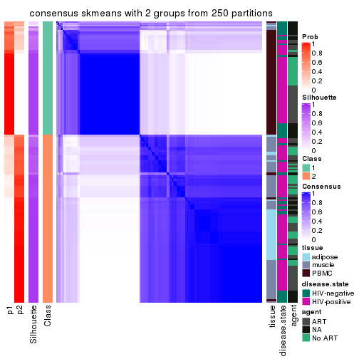</p>

</div>
<div id='tab-SD-skmeans-consensus-heatmap-2'>
<pre><code class="r">consensus_heatmap(res, k = 3)
</code></pre>

<p>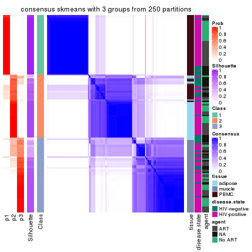</p>

</div>
<div id='tab-SD-skmeans-consensus-heatmap-3'>
<pre><code class="r">consensus_heatmap(res, k = 4)
</code></pre>

<p>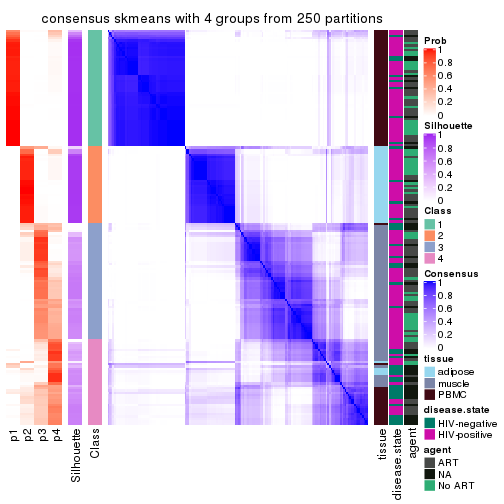</p>

</div>
<div id='tab-SD-skmeans-consensus-heatmap-4'>
<pre><code class="r">consensus_heatmap(res, k = 5)
</code></pre>

<p>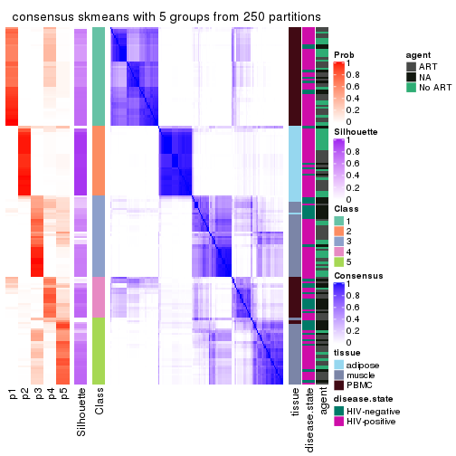</p>

</div>
<div id='tab-SD-skmeans-consensus-heatmap-5'>
<pre><code class="r">consensus_heatmap(res, k = 6)
</code></pre>

<p>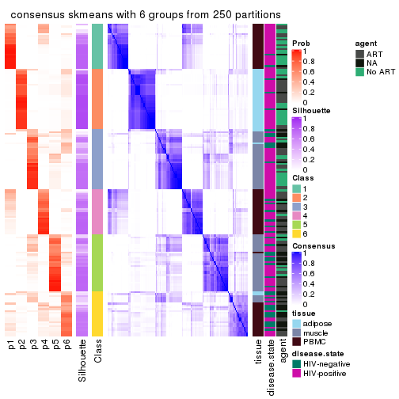</p>

</div>
</div>

Heatmaps for the membership of samples in all partitions to see how consistent they are:


<script>
$( function() {
	$( '#tabs-SD-skmeans-membership-heatmap' ).tabs();
} );
</script>
<div id='tabs-SD-skmeans-membership-heatmap'>
<ul>
<li><a href='#tab-SD-skmeans-membership-heatmap-1'>k = 2</a></li>
<li><a href='#tab-SD-skmeans-membership-heatmap-2'>k = 3</a></li>
<li><a href='#tab-SD-skmeans-membership-heatmap-3'>k = 4</a></li>
<li><a href='#tab-SD-skmeans-membership-heatmap-4'>k = 5</a></li>
<li><a href='#tab-SD-skmeans-membership-heatmap-5'>k = 6</a></li>
</ul>
<div id='tab-SD-skmeans-membership-heatmap-1'>
<pre><code class="r">membership_heatmap(res, k = 2)
</code></pre>

<p>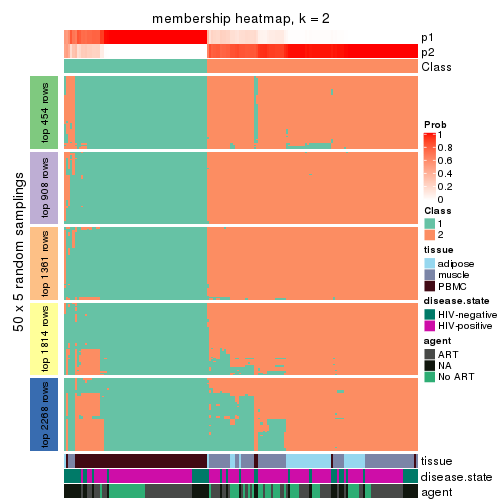</p>

</div>
<div id='tab-SD-skmeans-membership-heatmap-2'>
<pre><code class="r">membership_heatmap(res, k = 3)
</code></pre>

<p>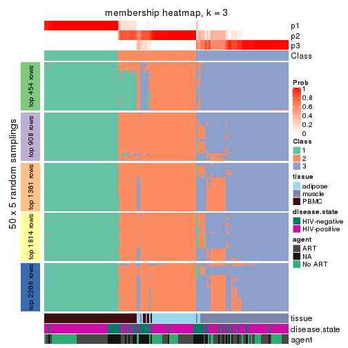</p>

</div>
<div id='tab-SD-skmeans-membership-heatmap-3'>
<pre><code class="r">membership_heatmap(res, k = 4)
</code></pre>

<p>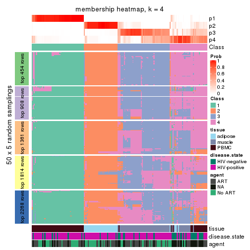</p>

</div>
<div id='tab-SD-skmeans-membership-heatmap-4'>
<pre><code class="r">membership_heatmap(res, k = 5)
</code></pre>

<p>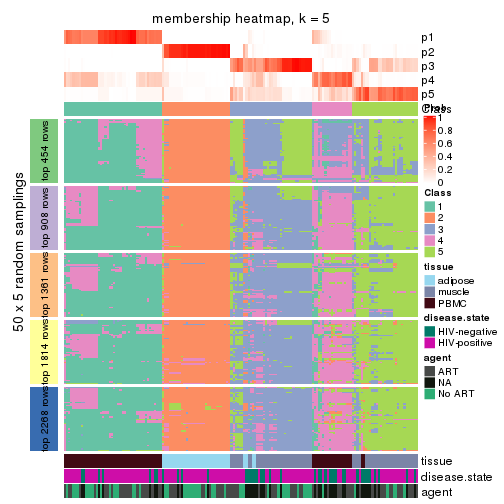</p>

</div>
<div id='tab-SD-skmeans-membership-heatmap-5'>
<pre><code class="r">membership_heatmap(res, k = 6)
</code></pre>

<p>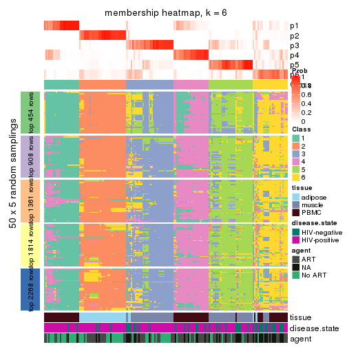</p>

</div>
</div>

As soon as we have had the classes for columns, we can look for signatures
which are significantly different between classes which can be candidate marks
for certain classes. Following are the heatmaps for signatures.


Signature heatmaps where rows are scaled:


<script>
$( function() {
	$( '#tabs-SD-skmeans-get-signatures' ).tabs();
} );
</script>
<div id='tabs-SD-skmeans-get-signatures'>
<ul>
<li><a href='#tab-SD-skmeans-get-signatures-1'>k = 2</a></li>
<li><a href='#tab-SD-skmeans-get-signatures-2'>k = 3</a></li>
<li><a href='#tab-SD-skmeans-get-signatures-3'>k = 4</a></li>
<li><a href='#tab-SD-skmeans-get-signatures-4'>k = 5</a></li>
<li><a href='#tab-SD-skmeans-get-signatures-5'>k = 6</a></li>
</ul>
<div id='tab-SD-skmeans-get-signatures-1'>
<pre><code class="r">get_signatures(res, k = 2)
</code></pre>

<p>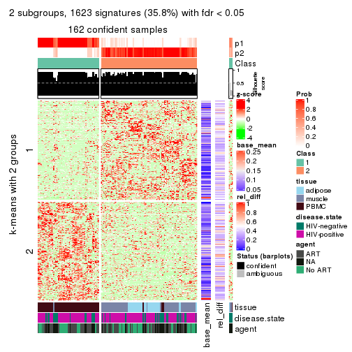</p>

</div>
<div id='tab-SD-skmeans-get-signatures-2'>
<pre><code class="r">get_signatures(res, k = 3)
</code></pre>

<p>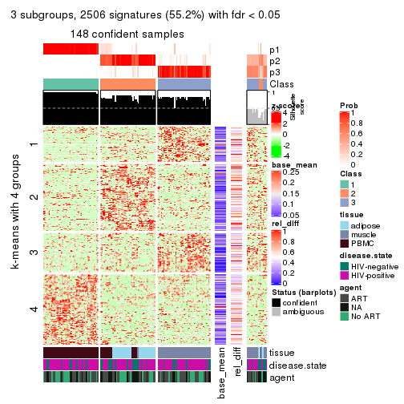</p>

</div>
<div id='tab-SD-skmeans-get-signatures-3'>
<pre><code class="r">get_signatures(res, k = 4)
</code></pre>

<p>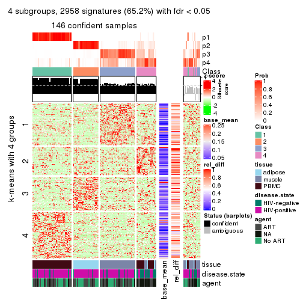</p>

</div>
<div id='tab-SD-skmeans-get-signatures-4'>
<pre><code class="r">get_signatures(res, k = 5)
</code></pre>

<p>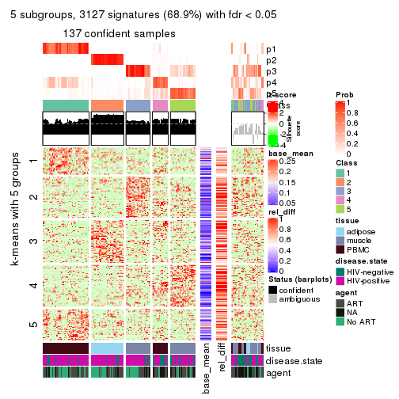</p>

</div>
<div id='tab-SD-skmeans-get-signatures-5'>
<pre><code class="r">get_signatures(res, k = 6)
</code></pre>

<p>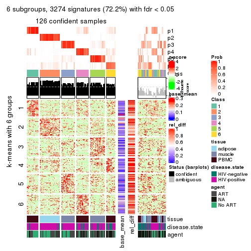</p>

</div>
</div>


Signature heatmaps where rows are not scaled:


<script>
$( function() {
	$( '#tabs-SD-skmeans-get-signatures-no-scale' ).tabs();
} );
</script>
<div id='tabs-SD-skmeans-get-signatures-no-scale'>
<ul>
<li><a href='#tab-SD-skmeans-get-signatures-no-scale-1'>k = 2</a></li>
<li><a href='#tab-SD-skmeans-get-signatures-no-scale-2'>k = 3</a></li>
<li><a href='#tab-SD-skmeans-get-signatures-no-scale-3'>k = 4</a></li>
<li><a href='#tab-SD-skmeans-get-signatures-no-scale-4'>k = 5</a></li>
<li><a href='#tab-SD-skmeans-get-signatures-no-scale-5'>k = 6</a></li>
</ul>
<div id='tab-SD-skmeans-get-signatures-no-scale-1'>
<pre><code class="r">get_signatures(res, k = 2, scale_rows = FALSE)
</code></pre>

<p>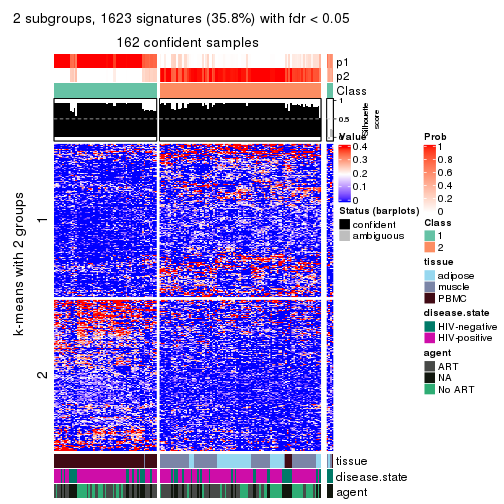</p>

</div>
<div id='tab-SD-skmeans-get-signatures-no-scale-2'>
<pre><code class="r">get_signatures(res, k = 3, scale_rows = FALSE)
</code></pre>

<p>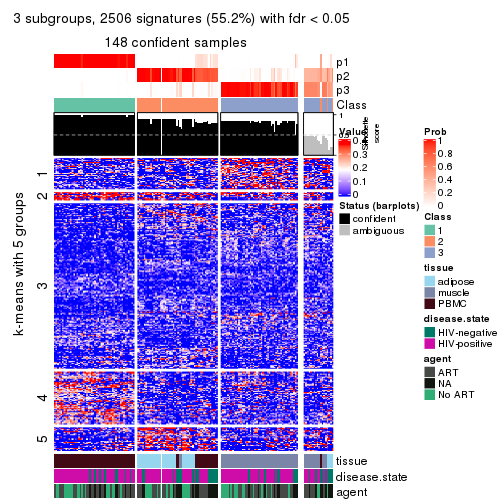</p>

</div>
<div id='tab-SD-skmeans-get-signatures-no-scale-3'>
<pre><code class="r">get_signatures(res, k = 4, scale_rows = FALSE)
</code></pre>

<p>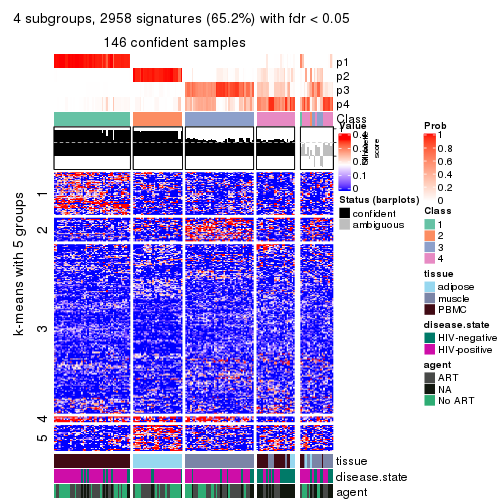</p>

</div>
<div id='tab-SD-skmeans-get-signatures-no-scale-4'>
<pre><code class="r">get_signatures(res, k = 5, scale_rows = FALSE)
</code></pre>

<p>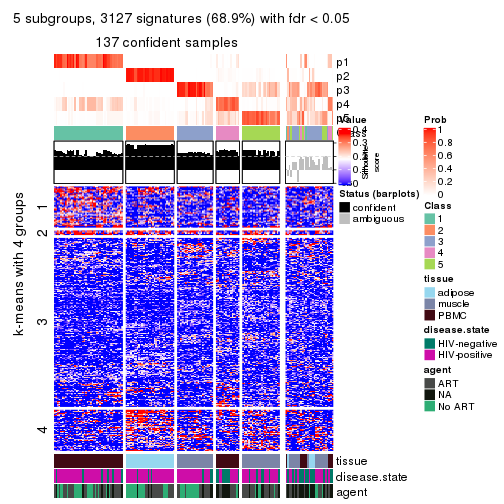</p>

</div>
<div id='tab-SD-skmeans-get-signatures-no-scale-5'>
<pre><code class="r">get_signatures(res, k = 6, scale_rows = FALSE)
</code></pre>

<p>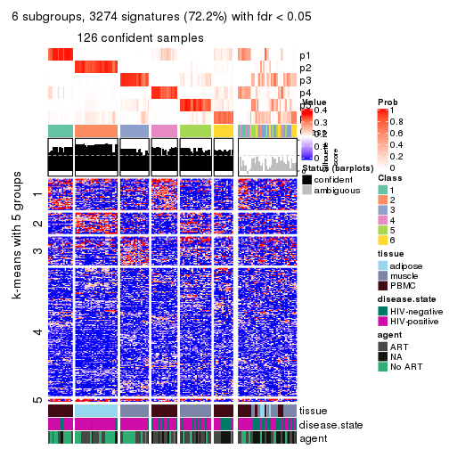</p>

</div>
</div>


Compare the overlap of signatures from different k:

```r
compare_signatures(res)
```

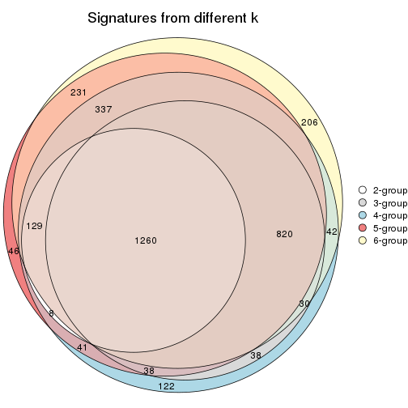

`get_signature()` returns a data frame invisibly. TO get the list of signatures, the function
call should be assigned to a variable explicitly. In following code, if `plot` argument is set
to `FALSE`, no heatmap is plotted while only the differential analysis is performed.

```r
# code only for demonstration
tb = get_signature(res, k = ..., plot = FALSE)
```

An example of the output of `tb` is:

```
#>   which_row         fdr    mean_1    mean_2 scaled_mean_1 scaled_mean_2 km
#> 1        38 0.042760348  8.373488  9.131774    -0.5533452     0.5164555  1
#> 2        40 0.018707592  7.106213  8.469186    -0.6173731     0.5762149  1
#> 3        55 0.019134737 10.221463 11.207825    -0.6159697     0.5749050  1
#> 4        59 0.006059896  5.921854  7.869574    -0.6899429     0.6439467  1
#> 5        60 0.018055526  8.928898 10.211722    -0.6204761     0.5791110  1
#> 6        98 0.009384629 15.714769 14.887706     0.6635654    -0.6193277  2
...
```

The columns in `tb` are:

1. `which_row`: row indices corresponding to the input matrix.
2. `fdr`: FDR for the differential test. 
3. `mean_x`: The mean value in group x.
4. `scaled_mean_x`: The mean value in group x after rows are scaled.
5. `km`: Row groups if k-means clustering is applied to rows.


UMAP plot which shows how samples are separated.


<script>
$( function() {
	$( '#tabs-SD-skmeans-dimension-reduction' ).tabs();
} );
</script>
<div id='tabs-SD-skmeans-dimension-reduction'>
<ul>
<li><a href='#tab-SD-skmeans-dimension-reduction-1'>k = 2</a></li>
<li><a href='#tab-SD-skmeans-dimension-reduction-2'>k = 3</a></li>
<li><a href='#tab-SD-skmeans-dimension-reduction-3'>k = 4</a></li>
<li><a href='#tab-SD-skmeans-dimension-reduction-4'>k = 5</a></li>
<li><a href='#tab-SD-skmeans-dimension-reduction-5'>k = 6</a></li>
</ul>
<div id='tab-SD-skmeans-dimension-reduction-1'>
<pre><code class="r">dimension_reduction(res, k = 2, method = &quot;UMAP&quot;)
</code></pre>

<p>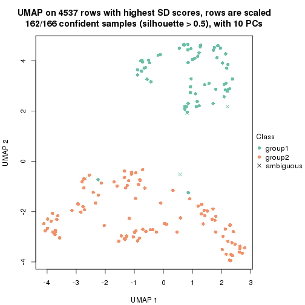</p>

</div>
<div id='tab-SD-skmeans-dimension-reduction-2'>
<pre><code class="r">dimension_reduction(res, k = 3, method = &quot;UMAP&quot;)
</code></pre>

<p>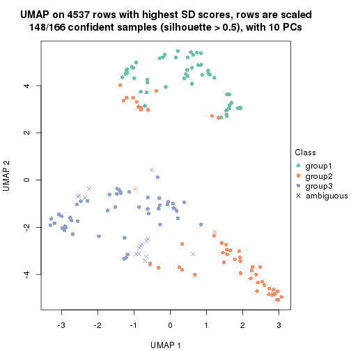</p>

</div>
<div id='tab-SD-skmeans-dimension-reduction-3'>
<pre><code class="r">dimension_reduction(res, k = 4, method = &quot;UMAP&quot;)
</code></pre>

<p>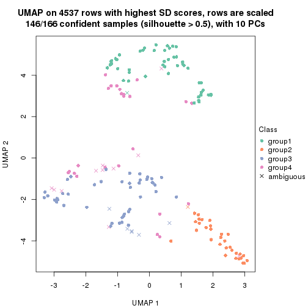</p>

</div>
<div id='tab-SD-skmeans-dimension-reduction-4'>
<pre><code class="r">dimension_reduction(res, k = 5, method = &quot;UMAP&quot;)
</code></pre>

<p>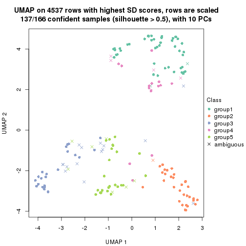</p>

</div>
<div id='tab-SD-skmeans-dimension-reduction-5'>
<pre><code class="r">dimension_reduction(res, k = 6, method = &quot;UMAP&quot;)
</code></pre>

<p>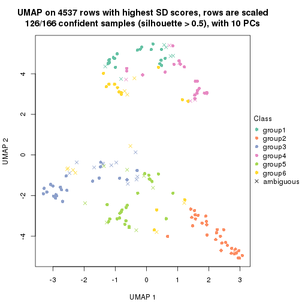</p>

</div>
</div>


Following heatmap shows how subgroups are split when increasing `k`:

```r
collect_classes(res)
```

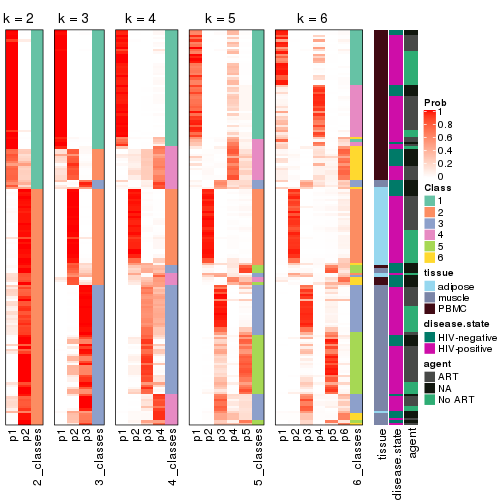


Test correlation between subgroups and known annotations. If the known
annotation is numeric, one-way ANOVA test is applied, and if the known
annotation is discrete, chi-squared contingency table test is applied.

```r
test_to_known_factors(res)
```

```
#>              n tissue(p) disease.state(p) agent(p) k
#> SD:skmeans 162  1.43e-31         9.66e-01 8.17e-01 2
#> SD:skmeans 148  7.19e-45         1.22e-01 3.74e-01 3
#> SD:skmeans 146  1.66e-52         4.30e-07 2.42e-06 4
#> SD:skmeans 137  1.39e-54         4.37e-03 5.97e-03 5
#> SD:skmeans 126  2.06e-48         9.64e-03 6.13e-04 6
```


If matrix rows can be associated to genes, consider to use `GO_Enrichment(res,
...)` to perform function enrichment for the signature genes.


 

---------------------------------------------------


### SD:pam


The object with results only for a single top-value method and a single partition method 
can be extracted as:

```r
res = res_list["SD", "pam"]
# you can also extract it by
# res = res_list["SD:pam"]
```

A summary of `res` and all the functions that can be applied to it:

```r
res
```

```
#> A 'ConsensusPartition' object with k = 2, 3, 4, 5, 6.
#>   On a matrix with 4537 rows and 166 columns.
#>   Top rows (454, 908, 1361, 1814, 2268) are extracted by 'SD' method.
#>   Subgroups are detected by 'pam' method.
#>   Performed in total 1250 partitions by row resampling.
#>   Best k for subgroups seems to be 2.
#> 
#> Following methods can be applied to this 'ConsensusPartition' object:
#>  [1] "cola_report"             "collect_classes"         "collect_plots"          
#>  [4] "collect_stats"           "colnames"                "compare_signatures"     
#>  [7] "consensus_heatmap"       "dimension_reduction"     "functional_enrichment"  
#> [10] "get_anno_col"            "get_anno"                "get_classes"            
#> [13] "get_consensus"           "get_matrix"              "get_membership"         
#> [16] "get_param"               "get_signatures"          "get_stats"              
#> [19] "is_best_k"               "is_stable_k"             "membership_heatmap"     
#> [22] "ncol"                    "nrow"                    "plot_ecdf"              
#> [25] "rownames"                "select_partition_number" "show"                   
#> [28] "suggest_best_k"          "test_to_known_factors"
```

`collect_plots()` function collects all the plots made from `res` for all `k` (number of partitions)
into one single page to provide an easy and fast comparison between different `k`.

```r
collect_plots(res)
```

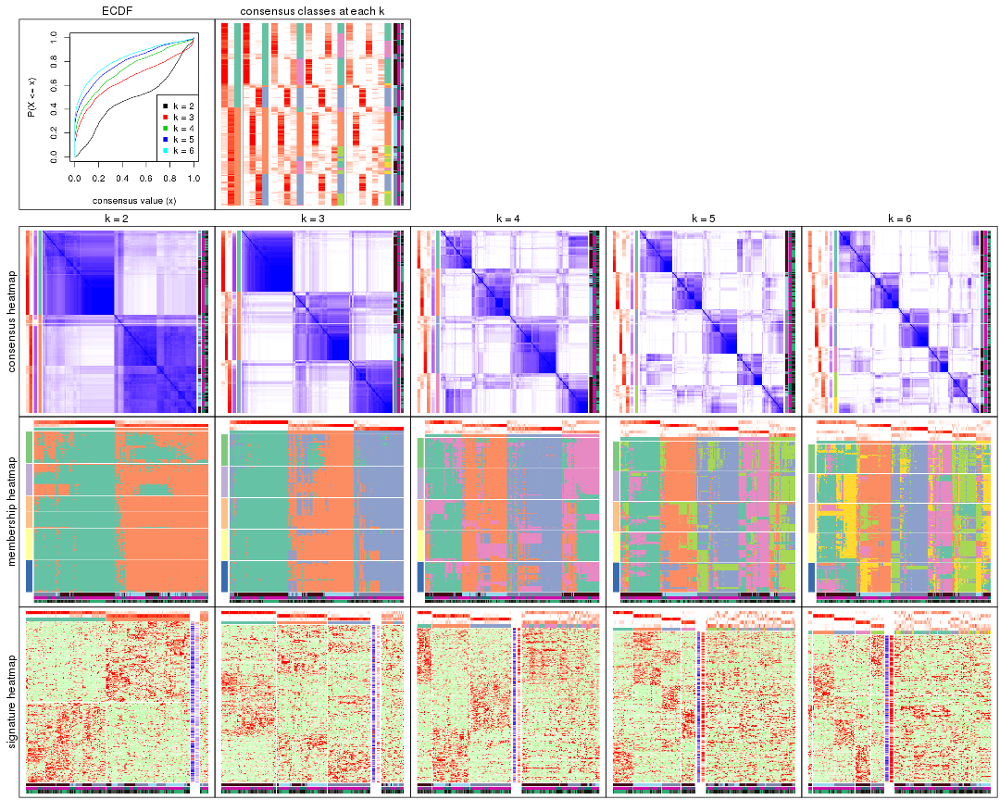

The plots are:

- The first row: a plot of the ECDF (Empirical cumulative distribution
  function) curves of the consensus matrix for each `k` and the heatmap of
  predicted classes for each `k`.
- The second row: heatmaps of the consensus matrix for each `k`.
- The third row: heatmaps of the membership matrix for each `k`.
- The fouth row: heatmaps of the signatures for each `k`.

All the plots in panels can be made by individual functions and they are
plotted later in this section.

`select_partition_number()` produces several plots showing different
statistics for choosing "optimized" `k`. There are following statistics:

- ECDF curves of the consensus matrix for each `k`;
- 1-PAC. [The PAC
  score](https://en.wikipedia.org/wiki/Consensus_clustering#Over-interpretation_potential_of_consensus_clustering)
  measures the proportion of the ambiguous subgrouping.
- Mean silhouette score.
- Concordance. The mean probability of fiting the consensus class ids in all
  partitions.
- Area increased. Denote $A_k$ as the area under the ECDF curve for current
  `k`, the area increased is defined as $A_k - A_{k-1}$.
- Rand index. The percent of pairs of samples that are both in a same cluster
  or both are not in a same cluster in the partition of k and k-1.
- Jaccard index. The ratio of pairs of samples are both in a same cluster in
  the partition of k and k-1 and the pairs of samples are both in a same
  cluster in the partition k or k-1.

The detailed explanations of these statistics can be found in [the cola
vignette](http://bioconductor.org/packages/devel/bioc/vignettes/cola/inst/doc/cola.html#toc_13).

Generally speaking, lower PAC score, higher mean silhouette score or higher
concordance corresponds to better partition. Rand index and Jaccard index
measure how similar the current partition is compared to partition with `k-1`.
If they are too similar, we won't accept `k` is better than `k-1`.

```r
select_partition_number(res)
```

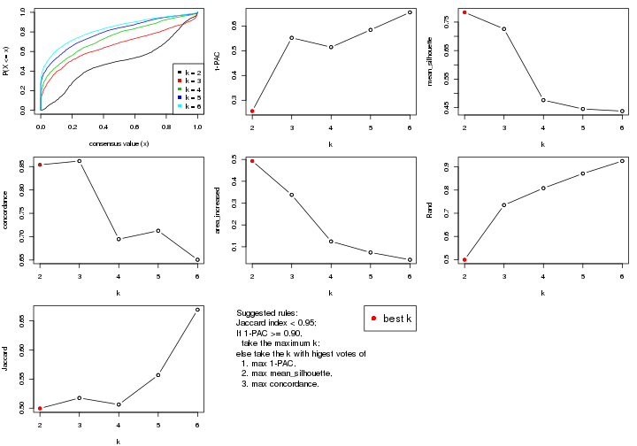

The numeric values for all these statistics can be obtained by `get_stats()`.

```r
get_stats(res)
```

```
#>   k 1-PAC mean_silhouette concordance area_increased  Rand Jaccard
#> 2 2 0.256           0.784       0.854         0.4927 0.500   0.500
#> 3 3 0.552           0.726       0.862         0.3377 0.735   0.518
#> 4 4 0.514           0.476       0.695         0.1245 0.808   0.506
#> 5 5 0.584           0.445       0.713         0.0739 0.871   0.557
#> 6 6 0.655           0.438       0.651         0.0407 0.925   0.669
```

`suggest_best_k()` suggests the best $k$ based on these statistics. The rules are as follows:

- All $k$ with Jaccard index larger than 0.95 are removed because the increase of
  the partition number does not provides enough extra information. If all $k$ are removed,
  the best $k$ is assigned by `NA`.
- For $k$ with 1-PAC larger than 0.9, the maximal $k$ is taken as the "best k". Other $k$ is called "optional k".
- If it does not fit the second rule. The $k$ with the highest vote of highest
  1-PAC, mean silhouette and concordance is taken as the "best k".

```r
suggest_best_k(res)
```

```
#> [1] 2
```


Following shows the table of the partitions (You need to click the **show/hide
code output** link to see it). The membership matrix (columns with name `p*`)
is inferred by
[`clue::cl_consensus()`](https://www.rdocumentation.org/link/cl_consensus?package=clue)
function with the `SE` method. Basically the value in the membership matrix
represents the probability to belong to a certain group. The finall class
label for an item is determined with the group with highest probability it
belongs to.

In `get_classes()` function, the entropy is calculated from the membership
matrix and the silhouette score is calculated from the consensus matrix.


<script>
$( function() {
	$( '#tabs-SD-pam-get-classes' ).tabs();
} );
</script>
<div id='tabs-SD-pam-get-classes'>
<ul>
<li><a href='#tab-SD-pam-get-classes-1'>k = 2</a></li>
<li><a href='#tab-SD-pam-get-classes-2'>k = 3</a></li>
<li><a href='#tab-SD-pam-get-classes-3'>k = 4</a></li>
<li><a href='#tab-SD-pam-get-classes-4'>k = 5</a></li>
<li><a href='#tab-SD-pam-get-classes-5'>k = 6</a></li>
</ul>

<div id='tab-SD-pam-get-classes-1'>
<p><a id='tab-SD-pam-get-classes-1-a' style='color:#0366d6' href='#'>show/hide code output</a></p>
<pre><code class="r">cbind(get_classes(res, k = 2), get_membership(res, k = 2))
</code></pre>

<pre><code>#&gt;           class entropy silhouette    p1    p2
#&gt; GSM751298     1  0.0000     0.8689 1.000 0.000
#&gt; GSM751304     2  0.7745     0.8198 0.228 0.772
#&gt; GSM751305     2  0.6531     0.8422 0.168 0.832
#&gt; GSM751307     2  0.7883     0.8180 0.236 0.764
#&gt; GSM751310     1  0.5059     0.8486 0.888 0.112
#&gt; GSM751314     1  0.6623     0.8217 0.828 0.172
#&gt; GSM751316     1  0.3584     0.8546 0.932 0.068
#&gt; GSM751318     1  0.4431     0.8540 0.908 0.092
#&gt; GSM751342     1  0.6148     0.8348 0.848 0.152
#&gt; GSM751346     1  0.0938     0.8647 0.988 0.012
#&gt; GSM751347     1  0.0000     0.8689 1.000 0.000
#&gt; GSM751348     2  0.7376     0.8254 0.208 0.792
#&gt; GSM751349     2  0.6438     0.8464 0.164 0.836
#&gt; GSM751352     2  0.8909     0.7551 0.308 0.692
#&gt; GSM751353     2  0.8267     0.7938 0.260 0.740
#&gt; GSM751354     2  0.7602     0.8206 0.220 0.780
#&gt; GSM751355     2  0.7299     0.8293 0.204 0.796
#&gt; GSM751358     2  0.8081     0.6681 0.248 0.752
#&gt; GSM751359     2  0.3274     0.8471 0.060 0.940
#&gt; GSM751294     2  0.7219     0.8282 0.200 0.800
#&gt; GSM751296     1  0.0000     0.8689 1.000 0.000
#&gt; GSM751297     1  0.4562     0.8404 0.904 0.096
#&gt; GSM751299     2  0.9129     0.7253 0.328 0.672
#&gt; GSM751300     1  0.0000     0.8689 1.000 0.000
#&gt; GSM751301     1  0.4690     0.7994 0.900 0.100
#&gt; GSM751302     1  0.0000     0.8689 1.000 0.000
#&gt; GSM751303     1  0.5059     0.8489 0.888 0.112
#&gt; GSM751306     1  0.6048     0.8353 0.852 0.148
#&gt; GSM751308     1  0.0376     0.8671 0.996 0.004
#&gt; GSM751309     1  0.5629     0.8405 0.868 0.132
#&gt; GSM751311     1  0.1633     0.8684 0.976 0.024
#&gt; GSM751312     1  0.0000     0.8689 1.000 0.000
#&gt; GSM751313     1  0.0376     0.8689 0.996 0.004
#&gt; GSM751315     1  0.0000     0.8689 1.000 0.000
#&gt; GSM751317     1  0.0376     0.8689 0.996 0.004
#&gt; GSM751320     1  0.0000     0.8689 1.000 0.000
#&gt; GSM751321     1  0.0672     0.8691 0.992 0.008
#&gt; GSM751322     1  0.1843     0.8678 0.972 0.028
#&gt; GSM751324     1  0.4161     0.8540 0.916 0.084
#&gt; GSM751325     1  0.0938     0.8694 0.988 0.012
#&gt; GSM751332     1  0.4939     0.8486 0.892 0.108
#&gt; GSM751334     1  0.2948     0.8630 0.948 0.052
#&gt; GSM751339     1  0.0672     0.8678 0.992 0.008
#&gt; GSM751341     1  0.0376     0.8684 0.996 0.004
#&gt; GSM751343     1  0.0000     0.8689 1.000 0.000
#&gt; GSM751344     2  0.8443     0.7870 0.272 0.728
#&gt; GSM751345     2  0.8661     0.7716 0.288 0.712
#&gt; GSM751356     2  0.8327     0.7885 0.264 0.736
#&gt; GSM751357     2  0.8267     0.7929 0.260 0.740
#&gt; GSM751293     1  0.0000     0.8689 1.000 0.000
#&gt; GSM751295     1  0.0000     0.8689 1.000 0.000
#&gt; GSM751319     1  0.0000     0.8689 1.000 0.000
#&gt; GSM751323     1  0.0000     0.8689 1.000 0.000
#&gt; GSM751326     1  0.0000     0.8689 1.000 0.000
#&gt; GSM751327     1  0.0000     0.8689 1.000 0.000
#&gt; GSM751328     1  0.2778     0.8640 0.952 0.048
#&gt; GSM751329     1  0.0000     0.8689 1.000 0.000
#&gt; GSM751330     1  0.0000     0.8689 1.000 0.000
#&gt; GSM751331     1  0.0000     0.8689 1.000 0.000
#&gt; GSM751333     1  0.0000     0.8689 1.000 0.000
#&gt; GSM751335     1  0.0000     0.8689 1.000 0.000
#&gt; GSM751336     1  0.0000     0.8689 1.000 0.000
#&gt; GSM751337     1  0.0376     0.8687 0.996 0.004
#&gt; GSM751338     1  0.0000     0.8689 1.000 0.000
#&gt; GSM751340     1  0.0672     0.8681 0.992 0.008
#&gt; GSM751350     1  0.0000     0.8689 1.000 0.000
#&gt; GSM751351     1  0.0000     0.8689 1.000 0.000
#&gt; GSM751362     1  0.8207     0.7752 0.744 0.256
#&gt; GSM751363     1  0.8267     0.7688 0.740 0.260
#&gt; GSM751367     1  0.8661     0.6880 0.712 0.288
#&gt; GSM751368     2  0.1633     0.8324 0.024 0.976
#&gt; GSM751371     1  0.6247     0.8345 0.844 0.156
#&gt; GSM751375     2  0.6623     0.8339 0.172 0.828
#&gt; GSM751376     2  0.6801     0.8381 0.180 0.820
#&gt; GSM751378     2  0.3274     0.8494 0.060 0.940
#&gt; GSM751379     2  0.4690     0.8521 0.100 0.900
#&gt; GSM751382     2  0.6247     0.8437 0.156 0.844
#&gt; GSM751386     2  0.0938     0.8291 0.012 0.988
#&gt; GSM751388     2  0.1184     0.8300 0.016 0.984
#&gt; GSM751391     2  0.9129     0.4389 0.328 0.672
#&gt; GSM751410     1  0.5178     0.8412 0.884 0.116
#&gt; GSM751414     1  0.9209     0.6962 0.664 0.336
#&gt; GSM751361     2  0.5059     0.7789 0.112 0.888
#&gt; GSM751365     1  0.9710     0.5888 0.600 0.400
#&gt; GSM751366     1  0.8713     0.7426 0.708 0.292
#&gt; GSM751369     1  0.7674     0.7947 0.776 0.224
#&gt; GSM751370     1  0.8661     0.7459 0.712 0.288
#&gt; GSM751372     2  0.9954    -0.1757 0.460 0.540
#&gt; GSM751373     1  0.9393     0.6630 0.644 0.356
#&gt; GSM751374     2  0.5737     0.8556 0.136 0.864
#&gt; GSM751377     2  0.2043     0.8321 0.032 0.968
#&gt; GSM751380     1  0.8386     0.7652 0.732 0.268
#&gt; GSM751381     2  0.2236     0.8423 0.036 0.964
#&gt; GSM751383     2  0.2043     0.8381 0.032 0.968
#&gt; GSM751384     2  0.2043     0.8315 0.032 0.968
#&gt; GSM751385     2  0.6343     0.8430 0.160 0.840
#&gt; GSM751387     2  0.1184     0.8331 0.016 0.984
#&gt; GSM751389     2  0.2603     0.8289 0.044 0.956
#&gt; GSM751393     2  0.2043     0.8311 0.032 0.968
#&gt; GSM751394     2  0.3584     0.8472 0.068 0.932
#&gt; GSM751395     2  0.4562     0.8502 0.096 0.904
#&gt; GSM751397     2  0.3584     0.8489 0.068 0.932
#&gt; GSM751398     2  0.2236     0.8339 0.036 0.964
#&gt; GSM751404     1  0.9170     0.7119 0.668 0.332
#&gt; GSM751406     1  0.7815     0.7833 0.768 0.232
#&gt; GSM751411     1  0.9323     0.6819 0.652 0.348
#&gt; GSM751413     2  0.7139     0.8333 0.196 0.804
#&gt; GSM751415     1  0.8955     0.7279 0.688 0.312
#&gt; GSM751416     2  0.2423     0.8311 0.040 0.960
#&gt; GSM751417     2  0.1843     0.8317 0.028 0.972
#&gt; GSM751421     2  0.9833     0.0329 0.424 0.576
#&gt; GSM751422     1  0.8909     0.7143 0.692 0.308
#&gt; GSM751360     1  0.7602     0.7939 0.780 0.220
#&gt; GSM751364     2  0.9977    -0.2346 0.472 0.528
#&gt; GSM751390     2  0.9710     0.1653 0.400 0.600
#&gt; GSM751392     2  0.2603     0.8468 0.044 0.956
#&gt; GSM751396     2  0.0376     0.8270 0.004 0.996
#&gt; GSM751399     1  0.9896     0.5099 0.560 0.440
#&gt; GSM751400     2  0.4939     0.8356 0.108 0.892
#&gt; GSM751401     1  0.8608     0.7523 0.716 0.284
#&gt; GSM751402     1  0.8555     0.7536 0.720 0.280
#&gt; GSM751403     1  0.9491     0.6442 0.632 0.368
#&gt; GSM751405     1  0.8016     0.7763 0.756 0.244
#&gt; GSM751407     1  0.9000     0.6974 0.684 0.316
#&gt; GSM751408     2  0.2778     0.8397 0.048 0.952
#&gt; GSM751409     2  0.1633     0.8308 0.024 0.976
#&gt; GSM751412     2  0.8443     0.5086 0.272 0.728
#&gt; GSM751418     2  0.9933    -0.1504 0.452 0.548
#&gt; GSM751419     2  0.9427     0.2575 0.360 0.640
#&gt; GSM751420     2  0.1843     0.8407 0.028 0.972
#&gt; GSM751425     2  0.6148     0.8435 0.152 0.848
#&gt; GSM751429     1  0.8661     0.5984 0.712 0.288
#&gt; GSM751430     2  0.7602     0.8241 0.220 0.780
#&gt; GSM751433     2  0.3733     0.8398 0.072 0.928
#&gt; GSM751437     2  0.6247     0.8436 0.156 0.844
#&gt; GSM751448     1  0.6887     0.8073 0.816 0.184
#&gt; GSM751451     2  0.3274     0.8397 0.060 0.940
#&gt; GSM751423     2  0.2778     0.8484 0.048 0.952
#&gt; GSM751424     2  0.3733     0.8513 0.072 0.928
#&gt; GSM751428     2  0.6623     0.8403 0.172 0.828
#&gt; GSM751431     2  0.4431     0.8534 0.092 0.908
#&gt; GSM751432     2  0.5294     0.8353 0.120 0.880
#&gt; GSM751434     2  0.7139     0.8340 0.196 0.804
#&gt; GSM751435     2  0.6438     0.8431 0.164 0.836
#&gt; GSM751436     2  0.4022     0.8357 0.080 0.920
#&gt; GSM751440     2  0.2948     0.8468 0.052 0.948
#&gt; GSM751444     2  0.7602     0.8136 0.220 0.780
#&gt; GSM751446     2  0.5059     0.8541 0.112 0.888
#&gt; GSM751449     2  0.4562     0.8529 0.096 0.904
#&gt; GSM751450     2  0.4022     0.8528 0.080 0.920
#&gt; GSM751452     2  0.5294     0.8474 0.120 0.880
#&gt; GSM751426     2  0.5842     0.8475 0.140 0.860
#&gt; GSM751427     2  0.2603     0.8473 0.044 0.956
#&gt; GSM751438     2  0.4431     0.8532 0.092 0.908
#&gt; GSM751439     2  0.9552     0.4914 0.376 0.624
#&gt; GSM751441     2  0.7219     0.8267 0.200 0.800
#&gt; GSM751442     2  0.8443     0.7680 0.272 0.728
#&gt; GSM751443     1  0.8499     0.5916 0.724 0.276
#&gt; GSM751445     2  0.6048     0.8406 0.148 0.852
#&gt; GSM751447     2  0.7139     0.8281 0.196 0.804
#&gt; GSM751453     2  0.7528     0.8142 0.216 0.784
#&gt; GSM751454     2  0.7219     0.8233 0.200 0.800
#&gt; GSM751455     2  0.6048     0.8468 0.148 0.852
#&gt; GSM751456     2  0.6712     0.8387 0.176 0.824
#&gt; GSM751457     2  0.6438     0.8361 0.164 0.836
#&gt; GSM751458     2  0.6712     0.8319 0.176 0.824
</code></pre>

<script>
$('#tab-SD-pam-get-classes-1-a').parent().next().next().hide();
$('#tab-SD-pam-get-classes-1-a').click(function(){
  $('#tab-SD-pam-get-classes-1-a').parent().next().next().toggle();
  return(false);
});
</script>
</div>

<div id='tab-SD-pam-get-classes-2'>
<p><a id='tab-SD-pam-get-classes-2-a' style='color:#0366d6' href='#'>show/hide code output</a></p>
<pre><code class="r">cbind(get_classes(res, k = 3), get_membership(res, k = 3))
</code></pre>

<pre><code>#&gt;           class entropy silhouette    p1    p2    p3
#&gt; GSM751298     1  0.0237     0.9329 0.996 0.004 0.000
#&gt; GSM751304     2  0.9049     0.5140 0.232 0.556 0.212
#&gt; GSM751305     2  0.9456     0.3651 0.200 0.480 0.320
#&gt; GSM751307     2  0.9400     0.3073 0.180 0.464 0.356
#&gt; GSM751310     1  0.3879     0.7954 0.848 0.000 0.152
#&gt; GSM751314     1  0.2711     0.8753 0.912 0.000 0.088
#&gt; GSM751316     1  0.2165     0.8940 0.936 0.000 0.064
#&gt; GSM751318     1  0.2448     0.8814 0.924 0.076 0.000
#&gt; GSM751342     1  0.4179     0.8528 0.876 0.072 0.052
#&gt; GSM751346     1  0.0592     0.9289 0.988 0.012 0.000
#&gt; GSM751347     1  0.0237     0.9333 0.996 0.000 0.004
#&gt; GSM751348     2  0.5585     0.7459 0.092 0.812 0.096
#&gt; GSM751349     2  0.6031     0.7351 0.096 0.788 0.116
#&gt; GSM751352     2  0.6253     0.6762 0.232 0.732 0.036
#&gt; GSM751353     2  0.6911     0.6937 0.180 0.728 0.092
#&gt; GSM751354     2  0.7661     0.6595 0.144 0.684 0.172
#&gt; GSM751355     2  0.9015     0.3717 0.144 0.508 0.348
#&gt; GSM751358     2  0.8568     0.5605 0.200 0.608 0.192
#&gt; GSM751359     2  0.7787     0.4629 0.064 0.588 0.348
#&gt; GSM751294     2  0.4658     0.7562 0.068 0.856 0.076
#&gt; GSM751296     1  0.0000     0.9342 1.000 0.000 0.000
#&gt; GSM751297     1  0.7633     0.5888 0.684 0.184 0.132
#&gt; GSM751299     2  0.5138     0.6694 0.252 0.748 0.000
#&gt; GSM751300     1  0.0000     0.9342 1.000 0.000 0.000
#&gt; GSM751301     1  0.3539     0.8329 0.888 0.100 0.012
#&gt; GSM751302     1  0.0000     0.9342 1.000 0.000 0.000
#&gt; GSM751303     1  0.1411     0.9190 0.964 0.000 0.036
#&gt; GSM751306     1  0.1964     0.9050 0.944 0.000 0.056
#&gt; GSM751308     1  0.1031     0.9237 0.976 0.024 0.000
#&gt; GSM751309     1  0.1411     0.9180 0.964 0.000 0.036
#&gt; GSM751311     1  0.0237     0.9334 0.996 0.000 0.004
#&gt; GSM751312     1  0.0747     0.9287 0.984 0.000 0.016
#&gt; GSM751313     1  0.0000     0.9342 1.000 0.000 0.000
#&gt; GSM751315     1  0.0000     0.9342 1.000 0.000 0.000
#&gt; GSM751317     1  0.0000     0.9342 1.000 0.000 0.000
#&gt; GSM751320     1  0.0000     0.9342 1.000 0.000 0.000
#&gt; GSM751321     1  0.0000     0.9342 1.000 0.000 0.000
#&gt; GSM751322     1  0.0237     0.9334 0.996 0.000 0.004
#&gt; GSM751324     1  0.0747     0.9284 0.984 0.000 0.016
#&gt; GSM751325     1  0.0000     0.9342 1.000 0.000 0.000
#&gt; GSM751332     1  0.1163     0.9221 0.972 0.000 0.028
#&gt; GSM751334     1  0.0424     0.9321 0.992 0.000 0.008
#&gt; GSM751339     1  0.0983     0.9273 0.980 0.004 0.016
#&gt; GSM751341     1  0.1525     0.9167 0.964 0.032 0.004
#&gt; GSM751343     1  0.0424     0.9315 0.992 0.008 0.000
#&gt; GSM751344     2  0.6380     0.7154 0.164 0.760 0.076
#&gt; GSM751345     2  0.6208     0.7189 0.164 0.768 0.068
#&gt; GSM751356     2  0.5722     0.7371 0.132 0.800 0.068
#&gt; GSM751357     2  0.6393     0.7198 0.148 0.764 0.088
#&gt; GSM751293     1  0.0000     0.9342 1.000 0.000 0.000
#&gt; GSM751295     1  0.0000     0.9342 1.000 0.000 0.000
#&gt; GSM751319     1  0.0000     0.9342 1.000 0.000 0.000
#&gt; GSM751323     1  0.0000     0.9342 1.000 0.000 0.000
#&gt; GSM751326     1  0.0000     0.9342 1.000 0.000 0.000
#&gt; GSM751327     1  0.0000     0.9342 1.000 0.000 0.000
#&gt; GSM751328     1  0.0747     0.9284 0.984 0.000 0.016
#&gt; GSM751329     1  0.0000     0.9342 1.000 0.000 0.000
#&gt; GSM751330     1  0.0000     0.9342 1.000 0.000 0.000
#&gt; GSM751331     1  0.0000     0.9342 1.000 0.000 0.000
#&gt; GSM751333     1  0.0000     0.9342 1.000 0.000 0.000
#&gt; GSM751335     1  0.0000     0.9342 1.000 0.000 0.000
#&gt; GSM751336     1  0.0000     0.9342 1.000 0.000 0.000
#&gt; GSM751337     1  0.0237     0.9330 0.996 0.004 0.000
#&gt; GSM751338     1  0.0000     0.9342 1.000 0.000 0.000
#&gt; GSM751340     1  0.2590     0.8881 0.924 0.004 0.072
#&gt; GSM751350     1  0.0000     0.9342 1.000 0.000 0.000
#&gt; GSM751351     1  0.0000     0.9342 1.000 0.000 0.000
#&gt; GSM751362     3  0.5016     0.6659 0.240 0.000 0.760
#&gt; GSM751363     3  0.5016     0.6643 0.240 0.000 0.760
#&gt; GSM751367     1  0.8932    -0.0922 0.456 0.124 0.420
#&gt; GSM751368     3  0.4121     0.7409 0.000 0.168 0.832
#&gt; GSM751371     1  0.2939     0.8824 0.916 0.012 0.072
#&gt; GSM751375     2  0.4371     0.7495 0.032 0.860 0.108
#&gt; GSM751376     2  0.7728     0.5930 0.084 0.640 0.276
#&gt; GSM751378     2  0.6161     0.6104 0.020 0.708 0.272
#&gt; GSM751379     3  0.7107     0.3930 0.036 0.340 0.624
#&gt; GSM751382     2  0.5744     0.7349 0.072 0.800 0.128
#&gt; GSM751386     3  0.4002     0.7448 0.000 0.160 0.840
#&gt; GSM751388     3  0.4002     0.7450 0.000 0.160 0.840
#&gt; GSM751391     2  0.9908     0.1591 0.268 0.372 0.360
#&gt; GSM751410     1  0.5842     0.7314 0.768 0.036 0.196
#&gt; GSM751414     3  0.3213     0.7927 0.092 0.008 0.900
#&gt; GSM751361     3  0.4848     0.7660 0.036 0.128 0.836
#&gt; GSM751365     3  0.0237     0.8180 0.004 0.000 0.996
#&gt; GSM751366     3  0.1643     0.8060 0.044 0.000 0.956
#&gt; GSM751369     1  0.6848     0.2495 0.568 0.016 0.416
#&gt; GSM751370     3  0.2711     0.7963 0.088 0.000 0.912
#&gt; GSM751372     3  0.0000     0.8171 0.000 0.000 1.000
#&gt; GSM751373     3  0.1163     0.8191 0.028 0.000 0.972
#&gt; GSM751374     3  0.7188     0.5041 0.056 0.280 0.664
#&gt; GSM751377     3  0.3941     0.7483 0.000 0.156 0.844
#&gt; GSM751380     3  0.2682     0.7881 0.076 0.004 0.920
#&gt; GSM751381     3  0.5061     0.6928 0.008 0.208 0.784
#&gt; GSM751383     3  0.4062     0.7451 0.000 0.164 0.836
#&gt; GSM751384     3  0.0000     0.8171 0.000 0.000 1.000
#&gt; GSM751385     3  0.7853     0.0245 0.060 0.384 0.556
#&gt; GSM751387     2  0.6045     0.4468 0.000 0.620 0.380
#&gt; GSM751389     3  0.1399     0.8115 0.004 0.028 0.968
#&gt; GSM751393     3  0.1163     0.8160 0.000 0.028 0.972
#&gt; GSM751394     3  0.6955    -0.1416 0.016 0.492 0.492
#&gt; GSM751395     3  0.5202     0.7479 0.044 0.136 0.820
#&gt; GSM751397     3  0.6487     0.5561 0.032 0.268 0.700
#&gt; GSM751398     3  0.4504     0.7049 0.000 0.196 0.804
#&gt; GSM751404     3  0.0000     0.8171 0.000 0.000 1.000
#&gt; GSM751406     3  0.8519     0.1612 0.396 0.096 0.508
#&gt; GSM751411     3  0.0000     0.8171 0.000 0.000 1.000
#&gt; GSM751413     2  0.9259     0.1879 0.156 0.440 0.404
#&gt; GSM751415     3  0.1529     0.8078 0.040 0.000 0.960
#&gt; GSM751416     3  0.3879     0.7517 0.000 0.152 0.848
#&gt; GSM751417     3  0.3941     0.7483 0.000 0.156 0.844
#&gt; GSM751421     3  0.5136     0.7387 0.132 0.044 0.824
#&gt; GSM751422     1  0.7248     0.1487 0.536 0.028 0.436
#&gt; GSM751360     1  0.5465     0.5792 0.712 0.000 0.288
#&gt; GSM751364     3  0.3263     0.8080 0.048 0.040 0.912
#&gt; GSM751390     3  0.2031     0.8147 0.032 0.016 0.952
#&gt; GSM751392     2  0.5503     0.6892 0.020 0.772 0.208
#&gt; GSM751396     2  0.6309     0.1037 0.000 0.504 0.496
#&gt; GSM751399     3  0.0000     0.8171 0.000 0.000 1.000
#&gt; GSM751400     3  0.2383     0.8061 0.044 0.016 0.940
#&gt; GSM751401     3  0.2590     0.7870 0.004 0.072 0.924
#&gt; GSM751402     3  0.1919     0.8112 0.024 0.020 0.956
#&gt; GSM751403     3  0.0661     0.8181 0.008 0.004 0.988
#&gt; GSM751405     3  0.6498     0.2825 0.396 0.008 0.596
#&gt; GSM751407     3  0.1643     0.8090 0.044 0.000 0.956
#&gt; GSM751408     3  0.0747     0.8179 0.016 0.000 0.984
#&gt; GSM751409     3  0.1289     0.8086 0.000 0.032 0.968
#&gt; GSM751412     3  0.0000     0.8171 0.000 0.000 1.000
#&gt; GSM751418     3  0.0237     0.8174 0.000 0.004 0.996
#&gt; GSM751419     3  0.0237     0.8174 0.000 0.004 0.996
#&gt; GSM751420     2  0.6460     0.3215 0.004 0.556 0.440
#&gt; GSM751425     2  0.0000     0.7712 0.000 1.000 0.000
#&gt; GSM751429     3  0.8280     0.0873 0.080 0.404 0.516
#&gt; GSM751430     2  0.9041     0.2922 0.140 0.488 0.372
#&gt; GSM751433     2  0.0592     0.7702 0.012 0.988 0.000
#&gt; GSM751437     2  0.4897     0.6531 0.016 0.812 0.172
#&gt; GSM751448     2  0.9687     0.2536 0.296 0.456 0.248
#&gt; GSM751451     2  0.0000     0.7712 0.000 1.000 0.000
#&gt; GSM751423     2  0.1964     0.7628 0.000 0.944 0.056
#&gt; GSM751424     2  0.4128     0.7281 0.012 0.856 0.132
#&gt; GSM751428     2  0.5659     0.7000 0.052 0.796 0.152
#&gt; GSM751431     2  0.0000     0.7712 0.000 1.000 0.000
#&gt; GSM751432     2  0.7979     0.1802 0.060 0.500 0.440
#&gt; GSM751434     2  0.7453     0.5233 0.064 0.644 0.292
#&gt; GSM751435     2  0.0661     0.7720 0.008 0.988 0.004
#&gt; GSM751436     2  0.2749     0.7596 0.012 0.924 0.064
#&gt; GSM751440     2  0.1877     0.7632 0.012 0.956 0.032
#&gt; GSM751444     2  0.0000     0.7712 0.000 1.000 0.000
#&gt; GSM751446     2  0.0000     0.7712 0.000 1.000 0.000
#&gt; GSM751449     2  0.0000     0.7712 0.000 1.000 0.000
#&gt; GSM751450     2  0.1267     0.7692 0.024 0.972 0.004
#&gt; GSM751452     2  0.6337     0.5975 0.028 0.708 0.264
#&gt; GSM751426     2  0.1015     0.7708 0.012 0.980 0.008
#&gt; GSM751427     2  0.0000     0.7712 0.000 1.000 0.000
#&gt; GSM751438     2  0.0000     0.7712 0.000 1.000 0.000
#&gt; GSM751439     2  0.7525     0.5274 0.108 0.684 0.208
#&gt; GSM751441     2  0.0000     0.7712 0.000 1.000 0.000
#&gt; GSM751442     2  0.0000     0.7712 0.000 1.000 0.000
#&gt; GSM751443     2  0.8624     0.4296 0.240 0.596 0.164
#&gt; GSM751445     2  0.0000     0.7712 0.000 1.000 0.000
#&gt; GSM751447     2  0.0000     0.7712 0.000 1.000 0.000
#&gt; GSM751453     2  0.0000     0.7712 0.000 1.000 0.000
#&gt; GSM751454     2  0.0000     0.7712 0.000 1.000 0.000
#&gt; GSM751455     2  0.0000     0.7712 0.000 1.000 0.000
#&gt; GSM751456     2  0.0000     0.7712 0.000 1.000 0.000
#&gt; GSM751457     2  0.0000     0.7712 0.000 1.000 0.000
#&gt; GSM751458     2  0.0000     0.7712 0.000 1.000 0.000
</code></pre>

<script>
$('#tab-SD-pam-get-classes-2-a').parent().next().next().hide();
$('#tab-SD-pam-get-classes-2-a').click(function(){
  $('#tab-SD-pam-get-classes-2-a').parent().next().next().toggle();
  return(false);
});
</script>
</div>

<div id='tab-SD-pam-get-classes-3'>
<p><a id='tab-SD-pam-get-classes-3-a' style='color:#0366d6' href='#'>show/hide code output</a></p>
<pre><code class="r">cbind(get_classes(res, k = 4), get_membership(res, k = 4))
</code></pre>

<pre><code>#&gt;           class entropy silhouette    p1    p2    p3    p4
#&gt; GSM751298     1  0.4454    0.33426 0.692 0.000 0.000 0.308
#&gt; GSM751304     1  0.7712    0.06244 0.436 0.140 0.016 0.408
#&gt; GSM751305     1  0.7814    0.16407 0.548 0.160 0.032 0.260
#&gt; GSM751307     4  0.7892   -0.10363 0.388 0.116 0.036 0.460
#&gt; GSM751310     1  0.1936    0.56286 0.940 0.000 0.028 0.032
#&gt; GSM751314     1  0.0188    0.58732 0.996 0.000 0.000 0.004
#&gt; GSM751316     1  0.2868    0.53151 0.864 0.000 0.000 0.136
#&gt; GSM751318     1  0.3219    0.51807 0.836 0.000 0.000 0.164
#&gt; GSM751342     1  0.0657    0.58573 0.984 0.004 0.000 0.012
#&gt; GSM751346     4  0.5696    0.33631 0.364 0.016 0.012 0.608
#&gt; GSM751347     4  0.4905    0.35039 0.364 0.000 0.004 0.632
#&gt; GSM751348     2  0.7881    0.34888 0.176 0.500 0.020 0.304
#&gt; GSM751349     2  0.6652    0.57647 0.032 0.580 0.040 0.348
#&gt; GSM751352     4  0.5497    0.01250 0.008 0.412 0.008 0.572
#&gt; GSM751353     4  0.5683   -0.17585 0.008 0.452 0.012 0.528
#&gt; GSM751354     4  0.7837    0.13404 0.220 0.248 0.016 0.516
#&gt; GSM751355     4  0.7880    0.01526 0.076 0.260 0.096 0.568
#&gt; GSM751358     1  0.7894    0.18986 0.536 0.188 0.028 0.248
#&gt; GSM751359     1  0.8796    0.07291 0.456 0.144 0.092 0.308
#&gt; GSM751294     2  0.5736    0.62757 0.040 0.712 0.024 0.224
#&gt; GSM751296     4  0.4866    0.31426 0.404 0.000 0.000 0.596
#&gt; GSM751297     4  0.8335    0.18619 0.208 0.212 0.056 0.524
#&gt; GSM751299     4  0.5273   -0.06140 0.008 0.456 0.000 0.536
#&gt; GSM751300     4  0.4746    0.35147 0.368 0.000 0.000 0.632
#&gt; GSM751301     4  0.6055    0.09735 0.436 0.044 0.000 0.520
#&gt; GSM751302     4  0.4746    0.35147 0.368 0.000 0.000 0.632
#&gt; GSM751303     1  0.0817    0.58171 0.976 0.000 0.000 0.024
#&gt; GSM751306     1  0.0707    0.58334 0.980 0.000 0.000 0.020
#&gt; GSM751308     1  0.5822    0.27958 0.648 0.032 0.012 0.308
#&gt; GSM751309     1  0.0000    0.58723 1.000 0.000 0.000 0.000
#&gt; GSM751311     1  0.0000    0.58723 1.000 0.000 0.000 0.000
#&gt; GSM751312     1  0.3569    0.46401 0.804 0.000 0.000 0.196
#&gt; GSM751313     4  0.4888    0.28819 0.412 0.000 0.000 0.588
#&gt; GSM751315     1  0.4679    0.30734 0.648 0.000 0.000 0.352
#&gt; GSM751317     1  0.0921    0.58661 0.972 0.000 0.000 0.028
#&gt; GSM751320     1  0.4948   -0.01204 0.560 0.000 0.000 0.440
#&gt; GSM751321     1  0.1118    0.57989 0.964 0.000 0.000 0.036
#&gt; GSM751322     1  0.4008    0.43531 0.756 0.000 0.000 0.244
#&gt; GSM751324     1  0.2011    0.56588 0.920 0.000 0.000 0.080
#&gt; GSM751325     1  0.3801    0.46764 0.780 0.000 0.000 0.220
#&gt; GSM751332     1  0.6258    0.25506 0.600 0.000 0.076 0.324
#&gt; GSM751334     1  0.6235    0.01966 0.524 0.000 0.056 0.420
#&gt; GSM751339     4  0.6774    0.13362 0.444 0.004 0.080 0.472
#&gt; GSM751341     1  0.0469    0.58657 0.988 0.000 0.000 0.012
#&gt; GSM751343     1  0.5560    0.25858 0.644 0.028 0.004 0.324
#&gt; GSM751344     4  0.5270    0.01650 0.008 0.320 0.012 0.660
#&gt; GSM751345     4  0.5522   -0.00355 0.012 0.324 0.016 0.648
#&gt; GSM751356     4  0.7964   -0.00745 0.352 0.252 0.004 0.392
#&gt; GSM751357     4  0.7860   -0.02815 0.372 0.196 0.008 0.424
#&gt; GSM751293     4  0.5167    0.13581 0.488 0.004 0.000 0.508
#&gt; GSM751295     4  0.4730    0.34958 0.364 0.000 0.000 0.636
#&gt; GSM751319     1  0.4543    0.36900 0.676 0.000 0.000 0.324
#&gt; GSM751323     1  0.4967   -0.05130 0.548 0.000 0.000 0.452
#&gt; GSM751326     4  0.5000    0.11510 0.496 0.000 0.000 0.504
#&gt; GSM751327     4  0.4999    0.15374 0.492 0.000 0.000 0.508
#&gt; GSM751328     1  0.3311    0.51431 0.828 0.000 0.000 0.172
#&gt; GSM751329     4  0.4955    0.23786 0.444 0.000 0.000 0.556
#&gt; GSM751330     4  0.4746    0.35147 0.368 0.000 0.000 0.632
#&gt; GSM751331     4  0.4746    0.35147 0.368 0.000 0.000 0.632
#&gt; GSM751333     4  0.4790    0.33744 0.380 0.000 0.000 0.620
#&gt; GSM751335     4  0.4746    0.35147 0.368 0.000 0.000 0.632
#&gt; GSM751336     4  0.4746    0.35147 0.368 0.000 0.000 0.632
#&gt; GSM751337     4  0.4992    0.19485 0.476 0.000 0.000 0.524
#&gt; GSM751338     4  0.4967    0.23761 0.452 0.000 0.000 0.548
#&gt; GSM751340     1  0.6498    0.02056 0.488 0.000 0.072 0.440
#&gt; GSM751350     4  0.4746    0.35147 0.368 0.000 0.000 0.632
#&gt; GSM751351     4  0.4746    0.35147 0.368 0.000 0.000 0.632
#&gt; GSM751362     3  0.5434    0.63668 0.188 0.000 0.728 0.084
#&gt; GSM751363     3  0.7369    0.43222 0.356 0.004 0.492 0.148
#&gt; GSM751367     1  0.8323    0.21658 0.512 0.072 0.128 0.288
#&gt; GSM751368     3  0.4212    0.66933 0.000 0.216 0.772 0.012
#&gt; GSM751371     1  0.5133    0.48713 0.748 0.020 0.024 0.208
#&gt; GSM751375     2  0.5433    0.69321 0.004 0.688 0.036 0.272
#&gt; GSM751376     2  0.9519    0.15343 0.240 0.388 0.132 0.240
#&gt; GSM751378     2  0.5599    0.57196 0.000 0.672 0.276 0.052
#&gt; GSM751379     3  0.9668    0.23386 0.164 0.228 0.376 0.232
#&gt; GSM751382     2  0.5984    0.62794 0.008 0.660 0.056 0.276
#&gt; GSM751386     3  0.5222    0.72050 0.000 0.112 0.756 0.132
#&gt; GSM751388     3  0.5217    0.72168 0.000 0.108 0.756 0.136
#&gt; GSM751391     3  0.9556   -0.04219 0.208 0.264 0.384 0.144
#&gt; GSM751410     1  0.5469    0.42969 0.764 0.044 0.152 0.040
#&gt; GSM751414     3  0.4956    0.73674 0.056 0.000 0.756 0.188
#&gt; GSM751361     3  0.5612    0.72337 0.008 0.100 0.740 0.152
#&gt; GSM751365     3  0.0000    0.76321 0.000 0.000 1.000 0.000
#&gt; GSM751366     3  0.0336    0.76252 0.008 0.000 0.992 0.000
#&gt; GSM751369     3  0.6491    0.10706 0.432 0.000 0.496 0.072
#&gt; GSM751370     3  0.4719    0.74291 0.048 0.000 0.772 0.180
#&gt; GSM751372     3  0.4150    0.75317 0.056 0.000 0.824 0.120
#&gt; GSM751373     3  0.0895    0.76564 0.004 0.000 0.976 0.020
#&gt; GSM751374     3  0.9571    0.13496 0.196 0.140 0.336 0.328
#&gt; GSM751377     3  0.5167    0.72209 0.000 0.108 0.760 0.132
#&gt; GSM751380     3  0.0779    0.76015 0.016 0.004 0.980 0.000
#&gt; GSM751381     3  0.6116    0.69677 0.004 0.136 0.692 0.168
#&gt; GSM751383     3  0.5277    0.71837 0.000 0.116 0.752 0.132
#&gt; GSM751384     3  0.2921    0.75606 0.000 0.000 0.860 0.140
#&gt; GSM751385     4  0.6574   -0.21331 0.000 0.088 0.364 0.548
#&gt; GSM751387     3  0.7716    0.10983 0.000 0.380 0.396 0.224
#&gt; GSM751389     3  0.0336    0.76243 0.000 0.000 0.992 0.008
#&gt; GSM751393     3  0.3895    0.75216 0.000 0.036 0.832 0.132
#&gt; GSM751394     3  0.7937    0.42060 0.016 0.180 0.456 0.348
#&gt; GSM751395     3  0.8179    0.56292 0.088 0.088 0.512 0.312
#&gt; GSM751397     3  0.7265    0.64508 0.028 0.136 0.612 0.224
#&gt; GSM751398     3  0.6424    0.66040 0.004 0.120 0.652 0.224
#&gt; GSM751404     3  0.0000    0.76321 0.000 0.000 1.000 0.000
#&gt; GSM751406     3  0.8894    0.11342 0.132 0.128 0.480 0.260
#&gt; GSM751411     3  0.0336    0.76323 0.000 0.000 0.992 0.008
#&gt; GSM751413     4  0.9245   -0.22581 0.180 0.124 0.264 0.432
#&gt; GSM751415     3  0.0336    0.76252 0.008 0.000 0.992 0.000
#&gt; GSM751416     3  0.5160    0.72454 0.000 0.104 0.760 0.136
#&gt; GSM751417     3  0.5217    0.72200 0.000 0.108 0.756 0.136
#&gt; GSM751421     3  0.5744    0.67780 0.128 0.036 0.756 0.080
#&gt; GSM751422     3  0.8329    0.16874 0.352 0.052 0.456 0.140
#&gt; GSM751360     1  0.6482    0.33059 0.640 0.000 0.208 0.152
#&gt; GSM751364     3  0.4727    0.73733 0.028 0.008 0.772 0.192
#&gt; GSM751390     3  0.4733    0.74440 0.004 0.044 0.780 0.172
#&gt; GSM751392     2  0.7175    0.54534 0.008 0.524 0.116 0.352
#&gt; GSM751396     3  0.7434    0.41320 0.000 0.232 0.512 0.256
#&gt; GSM751399     3  0.0000    0.76321 0.000 0.000 1.000 0.000
#&gt; GSM751400     3  0.1022    0.76250 0.000 0.000 0.968 0.032
#&gt; GSM751401     3  0.0592    0.75914 0.000 0.016 0.984 0.000
#&gt; GSM751402     3  0.0524    0.76232 0.000 0.004 0.988 0.008
#&gt; GSM751403     3  0.0524    0.76398 0.000 0.004 0.988 0.008
#&gt; GSM751405     3  0.7027    0.35741 0.180 0.008 0.608 0.204
#&gt; GSM751407     3  0.0592    0.76127 0.000 0.000 0.984 0.016
#&gt; GSM751408     3  0.0188    0.76344 0.000 0.000 0.996 0.004
#&gt; GSM751409     3  0.0376    0.76213 0.000 0.004 0.992 0.004
#&gt; GSM751412     3  0.0000    0.76321 0.000 0.000 1.000 0.000
#&gt; GSM751418     3  0.0592    0.76562 0.000 0.000 0.984 0.016
#&gt; GSM751419     3  0.0000    0.76321 0.000 0.000 1.000 0.000
#&gt; GSM751420     2  0.5700    0.34433 0.000 0.560 0.412 0.028
#&gt; GSM751425     2  0.1474    0.78116 0.000 0.948 0.000 0.052
#&gt; GSM751429     2  0.8027    0.33348 0.028 0.500 0.176 0.296
#&gt; GSM751430     4  0.8269   -0.14404 0.020 0.276 0.264 0.440
#&gt; GSM751433     2  0.3577    0.75284 0.012 0.832 0.000 0.156
#&gt; GSM751437     2  0.4671    0.63314 0.000 0.752 0.220 0.028
#&gt; GSM751448     2  0.5940    0.57020 0.000 0.672 0.240 0.088
#&gt; GSM751451     2  0.2216    0.77870 0.000 0.908 0.000 0.092
#&gt; GSM751423     2  0.4418    0.74546 0.008 0.784 0.016 0.192
#&gt; GSM751424     2  0.6444    0.67621 0.040 0.684 0.064 0.212
#&gt; GSM751428     2  0.6725    0.61804 0.004 0.620 0.136 0.240
#&gt; GSM751431     2  0.3266    0.75140 0.000 0.832 0.000 0.168
#&gt; GSM751432     3  0.7770    0.30993 0.008 0.280 0.492 0.220
#&gt; GSM751434     2  0.8855    0.27219 0.056 0.420 0.264 0.260
#&gt; GSM751435     2  0.3306    0.76278 0.000 0.840 0.004 0.156
#&gt; GSM751436     2  0.5062    0.72267 0.032 0.760 0.016 0.192
#&gt; GSM751440     2  0.2401    0.73777 0.004 0.904 0.000 0.092
#&gt; GSM751444     2  0.0707    0.78011 0.000 0.980 0.000 0.020
#&gt; GSM751446     2  0.0000    0.77654 0.000 1.000 0.000 0.000
#&gt; GSM751449     2  0.0000    0.77654 0.000 1.000 0.000 0.000
#&gt; GSM751450     2  0.4098    0.72138 0.012 0.784 0.000 0.204
#&gt; GSM751452     2  0.8371    0.44655 0.052 0.512 0.212 0.224
#&gt; GSM751426     2  0.3810    0.74014 0.008 0.804 0.000 0.188
#&gt; GSM751427     2  0.0000    0.77654 0.000 1.000 0.000 0.000
#&gt; GSM751438     2  0.0000    0.77654 0.000 1.000 0.000 0.000
#&gt; GSM751439     2  0.4399    0.62684 0.000 0.760 0.224 0.016
#&gt; GSM751441     2  0.1474    0.78116 0.000 0.948 0.000 0.052
#&gt; GSM751442     2  0.0000    0.77654 0.000 1.000 0.000 0.000
#&gt; GSM751443     2  0.5363    0.59796 0.000 0.720 0.216 0.064
#&gt; GSM751445     2  0.1474    0.78185 0.000 0.948 0.000 0.052
#&gt; GSM751447     2  0.1474    0.78116 0.000 0.948 0.000 0.052
#&gt; GSM751453     2  0.2921    0.76291 0.000 0.860 0.000 0.140
#&gt; GSM751454     2  0.2081    0.77867 0.000 0.916 0.000 0.084
#&gt; GSM751455     2  0.0000    0.77654 0.000 1.000 0.000 0.000
#&gt; GSM751456     2  0.0000    0.77654 0.000 1.000 0.000 0.000
#&gt; GSM751457     2  0.1474    0.78116 0.000 0.948 0.000 0.052
#&gt; GSM751458     2  0.1474    0.78116 0.000 0.948 0.000 0.052
</code></pre>

<script>
$('#tab-SD-pam-get-classes-3-a').parent().next().next().hide();
$('#tab-SD-pam-get-classes-3-a').click(function(){
  $('#tab-SD-pam-get-classes-3-a').parent().next().next().toggle();
  return(false);
});
</script>
</div>

<div id='tab-SD-pam-get-classes-4'>
<p><a id='tab-SD-pam-get-classes-4-a' style='color:#0366d6' href='#'>show/hide code output</a></p>
<pre><code class="r">cbind(get_classes(res, k = 5), get_membership(res, k = 5))
</code></pre>

<pre><code>#&gt;           class entropy silhouette    p1    p2    p3    p4    p5
#&gt; GSM751298     1  0.4978    0.07114 0.496 0.000 0.000 0.476 0.028
#&gt; GSM751304     4  0.5485    0.40400 0.284 0.020 0.000 0.640 0.056
#&gt; GSM751305     4  0.4201    0.52582 0.004 0.064 0.004 0.792 0.136
#&gt; GSM751307     4  0.6790    0.40301 0.232 0.016 0.008 0.548 0.196
#&gt; GSM751310     4  0.1662    0.65614 0.056 0.000 0.004 0.936 0.004
#&gt; GSM751314     4  0.1478    0.65744 0.064 0.000 0.000 0.936 0.000
#&gt; GSM751316     4  0.3366    0.55334 0.232 0.000 0.000 0.768 0.000
#&gt; GSM751318     4  0.4794    0.30329 0.344 0.000 0.000 0.624 0.032
#&gt; GSM751342     4  0.1478    0.65744 0.064 0.000 0.000 0.936 0.000
#&gt; GSM751346     1  0.0912    0.63666 0.972 0.016 0.012 0.000 0.000
#&gt; GSM751347     1  0.0324    0.64495 0.992 0.004 0.004 0.000 0.000
#&gt; GSM751348     5  0.7509    0.13240 0.076 0.372 0.000 0.144 0.408
#&gt; GSM751349     5  0.5368    0.33794 0.092 0.248 0.004 0.000 0.656
#&gt; GSM751352     1  0.6311    0.34016 0.616 0.204 0.000 0.032 0.148
#&gt; GSM751353     1  0.7434   -0.07857 0.364 0.264 0.000 0.032 0.340
#&gt; GSM751354     1  0.7565    0.00594 0.424 0.052 0.000 0.284 0.240
#&gt; GSM751355     5  0.7216    0.06134 0.392 0.128 0.004 0.048 0.428
#&gt; GSM751358     4  0.3649    0.57755 0.000 0.040 0.000 0.808 0.152
#&gt; GSM751359     4  0.4779    0.32276 0.000 0.032 0.000 0.628 0.340
#&gt; GSM751294     2  0.6327    0.30685 0.080 0.596 0.000 0.052 0.272
#&gt; GSM751296     1  0.1597    0.64052 0.940 0.012 0.000 0.048 0.000
#&gt; GSM751297     1  0.7012    0.30975 0.600 0.204 0.024 0.052 0.120
#&gt; GSM751299     1  0.6712    0.25089 0.552 0.256 0.000 0.032 0.160
#&gt; GSM751300     1  0.0162    0.64775 0.996 0.000 0.000 0.004 0.000
#&gt; GSM751301     1  0.5372    0.42188 0.620 0.016 0.000 0.320 0.044
#&gt; GSM751302     1  0.0000    0.64790 1.000 0.000 0.000 0.000 0.000
#&gt; GSM751303     4  0.1478    0.65744 0.064 0.000 0.000 0.936 0.000
#&gt; GSM751306     4  0.1478    0.65744 0.064 0.000 0.000 0.936 0.000
#&gt; GSM751308     4  0.6832   -0.06026 0.424 0.048 0.020 0.456 0.052
#&gt; GSM751309     4  0.1478    0.65744 0.064 0.000 0.000 0.936 0.000
#&gt; GSM751311     4  0.1478    0.65744 0.064 0.000 0.000 0.936 0.000
#&gt; GSM751312     4  0.3949    0.44838 0.332 0.000 0.000 0.668 0.000
#&gt; GSM751313     1  0.1638    0.63453 0.932 0.000 0.000 0.064 0.004
#&gt; GSM751315     1  0.4238    0.28886 0.628 0.000 0.000 0.368 0.004
#&gt; GSM751317     4  0.2516    0.61330 0.140 0.000 0.000 0.860 0.000
#&gt; GSM751320     1  0.4779    0.39438 0.628 0.000 0.000 0.340 0.032
#&gt; GSM751321     4  0.2127    0.64683 0.108 0.000 0.000 0.892 0.000
#&gt; GSM751322     4  0.5046   -0.04281 0.468 0.000 0.000 0.500 0.032
#&gt; GSM751324     4  0.4329    0.45803 0.252 0.000 0.000 0.716 0.032
#&gt; GSM751325     4  0.4989    0.12871 0.416 0.000 0.000 0.552 0.032
#&gt; GSM751332     1  0.6021    0.24310 0.548 0.000 0.056 0.364 0.032
#&gt; GSM751334     1  0.5363    0.41706 0.644 0.000 0.032 0.292 0.032
#&gt; GSM751339     1  0.5509    0.49576 0.680 0.000 0.092 0.208 0.020
#&gt; GSM751341     4  0.1478    0.65744 0.064 0.000 0.000 0.936 0.000
#&gt; GSM751343     1  0.5722    0.23857 0.540 0.024 0.004 0.400 0.032
#&gt; GSM751344     1  0.7188    0.08372 0.472 0.132 0.000 0.060 0.336
#&gt; GSM751345     1  0.7444    0.05964 0.448 0.156 0.000 0.068 0.328
#&gt; GSM751356     4  0.6487    0.28674 0.348 0.080 0.000 0.528 0.044
#&gt; GSM751357     4  0.6386    0.32815 0.320 0.040 0.000 0.556 0.084
#&gt; GSM751293     1  0.3863    0.53768 0.740 0.000 0.000 0.248 0.012
#&gt; GSM751295     1  0.0000    0.64790 1.000 0.000 0.000 0.000 0.000
#&gt; GSM751319     1  0.4118    0.31394 0.660 0.000 0.000 0.336 0.004
#&gt; GSM751323     1  0.4697    0.42507 0.648 0.000 0.000 0.320 0.032
#&gt; GSM751326     1  0.4083    0.52551 0.744 0.000 0.000 0.228 0.028
#&gt; GSM751327     1  0.4073    0.54521 0.752 0.000 0.000 0.216 0.032
#&gt; GSM751328     4  0.4836    0.27895 0.356 0.000 0.000 0.612 0.032
#&gt; GSM751329     1  0.3577    0.58437 0.808 0.000 0.000 0.160 0.032
#&gt; GSM751330     1  0.0000    0.64790 1.000 0.000 0.000 0.000 0.000
#&gt; GSM751331     1  0.0000    0.64790 1.000 0.000 0.000 0.000 0.000
#&gt; GSM751333     1  0.1216    0.64426 0.960 0.000 0.000 0.020 0.020
#&gt; GSM751335     1  0.0000    0.64790 1.000 0.000 0.000 0.000 0.000
#&gt; GSM751336     1  0.0000    0.64790 1.000 0.000 0.000 0.000 0.000
#&gt; GSM751337     1  0.3929    0.55418 0.764 0.000 0.000 0.208 0.028
#&gt; GSM751338     1  0.2971    0.59897 0.836 0.000 0.000 0.156 0.008
#&gt; GSM751340     1  0.5775    0.20034 0.596 0.000 0.048 0.324 0.032
#&gt; GSM751350     1  0.0000    0.64790 1.000 0.000 0.000 0.000 0.000
#&gt; GSM751351     1  0.0000    0.64790 1.000 0.000 0.000 0.000 0.000
#&gt; GSM751362     3  0.6073    0.48374 0.080 0.000 0.676 0.104 0.140
#&gt; GSM751363     3  0.6390    0.15915 0.000 0.000 0.436 0.396 0.168
#&gt; GSM751367     4  0.6650    0.48544 0.112 0.004 0.052 0.596 0.236
#&gt; GSM751368     3  0.5244    0.41450 0.004 0.160 0.728 0.024 0.084
#&gt; GSM751371     4  0.7017    0.24315 0.304 0.020 0.008 0.496 0.172
#&gt; GSM751375     5  0.3489    0.33292 0.000 0.208 0.004 0.004 0.784
#&gt; GSM751376     2  0.9522   -0.02473 0.176 0.344 0.104 0.160 0.216
#&gt; GSM751378     5  0.6772    0.15197 0.000 0.332 0.280 0.000 0.388
#&gt; GSM751379     3  0.9626   -0.11067 0.172 0.112 0.300 0.156 0.260
#&gt; GSM751382     5  0.3809    0.42513 0.000 0.256 0.008 0.000 0.736
#&gt; GSM751386     5  0.4375    0.16338 0.000 0.004 0.420 0.000 0.576
#&gt; GSM751388     5  0.4262    0.11467 0.000 0.000 0.440 0.000 0.560
#&gt; GSM751391     3  0.9053   -0.07081 0.060 0.180 0.356 0.120 0.284
#&gt; GSM751410     4  0.6753    0.50600 0.036 0.044 0.144 0.644 0.132
#&gt; GSM751414     3  0.4425    0.33939 0.008 0.000 0.600 0.000 0.392
#&gt; GSM751361     5  0.4450   -0.07834 0.000 0.004 0.488 0.000 0.508
#&gt; GSM751365     3  0.0290    0.66188 0.000 0.000 0.992 0.000 0.008
#&gt; GSM751366     3  0.1197    0.64634 0.000 0.000 0.952 0.000 0.048
#&gt; GSM751369     3  0.7422    0.23859 0.136 0.000 0.508 0.256 0.100
#&gt; GSM751370     3  0.4597    0.46862 0.024 0.000 0.704 0.012 0.260
#&gt; GSM751372     3  0.3612    0.45880 0.000 0.000 0.732 0.000 0.268
#&gt; GSM751373     3  0.0865    0.65581 0.024 0.000 0.972 0.000 0.004
#&gt; GSM751374     3  0.9483   -0.09947 0.188 0.080 0.320 0.172 0.240
#&gt; GSM751377     3  0.3752    0.43479 0.000 0.000 0.708 0.000 0.292
#&gt; GSM751380     3  0.0290    0.66159 0.000 0.000 0.992 0.000 0.008
#&gt; GSM751381     5  0.4310    0.20265 0.000 0.004 0.392 0.000 0.604
#&gt; GSM751383     3  0.4304   -0.00854 0.000 0.000 0.516 0.000 0.484
#&gt; GSM751384     5  0.4101    0.20086 0.000 0.000 0.372 0.000 0.628
#&gt; GSM751385     5  0.3892    0.48284 0.100 0.004 0.064 0.008 0.824
#&gt; GSM751387     5  0.4577    0.47891 0.000 0.084 0.176 0.000 0.740
#&gt; GSM751389     3  0.0000    0.66263 0.000 0.000 1.000 0.000 0.000
#&gt; GSM751393     3  0.4074    0.34951 0.000 0.000 0.636 0.000 0.364
#&gt; GSM751394     5  0.2230    0.49566 0.000 0.000 0.116 0.000 0.884
#&gt; GSM751395     5  0.4066    0.43362 0.000 0.004 0.196 0.032 0.768
#&gt; GSM751397     5  0.3661    0.34469 0.000 0.000 0.276 0.000 0.724
#&gt; GSM751398     5  0.3837    0.33905 0.000 0.000 0.308 0.000 0.692
#&gt; GSM751404     3  0.0794    0.65411 0.000 0.000 0.972 0.000 0.028
#&gt; GSM751406     3  0.8470    0.03400 0.240 0.160 0.408 0.012 0.180
#&gt; GSM751411     3  0.2929    0.54265 0.000 0.000 0.820 0.000 0.180
#&gt; GSM751413     5  0.6578    0.33587 0.048 0.000 0.180 0.168 0.604
#&gt; GSM751415     3  0.0000    0.66263 0.000 0.000 1.000 0.000 0.000
#&gt; GSM751416     3  0.3796    0.43106 0.000 0.000 0.700 0.000 0.300
#&gt; GSM751417     3  0.3816    0.42728 0.000 0.000 0.696 0.000 0.304
#&gt; GSM751421     3  0.6301    0.43744 0.016 0.028 0.648 0.116 0.192
#&gt; GSM751422     3  0.8799    0.15580 0.136 0.040 0.412 0.200 0.212
#&gt; GSM751360     4  0.7391    0.42537 0.160 0.000 0.156 0.544 0.140
#&gt; GSM751364     3  0.3990    0.42259 0.000 0.000 0.688 0.004 0.308
#&gt; GSM751390     5  0.5731    0.22173 0.036 0.032 0.372 0.000 0.560
#&gt; GSM751392     5  0.1547    0.50955 0.004 0.032 0.016 0.000 0.948
#&gt; GSM751396     5  0.4996    0.42705 0.000 0.052 0.228 0.016 0.704
#&gt; GSM751399     3  0.0162    0.66247 0.000 0.000 0.996 0.000 0.004
#&gt; GSM751400     3  0.0404    0.66022 0.000 0.000 0.988 0.000 0.012
#&gt; GSM751401     3  0.0000    0.66263 0.000 0.000 1.000 0.000 0.000
#&gt; GSM751402     3  0.1270    0.64136 0.000 0.000 0.948 0.000 0.052
#&gt; GSM751403     3  0.0162    0.66216 0.000 0.000 0.996 0.000 0.004
#&gt; GSM751405     3  0.6614    0.35658 0.136 0.012 0.616 0.036 0.200
#&gt; GSM751407     3  0.0000    0.66263 0.000 0.000 1.000 0.000 0.000
#&gt; GSM751408     3  0.0000    0.66263 0.000 0.000 1.000 0.000 0.000
#&gt; GSM751409     3  0.1792    0.62927 0.000 0.000 0.916 0.000 0.084
#&gt; GSM751412     3  0.0000    0.66263 0.000 0.000 1.000 0.000 0.000
#&gt; GSM751418     3  0.1341    0.64365 0.000 0.000 0.944 0.000 0.056
#&gt; GSM751419     3  0.0000    0.66263 0.000 0.000 1.000 0.000 0.000
#&gt; GSM751420     2  0.6198    0.15914 0.004 0.492 0.380 0.000 0.124
#&gt; GSM751425     2  0.2377    0.72970 0.000 0.872 0.000 0.000 0.128
#&gt; GSM751429     2  0.6884    0.35774 0.220 0.592 0.064 0.008 0.116
#&gt; GSM751430     5  0.9257    0.19792 0.208 0.160 0.196 0.068 0.368
#&gt; GSM751433     2  0.5149    0.62863 0.036 0.704 0.000 0.040 0.220
#&gt; GSM751437     2  0.3536    0.59338 0.000 0.812 0.156 0.000 0.032
#&gt; GSM751448     2  0.5423    0.40953 0.000 0.652 0.224 0.000 0.124
#&gt; GSM751451     2  0.3550    0.70364 0.000 0.796 0.000 0.020 0.184
#&gt; GSM751423     5  0.4989   -0.21971 0.000 0.416 0.000 0.032 0.552
#&gt; GSM751424     2  0.6090    0.42918 0.004 0.540 0.040 0.040 0.376
#&gt; GSM751428     2  0.7834    0.40641 0.112 0.488 0.076 0.032 0.292
#&gt; GSM751431     2  0.4562    0.61042 0.000 0.676 0.000 0.032 0.292
#&gt; GSM751432     3  0.7746   -0.17568 0.028 0.160 0.408 0.036 0.368
#&gt; GSM751434     5  0.9131   -0.06190 0.084 0.312 0.208 0.084 0.312
#&gt; GSM751435     2  0.4486    0.66439 0.020 0.732 0.000 0.020 0.228
#&gt; GSM751436     2  0.6228    0.54910 0.040 0.600 0.012 0.052 0.296
#&gt; GSM751440     2  0.1668    0.70226 0.032 0.940 0.000 0.000 0.028
#&gt; GSM751444     2  0.0865    0.73578 0.000 0.972 0.000 0.004 0.024
#&gt; GSM751446     2  0.0000    0.73291 0.000 1.000 0.000 0.000 0.000
#&gt; GSM751449     2  0.0000    0.73291 0.000 1.000 0.000 0.000 0.000
#&gt; GSM751450     2  0.5430    0.61322 0.084 0.704 0.000 0.032 0.180
#&gt; GSM751452     5  0.8408   -0.11247 0.040 0.352 0.168 0.072 0.368
#&gt; GSM751426     2  0.5506    0.58240 0.040 0.636 0.000 0.032 0.292
#&gt; GSM751427     2  0.0000    0.73291 0.000 1.000 0.000 0.000 0.000
#&gt; GSM751438     2  0.0000    0.73291 0.000 1.000 0.000 0.000 0.000
#&gt; GSM751439     2  0.2732    0.61014 0.000 0.840 0.160 0.000 0.000
#&gt; GSM751441     2  0.2329    0.73029 0.000 0.876 0.000 0.000 0.124
#&gt; GSM751442     2  0.0000    0.73291 0.000 1.000 0.000 0.000 0.000
#&gt; GSM751443     2  0.3006    0.60973 0.004 0.836 0.156 0.000 0.004
#&gt; GSM751445     2  0.2389    0.73391 0.000 0.880 0.000 0.004 0.116
#&gt; GSM751447     2  0.2329    0.73029 0.000 0.876 0.000 0.000 0.124
#&gt; GSM751453     2  0.3942    0.66737 0.000 0.748 0.000 0.020 0.232
#&gt; GSM751454     2  0.3203    0.71181 0.000 0.820 0.000 0.012 0.168
#&gt; GSM751455     2  0.0000    0.73291 0.000 1.000 0.000 0.000 0.000
#&gt; GSM751456     2  0.0000    0.73291 0.000 1.000 0.000 0.000 0.000
#&gt; GSM751457     2  0.2280    0.73157 0.000 0.880 0.000 0.000 0.120
#&gt; GSM751458     2  0.2280    0.73157 0.000 0.880 0.000 0.000 0.120
</code></pre>

<script>
$('#tab-SD-pam-get-classes-4-a').parent().next().next().hide();
$('#tab-SD-pam-get-classes-4-a').click(function(){
  $('#tab-SD-pam-get-classes-4-a').parent().next().next().toggle();
  return(false);
});
</script>
</div>

<div id='tab-SD-pam-get-classes-5'>
<p><a id='tab-SD-pam-get-classes-5-a' style='color:#0366d6' href='#'>show/hide code output</a></p>
<pre><code class="r">cbind(get_classes(res, k = 6), get_membership(res, k = 6))
</code></pre>

<pre><code>#&gt;           class entropy silhouette    p1    p2    p3    p4    p5    p6
#&gt; GSM751298     1  0.4642     0.4017 0.592 0.000 0.000 0.356 0.000 0.052
#&gt; GSM751304     4  0.5439     0.4838 0.164 0.004 0.000 0.648 0.020 0.164
#&gt; GSM751305     4  0.3101     0.5719 0.000 0.000 0.000 0.756 0.000 0.244
#&gt; GSM751307     4  0.6237     0.3273 0.064 0.000 0.000 0.504 0.100 0.332
#&gt; GSM751310     4  0.1320     0.6697 0.036 0.000 0.000 0.948 0.000 0.016
#&gt; GSM751314     4  0.0937     0.6671 0.040 0.000 0.000 0.960 0.000 0.000
#&gt; GSM751316     4  0.3139     0.6170 0.152 0.000 0.000 0.816 0.000 0.032
#&gt; GSM751318     1  0.4076     0.2842 0.564 0.004 0.000 0.428 0.000 0.004
#&gt; GSM751342     4  0.0937     0.6671 0.040 0.000 0.000 0.960 0.000 0.000
#&gt; GSM751346     1  0.4220     0.2143 0.520 0.008 0.004 0.000 0.000 0.468
#&gt; GSM751347     1  0.3854     0.2345 0.536 0.000 0.000 0.000 0.000 0.464
#&gt; GSM751348     5  0.7590     0.1695 0.048 0.344 0.000 0.164 0.376 0.068
#&gt; GSM751349     5  0.4337     0.4913 0.044 0.172 0.000 0.000 0.748 0.036
#&gt; GSM751352     6  0.6722     0.1330 0.340 0.064 0.000 0.040 0.068 0.488
#&gt; GSM751353     5  0.8015    -0.2323 0.156 0.184 0.000 0.032 0.344 0.284
#&gt; GSM751354     6  0.6862     0.1779 0.272 0.000 0.000 0.128 0.124 0.476
#&gt; GSM751355     6  0.7331     0.3328 0.232 0.052 0.000 0.028 0.276 0.412
#&gt; GSM751358     4  0.2702     0.6562 0.000 0.004 0.000 0.868 0.036 0.092
#&gt; GSM751359     4  0.4662     0.5331 0.000 0.000 0.000 0.688 0.172 0.140
#&gt; GSM751294     2  0.6869     0.2263 0.036 0.524 0.000 0.040 0.204 0.196
#&gt; GSM751296     1  0.4955     0.2971 0.520 0.004 0.000 0.056 0.000 0.420
#&gt; GSM751297     6  0.6702     0.1294 0.324 0.104 0.004 0.008 0.072 0.488
#&gt; GSM751299     6  0.6830     0.1819 0.300 0.116 0.000 0.040 0.044 0.500
#&gt; GSM751300     1  0.3857     0.2307 0.532 0.000 0.000 0.000 0.000 0.468
#&gt; GSM751301     1  0.6071     0.4415 0.488 0.000 0.000 0.296 0.012 0.204
#&gt; GSM751302     1  0.3810     0.2381 0.572 0.000 0.000 0.000 0.000 0.428
#&gt; GSM751303     4  0.0937     0.6671 0.040 0.000 0.000 0.960 0.000 0.000
#&gt; GSM751306     4  0.0937     0.6671 0.040 0.000 0.000 0.960 0.000 0.000
#&gt; GSM751308     1  0.6093     0.3355 0.548 0.020 0.004 0.316 0.020 0.092
#&gt; GSM751309     4  0.0937     0.6671 0.040 0.000 0.000 0.960 0.000 0.000
#&gt; GSM751311     4  0.0937     0.6671 0.040 0.000 0.000 0.960 0.000 0.000
#&gt; GSM751312     4  0.3619     0.5542 0.232 0.000 0.000 0.744 0.000 0.024
#&gt; GSM751313     1  0.4183     0.3721 0.668 0.000 0.000 0.036 0.000 0.296
#&gt; GSM751315     1  0.4555     0.2055 0.540 0.000 0.000 0.424 0.000 0.036
#&gt; GSM751317     4  0.2632     0.5088 0.164 0.000 0.000 0.832 0.000 0.004
#&gt; GSM751320     1  0.4066     0.4659 0.692 0.000 0.000 0.272 0.000 0.036
#&gt; GSM751321     4  0.1814     0.6541 0.100 0.000 0.000 0.900 0.000 0.000
#&gt; GSM751322     1  0.4371     0.3729 0.580 0.000 0.000 0.392 0.000 0.028
#&gt; GSM751324     1  0.3862     0.1987 0.524 0.000 0.000 0.476 0.000 0.000
#&gt; GSM751325     1  0.3706     0.3642 0.620 0.000 0.000 0.380 0.000 0.000
#&gt; GSM751332     1  0.4367     0.4662 0.696 0.000 0.008 0.248 0.000 0.048
#&gt; GSM751334     1  0.3650     0.4934 0.756 0.000 0.004 0.216 0.000 0.024
#&gt; GSM751339     1  0.6519     0.4704 0.500 0.000 0.040 0.200 0.004 0.256
#&gt; GSM751341     4  0.0937     0.6671 0.040 0.000 0.000 0.960 0.000 0.000
#&gt; GSM751343     1  0.4229     0.4477 0.668 0.000 0.000 0.292 0.000 0.040
#&gt; GSM751344     6  0.7189     0.3329 0.208 0.040 0.000 0.064 0.184 0.504
#&gt; GSM751345     6  0.7351     0.3365 0.212 0.044 0.000 0.068 0.192 0.484
#&gt; GSM751356     4  0.7078     0.1643 0.196 0.028 0.000 0.460 0.044 0.272
#&gt; GSM751357     4  0.6868     0.2502 0.188 0.012 0.000 0.500 0.064 0.236
#&gt; GSM751293     1  0.5722     0.4824 0.516 0.000 0.000 0.268 0.000 0.216
#&gt; GSM751295     1  0.3857     0.2307 0.532 0.000 0.000 0.000 0.000 0.468
#&gt; GSM751319     1  0.3975     0.0974 0.544 0.000 0.000 0.452 0.000 0.004
#&gt; GSM751323     1  0.3221     0.4755 0.736 0.000 0.000 0.264 0.000 0.000
#&gt; GSM751326     1  0.3829     0.5144 0.760 0.000 0.000 0.180 0.000 0.060
#&gt; GSM751327     1  0.2823     0.5062 0.796 0.000 0.000 0.204 0.000 0.000
#&gt; GSM751328     1  0.3857     0.2306 0.532 0.000 0.000 0.468 0.000 0.000
#&gt; GSM751329     1  0.2219     0.5249 0.864 0.000 0.000 0.136 0.000 0.000
#&gt; GSM751330     1  0.3578     0.2995 0.660 0.000 0.000 0.000 0.000 0.340
#&gt; GSM751331     1  0.3810     0.2381 0.572 0.000 0.000 0.000 0.000 0.428
#&gt; GSM751333     1  0.2112     0.4689 0.896 0.000 0.000 0.016 0.000 0.088
#&gt; GSM751335     1  0.3371     0.3352 0.708 0.000 0.000 0.000 0.000 0.292
#&gt; GSM751336     1  0.3804     0.2425 0.576 0.000 0.000 0.000 0.000 0.424
#&gt; GSM751337     1  0.4368     0.5242 0.708 0.000 0.000 0.204 0.000 0.088
#&gt; GSM751338     1  0.5428     0.4892 0.572 0.000 0.000 0.176 0.000 0.252
#&gt; GSM751340     1  0.7535     0.0612 0.336 0.000 0.072 0.292 0.020 0.280
#&gt; GSM751350     1  0.3810     0.2381 0.572 0.000 0.000 0.000 0.000 0.428
#&gt; GSM751351     1  0.3810     0.2381 0.572 0.000 0.000 0.000 0.000 0.428
#&gt; GSM751362     3  0.5734     0.5547 0.080 0.000 0.688 0.084 0.116 0.032
#&gt; GSM751363     4  0.6128    -0.0968 0.000 0.000 0.368 0.416 0.208 0.008
#&gt; GSM751367     4  0.7712     0.3586 0.196 0.004 0.036 0.424 0.084 0.256
#&gt; GSM751368     3  0.5270     0.4230 0.000 0.072 0.676 0.000 0.064 0.188
#&gt; GSM751371     1  0.6851     0.1985 0.464 0.004 0.008 0.336 0.100 0.088
#&gt; GSM751375     5  0.3423     0.4464 0.000 0.088 0.000 0.000 0.812 0.100
#&gt; GSM751376     2  0.9103    -0.0861 0.064 0.348 0.068 0.152 0.156 0.212
#&gt; GSM751378     5  0.6243     0.2301 0.000 0.196 0.320 0.000 0.464 0.020
#&gt; GSM751379     6  0.9214     0.1741 0.116 0.064 0.272 0.080 0.184 0.284
#&gt; GSM751382     5  0.3203     0.5473 0.000 0.160 0.004 0.000 0.812 0.024
#&gt; GSM751386     5  0.3468     0.5139 0.000 0.000 0.284 0.000 0.712 0.004
#&gt; GSM751388     5  0.3351     0.5034 0.000 0.000 0.288 0.000 0.712 0.000
#&gt; GSM751391     3  0.9006     0.0732 0.068 0.100 0.380 0.088 0.168 0.196
#&gt; GSM751410     4  0.7149     0.4654 0.044 0.032 0.184 0.576 0.104 0.060
#&gt; GSM751414     3  0.5114     0.2163 0.000 0.000 0.488 0.004 0.440 0.068
#&gt; GSM751361     5  0.4584     0.1847 0.000 0.000 0.404 0.000 0.556 0.040
#&gt; GSM751365     3  0.0363     0.7187 0.000 0.000 0.988 0.000 0.012 0.000
#&gt; GSM751366     3  0.1075     0.7055 0.000 0.000 0.952 0.000 0.048 0.000
#&gt; GSM751369     3  0.7734     0.2606 0.176 0.000 0.476 0.176 0.076 0.096
#&gt; GSM751370     3  0.4495     0.4305 0.024 0.000 0.656 0.008 0.304 0.008
#&gt; GSM751372     3  0.3636     0.4185 0.000 0.000 0.676 0.004 0.320 0.000
#&gt; GSM751373     3  0.1398     0.7017 0.052 0.000 0.940 0.000 0.008 0.000
#&gt; GSM751374     6  0.8271     0.2507 0.104 0.012 0.276 0.076 0.140 0.392
#&gt; GSM751377     3  0.3592     0.3894 0.000 0.000 0.656 0.000 0.344 0.000
#&gt; GSM751380     3  0.0508     0.7188 0.000 0.000 0.984 0.000 0.012 0.004
#&gt; GSM751381     5  0.3411     0.5593 0.000 0.004 0.232 0.000 0.756 0.008
#&gt; GSM751383     5  0.3634     0.4196 0.000 0.000 0.356 0.000 0.644 0.000
#&gt; GSM751384     5  0.3151     0.5337 0.000 0.000 0.252 0.000 0.748 0.000
#&gt; GSM751385     5  0.3552     0.5477 0.004 0.004 0.060 0.000 0.812 0.120
#&gt; GSM751387     5  0.3716     0.6194 0.000 0.076 0.128 0.000 0.792 0.004
#&gt; GSM751389     3  0.0146     0.7193 0.000 0.000 0.996 0.000 0.004 0.000
#&gt; GSM751393     3  0.3899     0.2823 0.000 0.000 0.592 0.000 0.404 0.004
#&gt; GSM751394     5  0.2122     0.6097 0.000 0.000 0.076 0.000 0.900 0.024
#&gt; GSM751395     5  0.4143     0.5911 0.000 0.000 0.120 0.004 0.756 0.120
#&gt; GSM751397     5  0.3101     0.6023 0.000 0.000 0.148 0.000 0.820 0.032
#&gt; GSM751398     5  0.2941     0.5753 0.000 0.000 0.220 0.000 0.780 0.000
#&gt; GSM751404     3  0.0603     0.7149 0.000 0.000 0.980 0.000 0.016 0.004
#&gt; GSM751406     3  0.7875     0.0609 0.088 0.088 0.436 0.004 0.112 0.272
#&gt; GSM751411     3  0.2996     0.5331 0.000 0.000 0.772 0.000 0.228 0.000
#&gt; GSM751413     5  0.7122     0.0285 0.008 0.000 0.080 0.172 0.404 0.336
#&gt; GSM751415     3  0.0000     0.7197 0.000 0.000 1.000 0.000 0.000 0.000
#&gt; GSM751416     3  0.3634     0.3773 0.000 0.000 0.644 0.000 0.356 0.000
#&gt; GSM751417     3  0.3672     0.3585 0.000 0.000 0.632 0.000 0.368 0.000
#&gt; GSM751421     3  0.7209     0.4372 0.088 0.012 0.580 0.104 0.136 0.080
#&gt; GSM751422     3  0.9323     0.0564 0.224 0.056 0.288 0.160 0.188 0.084
#&gt; GSM751360     4  0.7875     0.3039 0.144 0.000 0.136 0.480 0.112 0.128
#&gt; GSM751364     3  0.3647     0.3734 0.000 0.000 0.640 0.000 0.360 0.000
#&gt; GSM751390     5  0.4490     0.5556 0.016 0.028 0.252 0.000 0.696 0.008
#&gt; GSM751392     5  0.1845     0.5596 0.000 0.004 0.008 0.000 0.916 0.072
#&gt; GSM751396     5  0.6001     0.2754 0.000 0.024 0.176 0.000 0.544 0.256
#&gt; GSM751399     3  0.0260     0.7192 0.000 0.000 0.992 0.000 0.008 0.000
#&gt; GSM751400     3  0.0363     0.7174 0.000 0.000 0.988 0.000 0.012 0.000
#&gt; GSM751401     3  0.0000     0.7197 0.000 0.000 1.000 0.000 0.000 0.000
#&gt; GSM751402     3  0.1794     0.6892 0.000 0.000 0.924 0.000 0.040 0.036
#&gt; GSM751403     3  0.0000     0.7197 0.000 0.000 1.000 0.000 0.000 0.000
#&gt; GSM751405     3  0.6013     0.4736 0.060 0.000 0.648 0.024 0.124 0.144
#&gt; GSM751407     3  0.0000     0.7197 0.000 0.000 1.000 0.000 0.000 0.000
#&gt; GSM751408     3  0.0000     0.7197 0.000 0.000 1.000 0.000 0.000 0.000
#&gt; GSM751409     3  0.2685     0.6574 0.000 0.000 0.868 0.000 0.072 0.060
#&gt; GSM751412     3  0.0000     0.7197 0.000 0.000 1.000 0.000 0.000 0.000
#&gt; GSM751418     3  0.1444     0.6898 0.000 0.000 0.928 0.000 0.072 0.000
#&gt; GSM751419     3  0.0146     0.7193 0.000 0.000 0.996 0.000 0.004 0.000
#&gt; GSM751420     2  0.6530     0.0802 0.000 0.420 0.396 0.000 0.096 0.088
#&gt; GSM751425     2  0.1657     0.7163 0.000 0.928 0.000 0.000 0.056 0.016
#&gt; GSM751429     2  0.5655     0.3869 0.048 0.668 0.008 0.012 0.072 0.192
#&gt; GSM751430     6  0.7271     0.2255 0.028 0.072 0.140 0.016 0.220 0.524
#&gt; GSM751433     2  0.5817     0.3376 0.004 0.484 0.000 0.004 0.144 0.364
#&gt; GSM751437     2  0.2501     0.6601 0.000 0.888 0.072 0.000 0.028 0.012
#&gt; GSM751448     2  0.4859     0.4868 0.000 0.692 0.204 0.000 0.080 0.024
#&gt; GSM751451     2  0.5238     0.4690 0.000 0.592 0.000 0.000 0.140 0.268
#&gt; GSM751423     5  0.6005    -0.1300 0.000 0.236 0.000 0.000 0.384 0.380
#&gt; GSM751424     2  0.6346     0.2325 0.000 0.396 0.020 0.000 0.204 0.380
#&gt; GSM751428     6  0.7336    -0.1900 0.040 0.344 0.048 0.000 0.176 0.392
#&gt; GSM751431     2  0.5767     0.3105 0.000 0.448 0.000 0.000 0.176 0.376
#&gt; GSM751432     6  0.7307     0.0788 0.016 0.072 0.320 0.000 0.200 0.392
#&gt; GSM751434     6  0.8031     0.1410 0.016 0.176 0.144 0.036 0.180 0.448
#&gt; GSM751435     2  0.4664     0.6033 0.016 0.724 0.004 0.000 0.088 0.168
#&gt; GSM751436     2  0.6138     0.2879 0.004 0.432 0.008 0.000 0.180 0.376
#&gt; GSM751440     2  0.1204     0.7062 0.016 0.960 0.004 0.000 0.016 0.004
#&gt; GSM751444     2  0.1719     0.7091 0.000 0.924 0.000 0.000 0.016 0.060
#&gt; GSM751446     2  0.0000     0.7192 0.000 1.000 0.000 0.000 0.000 0.000
#&gt; GSM751449     2  0.0146     0.7194 0.000 0.996 0.000 0.000 0.000 0.004
#&gt; GSM751450     2  0.5737     0.3373 0.008 0.488 0.000 0.000 0.136 0.368
#&gt; GSM751452     6  0.7869     0.0351 0.012 0.216 0.128 0.012 0.240 0.392
#&gt; GSM751426     2  0.5767     0.3105 0.000 0.448 0.000 0.000 0.176 0.376
#&gt; GSM751427     2  0.0146     0.7194 0.000 0.996 0.000 0.000 0.000 0.004
#&gt; GSM751438     2  0.0000     0.7192 0.000 1.000 0.000 0.000 0.000 0.000
#&gt; GSM751439     2  0.1444     0.6787 0.000 0.928 0.072 0.000 0.000 0.000
#&gt; GSM751441     2  0.1594     0.7168 0.000 0.932 0.000 0.000 0.052 0.016
#&gt; GSM751442     2  0.0000     0.7192 0.000 1.000 0.000 0.000 0.000 0.000
#&gt; GSM751443     2  0.1732     0.6762 0.000 0.920 0.072 0.000 0.004 0.004
#&gt; GSM751445     2  0.2258     0.7101 0.000 0.896 0.000 0.000 0.060 0.044
#&gt; GSM751447     2  0.1594     0.7168 0.000 0.932 0.000 0.000 0.052 0.016
#&gt; GSM751453     2  0.4131     0.6155 0.000 0.744 0.000 0.000 0.100 0.156
#&gt; GSM751454     2  0.3367     0.6672 0.000 0.816 0.000 0.000 0.080 0.104
#&gt; GSM751455     2  0.0000     0.7192 0.000 1.000 0.000 0.000 0.000 0.000
#&gt; GSM751456     2  0.0000     0.7192 0.000 1.000 0.000 0.000 0.000 0.000
#&gt; GSM751457     2  0.1594     0.7168 0.000 0.932 0.000 0.000 0.052 0.016
#&gt; GSM751458     2  0.1594     0.7168 0.000 0.932 0.000 0.000 0.052 0.016
</code></pre>

<script>
$('#tab-SD-pam-get-classes-5-a').parent().next().next().hide();
$('#tab-SD-pam-get-classes-5-a').click(function(){
  $('#tab-SD-pam-get-classes-5-a').parent().next().next().toggle();
  return(false);
});
</script>
</div>
</div>

Heatmaps for the consensus matrix. It visualizes the probability of two
samples to be in a same group.


<script>
$( function() {
	$( '#tabs-SD-pam-consensus-heatmap' ).tabs();
} );
</script>
<div id='tabs-SD-pam-consensus-heatmap'>
<ul>
<li><a href='#tab-SD-pam-consensus-heatmap-1'>k = 2</a></li>
<li><a href='#tab-SD-pam-consensus-heatmap-2'>k = 3</a></li>
<li><a href='#tab-SD-pam-consensus-heatmap-3'>k = 4</a></li>
<li><a href='#tab-SD-pam-consensus-heatmap-4'>k = 5</a></li>
<li><a href='#tab-SD-pam-consensus-heatmap-5'>k = 6</a></li>
</ul>
<div id='tab-SD-pam-consensus-heatmap-1'>
<pre><code class="r">consensus_heatmap(res, k = 2)
</code></pre>

<p>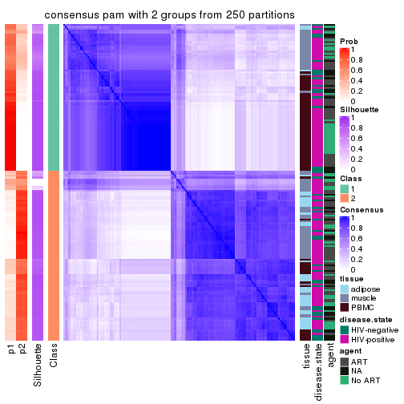</p>

</div>
<div id='tab-SD-pam-consensus-heatmap-2'>
<pre><code class="r">consensus_heatmap(res, k = 3)
</code></pre>

<p>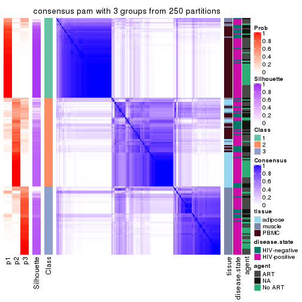</p>

</div>
<div id='tab-SD-pam-consensus-heatmap-3'>
<pre><code class="r">consensus_heatmap(res, k = 4)
</code></pre>

<p>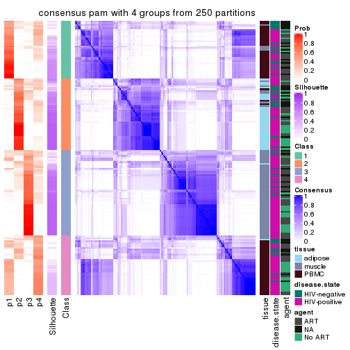</p>

</div>
<div id='tab-SD-pam-consensus-heatmap-4'>
<pre><code class="r">consensus_heatmap(res, k = 5)
</code></pre>

<p>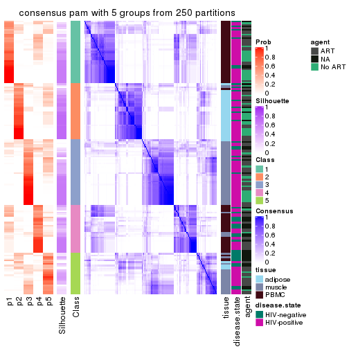</p>

</div>
<div id='tab-SD-pam-consensus-heatmap-5'>
<pre><code class="r">consensus_heatmap(res, k = 6)
</code></pre>

<p>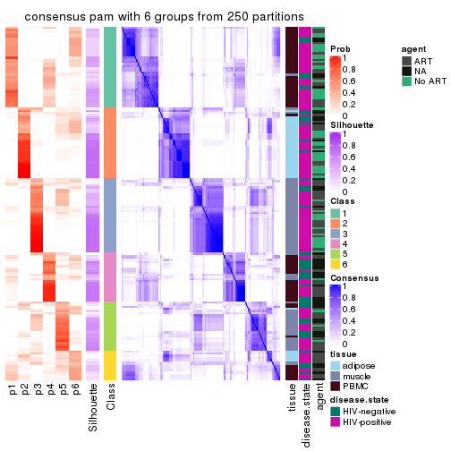</p>

</div>
</div>

Heatmaps for the membership of samples in all partitions to see how consistent they are:


<script>
$( function() {
	$( '#tabs-SD-pam-membership-heatmap' ).tabs();
} );
</script>
<div id='tabs-SD-pam-membership-heatmap'>
<ul>
<li><a href='#tab-SD-pam-membership-heatmap-1'>k = 2</a></li>
<li><a href='#tab-SD-pam-membership-heatmap-2'>k = 3</a></li>
<li><a href='#tab-SD-pam-membership-heatmap-3'>k = 4</a></li>
<li><a href='#tab-SD-pam-membership-heatmap-4'>k = 5</a></li>
<li><a href='#tab-SD-pam-membership-heatmap-5'>k = 6</a></li>
</ul>
<div id='tab-SD-pam-membership-heatmap-1'>
<pre><code class="r">membership_heatmap(res, k = 2)
</code></pre>

<p>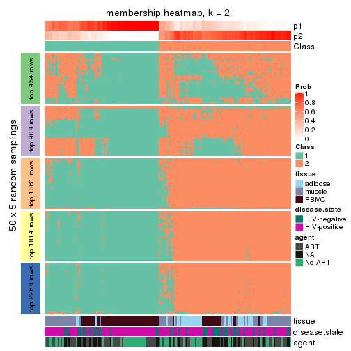</p>

</div>
<div id='tab-SD-pam-membership-heatmap-2'>
<pre><code class="r">membership_heatmap(res, k = 3)
</code></pre>

<p>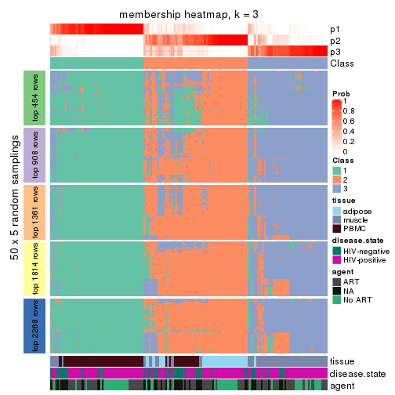</p>

</div>
<div id='tab-SD-pam-membership-heatmap-3'>
<pre><code class="r">membership_heatmap(res, k = 4)
</code></pre>

<p>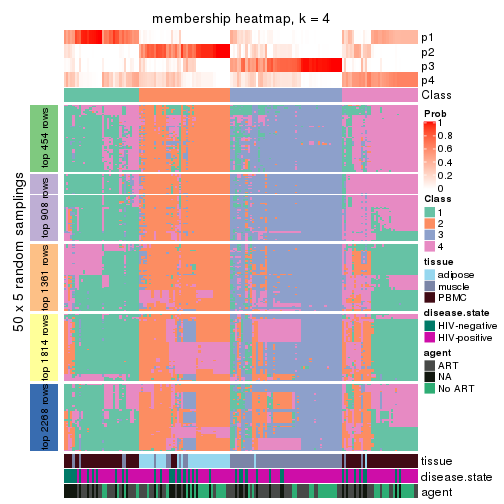</p>

</div>
<div id='tab-SD-pam-membership-heatmap-4'>
<pre><code class="r">membership_heatmap(res, k = 5)
</code></pre>

<p>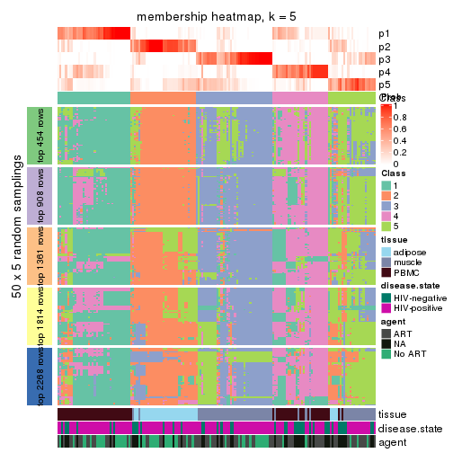</p>

</div>
<div id='tab-SD-pam-membership-heatmap-5'>
<pre><code class="r">membership_heatmap(res, k = 6)
</code></pre>

<p>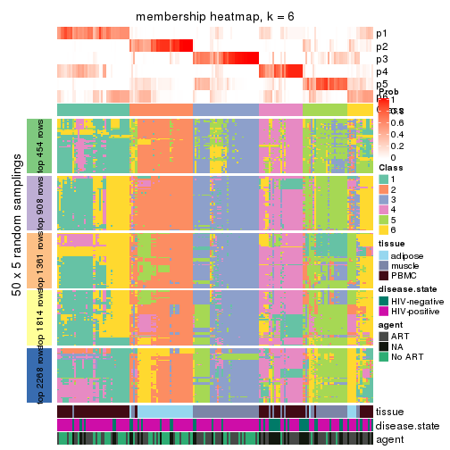</p>

</div>
</div>

As soon as we have had the classes for columns, we can look for signatures
which are significantly different between classes which can be candidate marks
for certain classes. Following are the heatmaps for signatures.


Signature heatmaps where rows are scaled:


<script>
$( function() {
	$( '#tabs-SD-pam-get-signatures' ).tabs();
} );
</script>
<div id='tabs-SD-pam-get-signatures'>
<ul>
<li><a href='#tab-SD-pam-get-signatures-1'>k = 2</a></li>
<li><a href='#tab-SD-pam-get-signatures-2'>k = 3</a></li>
<li><a href='#tab-SD-pam-get-signatures-3'>k = 4</a></li>
<li><a href='#tab-SD-pam-get-signatures-4'>k = 5</a></li>
<li><a href='#tab-SD-pam-get-signatures-5'>k = 6</a></li>
</ul>
<div id='tab-SD-pam-get-signatures-1'>
<pre><code class="r">get_signatures(res, k = 2)
</code></pre>

<p>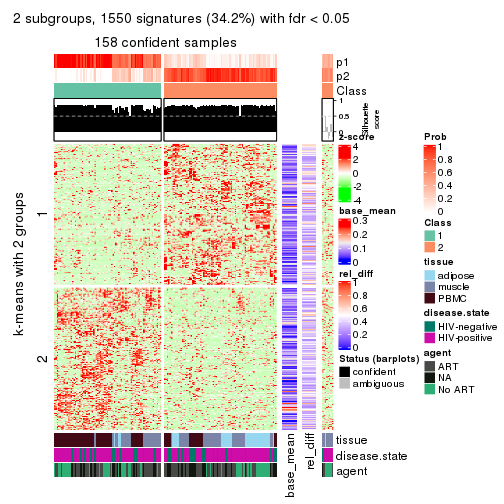</p>

</div>
<div id='tab-SD-pam-get-signatures-2'>
<pre><code class="r">get_signatures(res, k = 3)
</code></pre>

<p>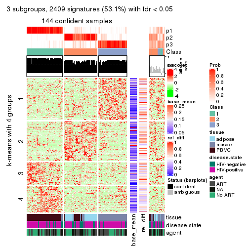</p>

</div>
<div id='tab-SD-pam-get-signatures-3'>
<pre><code class="r">get_signatures(res, k = 4)
</code></pre>

<p>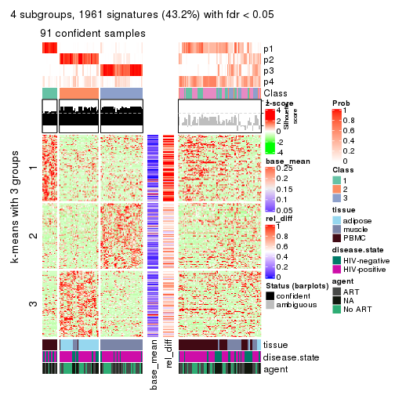</p>

</div>
<div id='tab-SD-pam-get-signatures-4'>
<pre><code class="r">get_signatures(res, k = 5)
</code></pre>

<p>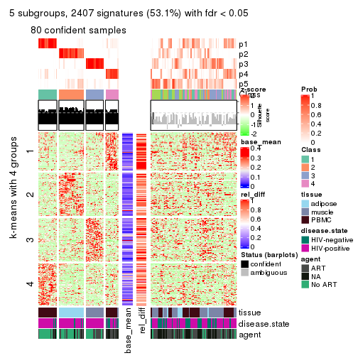</p>

</div>
<div id='tab-SD-pam-get-signatures-5'>
<pre><code class="r">get_signatures(res, k = 6)
</code></pre>

<p>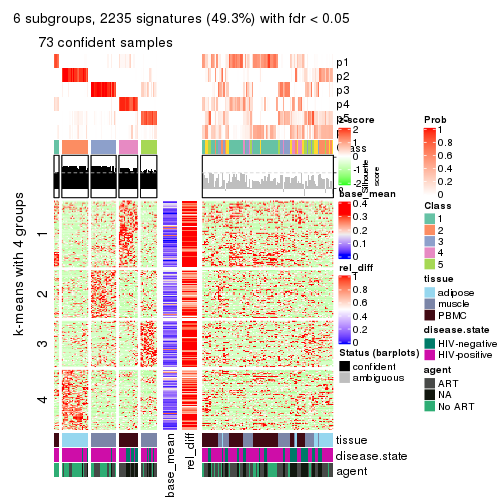</p>

</div>
</div>


Signature heatmaps where rows are not scaled:


<script>
$( function() {
	$( '#tabs-SD-pam-get-signatures-no-scale' ).tabs();
} );
</script>
<div id='tabs-SD-pam-get-signatures-no-scale'>
<ul>
<li><a href='#tab-SD-pam-get-signatures-no-scale-1'>k = 2</a></li>
<li><a href='#tab-SD-pam-get-signatures-no-scale-2'>k = 3</a></li>
<li><a href='#tab-SD-pam-get-signatures-no-scale-3'>k = 4</a></li>
<li><a href='#tab-SD-pam-get-signatures-no-scale-4'>k = 5</a></li>
<li><a href='#tab-SD-pam-get-signatures-no-scale-5'>k = 6</a></li>
</ul>
<div id='tab-SD-pam-get-signatures-no-scale-1'>
<pre><code class="r">get_signatures(res, k = 2, scale_rows = FALSE)
</code></pre>

<p>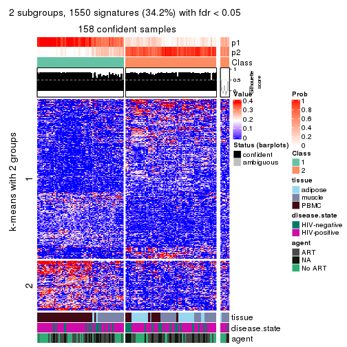</p>

</div>
<div id='tab-SD-pam-get-signatures-no-scale-2'>
<pre><code class="r">get_signatures(res, k = 3, scale_rows = FALSE)
</code></pre>

<p>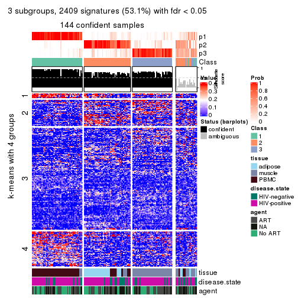</p>

</div>
<div id='tab-SD-pam-get-signatures-no-scale-3'>
<pre><code class="r">get_signatures(res, k = 4, scale_rows = FALSE)
</code></pre>

<p>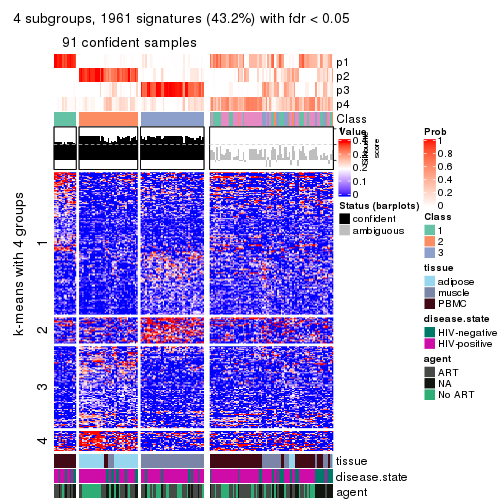</p>

</div>
<div id='tab-SD-pam-get-signatures-no-scale-4'>
<pre><code class="r">get_signatures(res, k = 5, scale_rows = FALSE)
</code></pre>

<p>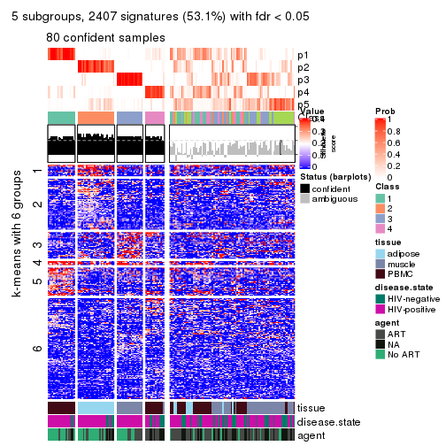</p>

</div>
<div id='tab-SD-pam-get-signatures-no-scale-5'>
<pre><code class="r">get_signatures(res, k = 6, scale_rows = FALSE)
</code></pre>

<p>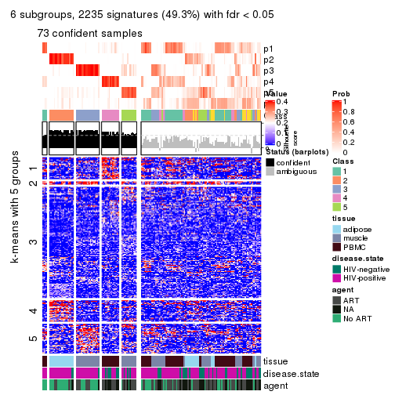</p>

</div>
</div>


Compare the overlap of signatures from different k:

```r
compare_signatures(res)
```

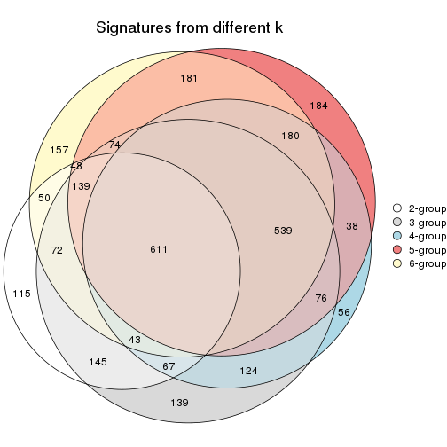

`get_signature()` returns a data frame invisibly. TO get the list of signatures, the function
call should be assigned to a variable explicitly. In following code, if `plot` argument is set
to `FALSE`, no heatmap is plotted while only the differential analysis is performed.

```r
# code only for demonstration
tb = get_signature(res, k = ..., plot = FALSE)
```

An example of the output of `tb` is:

```
#>   which_row         fdr    mean_1    mean_2 scaled_mean_1 scaled_mean_2 km
#> 1        38 0.042760348  8.373488  9.131774    -0.5533452     0.5164555  1
#> 2        40 0.018707592  7.106213  8.469186    -0.6173731     0.5762149  1
#> 3        55 0.019134737 10.221463 11.207825    -0.6159697     0.5749050  1
#> 4        59 0.006059896  5.921854  7.869574    -0.6899429     0.6439467  1
#> 5        60 0.018055526  8.928898 10.211722    -0.6204761     0.5791110  1
#> 6        98 0.009384629 15.714769 14.887706     0.6635654    -0.6193277  2
...
```

The columns in `tb` are:

1. `which_row`: row indices corresponding to the input matrix.
2. `fdr`: FDR for the differential test. 
3. `mean_x`: The mean value in group x.
4. `scaled_mean_x`: The mean value in group x after rows are scaled.
5. `km`: Row groups if k-means clustering is applied to rows.


UMAP plot which shows how samples are separated.


<script>
$( function() {
	$( '#tabs-SD-pam-dimension-reduction' ).tabs();
} );
</script>
<div id='tabs-SD-pam-dimension-reduction'>
<ul>
<li><a href='#tab-SD-pam-dimension-reduction-1'>k = 2</a></li>
<li><a href='#tab-SD-pam-dimension-reduction-2'>k = 3</a></li>
<li><a href='#tab-SD-pam-dimension-reduction-3'>k = 4</a></li>
<li><a href='#tab-SD-pam-dimension-reduction-4'>k = 5</a></li>
<li><a href='#tab-SD-pam-dimension-reduction-5'>k = 6</a></li>
</ul>
<div id='tab-SD-pam-dimension-reduction-1'>
<pre><code class="r">dimension_reduction(res, k = 2, method = &quot;UMAP&quot;)
</code></pre>

<p>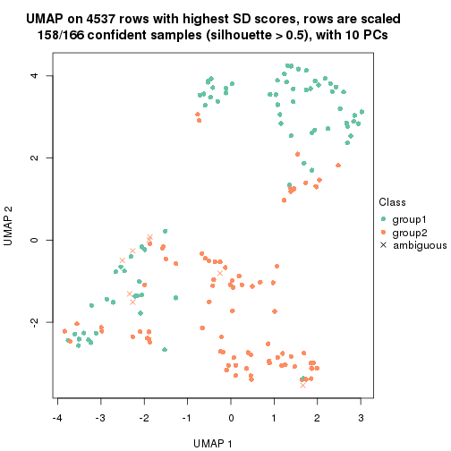</p>

</div>
<div id='tab-SD-pam-dimension-reduction-2'>
<pre><code class="r">dimension_reduction(res, k = 3, method = &quot;UMAP&quot;)
</code></pre>

<p>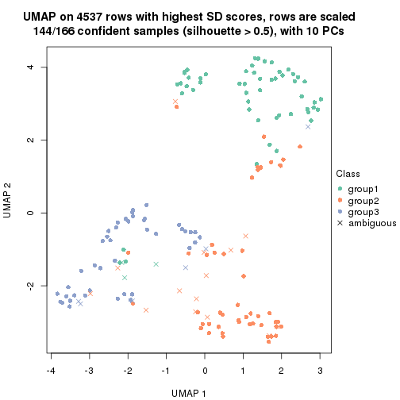</p>

</div>
<div id='tab-SD-pam-dimension-reduction-3'>
<pre><code class="r">dimension_reduction(res, k = 4, method = &quot;UMAP&quot;)
</code></pre>

<p>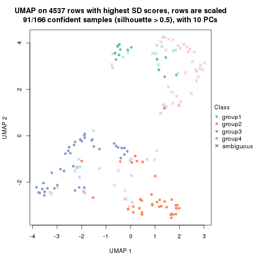</p>

</div>
<div id='tab-SD-pam-dimension-reduction-4'>
<pre><code class="r">dimension_reduction(res, k = 5, method = &quot;UMAP&quot;)
</code></pre>

<p>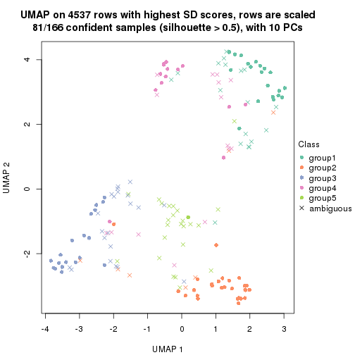</p>

</div>
<div id='tab-SD-pam-dimension-reduction-5'>
<pre><code class="r">dimension_reduction(res, k = 6, method = &quot;UMAP&quot;)
</code></pre>

<p>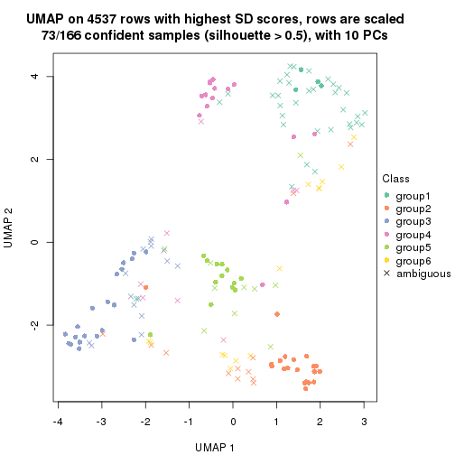</p>

</div>
</div>


Following heatmap shows how subgroups are split when increasing `k`:

```r
collect_classes(res)
```

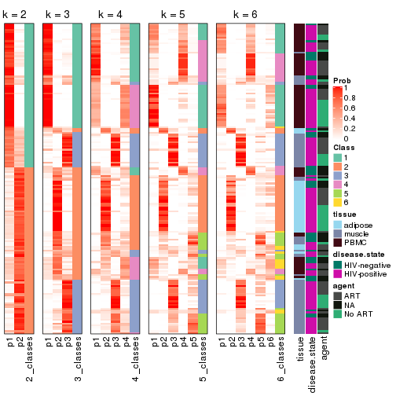


Test correlation between subgroups and known annotations. If the known
annotation is numeric, one-way ANOVA test is applied, and if the known
annotation is discrete, chi-squared contingency table test is applied.

```r
test_to_known_factors(res)
```

```
#>          n tissue(p) disease.state(p) agent(p) k
#> SD:pam 158  1.05e-09          0.27317 0.310616 2
#> SD:pam 144  4.40e-39          0.14088 0.329931 3
#> SD:pam  91  3.17e-31          0.14727 0.047637 4
#> SD:pam  81  1.03e-29          0.00256 0.000954 5
#> SD:pam  73  1.34e-27          0.01191 0.000133 6
```


If matrix rows can be associated to genes, consider to use `GO_Enrichment(res,
...)` to perform function enrichment for the signature genes.


 

---------------------------------------------------


### SD:mclust


The object with results only for a single top-value method and a single partition method 
can be extracted as:

```r
res = res_list["SD", "mclust"]
# you can also extract it by
# res = res_list["SD:mclust"]
```

A summary of `res` and all the functions that can be applied to it:

```r
res
```

```
#> A 'ConsensusPartition' object with k = 2, 3, 4, 5, 6.
#>   On a matrix with 4537 rows and 166 columns.
#>   Top rows (454, 908, 1361, 1814, 2268) are extracted by 'SD' method.
#>   Subgroups are detected by 'mclust' method.
#>   Performed in total 1250 partitions by row resampling.
#>   Best k for subgroups seems to be 3.
#> 
#> Following methods can be applied to this 'ConsensusPartition' object:
#>  [1] "cola_report"             "collect_classes"         "collect_plots"          
#>  [4] "collect_stats"           "colnames"                "compare_signatures"     
#>  [7] "consensus_heatmap"       "dimension_reduction"     "functional_enrichment"  
#> [10] "get_anno_col"            "get_anno"                "get_classes"            
#> [13] "get_consensus"           "get_matrix"              "get_membership"         
#> [16] "get_param"               "get_signatures"          "get_stats"              
#> [19] "is_best_k"               "is_stable_k"             "membership_heatmap"     
#> [22] "ncol"                    "nrow"                    "plot_ecdf"              
#> [25] "rownames"                "select_partition_number" "show"                   
#> [28] "suggest_best_k"          "test_to_known_factors"
```

`collect_plots()` function collects all the plots made from `res` for all `k` (number of partitions)
into one single page to provide an easy and fast comparison between different `k`.

```r
collect_plots(res)
```

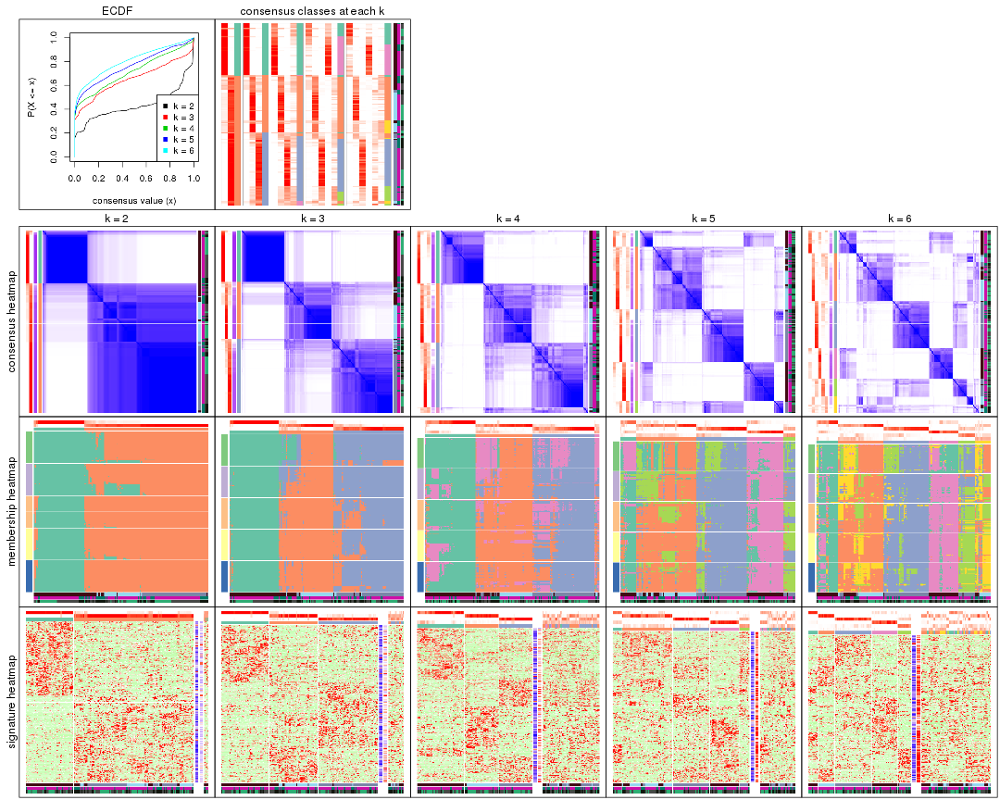

The plots are:

- The first row: a plot of the ECDF (Empirical cumulative distribution
  function) curves of the consensus matrix for each `k` and the heatmap of
  predicted classes for each `k`.
- The second row: heatmaps of the consensus matrix for each `k`.
- The third row: heatmaps of the membership matrix for each `k`.
- The fouth row: heatmaps of the signatures for each `k`.

All the plots in panels can be made by individual functions and they are
plotted later in this section.

`select_partition_number()` produces several plots showing different
statistics for choosing "optimized" `k`. There are following statistics:

- ECDF curves of the consensus matrix for each `k`;
- 1-PAC. [The PAC
  score](https://en.wikipedia.org/wiki/Consensus_clustering#Over-interpretation_potential_of_consensus_clustering)
  measures the proportion of the ambiguous subgrouping.
- Mean silhouette score.
- Concordance. The mean probability of fiting the consensus class ids in all
  partitions.
- Area increased. Denote $A_k$ as the area under the ECDF curve for current
  `k`, the area increased is defined as $A_k - A_{k-1}$.
- Rand index. The percent of pairs of samples that are both in a same cluster
  or both are not in a same cluster in the partition of k and k-1.
- Jaccard index. The ratio of pairs of samples are both in a same cluster in
  the partition of k and k-1 and the pairs of samples are both in a same
  cluster in the partition k or k-1.

The detailed explanations of these statistics can be found in [the cola
vignette](http://bioconductor.org/packages/devel/bioc/vignettes/cola/inst/doc/cola.html#toc_13).

Generally speaking, lower PAC score, higher mean silhouette score or higher
concordance corresponds to better partition. Rand index and Jaccard index
measure how similar the current partition is compared to partition with `k-1`.
If they are too similar, we won't accept `k` is better than `k-1`.

```r
select_partition_number(res)
```

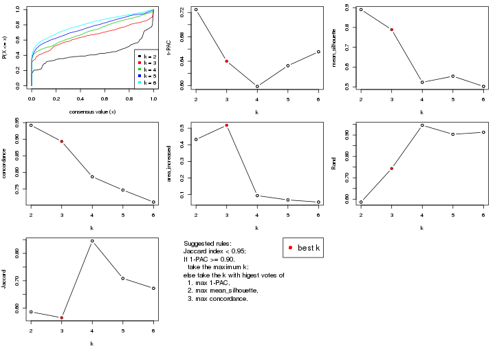

The numeric values for all these statistics can be obtained by `get_stats()`.

```r
get_stats(res)
```

```
#>   k 1-PAC mean_silhouette concordance area_increased  Rand Jaccard
#> 2 2 0.725           0.890       0.942         0.4319 0.586   0.586
#> 3 3 0.640           0.789       0.893         0.5173 0.743   0.565
#> 4 4 0.599           0.523       0.787         0.0940 0.946   0.845
#> 5 5 0.633           0.554       0.747         0.0679 0.903   0.709
#> 6 6 0.655           0.502       0.711         0.0550 0.913   0.673
```

`suggest_best_k()` suggests the best $k$ based on these statistics. The rules are as follows:

- All $k$ with Jaccard index larger than 0.95 are removed because the increase of
  the partition number does not provides enough extra information. If all $k$ are removed,
  the best $k$ is assigned by `NA`.
- For $k$ with 1-PAC larger than 0.9, the maximal $k$ is taken as the "best k". Other $k$ is called "optional k".
- If it does not fit the second rule. The $k$ with the highest vote of highest
  1-PAC, mean silhouette and concordance is taken as the "best k".

```r
suggest_best_k(res)
```

```
#> [1] 3
```


Following shows the table of the partitions (You need to click the **show/hide
code output** link to see it). The membership matrix (columns with name `p*`)
is inferred by
[`clue::cl_consensus()`](https://www.rdocumentation.org/link/cl_consensus?package=clue)
function with the `SE` method. Basically the value in the membership matrix
represents the probability to belong to a certain group. The finall class
label for an item is determined with the group with highest probability it
belongs to.

In `get_classes()` function, the entropy is calculated from the membership
matrix and the silhouette score is calculated from the consensus matrix.


<script>
$( function() {
	$( '#tabs-SD-mclust-get-classes' ).tabs();
} );
</script>
<div id='tabs-SD-mclust-get-classes'>
<ul>
<li><a href='#tab-SD-mclust-get-classes-1'>k = 2</a></li>
<li><a href='#tab-SD-mclust-get-classes-2'>k = 3</a></li>
<li><a href='#tab-SD-mclust-get-classes-3'>k = 4</a></li>
<li><a href='#tab-SD-mclust-get-classes-4'>k = 5</a></li>
<li><a href='#tab-SD-mclust-get-classes-5'>k = 6</a></li>
</ul>

<div id='tab-SD-mclust-get-classes-1'>
<p><a id='tab-SD-mclust-get-classes-1-a' style='color:#0366d6' href='#'>show/hide code output</a></p>
<pre><code class="r">cbind(get_classes(res, k = 2), get_membership(res, k = 2))
</code></pre>

<pre><code>#&gt;           class entropy silhouette    p1    p2
#&gt; GSM751298     1  0.0000     0.9678 1.000 0.000
#&gt; GSM751304     2  0.7056     0.7820 0.192 0.808
#&gt; GSM751305     2  0.7056     0.7820 0.192 0.808
#&gt; GSM751307     2  0.9248     0.6038 0.340 0.660
#&gt; GSM751310     1  0.0000     0.9678 1.000 0.000
#&gt; GSM751314     1  0.0000     0.9678 1.000 0.000
#&gt; GSM751316     1  0.0938     0.9576 0.988 0.012
#&gt; GSM751318     1  0.0000     0.9678 1.000 0.000
#&gt; GSM751342     1  0.0938     0.9562 0.988 0.012
#&gt; GSM751346     1  0.0000     0.9678 1.000 0.000
#&gt; GSM751347     2  0.9963     0.2874 0.464 0.536
#&gt; GSM751348     2  0.8608     0.6977 0.284 0.716
#&gt; GSM751349     2  0.3733     0.9117 0.072 0.928
#&gt; GSM751352     2  0.9608     0.5068 0.384 0.616
#&gt; GSM751353     2  0.6887     0.7997 0.184 0.816
#&gt; GSM751354     2  0.7139     0.7798 0.196 0.804
#&gt; GSM751355     2  0.6048     0.8303 0.148 0.852
#&gt; GSM751358     2  0.4690     0.8870 0.100 0.900
#&gt; GSM751359     2  0.0000     0.9267 0.000 1.000
#&gt; GSM751294     2  0.7674     0.7661 0.224 0.776
#&gt; GSM751296     1  0.0000     0.9678 1.000 0.000
#&gt; GSM751297     1  0.9922     0.0212 0.552 0.448
#&gt; GSM751299     2  0.9358     0.5715 0.352 0.648
#&gt; GSM751300     1  0.0000     0.9678 1.000 0.000
#&gt; GSM751301     1  0.7528     0.6759 0.784 0.216
#&gt; GSM751302     1  0.0000     0.9678 1.000 0.000
#&gt; GSM751303     1  0.0000     0.9678 1.000 0.000
#&gt; GSM751306     1  0.0000     0.9678 1.000 0.000
#&gt; GSM751308     1  0.9896     0.0514 0.560 0.440
#&gt; GSM751309     1  0.0000     0.9678 1.000 0.000
#&gt; GSM751311     1  0.0000     0.9678 1.000 0.000
#&gt; GSM751312     1  0.0000     0.9678 1.000 0.000
#&gt; GSM751313     1  0.0000     0.9678 1.000 0.000
#&gt; GSM751315     1  0.0000     0.9678 1.000 0.000
#&gt; GSM751317     1  0.0000     0.9678 1.000 0.000
#&gt; GSM751320     1  0.0000     0.9678 1.000 0.000
#&gt; GSM751321     1  0.0000     0.9678 1.000 0.000
#&gt; GSM751322     1  0.0000     0.9678 1.000 0.000
#&gt; GSM751324     1  0.0000     0.9678 1.000 0.000
#&gt; GSM751325     1  0.0000     0.9678 1.000 0.000
#&gt; GSM751332     1  0.0000     0.9678 1.000 0.000
#&gt; GSM751334     1  0.0000     0.9678 1.000 0.000
#&gt; GSM751339     1  0.0000     0.9678 1.000 0.000
#&gt; GSM751341     1  0.0000     0.9678 1.000 0.000
#&gt; GSM751343     1  0.0000     0.9678 1.000 0.000
#&gt; GSM751344     2  0.8386     0.7190 0.268 0.732
#&gt; GSM751345     2  0.8327     0.7239 0.264 0.736
#&gt; GSM751356     2  0.8909     0.6551 0.308 0.692
#&gt; GSM751357     2  0.8813     0.6687 0.300 0.700
#&gt; GSM751293     1  0.6887     0.7317 0.816 0.184
#&gt; GSM751295     1  0.0000     0.9678 1.000 0.000
#&gt; GSM751319     1  0.0000     0.9678 1.000 0.000
#&gt; GSM751323     1  0.0000     0.9678 1.000 0.000
#&gt; GSM751326     1  0.0000     0.9678 1.000 0.000
#&gt; GSM751327     1  0.0000     0.9678 1.000 0.000
#&gt; GSM751328     1  0.0000     0.9678 1.000 0.000
#&gt; GSM751329     1  0.0000     0.9678 1.000 0.000
#&gt; GSM751330     1  0.0000     0.9678 1.000 0.000
#&gt; GSM751331     1  0.0000     0.9678 1.000 0.000
#&gt; GSM751333     1  0.0000     0.9678 1.000 0.000
#&gt; GSM751335     1  0.0000     0.9678 1.000 0.000
#&gt; GSM751336     1  0.0000     0.9678 1.000 0.000
#&gt; GSM751337     1  0.0000     0.9678 1.000 0.000
#&gt; GSM751338     1  0.0000     0.9678 1.000 0.000
#&gt; GSM751340     2  0.9970     0.2688 0.468 0.532
#&gt; GSM751350     1  0.0000     0.9678 1.000 0.000
#&gt; GSM751351     1  0.0000     0.9678 1.000 0.000
#&gt; GSM751362     2  0.0376     0.9261 0.004 0.996
#&gt; GSM751363     2  0.0376     0.9261 0.004 0.996
#&gt; GSM751367     2  0.2603     0.9112 0.044 0.956
#&gt; GSM751368     2  0.0000     0.9267 0.000 1.000
#&gt; GSM751371     2  0.0938     0.9257 0.012 0.988
#&gt; GSM751375     2  0.0000     0.9267 0.000 1.000
#&gt; GSM751376     2  0.0376     0.9261 0.004 0.996
#&gt; GSM751378     2  0.0000     0.9267 0.000 1.000
#&gt; GSM751379     2  0.0376     0.9261 0.004 0.996
#&gt; GSM751382     2  0.0938     0.9252 0.012 0.988
#&gt; GSM751386     2  0.0000     0.9267 0.000 1.000
#&gt; GSM751388     2  0.0000     0.9267 0.000 1.000
#&gt; GSM751391     2  0.0000     0.9267 0.000 1.000
#&gt; GSM751410     2  0.0938     0.9253 0.012 0.988
#&gt; GSM751414     2  0.0000     0.9267 0.000 1.000
#&gt; GSM751361     2  0.0000     0.9267 0.000 1.000
#&gt; GSM751365     2  0.0000     0.9267 0.000 1.000
#&gt; GSM751366     2  0.0000     0.9267 0.000 1.000
#&gt; GSM751369     2  0.0000     0.9267 0.000 1.000
#&gt; GSM751370     2  0.0376     0.9261 0.004 0.996
#&gt; GSM751372     2  0.0000     0.9267 0.000 1.000
#&gt; GSM751373     2  0.0000     0.9267 0.000 1.000
#&gt; GSM751374     2  0.0376     0.9261 0.004 0.996
#&gt; GSM751377     2  0.0000     0.9267 0.000 1.000
#&gt; GSM751380     2  0.0000     0.9267 0.000 1.000
#&gt; GSM751381     2  0.0000     0.9267 0.000 1.000
#&gt; GSM751383     2  0.0000     0.9267 0.000 1.000
#&gt; GSM751384     2  0.0000     0.9267 0.000 1.000
#&gt; GSM751385     2  0.0000     0.9267 0.000 1.000
#&gt; GSM751387     2  0.0000     0.9267 0.000 1.000
#&gt; GSM751389     2  0.0000     0.9267 0.000 1.000
#&gt; GSM751393     2  0.0000     0.9267 0.000 1.000
#&gt; GSM751394     2  0.0000     0.9267 0.000 1.000
#&gt; GSM751395     2  0.0000     0.9267 0.000 1.000
#&gt; GSM751397     2  0.0000     0.9267 0.000 1.000
#&gt; GSM751398     2  0.0000     0.9267 0.000 1.000
#&gt; GSM751404     2  0.0000     0.9267 0.000 1.000
#&gt; GSM751406     2  0.0376     0.9261 0.004 0.996
#&gt; GSM751411     2  0.0000     0.9267 0.000 1.000
#&gt; GSM751413     2  0.0000     0.9267 0.000 1.000
#&gt; GSM751415     2  0.0000     0.9267 0.000 1.000
#&gt; GSM751416     2  0.0000     0.9267 0.000 1.000
#&gt; GSM751417     2  0.0000     0.9267 0.000 1.000
#&gt; GSM751421     2  0.0000     0.9267 0.000 1.000
#&gt; GSM751422     2  0.0000     0.9267 0.000 1.000
#&gt; GSM751360     2  0.0000     0.9267 0.000 1.000
#&gt; GSM751364     2  0.0000     0.9267 0.000 1.000
#&gt; GSM751390     2  0.0000     0.9267 0.000 1.000
#&gt; GSM751392     2  0.0000     0.9267 0.000 1.000
#&gt; GSM751396     2  0.0672     0.9259 0.008 0.992
#&gt; GSM751399     2  0.0000     0.9267 0.000 1.000
#&gt; GSM751400     2  0.0000     0.9267 0.000 1.000
#&gt; GSM751401     2  0.0000     0.9267 0.000 1.000
#&gt; GSM751402     2  0.0000     0.9267 0.000 1.000
#&gt; GSM751403     2  0.0000     0.9267 0.000 1.000
#&gt; GSM751405     2  0.0376     0.9261 0.004 0.996
#&gt; GSM751407     2  0.0000     0.9267 0.000 1.000
#&gt; GSM751408     2  0.0000     0.9267 0.000 1.000
#&gt; GSM751409     2  0.0000     0.9267 0.000 1.000
#&gt; GSM751412     2  0.0000     0.9267 0.000 1.000
#&gt; GSM751418     2  0.0000     0.9267 0.000 1.000
#&gt; GSM751419     2  0.0000     0.9267 0.000 1.000
#&gt; GSM751420     2  0.0000     0.9267 0.000 1.000
#&gt; GSM751425     2  0.4161     0.9045 0.084 0.916
#&gt; GSM751429     2  0.6531     0.8082 0.168 0.832
#&gt; GSM751430     2  0.4562     0.8982 0.096 0.904
#&gt; GSM751433     2  0.6343     0.8480 0.160 0.840
#&gt; GSM751437     2  0.0938     0.9251 0.012 0.988
#&gt; GSM751448     2  0.4690     0.8761 0.100 0.900
#&gt; GSM751451     2  0.5294     0.8830 0.120 0.880
#&gt; GSM751423     2  0.3733     0.9095 0.072 0.928
#&gt; GSM751424     2  0.5294     0.8830 0.120 0.880
#&gt; GSM751428     2  0.4431     0.9008 0.092 0.908
#&gt; GSM751431     2  0.5294     0.8830 0.120 0.880
#&gt; GSM751432     2  0.4815     0.8939 0.104 0.896
#&gt; GSM751434     2  0.5519     0.8769 0.128 0.872
#&gt; GSM751435     2  0.4690     0.8961 0.100 0.900
#&gt; GSM751436     2  0.5408     0.8800 0.124 0.876
#&gt; GSM751440     2  0.5294     0.8830 0.120 0.880
#&gt; GSM751444     2  0.4431     0.9005 0.092 0.908
#&gt; GSM751446     2  0.4161     0.9045 0.084 0.916
#&gt; GSM751449     2  0.4161     0.9045 0.084 0.916
#&gt; GSM751450     2  0.5059     0.8885 0.112 0.888
#&gt; GSM751452     2  0.5294     0.8830 0.120 0.880
#&gt; GSM751426     2  0.5294     0.8830 0.120 0.880
#&gt; GSM751427     2  0.4161     0.9045 0.084 0.916
#&gt; GSM751438     2  0.4161     0.9045 0.084 0.916
#&gt; GSM751439     2  0.4161     0.9045 0.084 0.916
#&gt; GSM751441     2  0.3274     0.9136 0.060 0.940
#&gt; GSM751442     2  0.4298     0.9026 0.088 0.912
#&gt; GSM751443     2  0.3114     0.9148 0.056 0.944
#&gt; GSM751445     2  0.4161     0.9045 0.084 0.916
#&gt; GSM751447     2  0.4161     0.9045 0.084 0.916
#&gt; GSM751453     2  0.4298     0.9026 0.088 0.912
#&gt; GSM751454     2  0.4298     0.9026 0.088 0.912
#&gt; GSM751455     2  0.4161     0.9045 0.084 0.916
#&gt; GSM751456     2  0.4161     0.9045 0.084 0.916
#&gt; GSM751457     2  0.4022     0.9063 0.080 0.920
#&gt; GSM751458     2  0.3879     0.9079 0.076 0.924
</code></pre>

<script>
$('#tab-SD-mclust-get-classes-1-a').parent().next().next().hide();
$('#tab-SD-mclust-get-classes-1-a').click(function(){
  $('#tab-SD-mclust-get-classes-1-a').parent().next().next().toggle();
  return(false);
});
</script>
</div>

<div id='tab-SD-mclust-get-classes-2'>
<p><a id='tab-SD-mclust-get-classes-2-a' style='color:#0366d6' href='#'>show/hide code output</a></p>
<pre><code class="r">cbind(get_classes(res, k = 3), get_membership(res, k = 3))
</code></pre>

<pre><code>#&gt;           class entropy silhouette    p1    p2    p3
#&gt; GSM751298     1  0.0000     0.9806 1.000 0.000 0.000
#&gt; GSM751304     2  0.9234     0.3136 0.160 0.476 0.364
#&gt; GSM751305     2  0.9329     0.1693 0.164 0.436 0.400
#&gt; GSM751307     2  0.7725     0.6805 0.160 0.680 0.160
#&gt; GSM751310     1  0.0000     0.9806 1.000 0.000 0.000
#&gt; GSM751314     1  0.0000     0.9806 1.000 0.000 0.000
#&gt; GSM751316     1  0.2066     0.9094 0.940 0.000 0.060
#&gt; GSM751318     1  0.0000     0.9806 1.000 0.000 0.000
#&gt; GSM751342     1  0.1031     0.9593 0.976 0.024 0.000
#&gt; GSM751346     1  0.0000     0.9806 1.000 0.000 0.000
#&gt; GSM751347     2  0.9767     0.3920 0.320 0.432 0.248
#&gt; GSM751348     2  0.6372     0.7440 0.152 0.764 0.084
#&gt; GSM751349     2  0.4702     0.6968 0.000 0.788 0.212
#&gt; GSM751352     2  0.7482     0.6871 0.204 0.688 0.108
#&gt; GSM751353     2  0.7615     0.6855 0.148 0.688 0.164
#&gt; GSM751354     2  0.8494     0.5867 0.156 0.608 0.236
#&gt; GSM751355     2  0.8158     0.3699 0.080 0.556 0.364
#&gt; GSM751358     3  0.7091     0.4789 0.040 0.320 0.640
#&gt; GSM751359     3  0.4974     0.7006 0.000 0.236 0.764
#&gt; GSM751294     2  0.8229     0.6075 0.124 0.620 0.256
#&gt; GSM751296     1  0.0000     0.9806 1.000 0.000 0.000
#&gt; GSM751297     2  0.9895     0.3495 0.332 0.396 0.272
#&gt; GSM751299     2  0.7361     0.7008 0.172 0.704 0.124
#&gt; GSM751300     1  0.0000     0.9806 1.000 0.000 0.000
#&gt; GSM751301     1  0.4861     0.7354 0.808 0.180 0.012
#&gt; GSM751302     1  0.0000     0.9806 1.000 0.000 0.000
#&gt; GSM751303     1  0.0000     0.9806 1.000 0.000 0.000
#&gt; GSM751306     1  0.0000     0.9806 1.000 0.000 0.000
#&gt; GSM751308     1  0.7920     0.1810 0.572 0.360 0.068
#&gt; GSM751309     1  0.0000     0.9806 1.000 0.000 0.000
#&gt; GSM751311     1  0.0000     0.9806 1.000 0.000 0.000
#&gt; GSM751312     1  0.0000     0.9806 1.000 0.000 0.000
#&gt; GSM751313     1  0.0000     0.9806 1.000 0.000 0.000
#&gt; GSM751315     1  0.0000     0.9806 1.000 0.000 0.000
#&gt; GSM751317     1  0.0000     0.9806 1.000 0.000 0.000
#&gt; GSM751320     1  0.0000     0.9806 1.000 0.000 0.000
#&gt; GSM751321     1  0.0000     0.9806 1.000 0.000 0.000
#&gt; GSM751322     1  0.0000     0.9806 1.000 0.000 0.000
#&gt; GSM751324     1  0.0000     0.9806 1.000 0.000 0.000
#&gt; GSM751325     1  0.0000     0.9806 1.000 0.000 0.000
#&gt; GSM751332     1  0.0000     0.9806 1.000 0.000 0.000
#&gt; GSM751334     1  0.0000     0.9806 1.000 0.000 0.000
#&gt; GSM751339     1  0.0237     0.9765 0.996 0.000 0.004
#&gt; GSM751341     1  0.0000     0.9806 1.000 0.000 0.000
#&gt; GSM751343     1  0.0000     0.9806 1.000 0.000 0.000
#&gt; GSM751344     2  0.7126     0.7139 0.164 0.720 0.116
#&gt; GSM751345     2  0.7180     0.7107 0.168 0.716 0.116
#&gt; GSM751356     2  0.8125     0.6590 0.172 0.648 0.180
#&gt; GSM751357     2  0.8029     0.6645 0.172 0.656 0.172
#&gt; GSM751293     1  0.2796     0.8785 0.908 0.092 0.000
#&gt; GSM751295     1  0.0000     0.9806 1.000 0.000 0.000
#&gt; GSM751319     1  0.0000     0.9806 1.000 0.000 0.000
#&gt; GSM751323     1  0.0000     0.9806 1.000 0.000 0.000
#&gt; GSM751326     1  0.0000     0.9806 1.000 0.000 0.000
#&gt; GSM751327     1  0.0000     0.9806 1.000 0.000 0.000
#&gt; GSM751328     1  0.0000     0.9806 1.000 0.000 0.000
#&gt; GSM751329     1  0.0000     0.9806 1.000 0.000 0.000
#&gt; GSM751330     1  0.0000     0.9806 1.000 0.000 0.000
#&gt; GSM751331     1  0.0000     0.9806 1.000 0.000 0.000
#&gt; GSM751333     1  0.0000     0.9806 1.000 0.000 0.000
#&gt; GSM751335     1  0.0000     0.9806 1.000 0.000 0.000
#&gt; GSM751336     1  0.0000     0.9806 1.000 0.000 0.000
#&gt; GSM751337     1  0.0000     0.9806 1.000 0.000 0.000
#&gt; GSM751338     1  0.0000     0.9806 1.000 0.000 0.000
#&gt; GSM751340     3  0.9756     0.0275 0.316 0.248 0.436
#&gt; GSM751350     1  0.0000     0.9806 1.000 0.000 0.000
#&gt; GSM751351     1  0.0000     0.9806 1.000 0.000 0.000
#&gt; GSM751362     3  0.0000     0.8353 0.000 0.000 1.000
#&gt; GSM751363     3  0.0592     0.8376 0.000 0.012 0.988
#&gt; GSM751367     3  0.6548     0.2942 0.012 0.372 0.616
#&gt; GSM751368     3  0.4235     0.7813 0.000 0.176 0.824
#&gt; GSM751371     3  0.3267     0.7773 0.000 0.116 0.884
#&gt; GSM751375     2  0.5497     0.5786 0.000 0.708 0.292
#&gt; GSM751376     3  0.6267     0.1014 0.000 0.452 0.548
#&gt; GSM751378     3  0.4235     0.7650 0.000 0.176 0.824
#&gt; GSM751379     3  0.6095     0.2842 0.000 0.392 0.608
#&gt; GSM751382     2  0.5216     0.6334 0.000 0.740 0.260
#&gt; GSM751386     3  0.4654     0.7324 0.000 0.208 0.792
#&gt; GSM751388     3  0.4887     0.7336 0.000 0.228 0.772
#&gt; GSM751391     3  0.3686     0.7666 0.000 0.140 0.860
#&gt; GSM751410     3  0.2200     0.8181 0.004 0.056 0.940
#&gt; GSM751414     3  0.0000     0.8353 0.000 0.000 1.000
#&gt; GSM751361     3  0.2165     0.8357 0.000 0.064 0.936
#&gt; GSM751365     3  0.1411     0.8398 0.000 0.036 0.964
#&gt; GSM751366     3  0.1411     0.8398 0.000 0.036 0.964
#&gt; GSM751369     3  0.2711     0.7989 0.000 0.088 0.912
#&gt; GSM751370     3  0.0000     0.8353 0.000 0.000 1.000
#&gt; GSM751372     3  0.1289     0.8398 0.000 0.032 0.968
#&gt; GSM751373     3  0.1411     0.8398 0.000 0.036 0.964
#&gt; GSM751374     3  0.6244     0.1353 0.000 0.440 0.560
#&gt; GSM751377     3  0.3116     0.8130 0.000 0.108 0.892
#&gt; GSM751380     3  0.1411     0.8398 0.000 0.036 0.964
#&gt; GSM751381     3  0.4605     0.7365 0.000 0.204 0.796
#&gt; GSM751383     3  0.4887     0.7336 0.000 0.228 0.772
#&gt; GSM751384     3  0.1031     0.8378 0.000 0.024 0.976
#&gt; GSM751385     3  0.3941     0.7778 0.000 0.156 0.844
#&gt; GSM751387     3  0.5058     0.7163 0.000 0.244 0.756
#&gt; GSM751389     3  0.1163     0.8398 0.000 0.028 0.972
#&gt; GSM751393     3  0.1753     0.8335 0.000 0.048 0.952
#&gt; GSM751394     3  0.4504     0.7413 0.000 0.196 0.804
#&gt; GSM751395     3  0.4399     0.7563 0.000 0.188 0.812
#&gt; GSM751397     3  0.4002     0.7738 0.000 0.160 0.840
#&gt; GSM751398     3  0.4346     0.7530 0.000 0.184 0.816
#&gt; GSM751404     3  0.1411     0.8398 0.000 0.036 0.964
#&gt; GSM751406     3  0.0000     0.8353 0.000 0.000 1.000
#&gt; GSM751411     3  0.0000     0.8353 0.000 0.000 1.000
#&gt; GSM751413     3  0.4002     0.7803 0.000 0.160 0.840
#&gt; GSM751415     3  0.1411     0.8398 0.000 0.036 0.964
#&gt; GSM751416     3  0.1163     0.8393 0.000 0.028 0.972
#&gt; GSM751417     3  0.1163     0.8393 0.000 0.028 0.972
#&gt; GSM751421     3  0.0000     0.8353 0.000 0.000 1.000
#&gt; GSM751422     3  0.0000     0.8353 0.000 0.000 1.000
#&gt; GSM751360     3  0.0424     0.8377 0.000 0.008 0.992
#&gt; GSM751364     3  0.1860     0.8379 0.000 0.052 0.948
#&gt; GSM751390     3  0.3116     0.8210 0.000 0.108 0.892
#&gt; GSM751392     3  0.5397     0.6571 0.000 0.280 0.720
#&gt; GSM751396     3  0.6026     0.5100 0.000 0.376 0.624
#&gt; GSM751399     3  0.0424     0.8373 0.000 0.008 0.992
#&gt; GSM751400     3  0.1411     0.8398 0.000 0.036 0.964
#&gt; GSM751401     3  0.1411     0.8398 0.000 0.036 0.964
#&gt; GSM751402     3  0.1411     0.8398 0.000 0.036 0.964
#&gt; GSM751403     3  0.1411     0.8398 0.000 0.036 0.964
#&gt; GSM751405     3  0.0000     0.8353 0.000 0.000 1.000
#&gt; GSM751407     3  0.1411     0.8398 0.000 0.036 0.964
#&gt; GSM751408     3  0.1411     0.8398 0.000 0.036 0.964
#&gt; GSM751409     3  0.0237     0.8363 0.000 0.004 0.996
#&gt; GSM751412     3  0.1411     0.8398 0.000 0.036 0.964
#&gt; GSM751418     3  0.1411     0.8398 0.000 0.036 0.964
#&gt; GSM751419     3  0.1411     0.8398 0.000 0.036 0.964
#&gt; GSM751420     3  0.6026     0.3583 0.000 0.376 0.624
#&gt; GSM751425     2  0.0592     0.8358 0.000 0.988 0.012
#&gt; GSM751429     3  0.8577    -0.1641 0.096 0.436 0.468
#&gt; GSM751430     2  0.4887     0.6466 0.000 0.772 0.228
#&gt; GSM751433     2  0.0000     0.8374 0.000 1.000 0.000
#&gt; GSM751437     3  0.5254     0.5801 0.000 0.264 0.736
#&gt; GSM751448     3  0.7492     0.2956 0.052 0.340 0.608
#&gt; GSM751451     2  0.2878     0.7670 0.000 0.904 0.096
#&gt; GSM751423     2  0.2066     0.8092 0.000 0.940 0.060
#&gt; GSM751424     2  0.0000     0.8374 0.000 1.000 0.000
#&gt; GSM751428     2  0.0237     0.8372 0.000 0.996 0.004
#&gt; GSM751431     2  0.0000     0.8374 0.000 1.000 0.000
#&gt; GSM751432     2  0.0424     0.8361 0.000 0.992 0.008
#&gt; GSM751434     2  0.0000     0.8374 0.000 1.000 0.000
#&gt; GSM751435     2  0.0000     0.8374 0.000 1.000 0.000
#&gt; GSM751436     2  0.0000     0.8374 0.000 1.000 0.000
#&gt; GSM751440     2  0.0237     0.8364 0.000 0.996 0.004
#&gt; GSM751444     2  0.0000     0.8374 0.000 1.000 0.000
#&gt; GSM751446     2  0.0000     0.8374 0.000 1.000 0.000
#&gt; GSM751449     2  0.0424     0.8364 0.000 0.992 0.008
#&gt; GSM751450     2  0.0000     0.8374 0.000 1.000 0.000
#&gt; GSM751452     2  0.0000     0.8374 0.000 1.000 0.000
#&gt; GSM751426     2  0.0000     0.8374 0.000 1.000 0.000
#&gt; GSM751427     2  0.0000     0.8374 0.000 1.000 0.000
#&gt; GSM751438     2  0.0000     0.8374 0.000 1.000 0.000
#&gt; GSM751439     2  0.2261     0.7968 0.000 0.932 0.068
#&gt; GSM751441     2  0.1411     0.8251 0.000 0.964 0.036
#&gt; GSM751442     2  0.0237     0.8363 0.000 0.996 0.004
#&gt; GSM751443     2  0.6193     0.5863 0.016 0.692 0.292
#&gt; GSM751445     2  0.0424     0.8364 0.000 0.992 0.008
#&gt; GSM751447     2  0.0237     0.8366 0.000 0.996 0.004
#&gt; GSM751453     2  0.0000     0.8374 0.000 1.000 0.000
#&gt; GSM751454     2  0.0000     0.8374 0.000 1.000 0.000
#&gt; GSM751455     2  0.0000     0.8374 0.000 1.000 0.000
#&gt; GSM751456     2  0.0000     0.8374 0.000 1.000 0.000
#&gt; GSM751457     2  0.0592     0.8358 0.000 0.988 0.012
#&gt; GSM751458     2  0.0592     0.8358 0.000 0.988 0.012
</code></pre>

<script>
$('#tab-SD-mclust-get-classes-2-a').parent().next().next().hide();
$('#tab-SD-mclust-get-classes-2-a').click(function(){
  $('#tab-SD-mclust-get-classes-2-a').parent().next().next().toggle();
  return(false);
});
</script>
</div>

<div id='tab-SD-mclust-get-classes-3'>
<p><a id='tab-SD-mclust-get-classes-3-a' style='color:#0366d6' href='#'>show/hide code output</a></p>
<pre><code class="r">cbind(get_classes(res, k = 4), get_membership(res, k = 4))
</code></pre>

<pre><code>#&gt;           class entropy silhouette    p1    p2    p3    p4
#&gt; GSM751298     1  0.2868     0.8486 0.864 0.000 0.000 0.136
#&gt; GSM751304     2  0.7495    -0.3134 0.000 0.428 0.180 0.392
#&gt; GSM751305     2  0.8113    -0.3800 0.012 0.436 0.260 0.292
#&gt; GSM751307     2  0.6459     0.3621 0.012 0.656 0.096 0.236
#&gt; GSM751310     1  0.0188     0.8667 0.996 0.000 0.000 0.004
#&gt; GSM751314     1  0.0188     0.8650 0.996 0.000 0.000 0.004
#&gt; GSM751316     1  0.3166     0.8382 0.888 0.012 0.020 0.080
#&gt; GSM751318     1  0.0000     0.8667 1.000 0.000 0.000 0.000
#&gt; GSM751342     1  0.2111     0.8452 0.932 0.044 0.000 0.024
#&gt; GSM751346     1  0.5119     0.6823 0.556 0.004 0.000 0.440
#&gt; GSM751347     2  0.8554    -0.0775 0.280 0.388 0.028 0.304
#&gt; GSM751348     2  0.4818     0.5208 0.000 0.748 0.036 0.216
#&gt; GSM751349     2  0.5052     0.5046 0.000 0.720 0.036 0.244
#&gt; GSM751352     2  0.6515     0.3740 0.172 0.664 0.008 0.156
#&gt; GSM751353     2  0.5682     0.3491 0.000 0.612 0.036 0.352
#&gt; GSM751354     2  0.6592     0.0489 0.000 0.524 0.084 0.392
#&gt; GSM751355     2  0.6969    -0.2159 0.000 0.448 0.112 0.440
#&gt; GSM751358     3  0.7707    -0.3445 0.000 0.272 0.452 0.276
#&gt; GSM751359     4  0.7537     0.2208 0.000 0.196 0.348 0.456
#&gt; GSM751294     2  0.6919     0.0448 0.000 0.516 0.116 0.368
#&gt; GSM751296     1  0.4509     0.7807 0.708 0.004 0.000 0.288
#&gt; GSM751297     4  0.7476     0.1699 0.120 0.272 0.032 0.576
#&gt; GSM751299     2  0.5127     0.4178 0.008 0.668 0.008 0.316
#&gt; GSM751300     1  0.4889     0.7419 0.636 0.004 0.000 0.360
#&gt; GSM751301     1  0.6948     0.5662 0.588 0.204 0.000 0.208
#&gt; GSM751302     1  0.5126     0.6792 0.552 0.004 0.000 0.444
#&gt; GSM751303     1  0.0000     0.8667 1.000 0.000 0.000 0.000
#&gt; GSM751306     1  0.0000     0.8667 1.000 0.000 0.000 0.000
#&gt; GSM751308     1  0.8570     0.0829 0.424 0.376 0.080 0.120
#&gt; GSM751309     1  0.0000     0.8667 1.000 0.000 0.000 0.000
#&gt; GSM751311     1  0.0000     0.8667 1.000 0.000 0.000 0.000
#&gt; GSM751312     1  0.2593     0.8545 0.892 0.004 0.000 0.104
#&gt; GSM751313     1  0.2973     0.8464 0.856 0.000 0.000 0.144
#&gt; GSM751315     1  0.0000     0.8667 1.000 0.000 0.000 0.000
#&gt; GSM751317     1  0.0000     0.8667 1.000 0.000 0.000 0.000
#&gt; GSM751320     1  0.0000     0.8667 1.000 0.000 0.000 0.000
#&gt; GSM751321     1  0.0000     0.8667 1.000 0.000 0.000 0.000
#&gt; GSM751322     1  0.0000     0.8667 1.000 0.000 0.000 0.000
#&gt; GSM751324     1  0.0000     0.8667 1.000 0.000 0.000 0.000
#&gt; GSM751325     1  0.0000     0.8667 1.000 0.000 0.000 0.000
#&gt; GSM751332     1  0.0000     0.8667 1.000 0.000 0.000 0.000
#&gt; GSM751334     1  0.0000     0.8667 1.000 0.000 0.000 0.000
#&gt; GSM751339     1  0.3486     0.8323 0.812 0.000 0.000 0.188
#&gt; GSM751341     1  0.2408     0.8568 0.896 0.000 0.000 0.104
#&gt; GSM751343     1  0.0000     0.8667 1.000 0.000 0.000 0.000
#&gt; GSM751344     2  0.4661     0.4834 0.000 0.728 0.016 0.256
#&gt; GSM751345     2  0.4661     0.4834 0.000 0.728 0.016 0.256
#&gt; GSM751356     2  0.6215     0.2929 0.000 0.600 0.072 0.328
#&gt; GSM751357     2  0.5754     0.3623 0.000 0.636 0.048 0.316
#&gt; GSM751293     1  0.6761     0.6209 0.608 0.168 0.000 0.224
#&gt; GSM751295     1  0.5126     0.6792 0.552 0.004 0.000 0.444
#&gt; GSM751319     1  0.0000     0.8667 1.000 0.000 0.000 0.000
#&gt; GSM751323     1  0.0336     0.8666 0.992 0.000 0.000 0.008
#&gt; GSM751326     1  0.1716     0.8614 0.936 0.000 0.000 0.064
#&gt; GSM751327     1  0.0000     0.8667 1.000 0.000 0.000 0.000
#&gt; GSM751328     1  0.0000     0.8667 1.000 0.000 0.000 0.000
#&gt; GSM751329     1  0.0469     0.8666 0.988 0.000 0.000 0.012
#&gt; GSM751330     1  0.3266     0.8389 0.832 0.000 0.000 0.168
#&gt; GSM751331     1  0.5119     0.6830 0.556 0.004 0.000 0.440
#&gt; GSM751333     1  0.2973     0.8470 0.856 0.000 0.000 0.144
#&gt; GSM751335     1  0.3688     0.8231 0.792 0.000 0.000 0.208
#&gt; GSM751336     1  0.4898     0.7035 0.584 0.000 0.000 0.416
#&gt; GSM751337     1  0.2530     0.8543 0.888 0.000 0.000 0.112
#&gt; GSM751338     1  0.3266     0.8396 0.832 0.000 0.000 0.168
#&gt; GSM751340     1  0.9708    -0.2357 0.308 0.136 0.276 0.280
#&gt; GSM751350     1  0.5126     0.6792 0.552 0.004 0.000 0.444
#&gt; GSM751351     1  0.5126     0.6792 0.552 0.004 0.000 0.444
#&gt; GSM751362     3  0.3528     0.5351 0.000 0.000 0.808 0.192
#&gt; GSM751363     3  0.4011     0.5292 0.000 0.008 0.784 0.208
#&gt; GSM751367     3  0.8522    -0.4006 0.036 0.224 0.428 0.312
#&gt; GSM751368     3  0.6362     0.3435 0.000 0.176 0.656 0.168
#&gt; GSM751371     3  0.6120     0.2649 0.000 0.076 0.628 0.296
#&gt; GSM751375     2  0.6383     0.3211 0.000 0.612 0.096 0.292
#&gt; GSM751376     2  0.7729    -0.4443 0.000 0.400 0.228 0.372
#&gt; GSM751378     3  0.7249     0.0269 0.000 0.156 0.496 0.348
#&gt; GSM751379     2  0.7842    -0.5072 0.000 0.376 0.264 0.360
#&gt; GSM751382     2  0.6084     0.4033 0.000 0.660 0.096 0.244
#&gt; GSM751386     3  0.7345     0.1493 0.000 0.184 0.508 0.308
#&gt; GSM751388     3  0.6946     0.2725 0.000 0.168 0.580 0.252
#&gt; GSM751391     3  0.6835     0.0746 0.000 0.136 0.576 0.288
#&gt; GSM751410     3  0.5169     0.4042 0.000 0.032 0.696 0.272
#&gt; GSM751414     3  0.3444     0.5442 0.000 0.000 0.816 0.184
#&gt; GSM751361     3  0.1890     0.6440 0.000 0.008 0.936 0.056
#&gt; GSM751365     3  0.0000     0.6599 0.000 0.000 1.000 0.000
#&gt; GSM751366     3  0.0000     0.6599 0.000 0.000 1.000 0.000
#&gt; GSM751369     3  0.5705     0.3560 0.000 0.064 0.676 0.260
#&gt; GSM751370     3  0.3074     0.5748 0.000 0.000 0.848 0.152
#&gt; GSM751372     3  0.0000     0.6599 0.000 0.000 1.000 0.000
#&gt; GSM751373     3  0.0188     0.6598 0.000 0.000 0.996 0.004
#&gt; GSM751374     2  0.7692    -0.4243 0.000 0.412 0.220 0.368
#&gt; GSM751377     3  0.6522     0.3465 0.000 0.144 0.632 0.224
#&gt; GSM751380     3  0.0000     0.6599 0.000 0.000 1.000 0.000
#&gt; GSM751381     3  0.7438     0.1056 0.000 0.188 0.484 0.328
#&gt; GSM751383     3  0.7005     0.2591 0.000 0.172 0.572 0.256
#&gt; GSM751384     3  0.4706     0.5495 0.000 0.028 0.748 0.224
#&gt; GSM751385     3  0.7541    -0.1527 0.000 0.188 0.424 0.388
#&gt; GSM751387     3  0.7220     0.2007 0.000 0.196 0.544 0.260
#&gt; GSM751389     3  0.0336     0.6593 0.000 0.000 0.992 0.008
#&gt; GSM751393     3  0.5857     0.4443 0.000 0.108 0.696 0.196
#&gt; GSM751394     3  0.7421     0.0390 0.000 0.172 0.456 0.372
#&gt; GSM751395     4  0.7792     0.3864 0.000 0.256 0.332 0.412
#&gt; GSM751397     3  0.7362     0.0559 0.000 0.164 0.464 0.372
#&gt; GSM751398     3  0.7079     0.2469 0.000 0.168 0.556 0.276
#&gt; GSM751404     3  0.0000     0.6599 0.000 0.000 1.000 0.000
#&gt; GSM751406     3  0.4155     0.4815 0.000 0.004 0.756 0.240
#&gt; GSM751411     3  0.1792     0.6344 0.000 0.000 0.932 0.068
#&gt; GSM751413     3  0.6862     0.2176 0.000 0.176 0.596 0.228
#&gt; GSM751415     3  0.0000     0.6599 0.000 0.000 1.000 0.000
#&gt; GSM751416     3  0.0657     0.6570 0.000 0.012 0.984 0.004
#&gt; GSM751417     3  0.0937     0.6552 0.000 0.012 0.976 0.012
#&gt; GSM751421     3  0.3837     0.5197 0.000 0.000 0.776 0.224
#&gt; GSM751422     3  0.4360     0.4859 0.000 0.008 0.744 0.248
#&gt; GSM751360     3  0.2593     0.6261 0.000 0.004 0.892 0.104
#&gt; GSM751364     3  0.0000     0.6599 0.000 0.000 1.000 0.000
#&gt; GSM751390     3  0.4753     0.5384 0.000 0.084 0.788 0.128
#&gt; GSM751392     3  0.7817    -0.1848 0.000 0.296 0.416 0.288
#&gt; GSM751396     3  0.7678    -0.1498 0.000 0.332 0.440 0.228
#&gt; GSM751399     3  0.0188     0.6595 0.000 0.000 0.996 0.004
#&gt; GSM751400     3  0.0817     0.6557 0.000 0.000 0.976 0.024
#&gt; GSM751401     3  0.0000     0.6599 0.000 0.000 1.000 0.000
#&gt; GSM751402     3  0.0000     0.6599 0.000 0.000 1.000 0.000
#&gt; GSM751403     3  0.0188     0.6584 0.000 0.000 0.996 0.004
#&gt; GSM751405     3  0.4072     0.4643 0.000 0.000 0.748 0.252
#&gt; GSM751407     3  0.0000     0.6599 0.000 0.000 1.000 0.000
#&gt; GSM751408     3  0.0000     0.6599 0.000 0.000 1.000 0.000
#&gt; GSM751409     3  0.0469     0.6584 0.000 0.000 0.988 0.012
#&gt; GSM751412     3  0.0000     0.6599 0.000 0.000 1.000 0.000
#&gt; GSM751418     3  0.0000     0.6599 0.000 0.000 1.000 0.000
#&gt; GSM751419     3  0.0000     0.6599 0.000 0.000 1.000 0.000
#&gt; GSM751420     3  0.7733    -0.4781 0.000 0.356 0.412 0.232
#&gt; GSM751425     2  0.1978     0.6972 0.000 0.928 0.004 0.068
#&gt; GSM751429     4  0.7729     0.3534 0.000 0.372 0.228 0.400
#&gt; GSM751430     2  0.5573     0.3256 0.000 0.676 0.272 0.052
#&gt; GSM751433     2  0.1398     0.6928 0.000 0.956 0.004 0.040
#&gt; GSM751437     3  0.7704    -0.4244 0.000 0.232 0.432 0.336
#&gt; GSM751448     4  0.7832     0.4405 0.000 0.260 0.360 0.380
#&gt; GSM751451     2  0.2385     0.6692 0.000 0.920 0.052 0.028
#&gt; GSM751423     2  0.2699     0.6901 0.000 0.904 0.028 0.068
#&gt; GSM751424     2  0.1398     0.6928 0.000 0.956 0.004 0.040
#&gt; GSM751428     2  0.0336     0.7023 0.000 0.992 0.008 0.000
#&gt; GSM751431     2  0.1211     0.6930 0.000 0.960 0.000 0.040
#&gt; GSM751432     2  0.2965     0.6581 0.000 0.892 0.072 0.036
#&gt; GSM751434     2  0.1398     0.6928 0.000 0.956 0.004 0.040
#&gt; GSM751435     2  0.0000     0.7005 0.000 1.000 0.000 0.000
#&gt; GSM751436     2  0.1398     0.6928 0.000 0.956 0.004 0.040
#&gt; GSM751440     2  0.0817     0.7003 0.000 0.976 0.000 0.024
#&gt; GSM751444     2  0.0000     0.7005 0.000 1.000 0.000 0.000
#&gt; GSM751446     2  0.1022     0.7017 0.000 0.968 0.000 0.032
#&gt; GSM751449     2  0.1940     0.6922 0.000 0.924 0.000 0.076
#&gt; GSM751450     2  0.0817     0.6981 0.000 0.976 0.000 0.024
#&gt; GSM751452     2  0.1398     0.6928 0.000 0.956 0.004 0.040
#&gt; GSM751426     2  0.1211     0.6930 0.000 0.960 0.000 0.040
#&gt; GSM751427     2  0.1389     0.6994 0.000 0.952 0.000 0.048
#&gt; GSM751438     2  0.1716     0.6962 0.000 0.936 0.000 0.064
#&gt; GSM751439     2  0.2996     0.6662 0.000 0.892 0.044 0.064
#&gt; GSM751441     2  0.2266     0.6882 0.000 0.912 0.004 0.084
#&gt; GSM751442     2  0.0000     0.7005 0.000 1.000 0.000 0.000
#&gt; GSM751443     2  0.6848     0.1822 0.000 0.592 0.160 0.248
#&gt; GSM751445     2  0.2011     0.6904 0.000 0.920 0.000 0.080
#&gt; GSM751447     2  0.1302     0.7001 0.000 0.956 0.000 0.044
#&gt; GSM751453     2  0.0188     0.7014 0.000 0.996 0.000 0.004
#&gt; GSM751454     2  0.0188     0.7014 0.000 0.996 0.000 0.004
#&gt; GSM751455     2  0.0817     0.7025 0.000 0.976 0.000 0.024
#&gt; GSM751456     2  0.0817     0.7025 0.000 0.976 0.000 0.024
#&gt; GSM751457     2  0.2675     0.6827 0.000 0.892 0.008 0.100
#&gt; GSM751458     2  0.2675     0.6827 0.000 0.892 0.008 0.100
</code></pre>

<script>
$('#tab-SD-mclust-get-classes-3-a').parent().next().next().hide();
$('#tab-SD-mclust-get-classes-3-a').click(function(){
  $('#tab-SD-mclust-get-classes-3-a').parent().next().next().toggle();
  return(false);
});
</script>
</div>

<div id='tab-SD-mclust-get-classes-4'>
<p><a id='tab-SD-mclust-get-classes-4-a' style='color:#0366d6' href='#'>show/hide code output</a></p>
<pre><code class="r">cbind(get_classes(res, k = 5), get_membership(res, k = 5))
</code></pre>

<pre><code>#&gt;           class entropy silhouette    p1    p2    p3    p4    p5
#&gt; GSM751298     4  0.4003     0.5153 0.288 0.000 0.000 0.704 0.008
#&gt; GSM751304     2  0.8067     0.4846 0.204 0.444 0.120 0.004 0.228
#&gt; GSM751305     2  0.8631    -0.0472 0.180 0.300 0.280 0.004 0.236
#&gt; GSM751307     2  0.8047     0.5182 0.188 0.468 0.104 0.012 0.228
#&gt; GSM751310     4  0.1478     0.7721 0.064 0.000 0.000 0.936 0.000
#&gt; GSM751314     4  0.1732     0.7420 0.080 0.000 0.000 0.920 0.000
#&gt; GSM751316     4  0.4634     0.6132 0.188 0.004 0.052 0.748 0.008
#&gt; GSM751318     4  0.1764     0.7699 0.064 0.000 0.000 0.928 0.008
#&gt; GSM751342     4  0.4004     0.6397 0.164 0.032 0.000 0.792 0.012
#&gt; GSM751346     1  0.3452     0.6567 0.756 0.000 0.000 0.244 0.000
#&gt; GSM751347     1  0.7474    -0.0537 0.404 0.400 0.012 0.136 0.048
#&gt; GSM751348     2  0.5809     0.6817 0.180 0.672 0.020 0.004 0.124
#&gt; GSM751349     2  0.5444     0.6391 0.056 0.648 0.020 0.000 0.276
#&gt; GSM751352     2  0.6579     0.5850 0.188 0.612 0.000 0.060 0.140
#&gt; GSM751353     2  0.5966     0.6241 0.196 0.620 0.000 0.008 0.176
#&gt; GSM751354     2  0.6601     0.6062 0.224 0.580 0.024 0.004 0.168
#&gt; GSM751355     2  0.6718     0.6077 0.184 0.568 0.036 0.000 0.212
#&gt; GSM751358     3  0.7721    -0.0332 0.112 0.176 0.504 0.004 0.204
#&gt; GSM751359     5  0.5969     0.6198 0.032 0.072 0.288 0.000 0.608
#&gt; GSM751294     2  0.7102     0.5854 0.212 0.540 0.044 0.004 0.200
#&gt; GSM751296     1  0.4235     0.5329 0.656 0.000 0.000 0.336 0.008
#&gt; GSM751297     1  0.6513     0.0356 0.584 0.256 0.004 0.028 0.128
#&gt; GSM751299     2  0.6083     0.6137 0.204 0.632 0.000 0.024 0.140
#&gt; GSM751300     1  0.3835     0.6360 0.732 0.000 0.000 0.260 0.008
#&gt; GSM751301     4  0.7005    -0.3673 0.388 0.208 0.000 0.388 0.016
#&gt; GSM751302     1  0.3452     0.6567 0.756 0.000 0.000 0.244 0.000
#&gt; GSM751303     4  0.1197     0.7777 0.048 0.000 0.000 0.952 0.000
#&gt; GSM751306     4  0.1270     0.7682 0.052 0.000 0.000 0.948 0.000
#&gt; GSM751308     1  0.8718     0.4118 0.368 0.256 0.060 0.256 0.060
#&gt; GSM751309     4  0.0963     0.7782 0.036 0.000 0.000 0.964 0.000
#&gt; GSM751311     4  0.0162     0.7891 0.004 0.000 0.000 0.996 0.000
#&gt; GSM751312     4  0.3870     0.5774 0.260 0.000 0.004 0.732 0.004
#&gt; GSM751313     4  0.4101     0.3228 0.372 0.000 0.000 0.628 0.000
#&gt; GSM751315     4  0.0404     0.7901 0.012 0.000 0.000 0.988 0.000
#&gt; GSM751317     4  0.0703     0.7830 0.024 0.000 0.000 0.976 0.000
#&gt; GSM751320     4  0.0609     0.7889 0.020 0.000 0.000 0.980 0.000
#&gt; GSM751321     4  0.1043     0.7765 0.040 0.000 0.000 0.960 0.000
#&gt; GSM751322     4  0.0609     0.7889 0.020 0.000 0.000 0.980 0.000
#&gt; GSM751324     4  0.0404     0.7895 0.012 0.000 0.000 0.988 0.000
#&gt; GSM751325     4  0.0609     0.7889 0.020 0.000 0.000 0.980 0.000
#&gt; GSM751332     4  0.1121     0.7736 0.044 0.000 0.000 0.956 0.000
#&gt; GSM751334     4  0.0609     0.7889 0.020 0.000 0.000 0.980 0.000
#&gt; GSM751339     4  0.4304     0.0176 0.484 0.000 0.000 0.516 0.000
#&gt; GSM751341     4  0.4046     0.5130 0.296 0.000 0.000 0.696 0.008
#&gt; GSM751343     4  0.1082     0.7860 0.028 0.000 0.000 0.964 0.008
#&gt; GSM751344     2  0.5544     0.6365 0.192 0.660 0.000 0.004 0.144
#&gt; GSM751345     2  0.5544     0.6365 0.192 0.660 0.000 0.004 0.144
#&gt; GSM751356     2  0.7218     0.5878 0.200 0.552 0.040 0.016 0.192
#&gt; GSM751357     2  0.7035     0.5965 0.200 0.560 0.028 0.016 0.196
#&gt; GSM751293     1  0.6603     0.4253 0.480 0.156 0.000 0.352 0.012
#&gt; GSM751295     1  0.3452     0.6567 0.756 0.000 0.000 0.244 0.000
#&gt; GSM751319     4  0.0290     0.7896 0.008 0.000 0.000 0.992 0.000
#&gt; GSM751323     4  0.0703     0.7880 0.024 0.000 0.000 0.976 0.000
#&gt; GSM751326     4  0.2929     0.6663 0.180 0.000 0.000 0.820 0.000
#&gt; GSM751327     4  0.0703     0.7880 0.024 0.000 0.000 0.976 0.000
#&gt; GSM751328     4  0.0404     0.7893 0.012 0.000 0.000 0.988 0.000
#&gt; GSM751329     4  0.1732     0.7561 0.080 0.000 0.000 0.920 0.000
#&gt; GSM751330     4  0.4242     0.1027 0.428 0.000 0.000 0.572 0.000
#&gt; GSM751331     1  0.3452     0.6567 0.756 0.000 0.000 0.244 0.000
#&gt; GSM751333     4  0.4273     0.0880 0.448 0.000 0.000 0.552 0.000
#&gt; GSM751335     1  0.4294     0.2199 0.532 0.000 0.000 0.468 0.000
#&gt; GSM751336     1  0.3661     0.6262 0.724 0.000 0.000 0.276 0.000
#&gt; GSM751337     4  0.4015     0.3818 0.348 0.000 0.000 0.652 0.000
#&gt; GSM751338     4  0.4278     0.0872 0.452 0.000 0.000 0.548 0.000
#&gt; GSM751340     1  0.9173     0.1959 0.400 0.132 0.228 0.140 0.100
#&gt; GSM751350     1  0.3452     0.6567 0.756 0.000 0.000 0.244 0.000
#&gt; GSM751351     1  0.3452     0.6567 0.756 0.000 0.000 0.244 0.000
#&gt; GSM751362     3  0.3039     0.6150 0.000 0.000 0.808 0.000 0.192
#&gt; GSM751363     3  0.3143     0.6126 0.000 0.000 0.796 0.000 0.204
#&gt; GSM751367     3  0.8742    -0.0424 0.096 0.164 0.436 0.068 0.236
#&gt; GSM751368     3  0.4565    -0.2376 0.000 0.028 0.664 0.000 0.308
#&gt; GSM751371     3  0.5574     0.4375 0.032 0.068 0.672 0.000 0.228
#&gt; GSM751375     2  0.5398     0.6098 0.024 0.644 0.044 0.000 0.288
#&gt; GSM751376     2  0.6911     0.5196 0.076 0.512 0.084 0.000 0.328
#&gt; GSM751378     3  0.6467    -0.6579 0.008 0.140 0.428 0.000 0.424
#&gt; GSM751379     2  0.7290     0.4540 0.076 0.476 0.124 0.000 0.324
#&gt; GSM751382     2  0.5020     0.5997 0.008 0.640 0.036 0.000 0.316
#&gt; GSM751386     5  0.4811     0.7410 0.000 0.020 0.452 0.000 0.528
#&gt; GSM751388     3  0.4830    -0.7067 0.000 0.020 0.492 0.000 0.488
#&gt; GSM751391     3  0.5932     0.3712 0.032 0.100 0.648 0.000 0.220
#&gt; GSM751410     3  0.4618     0.5518 0.048 0.016 0.748 0.000 0.188
#&gt; GSM751414     3  0.2690     0.6419 0.000 0.000 0.844 0.000 0.156
#&gt; GSM751361     3  0.1124     0.6820 0.000 0.004 0.960 0.000 0.036
#&gt; GSM751365     3  0.0162     0.7008 0.000 0.000 0.996 0.000 0.004
#&gt; GSM751366     3  0.0880     0.6998 0.000 0.000 0.968 0.000 0.032
#&gt; GSM751369     3  0.4935     0.5169 0.028 0.040 0.720 0.000 0.212
#&gt; GSM751370     3  0.3039     0.6150 0.000 0.000 0.808 0.000 0.192
#&gt; GSM751372     3  0.0162     0.7008 0.000 0.000 0.996 0.000 0.004
#&gt; GSM751373     3  0.0290     0.6991 0.000 0.000 0.992 0.000 0.008
#&gt; GSM751374     2  0.7109     0.4876 0.076 0.496 0.104 0.000 0.324
#&gt; GSM751377     3  0.4473    -0.4975 0.000 0.008 0.580 0.000 0.412
#&gt; GSM751380     3  0.0404     0.7033 0.000 0.000 0.988 0.000 0.012
#&gt; GSM751381     5  0.5059     0.7615 0.000 0.036 0.416 0.000 0.548
#&gt; GSM751383     3  0.4907    -0.7112 0.000 0.024 0.488 0.000 0.488
#&gt; GSM751384     3  0.3455     0.5054 0.000 0.008 0.784 0.000 0.208
#&gt; GSM751385     5  0.5699     0.6371 0.004 0.068 0.452 0.000 0.476
#&gt; GSM751387     5  0.5048     0.6928 0.000 0.032 0.476 0.000 0.492
#&gt; GSM751389     3  0.0510     0.7016 0.000 0.000 0.984 0.000 0.016
#&gt; GSM751393     3  0.4298    -0.1215 0.000 0.008 0.640 0.000 0.352
#&gt; GSM751394     5  0.4915     0.7532 0.004 0.020 0.420 0.000 0.556
#&gt; GSM751395     5  0.6992     0.4025 0.028 0.176 0.324 0.000 0.472
#&gt; GSM751397     5  0.5225     0.7423 0.020 0.016 0.424 0.000 0.540
#&gt; GSM751398     5  0.4811     0.7404 0.000 0.020 0.452 0.000 0.528
#&gt; GSM751404     3  0.0290     0.6991 0.000 0.000 0.992 0.000 0.008
#&gt; GSM751406     3  0.3360     0.6278 0.012 0.004 0.816 0.000 0.168
#&gt; GSM751411     3  0.1410     0.6869 0.000 0.000 0.940 0.000 0.060
#&gt; GSM751413     3  0.5586    -0.2027 0.004 0.064 0.536 0.000 0.396
#&gt; GSM751415     3  0.0000     0.7010 0.000 0.000 1.000 0.000 0.000
#&gt; GSM751416     3  0.1121     0.6883 0.000 0.000 0.956 0.000 0.044
#&gt; GSM751417     3  0.1282     0.6812 0.000 0.004 0.952 0.000 0.044
#&gt; GSM751421     3  0.3527     0.6055 0.016 0.000 0.792 0.000 0.192
#&gt; GSM751422     3  0.3690     0.5949 0.020 0.000 0.780 0.000 0.200
#&gt; GSM751360     3  0.3039     0.6394 0.012 0.000 0.836 0.000 0.152
#&gt; GSM751364     3  0.0290     0.6998 0.000 0.000 0.992 0.000 0.008
#&gt; GSM751390     3  0.4024     0.2149 0.000 0.028 0.752 0.000 0.220
#&gt; GSM751392     5  0.6137     0.7112 0.000 0.132 0.392 0.000 0.476
#&gt; GSM751396     5  0.6513     0.6078 0.000 0.192 0.384 0.000 0.424
#&gt; GSM751399     3  0.0794     0.6998 0.000 0.000 0.972 0.000 0.028
#&gt; GSM751400     3  0.1116     0.6868 0.004 0.004 0.964 0.000 0.028
#&gt; GSM751401     3  0.0451     0.6994 0.004 0.000 0.988 0.000 0.008
#&gt; GSM751402     3  0.0579     0.6995 0.008 0.000 0.984 0.000 0.008
#&gt; GSM751403     3  0.0290     0.6991 0.000 0.000 0.992 0.000 0.008
#&gt; GSM751405     3  0.3462     0.6032 0.012 0.000 0.792 0.000 0.196
#&gt; GSM751407     3  0.0451     0.6994 0.004 0.000 0.988 0.000 0.008
#&gt; GSM751408     3  0.0404     0.6988 0.000 0.000 0.988 0.000 0.012
#&gt; GSM751409     3  0.0880     0.6981 0.000 0.000 0.968 0.000 0.032
#&gt; GSM751412     3  0.0404     0.6988 0.000 0.000 0.988 0.000 0.012
#&gt; GSM751418     3  0.0404     0.6988 0.000 0.000 0.988 0.000 0.012
#&gt; GSM751419     3  0.0404     0.6988 0.000 0.000 0.988 0.000 0.012
#&gt; GSM751420     2  0.7432     0.3629 0.052 0.460 0.216 0.000 0.272
#&gt; GSM751425     2  0.1502     0.7199 0.004 0.940 0.000 0.000 0.056
#&gt; GSM751429     2  0.7556     0.5521 0.240 0.496 0.072 0.004 0.188
#&gt; GSM751430     2  0.6979     0.3502 0.020 0.476 0.224 0.000 0.280
#&gt; GSM751433     2  0.4359     0.6271 0.020 0.704 0.004 0.000 0.272
#&gt; GSM751437     2  0.8029     0.1884 0.088 0.360 0.276 0.000 0.276
#&gt; GSM751448     2  0.8707     0.2178 0.244 0.292 0.240 0.004 0.220
#&gt; GSM751451     2  0.4986     0.5298 0.004 0.608 0.032 0.000 0.356
#&gt; GSM751423     2  0.3914     0.6758 0.012 0.780 0.016 0.000 0.192
#&gt; GSM751424     2  0.4359     0.6270 0.020 0.704 0.004 0.000 0.272
#&gt; GSM751428     2  0.0771     0.7241 0.004 0.976 0.000 0.000 0.020
#&gt; GSM751431     2  0.3992     0.6335 0.012 0.720 0.000 0.000 0.268
#&gt; GSM751432     2  0.5142     0.6224 0.020 0.692 0.052 0.000 0.236
#&gt; GSM751434     2  0.4208     0.6406 0.020 0.728 0.004 0.000 0.248
#&gt; GSM751435     2  0.0955     0.7223 0.004 0.968 0.000 0.000 0.028
#&gt; GSM751436     2  0.4157     0.6316 0.020 0.716 0.000 0.000 0.264
#&gt; GSM751440     2  0.3461     0.6670 0.004 0.772 0.000 0.000 0.224
#&gt; GSM751444     2  0.0703     0.7220 0.000 0.976 0.000 0.000 0.024
#&gt; GSM751446     2  0.0798     0.7189 0.008 0.976 0.000 0.000 0.016
#&gt; GSM751449     2  0.0992     0.7192 0.008 0.968 0.000 0.000 0.024
#&gt; GSM751450     2  0.3336     0.6636 0.000 0.772 0.000 0.000 0.228
#&gt; GSM751452     2  0.4157     0.6316 0.020 0.716 0.000 0.000 0.264
#&gt; GSM751426     2  0.4132     0.6328 0.020 0.720 0.000 0.000 0.260
#&gt; GSM751427     2  0.1124     0.7247 0.004 0.960 0.000 0.000 0.036
#&gt; GSM751438     2  0.0798     0.7226 0.008 0.976 0.000 0.000 0.016
#&gt; GSM751439     2  0.1731     0.7247 0.008 0.940 0.012 0.000 0.040
#&gt; GSM751441     2  0.1638     0.7230 0.004 0.932 0.000 0.000 0.064
#&gt; GSM751442     2  0.0898     0.7197 0.008 0.972 0.000 0.000 0.020
#&gt; GSM751443     2  0.5764     0.6555 0.120 0.668 0.024 0.000 0.188
#&gt; GSM751445     2  0.0992     0.7192 0.008 0.968 0.000 0.000 0.024
#&gt; GSM751447     2  0.0794     0.7202 0.000 0.972 0.000 0.000 0.028
#&gt; GSM751453     2  0.1638     0.7185 0.004 0.932 0.000 0.000 0.064
#&gt; GSM751454     2  0.1571     0.7192 0.004 0.936 0.000 0.000 0.060
#&gt; GSM751455     2  0.1168     0.7190 0.008 0.960 0.000 0.000 0.032
#&gt; GSM751456     2  0.1168     0.7190 0.008 0.960 0.000 0.000 0.032
#&gt; GSM751457     2  0.3061     0.7001 0.020 0.844 0.000 0.000 0.136
#&gt; GSM751458     2  0.3061     0.7001 0.020 0.844 0.000 0.000 0.136
</code></pre>

<script>
$('#tab-SD-mclust-get-classes-4-a').parent().next().next().hide();
$('#tab-SD-mclust-get-classes-4-a').click(function(){
  $('#tab-SD-mclust-get-classes-4-a').parent().next().next().toggle();
  return(false);
});
</script>
</div>

<div id='tab-SD-mclust-get-classes-5'>
<p><a id='tab-SD-mclust-get-classes-5-a' style='color:#0366d6' href='#'>show/hide code output</a></p>
<pre><code class="r">cbind(get_classes(res, k = 6), get_membership(res, k = 6))
</code></pre>

<pre><code>#&gt;           class entropy silhouette    p1    p2    p3    p4    p5    p6
#&gt; GSM751298     4  0.4150    0.40276 0.392 0.000 0.000 0.592 0.000 0.016
#&gt; GSM751304     6  0.7190   -0.07717 0.000 0.304 0.124 0.020 0.100 0.452
#&gt; GSM751305     6  0.7700    0.06638 0.000 0.136 0.168 0.024 0.268 0.404
#&gt; GSM751307     6  0.7095    0.12820 0.004 0.252 0.088 0.016 0.140 0.500
#&gt; GSM751310     4  0.0547    0.76063 0.020 0.000 0.000 0.980 0.000 0.000
#&gt; GSM751314     4  0.0405    0.75779 0.004 0.000 0.000 0.988 0.000 0.008
#&gt; GSM751316     4  0.3480    0.60984 0.140 0.000 0.044 0.808 0.000 0.008
#&gt; GSM751318     4  0.2706    0.80228 0.124 0.000 0.000 0.852 0.000 0.024
#&gt; GSM751342     4  0.4385    0.65354 0.052 0.032 0.000 0.776 0.016 0.124
#&gt; GSM751346     1  0.1265    0.67804 0.948 0.000 0.000 0.044 0.008 0.000
#&gt; GSM751347     1  0.7537    0.12313 0.404 0.224 0.016 0.084 0.004 0.268
#&gt; GSM751348     2  0.5783    0.15878 0.004 0.476 0.020 0.016 0.052 0.432
#&gt; GSM751349     2  0.6077   -0.03149 0.000 0.400 0.000 0.000 0.300 0.300
#&gt; GSM751352     2  0.4959    0.40752 0.024 0.628 0.000 0.048 0.000 0.300
#&gt; GSM751353     2  0.4541    0.40752 0.004 0.604 0.000 0.016 0.012 0.364
#&gt; GSM751354     2  0.5069    0.36583 0.000 0.572 0.012 0.020 0.024 0.372
#&gt; GSM751355     2  0.5737    0.34770 0.000 0.556 0.044 0.004 0.064 0.332
#&gt; GSM751358     3  0.7436   -0.02432 0.004 0.120 0.424 0.004 0.232 0.216
#&gt; GSM751359     5  0.3730    0.62080 0.000 0.032 0.128 0.000 0.804 0.036
#&gt; GSM751294     2  0.5027    0.32890 0.004 0.516 0.028 0.012 0.004 0.436
#&gt; GSM751296     1  0.2135    0.64829 0.872 0.000 0.000 0.128 0.000 0.000
#&gt; GSM751297     1  0.6579    0.11459 0.436 0.100 0.012 0.040 0.008 0.404
#&gt; GSM751299     2  0.4628    0.40954 0.004 0.632 0.000 0.052 0.000 0.312
#&gt; GSM751300     1  0.1075    0.68052 0.952 0.000 0.000 0.048 0.000 0.000
#&gt; GSM751301     1  0.7023    0.34276 0.504 0.156 0.000 0.244 0.024 0.072
#&gt; GSM751302     1  0.1049    0.68221 0.960 0.000 0.000 0.032 0.008 0.000
#&gt; GSM751303     4  0.0363    0.76578 0.012 0.000 0.000 0.988 0.000 0.000
#&gt; GSM751306     4  0.0291    0.75772 0.004 0.000 0.000 0.992 0.000 0.004
#&gt; GSM751308     1  0.6967    0.41905 0.552 0.204 0.048 0.076 0.000 0.120
#&gt; GSM751309     4  0.0000    0.76330 0.000 0.000 0.000 1.000 0.000 0.000
#&gt; GSM751311     4  0.2703    0.80303 0.172 0.000 0.000 0.824 0.000 0.004
#&gt; GSM751312     4  0.3394    0.51284 0.236 0.000 0.012 0.752 0.000 0.000
#&gt; GSM751313     1  0.4091    0.18791 0.520 0.000 0.000 0.472 0.000 0.008
#&gt; GSM751315     4  0.2340    0.79040 0.148 0.000 0.000 0.852 0.000 0.000
#&gt; GSM751317     4  0.0458    0.76636 0.016 0.000 0.000 0.984 0.000 0.000
#&gt; GSM751320     4  0.3276    0.77170 0.228 0.000 0.000 0.764 0.004 0.004
#&gt; GSM751321     4  0.0363    0.76423 0.012 0.000 0.000 0.988 0.000 0.000
#&gt; GSM751322     4  0.2738    0.80163 0.176 0.000 0.000 0.820 0.000 0.004
#&gt; GSM751324     4  0.2558    0.80562 0.156 0.000 0.000 0.840 0.000 0.004
#&gt; GSM751325     4  0.2738    0.80163 0.176 0.000 0.000 0.820 0.000 0.004
#&gt; GSM751332     4  0.2662    0.80165 0.120 0.000 0.000 0.856 0.000 0.024
#&gt; GSM751334     4  0.2703    0.80303 0.172 0.000 0.000 0.824 0.000 0.004
#&gt; GSM751339     1  0.4275    0.44189 0.644 0.000 0.008 0.328 0.000 0.020
#&gt; GSM751341     4  0.4057    0.25180 0.436 0.000 0.000 0.556 0.000 0.008
#&gt; GSM751343     4  0.3089    0.79405 0.188 0.000 0.000 0.800 0.004 0.008
#&gt; GSM751344     2  0.5059    0.41341 0.004 0.596 0.000 0.036 0.024 0.340
#&gt; GSM751345     2  0.5145    0.40647 0.004 0.584 0.000 0.040 0.024 0.348
#&gt; GSM751356     2  0.5792    0.34595 0.004 0.532 0.036 0.052 0.008 0.368
#&gt; GSM751357     2  0.5697    0.34098 0.004 0.524 0.028 0.052 0.008 0.384
#&gt; GSM751293     1  0.6151    0.40549 0.584 0.132 0.000 0.232 0.012 0.040
#&gt; GSM751295     1  0.1265    0.68052 0.948 0.000 0.000 0.044 0.008 0.000
#&gt; GSM751319     4  0.2597    0.80118 0.176 0.000 0.000 0.824 0.000 0.000
#&gt; GSM751323     4  0.3536    0.74639 0.252 0.000 0.000 0.736 0.004 0.008
#&gt; GSM751326     4  0.4120    0.21530 0.468 0.000 0.000 0.524 0.004 0.004
#&gt; GSM751327     4  0.3243    0.78495 0.208 0.000 0.000 0.780 0.004 0.008
#&gt; GSM751328     4  0.2738    0.80163 0.176 0.000 0.000 0.820 0.000 0.004
#&gt; GSM751329     4  0.3411    0.76058 0.232 0.000 0.000 0.756 0.004 0.008
#&gt; GSM751330     1  0.3835    0.36391 0.656 0.000 0.000 0.336 0.004 0.004
#&gt; GSM751331     1  0.0972    0.68198 0.964 0.000 0.000 0.028 0.008 0.000
#&gt; GSM751333     1  0.3703    0.42601 0.688 0.000 0.000 0.304 0.004 0.004
#&gt; GSM751335     1  0.3565    0.43359 0.692 0.000 0.000 0.304 0.004 0.000
#&gt; GSM751336     1  0.1265    0.68049 0.948 0.000 0.000 0.044 0.008 0.000
#&gt; GSM751337     1  0.3996    0.22193 0.604 0.000 0.000 0.388 0.004 0.004
#&gt; GSM751338     1  0.3850    0.34545 0.652 0.000 0.000 0.340 0.004 0.004
#&gt; GSM751340     6  0.8310   -0.16793 0.288 0.052 0.176 0.148 0.004 0.332
#&gt; GSM751350     1  0.0972    0.68198 0.964 0.000 0.000 0.028 0.008 0.000
#&gt; GSM751351     1  0.0972    0.68198 0.964 0.000 0.000 0.028 0.008 0.000
#&gt; GSM751362     3  0.3512    0.68838 0.000 0.000 0.772 0.000 0.196 0.032
#&gt; GSM751363     3  0.3394    0.68425 0.000 0.000 0.752 0.000 0.236 0.012
#&gt; GSM751367     3  0.8054    0.27718 0.096 0.064 0.484 0.032 0.200 0.124
#&gt; GSM751368     3  0.4122   -0.43645 0.000 0.004 0.520 0.000 0.472 0.004
#&gt; GSM751371     3  0.4988    0.59346 0.000 0.028 0.672 0.000 0.228 0.072
#&gt; GSM751375     2  0.5631    0.09417 0.000 0.452 0.004 0.000 0.416 0.128
#&gt; GSM751376     2  0.6881    0.15538 0.000 0.424 0.068 0.000 0.204 0.304
#&gt; GSM751378     5  0.5866    0.59538 0.000 0.184 0.292 0.000 0.516 0.008
#&gt; GSM751379     2  0.7061    0.13478 0.000 0.416 0.088 0.000 0.212 0.284
#&gt; GSM751382     2  0.5884    0.07903 0.000 0.456 0.008 0.000 0.380 0.156
#&gt; GSM751386     5  0.3383    0.78301 0.000 0.000 0.268 0.000 0.728 0.004
#&gt; GSM751388     5  0.3565    0.76275 0.000 0.000 0.304 0.000 0.692 0.004
#&gt; GSM751391     3  0.5830    0.46711 0.000 0.072 0.604 0.000 0.240 0.084
#&gt; GSM751410     3  0.4373    0.65284 0.000 0.012 0.736 0.000 0.172 0.080
#&gt; GSM751414     3  0.2730    0.72947 0.000 0.000 0.836 0.000 0.152 0.012
#&gt; GSM751361     3  0.2191    0.68897 0.000 0.000 0.876 0.000 0.120 0.004
#&gt; GSM751365     3  0.0935    0.75637 0.000 0.000 0.964 0.000 0.032 0.004
#&gt; GSM751366     3  0.1320    0.77060 0.000 0.000 0.948 0.000 0.036 0.016
#&gt; GSM751369     3  0.4550    0.62795 0.000 0.016 0.704 0.000 0.220 0.060
#&gt; GSM751370     3  0.3201    0.69144 0.000 0.000 0.780 0.000 0.208 0.012
#&gt; GSM751372     3  0.0935    0.75637 0.000 0.000 0.964 0.000 0.032 0.004
#&gt; GSM751373     3  0.1010    0.75627 0.000 0.000 0.960 0.000 0.036 0.004
#&gt; GSM751374     2  0.6880    0.15718 0.000 0.432 0.068 0.000 0.212 0.288
#&gt; GSM751377     5  0.3996    0.48411 0.000 0.000 0.484 0.000 0.512 0.004
#&gt; GSM751380     3  0.1003    0.77027 0.000 0.000 0.964 0.000 0.020 0.016
#&gt; GSM751381     5  0.3411    0.78181 0.000 0.008 0.232 0.000 0.756 0.004
#&gt; GSM751383     5  0.3619    0.75953 0.000 0.000 0.316 0.000 0.680 0.004
#&gt; GSM751384     3  0.3820    0.36462 0.000 0.004 0.660 0.000 0.332 0.004
#&gt; GSM751385     5  0.5383    0.55375 0.000 0.092 0.376 0.000 0.524 0.008
#&gt; GSM751387     5  0.4041    0.76614 0.000 0.016 0.292 0.000 0.684 0.008
#&gt; GSM751389     3  0.1151    0.76551 0.000 0.000 0.956 0.000 0.012 0.032
#&gt; GSM751393     3  0.4181   -0.00835 0.000 0.012 0.600 0.000 0.384 0.004
#&gt; GSM751394     5  0.3163    0.77991 0.000 0.000 0.232 0.000 0.764 0.004
#&gt; GSM751395     5  0.6398    0.33682 0.000 0.196 0.264 0.000 0.500 0.040
#&gt; GSM751397     5  0.3298    0.77196 0.000 0.000 0.236 0.000 0.756 0.008
#&gt; GSM751398     5  0.3405    0.78210 0.000 0.000 0.272 0.000 0.724 0.004
#&gt; GSM751404     3  0.0891    0.76476 0.000 0.000 0.968 0.000 0.008 0.024
#&gt; GSM751406     3  0.4808    0.60632 0.000 0.004 0.684 0.000 0.156 0.156
#&gt; GSM751411     3  0.1398    0.76352 0.000 0.000 0.940 0.000 0.052 0.008
#&gt; GSM751413     5  0.5190    0.28326 0.000 0.028 0.396 0.000 0.536 0.040
#&gt; GSM751415     3  0.0790    0.76399 0.000 0.000 0.968 0.000 0.000 0.032
#&gt; GSM751416     3  0.1644    0.73452 0.000 0.000 0.920 0.000 0.076 0.004
#&gt; GSM751417     3  0.2100    0.69815 0.000 0.000 0.884 0.000 0.112 0.004
#&gt; GSM751421     3  0.3510    0.67942 0.000 0.008 0.772 0.000 0.204 0.016
#&gt; GSM751422     3  0.3708    0.66894 0.000 0.008 0.752 0.000 0.220 0.020
#&gt; GSM751360     3  0.2848    0.72142 0.000 0.000 0.816 0.000 0.176 0.008
#&gt; GSM751364     3  0.1082    0.75393 0.000 0.000 0.956 0.000 0.040 0.004
#&gt; GSM751390     3  0.3606    0.32036 0.000 0.004 0.708 0.000 0.284 0.004
#&gt; GSM751392     5  0.4695    0.74698 0.000 0.044 0.232 0.000 0.692 0.032
#&gt; GSM751396     5  0.5060    0.69710 0.000 0.060 0.256 0.000 0.652 0.032
#&gt; GSM751399     3  0.0622    0.76698 0.000 0.000 0.980 0.000 0.008 0.012
#&gt; GSM751400     3  0.1148    0.76609 0.000 0.004 0.960 0.000 0.020 0.016
#&gt; GSM751401     3  0.1493    0.75399 0.004 0.000 0.936 0.000 0.004 0.056
#&gt; GSM751402     3  0.2494    0.70048 0.000 0.000 0.864 0.000 0.016 0.120
#&gt; GSM751403     3  0.1951    0.74088 0.000 0.000 0.908 0.000 0.016 0.076
#&gt; GSM751405     3  0.4893    0.60649 0.000 0.004 0.668 0.000 0.200 0.128
#&gt; GSM751407     3  0.1080    0.76380 0.004 0.000 0.960 0.000 0.004 0.032
#&gt; GSM751408     3  0.0622    0.76564 0.000 0.000 0.980 0.000 0.008 0.012
#&gt; GSM751409     3  0.0909    0.76888 0.000 0.000 0.968 0.000 0.020 0.012
#&gt; GSM751412     3  0.1003    0.76475 0.000 0.000 0.964 0.000 0.016 0.020
#&gt; GSM751418     3  0.1082    0.75600 0.000 0.000 0.956 0.000 0.040 0.004
#&gt; GSM751419     3  0.1082    0.75600 0.000 0.000 0.956 0.000 0.040 0.004
#&gt; GSM751420     2  0.7313    0.06465 0.000 0.380 0.188 0.000 0.132 0.300
#&gt; GSM751425     2  0.3520    0.44227 0.008 0.816 0.000 0.000 0.076 0.100
#&gt; GSM751429     6  0.6474   -0.20321 0.040 0.372 0.052 0.004 0.044 0.488
#&gt; GSM751430     6  0.7541    0.19982 0.004 0.172 0.204 0.000 0.224 0.396
#&gt; GSM751433     6  0.6412    0.36311 0.016 0.368 0.004 0.000 0.208 0.404
#&gt; GSM751437     6  0.7604   -0.06151 0.000 0.316 0.188 0.004 0.164 0.328
#&gt; GSM751448     6  0.7745    0.00169 0.104 0.216 0.124 0.000 0.084 0.472
#&gt; GSM751451     2  0.6836   -0.37441 0.016 0.344 0.016 0.000 0.292 0.332
#&gt; GSM751423     2  0.5855    0.00216 0.008 0.556 0.004 0.000 0.212 0.220
#&gt; GSM751424     6  0.6278    0.37283 0.016 0.356 0.000 0.000 0.208 0.420
#&gt; GSM751428     2  0.2604    0.50683 0.008 0.880 0.000 0.000 0.036 0.076
#&gt; GSM751431     6  0.6120    0.35548 0.008 0.384 0.000 0.000 0.204 0.404
#&gt; GSM751432     6  0.6739    0.33762 0.016 0.380 0.024 0.000 0.192 0.388
#&gt; GSM751434     2  0.6373   -0.38823 0.016 0.396 0.004 0.000 0.196 0.388
#&gt; GSM751435     2  0.1769    0.51995 0.004 0.924 0.000 0.000 0.012 0.060
#&gt; GSM751436     6  0.6265    0.37217 0.016 0.360 0.000 0.000 0.204 0.420
#&gt; GSM751440     2  0.5997   -0.23625 0.008 0.484 0.000 0.000 0.200 0.308
#&gt; GSM751444     2  0.1297    0.53112 0.000 0.948 0.000 0.000 0.012 0.040
#&gt; GSM751446     2  0.0405    0.54828 0.008 0.988 0.000 0.000 0.004 0.000
#&gt; GSM751449     2  0.0976    0.54881 0.008 0.968 0.000 0.000 0.016 0.008
#&gt; GSM751450     2  0.5940   -0.19749 0.008 0.504 0.000 0.000 0.200 0.288
#&gt; GSM751452     6  0.6265    0.37217 0.016 0.360 0.000 0.000 0.204 0.420
#&gt; GSM751426     6  0.6193    0.36995 0.012 0.364 0.000 0.000 0.204 0.420
#&gt; GSM751427     2  0.0993    0.54928 0.000 0.964 0.000 0.000 0.024 0.012
#&gt; GSM751438     2  0.0779    0.54913 0.008 0.976 0.000 0.000 0.008 0.008
#&gt; GSM751439     2  0.2611    0.50114 0.008 0.864 0.012 0.000 0.000 0.116
#&gt; GSM751441     2  0.1320    0.55110 0.000 0.948 0.000 0.000 0.036 0.016
#&gt; GSM751442     2  0.0551    0.54717 0.004 0.984 0.000 0.000 0.004 0.008
#&gt; GSM751443     2  0.5031    0.31822 0.012 0.540 0.024 0.008 0.004 0.412
#&gt; GSM751445     2  0.1350    0.54827 0.008 0.952 0.000 0.000 0.020 0.020
#&gt; GSM751447     2  0.1341    0.54416 0.000 0.948 0.000 0.000 0.024 0.028
#&gt; GSM751453     2  0.2760    0.47031 0.004 0.868 0.000 0.000 0.052 0.076
#&gt; GSM751454     2  0.2696    0.47417 0.004 0.872 0.000 0.000 0.048 0.076
#&gt; GSM751455     2  0.0551    0.54641 0.004 0.984 0.000 0.000 0.004 0.008
#&gt; GSM751456     2  0.0551    0.54641 0.004 0.984 0.000 0.000 0.004 0.008
#&gt; GSM751457     2  0.1838    0.54692 0.012 0.928 0.000 0.000 0.020 0.040
#&gt; GSM751458     2  0.1838    0.54692 0.012 0.928 0.000 0.000 0.020 0.040
</code></pre>

<script>
$('#tab-SD-mclust-get-classes-5-a').parent().next().next().hide();
$('#tab-SD-mclust-get-classes-5-a').click(function(){
  $('#tab-SD-mclust-get-classes-5-a').parent().next().next().toggle();
  return(false);
});
</script>
</div>
</div>

Heatmaps for the consensus matrix. It visualizes the probability of two
samples to be in a same group.


<script>
$( function() {
	$( '#tabs-SD-mclust-consensus-heatmap' ).tabs();
} );
</script>
<div id='tabs-SD-mclust-consensus-heatmap'>
<ul>
<li><a href='#tab-SD-mclust-consensus-heatmap-1'>k = 2</a></li>
<li><a href='#tab-SD-mclust-consensus-heatmap-2'>k = 3</a></li>
<li><a href='#tab-SD-mclust-consensus-heatmap-3'>k = 4</a></li>
<li><a href='#tab-SD-mclust-consensus-heatmap-4'>k = 5</a></li>
<li><a href='#tab-SD-mclust-consensus-heatmap-5'>k = 6</a></li>
</ul>
<div id='tab-SD-mclust-consensus-heatmap-1'>
<pre><code class="r">consensus_heatmap(res, k = 2)
</code></pre>

<p>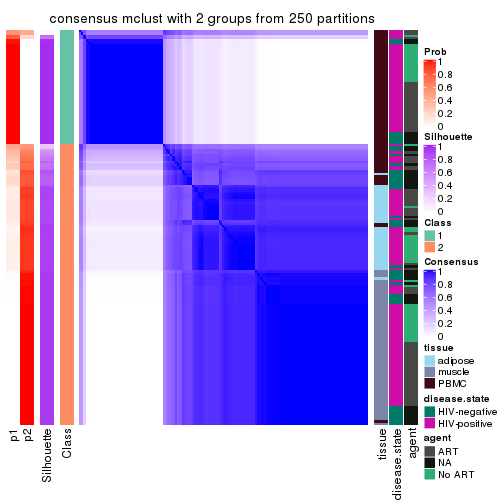</p>

</div>
<div id='tab-SD-mclust-consensus-heatmap-2'>
<pre><code class="r">consensus_heatmap(res, k = 3)
</code></pre>

<p>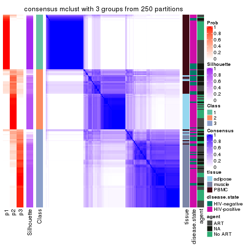</p>

</div>
<div id='tab-SD-mclust-consensus-heatmap-3'>
<pre><code class="r">consensus_heatmap(res, k = 4)
</code></pre>

<p>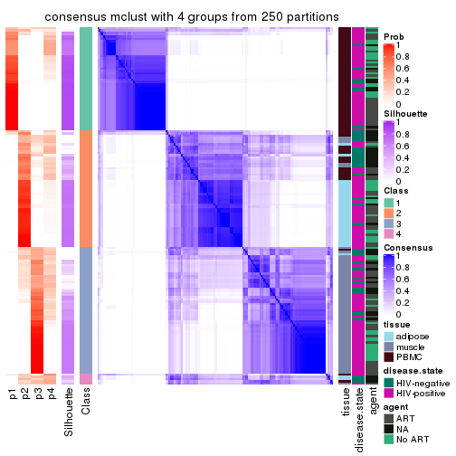</p>

</div>
<div id='tab-SD-mclust-consensus-heatmap-4'>
<pre><code class="r">consensus_heatmap(res, k = 5)
</code></pre>

<p>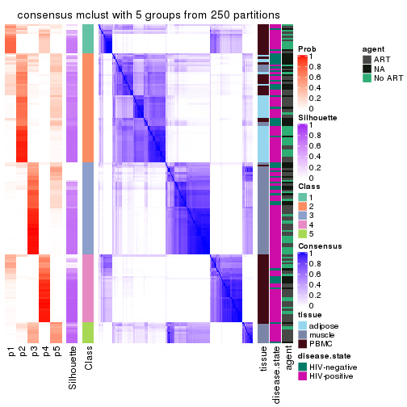</p>

</div>
<div id='tab-SD-mclust-consensus-heatmap-5'>
<pre><code class="r">consensus_heatmap(res, k = 6)
</code></pre>

<p>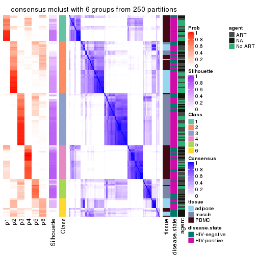</p>

</div>
</div>

Heatmaps for the membership of samples in all partitions to see how consistent they are:


<script>
$( function() {
	$( '#tabs-SD-mclust-membership-heatmap' ).tabs();
} );
</script>
<div id='tabs-SD-mclust-membership-heatmap'>
<ul>
<li><a href='#tab-SD-mclust-membership-heatmap-1'>k = 2</a></li>
<li><a href='#tab-SD-mclust-membership-heatmap-2'>k = 3</a></li>
<li><a href='#tab-SD-mclust-membership-heatmap-3'>k = 4</a></li>
<li><a href='#tab-SD-mclust-membership-heatmap-4'>k = 5</a></li>
<li><a href='#tab-SD-mclust-membership-heatmap-5'>k = 6</a></li>
</ul>
<div id='tab-SD-mclust-membership-heatmap-1'>
<pre><code class="r">membership_heatmap(res, k = 2)
</code></pre>

<p>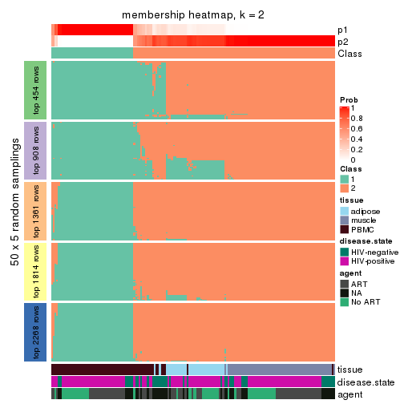</p>

</div>
<div id='tab-SD-mclust-membership-heatmap-2'>
<pre><code class="r">membership_heatmap(res, k = 3)
</code></pre>

<p>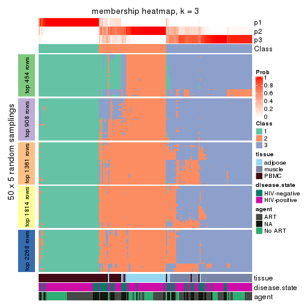</p>

</div>
<div id='tab-SD-mclust-membership-heatmap-3'>
<pre><code class="r">membership_heatmap(res, k = 4)
</code></pre>

<p>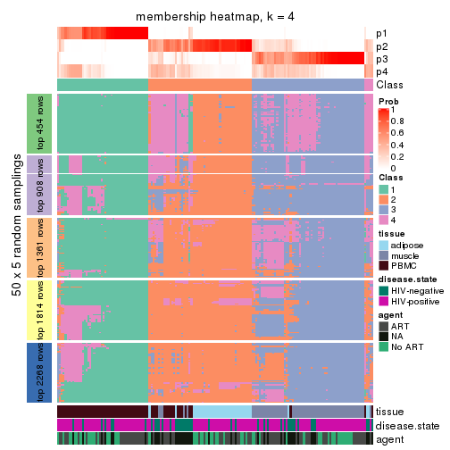</p>

</div>
<div id='tab-SD-mclust-membership-heatmap-4'>
<pre><code class="r">membership_heatmap(res, k = 5)
</code></pre>

<p>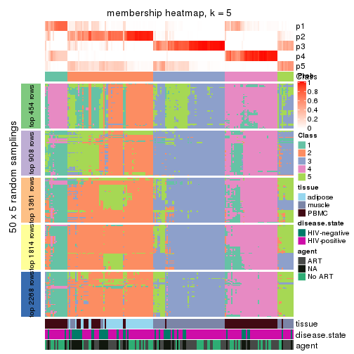</p>

</div>
<div id='tab-SD-mclust-membership-heatmap-5'>
<pre><code class="r">membership_heatmap(res, k = 6)
</code></pre>

<p>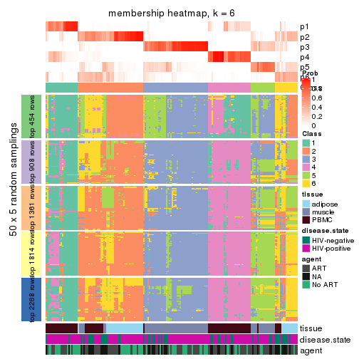</p>

</div>
</div>

As soon as we have had the classes for columns, we can look for signatures
which are significantly different between classes which can be candidate marks
for certain classes. Following are the heatmaps for signatures.


Signature heatmaps where rows are scaled:


<script>
$( function() {
	$( '#tabs-SD-mclust-get-signatures' ).tabs();
} );
</script>
<div id='tabs-SD-mclust-get-signatures'>
<ul>
<li><a href='#tab-SD-mclust-get-signatures-1'>k = 2</a></li>
<li><a href='#tab-SD-mclust-get-signatures-2'>k = 3</a></li>
<li><a href='#tab-SD-mclust-get-signatures-3'>k = 4</a></li>
<li><a href='#tab-SD-mclust-get-signatures-4'>k = 5</a></li>
<li><a href='#tab-SD-mclust-get-signatures-5'>k = 6</a></li>
</ul>
<div id='tab-SD-mclust-get-signatures-1'>
<pre><code class="r">get_signatures(res, k = 2)
</code></pre>

<p>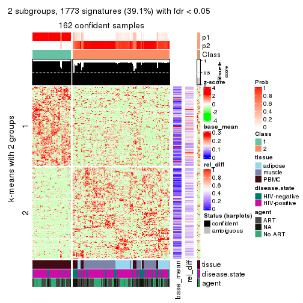</p>

</div>
<div id='tab-SD-mclust-get-signatures-2'>
<pre><code class="r">get_signatures(res, k = 3)
</code></pre>

<p>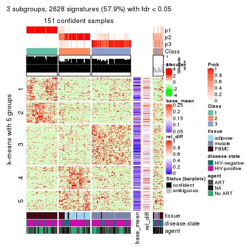</p>

</div>
<div id='tab-SD-mclust-get-signatures-3'>
<pre><code class="r">get_signatures(res, k = 4)
</code></pre>

<p>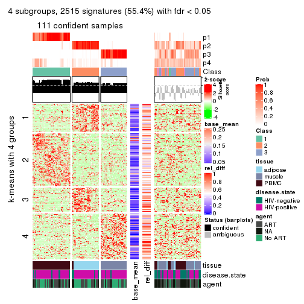</p>

</div>
<div id='tab-SD-mclust-get-signatures-4'>
<pre><code class="r">get_signatures(res, k = 5)
</code></pre>

<p>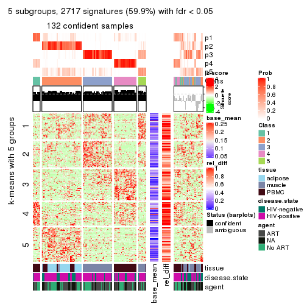</p>

</div>
<div id='tab-SD-mclust-get-signatures-5'>
<pre><code class="r">get_signatures(res, k = 6)
</code></pre>

<p>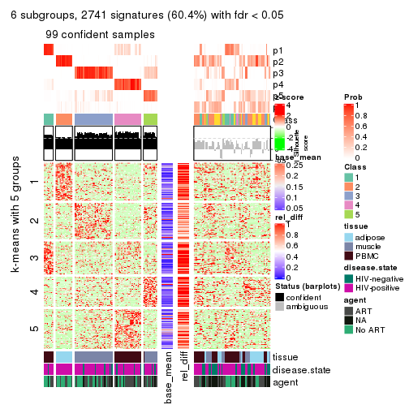</p>

</div>
</div>


Signature heatmaps where rows are not scaled:


<script>
$( function() {
	$( '#tabs-SD-mclust-get-signatures-no-scale' ).tabs();
} );
</script>
<div id='tabs-SD-mclust-get-signatures-no-scale'>
<ul>
<li><a href='#tab-SD-mclust-get-signatures-no-scale-1'>k = 2</a></li>
<li><a href='#tab-SD-mclust-get-signatures-no-scale-2'>k = 3</a></li>
<li><a href='#tab-SD-mclust-get-signatures-no-scale-3'>k = 4</a></li>
<li><a href='#tab-SD-mclust-get-signatures-no-scale-4'>k = 5</a></li>
<li><a href='#tab-SD-mclust-get-signatures-no-scale-5'>k = 6</a></li>
</ul>
<div id='tab-SD-mclust-get-signatures-no-scale-1'>
<pre><code class="r">get_signatures(res, k = 2, scale_rows = FALSE)
</code></pre>

<p>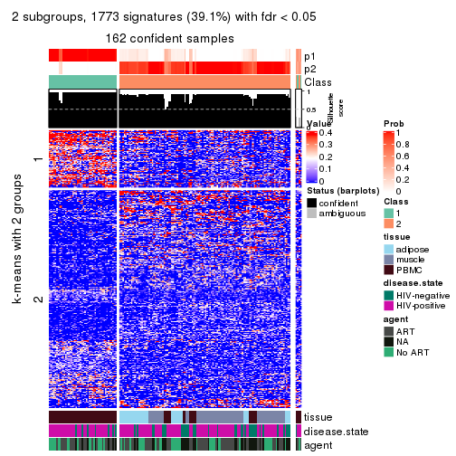</p>

</div>
<div id='tab-SD-mclust-get-signatures-no-scale-2'>
<pre><code class="r">get_signatures(res, k = 3, scale_rows = FALSE)
</code></pre>

<p>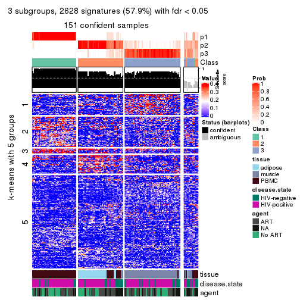</p>

</div>
<div id='tab-SD-mclust-get-signatures-no-scale-3'>
<pre><code class="r">get_signatures(res, k = 4, scale_rows = FALSE)
</code></pre>

<p>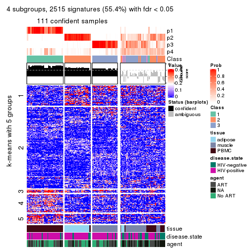</p>

</div>
<div id='tab-SD-mclust-get-signatures-no-scale-4'>
<pre><code class="r">get_signatures(res, k = 5, scale_rows = FALSE)
</code></pre>

<p>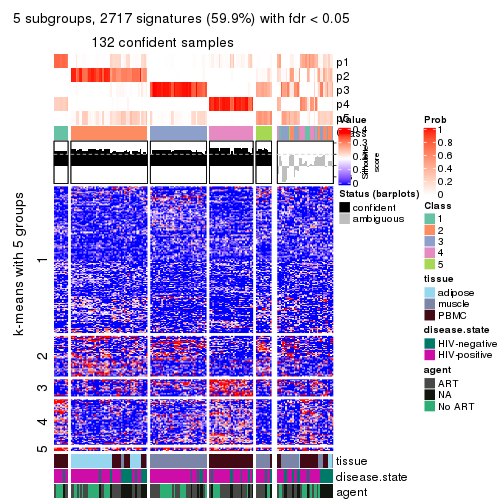</p>

</div>
<div id='tab-SD-mclust-get-signatures-no-scale-5'>
<pre><code class="r">get_signatures(res, k = 6, scale_rows = FALSE)
</code></pre>

<p>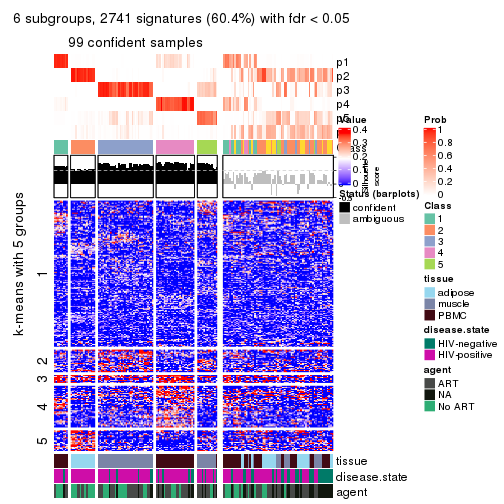</p>

</div>
</div>


Compare the overlap of signatures from different k:

```r
compare_signatures(res)
```

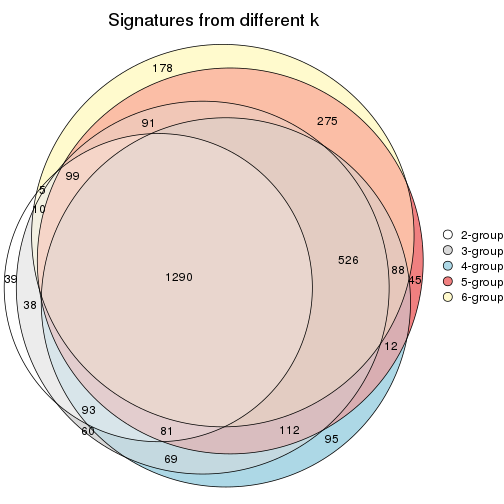

`get_signature()` returns a data frame invisibly. TO get the list of signatures, the function
call should be assigned to a variable explicitly. In following code, if `plot` argument is set
to `FALSE`, no heatmap is plotted while only the differential analysis is performed.

```r
# code only for demonstration
tb = get_signature(res, k = ..., plot = FALSE)
```

An example of the output of `tb` is:

```
#>   which_row         fdr    mean_1    mean_2 scaled_mean_1 scaled_mean_2 km
#> 1        38 0.042760348  8.373488  9.131774    -0.5533452     0.5164555  1
#> 2        40 0.018707592  7.106213  8.469186    -0.6173731     0.5762149  1
#> 3        55 0.019134737 10.221463 11.207825    -0.6159697     0.5749050  1
#> 4        59 0.006059896  5.921854  7.869574    -0.6899429     0.6439467  1
#> 5        60 0.018055526  8.928898 10.211722    -0.6204761     0.5791110  1
#> 6        98 0.009384629 15.714769 14.887706     0.6635654    -0.6193277  2
...
```

The columns in `tb` are:

1. `which_row`: row indices corresponding to the input matrix.
2. `fdr`: FDR for the differential test. 
3. `mean_x`: The mean value in group x.
4. `scaled_mean_x`: The mean value in group x after rows are scaled.
5. `km`: Row groups if k-means clustering is applied to rows.


UMAP plot which shows how samples are separated.


<script>
$( function() {
	$( '#tabs-SD-mclust-dimension-reduction' ).tabs();
} );
</script>
<div id='tabs-SD-mclust-dimension-reduction'>
<ul>
<li><a href='#tab-SD-mclust-dimension-reduction-1'>k = 2</a></li>
<li><a href='#tab-SD-mclust-dimension-reduction-2'>k = 3</a></li>
<li><a href='#tab-SD-mclust-dimension-reduction-3'>k = 4</a></li>
<li><a href='#tab-SD-mclust-dimension-reduction-4'>k = 5</a></li>
<li><a href='#tab-SD-mclust-dimension-reduction-5'>k = 6</a></li>
</ul>
<div id='tab-SD-mclust-dimension-reduction-1'>
<pre><code class="r">dimension_reduction(res, k = 2, method = &quot;UMAP&quot;)
</code></pre>

<p>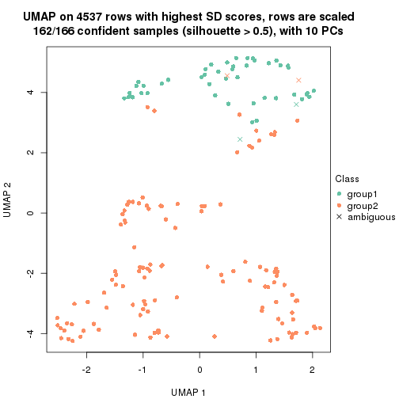</p>

</div>
<div id='tab-SD-mclust-dimension-reduction-2'>
<pre><code class="r">dimension_reduction(res, k = 3, method = &quot;UMAP&quot;)
</code></pre>

<p>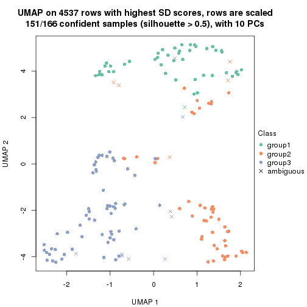</p>

</div>
<div id='tab-SD-mclust-dimension-reduction-3'>
<pre><code class="r">dimension_reduction(res, k = 4, method = &quot;UMAP&quot;)
</code></pre>

<p>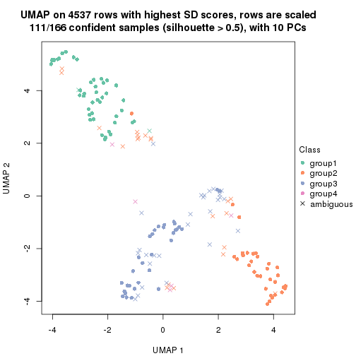</p>

</div>
<div id='tab-SD-mclust-dimension-reduction-4'>
<pre><code class="r">dimension_reduction(res, k = 5, method = &quot;UMAP&quot;)
</code></pre>

<p>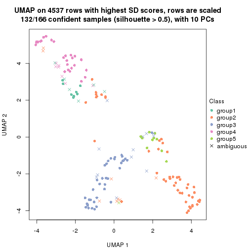</p>

</div>
<div id='tab-SD-mclust-dimension-reduction-5'>
<pre><code class="r">dimension_reduction(res, k = 6, method = &quot;UMAP&quot;)
</code></pre>

<p>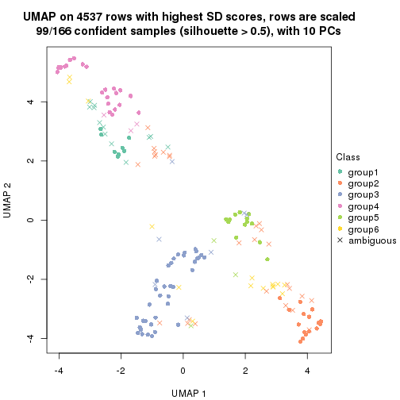</p>

</div>
</div>


Following heatmap shows how subgroups are split when increasing `k`:

```r
collect_classes(res)
```

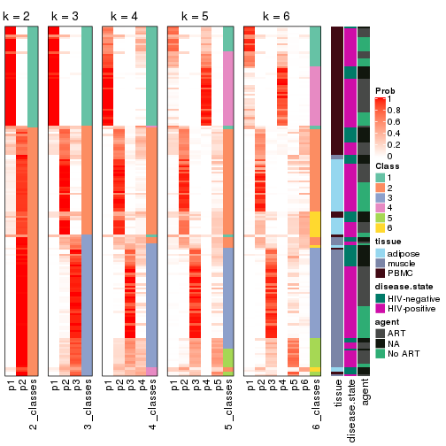


Test correlation between subgroups and known annotations. If the known
annotation is numeric, one-way ANOVA test is applied, and if the known
annotation is discrete, chi-squared contingency table test is applied.

```r
test_to_known_factors(res)
```

```
#>             n tissue(p) disease.state(p) agent(p) k
#> SD:mclust 162  1.20e-22            0.119   0.1947 2
#> SD:mclust 151  3.79e-46            0.468   0.7377 3
#> SD:mclust 111  1.68e-44            0.719   0.9163 4
#> SD:mclust 132  1.78e-35            0.353   0.3560 5
#> SD:mclust  99  1.50e-37            0.204   0.0427 6
```


If matrix rows can be associated to genes, consider to use `GO_Enrichment(res,
...)` to perform function enrichment for the signature genes.


 

---------------------------------------------------


### SD:NMF


The object with results only for a single top-value method and a single partition method 
can be extracted as:

```r
res = res_list["SD", "NMF"]
# you can also extract it by
# res = res_list["SD:NMF"]
```

A summary of `res` and all the functions that can be applied to it:

```r
res
```

```
#> A 'ConsensusPartition' object with k = 2, 3, 4, 5, 6.
#>   On a matrix with 4537 rows and 166 columns.
#>   Top rows (454, 908, 1361, 1814, 2268) are extracted by 'SD' method.
#>   Subgroups are detected by 'NMF' method.
#>   Performed in total 1250 partitions by row resampling.
#>   Best k for subgroups seems to be 2.
#> 
#> Following methods can be applied to this 'ConsensusPartition' object:
#>  [1] "cola_report"             "collect_classes"         "collect_plots"          
#>  [4] "collect_stats"           "colnames"                "compare_signatures"     
#>  [7] "consensus_heatmap"       "dimension_reduction"     "functional_enrichment"  
#> [10] "get_anno_col"            "get_anno"                "get_classes"            
#> [13] "get_consensus"           "get_matrix"              "get_membership"         
#> [16] "get_param"               "get_signatures"          "get_stats"              
#> [19] "is_best_k"               "is_stable_k"             "membership_heatmap"     
#> [22] "ncol"                    "nrow"                    "plot_ecdf"              
#> [25] "rownames"                "select_partition_number" "show"                   
#> [28] "suggest_best_k"          "test_to_known_factors"
```

`collect_plots()` function collects all the plots made from `res` for all `k` (number of partitions)
into one single page to provide an easy and fast comparison between different `k`.

```r
collect_plots(res)
```

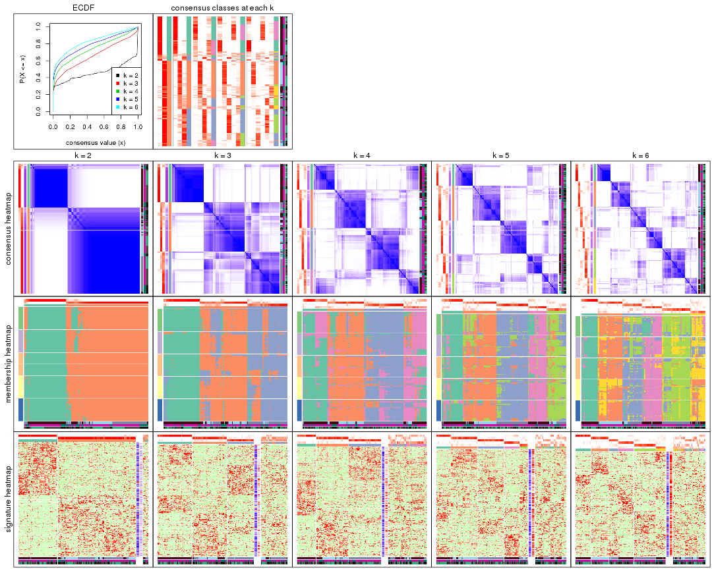

The plots are:

- The first row: a plot of the ECDF (Empirical cumulative distribution
  function) curves of the consensus matrix for each `k` and the heatmap of
  predicted classes for each `k`.
- The second row: heatmaps of the consensus matrix for each `k`.
- The third row: heatmaps of the membership matrix for each `k`.
- The fouth row: heatmaps of the signatures for each `k`.

All the plots in panels can be made by individual functions and they are
plotted later in this section.

`select_partition_number()` produces several plots showing different
statistics for choosing "optimized" `k`. There are following statistics:

- ECDF curves of the consensus matrix for each `k`;
- 1-PAC. [The PAC
  score](https://en.wikipedia.org/wiki/Consensus_clustering#Over-interpretation_potential_of_consensus_clustering)
  measures the proportion of the ambiguous subgrouping.
- Mean silhouette score.
- Concordance. The mean probability of fiting the consensus class ids in all
  partitions.
- Area increased. Denote $A_k$ as the area under the ECDF curve for current
  `k`, the area increased is defined as $A_k - A_{k-1}$.
- Rand index. The percent of pairs of samples that are both in a same cluster
  or both are not in a same cluster in the partition of k and k-1.
- Jaccard index. The ratio of pairs of samples are both in a same cluster in
  the partition of k and k-1 and the pairs of samples are both in a same
  cluster in the partition k or k-1.

The detailed explanations of these statistics can be found in [the cola
vignette](http://bioconductor.org/packages/devel/bioc/vignettes/cola/inst/doc/cola.html#toc_13).

Generally speaking, lower PAC score, higher mean silhouette score or higher
concordance corresponds to better partition. Rand index and Jaccard index
measure how similar the current partition is compared to partition with `k-1`.
If they are too similar, we won't accept `k` is better than `k-1`.

```r
select_partition_number(res)
```

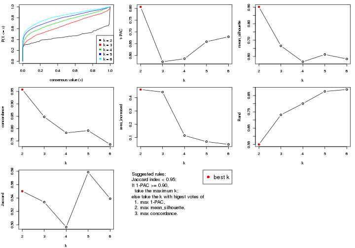

The numeric values for all these statistics can be obtained by `get_stats()`.

```r
get_stats(res)
```

```
#>   k 1-PAC mean_silhouette concordance area_increased  Rand Jaccard
#> 2 2 0.807           0.902       0.958         0.4613 0.550   0.550
#> 3 3 0.573           0.665       0.847         0.4422 0.732   0.534
#> 4 4 0.586           0.568       0.783         0.1150 0.801   0.497
#> 5 5 0.659           0.613       0.792         0.0691 0.875   0.579
#> 6 6 0.680           0.585       0.736         0.0482 0.887   0.539
```

`suggest_best_k()` suggests the best $k$ based on these statistics. The rules are as follows:

- All $k$ with Jaccard index larger than 0.95 are removed because the increase of
  the partition number does not provides enough extra information. If all $k$ are removed,
  the best $k$ is assigned by `NA`.
- For $k$ with 1-PAC larger than 0.9, the maximal $k$ is taken as the "best k". Other $k$ is called "optional k".
- If it does not fit the second rule. The $k$ with the highest vote of highest
  1-PAC, mean silhouette and concordance is taken as the "best k".

```r
suggest_best_k(res)
```

```
#> [1] 2
```


Following shows the table of the partitions (You need to click the **show/hide
code output** link to see it). The membership matrix (columns with name `p*`)
is inferred by
[`clue::cl_consensus()`](https://www.rdocumentation.org/link/cl_consensus?package=clue)
function with the `SE` method. Basically the value in the membership matrix
represents the probability to belong to a certain group. The finall class
label for an item is determined with the group with highest probability it
belongs to.

In `get_classes()` function, the entropy is calculated from the membership
matrix and the silhouette score is calculated from the consensus matrix.


<script>
$( function() {
	$( '#tabs-SD-NMF-get-classes' ).tabs();
} );
</script>
<div id='tabs-SD-NMF-get-classes'>
<ul>
<li><a href='#tab-SD-NMF-get-classes-1'>k = 2</a></li>
<li><a href='#tab-SD-NMF-get-classes-2'>k = 3</a></li>
<li><a href='#tab-SD-NMF-get-classes-3'>k = 4</a></li>
<li><a href='#tab-SD-NMF-get-classes-4'>k = 5</a></li>
<li><a href='#tab-SD-NMF-get-classes-5'>k = 6</a></li>
</ul>

<div id='tab-SD-NMF-get-classes-1'>
<p><a id='tab-SD-NMF-get-classes-1-a' style='color:#0366d6' href='#'>show/hide code output</a></p>
<pre><code class="r">cbind(get_classes(res, k = 2), get_membership(res, k = 2))
</code></pre>

<pre><code>#&gt;           class entropy silhouette    p1    p2
#&gt; GSM751298     1  0.0000     0.9623 1.000 0.000
#&gt; GSM751304     2  0.9358     0.4929 0.352 0.648
#&gt; GSM751305     2  0.9393     0.4843 0.356 0.644
#&gt; GSM751307     1  0.6973     0.7495 0.812 0.188
#&gt; GSM751310     1  0.0000     0.9623 1.000 0.000
#&gt; GSM751314     1  0.0000     0.9623 1.000 0.000
#&gt; GSM751316     1  0.0000     0.9623 1.000 0.000
#&gt; GSM751318     1  0.0000     0.9623 1.000 0.000
#&gt; GSM751342     1  0.0000     0.9623 1.000 0.000
#&gt; GSM751346     1  0.0000     0.9623 1.000 0.000
#&gt; GSM751347     1  0.4161     0.8807 0.916 0.084
#&gt; GSM751348     2  0.4298     0.8887 0.088 0.912
#&gt; GSM751349     2  0.0000     0.9503 0.000 1.000
#&gt; GSM751352     2  0.9552     0.4370 0.376 0.624
#&gt; GSM751353     2  0.6247     0.8120 0.156 0.844
#&gt; GSM751354     2  0.7219     0.7557 0.200 0.800
#&gt; GSM751355     2  0.2948     0.9148 0.052 0.948
#&gt; GSM751358     2  0.5408     0.8481 0.124 0.876
#&gt; GSM751359     2  0.0000     0.9503 0.000 1.000
#&gt; GSM751294     2  0.0672     0.9460 0.008 0.992
#&gt; GSM751296     1  0.0000     0.9623 1.000 0.000
#&gt; GSM751297     1  0.0672     0.9558 0.992 0.008
#&gt; GSM751299     2  0.8267     0.6684 0.260 0.740
#&gt; GSM751300     1  0.0000     0.9623 1.000 0.000
#&gt; GSM751301     1  0.0000     0.9623 1.000 0.000
#&gt; GSM751302     1  0.0000     0.9623 1.000 0.000
#&gt; GSM751303     1  0.0000     0.9623 1.000 0.000
#&gt; GSM751306     1  0.0000     0.9623 1.000 0.000
#&gt; GSM751308     1  0.0376     0.9590 0.996 0.004
#&gt; GSM751309     1  0.0000     0.9623 1.000 0.000
#&gt; GSM751311     1  0.0000     0.9623 1.000 0.000
#&gt; GSM751312     1  0.0000     0.9623 1.000 0.000
#&gt; GSM751313     1  0.0000     0.9623 1.000 0.000
#&gt; GSM751315     1  0.0000     0.9623 1.000 0.000
#&gt; GSM751317     1  0.0000     0.9623 1.000 0.000
#&gt; GSM751320     1  0.0000     0.9623 1.000 0.000
#&gt; GSM751321     1  0.0000     0.9623 1.000 0.000
#&gt; GSM751322     1  0.0000     0.9623 1.000 0.000
#&gt; GSM751324     1  0.0000     0.9623 1.000 0.000
#&gt; GSM751325     1  0.0000     0.9623 1.000 0.000
#&gt; GSM751332     1  0.0000     0.9623 1.000 0.000
#&gt; GSM751334     1  0.0000     0.9623 1.000 0.000
#&gt; GSM751339     1  0.0000     0.9623 1.000 0.000
#&gt; GSM751341     1  0.0000     0.9623 1.000 0.000
#&gt; GSM751343     1  0.0000     0.9623 1.000 0.000
#&gt; GSM751344     2  0.5059     0.8603 0.112 0.888
#&gt; GSM751345     2  0.6343     0.8072 0.160 0.840
#&gt; GSM751356     2  0.9087     0.5524 0.324 0.676
#&gt; GSM751357     2  0.9087     0.5524 0.324 0.676
#&gt; GSM751293     1  0.0000     0.9623 1.000 0.000
#&gt; GSM751295     1  0.0000     0.9623 1.000 0.000
#&gt; GSM751319     1  0.0000     0.9623 1.000 0.000
#&gt; GSM751323     1  0.0000     0.9623 1.000 0.000
#&gt; GSM751326     1  0.0000     0.9623 1.000 0.000
#&gt; GSM751327     1  0.0000     0.9623 1.000 0.000
#&gt; GSM751328     1  0.0000     0.9623 1.000 0.000
#&gt; GSM751329     1  0.0000     0.9623 1.000 0.000
#&gt; GSM751330     1  0.0000     0.9623 1.000 0.000
#&gt; GSM751331     1  0.0000     0.9623 1.000 0.000
#&gt; GSM751333     1  0.0000     0.9623 1.000 0.000
#&gt; GSM751335     1  0.0000     0.9623 1.000 0.000
#&gt; GSM751336     1  0.0000     0.9623 1.000 0.000
#&gt; GSM751337     1  0.0000     0.9623 1.000 0.000
#&gt; GSM751338     1  0.0000     0.9623 1.000 0.000
#&gt; GSM751340     1  0.0000     0.9623 1.000 0.000
#&gt; GSM751350     1  0.0000     0.9623 1.000 0.000
#&gt; GSM751351     1  0.0000     0.9623 1.000 0.000
#&gt; GSM751362     2  0.8661     0.6029 0.288 0.712
#&gt; GSM751363     2  0.1184     0.9412 0.016 0.984
#&gt; GSM751367     1  0.7376     0.7270 0.792 0.208
#&gt; GSM751368     2  0.0000     0.9503 0.000 1.000
#&gt; GSM751371     1  0.9881     0.2287 0.564 0.436
#&gt; GSM751375     2  0.0000     0.9503 0.000 1.000
#&gt; GSM751376     2  0.0000     0.9503 0.000 1.000
#&gt; GSM751378     2  0.0000     0.9503 0.000 1.000
#&gt; GSM751379     2  0.0000     0.9503 0.000 1.000
#&gt; GSM751382     2  0.0000     0.9503 0.000 1.000
#&gt; GSM751386     2  0.0000     0.9503 0.000 1.000
#&gt; GSM751388     2  0.0000     0.9503 0.000 1.000
#&gt; GSM751391     2  0.0000     0.9503 0.000 1.000
#&gt; GSM751410     1  0.7219     0.7380 0.800 0.200
#&gt; GSM751414     2  0.7602     0.7210 0.220 0.780
#&gt; GSM751361     2  0.0000     0.9503 0.000 1.000
#&gt; GSM751365     2  0.0000     0.9503 0.000 1.000
#&gt; GSM751366     1  0.9209     0.4952 0.664 0.336
#&gt; GSM751369     2  0.3584     0.9014 0.068 0.932
#&gt; GSM751370     1  0.9983     0.0961 0.524 0.476
#&gt; GSM751372     2  0.0000     0.9503 0.000 1.000
#&gt; GSM751373     2  0.9993     0.0404 0.484 0.516
#&gt; GSM751374     2  0.0000     0.9503 0.000 1.000
#&gt; GSM751377     2  0.0000     0.9503 0.000 1.000
#&gt; GSM751380     2  0.5946     0.8240 0.144 0.856
#&gt; GSM751381     2  0.0000     0.9503 0.000 1.000
#&gt; GSM751383     2  0.0000     0.9503 0.000 1.000
#&gt; GSM751384     2  0.0000     0.9503 0.000 1.000
#&gt; GSM751385     2  0.0000     0.9503 0.000 1.000
#&gt; GSM751387     2  0.0000     0.9503 0.000 1.000
#&gt; GSM751389     2  0.0000     0.9503 0.000 1.000
#&gt; GSM751393     2  0.0000     0.9503 0.000 1.000
#&gt; GSM751394     2  0.0000     0.9503 0.000 1.000
#&gt; GSM751395     2  0.0000     0.9503 0.000 1.000
#&gt; GSM751397     2  0.0000     0.9503 0.000 1.000
#&gt; GSM751398     2  0.0000     0.9503 0.000 1.000
#&gt; GSM751404     2  0.0376     0.9482 0.004 0.996
#&gt; GSM751406     2  0.0000     0.9503 0.000 1.000
#&gt; GSM751411     2  0.0000     0.9503 0.000 1.000
#&gt; GSM751413     2  0.0000     0.9503 0.000 1.000
#&gt; GSM751415     2  0.5408     0.8459 0.124 0.876
#&gt; GSM751416     2  0.0000     0.9503 0.000 1.000
#&gt; GSM751417     2  0.0000     0.9503 0.000 1.000
#&gt; GSM751421     2  0.1414     0.9382 0.020 0.980
#&gt; GSM751422     2  0.0376     0.9482 0.004 0.996
#&gt; GSM751360     2  0.0000     0.9503 0.000 1.000
#&gt; GSM751364     2  0.0000     0.9503 0.000 1.000
#&gt; GSM751390     2  0.0000     0.9503 0.000 1.000
#&gt; GSM751392     2  0.0000     0.9503 0.000 1.000
#&gt; GSM751396     2  0.0000     0.9503 0.000 1.000
#&gt; GSM751399     2  0.0000     0.9503 0.000 1.000
#&gt; GSM751400     2  0.0000     0.9503 0.000 1.000
#&gt; GSM751401     2  0.2236     0.9265 0.036 0.964
#&gt; GSM751402     2  0.1414     0.9381 0.020 0.980
#&gt; GSM751403     2  0.0000     0.9503 0.000 1.000
#&gt; GSM751405     2  0.0000     0.9503 0.000 1.000
#&gt; GSM751407     2  0.0000     0.9503 0.000 1.000
#&gt; GSM751408     2  0.0000     0.9503 0.000 1.000
#&gt; GSM751409     2  0.0000     0.9503 0.000 1.000
#&gt; GSM751412     2  0.0000     0.9503 0.000 1.000
#&gt; GSM751418     2  0.0000     0.9503 0.000 1.000
#&gt; GSM751419     2  0.0000     0.9503 0.000 1.000
#&gt; GSM751420     2  0.0000     0.9503 0.000 1.000
#&gt; GSM751425     2  0.0000     0.9503 0.000 1.000
#&gt; GSM751429     2  0.6247     0.8090 0.156 0.844
#&gt; GSM751430     2  0.0376     0.9483 0.004 0.996
#&gt; GSM751433     2  0.7139     0.7662 0.196 0.804
#&gt; GSM751437     2  0.0000     0.9503 0.000 1.000
#&gt; GSM751448     2  0.7219     0.7531 0.200 0.800
#&gt; GSM751451     2  0.0000     0.9503 0.000 1.000
#&gt; GSM751423     2  0.0000     0.9503 0.000 1.000
#&gt; GSM751424     2  0.0000     0.9503 0.000 1.000
#&gt; GSM751428     2  0.0000     0.9503 0.000 1.000
#&gt; GSM751431     2  0.0000     0.9503 0.000 1.000
#&gt; GSM751432     2  0.0000     0.9503 0.000 1.000
#&gt; GSM751434     2  0.4431     0.8824 0.092 0.908
#&gt; GSM751435     2  0.3879     0.8948 0.076 0.924
#&gt; GSM751436     2  0.0376     0.9483 0.004 0.996
#&gt; GSM751440     2  0.1184     0.9410 0.016 0.984
#&gt; GSM751444     2  0.0000     0.9503 0.000 1.000
#&gt; GSM751446     2  0.0000     0.9503 0.000 1.000
#&gt; GSM751449     2  0.0000     0.9503 0.000 1.000
#&gt; GSM751450     2  0.0000     0.9503 0.000 1.000
#&gt; GSM751452     2  0.0000     0.9503 0.000 1.000
#&gt; GSM751426     2  0.0000     0.9503 0.000 1.000
#&gt; GSM751427     2  0.0000     0.9503 0.000 1.000
#&gt; GSM751438     2  0.0000     0.9503 0.000 1.000
#&gt; GSM751439     2  0.0938     0.9436 0.012 0.988
#&gt; GSM751441     2  0.0000     0.9503 0.000 1.000
#&gt; GSM751442     2  0.0938     0.9437 0.012 0.988
#&gt; GSM751443     2  0.0000     0.9503 0.000 1.000
#&gt; GSM751445     2  0.0000     0.9503 0.000 1.000
#&gt; GSM751447     2  0.0000     0.9503 0.000 1.000
#&gt; GSM751453     2  0.0000     0.9503 0.000 1.000
#&gt; GSM751454     2  0.0000     0.9503 0.000 1.000
#&gt; GSM751455     2  0.0000     0.9503 0.000 1.000
#&gt; GSM751456     2  0.0000     0.9503 0.000 1.000
#&gt; GSM751457     2  0.0000     0.9503 0.000 1.000
#&gt; GSM751458     2  0.0000     0.9503 0.000 1.000
</code></pre>

<script>
$('#tab-SD-NMF-get-classes-1-a').parent().next().next().hide();
$('#tab-SD-NMF-get-classes-1-a').click(function(){
  $('#tab-SD-NMF-get-classes-1-a').parent().next().next().toggle();
  return(false);
});
</script>
</div>

<div id='tab-SD-NMF-get-classes-2'>
<p><a id='tab-SD-NMF-get-classes-2-a' style='color:#0366d6' href='#'>show/hide code output</a></p>
<pre><code class="r">cbind(get_classes(res, k = 3), get_membership(res, k = 3))
</code></pre>

<pre><code>#&gt;           class entropy silhouette    p1    p2    p3
#&gt; GSM751298     1  0.0000    0.94940 1.000 0.000 0.000
#&gt; GSM751304     2  0.7213    0.58220 0.212 0.700 0.088
#&gt; GSM751305     2  0.6986    0.55885 0.256 0.688 0.056
#&gt; GSM751307     2  0.6489    0.20173 0.456 0.540 0.004
#&gt; GSM751310     1  0.0475    0.94829 0.992 0.004 0.004
#&gt; GSM751314     1  0.0475    0.94829 0.992 0.004 0.004
#&gt; GSM751316     1  0.0475    0.94829 0.992 0.004 0.004
#&gt; GSM751318     1  0.0000    0.94940 1.000 0.000 0.000
#&gt; GSM751342     1  0.0661    0.94643 0.988 0.008 0.004
#&gt; GSM751346     1  0.6307    0.55582 0.660 0.012 0.328
#&gt; GSM751347     1  0.6735    0.33907 0.564 0.012 0.424
#&gt; GSM751348     2  0.3554    0.73166 0.036 0.900 0.064
#&gt; GSM751349     2  0.0892    0.75723 0.000 0.980 0.020
#&gt; GSM751352     2  0.6012    0.68091 0.088 0.788 0.124
#&gt; GSM751353     2  0.2550    0.74400 0.012 0.932 0.056
#&gt; GSM751354     2  0.7462    0.39134 0.048 0.600 0.352
#&gt; GSM751355     2  0.2448    0.74129 0.000 0.924 0.076
#&gt; GSM751358     2  0.6956    0.48547 0.300 0.660 0.040
#&gt; GSM751359     2  0.2356    0.73546 0.000 0.928 0.072
#&gt; GSM751294     2  0.6204    0.26123 0.000 0.576 0.424
#&gt; GSM751296     1  0.1170    0.94066 0.976 0.008 0.016
#&gt; GSM751297     3  0.8902    0.00251 0.396 0.124 0.480
#&gt; GSM751299     2  0.4411    0.69609 0.016 0.844 0.140
#&gt; GSM751300     1  0.1482    0.93609 0.968 0.012 0.020
#&gt; GSM751301     1  0.2955    0.88110 0.912 0.080 0.008
#&gt; GSM751302     1  0.3618    0.86493 0.884 0.012 0.104
#&gt; GSM751303     1  0.0475    0.94829 0.992 0.004 0.004
#&gt; GSM751306     1  0.0475    0.94829 0.992 0.004 0.004
#&gt; GSM751308     1  0.6451    0.60419 0.684 0.024 0.292
#&gt; GSM751309     1  0.0475    0.94829 0.992 0.004 0.004
#&gt; GSM751311     1  0.0475    0.94829 0.992 0.004 0.004
#&gt; GSM751312     1  0.0475    0.94829 0.992 0.004 0.004
#&gt; GSM751313     1  0.0000    0.94940 1.000 0.000 0.000
#&gt; GSM751315     1  0.0000    0.94940 1.000 0.000 0.000
#&gt; GSM751317     1  0.0475    0.94829 0.992 0.004 0.004
#&gt; GSM751320     1  0.0000    0.94940 1.000 0.000 0.000
#&gt; GSM751321     1  0.0475    0.94829 0.992 0.004 0.004
#&gt; GSM751322     1  0.0000    0.94940 1.000 0.000 0.000
#&gt; GSM751324     1  0.0000    0.94940 1.000 0.000 0.000
#&gt; GSM751325     1  0.0000    0.94940 1.000 0.000 0.000
#&gt; GSM751332     1  0.0000    0.94940 1.000 0.000 0.000
#&gt; GSM751334     1  0.0000    0.94940 1.000 0.000 0.000
#&gt; GSM751339     1  0.0747    0.94345 0.984 0.000 0.016
#&gt; GSM751341     1  0.0475    0.94829 0.992 0.004 0.004
#&gt; GSM751343     1  0.0000    0.94940 1.000 0.000 0.000
#&gt; GSM751344     2  0.2066    0.74273 0.000 0.940 0.060
#&gt; GSM751345     2  0.2165    0.74155 0.000 0.936 0.064
#&gt; GSM751356     2  0.7592    0.57945 0.112 0.680 0.208
#&gt; GSM751357     2  0.6594    0.65596 0.116 0.756 0.128
#&gt; GSM751293     1  0.1170    0.94083 0.976 0.016 0.008
#&gt; GSM751295     1  0.4326    0.82064 0.844 0.012 0.144
#&gt; GSM751319     1  0.0237    0.94866 0.996 0.000 0.004
#&gt; GSM751323     1  0.0000    0.94940 1.000 0.000 0.000
#&gt; GSM751326     1  0.0000    0.94940 1.000 0.000 0.000
#&gt; GSM751327     1  0.0000    0.94940 1.000 0.000 0.000
#&gt; GSM751328     1  0.0000    0.94940 1.000 0.000 0.000
#&gt; GSM751329     1  0.0000    0.94940 1.000 0.000 0.000
#&gt; GSM751330     1  0.0475    0.94742 0.992 0.004 0.004
#&gt; GSM751331     1  0.1482    0.93609 0.968 0.012 0.020
#&gt; GSM751333     1  0.0237    0.94861 0.996 0.004 0.000
#&gt; GSM751335     1  0.0661    0.94590 0.988 0.004 0.008
#&gt; GSM751336     1  0.1620    0.93367 0.964 0.012 0.024
#&gt; GSM751337     1  0.0000    0.94940 1.000 0.000 0.000
#&gt; GSM751338     1  0.0475    0.94742 0.992 0.004 0.004
#&gt; GSM751340     1  0.7074    0.20201 0.500 0.020 0.480
#&gt; GSM751350     1  0.3031    0.89245 0.912 0.012 0.076
#&gt; GSM751351     1  0.1999    0.92517 0.952 0.012 0.036
#&gt; GSM751362     3  0.1182    0.72364 0.012 0.012 0.976
#&gt; GSM751363     3  0.6664    0.19996 0.008 0.464 0.528
#&gt; GSM751367     3  0.6421    0.23374 0.424 0.004 0.572
#&gt; GSM751368     2  0.6295   -0.03204 0.000 0.528 0.472
#&gt; GSM751371     3  0.4390    0.66299 0.148 0.012 0.840
#&gt; GSM751375     2  0.0747    0.75755 0.000 0.984 0.016
#&gt; GSM751376     3  0.5678    0.39023 0.000 0.316 0.684
#&gt; GSM751378     3  0.6302   -0.00253 0.000 0.480 0.520
#&gt; GSM751379     3  0.1529    0.70263 0.000 0.040 0.960
#&gt; GSM751382     2  0.1031    0.75670 0.000 0.976 0.024
#&gt; GSM751386     2  0.5497    0.46997 0.000 0.708 0.292
#&gt; GSM751388     2  0.6079    0.25257 0.000 0.612 0.388
#&gt; GSM751391     3  0.3038    0.68507 0.000 0.104 0.896
#&gt; GSM751410     3  0.3851    0.67042 0.136 0.004 0.860
#&gt; GSM751414     3  0.6752    0.63598 0.152 0.104 0.744
#&gt; GSM751361     3  0.6299    0.18493 0.000 0.476 0.524
#&gt; GSM751365     3  0.4062    0.67629 0.000 0.164 0.836
#&gt; GSM751366     3  0.3148    0.72061 0.036 0.048 0.916
#&gt; GSM751369     3  0.0892    0.71949 0.000 0.020 0.980
#&gt; GSM751370     3  0.6181    0.64933 0.156 0.072 0.772
#&gt; GSM751372     3  0.5254    0.58218 0.000 0.264 0.736
#&gt; GSM751373     3  0.7849    0.55044 0.248 0.104 0.648
#&gt; GSM751374     3  0.4178    0.59371 0.000 0.172 0.828
#&gt; GSM751377     3  0.6305    0.14957 0.000 0.484 0.516
#&gt; GSM751380     3  0.1643    0.72503 0.000 0.044 0.956
#&gt; GSM751381     2  0.4974    0.56544 0.000 0.764 0.236
#&gt; GSM751383     2  0.6111    0.22999 0.000 0.604 0.396
#&gt; GSM751384     3  0.6008    0.42448 0.000 0.372 0.628
#&gt; GSM751385     3  0.6252    0.27690 0.000 0.444 0.556
#&gt; GSM751387     2  0.5098    0.54742 0.000 0.752 0.248
#&gt; GSM751389     3  0.0592    0.72202 0.000 0.012 0.988
#&gt; GSM751393     3  0.3941    0.68324 0.000 0.156 0.844
#&gt; GSM751394     2  0.5785    0.39521 0.000 0.668 0.332
#&gt; GSM751395     2  0.6291    0.10901 0.000 0.532 0.468
#&gt; GSM751397     2  0.6180    0.17766 0.000 0.584 0.416
#&gt; GSM751398     2  0.6095    0.24951 0.000 0.608 0.392
#&gt; GSM751404     3  0.1964    0.72412 0.000 0.056 0.944
#&gt; GSM751406     3  0.0747    0.71744 0.000 0.016 0.984
#&gt; GSM751411     3  0.3116    0.70888 0.000 0.108 0.892
#&gt; GSM751413     2  0.6295   -0.02061 0.000 0.528 0.472
#&gt; GSM751415     3  0.1031    0.72465 0.000 0.024 0.976
#&gt; GSM751416     3  0.6286    0.21161 0.000 0.464 0.536
#&gt; GSM751417     3  0.6291    0.19984 0.000 0.468 0.532
#&gt; GSM751421     3  0.0892    0.72217 0.000 0.020 0.980
#&gt; GSM751422     3  0.1031    0.72294 0.000 0.024 0.976
#&gt; GSM751360     3  0.7983    0.55097 0.124 0.228 0.648
#&gt; GSM751364     3  0.6154    0.35253 0.000 0.408 0.592
#&gt; GSM751390     3  0.6126    0.37397 0.000 0.400 0.600
#&gt; GSM751392     2  0.4605    0.60789 0.000 0.796 0.204
#&gt; GSM751396     2  0.5058    0.55339 0.000 0.756 0.244
#&gt; GSM751399     3  0.2711    0.71875 0.000 0.088 0.912
#&gt; GSM751400     3  0.2400    0.72325 0.004 0.064 0.932
#&gt; GSM751401     3  0.0661    0.72191 0.004 0.008 0.988
#&gt; GSM751402     3  0.0592    0.71934 0.000 0.012 0.988
#&gt; GSM751403     3  0.0592    0.72202 0.000 0.012 0.988
#&gt; GSM751405     3  0.0592    0.71725 0.000 0.012 0.988
#&gt; GSM751407     3  0.2165    0.72320 0.000 0.064 0.936
#&gt; GSM751408     3  0.2711    0.71837 0.000 0.088 0.912
#&gt; GSM751409     3  0.2537    0.72081 0.000 0.080 0.920
#&gt; GSM751412     3  0.2537    0.72053 0.000 0.080 0.920
#&gt; GSM751418     3  0.6229    0.48025 0.008 0.340 0.652
#&gt; GSM751419     3  0.5733    0.50828 0.000 0.324 0.676
#&gt; GSM751420     3  0.1411    0.70962 0.000 0.036 0.964
#&gt; GSM751425     2  0.0892    0.75789 0.000 0.980 0.020
#&gt; GSM751429     3  0.5988    0.27518 0.000 0.368 0.632
#&gt; GSM751430     2  0.5024    0.58502 0.004 0.776 0.220
#&gt; GSM751433     2  0.2486    0.74137 0.060 0.932 0.008
#&gt; GSM751437     3  0.5706    0.38840 0.000 0.320 0.680
#&gt; GSM751448     3  0.4887    0.52384 0.000 0.228 0.772
#&gt; GSM751451     2  0.1031    0.75670 0.000 0.976 0.024
#&gt; GSM751423     2  0.0892    0.75743 0.000 0.980 0.020
#&gt; GSM751424     2  0.1031    0.75670 0.000 0.976 0.024
#&gt; GSM751428     2  0.1031    0.75795 0.000 0.976 0.024
#&gt; GSM751431     2  0.0892    0.75743 0.000 0.980 0.020
#&gt; GSM751432     2  0.2959    0.71350 0.000 0.900 0.100
#&gt; GSM751434     2  0.2313    0.75004 0.032 0.944 0.024
#&gt; GSM751435     2  0.0983    0.75782 0.004 0.980 0.016
#&gt; GSM751436     2  0.1163    0.75545 0.000 0.972 0.028
#&gt; GSM751440     2  0.0892    0.75743 0.000 0.980 0.020
#&gt; GSM751444     2  0.1964    0.74824 0.000 0.944 0.056
#&gt; GSM751446     2  0.4974    0.61703 0.000 0.764 0.236
#&gt; GSM751449     2  0.4178    0.68829 0.000 0.828 0.172
#&gt; GSM751450     2  0.0892    0.75743 0.000 0.980 0.020
#&gt; GSM751452     2  0.1163    0.75545 0.000 0.972 0.028
#&gt; GSM751426     2  0.1031    0.75670 0.000 0.976 0.024
#&gt; GSM751427     2  0.1753    0.75628 0.000 0.952 0.048
#&gt; GSM751438     2  0.5178    0.58521 0.000 0.744 0.256
#&gt; GSM751439     3  0.6244    0.09466 0.000 0.440 0.560
#&gt; GSM751441     2  0.1964    0.74751 0.000 0.944 0.056
#&gt; GSM751442     2  0.4733    0.65007 0.004 0.800 0.196
#&gt; GSM751443     3  0.6095    0.21905 0.000 0.392 0.608
#&gt; GSM751445     2  0.2537    0.74558 0.000 0.920 0.080
#&gt; GSM751447     2  0.2356    0.74319 0.000 0.928 0.072
#&gt; GSM751453     2  0.0592    0.75800 0.000 0.988 0.012
#&gt; GSM751454     2  0.0747    0.75790 0.000 0.984 0.016
#&gt; GSM751455     2  0.5291    0.56757 0.000 0.732 0.268
#&gt; GSM751456     2  0.5706    0.48567 0.000 0.680 0.320
#&gt; GSM751457     2  0.6008    0.39018 0.000 0.628 0.372
#&gt; GSM751458     2  0.5948    0.41261 0.000 0.640 0.360
</code></pre>

<script>
$('#tab-SD-NMF-get-classes-2-a').parent().next().next().hide();
$('#tab-SD-NMF-get-classes-2-a').click(function(){
  $('#tab-SD-NMF-get-classes-2-a').parent().next().next().toggle();
  return(false);
});
</script>
</div>

<div id='tab-SD-NMF-get-classes-3'>
<p><a id='tab-SD-NMF-get-classes-3-a' style='color:#0366d6' href='#'>show/hide code output</a></p>
<pre><code class="r">cbind(get_classes(res, k = 4), get_membership(res, k = 4))
</code></pre>

<pre><code>#&gt;           class entropy silhouette    p1    p2    p3    p4
#&gt; GSM751298     1  0.4431     0.6052 0.696 0.000 0.000 0.304
#&gt; GSM751304     2  0.7585     0.4917 0.256 0.540 0.012 0.192
#&gt; GSM751305     2  0.6746     0.4043 0.404 0.520 0.012 0.064
#&gt; GSM751307     2  0.6103     0.2748 0.476 0.488 0.012 0.024
#&gt; GSM751310     1  0.0592     0.7156 0.984 0.000 0.000 0.016
#&gt; GSM751314     1  0.0336     0.7157 0.992 0.000 0.000 0.008
#&gt; GSM751316     1  0.0844     0.6984 0.980 0.004 0.004 0.012
#&gt; GSM751318     1  0.3528     0.7072 0.808 0.000 0.000 0.192
#&gt; GSM751342     1  0.0779     0.6977 0.980 0.004 0.000 0.016
#&gt; GSM751346     4  0.2216     0.3946 0.092 0.000 0.000 0.908
#&gt; GSM751347     4  0.3306     0.3607 0.156 0.000 0.004 0.840
#&gt; GSM751348     2  0.3370     0.8092 0.080 0.872 0.000 0.048
#&gt; GSM751349     2  0.2676     0.8268 0.044 0.916 0.012 0.028
#&gt; GSM751352     4  0.5773    -0.0440 0.016 0.440 0.008 0.536
#&gt; GSM751353     2  0.2960     0.8190 0.020 0.892 0.004 0.084
#&gt; GSM751354     4  0.6144     0.3727 0.180 0.108 0.012 0.700
#&gt; GSM751355     2  0.7241     0.5627 0.136 0.596 0.020 0.248
#&gt; GSM751358     1  0.5020     0.3849 0.760 0.184 0.004 0.052
#&gt; GSM751359     2  0.5970     0.6794 0.204 0.712 0.056 0.028
#&gt; GSM751294     4  0.7269    -0.0528 0.032 0.408 0.068 0.492
#&gt; GSM751296     4  0.4941    -0.0626 0.436 0.000 0.000 0.564
#&gt; GSM751297     4  0.4717     0.4236 0.084 0.112 0.004 0.800
#&gt; GSM751299     2  0.6210     0.2448 0.036 0.516 0.008 0.440
#&gt; GSM751300     4  0.4888    -0.0064 0.412 0.000 0.000 0.588
#&gt; GSM751301     4  0.7884     0.0130 0.284 0.356 0.000 0.360
#&gt; GSM751302     4  0.3726     0.3175 0.212 0.000 0.000 0.788
#&gt; GSM751303     1  0.0967     0.6945 0.976 0.004 0.004 0.016
#&gt; GSM751306     1  0.0844     0.6984 0.980 0.004 0.004 0.012
#&gt; GSM751308     4  0.5352     0.2162 0.296 0.020 0.008 0.676
#&gt; GSM751309     1  0.0188     0.7093 0.996 0.000 0.000 0.004
#&gt; GSM751311     1  0.0000     0.7118 1.000 0.000 0.000 0.000
#&gt; GSM751312     1  0.0844     0.7011 0.980 0.004 0.004 0.012
#&gt; GSM751313     4  0.4972    -0.1154 0.456 0.000 0.000 0.544
#&gt; GSM751315     1  0.2868     0.7194 0.864 0.000 0.000 0.136
#&gt; GSM751317     1  0.1022     0.7200 0.968 0.000 0.000 0.032
#&gt; GSM751320     1  0.3837     0.6887 0.776 0.000 0.000 0.224
#&gt; GSM751321     1  0.0469     0.7162 0.988 0.000 0.000 0.012
#&gt; GSM751322     1  0.3569     0.7053 0.804 0.000 0.000 0.196
#&gt; GSM751324     1  0.3486     0.7089 0.812 0.000 0.000 0.188
#&gt; GSM751325     1  0.3610     0.7033 0.800 0.000 0.000 0.200
#&gt; GSM751332     1  0.3610     0.7033 0.800 0.000 0.000 0.200
#&gt; GSM751334     1  0.4008     0.6721 0.756 0.000 0.000 0.244
#&gt; GSM751339     4  0.4981    -0.1474 0.464 0.000 0.000 0.536
#&gt; GSM751341     1  0.0707     0.7157 0.980 0.000 0.000 0.020
#&gt; GSM751343     1  0.3649     0.7007 0.796 0.000 0.000 0.204
#&gt; GSM751344     2  0.2830     0.8214 0.032 0.904 0.004 0.060
#&gt; GSM751345     2  0.2731     0.8230 0.028 0.908 0.004 0.060
#&gt; GSM751356     2  0.7226     0.5840 0.192 0.604 0.016 0.188
#&gt; GSM751357     2  0.6744     0.6224 0.188 0.640 0.008 0.164
#&gt; GSM751293     1  0.6930     0.3514 0.524 0.120 0.000 0.356
#&gt; GSM751295     4  0.2921     0.3737 0.140 0.000 0.000 0.860
#&gt; GSM751319     1  0.1792     0.7226 0.932 0.000 0.000 0.068
#&gt; GSM751323     1  0.4643     0.5409 0.656 0.000 0.000 0.344
#&gt; GSM751326     1  0.4985     0.2852 0.532 0.000 0.000 0.468
#&gt; GSM751327     1  0.4134     0.6498 0.740 0.000 0.000 0.260
#&gt; GSM751328     1  0.3444     0.7109 0.816 0.000 0.000 0.184
#&gt; GSM751329     1  0.4877     0.4281 0.592 0.000 0.000 0.408
#&gt; GSM751330     4  0.4985    -0.1487 0.468 0.000 0.000 0.532
#&gt; GSM751331     4  0.4933    -0.0523 0.432 0.000 0.000 0.568
#&gt; GSM751333     4  0.4989    -0.1599 0.472 0.000 0.000 0.528
#&gt; GSM751335     4  0.4996    -0.1966 0.484 0.000 0.000 0.516
#&gt; GSM751336     4  0.4907    -0.0241 0.420 0.000 0.000 0.580
#&gt; GSM751337     4  0.4981    -0.1347 0.464 0.000 0.000 0.536
#&gt; GSM751338     1  0.4989     0.2516 0.528 0.000 0.000 0.472
#&gt; GSM751340     4  0.4622     0.3945 0.096 0.008 0.084 0.812
#&gt; GSM751350     4  0.3907     0.2971 0.232 0.000 0.000 0.768
#&gt; GSM751351     4  0.4522     0.1722 0.320 0.000 0.000 0.680
#&gt; GSM751362     3  0.2665     0.7761 0.008 0.004 0.900 0.088
#&gt; GSM751363     3  0.5246     0.6459 0.216 0.048 0.732 0.004
#&gt; GSM751367     1  0.7851    -0.0981 0.424 0.004 0.224 0.348
#&gt; GSM751368     3  0.3128     0.7600 0.004 0.128 0.864 0.004
#&gt; GSM751371     1  0.7417     0.1034 0.508 0.000 0.284 0.208
#&gt; GSM751375     2  0.2521     0.8273 0.032 0.924 0.016 0.028
#&gt; GSM751376     4  0.8493     0.2013 0.060 0.204 0.232 0.504
#&gt; GSM751378     2  0.7529     0.1634 0.000 0.472 0.324 0.204
#&gt; GSM751379     4  0.7118    -0.1838 0.068 0.024 0.420 0.488
#&gt; GSM751382     2  0.2329     0.8316 0.020 0.932 0.024 0.024
#&gt; GSM751386     3  0.5090     0.5289 0.012 0.312 0.672 0.004
#&gt; GSM751388     3  0.4632     0.6378 0.012 0.244 0.740 0.004
#&gt; GSM751391     3  0.7696     0.3685 0.020 0.140 0.500 0.340
#&gt; GSM751410     3  0.7862     0.0809 0.332 0.000 0.388 0.280
#&gt; GSM751414     3  0.0859     0.8018 0.008 0.008 0.980 0.004
#&gt; GSM751361     3  0.2699     0.7832 0.028 0.068 0.904 0.000
#&gt; GSM751365     3  0.0524     0.8021 0.004 0.008 0.988 0.000
#&gt; GSM751366     3  0.0657     0.7996 0.004 0.000 0.984 0.012
#&gt; GSM751369     3  0.5483     0.4941 0.012 0.008 0.612 0.368
#&gt; GSM751370     3  0.0712     0.8019 0.004 0.008 0.984 0.004
#&gt; GSM751372     3  0.0804     0.8017 0.008 0.012 0.980 0.000
#&gt; GSM751373     3  0.1377     0.8005 0.020 0.008 0.964 0.008
#&gt; GSM751374     4  0.8059    -0.0224 0.064 0.096 0.348 0.492
#&gt; GSM751377     3  0.2480     0.7803 0.008 0.088 0.904 0.000
#&gt; GSM751380     3  0.2197     0.7805 0.000 0.004 0.916 0.080
#&gt; GSM751381     3  0.6241     0.1765 0.032 0.436 0.520 0.012
#&gt; GSM751383     3  0.4370     0.6800 0.008 0.212 0.772 0.008
#&gt; GSM751384     3  0.1543     0.7996 0.008 0.032 0.956 0.004
#&gt; GSM751385     3  0.2730     0.7880 0.000 0.088 0.896 0.016
#&gt; GSM751387     3  0.5553     0.1824 0.004 0.452 0.532 0.012
#&gt; GSM751389     3  0.4769     0.5833 0.000 0.008 0.684 0.308
#&gt; GSM751393     3  0.0804     0.8020 0.000 0.008 0.980 0.012
#&gt; GSM751394     3  0.5968     0.4685 0.036 0.320 0.632 0.012
#&gt; GSM751395     3  0.9139     0.0702 0.084 0.340 0.372 0.204
#&gt; GSM751397     3  0.4970     0.6757 0.028 0.204 0.756 0.012
#&gt; GSM751398     3  0.4946     0.6364 0.016 0.236 0.736 0.012
#&gt; GSM751404     3  0.1661     0.7911 0.000 0.004 0.944 0.052
#&gt; GSM751406     3  0.5099     0.4887 0.000 0.008 0.612 0.380
#&gt; GSM751411     3  0.0804     0.8013 0.000 0.008 0.980 0.012
#&gt; GSM751413     3  0.4105     0.7337 0.032 0.156 0.812 0.000
#&gt; GSM751415     3  0.2714     0.7650 0.000 0.004 0.884 0.112
#&gt; GSM751416     3  0.2342     0.7839 0.008 0.080 0.912 0.000
#&gt; GSM751417     3  0.2342     0.7839 0.008 0.080 0.912 0.000
#&gt; GSM751421     3  0.3681     0.7206 0.000 0.008 0.816 0.176
#&gt; GSM751422     3  0.3591     0.7270 0.000 0.008 0.824 0.168
#&gt; GSM751360     3  0.2271     0.7772 0.076 0.000 0.916 0.008
#&gt; GSM751364     3  0.1854     0.7944 0.012 0.048 0.940 0.000
#&gt; GSM751390     3  0.2234     0.7953 0.004 0.064 0.924 0.008
#&gt; GSM751392     2  0.5093     0.5688 0.008 0.704 0.272 0.016
#&gt; GSM751396     2  0.5172     0.5434 0.008 0.692 0.284 0.016
#&gt; GSM751399     3  0.0895     0.8001 0.000 0.004 0.976 0.020
#&gt; GSM751400     3  0.1109     0.7999 0.000 0.004 0.968 0.028
#&gt; GSM751401     3  0.3355     0.7354 0.000 0.004 0.836 0.160
#&gt; GSM751402     3  0.4990     0.5295 0.000 0.008 0.640 0.352
#&gt; GSM751403     3  0.3032     0.7576 0.000 0.008 0.868 0.124
#&gt; GSM751405     3  0.4936     0.5459 0.000 0.008 0.652 0.340
#&gt; GSM751407     3  0.1211     0.7959 0.000 0.000 0.960 0.040
#&gt; GSM751408     3  0.0895     0.8001 0.000 0.004 0.976 0.020
#&gt; GSM751409     3  0.1557     0.7909 0.000 0.000 0.944 0.056
#&gt; GSM751412     3  0.0895     0.8010 0.000 0.004 0.976 0.020
#&gt; GSM751418     3  0.1042     0.8010 0.008 0.020 0.972 0.000
#&gt; GSM751419     3  0.0592     0.8020 0.000 0.016 0.984 0.000
#&gt; GSM751420     3  0.5399     0.3351 0.000 0.012 0.520 0.468
#&gt; GSM751425     2  0.0927     0.8381 0.000 0.976 0.008 0.016
#&gt; GSM751429     4  0.6730     0.3100 0.040 0.240 0.068 0.652
#&gt; GSM751430     2  0.5072     0.5943 0.012 0.720 0.252 0.016
#&gt; GSM751433     2  0.3723     0.7885 0.048 0.872 0.024 0.056
#&gt; GSM751437     4  0.7503     0.2012 0.000 0.276 0.228 0.496
#&gt; GSM751448     4  0.6788     0.3137 0.000 0.204 0.188 0.608
#&gt; GSM751451     2  0.1953     0.8302 0.044 0.940 0.012 0.004
#&gt; GSM751423     2  0.0524     0.8372 0.000 0.988 0.008 0.004
#&gt; GSM751424     2  0.1471     0.8334 0.004 0.960 0.024 0.012
#&gt; GSM751428     2  0.0895     0.8369 0.000 0.976 0.020 0.004
#&gt; GSM751431     2  0.0592     0.8364 0.000 0.984 0.016 0.000
#&gt; GSM751432     2  0.3403     0.7742 0.004 0.864 0.112 0.020
#&gt; GSM751434     2  0.2639     0.8233 0.024 0.920 0.024 0.032
#&gt; GSM751435     2  0.1174     0.8368 0.000 0.968 0.012 0.020
#&gt; GSM751436     2  0.1593     0.8333 0.004 0.956 0.024 0.016
#&gt; GSM751440     2  0.1059     0.8370 0.000 0.972 0.012 0.016
#&gt; GSM751444     2  0.1109     0.8323 0.000 0.968 0.004 0.028
#&gt; GSM751446     2  0.2255     0.8172 0.000 0.920 0.012 0.068
#&gt; GSM751449     2  0.2060     0.8212 0.000 0.932 0.016 0.052
#&gt; GSM751450     2  0.0592     0.8364 0.000 0.984 0.016 0.000
#&gt; GSM751452     2  0.1739     0.8325 0.008 0.952 0.024 0.016
#&gt; GSM751426     2  0.1004     0.8348 0.000 0.972 0.024 0.004
#&gt; GSM751427     2  0.1297     0.8360 0.000 0.964 0.020 0.016
#&gt; GSM751438     2  0.3372     0.7792 0.000 0.868 0.036 0.096
#&gt; GSM751439     4  0.6500     0.1170 0.000 0.376 0.080 0.544
#&gt; GSM751441     2  0.1022     0.8331 0.000 0.968 0.000 0.032
#&gt; GSM751442     2  0.2101     0.8214 0.000 0.928 0.012 0.060
#&gt; GSM751443     4  0.6362     0.2714 0.000 0.288 0.096 0.616
#&gt; GSM751445     2  0.1545     0.8293 0.000 0.952 0.008 0.040
#&gt; GSM751447     2  0.1305     0.8312 0.000 0.960 0.004 0.036
#&gt; GSM751453     2  0.0804     0.8372 0.000 0.980 0.012 0.008
#&gt; GSM751454     2  0.0804     0.8372 0.000 0.980 0.012 0.008
#&gt; GSM751455     2  0.2335     0.8170 0.000 0.920 0.020 0.060
#&gt; GSM751456     2  0.2623     0.8092 0.000 0.908 0.028 0.064
#&gt; GSM751457     2  0.5712     0.5014 0.000 0.644 0.048 0.308
#&gt; GSM751458     2  0.5646     0.5228 0.000 0.656 0.048 0.296
</code></pre>

<script>
$('#tab-SD-NMF-get-classes-3-a').parent().next().next().hide();
$('#tab-SD-NMF-get-classes-3-a').click(function(){
  $('#tab-SD-NMF-get-classes-3-a').parent().next().next().toggle();
  return(false);
});
</script>
</div>

<div id='tab-SD-NMF-get-classes-4'>
<p><a id='tab-SD-NMF-get-classes-4-a' style='color:#0366d6' href='#'>show/hide code output</a></p>
<pre><code class="r">cbind(get_classes(res, k = 5), get_membership(res, k = 5))
</code></pre>

<pre><code>#&gt;           class entropy silhouette    p1    p2    p3    p4    p5
#&gt; GSM751298     1  0.4086     0.5059 0.704 0.000 0.000 0.284 0.012
#&gt; GSM751304     2  0.7701     0.1824 0.032 0.352 0.008 0.320 0.288
#&gt; GSM751305     4  0.6736     0.0198 0.028 0.308 0.008 0.540 0.116
#&gt; GSM751307     2  0.7429     0.3274 0.092 0.436 0.020 0.392 0.060
#&gt; GSM751310     4  0.1502     0.7688 0.056 0.000 0.000 0.940 0.004
#&gt; GSM751314     4  0.1430     0.7694 0.052 0.000 0.000 0.944 0.004
#&gt; GSM751316     4  0.0865     0.7625 0.024 0.000 0.000 0.972 0.004
#&gt; GSM751318     4  0.4070     0.6347 0.256 0.004 0.000 0.728 0.012
#&gt; GSM751342     4  0.1041     0.7682 0.032 0.000 0.000 0.964 0.004
#&gt; GSM751346     1  0.1571     0.7596 0.936 0.004 0.000 0.000 0.060
#&gt; GSM751347     1  0.1043     0.7750 0.960 0.000 0.000 0.000 0.040
#&gt; GSM751348     2  0.6661     0.3237 0.000 0.444 0.000 0.272 0.284
#&gt; GSM751349     2  0.4805     0.6757 0.000 0.728 0.044 0.020 0.208
#&gt; GSM751352     2  0.7129     0.3267 0.312 0.428 0.000 0.020 0.240
#&gt; GSM751353     2  0.5506     0.6338 0.056 0.660 0.004 0.020 0.260
#&gt; GSM751354     5  0.7873     0.1362 0.280 0.200 0.000 0.096 0.424
#&gt; GSM751355     2  0.7682     0.3960 0.056 0.464 0.044 0.088 0.348
#&gt; GSM751358     4  0.1830     0.7142 0.000 0.028 0.000 0.932 0.040
#&gt; GSM751359     2  0.6157     0.5230 0.000 0.576 0.036 0.316 0.072
#&gt; GSM751294     5  0.3846     0.4987 0.004 0.200 0.000 0.020 0.776
#&gt; GSM751296     1  0.0880     0.7876 0.968 0.000 0.000 0.032 0.000
#&gt; GSM751297     1  0.4807     0.3710 0.632 0.020 0.000 0.008 0.340
#&gt; GSM751299     2  0.6821     0.3700 0.168 0.476 0.000 0.020 0.336
#&gt; GSM751300     1  0.0992     0.7871 0.968 0.000 0.000 0.024 0.008
#&gt; GSM751301     1  0.5419     0.1531 0.548 0.404 0.000 0.032 0.016
#&gt; GSM751302     1  0.0963     0.7772 0.964 0.000 0.000 0.000 0.036
#&gt; GSM751303     4  0.0865     0.7625 0.024 0.000 0.000 0.972 0.004
#&gt; GSM751306     4  0.1041     0.7664 0.032 0.000 0.000 0.964 0.004
#&gt; GSM751308     4  0.7534     0.2379 0.272 0.048 0.000 0.424 0.256
#&gt; GSM751309     4  0.1124     0.7679 0.036 0.000 0.000 0.960 0.004
#&gt; GSM751311     4  0.1282     0.7698 0.044 0.000 0.000 0.952 0.004
#&gt; GSM751312     4  0.2660     0.6844 0.128 0.000 0.000 0.864 0.008
#&gt; GSM751313     1  0.0963     0.7873 0.964 0.000 0.000 0.036 0.000
#&gt; GSM751315     1  0.4151     0.4151 0.652 0.000 0.000 0.344 0.004
#&gt; GSM751317     4  0.1357     0.7700 0.048 0.000 0.000 0.948 0.004
#&gt; GSM751320     1  0.4473     0.2050 0.580 0.000 0.000 0.412 0.008
#&gt; GSM751321     4  0.1357     0.7700 0.048 0.000 0.000 0.948 0.004
#&gt; GSM751322     4  0.4086     0.6055 0.284 0.000 0.000 0.704 0.012
#&gt; GSM751324     4  0.4016     0.6206 0.272 0.000 0.000 0.716 0.012
#&gt; GSM751325     4  0.4109     0.5998 0.288 0.000 0.000 0.700 0.012
#&gt; GSM751332     4  0.4288     0.5403 0.324 0.000 0.000 0.664 0.012
#&gt; GSM751334     1  0.4527     0.2604 0.596 0.000 0.000 0.392 0.012
#&gt; GSM751339     4  0.6641     0.1762 0.368 0.000 0.000 0.408 0.224
#&gt; GSM751341     4  0.2304     0.7530 0.100 0.000 0.000 0.892 0.008
#&gt; GSM751343     4  0.4109     0.5998 0.288 0.000 0.000 0.700 0.012
#&gt; GSM751344     2  0.5379     0.6088 0.028 0.640 0.000 0.036 0.296
#&gt; GSM751345     2  0.5486     0.6007 0.028 0.628 0.000 0.040 0.304
#&gt; GSM751356     5  0.6639    -0.1033 0.008 0.340 0.000 0.180 0.472
#&gt; GSM751357     2  0.6761     0.2804 0.008 0.412 0.000 0.192 0.388
#&gt; GSM751293     1  0.6354     0.3030 0.528 0.316 0.000 0.148 0.008
#&gt; GSM751295     1  0.1197     0.7707 0.952 0.000 0.000 0.000 0.048
#&gt; GSM751319     4  0.2439     0.7487 0.120 0.000 0.000 0.876 0.004
#&gt; GSM751323     1  0.3093     0.6809 0.824 0.000 0.000 0.168 0.008
#&gt; GSM751326     1  0.1522     0.7817 0.944 0.000 0.000 0.044 0.012
#&gt; GSM751327     1  0.4574     0.1729 0.576 0.000 0.000 0.412 0.012
#&gt; GSM751328     4  0.4040     0.6164 0.276 0.000 0.000 0.712 0.012
#&gt; GSM751329     1  0.1444     0.7835 0.948 0.000 0.000 0.040 0.012
#&gt; GSM751330     1  0.0963     0.7873 0.964 0.000 0.000 0.036 0.000
#&gt; GSM751331     1  0.0162     0.7786 0.996 0.000 0.000 0.004 0.000
#&gt; GSM751333     1  0.0963     0.7873 0.964 0.000 0.000 0.036 0.000
#&gt; GSM751335     1  0.0963     0.7873 0.964 0.000 0.000 0.036 0.000
#&gt; GSM751336     1  0.0880     0.7876 0.968 0.000 0.000 0.032 0.000
#&gt; GSM751337     1  0.1331     0.7845 0.952 0.000 0.000 0.040 0.008
#&gt; GSM751338     1  0.3395     0.5871 0.764 0.000 0.000 0.236 0.000
#&gt; GSM751340     5  0.6130     0.4282 0.236 0.000 0.040 0.096 0.628
#&gt; GSM751350     1  0.0880     0.7790 0.968 0.000 0.000 0.000 0.032
#&gt; GSM751351     1  0.0794     0.7805 0.972 0.000 0.000 0.000 0.028
#&gt; GSM751362     3  0.3796     0.4998 0.000 0.000 0.700 0.000 0.300
#&gt; GSM751363     3  0.4270     0.6569 0.000 0.040 0.764 0.188 0.008
#&gt; GSM751367     1  0.7786     0.0153 0.400 0.000 0.072 0.224 0.304
#&gt; GSM751368     3  0.2130     0.8014 0.000 0.080 0.908 0.000 0.012
#&gt; GSM751371     4  0.6087     0.1931 0.000 0.004 0.124 0.540 0.332
#&gt; GSM751375     2  0.4752     0.6679 0.000 0.724 0.036 0.020 0.220
#&gt; GSM751376     5  0.1772     0.6553 0.000 0.020 0.032 0.008 0.940
#&gt; GSM751378     5  0.6398     0.2501 0.004 0.336 0.100 0.020 0.540
#&gt; GSM751379     5  0.2116     0.6679 0.000 0.004 0.076 0.008 0.912
#&gt; GSM751382     2  0.5147     0.6642 0.000 0.716 0.068 0.024 0.192
#&gt; GSM751386     3  0.4037     0.7107 0.000 0.152 0.796 0.012 0.040
#&gt; GSM751388     3  0.3584     0.7482 0.000 0.112 0.836 0.012 0.040
#&gt; GSM751391     5  0.5521     0.5784 0.000 0.008 0.136 0.184 0.672
#&gt; GSM751410     5  0.6204     0.3039 0.004 0.000 0.124 0.384 0.488
#&gt; GSM751414     3  0.1197     0.8098 0.000 0.000 0.952 0.000 0.048
#&gt; GSM751361     3  0.1569     0.8106 0.000 0.044 0.944 0.004 0.008
#&gt; GSM751365     3  0.0510     0.8167 0.000 0.000 0.984 0.000 0.016
#&gt; GSM751366     3  0.1270     0.8069 0.000 0.000 0.948 0.000 0.052
#&gt; GSM751369     5  0.4338     0.5258 0.000 0.000 0.280 0.024 0.696
#&gt; GSM751370     3  0.0865     0.8171 0.000 0.000 0.972 0.004 0.024
#&gt; GSM751372     3  0.0451     0.8176 0.000 0.000 0.988 0.004 0.008
#&gt; GSM751373     3  0.0880     0.8142 0.000 0.000 0.968 0.000 0.032
#&gt; GSM751374     5  0.2282     0.6612 0.012 0.008 0.048 0.012 0.920
#&gt; GSM751377     3  0.1717     0.8076 0.000 0.052 0.936 0.004 0.008
#&gt; GSM751380     3  0.4268     0.1154 0.000 0.000 0.556 0.000 0.444
#&gt; GSM751381     3  0.5246     0.5931 0.000 0.216 0.696 0.020 0.068
#&gt; GSM751383     3  0.3086     0.7673 0.000 0.092 0.864 0.004 0.040
#&gt; GSM751384     3  0.1617     0.8132 0.000 0.020 0.948 0.012 0.020
#&gt; GSM751385     3  0.3354     0.7336 0.000 0.024 0.832 0.004 0.140
#&gt; GSM751387     3  0.4834     0.6104 0.000 0.224 0.716 0.016 0.044
#&gt; GSM751389     5  0.4150     0.3769 0.000 0.000 0.388 0.000 0.612
#&gt; GSM751393     3  0.1965     0.7887 0.000 0.000 0.904 0.000 0.096
#&gt; GSM751394     3  0.4696     0.6818 0.000 0.144 0.760 0.016 0.080
#&gt; GSM751395     5  0.5904     0.5226 0.028 0.128 0.048 0.080 0.716
#&gt; GSM751397     3  0.4536     0.7105 0.000 0.092 0.784 0.024 0.100
#&gt; GSM751398     3  0.3533     0.7513 0.000 0.108 0.840 0.012 0.040
#&gt; GSM751404     3  0.2605     0.7296 0.000 0.000 0.852 0.000 0.148
#&gt; GSM751406     5  0.4268     0.4484 0.008 0.000 0.344 0.000 0.648
#&gt; GSM751411     3  0.0880     0.8127 0.000 0.000 0.968 0.000 0.032
#&gt; GSM751413     3  0.4539     0.7499 0.028 0.076 0.812 0.048 0.036
#&gt; GSM751415     3  0.4219     0.1977 0.000 0.000 0.584 0.000 0.416
#&gt; GSM751416     3  0.1205     0.8138 0.000 0.040 0.956 0.004 0.000
#&gt; GSM751417     3  0.1205     0.8138 0.000 0.040 0.956 0.004 0.000
#&gt; GSM751421     5  0.4494     0.3869 0.000 0.000 0.380 0.012 0.608
#&gt; GSM751422     5  0.4551     0.4097 0.000 0.000 0.368 0.016 0.616
#&gt; GSM751360     3  0.4679     0.5958 0.000 0.000 0.716 0.216 0.068
#&gt; GSM751364     3  0.0671     0.8173 0.000 0.016 0.980 0.004 0.000
#&gt; GSM751390     3  0.1828     0.8081 0.000 0.028 0.936 0.004 0.032
#&gt; GSM751392     2  0.6064     0.2699 0.000 0.516 0.384 0.012 0.088
#&gt; GSM751396     2  0.5966     0.2268 0.020 0.520 0.404 0.004 0.052
#&gt; GSM751399     3  0.1341     0.8055 0.000 0.000 0.944 0.000 0.056
#&gt; GSM751400     3  0.1671     0.7938 0.000 0.000 0.924 0.000 0.076
#&gt; GSM751401     3  0.3999     0.4035 0.000 0.000 0.656 0.000 0.344
#&gt; GSM751402     5  0.4367     0.3065 0.004 0.000 0.416 0.000 0.580
#&gt; GSM751403     3  0.3837     0.4824 0.000 0.000 0.692 0.000 0.308
#&gt; GSM751405     5  0.4321     0.3614 0.004 0.000 0.396 0.000 0.600
#&gt; GSM751407     3  0.1410     0.8036 0.000 0.000 0.940 0.000 0.060
#&gt; GSM751408     3  0.1197     0.8085 0.000 0.000 0.952 0.000 0.048
#&gt; GSM751409     3  0.3913     0.4551 0.000 0.000 0.676 0.000 0.324
#&gt; GSM751412     3  0.1197     0.8085 0.000 0.000 0.952 0.000 0.048
#&gt; GSM751418     3  0.0566     0.8184 0.000 0.004 0.984 0.000 0.012
#&gt; GSM751419     3  0.0566     0.8184 0.000 0.004 0.984 0.000 0.012
#&gt; GSM751420     5  0.3353     0.6066 0.008 0.000 0.196 0.000 0.796
#&gt; GSM751425     2  0.2127     0.7416 0.000 0.892 0.000 0.000 0.108
#&gt; GSM751429     5  0.3850     0.6226 0.088 0.080 0.004 0.004 0.824
#&gt; GSM751430     2  0.6068     0.5570 0.028 0.664 0.220 0.032 0.056
#&gt; GSM751433     2  0.4072     0.7146 0.028 0.832 0.032 0.088 0.020
#&gt; GSM751437     5  0.2722     0.6233 0.008 0.120 0.004 0.000 0.868
#&gt; GSM751448     5  0.2635     0.6524 0.012 0.064 0.020 0.004 0.900
#&gt; GSM751451     2  0.4156     0.5139 0.000 0.700 0.004 0.288 0.008
#&gt; GSM751423     2  0.0727     0.7532 0.000 0.980 0.004 0.004 0.012
#&gt; GSM751424     2  0.3505     0.7326 0.028 0.868 0.044 0.016 0.044
#&gt; GSM751428     2  0.2380     0.7482 0.028 0.920 0.028 0.012 0.012
#&gt; GSM751431     2  0.1074     0.7514 0.000 0.968 0.016 0.012 0.004
#&gt; GSM751432     2  0.3921     0.7211 0.028 0.844 0.064 0.016 0.048
#&gt; GSM751434     2  0.4087     0.7251 0.028 0.840 0.048 0.036 0.048
#&gt; GSM751435     2  0.0794     0.7511 0.000 0.972 0.000 0.000 0.028
#&gt; GSM751436     2  0.3573     0.7323 0.028 0.864 0.040 0.016 0.052
#&gt; GSM751440     2  0.1331     0.7526 0.000 0.952 0.008 0.000 0.040
#&gt; GSM751444     2  0.1638     0.7475 0.000 0.932 0.000 0.004 0.064
#&gt; GSM751446     2  0.1965     0.7328 0.000 0.904 0.000 0.000 0.096
#&gt; GSM751449     2  0.1851     0.7345 0.000 0.912 0.000 0.000 0.088
#&gt; GSM751450     2  0.0968     0.7525 0.000 0.972 0.012 0.012 0.004
#&gt; GSM751452     2  0.3577     0.7317 0.028 0.864 0.044 0.016 0.048
#&gt; GSM751426     2  0.2081     0.7465 0.012 0.932 0.032 0.012 0.012
#&gt; GSM751427     2  0.1502     0.7460 0.000 0.940 0.004 0.000 0.056
#&gt; GSM751438     2  0.3143     0.6636 0.000 0.796 0.000 0.000 0.204
#&gt; GSM751439     5  0.4505     0.3717 0.012 0.384 0.000 0.000 0.604
#&gt; GSM751441     2  0.2732     0.7112 0.000 0.840 0.000 0.000 0.160
#&gt; GSM751442     2  0.1908     0.7339 0.000 0.908 0.000 0.000 0.092
#&gt; GSM751443     5  0.3586     0.5822 0.020 0.188 0.000 0.000 0.792
#&gt; GSM751445     2  0.1965     0.7357 0.000 0.904 0.000 0.000 0.096
#&gt; GSM751447     2  0.2516     0.7203 0.000 0.860 0.000 0.000 0.140
#&gt; GSM751453     2  0.0566     0.7531 0.000 0.984 0.004 0.000 0.012
#&gt; GSM751454     2  0.0771     0.7527 0.000 0.976 0.004 0.000 0.020
#&gt; GSM751455     2  0.1732     0.7370 0.000 0.920 0.000 0.000 0.080
#&gt; GSM751456     2  0.1732     0.7370 0.000 0.920 0.000 0.000 0.080
#&gt; GSM751457     5  0.4135     0.3394 0.004 0.340 0.000 0.000 0.656
#&gt; GSM751458     5  0.4225     0.2819 0.004 0.364 0.000 0.000 0.632
</code></pre>

<script>
$('#tab-SD-NMF-get-classes-4-a').parent().next().next().hide();
$('#tab-SD-NMF-get-classes-4-a').click(function(){
  $('#tab-SD-NMF-get-classes-4-a').parent().next().next().toggle();
  return(false);
});
</script>
</div>

<div id='tab-SD-NMF-get-classes-5'>
<p><a id='tab-SD-NMF-get-classes-5-a' style='color:#0366d6' href='#'>show/hide code output</a></p>
<pre><code class="r">cbind(get_classes(res, k = 6), get_membership(res, k = 6))
</code></pre>

<pre><code>#&gt;           class entropy silhouette    p1    p2    p3    p4    p5    p6
#&gt; GSM751298     1  0.4343     0.3463 0.592 0.000 0.020 0.384 0.000 0.004
#&gt; GSM751304     6  0.3876     0.5648 0.000 0.020 0.028 0.156 0.008 0.788
#&gt; GSM751305     6  0.4144     0.5257 0.000 0.016 0.024 0.196 0.012 0.752
#&gt; GSM751307     6  0.4358     0.5499 0.020 0.032 0.004 0.176 0.012 0.756
#&gt; GSM751310     4  0.2695     0.6948 0.004 0.000 0.008 0.844 0.000 0.144
#&gt; GSM751314     4  0.1194     0.7166 0.004 0.000 0.008 0.956 0.000 0.032
#&gt; GSM751316     4  0.2920     0.6730 0.000 0.000 0.008 0.820 0.004 0.168
#&gt; GSM751318     4  0.3019     0.6957 0.124 0.008 0.020 0.844 0.000 0.004
#&gt; GSM751342     4  0.0767     0.7159 0.004 0.000 0.008 0.976 0.000 0.012
#&gt; GSM751346     1  0.0291     0.9009 0.992 0.000 0.004 0.000 0.000 0.004
#&gt; GSM751347     1  0.0146     0.9029 0.996 0.000 0.004 0.000 0.000 0.000
#&gt; GSM751348     6  0.6156     0.4355 0.000 0.328 0.040 0.112 0.004 0.516
#&gt; GSM751349     2  0.6551    -0.2443 0.000 0.396 0.036 0.000 0.196 0.372
#&gt; GSM751352     6  0.4777     0.5816 0.240 0.080 0.004 0.000 0.004 0.672
#&gt; GSM751353     6  0.4524     0.6045 0.028 0.164 0.032 0.000 0.024 0.752
#&gt; GSM751354     6  0.3742     0.6413 0.052 0.016 0.040 0.060 0.000 0.832
#&gt; GSM751355     6  0.4179     0.6474 0.040 0.032 0.028 0.060 0.020 0.820
#&gt; GSM751358     4  0.3799     0.5406 0.000 0.000 0.020 0.704 0.000 0.276
#&gt; GSM751359     6  0.7341     0.4340 0.000 0.132 0.012 0.200 0.192 0.464
#&gt; GSM751294     6  0.5381     0.4600 0.000 0.152 0.280 0.000 0.000 0.568
#&gt; GSM751296     1  0.0547     0.8977 0.980 0.000 0.000 0.020 0.000 0.000
#&gt; GSM751297     1  0.4051     0.6225 0.756 0.004 0.076 0.000 0.000 0.164
#&gt; GSM751299     6  0.5856     0.5575 0.128 0.204 0.056 0.000 0.000 0.612
#&gt; GSM751300     1  0.0000     0.9052 1.000 0.000 0.000 0.000 0.000 0.000
#&gt; GSM751301     6  0.7095     0.1381 0.328 0.076 0.008 0.176 0.000 0.412
#&gt; GSM751302     1  0.0000     0.9052 1.000 0.000 0.000 0.000 0.000 0.000
#&gt; GSM751303     4  0.2513     0.6918 0.000 0.000 0.008 0.852 0.000 0.140
#&gt; GSM751306     4  0.2615     0.6965 0.004 0.000 0.008 0.852 0.000 0.136
#&gt; GSM751308     4  0.7351     0.0512 0.156 0.012 0.108 0.388 0.000 0.336
#&gt; GSM751309     4  0.2261     0.7074 0.004 0.000 0.008 0.884 0.000 0.104
#&gt; GSM751311     4  0.2261     0.7070 0.004 0.000 0.008 0.884 0.000 0.104
#&gt; GSM751312     4  0.5385     0.5536 0.136 0.000 0.016 0.644 0.004 0.200
#&gt; GSM751313     1  0.0146     0.9038 0.996 0.000 0.000 0.004 0.000 0.000
#&gt; GSM751315     1  0.3960     0.6070 0.736 0.000 0.008 0.224 0.000 0.032
#&gt; GSM751317     4  0.2695     0.6941 0.004 0.000 0.008 0.844 0.000 0.144
#&gt; GSM751320     4  0.4338    -0.0251 0.488 0.000 0.020 0.492 0.000 0.000
#&gt; GSM751321     4  0.2726     0.6959 0.008 0.000 0.008 0.848 0.000 0.136
#&gt; GSM751322     4  0.2932     0.6883 0.140 0.000 0.020 0.836 0.000 0.004
#&gt; GSM751324     4  0.2851     0.6933 0.132 0.000 0.020 0.844 0.000 0.004
#&gt; GSM751325     4  0.3010     0.6826 0.148 0.000 0.020 0.828 0.000 0.004
#&gt; GSM751332     4  0.3296     0.6552 0.180 0.000 0.020 0.796 0.000 0.004
#&gt; GSM751334     4  0.4463     0.0457 0.468 0.000 0.020 0.508 0.000 0.004
#&gt; GSM751339     3  0.6322    -0.1403 0.292 0.000 0.360 0.340 0.000 0.008
#&gt; GSM751341     4  0.0551     0.7160 0.004 0.000 0.004 0.984 0.000 0.008
#&gt; GSM751343     4  0.3010     0.6826 0.148 0.000 0.020 0.828 0.000 0.004
#&gt; GSM751344     6  0.3248     0.6161 0.000 0.116 0.052 0.000 0.004 0.828
#&gt; GSM751345     6  0.3389     0.6181 0.000 0.116 0.052 0.004 0.004 0.824
#&gt; GSM751356     6  0.4718     0.6011 0.000 0.172 0.088 0.024 0.000 0.716
#&gt; GSM751357     6  0.4493     0.5972 0.000 0.192 0.044 0.036 0.000 0.728
#&gt; GSM751293     4  0.6933     0.0573 0.316 0.040 0.004 0.344 0.000 0.296
#&gt; GSM751295     1  0.0291     0.9009 0.992 0.000 0.004 0.000 0.000 0.004
#&gt; GSM751319     4  0.3845     0.6999 0.084 0.000 0.008 0.788 0.000 0.120
#&gt; GSM751323     1  0.3337     0.6387 0.736 0.000 0.004 0.260 0.000 0.000
#&gt; GSM751326     1  0.2311     0.8346 0.880 0.000 0.016 0.104 0.000 0.000
#&gt; GSM751327     4  0.4076     0.1722 0.452 0.000 0.008 0.540 0.000 0.000
#&gt; GSM751328     4  0.2750     0.6937 0.136 0.000 0.020 0.844 0.000 0.000
#&gt; GSM751329     1  0.2070     0.8406 0.892 0.000 0.008 0.100 0.000 0.000
#&gt; GSM751330     1  0.0000     0.9052 1.000 0.000 0.000 0.000 0.000 0.000
#&gt; GSM751331     1  0.0000     0.9052 1.000 0.000 0.000 0.000 0.000 0.000
#&gt; GSM751333     1  0.0000     0.9052 1.000 0.000 0.000 0.000 0.000 0.000
#&gt; GSM751335     1  0.0000     0.9052 1.000 0.000 0.000 0.000 0.000 0.000
#&gt; GSM751336     1  0.0000     0.9052 1.000 0.000 0.000 0.000 0.000 0.000
#&gt; GSM751337     1  0.2214     0.8423 0.888 0.000 0.016 0.096 0.000 0.000
#&gt; GSM751338     1  0.2378     0.7657 0.848 0.000 0.000 0.152 0.000 0.000
#&gt; GSM751340     3  0.5734     0.3980 0.208 0.000 0.596 0.024 0.000 0.172
#&gt; GSM751350     1  0.0000     0.9052 1.000 0.000 0.000 0.000 0.000 0.000
#&gt; GSM751351     1  0.0000     0.9052 1.000 0.000 0.000 0.000 0.000 0.000
#&gt; GSM751362     3  0.3782     0.2940 0.000 0.000 0.588 0.000 0.412 0.000
#&gt; GSM751363     5  0.4681     0.5988 0.000 0.000 0.036 0.128 0.736 0.100
#&gt; GSM751367     3  0.6747     0.3530 0.292 0.000 0.512 0.112 0.028 0.056
#&gt; GSM751368     5  0.2606     0.7257 0.000 0.044 0.048 0.000 0.888 0.020
#&gt; GSM751371     4  0.5165     0.2430 0.000 0.000 0.380 0.552 0.036 0.032
#&gt; GSM751375     6  0.5882     0.4453 0.000 0.272 0.036 0.000 0.124 0.568
#&gt; GSM751376     3  0.4016     0.3767 0.000 0.020 0.684 0.004 0.000 0.292
#&gt; GSM751378     6  0.7552     0.3702 0.000 0.236 0.232 0.000 0.176 0.356
#&gt; GSM751379     3  0.3710     0.4807 0.000 0.004 0.740 0.008 0.008 0.240
#&gt; GSM751382     2  0.6775    -0.2617 0.000 0.328 0.036 0.000 0.312 0.324
#&gt; GSM751386     5  0.2560     0.6984 0.000 0.036 0.000 0.000 0.872 0.092
#&gt; GSM751388     5  0.2058     0.7142 0.000 0.036 0.000 0.000 0.908 0.056
#&gt; GSM751391     3  0.4817     0.5579 0.000 0.000 0.720 0.084 0.040 0.156
#&gt; GSM751410     3  0.4559     0.5650 0.000 0.000 0.724 0.192 0.040 0.044
#&gt; GSM751414     5  0.2697     0.6861 0.000 0.000 0.188 0.000 0.812 0.000
#&gt; GSM751361     5  0.0405     0.7347 0.000 0.008 0.004 0.000 0.988 0.000
#&gt; GSM751365     5  0.2092     0.7173 0.000 0.000 0.124 0.000 0.876 0.000
#&gt; GSM751366     5  0.3288     0.5955 0.000 0.000 0.276 0.000 0.724 0.000
#&gt; GSM751369     3  0.2994     0.6774 0.000 0.000 0.856 0.008 0.076 0.060
#&gt; GSM751370     5  0.2092     0.7188 0.000 0.000 0.124 0.000 0.876 0.000
#&gt; GSM751372     5  0.1765     0.7242 0.000 0.000 0.096 0.000 0.904 0.000
#&gt; GSM751373     5  0.3043     0.6746 0.000 0.004 0.196 0.000 0.796 0.004
#&gt; GSM751374     3  0.3903     0.3866 0.000 0.012 0.680 0.004 0.000 0.304
#&gt; GSM751377     5  0.0508     0.7354 0.000 0.004 0.012 0.000 0.984 0.000
#&gt; GSM751380     3  0.2941     0.6080 0.000 0.000 0.780 0.000 0.220 0.000
#&gt; GSM751381     5  0.4201     0.5636 0.000 0.068 0.004 0.000 0.732 0.196
#&gt; GSM751383     5  0.1408     0.7246 0.000 0.036 0.000 0.000 0.944 0.020
#&gt; GSM751384     5  0.2647     0.7187 0.000 0.016 0.020 0.000 0.876 0.088
#&gt; GSM751385     5  0.5453     0.1646 0.000 0.016 0.076 0.000 0.484 0.424
#&gt; GSM751387     5  0.3971     0.5807 0.000 0.068 0.000 0.000 0.748 0.184
#&gt; GSM751389     3  0.3459     0.6164 0.000 0.000 0.768 0.004 0.212 0.016
#&gt; GSM751393     5  0.5290     0.4303 0.000 0.000 0.244 0.004 0.608 0.144
#&gt; GSM751394     5  0.3727     0.6057 0.000 0.040 0.004 0.000 0.768 0.188
#&gt; GSM751395     6  0.4339     0.5761 0.000 0.024 0.188 0.020 0.020 0.748
#&gt; GSM751397     5  0.3525     0.6261 0.000 0.032 0.004 0.000 0.784 0.180
#&gt; GSM751398     5  0.2106     0.7149 0.000 0.032 0.000 0.000 0.904 0.064
#&gt; GSM751404     5  0.3857     0.1471 0.000 0.000 0.468 0.000 0.532 0.000
#&gt; GSM751406     3  0.2100     0.6787 0.000 0.000 0.884 0.000 0.112 0.004
#&gt; GSM751411     5  0.2178     0.7144 0.000 0.000 0.132 0.000 0.868 0.000
#&gt; GSM751413     5  0.5044     0.3813 0.000 0.012 0.052 0.004 0.596 0.336
#&gt; GSM751415     3  0.3547     0.4417 0.000 0.000 0.668 0.000 0.332 0.000
#&gt; GSM751416     5  0.0790     0.7361 0.000 0.000 0.032 0.000 0.968 0.000
#&gt; GSM751417     5  0.0713     0.7362 0.000 0.000 0.028 0.000 0.972 0.000
#&gt; GSM751421     3  0.2961     0.6744 0.000 0.000 0.840 0.008 0.132 0.020
#&gt; GSM751422     3  0.3219     0.6757 0.000 0.000 0.828 0.012 0.132 0.028
#&gt; GSM751360     5  0.6512     0.1276 0.000 0.000 0.212 0.324 0.432 0.032
#&gt; GSM751364     5  0.1075     0.7348 0.000 0.000 0.048 0.000 0.952 0.000
#&gt; GSM751390     5  0.2364     0.7134 0.000 0.032 0.004 0.000 0.892 0.072
#&gt; GSM751392     5  0.5881     0.1496 0.000 0.232 0.008 0.000 0.528 0.232
#&gt; GSM751396     5  0.5823     0.3226 0.000 0.244 0.020 0.000 0.568 0.168
#&gt; GSM751399     5  0.3221     0.6117 0.000 0.000 0.264 0.000 0.736 0.000
#&gt; GSM751400     5  0.3850     0.4582 0.000 0.004 0.340 0.000 0.652 0.004
#&gt; GSM751401     3  0.3756     0.3164 0.000 0.000 0.600 0.000 0.400 0.000
#&gt; GSM751402     3  0.2527     0.6583 0.000 0.000 0.832 0.000 0.168 0.000
#&gt; GSM751403     3  0.3804     0.2416 0.000 0.000 0.576 0.000 0.424 0.000
#&gt; GSM751405     3  0.2520     0.6684 0.000 0.000 0.844 0.000 0.152 0.004
#&gt; GSM751407     5  0.3721     0.5249 0.000 0.004 0.308 0.000 0.684 0.004
#&gt; GSM751408     5  0.3426     0.5880 0.000 0.004 0.276 0.000 0.720 0.000
#&gt; GSM751409     3  0.3101     0.5802 0.000 0.000 0.756 0.000 0.244 0.000
#&gt; GSM751412     5  0.3136     0.6410 0.000 0.004 0.228 0.000 0.768 0.000
#&gt; GSM751418     5  0.2442     0.7076 0.000 0.004 0.144 0.000 0.852 0.000
#&gt; GSM751419     5  0.2558     0.6999 0.000 0.004 0.156 0.000 0.840 0.000
#&gt; GSM751420     3  0.2138     0.6681 0.000 0.004 0.908 0.000 0.052 0.036
#&gt; GSM751425     2  0.2479     0.7076 0.000 0.892 0.028 0.000 0.016 0.064
#&gt; GSM751429     3  0.5793     0.4044 0.164 0.100 0.648 0.004 0.000 0.084
#&gt; GSM751430     6  0.6419     0.0879 0.000 0.312 0.016 0.000 0.272 0.400
#&gt; GSM751433     2  0.5941     0.4967 0.000 0.608 0.016 0.104 0.036 0.236
#&gt; GSM751437     3  0.3834     0.4490 0.000 0.232 0.732 0.000 0.000 0.036
#&gt; GSM751448     3  0.2527     0.6080 0.004 0.064 0.884 0.000 0.000 0.048
#&gt; GSM751451     2  0.3441     0.5844 0.000 0.768 0.004 0.216 0.008 0.004
#&gt; GSM751423     2  0.1176     0.7312 0.000 0.956 0.000 0.000 0.024 0.020
#&gt; GSM751424     2  0.4725     0.5249 0.000 0.648 0.000 0.000 0.088 0.264
#&gt; GSM751428     2  0.3705     0.6093 0.000 0.740 0.004 0.000 0.020 0.236
#&gt; GSM751431     2  0.2968     0.6851 0.000 0.840 0.004 0.000 0.028 0.128
#&gt; GSM751432     2  0.5657     0.3887 0.000 0.552 0.012 0.000 0.136 0.300
#&gt; GSM751434     2  0.5141     0.4785 0.000 0.608 0.004 0.008 0.076 0.304
#&gt; GSM751435     2  0.0767     0.7367 0.000 0.976 0.004 0.000 0.008 0.012
#&gt; GSM751436     2  0.5358     0.5053 0.000 0.624 0.008 0.016 0.084 0.268
#&gt; GSM751440     2  0.1465     0.7326 0.000 0.948 0.004 0.024 0.004 0.020
#&gt; GSM751444     2  0.2030     0.7323 0.000 0.908 0.028 0.000 0.000 0.064
#&gt; GSM751446     2  0.1500     0.7311 0.000 0.936 0.052 0.000 0.000 0.012
#&gt; GSM751449     2  0.1528     0.7298 0.000 0.936 0.048 0.000 0.000 0.016
#&gt; GSM751450     2  0.2892     0.6867 0.000 0.840 0.000 0.004 0.020 0.136
#&gt; GSM751452     2  0.4963     0.4824 0.000 0.612 0.000 0.000 0.100 0.288
#&gt; GSM751426     2  0.3618     0.6373 0.000 0.768 0.000 0.000 0.040 0.192
#&gt; GSM751427     2  0.0820     0.7347 0.000 0.972 0.012 0.000 0.000 0.016
#&gt; GSM751438     2  0.2672     0.6925 0.000 0.868 0.080 0.000 0.000 0.052
#&gt; GSM751439     2  0.3922     0.4506 0.000 0.664 0.320 0.000 0.000 0.016
#&gt; GSM751441     2  0.2563     0.6940 0.000 0.876 0.052 0.000 0.000 0.072
#&gt; GSM751442     2  0.1320     0.7321 0.000 0.948 0.036 0.000 0.000 0.016
#&gt; GSM751443     3  0.4492     0.2866 0.004 0.340 0.620 0.000 0.000 0.036
#&gt; GSM751445     2  0.1713     0.7295 0.000 0.928 0.044 0.000 0.000 0.028
#&gt; GSM751447     2  0.2129     0.7143 0.000 0.904 0.056 0.000 0.000 0.040
#&gt; GSM751453     2  0.1408     0.7286 0.000 0.944 0.000 0.000 0.020 0.036
#&gt; GSM751454     2  0.1003     0.7330 0.000 0.964 0.000 0.000 0.016 0.020
#&gt; GSM751455     2  0.1528     0.7299 0.000 0.936 0.048 0.000 0.000 0.016
#&gt; GSM751456     2  0.1391     0.7313 0.000 0.944 0.040 0.000 0.000 0.016
#&gt; GSM751457     2  0.5048     0.3881 0.000 0.612 0.272 0.000 0.000 0.116
#&gt; GSM751458     2  0.4913     0.4280 0.000 0.636 0.252 0.000 0.000 0.112
</code></pre>

<script>
$('#tab-SD-NMF-get-classes-5-a').parent().next().next().hide();
$('#tab-SD-NMF-get-classes-5-a').click(function(){
  $('#tab-SD-NMF-get-classes-5-a').parent().next().next().toggle();
  return(false);
});
</script>
</div>
</div>

Heatmaps for the consensus matrix. It visualizes the probability of two
samples to be in a same group.


<script>
$( function() {
	$( '#tabs-SD-NMF-consensus-heatmap' ).tabs();
} );
</script>
<div id='tabs-SD-NMF-consensus-heatmap'>
<ul>
<li><a href='#tab-SD-NMF-consensus-heatmap-1'>k = 2</a></li>
<li><a href='#tab-SD-NMF-consensus-heatmap-2'>k = 3</a></li>
<li><a href='#tab-SD-NMF-consensus-heatmap-3'>k = 4</a></li>
<li><a href='#tab-SD-NMF-consensus-heatmap-4'>k = 5</a></li>
<li><a href='#tab-SD-NMF-consensus-heatmap-5'>k = 6</a></li>
</ul>
<div id='tab-SD-NMF-consensus-heatmap-1'>
<pre><code class="r">consensus_heatmap(res, k = 2)
</code></pre>

<p>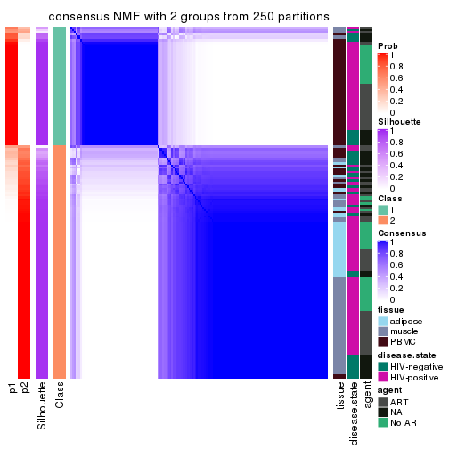</p>

</div>
<div id='tab-SD-NMF-consensus-heatmap-2'>
<pre><code class="r">consensus_heatmap(res, k = 3)
</code></pre>

<p>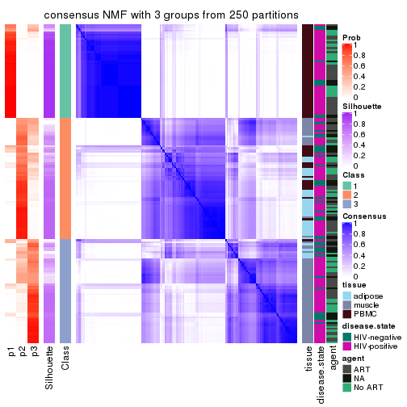</p>

</div>
<div id='tab-SD-NMF-consensus-heatmap-3'>
<pre><code class="r">consensus_heatmap(res, k = 4)
</code></pre>

<p>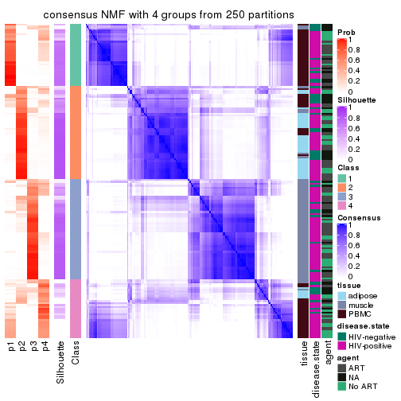</p>

</div>
<div id='tab-SD-NMF-consensus-heatmap-4'>
<pre><code class="r">consensus_heatmap(res, k = 5)
</code></pre>

<p>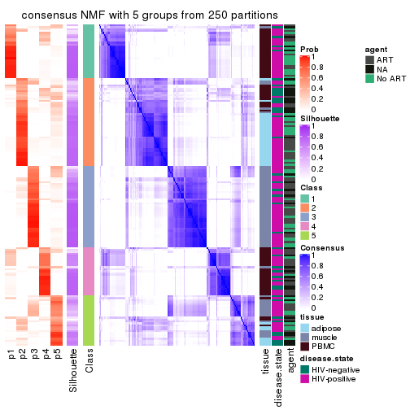</p>

</div>
<div id='tab-SD-NMF-consensus-heatmap-5'>
<pre><code class="r">consensus_heatmap(res, k = 6)
</code></pre>

<p>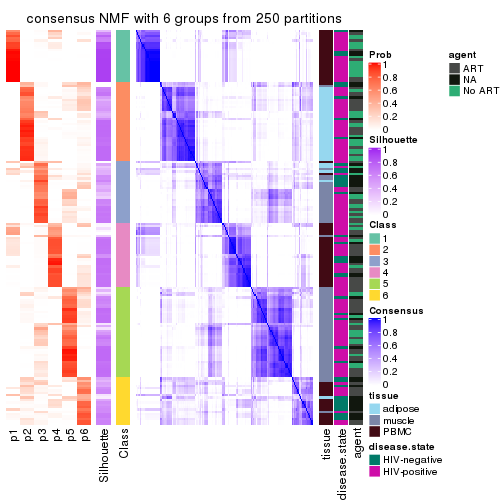</p>

</div>
</div>

Heatmaps for the membership of samples in all partitions to see how consistent they are:


<script>
$( function() {
	$( '#tabs-SD-NMF-membership-heatmap' ).tabs();
} );
</script>
<div id='tabs-SD-NMF-membership-heatmap'>
<ul>
<li><a href='#tab-SD-NMF-membership-heatmap-1'>k = 2</a></li>
<li><a href='#tab-SD-NMF-membership-heatmap-2'>k = 3</a></li>
<li><a href='#tab-SD-NMF-membership-heatmap-3'>k = 4</a></li>
<li><a href='#tab-SD-NMF-membership-heatmap-4'>k = 5</a></li>
<li><a href='#tab-SD-NMF-membership-heatmap-5'>k = 6</a></li>
</ul>
<div id='tab-SD-NMF-membership-heatmap-1'>
<pre><code class="r">membership_heatmap(res, k = 2)
</code></pre>

<p>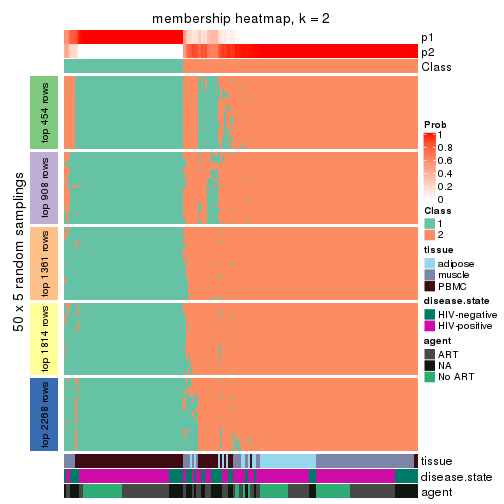</p>

</div>
<div id='tab-SD-NMF-membership-heatmap-2'>
<pre><code class="r">membership_heatmap(res, k = 3)
</code></pre>

<p>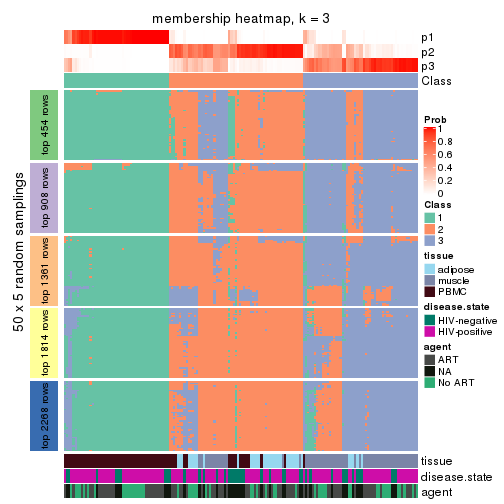</p>

</div>
<div id='tab-SD-NMF-membership-heatmap-3'>
<pre><code class="r">membership_heatmap(res, k = 4)
</code></pre>

<p>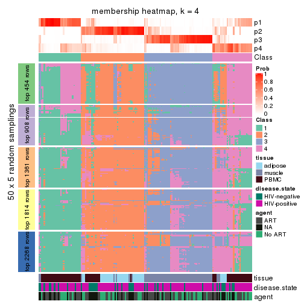</p>

</div>
<div id='tab-SD-NMF-membership-heatmap-4'>
<pre><code class="r">membership_heatmap(res, k = 5)
</code></pre>

<p>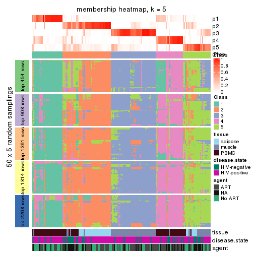</p>

</div>
<div id='tab-SD-NMF-membership-heatmap-5'>
<pre><code class="r">membership_heatmap(res, k = 6)
</code></pre>

<p>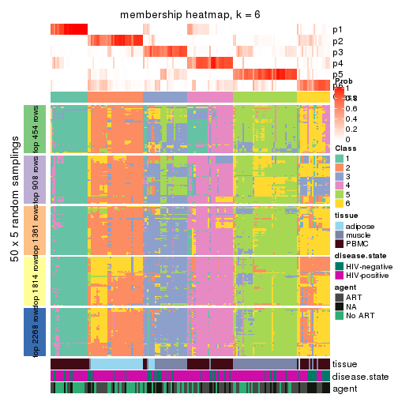</p>

</div>
</div>

As soon as we have had the classes for columns, we can look for signatures
which are significantly different between classes which can be candidate marks
for certain classes. Following are the heatmaps for signatures.


Signature heatmaps where rows are scaled:


<script>
$( function() {
	$( '#tabs-SD-NMF-get-signatures' ).tabs();
} );
</script>
<div id='tabs-SD-NMF-get-signatures'>
<ul>
<li><a href='#tab-SD-NMF-get-signatures-1'>k = 2</a></li>
<li><a href='#tab-SD-NMF-get-signatures-2'>k = 3</a></li>
<li><a href='#tab-SD-NMF-get-signatures-3'>k = 4</a></li>
<li><a href='#tab-SD-NMF-get-signatures-4'>k = 5</a></li>
<li><a href='#tab-SD-NMF-get-signatures-5'>k = 6</a></li>
</ul>
<div id='tab-SD-NMF-get-signatures-1'>
<pre><code class="r">get_signatures(res, k = 2)
</code></pre>

<p>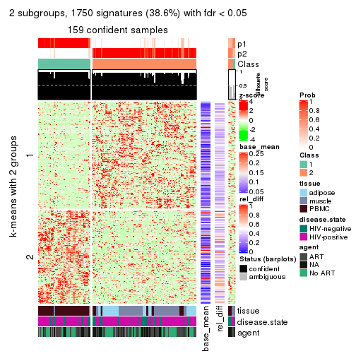</p>

</div>
<div id='tab-SD-NMF-get-signatures-2'>
<pre><code class="r">get_signatures(res, k = 3)
</code></pre>

<p>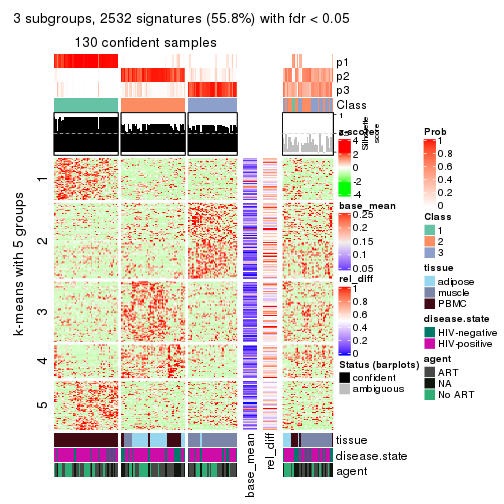</p>

</div>
<div id='tab-SD-NMF-get-signatures-3'>
<pre><code class="r">get_signatures(res, k = 4)
</code></pre>

<p>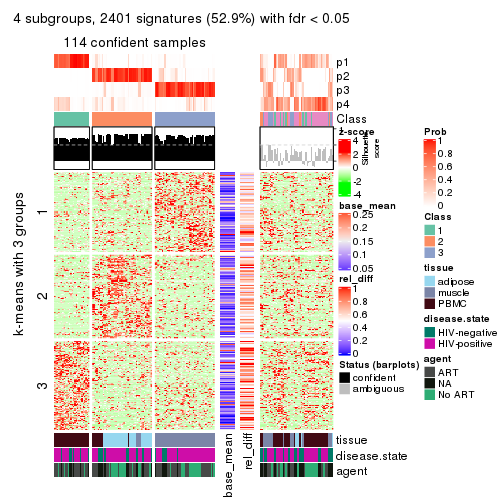</p>

</div>
<div id='tab-SD-NMF-get-signatures-4'>
<pre><code class="r">get_signatures(res, k = 5)
</code></pre>

<p>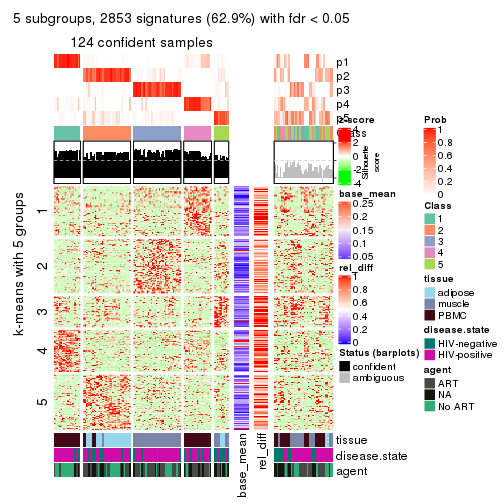</p>

</div>
<div id='tab-SD-NMF-get-signatures-5'>
<pre><code class="r">get_signatures(res, k = 6)
</code></pre>

<p>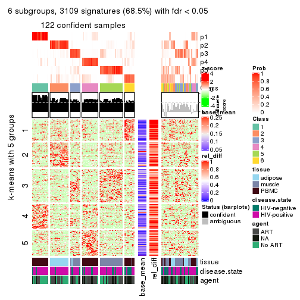</p>

</div>
</div>


Signature heatmaps where rows are not scaled:


<script>
$( function() {
	$( '#tabs-SD-NMF-get-signatures-no-scale' ).tabs();
} );
</script>
<div id='tabs-SD-NMF-get-signatures-no-scale'>
<ul>
<li><a href='#tab-SD-NMF-get-signatures-no-scale-1'>k = 2</a></li>
<li><a href='#tab-SD-NMF-get-signatures-no-scale-2'>k = 3</a></li>
<li><a href='#tab-SD-NMF-get-signatures-no-scale-3'>k = 4</a></li>
<li><a href='#tab-SD-NMF-get-signatures-no-scale-4'>k = 5</a></li>
<li><a href='#tab-SD-NMF-get-signatures-no-scale-5'>k = 6</a></li>
</ul>
<div id='tab-SD-NMF-get-signatures-no-scale-1'>
<pre><code class="r">get_signatures(res, k = 2, scale_rows = FALSE)
</code></pre>

<p>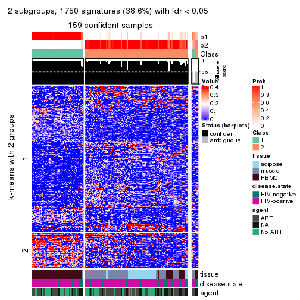</p>

</div>
<div id='tab-SD-NMF-get-signatures-no-scale-2'>
<pre><code class="r">get_signatures(res, k = 3, scale_rows = FALSE)
</code></pre>

<p>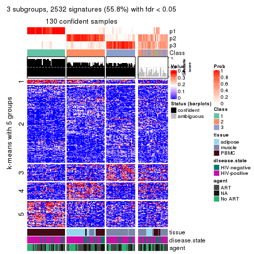</p>

</div>
<div id='tab-SD-NMF-get-signatures-no-scale-3'>
<pre><code class="r">get_signatures(res, k = 4, scale_rows = FALSE)
</code></pre>

<p>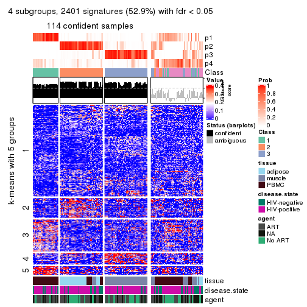</p>

</div>
<div id='tab-SD-NMF-get-signatures-no-scale-4'>
<pre><code class="r">get_signatures(res, k = 5, scale_rows = FALSE)
</code></pre>

<p>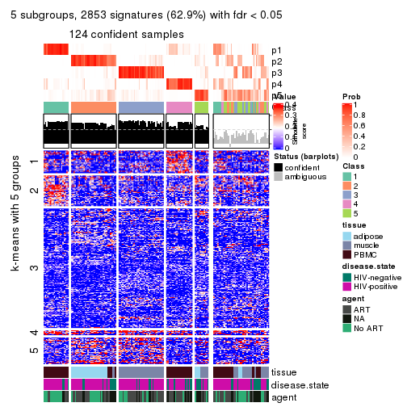</p>

</div>
<div id='tab-SD-NMF-get-signatures-no-scale-5'>
<pre><code class="r">get_signatures(res, k = 6, scale_rows = FALSE)
</code></pre>

<p>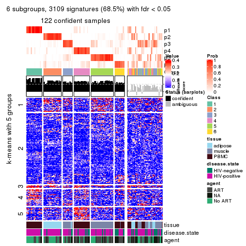</p>

</div>
</div>


Compare the overlap of signatures from different k:

```r
compare_signatures(res)
```

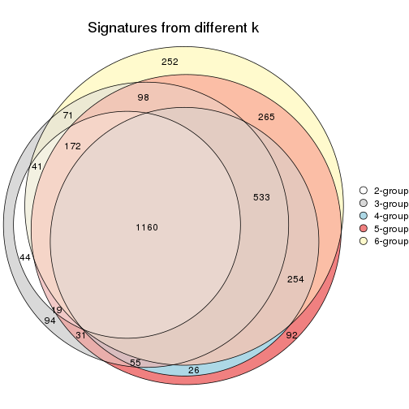

`get_signature()` returns a data frame invisibly. TO get the list of signatures, the function
call should be assigned to a variable explicitly. In following code, if `plot` argument is set
to `FALSE`, no heatmap is plotted while only the differential analysis is performed.

```r
# code only for demonstration
tb = get_signature(res, k = ..., plot = FALSE)
```

An example of the output of `tb` is:

```
#>   which_row         fdr    mean_1    mean_2 scaled_mean_1 scaled_mean_2 km
#> 1        38 0.042760348  8.373488  9.131774    -0.5533452     0.5164555  1
#> 2        40 0.018707592  7.106213  8.469186    -0.6173731     0.5762149  1
#> 3        55 0.019134737 10.221463 11.207825    -0.6159697     0.5749050  1
#> 4        59 0.006059896  5.921854  7.869574    -0.6899429     0.6439467  1
#> 5        60 0.018055526  8.928898 10.211722    -0.6204761     0.5791110  1
#> 6        98 0.009384629 15.714769 14.887706     0.6635654    -0.6193277  2
...
```

The columns in `tb` are:

1. `which_row`: row indices corresponding to the input matrix.
2. `fdr`: FDR for the differential test. 
3. `mean_x`: The mean value in group x.
4. `scaled_mean_x`: The mean value in group x after rows are scaled.
5. `km`: Row groups if k-means clustering is applied to rows.


UMAP plot which shows how samples are separated.


<script>
$( function() {
	$( '#tabs-SD-NMF-dimension-reduction' ).tabs();
} );
</script>
<div id='tabs-SD-NMF-dimension-reduction'>
<ul>
<li><a href='#tab-SD-NMF-dimension-reduction-1'>k = 2</a></li>
<li><a href='#tab-SD-NMF-dimension-reduction-2'>k = 3</a></li>
<li><a href='#tab-SD-NMF-dimension-reduction-3'>k = 4</a></li>
<li><a href='#tab-SD-NMF-dimension-reduction-4'>k = 5</a></li>
<li><a href='#tab-SD-NMF-dimension-reduction-5'>k = 6</a></li>
</ul>
<div id='tab-SD-NMF-dimension-reduction-1'>
<pre><code class="r">dimension_reduction(res, k = 2, method = &quot;UMAP&quot;)
</code></pre>

<p>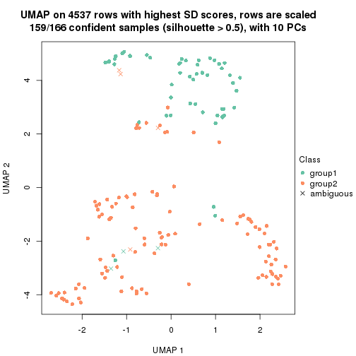</p>

</div>
<div id='tab-SD-NMF-dimension-reduction-2'>
<pre><code class="r">dimension_reduction(res, k = 3, method = &quot;UMAP&quot;)
</code></pre>

<p>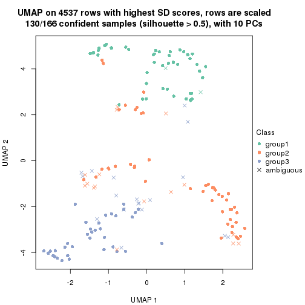</p>

</div>
<div id='tab-SD-NMF-dimension-reduction-3'>
<pre><code class="r">dimension_reduction(res, k = 4, method = &quot;UMAP&quot;)
</code></pre>

<p>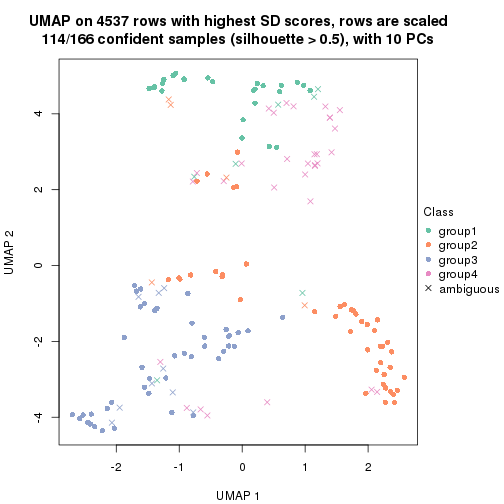</p>

</div>
<div id='tab-SD-NMF-dimension-reduction-4'>
<pre><code class="r">dimension_reduction(res, k = 5, method = &quot;UMAP&quot;)
</code></pre>

<p>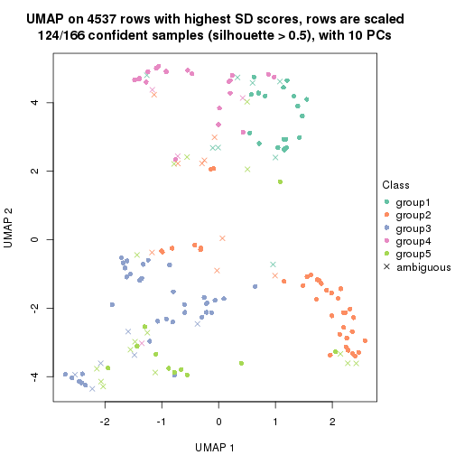</p>

</div>
<div id='tab-SD-NMF-dimension-reduction-5'>
<pre><code class="r">dimension_reduction(res, k = 6, method = &quot;UMAP&quot;)
</code></pre>

<p>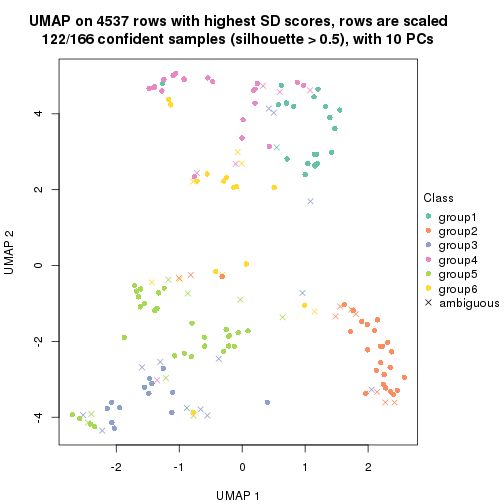</p>

</div>
</div>


Following heatmap shows how subgroups are split when increasing `k`:

```r
collect_classes(res)
```

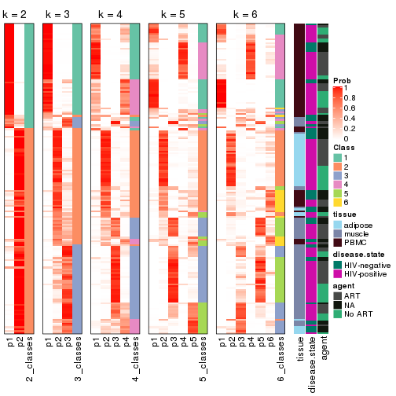


Test correlation between subgroups and known annotations. If the known
annotation is numeric, one-way ANOVA test is applied, and if the known
annotation is discrete, chi-squared contingency table test is applied.

```r
test_to_known_factors(res)
```

```
#>          n tissue(p) disease.state(p) agent(p) k
#> SD:NMF 159  3.05e-23           0.7401  0.85578 2
#> SD:NMF 130  1.33e-34           0.2005  0.44938 3
#> SD:NMF 114  4.55e-34           0.3791  0.25153 4
#> SD:NMF 124  1.55e-37           0.0630  0.00196 5
#> SD:NMF 122  3.01e-44           0.0171  0.00109 6
```


If matrix rows can be associated to genes, consider to use `GO_Enrichment(res,
...)` to perform function enrichment for the signature genes.


 

---------------------------------------------------


### CV:hclust


The object with results only for a single top-value method and a single partition method 
can be extracted as:

```r
res = res_list["CV", "hclust"]
# you can also extract it by
# res = res_list["CV:hclust"]
```

A summary of `res` and all the functions that can be applied to it:

```r
res
```

```
#> A 'ConsensusPartition' object with k = 2, 3, 4, 5, 6.
#>   On a matrix with 4537 rows and 166 columns.
#>   Top rows (454, 908, 1361, 1814, 2268) are extracted by 'CV' method.
#>   Subgroups are detected by 'hclust' method.
#>   Performed in total 1250 partitions by row resampling.
#>   Best k for subgroups seems to be 3.
#> 
#> Following methods can be applied to this 'ConsensusPartition' object:
#>  [1] "cola_report"             "collect_classes"         "collect_plots"          
#>  [4] "collect_stats"           "colnames"                "compare_signatures"     
#>  [7] "consensus_heatmap"       "dimension_reduction"     "functional_enrichment"  
#> [10] "get_anno_col"            "get_anno"                "get_classes"            
#> [13] "get_consensus"           "get_matrix"              "get_membership"         
#> [16] "get_param"               "get_signatures"          "get_stats"              
#> [19] "is_best_k"               "is_stable_k"             "membership_heatmap"     
#> [22] "ncol"                    "nrow"                    "plot_ecdf"              
#> [25] "rownames"                "select_partition_number" "show"                   
#> [28] "suggest_best_k"          "test_to_known_factors"
```

`collect_plots()` function collects all the plots made from `res` for all `k` (number of partitions)
into one single page to provide an easy and fast comparison between different `k`.

```r
collect_plots(res)
```

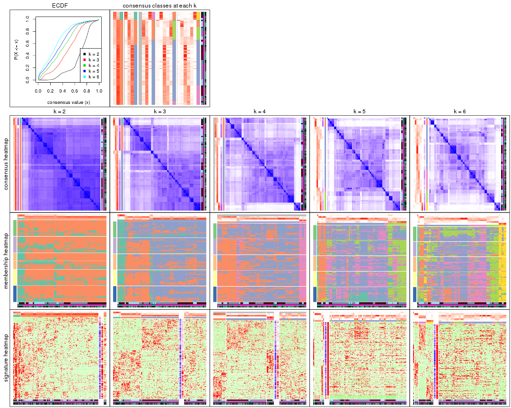

The plots are:

- The first row: a plot of the ECDF (Empirical cumulative distribution
  function) curves of the consensus matrix for each `k` and the heatmap of
  predicted classes for each `k`.
- The second row: heatmaps of the consensus matrix for each `k`.
- The third row: heatmaps of the membership matrix for each `k`.
- The fouth row: heatmaps of the signatures for each `k`.

All the plots in panels can be made by individual functions and they are
plotted later in this section.

`select_partition_number()` produces several plots showing different
statistics for choosing "optimized" `k`. There are following statistics:

- ECDF curves of the consensus matrix for each `k`;
- 1-PAC. [The PAC
  score](https://en.wikipedia.org/wiki/Consensus_clustering#Over-interpretation_potential_of_consensus_clustering)
  measures the proportion of the ambiguous subgrouping.
- Mean silhouette score.
- Concordance. The mean probability of fiting the consensus class ids in all
  partitions.
- Area increased. Denote $A_k$ as the area under the ECDF curve for current
  `k`, the area increased is defined as $A_k - A_{k-1}$.
- Rand index. The percent of pairs of samples that are both in a same cluster
  or both are not in a same cluster in the partition of k and k-1.
- Jaccard index. The ratio of pairs of samples are both in a same cluster in
  the partition of k and k-1 and the pairs of samples are both in a same
  cluster in the partition k or k-1.

The detailed explanations of these statistics can be found in [the cola
vignette](http://bioconductor.org/packages/devel/bioc/vignettes/cola/inst/doc/cola.html#toc_13).

Generally speaking, lower PAC score, higher mean silhouette score or higher
concordance corresponds to better partition. Rand index and Jaccard index
measure how similar the current partition is compared to partition with `k-1`.
If they are too similar, we won't accept `k` is better than `k-1`.

```r
select_partition_number(res)
```

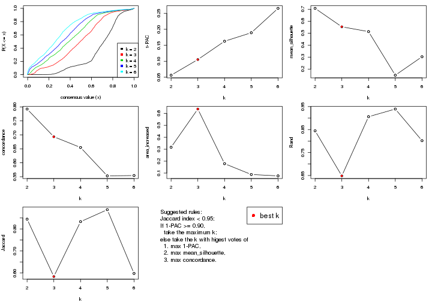

The numeric values for all these statistics can be obtained by `get_stats()`.

```r
get_stats(res)
```

```
#>   k  1-PAC mean_silhouette concordance area_increased  Rand Jaccard
#> 2 2 0.0563           0.707       0.792         0.3165 0.845   0.845
#> 3 3 0.1053           0.553       0.693         0.6366 0.648   0.584
#> 4 4 0.1627           0.513       0.655         0.1790 0.906   0.833
#> 5 5 0.1893           0.149       0.553         0.0885 0.939   0.888
#> 6 6 0.2656           0.303       0.554         0.0769 0.802   0.598
```

`suggest_best_k()` suggests the best $k$ based on these statistics. The rules are as follows:

- All $k$ with Jaccard index larger than 0.95 are removed because the increase of
  the partition number does not provides enough extra information. If all $k$ are removed,
  the best $k$ is assigned by `NA`.
- For $k$ with 1-PAC larger than 0.9, the maximal $k$ is taken as the "best k". Other $k$ is called "optional k".
- If it does not fit the second rule. The $k$ with the highest vote of highest
  1-PAC, mean silhouette and concordance is taken as the "best k".

```r
suggest_best_k(res)
```

```
#> [1] 3
```


Following shows the table of the partitions (You need to click the **show/hide
code output** link to see it). The membership matrix (columns with name `p*`)
is inferred by
[`clue::cl_consensus()`](https://www.rdocumentation.org/link/cl_consensus?package=clue)
function with the `SE` method. Basically the value in the membership matrix
represents the probability to belong to a certain group. The finall class
label for an item is determined with the group with highest probability it
belongs to.

In `get_classes()` function, the entropy is calculated from the membership
matrix and the silhouette score is calculated from the consensus matrix.


<script>
$( function() {
	$( '#tabs-CV-hclust-get-classes' ).tabs();
} );
</script>
<div id='tabs-CV-hclust-get-classes'>
<ul>
<li><a href='#tab-CV-hclust-get-classes-1'>k = 2</a></li>
<li><a href='#tab-CV-hclust-get-classes-2'>k = 3</a></li>
<li><a href='#tab-CV-hclust-get-classes-3'>k = 4</a></li>
<li><a href='#tab-CV-hclust-get-classes-4'>k = 5</a></li>
<li><a href='#tab-CV-hclust-get-classes-5'>k = 6</a></li>
</ul>

<div id='tab-CV-hclust-get-classes-1'>
<p><a id='tab-CV-hclust-get-classes-1-a' style='color:#0366d6' href='#'>show/hide code output</a></p>
<pre><code class="r">cbind(get_classes(res, k = 2), get_membership(res, k = 2))
</code></pre>

<pre><code>#&gt;           class entropy silhouette    p1    p2
#&gt; GSM751298     2   0.615      0.775 0.152 0.848
#&gt; GSM751304     1   0.767      0.830 0.776 0.224
#&gt; GSM751305     1   0.767      0.830 0.776 0.224
#&gt; GSM751307     1   0.866      0.861 0.712 0.288
#&gt; GSM751310     2   0.552      0.742 0.128 0.872
#&gt; GSM751314     2   0.469      0.746 0.100 0.900
#&gt; GSM751316     2   0.574      0.736 0.136 0.864
#&gt; GSM751318     2   0.494      0.761 0.108 0.892
#&gt; GSM751342     2   0.552      0.754 0.128 0.872
#&gt; GSM751346     2   0.563      0.749 0.132 0.868
#&gt; GSM751347     2   0.563      0.748 0.132 0.868
#&gt; GSM751348     2   0.855      0.666 0.280 0.720
#&gt; GSM751349     2   0.855      0.666 0.280 0.720
#&gt; GSM751352     1   0.881      0.819 0.700 0.300
#&gt; GSM751353     1   0.881      0.819 0.700 0.300
#&gt; GSM751354     1   0.760      0.829 0.780 0.220
#&gt; GSM751355     1   0.760      0.829 0.780 0.220
#&gt; GSM751358     2   0.891      0.647 0.308 0.692
#&gt; GSM751359     2   0.891      0.647 0.308 0.692
#&gt; GSM751294     2   0.866      0.667 0.288 0.712
#&gt; GSM751296     2   0.625      0.775 0.156 0.844
#&gt; GSM751297     2   0.584      0.748 0.140 0.860
#&gt; GSM751299     2   0.917      0.579 0.332 0.668
#&gt; GSM751300     2   0.584      0.754 0.140 0.860
#&gt; GSM751301     1   0.895      0.865 0.688 0.312
#&gt; GSM751302     2   0.552      0.752 0.128 0.872
#&gt; GSM751303     2   0.494      0.738 0.108 0.892
#&gt; GSM751306     2   0.494      0.738 0.108 0.892
#&gt; GSM751308     2   0.680      0.748 0.180 0.820
#&gt; GSM751309     2   0.482      0.739 0.104 0.896
#&gt; GSM751311     2   0.482      0.739 0.104 0.896
#&gt; GSM751312     2   0.574      0.736 0.136 0.864
#&gt; GSM751313     2   0.482      0.757 0.104 0.896
#&gt; GSM751315     2   0.552      0.742 0.128 0.872
#&gt; GSM751317     2   0.552      0.745 0.128 0.872
#&gt; GSM751320     2   0.416      0.767 0.084 0.916
#&gt; GSM751321     2   0.584      0.733 0.140 0.860
#&gt; GSM751322     2   0.402      0.767 0.080 0.920
#&gt; GSM751324     2   0.430      0.769 0.088 0.912
#&gt; GSM751325     2   0.416      0.769 0.084 0.916
#&gt; GSM751332     2   0.430      0.766 0.088 0.912
#&gt; GSM751334     2   0.430      0.766 0.088 0.912
#&gt; GSM751339     2   0.506      0.769 0.112 0.888
#&gt; GSM751341     2   0.552      0.754 0.128 0.872
#&gt; GSM751343     2   0.482      0.762 0.104 0.896
#&gt; GSM751344     1   0.891      0.867 0.692 0.308
#&gt; GSM751345     1   0.891      0.867 0.692 0.308
#&gt; GSM751356     2   0.917      0.587 0.332 0.668
#&gt; GSM751357     2   0.917      0.587 0.332 0.668
#&gt; GSM751293     1   0.895      0.865 0.688 0.312
#&gt; GSM751295     2   0.552      0.752 0.128 0.872
#&gt; GSM751319     2   0.563      0.739 0.132 0.868
#&gt; GSM751323     2   0.402      0.768 0.080 0.920
#&gt; GSM751326     2   0.430      0.768 0.088 0.912
#&gt; GSM751327     2   0.456      0.769 0.096 0.904
#&gt; GSM751328     2   0.469      0.764 0.100 0.900
#&gt; GSM751329     2   0.584      0.770 0.140 0.860
#&gt; GSM751330     2   0.529      0.752 0.120 0.880
#&gt; GSM751331     2   0.541      0.749 0.124 0.876
#&gt; GSM751333     2   0.541      0.749 0.124 0.876
#&gt; GSM751335     2   0.529      0.752 0.120 0.880
#&gt; GSM751336     2   0.541      0.749 0.124 0.876
#&gt; GSM751337     2   0.506      0.769 0.112 0.888
#&gt; GSM751338     2   0.506      0.769 0.112 0.888
#&gt; GSM751340     2   0.861      0.672 0.284 0.716
#&gt; GSM751350     2   0.552      0.752 0.128 0.872
#&gt; GSM751351     2   0.552      0.752 0.128 0.872
#&gt; GSM751362     2   0.541      0.759 0.124 0.876
#&gt; GSM751363     2   0.706      0.728 0.192 0.808
#&gt; GSM751367     2   0.662      0.727 0.172 0.828
#&gt; GSM751368     2   0.563      0.769 0.132 0.868
#&gt; GSM751371     2   0.584      0.753 0.140 0.860
#&gt; GSM751375     2   0.855      0.665 0.280 0.720
#&gt; GSM751376     2   0.978      0.110 0.412 0.588
#&gt; GSM751378     2   0.850      0.686 0.276 0.724
#&gt; GSM751379     2   0.978      0.110 0.412 0.588
#&gt; GSM751382     2   0.866      0.658 0.288 0.712
#&gt; GSM751386     2   0.839      0.688 0.268 0.732
#&gt; GSM751388     2   0.839      0.687 0.268 0.732
#&gt; GSM751391     2   0.662      0.760 0.172 0.828
#&gt; GSM751410     2   0.595      0.732 0.144 0.856
#&gt; GSM751414     2   0.518      0.771 0.116 0.884
#&gt; GSM751361     2   0.625      0.770 0.156 0.844
#&gt; GSM751365     2   0.518      0.770 0.116 0.884
#&gt; GSM751366     2   0.529      0.768 0.120 0.880
#&gt; GSM751369     2   0.574      0.757 0.136 0.864
#&gt; GSM751370     2   0.541      0.759 0.124 0.876
#&gt; GSM751372     2   0.494      0.769 0.108 0.892
#&gt; GSM751373     2   0.469      0.769 0.100 0.900
#&gt; GSM751374     2   0.978      0.110 0.412 0.588
#&gt; GSM751377     2   0.644      0.760 0.164 0.836
#&gt; GSM751380     2   0.529      0.759 0.120 0.880
#&gt; GSM751381     2   0.855      0.667 0.280 0.720
#&gt; GSM751383     2   0.788      0.725 0.236 0.764
#&gt; GSM751384     2   0.844      0.669 0.272 0.728
#&gt; GSM751385     2   0.871      0.700 0.292 0.708
#&gt; GSM751387     2   0.861      0.658 0.284 0.716
#&gt; GSM751389     2   0.574      0.759 0.136 0.864
#&gt; GSM751393     2   0.978      0.112 0.412 0.588
#&gt; GSM751394     2   0.855      0.661 0.280 0.720
#&gt; GSM751395     2   0.978      0.112 0.412 0.588
#&gt; GSM751397     2   0.855      0.661 0.280 0.720
#&gt; GSM751398     2   0.821      0.703 0.256 0.744
#&gt; GSM751404     2   0.518      0.763 0.116 0.884
#&gt; GSM751406     2   0.714      0.721 0.196 0.804
#&gt; GSM751411     2   0.671      0.776 0.176 0.824
#&gt; GSM751413     2   0.595      0.748 0.144 0.856
#&gt; GSM751415     2   0.584      0.753 0.140 0.860
#&gt; GSM751416     2   0.625      0.765 0.156 0.844
#&gt; GSM751417     2   0.625      0.765 0.156 0.844
#&gt; GSM751421     2   0.584      0.753 0.140 0.860
#&gt; GSM751422     2   0.584      0.753 0.140 0.860
#&gt; GSM751360     2   0.541      0.760 0.124 0.876
#&gt; GSM751364     2   0.625      0.767 0.156 0.844
#&gt; GSM751390     2   0.844      0.669 0.272 0.728
#&gt; GSM751392     2   0.861      0.661 0.284 0.716
#&gt; GSM751396     2   0.861      0.663 0.284 0.716
#&gt; GSM751399     2   0.625      0.760 0.156 0.844
#&gt; GSM751400     2   0.722      0.721 0.200 0.800
#&gt; GSM751401     2   0.722      0.721 0.200 0.800
#&gt; GSM751402     2   0.722      0.721 0.200 0.800
#&gt; GSM751403     2   0.680      0.740 0.180 0.820
#&gt; GSM751405     2   0.714      0.721 0.196 0.804
#&gt; GSM751407     2   0.722      0.721 0.200 0.800
#&gt; GSM751408     2   0.584      0.757 0.140 0.860
#&gt; GSM751409     2   0.680      0.761 0.180 0.820
#&gt; GSM751412     2   0.584      0.757 0.140 0.860
#&gt; GSM751418     2   0.469      0.772 0.100 0.900
#&gt; GSM751419     2   0.469      0.772 0.100 0.900
#&gt; GSM751420     2   0.767      0.716 0.224 0.776
#&gt; GSM751425     2   0.904      0.620 0.320 0.680
#&gt; GSM751429     2   0.745      0.696 0.212 0.788
#&gt; GSM751430     1   0.981      0.675 0.580 0.420
#&gt; GSM751433     2   0.866      0.647 0.288 0.712
#&gt; GSM751437     2   0.827      0.663 0.260 0.740
#&gt; GSM751448     2   0.775      0.676 0.228 0.772
#&gt; GSM751451     2   0.866      0.647 0.288 0.712
#&gt; GSM751423     2   0.839      0.708 0.268 0.732
#&gt; GSM751424     2   0.925      0.506 0.340 0.660
#&gt; GSM751428     2   0.844      0.703 0.272 0.728
#&gt; GSM751431     2   0.866      0.647 0.288 0.712
#&gt; GSM751432     1   0.981      0.675 0.580 0.420
#&gt; GSM751434     1   0.981      0.675 0.580 0.420
#&gt; GSM751435     2   0.745      0.748 0.212 0.788
#&gt; GSM751436     2   0.866      0.647 0.288 0.712
#&gt; GSM751440     2   0.753      0.746 0.216 0.784
#&gt; GSM751444     2   0.895      0.643 0.312 0.688
#&gt; GSM751446     2   0.760      0.745 0.220 0.780
#&gt; GSM751449     2   0.917      0.630 0.332 0.668
#&gt; GSM751450     2   0.844      0.703 0.272 0.728
#&gt; GSM751452     2   0.925      0.506 0.340 0.660
#&gt; GSM751426     2   0.871      0.646 0.292 0.708
#&gt; GSM751427     2   0.844      0.703 0.272 0.728
#&gt; GSM751438     2   0.895      0.646 0.312 0.688
#&gt; GSM751439     2   0.788      0.740 0.236 0.764
#&gt; GSM751441     2   0.900      0.629 0.316 0.684
#&gt; GSM751442     2   0.814      0.732 0.252 0.748
#&gt; GSM751443     2   0.775      0.683 0.228 0.772
#&gt; GSM751445     2   0.917      0.630 0.332 0.668
#&gt; GSM751447     2   0.900      0.629 0.316 0.684
#&gt; GSM751453     2   0.900      0.629 0.316 0.684
#&gt; GSM751454     2   0.900      0.629 0.316 0.684
#&gt; GSM751455     2   0.814      0.732 0.252 0.748
#&gt; GSM751456     2   0.814      0.732 0.252 0.748
#&gt; GSM751457     2   0.909      0.628 0.324 0.676
#&gt; GSM751458     2   0.909      0.628 0.324 0.676
</code></pre>

<script>
$('#tab-CV-hclust-get-classes-1-a').parent().next().next().hide();
$('#tab-CV-hclust-get-classes-1-a').click(function(){
  $('#tab-CV-hclust-get-classes-1-a').parent().next().next().toggle();
  return(false);
});
</script>
</div>

<div id='tab-CV-hclust-get-classes-2'>
<p><a id='tab-CV-hclust-get-classes-2-a' style='color:#0366d6' href='#'>show/hide code output</a></p>
<pre><code class="r">cbind(get_classes(res, k = 3), get_membership(res, k = 3))
</code></pre>

<pre><code>#&gt;           class entropy silhouette    p1    p2    p3
#&gt; GSM751298     3   0.668     0.4760 0.024 0.324 0.652
#&gt; GSM751304     1   0.298     0.8322 0.920 0.024 0.056
#&gt; GSM751305     1   0.298     0.8322 0.920 0.024 0.056
#&gt; GSM751307     1   0.499     0.8536 0.836 0.112 0.052
#&gt; GSM751310     3   0.611     0.5997 0.048 0.192 0.760
#&gt; GSM751314     3   0.644     0.5974 0.048 0.220 0.732
#&gt; GSM751316     3   0.626     0.5915 0.052 0.196 0.752
#&gt; GSM751318     3   0.658     0.3632 0.012 0.380 0.608
#&gt; GSM751342     3   0.685     0.4070 0.020 0.380 0.600
#&gt; GSM751346     3   0.441     0.6076 0.016 0.140 0.844
#&gt; GSM751347     3   0.420     0.6071 0.012 0.136 0.852
#&gt; GSM751348     2   0.573     0.7425 0.024 0.760 0.216
#&gt; GSM751349     2   0.573     0.7425 0.024 0.760 0.216
#&gt; GSM751352     1   0.687     0.7918 0.724 0.196 0.080
#&gt; GSM751353     1   0.687     0.7918 0.724 0.196 0.080
#&gt; GSM751354     1   0.301     0.8315 0.920 0.028 0.052
#&gt; GSM751355     1   0.301     0.8315 0.920 0.028 0.052
#&gt; GSM751358     2   0.668     0.6380 0.048 0.708 0.244
#&gt; GSM751359     2   0.668     0.6380 0.048 0.708 0.244
#&gt; GSM751294     3   0.898    -0.3534 0.128 0.432 0.440
#&gt; GSM751296     3   0.596     0.5399 0.016 0.264 0.720
#&gt; GSM751297     3   0.454     0.6090 0.016 0.148 0.836
#&gt; GSM751299     2   0.951     0.3589 0.188 0.428 0.384
#&gt; GSM751300     3   0.487     0.6085 0.024 0.152 0.824
#&gt; GSM751301     1   0.559     0.8582 0.808 0.124 0.068
#&gt; GSM751302     3   0.426     0.6088 0.012 0.140 0.848
#&gt; GSM751303     3   0.632     0.5952 0.040 0.228 0.732
#&gt; GSM751306     3   0.632     0.5952 0.040 0.228 0.732
#&gt; GSM751308     3   0.796     0.1720 0.064 0.392 0.544
#&gt; GSM751309     3   0.644     0.5919 0.040 0.240 0.720
#&gt; GSM751311     3   0.644     0.5919 0.040 0.240 0.720
#&gt; GSM751312     3   0.626     0.5915 0.052 0.196 0.752
#&gt; GSM751313     3   0.312     0.6378 0.000 0.108 0.892
#&gt; GSM751315     3   0.611     0.5967 0.048 0.192 0.760
#&gt; GSM751317     3   0.630     0.5970 0.048 0.208 0.744
#&gt; GSM751320     3   0.586     0.6112 0.024 0.228 0.748
#&gt; GSM751321     3   0.621     0.5912 0.048 0.200 0.752
#&gt; GSM751322     3   0.594     0.6099 0.028 0.224 0.748
#&gt; GSM751324     3   0.650     0.5169 0.020 0.316 0.664
#&gt; GSM751325     3   0.617     0.5231 0.012 0.308 0.680
#&gt; GSM751332     3   0.628     0.4412 0.012 0.324 0.664
#&gt; GSM751334     3   0.628     0.4412 0.012 0.324 0.664
#&gt; GSM751339     3   0.525     0.6116 0.020 0.188 0.792
#&gt; GSM751341     3   0.681     0.4251 0.020 0.372 0.608
#&gt; GSM751343     3   0.642     0.3819 0.008 0.376 0.616
#&gt; GSM751344     1   0.550     0.8589 0.812 0.124 0.064
#&gt; GSM751345     1   0.550     0.8589 0.812 0.124 0.064
#&gt; GSM751356     2   0.943     0.3504 0.176 0.424 0.400
#&gt; GSM751357     2   0.943     0.3504 0.176 0.424 0.400
#&gt; GSM751293     1   0.559     0.8582 0.808 0.124 0.068
#&gt; GSM751295     3   0.426     0.6088 0.012 0.140 0.848
#&gt; GSM751319     3   0.621     0.5946 0.052 0.192 0.756
#&gt; GSM751323     3   0.618     0.5897 0.024 0.260 0.716
#&gt; GSM751326     3   0.617     0.4595 0.012 0.308 0.680
#&gt; GSM751327     3   0.631     0.4623 0.012 0.328 0.660
#&gt; GSM751328     3   0.652     0.4377 0.016 0.340 0.644
#&gt; GSM751329     3   0.546     0.6095 0.020 0.204 0.776
#&gt; GSM751330     3   0.406     0.6150 0.012 0.128 0.860
#&gt; GSM751331     3   0.392     0.6129 0.012 0.120 0.868
#&gt; GSM751333     3   0.392     0.6145 0.012 0.120 0.868
#&gt; GSM751335     3   0.406     0.6150 0.012 0.128 0.860
#&gt; GSM751336     3   0.392     0.6129 0.012 0.120 0.868
#&gt; GSM751337     3   0.525     0.6116 0.020 0.188 0.792
#&gt; GSM751338     3   0.525     0.6116 0.020 0.188 0.792
#&gt; GSM751340     3   0.903    -0.3407 0.132 0.428 0.440
#&gt; GSM751350     3   0.426     0.6088 0.012 0.140 0.848
#&gt; GSM751351     3   0.426     0.6088 0.012 0.140 0.848
#&gt; GSM751362     3   0.455     0.6370 0.024 0.132 0.844
#&gt; GSM751363     3   0.780     0.5651 0.112 0.228 0.660
#&gt; GSM751367     3   0.547     0.6014 0.040 0.160 0.800
#&gt; GSM751368     3   0.733     0.3683 0.040 0.364 0.596
#&gt; GSM751371     3   0.653     0.5926 0.036 0.260 0.704
#&gt; GSM751375     2   0.560     0.7425 0.020 0.764 0.216
#&gt; GSM751376     3   0.915     0.1332 0.384 0.148 0.468
#&gt; GSM751378     2   0.593     0.7112 0.008 0.696 0.296
#&gt; GSM751379     3   0.915     0.1332 0.384 0.148 0.468
#&gt; GSM751382     2   0.555     0.7417 0.020 0.768 0.212
#&gt; GSM751386     2   0.632     0.7185 0.024 0.700 0.276
#&gt; GSM751388     2   0.603     0.7238 0.016 0.712 0.272
#&gt; GSM751391     3   0.764     0.4700 0.056 0.352 0.592
#&gt; GSM751410     3   0.445     0.6407 0.032 0.112 0.856
#&gt; GSM751414     3   0.607     0.5834 0.028 0.236 0.736
#&gt; GSM751361     3   0.729     0.3800 0.040 0.356 0.604
#&gt; GSM751365     3   0.558     0.6178 0.036 0.176 0.788
#&gt; GSM751366     3   0.619     0.5956 0.040 0.216 0.744
#&gt; GSM751369     3   0.639     0.6287 0.048 0.216 0.736
#&gt; GSM751370     3   0.455     0.6370 0.024 0.132 0.844
#&gt; GSM751372     3   0.530     0.6295 0.036 0.156 0.808
#&gt; GSM751373     3   0.599     0.6042 0.036 0.208 0.756
#&gt; GSM751374     3   0.915     0.1332 0.384 0.148 0.468
#&gt; GSM751377     3   0.715     0.0652 0.024 0.444 0.532
#&gt; GSM751380     3   0.606     0.6162 0.048 0.188 0.764
#&gt; GSM751381     2   0.558     0.7418 0.012 0.748 0.240
#&gt; GSM751383     2   0.647     0.5270 0.008 0.604 0.388
#&gt; GSM751384     2   0.554     0.7421 0.008 0.740 0.252
#&gt; GSM751385     2   0.718     0.5276 0.032 0.592 0.376
#&gt; GSM751387     2   0.577     0.7444 0.020 0.748 0.232
#&gt; GSM751389     3   0.585     0.6059 0.040 0.188 0.772
#&gt; GSM751393     3   0.923     0.1195 0.384 0.156 0.460
#&gt; GSM751394     2   0.564     0.7406 0.016 0.752 0.232
#&gt; GSM751395     3   0.923     0.1195 0.384 0.156 0.460
#&gt; GSM751397     2   0.582     0.7444 0.020 0.744 0.236
#&gt; GSM751398     2   0.634     0.6815 0.016 0.672 0.312
#&gt; GSM751404     3   0.629     0.5869 0.044 0.216 0.740
#&gt; GSM751406     3   0.579     0.5956 0.060 0.148 0.792
#&gt; GSM751411     3   0.682     0.3518 0.024 0.348 0.628
#&gt; GSM751413     3   0.706     0.6105 0.076 0.220 0.704
#&gt; GSM751415     3   0.580     0.6016 0.040 0.184 0.776
#&gt; GSM751416     3   0.708     0.3462 0.032 0.356 0.612
#&gt; GSM751417     3   0.708     0.3462 0.032 0.356 0.612
#&gt; GSM751421     3   0.653     0.5926 0.036 0.260 0.704
#&gt; GSM751422     3   0.653     0.5926 0.036 0.260 0.704
#&gt; GSM751360     3   0.652     0.6208 0.048 0.228 0.724
#&gt; GSM751364     3   0.704     0.3592 0.032 0.348 0.620
#&gt; GSM751390     2   0.554     0.7421 0.008 0.740 0.252
#&gt; GSM751392     2   0.560     0.7430 0.020 0.764 0.216
#&gt; GSM751396     2   0.564     0.7451 0.020 0.760 0.220
#&gt; GSM751399     3   0.676     0.5320 0.048 0.252 0.700
#&gt; GSM751400     3   0.585     0.5925 0.060 0.152 0.788
#&gt; GSM751401     3   0.579     0.5950 0.060 0.148 0.792
#&gt; GSM751402     3   0.585     0.5925 0.060 0.152 0.788
#&gt; GSM751403     3   0.572     0.6070 0.052 0.156 0.792
#&gt; GSM751405     3   0.579     0.5956 0.060 0.148 0.792
#&gt; GSM751407     3   0.579     0.5950 0.060 0.148 0.792
#&gt; GSM751408     3   0.658     0.5789 0.052 0.224 0.724
#&gt; GSM751409     3   0.723     0.4763 0.048 0.312 0.640
#&gt; GSM751412     3   0.658     0.5789 0.052 0.224 0.724
#&gt; GSM751418     3   0.600     0.6025 0.040 0.200 0.760
#&gt; GSM751419     3   0.600     0.6025 0.040 0.200 0.760
#&gt; GSM751420     3   0.659     0.5817 0.076 0.180 0.744
#&gt; GSM751425     2   0.554     0.6992 0.024 0.776 0.200
#&gt; GSM751429     3   0.650     0.5148 0.056 0.208 0.736
#&gt; GSM751430     1   0.830     0.6241 0.632 0.172 0.196
#&gt; GSM751433     2   0.766     0.6761 0.064 0.612 0.324
#&gt; GSM751437     3   0.699     0.4544 0.056 0.256 0.688
#&gt; GSM751448     3   0.638     0.5396 0.076 0.164 0.760
#&gt; GSM751451     2   0.764     0.6797 0.064 0.616 0.320
#&gt; GSM751423     2   0.781     0.4563 0.052 0.516 0.432
#&gt; GSM751424     2   0.959     0.5021 0.244 0.476 0.280
#&gt; GSM751428     2   0.788     0.4659 0.056 0.516 0.428
#&gt; GSM751431     2   0.764     0.6772 0.064 0.616 0.320
#&gt; GSM751432     1   0.830     0.6241 0.632 0.172 0.196
#&gt; GSM751434     1   0.830     0.6241 0.632 0.172 0.196
#&gt; GSM751435     3   0.708     0.1271 0.028 0.380 0.592
#&gt; GSM751436     2   0.766     0.6761 0.064 0.612 0.324
#&gt; GSM751440     3   0.725     0.1303 0.036 0.368 0.596
#&gt; GSM751444     2   0.795     0.6838 0.084 0.608 0.308
#&gt; GSM751446     3   0.742     0.1045 0.040 0.388 0.572
#&gt; GSM751449     2   0.786     0.6973 0.088 0.628 0.284
#&gt; GSM751450     2   0.790     0.4537 0.056 0.508 0.436
#&gt; GSM751452     2   0.959     0.5021 0.244 0.476 0.280
#&gt; GSM751426     2   0.783     0.6820 0.076 0.612 0.312
#&gt; GSM751427     2   0.788     0.4659 0.056 0.516 0.428
#&gt; GSM751438     2   0.653     0.6921 0.036 0.704 0.260
#&gt; GSM751439     3   0.762     0.1077 0.048 0.392 0.560
#&gt; GSM751441     2   0.580     0.7074 0.028 0.760 0.212
#&gt; GSM751442     3   0.782     0.0685 0.056 0.400 0.544
#&gt; GSM751443     3   0.621     0.5553 0.068 0.164 0.768
#&gt; GSM751445     2   0.786     0.6973 0.088 0.628 0.284
#&gt; GSM751447     2   0.580     0.7074 0.028 0.760 0.212
#&gt; GSM751453     2   0.580     0.7074 0.028 0.760 0.212
#&gt; GSM751454     2   0.580     0.7074 0.028 0.760 0.212
#&gt; GSM751455     3   0.782     0.0685 0.056 0.400 0.544
#&gt; GSM751456     3   0.782     0.0685 0.056 0.400 0.544
#&gt; GSM751457     2   0.592     0.6937 0.032 0.756 0.212
#&gt; GSM751458     2   0.592     0.6937 0.032 0.756 0.212
</code></pre>

<script>
$('#tab-CV-hclust-get-classes-2-a').parent().next().next().hide();
$('#tab-CV-hclust-get-classes-2-a').click(function(){
  $('#tab-CV-hclust-get-classes-2-a').parent().next().next().toggle();
  return(false);
});
</script>
</div>

<div id='tab-CV-hclust-get-classes-3'>
<p><a id='tab-CV-hclust-get-classes-3-a' style='color:#0366d6' href='#'>show/hide code output</a></p>
<pre><code class="r">cbind(get_classes(res, k = 4), get_membership(res, k = 4))
</code></pre>

<pre><code>#&gt;           class entropy silhouette p1    p2    p3    p4
#&gt; GSM751298     3   0.665     0.4938 NA 0.172 0.624 0.000
#&gt; GSM751304     4   0.196     0.8209 NA 0.008 0.020 0.944
#&gt; GSM751305     4   0.196     0.8209 NA 0.008 0.020 0.944
#&gt; GSM751307     4   0.339     0.8373 NA 0.068 0.028 0.884
#&gt; GSM751310     3   0.561     0.5733 NA 0.020 0.664 0.016
#&gt; GSM751314     3   0.573     0.5714 NA 0.020 0.656 0.020
#&gt; GSM751316     3   0.574     0.5575 NA 0.016 0.640 0.020
#&gt; GSM751318     3   0.691     0.4666 NA 0.188 0.592 0.000
#&gt; GSM751342     3   0.722     0.4490 NA 0.176 0.532 0.000
#&gt; GSM751346     3   0.359     0.5923 NA 0.040 0.856 0.000
#&gt; GSM751347     3   0.359     0.5917 NA 0.040 0.856 0.000
#&gt; GSM751348     2   0.553     0.6848 NA 0.756 0.156 0.024
#&gt; GSM751349     2   0.553     0.6848 NA 0.756 0.156 0.024
#&gt; GSM751352     4   0.595     0.7490 NA 0.192 0.056 0.720
#&gt; GSM751353     4   0.595     0.7490 NA 0.192 0.056 0.720
#&gt; GSM751354     4   0.217     0.8221 NA 0.008 0.024 0.936
#&gt; GSM751355     4   0.217     0.8221 NA 0.008 0.024 0.936
#&gt; GSM751358     2   0.680     0.3540 NA 0.540 0.064 0.016
#&gt; GSM751359     2   0.680     0.3540 NA 0.540 0.064 0.016
#&gt; GSM751294     3   0.891     0.0244 NA 0.280 0.460 0.096
#&gt; GSM751296     3   0.581     0.5513 NA 0.140 0.708 0.000
#&gt; GSM751297     3   0.385     0.5939 NA 0.044 0.840 0.000
#&gt; GSM751299     3   0.957    -0.0883 NA 0.280 0.380 0.164
#&gt; GSM751300     3   0.415     0.5963 NA 0.056 0.824 0.000
#&gt; GSM751301     4   0.419     0.8461 NA 0.088 0.048 0.844
#&gt; GSM751302     3   0.349     0.5940 NA 0.044 0.864 0.000
#&gt; GSM751303     3   0.561     0.5631 NA 0.016 0.648 0.016
#&gt; GSM751306     3   0.561     0.5631 NA 0.016 0.648 0.016
#&gt; GSM751308     3   0.822     0.3816 NA 0.208 0.540 0.056
#&gt; GSM751309     3   0.599     0.5613 NA 0.032 0.632 0.016
#&gt; GSM751311     3   0.599     0.5613 NA 0.032 0.632 0.016
#&gt; GSM751312     3   0.574     0.5575 NA 0.016 0.640 0.020
#&gt; GSM751313     3   0.390     0.6263 NA 0.036 0.832 0.000
#&gt; GSM751315     3   0.573     0.5699 NA 0.020 0.656 0.020
#&gt; GSM751317     3   0.578     0.5693 NA 0.020 0.648 0.020
#&gt; GSM751320     3   0.547     0.6018 NA 0.044 0.712 0.008
#&gt; GSM751321     3   0.565     0.5571 NA 0.016 0.640 0.016
#&gt; GSM751322     3   0.542     0.6004 NA 0.040 0.712 0.008
#&gt; GSM751324     3   0.665     0.5460 NA 0.132 0.628 0.004
#&gt; GSM751325     3   0.653     0.5540 NA 0.132 0.644 0.004
#&gt; GSM751332     3   0.620     0.5195 NA 0.160 0.672 0.000
#&gt; GSM751334     3   0.620     0.5195 NA 0.160 0.672 0.000
#&gt; GSM751339     3   0.541     0.6135 NA 0.076 0.756 0.012
#&gt; GSM751341     3   0.721     0.4659 NA 0.172 0.532 0.000
#&gt; GSM751343     3   0.687     0.4816 NA 0.180 0.596 0.000
#&gt; GSM751344     4   0.413     0.8467 NA 0.084 0.048 0.848
#&gt; GSM751345     4   0.413     0.8467 NA 0.084 0.048 0.848
#&gt; GSM751356     3   0.954    -0.0588 NA 0.272 0.388 0.152
#&gt; GSM751357     3   0.954    -0.0588 NA 0.272 0.388 0.152
#&gt; GSM751293     4   0.419     0.8461 NA 0.088 0.048 0.844
#&gt; GSM751295     3   0.349     0.5940 NA 0.044 0.864 0.000
#&gt; GSM751319     3   0.580     0.5633 NA 0.020 0.644 0.020
#&gt; GSM751323     3   0.578     0.5932 NA 0.072 0.696 0.004
#&gt; GSM751326     3   0.604     0.5287 NA 0.156 0.688 0.000
#&gt; GSM751327     3   0.620     0.5329 NA 0.168 0.672 0.000
#&gt; GSM751328     3   0.647     0.5111 NA 0.168 0.644 0.000
#&gt; GSM751329     3   0.510     0.5978 NA 0.100 0.764 0.000
#&gt; GSM751330     3   0.335     0.6001 NA 0.044 0.872 0.000
#&gt; GSM751331     3   0.327     0.5967 NA 0.040 0.876 0.000
#&gt; GSM751333     3   0.322     0.5981 NA 0.044 0.880 0.000
#&gt; GSM751335     3   0.335     0.6001 NA 0.044 0.872 0.000
#&gt; GSM751336     3   0.327     0.5967 NA 0.040 0.876 0.000
#&gt; GSM751337     3   0.541     0.6135 NA 0.076 0.756 0.012
#&gt; GSM751338     3   0.541     0.6135 NA 0.076 0.756 0.012
#&gt; GSM751340     3   0.886     0.0590 NA 0.268 0.472 0.096
#&gt; GSM751350     3   0.349     0.5940 NA 0.044 0.864 0.000
#&gt; GSM751351     3   0.349     0.5940 NA 0.044 0.864 0.000
#&gt; GSM751362     3   0.456     0.6190 NA 0.032 0.800 0.012
#&gt; GSM751363     3   0.739     0.5629 NA 0.052 0.616 0.104
#&gt; GSM751367     3   0.540     0.5895 NA 0.032 0.700 0.008
#&gt; GSM751368     3   0.739     0.4677 NA 0.184 0.592 0.020
#&gt; GSM751371     3   0.669     0.5619 NA 0.096 0.604 0.008
#&gt; GSM751375     2   0.434     0.6919 NA 0.816 0.144 0.020
#&gt; GSM751376     3   0.844     0.1213 NA 0.036 0.412 0.360
#&gt; GSM751378     2   0.585     0.6606 NA 0.680 0.236 0.000
#&gt; GSM751379     3   0.844     0.1213 NA 0.036 0.412 0.360
#&gt; GSM751382     2   0.413     0.6904 NA 0.828 0.136 0.020
#&gt; GSM751386     2   0.577     0.6626 NA 0.692 0.236 0.004
#&gt; GSM751388     2   0.550     0.6712 NA 0.708 0.224 0.000
#&gt; GSM751391     3   0.772     0.4751 NA 0.160 0.540 0.024
#&gt; GSM751410     3   0.479     0.6260 NA 0.020 0.752 0.008
#&gt; GSM751414     3   0.647     0.5823 NA 0.100 0.668 0.016
#&gt; GSM751361     3   0.749     0.4652 NA 0.188 0.588 0.024
#&gt; GSM751365     3   0.539     0.6095 NA 0.076 0.764 0.016
#&gt; GSM751366     3   0.593     0.5982 NA 0.108 0.732 0.020
#&gt; GSM751369     3   0.613     0.6119 NA 0.056 0.676 0.020
#&gt; GSM751370     3   0.446     0.6198 NA 0.028 0.804 0.012
#&gt; GSM751372     3   0.503     0.6193 NA 0.056 0.784 0.016
#&gt; GSM751373     3   0.575     0.6043 NA 0.096 0.740 0.016
#&gt; GSM751374     3   0.844     0.1213 NA 0.036 0.412 0.360
#&gt; GSM751377     3   0.767     0.2637 NA 0.308 0.508 0.012
#&gt; GSM751380     3   0.558     0.6020 NA 0.056 0.740 0.020
#&gt; GSM751381     2   0.467     0.7069 NA 0.780 0.168 0.000
#&gt; GSM751383     2   0.672     0.4579 NA 0.560 0.332 0.000
#&gt; GSM751384     2   0.463     0.7082 NA 0.780 0.172 0.000
#&gt; GSM751385     2   0.774     0.4318 NA 0.484 0.332 0.012
#&gt; GSM751387     2   0.496     0.7100 NA 0.776 0.168 0.012
#&gt; GSM751389     3   0.585     0.5856 NA 0.084 0.732 0.020
#&gt; GSM751393     3   0.857     0.1143 NA 0.044 0.404 0.360
#&gt; GSM751394     2   0.478     0.7054 NA 0.784 0.164 0.008
#&gt; GSM751395     3   0.857     0.1143 NA 0.044 0.404 0.360
#&gt; GSM751397     2   0.442     0.7086 NA 0.796 0.160 0.000
#&gt; GSM751398     2   0.611     0.6168 NA 0.652 0.256 0.000
#&gt; GSM751404     3   0.617     0.5875 NA 0.104 0.720 0.028
#&gt; GSM751406     3   0.598     0.5625 NA 0.064 0.712 0.024
#&gt; GSM751411     3   0.741     0.4167 NA 0.236 0.556 0.008
#&gt; GSM751413     3   0.687     0.5980 NA 0.048 0.628 0.056
#&gt; GSM751415     3   0.587     0.5812 NA 0.080 0.728 0.020
#&gt; GSM751416     3   0.758     0.4365 NA 0.212 0.568 0.020
#&gt; GSM751417     3   0.758     0.4365 NA 0.212 0.568 0.020
#&gt; GSM751421     3   0.669     0.5619 NA 0.096 0.604 0.008
#&gt; GSM751422     3   0.669     0.5619 NA 0.096 0.604 0.008
#&gt; GSM751360     3   0.635     0.6072 NA 0.052 0.648 0.024
#&gt; GSM751364     3   0.758     0.4435 NA 0.208 0.568 0.020
#&gt; GSM751390     2   0.463     0.7082 NA 0.780 0.172 0.000
#&gt; GSM751392     2   0.418     0.6901 NA 0.824 0.140 0.020
#&gt; GSM751396     2   0.411     0.6962 NA 0.824 0.144 0.020
#&gt; GSM751399     3   0.686     0.5446 NA 0.136 0.660 0.028
#&gt; GSM751400     3   0.602     0.5596 NA 0.064 0.708 0.024
#&gt; GSM751401     3   0.595     0.5621 NA 0.060 0.712 0.024
#&gt; GSM751402     3   0.602     0.5596 NA 0.064 0.708 0.024
#&gt; GSM751403     3   0.573     0.5820 NA 0.060 0.740 0.028
#&gt; GSM751405     3   0.598     0.5625 NA 0.064 0.712 0.024
#&gt; GSM751407     3   0.595     0.5621 NA 0.060 0.712 0.024
#&gt; GSM751408     3   0.648     0.5713 NA 0.108 0.692 0.028
#&gt; GSM751409     3   0.734     0.4820 NA 0.176 0.612 0.028
#&gt; GSM751412     3   0.648     0.5713 NA 0.108 0.692 0.028
#&gt; GSM751418     3   0.573     0.6038 NA 0.088 0.744 0.020
#&gt; GSM751419     3   0.573     0.6038 NA 0.088 0.744 0.020
#&gt; GSM751420     3   0.644     0.5608 NA 0.068 0.660 0.024
#&gt; GSM751425     2   0.632     0.6580 NA 0.696 0.152 0.016
#&gt; GSM751429     3   0.629     0.5009 NA 0.060 0.584 0.004
#&gt; GSM751430     4   0.695     0.6264 NA 0.104 0.192 0.660
#&gt; GSM751433     2   0.852     0.3352 NA 0.416 0.364 0.048
#&gt; GSM751437     3   0.705     0.4318 NA 0.124 0.544 0.004
#&gt; GSM751448     3   0.646     0.5281 NA 0.056 0.624 0.020
#&gt; GSM751451     2   0.851     0.3512 NA 0.424 0.356 0.048
#&gt; GSM751423     3   0.819    -0.0828 NA 0.364 0.424 0.024
#&gt; GSM751424     3   0.982    -0.2656 NA 0.284 0.304 0.248
#&gt; GSM751428     3   0.821    -0.0951 NA 0.364 0.420 0.024
#&gt; GSM751431     2   0.854     0.3356 NA 0.416 0.360 0.048
#&gt; GSM751432     4   0.695     0.6264 NA 0.104 0.192 0.660
#&gt; GSM751434     4   0.695     0.6264 NA 0.104 0.192 0.660
#&gt; GSM751435     3   0.726     0.3312 NA 0.272 0.588 0.024
#&gt; GSM751436     2   0.852     0.3352 NA 0.416 0.364 0.048
#&gt; GSM751440     3   0.690     0.3428 NA 0.264 0.608 0.012
#&gt; GSM751444     2   0.861     0.3723 NA 0.432 0.340 0.056
#&gt; GSM751446     3   0.720     0.3256 NA 0.276 0.576 0.012
#&gt; GSM751449     2   0.824     0.4776 NA 0.500 0.308 0.056
#&gt; GSM751450     3   0.817    -0.0896 NA 0.364 0.428 0.024
#&gt; GSM751452     3   0.982    -0.2656 NA 0.284 0.304 0.248
#&gt; GSM751426     2   0.861     0.3590 NA 0.424 0.344 0.052
#&gt; GSM751427     3   0.821    -0.0951 NA 0.364 0.420 0.024
#&gt; GSM751438     2   0.673     0.6277 NA 0.648 0.196 0.012
#&gt; GSM751439     3   0.734     0.3219 NA 0.276 0.568 0.016
#&gt; GSM751441     2   0.629     0.6612 NA 0.692 0.164 0.012
#&gt; GSM751442     3   0.721     0.2973 NA 0.296 0.564 0.012
#&gt; GSM751443     3   0.641     0.5518 NA 0.064 0.648 0.020
#&gt; GSM751445     2   0.824     0.4776 NA 0.500 0.308 0.056
#&gt; GSM751447     2   0.629     0.6612 NA 0.692 0.164 0.012
#&gt; GSM751453     2   0.624     0.6630 NA 0.696 0.164 0.012
#&gt; GSM751454     2   0.624     0.6630 NA 0.696 0.164 0.012
#&gt; GSM751455     3   0.721     0.2973 NA 0.296 0.564 0.012
#&gt; GSM751456     3   0.721     0.2973 NA 0.296 0.564 0.012
#&gt; GSM751457     2   0.638     0.6504 NA 0.684 0.164 0.012
#&gt; GSM751458     2   0.638     0.6504 NA 0.684 0.164 0.012
</code></pre>

<script>
$('#tab-CV-hclust-get-classes-3-a').parent().next().next().hide();
$('#tab-CV-hclust-get-classes-3-a').click(function(){
  $('#tab-CV-hclust-get-classes-3-a').parent().next().next().toggle();
  return(false);
});
</script>
</div>

<div id='tab-CV-hclust-get-classes-4'>
<p><a id='tab-CV-hclust-get-classes-4-a' style='color:#0366d6' href='#'>show/hide code output</a></p>
<pre><code class="r">cbind(get_classes(res, k = 5), get_membership(res, k = 5))
</code></pre>

<pre><code>#&gt;           class entropy silhouette    p1    p2    p3    p4    p5
#&gt; GSM751298     3   0.658   0.021892 0.032 0.000 0.576 0.236 0.156
#&gt; GSM751304     2   0.205   0.742366 0.048 0.924 0.004 0.024 0.000
#&gt; GSM751305     2   0.205   0.742366 0.048 0.924 0.004 0.024 0.000
#&gt; GSM751307     2   0.266   0.766695 0.028 0.904 0.008 0.012 0.048
#&gt; GSM751310     3   0.535  -0.355090 0.036 0.000 0.520 0.436 0.008
#&gt; GSM751314     3   0.505  -0.411183 0.024 0.000 0.500 0.472 0.004
#&gt; GSM751316     3   0.526  -0.367781 0.036 0.000 0.492 0.468 0.004
#&gt; GSM751318     3   0.685  -0.117270 0.024 0.000 0.476 0.340 0.160
#&gt; GSM751342     4   0.701   0.168298 0.032 0.000 0.400 0.416 0.152
#&gt; GSM751346     3   0.210   0.223547 0.028 0.000 0.928 0.020 0.024
#&gt; GSM751347     3   0.210   0.224928 0.028 0.000 0.928 0.020 0.024
#&gt; GSM751348     5   0.536   0.444975 0.048 0.040 0.128 0.032 0.752
#&gt; GSM751349     5   0.536   0.444975 0.048 0.040 0.128 0.032 0.752
#&gt; GSM751352     2   0.581   0.634769 0.056 0.704 0.032 0.032 0.176
#&gt; GSM751353     2   0.581   0.634769 0.056 0.704 0.032 0.032 0.176
#&gt; GSM751354     2   0.236   0.741443 0.052 0.912 0.012 0.024 0.000
#&gt; GSM751355     2   0.236   0.741443 0.052 0.912 0.012 0.024 0.000
#&gt; GSM751358     1   0.565   1.000000 0.616 0.004 0.008 0.072 0.300
#&gt; GSM751359     1   0.565   1.000000 0.616 0.004 0.008 0.072 0.300
#&gt; GSM751294     3   0.893  -0.002201 0.080 0.068 0.372 0.240 0.240
#&gt; GSM751296     3   0.533   0.168770 0.024 0.000 0.716 0.144 0.116
#&gt; GSM751297     3   0.245   0.217597 0.028 0.000 0.912 0.032 0.028
#&gt; GSM751299     3   0.952  -0.108341 0.080 0.152 0.284 0.248 0.236
#&gt; GSM751300     3   0.298   0.214954 0.024 0.000 0.884 0.056 0.036
#&gt; GSM751301     2   0.296   0.779269 0.024 0.884 0.016 0.004 0.072
#&gt; GSM751302     3   0.189   0.225858 0.024 0.000 0.936 0.012 0.028
#&gt; GSM751303     3   0.491  -0.426291 0.024 0.000 0.492 0.484 0.000
#&gt; GSM751306     3   0.491  -0.426291 0.024 0.000 0.492 0.484 0.000
#&gt; GSM751308     3   0.816  -0.042749 0.036 0.056 0.424 0.308 0.176
#&gt; GSM751309     4   0.523   0.364026 0.028 0.000 0.476 0.488 0.008
#&gt; GSM751311     4   0.523   0.364026 0.028 0.000 0.476 0.488 0.008
#&gt; GSM751312     3   0.526  -0.367781 0.036 0.000 0.492 0.468 0.004
#&gt; GSM751313     3   0.351   0.147437 0.016 0.000 0.832 0.132 0.020
#&gt; GSM751315     3   0.536  -0.362683 0.036 0.000 0.508 0.448 0.008
#&gt; GSM751317     3   0.536  -0.367311 0.036 0.000 0.500 0.456 0.008
#&gt; GSM751320     3   0.523  -0.283319 0.016 0.000 0.576 0.384 0.024
#&gt; GSM751321     3   0.532  -0.368060 0.040 0.000 0.492 0.464 0.004
#&gt; GSM751322     3   0.517  -0.304032 0.016 0.000 0.568 0.396 0.020
#&gt; GSM751324     3   0.639  -0.239996 0.020 0.000 0.496 0.380 0.104
#&gt; GSM751325     3   0.640  -0.217928 0.020 0.000 0.508 0.364 0.108
#&gt; GSM751332     3   0.639  -0.066049 0.020 0.000 0.560 0.288 0.132
#&gt; GSM751334     3   0.639  -0.066049 0.020 0.000 0.560 0.288 0.132
#&gt; GSM751339     3   0.511   0.074181 0.028 0.000 0.688 0.248 0.036
#&gt; GSM751341     3   0.689  -0.266681 0.028 0.000 0.428 0.400 0.144
#&gt; GSM751343     3   0.680  -0.118484 0.024 0.000 0.484 0.340 0.152
#&gt; GSM751344     2   0.290   0.780186 0.024 0.888 0.016 0.004 0.068
#&gt; GSM751345     2   0.290   0.780186 0.024 0.888 0.016 0.004 0.068
#&gt; GSM751356     3   0.944  -0.080054 0.080 0.132 0.292 0.260 0.236
#&gt; GSM751357     3   0.944  -0.080054 0.080 0.132 0.292 0.260 0.236
#&gt; GSM751293     2   0.296   0.779269 0.024 0.884 0.016 0.004 0.072
#&gt; GSM751295     3   0.189   0.225858 0.024 0.000 0.936 0.012 0.028
#&gt; GSM751319     3   0.536  -0.367562 0.036 0.000 0.496 0.460 0.008
#&gt; GSM751323     3   0.568  -0.283870 0.016 0.000 0.556 0.376 0.052
#&gt; GSM751326     3   0.630  -0.052825 0.020 0.000 0.576 0.276 0.128
#&gt; GSM751327     3   0.625  -0.072008 0.012 0.000 0.564 0.288 0.136
#&gt; GSM751328     3   0.654  -0.093383 0.020 0.000 0.532 0.308 0.140
#&gt; GSM751329     3   0.394   0.180649 0.028 0.000 0.828 0.064 0.080
#&gt; GSM751330     3   0.161   0.218874 0.016 0.000 0.948 0.012 0.024
#&gt; GSM751331     3   0.160   0.222408 0.020 0.000 0.948 0.008 0.024
#&gt; GSM751333     3   0.150   0.220454 0.016 0.000 0.952 0.008 0.024
#&gt; GSM751335     3   0.161   0.218874 0.016 0.000 0.948 0.012 0.024
#&gt; GSM751336     3   0.160   0.222408 0.020 0.000 0.948 0.008 0.024
#&gt; GSM751337     3   0.511   0.074181 0.028 0.000 0.688 0.248 0.036
#&gt; GSM751338     3   0.511   0.074181 0.028 0.000 0.688 0.248 0.036
#&gt; GSM751340     3   0.886   0.029539 0.076 0.068 0.388 0.240 0.228
#&gt; GSM751350     3   0.189   0.225858 0.024 0.000 0.936 0.012 0.028
#&gt; GSM751351     3   0.189   0.225858 0.024 0.000 0.936 0.012 0.028
#&gt; GSM751362     3   0.412   0.122794 0.028 0.008 0.796 0.156 0.012
#&gt; GSM751363     3   0.761  -0.268917 0.064 0.092 0.476 0.336 0.032
#&gt; GSM751367     3   0.532  -0.096719 0.060 0.000 0.676 0.244 0.020
#&gt; GSM751368     3   0.749  -0.122321 0.048 0.012 0.448 0.348 0.144
#&gt; GSM751371     4   0.645   0.515356 0.060 0.004 0.428 0.468 0.040
#&gt; GSM751375     5   0.409   0.460413 0.024 0.020 0.116 0.020 0.820
#&gt; GSM751376     3   0.847  -0.012150 0.068 0.320 0.348 0.232 0.032
#&gt; GSM751378     5   0.619   0.461962 0.060 0.004 0.184 0.092 0.660
#&gt; GSM751379     3   0.847  -0.012150 0.068 0.320 0.348 0.232 0.032
#&gt; GSM751382     5   0.385   0.462007 0.020 0.020 0.120 0.012 0.828
#&gt; GSM751386     5   0.569   0.511315 0.036 0.004 0.204 0.072 0.684
#&gt; GSM751388     5   0.546   0.508572 0.040 0.004 0.196 0.056 0.704
#&gt; GSM751391     4   0.759   0.357396 0.072 0.016 0.348 0.456 0.108
#&gt; GSM751410     3   0.486  -0.147651 0.028 0.000 0.668 0.292 0.012
#&gt; GSM751414     3   0.647  -0.145027 0.048 0.004 0.544 0.340 0.064
#&gt; GSM751361     3   0.749  -0.109880 0.048 0.012 0.460 0.332 0.148
#&gt; GSM751365     3   0.521   0.078833 0.024 0.008 0.704 0.224 0.040
#&gt; GSM751366     3   0.587   0.063554 0.032 0.004 0.632 0.272 0.060
#&gt; GSM751369     3   0.605  -0.381647 0.044 0.012 0.524 0.400 0.020
#&gt; GSM751370     3   0.412   0.128321 0.028 0.008 0.796 0.156 0.012
#&gt; GSM751372     3   0.485   0.081767 0.024 0.008 0.740 0.196 0.032
#&gt; GSM751373     3   0.575   0.060661 0.032 0.004 0.648 0.260 0.056
#&gt; GSM751374     3   0.847  -0.012150 0.068 0.320 0.348 0.232 0.032
#&gt; GSM751377     3   0.776   0.000975 0.048 0.008 0.424 0.268 0.252
#&gt; GSM751380     3   0.549   0.086629 0.044 0.004 0.652 0.276 0.024
#&gt; GSM751381     5   0.359   0.487766 0.024 0.000 0.140 0.012 0.824
#&gt; GSM751383     5   0.694   0.436751 0.044 0.004 0.272 0.136 0.544
#&gt; GSM751384     5   0.396   0.482476 0.028 0.000 0.140 0.024 0.808
#&gt; GSM751385     5   0.829   0.365530 0.088 0.016 0.276 0.220 0.400
#&gt; GSM751387     5   0.407   0.498938 0.016 0.012 0.148 0.020 0.804
#&gt; GSM751389     3   0.572   0.101857 0.040 0.004 0.648 0.264 0.044
#&gt; GSM751393     3   0.849  -0.010697 0.068 0.320 0.340 0.240 0.032
#&gt; GSM751394     5   0.414   0.493463 0.016 0.008 0.140 0.032 0.804
#&gt; GSM751395     3   0.849  -0.010697 0.068 0.320 0.340 0.240 0.032
#&gt; GSM751397     5   0.369   0.483834 0.028 0.000 0.132 0.016 0.824
#&gt; GSM751398     5   0.618   0.488070 0.040 0.004 0.228 0.092 0.636
#&gt; GSM751404     3   0.608   0.089405 0.044 0.004 0.620 0.272 0.060
#&gt; GSM751406     3   0.598   0.092707 0.072 0.004 0.648 0.236 0.040
#&gt; GSM751411     3   0.749  -0.036516 0.060 0.004 0.480 0.280 0.176
#&gt; GSM751413     3   0.680  -0.352202 0.048 0.040 0.472 0.412 0.028
#&gt; GSM751415     3   0.570   0.094186 0.040 0.004 0.644 0.272 0.040
#&gt; GSM751416     3   0.754  -0.030670 0.048 0.012 0.472 0.300 0.168
#&gt; GSM751417     3   0.754  -0.030670 0.048 0.012 0.472 0.300 0.168
#&gt; GSM751421     4   0.645   0.515356 0.060 0.004 0.428 0.468 0.040
#&gt; GSM751422     4   0.645   0.515356 0.060 0.004 0.428 0.468 0.040
#&gt; GSM751360     3   0.644  -0.367939 0.048 0.016 0.488 0.416 0.032
#&gt; GSM751364     3   0.750  -0.037060 0.048 0.012 0.476 0.304 0.160
#&gt; GSM751390     5   0.396   0.482476 0.028 0.000 0.140 0.024 0.808
#&gt; GSM751392     5   0.395   0.458838 0.020 0.020 0.112 0.020 0.828
#&gt; GSM751396     5   0.408   0.471983 0.020 0.016 0.116 0.028 0.820
#&gt; GSM751399     3   0.689   0.082522 0.056 0.008 0.556 0.284 0.096
#&gt; GSM751400     3   0.601   0.093702 0.076 0.004 0.648 0.232 0.040
#&gt; GSM751401     3   0.598   0.095963 0.076 0.004 0.652 0.228 0.040
#&gt; GSM751402     3   0.603   0.092042 0.076 0.004 0.644 0.236 0.040
#&gt; GSM751403     3   0.573   0.110403 0.064 0.004 0.676 0.216 0.040
#&gt; GSM751405     3   0.598   0.092707 0.072 0.004 0.648 0.236 0.040
#&gt; GSM751407     3   0.598   0.095963 0.076 0.004 0.652 0.228 0.040
#&gt; GSM751408     3   0.633   0.096280 0.044 0.008 0.596 0.288 0.064
#&gt; GSM751409     3   0.707   0.036297 0.052 0.008 0.536 0.284 0.120
#&gt; GSM751412     3   0.633   0.096280 0.044 0.008 0.596 0.288 0.064
#&gt; GSM751418     3   0.573   0.046823 0.028 0.008 0.644 0.272 0.048
#&gt; GSM751419     3   0.573   0.046823 0.028 0.008 0.644 0.272 0.048
#&gt; GSM751420     3   0.621  -0.047698 0.060 0.004 0.592 0.300 0.044
#&gt; GSM751425     5   0.744   0.250403 0.196 0.008 0.084 0.168 0.544
#&gt; GSM751429     3   0.620  -0.121026 0.092 0.004 0.580 0.304 0.020
#&gt; GSM751430     2   0.611   0.555794 0.004 0.672 0.168 0.060 0.096
#&gt; GSM751433     5   0.806   0.253274 0.032 0.032 0.316 0.248 0.372
#&gt; GSM751437     3   0.730  -0.127663 0.128 0.004 0.528 0.260 0.080
#&gt; GSM751448     3   0.589  -0.026130 0.084 0.004 0.620 0.276 0.016
#&gt; GSM751451     5   0.807   0.270618 0.032 0.032 0.308 0.252 0.376
#&gt; GSM751423     3   0.786  -0.099595 0.048 0.012 0.392 0.220 0.328
#&gt; GSM751424     3   0.921  -0.212637 0.032 0.240 0.252 0.224 0.252
#&gt; GSM751428     3   0.787  -0.110430 0.048 0.012 0.388 0.224 0.328
#&gt; GSM751431     5   0.807   0.255594 0.032 0.032 0.312 0.252 0.372
#&gt; GSM751432     2   0.611   0.555794 0.004 0.672 0.168 0.060 0.096
#&gt; GSM751434     2   0.611   0.555794 0.004 0.672 0.168 0.060 0.096
#&gt; GSM751435     3   0.675   0.168168 0.016 0.016 0.564 0.148 0.256
#&gt; GSM751436     5   0.806   0.253274 0.032 0.032 0.316 0.248 0.372
#&gt; GSM751440     3   0.636   0.173576 0.016 0.004 0.588 0.140 0.252
#&gt; GSM751444     5   0.826   0.299476 0.040 0.040 0.308 0.236 0.376
#&gt; GSM751446     3   0.680   0.161408 0.032 0.004 0.560 0.160 0.244
#&gt; GSM751449     5   0.835   0.404291 0.064 0.040 0.284 0.192 0.420
#&gt; GSM751450     3   0.784  -0.105420 0.048 0.012 0.396 0.216 0.328
#&gt; GSM751452     3   0.921  -0.203206 0.032 0.240 0.256 0.224 0.248
#&gt; GSM751426     5   0.816   0.277763 0.032 0.040 0.304 0.244 0.380
#&gt; GSM751427     3   0.787  -0.110430 0.048 0.012 0.388 0.224 0.328
#&gt; GSM751438     5   0.769   0.271469 0.196 0.000 0.124 0.184 0.496
#&gt; GSM751439     3   0.666   0.166947 0.028 0.000 0.556 0.168 0.248
#&gt; GSM751441     5   0.739   0.275606 0.192 0.004 0.092 0.168 0.544
#&gt; GSM751442     3   0.651   0.152188 0.016 0.000 0.544 0.160 0.280
#&gt; GSM751443     3   0.578   0.041453 0.072 0.000 0.652 0.240 0.036
#&gt; GSM751445     5   0.835   0.404291 0.064 0.040 0.284 0.192 0.420
#&gt; GSM751447     5   0.739   0.275606 0.192 0.004 0.092 0.168 0.544
#&gt; GSM751453     5   0.736   0.280708 0.188 0.004 0.092 0.168 0.548
#&gt; GSM751454     5   0.736   0.280708 0.188 0.004 0.092 0.168 0.548
#&gt; GSM751455     3   0.651   0.152188 0.016 0.000 0.544 0.160 0.280
#&gt; GSM751456     3   0.651   0.152188 0.016 0.000 0.544 0.160 0.280
#&gt; GSM751457     5   0.748   0.226422 0.204 0.004 0.084 0.184 0.524
#&gt; GSM751458     5   0.748   0.226422 0.204 0.004 0.084 0.184 0.524
</code></pre>

<script>
$('#tab-CV-hclust-get-classes-4-a').parent().next().next().hide();
$('#tab-CV-hclust-get-classes-4-a').click(function(){
  $('#tab-CV-hclust-get-classes-4-a').parent().next().next().toggle();
  return(false);
});
</script>
</div>

<div id='tab-CV-hclust-get-classes-5'>
<p><a id='tab-CV-hclust-get-classes-5-a' style='color:#0366d6' href='#'>show/hide code output</a></p>
<pre><code class="r">cbind(get_classes(res, k = 6), get_membership(res, k = 6))
</code></pre>

<pre><code>#&gt;           class entropy silhouette    p1    p2    p3    p4    p5    p6
#&gt; GSM751298     3  0.6492     0.0468 0.016 0.088 0.556 0.256 0.084 0.000
#&gt; GSM751304     6  0.3001     0.7033 0.096 0.008 0.000 0.020 0.016 0.860
#&gt; GSM751305     6  0.3001     0.7033 0.096 0.008 0.000 0.020 0.016 0.860
#&gt; GSM751307     6  0.2195     0.7462 0.008 0.020 0.000 0.008 0.052 0.912
#&gt; GSM751310     4  0.4741     0.5349 0.012 0.004 0.356 0.600 0.028 0.000
#&gt; GSM751314     4  0.3909     0.5605 0.004 0.004 0.320 0.668 0.004 0.000
#&gt; GSM751316     4  0.4548     0.5418 0.012 0.004 0.320 0.640 0.024 0.000
#&gt; GSM751318     4  0.7336     0.2589 0.028 0.112 0.352 0.404 0.104 0.000
#&gt; GSM751342     4  0.6735     0.3853 0.020 0.100 0.268 0.528 0.084 0.000
#&gt; GSM751346     3  0.1140     0.3473 0.012 0.008 0.964 0.008 0.008 0.000
#&gt; GSM751347     3  0.0912     0.3479 0.012 0.004 0.972 0.004 0.008 0.000
#&gt; GSM751348     5  0.6940     0.4340 0.016 0.260 0.112 0.032 0.536 0.044
#&gt; GSM751349     5  0.6940     0.4340 0.016 0.260 0.112 0.032 0.536 0.044
#&gt; GSM751352     6  0.6244     0.6020 0.048 0.084 0.028 0.024 0.164 0.652
#&gt; GSM751353     6  0.6244     0.6020 0.048 0.084 0.028 0.024 0.164 0.652
#&gt; GSM751354     6  0.3239     0.6986 0.104 0.008 0.004 0.020 0.016 0.848
#&gt; GSM751355     6  0.3239     0.6986 0.104 0.008 0.004 0.020 0.016 0.848
#&gt; GSM751358     1  0.5358     1.0000 0.656 0.200 0.004 0.024 0.116 0.000
#&gt; GSM751359     1  0.5358     1.0000 0.656 0.200 0.004 0.024 0.116 0.000
#&gt; GSM751294     3  0.9052     0.0709 0.068 0.164 0.348 0.148 0.216 0.056
#&gt; GSM751296     3  0.5092     0.2372 0.008 0.064 0.716 0.148 0.064 0.000
#&gt; GSM751297     3  0.1713     0.3439 0.012 0.012 0.940 0.024 0.012 0.000
#&gt; GSM751299     3  0.9635    -0.0346 0.068 0.160 0.256 0.168 0.208 0.140
#&gt; GSM751300     3  0.2257     0.3377 0.008 0.020 0.912 0.044 0.016 0.000
#&gt; GSM751301     6  0.2392     0.7567 0.004 0.032 0.004 0.000 0.064 0.896
#&gt; GSM751302     3  0.0912     0.3455 0.008 0.004 0.972 0.004 0.012 0.000
#&gt; GSM751303     4  0.3861     0.5557 0.008 0.004 0.316 0.672 0.000 0.000
#&gt; GSM751306     4  0.3861     0.5557 0.008 0.004 0.316 0.672 0.000 0.000
#&gt; GSM751308     4  0.8509     0.0972 0.028 0.140 0.312 0.344 0.116 0.060
#&gt; GSM751309     4  0.4423     0.5554 0.008 0.024 0.312 0.652 0.004 0.000
#&gt; GSM751311     4  0.4423     0.5554 0.008 0.024 0.312 0.652 0.004 0.000
#&gt; GSM751312     4  0.4548     0.5418 0.012 0.004 0.320 0.640 0.024 0.000
#&gt; GSM751313     3  0.3906     0.2049 0.024 0.008 0.780 0.168 0.020 0.000
#&gt; GSM751315     4  0.4691     0.5461 0.012 0.004 0.340 0.616 0.028 0.000
#&gt; GSM751317     4  0.4767     0.5521 0.016 0.008 0.328 0.624 0.024 0.000
#&gt; GSM751320     4  0.5166     0.5004 0.016 0.020 0.420 0.524 0.020 0.000
#&gt; GSM751321     4  0.4633     0.5421 0.016 0.004 0.320 0.636 0.024 0.000
#&gt; GSM751322     4  0.5143     0.5135 0.016 0.020 0.404 0.540 0.020 0.000
#&gt; GSM751324     4  0.6671     0.4090 0.024 0.088 0.360 0.468 0.060 0.000
#&gt; GSM751325     4  0.6735     0.3870 0.024 0.088 0.376 0.448 0.064 0.000
#&gt; GSM751332     3  0.6736    -0.2213 0.016 0.088 0.460 0.356 0.080 0.000
#&gt; GSM751334     3  0.6736    -0.2213 0.016 0.088 0.460 0.356 0.080 0.000
#&gt; GSM751339     3  0.5904     0.1319 0.032 0.056 0.620 0.244 0.048 0.000
#&gt; GSM751341     4  0.6705     0.3539 0.016 0.092 0.320 0.492 0.080 0.000
#&gt; GSM751343     4  0.7252     0.2657 0.028 0.100 0.360 0.408 0.104 0.000
#&gt; GSM751344     6  0.2316     0.7576 0.004 0.028 0.004 0.000 0.064 0.900
#&gt; GSM751345     6  0.2316     0.7576 0.004 0.028 0.004 0.000 0.064 0.900
#&gt; GSM751356     3  0.9590    -0.0141 0.068 0.156 0.264 0.180 0.208 0.124
#&gt; GSM751357     3  0.9590    -0.0141 0.068 0.156 0.264 0.180 0.208 0.124
#&gt; GSM751293     6  0.2392     0.7567 0.004 0.032 0.004 0.000 0.064 0.896
#&gt; GSM751295     3  0.0912     0.3455 0.008 0.004 0.972 0.004 0.012 0.000
#&gt; GSM751319     4  0.4635     0.5441 0.012 0.004 0.324 0.632 0.028 0.000
#&gt; GSM751323     4  0.5780     0.4582 0.016 0.052 0.420 0.484 0.028 0.000
#&gt; GSM751326     3  0.6679    -0.2013 0.016 0.084 0.476 0.344 0.080 0.000
#&gt; GSM751327     3  0.6669    -0.2388 0.012 0.080 0.456 0.364 0.088 0.000
#&gt; GSM751328     3  0.6871    -0.2596 0.016 0.088 0.424 0.380 0.092 0.000
#&gt; GSM751329     3  0.3768     0.2840 0.008 0.044 0.824 0.080 0.044 0.000
#&gt; GSM751330     3  0.1377     0.3366 0.004 0.004 0.952 0.016 0.024 0.000
#&gt; GSM751331     3  0.0912     0.3421 0.004 0.004 0.972 0.008 0.012 0.000
#&gt; GSM751333     3  0.0964     0.3397 0.000 0.004 0.968 0.012 0.016 0.000
#&gt; GSM751335     3  0.1377     0.3366 0.004 0.004 0.952 0.016 0.024 0.000
#&gt; GSM751336     3  0.0912     0.3421 0.004 0.004 0.972 0.008 0.012 0.000
#&gt; GSM751337     3  0.5904     0.1319 0.032 0.056 0.620 0.244 0.048 0.000
#&gt; GSM751338     3  0.5904     0.1319 0.032 0.056 0.620 0.244 0.048 0.000
#&gt; GSM751340     3  0.8993     0.0947 0.068 0.156 0.364 0.148 0.208 0.056
#&gt; GSM751350     3  0.0912     0.3455 0.008 0.004 0.972 0.004 0.012 0.000
#&gt; GSM751351     3  0.0912     0.3455 0.008 0.004 0.972 0.004 0.012 0.000
#&gt; GSM751362     3  0.4210     0.1649 0.004 0.008 0.732 0.220 0.032 0.004
#&gt; GSM751363     4  0.7293     0.4283 0.024 0.028 0.332 0.460 0.060 0.096
#&gt; GSM751367     3  0.6137     0.0838 0.048 0.044 0.616 0.224 0.068 0.000
#&gt; GSM751368     4  0.7309     0.3308 0.024 0.100 0.316 0.432 0.128 0.000
#&gt; GSM751371     4  0.7683     0.2995 0.060 0.100 0.252 0.452 0.136 0.000
#&gt; GSM751375     5  0.5619     0.4379 0.004 0.300 0.056 0.024 0.600 0.016
#&gt; GSM751376     3  0.9048     0.0447 0.108 0.048 0.308 0.164 0.092 0.280
#&gt; GSM751378     5  0.6766     0.2178 0.028 0.340 0.112 0.048 0.472 0.000
#&gt; GSM751379     3  0.9048     0.0447 0.108 0.048 0.308 0.164 0.092 0.280
#&gt; GSM751382     5  0.5588     0.4573 0.004 0.292 0.068 0.016 0.604 0.016
#&gt; GSM751386     5  0.7382     0.4422 0.012 0.248 0.172 0.072 0.476 0.020
#&gt; GSM751388     5  0.7189     0.4545 0.016 0.256 0.164 0.056 0.492 0.016
#&gt; GSM751391     4  0.8345     0.2150 0.072 0.160 0.172 0.412 0.176 0.008
#&gt; GSM751410     3  0.5878    -0.0881 0.024 0.032 0.520 0.376 0.048 0.000
#&gt; GSM751414     4  0.6568     0.3551 0.020 0.064 0.392 0.448 0.076 0.000
#&gt; GSM751361     4  0.7282     0.3347 0.024 0.096 0.320 0.432 0.128 0.000
#&gt; GSM751365     3  0.5466     0.0974 0.008 0.020 0.592 0.308 0.072 0.000
#&gt; GSM751366     3  0.6158     0.1047 0.012 0.056 0.536 0.324 0.072 0.000
#&gt; GSM751369     4  0.6703     0.3339 0.052 0.044 0.356 0.484 0.060 0.004
#&gt; GSM751370     3  0.4166     0.1695 0.004 0.008 0.732 0.224 0.028 0.004
#&gt; GSM751372     3  0.5266     0.0428 0.008 0.024 0.632 0.284 0.048 0.004
#&gt; GSM751373     3  0.6076     0.0866 0.012 0.056 0.552 0.312 0.068 0.000
#&gt; GSM751374     3  0.9048     0.0447 0.108 0.048 0.308 0.164 0.092 0.280
#&gt; GSM751377     3  0.8016    -0.1786 0.028 0.120 0.332 0.328 0.184 0.008
#&gt; GSM751380     3  0.5976     0.2663 0.036 0.032 0.600 0.264 0.068 0.000
#&gt; GSM751381     5  0.5744     0.4934 0.008 0.264 0.092 0.020 0.608 0.008
#&gt; GSM751383     5  0.8092     0.3118 0.024 0.188 0.220 0.160 0.396 0.012
#&gt; GSM751384     5  0.5560     0.4644 0.016 0.264 0.088 0.016 0.616 0.000
#&gt; GSM751385     2  0.8254    -0.0417 0.056 0.320 0.196 0.100 0.320 0.008
#&gt; GSM751387     5  0.6231     0.4909 0.008 0.284 0.112 0.032 0.556 0.008
#&gt; GSM751389     3  0.6208     0.2978 0.032 0.040 0.588 0.252 0.088 0.000
#&gt; GSM751393     3  0.9113     0.0233 0.108 0.048 0.296 0.168 0.100 0.280
#&gt; GSM751394     5  0.6225     0.4909 0.004 0.264 0.088 0.048 0.580 0.016
#&gt; GSM751395     3  0.9113     0.0233 0.108 0.048 0.296 0.168 0.100 0.280
#&gt; GSM751397     5  0.5677     0.4876 0.008 0.272 0.092 0.020 0.604 0.004
#&gt; GSM751398     5  0.7706     0.3993 0.016 0.224 0.200 0.092 0.448 0.020
#&gt; GSM751404     3  0.6249     0.1650 0.020 0.060 0.540 0.316 0.064 0.000
#&gt; GSM751406     3  0.6790     0.2978 0.064 0.056 0.572 0.204 0.104 0.000
#&gt; GSM751411     3  0.7693     0.0637 0.028 0.156 0.408 0.276 0.132 0.000
#&gt; GSM751413     4  0.7312     0.3889 0.056 0.048 0.320 0.480 0.064 0.032
#&gt; GSM751415     3  0.6202     0.2924 0.032 0.040 0.584 0.260 0.084 0.000
#&gt; GSM751416     4  0.7602     0.2455 0.028 0.080 0.364 0.380 0.136 0.012
#&gt; GSM751417     4  0.7602     0.2455 0.028 0.080 0.364 0.380 0.136 0.012
#&gt; GSM751421     4  0.7683     0.2995 0.060 0.100 0.252 0.452 0.136 0.000
#&gt; GSM751422     4  0.7683     0.2995 0.060 0.100 0.252 0.452 0.136 0.000
#&gt; GSM751360     4  0.6918     0.3800 0.052 0.052 0.324 0.492 0.076 0.004
#&gt; GSM751364     3  0.7499    -0.2800 0.028 0.080 0.376 0.376 0.132 0.008
#&gt; GSM751390     5  0.5560     0.4644 0.016 0.264 0.088 0.016 0.616 0.000
#&gt; GSM751392     5  0.5588     0.4467 0.004 0.292 0.056 0.024 0.608 0.016
#&gt; GSM751396     5  0.5705     0.4584 0.000 0.288 0.060 0.032 0.600 0.020
#&gt; GSM751399     3  0.7010     0.2153 0.040 0.068 0.500 0.284 0.108 0.000
#&gt; GSM751400     3  0.6710     0.3019 0.060 0.052 0.576 0.208 0.104 0.000
#&gt; GSM751401     3  0.6693     0.3004 0.060 0.048 0.576 0.208 0.108 0.000
#&gt; GSM751402     3  0.6775     0.2993 0.064 0.052 0.572 0.204 0.108 0.000
#&gt; GSM751403     3  0.6242     0.3019 0.048 0.032 0.604 0.220 0.096 0.000
#&gt; GSM751405     3  0.6737     0.3000 0.064 0.052 0.576 0.204 0.104 0.000
#&gt; GSM751407     3  0.6693     0.3004 0.060 0.048 0.576 0.208 0.108 0.000
#&gt; GSM751408     3  0.6556     0.2623 0.032 0.060 0.544 0.280 0.084 0.000
#&gt; GSM751409     3  0.7650     0.2436 0.052 0.116 0.460 0.240 0.132 0.000
#&gt; GSM751412     3  0.6556     0.2623 0.032 0.060 0.544 0.280 0.084 0.000
#&gt; GSM751418     3  0.6083     0.0513 0.020 0.036 0.532 0.340 0.072 0.000
#&gt; GSM751419     3  0.6083     0.0513 0.020 0.036 0.532 0.340 0.072 0.000
#&gt; GSM751420     3  0.7404     0.2030 0.072 0.060 0.480 0.256 0.132 0.000
#&gt; GSM751425     2  0.2536     0.6533 0.000 0.888 0.064 0.040 0.004 0.004
#&gt; GSM751429     3  0.6858     0.0992 0.072 0.068 0.548 0.244 0.068 0.000
#&gt; GSM751430     6  0.5748     0.5648 0.000 0.028 0.160 0.084 0.056 0.672
#&gt; GSM751433     5  0.8180     0.2238 0.020 0.168 0.272 0.216 0.316 0.008
#&gt; GSM751437     3  0.7230     0.1141 0.060 0.208 0.516 0.156 0.060 0.000
#&gt; GSM751448     3  0.6790     0.2061 0.076 0.068 0.576 0.204 0.076 0.000
#&gt; GSM751451     5  0.8200     0.2209 0.020 0.176 0.264 0.216 0.316 0.008
#&gt; GSM751423     3  0.8236    -0.1046 0.036 0.208 0.352 0.172 0.228 0.004
#&gt; GSM751424     3  0.9169    -0.1656 0.016 0.124 0.232 0.220 0.180 0.228
#&gt; GSM751428     3  0.8246    -0.1093 0.036 0.208 0.348 0.172 0.232 0.004
#&gt; GSM751431     5  0.8185     0.2230 0.020 0.168 0.268 0.220 0.316 0.008
#&gt; GSM751432     6  0.5748     0.5648 0.000 0.028 0.160 0.084 0.056 0.672
#&gt; GSM751434     6  0.5748     0.5648 0.000 0.028 0.160 0.084 0.056 0.672
#&gt; GSM751435     3  0.7470     0.2289 0.024 0.112 0.520 0.136 0.188 0.020
#&gt; GSM751436     5  0.8180     0.2238 0.020 0.168 0.272 0.216 0.316 0.008
#&gt; GSM751440     3  0.7055     0.2203 0.024 0.124 0.532 0.128 0.192 0.000
#&gt; GSM751444     5  0.8478     0.1679 0.032 0.208 0.276 0.168 0.300 0.016
#&gt; GSM751446     3  0.7329     0.2269 0.040 0.120 0.516 0.148 0.176 0.000
#&gt; GSM751449     2  0.8289    -0.1717 0.032 0.308 0.264 0.108 0.272 0.016
#&gt; GSM751450     3  0.8234    -0.1065 0.036 0.204 0.352 0.172 0.232 0.004
#&gt; GSM751452     3  0.9164    -0.1607 0.016 0.124 0.232 0.224 0.176 0.228
#&gt; GSM751426     5  0.8365     0.2205 0.024 0.168 0.268 0.208 0.316 0.016
#&gt; GSM751427     3  0.8246    -0.1093 0.036 0.208 0.348 0.172 0.232 0.004
#&gt; GSM751438     2  0.3588     0.6103 0.008 0.824 0.100 0.056 0.012 0.000
#&gt; GSM751439     3  0.7317     0.2478 0.040 0.112 0.516 0.156 0.176 0.000
#&gt; GSM751441     2  0.2619     0.6685 0.000 0.880 0.072 0.040 0.008 0.000
#&gt; GSM751442     3  0.7260     0.2186 0.020 0.184 0.500 0.136 0.160 0.000
#&gt; GSM751443     3  0.6592     0.2669 0.080 0.072 0.612 0.160 0.076 0.000
#&gt; GSM751445     2  0.8289    -0.1717 0.032 0.308 0.264 0.108 0.272 0.016
#&gt; GSM751447     2  0.2619     0.6685 0.000 0.880 0.072 0.040 0.008 0.000
#&gt; GSM751453     2  0.2719     0.6686 0.000 0.876 0.072 0.040 0.012 0.000
#&gt; GSM751454     2  0.2719     0.6686 0.000 0.876 0.072 0.040 0.012 0.000
#&gt; GSM751455     3  0.7260     0.2186 0.020 0.184 0.500 0.136 0.160 0.000
#&gt; GSM751456     3  0.7260     0.2186 0.020 0.184 0.500 0.136 0.160 0.000
#&gt; GSM751457     2  0.2190     0.6353 0.000 0.900 0.060 0.040 0.000 0.000
#&gt; GSM751458     2  0.2190     0.6353 0.000 0.900 0.060 0.040 0.000 0.000
</code></pre>

<script>
$('#tab-CV-hclust-get-classes-5-a').parent().next().next().hide();
$('#tab-CV-hclust-get-classes-5-a').click(function(){
  $('#tab-CV-hclust-get-classes-5-a').parent().next().next().toggle();
  return(false);
});
</script>
</div>
</div>

Heatmaps for the consensus matrix. It visualizes the probability of two
samples to be in a same group.


<script>
$( function() {
	$( '#tabs-CV-hclust-consensus-heatmap' ).tabs();
} );
</script>
<div id='tabs-CV-hclust-consensus-heatmap'>
<ul>
<li><a href='#tab-CV-hclust-consensus-heatmap-1'>k = 2</a></li>
<li><a href='#tab-CV-hclust-consensus-heatmap-2'>k = 3</a></li>
<li><a href='#tab-CV-hclust-consensus-heatmap-3'>k = 4</a></li>
<li><a href='#tab-CV-hclust-consensus-heatmap-4'>k = 5</a></li>
<li><a href='#tab-CV-hclust-consensus-heatmap-5'>k = 6</a></li>
</ul>
<div id='tab-CV-hclust-consensus-heatmap-1'>
<pre><code class="r">consensus_heatmap(res, k = 2)
</code></pre>

<p>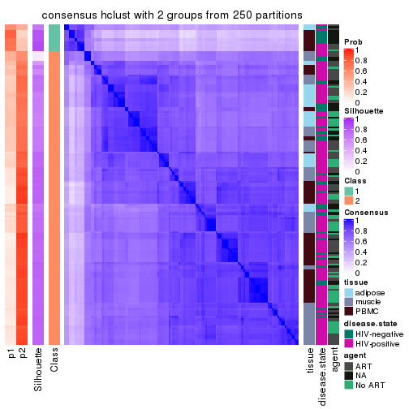</p>

</div>
<div id='tab-CV-hclust-consensus-heatmap-2'>
<pre><code class="r">consensus_heatmap(res, k = 3)
</code></pre>

<p>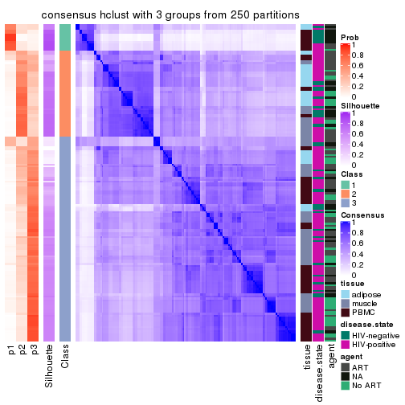</p>

</div>
<div id='tab-CV-hclust-consensus-heatmap-3'>
<pre><code class="r">consensus_heatmap(res, k = 4)
</code></pre>

<p>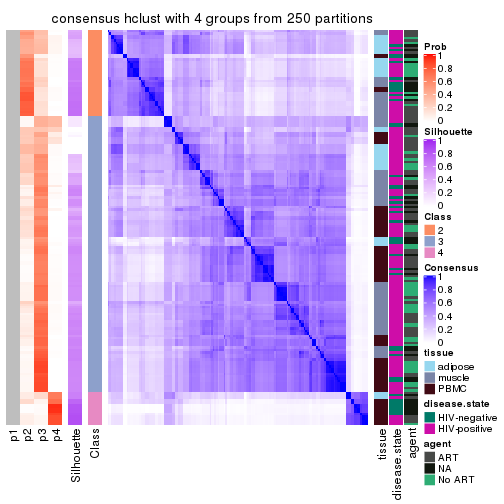</p>

</div>
<div id='tab-CV-hclust-consensus-heatmap-4'>
<pre><code class="r">consensus_heatmap(res, k = 5)
</code></pre>

<p>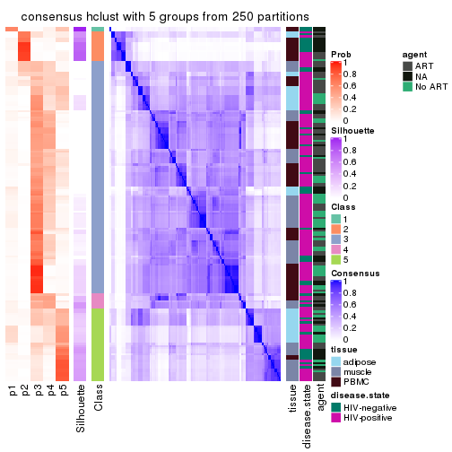</p>

</div>
<div id='tab-CV-hclust-consensus-heatmap-5'>
<pre><code class="r">consensus_heatmap(res, k = 6)
</code></pre>

<p>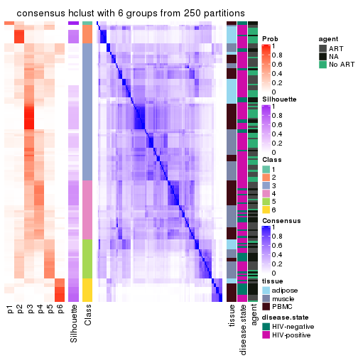</p>

</div>
</div>

Heatmaps for the membership of samples in all partitions to see how consistent they are:


<script>
$( function() {
	$( '#tabs-CV-hclust-membership-heatmap' ).tabs();
} );
</script>
<div id='tabs-CV-hclust-membership-heatmap'>
<ul>
<li><a href='#tab-CV-hclust-membership-heatmap-1'>k = 2</a></li>
<li><a href='#tab-CV-hclust-membership-heatmap-2'>k = 3</a></li>
<li><a href='#tab-CV-hclust-membership-heatmap-3'>k = 4</a></li>
<li><a href='#tab-CV-hclust-membership-heatmap-4'>k = 5</a></li>
<li><a href='#tab-CV-hclust-membership-heatmap-5'>k = 6</a></li>
</ul>
<div id='tab-CV-hclust-membership-heatmap-1'>
<pre><code class="r">membership_heatmap(res, k = 2)
</code></pre>

<p>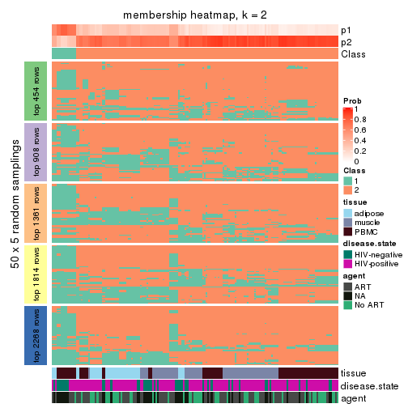</p>

</div>
<div id='tab-CV-hclust-membership-heatmap-2'>
<pre><code class="r">membership_heatmap(res, k = 3)
</code></pre>

<p>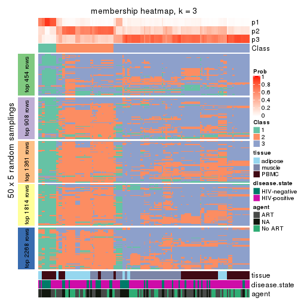</p>

</div>
<div id='tab-CV-hclust-membership-heatmap-3'>
<pre><code class="r">membership_heatmap(res, k = 4)
</code></pre>

<p>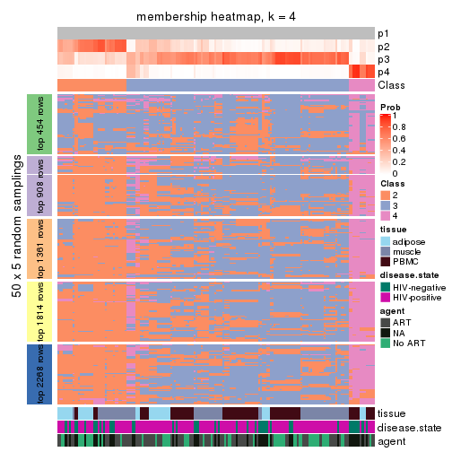</p>

</div>
<div id='tab-CV-hclust-membership-heatmap-4'>
<pre><code class="r">membership_heatmap(res, k = 5)
</code></pre>

<p>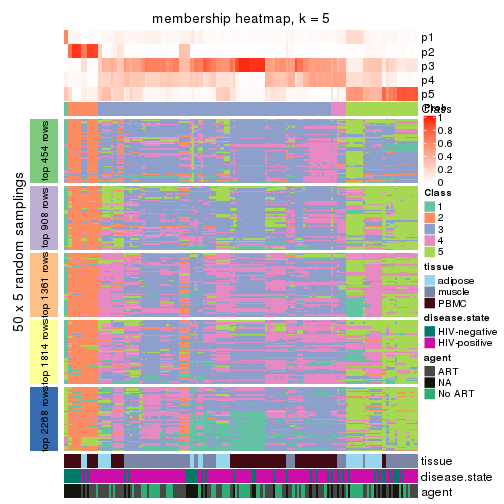</p>

</div>
<div id='tab-CV-hclust-membership-heatmap-5'>
<pre><code class="r">membership_heatmap(res, k = 6)
</code></pre>

<p>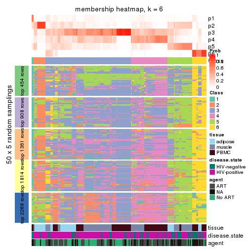</p>

</div>
</div>

As soon as we have had the classes for columns, we can look for signatures
which are significantly different between classes which can be candidate marks
for certain classes. Following are the heatmaps for signatures.


Signature heatmaps where rows are scaled:


<script>
$( function() {
	$( '#tabs-CV-hclust-get-signatures' ).tabs();
} );
</script>
<div id='tabs-CV-hclust-get-signatures'>
<ul>
<li><a href='#tab-CV-hclust-get-signatures-1'>k = 2</a></li>
<li><a href='#tab-CV-hclust-get-signatures-2'>k = 3</a></li>
<li><a href='#tab-CV-hclust-get-signatures-3'>k = 4</a></li>
<li><a href='#tab-CV-hclust-get-signatures-4'>k = 5</a></li>
<li><a href='#tab-CV-hclust-get-signatures-5'>k = 6</a></li>
</ul>
<div id='tab-CV-hclust-get-signatures-1'>
<pre><code class="r">get_signatures(res, k = 2)
</code></pre>

<p>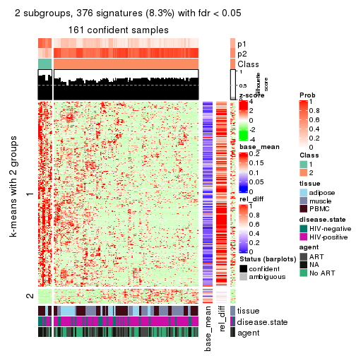</p>

</div>
<div id='tab-CV-hclust-get-signatures-2'>
<pre><code class="r">get_signatures(res, k = 3)
</code></pre>

<p>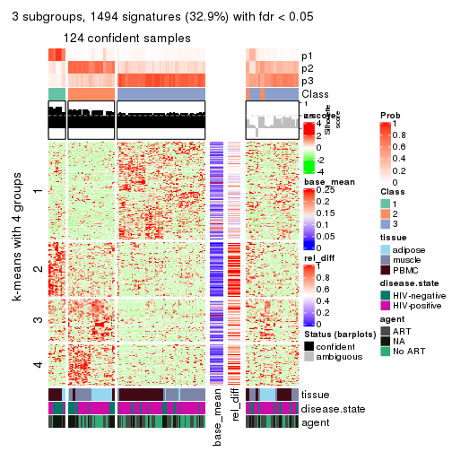</p>

</div>
<div id='tab-CV-hclust-get-signatures-3'>
<pre><code class="r">get_signatures(res, k = 4)
</code></pre>

<p>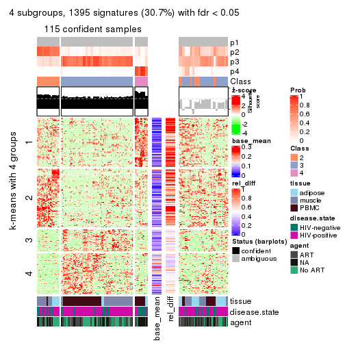</p>

</div>
<div id='tab-CV-hclust-get-signatures-4'>
<pre><code class="r">get_signatures(res, k = 5)
</code></pre>

<p>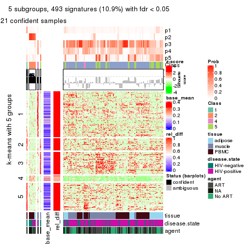</p>

</div>
<div id='tab-CV-hclust-get-signatures-5'>
<pre><code class="r">get_signatures(res, k = 6)
</code></pre>

<p>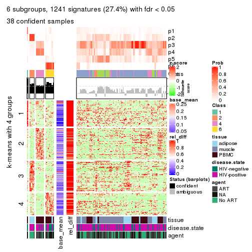</p>

</div>
</div>


Signature heatmaps where rows are not scaled:


<script>
$( function() {
	$( '#tabs-CV-hclust-get-signatures-no-scale' ).tabs();
} );
</script>
<div id='tabs-CV-hclust-get-signatures-no-scale'>
<ul>
<li><a href='#tab-CV-hclust-get-signatures-no-scale-1'>k = 2</a></li>
<li><a href='#tab-CV-hclust-get-signatures-no-scale-2'>k = 3</a></li>
<li><a href='#tab-CV-hclust-get-signatures-no-scale-3'>k = 4</a></li>
<li><a href='#tab-CV-hclust-get-signatures-no-scale-4'>k = 5</a></li>
<li><a href='#tab-CV-hclust-get-signatures-no-scale-5'>k = 6</a></li>
</ul>
<div id='tab-CV-hclust-get-signatures-no-scale-1'>
<pre><code class="r">get_signatures(res, k = 2, scale_rows = FALSE)
</code></pre>

<p>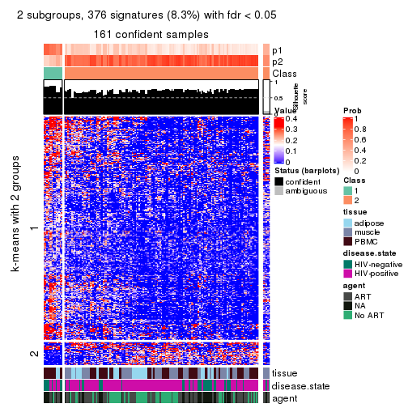</p>

</div>
<div id='tab-CV-hclust-get-signatures-no-scale-2'>
<pre><code class="r">get_signatures(res, k = 3, scale_rows = FALSE)
</code></pre>

<p>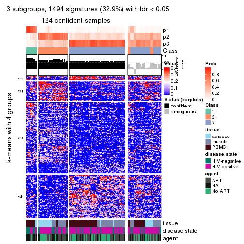</p>

</div>
<div id='tab-CV-hclust-get-signatures-no-scale-3'>
<pre><code class="r">get_signatures(res, k = 4, scale_rows = FALSE)
</code></pre>

<p>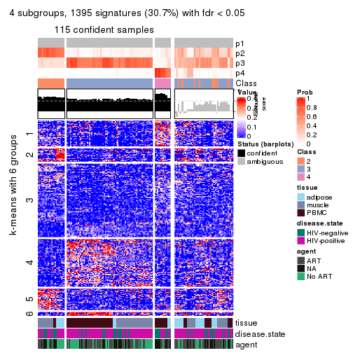</p>

</div>
<div id='tab-CV-hclust-get-signatures-no-scale-4'>
<pre><code class="r">get_signatures(res, k = 5, scale_rows = FALSE)
</code></pre>

<p>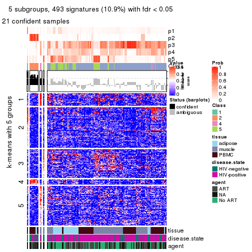</p>

</div>
<div id='tab-CV-hclust-get-signatures-no-scale-5'>
<pre><code class="r">get_signatures(res, k = 6, scale_rows = FALSE)
</code></pre>

<p>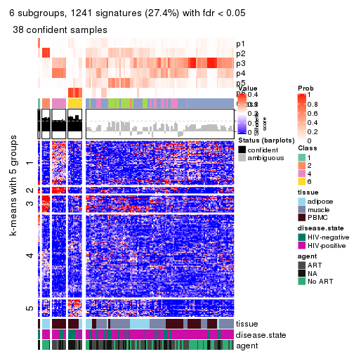</p>

</div>
</div>


Compare the overlap of signatures from different k:

```r
compare_signatures(res)
```

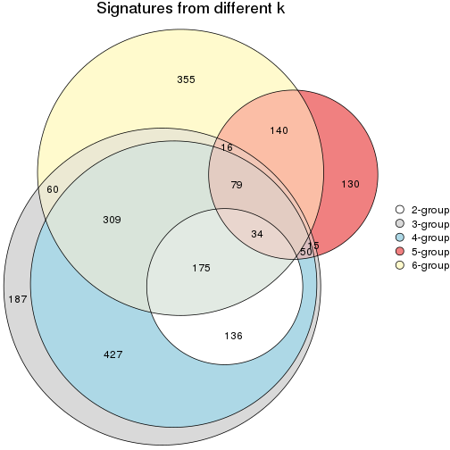

`get_signature()` returns a data frame invisibly. TO get the list of signatures, the function
call should be assigned to a variable explicitly. In following code, if `plot` argument is set
to `FALSE`, no heatmap is plotted while only the differential analysis is performed.

```r
# code only for demonstration
tb = get_signature(res, k = ..., plot = FALSE)
```

An example of the output of `tb` is:

```
#>   which_row         fdr    mean_1    mean_2 scaled_mean_1 scaled_mean_2 km
#> 1        38 0.042760348  8.373488  9.131774    -0.5533452     0.5164555  1
#> 2        40 0.018707592  7.106213  8.469186    -0.6173731     0.5762149  1
#> 3        55 0.019134737 10.221463 11.207825    -0.6159697     0.5749050  1
#> 4        59 0.006059896  5.921854  7.869574    -0.6899429     0.6439467  1
#> 5        60 0.018055526  8.928898 10.211722    -0.6204761     0.5791110  1
#> 6        98 0.009384629 15.714769 14.887706     0.6635654    -0.6193277  2
...
```

The columns in `tb` are:

1. `which_row`: row indices corresponding to the input matrix.
2. `fdr`: FDR for the differential test. 
3. `mean_x`: The mean value in group x.
4. `scaled_mean_x`: The mean value in group x after rows are scaled.
5. `km`: Row groups if k-means clustering is applied to rows.


UMAP plot which shows how samples are separated.


<script>
$( function() {
	$( '#tabs-CV-hclust-dimension-reduction' ).tabs();
} );
</script>
<div id='tabs-CV-hclust-dimension-reduction'>
<ul>
<li><a href='#tab-CV-hclust-dimension-reduction-1'>k = 2</a></li>
<li><a href='#tab-CV-hclust-dimension-reduction-2'>k = 3</a></li>
<li><a href='#tab-CV-hclust-dimension-reduction-3'>k = 4</a></li>
<li><a href='#tab-CV-hclust-dimension-reduction-4'>k = 5</a></li>
<li><a href='#tab-CV-hclust-dimension-reduction-5'>k = 6</a></li>
</ul>
<div id='tab-CV-hclust-dimension-reduction-1'>
<pre><code class="r">dimension_reduction(res, k = 2, method = &quot;UMAP&quot;)
</code></pre>

<p>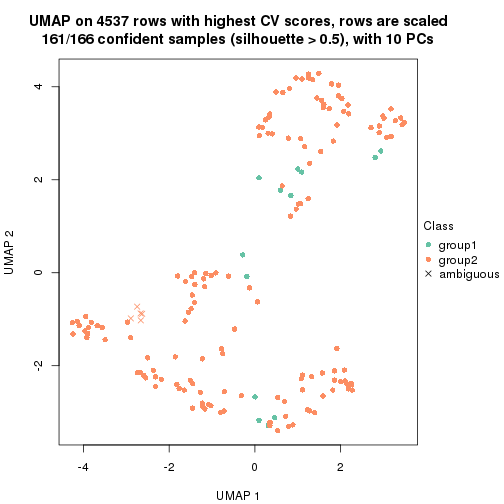</p>

</div>
<div id='tab-CV-hclust-dimension-reduction-2'>
<pre><code class="r">dimension_reduction(res, k = 3, method = &quot;UMAP&quot;)
</code></pre>

<p>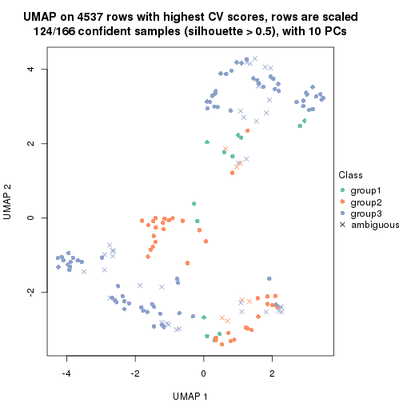</p>

</div>
<div id='tab-CV-hclust-dimension-reduction-3'>
<pre><code class="r">dimension_reduction(res, k = 4, method = &quot;UMAP&quot;)
</code></pre>

<p>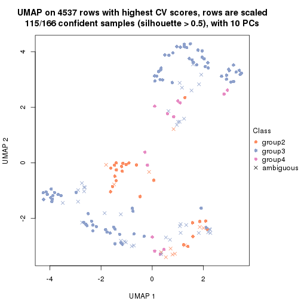</p>

</div>
<div id='tab-CV-hclust-dimension-reduction-4'>
<pre><code class="r">dimension_reduction(res, k = 5, method = &quot;UMAP&quot;)
</code></pre>

<p>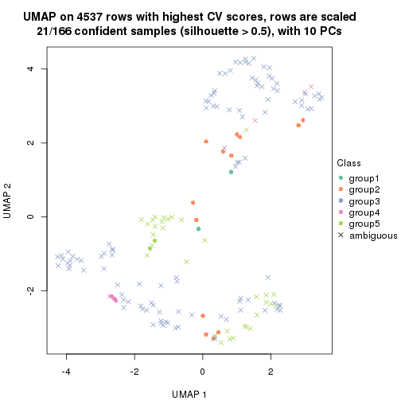</p>

</div>
<div id='tab-CV-hclust-dimension-reduction-5'>
<pre><code class="r">dimension_reduction(res, k = 6, method = &quot;UMAP&quot;)
</code></pre>

<p>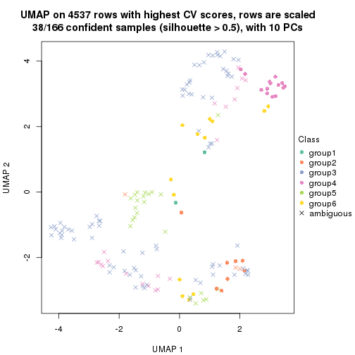</p>

</div>
</div>


Following heatmap shows how subgroups are split when increasing `k`:

```r
collect_classes(res)
```

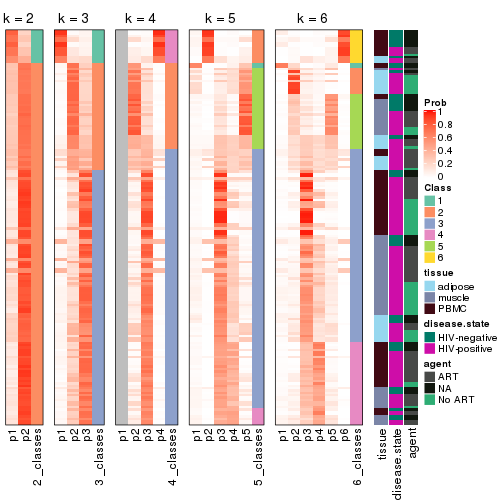


Test correlation between subgroups and known annotations. If the known
annotation is numeric, one-way ANOVA test is applied, and if the known
annotation is discrete, chi-squared contingency table test is applied.

```r
test_to_known_factors(res)
```

```
#>             n tissue(p) disease.state(p) agent(p) k
#> CV:hclust 161  5.09e-03          0.00731 6.68e-03 2
#> CV:hclust 124  3.71e-09          0.00722 2.60e-02 3
#> CV:hclust 115  1.20e-06          0.00362 7.82e-03 4
#> CV:hclust  21  1.38e-03          0.30372 6.44e-01 5
#> CV:hclust  38  7.35e-06          0.02470 2.53e-05 6
```


If matrix rows can be associated to genes, consider to use `GO_Enrichment(res,
...)` to perform function enrichment for the signature genes.


 

---------------------------------------------------


### CV:kmeans


The object with results only for a single top-value method and a single partition method 
can be extracted as:

```r
res = res_list["CV", "kmeans"]
# you can also extract it by
# res = res_list["CV:kmeans"]
```

A summary of `res` and all the functions that can be applied to it:

```r
res
```

```
#> A 'ConsensusPartition' object with k = 2, 3, 4, 5, 6.
#>   On a matrix with 4537 rows and 166 columns.
#>   Top rows (454, 908, 1361, 1814, 2268) are extracted by 'CV' method.
#>   Subgroups are detected by 'kmeans' method.
#>   Performed in total 1250 partitions by row resampling.
#>   Best k for subgroups seems to be 2.
#> 
#> Following methods can be applied to this 'ConsensusPartition' object:
#>  [1] "cola_report"             "collect_classes"         "collect_plots"          
#>  [4] "collect_stats"           "colnames"                "compare_signatures"     
#>  [7] "consensus_heatmap"       "dimension_reduction"     "functional_enrichment"  
#> [10] "get_anno_col"            "get_anno"                "get_classes"            
#> [13] "get_consensus"           "get_matrix"              "get_membership"         
#> [16] "get_param"               "get_signatures"          "get_stats"              
#> [19] "is_best_k"               "is_stable_k"             "membership_heatmap"     
#> [22] "ncol"                    "nrow"                    "plot_ecdf"              
#> [25] "rownames"                "select_partition_number" "show"                   
#> [28] "suggest_best_k"          "test_to_known_factors"
```

`collect_plots()` function collects all the plots made from `res` for all `k` (number of partitions)
into one single page to provide an easy and fast comparison between different `k`.

```r
collect_plots(res)
```

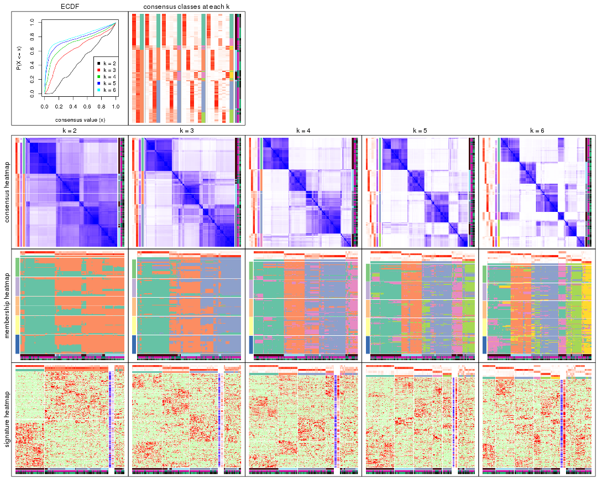

The plots are:

- The first row: a plot of the ECDF (Empirical cumulative distribution
  function) curves of the consensus matrix for each `k` and the heatmap of
  predicted classes for each `k`.
- The second row: heatmaps of the consensus matrix for each `k`.
- The third row: heatmaps of the membership matrix for each `k`.
- The fouth row: heatmaps of the signatures for each `k`.

All the plots in panels can be made by individual functions and they are
plotted later in this section.

`select_partition_number()` produces several plots showing different
statistics for choosing "optimized" `k`. There are following statistics:

- ECDF curves of the consensus matrix for each `k`;
- 1-PAC. [The PAC
  score](https://en.wikipedia.org/wiki/Consensus_clustering#Over-interpretation_potential_of_consensus_clustering)
  measures the proportion of the ambiguous subgrouping.
- Mean silhouette score.
- Concordance. The mean probability of fiting the consensus class ids in all
  partitions.
- Area increased. Denote $A_k$ as the area under the ECDF curve for current
  `k`, the area increased is defined as $A_k - A_{k-1}$.
- Rand index. The percent of pairs of samples that are both in a same cluster
  or both are not in a same cluster in the partition of k and k-1.
- Jaccard index. The ratio of pairs of samples are both in a same cluster in
  the partition of k and k-1 and the pairs of samples are both in a same
  cluster in the partition k or k-1.

The detailed explanations of these statistics can be found in [the cola
vignette](http://bioconductor.org/packages/devel/bioc/vignettes/cola/inst/doc/cola.html#toc_13).

Generally speaking, lower PAC score, higher mean silhouette score or higher
concordance corresponds to better partition. Rand index and Jaccard index
measure how similar the current partition is compared to partition with `k-1`.
If they are too similar, we won't accept `k` is better than `k-1`.

```r
select_partition_number(res)
```

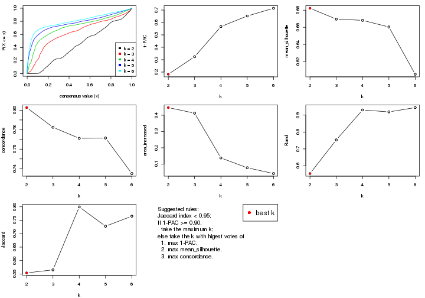

The numeric values for all these statistics can be obtained by `get_stats()`.

```r
get_stats(res)
```

```
#>   k 1-PAC mean_silhouette concordance area_increased  Rand Jaccard
#> 2 2 0.183           0.682       0.803         0.4469 0.554   0.554
#> 3 3 0.324           0.670       0.782         0.4125 0.753   0.565
#> 4 4 0.567           0.668       0.771         0.1374 0.931   0.799
#> 5 5 0.652           0.660       0.771         0.0773 0.919   0.728
#> 6 6 0.715           0.605       0.735         0.0417 0.945   0.765
```

`suggest_best_k()` suggests the best $k$ based on these statistics. The rules are as follows:

- All $k$ with Jaccard index larger than 0.95 are removed because the increase of
  the partition number does not provides enough extra information. If all $k$ are removed,
  the best $k$ is assigned by `NA`.
- For $k$ with 1-PAC larger than 0.9, the maximal $k$ is taken as the "best k". Other $k$ is called "optional k".
- If it does not fit the second rule. The $k$ with the highest vote of highest
  1-PAC, mean silhouette and concordance is taken as the "best k".

```r
suggest_best_k(res)
```

```
#> [1] 2
```


Following shows the table of the partitions (You need to click the **show/hide
code output** link to see it). The membership matrix (columns with name `p*`)
is inferred by
[`clue::cl_consensus()`](https://www.rdocumentation.org/link/cl_consensus?package=clue)
function with the `SE` method. Basically the value in the membership matrix
represents the probability to belong to a certain group. The finall class
label for an item is determined with the group with highest probability it
belongs to.

In `get_classes()` function, the entropy is calculated from the membership
matrix and the silhouette score is calculated from the consensus matrix.


<script>
$( function() {
	$( '#tabs-CV-kmeans-get-classes' ).tabs();
} );
</script>
<div id='tabs-CV-kmeans-get-classes'>
<ul>
<li><a href='#tab-CV-kmeans-get-classes-1'>k = 2</a></li>
<li><a href='#tab-CV-kmeans-get-classes-2'>k = 3</a></li>
<li><a href='#tab-CV-kmeans-get-classes-3'>k = 4</a></li>
<li><a href='#tab-CV-kmeans-get-classes-4'>k = 5</a></li>
<li><a href='#tab-CV-kmeans-get-classes-5'>k = 6</a></li>
</ul>

<div id='tab-CV-kmeans-get-classes-1'>
<p><a id='tab-CV-kmeans-get-classes-1-a' style='color:#0366d6' href='#'>show/hide code output</a></p>
<pre><code class="r">cbind(get_classes(res, k = 2), get_membership(res, k = 2))
</code></pre>

<pre><code>#&gt;           class entropy silhouette    p1    p2
#&gt; GSM751298     1   0.388     0.8700 0.924 0.076
#&gt; GSM751304     2   0.987     0.3630 0.432 0.568
#&gt; GSM751305     2   0.981     0.4196 0.420 0.580
#&gt; GSM751307     2   0.978     0.4398 0.412 0.588
#&gt; GSM751310     1   0.163     0.8510 0.976 0.024
#&gt; GSM751314     1   0.163     0.8510 0.976 0.024
#&gt; GSM751316     1   0.163     0.8510 0.976 0.024
#&gt; GSM751318     1   0.388     0.8700 0.924 0.076
#&gt; GSM751342     1   0.184     0.8499 0.972 0.028
#&gt; GSM751346     1   0.469     0.8659 0.900 0.100
#&gt; GSM751347     1   0.958     0.1295 0.620 0.380
#&gt; GSM751348     1   1.000    -0.0898 0.504 0.496
#&gt; GSM751349     2   0.671     0.7174 0.176 0.824
#&gt; GSM751352     2   0.987     0.3131 0.432 0.568
#&gt; GSM751353     2   0.738     0.6906 0.208 0.792
#&gt; GSM751354     2   0.917     0.5609 0.332 0.668
#&gt; GSM751355     2   0.738     0.6890 0.208 0.792
#&gt; GSM751358     1   0.949     0.2233 0.632 0.368
#&gt; GSM751359     2   0.775     0.6927 0.228 0.772
#&gt; GSM751294     2   0.904     0.5466 0.320 0.680
#&gt; GSM751296     1   0.456     0.8677 0.904 0.096
#&gt; GSM751297     1   0.541     0.8473 0.876 0.124
#&gt; GSM751299     1   0.998     0.0239 0.528 0.472
#&gt; GSM751300     1   0.456     0.8677 0.904 0.096
#&gt; GSM751301     1   0.895     0.4702 0.688 0.312
#&gt; GSM751302     1   0.469     0.8659 0.900 0.100
#&gt; GSM751303     1   0.184     0.8499 0.972 0.028
#&gt; GSM751306     1   0.184     0.8499 0.972 0.028
#&gt; GSM751308     1   0.605     0.8128 0.852 0.148
#&gt; GSM751309     1   0.184     0.8499 0.972 0.028
#&gt; GSM751311     1   0.163     0.8462 0.976 0.024
#&gt; GSM751312     1   0.163     0.8462 0.976 0.024
#&gt; GSM751313     1   0.443     0.8683 0.908 0.092
#&gt; GSM751315     1   0.163     0.8536 0.976 0.024
#&gt; GSM751317     1   0.163     0.8510 0.976 0.024
#&gt; GSM751320     1   0.416     0.8676 0.916 0.084
#&gt; GSM751321     1   0.184     0.8499 0.972 0.028
#&gt; GSM751322     1   0.358     0.8696 0.932 0.068
#&gt; GSM751324     1   0.358     0.8696 0.932 0.068
#&gt; GSM751325     1   0.388     0.8700 0.924 0.076
#&gt; GSM751332     1   0.416     0.8676 0.916 0.084
#&gt; GSM751334     1   0.416     0.8676 0.916 0.084
#&gt; GSM751339     1   0.518     0.8525 0.884 0.116
#&gt; GSM751341     1   0.184     0.8499 0.972 0.028
#&gt; GSM751343     1   0.416     0.8676 0.916 0.084
#&gt; GSM751344     2   0.969     0.4067 0.396 0.604
#&gt; GSM751345     2   0.969     0.4067 0.396 0.604
#&gt; GSM751356     1   0.983     0.1358 0.576 0.424
#&gt; GSM751357     1   0.983     0.1358 0.576 0.424
#&gt; GSM751293     1   0.891     0.4713 0.692 0.308
#&gt; GSM751295     1   0.469     0.8659 0.900 0.100
#&gt; GSM751319     1   0.163     0.8462 0.976 0.024
#&gt; GSM751323     1   0.416     0.8676 0.916 0.084
#&gt; GSM751326     1   0.416     0.8692 0.916 0.084
#&gt; GSM751327     1   0.358     0.8700 0.932 0.068
#&gt; GSM751328     1   0.163     0.8510 0.976 0.024
#&gt; GSM751329     1   0.416     0.8676 0.916 0.084
#&gt; GSM751330     1   0.402     0.8688 0.920 0.080
#&gt; GSM751331     1   0.388     0.8642 0.924 0.076
#&gt; GSM751333     1   0.443     0.8683 0.908 0.092
#&gt; GSM751335     1   0.402     0.8688 0.920 0.080
#&gt; GSM751336     1   0.469     0.8659 0.900 0.100
#&gt; GSM751337     1   0.456     0.8672 0.904 0.096
#&gt; GSM751338     1   0.469     0.8658 0.900 0.100
#&gt; GSM751340     1   0.529     0.8501 0.880 0.120
#&gt; GSM751350     1   0.469     0.8659 0.900 0.100
#&gt; GSM751351     1   0.469     0.8659 0.900 0.100
#&gt; GSM751362     2   0.939     0.5515 0.356 0.644
#&gt; GSM751363     2   0.653     0.7266 0.168 0.832
#&gt; GSM751367     2   0.990     0.5036 0.440 0.560
#&gt; GSM751368     2   0.494     0.7344 0.108 0.892
#&gt; GSM751371     2   0.963     0.5448 0.388 0.612
#&gt; GSM751375     2   0.443     0.7320 0.092 0.908
#&gt; GSM751376     2   0.833     0.6864 0.264 0.736
#&gt; GSM751378     2   0.311     0.7269 0.056 0.944
#&gt; GSM751379     2   0.833     0.6864 0.264 0.736
#&gt; GSM751382     2   0.443     0.7313 0.092 0.908
#&gt; GSM751386     2   0.469     0.7328 0.100 0.900
#&gt; GSM751388     2   0.469     0.7328 0.100 0.900
#&gt; GSM751391     2   0.775     0.6856 0.228 0.772
#&gt; GSM751410     2   0.955     0.5433 0.376 0.624
#&gt; GSM751414     2   0.949     0.5758 0.368 0.632
#&gt; GSM751361     2   0.605     0.7327 0.148 0.852
#&gt; GSM751365     2   0.921     0.6037 0.336 0.664
#&gt; GSM751366     2   0.949     0.5499 0.368 0.632
#&gt; GSM751369     2   0.969     0.5229 0.396 0.604
#&gt; GSM751370     2   0.955     0.5650 0.376 0.624
#&gt; GSM751372     2   0.913     0.6155 0.328 0.672
#&gt; GSM751373     2   0.952     0.5706 0.372 0.628
#&gt; GSM751374     2   0.833     0.6864 0.264 0.736
#&gt; GSM751377     2   0.563     0.7330 0.132 0.868
#&gt; GSM751380     2   0.939     0.5515 0.356 0.644
#&gt; GSM751381     2   0.469     0.7328 0.100 0.900
#&gt; GSM751383     2   0.469     0.7328 0.100 0.900
#&gt; GSM751384     2   0.506     0.7343 0.112 0.888
#&gt; GSM751385     2   0.327     0.7291 0.060 0.940
#&gt; GSM751387     2   0.469     0.7328 0.100 0.900
#&gt; GSM751389     2   0.866     0.6279 0.288 0.712
#&gt; GSM751393     2   0.482     0.7283 0.104 0.896
#&gt; GSM751394     2   0.469     0.7328 0.100 0.900
#&gt; GSM751395     2   0.402     0.7320 0.080 0.920
#&gt; GSM751397     2   0.469     0.7328 0.100 0.900
#&gt; GSM751398     2   0.482     0.7332 0.104 0.896
#&gt; GSM751404     2   0.939     0.5515 0.356 0.644
#&gt; GSM751406     2   0.936     0.5524 0.352 0.648
#&gt; GSM751411     2   0.913     0.6089 0.328 0.672
#&gt; GSM751413     2   0.529     0.7345 0.120 0.880
#&gt; GSM751415     2   0.939     0.5515 0.356 0.644
#&gt; GSM751416     2   0.595     0.7318 0.144 0.856
#&gt; GSM751417     2   0.595     0.7318 0.144 0.856
#&gt; GSM751421     2   0.963     0.5448 0.388 0.612
#&gt; GSM751422     2   0.963     0.5448 0.388 0.612
#&gt; GSM751360     2   0.949     0.5644 0.368 0.632
#&gt; GSM751364     2   0.671     0.7227 0.176 0.824
#&gt; GSM751390     2   0.482     0.7334 0.104 0.896
#&gt; GSM751392     2   0.469     0.7328 0.100 0.900
#&gt; GSM751396     2   0.469     0.7328 0.100 0.900
#&gt; GSM751399     2   0.900     0.6040 0.316 0.684
#&gt; GSM751400     2   0.891     0.6101 0.308 0.692
#&gt; GSM751401     2   0.936     0.5524 0.352 0.648
#&gt; GSM751402     2   0.936     0.5524 0.352 0.648
#&gt; GSM751403     2   0.900     0.6005 0.316 0.684
#&gt; GSM751405     2   0.936     0.5524 0.352 0.648
#&gt; GSM751407     2   0.921     0.5752 0.336 0.664
#&gt; GSM751408     2   0.900     0.6040 0.316 0.684
#&gt; GSM751409     2   0.839     0.6437 0.268 0.732
#&gt; GSM751412     2   0.904     0.5994 0.320 0.680
#&gt; GSM751418     2   0.929     0.6056 0.344 0.656
#&gt; GSM751419     2   0.921     0.6072 0.336 0.664
#&gt; GSM751420     2   0.936     0.5715 0.352 0.648
#&gt; GSM751425     2   0.552     0.7158 0.128 0.872
#&gt; GSM751429     2   0.990     0.4736 0.440 0.560
#&gt; GSM751430     2   0.767     0.7004 0.224 0.776
#&gt; GSM751433     2   0.730     0.6842 0.204 0.796
#&gt; GSM751437     2   0.876     0.6105 0.296 0.704
#&gt; GSM751448     2   0.991     0.4610 0.444 0.556
#&gt; GSM751451     2   0.680     0.6996 0.180 0.820
#&gt; GSM751423     2   0.625     0.7129 0.156 0.844
#&gt; GSM751424     2   0.697     0.6922 0.188 0.812
#&gt; GSM751428     2   0.644     0.7054 0.164 0.836
#&gt; GSM751431     2   0.706     0.6933 0.192 0.808
#&gt; GSM751432     2   0.714     0.6923 0.196 0.804
#&gt; GSM751434     2   0.706     0.6858 0.192 0.808
#&gt; GSM751435     2   0.689     0.6917 0.184 0.816
#&gt; GSM751436     2   0.706     0.6858 0.192 0.808
#&gt; GSM751440     2   0.689     0.6967 0.184 0.816
#&gt; GSM751444     2   0.625     0.6996 0.156 0.844
#&gt; GSM751446     2   0.605     0.7045 0.148 0.852
#&gt; GSM751449     2   0.552     0.7110 0.128 0.872
#&gt; GSM751450     2   0.689     0.6967 0.184 0.816
#&gt; GSM751452     2   0.697     0.6826 0.188 0.812
#&gt; GSM751426     2   0.689     0.6967 0.184 0.816
#&gt; GSM751427     2   0.605     0.7097 0.148 0.852
#&gt; GSM751438     2   0.552     0.7110 0.128 0.872
#&gt; GSM751439     2   0.936     0.5493 0.352 0.648
#&gt; GSM751441     2   0.204     0.7166 0.032 0.968
#&gt; GSM751442     2   0.605     0.7045 0.148 0.852
#&gt; GSM751443     2   0.925     0.5620 0.340 0.660
#&gt; GSM751445     2   0.518     0.7100 0.116 0.884
#&gt; GSM751447     2   0.552     0.7095 0.128 0.872
#&gt; GSM751453     2   0.615     0.7068 0.152 0.848
#&gt; GSM751454     2   0.615     0.7068 0.152 0.848
#&gt; GSM751455     2   0.605     0.7045 0.148 0.852
#&gt; GSM751456     2   0.605     0.7045 0.148 0.852
#&gt; GSM751457     2   0.506     0.7136 0.112 0.888
#&gt; GSM751458     2   0.506     0.7136 0.112 0.888
</code></pre>

<script>
$('#tab-CV-kmeans-get-classes-1-a').parent().next().next().hide();
$('#tab-CV-kmeans-get-classes-1-a').click(function(){
  $('#tab-CV-kmeans-get-classes-1-a').parent().next().next().toggle();
  return(false);
});
</script>
</div>

<div id='tab-CV-kmeans-get-classes-2'>
<p><a id='tab-CV-kmeans-get-classes-2-a' style='color:#0366d6' href='#'>show/hide code output</a></p>
<pre><code class="r">cbind(get_classes(res, k = 3), get_membership(res, k = 3))
</code></pre>

<pre><code>#&gt;           class entropy silhouette    p1    p2    p3
#&gt; GSM751298     1  0.3983     0.8932 0.884 0.048 0.068
#&gt; GSM751304     2  0.8720     0.5369 0.252 0.584 0.164
#&gt; GSM751305     2  0.8673     0.5299 0.252 0.588 0.160
#&gt; GSM751307     2  0.7906     0.5884 0.220 0.656 0.124
#&gt; GSM751310     1  0.1950     0.8456 0.952 0.040 0.008
#&gt; GSM751314     1  0.1950     0.8465 0.952 0.040 0.008
#&gt; GSM751316     1  0.2280     0.8420 0.940 0.052 0.008
#&gt; GSM751318     1  0.3780     0.8928 0.892 0.044 0.064
#&gt; GSM751342     1  0.2063     0.8445 0.948 0.044 0.008
#&gt; GSM751346     1  0.4982     0.8882 0.840 0.064 0.096
#&gt; GSM751347     1  0.7651     0.6748 0.672 0.108 0.220
#&gt; GSM751348     2  0.9268     0.4311 0.348 0.484 0.168
#&gt; GSM751349     2  0.6803     0.5271 0.040 0.680 0.280
#&gt; GSM751352     2  0.8556     0.5511 0.232 0.604 0.164
#&gt; GSM751353     2  0.6438     0.6043 0.064 0.748 0.188
#&gt; GSM751354     2  0.8525     0.5707 0.188 0.612 0.200
#&gt; GSM751355     2  0.6541     0.5999 0.056 0.732 0.212
#&gt; GSM751358     1  0.9193    -0.1526 0.480 0.364 0.156
#&gt; GSM751359     2  0.8311     0.4459 0.132 0.616 0.252
#&gt; GSM751294     2  0.9156     0.5287 0.204 0.540 0.256
#&gt; GSM751296     1  0.4423     0.8934 0.864 0.048 0.088
#&gt; GSM751297     1  0.5696     0.8583 0.800 0.064 0.136
#&gt; GSM751299     2  0.8670     0.5426 0.240 0.592 0.168
#&gt; GSM751300     1  0.4982     0.8882 0.840 0.064 0.096
#&gt; GSM751301     1  0.8457     0.2204 0.512 0.396 0.092
#&gt; GSM751302     1  0.4982     0.8882 0.840 0.064 0.096
#&gt; GSM751303     1  0.2173     0.8420 0.944 0.048 0.008
#&gt; GSM751306     1  0.2063     0.8445 0.948 0.044 0.008
#&gt; GSM751308     1  0.6693     0.8067 0.748 0.104 0.148
#&gt; GSM751309     1  0.2063     0.8445 0.948 0.044 0.008
#&gt; GSM751311     1  0.2063     0.8445 0.948 0.044 0.008
#&gt; GSM751312     1  0.2280     0.8420 0.940 0.052 0.008
#&gt; GSM751313     1  0.4725     0.8912 0.852 0.060 0.088
#&gt; GSM751315     1  0.0829     0.8608 0.984 0.004 0.012
#&gt; GSM751317     1  0.2116     0.8484 0.948 0.040 0.012
#&gt; GSM751320     1  0.4058     0.8938 0.880 0.044 0.076
#&gt; GSM751321     1  0.2063     0.8445 0.948 0.044 0.008
#&gt; GSM751322     1  0.2793     0.8827 0.928 0.028 0.044
#&gt; GSM751324     1  0.2793     0.8827 0.928 0.028 0.044
#&gt; GSM751325     1  0.3875     0.8935 0.888 0.044 0.068
#&gt; GSM751332     1  0.4253     0.8924 0.872 0.048 0.080
#&gt; GSM751334     1  0.4253     0.8924 0.872 0.048 0.080
#&gt; GSM751339     1  0.4725     0.8922 0.852 0.060 0.088
#&gt; GSM751341     1  0.2269     0.8580 0.944 0.040 0.016
#&gt; GSM751343     1  0.4165     0.8935 0.876 0.048 0.076
#&gt; GSM751344     2  0.8058     0.5876 0.212 0.648 0.140
#&gt; GSM751345     2  0.8058     0.5876 0.212 0.648 0.140
#&gt; GSM751356     2  0.9119     0.3558 0.368 0.484 0.148
#&gt; GSM751357     2  0.9119     0.3558 0.368 0.484 0.148
#&gt; GSM751293     1  0.7987     0.5168 0.616 0.292 0.092
#&gt; GSM751295     1  0.4982     0.8882 0.840 0.064 0.096
#&gt; GSM751319     1  0.2063     0.8445 0.948 0.044 0.008
#&gt; GSM751323     1  0.4058     0.8938 0.880 0.044 0.076
#&gt; GSM751326     1  0.4443     0.8923 0.864 0.052 0.084
#&gt; GSM751327     1  0.3683     0.8918 0.896 0.044 0.060
#&gt; GSM751328     1  0.1751     0.8636 0.960 0.028 0.012
#&gt; GSM751329     1  0.4165     0.8935 0.876 0.048 0.076
#&gt; GSM751330     1  0.4725     0.8912 0.852 0.060 0.088
#&gt; GSM751331     1  0.4902     0.8898 0.844 0.064 0.092
#&gt; GSM751333     1  0.4725     0.8912 0.852 0.060 0.088
#&gt; GSM751335     1  0.4725     0.8912 0.852 0.060 0.088
#&gt; GSM751336     1  0.4725     0.8912 0.852 0.060 0.088
#&gt; GSM751337     1  0.4628     0.8914 0.856 0.056 0.088
#&gt; GSM751338     1  0.4725     0.8922 0.852 0.060 0.088
#&gt; GSM751340     1  0.6424     0.8030 0.752 0.068 0.180
#&gt; GSM751350     1  0.5060     0.8870 0.836 0.064 0.100
#&gt; GSM751351     1  0.5060     0.8870 0.836 0.064 0.100
#&gt; GSM751362     3  0.2939     0.7434 0.072 0.012 0.916
#&gt; GSM751363     3  0.6762     0.5306 0.036 0.288 0.676
#&gt; GSM751367     3  0.5285     0.6760 0.148 0.040 0.812
#&gt; GSM751368     3  0.6229     0.4730 0.008 0.340 0.652
#&gt; GSM751371     3  0.3502     0.7374 0.084 0.020 0.896
#&gt; GSM751375     2  0.6500    -0.0216 0.004 0.532 0.464
#&gt; GSM751376     3  0.6562     0.4607 0.036 0.264 0.700
#&gt; GSM751378     3  0.5678     0.5111 0.000 0.316 0.684
#&gt; GSM751379     3  0.6526     0.4672 0.036 0.260 0.704
#&gt; GSM751382     2  0.6516    -0.0816 0.004 0.516 0.480
#&gt; GSM751386     3  0.6489     0.2562 0.004 0.456 0.540
#&gt; GSM751388     3  0.6489     0.2562 0.004 0.456 0.540
#&gt; GSM751391     3  0.3670     0.7152 0.020 0.092 0.888
#&gt; GSM751410     3  0.3587     0.7374 0.088 0.020 0.892
#&gt; GSM751414     3  0.4475     0.7365 0.072 0.064 0.864
#&gt; GSM751361     3  0.6129     0.5614 0.016 0.284 0.700
#&gt; GSM751365     3  0.3530     0.7469 0.068 0.032 0.900
#&gt; GSM751366     3  0.2680     0.7471 0.068 0.008 0.924
#&gt; GSM751369     3  0.4121     0.7289 0.084 0.040 0.876
#&gt; GSM751370     3  0.4458     0.7376 0.080 0.056 0.864
#&gt; GSM751372     3  0.4379     0.7380 0.072 0.060 0.868
#&gt; GSM751373     3  0.3967     0.7430 0.072 0.044 0.884
#&gt; GSM751374     3  0.6562     0.4607 0.036 0.264 0.700
#&gt; GSM751377     3  0.6051     0.5510 0.012 0.292 0.696
#&gt; GSM751380     3  0.2998     0.7470 0.068 0.016 0.916
#&gt; GSM751381     3  0.6489     0.2562 0.004 0.456 0.540
#&gt; GSM751383     3  0.6476     0.2762 0.004 0.448 0.548
#&gt; GSM751384     3  0.5968     0.4612 0.000 0.364 0.636
#&gt; GSM751385     3  0.3686     0.6749 0.000 0.140 0.860
#&gt; GSM751387     3  0.6489     0.2562 0.004 0.456 0.540
#&gt; GSM751389     3  0.2318     0.7373 0.028 0.028 0.944
#&gt; GSM751393     3  0.2845     0.7153 0.012 0.068 0.920
#&gt; GSM751394     3  0.6489     0.2562 0.004 0.456 0.540
#&gt; GSM751395     3  0.4575     0.6342 0.012 0.160 0.828
#&gt; GSM751397     3  0.6476     0.2762 0.004 0.448 0.548
#&gt; GSM751398     3  0.6608     0.3109 0.008 0.432 0.560
#&gt; GSM751404     3  0.2998     0.7470 0.068 0.016 0.916
#&gt; GSM751406     3  0.2998     0.7448 0.068 0.016 0.916
#&gt; GSM751411     3  0.3472     0.7456 0.056 0.040 0.904
#&gt; GSM751413     3  0.6677     0.4732 0.024 0.324 0.652
#&gt; GSM751415     3  0.2998     0.7470 0.068 0.016 0.916
#&gt; GSM751416     3  0.5986     0.5579 0.012 0.284 0.704
#&gt; GSM751417     3  0.5986     0.5579 0.012 0.284 0.704
#&gt; GSM751421     3  0.3502     0.7374 0.084 0.020 0.896
#&gt; GSM751422     3  0.3502     0.7374 0.084 0.020 0.896
#&gt; GSM751360     3  0.2496     0.7467 0.068 0.004 0.928
#&gt; GSM751364     3  0.5678     0.6633 0.032 0.192 0.776
#&gt; GSM751390     3  0.5948     0.4672 0.000 0.360 0.640
#&gt; GSM751392     3  0.6518     0.1700 0.004 0.484 0.512
#&gt; GSM751396     3  0.6520     0.1566 0.004 0.488 0.508
#&gt; GSM751399     3  0.2680     0.7471 0.068 0.008 0.924
#&gt; GSM751400     3  0.2998     0.7448 0.068 0.016 0.916
#&gt; GSM751401     3  0.2998     0.7470 0.068 0.016 0.916
#&gt; GSM751402     3  0.2998     0.7448 0.068 0.016 0.916
#&gt; GSM751403     3  0.2998     0.7470 0.068 0.016 0.916
#&gt; GSM751405     3  0.2998     0.7448 0.068 0.016 0.916
#&gt; GSM751407     3  0.2998     0.7470 0.068 0.016 0.916
#&gt; GSM751408     3  0.2845     0.7474 0.068 0.012 0.920
#&gt; GSM751409     3  0.2743     0.7478 0.052 0.020 0.928
#&gt; GSM751412     3  0.2998     0.7473 0.068 0.016 0.916
#&gt; GSM751418     3  0.4836     0.7322 0.072 0.080 0.848
#&gt; GSM751419     3  0.4836     0.7322 0.072 0.080 0.848
#&gt; GSM751420     3  0.3983     0.7285 0.068 0.048 0.884
#&gt; GSM751425     2  0.5159     0.7290 0.040 0.820 0.140
#&gt; GSM751429     3  0.7058     0.5382 0.100 0.180 0.720
#&gt; GSM751430     2  0.7367     0.5451 0.060 0.648 0.292
#&gt; GSM751433     2  0.4868     0.7508 0.056 0.844 0.100
#&gt; GSM751437     3  0.7624     0.1923 0.052 0.368 0.580
#&gt; GSM751448     3  0.7227     0.5120 0.096 0.200 0.704
#&gt; GSM751451     2  0.5408     0.7415 0.052 0.812 0.136
#&gt; GSM751423     2  0.5473     0.7392 0.052 0.808 0.140
#&gt; GSM751424     2  0.4742     0.7506 0.048 0.848 0.104
#&gt; GSM751428     2  0.5020     0.7517 0.056 0.836 0.108
#&gt; GSM751431     2  0.4818     0.7516 0.048 0.844 0.108
#&gt; GSM751432     2  0.5473     0.7417 0.052 0.808 0.140
#&gt; GSM751434     2  0.5094     0.7439 0.056 0.832 0.112
#&gt; GSM751435     2  0.5138     0.7484 0.052 0.828 0.120
#&gt; GSM751436     2  0.4845     0.7510 0.052 0.844 0.104
#&gt; GSM751440     2  0.5473     0.7392 0.052 0.808 0.140
#&gt; GSM751444     2  0.5473     0.7487 0.052 0.808 0.140
#&gt; GSM751446     2  0.6098     0.7344 0.056 0.768 0.176
#&gt; GSM751449     2  0.6054     0.7327 0.052 0.768 0.180
#&gt; GSM751450     2  0.4920     0.7513 0.052 0.840 0.108
#&gt; GSM751452     2  0.4845     0.7510 0.052 0.844 0.104
#&gt; GSM751426     2  0.5020     0.7512 0.056 0.836 0.108
#&gt; GSM751427     2  0.5307     0.7395 0.048 0.816 0.136
#&gt; GSM751438     2  0.6203     0.7298 0.056 0.760 0.184
#&gt; GSM751439     2  0.7932     0.3908 0.064 0.552 0.384
#&gt; GSM751441     2  0.5551     0.6696 0.016 0.760 0.224
#&gt; GSM751442     2  0.6245     0.7316 0.060 0.760 0.180
#&gt; GSM751443     3  0.7995    -0.1362 0.060 0.460 0.480
#&gt; GSM751445     2  0.5371     0.7462 0.048 0.812 0.140
#&gt; GSM751447     2  0.5875     0.7404 0.056 0.784 0.160
#&gt; GSM751453     2  0.5020     0.7513 0.056 0.836 0.108
#&gt; GSM751454     2  0.5020     0.7513 0.056 0.836 0.108
#&gt; GSM751455     2  0.6245     0.7316 0.060 0.760 0.180
#&gt; GSM751456     2  0.6245     0.7316 0.060 0.760 0.180
#&gt; GSM751457     2  0.7023     0.5166 0.032 0.624 0.344
#&gt; GSM751458     2  0.7023     0.5166 0.032 0.624 0.344
</code></pre>

<script>
$('#tab-CV-kmeans-get-classes-2-a').parent().next().next().hide();
$('#tab-CV-kmeans-get-classes-2-a').click(function(){
  $('#tab-CV-kmeans-get-classes-2-a').parent().next().next().toggle();
  return(false);
});
</script>
</div>

<div id='tab-CV-kmeans-get-classes-3'>
<p><a id='tab-CV-kmeans-get-classes-3-a' style='color:#0366d6' href='#'>show/hide code output</a></p>
<pre><code class="r">cbind(get_classes(res, k = 4), get_membership(res, k = 4))
</code></pre>

<pre><code>#&gt;           class entropy silhouette    p1    p2    p3    p4
#&gt; GSM751298     1  0.2722     0.8583 0.904 0.032 0.064 0.000
#&gt; GSM751304     4  0.6449     0.6448 0.084 0.148 0.056 0.712
#&gt; GSM751305     4  0.6538     0.6398 0.084 0.156 0.056 0.704
#&gt; GSM751307     4  0.7130     0.6485 0.084 0.240 0.048 0.628
#&gt; GSM751310     1  0.2976     0.7661 0.872 0.000 0.008 0.120
#&gt; GSM751314     1  0.3375     0.7643 0.864 0.008 0.012 0.116
#&gt; GSM751316     1  0.3823     0.7323 0.824 0.008 0.008 0.160
#&gt; GSM751318     1  0.3337     0.8563 0.888 0.032 0.060 0.020
#&gt; GSM751342     1  0.3703     0.7494 0.840 0.008 0.012 0.140
#&gt; GSM751346     1  0.4918     0.8342 0.812 0.040 0.064 0.084
#&gt; GSM751347     1  0.6629     0.7103 0.700 0.052 0.140 0.108
#&gt; GSM751348     4  0.9086     0.4705 0.304 0.236 0.072 0.388
#&gt; GSM751349     4  0.7978     0.1777 0.036 0.368 0.128 0.468
#&gt; GSM751352     4  0.6743     0.6624 0.092 0.196 0.040 0.672
#&gt; GSM751353     4  0.6041     0.5853 0.032 0.276 0.028 0.664
#&gt; GSM751354     4  0.6895     0.6374 0.056 0.192 0.084 0.668
#&gt; GSM751355     4  0.6637     0.5818 0.028 0.264 0.068 0.640
#&gt; GSM751358     4  0.8213     0.3782 0.364 0.076 0.092 0.468
#&gt; GSM751359     4  0.8201     0.4009 0.112 0.244 0.092 0.552
#&gt; GSM751294     4  0.8506     0.5805 0.132 0.200 0.124 0.544
#&gt; GSM751296     1  0.3813     0.8578 0.868 0.036 0.064 0.032
#&gt; GSM751297     1  0.6004     0.7750 0.744 0.044 0.096 0.116
#&gt; GSM751299     4  0.6822     0.6551 0.088 0.212 0.040 0.660
#&gt; GSM751300     1  0.4918     0.8341 0.812 0.040 0.064 0.084
#&gt; GSM751301     4  0.7606     0.3842 0.372 0.144 0.012 0.472
#&gt; GSM751302     1  0.5228     0.8202 0.792 0.040 0.064 0.104
#&gt; GSM751303     1  0.3805     0.7393 0.832 0.008 0.012 0.148
#&gt; GSM751306     1  0.3805     0.7393 0.832 0.008 0.012 0.148
#&gt; GSM751308     1  0.7155     0.5675 0.640 0.056 0.088 0.216
#&gt; GSM751309     1  0.3805     0.7393 0.832 0.008 0.012 0.148
#&gt; GSM751311     1  0.3805     0.7393 0.832 0.008 0.012 0.148
#&gt; GSM751312     1  0.3823     0.7323 0.824 0.008 0.008 0.160
#&gt; GSM751313     1  0.3997     0.8539 0.860 0.040 0.064 0.036
#&gt; GSM751315     1  0.2101     0.8101 0.928 0.000 0.012 0.060
#&gt; GSM751317     1  0.3093     0.7928 0.884 0.004 0.020 0.092
#&gt; GSM751320     1  0.2907     0.8589 0.900 0.032 0.064 0.004
#&gt; GSM751321     1  0.3677     0.7383 0.836 0.008 0.008 0.148
#&gt; GSM751322     1  0.2221     0.8496 0.932 0.016 0.044 0.008
#&gt; GSM751324     1  0.2335     0.8487 0.928 0.020 0.044 0.008
#&gt; GSM751325     1  0.3052     0.8580 0.896 0.032 0.064 0.008
#&gt; GSM751332     1  0.3069     0.8588 0.896 0.036 0.060 0.008
#&gt; GSM751334     1  0.3069     0.8588 0.896 0.036 0.060 0.008
#&gt; GSM751339     1  0.3886     0.8544 0.860 0.040 0.080 0.020
#&gt; GSM751341     1  0.2781     0.7981 0.904 0.008 0.016 0.072
#&gt; GSM751343     1  0.2924     0.8588 0.900 0.036 0.060 0.004
#&gt; GSM751344     4  0.6712     0.6346 0.076 0.256 0.028 0.640
#&gt; GSM751345     4  0.6712     0.6346 0.076 0.256 0.028 0.640
#&gt; GSM751356     4  0.6972     0.6398 0.184 0.124 0.036 0.656
#&gt; GSM751357     4  0.6972     0.6398 0.184 0.124 0.036 0.656
#&gt; GSM751293     4  0.7357     0.2718 0.412 0.112 0.012 0.464
#&gt; GSM751295     1  0.5228     0.8202 0.792 0.040 0.064 0.104
#&gt; GSM751319     1  0.3677     0.7383 0.836 0.008 0.008 0.148
#&gt; GSM751323     1  0.2907     0.8589 0.900 0.032 0.064 0.004
#&gt; GSM751326     1  0.3705     0.8569 0.872 0.040 0.064 0.024
#&gt; GSM751327     1  0.2623     0.8584 0.908 0.028 0.064 0.000
#&gt; GSM751328     1  0.2039     0.8151 0.940 0.008 0.016 0.036
#&gt; GSM751329     1  0.2990     0.8591 0.900 0.036 0.056 0.008
#&gt; GSM751330     1  0.4569     0.8439 0.832 0.040 0.060 0.068
#&gt; GSM751331     1  0.5034     0.8282 0.804 0.040 0.060 0.096
#&gt; GSM751333     1  0.4496     0.8455 0.836 0.040 0.060 0.064
#&gt; GSM751335     1  0.4569     0.8439 0.832 0.040 0.060 0.068
#&gt; GSM751336     1  0.4715     0.8403 0.824 0.040 0.064 0.072
#&gt; GSM751337     1  0.3881     0.8553 0.864 0.040 0.068 0.028
#&gt; GSM751338     1  0.3599     0.8574 0.876 0.040 0.064 0.020
#&gt; GSM751340     1  0.5984     0.7502 0.732 0.040 0.164 0.064
#&gt; GSM751350     1  0.5286     0.8173 0.788 0.040 0.064 0.108
#&gt; GSM751351     1  0.5286     0.8173 0.788 0.040 0.064 0.108
#&gt; GSM751362     3  0.1377     0.7076 0.020 0.008 0.964 0.008
#&gt; GSM751363     3  0.6892     0.5447 0.012 0.104 0.596 0.288
#&gt; GSM751367     3  0.4324     0.6497 0.056 0.024 0.840 0.080
#&gt; GSM751368     3  0.7166     0.5366 0.008 0.244 0.584 0.164
#&gt; GSM751371     3  0.3444     0.6908 0.024 0.032 0.884 0.060
#&gt; GSM751375     4  0.8080    -0.2738 0.004 0.332 0.324 0.340
#&gt; GSM751376     3  0.6649     0.3931 0.004 0.120 0.620 0.256
#&gt; GSM751378     3  0.7105     0.5067 0.004 0.152 0.568 0.276
#&gt; GSM751379     3  0.6649     0.3931 0.004 0.120 0.620 0.256
#&gt; GSM751382     3  0.8061     0.2779 0.004 0.336 0.360 0.300
#&gt; GSM751386     3  0.8015     0.3355 0.004 0.308 0.396 0.292
#&gt; GSM751388     3  0.8006     0.3356 0.004 0.308 0.400 0.288
#&gt; GSM751391     3  0.3709     0.6795 0.004 0.040 0.856 0.100
#&gt; GSM751410     3  0.2261     0.6999 0.036 0.008 0.932 0.024
#&gt; GSM751414     3  0.4147     0.6898 0.008 0.064 0.840 0.088
#&gt; GSM751361     3  0.7027     0.5613 0.008 0.204 0.608 0.180
#&gt; GSM751365     3  0.3232     0.7062 0.012 0.028 0.888 0.072
#&gt; GSM751366     3  0.1617     0.7132 0.012 0.008 0.956 0.024
#&gt; GSM751369     3  0.3391     0.6840 0.020 0.028 0.884 0.068
#&gt; GSM751370     3  0.3591     0.7031 0.016 0.032 0.872 0.080
#&gt; GSM751372     3  0.3374     0.7044 0.012 0.028 0.880 0.080
#&gt; GSM751373     3  0.2636     0.7131 0.012 0.020 0.916 0.052
#&gt; GSM751374     3  0.6649     0.3931 0.004 0.120 0.620 0.256
#&gt; GSM751377     3  0.7163     0.5305 0.004 0.232 0.576 0.188
#&gt; GSM751380     3  0.1271     0.7095 0.012 0.012 0.968 0.008
#&gt; GSM751381     3  0.8006     0.3356 0.004 0.308 0.400 0.288
#&gt; GSM751383     3  0.8006     0.3356 0.004 0.308 0.400 0.288
#&gt; GSM751384     3  0.7469     0.4767 0.004 0.196 0.524 0.276
#&gt; GSM751385     3  0.5677     0.6159 0.000 0.064 0.680 0.256
#&gt; GSM751387     3  0.8006     0.3356 0.004 0.308 0.400 0.288
#&gt; GSM751389     3  0.2057     0.7045 0.008 0.020 0.940 0.032
#&gt; GSM751393     3  0.3551     0.6853 0.004 0.028 0.860 0.108
#&gt; GSM751394     3  0.8006     0.3356 0.004 0.308 0.400 0.288
#&gt; GSM751395     3  0.5714     0.5181 0.004 0.056 0.684 0.256
#&gt; GSM751397     3  0.7998     0.3411 0.004 0.304 0.404 0.288
#&gt; GSM751398     3  0.8007     0.3411 0.004 0.304 0.400 0.292
#&gt; GSM751404     3  0.0937     0.7104 0.012 0.012 0.976 0.000
#&gt; GSM751406     3  0.1749     0.7060 0.012 0.012 0.952 0.024
#&gt; GSM751411     3  0.3709     0.6917 0.004 0.040 0.856 0.100
#&gt; GSM751413     3  0.7675     0.4127 0.012 0.168 0.500 0.320
#&gt; GSM751415     3  0.0937     0.7104 0.012 0.012 0.976 0.000
#&gt; GSM751416     3  0.7092     0.5545 0.008 0.208 0.600 0.184
#&gt; GSM751417     3  0.7092     0.5545 0.008 0.208 0.600 0.184
#&gt; GSM751421     3  0.3444     0.6927 0.024 0.032 0.884 0.060
#&gt; GSM751422     3  0.3444     0.6927 0.024 0.032 0.884 0.060
#&gt; GSM751360     3  0.3030     0.6983 0.020 0.020 0.900 0.060
#&gt; GSM751364     3  0.6214     0.6135 0.004 0.152 0.684 0.160
#&gt; GSM751390     3  0.7429     0.4805 0.004 0.188 0.528 0.280
#&gt; GSM751392     3  0.8043     0.3151 0.004 0.316 0.380 0.300
#&gt; GSM751396     3  0.8048     0.3027 0.004 0.320 0.376 0.300
#&gt; GSM751399     3  0.1509     0.7140 0.008 0.012 0.960 0.020
#&gt; GSM751400     3  0.1271     0.7092 0.012 0.012 0.968 0.008
#&gt; GSM751401     3  0.1124     0.7096 0.012 0.012 0.972 0.004
#&gt; GSM751402     3  0.1124     0.7096 0.012 0.012 0.972 0.004
#&gt; GSM751403     3  0.1124     0.7101 0.012 0.012 0.972 0.004
#&gt; GSM751405     3  0.1124     0.7096 0.012 0.012 0.972 0.004
#&gt; GSM751407     3  0.1124     0.7096 0.012 0.012 0.972 0.004
#&gt; GSM751408     3  0.1271     0.7138 0.008 0.012 0.968 0.012
#&gt; GSM751409     3  0.1394     0.7113 0.008 0.016 0.964 0.012
#&gt; GSM751412     3  0.1721     0.7135 0.008 0.012 0.952 0.028
#&gt; GSM751418     3  0.4067     0.6994 0.012 0.060 0.848 0.080
#&gt; GSM751419     3  0.4067     0.6994 0.012 0.060 0.848 0.080
#&gt; GSM751420     3  0.3159     0.6824 0.012 0.028 0.892 0.068
#&gt; GSM751425     2  0.2686     0.8248 0.012 0.916 0.040 0.032
#&gt; GSM751429     3  0.6367     0.4803 0.032 0.200 0.692 0.076
#&gt; GSM751430     2  0.8061    -0.2183 0.028 0.416 0.152 0.404
#&gt; GSM751433     2  0.4523     0.7721 0.020 0.816 0.036 0.128
#&gt; GSM751437     3  0.6427    -0.0989 0.008 0.440 0.504 0.048
#&gt; GSM751448     3  0.6145     0.4880 0.024 0.196 0.704 0.076
#&gt; GSM751451     2  0.2797     0.8373 0.016 0.912 0.044 0.028
#&gt; GSM751423     2  0.3026     0.8432 0.012 0.900 0.056 0.032
#&gt; GSM751424     2  0.4242     0.7919 0.020 0.836 0.036 0.108
#&gt; GSM751428     2  0.3255     0.8397 0.016 0.892 0.044 0.048
#&gt; GSM751431     2  0.3508     0.8254 0.020 0.880 0.036 0.064
#&gt; GSM751432     2  0.5261     0.7314 0.024 0.772 0.052 0.152
#&gt; GSM751434     2  0.4865     0.7533 0.020 0.792 0.040 0.148
#&gt; GSM751435     2  0.3039     0.8467 0.012 0.900 0.052 0.036
#&gt; GSM751436     2  0.4523     0.7721 0.020 0.816 0.036 0.128
#&gt; GSM751440     2  0.3007     0.8443 0.012 0.900 0.060 0.028
#&gt; GSM751444     2  0.3626     0.8388 0.012 0.872 0.060 0.056
#&gt; GSM751446     2  0.3656     0.8353 0.012 0.868 0.080 0.040
#&gt; GSM751449     2  0.3656     0.8353 0.012 0.868 0.080 0.040
#&gt; GSM751450     2  0.3522     0.8303 0.020 0.880 0.040 0.060
#&gt; GSM751452     2  0.4523     0.7768 0.020 0.816 0.036 0.128
#&gt; GSM751426     2  0.3240     0.8310 0.016 0.892 0.036 0.056
#&gt; GSM751427     2  0.3105     0.8432 0.012 0.896 0.060 0.032
#&gt; GSM751438     2  0.3895     0.8269 0.012 0.856 0.084 0.048
#&gt; GSM751439     2  0.5429     0.6502 0.012 0.728 0.216 0.044
#&gt; GSM751441     2  0.3820     0.8168 0.000 0.848 0.088 0.064
#&gt; GSM751442     2  0.3811     0.8296 0.012 0.860 0.084 0.044
#&gt; GSM751443     2  0.6578     0.3237 0.008 0.524 0.408 0.060
#&gt; GSM751445     2  0.3290     0.8396 0.012 0.888 0.060 0.040
#&gt; GSM751447     2  0.3614     0.8349 0.012 0.872 0.068 0.048
#&gt; GSM751453     2  0.2775     0.8432 0.012 0.912 0.044 0.032
#&gt; GSM751454     2  0.2775     0.8432 0.012 0.912 0.044 0.032
#&gt; GSM751455     2  0.3724     0.8308 0.012 0.864 0.084 0.040
#&gt; GSM751456     2  0.3724     0.8308 0.012 0.864 0.084 0.040
#&gt; GSM751457     2  0.5610     0.6757 0.008 0.732 0.180 0.080
#&gt; GSM751458     2  0.5610     0.6757 0.008 0.732 0.180 0.080
</code></pre>

<script>
$('#tab-CV-kmeans-get-classes-3-a').parent().next().next().hide();
$('#tab-CV-kmeans-get-classes-3-a').click(function(){
  $('#tab-CV-kmeans-get-classes-3-a').parent().next().next().toggle();
  return(false);
});
</script>
</div>

<div id='tab-CV-kmeans-get-classes-4'>
<p><a id='tab-CV-kmeans-get-classes-4-a' style='color:#0366d6' href='#'>show/hide code output</a></p>
<pre><code class="r">cbind(get_classes(res, k = 5), get_membership(res, k = 5))
</code></pre>

<pre><code>#&gt;           class entropy silhouette    p1    p2    p3    p4    p5
#&gt; GSM751298     1  0.2234     0.7765 0.920 0.036 0.000 0.012 0.032
#&gt; GSM751304     4  0.5365     0.7730 0.064 0.064 0.032 0.764 0.076
#&gt; GSM751305     4  0.5161     0.7595 0.048 0.064 0.032 0.776 0.080
#&gt; GSM751307     4  0.6568     0.7808 0.068 0.132 0.020 0.660 0.120
#&gt; GSM751310     1  0.4078     0.6917 0.796 0.004 0.000 0.128 0.072
#&gt; GSM751314     1  0.4550     0.6662 0.760 0.004 0.000 0.136 0.100
#&gt; GSM751316     1  0.5033     0.6401 0.712 0.004 0.000 0.176 0.108
#&gt; GSM751318     1  0.2416     0.7740 0.916 0.032 0.004 0.016 0.032
#&gt; GSM751342     1  0.4634     0.6582 0.752 0.004 0.000 0.144 0.100
#&gt; GSM751346     1  0.5125     0.7273 0.752 0.048 0.020 0.152 0.028
#&gt; GSM751347     1  0.5828     0.6980 0.712 0.048 0.044 0.160 0.036
#&gt; GSM751348     1  0.8433    -0.4031 0.372 0.088 0.024 0.316 0.200
#&gt; GSM751349     5  0.6523     0.3809 0.020 0.104 0.036 0.208 0.632
#&gt; GSM751352     4  0.5726     0.7915 0.080 0.116 0.012 0.724 0.068
#&gt; GSM751353     4  0.6249     0.7611 0.048 0.128 0.008 0.664 0.152
#&gt; GSM751354     4  0.6134     0.7857 0.060 0.108 0.036 0.708 0.088
#&gt; GSM751355     4  0.6501     0.7519 0.032 0.128 0.032 0.656 0.152
#&gt; GSM751358     4  0.7409     0.2009 0.356 0.016 0.028 0.436 0.164
#&gt; GSM751359     5  0.6958    -0.2376 0.056 0.056 0.020 0.384 0.484
#&gt; GSM751294     4  0.7967     0.6731 0.180 0.100 0.076 0.552 0.092
#&gt; GSM751296     1  0.2934     0.7803 0.892 0.036 0.008 0.048 0.016
#&gt; GSM751297     1  0.5593     0.7031 0.720 0.048 0.024 0.168 0.040
#&gt; GSM751299     4  0.5802     0.7875 0.072 0.124 0.016 0.720 0.068
#&gt; GSM751300     1  0.5032     0.7292 0.756 0.048 0.016 0.152 0.028
#&gt; GSM751301     4  0.6454     0.6120 0.308 0.088 0.000 0.560 0.044
#&gt; GSM751302     1  0.5215     0.7170 0.740 0.052 0.016 0.164 0.028
#&gt; GSM751303     1  0.4850     0.6440 0.732 0.004 0.000 0.156 0.108
#&gt; GSM751306     1  0.4812     0.6473 0.736 0.004 0.000 0.152 0.108
#&gt; GSM751308     1  0.6686     0.2907 0.568 0.060 0.048 0.304 0.020
#&gt; GSM751309     1  0.4812     0.6473 0.736 0.004 0.000 0.152 0.108
#&gt; GSM751311     1  0.4812     0.6473 0.736 0.004 0.000 0.152 0.108
#&gt; GSM751312     1  0.5068     0.6358 0.708 0.004 0.000 0.180 0.108
#&gt; GSM751313     1  0.4491     0.7534 0.804 0.040 0.020 0.108 0.028
#&gt; GSM751315     1  0.2152     0.7550 0.920 0.004 0.000 0.044 0.032
#&gt; GSM751317     1  0.3270     0.7247 0.852 0.004 0.000 0.100 0.044
#&gt; GSM751320     1  0.1356     0.7824 0.956 0.028 0.012 0.000 0.004
#&gt; GSM751321     1  0.4812     0.6473 0.736 0.004 0.000 0.152 0.108
#&gt; GSM751322     1  0.2157     0.7728 0.928 0.024 0.004 0.016 0.028
#&gt; GSM751324     1  0.2243     0.7717 0.924 0.024 0.004 0.016 0.032
#&gt; GSM751325     1  0.1988     0.7795 0.936 0.028 0.008 0.012 0.016
#&gt; GSM751332     1  0.1281     0.7825 0.956 0.032 0.012 0.000 0.000
#&gt; GSM751334     1  0.1569     0.7824 0.948 0.032 0.012 0.008 0.000
#&gt; GSM751339     1  0.3520     0.7747 0.864 0.040 0.024 0.060 0.012
#&gt; GSM751341     1  0.4277     0.6851 0.784 0.004 0.000 0.112 0.100
#&gt; GSM751343     1  0.1569     0.7816 0.948 0.032 0.008 0.000 0.012
#&gt; GSM751344     4  0.6164     0.7874 0.072 0.132 0.012 0.688 0.096
#&gt; GSM751345     4  0.6164     0.7874 0.072 0.132 0.012 0.688 0.096
#&gt; GSM751356     4  0.6344     0.7114 0.108 0.052 0.036 0.688 0.116
#&gt; GSM751357     4  0.6344     0.7114 0.108 0.052 0.036 0.688 0.116
#&gt; GSM751293     4  0.6266     0.5755 0.328 0.072 0.000 0.560 0.040
#&gt; GSM751295     1  0.5215     0.7170 0.740 0.052 0.016 0.164 0.028
#&gt; GSM751319     1  0.4812     0.6473 0.736 0.004 0.000 0.152 0.108
#&gt; GSM751323     1  0.1483     0.7830 0.952 0.028 0.012 0.008 0.000
#&gt; GSM751326     1  0.3320     0.7756 0.872 0.036 0.012 0.064 0.016
#&gt; GSM751327     1  0.1369     0.7830 0.956 0.028 0.008 0.008 0.000
#&gt; GSM751328     1  0.3485     0.7231 0.848 0.004 0.004 0.060 0.084
#&gt; GSM751329     1  0.2756     0.7806 0.900 0.036 0.012 0.044 0.008
#&gt; GSM751330     1  0.4974     0.7350 0.764 0.044 0.020 0.144 0.028
#&gt; GSM751331     1  0.5171     0.7211 0.744 0.044 0.020 0.164 0.028
#&gt; GSM751333     1  0.4817     0.7401 0.776 0.040 0.020 0.136 0.028
#&gt; GSM751335     1  0.4974     0.7350 0.764 0.044 0.020 0.144 0.028
#&gt; GSM751336     1  0.4974     0.7350 0.764 0.044 0.020 0.144 0.028
#&gt; GSM751337     1  0.3494     0.7727 0.864 0.040 0.020 0.064 0.012
#&gt; GSM751338     1  0.3494     0.7749 0.864 0.040 0.020 0.064 0.012
#&gt; GSM751340     1  0.6191     0.6170 0.676 0.040 0.168 0.096 0.020
#&gt; GSM751350     1  0.5252     0.7136 0.736 0.052 0.016 0.168 0.028
#&gt; GSM751351     1  0.5252     0.7136 0.736 0.052 0.016 0.168 0.028
#&gt; GSM751362     3  0.2462     0.7258 0.020 0.004 0.912 0.016 0.048
#&gt; GSM751363     3  0.7226    -0.0907 0.004 0.024 0.420 0.196 0.356
#&gt; GSM751367     3  0.4348     0.6656 0.052 0.012 0.820 0.056 0.060
#&gt; GSM751368     3  0.5982    -0.2425 0.000 0.068 0.484 0.016 0.432
#&gt; GSM751371     3  0.3035     0.7055 0.020 0.008 0.888 0.044 0.040
#&gt; GSM751375     5  0.5282     0.7649 0.000 0.084 0.172 0.028 0.716
#&gt; GSM751376     3  0.6740     0.4018 0.000 0.064 0.556 0.284 0.096
#&gt; GSM751378     5  0.5156     0.6459 0.000 0.040 0.332 0.008 0.620
#&gt; GSM751379     3  0.6793     0.3981 0.000 0.068 0.552 0.284 0.096
#&gt; GSM751382     5  0.4724     0.8026 0.000 0.080 0.168 0.008 0.744
#&gt; GSM751386     5  0.4489     0.8217 0.000 0.068 0.192 0.000 0.740
#&gt; GSM751388     5  0.4489     0.8217 0.000 0.068 0.192 0.000 0.740
#&gt; GSM751391     3  0.2938     0.6986 0.000 0.008 0.880 0.064 0.048
#&gt; GSM751410     3  0.2647     0.7153 0.028 0.008 0.908 0.024 0.032
#&gt; GSM751414     3  0.4251     0.3784 0.000 0.000 0.672 0.012 0.316
#&gt; GSM751361     3  0.5547    -0.2908 0.000 0.048 0.484 0.008 0.460
#&gt; GSM751365     3  0.3783     0.5586 0.000 0.004 0.768 0.012 0.216
#&gt; GSM751366     3  0.1991     0.7083 0.000 0.004 0.916 0.004 0.076
#&gt; GSM751369     3  0.3680     0.6863 0.016 0.012 0.852 0.052 0.068
#&gt; GSM751370     3  0.4533     0.4532 0.012 0.004 0.688 0.008 0.288
#&gt; GSM751372     3  0.4240     0.4479 0.000 0.004 0.700 0.012 0.284
#&gt; GSM751373     3  0.2237     0.7034 0.000 0.008 0.904 0.004 0.084
#&gt; GSM751374     3  0.6793     0.3981 0.000 0.068 0.552 0.284 0.096
#&gt; GSM751377     5  0.5626     0.4074 0.000 0.048 0.432 0.012 0.508
#&gt; GSM751380     3  0.0451     0.7272 0.000 0.004 0.988 0.000 0.008
#&gt; GSM751381     5  0.4489     0.8217 0.000 0.068 0.192 0.000 0.740
#&gt; GSM751383     5  0.4489     0.8217 0.000 0.068 0.192 0.000 0.740
#&gt; GSM751384     5  0.4498     0.7319 0.000 0.032 0.280 0.000 0.688
#&gt; GSM751385     3  0.5786     0.2793 0.000 0.008 0.584 0.088 0.320
#&gt; GSM751387     5  0.4489     0.8217 0.000 0.068 0.192 0.000 0.740
#&gt; GSM751389     3  0.2916     0.7003 0.000 0.012 0.884 0.056 0.048
#&gt; GSM751393     3  0.5213     0.6065 0.000 0.016 0.716 0.160 0.108
#&gt; GSM751394     5  0.4489     0.8217 0.000 0.068 0.192 0.000 0.740
#&gt; GSM751395     3  0.6419     0.4446 0.000 0.032 0.576 0.276 0.116
#&gt; GSM751397     5  0.4462     0.8188 0.000 0.064 0.196 0.000 0.740
#&gt; GSM751398     5  0.4489     0.8217 0.000 0.068 0.192 0.000 0.740
#&gt; GSM751404     3  0.1430     0.7205 0.000 0.004 0.944 0.000 0.052
#&gt; GSM751406     3  0.1593     0.7209 0.008 0.008 0.952 0.016 0.016
#&gt; GSM751411     3  0.3992     0.4783 0.000 0.000 0.720 0.012 0.268
#&gt; GSM751413     3  0.7660    -0.0665 0.000 0.052 0.380 0.252 0.316
#&gt; GSM751415     3  0.1282     0.7230 0.000 0.004 0.952 0.000 0.044
#&gt; GSM751416     5  0.5636     0.3752 0.000 0.048 0.444 0.012 0.496
#&gt; GSM751417     5  0.5636     0.3752 0.000 0.048 0.444 0.012 0.496
#&gt; GSM751421     3  0.3035     0.7055 0.020 0.008 0.888 0.044 0.040
#&gt; GSM751422     3  0.3035     0.7055 0.020 0.008 0.888 0.044 0.040
#&gt; GSM751360     3  0.3014     0.7100 0.016 0.008 0.888 0.044 0.044
#&gt; GSM751364     3  0.5214    -0.0890 0.000 0.024 0.540 0.012 0.424
#&gt; GSM751390     5  0.4498     0.7319 0.000 0.032 0.280 0.000 0.688
#&gt; GSM751392     5  0.4761     0.8004 0.000 0.080 0.172 0.008 0.740
#&gt; GSM751396     5  0.4567     0.8014 0.000 0.080 0.164 0.004 0.752
#&gt; GSM751399     3  0.1864     0.7129 0.000 0.004 0.924 0.004 0.068
#&gt; GSM751400     3  0.1569     0.7253 0.008 0.004 0.944 0.000 0.044
#&gt; GSM751401     3  0.1569     0.7250 0.008 0.004 0.944 0.000 0.044
#&gt; GSM751402     3  0.1016     0.7260 0.008 0.004 0.972 0.004 0.012
#&gt; GSM751403     3  0.1365     0.7253 0.004 0.004 0.952 0.000 0.040
#&gt; GSM751405     3  0.1329     0.7266 0.008 0.004 0.956 0.000 0.032
#&gt; GSM751407     3  0.1717     0.7232 0.008 0.004 0.936 0.000 0.052
#&gt; GSM751408     3  0.1704     0.7138 0.000 0.004 0.928 0.000 0.068
#&gt; GSM751409     3  0.1041     0.7279 0.000 0.000 0.964 0.004 0.032
#&gt; GSM751412     3  0.1768     0.7119 0.000 0.004 0.924 0.000 0.072
#&gt; GSM751418     3  0.4111     0.4619 0.000 0.004 0.708 0.008 0.280
#&gt; GSM751419     3  0.4111     0.4619 0.000 0.004 0.708 0.008 0.280
#&gt; GSM751420     3  0.3012     0.7008 0.008 0.016 0.888 0.040 0.048
#&gt; GSM751425     2  0.3016     0.8380 0.008 0.876 0.008 0.020 0.088
#&gt; GSM751429     3  0.6749     0.4759 0.028 0.188 0.636 0.064 0.084
#&gt; GSM751430     4  0.7960     0.5145 0.008 0.220 0.144 0.484 0.144
#&gt; GSM751433     2  0.4834     0.7461 0.012 0.764 0.008 0.112 0.104
#&gt; GSM751437     2  0.6386     0.1394 0.008 0.464 0.440 0.032 0.056
#&gt; GSM751448     3  0.6511     0.5120 0.024 0.156 0.664 0.068 0.088
#&gt; GSM751451     2  0.3658     0.8313 0.008 0.840 0.012 0.032 0.108
#&gt; GSM751423     2  0.3187     0.8442 0.012 0.872 0.016 0.016 0.084
#&gt; GSM751424     2  0.4176     0.7921 0.012 0.812 0.008 0.064 0.104
#&gt; GSM751428     2  0.3405     0.8299 0.012 0.864 0.012 0.036 0.076
#&gt; GSM751431     2  0.3621     0.8176 0.012 0.848 0.008 0.044 0.088
#&gt; GSM751432     2  0.5349     0.7064 0.016 0.732 0.016 0.140 0.096
#&gt; GSM751434     2  0.5045     0.7148 0.008 0.744 0.012 0.140 0.096
#&gt; GSM751435     2  0.2299     0.8493 0.012 0.916 0.012 0.004 0.056
#&gt; GSM751436     2  0.4834     0.7461 0.012 0.764 0.008 0.112 0.104
#&gt; GSM751440     2  0.2888     0.8475 0.012 0.888 0.020 0.008 0.072
#&gt; GSM751444     2  0.2268     0.8419 0.012 0.924 0.012 0.036 0.016
#&gt; GSM751446     2  0.2547     0.8415 0.012 0.912 0.028 0.012 0.036
#&gt; GSM751449     2  0.2380     0.8441 0.012 0.920 0.028 0.012 0.028
#&gt; GSM751450     2  0.3542     0.8240 0.012 0.856 0.012 0.040 0.080
#&gt; GSM751452     2  0.4692     0.7628 0.012 0.780 0.012 0.096 0.100
#&gt; GSM751426     2  0.3587     0.8172 0.012 0.844 0.004 0.040 0.100
#&gt; GSM751427     2  0.2713     0.8484 0.008 0.896 0.020 0.008 0.068
#&gt; GSM751438     2  0.2636     0.8342 0.008 0.908 0.028 0.020 0.036
#&gt; GSM751439     2  0.3496     0.8059 0.012 0.860 0.072 0.012 0.044
#&gt; GSM751441     2  0.3191     0.8247 0.004 0.876 0.024 0.032 0.064
#&gt; GSM751442     2  0.2636     0.8359 0.008 0.908 0.028 0.020 0.036
#&gt; GSM751443     2  0.6420     0.3267 0.012 0.520 0.376 0.024 0.068
#&gt; GSM751445     2  0.2199     0.8467 0.012 0.928 0.020 0.028 0.012
#&gt; GSM751447     2  0.2715     0.8343 0.008 0.904 0.020 0.028 0.040
#&gt; GSM751453     2  0.2353     0.8468 0.008 0.916 0.004 0.028 0.044
#&gt; GSM751454     2  0.2353     0.8468 0.008 0.916 0.004 0.028 0.044
#&gt; GSM751455     2  0.2636     0.8359 0.008 0.908 0.028 0.020 0.036
#&gt; GSM751456     2  0.2636     0.8359 0.008 0.908 0.028 0.020 0.036
#&gt; GSM751457     2  0.5153     0.7013 0.008 0.764 0.092 0.068 0.068
#&gt; GSM751458     2  0.5153     0.7013 0.008 0.764 0.092 0.068 0.068
</code></pre>

<script>
$('#tab-CV-kmeans-get-classes-4-a').parent().next().next().hide();
$('#tab-CV-kmeans-get-classes-4-a').click(function(){
  $('#tab-CV-kmeans-get-classes-4-a').parent().next().next().toggle();
  return(false);
});
</script>
</div>

<div id='tab-CV-kmeans-get-classes-5'>
<p><a id='tab-CV-kmeans-get-classes-5-a' style='color:#0366d6' href='#'>show/hide code output</a></p>
<pre><code class="r">cbind(get_classes(res, k = 6), get_membership(res, k = 6))
</code></pre>

<pre><code>#&gt;           class entropy silhouette    p1    p2    p3    p4    p5    p6
#&gt; GSM751298     1  0.4428     0.1922 0.688 0.008 0.016 0.272 0.008 0.008
#&gt; GSM751304     6  0.3275     0.8308 0.012 0.016 0.004 0.092 0.024 0.852
#&gt; GSM751305     6  0.3262     0.8300 0.008 0.020 0.004 0.092 0.024 0.852
#&gt; GSM751307     6  0.3492     0.8273 0.020 0.028 0.000 0.052 0.052 0.848
#&gt; GSM751310     1  0.3838    -0.6541 0.552 0.000 0.000 0.448 0.000 0.000
#&gt; GSM751314     4  0.3996     0.8219 0.484 0.000 0.000 0.512 0.004 0.000
#&gt; GSM751316     4  0.4089     0.8323 0.468 0.000 0.000 0.524 0.000 0.008
#&gt; GSM751318     1  0.4221     0.1592 0.684 0.004 0.020 0.284 0.008 0.000
#&gt; GSM751342     4  0.3979     0.8642 0.456 0.000 0.000 0.540 0.004 0.000
#&gt; GSM751346     1  0.3855     0.6349 0.812 0.032 0.044 0.008 0.000 0.104
#&gt; GSM751347     1  0.4046     0.6268 0.804 0.032 0.056 0.012 0.000 0.096
#&gt; GSM751348     5  0.8054    -0.2626 0.288 0.024 0.000 0.168 0.296 0.224
#&gt; GSM751349     5  0.4891     0.5261 0.012 0.028 0.024 0.044 0.748 0.144
#&gt; GSM751352     6  0.3140     0.8349 0.044 0.020 0.000 0.020 0.048 0.868
#&gt; GSM751353     6  0.3147     0.8246 0.008 0.028 0.000 0.020 0.088 0.856
#&gt; GSM751354     6  0.2979     0.8369 0.036 0.016 0.008 0.028 0.028 0.884
#&gt; GSM751355     6  0.3156     0.8272 0.016 0.032 0.004 0.032 0.044 0.872
#&gt; GSM751358     4  0.6395     0.4028 0.220 0.000 0.008 0.544 0.040 0.188
#&gt; GSM751359     5  0.6864     0.0824 0.016 0.016 0.012 0.328 0.436 0.192
#&gt; GSM751294     6  0.6576     0.6217 0.204 0.036 0.040 0.048 0.056 0.616
#&gt; GSM751296     1  0.3232     0.5828 0.860 0.016 0.024 0.080 0.008 0.012
#&gt; GSM751297     1  0.4192     0.6129 0.788 0.032 0.048 0.012 0.000 0.120
#&gt; GSM751299     6  0.3398     0.8273 0.064 0.024 0.000 0.020 0.040 0.852
#&gt; GSM751300     1  0.3855     0.6349 0.812 0.032 0.044 0.008 0.000 0.104
#&gt; GSM751301     6  0.4526     0.7287 0.152 0.008 0.000 0.056 0.032 0.752
#&gt; GSM751302     1  0.3900     0.6330 0.808 0.032 0.044 0.008 0.000 0.108
#&gt; GSM751303     4  0.3828     0.8791 0.440 0.000 0.000 0.560 0.000 0.000
#&gt; GSM751306     4  0.3838     0.8852 0.448 0.000 0.000 0.552 0.000 0.000
#&gt; GSM751308     1  0.6567     0.2909 0.532 0.016 0.048 0.088 0.012 0.304
#&gt; GSM751309     4  0.3838     0.8852 0.448 0.000 0.000 0.552 0.000 0.000
#&gt; GSM751311     4  0.3838     0.8852 0.448 0.000 0.000 0.552 0.000 0.000
#&gt; GSM751312     4  0.4175     0.8244 0.464 0.000 0.000 0.524 0.000 0.012
#&gt; GSM751313     1  0.2583     0.6461 0.888 0.016 0.044 0.000 0.000 0.052
#&gt; GSM751315     1  0.3894    -0.1087 0.664 0.000 0.008 0.324 0.004 0.000
#&gt; GSM751317     1  0.4323    -0.3175 0.600 0.000 0.020 0.376 0.004 0.000
#&gt; GSM751320     1  0.3734     0.4399 0.776 0.004 0.028 0.184 0.008 0.000
#&gt; GSM751321     4  0.3838     0.8852 0.448 0.000 0.000 0.552 0.000 0.000
#&gt; GSM751322     1  0.4043     0.1333 0.696 0.000 0.020 0.276 0.008 0.000
#&gt; GSM751324     1  0.4001     0.1625 0.704 0.000 0.020 0.268 0.008 0.000
#&gt; GSM751325     1  0.4129     0.3064 0.720 0.004 0.028 0.240 0.008 0.000
#&gt; GSM751332     1  0.4009     0.4338 0.756 0.008 0.032 0.196 0.008 0.000
#&gt; GSM751334     1  0.3851     0.4679 0.776 0.008 0.032 0.176 0.008 0.000
#&gt; GSM751339     1  0.3405     0.6365 0.852 0.012 0.048 0.044 0.000 0.044
#&gt; GSM751341     4  0.4258     0.7856 0.488 0.004 0.000 0.500 0.004 0.004
#&gt; GSM751343     1  0.3973     0.3835 0.744 0.004 0.028 0.216 0.008 0.000
#&gt; GSM751344     6  0.2842     0.8417 0.020 0.032 0.000 0.016 0.048 0.884
#&gt; GSM751345     6  0.2842     0.8417 0.020 0.032 0.000 0.016 0.048 0.884
#&gt; GSM751356     6  0.5062     0.7259 0.048 0.008 0.004 0.220 0.032 0.688
#&gt; GSM751357     6  0.5062     0.7259 0.048 0.008 0.004 0.220 0.032 0.688
#&gt; GSM751293     6  0.4727     0.7048 0.156 0.008 0.000 0.068 0.032 0.736
#&gt; GSM751295     1  0.3900     0.6330 0.808 0.032 0.044 0.008 0.000 0.108
#&gt; GSM751319     4  0.3838     0.8852 0.448 0.000 0.000 0.552 0.000 0.000
#&gt; GSM751323     1  0.3669     0.4539 0.784 0.004 0.028 0.176 0.008 0.000
#&gt; GSM751326     1  0.2230     0.6147 0.916 0.008 0.036 0.028 0.008 0.004
#&gt; GSM751327     1  0.3530     0.4776 0.800 0.004 0.028 0.160 0.008 0.000
#&gt; GSM751328     1  0.4062    -0.6643 0.552 0.000 0.000 0.440 0.008 0.000
#&gt; GSM751329     1  0.2731     0.5794 0.880 0.008 0.032 0.072 0.008 0.000
#&gt; GSM751330     1  0.3024     0.6472 0.856 0.016 0.040 0.000 0.000 0.088
#&gt; GSM751331     1  0.3417     0.6389 0.828 0.020 0.044 0.000 0.000 0.108
#&gt; GSM751333     1  0.3024     0.6472 0.856 0.016 0.040 0.000 0.000 0.088
#&gt; GSM751335     1  0.2955     0.6473 0.860 0.016 0.036 0.000 0.000 0.088
#&gt; GSM751336     1  0.3142     0.6456 0.848 0.016 0.044 0.000 0.000 0.092
#&gt; GSM751337     1  0.2921     0.6382 0.880 0.012 0.044 0.032 0.000 0.032
#&gt; GSM751338     1  0.3271     0.6345 0.860 0.012 0.040 0.048 0.000 0.040
#&gt; GSM751340     1  0.4994     0.5270 0.716 0.012 0.164 0.032 0.000 0.076
#&gt; GSM751350     1  0.3945     0.6299 0.804 0.032 0.044 0.008 0.000 0.112
#&gt; GSM751351     1  0.3945     0.6299 0.804 0.032 0.044 0.008 0.000 0.112
#&gt; GSM751362     3  0.2649     0.7378 0.020 0.000 0.892 0.048 0.032 0.008
#&gt; GSM751363     5  0.7011     0.0772 0.000 0.004 0.368 0.076 0.380 0.172
#&gt; GSM751367     3  0.4644     0.7082 0.052 0.008 0.780 0.088 0.020 0.052
#&gt; GSM751368     3  0.5916    -0.0223 0.000 0.008 0.488 0.064 0.400 0.040
#&gt; GSM751371     3  0.4229     0.7128 0.020 0.004 0.792 0.120 0.024 0.040
#&gt; GSM751375     5  0.3566     0.7096 0.000 0.036 0.088 0.016 0.836 0.024
#&gt; GSM751376     3  0.7351     0.4401 0.016 0.048 0.496 0.188 0.032 0.220
#&gt; GSM751378     5  0.4182     0.6281 0.000 0.024 0.228 0.012 0.728 0.008
#&gt; GSM751379     3  0.7351     0.4401 0.016 0.048 0.496 0.188 0.032 0.220
#&gt; GSM751382     5  0.3204     0.7297 0.000 0.036 0.080 0.016 0.856 0.012
#&gt; GSM751386     5  0.2604     0.7486 0.000 0.028 0.096 0.004 0.872 0.000
#&gt; GSM751388     5  0.2604     0.7486 0.000 0.028 0.096 0.004 0.872 0.000
#&gt; GSM751391     3  0.4133     0.7069 0.004 0.004 0.788 0.120 0.020 0.064
#&gt; GSM751410     3  0.2943     0.7441 0.024 0.004 0.876 0.068 0.020 0.008
#&gt; GSM751414     3  0.4749     0.3134 0.000 0.000 0.612 0.048 0.332 0.008
#&gt; GSM751361     5  0.5159     0.1845 0.000 0.004 0.448 0.052 0.488 0.008
#&gt; GSM751365     3  0.4117     0.5816 0.008 0.000 0.756 0.044 0.184 0.008
#&gt; GSM751366     3  0.2145     0.7327 0.008 0.000 0.912 0.020 0.056 0.004
#&gt; GSM751369     3  0.3932     0.7150 0.016 0.004 0.808 0.120 0.024 0.028
#&gt; GSM751370     3  0.5153     0.3803 0.016 0.000 0.620 0.048 0.304 0.012
#&gt; GSM751372     3  0.5064     0.3574 0.008 0.000 0.616 0.052 0.312 0.012
#&gt; GSM751373     3  0.2847     0.7176 0.004 0.000 0.872 0.036 0.076 0.012
#&gt; GSM751374     3  0.7351     0.4401 0.016 0.048 0.496 0.188 0.032 0.220
#&gt; GSM751377     5  0.5093     0.3570 0.004 0.004 0.380 0.044 0.560 0.008
#&gt; GSM751380     3  0.0551     0.7526 0.004 0.000 0.984 0.000 0.008 0.004
#&gt; GSM751381     5  0.2462     0.7485 0.000 0.028 0.096 0.000 0.876 0.000
#&gt; GSM751383     5  0.2604     0.7486 0.000 0.028 0.096 0.004 0.872 0.000
#&gt; GSM751384     5  0.2618     0.7403 0.000 0.024 0.116 0.000 0.860 0.000
#&gt; GSM751385     3  0.6243     0.1772 0.004 0.004 0.496 0.068 0.364 0.064
#&gt; GSM751387     5  0.2554     0.7482 0.000 0.028 0.092 0.000 0.876 0.004
#&gt; GSM751389     3  0.4851     0.6686 0.008 0.016 0.740 0.160 0.036 0.040
#&gt; GSM751393     3  0.6577     0.5564 0.008 0.016 0.584 0.196 0.060 0.136
#&gt; GSM751394     5  0.2504     0.7474 0.000 0.028 0.088 0.000 0.880 0.004
#&gt; GSM751395     3  0.7061     0.4397 0.004 0.020 0.484 0.212 0.048 0.232
#&gt; GSM751397     5  0.2462     0.7485 0.000 0.028 0.096 0.000 0.876 0.000
#&gt; GSM751398     5  0.2829     0.7445 0.000 0.024 0.096 0.016 0.864 0.000
#&gt; GSM751404     3  0.0972     0.7493 0.008 0.000 0.964 0.000 0.028 0.000
#&gt; GSM751406     3  0.1691     0.7468 0.012 0.000 0.940 0.028 0.008 0.012
#&gt; GSM751411     3  0.4117     0.4795 0.000 0.000 0.704 0.036 0.256 0.004
#&gt; GSM751413     5  0.8101     0.0340 0.004 0.020 0.284 0.164 0.304 0.224
#&gt; GSM751415     3  0.1049     0.7482 0.008 0.000 0.960 0.000 0.032 0.000
#&gt; GSM751416     5  0.5079     0.2853 0.000 0.004 0.416 0.048 0.524 0.008
#&gt; GSM751417     5  0.5079     0.2853 0.000 0.004 0.416 0.048 0.524 0.008
#&gt; GSM751421     3  0.4229     0.7128 0.020 0.004 0.792 0.120 0.024 0.040
#&gt; GSM751422     3  0.4229     0.7128 0.020 0.004 0.792 0.120 0.024 0.040
#&gt; GSM751360     3  0.4429     0.7125 0.016 0.004 0.768 0.148 0.028 0.036
#&gt; GSM751364     5  0.4984     0.1362 0.000 0.000 0.468 0.048 0.476 0.008
#&gt; GSM751390     5  0.2527     0.7445 0.000 0.024 0.108 0.000 0.868 0.000
#&gt; GSM751392     5  0.2818     0.7403 0.000 0.028 0.084 0.008 0.872 0.008
#&gt; GSM751396     5  0.3219     0.7201 0.000 0.036 0.076 0.008 0.856 0.024
#&gt; GSM751399     3  0.1578     0.7407 0.004 0.000 0.936 0.012 0.048 0.000
#&gt; GSM751400     3  0.1088     0.7503 0.016 0.000 0.960 0.000 0.024 0.000
#&gt; GSM751401     3  0.1088     0.7503 0.016 0.000 0.960 0.000 0.024 0.000
#&gt; GSM751402     3  0.0717     0.7508 0.016 0.000 0.976 0.000 0.008 0.000
#&gt; GSM751403     3  0.1074     0.7494 0.012 0.000 0.960 0.000 0.028 0.000
#&gt; GSM751405     3  0.0914     0.7509 0.016 0.000 0.968 0.000 0.016 0.000
#&gt; GSM751407     3  0.1088     0.7503 0.016 0.000 0.960 0.000 0.024 0.000
#&gt; GSM751408     3  0.1152     0.7445 0.004 0.000 0.952 0.000 0.044 0.000
#&gt; GSM751409     3  0.0547     0.7511 0.000 0.000 0.980 0.000 0.020 0.000
#&gt; GSM751412     3  0.1285     0.7414 0.004 0.000 0.944 0.000 0.052 0.000
#&gt; GSM751418     3  0.5064     0.3564 0.008 0.000 0.616 0.052 0.312 0.012
#&gt; GSM751419     3  0.5064     0.3564 0.008 0.000 0.616 0.052 0.312 0.012
#&gt; GSM751420     3  0.3223     0.7268 0.020 0.008 0.864 0.064 0.008 0.036
#&gt; GSM751425     2  0.3788     0.7760 0.008 0.828 0.012 0.060 0.076 0.016
#&gt; GSM751429     3  0.6823     0.5287 0.072 0.160 0.608 0.100 0.020 0.040
#&gt; GSM751430     6  0.7695     0.4085 0.008 0.180 0.096 0.116 0.088 0.512
#&gt; GSM751433     2  0.5853     0.7005 0.016 0.676 0.008 0.076 0.084 0.140
#&gt; GSM751437     2  0.6863     0.2826 0.016 0.468 0.356 0.100 0.032 0.028
#&gt; GSM751448     3  0.6508     0.5931 0.052 0.096 0.648 0.132 0.032 0.040
#&gt; GSM751451     2  0.4331     0.7937 0.008 0.792 0.004 0.060 0.084 0.052
#&gt; GSM751423     2  0.3971     0.8018 0.020 0.824 0.004 0.056 0.056 0.040
#&gt; GSM751424     2  0.5361     0.7392 0.016 0.724 0.008 0.076 0.076 0.100
#&gt; GSM751428     2  0.4566     0.7815 0.020 0.784 0.008 0.068 0.036 0.084
#&gt; GSM751431     2  0.4916     0.7658 0.016 0.760 0.008 0.064 0.072 0.080
#&gt; GSM751432     2  0.6327     0.6140 0.016 0.612 0.008 0.080 0.080 0.204
#&gt; GSM751434     2  0.6306     0.6106 0.016 0.612 0.008 0.080 0.076 0.208
#&gt; GSM751435     2  0.3733     0.8043 0.024 0.840 0.004 0.052 0.044 0.036
#&gt; GSM751436     2  0.5853     0.7005 0.016 0.676 0.008 0.076 0.084 0.140
#&gt; GSM751440     2  0.3641     0.8035 0.020 0.844 0.004 0.044 0.056 0.032
#&gt; GSM751444     2  0.3521     0.7965 0.016 0.848 0.004 0.044 0.024 0.064
#&gt; GSM751446     2  0.2616     0.8016 0.024 0.900 0.004 0.036 0.024 0.012
#&gt; GSM751449     2  0.1736     0.8062 0.004 0.940 0.004 0.012 0.024 0.016
#&gt; GSM751450     2  0.4766     0.7761 0.020 0.772 0.008 0.072 0.048 0.080
#&gt; GSM751452     2  0.5729     0.7136 0.020 0.692 0.008 0.076 0.076 0.128
#&gt; GSM751426     2  0.4806     0.7685 0.016 0.768 0.008 0.060 0.068 0.080
#&gt; GSM751427     2  0.3196     0.8056 0.020 0.868 0.004 0.044 0.048 0.016
#&gt; GSM751438     2  0.3437     0.7763 0.008 0.856 0.016 0.060 0.036 0.024
#&gt; GSM751439     2  0.3018     0.7984 0.024 0.884 0.020 0.036 0.020 0.016
#&gt; GSM751441     2  0.3788     0.7708 0.008 0.836 0.020 0.060 0.052 0.024
#&gt; GSM751442     2  0.3469     0.7803 0.020 0.856 0.012 0.060 0.032 0.020
#&gt; GSM751443     2  0.6145     0.3754 0.020 0.552 0.328 0.056 0.020 0.024
#&gt; GSM751445     2  0.1736     0.8079 0.004 0.940 0.004 0.012 0.016 0.024
#&gt; GSM751447     2  0.3415     0.7776 0.008 0.856 0.012 0.060 0.040 0.024
#&gt; GSM751453     2  0.3617     0.7914 0.012 0.848 0.012 0.052 0.040 0.036
#&gt; GSM751454     2  0.3617     0.7914 0.012 0.848 0.012 0.052 0.040 0.036
#&gt; GSM751455     2  0.3551     0.7802 0.024 0.852 0.012 0.060 0.032 0.020
#&gt; GSM751456     2  0.3551     0.7802 0.024 0.852 0.012 0.060 0.032 0.020
#&gt; GSM751457     2  0.5552     0.6639 0.008 0.704 0.060 0.148 0.040 0.040
#&gt; GSM751458     2  0.5552     0.6639 0.008 0.704 0.060 0.148 0.040 0.040
</code></pre>

<script>
$('#tab-CV-kmeans-get-classes-5-a').parent().next().next().hide();
$('#tab-CV-kmeans-get-classes-5-a').click(function(){
  $('#tab-CV-kmeans-get-classes-5-a').parent().next().next().toggle();
  return(false);
});
</script>
</div>
</div>

Heatmaps for the consensus matrix. It visualizes the probability of two
samples to be in a same group.


<script>
$( function() {
	$( '#tabs-CV-kmeans-consensus-heatmap' ).tabs();
} );
</script>
<div id='tabs-CV-kmeans-consensus-heatmap'>
<ul>
<li><a href='#tab-CV-kmeans-consensus-heatmap-1'>k = 2</a></li>
<li><a href='#tab-CV-kmeans-consensus-heatmap-2'>k = 3</a></li>
<li><a href='#tab-CV-kmeans-consensus-heatmap-3'>k = 4</a></li>
<li><a href='#tab-CV-kmeans-consensus-heatmap-4'>k = 5</a></li>
<li><a href='#tab-CV-kmeans-consensus-heatmap-5'>k = 6</a></li>
</ul>
<div id='tab-CV-kmeans-consensus-heatmap-1'>
<pre><code class="r">consensus_heatmap(res, k = 2)
</code></pre>

<p>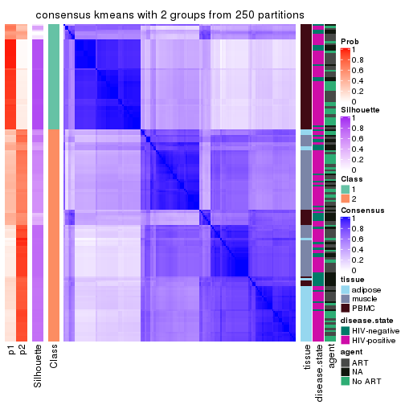</p>

</div>
<div id='tab-CV-kmeans-consensus-heatmap-2'>
<pre><code class="r">consensus_heatmap(res, k = 3)
</code></pre>

<p>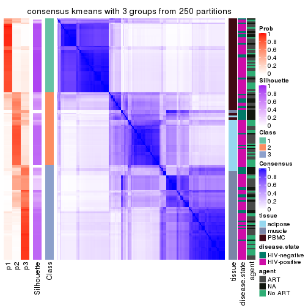</p>

</div>
<div id='tab-CV-kmeans-consensus-heatmap-3'>
<pre><code class="r">consensus_heatmap(res, k = 4)
</code></pre>

<p>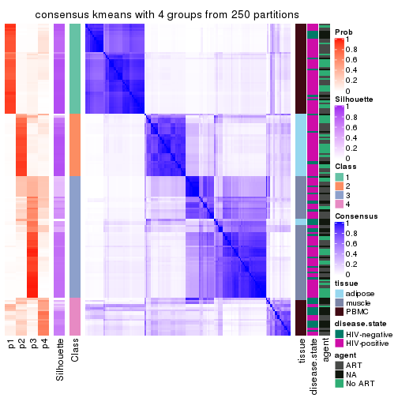</p>

</div>
<div id='tab-CV-kmeans-consensus-heatmap-4'>
<pre><code class="r">consensus_heatmap(res, k = 5)
</code></pre>

<p>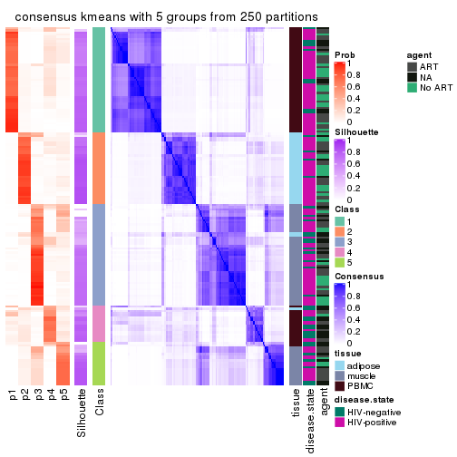</p>

</div>
<div id='tab-CV-kmeans-consensus-heatmap-5'>
<pre><code class="r">consensus_heatmap(res, k = 6)
</code></pre>

<p>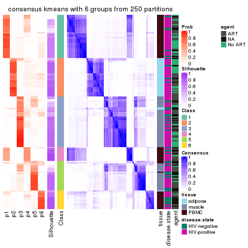</p>

</div>
</div>

Heatmaps for the membership of samples in all partitions to see how consistent they are:


<script>
$( function() {
	$( '#tabs-CV-kmeans-membership-heatmap' ).tabs();
} );
</script>
<div id='tabs-CV-kmeans-membership-heatmap'>
<ul>
<li><a href='#tab-CV-kmeans-membership-heatmap-1'>k = 2</a></li>
<li><a href='#tab-CV-kmeans-membership-heatmap-2'>k = 3</a></li>
<li><a href='#tab-CV-kmeans-membership-heatmap-3'>k = 4</a></li>
<li><a href='#tab-CV-kmeans-membership-heatmap-4'>k = 5</a></li>
<li><a href='#tab-CV-kmeans-membership-heatmap-5'>k = 6</a></li>
</ul>
<div id='tab-CV-kmeans-membership-heatmap-1'>
<pre><code class="r">membership_heatmap(res, k = 2)
</code></pre>

<p>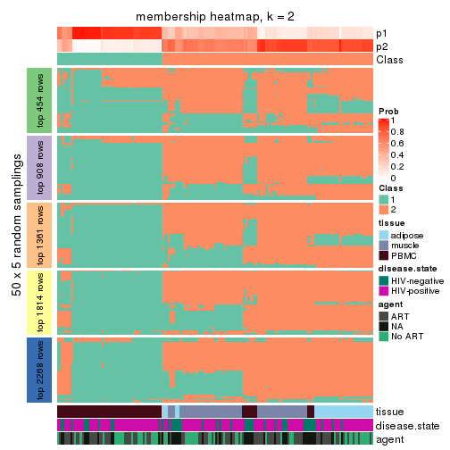</p>

</div>
<div id='tab-CV-kmeans-membership-heatmap-2'>
<pre><code class="r">membership_heatmap(res, k = 3)
</code></pre>

<p>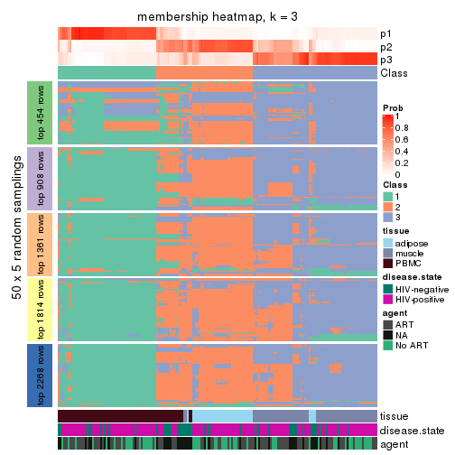</p>

</div>
<div id='tab-CV-kmeans-membership-heatmap-3'>
<pre><code class="r">membership_heatmap(res, k = 4)
</code></pre>

<p>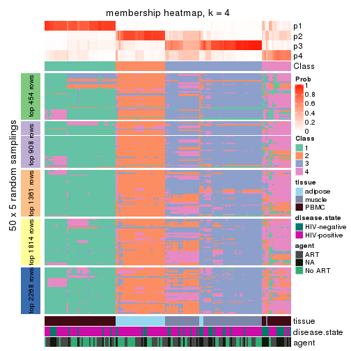</p>

</div>
<div id='tab-CV-kmeans-membership-heatmap-4'>
<pre><code class="r">membership_heatmap(res, k = 5)
</code></pre>

<p>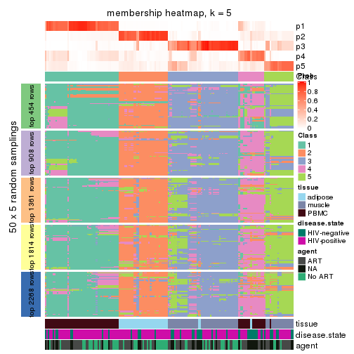</p>

</div>
<div id='tab-CV-kmeans-membership-heatmap-5'>
<pre><code class="r">membership_heatmap(res, k = 6)
</code></pre>

<p>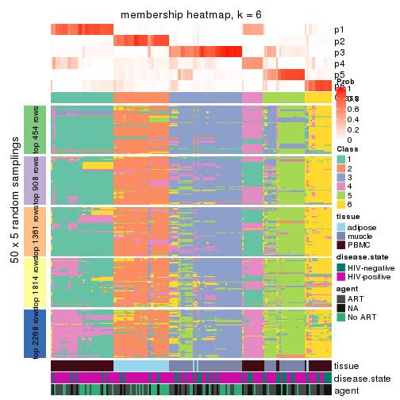</p>

</div>
</div>

As soon as we have had the classes for columns, we can look for signatures
which are significantly different between classes which can be candidate marks
for certain classes. Following are the heatmaps for signatures.


Signature heatmaps where rows are scaled:


<script>
$( function() {
	$( '#tabs-CV-kmeans-get-signatures' ).tabs();
} );
</script>
<div id='tabs-CV-kmeans-get-signatures'>
<ul>
<li><a href='#tab-CV-kmeans-get-signatures-1'>k = 2</a></li>
<li><a href='#tab-CV-kmeans-get-signatures-2'>k = 3</a></li>
<li><a href='#tab-CV-kmeans-get-signatures-3'>k = 4</a></li>
<li><a href='#tab-CV-kmeans-get-signatures-4'>k = 5</a></li>
<li><a href='#tab-CV-kmeans-get-signatures-5'>k = 6</a></li>
</ul>
<div id='tab-CV-kmeans-get-signatures-1'>
<pre><code class="r">get_signatures(res, k = 2)
</code></pre>

<p>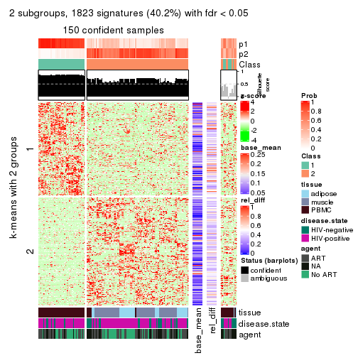</p>

</div>
<div id='tab-CV-kmeans-get-signatures-2'>
<pre><code class="r">get_signatures(res, k = 3)
</code></pre>

<p>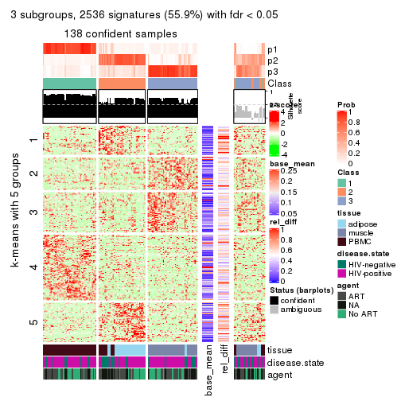</p>

</div>
<div id='tab-CV-kmeans-get-signatures-3'>
<pre><code class="r">get_signatures(res, k = 4)
</code></pre>

<p>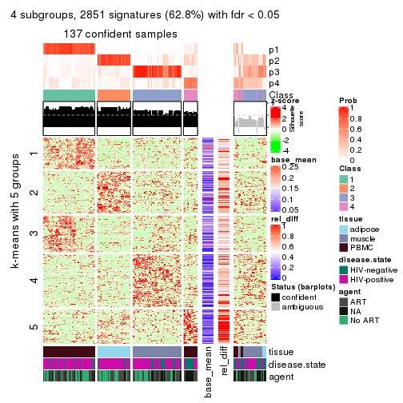</p>

</div>
<div id='tab-CV-kmeans-get-signatures-4'>
<pre><code class="r">get_signatures(res, k = 5)
</code></pre>

<p>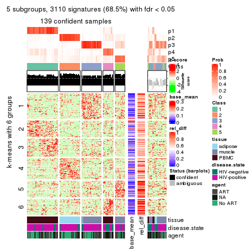</p>

</div>
<div id='tab-CV-kmeans-get-signatures-5'>
<pre><code class="r">get_signatures(res, k = 6)
</code></pre>

<p>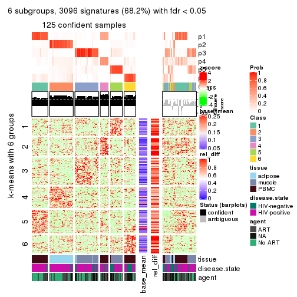</p>

</div>
</div>


Signature heatmaps where rows are not scaled:


<script>
$( function() {
	$( '#tabs-CV-kmeans-get-signatures-no-scale' ).tabs();
} );
</script>
<div id='tabs-CV-kmeans-get-signatures-no-scale'>
<ul>
<li><a href='#tab-CV-kmeans-get-signatures-no-scale-1'>k = 2</a></li>
<li><a href='#tab-CV-kmeans-get-signatures-no-scale-2'>k = 3</a></li>
<li><a href='#tab-CV-kmeans-get-signatures-no-scale-3'>k = 4</a></li>
<li><a href='#tab-CV-kmeans-get-signatures-no-scale-4'>k = 5</a></li>
<li><a href='#tab-CV-kmeans-get-signatures-no-scale-5'>k = 6</a></li>
</ul>
<div id='tab-CV-kmeans-get-signatures-no-scale-1'>
<pre><code class="r">get_signatures(res, k = 2, scale_rows = FALSE)
</code></pre>

<p>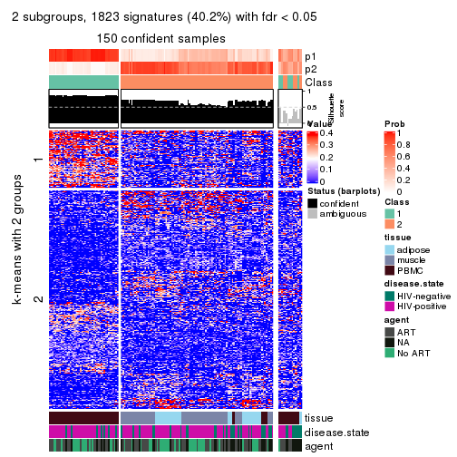</p>

</div>
<div id='tab-CV-kmeans-get-signatures-no-scale-2'>
<pre><code class="r">get_signatures(res, k = 3, scale_rows = FALSE)
</code></pre>

<p>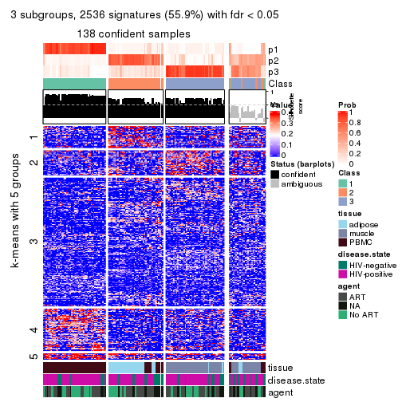</p>

</div>
<div id='tab-CV-kmeans-get-signatures-no-scale-3'>
<pre><code class="r">get_signatures(res, k = 4, scale_rows = FALSE)
</code></pre>

<p>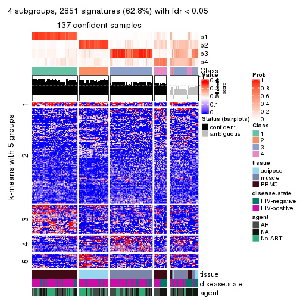</p>

</div>
<div id='tab-CV-kmeans-get-signatures-no-scale-4'>
<pre><code class="r">get_signatures(res, k = 5, scale_rows = FALSE)
</code></pre>

<p>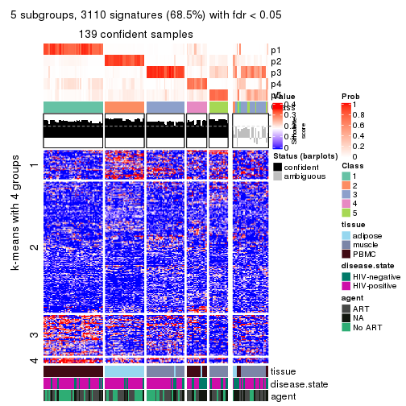</p>

</div>
<div id='tab-CV-kmeans-get-signatures-no-scale-5'>
<pre><code class="r">get_signatures(res, k = 6, scale_rows = FALSE)
</code></pre>

<p>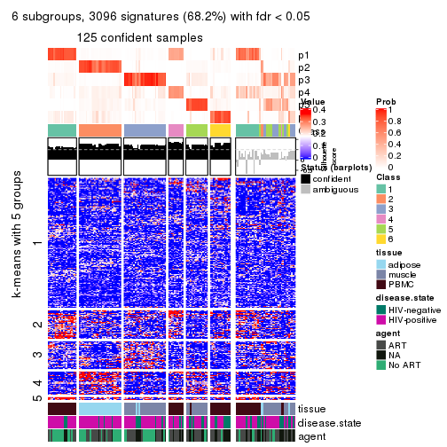</p>

</div>
</div>


Compare the overlap of signatures from different k:

```r
compare_signatures(res)
```

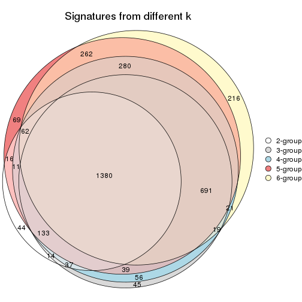

`get_signature()` returns a data frame invisibly. TO get the list of signatures, the function
call should be assigned to a variable explicitly. In following code, if `plot` argument is set
to `FALSE`, no heatmap is plotted while only the differential analysis is performed.

```r
# code only for demonstration
tb = get_signature(res, k = ..., plot = FALSE)
```

An example of the output of `tb` is:

```
#>   which_row         fdr    mean_1    mean_2 scaled_mean_1 scaled_mean_2 km
#> 1        38 0.042760348  8.373488  9.131774    -0.5533452     0.5164555  1
#> 2        40 0.018707592  7.106213  8.469186    -0.6173731     0.5762149  1
#> 3        55 0.019134737 10.221463 11.207825    -0.6159697     0.5749050  1
#> 4        59 0.006059896  5.921854  7.869574    -0.6899429     0.6439467  1
#> 5        60 0.018055526  8.928898 10.211722    -0.6204761     0.5791110  1
#> 6        98 0.009384629 15.714769 14.887706     0.6635654    -0.6193277  2
...
```

The columns in `tb` are:

1. `which_row`: row indices corresponding to the input matrix.
2. `fdr`: FDR for the differential test. 
3. `mean_x`: The mean value in group x.
4. `scaled_mean_x`: The mean value in group x after rows are scaled.
5. `km`: Row groups if k-means clustering is applied to rows.


UMAP plot which shows how samples are separated.


<script>
$( function() {
	$( '#tabs-CV-kmeans-dimension-reduction' ).tabs();
} );
</script>
<div id='tabs-CV-kmeans-dimension-reduction'>
<ul>
<li><a href='#tab-CV-kmeans-dimension-reduction-1'>k = 2</a></li>
<li><a href='#tab-CV-kmeans-dimension-reduction-2'>k = 3</a></li>
<li><a href='#tab-CV-kmeans-dimension-reduction-3'>k = 4</a></li>
<li><a href='#tab-CV-kmeans-dimension-reduction-4'>k = 5</a></li>
<li><a href='#tab-CV-kmeans-dimension-reduction-5'>k = 6</a></li>
</ul>
<div id='tab-CV-kmeans-dimension-reduction-1'>
<pre><code class="r">dimension_reduction(res, k = 2, method = &quot;UMAP&quot;)
</code></pre>

<p>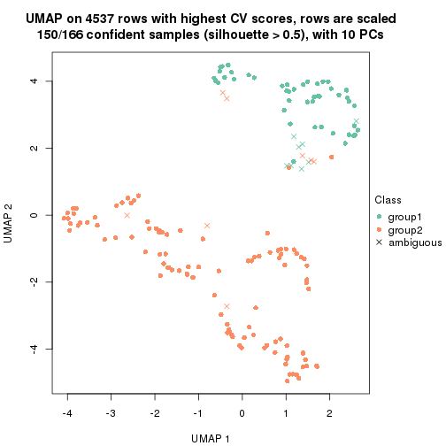</p>

</div>
<div id='tab-CV-kmeans-dimension-reduction-2'>
<pre><code class="r">dimension_reduction(res, k = 3, method = &quot;UMAP&quot;)
</code></pre>

<p>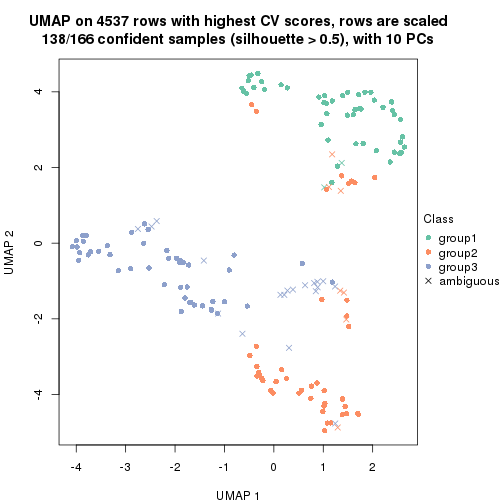</p>

</div>
<div id='tab-CV-kmeans-dimension-reduction-3'>
<pre><code class="r">dimension_reduction(res, k = 4, method = &quot;UMAP&quot;)
</code></pre>

<p>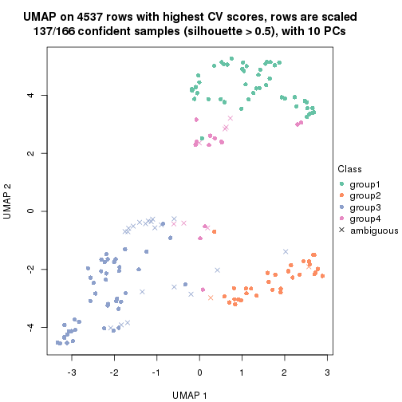</p>

</div>
<div id='tab-CV-kmeans-dimension-reduction-4'>
<pre><code class="r">dimension_reduction(res, k = 5, method = &quot;UMAP&quot;)
</code></pre>

<p>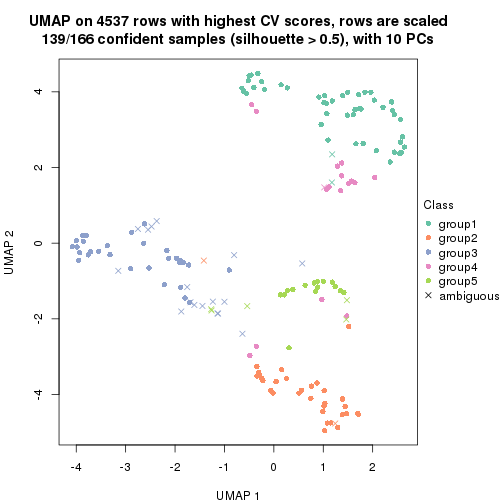</p>

</div>
<div id='tab-CV-kmeans-dimension-reduction-5'>
<pre><code class="r">dimension_reduction(res, k = 6, method = &quot;UMAP&quot;)
</code></pre>

<p>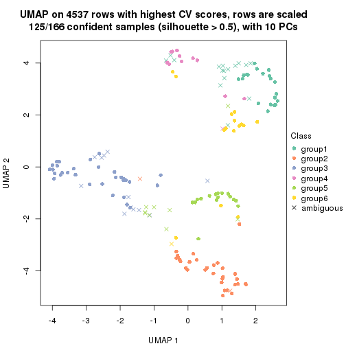</p>

</div>
</div>


Following heatmap shows how subgroups are split when increasing `k`:

```r
collect_classes(res)
```

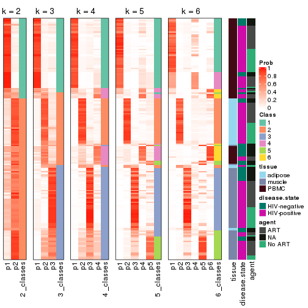


Test correlation between subgroups and known annotations. If the known
annotation is numeric, one-way ANOVA test is applied, and if the known
annotation is discrete, chi-squared contingency table test is applied.

```r
test_to_known_factors(res)
```

```
#>             n tissue(p) disease.state(p) agent(p) k
#> CV:kmeans 150  6.28e-28          0.27762  0.42918 2
#> CV:kmeans 138  1.70e-43          0.40550  0.76265 3
#> CV:kmeans 137  3.02e-56          0.00799  0.01889 4
#> CV:kmeans 139  1.24e-52          0.01679  0.04654 5
#> CV:kmeans 125  2.58e-44          0.03188  0.00789 6
```


If matrix rows can be associated to genes, consider to use `GO_Enrichment(res,
...)` to perform function enrichment for the signature genes.


 

---------------------------------------------------


### CV:skmeans


The object with results only for a single top-value method and a single partition method 
can be extracted as:

```r
res = res_list["CV", "skmeans"]
# you can also extract it by
# res = res_list["CV:skmeans"]
```

A summary of `res` and all the functions that can be applied to it:

```r
res
```

```
#> A 'ConsensusPartition' object with k = 2, 3, 4, 5, 6.
#>   On a matrix with 4537 rows and 166 columns.
#>   Top rows (454, 908, 1361, 1814, 2268) are extracted by 'CV' method.
#>   Subgroups are detected by 'skmeans' method.
#>   Performed in total 1250 partitions by row resampling.
#>   Best k for subgroups seems to be 2.
#> 
#> Following methods can be applied to this 'ConsensusPartition' object:
#>  [1] "cola_report"             "collect_classes"         "collect_plots"          
#>  [4] "collect_stats"           "colnames"                "compare_signatures"     
#>  [7] "consensus_heatmap"       "dimension_reduction"     "functional_enrichment"  
#> [10] "get_anno_col"            "get_anno"                "get_classes"            
#> [13] "get_consensus"           "get_matrix"              "get_membership"         
#> [16] "get_param"               "get_signatures"          "get_stats"              
#> [19] "is_best_k"               "is_stable_k"             "membership_heatmap"     
#> [22] "ncol"                    "nrow"                    "plot_ecdf"              
#> [25] "rownames"                "select_partition_number" "show"                   
#> [28] "suggest_best_k"          "test_to_known_factors"
```

`collect_plots()` function collects all the plots made from `res` for all `k` (number of partitions)
into one single page to provide an easy and fast comparison between different `k`.

```r
collect_plots(res)
```

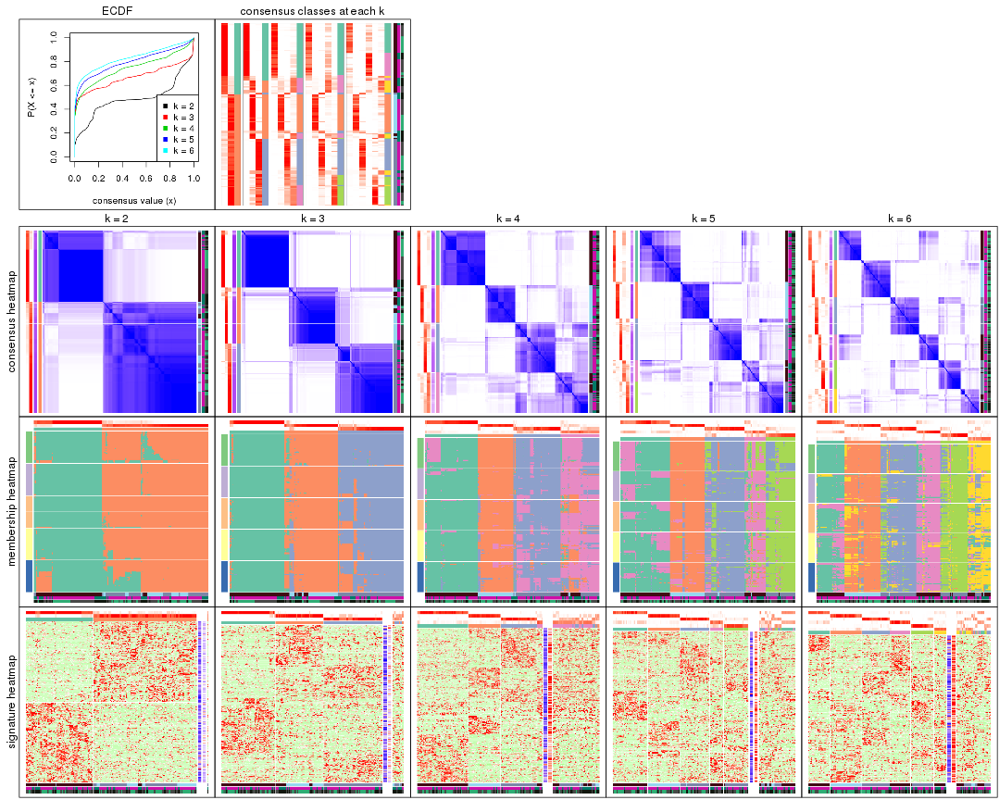

The plots are:

- The first row: a plot of the ECDF (Empirical cumulative distribution
  function) curves of the consensus matrix for each `k` and the heatmap of
  predicted classes for each `k`.
- The second row: heatmaps of the consensus matrix for each `k`.
- The third row: heatmaps of the membership matrix for each `k`.
- The fouth row: heatmaps of the signatures for each `k`.

All the plots in panels can be made by individual functions and they are
plotted later in this section.

`select_partition_number()` produces several plots showing different
statistics for choosing "optimized" `k`. There are following statistics:

- ECDF curves of the consensus matrix for each `k`;
- 1-PAC. [The PAC
  score](https://en.wikipedia.org/wiki/Consensus_clustering#Over-interpretation_potential_of_consensus_clustering)
  measures the proportion of the ambiguous subgrouping.
- Mean silhouette score.
- Concordance. The mean probability of fiting the consensus class ids in all
  partitions.
- Area increased. Denote $A_k$ as the area under the ECDF curve for current
  `k`, the area increased is defined as $A_k - A_{k-1}$.
- Rand index. The percent of pairs of samples that are both in a same cluster
  or both are not in a same cluster in the partition of k and k-1.
- Jaccard index. The ratio of pairs of samples are both in a same cluster in
  the partition of k and k-1 and the pairs of samples are both in a same
  cluster in the partition k or k-1.

The detailed explanations of these statistics can be found in [the cola
vignette](http://bioconductor.org/packages/devel/bioc/vignettes/cola/inst/doc/cola.html#toc_13).

Generally speaking, lower PAC score, higher mean silhouette score or higher
concordance corresponds to better partition. Rand index and Jaccard index
measure how similar the current partition is compared to partition with `k-1`.
If they are too similar, we won't accept `k` is better than `k-1`.

```r
select_partition_number(res)
```

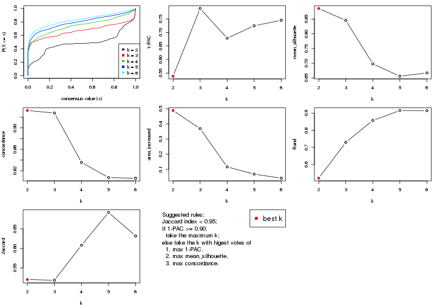

The numeric values for all these statistics can be obtained by `get_stats()`.

```r
get_stats(res)
```

```
#>   k 1-PAC mean_silhouette concordance area_increased  Rand Jaccard
#> 2 2 0.538           0.886       0.933         0.4887 0.521   0.521
#> 3 3 0.789           0.845       0.928         0.3686 0.730   0.519
#> 4 4 0.679           0.698       0.836         0.1163 0.858   0.608
#> 5 5 0.725           0.656       0.807         0.0685 0.916   0.692
#> 6 6 0.745           0.667       0.806         0.0416 0.915   0.632
```

`suggest_best_k()` suggests the best $k$ based on these statistics. The rules are as follows:

- All $k$ with Jaccard index larger than 0.95 are removed because the increase of
  the partition number does not provides enough extra information. If all $k$ are removed,
  the best $k$ is assigned by `NA`.
- For $k$ with 1-PAC larger than 0.9, the maximal $k$ is taken as the "best k". Other $k$ is called "optional k".
- If it does not fit the second rule. The $k$ with the highest vote of highest
  1-PAC, mean silhouette and concordance is taken as the "best k".

```r
suggest_best_k(res)
```

```
#> [1] 2
```


Following shows the table of the partitions (You need to click the **show/hide
code output** link to see it). The membership matrix (columns with name `p*`)
is inferred by
[`clue::cl_consensus()`](https://www.rdocumentation.org/link/cl_consensus?package=clue)
function with the `SE` method. Basically the value in the membership matrix
represents the probability to belong to a certain group. The finall class
label for an item is determined with the group with highest probability it
belongs to.

In `get_classes()` function, the entropy is calculated from the membership
matrix and the silhouette score is calculated from the consensus matrix.


<script>
$( function() {
	$( '#tabs-CV-skmeans-get-classes' ).tabs();
} );
</script>
<div id='tabs-CV-skmeans-get-classes'>
<ul>
<li><a href='#tab-CV-skmeans-get-classes-1'>k = 2</a></li>
<li><a href='#tab-CV-skmeans-get-classes-2'>k = 3</a></li>
<li><a href='#tab-CV-skmeans-get-classes-3'>k = 4</a></li>
<li><a href='#tab-CV-skmeans-get-classes-4'>k = 5</a></li>
<li><a href='#tab-CV-skmeans-get-classes-5'>k = 6</a></li>
</ul>

<div id='tab-CV-skmeans-get-classes-1'>
<p><a id='tab-CV-skmeans-get-classes-1-a' style='color:#0366d6' href='#'>show/hide code output</a></p>
<pre><code class="r">cbind(get_classes(res, k = 2), get_membership(res, k = 2))
</code></pre>

<pre><code>#&gt;           class entropy silhouette    p1    p2
#&gt; GSM751298     1  0.0000      0.949 1.000 0.000
#&gt; GSM751304     1  0.6343      0.837 0.840 0.160
#&gt; GSM751305     1  0.6623      0.825 0.828 0.172
#&gt; GSM751307     1  0.6438      0.833 0.836 0.164
#&gt; GSM751310     1  0.0000      0.949 1.000 0.000
#&gt; GSM751314     1  0.0000      0.949 1.000 0.000
#&gt; GSM751316     1  0.0000      0.949 1.000 0.000
#&gt; GSM751318     1  0.0000      0.949 1.000 0.000
#&gt; GSM751342     1  0.0000      0.949 1.000 0.000
#&gt; GSM751346     1  0.0000      0.949 1.000 0.000
#&gt; GSM751347     1  0.3879      0.888 0.924 0.076
#&gt; GSM751348     1  0.6048      0.848 0.852 0.148
#&gt; GSM751349     2  0.6531      0.792 0.168 0.832
#&gt; GSM751352     1  0.6148      0.845 0.848 0.152
#&gt; GSM751353     2  0.6973      0.766 0.188 0.812
#&gt; GSM751354     1  0.8327      0.703 0.736 0.264
#&gt; GSM751355     2  0.6531      0.791 0.168 0.832
#&gt; GSM751358     1  0.5629      0.860 0.868 0.132
#&gt; GSM751359     2  0.5294      0.844 0.120 0.880
#&gt; GSM751294     1  0.6247      0.842 0.844 0.156
#&gt; GSM751296     1  0.0000      0.949 1.000 0.000
#&gt; GSM751297     1  0.0000      0.949 1.000 0.000
#&gt; GSM751299     1  0.6148      0.845 0.848 0.152
#&gt; GSM751300     1  0.0000      0.949 1.000 0.000
#&gt; GSM751301     1  0.5294      0.869 0.880 0.120
#&gt; GSM751302     1  0.0000      0.949 1.000 0.000
#&gt; GSM751303     1  0.0000      0.949 1.000 0.000
#&gt; GSM751306     1  0.0000      0.949 1.000 0.000
#&gt; GSM751308     1  0.0000      0.949 1.000 0.000
#&gt; GSM751309     1  0.0000      0.949 1.000 0.000
#&gt; GSM751311     1  0.0000      0.949 1.000 0.000
#&gt; GSM751312     1  0.0000      0.949 1.000 0.000
#&gt; GSM751313     1  0.0000      0.949 1.000 0.000
#&gt; GSM751315     1  0.0000      0.949 1.000 0.000
#&gt; GSM751317     1  0.0000      0.949 1.000 0.000
#&gt; GSM751320     1  0.0000      0.949 1.000 0.000
#&gt; GSM751321     1  0.0000      0.949 1.000 0.000
#&gt; GSM751322     1  0.0000      0.949 1.000 0.000
#&gt; GSM751324     1  0.0000      0.949 1.000 0.000
#&gt; GSM751325     1  0.0000      0.949 1.000 0.000
#&gt; GSM751332     1  0.0000      0.949 1.000 0.000
#&gt; GSM751334     1  0.0000      0.949 1.000 0.000
#&gt; GSM751339     1  0.0000      0.949 1.000 0.000
#&gt; GSM751341     1  0.0000      0.949 1.000 0.000
#&gt; GSM751343     1  0.0000      0.949 1.000 0.000
#&gt; GSM751344     1  0.6531      0.829 0.832 0.168
#&gt; GSM751345     1  0.6531      0.829 0.832 0.168
#&gt; GSM751356     1  0.6148      0.845 0.848 0.152
#&gt; GSM751357     1  0.6148      0.845 0.848 0.152
#&gt; GSM751293     1  0.5294      0.869 0.880 0.120
#&gt; GSM751295     1  0.0000      0.949 1.000 0.000
#&gt; GSM751319     1  0.0000      0.949 1.000 0.000
#&gt; GSM751323     1  0.0000      0.949 1.000 0.000
#&gt; GSM751326     1  0.0000      0.949 1.000 0.000
#&gt; GSM751327     1  0.0000      0.949 1.000 0.000
#&gt; GSM751328     1  0.0000      0.949 1.000 0.000
#&gt; GSM751329     1  0.0000      0.949 1.000 0.000
#&gt; GSM751330     1  0.0000      0.949 1.000 0.000
#&gt; GSM751331     1  0.0000      0.949 1.000 0.000
#&gt; GSM751333     1  0.0000      0.949 1.000 0.000
#&gt; GSM751335     1  0.0000      0.949 1.000 0.000
#&gt; GSM751336     1  0.0000      0.949 1.000 0.000
#&gt; GSM751337     1  0.0000      0.949 1.000 0.000
#&gt; GSM751338     1  0.0000      0.949 1.000 0.000
#&gt; GSM751340     1  0.0000      0.949 1.000 0.000
#&gt; GSM751350     1  0.0000      0.949 1.000 0.000
#&gt; GSM751351     1  0.0000      0.949 1.000 0.000
#&gt; GSM751362     2  0.8813      0.703 0.300 0.700
#&gt; GSM751363     2  0.6343      0.799 0.160 0.840
#&gt; GSM751367     1  0.8207      0.612 0.744 0.256
#&gt; GSM751368     2  0.0000      0.911 0.000 1.000
#&gt; GSM751371     2  0.9850      0.410 0.428 0.572
#&gt; GSM751375     2  0.0000      0.911 0.000 1.000
#&gt; GSM751376     2  0.0672      0.911 0.008 0.992
#&gt; GSM751378     2  0.0000      0.911 0.000 1.000
#&gt; GSM751379     2  0.0672      0.911 0.008 0.992
#&gt; GSM751382     2  0.0000      0.911 0.000 1.000
#&gt; GSM751386     2  0.0000      0.911 0.000 1.000
#&gt; GSM751388     2  0.0000      0.911 0.000 1.000
#&gt; GSM751391     2  0.6048      0.857 0.148 0.852
#&gt; GSM751410     1  0.6623      0.762 0.828 0.172
#&gt; GSM751414     2  0.6247      0.853 0.156 0.844
#&gt; GSM751361     2  0.1184      0.911 0.016 0.984
#&gt; GSM751365     2  0.5294      0.876 0.120 0.880
#&gt; GSM751366     2  0.6438      0.847 0.164 0.836
#&gt; GSM751369     2  0.8608      0.716 0.284 0.716
#&gt; GSM751370     2  0.7299      0.820 0.204 0.796
#&gt; GSM751372     2  0.5059      0.881 0.112 0.888
#&gt; GSM751373     2  0.6247      0.853 0.156 0.844
#&gt; GSM751374     2  0.0672      0.911 0.008 0.992
#&gt; GSM751377     2  0.0376      0.911 0.004 0.996
#&gt; GSM751380     2  0.6438      0.847 0.164 0.836
#&gt; GSM751381     2  0.0000      0.911 0.000 1.000
#&gt; GSM751383     2  0.0000      0.911 0.000 1.000
#&gt; GSM751384     2  0.0000      0.911 0.000 1.000
#&gt; GSM751385     2  0.0000      0.911 0.000 1.000
#&gt; GSM751387     2  0.0000      0.911 0.000 1.000
#&gt; GSM751389     2  0.3431      0.900 0.064 0.936
#&gt; GSM751393     2  0.0000      0.911 0.000 1.000
#&gt; GSM751394     2  0.0000      0.911 0.000 1.000
#&gt; GSM751395     2  0.0000      0.911 0.000 1.000
#&gt; GSM751397     2  0.0000      0.911 0.000 1.000
#&gt; GSM751398     2  0.0000      0.911 0.000 1.000
#&gt; GSM751404     2  0.6343      0.850 0.160 0.840
#&gt; GSM751406     2  0.6343      0.850 0.160 0.840
#&gt; GSM751411     2  0.5294      0.876 0.120 0.880
#&gt; GSM751413     2  0.0672      0.911 0.008 0.992
#&gt; GSM751415     2  0.6343      0.850 0.160 0.840
#&gt; GSM751416     2  0.1184      0.911 0.016 0.984
#&gt; GSM751417     2  0.1184      0.911 0.016 0.984
#&gt; GSM751421     2  0.7950      0.775 0.240 0.760
#&gt; GSM751422     2  0.8016      0.770 0.244 0.756
#&gt; GSM751360     2  0.8016      0.770 0.244 0.756
#&gt; GSM751364     2  0.1414      0.910 0.020 0.980
#&gt; GSM751390     2  0.0000      0.911 0.000 1.000
#&gt; GSM751392     2  0.0000      0.911 0.000 1.000
#&gt; GSM751396     2  0.0000      0.911 0.000 1.000
#&gt; GSM751399     2  0.4690      0.886 0.100 0.900
#&gt; GSM751400     2  0.4298      0.893 0.088 0.912
#&gt; GSM751401     2  0.6343      0.850 0.160 0.840
#&gt; GSM751402     2  0.6343      0.850 0.160 0.840
#&gt; GSM751403     2  0.4939      0.882 0.108 0.892
#&gt; GSM751405     2  0.6148      0.856 0.152 0.848
#&gt; GSM751407     2  0.5737      0.867 0.136 0.864
#&gt; GSM751408     2  0.4815      0.884 0.104 0.896
#&gt; GSM751409     2  0.3274      0.901 0.060 0.940
#&gt; GSM751412     2  0.5408      0.874 0.124 0.876
#&gt; GSM751418     2  0.5294      0.876 0.120 0.880
#&gt; GSM751419     2  0.5294      0.876 0.120 0.880
#&gt; GSM751420     2  0.5408      0.876 0.124 0.876
#&gt; GSM751425     2  0.0000      0.911 0.000 1.000
#&gt; GSM751429     2  0.8813      0.689 0.300 0.700
#&gt; GSM751430     2  0.4562      0.864 0.096 0.904
#&gt; GSM751433     2  0.9087      0.510 0.324 0.676
#&gt; GSM751437     2  0.5946      0.862 0.144 0.856
#&gt; GSM751448     2  0.8909      0.677 0.308 0.692
#&gt; GSM751451     2  0.1633      0.906 0.024 0.976
#&gt; GSM751423     2  0.0000      0.911 0.000 1.000
#&gt; GSM751424     2  0.2423      0.900 0.040 0.960
#&gt; GSM751428     2  0.0376      0.911 0.004 0.996
#&gt; GSM751431     2  0.2603      0.898 0.044 0.956
#&gt; GSM751432     2  0.4431      0.867 0.092 0.908
#&gt; GSM751434     2  0.4690      0.861 0.100 0.900
#&gt; GSM751435     2  0.3584      0.884 0.068 0.932
#&gt; GSM751436     2  0.5408      0.839 0.124 0.876
#&gt; GSM751440     2  0.2423      0.900 0.040 0.960
#&gt; GSM751444     2  0.2423      0.900 0.040 0.960
#&gt; GSM751446     2  0.0938      0.909 0.012 0.988
#&gt; GSM751449     2  0.0376      0.911 0.004 0.996
#&gt; GSM751450     2  0.1843      0.905 0.028 0.972
#&gt; GSM751452     2  0.3584      0.884 0.068 0.932
#&gt; GSM751426     2  0.2603      0.898 0.044 0.956
#&gt; GSM751427     2  0.0000      0.911 0.000 1.000
#&gt; GSM751438     2  0.0000      0.911 0.000 1.000
#&gt; GSM751439     2  0.6343      0.858 0.160 0.840
#&gt; GSM751441     2  0.0000      0.911 0.000 1.000
#&gt; GSM751442     2  0.1184      0.908 0.016 0.984
#&gt; GSM751443     2  0.5519      0.873 0.128 0.872
#&gt; GSM751445     2  0.0376      0.911 0.004 0.996
#&gt; GSM751447     2  0.0000      0.911 0.000 1.000
#&gt; GSM751453     2  0.0376      0.911 0.004 0.996
#&gt; GSM751454     2  0.0376      0.911 0.004 0.996
#&gt; GSM751455     2  0.0376      0.911 0.004 0.996
#&gt; GSM751456     2  0.0376      0.911 0.004 0.996
#&gt; GSM751457     2  0.0000      0.911 0.000 1.000
#&gt; GSM751458     2  0.0000      0.911 0.000 1.000
</code></pre>

<script>
$('#tab-CV-skmeans-get-classes-1-a').parent().next().next().hide();
$('#tab-CV-skmeans-get-classes-1-a').click(function(){
  $('#tab-CV-skmeans-get-classes-1-a').parent().next().next().toggle();
  return(false);
});
</script>
</div>

<div id='tab-CV-skmeans-get-classes-2'>
<p><a id='tab-CV-skmeans-get-classes-2-a' style='color:#0366d6' href='#'>show/hide code output</a></p>
<pre><code class="r">cbind(get_classes(res, k = 3), get_membership(res, k = 3))
</code></pre>

<pre><code>#&gt;           class entropy silhouette    p1    p2    p3
#&gt; GSM751298     1  0.0000      0.978 1.000 0.000 0.000
#&gt; GSM751304     2  0.1919      0.901 0.024 0.956 0.020
#&gt; GSM751305     2  0.1781      0.903 0.020 0.960 0.020
#&gt; GSM751307     2  0.2301      0.880 0.060 0.936 0.004
#&gt; GSM751310     1  0.0000      0.978 1.000 0.000 0.000
#&gt; GSM751314     1  0.0000      0.978 1.000 0.000 0.000
#&gt; GSM751316     1  0.0000      0.978 1.000 0.000 0.000
#&gt; GSM751318     1  0.0000      0.978 1.000 0.000 0.000
#&gt; GSM751342     1  0.0000      0.978 1.000 0.000 0.000
#&gt; GSM751346     1  0.0000      0.978 1.000 0.000 0.000
#&gt; GSM751347     1  0.1411      0.941 0.964 0.000 0.036
#&gt; GSM751348     1  0.5517      0.607 0.728 0.268 0.004
#&gt; GSM751349     2  0.1453      0.902 0.008 0.968 0.024
#&gt; GSM751352     2  0.3375      0.841 0.100 0.892 0.008
#&gt; GSM751353     2  0.0237      0.916 0.000 0.996 0.004
#&gt; GSM751354     2  0.1774      0.904 0.016 0.960 0.024
#&gt; GSM751355     2  0.0237      0.916 0.000 0.996 0.004
#&gt; GSM751358     1  0.6313      0.505 0.676 0.308 0.016
#&gt; GSM751359     2  0.3532      0.811 0.008 0.884 0.108
#&gt; GSM751294     2  0.5992      0.628 0.268 0.716 0.016
#&gt; GSM751296     1  0.0000      0.978 1.000 0.000 0.000
#&gt; GSM751297     1  0.0237      0.974 0.996 0.000 0.004
#&gt; GSM751299     2  0.4531      0.772 0.168 0.824 0.008
#&gt; GSM751300     1  0.0000      0.978 1.000 0.000 0.000
#&gt; GSM751301     1  0.5016      0.678 0.760 0.240 0.000
#&gt; GSM751302     1  0.0000      0.978 1.000 0.000 0.000
#&gt; GSM751303     1  0.0000      0.978 1.000 0.000 0.000
#&gt; GSM751306     1  0.0000      0.978 1.000 0.000 0.000
#&gt; GSM751308     1  0.0237      0.974 0.996 0.000 0.004
#&gt; GSM751309     1  0.0000      0.978 1.000 0.000 0.000
#&gt; GSM751311     1  0.0000      0.978 1.000 0.000 0.000
#&gt; GSM751312     1  0.0000      0.978 1.000 0.000 0.000
#&gt; GSM751313     1  0.0000      0.978 1.000 0.000 0.000
#&gt; GSM751315     1  0.0000      0.978 1.000 0.000 0.000
#&gt; GSM751317     1  0.0000      0.978 1.000 0.000 0.000
#&gt; GSM751320     1  0.0000      0.978 1.000 0.000 0.000
#&gt; GSM751321     1  0.0000      0.978 1.000 0.000 0.000
#&gt; GSM751322     1  0.0000      0.978 1.000 0.000 0.000
#&gt; GSM751324     1  0.0000      0.978 1.000 0.000 0.000
#&gt; GSM751325     1  0.0000      0.978 1.000 0.000 0.000
#&gt; GSM751332     1  0.0000      0.978 1.000 0.000 0.000
#&gt; GSM751334     1  0.0000      0.978 1.000 0.000 0.000
#&gt; GSM751339     1  0.0000      0.978 1.000 0.000 0.000
#&gt; GSM751341     1  0.0000      0.978 1.000 0.000 0.000
#&gt; GSM751343     1  0.0000      0.978 1.000 0.000 0.000
#&gt; GSM751344     2  0.0983      0.910 0.016 0.980 0.004
#&gt; GSM751345     2  0.0983      0.910 0.016 0.980 0.004
#&gt; GSM751356     2  0.6540      0.337 0.408 0.584 0.008
#&gt; GSM751357     2  0.6540      0.337 0.408 0.584 0.008
#&gt; GSM751293     1  0.4235      0.777 0.824 0.176 0.000
#&gt; GSM751295     1  0.0000      0.978 1.000 0.000 0.000
#&gt; GSM751319     1  0.0000      0.978 1.000 0.000 0.000
#&gt; GSM751323     1  0.0000      0.978 1.000 0.000 0.000
#&gt; GSM751326     1  0.0000      0.978 1.000 0.000 0.000
#&gt; GSM751327     1  0.0000      0.978 1.000 0.000 0.000
#&gt; GSM751328     1  0.0000      0.978 1.000 0.000 0.000
#&gt; GSM751329     1  0.0000      0.978 1.000 0.000 0.000
#&gt; GSM751330     1  0.0000      0.978 1.000 0.000 0.000
#&gt; GSM751331     1  0.0000      0.978 1.000 0.000 0.000
#&gt; GSM751333     1  0.0000      0.978 1.000 0.000 0.000
#&gt; GSM751335     1  0.0000      0.978 1.000 0.000 0.000
#&gt; GSM751336     1  0.0000      0.978 1.000 0.000 0.000
#&gt; GSM751337     1  0.0000      0.978 1.000 0.000 0.000
#&gt; GSM751338     1  0.0000      0.978 1.000 0.000 0.000
#&gt; GSM751340     1  0.0592      0.967 0.988 0.000 0.012
#&gt; GSM751350     1  0.0000      0.978 1.000 0.000 0.000
#&gt; GSM751351     1  0.0000      0.978 1.000 0.000 0.000
#&gt; GSM751362     3  0.1163      0.859 0.028 0.000 0.972
#&gt; GSM751363     3  0.2625      0.845 0.000 0.084 0.916
#&gt; GSM751367     3  0.6566      0.433 0.348 0.016 0.636
#&gt; GSM751368     3  0.4842      0.735 0.000 0.224 0.776
#&gt; GSM751371     3  0.1129      0.863 0.020 0.004 0.976
#&gt; GSM751375     3  0.6302      0.276 0.000 0.480 0.520
#&gt; GSM751376     3  0.6225      0.198 0.000 0.432 0.568
#&gt; GSM751378     3  0.3116      0.825 0.000 0.108 0.892
#&gt; GSM751379     3  0.6204      0.224 0.000 0.424 0.576
#&gt; GSM751382     3  0.6154      0.462 0.000 0.408 0.592
#&gt; GSM751386     3  0.5560      0.653 0.000 0.300 0.700
#&gt; GSM751388     3  0.5560      0.653 0.000 0.300 0.700
#&gt; GSM751391     3  0.2261      0.841 0.000 0.068 0.932
#&gt; GSM751410     3  0.3412      0.785 0.124 0.000 0.876
#&gt; GSM751414     3  0.0237      0.871 0.000 0.004 0.996
#&gt; GSM751361     3  0.2711      0.842 0.000 0.088 0.912
#&gt; GSM751365     3  0.0000      0.870 0.000 0.000 1.000
#&gt; GSM751366     3  0.0237      0.871 0.000 0.004 0.996
#&gt; GSM751369     3  0.0475      0.870 0.004 0.004 0.992
#&gt; GSM751370     3  0.0475      0.870 0.004 0.004 0.992
#&gt; GSM751372     3  0.0237      0.871 0.000 0.004 0.996
#&gt; GSM751373     3  0.0424      0.871 0.000 0.008 0.992
#&gt; GSM751374     3  0.6225      0.198 0.000 0.432 0.568
#&gt; GSM751377     3  0.3412      0.820 0.000 0.124 0.876
#&gt; GSM751380     3  0.0237      0.871 0.000 0.004 0.996
#&gt; GSM751381     3  0.5560      0.653 0.000 0.300 0.700
#&gt; GSM751383     3  0.5560      0.653 0.000 0.300 0.700
#&gt; GSM751384     3  0.2165      0.853 0.000 0.064 0.936
#&gt; GSM751385     3  0.0892      0.868 0.000 0.020 0.980
#&gt; GSM751387     3  0.5560      0.653 0.000 0.300 0.700
#&gt; GSM751389     3  0.0237      0.871 0.000 0.004 0.996
#&gt; GSM751393     3  0.0000      0.870 0.000 0.000 1.000
#&gt; GSM751394     3  0.5560      0.653 0.000 0.300 0.700
#&gt; GSM751395     3  0.3879      0.761 0.000 0.152 0.848
#&gt; GSM751397     3  0.5560      0.653 0.000 0.300 0.700
#&gt; GSM751398     3  0.5560      0.653 0.000 0.300 0.700
#&gt; GSM751404     3  0.0237      0.871 0.000 0.004 0.996
#&gt; GSM751406     3  0.0237      0.871 0.000 0.004 0.996
#&gt; GSM751411     3  0.0000      0.870 0.000 0.000 1.000
#&gt; GSM751413     3  0.3551      0.816 0.000 0.132 0.868
#&gt; GSM751415     3  0.0237      0.871 0.000 0.004 0.996
#&gt; GSM751416     3  0.2796      0.840 0.000 0.092 0.908
#&gt; GSM751417     3  0.2796      0.840 0.000 0.092 0.908
#&gt; GSM751421     3  0.0237      0.871 0.000 0.004 0.996
#&gt; GSM751422     3  0.0237      0.871 0.000 0.004 0.996
#&gt; GSM751360     3  0.0000      0.870 0.000 0.000 1.000
#&gt; GSM751364     3  0.1411      0.863 0.000 0.036 0.964
#&gt; GSM751390     3  0.2066      0.855 0.000 0.060 0.940
#&gt; GSM751392     3  0.5678      0.630 0.000 0.316 0.684
#&gt; GSM751396     3  0.5785      0.605 0.000 0.332 0.668
#&gt; GSM751399     3  0.0000      0.870 0.000 0.000 1.000
#&gt; GSM751400     3  0.0237      0.871 0.000 0.004 0.996
#&gt; GSM751401     3  0.0237      0.871 0.000 0.004 0.996
#&gt; GSM751402     3  0.0237      0.871 0.000 0.004 0.996
#&gt; GSM751403     3  0.0237      0.871 0.000 0.004 0.996
#&gt; GSM751405     3  0.0237      0.871 0.000 0.004 0.996
#&gt; GSM751407     3  0.0237      0.871 0.000 0.004 0.996
#&gt; GSM751408     3  0.0237      0.871 0.000 0.004 0.996
#&gt; GSM751409     3  0.0237      0.871 0.000 0.004 0.996
#&gt; GSM751412     3  0.0237      0.871 0.000 0.004 0.996
#&gt; GSM751418     3  0.0592      0.870 0.000 0.012 0.988
#&gt; GSM751419     3  0.0592      0.870 0.000 0.012 0.988
#&gt; GSM751420     3  0.0237      0.871 0.000 0.004 0.996
#&gt; GSM751425     2  0.0000      0.919 0.000 1.000 0.000
#&gt; GSM751429     2  0.9020      0.253 0.140 0.496 0.364
#&gt; GSM751430     2  0.1163      0.901 0.000 0.972 0.028
#&gt; GSM751433     2  0.0000      0.919 0.000 1.000 0.000
#&gt; GSM751437     2  0.6225      0.256 0.000 0.568 0.432
#&gt; GSM751448     2  0.8076      0.234 0.068 0.524 0.408
#&gt; GSM751451     2  0.0000      0.919 0.000 1.000 0.000
#&gt; GSM751423     2  0.0000      0.919 0.000 1.000 0.000
#&gt; GSM751424     2  0.0000      0.919 0.000 1.000 0.000
#&gt; GSM751428     2  0.0000      0.919 0.000 1.000 0.000
#&gt; GSM751431     2  0.0000      0.919 0.000 1.000 0.000
#&gt; GSM751432     2  0.0000      0.919 0.000 1.000 0.000
#&gt; GSM751434     2  0.0000      0.919 0.000 1.000 0.000
#&gt; GSM751435     2  0.0000      0.919 0.000 1.000 0.000
#&gt; GSM751436     2  0.0000      0.919 0.000 1.000 0.000
#&gt; GSM751440     2  0.0000      0.919 0.000 1.000 0.000
#&gt; GSM751444     2  0.0000      0.919 0.000 1.000 0.000
#&gt; GSM751446     2  0.0000      0.919 0.000 1.000 0.000
#&gt; GSM751449     2  0.0000      0.919 0.000 1.000 0.000
#&gt; GSM751450     2  0.0000      0.919 0.000 1.000 0.000
#&gt; GSM751452     2  0.0000      0.919 0.000 1.000 0.000
#&gt; GSM751426     2  0.0000      0.919 0.000 1.000 0.000
#&gt; GSM751427     2  0.0000      0.919 0.000 1.000 0.000
#&gt; GSM751438     2  0.0000      0.919 0.000 1.000 0.000
#&gt; GSM751439     2  0.3752      0.784 0.000 0.856 0.144
#&gt; GSM751441     2  0.0000      0.919 0.000 1.000 0.000
#&gt; GSM751442     2  0.0000      0.919 0.000 1.000 0.000
#&gt; GSM751443     2  0.5465      0.570 0.000 0.712 0.288
#&gt; GSM751445     2  0.0000      0.919 0.000 1.000 0.000
#&gt; GSM751447     2  0.0000      0.919 0.000 1.000 0.000
#&gt; GSM751453     2  0.0000      0.919 0.000 1.000 0.000
#&gt; GSM751454     2  0.0000      0.919 0.000 1.000 0.000
#&gt; GSM751455     2  0.0000      0.919 0.000 1.000 0.000
#&gt; GSM751456     2  0.0000      0.919 0.000 1.000 0.000
#&gt; GSM751457     2  0.0892      0.908 0.000 0.980 0.020
#&gt; GSM751458     2  0.0892      0.908 0.000 0.980 0.020
</code></pre>

<script>
$('#tab-CV-skmeans-get-classes-2-a').parent().next().next().hide();
$('#tab-CV-skmeans-get-classes-2-a').click(function(){
  $('#tab-CV-skmeans-get-classes-2-a').parent().next().next().toggle();
  return(false);
});
</script>
</div>

<div id='tab-CV-skmeans-get-classes-3'>
<p><a id='tab-CV-skmeans-get-classes-3-a' style='color:#0366d6' href='#'>show/hide code output</a></p>
<pre><code class="r">cbind(get_classes(res, k = 4), get_membership(res, k = 4))
</code></pre>

<pre><code>#&gt;           class entropy silhouette    p1    p2    p3    p4
#&gt; GSM751298     1  0.0336     0.9145 0.992 0.000 0.000 0.008
#&gt; GSM751304     4  0.5532     0.4992 0.004 0.232 0.056 0.708
#&gt; GSM751305     4  0.5247     0.4994 0.000 0.228 0.052 0.720
#&gt; GSM751307     4  0.4776     0.4628 0.016 0.272 0.000 0.712
#&gt; GSM751310     1  0.2530     0.8786 0.888 0.000 0.000 0.112
#&gt; GSM751314     1  0.3266     0.8464 0.832 0.000 0.000 0.168
#&gt; GSM751316     1  0.3444     0.8363 0.816 0.000 0.000 0.184
#&gt; GSM751318     1  0.0336     0.9145 0.992 0.000 0.000 0.008
#&gt; GSM751342     1  0.3486     0.8330 0.812 0.000 0.000 0.188
#&gt; GSM751346     1  0.1302     0.9088 0.956 0.000 0.000 0.044
#&gt; GSM751347     1  0.1902     0.8979 0.932 0.004 0.000 0.064
#&gt; GSM751348     4  0.5968     0.4262 0.236 0.092 0.000 0.672
#&gt; GSM751349     4  0.3577     0.5810 0.000 0.156 0.012 0.832
#&gt; GSM751352     4  0.6050     0.4916 0.032 0.240 0.040 0.688
#&gt; GSM751353     4  0.4813     0.4793 0.012 0.268 0.004 0.716
#&gt; GSM751354     4  0.5659     0.4907 0.008 0.240 0.052 0.700
#&gt; GSM751355     4  0.4482     0.4848 0.008 0.264 0.000 0.728
#&gt; GSM751358     4  0.6961     0.4822 0.184 0.064 0.084 0.668
#&gt; GSM751359     4  0.2775     0.5791 0.000 0.084 0.020 0.896
#&gt; GSM751294     4  0.8493     0.4588 0.192 0.172 0.096 0.540
#&gt; GSM751296     1  0.0469     0.9151 0.988 0.000 0.000 0.012
#&gt; GSM751297     1  0.3161     0.8746 0.896 0.020 0.028 0.056
#&gt; GSM751299     4  0.6585     0.4672 0.068 0.256 0.028 0.648
#&gt; GSM751300     1  0.1302     0.9088 0.956 0.000 0.000 0.044
#&gt; GSM751301     1  0.6316     0.5336 0.612 0.088 0.000 0.300
#&gt; GSM751302     1  0.1302     0.9088 0.956 0.000 0.000 0.044
#&gt; GSM751303     1  0.3444     0.8363 0.816 0.000 0.000 0.184
#&gt; GSM751306     1  0.3444     0.8363 0.816 0.000 0.000 0.184
#&gt; GSM751308     1  0.5202     0.7606 0.788 0.032 0.060 0.120
#&gt; GSM751309     1  0.3444     0.8363 0.816 0.000 0.000 0.184
#&gt; GSM751311     1  0.3569     0.8257 0.804 0.000 0.000 0.196
#&gt; GSM751312     1  0.3486     0.8330 0.812 0.000 0.000 0.188
#&gt; GSM751313     1  0.0336     0.9154 0.992 0.000 0.000 0.008
#&gt; GSM751315     1  0.0921     0.9117 0.972 0.000 0.000 0.028
#&gt; GSM751317     1  0.3123     0.8540 0.844 0.000 0.000 0.156
#&gt; GSM751320     1  0.0000     0.9155 1.000 0.000 0.000 0.000
#&gt; GSM751321     1  0.3444     0.8363 0.816 0.000 0.000 0.184
#&gt; GSM751322     1  0.0336     0.9145 0.992 0.000 0.000 0.008
#&gt; GSM751324     1  0.0336     0.9145 0.992 0.000 0.000 0.008
#&gt; GSM751325     1  0.0000     0.9155 1.000 0.000 0.000 0.000
#&gt; GSM751332     1  0.0000     0.9155 1.000 0.000 0.000 0.000
#&gt; GSM751334     1  0.0000     0.9155 1.000 0.000 0.000 0.000
#&gt; GSM751339     1  0.0804     0.9139 0.980 0.000 0.012 0.008
#&gt; GSM751341     1  0.3400     0.8389 0.820 0.000 0.000 0.180
#&gt; GSM751343     1  0.0000     0.9155 1.000 0.000 0.000 0.000
#&gt; GSM751344     4  0.4770     0.4556 0.012 0.288 0.000 0.700
#&gt; GSM751345     4  0.4770     0.4556 0.012 0.288 0.000 0.700
#&gt; GSM751356     4  0.6528     0.5170 0.076 0.160 0.060 0.704
#&gt; GSM751357     4  0.6528     0.5170 0.076 0.160 0.060 0.704
#&gt; GSM751293     1  0.5108     0.6508 0.672 0.020 0.000 0.308
#&gt; GSM751295     1  0.1302     0.9088 0.956 0.000 0.000 0.044
#&gt; GSM751319     1  0.3444     0.8363 0.816 0.000 0.000 0.184
#&gt; GSM751323     1  0.0000     0.9155 1.000 0.000 0.000 0.000
#&gt; GSM751326     1  0.0000     0.9155 1.000 0.000 0.000 0.000
#&gt; GSM751327     1  0.0000     0.9155 1.000 0.000 0.000 0.000
#&gt; GSM751328     1  0.1118     0.9096 0.964 0.000 0.000 0.036
#&gt; GSM751329     1  0.0000     0.9155 1.000 0.000 0.000 0.000
#&gt; GSM751330     1  0.0921     0.9128 0.972 0.000 0.000 0.028
#&gt; GSM751331     1  0.1211     0.9099 0.960 0.000 0.000 0.040
#&gt; GSM751333     1  0.0921     0.9128 0.972 0.000 0.000 0.028
#&gt; GSM751335     1  0.0817     0.9136 0.976 0.000 0.000 0.024
#&gt; GSM751336     1  0.1211     0.9099 0.960 0.000 0.000 0.040
#&gt; GSM751337     1  0.0336     0.9154 0.992 0.000 0.000 0.008
#&gt; GSM751338     1  0.0336     0.9154 0.992 0.000 0.000 0.008
#&gt; GSM751340     1  0.3818     0.8227 0.852 0.004 0.096 0.048
#&gt; GSM751350     1  0.1302     0.9088 0.956 0.000 0.000 0.044
#&gt; GSM751351     1  0.1302     0.9088 0.956 0.000 0.000 0.044
#&gt; GSM751362     3  0.1256     0.7576 0.028 0.000 0.964 0.008
#&gt; GSM751363     4  0.4222     0.4090 0.000 0.000 0.272 0.728
#&gt; GSM751367     3  0.5347     0.5269 0.216 0.012 0.732 0.040
#&gt; GSM751368     3  0.6222     0.1814 0.000 0.056 0.532 0.412
#&gt; GSM751371     3  0.2882     0.7248 0.016 0.016 0.904 0.064
#&gt; GSM751375     4  0.5620     0.5011 0.000 0.084 0.208 0.708
#&gt; GSM751376     3  0.6186     0.2900 0.000 0.064 0.584 0.352
#&gt; GSM751378     4  0.5564     0.2820 0.000 0.020 0.436 0.544
#&gt; GSM751379     3  0.6171     0.2971 0.000 0.064 0.588 0.348
#&gt; GSM751382     4  0.6403     0.4618 0.000 0.112 0.260 0.628
#&gt; GSM751386     4  0.5403     0.4035 0.000 0.024 0.348 0.628
#&gt; GSM751388     4  0.5403     0.4035 0.000 0.024 0.348 0.628
#&gt; GSM751391     3  0.4379     0.6188 0.000 0.036 0.792 0.172
#&gt; GSM751410     3  0.3067     0.6874 0.104 0.008 0.880 0.008
#&gt; GSM751414     3  0.4072     0.5937 0.000 0.000 0.748 0.252
#&gt; GSM751361     3  0.5229     0.2170 0.000 0.008 0.564 0.428
#&gt; GSM751365     3  0.3486     0.6681 0.000 0.000 0.812 0.188
#&gt; GSM751366     3  0.1637     0.7497 0.000 0.000 0.940 0.060
#&gt; GSM751369     3  0.2872     0.7168 0.012 0.008 0.896 0.084
#&gt; GSM751370     3  0.4284     0.6282 0.012 0.000 0.764 0.224
#&gt; GSM751372     3  0.3801     0.6345 0.000 0.000 0.780 0.220
#&gt; GSM751373     3  0.2530     0.7217 0.000 0.000 0.888 0.112
#&gt; GSM751374     3  0.6186     0.2900 0.000 0.064 0.584 0.352
#&gt; GSM751377     3  0.5399     0.0797 0.000 0.012 0.520 0.468
#&gt; GSM751380     3  0.0000     0.7667 0.000 0.000 1.000 0.000
#&gt; GSM751381     4  0.5403     0.4035 0.000 0.024 0.348 0.628
#&gt; GSM751383     4  0.5403     0.4035 0.000 0.024 0.348 0.628
#&gt; GSM751384     4  0.5453     0.3302 0.000 0.020 0.388 0.592
#&gt; GSM751385     4  0.4776     0.3403 0.000 0.000 0.376 0.624
#&gt; GSM751387     4  0.5403     0.4035 0.000 0.024 0.348 0.628
#&gt; GSM751389     3  0.1398     0.7547 0.000 0.004 0.956 0.040
#&gt; GSM751393     3  0.3479     0.6837 0.000 0.012 0.840 0.148
#&gt; GSM751394     4  0.5386     0.4076 0.000 0.024 0.344 0.632
#&gt; GSM751395     4  0.5861    -0.0173 0.000 0.032 0.476 0.492
#&gt; GSM751397     4  0.5403     0.4035 0.000 0.024 0.348 0.628
#&gt; GSM751398     4  0.5403     0.4035 0.000 0.024 0.348 0.628
#&gt; GSM751404     3  0.0188     0.7670 0.000 0.000 0.996 0.004
#&gt; GSM751406     3  0.0817     0.7604 0.000 0.000 0.976 0.024
#&gt; GSM751411     3  0.3649     0.6508 0.000 0.000 0.796 0.204
#&gt; GSM751413     4  0.4121     0.4961 0.000 0.020 0.184 0.796
#&gt; GSM751415     3  0.0000     0.7667 0.000 0.000 1.000 0.000
#&gt; GSM751416     3  0.5220     0.2325 0.000 0.008 0.568 0.424
#&gt; GSM751417     3  0.5220     0.2325 0.000 0.008 0.568 0.424
#&gt; GSM751421     3  0.2234     0.7362 0.008 0.004 0.924 0.064
#&gt; GSM751422     3  0.2234     0.7362 0.008 0.004 0.924 0.064
#&gt; GSM751360     3  0.1940     0.7514 0.000 0.000 0.924 0.076
#&gt; GSM751364     3  0.4905     0.3876 0.000 0.004 0.632 0.364
#&gt; GSM751390     4  0.5440     0.3389 0.000 0.020 0.384 0.596
#&gt; GSM751392     4  0.5994     0.4430 0.000 0.068 0.296 0.636
#&gt; GSM751396     4  0.6158     0.4566 0.000 0.088 0.272 0.640
#&gt; GSM751399     3  0.0921     0.7630 0.000 0.000 0.972 0.028
#&gt; GSM751400     3  0.0336     0.7667 0.000 0.000 0.992 0.008
#&gt; GSM751401     3  0.0188     0.7670 0.000 0.000 0.996 0.004
#&gt; GSM751402     3  0.0336     0.7651 0.000 0.000 0.992 0.008
#&gt; GSM751403     3  0.0000     0.7667 0.000 0.000 1.000 0.000
#&gt; GSM751405     3  0.0188     0.7660 0.000 0.000 0.996 0.004
#&gt; GSM751407     3  0.0336     0.7667 0.000 0.000 0.992 0.008
#&gt; GSM751408     3  0.0707     0.7645 0.000 0.000 0.980 0.020
#&gt; GSM751409     3  0.0188     0.7670 0.000 0.000 0.996 0.004
#&gt; GSM751412     3  0.1557     0.7515 0.000 0.000 0.944 0.056
#&gt; GSM751418     3  0.3649     0.6505 0.000 0.000 0.796 0.204
#&gt; GSM751419     3  0.3649     0.6505 0.000 0.000 0.796 0.204
#&gt; GSM751420     3  0.3307     0.6911 0.000 0.028 0.868 0.104
#&gt; GSM751425     2  0.1389     0.8994 0.000 0.952 0.000 0.048
#&gt; GSM751429     2  0.7137     0.1018 0.036 0.464 0.448 0.052
#&gt; GSM751430     4  0.5159     0.3479 0.000 0.364 0.012 0.624
#&gt; GSM751433     2  0.2281     0.8742 0.000 0.904 0.000 0.096
#&gt; GSM751437     2  0.5947     0.3573 0.000 0.572 0.384 0.044
#&gt; GSM751448     3  0.6587     0.3156 0.008 0.316 0.596 0.080
#&gt; GSM751451     2  0.1474     0.8975 0.000 0.948 0.000 0.052
#&gt; GSM751423     2  0.1211     0.9011 0.000 0.960 0.000 0.040
#&gt; GSM751424     2  0.2149     0.8795 0.000 0.912 0.000 0.088
#&gt; GSM751428     2  0.1474     0.8987 0.000 0.948 0.000 0.052
#&gt; GSM751431     2  0.1557     0.8975 0.000 0.944 0.000 0.056
#&gt; GSM751432     2  0.2345     0.8726 0.000 0.900 0.000 0.100
#&gt; GSM751434     2  0.2345     0.8726 0.000 0.900 0.000 0.100
#&gt; GSM751435     2  0.0817     0.9034 0.000 0.976 0.000 0.024
#&gt; GSM751436     2  0.2281     0.8742 0.000 0.904 0.000 0.096
#&gt; GSM751440     2  0.1022     0.9023 0.000 0.968 0.000 0.032
#&gt; GSM751444     2  0.0817     0.9017 0.000 0.976 0.000 0.024
#&gt; GSM751446     2  0.0592     0.8969 0.000 0.984 0.000 0.016
#&gt; GSM751449     2  0.0592     0.8969 0.000 0.984 0.000 0.016
#&gt; GSM751450     2  0.1557     0.8975 0.000 0.944 0.000 0.056
#&gt; GSM751452     2  0.2216     0.8773 0.000 0.908 0.000 0.092
#&gt; GSM751426     2  0.1637     0.8952 0.000 0.940 0.000 0.060
#&gt; GSM751427     2  0.0707     0.9037 0.000 0.980 0.000 0.020
#&gt; GSM751438     2  0.0895     0.8952 0.000 0.976 0.004 0.020
#&gt; GSM751439     2  0.1706     0.8766 0.000 0.948 0.036 0.016
#&gt; GSM751441     2  0.1389     0.8837 0.000 0.952 0.000 0.048
#&gt; GSM751442     2  0.0707     0.8965 0.000 0.980 0.000 0.020
#&gt; GSM751443     2  0.5773     0.4584 0.000 0.620 0.336 0.044
#&gt; GSM751445     2  0.0469     0.8994 0.000 0.988 0.000 0.012
#&gt; GSM751447     2  0.0592     0.8977 0.000 0.984 0.000 0.016
#&gt; GSM751453     2  0.0921     0.9036 0.000 0.972 0.000 0.028
#&gt; GSM751454     2  0.0921     0.9036 0.000 0.972 0.000 0.028
#&gt; GSM751455     2  0.0707     0.8965 0.000 0.980 0.000 0.020
#&gt; GSM751456     2  0.0707     0.8965 0.000 0.980 0.000 0.020
#&gt; GSM751457     2  0.2500     0.8517 0.000 0.916 0.040 0.044
#&gt; GSM751458     2  0.2500     0.8517 0.000 0.916 0.040 0.044
</code></pre>

<script>
$('#tab-CV-skmeans-get-classes-3-a').parent().next().next().hide();
$('#tab-CV-skmeans-get-classes-3-a').click(function(){
  $('#tab-CV-skmeans-get-classes-3-a').parent().next().next().toggle();
  return(false);
});
</script>
</div>

<div id='tab-CV-skmeans-get-classes-4'>
<p><a id='tab-CV-skmeans-get-classes-4-a' style='color:#0366d6' href='#'>show/hide code output</a></p>
<pre><code class="r">cbind(get_classes(res, k = 5), get_membership(res, k = 5))
</code></pre>

<pre><code>#&gt;           class entropy silhouette    p1    p2    p3    p4    p5
#&gt; GSM751298     1  0.2629      0.652 0.860 0.000 0.000 0.136 0.004
#&gt; GSM751304     4  0.4106      0.668 0.020 0.024 0.008 0.804 0.144
#&gt; GSM751305     4  0.4276      0.665 0.024 0.036 0.004 0.796 0.140
#&gt; GSM751307     4  0.4465      0.683 0.000 0.056 0.000 0.732 0.212
#&gt; GSM751310     1  0.4201      0.424 0.592 0.000 0.000 0.408 0.000
#&gt; GSM751314     1  0.4161      0.435 0.608 0.000 0.000 0.392 0.000
#&gt; GSM751316     1  0.4294      0.359 0.532 0.000 0.000 0.468 0.000
#&gt; GSM751318     1  0.2179      0.655 0.888 0.000 0.000 0.112 0.000
#&gt; GSM751342     1  0.4227      0.399 0.580 0.000 0.000 0.420 0.000
#&gt; GSM751346     1  0.3992      0.577 0.712 0.004 0.000 0.280 0.004
#&gt; GSM751347     1  0.4533      0.554 0.688 0.012 0.004 0.288 0.008
#&gt; GSM751348     4  0.7670      0.417 0.288 0.044 0.004 0.404 0.260
#&gt; GSM751349     5  0.3616      0.568 0.000 0.052 0.004 0.116 0.828
#&gt; GSM751352     4  0.5265      0.671 0.036 0.028 0.004 0.684 0.248
#&gt; GSM751353     4  0.6084      0.535 0.000 0.112 0.004 0.508 0.376
#&gt; GSM751354     4  0.4218      0.678 0.004 0.028 0.016 0.784 0.168
#&gt; GSM751355     4  0.5644      0.590 0.000 0.100 0.000 0.584 0.316
#&gt; GSM751358     4  0.6077      0.271 0.284 0.028 0.020 0.620 0.048
#&gt; GSM751359     4  0.5092      0.032 0.000 0.016 0.012 0.508 0.464
#&gt; GSM751294     4  0.7488      0.524 0.192 0.060 0.032 0.564 0.152
#&gt; GSM751296     1  0.1704      0.682 0.928 0.000 0.000 0.068 0.004
#&gt; GSM751297     1  0.4790      0.536 0.672 0.008 0.016 0.296 0.008
#&gt; GSM751299     4  0.5620      0.667 0.040 0.048 0.004 0.672 0.236
#&gt; GSM751300     1  0.3992      0.577 0.712 0.004 0.000 0.280 0.004
#&gt; GSM751301     4  0.6532      0.365 0.356 0.020 0.000 0.500 0.124
#&gt; GSM751302     1  0.4037      0.569 0.704 0.004 0.000 0.288 0.004
#&gt; GSM751303     1  0.4249      0.382 0.568 0.000 0.000 0.432 0.000
#&gt; GSM751306     1  0.4242      0.389 0.572 0.000 0.000 0.428 0.000
#&gt; GSM751308     1  0.4942      0.409 0.668 0.020 0.016 0.292 0.004
#&gt; GSM751309     1  0.4235      0.394 0.576 0.000 0.000 0.424 0.000
#&gt; GSM751311     1  0.4235      0.394 0.576 0.000 0.000 0.424 0.000
#&gt; GSM751312     4  0.4306     -0.363 0.492 0.000 0.000 0.508 0.000
#&gt; GSM751313     1  0.3010      0.646 0.824 0.000 0.000 0.172 0.004
#&gt; GSM751315     1  0.3336      0.588 0.772 0.000 0.000 0.228 0.000
#&gt; GSM751317     1  0.4210      0.416 0.588 0.000 0.000 0.412 0.000
#&gt; GSM751320     1  0.0162      0.684 0.996 0.000 0.000 0.004 0.000
#&gt; GSM751321     1  0.4235      0.394 0.576 0.000 0.000 0.424 0.000
#&gt; GSM751322     1  0.1478      0.672 0.936 0.000 0.000 0.064 0.000
#&gt; GSM751324     1  0.1965      0.661 0.904 0.000 0.000 0.096 0.000
#&gt; GSM751325     1  0.0963      0.679 0.964 0.000 0.000 0.036 0.000
#&gt; GSM751332     1  0.0162      0.684 0.996 0.000 0.000 0.004 0.000
#&gt; GSM751334     1  0.0000      0.684 1.000 0.000 0.000 0.000 0.000
#&gt; GSM751339     1  0.2389      0.670 0.880 0.000 0.004 0.116 0.000
#&gt; GSM751341     1  0.4225      0.464 0.632 0.000 0.000 0.364 0.004
#&gt; GSM751343     1  0.0609      0.682 0.980 0.000 0.000 0.020 0.000
#&gt; GSM751344     4  0.5189      0.660 0.004 0.056 0.004 0.660 0.276
#&gt; GSM751345     4  0.5189      0.660 0.004 0.056 0.004 0.660 0.276
#&gt; GSM751356     4  0.3939      0.579 0.048 0.032 0.016 0.844 0.060
#&gt; GSM751357     4  0.3939      0.579 0.048 0.032 0.016 0.844 0.060
#&gt; GSM751293     4  0.6455      0.364 0.372 0.008 0.000 0.476 0.144
#&gt; GSM751295     1  0.4037      0.569 0.704 0.004 0.000 0.288 0.004
#&gt; GSM751319     1  0.4242      0.394 0.572 0.000 0.000 0.428 0.000
#&gt; GSM751323     1  0.0000      0.684 1.000 0.000 0.000 0.000 0.000
#&gt; GSM751326     1  0.1502      0.680 0.940 0.000 0.000 0.056 0.004
#&gt; GSM751327     1  0.0000      0.684 1.000 0.000 0.000 0.000 0.000
#&gt; GSM751328     1  0.3480      0.568 0.752 0.000 0.000 0.248 0.000
#&gt; GSM751329     1  0.1124      0.682 0.960 0.000 0.000 0.036 0.004
#&gt; GSM751330     1  0.3662      0.601 0.744 0.000 0.000 0.252 0.004
#&gt; GSM751331     1  0.3838      0.579 0.716 0.000 0.000 0.280 0.004
#&gt; GSM751333     1  0.3662      0.601 0.744 0.000 0.000 0.252 0.004
#&gt; GSM751335     1  0.3662      0.601 0.744 0.000 0.000 0.252 0.004
#&gt; GSM751336     1  0.3838      0.579 0.716 0.000 0.000 0.280 0.004
#&gt; GSM751337     1  0.2124      0.673 0.900 0.000 0.000 0.096 0.004
#&gt; GSM751338     1  0.2230      0.671 0.884 0.000 0.000 0.116 0.000
#&gt; GSM751340     1  0.4944      0.548 0.700 0.000 0.092 0.208 0.000
#&gt; GSM751350     1  0.3884      0.573 0.708 0.000 0.000 0.288 0.004
#&gt; GSM751351     1  0.3884      0.573 0.708 0.000 0.000 0.288 0.004
#&gt; GSM751362     3  0.1173      0.814 0.012 0.000 0.964 0.004 0.020
#&gt; GSM751363     5  0.3904      0.640 0.000 0.000 0.052 0.156 0.792
#&gt; GSM751367     3  0.3244      0.747 0.068 0.004 0.864 0.060 0.004
#&gt; GSM751368     5  0.4486      0.746 0.000 0.012 0.220 0.032 0.736
#&gt; GSM751371     3  0.1844      0.801 0.012 0.000 0.936 0.040 0.012
#&gt; GSM751375     5  0.3019      0.762 0.000 0.016 0.056 0.048 0.880
#&gt; GSM751376     3  0.5981      0.479 0.000 0.012 0.624 0.212 0.152
#&gt; GSM751378     5  0.3437      0.749 0.000 0.004 0.176 0.012 0.808
#&gt; GSM751379     3  0.5981      0.479 0.000 0.012 0.624 0.212 0.152
#&gt; GSM751382     5  0.2139      0.801 0.000 0.012 0.056 0.012 0.920
#&gt; GSM751386     5  0.1282      0.803 0.000 0.000 0.044 0.004 0.952
#&gt; GSM751388     5  0.1571      0.815 0.000 0.000 0.060 0.004 0.936
#&gt; GSM751391     3  0.3980      0.708 0.004 0.004 0.804 0.048 0.140
#&gt; GSM751410     3  0.1870      0.797 0.040 0.004 0.936 0.016 0.004
#&gt; GSM751414     5  0.4161      0.487 0.000 0.000 0.392 0.000 0.608
#&gt; GSM751361     5  0.3521      0.741 0.000 0.000 0.232 0.004 0.764
#&gt; GSM751365     3  0.4610      0.164 0.000 0.000 0.596 0.016 0.388
#&gt; GSM751366     3  0.1671      0.780 0.000 0.000 0.924 0.000 0.076
#&gt; GSM751369     3  0.0955      0.810 0.004 0.000 0.968 0.028 0.000
#&gt; GSM751370     5  0.4877      0.281 0.016 0.000 0.456 0.004 0.524
#&gt; GSM751372     5  0.4437      0.295 0.000 0.000 0.464 0.004 0.532
#&gt; GSM751373     3  0.3177      0.613 0.000 0.000 0.792 0.000 0.208
#&gt; GSM751374     3  0.5954      0.485 0.000 0.012 0.628 0.208 0.152
#&gt; GSM751377     5  0.3300      0.765 0.000 0.000 0.204 0.004 0.792
#&gt; GSM751380     3  0.0404      0.816 0.000 0.000 0.988 0.000 0.012
#&gt; GSM751381     5  0.1571      0.815 0.000 0.000 0.060 0.004 0.936
#&gt; GSM751383     5  0.1571      0.815 0.000 0.000 0.060 0.004 0.936
#&gt; GSM751384     5  0.1908      0.812 0.000 0.000 0.092 0.000 0.908
#&gt; GSM751385     5  0.4495      0.662 0.000 0.000 0.244 0.044 0.712
#&gt; GSM751387     5  0.1571      0.815 0.000 0.000 0.060 0.004 0.936
#&gt; GSM751389     3  0.0566      0.814 0.000 0.000 0.984 0.004 0.012
#&gt; GSM751393     3  0.5398      0.526 0.000 0.000 0.648 0.112 0.240
#&gt; GSM751394     5  0.1571      0.815 0.000 0.000 0.060 0.004 0.936
#&gt; GSM751395     3  0.6433      0.274 0.000 0.004 0.508 0.176 0.312
#&gt; GSM751397     5  0.1571      0.815 0.000 0.000 0.060 0.004 0.936
#&gt; GSM751398     5  0.1697      0.815 0.000 0.000 0.060 0.008 0.932
#&gt; GSM751404     3  0.0510      0.815 0.000 0.000 0.984 0.000 0.016
#&gt; GSM751406     3  0.0000      0.815 0.000 0.000 1.000 0.000 0.000
#&gt; GSM751411     3  0.4291     -0.121 0.000 0.000 0.536 0.000 0.464
#&gt; GSM751413     5  0.4982      0.478 0.000 0.000 0.088 0.220 0.692
#&gt; GSM751415     3  0.0510      0.815 0.000 0.000 0.984 0.000 0.016
#&gt; GSM751416     5  0.3550      0.737 0.000 0.000 0.236 0.004 0.760
#&gt; GSM751417     5  0.3550      0.737 0.000 0.000 0.236 0.004 0.760
#&gt; GSM751421     3  0.1412      0.807 0.004 0.000 0.952 0.036 0.008
#&gt; GSM751422     3  0.1412      0.807 0.004 0.000 0.952 0.036 0.008
#&gt; GSM751360     3  0.2740      0.775 0.004 0.000 0.888 0.044 0.064
#&gt; GSM751364     5  0.3814      0.688 0.000 0.000 0.276 0.004 0.720
#&gt; GSM751390     5  0.1704      0.815 0.000 0.000 0.068 0.004 0.928
#&gt; GSM751392     5  0.1704      0.813 0.000 0.000 0.068 0.004 0.928
#&gt; GSM751396     5  0.2378      0.801 0.000 0.016 0.064 0.012 0.908
#&gt; GSM751399     3  0.1121      0.804 0.000 0.000 0.956 0.000 0.044
#&gt; GSM751400     3  0.0510      0.815 0.000 0.000 0.984 0.000 0.016
#&gt; GSM751401     3  0.0510      0.815 0.000 0.000 0.984 0.000 0.016
#&gt; GSM751402     3  0.0404      0.816 0.000 0.000 0.988 0.000 0.012
#&gt; GSM751403     3  0.0510      0.815 0.000 0.000 0.984 0.000 0.016
#&gt; GSM751405     3  0.0404      0.816 0.000 0.000 0.988 0.000 0.012
#&gt; GSM751407     3  0.0510      0.815 0.000 0.000 0.984 0.000 0.016
#&gt; GSM751408     3  0.0963      0.808 0.000 0.000 0.964 0.000 0.036
#&gt; GSM751409     3  0.0000      0.815 0.000 0.000 1.000 0.000 0.000
#&gt; GSM751412     3  0.1478      0.790 0.000 0.000 0.936 0.000 0.064
#&gt; GSM751418     3  0.4304     -0.178 0.000 0.000 0.516 0.000 0.484
#&gt; GSM751419     3  0.4304     -0.178 0.000 0.000 0.516 0.000 0.484
#&gt; GSM751420     3  0.0451      0.813 0.000 0.000 0.988 0.008 0.004
#&gt; GSM751425     2  0.0566      0.914 0.000 0.984 0.000 0.004 0.012
#&gt; GSM751429     3  0.5775      0.470 0.016 0.284 0.624 0.072 0.004
#&gt; GSM751430     4  0.7044      0.372 0.000 0.304 0.008 0.364 0.324
#&gt; GSM751433     2  0.2685      0.871 0.000 0.880 0.000 0.092 0.028
#&gt; GSM751437     2  0.4692      0.121 0.000 0.528 0.460 0.008 0.004
#&gt; GSM751448     3  0.4459      0.631 0.012 0.188 0.760 0.036 0.004
#&gt; GSM751451     2  0.1364      0.911 0.000 0.952 0.000 0.036 0.012
#&gt; GSM751423     2  0.0404      0.917 0.000 0.988 0.000 0.012 0.000
#&gt; GSM751424     2  0.2482      0.880 0.000 0.892 0.000 0.084 0.024
#&gt; GSM751428     2  0.1478      0.904 0.000 0.936 0.000 0.064 0.000
#&gt; GSM751431     2  0.1894      0.897 0.000 0.920 0.000 0.072 0.008
#&gt; GSM751432     2  0.3112      0.849 0.000 0.856 0.000 0.100 0.044
#&gt; GSM751434     2  0.3012      0.853 0.000 0.860 0.000 0.104 0.036
#&gt; GSM751435     2  0.0404      0.917 0.000 0.988 0.000 0.012 0.000
#&gt; GSM751436     2  0.2685      0.871 0.000 0.880 0.000 0.092 0.028
#&gt; GSM751440     2  0.0404      0.917 0.000 0.988 0.000 0.012 0.000
#&gt; GSM751444     2  0.1043      0.912 0.000 0.960 0.000 0.040 0.000
#&gt; GSM751446     2  0.0404      0.914 0.000 0.988 0.000 0.012 0.000
#&gt; GSM751449     2  0.0404      0.914 0.000 0.988 0.000 0.012 0.000
#&gt; GSM751450     2  0.1768      0.899 0.000 0.924 0.000 0.072 0.004
#&gt; GSM751452     2  0.2685      0.871 0.000 0.880 0.000 0.092 0.028
#&gt; GSM751426     2  0.1764      0.901 0.000 0.928 0.000 0.064 0.008
#&gt; GSM751427     2  0.0000      0.916 0.000 1.000 0.000 0.000 0.000
#&gt; GSM751438     2  0.0404      0.914 0.000 0.988 0.000 0.012 0.000
#&gt; GSM751439     2  0.0807      0.909 0.000 0.976 0.012 0.012 0.000
#&gt; GSM751441     2  0.1492      0.891 0.000 0.948 0.004 0.008 0.040
#&gt; GSM751442     2  0.0404      0.914 0.000 0.988 0.000 0.012 0.000
#&gt; GSM751443     2  0.4730      0.252 0.000 0.568 0.416 0.012 0.004
#&gt; GSM751445     2  0.0510      0.917 0.000 0.984 0.000 0.016 0.000
#&gt; GSM751447     2  0.0290      0.915 0.000 0.992 0.000 0.008 0.000
#&gt; GSM751453     2  0.0703      0.917 0.000 0.976 0.000 0.024 0.000
#&gt; GSM751454     2  0.0703      0.917 0.000 0.976 0.000 0.024 0.000
#&gt; GSM751455     2  0.0404      0.914 0.000 0.988 0.000 0.012 0.000
#&gt; GSM751456     2  0.0404      0.914 0.000 0.988 0.000 0.012 0.000
#&gt; GSM751457     2  0.1753      0.885 0.000 0.936 0.032 0.032 0.000
#&gt; GSM751458     2  0.1753      0.885 0.000 0.936 0.032 0.032 0.000
</code></pre>

<script>
$('#tab-CV-skmeans-get-classes-4-a').parent().next().next().hide();
$('#tab-CV-skmeans-get-classes-4-a').click(function(){
  $('#tab-CV-skmeans-get-classes-4-a').parent().next().next().toggle();
  return(false);
});
</script>
</div>

<div id='tab-CV-skmeans-get-classes-5'>
<p><a id='tab-CV-skmeans-get-classes-5-a' style='color:#0366d6' href='#'>show/hide code output</a></p>
<pre><code class="r">cbind(get_classes(res, k = 6), get_membership(res, k = 6))
</code></pre>

<pre><code>#&gt;           class entropy silhouette    p1    p2    p3    p4    p5    p6
#&gt; GSM751298     4  0.3023     0.6572 0.212 0.000 0.000 0.784 0.000 0.004
#&gt; GSM751304     6  0.3677     0.7085 0.064 0.000 0.000 0.120 0.012 0.804
#&gt; GSM751305     6  0.3663     0.7032 0.048 0.000 0.004 0.128 0.012 0.808
#&gt; GSM751307     6  0.3935     0.7125 0.100 0.008 0.000 0.052 0.032 0.808
#&gt; GSM751310     4  0.0937     0.8005 0.040 0.000 0.000 0.960 0.000 0.000
#&gt; GSM751314     4  0.0458     0.8069 0.016 0.000 0.000 0.984 0.000 0.000
#&gt; GSM751316     4  0.1594     0.7681 0.052 0.000 0.000 0.932 0.000 0.016
#&gt; GSM751318     4  0.3101     0.6116 0.244 0.000 0.000 0.756 0.000 0.000
#&gt; GSM751342     4  0.0713     0.8041 0.028 0.000 0.000 0.972 0.000 0.000
#&gt; GSM751346     1  0.2509     0.7838 0.876 0.000 0.000 0.088 0.000 0.036
#&gt; GSM751347     1  0.2563     0.7808 0.880 0.000 0.000 0.076 0.004 0.040
#&gt; GSM751348     4  0.6915     0.2312 0.076 0.008 0.000 0.488 0.248 0.180
#&gt; GSM751349     5  0.2908     0.7019 0.004 0.020 0.000 0.004 0.848 0.124
#&gt; GSM751352     6  0.4723     0.6974 0.184 0.000 0.000 0.036 0.064 0.716
#&gt; GSM751353     6  0.4112     0.7032 0.088 0.008 0.000 0.012 0.108 0.784
#&gt; GSM751354     6  0.4212     0.7181 0.144 0.004 0.000 0.052 0.028 0.772
#&gt; GSM751355     6  0.3972     0.7130 0.116 0.000 0.000 0.020 0.076 0.788
#&gt; GSM751358     4  0.3770     0.5938 0.032 0.000 0.004 0.800 0.024 0.140
#&gt; GSM751359     5  0.6399     0.1384 0.016 0.008 0.000 0.344 0.444 0.188
#&gt; GSM751294     6  0.7596     0.3599 0.340 0.080 0.012 0.032 0.128 0.408
#&gt; GSM751296     1  0.3795     0.5558 0.632 0.000 0.000 0.364 0.000 0.004
#&gt; GSM751297     1  0.3140     0.7532 0.848 0.004 0.000 0.068 0.004 0.076
#&gt; GSM751299     6  0.5259     0.6867 0.200 0.012 0.000 0.052 0.052 0.684
#&gt; GSM751300     1  0.2404     0.7835 0.884 0.000 0.000 0.080 0.000 0.036
#&gt; GSM751301     6  0.5076     0.6107 0.212 0.000 0.000 0.128 0.008 0.652
#&gt; GSM751302     1  0.2488     0.7796 0.880 0.000 0.000 0.076 0.000 0.044
#&gt; GSM751303     4  0.0000     0.8063 0.000 0.000 0.000 1.000 0.000 0.000
#&gt; GSM751306     4  0.0000     0.8063 0.000 0.000 0.000 1.000 0.000 0.000
#&gt; GSM751308     1  0.6006     0.3651 0.524 0.004 0.008 0.248 0.000 0.216
#&gt; GSM751309     4  0.0000     0.8063 0.000 0.000 0.000 1.000 0.000 0.000
#&gt; GSM751311     4  0.0000     0.8063 0.000 0.000 0.000 1.000 0.000 0.000
#&gt; GSM751312     4  0.1895     0.7498 0.072 0.000 0.000 0.912 0.000 0.016
#&gt; GSM751313     1  0.2704     0.7674 0.844 0.000 0.000 0.140 0.000 0.016
#&gt; GSM751315     4  0.2416     0.7192 0.156 0.000 0.000 0.844 0.000 0.000
#&gt; GSM751317     4  0.0713     0.8057 0.028 0.000 0.000 0.972 0.000 0.000
#&gt; GSM751320     1  0.3864     0.2976 0.520 0.000 0.000 0.480 0.000 0.000
#&gt; GSM751321     4  0.0000     0.8063 0.000 0.000 0.000 1.000 0.000 0.000
#&gt; GSM751322     4  0.3309     0.5157 0.280 0.000 0.000 0.720 0.000 0.000
#&gt; GSM751324     4  0.3101     0.5971 0.244 0.000 0.000 0.756 0.000 0.000
#&gt; GSM751325     4  0.3747     0.1540 0.396 0.000 0.000 0.604 0.000 0.000
#&gt; GSM751332     1  0.3862     0.3064 0.524 0.000 0.000 0.476 0.000 0.000
#&gt; GSM751334     1  0.3810     0.4370 0.572 0.000 0.000 0.428 0.000 0.000
#&gt; GSM751339     1  0.3648     0.6971 0.740 0.000 0.004 0.240 0.000 0.016
#&gt; GSM751341     4  0.1349     0.7941 0.056 0.000 0.000 0.940 0.000 0.004
#&gt; GSM751343     4  0.3838    -0.0606 0.448 0.000 0.000 0.552 0.000 0.000
#&gt; GSM751344     6  0.4055     0.7193 0.100 0.000 0.000 0.040 0.068 0.792
#&gt; GSM751345     6  0.4055     0.7193 0.100 0.000 0.000 0.040 0.068 0.792
#&gt; GSM751356     6  0.6532     0.4142 0.156 0.012 0.000 0.356 0.028 0.448
#&gt; GSM751357     6  0.6532     0.4142 0.156 0.012 0.000 0.356 0.028 0.448
#&gt; GSM751293     6  0.5633     0.4995 0.200 0.000 0.000 0.216 0.008 0.576
#&gt; GSM751295     1  0.2488     0.7796 0.880 0.000 0.000 0.076 0.000 0.044
#&gt; GSM751319     4  0.0146     0.8058 0.004 0.000 0.000 0.996 0.000 0.000
#&gt; GSM751323     1  0.3851     0.3579 0.540 0.000 0.000 0.460 0.000 0.000
#&gt; GSM751326     1  0.2969     0.7169 0.776 0.000 0.000 0.224 0.000 0.000
#&gt; GSM751327     1  0.3817     0.4263 0.568 0.000 0.000 0.432 0.000 0.000
#&gt; GSM751328     4  0.2135     0.7516 0.128 0.000 0.000 0.872 0.000 0.000
#&gt; GSM751329     1  0.3446     0.6359 0.692 0.000 0.000 0.308 0.000 0.000
#&gt; GSM751330     1  0.2404     0.7833 0.884 0.000 0.000 0.080 0.000 0.036
#&gt; GSM751331     1  0.2420     0.7807 0.884 0.000 0.000 0.076 0.000 0.040
#&gt; GSM751333     1  0.2199     0.7818 0.892 0.000 0.000 0.088 0.000 0.020
#&gt; GSM751335     1  0.2404     0.7833 0.884 0.000 0.000 0.080 0.000 0.036
#&gt; GSM751336     1  0.2404     0.7833 0.884 0.000 0.000 0.080 0.000 0.036
#&gt; GSM751337     1  0.3050     0.7129 0.764 0.000 0.000 0.236 0.000 0.000
#&gt; GSM751338     1  0.3265     0.7007 0.748 0.000 0.000 0.248 0.000 0.004
#&gt; GSM751340     1  0.5081     0.6590 0.692 0.000 0.056 0.184 0.000 0.068
#&gt; GSM751350     1  0.2488     0.7796 0.880 0.000 0.000 0.076 0.000 0.044
#&gt; GSM751351     1  0.2488     0.7796 0.880 0.000 0.000 0.076 0.000 0.044
#&gt; GSM751362     3  0.2259     0.7995 0.020 0.000 0.908 0.000 0.040 0.032
#&gt; GSM751363     5  0.6099     0.1942 0.016 0.000 0.048 0.056 0.476 0.404
#&gt; GSM751367     3  0.5577     0.5782 0.192 0.000 0.652 0.036 0.008 0.112
#&gt; GSM751368     5  0.5322     0.5658 0.012 0.004 0.256 0.000 0.624 0.104
#&gt; GSM751371     3  0.4600     0.7104 0.044 0.000 0.764 0.068 0.012 0.112
#&gt; GSM751375     5  0.1785     0.7805 0.000 0.008 0.016 0.000 0.928 0.048
#&gt; GSM751376     6  0.4919     0.4343 0.028 0.032 0.300 0.004 0.000 0.636
#&gt; GSM751378     5  0.2488     0.7318 0.004 0.000 0.124 0.000 0.864 0.008
#&gt; GSM751379     6  0.4834     0.4420 0.028 0.028 0.296 0.004 0.000 0.644
#&gt; GSM751382     5  0.0972     0.7986 0.000 0.008 0.000 0.000 0.964 0.028
#&gt; GSM751386     5  0.0146     0.8118 0.000 0.000 0.000 0.000 0.996 0.004
#&gt; GSM751388     5  0.0000     0.8128 0.000 0.000 0.000 0.000 1.000 0.000
#&gt; GSM751391     3  0.5437     0.4690 0.040 0.000 0.628 0.020 0.036 0.276
#&gt; GSM751410     3  0.4077     0.7398 0.040 0.000 0.804 0.092 0.012 0.052
#&gt; GSM751414     5  0.4700     0.0777 0.008 0.000 0.472 0.000 0.492 0.028
#&gt; GSM751361     5  0.4154     0.6636 0.012 0.000 0.208 0.004 0.740 0.036
#&gt; GSM751365     3  0.4678     0.5099 0.008 0.000 0.672 0.020 0.272 0.028
#&gt; GSM751366     3  0.1461     0.8050 0.000 0.000 0.940 0.000 0.044 0.016
#&gt; GSM751369     3  0.3336     0.7525 0.036 0.000 0.832 0.012 0.004 0.116
#&gt; GSM751370     3  0.4867     0.1984 0.016 0.000 0.548 0.000 0.404 0.032
#&gt; GSM751372     3  0.4761    -0.0171 0.008 0.000 0.492 0.000 0.468 0.032
#&gt; GSM751373     3  0.3306     0.7192 0.008 0.000 0.820 0.000 0.136 0.036
#&gt; GSM751374     6  0.4834     0.4420 0.028 0.028 0.296 0.004 0.000 0.644
#&gt; GSM751377     5  0.3201     0.7357 0.008 0.000 0.148 0.000 0.820 0.024
#&gt; GSM751380     3  0.0405     0.8134 0.004 0.000 0.988 0.000 0.000 0.008
#&gt; GSM751381     5  0.0000     0.8128 0.000 0.000 0.000 0.000 1.000 0.000
#&gt; GSM751383     5  0.0000     0.8128 0.000 0.000 0.000 0.000 1.000 0.000
#&gt; GSM751384     5  0.0146     0.8125 0.000 0.000 0.004 0.000 0.996 0.000
#&gt; GSM751385     5  0.5557     0.4616 0.012 0.000 0.188 0.000 0.600 0.200
#&gt; GSM751387     5  0.0000     0.8128 0.000 0.000 0.000 0.000 1.000 0.000
#&gt; GSM751389     3  0.2182     0.7954 0.020 0.000 0.904 0.000 0.008 0.068
#&gt; GSM751393     6  0.6280     0.0434 0.024 0.004 0.408 0.004 0.128 0.432
#&gt; GSM751394     5  0.0000     0.8128 0.000 0.000 0.000 0.000 1.000 0.000
#&gt; GSM751395     6  0.5029     0.4941 0.024 0.008 0.252 0.000 0.052 0.664
#&gt; GSM751397     5  0.0000     0.8128 0.000 0.000 0.000 0.000 1.000 0.000
#&gt; GSM751398     5  0.0291     0.8115 0.004 0.000 0.000 0.000 0.992 0.004
#&gt; GSM751404     3  0.0260     0.8153 0.000 0.000 0.992 0.000 0.008 0.000
#&gt; GSM751406     3  0.1340     0.8022 0.008 0.000 0.948 0.000 0.004 0.040
#&gt; GSM751411     3  0.4187     0.3694 0.004 0.000 0.624 0.000 0.356 0.016
#&gt; GSM751413     6  0.4881     0.3458 0.024 0.000 0.020 0.016 0.292 0.648
#&gt; GSM751415     3  0.0458     0.8153 0.000 0.000 0.984 0.000 0.016 0.000
#&gt; GSM751416     5  0.3806     0.6709 0.008 0.000 0.212 0.000 0.752 0.028
#&gt; GSM751417     5  0.3806     0.6709 0.008 0.000 0.212 0.000 0.752 0.028
#&gt; GSM751421     3  0.3687     0.7492 0.032 0.000 0.820 0.024 0.012 0.112
#&gt; GSM751422     3  0.3687     0.7492 0.032 0.000 0.820 0.024 0.012 0.112
#&gt; GSM751360     3  0.5088     0.7108 0.040 0.000 0.732 0.048 0.044 0.136
#&gt; GSM751364     5  0.4271     0.5496 0.008 0.000 0.292 0.000 0.672 0.028
#&gt; GSM751390     5  0.0146     0.8125 0.000 0.000 0.004 0.000 0.996 0.000
#&gt; GSM751392     5  0.0870     0.8039 0.000 0.004 0.012 0.000 0.972 0.012
#&gt; GSM751396     5  0.1554     0.7891 0.004 0.008 0.004 0.000 0.940 0.044
#&gt; GSM751399     3  0.1049     0.8116 0.000 0.000 0.960 0.000 0.032 0.008
#&gt; GSM751400     3  0.0508     0.8157 0.000 0.000 0.984 0.000 0.012 0.004
#&gt; GSM751401     3  0.0458     0.8153 0.000 0.000 0.984 0.000 0.016 0.000
#&gt; GSM751402     3  0.0692     0.8131 0.000 0.000 0.976 0.000 0.004 0.020
#&gt; GSM751403     3  0.0508     0.8157 0.000 0.000 0.984 0.000 0.012 0.004
#&gt; GSM751405     3  0.0508     0.8157 0.000 0.000 0.984 0.000 0.012 0.004
#&gt; GSM751407     3  0.0363     0.8154 0.000 0.000 0.988 0.000 0.012 0.000
#&gt; GSM751408     3  0.0632     0.8146 0.000 0.000 0.976 0.000 0.024 0.000
#&gt; GSM751409     3  0.0748     0.8110 0.004 0.000 0.976 0.000 0.004 0.016
#&gt; GSM751412     3  0.0865     0.8122 0.000 0.000 0.964 0.000 0.036 0.000
#&gt; GSM751418     3  0.4503     0.3619 0.008 0.000 0.612 0.000 0.352 0.028
#&gt; GSM751419     3  0.4490     0.3712 0.008 0.000 0.616 0.000 0.348 0.028
#&gt; GSM751420     3  0.2686     0.7731 0.024 0.008 0.880 0.000 0.008 0.080
#&gt; GSM751425     2  0.1036     0.8416 0.004 0.964 0.000 0.000 0.008 0.024
#&gt; GSM751429     2  0.7312     0.0784 0.160 0.408 0.308 0.008 0.000 0.116
#&gt; GSM751430     6  0.4418     0.6067 0.036 0.100 0.000 0.024 0.056 0.784
#&gt; GSM751433     2  0.4672     0.6558 0.024 0.656 0.000 0.004 0.024 0.292
#&gt; GSM751437     2  0.4810     0.5163 0.020 0.664 0.260 0.000 0.000 0.056
#&gt; GSM751448     3  0.5192     0.4862 0.032 0.252 0.644 0.000 0.000 0.072
#&gt; GSM751451     2  0.3010     0.8221 0.028 0.864 0.000 0.008 0.016 0.084
#&gt; GSM751423     2  0.2224     0.8316 0.020 0.904 0.000 0.000 0.012 0.064
#&gt; GSM751424     2  0.4397     0.6931 0.024 0.688 0.000 0.000 0.024 0.264
#&gt; GSM751428     2  0.3017     0.7943 0.020 0.816 0.000 0.000 0.000 0.164
#&gt; GSM751431     2  0.3611     0.7791 0.020 0.788 0.000 0.000 0.020 0.172
#&gt; GSM751432     2  0.4801     0.3290 0.024 0.488 0.000 0.000 0.016 0.472
#&gt; GSM751434     2  0.4795     0.3709 0.024 0.504 0.000 0.000 0.016 0.456
#&gt; GSM751435     2  0.1391     0.8395 0.016 0.944 0.000 0.000 0.000 0.040
#&gt; GSM751436     2  0.4660     0.6410 0.024 0.644 0.000 0.000 0.028 0.304
#&gt; GSM751440     2  0.1838     0.8366 0.020 0.928 0.000 0.000 0.012 0.040
#&gt; GSM751444     2  0.1951     0.8330 0.016 0.908 0.000 0.000 0.000 0.076
#&gt; GSM751446     2  0.0000     0.8406 0.000 1.000 0.000 0.000 0.000 0.000
#&gt; GSM751449     2  0.0146     0.8399 0.000 0.996 0.000 0.000 0.000 0.004
#&gt; GSM751450     2  0.3268     0.7903 0.020 0.808 0.000 0.000 0.008 0.164
#&gt; GSM751452     2  0.4605     0.6409 0.024 0.644 0.000 0.000 0.024 0.308
#&gt; GSM751426     2  0.3395     0.7942 0.020 0.812 0.000 0.000 0.020 0.148
#&gt; GSM751427     2  0.1232     0.8407 0.016 0.956 0.000 0.000 0.004 0.024
#&gt; GSM751438     2  0.0603     0.8367 0.004 0.980 0.000 0.000 0.000 0.016
#&gt; GSM751439     2  0.0405     0.8392 0.000 0.988 0.008 0.000 0.000 0.004
#&gt; GSM751441     2  0.1232     0.8299 0.004 0.956 0.000 0.000 0.024 0.016
#&gt; GSM751442     2  0.0405     0.8388 0.004 0.988 0.000 0.000 0.000 0.008
#&gt; GSM751443     2  0.4428     0.5690 0.016 0.708 0.228 0.000 0.000 0.048
#&gt; GSM751445     2  0.0363     0.8417 0.000 0.988 0.000 0.000 0.000 0.012
#&gt; GSM751447     2  0.0508     0.8379 0.004 0.984 0.000 0.000 0.000 0.012
#&gt; GSM751453     2  0.0972     0.8422 0.008 0.964 0.000 0.000 0.000 0.028
#&gt; GSM751454     2  0.0972     0.8422 0.008 0.964 0.000 0.000 0.000 0.028
#&gt; GSM751455     2  0.0405     0.8388 0.004 0.988 0.000 0.000 0.000 0.008
#&gt; GSM751456     2  0.0405     0.8388 0.004 0.988 0.000 0.000 0.000 0.008
#&gt; GSM751457     2  0.2159     0.7977 0.012 0.904 0.012 0.000 0.000 0.072
#&gt; GSM751458     2  0.2159     0.7977 0.012 0.904 0.012 0.000 0.000 0.072
</code></pre>

<script>
$('#tab-CV-skmeans-get-classes-5-a').parent().next().next().hide();
$('#tab-CV-skmeans-get-classes-5-a').click(function(){
  $('#tab-CV-skmeans-get-classes-5-a').parent().next().next().toggle();
  return(false);
});
</script>
</div>
</div>

Heatmaps for the consensus matrix. It visualizes the probability of two
samples to be in a same group.


<script>
$( function() {
	$( '#tabs-CV-skmeans-consensus-heatmap' ).tabs();
} );
</script>
<div id='tabs-CV-skmeans-consensus-heatmap'>
<ul>
<li><a href='#tab-CV-skmeans-consensus-heatmap-1'>k = 2</a></li>
<li><a href='#tab-CV-skmeans-consensus-heatmap-2'>k = 3</a></li>
<li><a href='#tab-CV-skmeans-consensus-heatmap-3'>k = 4</a></li>
<li><a href='#tab-CV-skmeans-consensus-heatmap-4'>k = 5</a></li>
<li><a href='#tab-CV-skmeans-consensus-heatmap-5'>k = 6</a></li>
</ul>
<div id='tab-CV-skmeans-consensus-heatmap-1'>
<pre><code class="r">consensus_heatmap(res, k = 2)
</code></pre>

<p>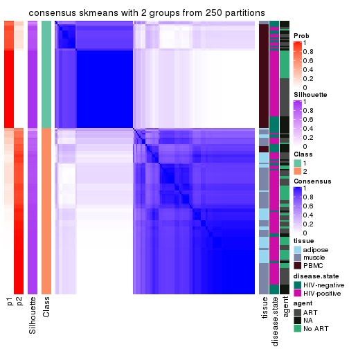</p>

</div>
<div id='tab-CV-skmeans-consensus-heatmap-2'>
<pre><code class="r">consensus_heatmap(res, k = 3)
</code></pre>

<p>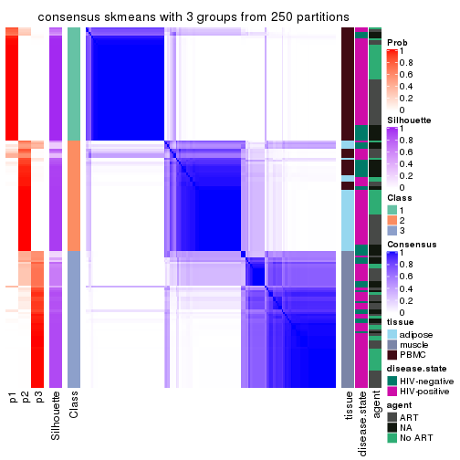</p>

</div>
<div id='tab-CV-skmeans-consensus-heatmap-3'>
<pre><code class="r">consensus_heatmap(res, k = 4)
</code></pre>

<p>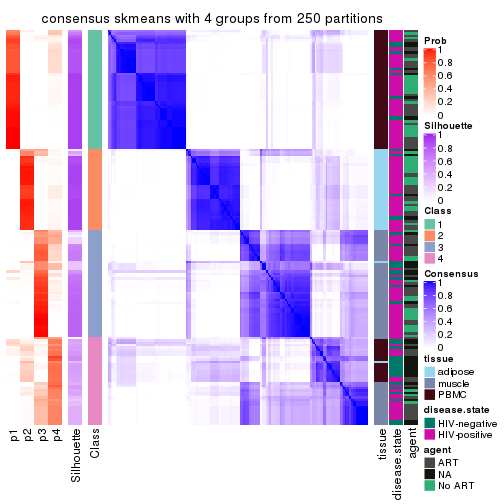</p>

</div>
<div id='tab-CV-skmeans-consensus-heatmap-4'>
<pre><code class="r">consensus_heatmap(res, k = 5)
</code></pre>

<p>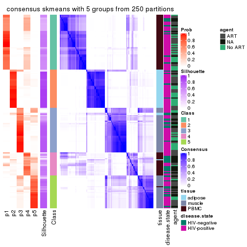</p>

</div>
<div id='tab-CV-skmeans-consensus-heatmap-5'>
<pre><code class="r">consensus_heatmap(res, k = 6)
</code></pre>

<p>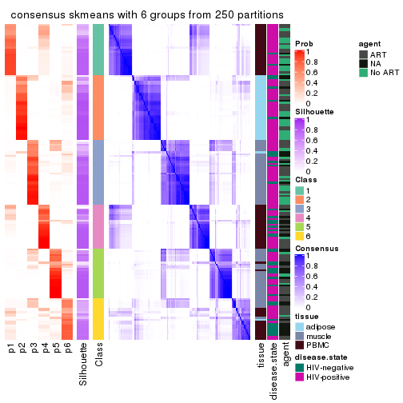</p>

</div>
</div>

Heatmaps for the membership of samples in all partitions to see how consistent they are:


<script>
$( function() {
	$( '#tabs-CV-skmeans-membership-heatmap' ).tabs();
} );
</script>
<div id='tabs-CV-skmeans-membership-heatmap'>
<ul>
<li><a href='#tab-CV-skmeans-membership-heatmap-1'>k = 2</a></li>
<li><a href='#tab-CV-skmeans-membership-heatmap-2'>k = 3</a></li>
<li><a href='#tab-CV-skmeans-membership-heatmap-3'>k = 4</a></li>
<li><a href='#tab-CV-skmeans-membership-heatmap-4'>k = 5</a></li>
<li><a href='#tab-CV-skmeans-membership-heatmap-5'>k = 6</a></li>
</ul>
<div id='tab-CV-skmeans-membership-heatmap-1'>
<pre><code class="r">membership_heatmap(res, k = 2)
</code></pre>

<p>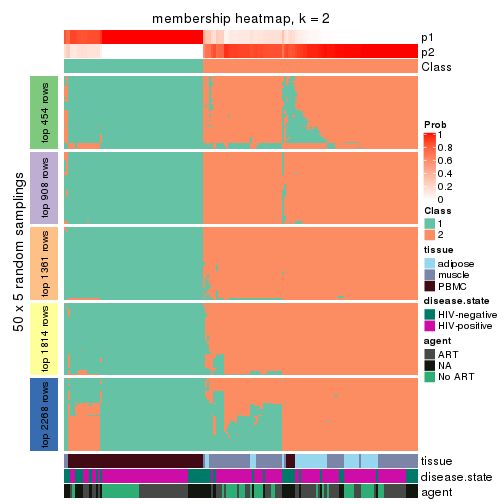</p>

</div>
<div id='tab-CV-skmeans-membership-heatmap-2'>
<pre><code class="r">membership_heatmap(res, k = 3)
</code></pre>

<p>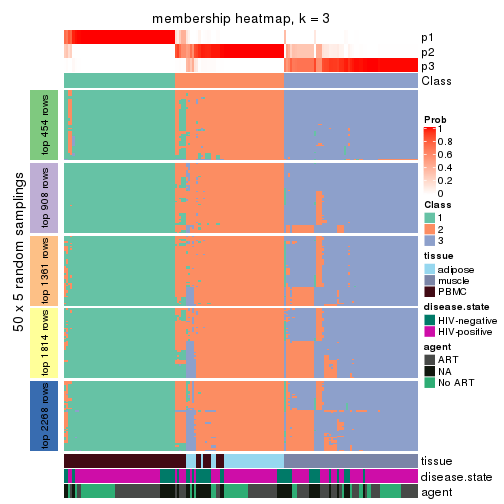</p>

</div>
<div id='tab-CV-skmeans-membership-heatmap-3'>
<pre><code class="r">membership_heatmap(res, k = 4)
</code></pre>

<p>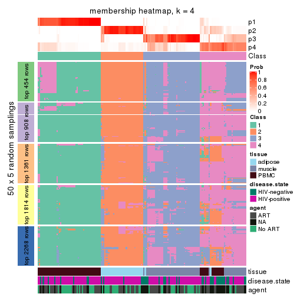</p>

</div>
<div id='tab-CV-skmeans-membership-heatmap-4'>
<pre><code class="r">membership_heatmap(res, k = 5)
</code></pre>

<p>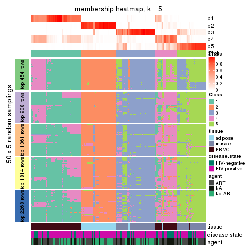</p>

</div>
<div id='tab-CV-skmeans-membership-heatmap-5'>
<pre><code class="r">membership_heatmap(res, k = 6)
</code></pre>

<p>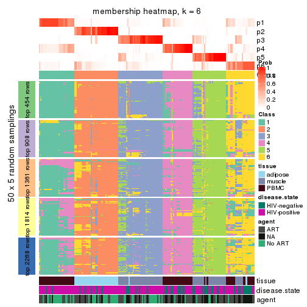</p>

</div>
</div>

As soon as we have had the classes for columns, we can look for signatures
which are significantly different between classes which can be candidate marks
for certain classes. Following are the heatmaps for signatures.


Signature heatmaps where rows are scaled:


<script>
$( function() {
	$( '#tabs-CV-skmeans-get-signatures' ).tabs();
} );
</script>
<div id='tabs-CV-skmeans-get-signatures'>
<ul>
<li><a href='#tab-CV-skmeans-get-signatures-1'>k = 2</a></li>
<li><a href='#tab-CV-skmeans-get-signatures-2'>k = 3</a></li>
<li><a href='#tab-CV-skmeans-get-signatures-3'>k = 4</a></li>
<li><a href='#tab-CV-skmeans-get-signatures-4'>k = 5</a></li>
<li><a href='#tab-CV-skmeans-get-signatures-5'>k = 6</a></li>
</ul>
<div id='tab-CV-skmeans-get-signatures-1'>
<pre><code class="r">get_signatures(res, k = 2)
</code></pre>

<p>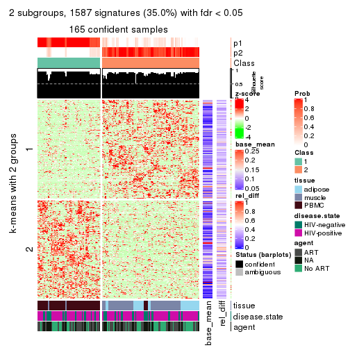</p>

</div>
<div id='tab-CV-skmeans-get-signatures-2'>
<pre><code class="r">get_signatures(res, k = 3)
</code></pre>

<p>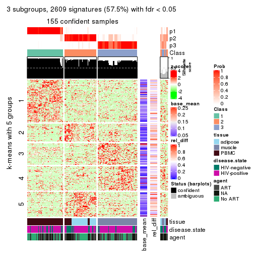</p>

</div>
<div id='tab-CV-skmeans-get-signatures-3'>
<pre><code class="r">get_signatures(res, k = 4)
</code></pre>

<p>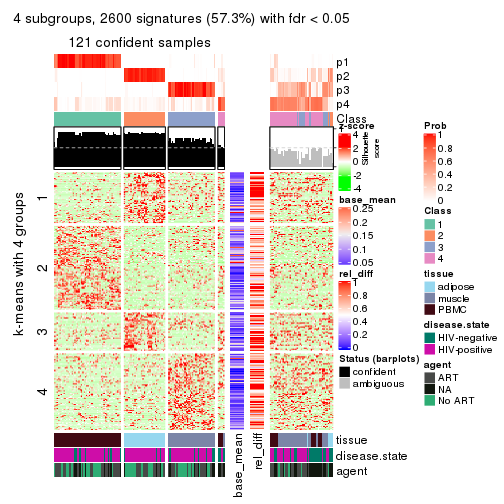</p>

</div>
<div id='tab-CV-skmeans-get-signatures-4'>
<pre><code class="r">get_signatures(res, k = 5)
</code></pre>

<p>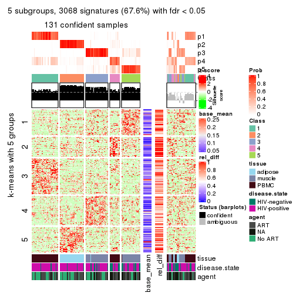</p>

</div>
<div id='tab-CV-skmeans-get-signatures-5'>
<pre><code class="r">get_signatures(res, k = 6)
</code></pre>

<p>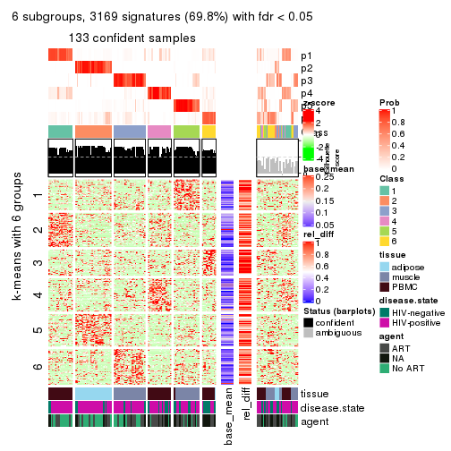</p>

</div>
</div>


Signature heatmaps where rows are not scaled:


<script>
$( function() {
	$( '#tabs-CV-skmeans-get-signatures-no-scale' ).tabs();
} );
</script>
<div id='tabs-CV-skmeans-get-signatures-no-scale'>
<ul>
<li><a href='#tab-CV-skmeans-get-signatures-no-scale-1'>k = 2</a></li>
<li><a href='#tab-CV-skmeans-get-signatures-no-scale-2'>k = 3</a></li>
<li><a href='#tab-CV-skmeans-get-signatures-no-scale-3'>k = 4</a></li>
<li><a href='#tab-CV-skmeans-get-signatures-no-scale-4'>k = 5</a></li>
<li><a href='#tab-CV-skmeans-get-signatures-no-scale-5'>k = 6</a></li>
</ul>
<div id='tab-CV-skmeans-get-signatures-no-scale-1'>
<pre><code class="r">get_signatures(res, k = 2, scale_rows = FALSE)
</code></pre>

<p>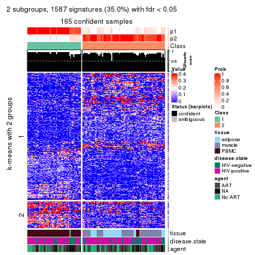</p>

</div>
<div id='tab-CV-skmeans-get-signatures-no-scale-2'>
<pre><code class="r">get_signatures(res, k = 3, scale_rows = FALSE)
</code></pre>

<p>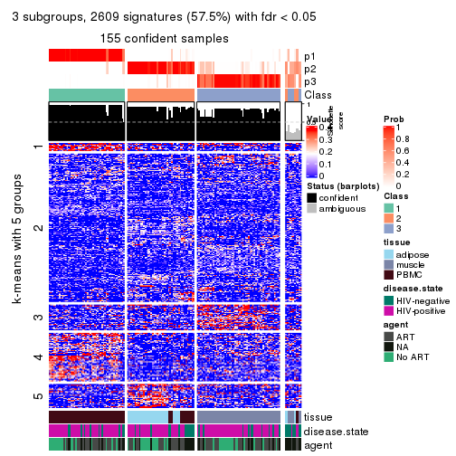</p>

</div>
<div id='tab-CV-skmeans-get-signatures-no-scale-3'>
<pre><code class="r">get_signatures(res, k = 4, scale_rows = FALSE)
</code></pre>

<p>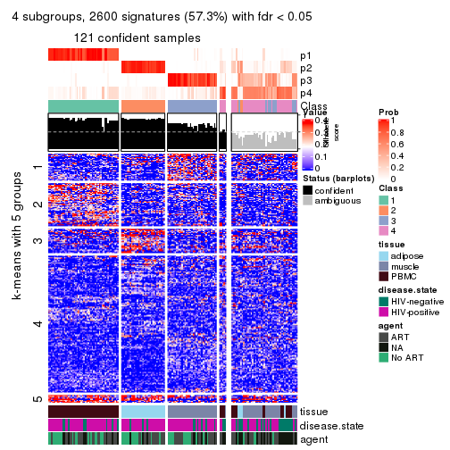</p>

</div>
<div id='tab-CV-skmeans-get-signatures-no-scale-4'>
<pre><code class="r">get_signatures(res, k = 5, scale_rows = FALSE)
</code></pre>

<p>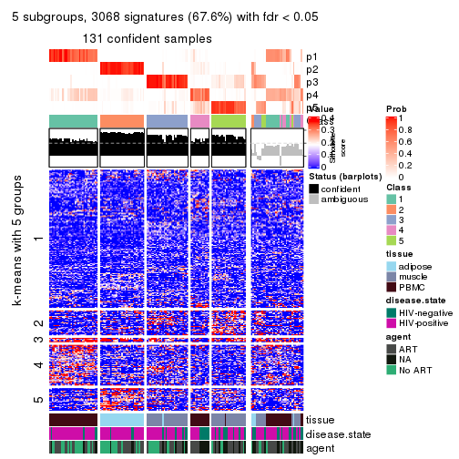</p>

</div>
<div id='tab-CV-skmeans-get-signatures-no-scale-5'>
<pre><code class="r">get_signatures(res, k = 6, scale_rows = FALSE)
</code></pre>

<p>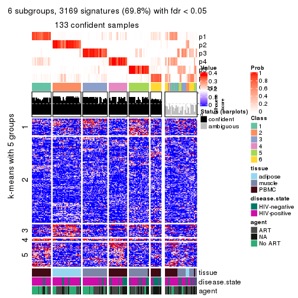</p>

</div>
</div>


Compare the overlap of signatures from different k:

```r
compare_signatures(res)
```

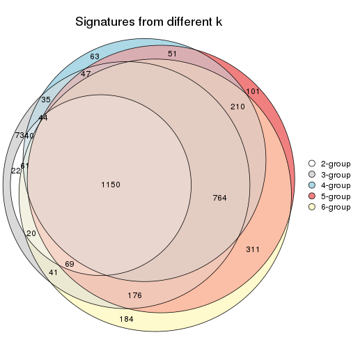

`get_signature()` returns a data frame invisibly. TO get the list of signatures, the function
call should be assigned to a variable explicitly. In following code, if `plot` argument is set
to `FALSE`, no heatmap is plotted while only the differential analysis is performed.

```r
# code only for demonstration
tb = get_signature(res, k = ..., plot = FALSE)
```

An example of the output of `tb` is:

```
#>   which_row         fdr    mean_1    mean_2 scaled_mean_1 scaled_mean_2 km
#> 1        38 0.042760348  8.373488  9.131774    -0.5533452     0.5164555  1
#> 2        40 0.018707592  7.106213  8.469186    -0.6173731     0.5762149  1
#> 3        55 0.019134737 10.221463 11.207825    -0.6159697     0.5749050  1
#> 4        59 0.006059896  5.921854  7.869574    -0.6899429     0.6439467  1
#> 5        60 0.018055526  8.928898 10.211722    -0.6204761     0.5791110  1
#> 6        98 0.009384629 15.714769 14.887706     0.6635654    -0.6193277  2
...
```

The columns in `tb` are:

1. `which_row`: row indices corresponding to the input matrix.
2. `fdr`: FDR for the differential test. 
3. `mean_x`: The mean value in group x.
4. `scaled_mean_x`: The mean value in group x after rows are scaled.
5. `km`: Row groups if k-means clustering is applied to rows.


UMAP plot which shows how samples are separated.


<script>
$( function() {
	$( '#tabs-CV-skmeans-dimension-reduction' ).tabs();
} );
</script>
<div id='tabs-CV-skmeans-dimension-reduction'>
<ul>
<li><a href='#tab-CV-skmeans-dimension-reduction-1'>k = 2</a></li>
<li><a href='#tab-CV-skmeans-dimension-reduction-2'>k = 3</a></li>
<li><a href='#tab-CV-skmeans-dimension-reduction-3'>k = 4</a></li>
<li><a href='#tab-CV-skmeans-dimension-reduction-4'>k = 5</a></li>
<li><a href='#tab-CV-skmeans-dimension-reduction-5'>k = 6</a></li>
</ul>
<div id='tab-CV-skmeans-dimension-reduction-1'>
<pre><code class="r">dimension_reduction(res, k = 2, method = &quot;UMAP&quot;)
</code></pre>

<p>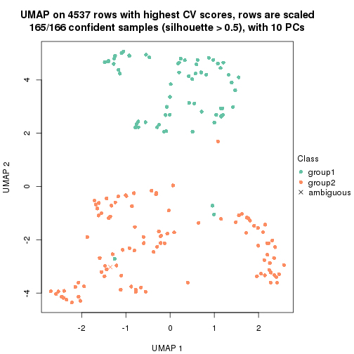</p>

</div>
<div id='tab-CV-skmeans-dimension-reduction-2'>
<pre><code class="r">dimension_reduction(res, k = 3, method = &quot;UMAP&quot;)
</code></pre>

<p>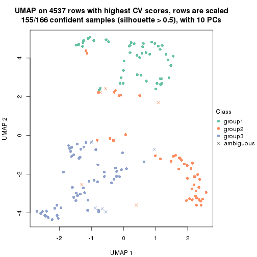</p>

</div>
<div id='tab-CV-skmeans-dimension-reduction-3'>
<pre><code class="r">dimension_reduction(res, k = 4, method = &quot;UMAP&quot;)
</code></pre>

<p>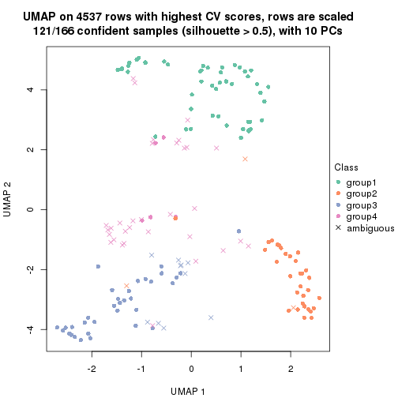</p>

</div>
<div id='tab-CV-skmeans-dimension-reduction-4'>
<pre><code class="r">dimension_reduction(res, k = 5, method = &quot;UMAP&quot;)
</code></pre>

<p>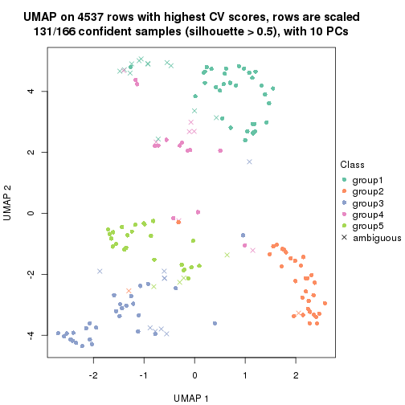</p>

</div>
<div id='tab-CV-skmeans-dimension-reduction-5'>
<pre><code class="r">dimension_reduction(res, k = 6, method = &quot;UMAP&quot;)
</code></pre>

<p>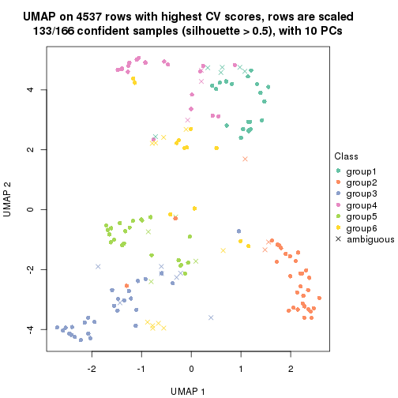</p>

</div>
</div>


Following heatmap shows how subgroups are split when increasing `k`:

```r
collect_classes(res)
```

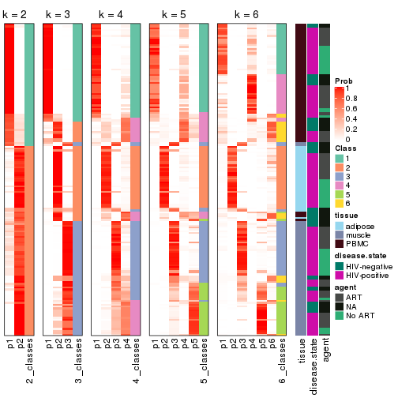


Test correlation between subgroups and known annotations. If the known
annotation is numeric, one-way ANOVA test is applied, and if the known
annotation is discrete, chi-squared contingency table test is applied.

```r
test_to_known_factors(res)
```

```
#>              n tissue(p) disease.state(p) agent(p) k
#> CV:skmeans 165  2.25e-31          0.78253 0.755242 2
#> CV:skmeans 155  1.30e-51          0.37855 0.666966 3
#> CV:skmeans 121  1.90e-48          0.04763 0.163885 4
#> CV:skmeans 131  1.36e-49          0.00561 0.005956 5
#> CV:skmeans 133  5.18e-49          0.00139 0.000205 6
```


If matrix rows can be associated to genes, consider to use `GO_Enrichment(res,
...)` to perform function enrichment for the signature genes.


 

---------------------------------------------------


### CV:pam


The object with results only for a single top-value method and a single partition method 
can be extracted as:

```r
res = res_list["CV", "pam"]
# you can also extract it by
# res = res_list["CV:pam"]
```

A summary of `res` and all the functions that can be applied to it:

```r
res
```

```
#> A 'ConsensusPartition' object with k = 2, 3, 4, 5, 6.
#>   On a matrix with 4537 rows and 166 columns.
#>   Top rows (454, 908, 1361, 1814, 2268) are extracted by 'CV' method.
#>   Subgroups are detected by 'pam' method.
#>   Performed in total 1250 partitions by row resampling.
#>   Best k for subgroups seems to be 2.
#> 
#> Following methods can be applied to this 'ConsensusPartition' object:
#>  [1] "cola_report"             "collect_classes"         "collect_plots"          
#>  [4] "collect_stats"           "colnames"                "compare_signatures"     
#>  [7] "consensus_heatmap"       "dimension_reduction"     "functional_enrichment"  
#> [10] "get_anno_col"            "get_anno"                "get_classes"            
#> [13] "get_consensus"           "get_matrix"              "get_membership"         
#> [16] "get_param"               "get_signatures"          "get_stats"              
#> [19] "is_best_k"               "is_stable_k"             "membership_heatmap"     
#> [22] "ncol"                    "nrow"                    "plot_ecdf"              
#> [25] "rownames"                "select_partition_number" "show"                   
#> [28] "suggest_best_k"          "test_to_known_factors"
```

`collect_plots()` function collects all the plots made from `res` for all `k` (number of partitions)
into one single page to provide an easy and fast comparison between different `k`.

```r
collect_plots(res)
```

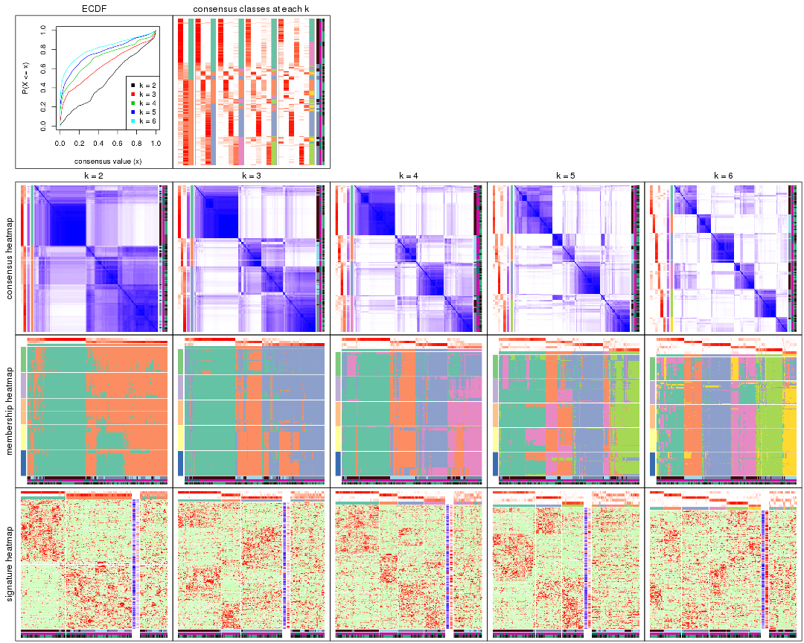

The plots are:

- The first row: a plot of the ECDF (Empirical cumulative distribution
  function) curves of the consensus matrix for each `k` and the heatmap of
  predicted classes for each `k`.
- The second row: heatmaps of the consensus matrix for each `k`.
- The third row: heatmaps of the membership matrix for each `k`.
- The fouth row: heatmaps of the signatures for each `k`.

All the plots in panels can be made by individual functions and they are
plotted later in this section.

`select_partition_number()` produces several plots showing different
statistics for choosing "optimized" `k`. There are following statistics:

- ECDF curves of the consensus matrix for each `k`;
- 1-PAC. [The PAC
  score](https://en.wikipedia.org/wiki/Consensus_clustering#Over-interpretation_potential_of_consensus_clustering)
  measures the proportion of the ambiguous subgrouping.
- Mean silhouette score.
- Concordance. The mean probability of fiting the consensus class ids in all
  partitions.
- Area increased. Denote $A_k$ as the area under the ECDF curve for current
  `k`, the area increased is defined as $A_k - A_{k-1}$.
- Rand index. The percent of pairs of samples that are both in a same cluster
  or both are not in a same cluster in the partition of k and k-1.
- Jaccard index. The ratio of pairs of samples are both in a same cluster in
  the partition of k and k-1 and the pairs of samples are both in a same
  cluster in the partition k or k-1.

The detailed explanations of these statistics can be found in [the cola
vignette](http://bioconductor.org/packages/devel/bioc/vignettes/cola/inst/doc/cola.html#toc_13).

Generally speaking, lower PAC score, higher mean silhouette score or higher
concordance corresponds to better partition. Rand index and Jaccard index
measure how similar the current partition is compared to partition with `k-1`.
If they are too similar, we won't accept `k` is better than `k-1`.

```r
select_partition_number(res)
```

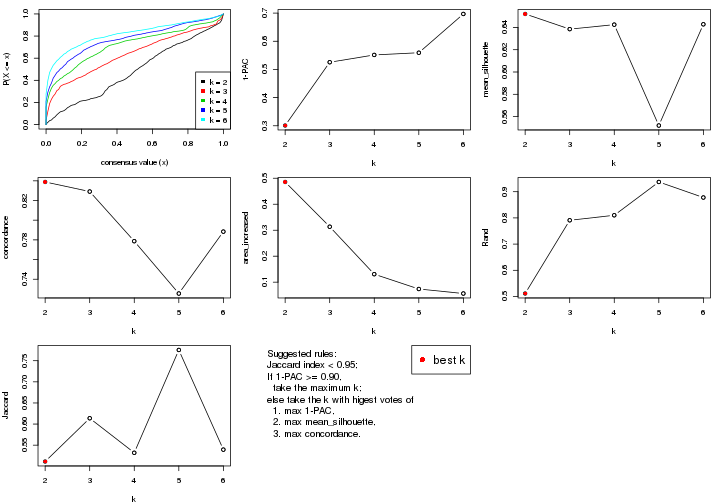

The numeric values for all these statistics can be obtained by `get_stats()`.

```r
get_stats(res)
```

```
#>   k 1-PAC mean_silhouette concordance area_increased  Rand Jaccard
#> 2 2 0.301           0.652       0.839         0.4856 0.511   0.511
#> 3 3 0.526           0.638       0.829         0.3135 0.791   0.614
#> 4 4 0.551           0.642       0.779         0.1308 0.810   0.532
#> 5 5 0.559           0.552       0.725         0.0738 0.937   0.775
#> 6 6 0.697           0.643       0.788         0.0564 0.878   0.539
```

`suggest_best_k()` suggests the best $k$ based on these statistics. The rules are as follows:

- All $k$ with Jaccard index larger than 0.95 are removed because the increase of
  the partition number does not provides enough extra information. If all $k$ are removed,
  the best $k$ is assigned by `NA`.
- For $k$ with 1-PAC larger than 0.9, the maximal $k$ is taken as the "best k". Other $k$ is called "optional k".
- If it does not fit the second rule. The $k$ with the highest vote of highest
  1-PAC, mean silhouette and concordance is taken as the "best k".

```r
suggest_best_k(res)
```

```
#> [1] 2
```


Following shows the table of the partitions (You need to click the **show/hide
code output** link to see it). The membership matrix (columns with name `p*`)
is inferred by
[`clue::cl_consensus()`](https://www.rdocumentation.org/link/cl_consensus?package=clue)
function with the `SE` method. Basically the value in the membership matrix
represents the probability to belong to a certain group. The finall class
label for an item is determined with the group with highest probability it
belongs to.

In `get_classes()` function, the entropy is calculated from the membership
matrix and the silhouette score is calculated from the consensus matrix.


<script>
$( function() {
	$( '#tabs-CV-pam-get-classes' ).tabs();
} );
</script>
<div id='tabs-CV-pam-get-classes'>
<ul>
<li><a href='#tab-CV-pam-get-classes-1'>k = 2</a></li>
<li><a href='#tab-CV-pam-get-classes-2'>k = 3</a></li>
<li><a href='#tab-CV-pam-get-classes-3'>k = 4</a></li>
<li><a href='#tab-CV-pam-get-classes-4'>k = 5</a></li>
<li><a href='#tab-CV-pam-get-classes-5'>k = 6</a></li>
</ul>

<div id='tab-CV-pam-get-classes-1'>
<p><a id='tab-CV-pam-get-classes-1-a' style='color:#0366d6' href='#'>show/hide code output</a></p>
<pre><code class="r">cbind(get_classes(res, k = 2), get_membership(res, k = 2))
</code></pre>

<pre><code>#&gt;           class entropy silhouette    p1    p2
#&gt; GSM751298     1  0.0672     0.8470 0.992 0.008
#&gt; GSM751304     2  0.9358     0.4770 0.352 0.648
#&gt; GSM751305     2  0.9087     0.5167 0.324 0.676
#&gt; GSM751307     2  0.6887     0.7071 0.184 0.816
#&gt; GSM751310     1  0.0938     0.8435 0.988 0.012
#&gt; GSM751314     1  0.0376     0.8482 0.996 0.004
#&gt; GSM751316     1  0.0000     0.8499 1.000 0.000
#&gt; GSM751318     1  0.0672     0.8473 0.992 0.008
#&gt; GSM751342     1  0.0376     0.8476 0.996 0.004
#&gt; GSM751346     1  0.2423     0.8256 0.960 0.040
#&gt; GSM751347     1  0.0938     0.8449 0.988 0.012
#&gt; GSM751348     1  0.8443     0.5358 0.728 0.272
#&gt; GSM751349     2  0.8081     0.6115 0.248 0.752
#&gt; GSM751352     2  0.8081     0.6521 0.248 0.752
#&gt; GSM751353     2  0.6712     0.7000 0.176 0.824
#&gt; GSM751354     2  0.5519     0.7439 0.128 0.872
#&gt; GSM751355     2  0.4939     0.7467 0.108 0.892
#&gt; GSM751358     1  0.8661     0.4977 0.712 0.288
#&gt; GSM751359     2  0.3274     0.7591 0.060 0.940
#&gt; GSM751294     2  0.6531     0.7305 0.168 0.832
#&gt; GSM751296     1  0.0000     0.8499 1.000 0.000
#&gt; GSM751297     1  0.9129     0.3936 0.672 0.328
#&gt; GSM751299     1  0.8763     0.4885 0.704 0.296
#&gt; GSM751300     1  0.0376     0.8482 0.996 0.004
#&gt; GSM751301     1  0.1843     0.8305 0.972 0.028
#&gt; GSM751302     1  0.0000     0.8499 1.000 0.000
#&gt; GSM751303     1  0.0672     0.8474 0.992 0.008
#&gt; GSM751306     1  0.1184     0.8424 0.984 0.016
#&gt; GSM751308     1  0.0938     0.8445 0.988 0.012
#&gt; GSM751309     1  0.0000     0.8499 1.000 0.000
#&gt; GSM751311     1  0.0000     0.8499 1.000 0.000
#&gt; GSM751312     1  0.0376     0.8486 0.996 0.004
#&gt; GSM751313     1  0.0000     0.8499 1.000 0.000
#&gt; GSM751315     1  0.0000     0.8499 1.000 0.000
#&gt; GSM751317     1  0.0000     0.8499 1.000 0.000
#&gt; GSM751320     1  0.0000     0.8499 1.000 0.000
#&gt; GSM751321     1  0.0672     0.8465 0.992 0.008
#&gt; GSM751322     1  0.0376     0.8483 0.996 0.004
#&gt; GSM751324     1  0.0672     0.8474 0.992 0.008
#&gt; GSM751325     1  0.0000     0.8499 1.000 0.000
#&gt; GSM751332     1  0.0000     0.8499 1.000 0.000
#&gt; GSM751334     1  0.0000     0.8499 1.000 0.000
#&gt; GSM751339     1  0.1184     0.8390 0.984 0.016
#&gt; GSM751341     1  0.2948     0.8162 0.948 0.052
#&gt; GSM751343     1  0.0000     0.8499 1.000 0.000
#&gt; GSM751344     2  0.9323     0.4589 0.348 0.652
#&gt; GSM751345     2  0.9427     0.4312 0.360 0.640
#&gt; GSM751356     1  0.9460     0.2644 0.636 0.364
#&gt; GSM751357     1  0.9977    -0.0419 0.528 0.472
#&gt; GSM751293     1  0.0000     0.8499 1.000 0.000
#&gt; GSM751295     1  0.0000     0.8499 1.000 0.000
#&gt; GSM751319     1  0.0376     0.8483 0.996 0.004
#&gt; GSM751323     1  0.0000     0.8499 1.000 0.000
#&gt; GSM751326     1  0.0000     0.8499 1.000 0.000
#&gt; GSM751327     1  0.0000     0.8499 1.000 0.000
#&gt; GSM751328     1  0.0000     0.8499 1.000 0.000
#&gt; GSM751329     1  0.0000     0.8499 1.000 0.000
#&gt; GSM751330     1  0.0000     0.8499 1.000 0.000
#&gt; GSM751331     1  0.0000     0.8499 1.000 0.000
#&gt; GSM751333     1  0.0000     0.8499 1.000 0.000
#&gt; GSM751335     1  0.0000     0.8499 1.000 0.000
#&gt; GSM751336     1  0.0000     0.8499 1.000 0.000
#&gt; GSM751337     1  0.0376     0.8484 0.996 0.004
#&gt; GSM751338     1  0.0000     0.8499 1.000 0.000
#&gt; GSM751340     1  0.7745     0.6013 0.772 0.228
#&gt; GSM751350     1  0.0000     0.8499 1.000 0.000
#&gt; GSM751351     1  0.0000     0.8499 1.000 0.000
#&gt; GSM751362     1  0.9977    -0.1269 0.528 0.472
#&gt; GSM751363     1  0.8608     0.5041 0.716 0.284
#&gt; GSM751367     1  0.9983    -0.1772 0.524 0.476
#&gt; GSM751368     2  0.4161     0.7513 0.084 0.916
#&gt; GSM751371     1  0.6801     0.6742 0.820 0.180
#&gt; GSM751375     2  0.5294     0.7401 0.120 0.880
#&gt; GSM751376     2  0.9983     0.2961 0.476 0.524
#&gt; GSM751378     2  0.1184     0.7572 0.016 0.984
#&gt; GSM751379     2  0.5059     0.7491 0.112 0.888
#&gt; GSM751382     2  0.2603     0.7594 0.044 0.956
#&gt; GSM751386     2  0.0672     0.7540 0.008 0.992
#&gt; GSM751388     2  0.0938     0.7545 0.012 0.988
#&gt; GSM751391     2  1.0000     0.2150 0.500 0.500
#&gt; GSM751410     1  0.8327     0.5503 0.736 0.264
#&gt; GSM751414     2  0.9286     0.5291 0.344 0.656
#&gt; GSM751361     2  0.9635     0.4661 0.388 0.612
#&gt; GSM751365     2  0.9286     0.5323 0.344 0.656
#&gt; GSM751366     1  0.9661     0.2614 0.608 0.392
#&gt; GSM751369     2  0.9996     0.2287 0.488 0.512
#&gt; GSM751370     2  0.9996     0.2338 0.488 0.512
#&gt; GSM751372     2  0.9170     0.5513 0.332 0.668
#&gt; GSM751373     2  0.9710     0.4554 0.400 0.600
#&gt; GSM751374     2  0.4022     0.7624 0.080 0.920
#&gt; GSM751377     2  0.1414     0.7556 0.020 0.980
#&gt; GSM751380     2  0.9580     0.4676 0.380 0.620
#&gt; GSM751381     2  0.0672     0.7540 0.008 0.992
#&gt; GSM751383     2  0.0376     0.7526 0.004 0.996
#&gt; GSM751384     2  0.9209     0.5502 0.336 0.664
#&gt; GSM751385     2  0.0000     0.7511 0.000 1.000
#&gt; GSM751387     2  0.0376     0.7525 0.004 0.996
#&gt; GSM751389     2  0.6887     0.7046 0.184 0.816
#&gt; GSM751393     2  0.6438     0.7139 0.164 0.836
#&gt; GSM751394     2  0.1843     0.7568 0.028 0.972
#&gt; GSM751395     2  0.9209     0.5696 0.336 0.664
#&gt; GSM751397     2  0.0376     0.7526 0.004 0.996
#&gt; GSM751398     2  0.2043     0.7579 0.032 0.968
#&gt; GSM751404     2  0.9129     0.5522 0.328 0.672
#&gt; GSM751406     2  0.9933     0.3294 0.452 0.548
#&gt; GSM751411     2  0.9000     0.5615 0.316 0.684
#&gt; GSM751413     2  0.5059     0.7448 0.112 0.888
#&gt; GSM751415     2  0.9580     0.4676 0.380 0.620
#&gt; GSM751416     2  0.0672     0.7543 0.008 0.992
#&gt; GSM751417     2  0.0000     0.7511 0.000 1.000
#&gt; GSM751421     1  0.9866     0.0234 0.568 0.432
#&gt; GSM751422     1  0.6531     0.6945 0.832 0.168
#&gt; GSM751360     1  0.9815     0.0678 0.580 0.420
#&gt; GSM751364     2  0.9044     0.5626 0.320 0.680
#&gt; GSM751390     2  0.9129     0.5550 0.328 0.672
#&gt; GSM751392     2  0.3584     0.7584 0.068 0.932
#&gt; GSM751396     2  0.1414     0.7556 0.020 0.980
#&gt; GSM751399     2  0.9000     0.5615 0.316 0.684
#&gt; GSM751400     2  0.5842     0.7361 0.140 0.860
#&gt; GSM751401     2  0.9358     0.5211 0.352 0.648
#&gt; GSM751402     2  0.9286     0.5411 0.344 0.656
#&gt; GSM751403     2  0.9087     0.5560 0.324 0.676
#&gt; GSM751405     2  0.9922     0.3395 0.448 0.552
#&gt; GSM751407     2  0.9170     0.5510 0.332 0.668
#&gt; GSM751408     2  0.3114     0.7581 0.056 0.944
#&gt; GSM751409     2  0.6438     0.7098 0.164 0.836
#&gt; GSM751412     2  0.9044     0.5588 0.320 0.680
#&gt; GSM751418     2  0.8955     0.5684 0.312 0.688
#&gt; GSM751419     2  0.9000     0.5615 0.316 0.684
#&gt; GSM751420     2  0.2948     0.7624 0.052 0.948
#&gt; GSM751425     2  0.6712     0.6986 0.176 0.824
#&gt; GSM751429     2  0.9996     0.2889 0.488 0.512
#&gt; GSM751430     2  0.3431     0.7605 0.064 0.936
#&gt; GSM751433     2  0.9963     0.1584 0.464 0.536
#&gt; GSM751437     2  0.9608     0.4856 0.384 0.616
#&gt; GSM751448     2  0.9970     0.3010 0.468 0.532
#&gt; GSM751451     1  0.9850     0.2241 0.572 0.428
#&gt; GSM751423     2  0.4690     0.7559 0.100 0.900
#&gt; GSM751424     2  0.2948     0.7603 0.052 0.948
#&gt; GSM751428     2  0.5946     0.7452 0.144 0.856
#&gt; GSM751431     1  0.9850     0.1921 0.572 0.428
#&gt; GSM751432     2  0.3274     0.7624 0.060 0.940
#&gt; GSM751434     2  0.3584     0.7630 0.068 0.932
#&gt; GSM751435     2  0.4939     0.7557 0.108 0.892
#&gt; GSM751436     2  0.4815     0.7528 0.104 0.896
#&gt; GSM751440     1  0.9933     0.0997 0.548 0.452
#&gt; GSM751444     2  0.5294     0.7510 0.120 0.880
#&gt; GSM751446     2  0.8608     0.5719 0.284 0.716
#&gt; GSM751449     2  0.2236     0.7594 0.036 0.964
#&gt; GSM751450     2  0.3733     0.7620 0.072 0.928
#&gt; GSM751452     2  0.4815     0.7470 0.104 0.896
#&gt; GSM751426     2  0.6973     0.6910 0.188 0.812
#&gt; GSM751427     2  0.2778     0.7625 0.048 0.952
#&gt; GSM751438     2  0.5519     0.7349 0.128 0.872
#&gt; GSM751439     1  0.9635     0.2243 0.612 0.388
#&gt; GSM751441     2  0.3879     0.7518 0.076 0.924
#&gt; GSM751442     1  0.9922     0.1648 0.552 0.448
#&gt; GSM751443     2  0.9988     0.2768 0.480 0.520
#&gt; GSM751445     2  0.2236     0.7603 0.036 0.964
#&gt; GSM751447     2  0.2778     0.7622 0.048 0.952
#&gt; GSM751453     2  0.3274     0.7597 0.060 0.940
#&gt; GSM751454     2  0.2423     0.7585 0.040 0.960
#&gt; GSM751455     2  0.5629     0.7408 0.132 0.868
#&gt; GSM751456     2  0.5629     0.7411 0.132 0.868
#&gt; GSM751457     2  0.3431     0.7614 0.064 0.936
#&gt; GSM751458     2  0.2423     0.7611 0.040 0.960
</code></pre>

<script>
$('#tab-CV-pam-get-classes-1-a').parent().next().next().hide();
$('#tab-CV-pam-get-classes-1-a').click(function(){
  $('#tab-CV-pam-get-classes-1-a').parent().next().next().toggle();
  return(false);
});
</script>
</div>

<div id='tab-CV-pam-get-classes-2'>
<p><a id='tab-CV-pam-get-classes-2-a' style='color:#0366d6' href='#'>show/hide code output</a></p>
<pre><code class="r">cbind(get_classes(res, k = 3), get_membership(res, k = 3))
</code></pre>

<pre><code>#&gt;           class entropy silhouette    p1    p2    p3
#&gt; GSM751298     1  0.0592     0.8965 0.988 0.000 0.012
#&gt; GSM751304     3  0.9981     0.1068 0.316 0.320 0.364
#&gt; GSM751305     3  0.9916     0.1634 0.288 0.316 0.396
#&gt; GSM751307     3  0.9061     0.3337 0.148 0.348 0.504
#&gt; GSM751310     1  0.1529     0.8766 0.960 0.000 0.040
#&gt; GSM751314     1  0.1289     0.8898 0.968 0.032 0.000
#&gt; GSM751316     1  0.1411     0.8884 0.964 0.036 0.000
#&gt; GSM751318     1  0.0592     0.8966 0.988 0.000 0.012
#&gt; GSM751342     1  0.1647     0.8871 0.960 0.036 0.004
#&gt; GSM751346     1  0.1163     0.8864 0.972 0.000 0.028
#&gt; GSM751347     1  0.0747     0.8948 0.984 0.000 0.016
#&gt; GSM751348     1  0.9967    -0.2266 0.372 0.324 0.304
#&gt; GSM751349     2  0.8795     0.3912 0.168 0.576 0.256
#&gt; GSM751352     3  0.9641     0.2390 0.224 0.324 0.452
#&gt; GSM751353     3  0.9342     0.2139 0.168 0.380 0.452
#&gt; GSM751354     3  0.8559     0.4369 0.124 0.304 0.572
#&gt; GSM751355     3  0.8487     0.3645 0.100 0.364 0.536
#&gt; GSM751358     1  0.6295     0.6447 0.728 0.036 0.236
#&gt; GSM751359     3  0.6881     0.5294 0.032 0.320 0.648
#&gt; GSM751294     3  0.5625     0.6326 0.076 0.116 0.808
#&gt; GSM751296     1  0.0237     0.8989 0.996 0.000 0.004
#&gt; GSM751297     1  0.6721     0.3247 0.604 0.016 0.380
#&gt; GSM751299     1  0.7267     0.4469 0.668 0.268 0.064
#&gt; GSM751300     1  0.0000     0.9003 1.000 0.000 0.000
#&gt; GSM751301     1  0.1289     0.8773 0.968 0.032 0.000
#&gt; GSM751302     1  0.0000     0.9003 1.000 0.000 0.000
#&gt; GSM751303     1  0.1411     0.8884 0.964 0.036 0.000
#&gt; GSM751306     1  0.1647     0.8878 0.960 0.036 0.004
#&gt; GSM751308     1  0.0592     0.8959 0.988 0.000 0.012
#&gt; GSM751309     1  0.1411     0.8884 0.964 0.036 0.000
#&gt; GSM751311     1  0.1411     0.8884 0.964 0.036 0.000
#&gt; GSM751312     1  0.2152     0.8835 0.948 0.036 0.016
#&gt; GSM751313     1  0.0000     0.9003 1.000 0.000 0.000
#&gt; GSM751315     1  0.0000     0.9003 1.000 0.000 0.000
#&gt; GSM751317     1  0.0000     0.9003 1.000 0.000 0.000
#&gt; GSM751320     1  0.0000     0.9003 1.000 0.000 0.000
#&gt; GSM751321     1  0.1411     0.8884 0.964 0.036 0.000
#&gt; GSM751322     1  0.0424     0.8980 0.992 0.000 0.008
#&gt; GSM751324     1  0.0848     0.8970 0.984 0.008 0.008
#&gt; GSM751325     1  0.0000     0.9003 1.000 0.000 0.000
#&gt; GSM751332     1  0.0000     0.9003 1.000 0.000 0.000
#&gt; GSM751334     1  0.0000     0.9003 1.000 0.000 0.000
#&gt; GSM751339     1  0.0000     0.9003 1.000 0.000 0.000
#&gt; GSM751341     1  0.2926     0.8640 0.924 0.036 0.040
#&gt; GSM751343     1  0.0000     0.9003 1.000 0.000 0.000
#&gt; GSM751344     2  0.9858    -0.0407 0.256 0.396 0.348
#&gt; GSM751345     2  0.9910    -0.0412 0.272 0.384 0.344
#&gt; GSM751356     1  0.6890     0.3526 0.632 0.028 0.340
#&gt; GSM751357     1  0.9206     0.1398 0.524 0.188 0.288
#&gt; GSM751293     1  0.0000     0.9003 1.000 0.000 0.000
#&gt; GSM751295     1  0.0000     0.9003 1.000 0.000 0.000
#&gt; GSM751319     1  0.1411     0.8884 0.964 0.036 0.000
#&gt; GSM751323     1  0.0000     0.9003 1.000 0.000 0.000
#&gt; GSM751326     1  0.0000     0.9003 1.000 0.000 0.000
#&gt; GSM751327     1  0.0000     0.9003 1.000 0.000 0.000
#&gt; GSM751328     1  0.1163     0.8911 0.972 0.028 0.000
#&gt; GSM751329     1  0.0000     0.9003 1.000 0.000 0.000
#&gt; GSM751330     1  0.0000     0.9003 1.000 0.000 0.000
#&gt; GSM751331     1  0.0000     0.9003 1.000 0.000 0.000
#&gt; GSM751333     1  0.0000     0.9003 1.000 0.000 0.000
#&gt; GSM751335     1  0.0000     0.9003 1.000 0.000 0.000
#&gt; GSM751336     1  0.0000     0.9003 1.000 0.000 0.000
#&gt; GSM751337     1  0.0000     0.9003 1.000 0.000 0.000
#&gt; GSM751338     1  0.0000     0.9003 1.000 0.000 0.000
#&gt; GSM751340     1  0.5016     0.6353 0.760 0.000 0.240
#&gt; GSM751350     1  0.0000     0.9003 1.000 0.000 0.000
#&gt; GSM751351     1  0.0000     0.9003 1.000 0.000 0.000
#&gt; GSM751362     3  0.4887     0.5754 0.228 0.000 0.772
#&gt; GSM751363     1  0.5948     0.4196 0.640 0.000 0.360
#&gt; GSM751367     3  0.5360     0.5820 0.220 0.012 0.768
#&gt; GSM751368     3  0.7391     0.5012 0.056 0.308 0.636
#&gt; GSM751371     1  0.4291     0.7324 0.820 0.000 0.180
#&gt; GSM751375     2  0.8228     0.1726 0.084 0.552 0.364
#&gt; GSM751376     3  0.5455     0.5905 0.204 0.020 0.776
#&gt; GSM751378     3  0.5884     0.3662 0.012 0.272 0.716
#&gt; GSM751379     3  0.2682     0.6844 0.004 0.076 0.920
#&gt; GSM751382     2  0.6143     0.4697 0.012 0.684 0.304
#&gt; GSM751386     3  0.5785     0.5371 0.004 0.300 0.696
#&gt; GSM751388     3  0.5024     0.6100 0.004 0.220 0.776
#&gt; GSM751391     3  0.4974     0.5717 0.236 0.000 0.764
#&gt; GSM751410     1  0.6308     0.0866 0.508 0.000 0.492
#&gt; GSM751414     3  0.2356     0.6803 0.072 0.000 0.928
#&gt; GSM751361     3  0.5926     0.4359 0.356 0.000 0.644
#&gt; GSM751365     3  0.0892     0.6922 0.020 0.000 0.980
#&gt; GSM751366     3  0.5678     0.3939 0.316 0.000 0.684
#&gt; GSM751369     3  0.6260     0.2319 0.448 0.000 0.552
#&gt; GSM751370     3  0.5138     0.5386 0.252 0.000 0.748
#&gt; GSM751372     3  0.0592     0.6939 0.012 0.000 0.988
#&gt; GSM751373     3  0.2537     0.6818 0.080 0.000 0.920
#&gt; GSM751374     3  0.2902     0.6855 0.016 0.064 0.920
#&gt; GSM751377     3  0.5216     0.5781 0.000 0.260 0.740
#&gt; GSM751380     3  0.1643     0.6838 0.044 0.000 0.956
#&gt; GSM751381     3  0.6282     0.5117 0.012 0.324 0.664
#&gt; GSM751383     3  0.3816     0.6536 0.000 0.148 0.852
#&gt; GSM751384     3  0.3752     0.6273 0.020 0.096 0.884
#&gt; GSM751385     3  0.2400     0.6835 0.004 0.064 0.932
#&gt; GSM751387     3  0.5244     0.6013 0.004 0.240 0.756
#&gt; GSM751389     3  0.1163     0.6895 0.028 0.000 0.972
#&gt; GSM751393     3  0.0424     0.6932 0.008 0.000 0.992
#&gt; GSM751394     3  0.6359     0.4637 0.008 0.364 0.628
#&gt; GSM751395     3  0.3340     0.6591 0.120 0.000 0.880
#&gt; GSM751397     3  0.2173     0.6917 0.008 0.048 0.944
#&gt; GSM751398     3  0.5831     0.5543 0.008 0.284 0.708
#&gt; GSM751404     3  0.0237     0.6919 0.004 0.000 0.996
#&gt; GSM751406     3  0.4121     0.6166 0.168 0.000 0.832
#&gt; GSM751411     3  0.0000     0.6910 0.000 0.000 1.000
#&gt; GSM751413     3  0.7905     0.4485 0.072 0.340 0.588
#&gt; GSM751415     3  0.1643     0.6838 0.044 0.000 0.956
#&gt; GSM751416     3  0.5178     0.5822 0.000 0.256 0.744
#&gt; GSM751417     3  0.5431     0.5550 0.000 0.284 0.716
#&gt; GSM751421     3  0.5431     0.5146 0.284 0.000 0.716
#&gt; GSM751422     1  0.4504     0.7147 0.804 0.000 0.196
#&gt; GSM751360     1  0.6225     0.1699 0.568 0.000 0.432
#&gt; GSM751364     3  0.0747     0.6952 0.016 0.000 0.984
#&gt; GSM751390     3  0.0747     0.6936 0.016 0.000 0.984
#&gt; GSM751392     3  0.7624     0.3813 0.048 0.392 0.560
#&gt; GSM751396     3  0.5988     0.4634 0.000 0.368 0.632
#&gt; GSM751399     3  0.0000     0.6910 0.000 0.000 1.000
#&gt; GSM751400     3  0.0747     0.6936 0.016 0.000 0.984
#&gt; GSM751401     3  0.1491     0.6884 0.016 0.016 0.968
#&gt; GSM751402     3  0.0237     0.6919 0.004 0.000 0.996
#&gt; GSM751403     3  0.0237     0.6919 0.004 0.000 0.996
#&gt; GSM751405     3  0.3551     0.6434 0.132 0.000 0.868
#&gt; GSM751407     3  0.0237     0.6919 0.004 0.000 0.996
#&gt; GSM751408     3  0.0237     0.6919 0.004 0.000 0.996
#&gt; GSM751409     3  0.0661     0.6920 0.008 0.004 0.988
#&gt; GSM751412     3  0.0000     0.6910 0.000 0.000 1.000
#&gt; GSM751418     3  0.0237     0.6921 0.004 0.000 0.996
#&gt; GSM751419     3  0.0000     0.6910 0.000 0.000 1.000
#&gt; GSM751420     3  0.3918     0.6270 0.004 0.140 0.856
#&gt; GSM751425     2  0.1525     0.7660 0.032 0.964 0.004
#&gt; GSM751429     3  0.8342    -0.2191 0.080 0.456 0.464
#&gt; GSM751430     3  0.6529     0.4571 0.012 0.368 0.620
#&gt; GSM751433     2  0.7283     0.5661 0.260 0.672 0.068
#&gt; GSM751437     2  0.7842     0.3864 0.072 0.600 0.328
#&gt; GSM751448     2  0.8260     0.2246 0.076 0.492 0.432
#&gt; GSM751451     2  0.3213     0.7544 0.060 0.912 0.028
#&gt; GSM751423     2  0.6908     0.4276 0.036 0.656 0.308
#&gt; GSM751424     3  0.6498     0.4235 0.008 0.396 0.596
#&gt; GSM751428     3  0.7757     0.3645 0.052 0.408 0.540
#&gt; GSM751431     2  0.2496     0.7571 0.068 0.928 0.004
#&gt; GSM751432     3  0.6379     0.4638 0.008 0.368 0.624
#&gt; GSM751434     3  0.6330     0.4350 0.004 0.396 0.600
#&gt; GSM751435     2  0.5558     0.6831 0.048 0.800 0.152
#&gt; GSM751436     3  0.7901     0.3665 0.060 0.400 0.540
#&gt; GSM751440     2  0.6496     0.6050 0.056 0.736 0.208
#&gt; GSM751444     2  0.5298     0.6776 0.032 0.804 0.164
#&gt; GSM751446     2  0.2599     0.7631 0.052 0.932 0.016
#&gt; GSM751449     2  0.2486     0.7536 0.008 0.932 0.060
#&gt; GSM751450     2  0.6082     0.5222 0.012 0.692 0.296
#&gt; GSM751452     3  0.7366     0.3897 0.036 0.400 0.564
#&gt; GSM751426     2  0.5875     0.6917 0.136 0.792 0.072
#&gt; GSM751427     2  0.4723     0.6884 0.016 0.824 0.160
#&gt; GSM751438     2  0.1585     0.7608 0.008 0.964 0.028
#&gt; GSM751439     2  0.7997     0.3535 0.072 0.568 0.360
#&gt; GSM751441     2  0.3083     0.7559 0.024 0.916 0.060
#&gt; GSM751442     2  0.1525     0.7657 0.032 0.964 0.004
#&gt; GSM751443     3  0.8387    -0.1514 0.084 0.428 0.488
#&gt; GSM751445     2  0.1620     0.7672 0.024 0.964 0.012
#&gt; GSM751447     2  0.1585     0.7677 0.028 0.964 0.008
#&gt; GSM751453     2  0.1620     0.7674 0.024 0.964 0.012
#&gt; GSM751454     2  0.1620     0.7674 0.024 0.964 0.012
#&gt; GSM751455     2  0.1585     0.7677 0.028 0.964 0.008
#&gt; GSM751456     2  0.1585     0.7677 0.028 0.964 0.008
#&gt; GSM751457     2  0.1585     0.7677 0.028 0.964 0.008
#&gt; GSM751458     2  0.1585     0.7677 0.028 0.964 0.008
</code></pre>

<script>
$('#tab-CV-pam-get-classes-2-a').parent().next().next().hide();
$('#tab-CV-pam-get-classes-2-a').click(function(){
  $('#tab-CV-pam-get-classes-2-a').parent().next().next().toggle();
  return(false);
});
</script>
</div>

<div id='tab-CV-pam-get-classes-3'>
<p><a id='tab-CV-pam-get-classes-3-a' style='color:#0366d6' href='#'>show/hide code output</a></p>
<pre><code class="r">cbind(get_classes(res, k = 4), get_membership(res, k = 4))
</code></pre>

<pre><code>#&gt;           class entropy silhouette    p1    p2    p3    p4
#&gt; GSM751298     1  0.0707     0.8845 0.980 0.000 0.020 0.000
#&gt; GSM751304     3  0.9747    -0.1609 0.232 0.280 0.332 0.156
#&gt; GSM751305     1  0.9765    -0.2395 0.340 0.280 0.180 0.200
#&gt; GSM751307     4  0.9650     0.0653 0.188 0.292 0.164 0.356
#&gt; GSM751310     1  0.1388     0.8755 0.960 0.000 0.028 0.012
#&gt; GSM751314     1  0.3444     0.8060 0.816 0.000 0.000 0.184
#&gt; GSM751316     1  0.3444     0.8144 0.816 0.000 0.000 0.184
#&gt; GSM751318     1  0.1004     0.8819 0.972 0.000 0.024 0.004
#&gt; GSM751342     1  0.3528     0.8006 0.808 0.000 0.000 0.192
#&gt; GSM751346     1  0.1284     0.8852 0.964 0.000 0.012 0.024
#&gt; GSM751347     1  0.1151     0.8824 0.968 0.000 0.024 0.008
#&gt; GSM751348     4  0.6740     0.5154 0.208 0.136 0.012 0.644
#&gt; GSM751349     4  0.6482     0.5852 0.168 0.064 0.064 0.704
#&gt; GSM751352     4  0.8770     0.4462 0.232 0.112 0.152 0.504
#&gt; GSM751353     4  0.5924     0.5655 0.172 0.040 0.056 0.732
#&gt; GSM751354     4  0.9476     0.3378 0.156 0.200 0.228 0.416
#&gt; GSM751355     4  0.9654     0.0769 0.184 0.292 0.168 0.356
#&gt; GSM751358     4  0.6650    -0.1659 0.432 0.000 0.084 0.484
#&gt; GSM751359     4  0.3764     0.5649 0.000 0.012 0.172 0.816
#&gt; GSM751294     4  0.8573     0.3911 0.064 0.152 0.336 0.448
#&gt; GSM751296     1  0.0779     0.8882 0.980 0.000 0.004 0.016
#&gt; GSM751297     1  0.6485     0.5299 0.644 0.056 0.272 0.028
#&gt; GSM751299     1  0.6717     0.4402 0.632 0.196 0.004 0.168
#&gt; GSM751300     1  0.0336     0.8879 0.992 0.000 0.000 0.008
#&gt; GSM751301     1  0.1629     0.8705 0.952 0.024 0.000 0.024
#&gt; GSM751302     1  0.0817     0.8861 0.976 0.000 0.000 0.024
#&gt; GSM751303     1  0.3528     0.8006 0.808 0.000 0.000 0.192
#&gt; GSM751306     1  0.3528     0.8006 0.808 0.000 0.000 0.192
#&gt; GSM751308     1  0.1118     0.8743 0.964 0.000 0.036 0.000
#&gt; GSM751309     1  0.3528     0.8006 0.808 0.000 0.000 0.192
#&gt; GSM751311     1  0.3528     0.8006 0.808 0.000 0.000 0.192
#&gt; GSM751312     1  0.3945     0.8000 0.780 0.000 0.004 0.216
#&gt; GSM751313     1  0.0707     0.8871 0.980 0.000 0.000 0.020
#&gt; GSM751315     1  0.0336     0.8879 0.992 0.000 0.000 0.008
#&gt; GSM751317     1  0.1302     0.8778 0.956 0.000 0.000 0.044
#&gt; GSM751320     1  0.0000     0.8874 1.000 0.000 0.000 0.000
#&gt; GSM751321     1  0.3569     0.8011 0.804 0.000 0.000 0.196
#&gt; GSM751322     1  0.0469     0.8863 0.988 0.000 0.012 0.000
#&gt; GSM751324     1  0.0779     0.8847 0.980 0.000 0.016 0.004
#&gt; GSM751325     1  0.0188     0.8877 0.996 0.000 0.004 0.000
#&gt; GSM751332     1  0.0188     0.8878 0.996 0.000 0.000 0.004
#&gt; GSM751334     1  0.0188     0.8878 0.996 0.000 0.000 0.004
#&gt; GSM751339     1  0.0895     0.8867 0.976 0.000 0.004 0.020
#&gt; GSM751341     1  0.3649     0.8011 0.796 0.000 0.000 0.204
#&gt; GSM751343     1  0.0000     0.8874 1.000 0.000 0.000 0.000
#&gt; GSM751344     4  0.7940     0.1918 0.180 0.288 0.024 0.508
#&gt; GSM751345     4  0.8740     0.1474 0.180 0.300 0.068 0.452
#&gt; GSM751356     4  0.6529     0.4647 0.320 0.004 0.084 0.592
#&gt; GSM751357     4  0.6505     0.4435 0.312 0.012 0.068 0.608
#&gt; GSM751293     1  0.0707     0.8873 0.980 0.000 0.000 0.020
#&gt; GSM751295     1  0.0817     0.8861 0.976 0.000 0.000 0.024
#&gt; GSM751319     1  0.3266     0.8218 0.832 0.000 0.000 0.168
#&gt; GSM751323     1  0.0000     0.8874 1.000 0.000 0.000 0.000
#&gt; GSM751326     1  0.0336     0.8879 0.992 0.000 0.000 0.008
#&gt; GSM751327     1  0.0188     0.8879 0.996 0.000 0.000 0.004
#&gt; GSM751328     1  0.1867     0.8656 0.928 0.000 0.000 0.072
#&gt; GSM751329     1  0.0336     0.8879 0.992 0.000 0.000 0.008
#&gt; GSM751330     1  0.0817     0.8861 0.976 0.000 0.000 0.024
#&gt; GSM751331     1  0.0817     0.8861 0.976 0.000 0.000 0.024
#&gt; GSM751333     1  0.0592     0.8876 0.984 0.000 0.000 0.016
#&gt; GSM751335     1  0.0707     0.8872 0.980 0.000 0.000 0.020
#&gt; GSM751336     1  0.0817     0.8861 0.976 0.000 0.000 0.024
#&gt; GSM751337     1  0.0779     0.8870 0.980 0.000 0.004 0.016
#&gt; GSM751338     1  0.0469     0.8879 0.988 0.000 0.000 0.012
#&gt; GSM751340     1  0.4019     0.7146 0.792 0.000 0.196 0.012
#&gt; GSM751350     1  0.0817     0.8861 0.976 0.000 0.000 0.024
#&gt; GSM751351     1  0.0817     0.8861 0.976 0.000 0.000 0.024
#&gt; GSM751362     3  0.3810     0.6302 0.188 0.000 0.804 0.008
#&gt; GSM751363     1  0.7348     0.0970 0.528 0.000 0.240 0.232
#&gt; GSM751367     3  0.5657     0.4314 0.312 0.000 0.644 0.044
#&gt; GSM751368     4  0.8022     0.4465 0.004 0.280 0.332 0.384
#&gt; GSM751371     1  0.3486     0.7295 0.812 0.000 0.188 0.000
#&gt; GSM751375     4  0.7100     0.4958 0.128 0.160 0.052 0.660
#&gt; GSM751376     3  0.4806     0.6762 0.124 0.052 0.804 0.020
#&gt; GSM751378     3  0.4850     0.6727 0.016 0.124 0.800 0.060
#&gt; GSM751379     3  0.3575     0.6918 0.012 0.092 0.868 0.028
#&gt; GSM751382     4  0.5580     0.6431 0.016 0.064 0.180 0.740
#&gt; GSM751386     4  0.4991     0.6361 0.004 0.008 0.316 0.672
#&gt; GSM751388     4  0.4741     0.6266 0.004 0.000 0.328 0.668
#&gt; GSM751391     3  0.3636     0.6642 0.172 0.000 0.820 0.008
#&gt; GSM751410     3  0.4356     0.5137 0.292 0.000 0.708 0.000
#&gt; GSM751414     4  0.4605     0.6222 0.000 0.000 0.336 0.664
#&gt; GSM751361     4  0.4957     0.6306 0.012 0.000 0.320 0.668
#&gt; GSM751365     3  0.0469     0.7754 0.000 0.000 0.988 0.012
#&gt; GSM751366     3  0.2101     0.7428 0.060 0.000 0.928 0.012
#&gt; GSM751369     1  0.5212     0.2723 0.572 0.000 0.420 0.008
#&gt; GSM751370     3  0.6876     0.1617 0.144 0.000 0.576 0.280
#&gt; GSM751372     3  0.5168    -0.4115 0.004 0.000 0.504 0.492
#&gt; GSM751373     3  0.1388     0.7710 0.028 0.000 0.960 0.012
#&gt; GSM751374     3  0.2742     0.7515 0.024 0.032 0.916 0.028
#&gt; GSM751377     4  0.4857     0.6300 0.000 0.008 0.324 0.668
#&gt; GSM751380     3  0.0469     0.7754 0.000 0.000 0.988 0.012
#&gt; GSM751381     4  0.5205     0.6401 0.012 0.008 0.308 0.672
#&gt; GSM751383     4  0.4857     0.6337 0.000 0.008 0.324 0.668
#&gt; GSM751384     4  0.5206     0.6357 0.024 0.000 0.308 0.668
#&gt; GSM751385     3  0.4088     0.5187 0.004 0.000 0.764 0.232
#&gt; GSM751387     4  0.4746     0.6481 0.008 0.004 0.276 0.712
#&gt; GSM751389     3  0.0469     0.7754 0.000 0.000 0.988 0.012
#&gt; GSM751393     4  0.5080     0.5403 0.004 0.000 0.420 0.576
#&gt; GSM751394     4  0.4631     0.6502 0.004 0.008 0.260 0.728
#&gt; GSM751395     4  0.6362     0.6063 0.096 0.000 0.288 0.616
#&gt; GSM751397     4  0.4857     0.6299 0.008 0.000 0.324 0.668
#&gt; GSM751398     4  0.5106     0.6387 0.008 0.008 0.312 0.672
#&gt; GSM751404     3  0.0336     0.7761 0.000 0.000 0.992 0.008
#&gt; GSM751406     3  0.2918     0.7110 0.116 0.000 0.876 0.008
#&gt; GSM751411     3  0.0469     0.7754 0.000 0.000 0.988 0.012
#&gt; GSM751413     4  0.5612     0.6124 0.028 0.008 0.308 0.656
#&gt; GSM751415     3  0.0469     0.7754 0.000 0.000 0.988 0.012
#&gt; GSM751416     4  0.4800     0.6227 0.000 0.004 0.340 0.656
#&gt; GSM751417     4  0.4936     0.6269 0.000 0.008 0.340 0.652
#&gt; GSM751421     3  0.4194     0.5923 0.228 0.000 0.764 0.008
#&gt; GSM751422     1  0.3123     0.7795 0.844 0.000 0.156 0.000
#&gt; GSM751360     1  0.4483     0.5883 0.712 0.000 0.284 0.004
#&gt; GSM751364     4  0.4746     0.6004 0.000 0.000 0.368 0.632
#&gt; GSM751390     4  0.5130     0.6391 0.020 0.000 0.312 0.668
#&gt; GSM751392     4  0.5321     0.6460 0.064 0.016 0.156 0.764
#&gt; GSM751396     4  0.4049     0.6448 0.000 0.008 0.212 0.780
#&gt; GSM751399     3  0.0336     0.7761 0.000 0.000 0.992 0.008
#&gt; GSM751400     3  0.0927     0.7746 0.016 0.000 0.976 0.008
#&gt; GSM751401     3  0.0336     0.7748 0.000 0.000 0.992 0.008
#&gt; GSM751402     3  0.0804     0.7749 0.012 0.000 0.980 0.008
#&gt; GSM751403     3  0.0336     0.7748 0.000 0.000 0.992 0.008
#&gt; GSM751405     3  0.2611     0.7287 0.096 0.000 0.896 0.008
#&gt; GSM751407     3  0.0672     0.7755 0.008 0.000 0.984 0.008
#&gt; GSM751408     3  0.0336     0.7748 0.000 0.000 0.992 0.008
#&gt; GSM751409     3  0.0000     0.7763 0.000 0.000 1.000 0.000
#&gt; GSM751412     3  0.0469     0.7754 0.000 0.000 0.988 0.012
#&gt; GSM751418     3  0.1022     0.7641 0.000 0.000 0.968 0.032
#&gt; GSM751419     3  0.0592     0.7734 0.000 0.000 0.984 0.016
#&gt; GSM751420     3  0.3196     0.7226 0.012 0.104 0.876 0.008
#&gt; GSM751425     2  0.1557     0.7626 0.000 0.944 0.000 0.056
#&gt; GSM751429     2  0.7256     0.0477 0.092 0.448 0.444 0.016
#&gt; GSM751430     4  0.8293     0.1762 0.012 0.324 0.316 0.348
#&gt; GSM751433     2  0.7661     0.5092 0.240 0.592 0.060 0.108
#&gt; GSM751437     2  0.4720     0.3927 0.004 0.672 0.324 0.000
#&gt; GSM751448     3  0.5110     0.4069 0.016 0.328 0.656 0.000
#&gt; GSM751451     2  0.3823     0.7368 0.028 0.852 0.012 0.108
#&gt; GSM751423     2  0.7885     0.3593 0.036 0.484 0.360 0.120
#&gt; GSM751424     4  0.8243     0.1435 0.012 0.356 0.272 0.360
#&gt; GSM751428     2  0.8387     0.3775 0.076 0.492 0.312 0.120
#&gt; GSM751431     2  0.3551     0.7386 0.028 0.860 0.004 0.108
#&gt; GSM751432     3  0.8258    -0.0551 0.024 0.324 0.440 0.212
#&gt; GSM751434     2  0.7932     0.2739 0.028 0.464 0.368 0.140
#&gt; GSM751435     2  0.5086     0.6680 0.048 0.784 0.144 0.024
#&gt; GSM751436     2  0.9284     0.1251 0.100 0.404 0.264 0.232
#&gt; GSM751440     2  0.5232     0.6331 0.028 0.788 0.080 0.104
#&gt; GSM751444     2  0.5603     0.6514 0.032 0.756 0.152 0.060
#&gt; GSM751446     2  0.1004     0.7538 0.024 0.972 0.004 0.000
#&gt; GSM751449     2  0.0921     0.7543 0.000 0.972 0.028 0.000
#&gt; GSM751450     2  0.6413     0.4560 0.008 0.596 0.332 0.064
#&gt; GSM751452     4  0.8717     0.1301 0.040 0.356 0.244 0.360
#&gt; GSM751426     2  0.6750     0.6161 0.148 0.688 0.048 0.116
#&gt; GSM751427     2  0.3845     0.6873 0.012 0.840 0.132 0.016
#&gt; GSM751438     2  0.0000     0.7552 0.000 1.000 0.000 0.000
#&gt; GSM751439     2  0.4973     0.3587 0.008 0.644 0.348 0.000
#&gt; GSM751441     2  0.3150     0.7474 0.004 0.888 0.036 0.072
#&gt; GSM751442     2  0.0000     0.7552 0.000 1.000 0.000 0.000
#&gt; GSM751443     3  0.6016     0.1562 0.044 0.412 0.544 0.000
#&gt; GSM751445     2  0.1557     0.7626 0.000 0.944 0.000 0.056
#&gt; GSM751447     2  0.1557     0.7626 0.000 0.944 0.000 0.056
#&gt; GSM751453     2  0.1557     0.7626 0.000 0.944 0.000 0.056
#&gt; GSM751454     2  0.1557     0.7626 0.000 0.944 0.000 0.056
#&gt; GSM751455     2  0.0000     0.7552 0.000 1.000 0.000 0.000
#&gt; GSM751456     2  0.0000     0.7552 0.000 1.000 0.000 0.000
#&gt; GSM751457     2  0.1474     0.7627 0.000 0.948 0.000 0.052
#&gt; GSM751458     2  0.1474     0.7627 0.000 0.948 0.000 0.052
</code></pre>

<script>
$('#tab-CV-pam-get-classes-3-a').parent().next().next().hide();
$('#tab-CV-pam-get-classes-3-a').click(function(){
  $('#tab-CV-pam-get-classes-3-a').parent().next().next().toggle();
  return(false);
});
</script>
</div>

<div id='tab-CV-pam-get-classes-4'>
<p><a id='tab-CV-pam-get-classes-4-a' style='color:#0366d6' href='#'>show/hide code output</a></p>
<pre><code class="r">cbind(get_classes(res, k = 5), get_membership(res, k = 5))
</code></pre>

<pre><code>#&gt;           class entropy silhouette    p1    p2    p3    p4    p5
#&gt; GSM751298     1  0.3985     0.7636 0.772 0.000 0.028 0.196 0.004
#&gt; GSM751304     2  0.7588     0.2630 0.208 0.564 0.116 0.048 0.064
#&gt; GSM751305     2  0.6913     0.2745 0.120 0.612 0.076 0.180 0.012
#&gt; GSM751307     2  0.8021     0.1696 0.344 0.440 0.096 0.060 0.060
#&gt; GSM751310     1  0.5283     0.7685 0.696 0.032 0.004 0.228 0.040
#&gt; GSM751314     1  0.4383     0.6543 0.572 0.000 0.000 0.424 0.004
#&gt; GSM751316     1  0.4506     0.6496 0.676 0.000 0.000 0.296 0.028
#&gt; GSM751318     1  0.3690     0.7629 0.780 0.000 0.020 0.200 0.000
#&gt; GSM751342     1  0.4443     0.6273 0.524 0.000 0.000 0.472 0.004
#&gt; GSM751346     1  0.3052     0.7504 0.876 0.000 0.016 0.036 0.072
#&gt; GSM751347     1  0.2818     0.7413 0.892 0.000 0.020 0.052 0.036
#&gt; GSM751348     5  0.4393     0.6491 0.080 0.012 0.004 0.112 0.792
#&gt; GSM751349     5  0.3748     0.7294 0.048 0.072 0.024 0.008 0.848
#&gt; GSM751352     5  0.7867     0.2629 0.336 0.024 0.160 0.052 0.428
#&gt; GSM751353     5  0.4867     0.6810 0.116 0.052 0.036 0.016 0.780
#&gt; GSM751354     5  0.8520     0.2190 0.296 0.048 0.212 0.060 0.384
#&gt; GSM751355     2  0.8334     0.1967 0.288 0.452 0.112 0.052 0.096
#&gt; GSM751358     4  0.7452    -0.2408 0.236 0.000 0.044 0.432 0.288
#&gt; GSM751359     5  0.6879     0.5392 0.004 0.092 0.068 0.280 0.556
#&gt; GSM751294     5  0.7317     0.1851 0.028 0.004 0.232 0.284 0.452
#&gt; GSM751296     1  0.2681     0.7714 0.892 0.000 0.004 0.052 0.052
#&gt; GSM751297     1  0.7032     0.4346 0.576 0.004 0.216 0.124 0.080
#&gt; GSM751299     1  0.7298     0.3926 0.564 0.152 0.004 0.108 0.172
#&gt; GSM751300     1  0.2378     0.7444 0.904 0.000 0.000 0.048 0.048
#&gt; GSM751301     1  0.4873     0.7679 0.728 0.012 0.004 0.204 0.052
#&gt; GSM751302     1  0.3043     0.7326 0.864 0.000 0.000 0.056 0.080
#&gt; GSM751303     1  0.4555     0.6260 0.520 0.000 0.000 0.472 0.008
#&gt; GSM751306     1  0.4443     0.6273 0.524 0.000 0.000 0.472 0.004
#&gt; GSM751308     1  0.4141     0.7655 0.768 0.000 0.020 0.196 0.016
#&gt; GSM751309     1  0.4443     0.6273 0.524 0.000 0.000 0.472 0.004
#&gt; GSM751311     1  0.4443     0.6273 0.524 0.000 0.000 0.472 0.004
#&gt; GSM751312     1  0.4874     0.6118 0.632 0.000 0.000 0.328 0.040
#&gt; GSM751313     1  0.2520     0.7472 0.896 0.000 0.000 0.048 0.056
#&gt; GSM751315     1  0.0451     0.7687 0.988 0.000 0.000 0.004 0.008
#&gt; GSM751317     1  0.3779     0.7606 0.752 0.000 0.000 0.236 0.012
#&gt; GSM751320     1  0.3387     0.7660 0.796 0.000 0.004 0.196 0.004
#&gt; GSM751321     1  0.3990     0.6453 0.688 0.000 0.000 0.308 0.004
#&gt; GSM751322     1  0.3231     0.7659 0.800 0.000 0.004 0.196 0.000
#&gt; GSM751324     1  0.3496     0.7651 0.788 0.000 0.012 0.200 0.000
#&gt; GSM751325     1  0.3231     0.7659 0.800 0.000 0.004 0.196 0.000
#&gt; GSM751332     1  0.2141     0.7657 0.916 0.000 0.004 0.064 0.016
#&gt; GSM751334     1  0.1862     0.7659 0.932 0.000 0.004 0.048 0.016
#&gt; GSM751339     1  0.4545     0.7724 0.748 0.000 0.008 0.188 0.056
#&gt; GSM751341     1  0.4446     0.6270 0.520 0.000 0.000 0.476 0.004
#&gt; GSM751343     1  0.3231     0.7659 0.800 0.000 0.004 0.196 0.000
#&gt; GSM751344     5  0.6001     0.4689 0.072 0.268 0.020 0.012 0.628
#&gt; GSM751345     5  0.7068     0.3555 0.100 0.300 0.048 0.016 0.536
#&gt; GSM751356     5  0.6324     0.4991 0.228 0.008 0.036 0.100 0.628
#&gt; GSM751357     5  0.7380     0.4078 0.256 0.040 0.032 0.132 0.540
#&gt; GSM751293     1  0.4356     0.7694 0.748 0.000 0.004 0.204 0.044
#&gt; GSM751295     1  0.3102     0.7322 0.860 0.000 0.000 0.056 0.084
#&gt; GSM751319     1  0.3246     0.7163 0.808 0.000 0.000 0.184 0.008
#&gt; GSM751323     1  0.3074     0.7667 0.804 0.000 0.000 0.196 0.000
#&gt; GSM751326     1  0.0693     0.7653 0.980 0.000 0.000 0.008 0.012
#&gt; GSM751327     1  0.2763     0.7773 0.848 0.000 0.000 0.148 0.004
#&gt; GSM751328     1  0.3870     0.7565 0.732 0.000 0.004 0.260 0.004
#&gt; GSM751329     1  0.1648     0.7570 0.940 0.000 0.000 0.040 0.020
#&gt; GSM751330     1  0.2729     0.7382 0.884 0.000 0.000 0.056 0.060
#&gt; GSM751331     1  0.3043     0.7326 0.864 0.000 0.000 0.056 0.080
#&gt; GSM751333     1  0.2067     0.7487 0.920 0.000 0.000 0.048 0.032
#&gt; GSM751335     1  0.2230     0.7474 0.912 0.000 0.000 0.044 0.044
#&gt; GSM751336     1  0.3102     0.7322 0.860 0.000 0.000 0.056 0.084
#&gt; GSM751337     1  0.4545     0.7690 0.740 0.000 0.008 0.204 0.048
#&gt; GSM751338     1  0.4149     0.7743 0.768 0.000 0.004 0.188 0.040
#&gt; GSM751340     1  0.5697     0.6567 0.660 0.000 0.208 0.116 0.016
#&gt; GSM751350     1  0.3102     0.7322 0.860 0.000 0.000 0.056 0.084
#&gt; GSM751351     1  0.3043     0.7326 0.864 0.000 0.000 0.056 0.080
#&gt; GSM751362     3  0.3489     0.6600 0.208 0.004 0.784 0.000 0.004
#&gt; GSM751363     1  0.6709     0.1362 0.500 0.000 0.156 0.020 0.324
#&gt; GSM751367     3  0.6458     0.0189 0.452 0.024 0.452 0.052 0.020
#&gt; GSM751368     5  0.6938     0.3563 0.008 0.340 0.172 0.012 0.468
#&gt; GSM751371     1  0.5960     0.6276 0.608 0.000 0.212 0.176 0.004
#&gt; GSM751375     5  0.3129     0.6778 0.000 0.156 0.008 0.004 0.832
#&gt; GSM751376     3  0.4163     0.7355 0.076 0.008 0.824 0.028 0.064
#&gt; GSM751378     3  0.3888     0.7494 0.004 0.016 0.828 0.048 0.104
#&gt; GSM751379     3  0.3146     0.7793 0.004 0.056 0.876 0.012 0.052
#&gt; GSM751382     5  0.2860     0.7531 0.004 0.044 0.048 0.012 0.892
#&gt; GSM751386     5  0.2179     0.7717 0.000 0.000 0.112 0.000 0.888
#&gt; GSM751388     5  0.2127     0.7722 0.000 0.000 0.108 0.000 0.892
#&gt; GSM751391     3  0.3275     0.7633 0.092 0.008 0.864 0.024 0.012
#&gt; GSM751410     3  0.4140     0.6355 0.200 0.000 0.764 0.028 0.008
#&gt; GSM751414     5  0.3690     0.7207 0.000 0.000 0.224 0.012 0.764
#&gt; GSM751361     5  0.2377     0.7706 0.000 0.000 0.128 0.000 0.872
#&gt; GSM751365     3  0.0968     0.8397 0.004 0.000 0.972 0.012 0.012
#&gt; GSM751366     3  0.1764     0.8240 0.036 0.000 0.940 0.012 0.012
#&gt; GSM751369     3  0.4976     0.1683 0.408 0.004 0.568 0.012 0.008
#&gt; GSM751370     3  0.6943     0.2613 0.216 0.000 0.532 0.036 0.216
#&gt; GSM751372     5  0.4887     0.3714 0.008 0.000 0.444 0.012 0.536
#&gt; GSM751373     3  0.1507     0.8353 0.024 0.000 0.952 0.012 0.012
#&gt; GSM751374     3  0.2115     0.8146 0.004 0.032 0.928 0.008 0.028
#&gt; GSM751377     5  0.2230     0.7718 0.000 0.000 0.116 0.000 0.884
#&gt; GSM751380     3  0.0807     0.8400 0.000 0.000 0.976 0.012 0.012
#&gt; GSM751381     5  0.2127     0.7722 0.000 0.000 0.108 0.000 0.892
#&gt; GSM751383     5  0.2280     0.7724 0.000 0.000 0.120 0.000 0.880
#&gt; GSM751384     5  0.2233     0.7717 0.004 0.000 0.104 0.000 0.892
#&gt; GSM751385     3  0.4305     0.6002 0.000 0.036 0.744 0.004 0.216
#&gt; GSM751387     5  0.2676     0.7652 0.000 0.036 0.080 0.000 0.884
#&gt; GSM751389     3  0.0807     0.8400 0.000 0.000 0.976 0.012 0.012
#&gt; GSM751393     5  0.3509     0.7510 0.004 0.004 0.192 0.004 0.796
#&gt; GSM751394     5  0.2654     0.7677 0.000 0.032 0.084 0.000 0.884
#&gt; GSM751395     5  0.3928     0.7379 0.036 0.004 0.156 0.004 0.800
#&gt; GSM751397     5  0.2179     0.7717 0.000 0.000 0.112 0.000 0.888
#&gt; GSM751398     5  0.2179     0.7717 0.000 0.000 0.112 0.000 0.888
#&gt; GSM751404     3  0.0693     0.8403 0.000 0.000 0.980 0.008 0.012
#&gt; GSM751406     3  0.1202     0.8271 0.032 0.004 0.960 0.000 0.004
#&gt; GSM751411     3  0.0807     0.8400 0.000 0.000 0.976 0.012 0.012
#&gt; GSM751413     5  0.5484     0.6458 0.016 0.056 0.272 0.004 0.652
#&gt; GSM751415     3  0.0807     0.8400 0.000 0.000 0.976 0.012 0.012
#&gt; GSM751416     5  0.2865     0.7699 0.000 0.004 0.132 0.008 0.856
#&gt; GSM751417     5  0.2848     0.7679 0.000 0.004 0.156 0.000 0.840
#&gt; GSM751421     3  0.3333     0.6581 0.208 0.004 0.788 0.000 0.000
#&gt; GSM751422     1  0.4928     0.5919 0.660 0.000 0.284 0.056 0.000
#&gt; GSM751360     1  0.6520     0.5124 0.524 0.000 0.300 0.164 0.012
#&gt; GSM751364     5  0.4063     0.6663 0.000 0.000 0.280 0.012 0.708
#&gt; GSM751390     5  0.2563     0.7747 0.008 0.000 0.120 0.000 0.872
#&gt; GSM751392     5  0.2795     0.7586 0.000 0.056 0.064 0.000 0.880
#&gt; GSM751396     5  0.5309     0.4458 0.000 0.364 0.060 0.000 0.576
#&gt; GSM751399     3  0.0404     0.8407 0.000 0.000 0.988 0.000 0.012
#&gt; GSM751400     3  0.0324     0.8391 0.004 0.004 0.992 0.000 0.000
#&gt; GSM751401     3  0.0324     0.8392 0.000 0.004 0.992 0.000 0.004
#&gt; GSM751402     3  0.0486     0.8385 0.004 0.004 0.988 0.000 0.004
#&gt; GSM751403     3  0.0324     0.8392 0.000 0.004 0.992 0.000 0.004
#&gt; GSM751405     3  0.1356     0.8262 0.028 0.004 0.956 0.000 0.012
#&gt; GSM751407     3  0.0486     0.8394 0.004 0.004 0.988 0.000 0.004
#&gt; GSM751408     3  0.0324     0.8392 0.000 0.004 0.992 0.000 0.004
#&gt; GSM751409     3  0.0451     0.8408 0.000 0.000 0.988 0.004 0.008
#&gt; GSM751412     3  0.0807     0.8400 0.000 0.000 0.976 0.012 0.012
#&gt; GSM751418     3  0.1195     0.8343 0.000 0.000 0.960 0.012 0.028
#&gt; GSM751419     3  0.0807     0.8400 0.000 0.000 0.976 0.012 0.012
#&gt; GSM751420     3  0.2071     0.8023 0.004 0.004 0.928 0.036 0.028
#&gt; GSM751425     2  0.4249    -0.0758 0.000 0.568 0.000 0.432 0.000
#&gt; GSM751429     4  0.8734     0.2432 0.196 0.124 0.168 0.452 0.060
#&gt; GSM751430     2  0.5126     0.3406 0.028 0.668 0.276 0.000 0.028
#&gt; GSM751433     2  0.5780     0.2743 0.188 0.680 0.048 0.084 0.000
#&gt; GSM751437     4  0.7013     0.3769 0.000 0.324 0.192 0.460 0.024
#&gt; GSM751448     3  0.5625     0.4504 0.004 0.192 0.688 0.092 0.024
#&gt; GSM751451     2  0.1412     0.2936 0.036 0.952 0.004 0.008 0.000
#&gt; GSM751423     2  0.4869     0.3465 0.024 0.696 0.260 0.008 0.012
#&gt; GSM751424     2  0.5092     0.3511 0.004 0.700 0.236 0.020 0.040
#&gt; GSM751428     2  0.5750     0.3408 0.080 0.652 0.244 0.020 0.004
#&gt; GSM751431     2  0.1202     0.2956 0.032 0.960 0.004 0.004 0.000
#&gt; GSM751432     2  0.4991     0.3361 0.028 0.668 0.288 0.004 0.012
#&gt; GSM751434     2  0.4393     0.3430 0.012 0.696 0.284 0.004 0.004
#&gt; GSM751435     4  0.7576     0.1502 0.040 0.356 0.148 0.436 0.020
#&gt; GSM751436     2  0.5762     0.3540 0.068 0.676 0.216 0.032 0.008
#&gt; GSM751440     4  0.7242     0.2869 0.040 0.348 0.036 0.496 0.080
#&gt; GSM751444     2  0.6016     0.2556 0.020 0.684 0.152 0.120 0.024
#&gt; GSM751446     2  0.5605    -0.1679 0.012 0.488 0.004 0.460 0.036
#&gt; GSM751449     2  0.5498    -0.1805 0.000 0.496 0.024 0.456 0.024
#&gt; GSM751450     2  0.4963     0.2923 0.016 0.724 0.216 0.024 0.020
#&gt; GSM751452     2  0.5441     0.3549 0.036 0.700 0.192 0.000 0.072
#&gt; GSM751426     2  0.4286     0.3357 0.112 0.804 0.060 0.004 0.020
#&gt; GSM751427     4  0.7156     0.1914 0.004 0.372 0.116 0.456 0.052
#&gt; GSM751438     2  0.4897    -0.1421 0.000 0.516 0.000 0.460 0.024
#&gt; GSM751439     4  0.7129     0.3820 0.000 0.300 0.212 0.460 0.028
#&gt; GSM751441     2  0.5864    -0.1432 0.000 0.524 0.032 0.404 0.040
#&gt; GSM751442     2  0.4897    -0.1421 0.000 0.516 0.000 0.460 0.024
#&gt; GSM751443     3  0.7398    -0.3353 0.028 0.116 0.420 0.404 0.032
#&gt; GSM751445     2  0.4210    -0.0706 0.000 0.588 0.000 0.412 0.000
#&gt; GSM751447     2  0.4249    -0.0758 0.000 0.568 0.000 0.432 0.000
#&gt; GSM751453     2  0.4242    -0.0738 0.000 0.572 0.000 0.428 0.000
#&gt; GSM751454     2  0.4242    -0.0738 0.000 0.572 0.000 0.428 0.000
#&gt; GSM751455     2  0.4897    -0.1421 0.000 0.516 0.000 0.460 0.024
#&gt; GSM751456     2  0.4897    -0.1421 0.000 0.516 0.000 0.460 0.024
#&gt; GSM751457     2  0.4403    -0.0860 0.000 0.560 0.000 0.436 0.004
#&gt; GSM751458     2  0.4397    -0.0806 0.000 0.564 0.000 0.432 0.004
</code></pre>

<script>
$('#tab-CV-pam-get-classes-4-a').parent().next().next().hide();
$('#tab-CV-pam-get-classes-4-a').click(function(){
  $('#tab-CV-pam-get-classes-4-a').parent().next().next().toggle();
  return(false);
});
</script>
</div>

<div id='tab-CV-pam-get-classes-5'>
<p><a id='tab-CV-pam-get-classes-5-a' style='color:#0366d6' href='#'>show/hide code output</a></p>
<pre><code class="r">cbind(get_classes(res, k = 6), get_membership(res, k = 6))
</code></pre>

<pre><code>#&gt;           class entropy silhouette    p1    p2    p3    p4    p5    p6
#&gt; GSM751298     4  0.3189    0.64683 0.236 0.000 0.004 0.760 0.000 0.000
#&gt; GSM751304     1  0.5960   -0.01417 0.500 0.000 0.056 0.052 0.008 0.384
#&gt; GSM751305     6  0.5411    0.63447 0.064 0.000 0.040 0.200 0.020 0.676
#&gt; GSM751307     6  0.4929    0.32119 0.404 0.000 0.036 0.016 0.000 0.544
#&gt; GSM751310     4  0.4310    0.32409 0.440 0.000 0.000 0.540 0.000 0.020
#&gt; GSM751314     4  0.2585    0.61127 0.048 0.000 0.000 0.880 0.004 0.068
#&gt; GSM751316     1  0.5593    0.32196 0.524 0.000 0.000 0.332 0.004 0.140
#&gt; GSM751318     4  0.3104    0.65670 0.204 0.000 0.004 0.788 0.000 0.004
#&gt; GSM751342     4  0.3053    0.56386 0.012 0.000 0.000 0.812 0.004 0.172
#&gt; GSM751346     1  0.1674    0.62013 0.924 0.004 0.004 0.068 0.000 0.000
#&gt; GSM751347     1  0.2491    0.60915 0.868 0.000 0.020 0.112 0.000 0.000
#&gt; GSM751348     5  0.5015    0.66898 0.120 0.092 0.004 0.060 0.724 0.000
#&gt; GSM751349     5  0.1551    0.80822 0.004 0.008 0.004 0.016 0.948 0.020
#&gt; GSM751352     1  0.3575    0.56217 0.824 0.000 0.092 0.000 0.056 0.028
#&gt; GSM751353     5  0.3982    0.69182 0.168 0.000 0.008 0.020 0.776 0.028
#&gt; GSM751354     1  0.3629    0.56015 0.820 0.000 0.112 0.004 0.032 0.032
#&gt; GSM751355     1  0.4875    0.33470 0.656 0.000 0.060 0.004 0.012 0.268
#&gt; GSM751358     4  0.6172    0.32012 0.024 0.000 0.016 0.576 0.208 0.176
#&gt; GSM751359     5  0.6176    0.40988 0.012 0.004 0.004 0.200 0.524 0.256
#&gt; GSM751294     5  0.9301    0.00141 0.172 0.204 0.140 0.212 0.248 0.024
#&gt; GSM751296     1  0.3923   -0.02350 0.580 0.004 0.000 0.416 0.000 0.000
#&gt; GSM751297     1  0.3001    0.58983 0.860 0.008 0.096 0.020 0.000 0.016
#&gt; GSM751299     1  0.4974    0.51922 0.752 0.068 0.000 0.040 0.092 0.048
#&gt; GSM751300     1  0.2260    0.60171 0.860 0.000 0.000 0.140 0.000 0.000
#&gt; GSM751301     4  0.3684    0.54443 0.372 0.000 0.000 0.628 0.000 0.000
#&gt; GSM751302     1  0.0363    0.63431 0.988 0.000 0.000 0.012 0.000 0.000
#&gt; GSM751303     4  0.3053    0.56386 0.012 0.000 0.000 0.812 0.004 0.172
#&gt; GSM751306     4  0.3053    0.56386 0.012 0.000 0.000 0.812 0.004 0.172
#&gt; GSM751308     4  0.3605    0.65040 0.224 0.000 0.008 0.756 0.004 0.008
#&gt; GSM751309     4  0.3053    0.56386 0.012 0.000 0.000 0.812 0.004 0.172
#&gt; GSM751311     4  0.3053    0.56386 0.012 0.000 0.000 0.812 0.004 0.172
#&gt; GSM751312     1  0.5437    0.38035 0.592 0.000 0.000 0.232 0.004 0.172
#&gt; GSM751313     1  0.2191    0.60712 0.876 0.000 0.000 0.120 0.000 0.004
#&gt; GSM751315     1  0.3717    0.27607 0.616 0.000 0.000 0.384 0.000 0.000
#&gt; GSM751317     4  0.3141    0.66013 0.200 0.000 0.000 0.788 0.000 0.012
#&gt; GSM751320     4  0.2994    0.65560 0.208 0.000 0.000 0.788 0.000 0.004
#&gt; GSM751321     4  0.5553    0.21154 0.256 0.000 0.000 0.568 0.004 0.172
#&gt; GSM751322     4  0.2912    0.65276 0.216 0.000 0.000 0.784 0.000 0.000
#&gt; GSM751324     4  0.3074    0.65825 0.200 0.000 0.004 0.792 0.000 0.004
#&gt; GSM751325     4  0.2994    0.65560 0.208 0.000 0.000 0.788 0.000 0.004
#&gt; GSM751332     1  0.3866   -0.02288 0.516 0.000 0.000 0.484 0.000 0.000
#&gt; GSM751334     1  0.3868   -0.06096 0.504 0.000 0.000 0.496 0.000 0.000
#&gt; GSM751339     1  0.4070    0.01396 0.568 0.000 0.004 0.424 0.000 0.004
#&gt; GSM751341     4  0.3144    0.56137 0.016 0.000 0.000 0.808 0.004 0.172
#&gt; GSM751343     4  0.2994    0.65560 0.208 0.000 0.000 0.788 0.000 0.004
#&gt; GSM751344     5  0.5399    0.55466 0.240 0.004 0.008 0.004 0.628 0.116
#&gt; GSM751345     5  0.5934    0.48221 0.240 0.000 0.016 0.008 0.572 0.164
#&gt; GSM751356     1  0.6365    0.13318 0.484 0.000 0.016 0.112 0.356 0.032
#&gt; GSM751357     1  0.6851    0.08968 0.436 0.000 0.016 0.152 0.348 0.048
#&gt; GSM751293     4  0.3804    0.58425 0.336 0.000 0.000 0.656 0.000 0.008
#&gt; GSM751295     1  0.0363    0.63431 0.988 0.000 0.000 0.012 0.000 0.000
#&gt; GSM751319     1  0.5602    0.13976 0.500 0.000 0.000 0.364 0.004 0.132
#&gt; GSM751323     4  0.2941    0.65111 0.220 0.000 0.000 0.780 0.000 0.000
#&gt; GSM751326     1  0.3607    0.35280 0.652 0.000 0.000 0.348 0.000 0.000
#&gt; GSM751327     4  0.3717    0.40786 0.384 0.000 0.000 0.616 0.000 0.000
#&gt; GSM751328     4  0.3645    0.64277 0.236 0.000 0.000 0.740 0.000 0.024
#&gt; GSM751329     1  0.3737    0.25248 0.608 0.000 0.000 0.392 0.000 0.000
#&gt; GSM751330     1  0.1141    0.63201 0.948 0.000 0.000 0.052 0.000 0.000
#&gt; GSM751331     1  0.0363    0.63431 0.988 0.000 0.000 0.012 0.000 0.000
#&gt; GSM751333     1  0.2491    0.58226 0.836 0.000 0.000 0.164 0.000 0.000
#&gt; GSM751335     1  0.2491    0.58351 0.836 0.000 0.000 0.164 0.000 0.000
#&gt; GSM751336     1  0.0363    0.63431 0.988 0.000 0.000 0.012 0.000 0.000
#&gt; GSM751337     4  0.3864    0.56330 0.344 0.000 0.004 0.648 0.000 0.004
#&gt; GSM751338     1  0.3986   -0.07532 0.532 0.000 0.000 0.464 0.000 0.004
#&gt; GSM751340     4  0.6178    0.00865 0.388 0.000 0.180 0.416 0.000 0.016
#&gt; GSM751350     1  0.0603    0.63406 0.980 0.000 0.000 0.016 0.000 0.004
#&gt; GSM751351     1  0.0692    0.63364 0.976 0.000 0.000 0.020 0.000 0.004
#&gt; GSM751362     3  0.4122    0.71411 0.080 0.000 0.780 0.120 0.004 0.016
#&gt; GSM751363     5  0.7539    0.13284 0.204 0.000 0.108 0.244 0.424 0.020
#&gt; GSM751367     1  0.6012    0.24682 0.492 0.000 0.348 0.136 0.000 0.024
#&gt; GSM751368     5  0.5669    0.24407 0.004 0.004 0.104 0.008 0.544 0.336
#&gt; GSM751371     4  0.5288    0.47598 0.156 0.000 0.252 0.592 0.000 0.000
#&gt; GSM751375     5  0.1787    0.78432 0.008 0.004 0.000 0.000 0.920 0.068
#&gt; GSM751376     3  0.4014    0.76702 0.128 0.036 0.800 0.012 0.008 0.016
#&gt; GSM751378     3  0.2006    0.86890 0.008 0.016 0.924 0.004 0.044 0.004
#&gt; GSM751379     3  0.3587    0.81532 0.048 0.012 0.848 0.008 0.036 0.048
#&gt; GSM751382     5  0.0665    0.81536 0.008 0.004 0.000 0.000 0.980 0.008
#&gt; GSM751386     5  0.0363    0.82008 0.000 0.000 0.012 0.000 0.988 0.000
#&gt; GSM751388     5  0.0363    0.82008 0.000 0.000 0.012 0.000 0.988 0.000
#&gt; GSM751391     3  0.2366    0.84926 0.056 0.000 0.900 0.024 0.000 0.020
#&gt; GSM751410     3  0.3150    0.76242 0.104 0.000 0.832 0.064 0.000 0.000
#&gt; GSM751414     5  0.2958    0.72921 0.000 0.000 0.160 0.008 0.824 0.008
#&gt; GSM751361     5  0.0858    0.81881 0.000 0.000 0.028 0.004 0.968 0.000
#&gt; GSM751365     3  0.0779    0.88875 0.000 0.000 0.976 0.008 0.008 0.008
#&gt; GSM751366     3  0.1026    0.88780 0.004 0.000 0.968 0.012 0.008 0.008
#&gt; GSM751369     3  0.4533    0.53685 0.044 0.000 0.684 0.256 0.000 0.016
#&gt; GSM751370     3  0.6316    0.30577 0.260 0.000 0.512 0.020 0.200 0.008
#&gt; GSM751372     5  0.4512    0.41897 0.008 0.000 0.380 0.012 0.592 0.008
#&gt; GSM751373     3  0.1323    0.88475 0.020 0.000 0.956 0.008 0.008 0.008
#&gt; GSM751374     3  0.2639    0.83636 0.084 0.000 0.876 0.008 0.000 0.032
#&gt; GSM751377     5  0.0458    0.82037 0.000 0.000 0.016 0.000 0.984 0.000
#&gt; GSM751380     3  0.0779    0.88875 0.000 0.000 0.976 0.008 0.008 0.008
#&gt; GSM751381     5  0.0363    0.82008 0.000 0.000 0.012 0.000 0.988 0.000
#&gt; GSM751383     5  0.0547    0.81965 0.000 0.000 0.020 0.000 0.980 0.000
#&gt; GSM751384     5  0.0363    0.82008 0.000 0.000 0.012 0.000 0.988 0.000
#&gt; GSM751385     3  0.3566    0.62614 0.000 0.000 0.744 0.000 0.236 0.020
#&gt; GSM751387     5  0.0622    0.81796 0.000 0.000 0.012 0.000 0.980 0.008
#&gt; GSM751389     3  0.0779    0.88875 0.000 0.000 0.976 0.008 0.008 0.008
#&gt; GSM751393     5  0.1923    0.80018 0.004 0.000 0.064 0.000 0.916 0.016
#&gt; GSM751394     5  0.0622    0.81837 0.000 0.000 0.012 0.000 0.980 0.008
#&gt; GSM751395     5  0.3840    0.73425 0.120 0.000 0.076 0.000 0.792 0.012
#&gt; GSM751397     5  0.0363    0.82008 0.000 0.000 0.012 0.000 0.988 0.000
#&gt; GSM751398     5  0.0363    0.82008 0.000 0.000 0.012 0.000 0.988 0.000
#&gt; GSM751404     3  0.0436    0.89107 0.000 0.000 0.988 0.004 0.004 0.004
#&gt; GSM751406     3  0.1109    0.88631 0.004 0.000 0.964 0.012 0.004 0.016
#&gt; GSM751411     3  0.0665    0.89081 0.000 0.000 0.980 0.008 0.004 0.008
#&gt; GSM751413     5  0.4604    0.60704 0.016 0.000 0.220 0.000 0.700 0.064
#&gt; GSM751415     3  0.0665    0.88918 0.000 0.000 0.980 0.008 0.004 0.008
#&gt; GSM751416     5  0.1296    0.81474 0.000 0.000 0.032 0.004 0.952 0.012
#&gt; GSM751417     5  0.1225    0.81587 0.000 0.000 0.036 0.000 0.952 0.012
#&gt; GSM751421     3  0.3964    0.73259 0.120 0.000 0.792 0.068 0.004 0.016
#&gt; GSM751422     4  0.6316    0.28503 0.188 0.000 0.340 0.452 0.012 0.008
#&gt; GSM751360     4  0.5509    0.43098 0.104 0.000 0.296 0.584 0.008 0.008
#&gt; GSM751364     5  0.3678    0.64977 0.000 0.000 0.228 0.016 0.748 0.008
#&gt; GSM751390     5  0.0858    0.82054 0.004 0.000 0.028 0.000 0.968 0.000
#&gt; GSM751392     5  0.0603    0.81483 0.000 0.000 0.004 0.000 0.980 0.016
#&gt; GSM751396     6  0.3995    0.14865 0.000 0.000 0.004 0.000 0.480 0.516
#&gt; GSM751399     3  0.0665    0.89174 0.000 0.000 0.980 0.004 0.008 0.008
#&gt; GSM751400     3  0.0862    0.88805 0.004 0.000 0.972 0.008 0.000 0.016
#&gt; GSM751401     3  0.0603    0.88880 0.000 0.000 0.980 0.004 0.000 0.016
#&gt; GSM751402     3  0.0862    0.88805 0.004 0.000 0.972 0.008 0.000 0.016
#&gt; GSM751403     3  0.0603    0.88880 0.000 0.000 0.980 0.004 0.000 0.016
#&gt; GSM751405     3  0.0964    0.88715 0.004 0.000 0.968 0.012 0.000 0.016
#&gt; GSM751407     3  0.0717    0.88867 0.000 0.000 0.976 0.008 0.000 0.016
#&gt; GSM751408     3  0.0458    0.88916 0.000 0.000 0.984 0.000 0.000 0.016
#&gt; GSM751409     3  0.0436    0.89163 0.000 0.000 0.988 0.004 0.004 0.004
#&gt; GSM751412     3  0.0436    0.89112 0.000 0.000 0.988 0.004 0.004 0.004
#&gt; GSM751418     3  0.1230    0.88080 0.000 0.000 0.956 0.008 0.028 0.008
#&gt; GSM751419     3  0.0779    0.88875 0.000 0.000 0.976 0.008 0.008 0.008
#&gt; GSM751420     3  0.1235    0.88490 0.008 0.008 0.960 0.008 0.000 0.016
#&gt; GSM751425     2  0.1863    0.87531 0.000 0.896 0.000 0.000 0.000 0.104
#&gt; GSM751429     2  0.4750    0.61286 0.180 0.688 0.128 0.004 0.000 0.000
#&gt; GSM751430     6  0.3841    0.75985 0.004 0.008 0.224 0.004 0.012 0.748
#&gt; GSM751433     6  0.4421    0.70005 0.052 0.040 0.004 0.144 0.000 0.760
#&gt; GSM751437     2  0.0363    0.88045 0.000 0.988 0.012 0.000 0.000 0.000
#&gt; GSM751448     3  0.3659    0.62941 0.004 0.268 0.720 0.004 0.000 0.004
#&gt; GSM751451     6  0.3844    0.66572 0.008 0.180 0.004 0.036 0.000 0.772
#&gt; GSM751423     6  0.3874    0.77335 0.028 0.012 0.208 0.000 0.000 0.752
#&gt; GSM751424     6  0.3691    0.78544 0.004 0.032 0.132 0.000 0.024 0.808
#&gt; GSM751428     6  0.3951    0.78500 0.056 0.004 0.168 0.004 0.000 0.768
#&gt; GSM751431     6  0.3786    0.66516 0.008 0.220 0.000 0.024 0.000 0.748
#&gt; GSM751432     6  0.3519    0.75276 0.000 0.008 0.232 0.008 0.000 0.752
#&gt; GSM751434     6  0.3679    0.77483 0.004 0.016 0.208 0.008 0.000 0.764
#&gt; GSM751435     2  0.4675    0.70577 0.044 0.744 0.140 0.004 0.000 0.068
#&gt; GSM751436     6  0.4299    0.78574 0.028 0.004 0.124 0.072 0.000 0.772
#&gt; GSM751440     2  0.1774    0.86677 0.004 0.936 0.004 0.024 0.004 0.028
#&gt; GSM751444     6  0.5884    0.59832 0.028 0.272 0.140 0.000 0.000 0.560
#&gt; GSM751446     2  0.0922    0.87468 0.024 0.968 0.004 0.000 0.000 0.004
#&gt; GSM751449     2  0.1176    0.87445 0.000 0.956 0.024 0.000 0.000 0.020
#&gt; GSM751450     6  0.4593    0.74970 0.008 0.152 0.124 0.000 0.000 0.716
#&gt; GSM751452     6  0.4036    0.78572 0.020 0.032 0.108 0.004 0.028 0.808
#&gt; GSM751426     6  0.5215    0.75428 0.056 0.072 0.040 0.052 0.024 0.756
#&gt; GSM751427     2  0.3399    0.78930 0.004 0.836 0.100 0.000 0.040 0.020
#&gt; GSM751438     2  0.1007    0.88190 0.000 0.956 0.000 0.000 0.000 0.044
#&gt; GSM751439     2  0.0935    0.87264 0.004 0.964 0.032 0.000 0.000 0.000
#&gt; GSM751441     2  0.3259    0.85060 0.004 0.844 0.020 0.000 0.032 0.100
#&gt; GSM751442     2  0.0000    0.88154 0.000 1.000 0.000 0.000 0.000 0.000
#&gt; GSM751443     2  0.4136    0.55229 0.032 0.692 0.272 0.004 0.000 0.000
#&gt; GSM751445     2  0.2219    0.85358 0.000 0.864 0.000 0.000 0.000 0.136
#&gt; GSM751447     2  0.1814    0.87618 0.000 0.900 0.000 0.000 0.000 0.100
#&gt; GSM751453     2  0.2003    0.87043 0.000 0.884 0.000 0.000 0.000 0.116
#&gt; GSM751454     2  0.2003    0.87043 0.000 0.884 0.000 0.000 0.000 0.116
#&gt; GSM751455     2  0.0000    0.88154 0.000 1.000 0.000 0.000 0.000 0.000
#&gt; GSM751456     2  0.0000    0.88154 0.000 1.000 0.000 0.000 0.000 0.000
#&gt; GSM751457     2  0.1765    0.87735 0.000 0.904 0.000 0.000 0.000 0.096
#&gt; GSM751458     2  0.1814    0.87618 0.000 0.900 0.000 0.000 0.000 0.100
</code></pre>

<script>
$('#tab-CV-pam-get-classes-5-a').parent().next().next().hide();
$('#tab-CV-pam-get-classes-5-a').click(function(){
  $('#tab-CV-pam-get-classes-5-a').parent().next().next().toggle();
  return(false);
});
</script>
</div>
</div>

Heatmaps for the consensus matrix. It visualizes the probability of two
samples to be in a same group.


<script>
$( function() {
	$( '#tabs-CV-pam-consensus-heatmap' ).tabs();
} );
</script>
<div id='tabs-CV-pam-consensus-heatmap'>
<ul>
<li><a href='#tab-CV-pam-consensus-heatmap-1'>k = 2</a></li>
<li><a href='#tab-CV-pam-consensus-heatmap-2'>k = 3</a></li>
<li><a href='#tab-CV-pam-consensus-heatmap-3'>k = 4</a></li>
<li><a href='#tab-CV-pam-consensus-heatmap-4'>k = 5</a></li>
<li><a href='#tab-CV-pam-consensus-heatmap-5'>k = 6</a></li>
</ul>
<div id='tab-CV-pam-consensus-heatmap-1'>
<pre><code class="r">consensus_heatmap(res, k = 2)
</code></pre>

<p>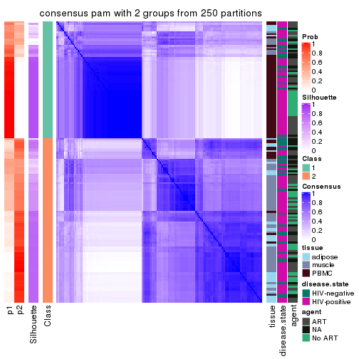</p>

</div>
<div id='tab-CV-pam-consensus-heatmap-2'>
<pre><code class="r">consensus_heatmap(res, k = 3)
</code></pre>

<p>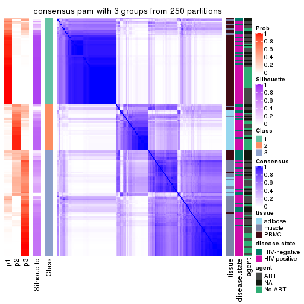</p>

</div>
<div id='tab-CV-pam-consensus-heatmap-3'>
<pre><code class="r">consensus_heatmap(res, k = 4)
</code></pre>

<p>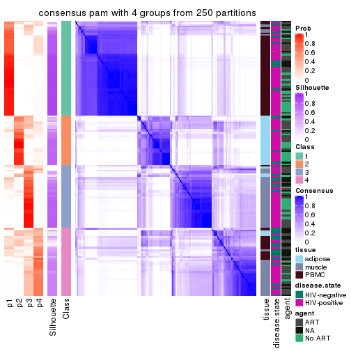</p>

</div>
<div id='tab-CV-pam-consensus-heatmap-4'>
<pre><code class="r">consensus_heatmap(res, k = 5)
</code></pre>

<p>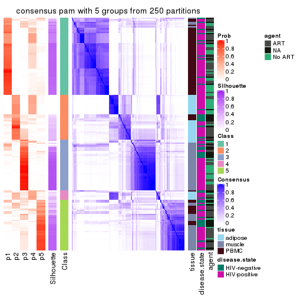</p>

</div>
<div id='tab-CV-pam-consensus-heatmap-5'>
<pre><code class="r">consensus_heatmap(res, k = 6)
</code></pre>

<p>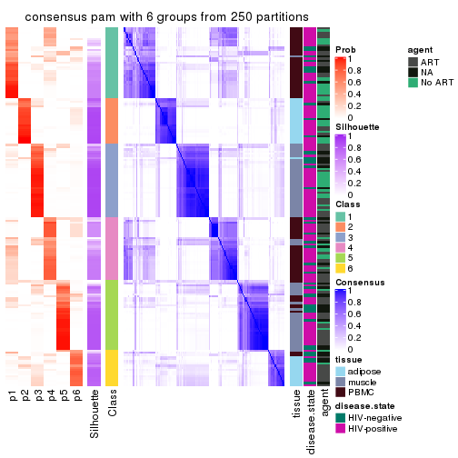</p>

</div>
</div>

Heatmaps for the membership of samples in all partitions to see how consistent they are:


<script>
$( function() {
	$( '#tabs-CV-pam-membership-heatmap' ).tabs();
} );
</script>
<div id='tabs-CV-pam-membership-heatmap'>
<ul>
<li><a href='#tab-CV-pam-membership-heatmap-1'>k = 2</a></li>
<li><a href='#tab-CV-pam-membership-heatmap-2'>k = 3</a></li>
<li><a href='#tab-CV-pam-membership-heatmap-3'>k = 4</a></li>
<li><a href='#tab-CV-pam-membership-heatmap-4'>k = 5</a></li>
<li><a href='#tab-CV-pam-membership-heatmap-5'>k = 6</a></li>
</ul>
<div id='tab-CV-pam-membership-heatmap-1'>
<pre><code class="r">membership_heatmap(res, k = 2)
</code></pre>

<p>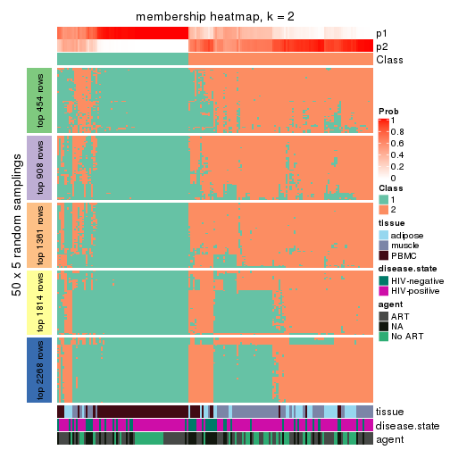</p>

</div>
<div id='tab-CV-pam-membership-heatmap-2'>
<pre><code class="r">membership_heatmap(res, k = 3)
</code></pre>

<p>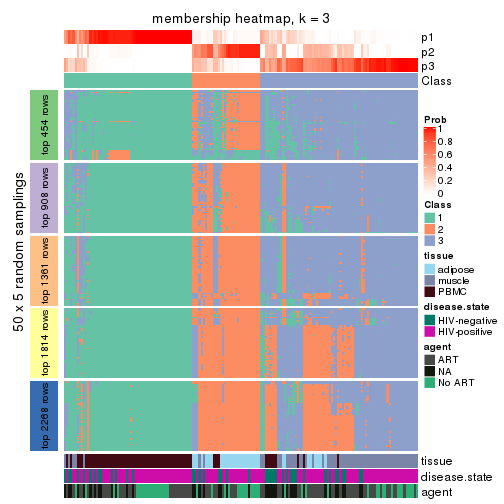</p>

</div>
<div id='tab-CV-pam-membership-heatmap-3'>
<pre><code class="r">membership_heatmap(res, k = 4)
</code></pre>

<p>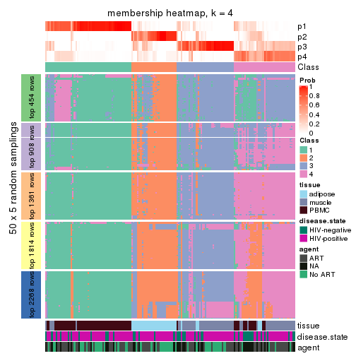</p>

</div>
<div id='tab-CV-pam-membership-heatmap-4'>
<pre><code class="r">membership_heatmap(res, k = 5)
</code></pre>

<p>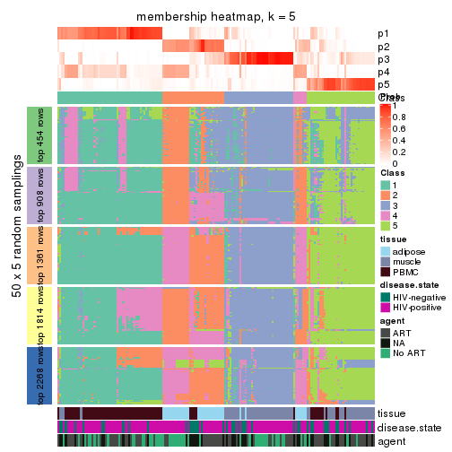</p>

</div>
<div id='tab-CV-pam-membership-heatmap-5'>
<pre><code class="r">membership_heatmap(res, k = 6)
</code></pre>

<p>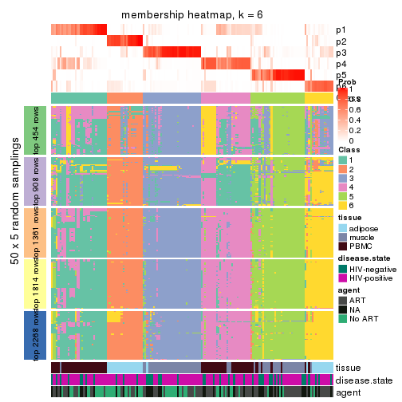</p>

</div>
</div>

As soon as we have had the classes for columns, we can look for signatures
which are significantly different between classes which can be candidate marks
for certain classes. Following are the heatmaps for signatures.


Signature heatmaps where rows are scaled:


<script>
$( function() {
	$( '#tabs-CV-pam-get-signatures' ).tabs();
} );
</script>
<div id='tabs-CV-pam-get-signatures'>
<ul>
<li><a href='#tab-CV-pam-get-signatures-1'>k = 2</a></li>
<li><a href='#tab-CV-pam-get-signatures-2'>k = 3</a></li>
<li><a href='#tab-CV-pam-get-signatures-3'>k = 4</a></li>
<li><a href='#tab-CV-pam-get-signatures-4'>k = 5</a></li>
<li><a href='#tab-CV-pam-get-signatures-5'>k = 6</a></li>
</ul>
<div id='tab-CV-pam-get-signatures-1'>
<pre><code class="r">get_signatures(res, k = 2)
</code></pre>

<p>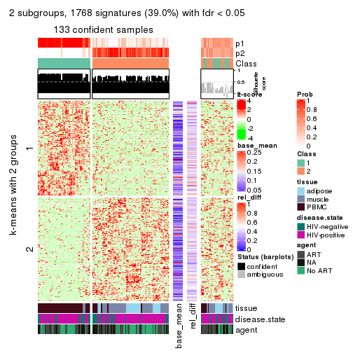</p>

</div>
<div id='tab-CV-pam-get-signatures-2'>
<pre><code class="r">get_signatures(res, k = 3)
</code></pre>

<p>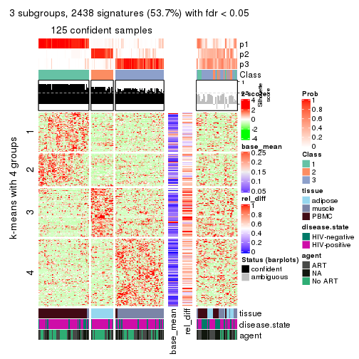</p>

</div>
<div id='tab-CV-pam-get-signatures-3'>
<pre><code class="r">get_signatures(res, k = 4)
</code></pre>

<p>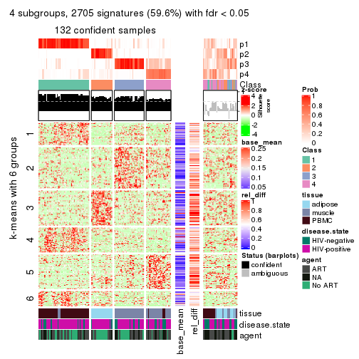</p>

</div>
<div id='tab-CV-pam-get-signatures-4'>
<pre><code class="r">get_signatures(res, k = 5)
</code></pre>

<p>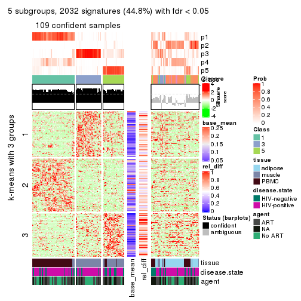</p>

</div>
<div id='tab-CV-pam-get-signatures-5'>
<pre><code class="r">get_signatures(res, k = 6)
</code></pre>

<p>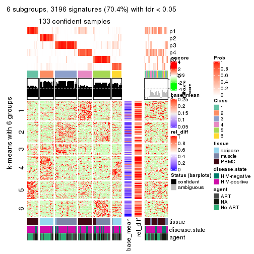</p>

</div>
</div>


Signature heatmaps where rows are not scaled:


<script>
$( function() {
	$( '#tabs-CV-pam-get-signatures-no-scale' ).tabs();
} );
</script>
<div id='tabs-CV-pam-get-signatures-no-scale'>
<ul>
<li><a href='#tab-CV-pam-get-signatures-no-scale-1'>k = 2</a></li>
<li><a href='#tab-CV-pam-get-signatures-no-scale-2'>k = 3</a></li>
<li><a href='#tab-CV-pam-get-signatures-no-scale-3'>k = 4</a></li>
<li><a href='#tab-CV-pam-get-signatures-no-scale-4'>k = 5</a></li>
<li><a href='#tab-CV-pam-get-signatures-no-scale-5'>k = 6</a></li>
</ul>
<div id='tab-CV-pam-get-signatures-no-scale-1'>
<pre><code class="r">get_signatures(res, k = 2, scale_rows = FALSE)
</code></pre>

<p>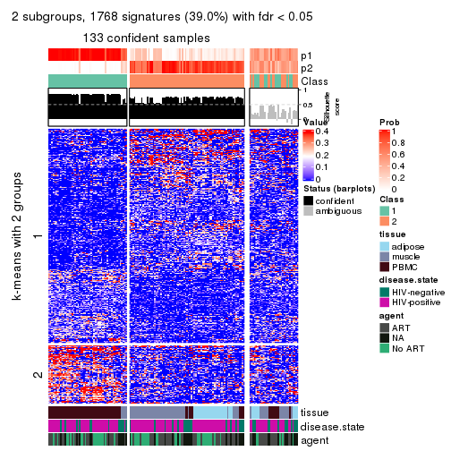</p>

</div>
<div id='tab-CV-pam-get-signatures-no-scale-2'>
<pre><code class="r">get_signatures(res, k = 3, scale_rows = FALSE)
</code></pre>

<p>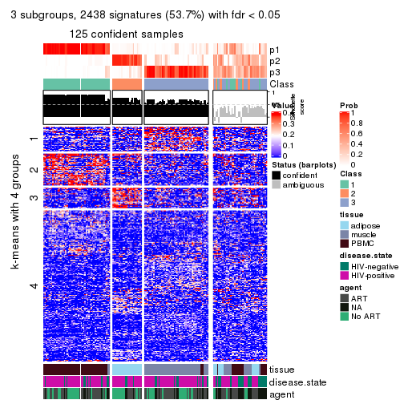</p>

</div>
<div id='tab-CV-pam-get-signatures-no-scale-3'>
<pre><code class="r">get_signatures(res, k = 4, scale_rows = FALSE)
</code></pre>

<p>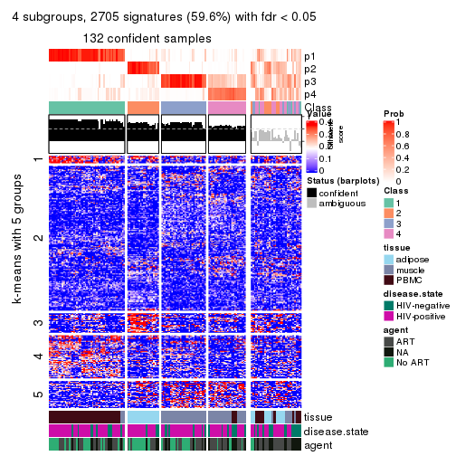</p>

</div>
<div id='tab-CV-pam-get-signatures-no-scale-4'>
<pre><code class="r">get_signatures(res, k = 5, scale_rows = FALSE)
</code></pre>

<p>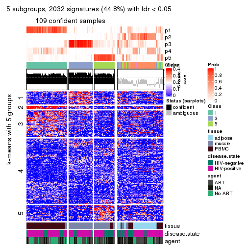</p>

</div>
<div id='tab-CV-pam-get-signatures-no-scale-5'>
<pre><code class="r">get_signatures(res, k = 6, scale_rows = FALSE)
</code></pre>

<p>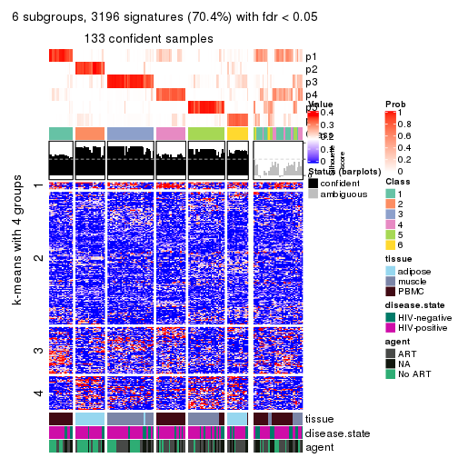</p>

</div>
</div>


Compare the overlap of signatures from different k:

```r
compare_signatures(res)
```

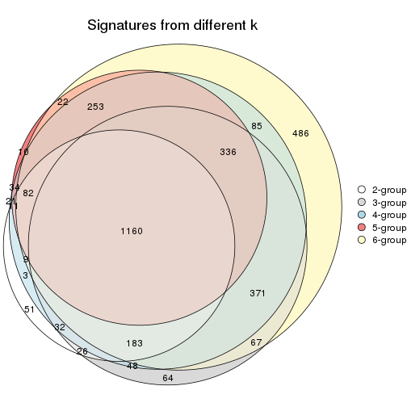

`get_signature()` returns a data frame invisibly. TO get the list of signatures, the function
call should be assigned to a variable explicitly. In following code, if `plot` argument is set
to `FALSE`, no heatmap is plotted while only the differential analysis is performed.

```r
# code only for demonstration
tb = get_signature(res, k = ..., plot = FALSE)
```

An example of the output of `tb` is:

```
#>   which_row         fdr    mean_1    mean_2 scaled_mean_1 scaled_mean_2 km
#> 1        38 0.042760348  8.373488  9.131774    -0.5533452     0.5164555  1
#> 2        40 0.018707592  7.106213  8.469186    -0.6173731     0.5762149  1
#> 3        55 0.019134737 10.221463 11.207825    -0.6159697     0.5749050  1
#> 4        59 0.006059896  5.921854  7.869574    -0.6899429     0.6439467  1
#> 5        60 0.018055526  8.928898 10.211722    -0.6204761     0.5791110  1
#> 6        98 0.009384629 15.714769 14.887706     0.6635654    -0.6193277  2
...
```

The columns in `tb` are:

1. `which_row`: row indices corresponding to the input matrix.
2. `fdr`: FDR for the differential test. 
3. `mean_x`: The mean value in group x.
4. `scaled_mean_x`: The mean value in group x after rows are scaled.
5. `km`: Row groups if k-means clustering is applied to rows.


UMAP plot which shows how samples are separated.


<script>
$( function() {
	$( '#tabs-CV-pam-dimension-reduction' ).tabs();
} );
</script>
<div id='tabs-CV-pam-dimension-reduction'>
<ul>
<li><a href='#tab-CV-pam-dimension-reduction-1'>k = 2</a></li>
<li><a href='#tab-CV-pam-dimension-reduction-2'>k = 3</a></li>
<li><a href='#tab-CV-pam-dimension-reduction-3'>k = 4</a></li>
<li><a href='#tab-CV-pam-dimension-reduction-4'>k = 5</a></li>
<li><a href='#tab-CV-pam-dimension-reduction-5'>k = 6</a></li>
</ul>
<div id='tab-CV-pam-dimension-reduction-1'>
<pre><code class="r">dimension_reduction(res, k = 2, method = &quot;UMAP&quot;)
</code></pre>

<p>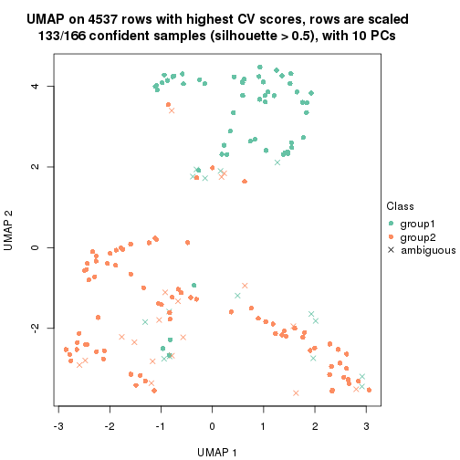</p>

</div>
<div id='tab-CV-pam-dimension-reduction-2'>
<pre><code class="r">dimension_reduction(res, k = 3, method = &quot;UMAP&quot;)
</code></pre>

<p>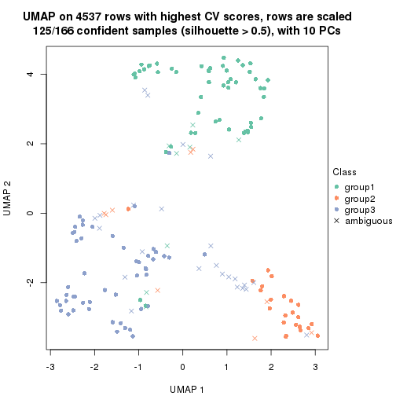</p>

</div>
<div id='tab-CV-pam-dimension-reduction-3'>
<pre><code class="r">dimension_reduction(res, k = 4, method = &quot;UMAP&quot;)
</code></pre>

<p>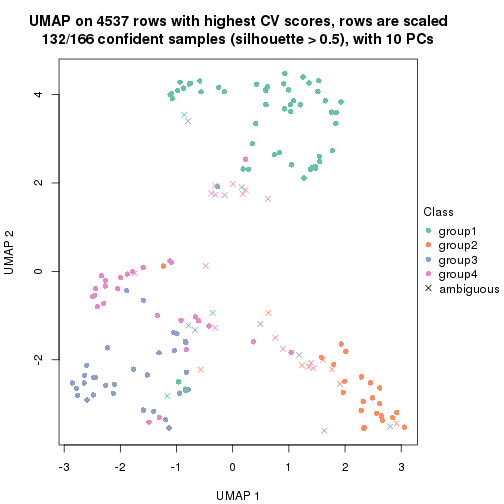</p>

</div>
<div id='tab-CV-pam-dimension-reduction-4'>
<pre><code class="r">dimension_reduction(res, k = 5, method = &quot;UMAP&quot;)
</code></pre>

<p>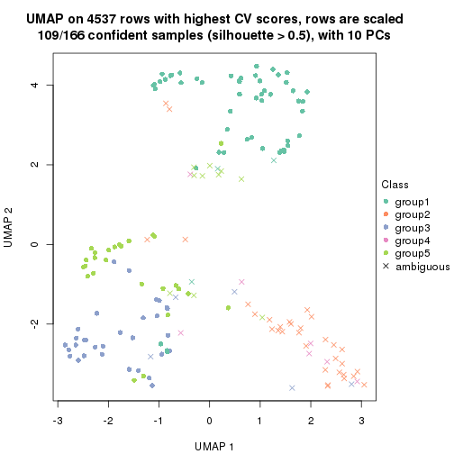</p>

</div>
<div id='tab-CV-pam-dimension-reduction-5'>
<pre><code class="r">dimension_reduction(res, k = 6, method = &quot;UMAP&quot;)
</code></pre>

<p>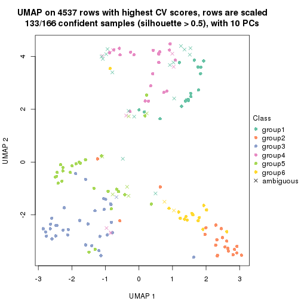</p>

</div>
</div>


Following heatmap shows how subgroups are split when increasing `k`:

```r
collect_classes(res)
```

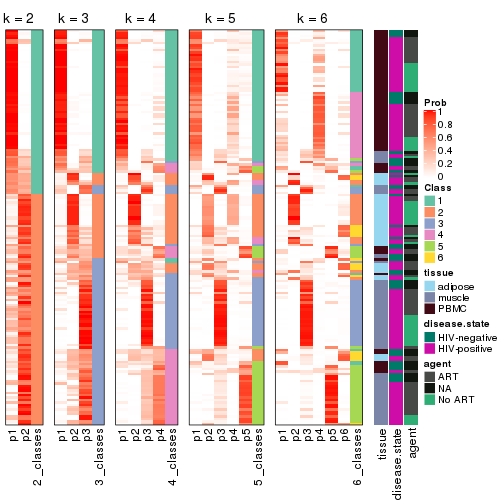


Test correlation between subgroups and known annotations. If the known
annotation is numeric, one-way ANOVA test is applied, and if the known
annotation is discrete, chi-squared contingency table test is applied.

```r
test_to_known_factors(res)
```

```
#>          n tissue(p) disease.state(p) agent(p) k
#> CV:pam 133  1.94e-19            1.000  0.95160 2
#> CV:pam 125  7.45e-49            0.760  0.29176 3
#> CV:pam 132  9.92e-48            0.428  0.09062 4
#> CV:pam 109  5.37e-19            0.202  0.09600 5
#> CV:pam 133  8.10e-45            0.826  0.00284 6
```


If matrix rows can be associated to genes, consider to use `GO_Enrichment(res,
...)` to perform function enrichment for the signature genes.


 

---------------------------------------------------


### CV:mclust


The object with results only for a single top-value method and a single partition method 
can be extracted as:

```r
res = res_list["CV", "mclust"]
# you can also extract it by
# res = res_list["CV:mclust"]
```

A summary of `res` and all the functions that can be applied to it:

```r
res
```

```
#> A 'ConsensusPartition' object with k = 2, 3, 4, 5, 6.
#>   On a matrix with 4537 rows and 166 columns.
#>   Top rows (454, 908, 1361, 1814, 2268) are extracted by 'CV' method.
#>   Subgroups are detected by 'mclust' method.
#>   Performed in total 1250 partitions by row resampling.
#>   Best k for subgroups seems to be 3.
#> 
#> Following methods can be applied to this 'ConsensusPartition' object:
#>  [1] "cola_report"             "collect_classes"         "collect_plots"          
#>  [4] "collect_stats"           "colnames"                "compare_signatures"     
#>  [7] "consensus_heatmap"       "dimension_reduction"     "functional_enrichment"  
#> [10] "get_anno_col"            "get_anno"                "get_classes"            
#> [13] "get_consensus"           "get_matrix"              "get_membership"         
#> [16] "get_param"               "get_signatures"          "get_stats"              
#> [19] "is_best_k"               "is_stable_k"             "membership_heatmap"     
#> [22] "ncol"                    "nrow"                    "plot_ecdf"              
#> [25] "rownames"                "select_partition_number" "show"                   
#> [28] "suggest_best_k"          "test_to_known_factors"
```

`collect_plots()` function collects all the plots made from `res` for all `k` (number of partitions)
into one single page to provide an easy and fast comparison between different `k`.

```r
collect_plots(res)
```

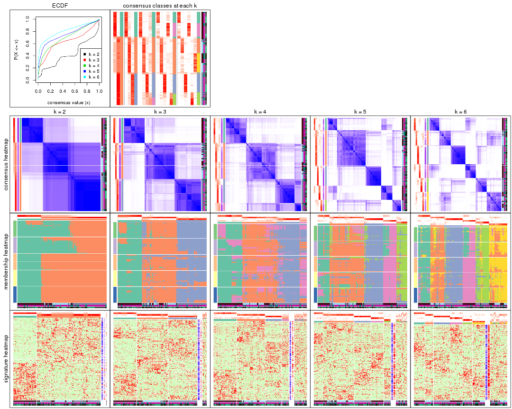

The plots are:

- The first row: a plot of the ECDF (Empirical cumulative distribution
  function) curves of the consensus matrix for each `k` and the heatmap of
  predicted classes for each `k`.
- The second row: heatmaps of the consensus matrix for each `k`.
- The third row: heatmaps of the membership matrix for each `k`.
- The fouth row: heatmaps of the signatures for each `k`.

All the plots in panels can be made by individual functions and they are
plotted later in this section.

`select_partition_number()` produces several plots showing different
statistics for choosing "optimized" `k`. There are following statistics:

- ECDF curves of the consensus matrix for each `k`;
- 1-PAC. [The PAC
  score](https://en.wikipedia.org/wiki/Consensus_clustering#Over-interpretation_potential_of_consensus_clustering)
  measures the proportion of the ambiguous subgrouping.
- Mean silhouette score.
- Concordance. The mean probability of fiting the consensus class ids in all
  partitions.
- Area increased. Denote $A_k$ as the area under the ECDF curve for current
  `k`, the area increased is defined as $A_k - A_{k-1}$.
- Rand index. The percent of pairs of samples that are both in a same cluster
  or both are not in a same cluster in the partition of k and k-1.
- Jaccard index. The ratio of pairs of samples are both in a same cluster in
  the partition of k and k-1 and the pairs of samples are both in a same
  cluster in the partition k or k-1.

The detailed explanations of these statistics can be found in [the cola
vignette](http://bioconductor.org/packages/devel/bioc/vignettes/cola/inst/doc/cola.html#toc_13).

Generally speaking, lower PAC score, higher mean silhouette score or higher
concordance corresponds to better partition. Rand index and Jaccard index
measure how similar the current partition is compared to partition with `k-1`.
If they are too similar, we won't accept `k` is better than `k-1`.

```r
select_partition_number(res)
```

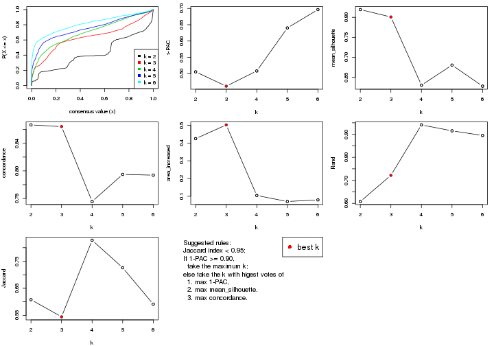

The numeric values for all these statistics can be obtained by `get_stats()`.

```r
get_stats(res)
```

```
#>   k 1-PAC mean_silhouette concordance area_increased  Rand Jaccard
#> 2 2 0.506           0.819       0.867         0.4252 0.608   0.608
#> 3 3 0.462           0.801       0.864         0.5025 0.722   0.544
#> 4 4 0.508           0.630       0.756         0.1043 0.941   0.827
#> 5 5 0.640           0.680       0.795         0.0704 0.915   0.726
#> 6 6 0.696           0.628       0.794         0.0794 0.895   0.591
```

`suggest_best_k()` suggests the best $k$ based on these statistics. The rules are as follows:

- All $k$ with Jaccard index larger than 0.95 are removed because the increase of
  the partition number does not provides enough extra information. If all $k$ are removed,
  the best $k$ is assigned by `NA`.
- For $k$ with 1-PAC larger than 0.9, the maximal $k$ is taken as the "best k". Other $k$ is called "optional k".
- If it does not fit the second rule. The $k$ with the highest vote of highest
  1-PAC, mean silhouette and concordance is taken as the "best k".

```r
suggest_best_k(res)
```

```
#> [1] 3
```


Following shows the table of the partitions (You need to click the **show/hide
code output** link to see it). The membership matrix (columns with name `p*`)
is inferred by
[`clue::cl_consensus()`](https://www.rdocumentation.org/link/cl_consensus?package=clue)
function with the `SE` method. Basically the value in the membership matrix
represents the probability to belong to a certain group. The finall class
label for an item is determined with the group with highest probability it
belongs to.

In `get_classes()` function, the entropy is calculated from the membership
matrix and the silhouette score is calculated from the consensus matrix.


<script>
$( function() {
	$( '#tabs-CV-mclust-get-classes' ).tabs();
} );
</script>
<div id='tabs-CV-mclust-get-classes'>
<ul>
<li><a href='#tab-CV-mclust-get-classes-1'>k = 2</a></li>
<li><a href='#tab-CV-mclust-get-classes-2'>k = 3</a></li>
<li><a href='#tab-CV-mclust-get-classes-3'>k = 4</a></li>
<li><a href='#tab-CV-mclust-get-classes-4'>k = 5</a></li>
<li><a href='#tab-CV-mclust-get-classes-5'>k = 6</a></li>
</ul>

<div id='tab-CV-mclust-get-classes-1'>
<p><a id='tab-CV-mclust-get-classes-1-a' style='color:#0366d6' href='#'>show/hide code output</a></p>
<pre><code class="r">cbind(get_classes(res, k = 2), get_membership(res, k = 2))
</code></pre>

<pre><code>#&gt;           class entropy silhouette    p1    p2
#&gt; GSM751298     1  0.2948      0.969 0.948 0.052
#&gt; GSM751304     2  0.9460      0.715 0.364 0.636
#&gt; GSM751305     2  0.9460      0.715 0.364 0.636
#&gt; GSM751307     2  0.9460      0.715 0.364 0.636
#&gt; GSM751310     1  0.0000      0.955 1.000 0.000
#&gt; GSM751314     1  0.0000      0.955 1.000 0.000
#&gt; GSM751316     1  0.0000      0.955 1.000 0.000
#&gt; GSM751318     1  0.2603      0.970 0.956 0.044
#&gt; GSM751342     1  0.0376      0.954 0.996 0.004
#&gt; GSM751346     1  0.2948      0.968 0.948 0.052
#&gt; GSM751347     2  0.6343      0.790 0.160 0.840
#&gt; GSM751348     2  0.9460      0.713 0.364 0.636
#&gt; GSM751349     2  0.6973      0.787 0.188 0.812
#&gt; GSM751352     2  0.9323      0.730 0.348 0.652
#&gt; GSM751353     2  0.7453      0.780 0.212 0.788
#&gt; GSM751354     2  0.9323      0.731 0.348 0.652
#&gt; GSM751355     2  0.6973      0.785 0.188 0.812
#&gt; GSM751358     2  0.9686      0.671 0.396 0.604
#&gt; GSM751359     2  0.7528      0.782 0.216 0.784
#&gt; GSM751294     2  0.9087      0.739 0.324 0.676
#&gt; GSM751296     1  0.3274      0.965 0.940 0.060
#&gt; GSM751297     2  0.9460      0.664 0.364 0.636
#&gt; GSM751299     2  0.9323      0.730 0.348 0.652
#&gt; GSM751300     1  0.3274      0.965 0.940 0.060
#&gt; GSM751301     2  0.9661      0.671 0.392 0.608
#&gt; GSM751302     1  0.2423      0.967 0.960 0.040
#&gt; GSM751303     1  0.0000      0.955 1.000 0.000
#&gt; GSM751306     1  0.0000      0.955 1.000 0.000
#&gt; GSM751308     2  0.9635      0.665 0.388 0.612
#&gt; GSM751309     1  0.0000      0.955 1.000 0.000
#&gt; GSM751311     1  0.0000      0.955 1.000 0.000
#&gt; GSM751312     1  0.0000      0.955 1.000 0.000
#&gt; GSM751313     1  0.3274      0.962 0.940 0.060
#&gt; GSM751315     1  0.0376      0.957 0.996 0.004
#&gt; GSM751317     1  0.0000      0.955 1.000 0.000
#&gt; GSM751320     1  0.2948      0.969 0.948 0.052
#&gt; GSM751321     1  0.0000      0.955 1.000 0.000
#&gt; GSM751322     1  0.2236      0.969 0.964 0.036
#&gt; GSM751324     1  0.2236      0.969 0.964 0.036
#&gt; GSM751325     1  0.2948      0.969 0.948 0.052
#&gt; GSM751332     1  0.2948      0.969 0.948 0.052
#&gt; GSM751334     1  0.2948      0.969 0.948 0.052
#&gt; GSM751339     1  0.2948      0.969 0.948 0.052
#&gt; GSM751341     1  0.0000      0.955 1.000 0.000
#&gt; GSM751343     1  0.2948      0.969 0.948 0.052
#&gt; GSM751344     2  0.9286      0.733 0.344 0.656
#&gt; GSM751345     2  0.9286      0.733 0.344 0.656
#&gt; GSM751356     2  0.9522      0.705 0.372 0.628
#&gt; GSM751357     2  0.9522      0.705 0.372 0.628
#&gt; GSM751293     2  0.9993      0.477 0.484 0.516
#&gt; GSM751295     1  0.2236      0.966 0.964 0.036
#&gt; GSM751319     1  0.0000      0.955 1.000 0.000
#&gt; GSM751323     1  0.2948      0.969 0.948 0.052
#&gt; GSM751326     1  0.2948      0.969 0.948 0.052
#&gt; GSM751327     1  0.2236      0.969 0.964 0.036
#&gt; GSM751328     1  0.0000      0.955 1.000 0.000
#&gt; GSM751329     1  0.2948      0.969 0.948 0.052
#&gt; GSM751330     1  0.3114      0.966 0.944 0.056
#&gt; GSM751331     1  0.3584      0.959 0.932 0.068
#&gt; GSM751333     1  0.3274      0.963 0.940 0.060
#&gt; GSM751335     1  0.2948      0.969 0.948 0.052
#&gt; GSM751336     1  0.3114      0.966 0.944 0.056
#&gt; GSM751337     1  0.2948      0.969 0.948 0.052
#&gt; GSM751338     1  0.2948      0.969 0.948 0.052
#&gt; GSM751340     2  0.9661      0.614 0.392 0.608
#&gt; GSM751350     1  0.3584      0.958 0.932 0.068
#&gt; GSM751351     1  0.3431      0.962 0.936 0.064
#&gt; GSM751362     2  0.0000      0.808 0.000 1.000
#&gt; GSM751363     2  0.4022      0.804 0.080 0.920
#&gt; GSM751367     2  0.4690      0.802 0.100 0.900
#&gt; GSM751368     2  0.0376      0.809 0.004 0.996
#&gt; GSM751371     2  0.0000      0.808 0.000 1.000
#&gt; GSM751375     2  0.1414      0.809 0.020 0.980
#&gt; GSM751376     2  0.5408      0.798 0.124 0.876
#&gt; GSM751378     2  0.0376      0.809 0.004 0.996
#&gt; GSM751379     2  0.4690      0.802 0.100 0.900
#&gt; GSM751382     2  0.0938      0.809 0.012 0.988
#&gt; GSM751386     2  0.0376      0.809 0.004 0.996
#&gt; GSM751388     2  0.0376      0.809 0.004 0.996
#&gt; GSM751391     2  0.1184      0.809 0.016 0.984
#&gt; GSM751410     2  0.0376      0.809 0.004 0.996
#&gt; GSM751414     2  0.0000      0.808 0.000 1.000
#&gt; GSM751361     2  0.0000      0.808 0.000 1.000
#&gt; GSM751365     2  0.0000      0.808 0.000 1.000
#&gt; GSM751366     2  0.0000      0.808 0.000 1.000
#&gt; GSM751369     2  0.0000      0.808 0.000 1.000
#&gt; GSM751370     2  0.0000      0.808 0.000 1.000
#&gt; GSM751372     2  0.0000      0.808 0.000 1.000
#&gt; GSM751373     2  0.0000      0.808 0.000 1.000
#&gt; GSM751374     2  0.5408      0.798 0.124 0.876
#&gt; GSM751377     2  0.0000      0.808 0.000 1.000
#&gt; GSM751380     2  0.0000      0.808 0.000 1.000
#&gt; GSM751381     2  0.0376      0.809 0.004 0.996
#&gt; GSM751383     2  0.0376      0.809 0.004 0.996
#&gt; GSM751384     2  0.0000      0.808 0.000 1.000
#&gt; GSM751385     2  0.0376      0.809 0.004 0.996
#&gt; GSM751387     2  0.0376      0.809 0.004 0.996
#&gt; GSM751389     2  0.0000      0.808 0.000 1.000
#&gt; GSM751393     2  0.0376      0.809 0.004 0.996
#&gt; GSM751394     2  0.0376      0.809 0.004 0.996
#&gt; GSM751395     2  0.1633      0.809 0.024 0.976
#&gt; GSM751397     2  0.0376      0.809 0.004 0.996
#&gt; GSM751398     2  0.0376      0.809 0.004 0.996
#&gt; GSM751404     2  0.0000      0.808 0.000 1.000
#&gt; GSM751406     2  0.0000      0.808 0.000 1.000
#&gt; GSM751411     2  0.0000      0.808 0.000 1.000
#&gt; GSM751413     2  0.3584      0.806 0.068 0.932
#&gt; GSM751415     2  0.0000      0.808 0.000 1.000
#&gt; GSM751416     2  0.0000      0.808 0.000 1.000
#&gt; GSM751417     2  0.0000      0.808 0.000 1.000
#&gt; GSM751421     2  0.0000      0.808 0.000 1.000
#&gt; GSM751422     2  0.0000      0.808 0.000 1.000
#&gt; GSM751360     2  0.0000      0.808 0.000 1.000
#&gt; GSM751364     2  0.0000      0.808 0.000 1.000
#&gt; GSM751390     2  0.0376      0.809 0.004 0.996
#&gt; GSM751392     2  0.0376      0.809 0.004 0.996
#&gt; GSM751396     2  0.0376      0.809 0.004 0.996
#&gt; GSM751399     2  0.0000      0.808 0.000 1.000
#&gt; GSM751400     2  0.0000      0.808 0.000 1.000
#&gt; GSM751401     2  0.0000      0.808 0.000 1.000
#&gt; GSM751402     2  0.0000      0.808 0.000 1.000
#&gt; GSM751403     2  0.0000      0.808 0.000 1.000
#&gt; GSM751405     2  0.0000      0.808 0.000 1.000
#&gt; GSM751407     2  0.0000      0.808 0.000 1.000
#&gt; GSM751408     2  0.0000      0.808 0.000 1.000
#&gt; GSM751409     2  0.0000      0.808 0.000 1.000
#&gt; GSM751412     2  0.0000      0.808 0.000 1.000
#&gt; GSM751418     2  0.0000      0.808 0.000 1.000
#&gt; GSM751419     2  0.0000      0.808 0.000 1.000
#&gt; GSM751420     2  0.3879      0.805 0.076 0.924
#&gt; GSM751425     2  0.9323      0.731 0.348 0.652
#&gt; GSM751429     2  0.9087      0.745 0.324 0.676
#&gt; GSM751430     2  0.6712      0.786 0.176 0.824
#&gt; GSM751433     2  0.9491      0.710 0.368 0.632
#&gt; GSM751437     2  0.9129      0.743 0.328 0.672
#&gt; GSM751448     2  0.8955      0.749 0.312 0.688
#&gt; GSM751451     2  0.9248      0.736 0.340 0.660
#&gt; GSM751423     2  0.8909      0.752 0.308 0.692
#&gt; GSM751424     2  0.9323      0.731 0.348 0.652
#&gt; GSM751428     2  0.9358      0.728 0.352 0.648
#&gt; GSM751431     2  0.9323      0.731 0.348 0.652
#&gt; GSM751432     2  0.8909      0.751 0.308 0.692
#&gt; GSM751434     2  0.9358      0.728 0.352 0.648
#&gt; GSM751435     2  0.9358      0.728 0.352 0.648
#&gt; GSM751436     2  0.9393      0.724 0.356 0.644
#&gt; GSM751440     2  0.9358      0.728 0.352 0.648
#&gt; GSM751444     2  0.9323      0.731 0.348 0.652
#&gt; GSM751446     2  0.9323      0.731 0.348 0.652
#&gt; GSM751449     2  0.9358      0.728 0.352 0.648
#&gt; GSM751450     2  0.9323      0.731 0.348 0.652
#&gt; GSM751452     2  0.9323      0.731 0.348 0.652
#&gt; GSM751426     2  0.9358      0.728 0.352 0.648
#&gt; GSM751427     2  0.9209      0.739 0.336 0.664
#&gt; GSM751438     2  0.9358      0.728 0.352 0.648
#&gt; GSM751439     2  0.9323      0.731 0.348 0.652
#&gt; GSM751441     2  0.8499      0.764 0.276 0.724
#&gt; GSM751442     2  0.9323      0.731 0.348 0.652
#&gt; GSM751443     2  0.9358      0.728 0.352 0.648
#&gt; GSM751445     2  0.9358      0.728 0.352 0.648
#&gt; GSM751447     2  0.9358      0.728 0.352 0.648
#&gt; GSM751453     2  0.9358      0.728 0.352 0.648
#&gt; GSM751454     2  0.9358      0.728 0.352 0.648
#&gt; GSM751455     2  0.9323      0.731 0.348 0.652
#&gt; GSM751456     2  0.9323      0.731 0.348 0.652
#&gt; GSM751457     2  0.9358      0.728 0.352 0.648
#&gt; GSM751458     2  0.9358      0.728 0.352 0.648
</code></pre>

<script>
$('#tab-CV-mclust-get-classes-1-a').parent().next().next().hide();
$('#tab-CV-mclust-get-classes-1-a').click(function(){
  $('#tab-CV-mclust-get-classes-1-a').parent().next().next().toggle();
  return(false);
});
</script>
</div>

<div id='tab-CV-mclust-get-classes-2'>
<p><a id='tab-CV-mclust-get-classes-2-a' style='color:#0366d6' href='#'>show/hide code output</a></p>
<pre><code class="r">cbind(get_classes(res, k = 3), get_membership(res, k = 3))
</code></pre>

<pre><code>#&gt;           class entropy silhouette    p1    p2    p3
#&gt; GSM751298     1  0.4280     0.8681 0.856 0.124 0.020
#&gt; GSM751304     2  0.2031     0.8532 0.032 0.952 0.016
#&gt; GSM751305     2  0.2414     0.8545 0.020 0.940 0.040
#&gt; GSM751307     2  0.1919     0.8538 0.024 0.956 0.020
#&gt; GSM751310     1  0.4504     0.8235 0.804 0.196 0.000
#&gt; GSM751314     1  0.4452     0.8262 0.808 0.192 0.000
#&gt; GSM751316     1  0.4555     0.8204 0.800 0.200 0.000
#&gt; GSM751318     1  0.2959     0.8708 0.900 0.100 0.000
#&gt; GSM751342     1  0.4750     0.8047 0.784 0.216 0.000
#&gt; GSM751346     1  0.4489     0.8464 0.856 0.108 0.036
#&gt; GSM751347     2  0.7279     0.5649 0.056 0.652 0.292
#&gt; GSM751348     2  0.2384     0.8562 0.008 0.936 0.056
#&gt; GSM751349     2  0.5291     0.6399 0.000 0.732 0.268
#&gt; GSM751352     2  0.2031     0.8590 0.016 0.952 0.032
#&gt; GSM751353     2  0.2096     0.8559 0.004 0.944 0.052
#&gt; GSM751354     2  0.2116     0.8615 0.012 0.948 0.040
#&gt; GSM751355     2  0.2945     0.8363 0.004 0.908 0.088
#&gt; GSM751358     2  0.7801     0.4968 0.076 0.616 0.308
#&gt; GSM751359     3  0.6683     0.0857 0.008 0.496 0.496
#&gt; GSM751294     2  0.2955     0.8473 0.008 0.912 0.080
#&gt; GSM751296     1  0.3973     0.8638 0.880 0.088 0.032
#&gt; GSM751297     2  0.7764     0.4062 0.328 0.604 0.068
#&gt; GSM751299     2  0.2443     0.8581 0.028 0.940 0.032
#&gt; GSM751300     1  0.4335     0.8472 0.864 0.100 0.036
#&gt; GSM751301     2  0.4799     0.7685 0.132 0.836 0.032
#&gt; GSM751302     1  0.4489     0.8464 0.856 0.108 0.036
#&gt; GSM751303     1  0.4555     0.8204 0.800 0.200 0.000
#&gt; GSM751306     1  0.4555     0.8204 0.800 0.200 0.000
#&gt; GSM751308     2  0.7124     0.5205 0.272 0.672 0.056
#&gt; GSM751309     1  0.4555     0.8204 0.800 0.200 0.000
#&gt; GSM751311     1  0.4654     0.8141 0.792 0.208 0.000
#&gt; GSM751312     1  0.4605     0.8181 0.796 0.204 0.000
#&gt; GSM751313     1  0.2569     0.8801 0.936 0.032 0.032
#&gt; GSM751315     1  0.2356     0.8767 0.928 0.072 0.000
#&gt; GSM751317     1  0.4504     0.8235 0.804 0.196 0.000
#&gt; GSM751320     1  0.0475     0.8756 0.992 0.004 0.004
#&gt; GSM751321     1  0.4555     0.8204 0.800 0.200 0.000
#&gt; GSM751322     1  0.0424     0.8761 0.992 0.008 0.000
#&gt; GSM751324     1  0.0592     0.8771 0.988 0.012 0.000
#&gt; GSM751325     1  0.0424     0.8761 0.992 0.008 0.000
#&gt; GSM751332     1  0.0661     0.8764 0.988 0.004 0.008
#&gt; GSM751334     1  0.0424     0.8744 0.992 0.000 0.008
#&gt; GSM751339     1  0.2187     0.8770 0.948 0.028 0.024
#&gt; GSM751341     1  0.5551     0.8149 0.768 0.212 0.020
#&gt; GSM751343     1  0.1315     0.8766 0.972 0.008 0.020
#&gt; GSM751344     2  0.2187     0.8564 0.028 0.948 0.024
#&gt; GSM751345     2  0.2187     0.8564 0.028 0.948 0.024
#&gt; GSM751356     2  0.2681     0.8522 0.040 0.932 0.028
#&gt; GSM751357     2  0.2550     0.8524 0.040 0.936 0.024
#&gt; GSM751293     2  0.5461     0.6436 0.216 0.768 0.016
#&gt; GSM751295     1  0.4563     0.8424 0.852 0.112 0.036
#&gt; GSM751319     1  0.4555     0.8204 0.800 0.200 0.000
#&gt; GSM751323     1  0.0475     0.8756 0.992 0.004 0.004
#&gt; GSM751326     1  0.1585     0.8756 0.964 0.008 0.028
#&gt; GSM751327     1  0.0237     0.8748 0.996 0.004 0.000
#&gt; GSM751328     1  0.4062     0.8438 0.836 0.164 0.000
#&gt; GSM751329     1  0.0475     0.8756 0.992 0.004 0.004
#&gt; GSM751330     1  0.1585     0.8756 0.964 0.008 0.028
#&gt; GSM751331     1  0.5659     0.8173 0.796 0.152 0.052
#&gt; GSM751333     1  0.1711     0.8755 0.960 0.008 0.032
#&gt; GSM751335     1  0.1585     0.8756 0.964 0.008 0.028
#&gt; GSM751336     1  0.3406     0.8663 0.904 0.068 0.028
#&gt; GSM751337     1  0.2056     0.8772 0.952 0.024 0.024
#&gt; GSM751338     1  0.1919     0.8771 0.956 0.020 0.024
#&gt; GSM751340     1  0.8350     0.3069 0.532 0.380 0.088
#&gt; GSM751350     1  0.5047     0.8311 0.824 0.140 0.036
#&gt; GSM751351     1  0.4915     0.8346 0.832 0.132 0.036
#&gt; GSM751362     3  0.3267     0.8698 0.000 0.116 0.884
#&gt; GSM751363     3  0.5706     0.6421 0.000 0.320 0.680
#&gt; GSM751367     2  0.7546     0.3206 0.044 0.560 0.396
#&gt; GSM751368     3  0.4346     0.8369 0.000 0.184 0.816
#&gt; GSM751371     3  0.3619     0.8631 0.000 0.136 0.864
#&gt; GSM751375     2  0.6305    -0.1819 0.000 0.516 0.484
#&gt; GSM751376     2  0.5216     0.6377 0.000 0.740 0.260
#&gt; GSM751378     3  0.4931     0.8264 0.000 0.232 0.768
#&gt; GSM751379     2  0.5431     0.5925 0.000 0.716 0.284
#&gt; GSM751382     3  0.5178     0.7737 0.000 0.256 0.744
#&gt; GSM751386     3  0.4062     0.8370 0.000 0.164 0.836
#&gt; GSM751388     3  0.4062     0.8370 0.000 0.164 0.836
#&gt; GSM751391     3  0.5988     0.5259 0.000 0.368 0.632
#&gt; GSM751410     3  0.3267     0.8708 0.000 0.116 0.884
#&gt; GSM751414     3  0.1289     0.8619 0.000 0.032 0.968
#&gt; GSM751361     3  0.3192     0.8626 0.000 0.112 0.888
#&gt; GSM751365     3  0.1411     0.8623 0.000 0.036 0.964
#&gt; GSM751366     3  0.2959     0.8718 0.000 0.100 0.900
#&gt; GSM751369     3  0.5070     0.7642 0.004 0.224 0.772
#&gt; GSM751370     3  0.1529     0.8655 0.000 0.040 0.960
#&gt; GSM751372     3  0.1411     0.8638 0.000 0.036 0.964
#&gt; GSM751373     3  0.1643     0.8659 0.000 0.044 0.956
#&gt; GSM751374     2  0.5058     0.6716 0.000 0.756 0.244
#&gt; GSM751377     3  0.3816     0.8448 0.000 0.148 0.852
#&gt; GSM751380     3  0.3267     0.8698 0.000 0.116 0.884
#&gt; GSM751381     3  0.4062     0.8370 0.000 0.164 0.836
#&gt; GSM751383     3  0.4062     0.8370 0.000 0.164 0.836
#&gt; GSM751384     3  0.3482     0.8652 0.000 0.128 0.872
#&gt; GSM751385     3  0.5098     0.8106 0.000 0.248 0.752
#&gt; GSM751387     3  0.4062     0.8370 0.000 0.164 0.836
#&gt; GSM751389     3  0.4605     0.8257 0.000 0.204 0.796
#&gt; GSM751393     3  0.4931     0.8249 0.000 0.232 0.768
#&gt; GSM751394     3  0.4062     0.8370 0.000 0.164 0.836
#&gt; GSM751395     2  0.6280    -0.0457 0.000 0.540 0.460
#&gt; GSM751397     3  0.4062     0.8370 0.000 0.164 0.836
#&gt; GSM751398     3  0.4062     0.8370 0.000 0.164 0.836
#&gt; GSM751404     3  0.3412     0.8677 0.000 0.124 0.876
#&gt; GSM751406     3  0.3412     0.8677 0.000 0.124 0.876
#&gt; GSM751411     3  0.1860     0.8687 0.000 0.052 0.948
#&gt; GSM751413     3  0.6126     0.4894 0.000 0.400 0.600
#&gt; GSM751415     3  0.3412     0.8677 0.000 0.124 0.876
#&gt; GSM751416     3  0.3551     0.8531 0.000 0.132 0.868
#&gt; GSM751417     3  0.3482     0.8515 0.000 0.128 0.872
#&gt; GSM751421     3  0.3340     0.8690 0.000 0.120 0.880
#&gt; GSM751422     3  0.3038     0.8723 0.000 0.104 0.896
#&gt; GSM751360     3  0.1964     0.8691 0.000 0.056 0.944
#&gt; GSM751364     3  0.2066     0.8633 0.000 0.060 0.940
#&gt; GSM751390     3  0.3192     0.8669 0.000 0.112 0.888
#&gt; GSM751392     3  0.4062     0.8370 0.000 0.164 0.836
#&gt; GSM751396     3  0.4346     0.8312 0.000 0.184 0.816
#&gt; GSM751399     3  0.3116     0.8721 0.000 0.108 0.892
#&gt; GSM751400     3  0.3752     0.8599 0.000 0.144 0.856
#&gt; GSM751401     3  0.3412     0.8677 0.000 0.124 0.876
#&gt; GSM751402     3  0.3412     0.8677 0.000 0.124 0.876
#&gt; GSM751403     3  0.3412     0.8677 0.000 0.124 0.876
#&gt; GSM751405     3  0.3412     0.8677 0.000 0.124 0.876
#&gt; GSM751407     3  0.3412     0.8677 0.000 0.124 0.876
#&gt; GSM751408     3  0.3340     0.8691 0.000 0.120 0.880
#&gt; GSM751409     3  0.3941     0.8621 0.000 0.156 0.844
#&gt; GSM751412     3  0.3192     0.8714 0.000 0.112 0.888
#&gt; GSM751418     3  0.1411     0.8614 0.000 0.036 0.964
#&gt; GSM751419     3  0.1289     0.8619 0.000 0.032 0.968
#&gt; GSM751420     2  0.5785     0.5088 0.000 0.668 0.332
#&gt; GSM751425     2  0.2356     0.8542 0.000 0.928 0.072
#&gt; GSM751429     2  0.6168     0.7684 0.096 0.780 0.124
#&gt; GSM751430     2  0.3686     0.7885 0.000 0.860 0.140
#&gt; GSM751433     2  0.2682     0.8343 0.004 0.920 0.076
#&gt; GSM751437     2  0.5733     0.5419 0.000 0.676 0.324
#&gt; GSM751448     2  0.7273     0.7053 0.156 0.712 0.132
#&gt; GSM751451     2  0.4842     0.6910 0.000 0.776 0.224
#&gt; GSM751423     2  0.4605     0.7420 0.000 0.796 0.204
#&gt; GSM751424     2  0.2066     0.8403 0.000 0.940 0.060
#&gt; GSM751428     2  0.1411     0.8598 0.000 0.964 0.036
#&gt; GSM751431     2  0.2165     0.8399 0.000 0.936 0.064
#&gt; GSM751432     2  0.1163     0.8561 0.000 0.972 0.028
#&gt; GSM751434     2  0.0747     0.8538 0.000 0.984 0.016
#&gt; GSM751435     2  0.1989     0.8612 0.004 0.948 0.048
#&gt; GSM751436     2  0.2261     0.8367 0.000 0.932 0.068
#&gt; GSM751440     2  0.4062     0.8017 0.000 0.836 0.164
#&gt; GSM751444     2  0.1525     0.8592 0.004 0.964 0.032
#&gt; GSM751446     2  0.1765     0.8592 0.004 0.956 0.040
#&gt; GSM751449     2  0.1411     0.8587 0.000 0.964 0.036
#&gt; GSM751450     2  0.1163     0.8541 0.000 0.972 0.028
#&gt; GSM751452     2  0.1989     0.8435 0.004 0.948 0.048
#&gt; GSM751426     2  0.2066     0.8403 0.000 0.940 0.060
#&gt; GSM751427     2  0.3038     0.8390 0.000 0.896 0.104
#&gt; GSM751438     2  0.1753     0.8570 0.000 0.952 0.048
#&gt; GSM751439     2  0.3587     0.8344 0.020 0.892 0.088
#&gt; GSM751441     2  0.1989     0.8593 0.004 0.948 0.048
#&gt; GSM751442     2  0.1643     0.8580 0.000 0.956 0.044
#&gt; GSM751443     2  0.3359     0.8376 0.016 0.900 0.084
#&gt; GSM751445     2  0.1411     0.8587 0.000 0.964 0.036
#&gt; GSM751447     2  0.1411     0.8587 0.000 0.964 0.036
#&gt; GSM751453     2  0.1289     0.8590 0.000 0.968 0.032
#&gt; GSM751454     2  0.1289     0.8590 0.000 0.968 0.032
#&gt; GSM751455     2  0.1643     0.8580 0.000 0.956 0.044
#&gt; GSM751456     2  0.1643     0.8580 0.000 0.956 0.044
#&gt; GSM751457     2  0.1753     0.8570 0.000 0.952 0.048
#&gt; GSM751458     2  0.1753     0.8570 0.000 0.952 0.048
</code></pre>

<script>
$('#tab-CV-mclust-get-classes-2-a').parent().next().next().hide();
$('#tab-CV-mclust-get-classes-2-a').click(function(){
  $('#tab-CV-mclust-get-classes-2-a').parent().next().next().toggle();
  return(false);
});
</script>
</div>

<div id='tab-CV-mclust-get-classes-3'>
<p><a id='tab-CV-mclust-get-classes-3-a' style='color:#0366d6' href='#'>show/hide code output</a></p>
<pre><code class="r">cbind(get_classes(res, k = 4), get_membership(res, k = 4))
</code></pre>

<pre><code>#&gt;           class entropy silhouette    p1    p2    p3    p4
#&gt; GSM751298     1  0.4931     0.8021 0.792 0.028 0.036 0.144
#&gt; GSM751304     2  0.5085     0.5864 0.008 0.616 0.000 0.376
#&gt; GSM751305     2  0.5050     0.5518 0.000 0.588 0.004 0.408
#&gt; GSM751307     2  0.5159     0.5937 0.012 0.624 0.000 0.364
#&gt; GSM751310     1  0.4630     0.7545 0.732 0.016 0.000 0.252
#&gt; GSM751314     1  0.4567     0.7576 0.740 0.016 0.000 0.244
#&gt; GSM751316     1  0.4748     0.7466 0.716 0.016 0.000 0.268
#&gt; GSM751318     1  0.2593     0.8084 0.904 0.016 0.000 0.080
#&gt; GSM751342     1  0.5141     0.7355 0.700 0.032 0.000 0.268
#&gt; GSM751346     1  0.6960     0.6955 0.664 0.096 0.052 0.188
#&gt; GSM751347     2  0.6641     0.3961 0.020 0.596 0.324 0.060
#&gt; GSM751348     2  0.5924     0.6924 0.020 0.692 0.048 0.240
#&gt; GSM751349     2  0.6373     0.4657 0.004 0.576 0.064 0.356
#&gt; GSM751352     2  0.5007     0.7056 0.012 0.752 0.028 0.208
#&gt; GSM751353     2  0.4425     0.6925 0.004 0.800 0.036 0.160
#&gt; GSM751354     2  0.5040     0.7148 0.008 0.764 0.048 0.180
#&gt; GSM751355     2  0.4595     0.6749 0.000 0.780 0.044 0.176
#&gt; GSM751358     2  0.8346     0.1965 0.016 0.380 0.304 0.300
#&gt; GSM751359     4  0.7034     0.1637 0.004 0.364 0.112 0.520
#&gt; GSM751294     2  0.3997     0.7005 0.012 0.840 0.120 0.028
#&gt; GSM751296     1  0.5245     0.7785 0.776 0.032 0.044 0.148
#&gt; GSM751297     2  0.8786     0.1933 0.336 0.440 0.108 0.116
#&gt; GSM751299     2  0.5200     0.7096 0.012 0.748 0.040 0.200
#&gt; GSM751300     1  0.6828     0.7010 0.672 0.092 0.048 0.188
#&gt; GSM751301     2  0.5867     0.6297 0.060 0.668 0.004 0.268
#&gt; GSM751302     1  0.6960     0.6955 0.664 0.096 0.052 0.188
#&gt; GSM751303     1  0.4748     0.7466 0.716 0.016 0.000 0.268
#&gt; GSM751306     1  0.4748     0.7466 0.716 0.016 0.000 0.268
#&gt; GSM751308     2  0.8731     0.3010 0.300 0.472 0.108 0.120
#&gt; GSM751309     1  0.4748     0.7466 0.716 0.016 0.000 0.268
#&gt; GSM751311     1  0.4882     0.7414 0.708 0.020 0.000 0.272
#&gt; GSM751312     1  0.5402     0.7539 0.652 0.016 0.008 0.324
#&gt; GSM751313     1  0.4181     0.7942 0.820 0.000 0.052 0.128
#&gt; GSM751315     1  0.3401     0.7945 0.840 0.008 0.000 0.152
#&gt; GSM751317     1  0.4630     0.7545 0.732 0.016 0.000 0.252
#&gt; GSM751320     1  0.0000     0.8150 1.000 0.000 0.000 0.000
#&gt; GSM751321     1  0.4720     0.7487 0.720 0.016 0.000 0.264
#&gt; GSM751322     1  0.1576     0.8120 0.948 0.004 0.000 0.048
#&gt; GSM751324     1  0.1661     0.8115 0.944 0.004 0.000 0.052
#&gt; GSM751325     1  0.1109     0.8144 0.968 0.004 0.000 0.028
#&gt; GSM751332     1  0.0000     0.8150 1.000 0.000 0.000 0.000
#&gt; GSM751334     1  0.0000     0.8150 1.000 0.000 0.000 0.000
#&gt; GSM751339     1  0.4219     0.7924 0.820 0.004 0.040 0.136
#&gt; GSM751341     1  0.6635     0.7456 0.564 0.028 0.040 0.368
#&gt; GSM751343     1  0.1004     0.8161 0.972 0.004 0.000 0.024
#&gt; GSM751344     2  0.4606     0.6729 0.012 0.724 0.000 0.264
#&gt; GSM751345     2  0.4635     0.6705 0.012 0.720 0.000 0.268
#&gt; GSM751356     2  0.6346     0.6177 0.012 0.600 0.052 0.336
#&gt; GSM751357     2  0.6060     0.6184 0.012 0.612 0.036 0.340
#&gt; GSM751293     2  0.7344     0.5569 0.120 0.576 0.024 0.280
#&gt; GSM751295     1  0.7015     0.6910 0.660 0.100 0.052 0.188
#&gt; GSM751319     1  0.4748     0.7466 0.716 0.016 0.000 0.268
#&gt; GSM751323     1  0.0000     0.8150 1.000 0.000 0.000 0.000
#&gt; GSM751326     1  0.2799     0.8074 0.884 0.000 0.008 0.108
#&gt; GSM751327     1  0.1118     0.8136 0.964 0.000 0.000 0.036
#&gt; GSM751328     1  0.4175     0.7722 0.776 0.012 0.000 0.212
#&gt; GSM751329     1  0.0188     0.8151 0.996 0.000 0.000 0.004
#&gt; GSM751330     1  0.3231     0.8058 0.868 0.004 0.012 0.116
#&gt; GSM751331     1  0.7403     0.6818 0.620 0.104 0.056 0.220
#&gt; GSM751333     1  0.3813     0.8023 0.828 0.000 0.024 0.148
#&gt; GSM751335     1  0.3216     0.8045 0.864 0.004 0.008 0.124
#&gt; GSM751336     1  0.5686     0.7595 0.748 0.048 0.040 0.164
#&gt; GSM751337     1  0.4219     0.7924 0.820 0.004 0.040 0.136
#&gt; GSM751338     1  0.4167     0.7935 0.824 0.004 0.040 0.132
#&gt; GSM751340     1  0.8819     0.3484 0.492 0.252 0.128 0.128
#&gt; GSM751350     1  0.7173     0.6840 0.644 0.104 0.052 0.200
#&gt; GSM751351     1  0.7086     0.6899 0.652 0.100 0.052 0.196
#&gt; GSM751362     3  0.1520     0.7493 0.000 0.020 0.956 0.024
#&gt; GSM751363     3  0.7595    -0.3567 0.000 0.372 0.428 0.200
#&gt; GSM751367     3  0.7594    -0.1785 0.032 0.436 0.440 0.092
#&gt; GSM751368     4  0.7830     0.7241 0.000 0.272 0.324 0.404
#&gt; GSM751371     3  0.1576     0.7353 0.000 0.048 0.948 0.004
#&gt; GSM751375     2  0.7489    -0.1461 0.000 0.492 0.212 0.296
#&gt; GSM751376     2  0.5636     0.5612 0.004 0.724 0.184 0.088
#&gt; GSM751378     3  0.7453    -0.5179 0.000 0.192 0.484 0.324
#&gt; GSM751379     2  0.5609     0.5358 0.000 0.712 0.200 0.088
#&gt; GSM751382     4  0.7726     0.7580 0.000 0.260 0.296 0.444
#&gt; GSM751386     4  0.7169     0.8870 0.000 0.152 0.332 0.516
#&gt; GSM751388     4  0.7181     0.8886 0.000 0.152 0.336 0.512
#&gt; GSM751391     3  0.6957    -0.1677 0.000 0.416 0.472 0.112
#&gt; GSM751410     3  0.0927     0.7524 0.000 0.016 0.976 0.008
#&gt; GSM751414     3  0.1042     0.7456 0.000 0.008 0.972 0.020
#&gt; GSM751361     3  0.6110     0.1894 0.000 0.100 0.660 0.240
#&gt; GSM751365     3  0.2542     0.6986 0.000 0.012 0.904 0.084
#&gt; GSM751366     3  0.0779     0.7514 0.000 0.016 0.980 0.004
#&gt; GSM751369     3  0.3695     0.5815 0.000 0.156 0.828 0.016
#&gt; GSM751370     3  0.0927     0.7451 0.000 0.008 0.976 0.016
#&gt; GSM751372     3  0.2021     0.7238 0.000 0.012 0.932 0.056
#&gt; GSM751373     3  0.0927     0.7451 0.000 0.008 0.976 0.016
#&gt; GSM751374     2  0.5532     0.5928 0.004 0.736 0.168 0.092
#&gt; GSM751377     4  0.7021     0.7437 0.000 0.120 0.400 0.480
#&gt; GSM751380     3  0.0592     0.7525 0.000 0.016 0.984 0.000
#&gt; GSM751381     4  0.7181     0.8886 0.000 0.152 0.336 0.512
#&gt; GSM751383     4  0.7181     0.8886 0.000 0.152 0.336 0.512
#&gt; GSM751384     3  0.6194     0.1194 0.000 0.096 0.644 0.260
#&gt; GSM751385     3  0.7866    -0.6149 0.000 0.280 0.384 0.336
#&gt; GSM751387     4  0.7181     0.8886 0.000 0.152 0.336 0.512
#&gt; GSM751389     3  0.4898     0.4954 0.000 0.156 0.772 0.072
#&gt; GSM751393     3  0.7387    -0.3515 0.000 0.224 0.520 0.256
#&gt; GSM751394     4  0.7181     0.8886 0.000 0.152 0.336 0.512
#&gt; GSM751395     2  0.7325     0.2333 0.000 0.532 0.232 0.236
#&gt; GSM751397     4  0.7193     0.8833 0.000 0.152 0.340 0.508
#&gt; GSM751398     4  0.7193     0.8840 0.000 0.152 0.340 0.508
#&gt; GSM751404     3  0.0817     0.7541 0.000 0.024 0.976 0.000
#&gt; GSM751406     3  0.0921     0.7540 0.000 0.028 0.972 0.000
#&gt; GSM751411     3  0.2032     0.7360 0.000 0.028 0.936 0.036
#&gt; GSM751413     2  0.7359     0.0869 0.000 0.508 0.188 0.304
#&gt; GSM751415     3  0.0817     0.7541 0.000 0.024 0.976 0.000
#&gt; GSM751416     3  0.6536    -0.1539 0.000 0.096 0.580 0.324
#&gt; GSM751417     3  0.6536    -0.1511 0.000 0.096 0.580 0.324
#&gt; GSM751421     3  0.0895     0.7519 0.000 0.020 0.976 0.004
#&gt; GSM751422     3  0.0707     0.7533 0.000 0.020 0.980 0.000
#&gt; GSM751360     3  0.0804     0.7506 0.000 0.012 0.980 0.008
#&gt; GSM751364     3  0.4227     0.5797 0.000 0.060 0.820 0.120
#&gt; GSM751390     3  0.6326     0.0731 0.000 0.104 0.632 0.264
#&gt; GSM751392     4  0.7181     0.8858 0.000 0.152 0.336 0.512
#&gt; GSM751396     4  0.7393     0.8618 0.000 0.180 0.332 0.488
#&gt; GSM751399     3  0.1706     0.7439 0.000 0.036 0.948 0.016
#&gt; GSM751400     3  0.2999     0.6409 0.000 0.132 0.864 0.004
#&gt; GSM751401     3  0.0817     0.7541 0.000 0.024 0.976 0.000
#&gt; GSM751402     3  0.0817     0.7541 0.000 0.024 0.976 0.000
#&gt; GSM751403     3  0.1302     0.7457 0.000 0.044 0.956 0.000
#&gt; GSM751405     3  0.0921     0.7540 0.000 0.028 0.972 0.000
#&gt; GSM751407     3  0.0817     0.7541 0.000 0.024 0.976 0.000
#&gt; GSM751408     3  0.1109     0.7529 0.000 0.028 0.968 0.004
#&gt; GSM751409     3  0.4419     0.5786 0.000 0.084 0.812 0.104
#&gt; GSM751412     3  0.0895     0.7538 0.000 0.020 0.976 0.004
#&gt; GSM751418     3  0.1042     0.7412 0.000 0.008 0.972 0.020
#&gt; GSM751419     3  0.1042     0.7385 0.000 0.008 0.972 0.020
#&gt; GSM751420     2  0.6197     0.3248 0.000 0.604 0.324 0.072
#&gt; GSM751425     2  0.3324     0.6860 0.000 0.852 0.012 0.136
#&gt; GSM751429     2  0.6617     0.5555 0.120 0.676 0.180 0.024
#&gt; GSM751430     2  0.5908     0.5705 0.004 0.636 0.048 0.312
#&gt; GSM751433     2  0.4228     0.6756 0.008 0.760 0.000 0.232
#&gt; GSM751437     2  0.5387     0.2880 0.000 0.584 0.400 0.016
#&gt; GSM751448     2  0.6970     0.5130 0.144 0.644 0.188 0.024
#&gt; GSM751451     2  0.5072     0.6821 0.000 0.740 0.052 0.208
#&gt; GSM751423     2  0.5055     0.6895 0.004 0.768 0.068 0.160
#&gt; GSM751424     2  0.4194     0.6738 0.008 0.764 0.000 0.228
#&gt; GSM751428     2  0.1786     0.7227 0.008 0.948 0.008 0.036
#&gt; GSM751431     2  0.3982     0.6748 0.004 0.776 0.000 0.220
#&gt; GSM751432     2  0.4548     0.6716 0.008 0.752 0.008 0.232
#&gt; GSM751434     2  0.4295     0.6708 0.008 0.752 0.000 0.240
#&gt; GSM751435     2  0.2153     0.7259 0.008 0.936 0.020 0.036
#&gt; GSM751436     2  0.4295     0.6708 0.008 0.752 0.000 0.240
#&gt; GSM751440     2  0.4538     0.7142 0.004 0.808 0.064 0.124
#&gt; GSM751444     2  0.1575     0.7176 0.004 0.956 0.012 0.028
#&gt; GSM751446     2  0.2179     0.7103 0.000 0.924 0.064 0.012
#&gt; GSM751449     2  0.2335     0.7117 0.000 0.920 0.060 0.020
#&gt; GSM751450     2  0.3494     0.6928 0.004 0.824 0.000 0.172
#&gt; GSM751452     2  0.4228     0.6732 0.008 0.760 0.000 0.232
#&gt; GSM751426     2  0.3831     0.6830 0.004 0.792 0.000 0.204
#&gt; GSM751427     2  0.3648     0.7199 0.004 0.864 0.076 0.056
#&gt; GSM751438     2  0.2271     0.7065 0.000 0.916 0.076 0.008
#&gt; GSM751439     2  0.3577     0.6505 0.000 0.832 0.156 0.012
#&gt; GSM751441     2  0.3641     0.7134 0.008 0.868 0.052 0.072
#&gt; GSM751442     2  0.2522     0.7094 0.000 0.908 0.076 0.016
#&gt; GSM751443     2  0.4258     0.6504 0.020 0.812 0.156 0.012
#&gt; GSM751445     2  0.2408     0.7120 0.000 0.920 0.044 0.036
#&gt; GSM751447     2  0.1833     0.7135 0.000 0.944 0.024 0.032
#&gt; GSM751453     2  0.1151     0.7116 0.000 0.968 0.008 0.024
#&gt; GSM751454     2  0.1452     0.7115 0.000 0.956 0.008 0.036
#&gt; GSM751455     2  0.2271     0.7065 0.000 0.916 0.076 0.008
#&gt; GSM751456     2  0.2342     0.7046 0.000 0.912 0.080 0.008
#&gt; GSM751457     2  0.2300     0.7096 0.000 0.920 0.064 0.016
#&gt; GSM751458     2  0.2300     0.7096 0.000 0.920 0.064 0.016
</code></pre>

<script>
$('#tab-CV-mclust-get-classes-3-a').parent().next().next().hide();
$('#tab-CV-mclust-get-classes-3-a').click(function(){
  $('#tab-CV-mclust-get-classes-3-a').parent().next().next().toggle();
  return(false);
});
</script>
</div>

<div id='tab-CV-mclust-get-classes-4'>
<p><a id='tab-CV-mclust-get-classes-4-a' style='color:#0366d6' href='#'>show/hide code output</a></p>
<pre><code class="r">cbind(get_classes(res, k = 5), get_membership(res, k = 5))
</code></pre>

<pre><code>#&gt;           class entropy silhouette    p1    p2    p3    p4    p5
#&gt; GSM751298     1  0.4523     0.6156 0.712 0.028 0.000 0.252 0.008
#&gt; GSM751304     2  0.4546     0.7216 0.012 0.756 0.000 0.176 0.056
#&gt; GSM751305     2  0.5451     0.6922 0.016 0.708 0.012 0.184 0.080
#&gt; GSM751307     2  0.4675     0.7269 0.020 0.764 0.000 0.144 0.072
#&gt; GSM751310     4  0.1074     0.7387 0.012 0.016 0.000 0.968 0.004
#&gt; GSM751314     4  0.1074     0.7397 0.016 0.012 0.000 0.968 0.004
#&gt; GSM751316     4  0.0693     0.7365 0.008 0.012 0.000 0.980 0.000
#&gt; GSM751318     4  0.4405     0.6604 0.260 0.020 0.000 0.712 0.008
#&gt; GSM751342     4  0.1331     0.7097 0.000 0.040 0.000 0.952 0.008
#&gt; GSM751346     1  0.2536     0.7377 0.900 0.044 0.000 0.052 0.004
#&gt; GSM751347     2  0.6664     0.5613 0.132 0.564 0.272 0.008 0.024
#&gt; GSM751348     2  0.5981     0.7683 0.064 0.724 0.052 0.100 0.060
#&gt; GSM751349     2  0.5815     0.6806 0.004 0.660 0.044 0.056 0.236
#&gt; GSM751352     2  0.5104     0.7693 0.056 0.768 0.012 0.104 0.060
#&gt; GSM751353     2  0.4997     0.7726 0.016 0.776 0.036 0.080 0.092
#&gt; GSM751354     2  0.5808     0.7768 0.056 0.732 0.040 0.108 0.064
#&gt; GSM751355     2  0.5306     0.7606 0.020 0.752 0.036 0.068 0.124
#&gt; GSM751358     2  0.8246     0.4074 0.044 0.428 0.272 0.208 0.048
#&gt; GSM751359     5  0.7587    -0.0348 0.000 0.376 0.092 0.132 0.400
#&gt; GSM751294     2  0.6201     0.7741 0.084 0.712 0.064 0.072 0.068
#&gt; GSM751296     1  0.2653     0.7287 0.880 0.024 0.000 0.096 0.000
#&gt; GSM751297     1  0.7074    -0.0935 0.468 0.388 0.052 0.076 0.016
#&gt; GSM751299     2  0.4989     0.7712 0.056 0.776 0.012 0.100 0.056
#&gt; GSM751300     1  0.2308     0.7372 0.912 0.036 0.000 0.048 0.004
#&gt; GSM751301     2  0.5966     0.7109 0.144 0.688 0.004 0.108 0.056
#&gt; GSM751302     1  0.2464     0.7363 0.904 0.044 0.000 0.048 0.004
#&gt; GSM751303     4  0.0404     0.7359 0.000 0.012 0.000 0.988 0.000
#&gt; GSM751306     4  0.0404     0.7359 0.000 0.012 0.000 0.988 0.000
#&gt; GSM751308     1  0.7069     0.2047 0.520 0.316 0.032 0.112 0.020
#&gt; GSM751309     4  0.0404     0.7359 0.000 0.012 0.000 0.988 0.000
#&gt; GSM751311     4  0.0609     0.7325 0.000 0.020 0.000 0.980 0.000
#&gt; GSM751312     4  0.3081     0.5852 0.156 0.012 0.000 0.832 0.000
#&gt; GSM751313     1  0.3849     0.6347 0.752 0.016 0.000 0.232 0.000
#&gt; GSM751315     4  0.3840     0.6896 0.208 0.012 0.000 0.772 0.008
#&gt; GSM751317     4  0.0960     0.7381 0.008 0.016 0.000 0.972 0.004
#&gt; GSM751320     4  0.4389     0.5618 0.368 0.004 0.000 0.624 0.004
#&gt; GSM751321     4  0.0404     0.7359 0.000 0.012 0.000 0.988 0.000
#&gt; GSM751322     4  0.4260     0.6306 0.308 0.004 0.000 0.680 0.008
#&gt; GSM751324     4  0.4318     0.6403 0.296 0.008 0.000 0.688 0.008
#&gt; GSM751325     4  0.4253     0.6077 0.332 0.004 0.000 0.660 0.004
#&gt; GSM751332     4  0.4238     0.5655 0.368 0.000 0.000 0.628 0.004
#&gt; GSM751334     4  0.4251     0.5594 0.372 0.000 0.000 0.624 0.004
#&gt; GSM751339     1  0.3280     0.6914 0.812 0.012 0.000 0.176 0.000
#&gt; GSM751341     1  0.5088     0.2997 0.528 0.036 0.000 0.436 0.000
#&gt; GSM751343     4  0.4586     0.3016 0.468 0.004 0.000 0.524 0.004
#&gt; GSM751344     2  0.4065     0.7487 0.016 0.808 0.000 0.120 0.056
#&gt; GSM751345     2  0.4112     0.7469 0.016 0.804 0.000 0.124 0.056
#&gt; GSM751356     2  0.5982     0.7293 0.060 0.684 0.016 0.188 0.052
#&gt; GSM751357     2  0.5820     0.7309 0.060 0.692 0.012 0.188 0.048
#&gt; GSM751293     2  0.6641     0.6230 0.236 0.588 0.000 0.120 0.056
#&gt; GSM751295     1  0.2464     0.7363 0.904 0.044 0.000 0.048 0.004
#&gt; GSM751319     4  0.0404     0.7359 0.000 0.012 0.000 0.988 0.000
#&gt; GSM751323     4  0.4251     0.5594 0.372 0.000 0.000 0.624 0.004
#&gt; GSM751326     1  0.4045     0.3372 0.644 0.000 0.000 0.356 0.000
#&gt; GSM751327     4  0.4317     0.6194 0.320 0.004 0.000 0.668 0.008
#&gt; GSM751328     4  0.2289     0.7314 0.080 0.012 0.000 0.904 0.004
#&gt; GSM751329     4  0.4288     0.5363 0.384 0.000 0.000 0.612 0.004
#&gt; GSM751330     1  0.3861     0.5244 0.712 0.004 0.000 0.284 0.000
#&gt; GSM751331     1  0.3363     0.7102 0.860 0.056 0.004 0.072 0.008
#&gt; GSM751333     1  0.3905     0.6247 0.752 0.012 0.004 0.232 0.000
#&gt; GSM751335     1  0.3814     0.5321 0.720 0.004 0.000 0.276 0.000
#&gt; GSM751336     1  0.1740     0.7284 0.932 0.012 0.000 0.056 0.000
#&gt; GSM751337     1  0.3318     0.6882 0.808 0.012 0.000 0.180 0.000
#&gt; GSM751338     1  0.3355     0.6850 0.804 0.012 0.000 0.184 0.000
#&gt; GSM751340     1  0.5353     0.5857 0.728 0.160 0.056 0.052 0.004
#&gt; GSM751350     1  0.2387     0.7375 0.908 0.040 0.000 0.048 0.004
#&gt; GSM751351     1  0.2387     0.7375 0.908 0.040 0.000 0.048 0.004
#&gt; GSM751362     3  0.1205     0.8779 0.004 0.000 0.956 0.000 0.040
#&gt; GSM751363     3  0.7645    -0.2734 0.008 0.320 0.352 0.028 0.292
#&gt; GSM751367     2  0.7559     0.2593 0.200 0.388 0.364 0.004 0.044
#&gt; GSM751368     5  0.6015     0.5377 0.004 0.248 0.156 0.000 0.592
#&gt; GSM751371     3  0.1618     0.8547 0.008 0.040 0.944 0.000 0.008
#&gt; GSM751375     2  0.5716     0.3403 0.004 0.552 0.080 0.000 0.364
#&gt; GSM751376     2  0.6499     0.7103 0.080 0.656 0.048 0.032 0.184
#&gt; GSM751378     5  0.5824     0.6283 0.016 0.104 0.248 0.000 0.632
#&gt; GSM751379     2  0.6563     0.7094 0.080 0.652 0.052 0.032 0.184
#&gt; GSM751382     5  0.5568     0.4429 0.000 0.308 0.096 0.000 0.596
#&gt; GSM751386     5  0.2036     0.7636 0.000 0.024 0.056 0.000 0.920
#&gt; GSM751388     5  0.2036     0.7636 0.000 0.024 0.056 0.000 0.920
#&gt; GSM751391     2  0.8068     0.2439 0.068 0.404 0.284 0.012 0.232
#&gt; GSM751410     3  0.1186     0.8837 0.008 0.008 0.964 0.000 0.020
#&gt; GSM751414     3  0.0771     0.8849 0.004 0.000 0.976 0.000 0.020
#&gt; GSM751361     3  0.4348     0.4215 0.000 0.016 0.668 0.000 0.316
#&gt; GSM751365     3  0.2771     0.7845 0.000 0.000 0.860 0.012 0.128
#&gt; GSM751366     3  0.0324     0.8852 0.004 0.000 0.992 0.000 0.004
#&gt; GSM751369     3  0.3627     0.7053 0.032 0.120 0.832 0.000 0.016
#&gt; GSM751370     3  0.0671     0.8865 0.004 0.000 0.980 0.000 0.016
#&gt; GSM751372     3  0.1270     0.8663 0.000 0.000 0.948 0.000 0.052
#&gt; GSM751373     3  0.0162     0.8843 0.004 0.000 0.996 0.000 0.000
#&gt; GSM751374     2  0.6475     0.7184 0.080 0.660 0.044 0.036 0.180
#&gt; GSM751377     5  0.3710     0.6862 0.000 0.024 0.192 0.000 0.784
#&gt; GSM751380     3  0.0486     0.8832 0.004 0.004 0.988 0.000 0.004
#&gt; GSM751381     5  0.2036     0.7636 0.000 0.024 0.056 0.000 0.920
#&gt; GSM751383     5  0.2236     0.7620 0.000 0.024 0.068 0.000 0.908
#&gt; GSM751384     5  0.4559     0.1915 0.000 0.008 0.480 0.000 0.512
#&gt; GSM751385     5  0.6857     0.3932 0.040 0.288 0.144 0.000 0.528
#&gt; GSM751387     5  0.2036     0.7636 0.000 0.024 0.056 0.000 0.920
#&gt; GSM751389     3  0.5640     0.5521 0.044 0.088 0.708 0.004 0.156
#&gt; GSM751393     5  0.7328     0.4520 0.044 0.172 0.308 0.004 0.472
#&gt; GSM751394     5  0.2124     0.7641 0.000 0.028 0.056 0.000 0.916
#&gt; GSM751395     2  0.6653     0.5798 0.056 0.580 0.068 0.012 0.284
#&gt; GSM751397     5  0.2036     0.7636 0.000 0.024 0.056 0.000 0.920
#&gt; GSM751398     5  0.2236     0.7614 0.000 0.024 0.068 0.000 0.908
#&gt; GSM751404     3  0.0000     0.8847 0.000 0.000 1.000 0.000 0.000
#&gt; GSM751406     3  0.1041     0.8687 0.032 0.000 0.964 0.000 0.004
#&gt; GSM751411     3  0.1851     0.8376 0.000 0.000 0.912 0.000 0.088
#&gt; GSM751413     2  0.5895     0.4580 0.004 0.576 0.072 0.012 0.336
#&gt; GSM751415     3  0.0510     0.8856 0.000 0.000 0.984 0.000 0.016
#&gt; GSM751416     5  0.4817     0.3761 0.000 0.024 0.404 0.000 0.572
#&gt; GSM751417     5  0.4663     0.4321 0.000 0.020 0.376 0.000 0.604
#&gt; GSM751421     3  0.0867     0.8820 0.008 0.008 0.976 0.000 0.008
#&gt; GSM751422     3  0.0740     0.8829 0.004 0.008 0.980 0.000 0.008
#&gt; GSM751360     3  0.0486     0.8832 0.004 0.004 0.988 0.000 0.004
#&gt; GSM751364     3  0.2304     0.8146 0.000 0.008 0.892 0.000 0.100
#&gt; GSM751390     3  0.4656    -0.1613 0.000 0.012 0.508 0.000 0.480
#&gt; GSM751392     5  0.2388     0.7630 0.000 0.028 0.072 0.000 0.900
#&gt; GSM751396     5  0.4111     0.7260 0.000 0.120 0.092 0.000 0.788
#&gt; GSM751399     3  0.0510     0.8857 0.000 0.000 0.984 0.000 0.016
#&gt; GSM751400     3  0.2931     0.8065 0.040 0.044 0.888 0.000 0.028
#&gt; GSM751401     3  0.0000     0.8847 0.000 0.000 1.000 0.000 0.000
#&gt; GSM751402     3  0.0865     0.8755 0.024 0.000 0.972 0.000 0.004
#&gt; GSM751403     3  0.0162     0.8851 0.000 0.000 0.996 0.000 0.004
#&gt; GSM751405     3  0.0955     0.8724 0.028 0.000 0.968 0.000 0.004
#&gt; GSM751407     3  0.0000     0.8847 0.000 0.000 1.000 0.000 0.000
#&gt; GSM751408     3  0.0290     0.8857 0.000 0.000 0.992 0.000 0.008
#&gt; GSM751409     3  0.3266     0.6758 0.000 0.004 0.796 0.000 0.200
#&gt; GSM751412     3  0.0404     0.8861 0.000 0.000 0.988 0.000 0.012
#&gt; GSM751418     3  0.0609     0.8835 0.000 0.000 0.980 0.000 0.020
#&gt; GSM751419     3  0.0510     0.8845 0.000 0.000 0.984 0.000 0.016
#&gt; GSM751420     2  0.6908     0.5465 0.064 0.568 0.252 0.004 0.112
#&gt; GSM751425     2  0.3511     0.7687 0.020 0.864 0.052 0.012 0.052
#&gt; GSM751429     2  0.6783     0.6128 0.240 0.584 0.132 0.024 0.020
#&gt; GSM751430     2  0.4761     0.7200 0.020 0.752 0.004 0.048 0.176
#&gt; GSM751433     2  0.3957     0.7569 0.024 0.832 0.004 0.068 0.072
#&gt; GSM751437     2  0.5915     0.3594 0.056 0.544 0.380 0.008 0.012
#&gt; GSM751448     2  0.6718     0.5272 0.292 0.536 0.148 0.008 0.016
#&gt; GSM751451     2  0.4076     0.7407 0.004 0.812 0.100 0.008 0.076
#&gt; GSM751423     2  0.3758     0.7732 0.028 0.840 0.060 0.000 0.072
#&gt; GSM751424     2  0.3204     0.7631 0.020 0.872 0.004 0.028 0.076
#&gt; GSM751428     2  0.1700     0.7821 0.020 0.948 0.008 0.012 0.012
#&gt; GSM751431     2  0.2635     0.7644 0.020 0.900 0.004 0.012 0.064
#&gt; GSM751432     2  0.4321     0.7528 0.020 0.804 0.004 0.072 0.100
#&gt; GSM751434     2  0.4037     0.7503 0.024 0.820 0.000 0.084 0.072
#&gt; GSM751435     2  0.2690     0.7889 0.028 0.908 0.016 0.024 0.024
#&gt; GSM751436     2  0.3988     0.7560 0.020 0.828 0.004 0.072 0.076
#&gt; GSM751440     2  0.4531     0.7767 0.056 0.804 0.084 0.008 0.048
#&gt; GSM751444     2  0.2364     0.7816 0.036 0.916 0.036 0.004 0.008
#&gt; GSM751446     2  0.3585     0.7715 0.076 0.856 0.040 0.012 0.016
#&gt; GSM751449     2  0.3466     0.7719 0.076 0.856 0.040 0.000 0.028
#&gt; GSM751450     2  0.2095     0.7747 0.008 0.920 0.012 0.000 0.060
#&gt; GSM751452     2  0.4107     0.7557 0.020 0.820 0.004 0.076 0.080
#&gt; GSM751426     2  0.2797     0.7688 0.016 0.896 0.008 0.020 0.060
#&gt; GSM751427     2  0.3739     0.7812 0.068 0.848 0.044 0.004 0.036
#&gt; GSM751438     2  0.3890     0.7694 0.080 0.840 0.040 0.008 0.032
#&gt; GSM751439     2  0.4799     0.7333 0.116 0.768 0.092 0.004 0.020
#&gt; GSM751441     2  0.4438     0.7821 0.060 0.816 0.044 0.016 0.064
#&gt; GSM751442     2  0.3542     0.7724 0.072 0.860 0.036 0.012 0.020
#&gt; GSM751443     2  0.4653     0.7583 0.092 0.792 0.080 0.012 0.024
#&gt; GSM751445     2  0.3289     0.7755 0.072 0.868 0.040 0.004 0.016
#&gt; GSM751447     2  0.3151     0.7750 0.060 0.880 0.036 0.012 0.012
#&gt; GSM751453     2  0.2283     0.7756 0.028 0.924 0.024 0.016 0.008
#&gt; GSM751454     2  0.2555     0.7781 0.028 0.912 0.032 0.020 0.008
#&gt; GSM751455     2  0.3858     0.7684 0.076 0.844 0.040 0.012 0.028
#&gt; GSM751456     2  0.3858     0.7684 0.076 0.844 0.040 0.012 0.028
#&gt; GSM751457     2  0.3858     0.7684 0.076 0.844 0.040 0.012 0.028
#&gt; GSM751458     2  0.3917     0.7676 0.080 0.840 0.040 0.012 0.028
</code></pre>

<script>
$('#tab-CV-mclust-get-classes-4-a').parent().next().next().hide();
$('#tab-CV-mclust-get-classes-4-a').click(function(){
  $('#tab-CV-mclust-get-classes-4-a').parent().next().next().toggle();
  return(false);
});
</script>
</div>

<div id='tab-CV-mclust-get-classes-5'>
<p><a id='tab-CV-mclust-get-classes-5-a' style='color:#0366d6' href='#'>show/hide code output</a></p>
<pre><code class="r">cbind(get_classes(res, k = 6), get_membership(res, k = 6))
</code></pre>

<pre><code>#&gt;           class entropy silhouette    p1    p2    p3    p4    p5    p6
#&gt; GSM751298     1  0.3426     0.6522 0.764 0.004 0.000 0.220 0.000 0.012
#&gt; GSM751304     6  0.2660     0.6571 0.000 0.048 0.000 0.084 0.000 0.868
#&gt; GSM751305     6  0.2757     0.6345 0.000 0.016 0.000 0.104 0.016 0.864
#&gt; GSM751307     6  0.1442     0.6686 0.000 0.012 0.000 0.040 0.004 0.944
#&gt; GSM751310     4  0.1152     0.7570 0.044 0.000 0.000 0.952 0.000 0.004
#&gt; GSM751314     4  0.1349     0.7576 0.056 0.000 0.000 0.940 0.000 0.004
#&gt; GSM751316     4  0.0547     0.7500 0.020 0.000 0.000 0.980 0.000 0.000
#&gt; GSM751318     4  0.3990     0.6462 0.304 0.004 0.000 0.676 0.000 0.016
#&gt; GSM751342     4  0.1471     0.7172 0.004 0.000 0.000 0.932 0.000 0.064
#&gt; GSM751346     1  0.2094     0.7830 0.908 0.068 0.000 0.008 0.000 0.016
#&gt; GSM751347     2  0.7261     0.3375 0.224 0.448 0.192 0.000 0.004 0.132
#&gt; GSM751348     6  0.3766     0.6547 0.008 0.156 0.012 0.004 0.024 0.796
#&gt; GSM751349     6  0.5355     0.5425 0.000 0.136 0.028 0.004 0.164 0.668
#&gt; GSM751352     6  0.3521     0.5548 0.008 0.212 0.000 0.008 0.004 0.768
#&gt; GSM751353     6  0.3809     0.5780 0.000 0.240 0.000 0.004 0.024 0.732
#&gt; GSM751354     6  0.4151     0.1659 0.004 0.412 0.000 0.008 0.000 0.576
#&gt; GSM751355     6  0.4154     0.4416 0.000 0.324 0.000 0.004 0.020 0.652
#&gt; GSM751358     6  0.8466     0.1680 0.008 0.088 0.224 0.240 0.092 0.348
#&gt; GSM751359     5  0.6753     0.4255 0.000 0.072 0.044 0.092 0.560 0.232
#&gt; GSM751294     2  0.4227     0.4467 0.004 0.640 0.004 0.004 0.008 0.340
#&gt; GSM751296     1  0.1542     0.7870 0.936 0.004 0.000 0.052 0.000 0.008
#&gt; GSM751297     1  0.5138     0.5402 0.668 0.196 0.008 0.008 0.000 0.120
#&gt; GSM751299     6  0.3702     0.5485 0.012 0.224 0.000 0.008 0.004 0.752
#&gt; GSM751300     1  0.1542     0.7858 0.936 0.052 0.000 0.008 0.000 0.004
#&gt; GSM751301     6  0.3153     0.6231 0.128 0.032 0.000 0.008 0.000 0.832
#&gt; GSM751302     1  0.2036     0.7847 0.912 0.064 0.000 0.008 0.000 0.016
#&gt; GSM751303     4  0.0363     0.7515 0.012 0.000 0.000 0.988 0.000 0.000
#&gt; GSM751306     4  0.0363     0.7515 0.012 0.000 0.000 0.988 0.000 0.000
#&gt; GSM751308     1  0.4523     0.6433 0.740 0.112 0.004 0.012 0.000 0.132
#&gt; GSM751309     4  0.0363     0.7515 0.012 0.000 0.000 0.988 0.000 0.000
#&gt; GSM751311     4  0.0547     0.7385 0.000 0.000 0.000 0.980 0.000 0.020
#&gt; GSM751312     4  0.2135     0.6697 0.128 0.000 0.000 0.872 0.000 0.000
#&gt; GSM751313     1  0.2595     0.7276 0.836 0.000 0.004 0.160 0.000 0.000
#&gt; GSM751315     4  0.3454     0.6990 0.224 0.004 0.000 0.760 0.000 0.012
#&gt; GSM751317     4  0.1194     0.7569 0.032 0.004 0.000 0.956 0.000 0.008
#&gt; GSM751320     4  0.3872     0.5519 0.392 0.004 0.000 0.604 0.000 0.000
#&gt; GSM751321     4  0.0458     0.7529 0.016 0.000 0.000 0.984 0.000 0.000
#&gt; GSM751322     4  0.3894     0.6352 0.324 0.004 0.000 0.664 0.000 0.008
#&gt; GSM751324     4  0.3861     0.6414 0.316 0.004 0.000 0.672 0.000 0.008
#&gt; GSM751325     4  0.3892     0.6106 0.352 0.004 0.000 0.640 0.000 0.004
#&gt; GSM751332     4  0.3727     0.5610 0.388 0.000 0.000 0.612 0.000 0.000
#&gt; GSM751334     4  0.3737     0.5568 0.392 0.000 0.000 0.608 0.000 0.000
#&gt; GSM751339     1  0.1714     0.7746 0.908 0.000 0.000 0.092 0.000 0.000
#&gt; GSM751341     1  0.4467     0.4917 0.632 0.000 0.000 0.320 0.000 0.048
#&gt; GSM751343     1  0.4225    -0.2004 0.508 0.004 0.000 0.480 0.000 0.008
#&gt; GSM751344     6  0.1889     0.6788 0.004 0.056 0.000 0.020 0.000 0.920
#&gt; GSM751345     6  0.1951     0.6791 0.004 0.060 0.000 0.020 0.000 0.916
#&gt; GSM751356     6  0.4969     0.5030 0.012 0.224 0.000 0.100 0.000 0.664
#&gt; GSM751357     6  0.4691     0.5493 0.008 0.196 0.000 0.100 0.000 0.696
#&gt; GSM751293     6  0.3635     0.5685 0.180 0.032 0.000 0.008 0.000 0.780
#&gt; GSM751295     1  0.2036     0.7847 0.912 0.064 0.000 0.008 0.000 0.016
#&gt; GSM751319     4  0.0363     0.7515 0.012 0.000 0.000 0.988 0.000 0.000
#&gt; GSM751323     4  0.3756     0.5427 0.400 0.000 0.000 0.600 0.000 0.000
#&gt; GSM751326     1  0.3244     0.5644 0.732 0.000 0.000 0.268 0.000 0.000
#&gt; GSM751327     4  0.3983     0.6084 0.348 0.004 0.000 0.640 0.000 0.008
#&gt; GSM751328     4  0.2308     0.7467 0.108 0.004 0.000 0.880 0.000 0.008
#&gt; GSM751329     4  0.3765     0.5409 0.404 0.000 0.000 0.596 0.000 0.000
#&gt; GSM751330     1  0.2912     0.6430 0.784 0.000 0.000 0.216 0.000 0.000
#&gt; GSM751331     1  0.2036     0.7802 0.912 0.064 0.000 0.008 0.000 0.016
#&gt; GSM751333     1  0.2243     0.7690 0.880 0.004 0.004 0.112 0.000 0.000
#&gt; GSM751335     1  0.3266     0.5267 0.728 0.000 0.000 0.272 0.000 0.000
#&gt; GSM751336     1  0.0603     0.7849 0.980 0.004 0.000 0.016 0.000 0.000
#&gt; GSM751337     1  0.1957     0.7650 0.888 0.000 0.000 0.112 0.000 0.000
#&gt; GSM751338     1  0.2178     0.7513 0.868 0.000 0.000 0.132 0.000 0.000
#&gt; GSM751340     1  0.3919     0.7497 0.824 0.052 0.024 0.048 0.000 0.052
#&gt; GSM751350     1  0.1584     0.7831 0.928 0.064 0.000 0.000 0.000 0.008
#&gt; GSM751351     1  0.1471     0.7831 0.932 0.064 0.000 0.000 0.000 0.004
#&gt; GSM751362     3  0.1490     0.8911 0.016 0.024 0.948 0.000 0.008 0.004
#&gt; GSM751363     5  0.6762     0.4137 0.000 0.076 0.168 0.004 0.500 0.252
#&gt; GSM751367     3  0.7395     0.0467 0.284 0.180 0.408 0.000 0.008 0.120
#&gt; GSM751368     5  0.3356     0.7299 0.000 0.024 0.064 0.000 0.840 0.072
#&gt; GSM751371     3  0.1003     0.8824 0.000 0.020 0.964 0.000 0.000 0.016
#&gt; GSM751375     5  0.5976    -0.1210 0.000 0.112 0.028 0.000 0.444 0.416
#&gt; GSM751376     2  0.4823     0.5330 0.000 0.672 0.004 0.004 0.088 0.232
#&gt; GSM751378     5  0.4733     0.6337 0.008 0.040 0.232 0.000 0.696 0.024
#&gt; GSM751379     2  0.5218     0.5270 0.000 0.652 0.012 0.004 0.116 0.216
#&gt; GSM751382     5  0.3697     0.6919 0.000 0.044 0.040 0.000 0.816 0.100
#&gt; GSM751386     5  0.0547     0.7587 0.000 0.000 0.020 0.000 0.980 0.000
#&gt; GSM751388     5  0.0146     0.7530 0.000 0.000 0.004 0.000 0.996 0.000
#&gt; GSM751391     3  0.7652    -0.1664 0.012 0.180 0.380 0.000 0.276 0.152
#&gt; GSM751410     3  0.1452     0.8768 0.032 0.008 0.948 0.000 0.004 0.008
#&gt; GSM751414     3  0.1003     0.8861 0.000 0.016 0.964 0.000 0.020 0.000
#&gt; GSM751361     5  0.4465     0.1588 0.000 0.020 0.472 0.000 0.504 0.004
#&gt; GSM751365     3  0.2800     0.8398 0.008 0.020 0.880 0.000 0.068 0.024
#&gt; GSM751366     3  0.0000     0.8904 0.000 0.000 1.000 0.000 0.000 0.000
#&gt; GSM751369     3  0.2734     0.8297 0.020 0.088 0.872 0.000 0.000 0.020
#&gt; GSM751370     3  0.0291     0.8920 0.000 0.000 0.992 0.000 0.004 0.004
#&gt; GSM751372     3  0.1901     0.8792 0.000 0.028 0.924 0.000 0.040 0.008
#&gt; GSM751373     3  0.0260     0.8911 0.000 0.000 0.992 0.000 0.008 0.000
#&gt; GSM751374     2  0.4823     0.5360 0.000 0.672 0.004 0.004 0.088 0.232
#&gt; GSM751377     5  0.2814     0.7077 0.000 0.008 0.172 0.000 0.820 0.000
#&gt; GSM751380     3  0.0260     0.8933 0.000 0.008 0.992 0.000 0.000 0.000
#&gt; GSM751381     5  0.0146     0.7530 0.000 0.000 0.004 0.000 0.996 0.000
#&gt; GSM751383     5  0.0790     0.7597 0.000 0.000 0.032 0.000 0.968 0.000
#&gt; GSM751384     5  0.4283     0.4186 0.000 0.024 0.384 0.000 0.592 0.000
#&gt; GSM751385     5  0.5116     0.6253 0.004 0.120 0.064 0.000 0.716 0.096
#&gt; GSM751387     5  0.0458     0.7574 0.000 0.000 0.016 0.000 0.984 0.000
#&gt; GSM751389     3  0.4505     0.7157 0.004 0.128 0.760 0.000 0.064 0.044
#&gt; GSM751393     5  0.6812     0.3943 0.008 0.148 0.304 0.000 0.472 0.068
#&gt; GSM751394     5  0.0146     0.7530 0.000 0.000 0.004 0.000 0.996 0.000
#&gt; GSM751395     2  0.6349     0.0801 0.004 0.368 0.004 0.000 0.292 0.332
#&gt; GSM751397     5  0.0146     0.7530 0.000 0.000 0.004 0.000 0.996 0.000
#&gt; GSM751398     5  0.0547     0.7564 0.000 0.000 0.020 0.000 0.980 0.000
#&gt; GSM751404     3  0.0547     0.8944 0.000 0.020 0.980 0.000 0.000 0.000
#&gt; GSM751406     3  0.1219     0.8889 0.000 0.048 0.948 0.000 0.004 0.000
#&gt; GSM751411     3  0.2294     0.8590 0.000 0.036 0.892 0.000 0.072 0.000
#&gt; GSM751413     5  0.5655     0.2889 0.000 0.092 0.028 0.000 0.552 0.328
#&gt; GSM751415     3  0.0951     0.8953 0.000 0.020 0.968 0.000 0.008 0.004
#&gt; GSM751416     5  0.3859     0.5880 0.000 0.020 0.288 0.000 0.692 0.000
#&gt; GSM751417     5  0.3840     0.5940 0.000 0.020 0.284 0.000 0.696 0.000
#&gt; GSM751421     3  0.0291     0.8927 0.000 0.004 0.992 0.000 0.004 0.000
#&gt; GSM751422     3  0.0291     0.8914 0.000 0.004 0.992 0.000 0.000 0.004
#&gt; GSM751360     3  0.0603     0.8903 0.000 0.004 0.980 0.000 0.016 0.000
#&gt; GSM751364     3  0.4078     0.3606 0.000 0.020 0.640 0.000 0.340 0.000
#&gt; GSM751390     5  0.4124     0.5218 0.000 0.024 0.332 0.000 0.644 0.000
#&gt; GSM751392     5  0.0632     0.7590 0.000 0.000 0.024 0.000 0.976 0.000
#&gt; GSM751396     5  0.1442     0.7577 0.000 0.012 0.040 0.000 0.944 0.004
#&gt; GSM751399     3  0.1151     0.8938 0.000 0.032 0.956 0.000 0.012 0.000
#&gt; GSM751400     3  0.2257     0.8604 0.008 0.068 0.904 0.000 0.008 0.012
#&gt; GSM751401     3  0.0858     0.8939 0.000 0.028 0.968 0.000 0.004 0.000
#&gt; GSM751402     3  0.0935     0.8933 0.000 0.032 0.964 0.000 0.004 0.000
#&gt; GSM751403     3  0.0935     0.8939 0.000 0.032 0.964 0.000 0.004 0.000
#&gt; GSM751405     3  0.1152     0.8907 0.000 0.044 0.952 0.000 0.004 0.000
#&gt; GSM751407     3  0.0858     0.8942 0.000 0.028 0.968 0.000 0.004 0.000
#&gt; GSM751408     3  0.0972     0.8947 0.000 0.028 0.964 0.000 0.008 0.000
#&gt; GSM751409     3  0.3313     0.7663 0.004 0.036 0.812 0.000 0.148 0.000
#&gt; GSM751412     3  0.1245     0.8931 0.000 0.032 0.952 0.000 0.016 0.000
#&gt; GSM751418     3  0.2060     0.8331 0.000 0.016 0.900 0.000 0.084 0.000
#&gt; GSM751419     3  0.1682     0.8638 0.000 0.020 0.928 0.000 0.052 0.000
#&gt; GSM751420     2  0.5490     0.5021 0.004 0.652 0.212 0.000 0.048 0.084
#&gt; GSM751425     2  0.5661    -0.1460 0.004 0.464 0.020 0.000 0.076 0.436
#&gt; GSM751429     2  0.5353     0.5552 0.136 0.684 0.068 0.000 0.000 0.112
#&gt; GSM751430     6  0.1938     0.6748 0.000 0.040 0.000 0.004 0.036 0.920
#&gt; GSM751433     6  0.1728     0.6858 0.008 0.064 0.000 0.004 0.000 0.924
#&gt; GSM751437     2  0.4752     0.3820 0.004 0.620 0.324 0.000 0.004 0.048
#&gt; GSM751448     2  0.5900     0.4658 0.220 0.608 0.080 0.000 0.000 0.092
#&gt; GSM751451     6  0.6367     0.3614 0.004 0.284 0.032 0.000 0.176 0.504
#&gt; GSM751423     6  0.6424     0.1334 0.004 0.384 0.036 0.000 0.144 0.432
#&gt; GSM751424     6  0.2520     0.6514 0.004 0.152 0.000 0.000 0.000 0.844
#&gt; GSM751428     6  0.4058     0.4039 0.008 0.372 0.000 0.000 0.004 0.616
#&gt; GSM751431     6  0.2871     0.6259 0.004 0.192 0.000 0.000 0.000 0.804
#&gt; GSM751432     6  0.1732     0.6828 0.000 0.072 0.000 0.004 0.004 0.920
#&gt; GSM751434     6  0.1155     0.6805 0.004 0.036 0.000 0.004 0.000 0.956
#&gt; GSM751435     6  0.4102     0.4320 0.012 0.356 0.000 0.000 0.004 0.628
#&gt; GSM751436     6  0.1219     0.6823 0.000 0.048 0.000 0.004 0.000 0.948
#&gt; GSM751440     6  0.6236     0.2290 0.012 0.388 0.040 0.000 0.088 0.472
#&gt; GSM751444     2  0.4107     0.0533 0.004 0.540 0.000 0.000 0.004 0.452
#&gt; GSM751446     2  0.2340     0.6658 0.000 0.852 0.000 0.000 0.000 0.148
#&gt; GSM751449     2  0.2135     0.6755 0.000 0.872 0.000 0.000 0.000 0.128
#&gt; GSM751450     6  0.3684     0.5247 0.004 0.300 0.000 0.000 0.004 0.692
#&gt; GSM751452     6  0.1471     0.6829 0.000 0.064 0.000 0.004 0.000 0.932
#&gt; GSM751426     6  0.3052     0.5996 0.004 0.216 0.000 0.000 0.000 0.780
#&gt; GSM751427     2  0.4741     0.4502 0.004 0.640 0.024 0.000 0.024 0.308
#&gt; GSM751438     2  0.2048     0.6765 0.000 0.880 0.000 0.000 0.000 0.120
#&gt; GSM751439     2  0.2982     0.6610 0.032 0.856 0.016 0.000 0.000 0.096
#&gt; GSM751441     2  0.4490     0.4702 0.008 0.664 0.004 0.004 0.024 0.296
#&gt; GSM751442     2  0.2527     0.6519 0.000 0.832 0.000 0.000 0.000 0.168
#&gt; GSM751443     2  0.2402     0.6701 0.000 0.868 0.012 0.000 0.000 0.120
#&gt; GSM751445     2  0.2912     0.5894 0.000 0.784 0.000 0.000 0.000 0.216
#&gt; GSM751447     2  0.3371     0.4688 0.000 0.708 0.000 0.000 0.000 0.292
#&gt; GSM751453     6  0.3997     0.1875 0.004 0.488 0.000 0.000 0.000 0.508
#&gt; GSM751454     6  0.3998     0.1760 0.004 0.492 0.000 0.000 0.000 0.504
#&gt; GSM751455     2  0.1863     0.6763 0.000 0.896 0.000 0.000 0.000 0.104
#&gt; GSM751456     2  0.1863     0.6763 0.000 0.896 0.000 0.000 0.000 0.104
#&gt; GSM751457     2  0.1863     0.6769 0.000 0.896 0.000 0.000 0.000 0.104
#&gt; GSM751458     2  0.1863     0.6769 0.000 0.896 0.000 0.000 0.000 0.104
</code></pre>

<script>
$('#tab-CV-mclust-get-classes-5-a').parent().next().next().hide();
$('#tab-CV-mclust-get-classes-5-a').click(function(){
  $('#tab-CV-mclust-get-classes-5-a').parent().next().next().toggle();
  return(false);
});
</script>
</div>
</div>

Heatmaps for the consensus matrix. It visualizes the probability of two
samples to be in a same group.


<script>
$( function() {
	$( '#tabs-CV-mclust-consensus-heatmap' ).tabs();
} );
</script>
<div id='tabs-CV-mclust-consensus-heatmap'>
<ul>
<li><a href='#tab-CV-mclust-consensus-heatmap-1'>k = 2</a></li>
<li><a href='#tab-CV-mclust-consensus-heatmap-2'>k = 3</a></li>
<li><a href='#tab-CV-mclust-consensus-heatmap-3'>k = 4</a></li>
<li><a href='#tab-CV-mclust-consensus-heatmap-4'>k = 5</a></li>
<li><a href='#tab-CV-mclust-consensus-heatmap-5'>k = 6</a></li>
</ul>
<div id='tab-CV-mclust-consensus-heatmap-1'>
<pre><code class="r">consensus_heatmap(res, k = 2)
</code></pre>

<p>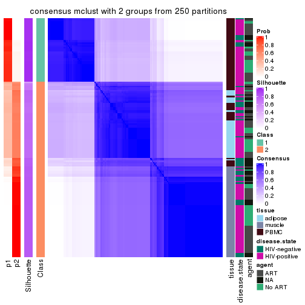</p>

</div>
<div id='tab-CV-mclust-consensus-heatmap-2'>
<pre><code class="r">consensus_heatmap(res, k = 3)
</code></pre>

<p>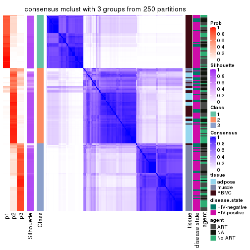</p>

</div>
<div id='tab-CV-mclust-consensus-heatmap-3'>
<pre><code class="r">consensus_heatmap(res, k = 4)
</code></pre>

<p>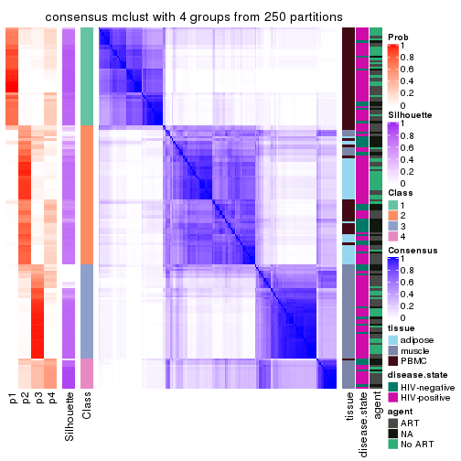</p>

</div>
<div id='tab-CV-mclust-consensus-heatmap-4'>
<pre><code class="r">consensus_heatmap(res, k = 5)
</code></pre>

<p>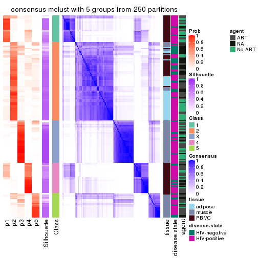</p>

</div>
<div id='tab-CV-mclust-consensus-heatmap-5'>
<pre><code class="r">consensus_heatmap(res, k = 6)
</code></pre>

<p>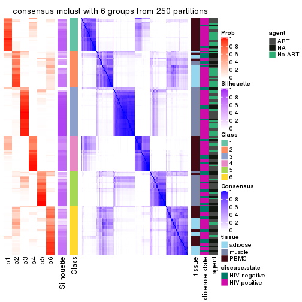</p>

</div>
</div>

Heatmaps for the membership of samples in all partitions to see how consistent they are:


<script>
$( function() {
	$( '#tabs-CV-mclust-membership-heatmap' ).tabs();
} );
</script>
<div id='tabs-CV-mclust-membership-heatmap'>
<ul>
<li><a href='#tab-CV-mclust-membership-heatmap-1'>k = 2</a></li>
<li><a href='#tab-CV-mclust-membership-heatmap-2'>k = 3</a></li>
<li><a href='#tab-CV-mclust-membership-heatmap-3'>k = 4</a></li>
<li><a href='#tab-CV-mclust-membership-heatmap-4'>k = 5</a></li>
<li><a href='#tab-CV-mclust-membership-heatmap-5'>k = 6</a></li>
</ul>
<div id='tab-CV-mclust-membership-heatmap-1'>
<pre><code class="r">membership_heatmap(res, k = 2)
</code></pre>

<p>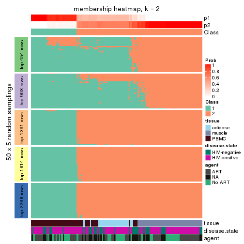</p>

</div>
<div id='tab-CV-mclust-membership-heatmap-2'>
<pre><code class="r">membership_heatmap(res, k = 3)
</code></pre>

<p>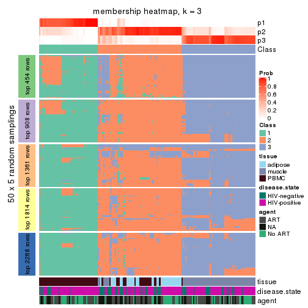</p>

</div>
<div id='tab-CV-mclust-membership-heatmap-3'>
<pre><code class="r">membership_heatmap(res, k = 4)
</code></pre>

<p>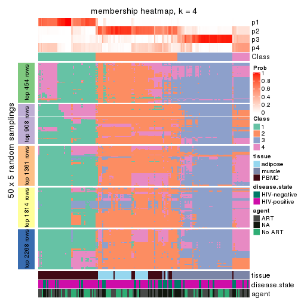</p>

</div>
<div id='tab-CV-mclust-membership-heatmap-4'>
<pre><code class="r">membership_heatmap(res, k = 5)
</code></pre>

<p>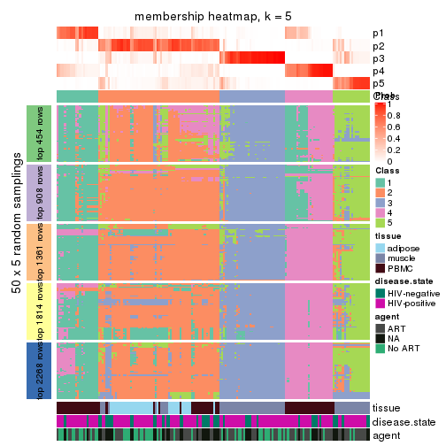</p>

</div>
<div id='tab-CV-mclust-membership-heatmap-5'>
<pre><code class="r">membership_heatmap(res, k = 6)
</code></pre>

<p>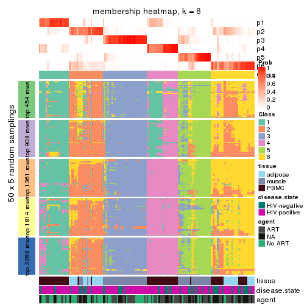</p>

</div>
</div>

As soon as we have had the classes for columns, we can look for signatures
which are significantly different between classes which can be candidate marks
for certain classes. Following are the heatmaps for signatures.


Signature heatmaps where rows are scaled:


<script>
$( function() {
	$( '#tabs-CV-mclust-get-signatures' ).tabs();
} );
</script>
<div id='tabs-CV-mclust-get-signatures'>
<ul>
<li><a href='#tab-CV-mclust-get-signatures-1'>k = 2</a></li>
<li><a href='#tab-CV-mclust-get-signatures-2'>k = 3</a></li>
<li><a href='#tab-CV-mclust-get-signatures-3'>k = 4</a></li>
<li><a href='#tab-CV-mclust-get-signatures-4'>k = 5</a></li>
<li><a href='#tab-CV-mclust-get-signatures-5'>k = 6</a></li>
</ul>
<div id='tab-CV-mclust-get-signatures-1'>
<pre><code class="r">get_signatures(res, k = 2)
</code></pre>

<p>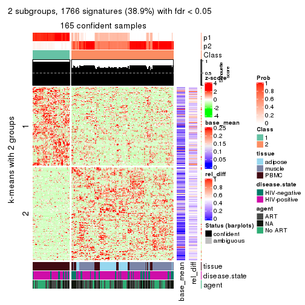</p>

</div>
<div id='tab-CV-mclust-get-signatures-2'>
<pre><code class="r">get_signatures(res, k = 3)
</code></pre>

<p>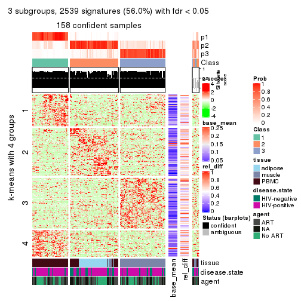</p>

</div>
<div id='tab-CV-mclust-get-signatures-3'>
<pre><code class="r">get_signatures(res, k = 4)
</code></pre>

<p>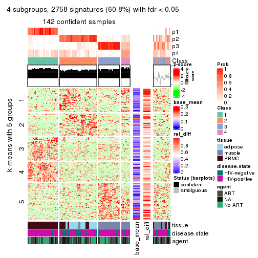</p>

</div>
<div id='tab-CV-mclust-get-signatures-4'>
<pre><code class="r">get_signatures(res, k = 5)
</code></pre>

<p>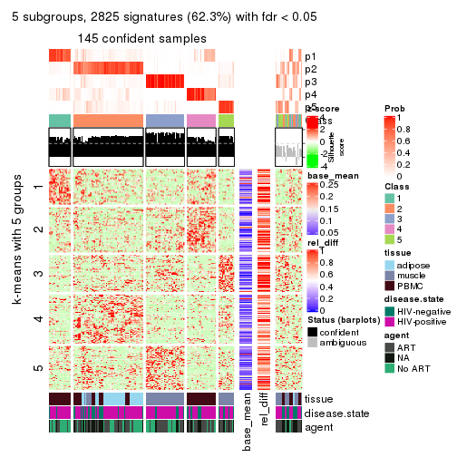</p>

</div>
<div id='tab-CV-mclust-get-signatures-5'>
<pre><code class="r">get_signatures(res, k = 6)
</code></pre>

<p>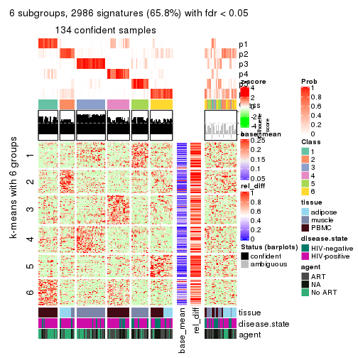</p>

</div>
</div>


Signature heatmaps where rows are not scaled:


<script>
$( function() {
	$( '#tabs-CV-mclust-get-signatures-no-scale' ).tabs();
} );
</script>
<div id='tabs-CV-mclust-get-signatures-no-scale'>
<ul>
<li><a href='#tab-CV-mclust-get-signatures-no-scale-1'>k = 2</a></li>
<li><a href='#tab-CV-mclust-get-signatures-no-scale-2'>k = 3</a></li>
<li><a href='#tab-CV-mclust-get-signatures-no-scale-3'>k = 4</a></li>
<li><a href='#tab-CV-mclust-get-signatures-no-scale-4'>k = 5</a></li>
<li><a href='#tab-CV-mclust-get-signatures-no-scale-5'>k = 6</a></li>
</ul>
<div id='tab-CV-mclust-get-signatures-no-scale-1'>
<pre><code class="r">get_signatures(res, k = 2, scale_rows = FALSE)
</code></pre>

<p>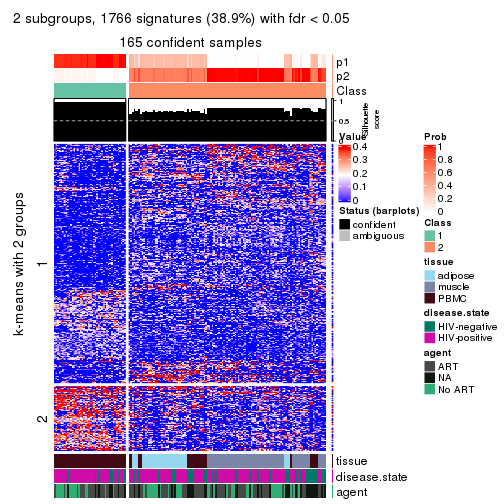</p>

</div>
<div id='tab-CV-mclust-get-signatures-no-scale-2'>
<pre><code class="r">get_signatures(res, k = 3, scale_rows = FALSE)
</code></pre>

<p>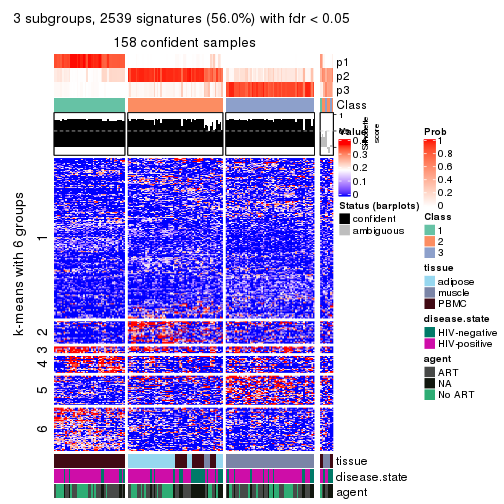</p>

</div>
<div id='tab-CV-mclust-get-signatures-no-scale-3'>
<pre><code class="r">get_signatures(res, k = 4, scale_rows = FALSE)
</code></pre>

<p>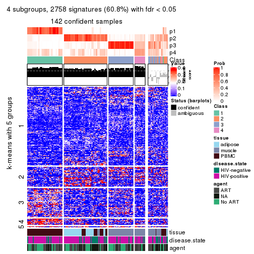</p>

</div>
<div id='tab-CV-mclust-get-signatures-no-scale-4'>
<pre><code class="r">get_signatures(res, k = 5, scale_rows = FALSE)
</code></pre>

<p>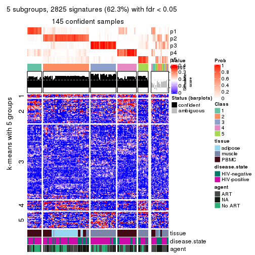</p>

</div>
<div id='tab-CV-mclust-get-signatures-no-scale-5'>
<pre><code class="r">get_signatures(res, k = 6, scale_rows = FALSE)
</code></pre>

<p>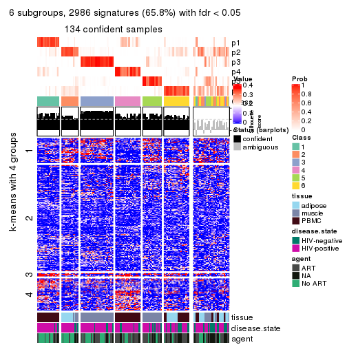</p>

</div>
</div>


Compare the overlap of signatures from different k:

```r
compare_signatures(res)
```

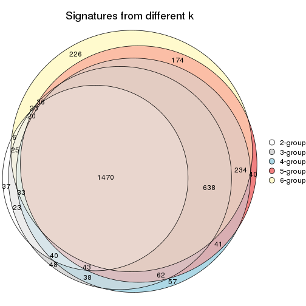

`get_signature()` returns a data frame invisibly. TO get the list of signatures, the function
call should be assigned to a variable explicitly. In following code, if `plot` argument is set
to `FALSE`, no heatmap is plotted while only the differential analysis is performed.

```r
# code only for demonstration
tb = get_signature(res, k = ..., plot = FALSE)
```

An example of the output of `tb` is:

```
#>   which_row         fdr    mean_1    mean_2 scaled_mean_1 scaled_mean_2 km
#> 1        38 0.042760348  8.373488  9.131774    -0.5533452     0.5164555  1
#> 2        40 0.018707592  7.106213  8.469186    -0.6173731     0.5762149  1
#> 3        55 0.019134737 10.221463 11.207825    -0.6159697     0.5749050  1
#> 4        59 0.006059896  5.921854  7.869574    -0.6899429     0.6439467  1
#> 5        60 0.018055526  8.928898 10.211722    -0.6204761     0.5791110  1
#> 6        98 0.009384629 15.714769 14.887706     0.6635654    -0.6193277  2
...
```

The columns in `tb` are:

1. `which_row`: row indices corresponding to the input matrix.
2. `fdr`: FDR for the differential test. 
3. `mean_x`: The mean value in group x.
4. `scaled_mean_x`: The mean value in group x after rows are scaled.
5. `km`: Row groups if k-means clustering is applied to rows.


UMAP plot which shows how samples are separated.


<script>
$( function() {
	$( '#tabs-CV-mclust-dimension-reduction' ).tabs();
} );
</script>
<div id='tabs-CV-mclust-dimension-reduction'>
<ul>
<li><a href='#tab-CV-mclust-dimension-reduction-1'>k = 2</a></li>
<li><a href='#tab-CV-mclust-dimension-reduction-2'>k = 3</a></li>
<li><a href='#tab-CV-mclust-dimension-reduction-3'>k = 4</a></li>
<li><a href='#tab-CV-mclust-dimension-reduction-4'>k = 5</a></li>
<li><a href='#tab-CV-mclust-dimension-reduction-5'>k = 6</a></li>
</ul>
<div id='tab-CV-mclust-dimension-reduction-1'>
<pre><code class="r">dimension_reduction(res, k = 2, method = &quot;UMAP&quot;)
</code></pre>

<p>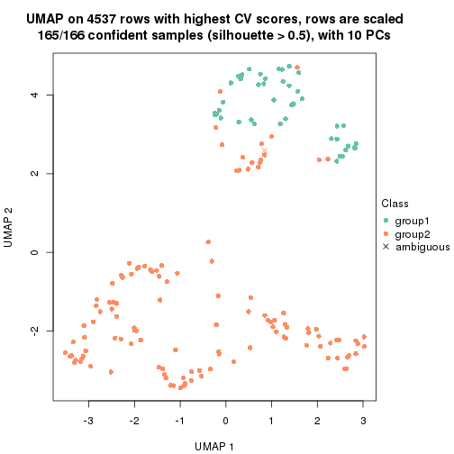</p>

</div>
<div id='tab-CV-mclust-dimension-reduction-2'>
<pre><code class="r">dimension_reduction(res, k = 3, method = &quot;UMAP&quot;)
</code></pre>

<p>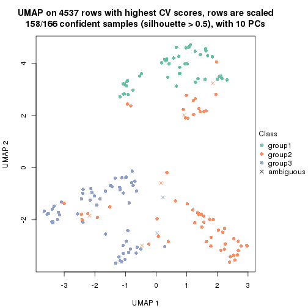</p>

</div>
<div id='tab-CV-mclust-dimension-reduction-3'>
<pre><code class="r">dimension_reduction(res, k = 4, method = &quot;UMAP&quot;)
</code></pre>

<p>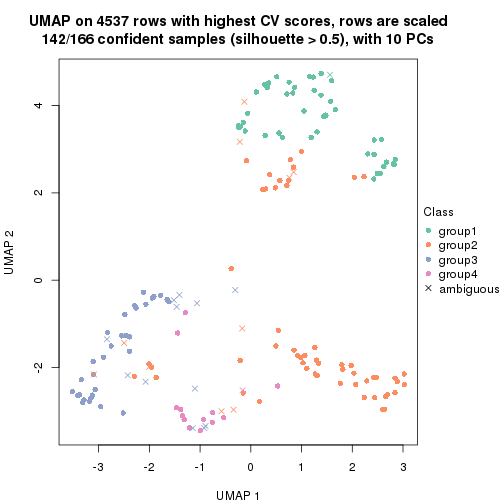</p>

</div>
<div id='tab-CV-mclust-dimension-reduction-4'>
<pre><code class="r">dimension_reduction(res, k = 5, method = &quot;UMAP&quot;)
</code></pre>

<p>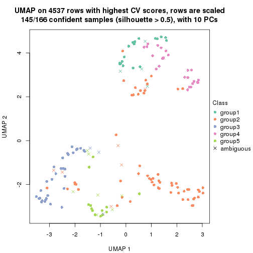</p>

</div>
<div id='tab-CV-mclust-dimension-reduction-5'>
<pre><code class="r">dimension_reduction(res, k = 6, method = &quot;UMAP&quot;)
</code></pre>

<p>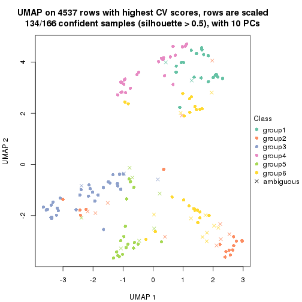</p>

</div>
</div>


Following heatmap shows how subgroups are split when increasing `k`:

```r
collect_classes(res)
```

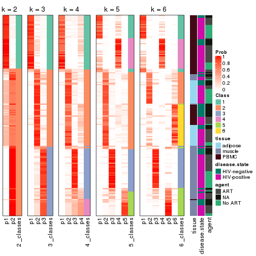


Test correlation between subgroups and known annotations. If the known
annotation is numeric, one-way ANOVA test is applied, and if the known
annotation is discrete, chi-squared contingency table test is applied.

```r
test_to_known_factors(res)
```

```
#>             n tissue(p) disease.state(p) agent(p) k
#> CV:mclust 165  2.86e-20            0.162  0.25061 2
#> CV:mclust 158  9.32e-45            0.118  0.34258 3
#> CV:mclust 142  3.37e-40            0.180  0.29863 4
#> CV:mclust 145  1.17e-36            0.193  0.05507 5
#> CV:mclust 134  3.90e-36            0.192  0.00365 6
```


If matrix rows can be associated to genes, consider to use `GO_Enrichment(res,
...)` to perform function enrichment for the signature genes.


 

---------------------------------------------------


### CV:NMF


The object with results only for a single top-value method and a single partition method 
can be extracted as:

```r
res = res_list["CV", "NMF"]
# you can also extract it by
# res = res_list["CV:NMF"]
```

A summary of `res` and all the functions that can be applied to it:

```r
res
```

```
#> A 'ConsensusPartition' object with k = 2, 3, 4, 5, 6.
#>   On a matrix with 4537 rows and 166 columns.
#>   Top rows (454, 908, 1361, 1814, 2268) are extracted by 'CV' method.
#>   Subgroups are detected by 'NMF' method.
#>   Performed in total 1250 partitions by row resampling.
#>   Best k for subgroups seems to be 2.
#> 
#> Following methods can be applied to this 'ConsensusPartition' object:
#>  [1] "cola_report"             "collect_classes"         "collect_plots"          
#>  [4] "collect_stats"           "colnames"                "compare_signatures"     
#>  [7] "consensus_heatmap"       "dimension_reduction"     "functional_enrichment"  
#> [10] "get_anno_col"            "get_anno"                "get_classes"            
#> [13] "get_consensus"           "get_matrix"              "get_membership"         
#> [16] "get_param"               "get_signatures"          "get_stats"              
#> [19] "is_best_k"               "is_stable_k"             "membership_heatmap"     
#> [22] "ncol"                    "nrow"                    "plot_ecdf"              
#> [25] "rownames"                "select_partition_number" "show"                   
#> [28] "suggest_best_k"          "test_to_known_factors"
```

`collect_plots()` function collects all the plots made from `res` for all `k` (number of partitions)
into one single page to provide an easy and fast comparison between different `k`.

```r
collect_plots(res)
```

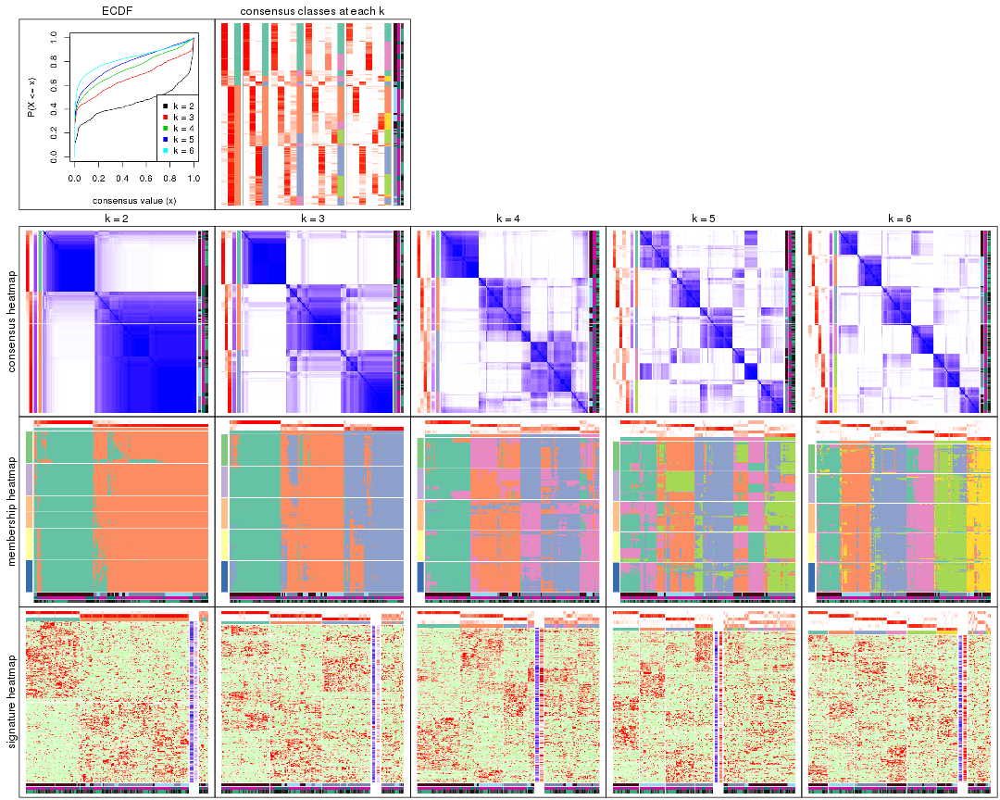

The plots are:

- The first row: a plot of the ECDF (Empirical cumulative distribution
  function) curves of the consensus matrix for each `k` and the heatmap of
  predicted classes for each `k`.
- The second row: heatmaps of the consensus matrix for each `k`.
- The third row: heatmaps of the membership matrix for each `k`.
- The fouth row: heatmaps of the signatures for each `k`.

All the plots in panels can be made by individual functions and they are
plotted later in this section.

`select_partition_number()` produces several plots showing different
statistics for choosing "optimized" `k`. There are following statistics:

- ECDF curves of the consensus matrix for each `k`;
- 1-PAC. [The PAC
  score](https://en.wikipedia.org/wiki/Consensus_clustering#Over-interpretation_potential_of_consensus_clustering)
  measures the proportion of the ambiguous subgrouping.
- Mean silhouette score.
- Concordance. The mean probability of fiting the consensus class ids in all
  partitions.
- Area increased. Denote $A_k$ as the area under the ECDF curve for current
  `k`, the area increased is defined as $A_k - A_{k-1}$.
- Rand index. The percent of pairs of samples that are both in a same cluster
  or both are not in a same cluster in the partition of k and k-1.
- Jaccard index. The ratio of pairs of samples are both in a same cluster in
  the partition of k and k-1 and the pairs of samples are both in a same
  cluster in the partition k or k-1.

The detailed explanations of these statistics can be found in [the cola
vignette](http://bioconductor.org/packages/devel/bioc/vignettes/cola/inst/doc/cola.html#toc_13).

Generally speaking, lower PAC score, higher mean silhouette score or higher
concordance corresponds to better partition. Rand index and Jaccard index
measure how similar the current partition is compared to partition with `k-1`.
If they are too similar, we won't accept `k` is better than `k-1`.

```r
select_partition_number(res)
```

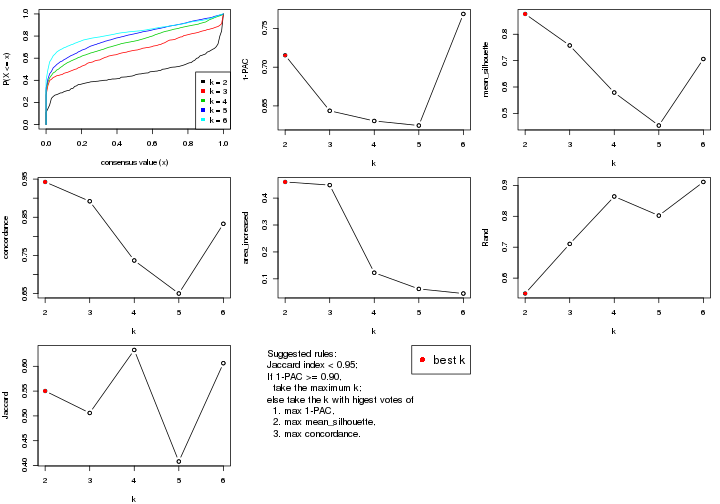

The numeric values for all these statistics can be obtained by `get_stats()`.

```r
get_stats(res)
```

```
#>   k 1-PAC mean_silhouette concordance area_increased  Rand Jaccard
#> 2 2 0.715           0.877       0.942         0.4599 0.550   0.550
#> 3 3 0.644           0.757       0.892         0.4482 0.711   0.506
#> 4 4 0.631           0.579       0.737         0.1228 0.864   0.633
#> 5 5 0.625           0.454       0.650         0.0626 0.802   0.408
#> 6 6 0.769           0.706       0.833         0.0455 0.911   0.606
```

`suggest_best_k()` suggests the best $k$ based on these statistics. The rules are as follows:

- All $k$ with Jaccard index larger than 0.95 are removed because the increase of
  the partition number does not provides enough extra information. If all $k$ are removed,
  the best $k$ is assigned by `NA`.
- For $k$ with 1-PAC larger than 0.9, the maximal $k$ is taken as the "best k". Other $k$ is called "optional k".
- If it does not fit the second rule. The $k$ with the highest vote of highest
  1-PAC, mean silhouette and concordance is taken as the "best k".

```r
suggest_best_k(res)
```

```
#> [1] 2
```


Following shows the table of the partitions (You need to click the **show/hide
code output** link to see it). The membership matrix (columns with name `p*`)
is inferred by
[`clue::cl_consensus()`](https://www.rdocumentation.org/link/cl_consensus?package=clue)
function with the `SE` method. Basically the value in the membership matrix
represents the probability to belong to a certain group. The finall class
label for an item is determined with the group with highest probability it
belongs to.

In `get_classes()` function, the entropy is calculated from the membership
matrix and the silhouette score is calculated from the consensus matrix.


<script>
$( function() {
	$( '#tabs-CV-NMF-get-classes' ).tabs();
} );
</script>
<div id='tabs-CV-NMF-get-classes'>
<ul>
<li><a href='#tab-CV-NMF-get-classes-1'>k = 2</a></li>
<li><a href='#tab-CV-NMF-get-classes-2'>k = 3</a></li>
<li><a href='#tab-CV-NMF-get-classes-3'>k = 4</a></li>
<li><a href='#tab-CV-NMF-get-classes-4'>k = 5</a></li>
<li><a href='#tab-CV-NMF-get-classes-5'>k = 6</a></li>
</ul>

<div id='tab-CV-NMF-get-classes-1'>
<p><a id='tab-CV-NMF-get-classes-1-a' style='color:#0366d6' href='#'>show/hide code output</a></p>
<pre><code class="r">cbind(get_classes(res, k = 2), get_membership(res, k = 2))
</code></pre>

<pre><code>#&gt;           class entropy silhouette    p1    p2
#&gt; GSM751298     1  0.0000     0.9395 1.000 0.000
#&gt; GSM751304     2  0.9286     0.4978 0.344 0.656
#&gt; GSM751305     2  0.8813     0.5941 0.300 0.700
#&gt; GSM751307     1  1.0000     0.0210 0.504 0.496
#&gt; GSM751310     1  0.0000     0.9395 1.000 0.000
#&gt; GSM751314     1  0.0000     0.9395 1.000 0.000
#&gt; GSM751316     1  0.0000     0.9395 1.000 0.000
#&gt; GSM751318     1  0.0000     0.9395 1.000 0.000
#&gt; GSM751342     1  0.0000     0.9395 1.000 0.000
#&gt; GSM751346     1  0.5629     0.8419 0.868 0.132
#&gt; GSM751347     2  0.9944     0.1565 0.456 0.544
#&gt; GSM751348     2  0.7950     0.6960 0.240 0.760
#&gt; GSM751349     2  0.0000     0.9379 0.000 1.000
#&gt; GSM751352     2  0.4690     0.8730 0.100 0.900
#&gt; GSM751353     2  0.1633     0.9297 0.024 0.976
#&gt; GSM751354     2  0.5842     0.8320 0.140 0.860
#&gt; GSM751355     2  0.1184     0.9336 0.016 0.984
#&gt; GSM751358     1  0.6148     0.7960 0.848 0.152
#&gt; GSM751359     2  0.6623     0.8066 0.172 0.828
#&gt; GSM751294     2  0.2043     0.9258 0.032 0.968
#&gt; GSM751296     1  0.0376     0.9372 0.996 0.004
#&gt; GSM751297     1  0.6247     0.8151 0.844 0.156
#&gt; GSM751299     2  0.4690     0.8740 0.100 0.900
#&gt; GSM751300     1  0.0672     0.9360 0.992 0.008
#&gt; GSM751301     1  0.6801     0.7872 0.820 0.180
#&gt; GSM751302     1  0.4690     0.8722 0.900 0.100
#&gt; GSM751303     1  0.0000     0.9395 1.000 0.000
#&gt; GSM751306     1  0.0000     0.9395 1.000 0.000
#&gt; GSM751308     1  0.1843     0.9236 0.972 0.028
#&gt; GSM751309     1  0.0000     0.9395 1.000 0.000
#&gt; GSM751311     1  0.0000     0.9395 1.000 0.000
#&gt; GSM751312     1  0.0000     0.9395 1.000 0.000
#&gt; GSM751313     1  0.0000     0.9395 1.000 0.000
#&gt; GSM751315     1  0.0000     0.9395 1.000 0.000
#&gt; GSM751317     1  0.0000     0.9395 1.000 0.000
#&gt; GSM751320     1  0.0000     0.9395 1.000 0.000
#&gt; GSM751321     1  0.0000     0.9395 1.000 0.000
#&gt; GSM751322     1  0.0000     0.9395 1.000 0.000
#&gt; GSM751324     1  0.0000     0.9395 1.000 0.000
#&gt; GSM751325     1  0.0000     0.9395 1.000 0.000
#&gt; GSM751332     1  0.0000     0.9395 1.000 0.000
#&gt; GSM751334     1  0.0000     0.9395 1.000 0.000
#&gt; GSM751339     1  0.0000     0.9395 1.000 0.000
#&gt; GSM751341     1  0.0000     0.9395 1.000 0.000
#&gt; GSM751343     1  0.0000     0.9395 1.000 0.000
#&gt; GSM751344     2  0.3584     0.9001 0.068 0.932
#&gt; GSM751345     2  0.3879     0.8940 0.076 0.924
#&gt; GSM751356     1  0.9833     0.2645 0.576 0.424
#&gt; GSM751357     1  0.9815     0.2840 0.580 0.420
#&gt; GSM751293     1  0.2603     0.9159 0.956 0.044
#&gt; GSM751295     1  0.3431     0.9023 0.936 0.064
#&gt; GSM751319     1  0.0000     0.9395 1.000 0.000
#&gt; GSM751323     1  0.0000     0.9395 1.000 0.000
#&gt; GSM751326     1  0.0000     0.9395 1.000 0.000
#&gt; GSM751327     1  0.0000     0.9395 1.000 0.000
#&gt; GSM751328     1  0.0000     0.9395 1.000 0.000
#&gt; GSM751329     1  0.0000     0.9395 1.000 0.000
#&gt; GSM751330     1  0.0000     0.9395 1.000 0.000
#&gt; GSM751331     1  0.1414     0.9275 0.980 0.020
#&gt; GSM751333     1  0.0000     0.9395 1.000 0.000
#&gt; GSM751335     1  0.0000     0.9395 1.000 0.000
#&gt; GSM751336     1  0.0000     0.9395 1.000 0.000
#&gt; GSM751337     1  0.0000     0.9395 1.000 0.000
#&gt; GSM751338     1  0.0000     0.9395 1.000 0.000
#&gt; GSM751340     1  0.0000     0.9395 1.000 0.000
#&gt; GSM751350     1  0.1414     0.9275 0.980 0.020
#&gt; GSM751351     1  0.1414     0.9275 0.980 0.020
#&gt; GSM751362     2  0.9795     0.3656 0.416 0.584
#&gt; GSM751363     2  0.5294     0.8701 0.120 0.880
#&gt; GSM751367     1  0.8144     0.6558 0.748 0.252
#&gt; GSM751368     2  0.1184     0.9362 0.016 0.984
#&gt; GSM751371     1  0.9998    -0.0108 0.508 0.492
#&gt; GSM751375     2  0.0000     0.9379 0.000 1.000
#&gt; GSM751376     2  0.0672     0.9376 0.008 0.992
#&gt; GSM751378     2  0.0000     0.9379 0.000 1.000
#&gt; GSM751379     2  0.0000     0.9379 0.000 1.000
#&gt; GSM751382     2  0.0000     0.9379 0.000 1.000
#&gt; GSM751386     2  0.0000     0.9379 0.000 1.000
#&gt; GSM751388     2  0.0000     0.9379 0.000 1.000
#&gt; GSM751391     2  0.0376     0.9376 0.004 0.996
#&gt; GSM751410     1  0.5737     0.8211 0.864 0.136
#&gt; GSM751414     2  0.6343     0.8210 0.160 0.840
#&gt; GSM751361     2  0.1633     0.9342 0.024 0.976
#&gt; GSM751365     2  0.4939     0.8792 0.108 0.892
#&gt; GSM751366     2  0.9522     0.4418 0.372 0.628
#&gt; GSM751369     2  0.9358     0.4853 0.352 0.648
#&gt; GSM751370     2  0.7528     0.7497 0.216 0.784
#&gt; GSM751372     2  0.2778     0.9245 0.048 0.952
#&gt; GSM751373     2  0.6343     0.8210 0.160 0.840
#&gt; GSM751374     2  0.0000     0.9379 0.000 1.000
#&gt; GSM751377     2  0.0938     0.9369 0.012 0.988
#&gt; GSM751380     2  0.7815     0.7239 0.232 0.768
#&gt; GSM751381     2  0.0000     0.9379 0.000 1.000
#&gt; GSM751383     2  0.0000     0.9379 0.000 1.000
#&gt; GSM751384     2  0.1414     0.9353 0.020 0.980
#&gt; GSM751385     2  0.0000     0.9379 0.000 1.000
#&gt; GSM751387     2  0.0000     0.9379 0.000 1.000
#&gt; GSM751389     2  0.1633     0.9342 0.024 0.976
#&gt; GSM751393     2  0.1633     0.9342 0.024 0.976
#&gt; GSM751394     2  0.0000     0.9379 0.000 1.000
#&gt; GSM751395     2  0.0672     0.9379 0.008 0.992
#&gt; GSM751397     2  0.0938     0.9369 0.012 0.988
#&gt; GSM751398     2  0.0672     0.9374 0.008 0.992
#&gt; GSM751404     2  0.2043     0.9312 0.032 0.968
#&gt; GSM751406     2  0.1843     0.9329 0.028 0.972
#&gt; GSM751411     2  0.1633     0.9342 0.024 0.976
#&gt; GSM751413     2  0.1633     0.9352 0.024 0.976
#&gt; GSM751415     2  0.6531     0.8120 0.168 0.832
#&gt; GSM751416     2  0.1633     0.9342 0.024 0.976
#&gt; GSM751417     2  0.1633     0.9342 0.024 0.976
#&gt; GSM751421     2  0.6623     0.8077 0.172 0.828
#&gt; GSM751422     2  0.7219     0.7719 0.200 0.800
#&gt; GSM751360     2  0.2423     0.9277 0.040 0.960
#&gt; GSM751364     2  0.1633     0.9342 0.024 0.976
#&gt; GSM751390     2  0.0672     0.9374 0.008 0.992
#&gt; GSM751392     2  0.0000     0.9379 0.000 1.000
#&gt; GSM751396     2  0.0000     0.9379 0.000 1.000
#&gt; GSM751399     2  0.1633     0.9342 0.024 0.976
#&gt; GSM751400     2  0.1633     0.9342 0.024 0.976
#&gt; GSM751401     2  0.2236     0.9293 0.036 0.964
#&gt; GSM751402     2  0.2043     0.9312 0.032 0.968
#&gt; GSM751403     2  0.1633     0.9342 0.024 0.976
#&gt; GSM751405     2  0.1843     0.9329 0.028 0.972
#&gt; GSM751407     2  0.1633     0.9342 0.024 0.976
#&gt; GSM751408     2  0.1633     0.9342 0.024 0.976
#&gt; GSM751409     2  0.1633     0.9342 0.024 0.976
#&gt; GSM751412     2  0.1633     0.9342 0.024 0.976
#&gt; GSM751418     2  0.1633     0.9342 0.024 0.976
#&gt; GSM751419     2  0.1633     0.9342 0.024 0.976
#&gt; GSM751420     2  0.0938     0.9371 0.012 0.988
#&gt; GSM751425     2  0.0000     0.9379 0.000 1.000
#&gt; GSM751429     2  0.7376     0.7480 0.208 0.792
#&gt; GSM751430     2  0.2603     0.9184 0.044 0.956
#&gt; GSM751433     2  0.5629     0.8415 0.132 0.868
#&gt; GSM751437     2  0.0000     0.9379 0.000 1.000
#&gt; GSM751448     2  0.9000     0.5628 0.316 0.684
#&gt; GSM751451     2  0.0000     0.9379 0.000 1.000
#&gt; GSM751423     2  0.0000     0.9379 0.000 1.000
#&gt; GSM751424     2  0.0000     0.9379 0.000 1.000
#&gt; GSM751428     2  0.0000     0.9379 0.000 1.000
#&gt; GSM751431     2  0.0000     0.9379 0.000 1.000
#&gt; GSM751432     2  0.0672     0.9363 0.008 0.992
#&gt; GSM751434     2  0.3274     0.9072 0.060 0.940
#&gt; GSM751435     2  0.0672     0.9363 0.008 0.992
#&gt; GSM751436     2  0.2603     0.9186 0.044 0.956
#&gt; GSM751440     2  0.0000     0.9379 0.000 1.000
#&gt; GSM751444     2  0.0000     0.9379 0.000 1.000
#&gt; GSM751446     2  0.0000     0.9379 0.000 1.000
#&gt; GSM751449     2  0.0000     0.9379 0.000 1.000
#&gt; GSM751450     2  0.0000     0.9379 0.000 1.000
#&gt; GSM751452     2  0.0938     0.9351 0.012 0.988
#&gt; GSM751426     2  0.0000     0.9379 0.000 1.000
#&gt; GSM751427     2  0.0000     0.9379 0.000 1.000
#&gt; GSM751438     2  0.0000     0.9379 0.000 1.000
#&gt; GSM751439     2  0.3733     0.8965 0.072 0.928
#&gt; GSM751441     2  0.0000     0.9379 0.000 1.000
#&gt; GSM751442     2  0.0000     0.9379 0.000 1.000
#&gt; GSM751443     2  0.0000     0.9379 0.000 1.000
#&gt; GSM751445     2  0.0000     0.9379 0.000 1.000
#&gt; GSM751447     2  0.0000     0.9379 0.000 1.000
#&gt; GSM751453     2  0.0000     0.9379 0.000 1.000
#&gt; GSM751454     2  0.0000     0.9379 0.000 1.000
#&gt; GSM751455     2  0.0000     0.9379 0.000 1.000
#&gt; GSM751456     2  0.0000     0.9379 0.000 1.000
#&gt; GSM751457     2  0.0000     0.9379 0.000 1.000
#&gt; GSM751458     2  0.0000     0.9379 0.000 1.000
</code></pre>

<script>
$('#tab-CV-NMF-get-classes-1-a').parent().next().next().hide();
$('#tab-CV-NMF-get-classes-1-a').click(function(){
  $('#tab-CV-NMF-get-classes-1-a').parent().next().next().toggle();
  return(false);
});
</script>
</div>

<div id='tab-CV-NMF-get-classes-2'>
<p><a id='tab-CV-NMF-get-classes-2-a' style='color:#0366d6' href='#'>show/hide code output</a></p>
<pre><code class="r">cbind(get_classes(res, k = 3), get_membership(res, k = 3))
</code></pre>

<pre><code>#&gt;           class entropy silhouette    p1    p2    p3
#&gt; GSM751298     1  0.0000      0.944 1.000 0.000 0.000
#&gt; GSM751304     2  0.3272      0.786 0.104 0.892 0.004
#&gt; GSM751305     2  0.4465      0.725 0.176 0.820 0.004
#&gt; GSM751307     2  0.2796      0.799 0.092 0.908 0.000
#&gt; GSM751310     1  0.0237      0.944 0.996 0.000 0.004
#&gt; GSM751314     1  0.0237      0.944 0.996 0.000 0.004
#&gt; GSM751316     1  0.0237      0.944 0.996 0.000 0.004
#&gt; GSM751318     1  0.0237      0.944 0.996 0.000 0.004
#&gt; GSM751342     1  0.0237      0.944 0.996 0.000 0.004
#&gt; GSM751346     1  0.7825      0.636 0.672 0.172 0.156
#&gt; GSM751347     1  0.7337      0.251 0.540 0.032 0.428
#&gt; GSM751348     2  0.1529      0.833 0.040 0.960 0.000
#&gt; GSM751349     2  0.0424      0.847 0.000 0.992 0.008
#&gt; GSM751352     2  0.0237      0.846 0.004 0.996 0.000
#&gt; GSM751353     2  0.0000      0.847 0.000 1.000 0.000
#&gt; GSM751354     2  0.4842      0.641 0.000 0.776 0.224
#&gt; GSM751355     2  0.0000      0.847 0.000 1.000 0.000
#&gt; GSM751358     1  0.1765      0.913 0.956 0.040 0.004
#&gt; GSM751359     2  0.6447      0.669 0.196 0.744 0.060
#&gt; GSM751294     2  0.5845      0.503 0.004 0.688 0.308
#&gt; GSM751296     1  0.0000      0.944 1.000 0.000 0.000
#&gt; GSM751297     1  0.9601      0.267 0.464 0.224 0.312
#&gt; GSM751299     2  0.0829      0.844 0.004 0.984 0.012
#&gt; GSM751300     1  0.1267      0.927 0.972 0.024 0.004
#&gt; GSM751301     2  0.0892      0.841 0.020 0.980 0.000
#&gt; GSM751302     1  0.5728      0.728 0.772 0.196 0.032
#&gt; GSM751303     1  0.0237      0.944 0.996 0.000 0.004
#&gt; GSM751306     1  0.0237      0.944 0.996 0.000 0.004
#&gt; GSM751308     1  0.8028      0.614 0.656 0.168 0.176
#&gt; GSM751309     1  0.0237      0.944 0.996 0.000 0.004
#&gt; GSM751311     1  0.0237      0.944 0.996 0.000 0.004
#&gt; GSM751312     1  0.0237      0.944 0.996 0.000 0.004
#&gt; GSM751313     1  0.0000      0.944 1.000 0.000 0.000
#&gt; GSM751315     1  0.0237      0.944 0.996 0.000 0.004
#&gt; GSM751317     1  0.0237      0.944 0.996 0.000 0.004
#&gt; GSM751320     1  0.0000      0.944 1.000 0.000 0.000
#&gt; GSM751321     1  0.0237      0.944 0.996 0.000 0.004
#&gt; GSM751322     1  0.0237      0.944 0.996 0.000 0.004
#&gt; GSM751324     1  0.0237      0.944 0.996 0.000 0.004
#&gt; GSM751325     1  0.0237      0.944 0.996 0.000 0.004
#&gt; GSM751332     1  0.0000      0.944 1.000 0.000 0.000
#&gt; GSM751334     1  0.0000      0.944 1.000 0.000 0.000
#&gt; GSM751339     1  0.0000      0.944 1.000 0.000 0.000
#&gt; GSM751341     1  0.0237      0.944 0.996 0.000 0.004
#&gt; GSM751343     1  0.0000      0.944 1.000 0.000 0.000
#&gt; GSM751344     2  0.0000      0.847 0.000 1.000 0.000
#&gt; GSM751345     2  0.0237      0.846 0.004 0.996 0.000
#&gt; GSM751356     2  0.6141      0.662 0.232 0.736 0.032
#&gt; GSM751357     2  0.5335      0.672 0.232 0.760 0.008
#&gt; GSM751293     2  0.4452      0.697 0.192 0.808 0.000
#&gt; GSM751295     1  0.7633      0.637 0.680 0.200 0.120
#&gt; GSM751319     1  0.0237      0.944 0.996 0.000 0.004
#&gt; GSM751323     1  0.0000      0.944 1.000 0.000 0.000
#&gt; GSM751326     1  0.0000      0.944 1.000 0.000 0.000
#&gt; GSM751327     1  0.0000      0.944 1.000 0.000 0.000
#&gt; GSM751328     1  0.0237      0.944 0.996 0.000 0.004
#&gt; GSM751329     1  0.0000      0.944 1.000 0.000 0.000
#&gt; GSM751330     1  0.0000      0.944 1.000 0.000 0.000
#&gt; GSM751331     1  0.1031      0.930 0.976 0.024 0.000
#&gt; GSM751333     1  0.0000      0.944 1.000 0.000 0.000
#&gt; GSM751335     1  0.0000      0.944 1.000 0.000 0.000
#&gt; GSM751336     1  0.0000      0.944 1.000 0.000 0.000
#&gt; GSM751337     1  0.0000      0.944 1.000 0.000 0.000
#&gt; GSM751338     1  0.0000      0.944 1.000 0.000 0.000
#&gt; GSM751340     1  0.4842      0.716 0.776 0.000 0.224
#&gt; GSM751350     1  0.2959      0.864 0.900 0.100 0.000
#&gt; GSM751351     1  0.1860      0.908 0.948 0.052 0.000
#&gt; GSM751362     3  0.0237      0.826 0.004 0.000 0.996
#&gt; GSM751363     3  0.6696      0.492 0.020 0.348 0.632
#&gt; GSM751367     3  0.6104      0.400 0.348 0.004 0.648
#&gt; GSM751368     3  0.6307      0.125 0.000 0.488 0.512
#&gt; GSM751371     3  0.1315      0.823 0.020 0.008 0.972
#&gt; GSM751375     2  0.3752      0.739 0.000 0.856 0.144
#&gt; GSM751376     3  0.5733      0.461 0.000 0.324 0.676
#&gt; GSM751378     3  0.2959      0.791 0.000 0.100 0.900
#&gt; GSM751379     3  0.4702      0.655 0.000 0.212 0.788
#&gt; GSM751382     2  0.3752      0.740 0.000 0.856 0.144
#&gt; GSM751386     2  0.5835      0.420 0.000 0.660 0.340
#&gt; GSM751388     2  0.6111      0.274 0.000 0.604 0.396
#&gt; GSM751391     3  0.1289      0.817 0.000 0.032 0.968
#&gt; GSM751410     3  0.0424      0.824 0.008 0.000 0.992
#&gt; GSM751414     3  0.2651      0.802 0.060 0.012 0.928
#&gt; GSM751361     3  0.5650      0.563 0.000 0.312 0.688
#&gt; GSM751365     3  0.0983      0.824 0.004 0.016 0.980
#&gt; GSM751366     3  0.0000      0.827 0.000 0.000 1.000
#&gt; GSM751369     3  0.0661      0.826 0.004 0.008 0.988
#&gt; GSM751370     3  0.1529      0.812 0.040 0.000 0.960
#&gt; GSM751372     3  0.1989      0.812 0.004 0.048 0.948
#&gt; GSM751373     3  0.3644      0.759 0.124 0.004 0.872
#&gt; GSM751374     3  0.6215      0.204 0.000 0.428 0.572
#&gt; GSM751377     3  0.5905      0.491 0.000 0.352 0.648
#&gt; GSM751380     3  0.0237      0.828 0.000 0.004 0.996
#&gt; GSM751381     2  0.5968      0.361 0.000 0.636 0.364
#&gt; GSM751383     2  0.6140      0.247 0.000 0.596 0.404
#&gt; GSM751384     3  0.5216      0.638 0.000 0.260 0.740
#&gt; GSM751385     3  0.5254      0.634 0.000 0.264 0.736
#&gt; GSM751387     2  0.6026      0.331 0.000 0.624 0.376
#&gt; GSM751389     3  0.0424      0.827 0.000 0.008 0.992
#&gt; GSM751393     3  0.0592      0.827 0.000 0.012 0.988
#&gt; GSM751394     2  0.6168      0.224 0.000 0.588 0.412
#&gt; GSM751395     3  0.4399      0.730 0.000 0.188 0.812
#&gt; GSM751397     3  0.6154      0.369 0.000 0.408 0.592
#&gt; GSM751398     3  0.6295      0.185 0.000 0.472 0.528
#&gt; GSM751404     3  0.0237      0.828 0.000 0.004 0.996
#&gt; GSM751406     3  0.0424      0.827 0.000 0.008 0.992
#&gt; GSM751411     3  0.0237      0.828 0.000 0.004 0.996
#&gt; GSM751413     3  0.6305      0.149 0.000 0.484 0.516
#&gt; GSM751415     3  0.0237      0.828 0.000 0.004 0.996
#&gt; GSM751416     3  0.5621      0.569 0.000 0.308 0.692
#&gt; GSM751417     3  0.5706      0.549 0.000 0.320 0.680
#&gt; GSM751421     3  0.0237      0.828 0.000 0.004 0.996
#&gt; GSM751422     3  0.0237      0.828 0.000 0.004 0.996
#&gt; GSM751360     3  0.0592      0.824 0.012 0.000 0.988
#&gt; GSM751364     3  0.5254      0.632 0.000 0.264 0.736
#&gt; GSM751390     3  0.5363      0.620 0.000 0.276 0.724
#&gt; GSM751392     2  0.5650      0.481 0.000 0.688 0.312
#&gt; GSM751396     2  0.5363      0.549 0.000 0.724 0.276
#&gt; GSM751399     3  0.0237      0.828 0.000 0.004 0.996
#&gt; GSM751400     3  0.0237      0.828 0.000 0.004 0.996
#&gt; GSM751401     3  0.0237      0.828 0.000 0.004 0.996
#&gt; GSM751402     3  0.0237      0.828 0.000 0.004 0.996
#&gt; GSM751403     3  0.0237      0.828 0.000 0.004 0.996
#&gt; GSM751405     3  0.0237      0.828 0.000 0.004 0.996
#&gt; GSM751407     3  0.0237      0.828 0.000 0.004 0.996
#&gt; GSM751408     3  0.0237      0.828 0.000 0.004 0.996
#&gt; GSM751409     3  0.0237      0.828 0.000 0.004 0.996
#&gt; GSM751412     3  0.0237      0.828 0.000 0.004 0.996
#&gt; GSM751418     3  0.4453      0.743 0.012 0.152 0.836
#&gt; GSM751419     3  0.3551      0.763 0.000 0.132 0.868
#&gt; GSM751420     3  0.0747      0.825 0.000 0.016 0.984
#&gt; GSM751425     2  0.0424      0.848 0.000 0.992 0.008
#&gt; GSM751429     3  0.5536      0.608 0.012 0.236 0.752
#&gt; GSM751430     2  0.0475      0.847 0.004 0.992 0.004
#&gt; GSM751433     2  0.0424      0.847 0.000 0.992 0.008
#&gt; GSM751437     3  0.4750      0.642 0.000 0.216 0.784
#&gt; GSM751448     3  0.4033      0.731 0.008 0.136 0.856
#&gt; GSM751451     2  0.0592      0.847 0.000 0.988 0.012
#&gt; GSM751423     2  0.0592      0.847 0.000 0.988 0.012
#&gt; GSM751424     2  0.0237      0.848 0.000 0.996 0.004
#&gt; GSM751428     2  0.0237      0.848 0.000 0.996 0.004
#&gt; GSM751431     2  0.0237      0.848 0.000 0.996 0.004
#&gt; GSM751432     2  0.0237      0.848 0.000 0.996 0.004
#&gt; GSM751434     2  0.0237      0.848 0.000 0.996 0.004
#&gt; GSM751435     2  0.0237      0.848 0.000 0.996 0.004
#&gt; GSM751436     2  0.0424      0.847 0.000 0.992 0.008
#&gt; GSM751440     2  0.0424      0.848 0.000 0.992 0.008
#&gt; GSM751444     2  0.0237      0.848 0.000 0.996 0.004
#&gt; GSM751446     2  0.2356      0.810 0.000 0.928 0.072
#&gt; GSM751449     2  0.2711      0.797 0.000 0.912 0.088
#&gt; GSM751450     2  0.0424      0.848 0.000 0.992 0.008
#&gt; GSM751452     2  0.0237      0.848 0.000 0.996 0.004
#&gt; GSM751426     2  0.0237      0.848 0.000 0.996 0.004
#&gt; GSM751427     2  0.0424      0.848 0.000 0.992 0.008
#&gt; GSM751438     2  0.4887      0.639 0.000 0.772 0.228
#&gt; GSM751439     2  0.6280      0.133 0.000 0.540 0.460
#&gt; GSM751441     2  0.0424      0.848 0.000 0.992 0.008
#&gt; GSM751442     2  0.2261      0.813 0.000 0.932 0.068
#&gt; GSM751443     3  0.6260      0.149 0.000 0.448 0.552
#&gt; GSM751445     2  0.0424      0.847 0.000 0.992 0.008
#&gt; GSM751447     2  0.0237      0.848 0.000 0.996 0.004
#&gt; GSM751453     2  0.0237      0.848 0.000 0.996 0.004
#&gt; GSM751454     2  0.0237      0.848 0.000 0.996 0.004
#&gt; GSM751455     2  0.3412      0.764 0.000 0.876 0.124
#&gt; GSM751456     2  0.4178      0.712 0.000 0.828 0.172
#&gt; GSM751457     2  0.5706      0.485 0.000 0.680 0.320
#&gt; GSM751458     2  0.5810      0.453 0.000 0.664 0.336
</code></pre>

<script>
$('#tab-CV-NMF-get-classes-2-a').parent().next().next().hide();
$('#tab-CV-NMF-get-classes-2-a').click(function(){
  $('#tab-CV-NMF-get-classes-2-a').parent().next().next().toggle();
  return(false);
});
</script>
</div>

<div id='tab-CV-NMF-get-classes-3'>
<p><a id='tab-CV-NMF-get-classes-3-a' style='color:#0366d6' href='#'>show/hide code output</a></p>
<pre><code class="r">cbind(get_classes(res, k = 4), get_membership(res, k = 4))
</code></pre>

<pre><code>#&gt;           class entropy silhouette    p1    p2    p3    p4
#&gt; GSM751298     1  0.0707     0.8980 0.980 0.000 0.000 0.020
#&gt; GSM751304     2  0.4936     0.6459 0.000 0.624 0.004 0.372
#&gt; GSM751305     2  0.5511     0.6315 0.012 0.604 0.008 0.376
#&gt; GSM751307     2  0.4854     0.6761 0.004 0.676 0.004 0.316
#&gt; GSM751310     1  0.1940     0.8937 0.924 0.000 0.000 0.076
#&gt; GSM751314     1  0.1867     0.8949 0.928 0.000 0.000 0.072
#&gt; GSM751316     1  0.1940     0.8937 0.924 0.000 0.000 0.076
#&gt; GSM751318     1  0.0469     0.9009 0.988 0.000 0.000 0.012
#&gt; GSM751342     1  0.1940     0.8937 0.924 0.000 0.000 0.076
#&gt; GSM751346     4  0.7230     0.5222 0.272 0.168 0.004 0.556
#&gt; GSM751347     4  0.8206     0.3080 0.372 0.028 0.176 0.424
#&gt; GSM751348     2  0.6515     0.6283 0.128 0.624 0.000 0.248
#&gt; GSM751349     2  0.6479     0.5836 0.000 0.636 0.140 0.224
#&gt; GSM751352     2  0.4746     0.6605 0.000 0.632 0.000 0.368
#&gt; GSM751353     2  0.4608     0.6829 0.000 0.692 0.004 0.304
#&gt; GSM751354     4  0.5064    -0.2655 0.004 0.360 0.004 0.632
#&gt; GSM751355     2  0.4632     0.6809 0.000 0.688 0.004 0.308
#&gt; GSM751358     1  0.2673     0.8828 0.904 0.008 0.008 0.080
#&gt; GSM751359     3  0.9047    -0.0662 0.064 0.320 0.368 0.248
#&gt; GSM751294     4  0.5374     0.2382 0.028 0.252 0.012 0.708
#&gt; GSM751296     1  0.3743     0.7751 0.824 0.016 0.000 0.160
#&gt; GSM751297     4  0.6039     0.5775 0.148 0.136 0.008 0.708
#&gt; GSM751299     2  0.4961     0.6048 0.000 0.552 0.000 0.448
#&gt; GSM751300     1  0.4630     0.6547 0.732 0.016 0.000 0.252
#&gt; GSM751301     2  0.5807     0.6516 0.052 0.636 0.000 0.312
#&gt; GSM751302     4  0.7171     0.2383 0.400 0.136 0.000 0.464
#&gt; GSM751303     1  0.2125     0.8917 0.920 0.000 0.004 0.076
#&gt; GSM751306     1  0.2125     0.8917 0.920 0.000 0.004 0.076
#&gt; GSM751308     4  0.6689     0.2812 0.412 0.076 0.004 0.508
#&gt; GSM751309     1  0.2125     0.8917 0.920 0.000 0.004 0.076
#&gt; GSM751311     1  0.1940     0.8937 0.924 0.000 0.000 0.076
#&gt; GSM751312     1  0.1940     0.8937 0.924 0.000 0.000 0.076
#&gt; GSM751313     1  0.1716     0.8766 0.936 0.000 0.000 0.064
#&gt; GSM751315     1  0.1792     0.8957 0.932 0.000 0.000 0.068
#&gt; GSM751317     1  0.1940     0.8937 0.924 0.000 0.000 0.076
#&gt; GSM751320     1  0.0336     0.8997 0.992 0.000 0.000 0.008
#&gt; GSM751321     1  0.1940     0.8937 0.924 0.000 0.000 0.076
#&gt; GSM751322     1  0.1389     0.8992 0.952 0.000 0.000 0.048
#&gt; GSM751324     1  0.0921     0.9007 0.972 0.000 0.000 0.028
#&gt; GSM751325     1  0.0000     0.9002 1.000 0.000 0.000 0.000
#&gt; GSM751332     1  0.0469     0.8989 0.988 0.000 0.000 0.012
#&gt; GSM751334     1  0.0469     0.8989 0.988 0.000 0.000 0.012
#&gt; GSM751339     1  0.1637     0.8778 0.940 0.000 0.000 0.060
#&gt; GSM751341     1  0.1867     0.8949 0.928 0.000 0.000 0.072
#&gt; GSM751343     1  0.0336     0.8995 0.992 0.000 0.000 0.008
#&gt; GSM751344     2  0.4608     0.6825 0.000 0.692 0.004 0.304
#&gt; GSM751345     2  0.4608     0.6825 0.000 0.692 0.004 0.304
#&gt; GSM751356     2  0.6773     0.5343 0.104 0.532 0.000 0.364
#&gt; GSM751357     2  0.6682     0.5710 0.112 0.576 0.000 0.312
#&gt; GSM751293     2  0.6121     0.6470 0.072 0.620 0.000 0.308
#&gt; GSM751295     4  0.6971     0.5137 0.276 0.156 0.000 0.568
#&gt; GSM751319     1  0.1940     0.8937 0.924 0.000 0.000 0.076
#&gt; GSM751323     1  0.0469     0.8989 0.988 0.000 0.000 0.012
#&gt; GSM751326     1  0.0592     0.8982 0.984 0.000 0.000 0.016
#&gt; GSM751327     1  0.0336     0.8995 0.992 0.000 0.000 0.008
#&gt; GSM751328     1  0.1474     0.8987 0.948 0.000 0.000 0.052
#&gt; GSM751329     1  0.0469     0.8989 0.988 0.000 0.000 0.012
#&gt; GSM751330     1  0.2469     0.8470 0.892 0.000 0.000 0.108
#&gt; GSM751331     1  0.4331     0.6378 0.712 0.000 0.000 0.288
#&gt; GSM751333     1  0.1474     0.8856 0.948 0.000 0.000 0.052
#&gt; GSM751335     1  0.1637     0.8813 0.940 0.000 0.000 0.060
#&gt; GSM751336     1  0.2921     0.8163 0.860 0.000 0.000 0.140
#&gt; GSM751337     1  0.2408     0.8453 0.896 0.000 0.000 0.104
#&gt; GSM751338     1  0.0707     0.8973 0.980 0.000 0.000 0.020
#&gt; GSM751340     1  0.5713     0.2700 0.604 0.000 0.036 0.360
#&gt; GSM751350     1  0.5311     0.5042 0.648 0.024 0.000 0.328
#&gt; GSM751351     1  0.4844     0.5816 0.688 0.012 0.000 0.300
#&gt; GSM751362     3  0.5193     0.4159 0.020 0.000 0.656 0.324
#&gt; GSM751363     3  0.5140     0.4884 0.016 0.032 0.752 0.200
#&gt; GSM751367     4  0.7363     0.2035 0.168 0.000 0.356 0.476
#&gt; GSM751368     3  0.3910     0.5355 0.000 0.156 0.820 0.024
#&gt; GSM751371     3  0.6762     0.2227 0.104 0.000 0.536 0.360
#&gt; GSM751375     2  0.5833     0.6322 0.000 0.692 0.096 0.212
#&gt; GSM751376     4  0.5050     0.3958 0.000 0.028 0.268 0.704
#&gt; GSM751378     3  0.5911     0.4564 0.000 0.112 0.692 0.196
#&gt; GSM751379     4  0.5110     0.2912 0.000 0.016 0.328 0.656
#&gt; GSM751382     3  0.7587    -0.0740 0.000 0.392 0.412 0.196
#&gt; GSM751386     3  0.7269     0.2665 0.000 0.264 0.536 0.200
#&gt; GSM751388     3  0.7028     0.3431 0.000 0.228 0.576 0.196
#&gt; GSM751391     3  0.5611     0.2780 0.000 0.024 0.564 0.412
#&gt; GSM751410     3  0.5837     0.2744 0.036 0.000 0.564 0.400
#&gt; GSM751414     3  0.0657     0.6128 0.000 0.012 0.984 0.004
#&gt; GSM751361     3  0.1209     0.6089 0.000 0.032 0.964 0.004
#&gt; GSM751365     3  0.1004     0.6125 0.000 0.004 0.972 0.024
#&gt; GSM751366     3  0.2281     0.5945 0.000 0.000 0.904 0.096
#&gt; GSM751369     3  0.4955     0.2392 0.000 0.000 0.556 0.444
#&gt; GSM751370     3  0.0712     0.6125 0.004 0.008 0.984 0.004
#&gt; GSM751372     3  0.0469     0.6126 0.000 0.012 0.988 0.000
#&gt; GSM751373     3  0.1890     0.6060 0.008 0.000 0.936 0.056
#&gt; GSM751374     4  0.4956     0.4266 0.000 0.036 0.232 0.732
#&gt; GSM751377     3  0.1635     0.6046 0.000 0.044 0.948 0.008
#&gt; GSM751380     3  0.4817     0.3493 0.000 0.000 0.612 0.388
#&gt; GSM751381     3  0.7318     0.2365 0.000 0.280 0.524 0.196
#&gt; GSM751383     3  0.6969     0.3566 0.000 0.224 0.584 0.192
#&gt; GSM751384     3  0.3745     0.5609 0.000 0.088 0.852 0.060
#&gt; GSM751385     3  0.2871     0.6059 0.000 0.032 0.896 0.072
#&gt; GSM751387     3  0.7231     0.2742 0.000 0.268 0.540 0.192
#&gt; GSM751389     3  0.4925     0.2745 0.000 0.000 0.572 0.428
#&gt; GSM751393     3  0.3444     0.5653 0.000 0.000 0.816 0.184
#&gt; GSM751394     3  0.7098     0.3215 0.000 0.244 0.564 0.192
#&gt; GSM751395     4  0.6616     0.1176 0.000 0.108 0.308 0.584
#&gt; GSM751397     3  0.5849     0.4655 0.000 0.164 0.704 0.132
#&gt; GSM751398     3  0.6690     0.3972 0.000 0.188 0.620 0.192
#&gt; GSM751404     3  0.4679     0.4002 0.000 0.000 0.648 0.352
#&gt; GSM751406     3  0.4955     0.2381 0.000 0.000 0.556 0.444
#&gt; GSM751411     3  0.0469     0.6125 0.000 0.000 0.988 0.012
#&gt; GSM751413     3  0.6420     0.3718 0.004 0.268 0.632 0.096
#&gt; GSM751415     3  0.4761     0.3731 0.000 0.000 0.628 0.372
#&gt; GSM751416     3  0.1305     0.6080 0.000 0.036 0.960 0.004
#&gt; GSM751417     3  0.1305     0.6080 0.000 0.036 0.960 0.004
#&gt; GSM751421     3  0.4817     0.3496 0.000 0.000 0.612 0.388
#&gt; GSM751422     3  0.4661     0.4062 0.000 0.000 0.652 0.348
#&gt; GSM751360     3  0.2888     0.5821 0.004 0.000 0.872 0.124
#&gt; GSM751364     3  0.1109     0.6096 0.000 0.028 0.968 0.004
#&gt; GSM751390     3  0.5151     0.5056 0.000 0.100 0.760 0.140
#&gt; GSM751392     3  0.7369     0.1643 0.000 0.324 0.496 0.180
#&gt; GSM751396     2  0.7488     0.1344 0.000 0.436 0.384 0.180
#&gt; GSM751399     3  0.1302     0.6086 0.000 0.000 0.956 0.044
#&gt; GSM751400     3  0.4697     0.3954 0.000 0.000 0.644 0.356
#&gt; GSM751401     3  0.4817     0.3489 0.000 0.000 0.612 0.388
#&gt; GSM751402     3  0.4933     0.2661 0.000 0.000 0.568 0.432
#&gt; GSM751403     3  0.4543     0.4327 0.000 0.000 0.676 0.324
#&gt; GSM751405     3  0.4888     0.3068 0.000 0.000 0.588 0.412
#&gt; GSM751407     3  0.4431     0.4526 0.000 0.000 0.696 0.304
#&gt; GSM751408     3  0.2530     0.5879 0.000 0.000 0.888 0.112
#&gt; GSM751409     3  0.4431     0.4526 0.000 0.000 0.696 0.304
#&gt; GSM751412     3  0.1867     0.6026 0.000 0.000 0.928 0.072
#&gt; GSM751418     3  0.1059     0.6136 0.000 0.016 0.972 0.012
#&gt; GSM751419     3  0.1059     0.6136 0.000 0.016 0.972 0.012
#&gt; GSM751420     4  0.4898     0.1159 0.000 0.000 0.416 0.584
#&gt; GSM751425     2  0.1109     0.7105 0.000 0.968 0.004 0.028
#&gt; GSM751429     4  0.7092     0.5762 0.036 0.244 0.096 0.624
#&gt; GSM751430     2  0.4608     0.6826 0.000 0.692 0.004 0.304
#&gt; GSM751433     2  0.2654     0.7245 0.000 0.888 0.004 0.108
#&gt; GSM751437     4  0.6567     0.5425 0.000 0.308 0.104 0.588
#&gt; GSM751448     4  0.6999     0.5373 0.008 0.236 0.152 0.604
#&gt; GSM751451     2  0.1284     0.7128 0.000 0.964 0.024 0.012
#&gt; GSM751423     2  0.0672     0.7161 0.000 0.984 0.008 0.008
#&gt; GSM751424     2  0.2466     0.7249 0.000 0.900 0.004 0.096
#&gt; GSM751428     2  0.1576     0.7176 0.000 0.948 0.004 0.048
#&gt; GSM751431     2  0.0592     0.7213 0.000 0.984 0.000 0.016
#&gt; GSM751432     2  0.4220     0.7011 0.000 0.748 0.004 0.248
#&gt; GSM751434     2  0.3982     0.7124 0.000 0.776 0.004 0.220
#&gt; GSM751435     2  0.1389     0.7035 0.000 0.952 0.000 0.048
#&gt; GSM751436     2  0.3908     0.7087 0.000 0.784 0.004 0.212
#&gt; GSM751440     2  0.2399     0.6969 0.000 0.920 0.032 0.048
#&gt; GSM751444     2  0.1867     0.6933 0.000 0.928 0.000 0.072
#&gt; GSM751446     2  0.3837     0.5276 0.000 0.776 0.000 0.224
#&gt; GSM751449     2  0.3074     0.6197 0.000 0.848 0.000 0.152
#&gt; GSM751450     2  0.0469     0.7173 0.000 0.988 0.000 0.012
#&gt; GSM751452     2  0.4053     0.7044 0.000 0.768 0.004 0.228
#&gt; GSM751426     2  0.0657     0.7202 0.000 0.984 0.004 0.012
#&gt; GSM751427     2  0.2796     0.6775 0.000 0.892 0.016 0.092
#&gt; GSM751438     2  0.4761     0.2839 0.000 0.664 0.004 0.332
#&gt; GSM751439     4  0.6129     0.4623 0.024 0.372 0.020 0.584
#&gt; GSM751441     2  0.2542     0.6803 0.000 0.904 0.012 0.084
#&gt; GSM751442     2  0.3688     0.5492 0.000 0.792 0.000 0.208
#&gt; GSM751443     4  0.5773     0.4884 0.004 0.352 0.032 0.612
#&gt; GSM751445     2  0.2149     0.6872 0.000 0.912 0.000 0.088
#&gt; GSM751447     2  0.2081     0.6820 0.000 0.916 0.000 0.084
#&gt; GSM751453     2  0.0921     0.7110 0.000 0.972 0.000 0.028
#&gt; GSM751454     2  0.1118     0.7082 0.000 0.964 0.000 0.036
#&gt; GSM751455     2  0.4164     0.4583 0.000 0.736 0.000 0.264
#&gt; GSM751456     2  0.4277     0.4264 0.000 0.720 0.000 0.280
#&gt; GSM751457     2  0.5678    -0.1749 0.000 0.524 0.024 0.452
#&gt; GSM751458     2  0.5682    -0.1865 0.000 0.520 0.024 0.456
</code></pre>

<script>
$('#tab-CV-NMF-get-classes-3-a').parent().next().next().hide();
$('#tab-CV-NMF-get-classes-3-a').click(function(){
  $('#tab-CV-NMF-get-classes-3-a').parent().next().next().toggle();
  return(false);
});
</script>
</div>

<div id='tab-CV-NMF-get-classes-4'>
<p><a id='tab-CV-NMF-get-classes-4-a' style='color:#0366d6' href='#'>show/hide code output</a></p>
<pre><code class="r">cbind(get_classes(res, k = 5), get_membership(res, k = 5))
</code></pre>

<pre><code>#&gt;           class entropy silhouette    p1    p2    p3    p4    p5
#&gt; GSM751298     1  0.3366    0.62564 0.784 0.004 0.000 0.212 0.000
#&gt; GSM751304     4  0.6757    0.02040 0.000 0.240 0.008 0.480 0.272
#&gt; GSM751305     4  0.6141    0.08414 0.000 0.196 0.008 0.596 0.200
#&gt; GSM751307     4  0.6774   -0.04320 0.000 0.288 0.000 0.392 0.320
#&gt; GSM751310     4  0.4150    0.02721 0.388 0.000 0.000 0.612 0.000
#&gt; GSM751314     4  0.4171    0.00919 0.396 0.000 0.000 0.604 0.000
#&gt; GSM751316     4  0.4288    0.02908 0.384 0.000 0.004 0.612 0.000
#&gt; GSM751318     1  0.4192    0.41594 0.596 0.000 0.000 0.404 0.000
#&gt; GSM751342     4  0.4150    0.02721 0.388 0.000 0.000 0.612 0.000
#&gt; GSM751346     1  0.5295    0.52797 0.732 0.144 0.064 0.060 0.000
#&gt; GSM751347     1  0.4891    0.57288 0.780 0.032 0.040 0.028 0.120
#&gt; GSM751348     2  0.8510    0.04383 0.152 0.352 0.008 0.296 0.192
#&gt; GSM751349     5  0.3884    0.33719 0.000 0.288 0.000 0.004 0.708
#&gt; GSM751352     4  0.7885   -0.04194 0.060 0.280 0.004 0.384 0.272
#&gt; GSM751353     4  0.6792   -0.05637 0.000 0.296 0.000 0.380 0.324
#&gt; GSM751354     4  0.8666    0.00451 0.136 0.196 0.024 0.392 0.252
#&gt; GSM751355     4  0.7053   -0.05001 0.004 0.292 0.004 0.384 0.316
#&gt; GSM751358     4  0.5058    0.02463 0.336 0.008 0.020 0.628 0.008
#&gt; GSM751359     5  0.6371    0.38971 0.004 0.160 0.008 0.260 0.568
#&gt; GSM751294     2  0.9583    0.20001 0.176 0.316 0.252 0.140 0.116
#&gt; GSM751296     1  0.1787    0.67863 0.940 0.032 0.012 0.016 0.000
#&gt; GSM751297     1  0.7183    0.38330 0.580 0.120 0.192 0.100 0.008
#&gt; GSM751299     2  0.8411    0.08751 0.112 0.344 0.008 0.296 0.240
#&gt; GSM751300     1  0.2989    0.64417 0.880 0.036 0.016 0.068 0.000
#&gt; GSM751301     4  0.8121   -0.00741 0.108 0.252 0.000 0.376 0.264
#&gt; GSM751302     1  0.4213    0.60101 0.808 0.048 0.036 0.108 0.000
#&gt; GSM751303     4  0.4138    0.03213 0.384 0.000 0.000 0.616 0.000
#&gt; GSM751306     4  0.4138    0.03213 0.384 0.000 0.000 0.616 0.000
#&gt; GSM751308     1  0.8199    0.40988 0.448 0.112 0.168 0.256 0.016
#&gt; GSM751309     4  0.4150    0.02721 0.388 0.000 0.000 0.612 0.000
#&gt; GSM751311     4  0.4138    0.03213 0.384 0.000 0.000 0.616 0.000
#&gt; GSM751312     4  0.4288    0.01309 0.384 0.000 0.004 0.612 0.000
#&gt; GSM751313     1  0.0727    0.68327 0.980 0.004 0.004 0.012 0.000
#&gt; GSM751315     1  0.4249    0.27997 0.568 0.000 0.000 0.432 0.000
#&gt; GSM751317     4  0.4161    0.01814 0.392 0.000 0.000 0.608 0.000
#&gt; GSM751320     1  0.3796    0.55579 0.700 0.000 0.000 0.300 0.000
#&gt; GSM751321     4  0.4150    0.02721 0.388 0.000 0.000 0.612 0.000
#&gt; GSM751322     1  0.4307    0.21615 0.500 0.000 0.000 0.500 0.000
#&gt; GSM751324     1  0.4256    0.35784 0.564 0.000 0.000 0.436 0.000
#&gt; GSM751325     1  0.4030    0.49465 0.648 0.000 0.000 0.352 0.000
#&gt; GSM751332     1  0.3730    0.56643 0.712 0.000 0.000 0.288 0.000
#&gt; GSM751334     1  0.3395    0.60448 0.764 0.000 0.000 0.236 0.000
#&gt; GSM751339     1  0.3727    0.61708 0.768 0.000 0.016 0.216 0.000
#&gt; GSM751341     4  0.4331   -0.00536 0.400 0.000 0.004 0.596 0.000
#&gt; GSM751343     1  0.3876    0.53896 0.684 0.000 0.000 0.316 0.000
#&gt; GSM751344     4  0.6788   -0.05476 0.000 0.296 0.000 0.384 0.320
#&gt; GSM751345     4  0.6788   -0.05476 0.000 0.296 0.000 0.384 0.320
#&gt; GSM751356     4  0.7602    0.07783 0.044 0.240 0.040 0.532 0.144
#&gt; GSM751357     4  0.7131    0.01342 0.028 0.288 0.012 0.512 0.160
#&gt; GSM751293     4  0.8274    0.04333 0.164 0.228 0.000 0.392 0.216
#&gt; GSM751295     1  0.4717    0.58205 0.780 0.048 0.072 0.100 0.000
#&gt; GSM751319     4  0.4150    0.02721 0.388 0.000 0.000 0.612 0.000
#&gt; GSM751323     1  0.3752    0.56288 0.708 0.000 0.000 0.292 0.000
#&gt; GSM751326     1  0.0880    0.67978 0.968 0.000 0.000 0.032 0.000
#&gt; GSM751327     1  0.3837    0.54760 0.692 0.000 0.000 0.308 0.000
#&gt; GSM751328     4  0.4273   -0.12479 0.448 0.000 0.000 0.552 0.000
#&gt; GSM751329     1  0.1478    0.67375 0.936 0.000 0.000 0.064 0.000
#&gt; GSM751330     1  0.0992    0.68165 0.968 0.008 0.000 0.024 0.000
#&gt; GSM751331     1  0.4221    0.51875 0.756 0.020 0.008 0.212 0.004
#&gt; GSM751333     1  0.0880    0.68282 0.968 0.000 0.000 0.032 0.000
#&gt; GSM751335     1  0.0880    0.68260 0.968 0.000 0.000 0.032 0.000
#&gt; GSM751336     1  0.1799    0.66997 0.940 0.020 0.012 0.028 0.000
#&gt; GSM751337     1  0.0981    0.68334 0.972 0.012 0.008 0.008 0.000
#&gt; GSM751338     1  0.2561    0.65222 0.856 0.000 0.000 0.144 0.000
#&gt; GSM751340     1  0.5044    0.33275 0.556 0.000 0.408 0.036 0.000
#&gt; GSM751350     1  0.4082    0.59362 0.804 0.032 0.028 0.136 0.000
#&gt; GSM751351     1  0.3959    0.59345 0.808 0.028 0.024 0.140 0.000
#&gt; GSM751362     3  0.1934    0.74755 0.004 0.000 0.928 0.016 0.052
#&gt; GSM751363     5  0.6172    0.47043 0.000 0.000 0.176 0.280 0.544
#&gt; GSM751367     3  0.4331    0.52746 0.292 0.008 0.692 0.004 0.004
#&gt; GSM751368     5  0.4877    0.53362 0.000 0.024 0.312 0.012 0.652
#&gt; GSM751371     3  0.3607    0.65309 0.028 0.008 0.820 0.144 0.000
#&gt; GSM751375     5  0.6211   -0.00479 0.000 0.324 0.008 0.128 0.540
#&gt; GSM751376     3  0.5083    0.60277 0.012 0.044 0.768 0.072 0.104
#&gt; GSM751378     5  0.3950    0.64730 0.000 0.068 0.136 0.000 0.796
#&gt; GSM751379     3  0.3758    0.66967 0.004 0.028 0.844 0.044 0.080
#&gt; GSM751382     5  0.2753    0.62362 0.000 0.136 0.008 0.000 0.856
#&gt; GSM751386     5  0.2260    0.67829 0.000 0.064 0.028 0.000 0.908
#&gt; GSM751388     5  0.2260    0.67829 0.000 0.064 0.028 0.000 0.908
#&gt; GSM751391     3  0.2370    0.72862 0.000 0.000 0.904 0.056 0.040
#&gt; GSM751410     3  0.1686    0.74571 0.028 0.000 0.944 0.020 0.008
#&gt; GSM751414     5  0.4256    0.36101 0.000 0.000 0.436 0.000 0.564
#&gt; GSM751361     5  0.4251    0.48127 0.000 0.004 0.372 0.000 0.624
#&gt; GSM751365     3  0.5457   -0.19594 0.000 0.000 0.480 0.060 0.460
#&gt; GSM751366     3  0.3480    0.52686 0.000 0.000 0.752 0.000 0.248
#&gt; GSM751369     3  0.1278    0.74461 0.004 0.000 0.960 0.020 0.016
#&gt; GSM751370     5  0.4304    0.24631 0.000 0.000 0.484 0.000 0.516
#&gt; GSM751372     5  0.5137    0.34650 0.000 0.000 0.424 0.040 0.536
#&gt; GSM751373     3  0.4114    0.21724 0.000 0.000 0.624 0.000 0.376
#&gt; GSM751374     3  0.5595    0.53397 0.004 0.040 0.712 0.096 0.148
#&gt; GSM751377     5  0.4283    0.51354 0.000 0.008 0.348 0.000 0.644
#&gt; GSM751380     3  0.0794    0.75262 0.000 0.000 0.972 0.000 0.028
#&gt; GSM751381     5  0.2110    0.67532 0.000 0.072 0.016 0.000 0.912
#&gt; GSM751383     5  0.2378    0.67859 0.000 0.048 0.048 0.000 0.904
#&gt; GSM751384     5  0.4355    0.61181 0.000 0.044 0.224 0.000 0.732
#&gt; GSM751385     3  0.6565    0.17169 0.000 0.028 0.536 0.124 0.312
#&gt; GSM751387     5  0.2270    0.67410 0.000 0.076 0.020 0.000 0.904
#&gt; GSM751389     3  0.0566    0.75102 0.000 0.004 0.984 0.000 0.012
#&gt; GSM751393     3  0.3039    0.69623 0.000 0.000 0.836 0.012 0.152
#&gt; GSM751394     5  0.2236    0.67648 0.000 0.068 0.024 0.000 0.908
#&gt; GSM751395     3  0.6876    0.15752 0.000 0.008 0.448 0.272 0.272
#&gt; GSM751397     5  0.3115    0.67063 0.000 0.036 0.112 0.000 0.852
#&gt; GSM751398     5  0.2491    0.67739 0.000 0.036 0.068 0.000 0.896
#&gt; GSM751404     3  0.1043    0.75032 0.000 0.000 0.960 0.000 0.040
#&gt; GSM751406     3  0.0324    0.75087 0.004 0.000 0.992 0.004 0.000
#&gt; GSM751411     3  0.4307   -0.22209 0.000 0.000 0.504 0.000 0.496
#&gt; GSM751413     5  0.8308    0.16221 0.000 0.132 0.240 0.308 0.320
#&gt; GSM751415     3  0.0794    0.75262 0.000 0.000 0.972 0.000 0.028
#&gt; GSM751416     5  0.4151    0.51743 0.000 0.004 0.344 0.000 0.652
#&gt; GSM751417     5  0.4182    0.50870 0.000 0.004 0.352 0.000 0.644
#&gt; GSM751421     3  0.0451    0.75350 0.000 0.000 0.988 0.008 0.004
#&gt; GSM751422     3  0.1493    0.75094 0.000 0.000 0.948 0.028 0.024
#&gt; GSM751360     3  0.4164    0.63096 0.000 0.000 0.784 0.120 0.096
#&gt; GSM751364     5  0.4264    0.47544 0.000 0.004 0.376 0.000 0.620
#&gt; GSM751390     5  0.3649    0.65592 0.000 0.040 0.152 0.000 0.808
#&gt; GSM751392     5  0.2900    0.66767 0.000 0.108 0.028 0.000 0.864
#&gt; GSM751396     5  0.3236    0.60973 0.000 0.152 0.020 0.000 0.828
#&gt; GSM751399     3  0.4030    0.28983 0.000 0.000 0.648 0.000 0.352
#&gt; GSM751400     3  0.1270    0.74598 0.000 0.000 0.948 0.000 0.052
#&gt; GSM751401     3  0.0794    0.75279 0.000 0.000 0.972 0.000 0.028
#&gt; GSM751402     3  0.0324    0.75169 0.004 0.000 0.992 0.000 0.004
#&gt; GSM751403     3  0.0963    0.75127 0.000 0.000 0.964 0.000 0.036
#&gt; GSM751405     3  0.0162    0.75216 0.000 0.000 0.996 0.000 0.004
#&gt; GSM751407     3  0.2074    0.70940 0.000 0.000 0.896 0.000 0.104
#&gt; GSM751408     3  0.3424    0.53849 0.000 0.000 0.760 0.000 0.240
#&gt; GSM751409     3  0.1478    0.73951 0.000 0.000 0.936 0.000 0.064
#&gt; GSM751412     3  0.3774    0.42939 0.000 0.000 0.704 0.000 0.296
#&gt; GSM751418     5  0.4307    0.20173 0.000 0.000 0.496 0.000 0.504
#&gt; GSM751419     5  0.4306    0.21438 0.000 0.000 0.492 0.000 0.508
#&gt; GSM751420     3  0.1721    0.73111 0.028 0.020 0.944 0.004 0.004
#&gt; GSM751425     2  0.1430    0.73773 0.000 0.944 0.000 0.004 0.052
#&gt; GSM751429     3  0.6535    0.17102 0.168 0.328 0.496 0.008 0.000
#&gt; GSM751430     4  0.6939   -0.06670 0.000 0.296 0.004 0.364 0.336
#&gt; GSM751433     2  0.5973    0.46527 0.000 0.580 0.000 0.256 0.164
#&gt; GSM751437     2  0.5364    0.11044 0.036 0.496 0.460 0.008 0.000
#&gt; GSM751448     3  0.5217    0.37339 0.056 0.288 0.648 0.008 0.000
#&gt; GSM751451     2  0.4219    0.63751 0.000 0.780 0.000 0.104 0.116
#&gt; GSM751423     2  0.1197    0.73811 0.000 0.952 0.000 0.000 0.048
#&gt; GSM751424     2  0.5862    0.48904 0.000 0.604 0.000 0.220 0.176
#&gt; GSM751428     2  0.4069    0.65727 0.000 0.788 0.000 0.136 0.076
#&gt; GSM751431     2  0.3390    0.69038 0.000 0.840 0.000 0.100 0.060
#&gt; GSM751432     2  0.6758    0.21036 0.000 0.404 0.000 0.292 0.304
#&gt; GSM751434     2  0.6634    0.28887 0.000 0.452 0.000 0.288 0.260
#&gt; GSM751435     2  0.0671    0.74236 0.000 0.980 0.000 0.004 0.016
#&gt; GSM751436     2  0.6586    0.30989 0.000 0.464 0.000 0.244 0.292
#&gt; GSM751440     2  0.0963    0.74073 0.000 0.964 0.000 0.000 0.036
#&gt; GSM751444     2  0.1082    0.74033 0.000 0.964 0.000 0.028 0.008
#&gt; GSM751446     2  0.0324    0.73986 0.000 0.992 0.004 0.004 0.000
#&gt; GSM751449     2  0.0613    0.74010 0.000 0.984 0.008 0.004 0.004
#&gt; GSM751450     2  0.2850    0.70615 0.000 0.872 0.000 0.092 0.036
#&gt; GSM751452     2  0.6661    0.27276 0.000 0.440 0.000 0.256 0.304
#&gt; GSM751426     2  0.3303    0.69647 0.000 0.848 0.000 0.076 0.076
#&gt; GSM751427     2  0.1205    0.73956 0.000 0.956 0.004 0.000 0.040
#&gt; GSM751438     2  0.2193    0.69411 0.000 0.900 0.092 0.008 0.000
#&gt; GSM751439     2  0.4743    0.51872 0.048 0.700 0.248 0.004 0.000
#&gt; GSM751441     2  0.0324    0.74139 0.000 0.992 0.000 0.004 0.004
#&gt; GSM751442     2  0.0579    0.73861 0.000 0.984 0.008 0.008 0.000
#&gt; GSM751443     2  0.5523    0.30248 0.064 0.564 0.368 0.004 0.000
#&gt; GSM751445     2  0.0671    0.74218 0.000 0.980 0.000 0.016 0.004
#&gt; GSM751447     2  0.0324    0.74139 0.000 0.992 0.000 0.004 0.004
#&gt; GSM751453     2  0.1493    0.73731 0.000 0.948 0.000 0.024 0.028
#&gt; GSM751454     2  0.1300    0.73906 0.000 0.956 0.000 0.016 0.028
#&gt; GSM751455     2  0.0833    0.73597 0.004 0.976 0.016 0.004 0.000
#&gt; GSM751456     2  0.1116    0.73135 0.004 0.964 0.028 0.004 0.000
#&gt; GSM751457     2  0.3597    0.62387 0.000 0.800 0.180 0.008 0.012
#&gt; GSM751458     2  0.3597    0.62531 0.000 0.800 0.180 0.008 0.012
</code></pre>

<script>
$('#tab-CV-NMF-get-classes-4-a').parent().next().next().hide();
$('#tab-CV-NMF-get-classes-4-a').click(function(){
  $('#tab-CV-NMF-get-classes-4-a').parent().next().next().toggle();
  return(false);
});
</script>
</div>

<div id='tab-CV-NMF-get-classes-5'>
<p><a id='tab-CV-NMF-get-classes-5-a' style='color:#0366d6' href='#'>show/hide code output</a></p>
<pre><code class="r">cbind(get_classes(res, k = 6), get_membership(res, k = 6))
</code></pre>

<pre><code>#&gt;           class entropy silhouette    p1    p2    p3    p4    p5    p6
#&gt; GSM751298     4  0.4314     0.1273 0.484 0.000 0.000 0.500 0.004 0.012
#&gt; GSM751304     6  0.1894     0.8146 0.016 0.000 0.012 0.040 0.004 0.928
#&gt; GSM751305     6  0.2187     0.8093 0.012 0.000 0.012 0.064 0.004 0.908
#&gt; GSM751307     6  0.1635     0.8184 0.016 0.004 0.004 0.008 0.024 0.944
#&gt; GSM751310     4  0.0665     0.8019 0.008 0.000 0.004 0.980 0.000 0.008
#&gt; GSM751314     4  0.0363     0.8024 0.012 0.000 0.000 0.988 0.000 0.000
#&gt; GSM751316     4  0.0508     0.7966 0.000 0.000 0.004 0.984 0.000 0.012
#&gt; GSM751318     4  0.3287     0.6821 0.220 0.000 0.000 0.768 0.000 0.012
#&gt; GSM751342     4  0.0520     0.8017 0.008 0.000 0.000 0.984 0.000 0.008
#&gt; GSM751346     1  0.2143     0.8323 0.924 0.016 0.020 0.020 0.004 0.016
#&gt; GSM751347     1  0.2512     0.8214 0.896 0.008 0.004 0.028 0.060 0.004
#&gt; GSM751348     2  0.8920    -0.0382 0.168 0.300 0.004 0.192 0.156 0.180
#&gt; GSM751349     5  0.3316     0.6874 0.020 0.056 0.000 0.000 0.840 0.084
#&gt; GSM751352     6  0.2485     0.8012 0.084 0.008 0.000 0.000 0.024 0.884
#&gt; GSM751353     6  0.1924     0.8121 0.028 0.004 0.000 0.000 0.048 0.920
#&gt; GSM751354     6  0.1647     0.8168 0.032 0.004 0.016 0.000 0.008 0.940
#&gt; GSM751355     6  0.1456     0.8190 0.020 0.008 0.004 0.004 0.012 0.952
#&gt; GSM751358     4  0.1858     0.7536 0.016 0.000 0.004 0.932 0.024 0.024
#&gt; GSM751359     5  0.5035     0.5760 0.016 0.004 0.004 0.256 0.660 0.060
#&gt; GSM751294     2  0.8455     0.0325 0.244 0.344 0.132 0.000 0.096 0.184
#&gt; GSM751296     1  0.3588     0.8213 0.828 0.028 0.012 0.112 0.004 0.016
#&gt; GSM751297     1  0.3406     0.7461 0.848 0.032 0.064 0.000 0.008 0.048
#&gt; GSM751299     6  0.5294     0.6439 0.144 0.156 0.000 0.000 0.032 0.668
#&gt; GSM751300     1  0.1434     0.8558 0.940 0.000 0.000 0.048 0.000 0.012
#&gt; GSM751301     6  0.1802     0.8047 0.072 0.000 0.000 0.000 0.012 0.916
#&gt; GSM751302     1  0.2156     0.8395 0.920 0.008 0.008 0.032 0.004 0.028
#&gt; GSM751303     4  0.0405     0.7990 0.000 0.000 0.004 0.988 0.000 0.008
#&gt; GSM751306     4  0.0405     0.8018 0.004 0.000 0.000 0.988 0.000 0.008
#&gt; GSM751308     1  0.7717    -0.1015 0.372 0.032 0.124 0.364 0.012 0.096
#&gt; GSM751309     4  0.0260     0.8005 0.000 0.000 0.000 0.992 0.000 0.008
#&gt; GSM751311     4  0.0508     0.8005 0.004 0.000 0.000 0.984 0.000 0.012
#&gt; GSM751312     4  0.1053     0.7909 0.020 0.000 0.004 0.964 0.000 0.012
#&gt; GSM751313     1  0.1714     0.8540 0.908 0.000 0.000 0.092 0.000 0.000
#&gt; GSM751315     4  0.3841     0.3030 0.380 0.000 0.000 0.616 0.000 0.004
#&gt; GSM751317     4  0.0405     0.8025 0.008 0.000 0.000 0.988 0.000 0.004
#&gt; GSM751320     4  0.3923     0.4720 0.372 0.000 0.000 0.620 0.000 0.008
#&gt; GSM751321     4  0.0405     0.8018 0.004 0.000 0.000 0.988 0.000 0.008
#&gt; GSM751322     4  0.2593     0.7422 0.148 0.000 0.000 0.844 0.000 0.008
#&gt; GSM751324     4  0.2882     0.7188 0.180 0.000 0.000 0.812 0.000 0.008
#&gt; GSM751325     4  0.3653     0.5862 0.300 0.000 0.000 0.692 0.000 0.008
#&gt; GSM751332     4  0.3911     0.4771 0.368 0.000 0.000 0.624 0.000 0.008
#&gt; GSM751334     1  0.3847     0.4260 0.644 0.000 0.000 0.348 0.000 0.008
#&gt; GSM751339     1  0.5081     0.2086 0.544 0.000 0.072 0.380 0.000 0.004
#&gt; GSM751341     4  0.0993     0.8001 0.024 0.000 0.000 0.964 0.000 0.012
#&gt; GSM751343     4  0.3992     0.4860 0.364 0.000 0.000 0.624 0.000 0.012
#&gt; GSM751344     6  0.1232     0.8178 0.016 0.004 0.000 0.000 0.024 0.956
#&gt; GSM751345     6  0.1232     0.8178 0.016 0.004 0.000 0.000 0.024 0.956
#&gt; GSM751356     6  0.7257     0.4921 0.036 0.140 0.028 0.244 0.036 0.516
#&gt; GSM751357     6  0.6710     0.5717 0.040 0.172 0.008 0.164 0.036 0.580
#&gt; GSM751293     6  0.3801     0.7349 0.136 0.004 0.000 0.036 0.024 0.800
#&gt; GSM751295     1  0.2006     0.8272 0.928 0.008 0.032 0.012 0.004 0.016
#&gt; GSM751319     4  0.0520     0.8016 0.008 0.000 0.000 0.984 0.000 0.008
#&gt; GSM751323     4  0.4025     0.3611 0.416 0.000 0.000 0.576 0.000 0.008
#&gt; GSM751326     1  0.2100     0.8413 0.884 0.000 0.000 0.112 0.000 0.004
#&gt; GSM751327     4  0.3934     0.4613 0.376 0.000 0.000 0.616 0.000 0.008
#&gt; GSM751328     4  0.1643     0.7849 0.068 0.000 0.000 0.924 0.000 0.008
#&gt; GSM751329     1  0.2346     0.8289 0.868 0.000 0.000 0.124 0.000 0.008
#&gt; GSM751330     1  0.1663     0.8553 0.912 0.000 0.000 0.088 0.000 0.000
#&gt; GSM751331     1  0.2255     0.8256 0.892 0.000 0.000 0.028 0.000 0.080
#&gt; GSM751333     1  0.1806     0.8555 0.908 0.000 0.000 0.088 0.000 0.004
#&gt; GSM751335     1  0.1714     0.8541 0.908 0.000 0.000 0.092 0.000 0.000
#&gt; GSM751336     1  0.1644     0.8568 0.920 0.000 0.000 0.076 0.000 0.004
#&gt; GSM751337     1  0.1858     0.8536 0.904 0.000 0.000 0.092 0.000 0.004
#&gt; GSM751338     1  0.2805     0.7617 0.812 0.000 0.000 0.184 0.000 0.004
#&gt; GSM751340     3  0.4893     0.1220 0.400 0.000 0.536 0.064 0.000 0.000
#&gt; GSM751350     1  0.1408     0.8507 0.944 0.000 0.000 0.036 0.000 0.020
#&gt; GSM751351     1  0.1528     0.8551 0.936 0.000 0.000 0.048 0.000 0.016
#&gt; GSM751362     3  0.2400     0.8099 0.024 0.000 0.896 0.016 0.064 0.000
#&gt; GSM751363     5  0.6875     0.3955 0.024 0.000 0.076 0.108 0.500 0.292
#&gt; GSM751367     3  0.3907     0.6362 0.268 0.000 0.704 0.000 0.000 0.028
#&gt; GSM751368     5  0.4518     0.6900 0.024 0.004 0.236 0.000 0.704 0.032
#&gt; GSM751371     3  0.2846     0.7850 0.020 0.000 0.864 0.100 0.004 0.012
#&gt; GSM751375     5  0.5299     0.2655 0.024 0.036 0.016 0.000 0.596 0.328
#&gt; GSM751376     3  0.3909     0.6667 0.024 0.012 0.756 0.004 0.000 0.204
#&gt; GSM751378     5  0.3369     0.7460 0.016 0.024 0.084 0.000 0.848 0.028
#&gt; GSM751379     3  0.3317     0.7241 0.016 0.012 0.804 0.000 0.000 0.168
#&gt; GSM751382     5  0.2088     0.7609 0.016 0.024 0.004 0.000 0.920 0.036
#&gt; GSM751386     5  0.1167     0.7850 0.012 0.000 0.008 0.000 0.960 0.020
#&gt; GSM751388     5  0.1148     0.7900 0.004 0.000 0.016 0.000 0.960 0.020
#&gt; GSM751391     3  0.2001     0.8156 0.020 0.000 0.920 0.016 0.000 0.044
#&gt; GSM751410     3  0.1370     0.8256 0.036 0.000 0.948 0.012 0.000 0.004
#&gt; GSM751414     5  0.3879     0.6410 0.020 0.000 0.292 0.000 0.688 0.000
#&gt; GSM751361     5  0.3253     0.7381 0.020 0.000 0.192 0.000 0.788 0.000
#&gt; GSM751365     5  0.5419     0.5128 0.020 0.000 0.324 0.084 0.572 0.000
#&gt; GSM751366     3  0.3514     0.6226 0.020 0.000 0.752 0.000 0.228 0.000
#&gt; GSM751369     3  0.1282     0.8223 0.024 0.004 0.956 0.004 0.000 0.012
#&gt; GSM751370     5  0.3998     0.5768 0.016 0.000 0.340 0.000 0.644 0.000
#&gt; GSM751372     5  0.4096     0.6654 0.020 0.000 0.268 0.012 0.700 0.000
#&gt; GSM751373     3  0.4237     0.1776 0.020 0.000 0.584 0.000 0.396 0.000
#&gt; GSM751374     3  0.4381     0.5733 0.020 0.020 0.692 0.000 0.004 0.264
#&gt; GSM751377     5  0.2945     0.7597 0.020 0.000 0.156 0.000 0.824 0.000
#&gt; GSM751380     3  0.1480     0.8215 0.020 0.000 0.940 0.000 0.040 0.000
#&gt; GSM751381     5  0.1377     0.7784 0.016 0.004 0.004 0.000 0.952 0.024
#&gt; GSM751383     5  0.1053     0.7885 0.004 0.000 0.012 0.000 0.964 0.020
#&gt; GSM751384     5  0.1053     0.7928 0.012 0.004 0.020 0.000 0.964 0.000
#&gt; GSM751385     3  0.6063     0.0751 0.032 0.000 0.444 0.000 0.116 0.408
#&gt; GSM751387     5  0.1647     0.7765 0.016 0.004 0.008 0.000 0.940 0.032
#&gt; GSM751389     3  0.1262     0.8288 0.016 0.000 0.956 0.000 0.020 0.008
#&gt; GSM751393     3  0.3878     0.7628 0.016 0.000 0.800 0.004 0.112 0.068
#&gt; GSM751394     5  0.1167     0.7850 0.012 0.000 0.008 0.000 0.960 0.020
#&gt; GSM751395     6  0.4299     0.6730 0.004 0.008 0.200 0.020 0.024 0.744
#&gt; GSM751397     5  0.0767     0.7906 0.012 0.000 0.008 0.000 0.976 0.004
#&gt; GSM751398     5  0.1275     0.7906 0.012 0.000 0.016 0.000 0.956 0.016
#&gt; GSM751404     3  0.1528     0.8178 0.016 0.000 0.936 0.000 0.048 0.000
#&gt; GSM751406     3  0.0972     0.8240 0.028 0.000 0.964 0.000 0.000 0.008
#&gt; GSM751411     5  0.4039     0.5549 0.016 0.000 0.352 0.000 0.632 0.000
#&gt; GSM751413     6  0.4390     0.6700 0.008 0.000 0.160 0.024 0.052 0.756
#&gt; GSM751415     3  0.1461     0.8223 0.016 0.000 0.940 0.000 0.044 0.000
#&gt; GSM751416     5  0.2945     0.7594 0.020 0.000 0.156 0.000 0.824 0.000
#&gt; GSM751417     5  0.2945     0.7593 0.020 0.000 0.156 0.000 0.824 0.000
#&gt; GSM751421     3  0.1180     0.8246 0.024 0.000 0.960 0.004 0.004 0.008
#&gt; GSM751422     3  0.1312     0.8254 0.020 0.000 0.956 0.012 0.004 0.008
#&gt; GSM751360     3  0.3118     0.7948 0.020 0.000 0.860 0.084 0.024 0.012
#&gt; GSM751364     5  0.3253     0.7386 0.020 0.000 0.192 0.000 0.788 0.000
#&gt; GSM751390     5  0.1078     0.7915 0.012 0.000 0.016 0.000 0.964 0.008
#&gt; GSM751392     5  0.1672     0.7818 0.016 0.004 0.012 0.000 0.940 0.028
#&gt; GSM751396     5  0.2189     0.7636 0.016 0.020 0.008 0.000 0.916 0.040
#&gt; GSM751399     3  0.3541     0.6148 0.020 0.000 0.748 0.000 0.232 0.000
#&gt; GSM751400     3  0.1082     0.8255 0.004 0.000 0.956 0.000 0.040 0.000
#&gt; GSM751401     3  0.1082     0.8260 0.004 0.000 0.956 0.000 0.040 0.000
#&gt; GSM751402     3  0.1180     0.8272 0.024 0.004 0.960 0.000 0.008 0.004
#&gt; GSM751403     3  0.1408     0.8258 0.020 0.000 0.944 0.000 0.036 0.000
#&gt; GSM751405     3  0.1074     0.8274 0.012 0.000 0.960 0.000 0.028 0.000
#&gt; GSM751407     3  0.1625     0.8137 0.012 0.000 0.928 0.000 0.060 0.000
#&gt; GSM751408     3  0.2402     0.7671 0.012 0.000 0.868 0.000 0.120 0.000
#&gt; GSM751409     3  0.0937     0.8257 0.000 0.000 0.960 0.000 0.040 0.000
#&gt; GSM751412     3  0.3629     0.5657 0.016 0.000 0.724 0.000 0.260 0.000
#&gt; GSM751418     5  0.4167     0.5149 0.020 0.000 0.368 0.000 0.612 0.000
#&gt; GSM751419     5  0.4167     0.5149 0.020 0.000 0.368 0.000 0.612 0.000
#&gt; GSM751420     3  0.1483     0.8200 0.036 0.012 0.944 0.000 0.000 0.008
#&gt; GSM751425     2  0.1741     0.8402 0.012 0.936 0.008 0.000 0.036 0.008
#&gt; GSM751429     3  0.5486     0.5238 0.244 0.156 0.592 0.000 0.000 0.008
#&gt; GSM751430     6  0.2377     0.8092 0.008 0.032 0.004 0.008 0.040 0.908
#&gt; GSM751433     6  0.5500     0.4341 0.004 0.336 0.004 0.044 0.036 0.576
#&gt; GSM751437     2  0.4254     0.2999 0.020 0.576 0.404 0.000 0.000 0.000
#&gt; GSM751448     3  0.3728     0.6764 0.044 0.180 0.772 0.000 0.000 0.004
#&gt; GSM751451     2  0.3803     0.7044 0.004 0.788 0.000 0.156 0.040 0.012
#&gt; GSM751423     2  0.1237     0.8417 0.004 0.956 0.000 0.000 0.020 0.020
#&gt; GSM751424     6  0.4884     0.4514 0.004 0.340 0.004 0.004 0.044 0.604
#&gt; GSM751428     2  0.4122     0.4649 0.004 0.660 0.000 0.000 0.020 0.316
#&gt; GSM751431     2  0.3705     0.6318 0.004 0.748 0.000 0.000 0.024 0.224
#&gt; GSM751432     6  0.3600     0.7613 0.004 0.124 0.004 0.008 0.044 0.816
#&gt; GSM751434     6  0.3667     0.7526 0.008 0.140 0.004 0.008 0.032 0.808
#&gt; GSM751435     2  0.0862     0.8465 0.004 0.972 0.000 0.000 0.008 0.016
#&gt; GSM751436     6  0.4398     0.6770 0.004 0.208 0.004 0.004 0.056 0.724
#&gt; GSM751440     2  0.0665     0.8479 0.004 0.980 0.000 0.000 0.008 0.008
#&gt; GSM751444     2  0.1226     0.8370 0.004 0.952 0.000 0.000 0.004 0.040
#&gt; GSM751446     2  0.0146     0.8497 0.004 0.996 0.000 0.000 0.000 0.000
#&gt; GSM751449     2  0.0146     0.8495 0.000 0.996 0.000 0.000 0.004 0.000
#&gt; GSM751450     2  0.3154     0.6971 0.004 0.800 0.000 0.000 0.012 0.184
#&gt; GSM751452     6  0.4390     0.6943 0.004 0.192 0.004 0.008 0.056 0.736
#&gt; GSM751426     2  0.3781     0.6500 0.004 0.756 0.000 0.000 0.036 0.204
#&gt; GSM751427     2  0.0806     0.8469 0.000 0.972 0.000 0.000 0.020 0.008
#&gt; GSM751438     2  0.0964     0.8457 0.016 0.968 0.012 0.000 0.004 0.000
#&gt; GSM751439     2  0.0993     0.8428 0.012 0.964 0.024 0.000 0.000 0.000
#&gt; GSM751441     2  0.0964     0.8457 0.016 0.968 0.012 0.000 0.004 0.000
#&gt; GSM751442     2  0.0405     0.8495 0.008 0.988 0.004 0.000 0.000 0.000
#&gt; GSM751443     2  0.3261     0.6705 0.016 0.780 0.204 0.000 0.000 0.000
#&gt; GSM751445     2  0.0405     0.8487 0.000 0.988 0.000 0.000 0.004 0.008
#&gt; GSM751447     2  0.0964     0.8457 0.016 0.968 0.012 0.000 0.004 0.000
#&gt; GSM751453     2  0.1282     0.8445 0.004 0.956 0.004 0.000 0.012 0.024
#&gt; GSM751454     2  0.1007     0.8484 0.004 0.968 0.004 0.000 0.008 0.016
#&gt; GSM751455     2  0.0363     0.8494 0.012 0.988 0.000 0.000 0.000 0.000
#&gt; GSM751456     2  0.0363     0.8495 0.012 0.988 0.000 0.000 0.000 0.000
#&gt; GSM751457     2  0.1608     0.8336 0.016 0.940 0.036 0.000 0.004 0.004
#&gt; GSM751458     2  0.1534     0.8360 0.016 0.944 0.032 0.000 0.004 0.004
</code></pre>

<script>
$('#tab-CV-NMF-get-classes-5-a').parent().next().next().hide();
$('#tab-CV-NMF-get-classes-5-a').click(function(){
  $('#tab-CV-NMF-get-classes-5-a').parent().next().next().toggle();
  return(false);
});
</script>
</div>
</div>

Heatmaps for the consensus matrix. It visualizes the probability of two
samples to be in a same group.


<script>
$( function() {
	$( '#tabs-CV-NMF-consensus-heatmap' ).tabs();
} );
</script>
<div id='tabs-CV-NMF-consensus-heatmap'>
<ul>
<li><a href='#tab-CV-NMF-consensus-heatmap-1'>k = 2</a></li>
<li><a href='#tab-CV-NMF-consensus-heatmap-2'>k = 3</a></li>
<li><a href='#tab-CV-NMF-consensus-heatmap-3'>k = 4</a></li>
<li><a href='#tab-CV-NMF-consensus-heatmap-4'>k = 5</a></li>
<li><a href='#tab-CV-NMF-consensus-heatmap-5'>k = 6</a></li>
</ul>
<div id='tab-CV-NMF-consensus-heatmap-1'>
<pre><code class="r">consensus_heatmap(res, k = 2)
</code></pre>

<p>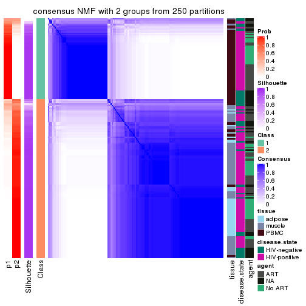</p>

</div>
<div id='tab-CV-NMF-consensus-heatmap-2'>
<pre><code class="r">consensus_heatmap(res, k = 3)
</code></pre>

<p>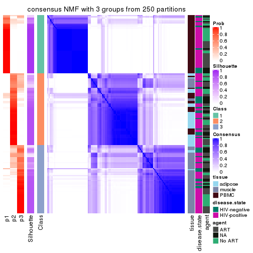</p>

</div>
<div id='tab-CV-NMF-consensus-heatmap-3'>
<pre><code class="r">consensus_heatmap(res, k = 4)
</code></pre>

<p>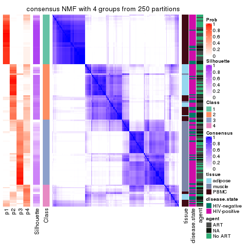</p>

</div>
<div id='tab-CV-NMF-consensus-heatmap-4'>
<pre><code class="r">consensus_heatmap(res, k = 5)
</code></pre>

<p>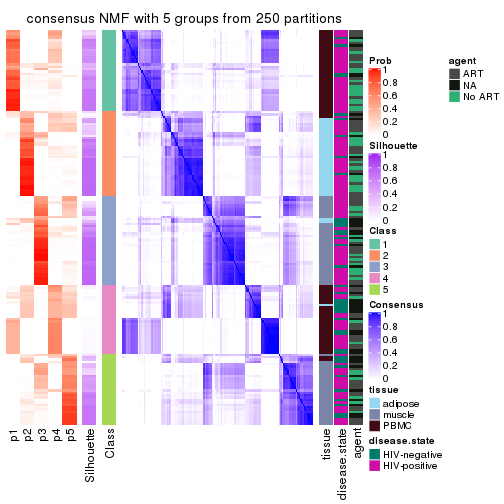</p>

</div>
<div id='tab-CV-NMF-consensus-heatmap-5'>
<pre><code class="r">consensus_heatmap(res, k = 6)
</code></pre>

<p>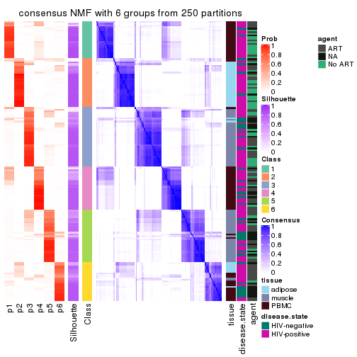</p>

</div>
</div>

Heatmaps for the membership of samples in all partitions to see how consistent they are:


<script>
$( function() {
	$( '#tabs-CV-NMF-membership-heatmap' ).tabs();
} );
</script>
<div id='tabs-CV-NMF-membership-heatmap'>
<ul>
<li><a href='#tab-CV-NMF-membership-heatmap-1'>k = 2</a></li>
<li><a href='#tab-CV-NMF-membership-heatmap-2'>k = 3</a></li>
<li><a href='#tab-CV-NMF-membership-heatmap-3'>k = 4</a></li>
<li><a href='#tab-CV-NMF-membership-heatmap-4'>k = 5</a></li>
<li><a href='#tab-CV-NMF-membership-heatmap-5'>k = 6</a></li>
</ul>
<div id='tab-CV-NMF-membership-heatmap-1'>
<pre><code class="r">membership_heatmap(res, k = 2)
</code></pre>

<p>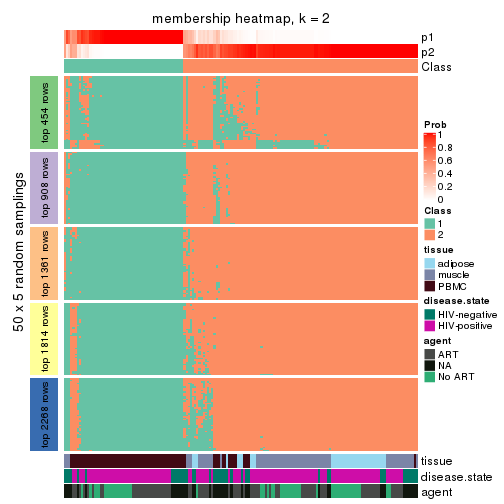</p>

</div>
<div id='tab-CV-NMF-membership-heatmap-2'>
<pre><code class="r">membership_heatmap(res, k = 3)
</code></pre>

<p>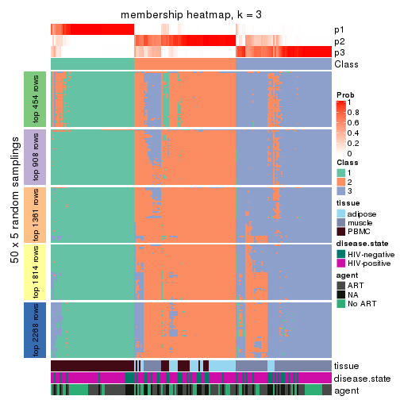</p>

</div>
<div id='tab-CV-NMF-membership-heatmap-3'>
<pre><code class="r">membership_heatmap(res, k = 4)
</code></pre>

<p>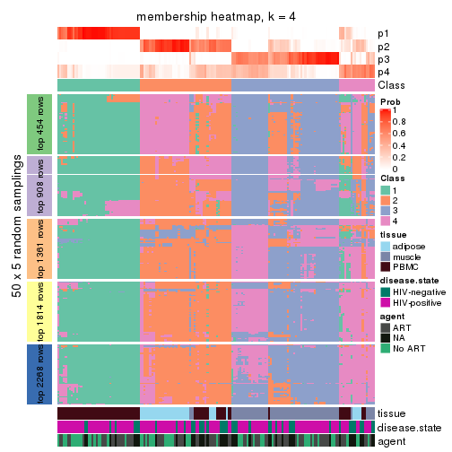</p>

</div>
<div id='tab-CV-NMF-membership-heatmap-4'>
<pre><code class="r">membership_heatmap(res, k = 5)
</code></pre>

<p>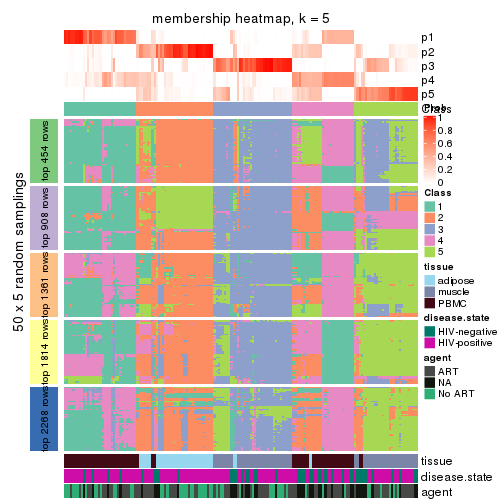</p>

</div>
<div id='tab-CV-NMF-membership-heatmap-5'>
<pre><code class="r">membership_heatmap(res, k = 6)
</code></pre>

<p>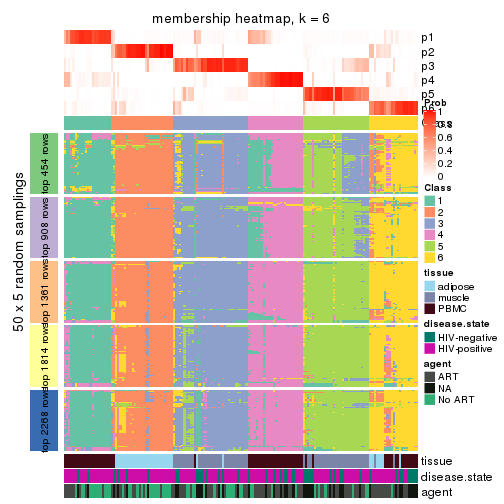</p>

</div>
</div>

As soon as we have had the classes for columns, we can look for signatures
which are significantly different between classes which can be candidate marks
for certain classes. Following are the heatmaps for signatures.


Signature heatmaps where rows are scaled:


<script>
$( function() {
	$( '#tabs-CV-NMF-get-signatures' ).tabs();
} );
</script>
<div id='tabs-CV-NMF-get-signatures'>
<ul>
<li><a href='#tab-CV-NMF-get-signatures-1'>k = 2</a></li>
<li><a href='#tab-CV-NMF-get-signatures-2'>k = 3</a></li>
<li><a href='#tab-CV-NMF-get-signatures-3'>k = 4</a></li>
<li><a href='#tab-CV-NMF-get-signatures-4'>k = 5</a></li>
<li><a href='#tab-CV-NMF-get-signatures-5'>k = 6</a></li>
</ul>
<div id='tab-CV-NMF-get-signatures-1'>
<pre><code class="r">get_signatures(res, k = 2)
</code></pre>

<p>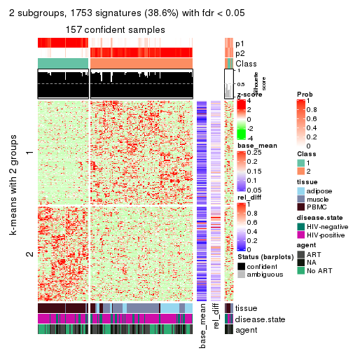</p>

</div>
<div id='tab-CV-NMF-get-signatures-2'>
<pre><code class="r">get_signatures(res, k = 3)
</code></pre>

<p>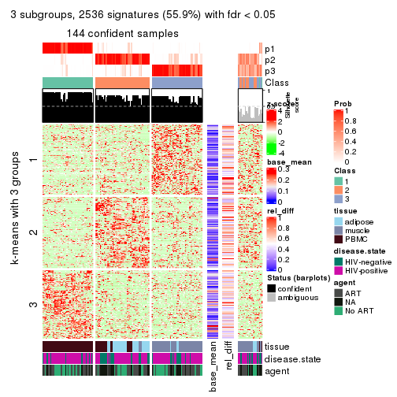</p>

</div>
<div id='tab-CV-NMF-get-signatures-3'>
<pre><code class="r">get_signatures(res, k = 4)
</code></pre>

<p>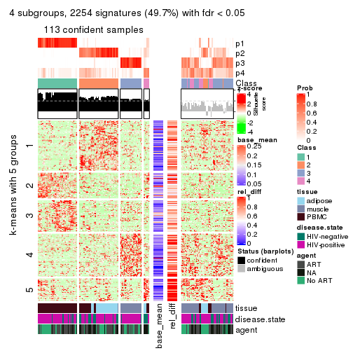</p>

</div>
<div id='tab-CV-NMF-get-signatures-4'>
<pre><code class="r">get_signatures(res, k = 5)
</code></pre>

<p>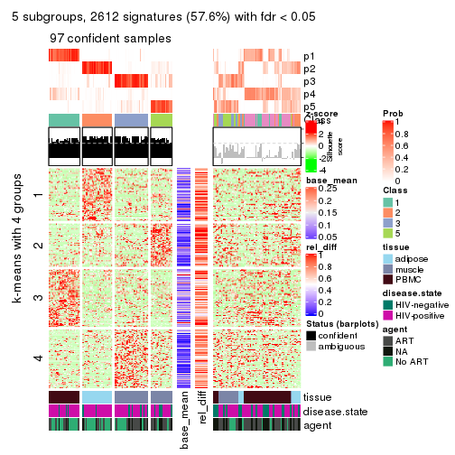</p>

</div>
<div id='tab-CV-NMF-get-signatures-5'>
<pre><code class="r">get_signatures(res, k = 6)
</code></pre>

<p>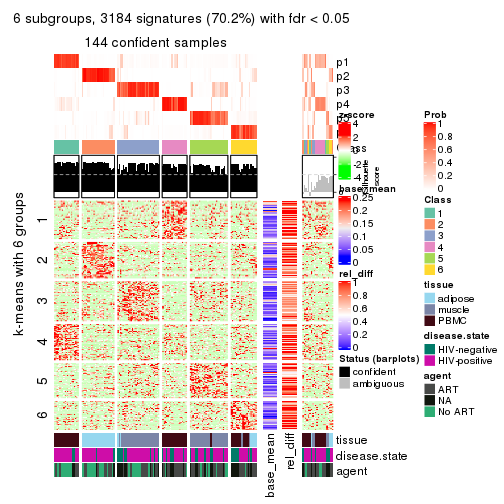</p>

</div>
</div>


Signature heatmaps where rows are not scaled:


<script>
$( function() {
	$( '#tabs-CV-NMF-get-signatures-no-scale' ).tabs();
} );
</script>
<div id='tabs-CV-NMF-get-signatures-no-scale'>
<ul>
<li><a href='#tab-CV-NMF-get-signatures-no-scale-1'>k = 2</a></li>
<li><a href='#tab-CV-NMF-get-signatures-no-scale-2'>k = 3</a></li>
<li><a href='#tab-CV-NMF-get-signatures-no-scale-3'>k = 4</a></li>
<li><a href='#tab-CV-NMF-get-signatures-no-scale-4'>k = 5</a></li>
<li><a href='#tab-CV-NMF-get-signatures-no-scale-5'>k = 6</a></li>
</ul>
<div id='tab-CV-NMF-get-signatures-no-scale-1'>
<pre><code class="r">get_signatures(res, k = 2, scale_rows = FALSE)
</code></pre>

<p>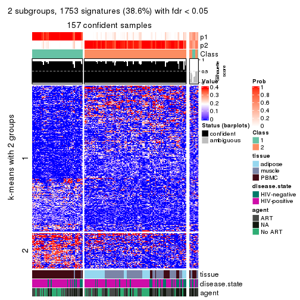</p>

</div>
<div id='tab-CV-NMF-get-signatures-no-scale-2'>
<pre><code class="r">get_signatures(res, k = 3, scale_rows = FALSE)
</code></pre>

<p>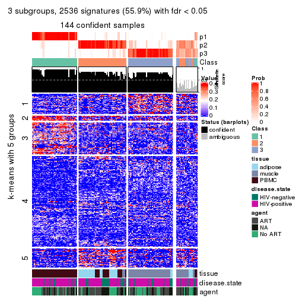</p>

</div>
<div id='tab-CV-NMF-get-signatures-no-scale-3'>
<pre><code class="r">get_signatures(res, k = 4, scale_rows = FALSE)
</code></pre>

<p>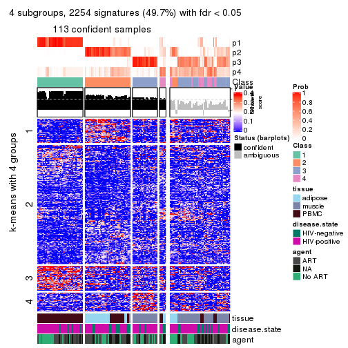</p>

</div>
<div id='tab-CV-NMF-get-signatures-no-scale-4'>
<pre><code class="r">get_signatures(res, k = 5, scale_rows = FALSE)
</code></pre>

<pre><code>#&gt; Error in mat[ceiling(1:nr/h_ratio), ceiling(1:nc/w_ratio), drop = FALSE]: subscript out of bounds
</code></pre>

<p>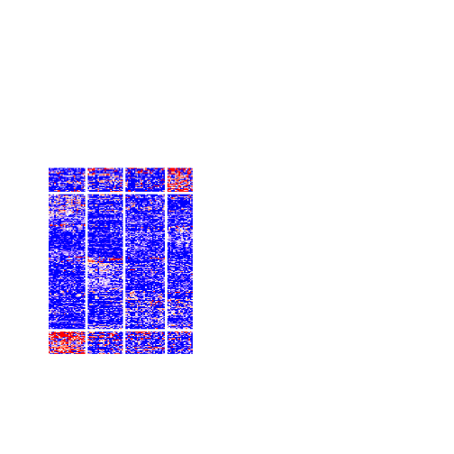</p>

</div>
<div id='tab-CV-NMF-get-signatures-no-scale-5'>
<pre><code class="r">get_signatures(res, k = 6, scale_rows = FALSE)
</code></pre>

<p>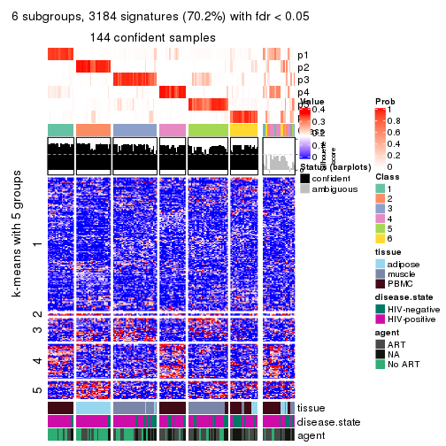</p>

</div>
</div>


Compare the overlap of signatures from different k:

```r
compare_signatures(res)
```

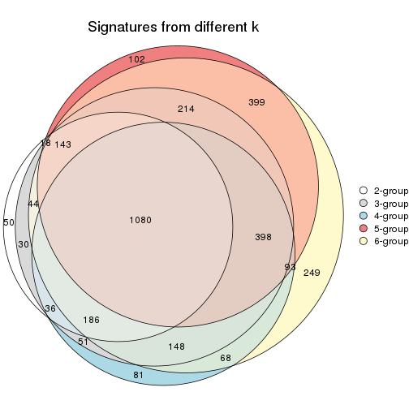

`get_signature()` returns a data frame invisibly. TO get the list of signatures, the function
call should be assigned to a variable explicitly. In following code, if `plot` argument is set
to `FALSE`, no heatmap is plotted while only the differential analysis is performed.

```r
# code only for demonstration
tb = get_signature(res, k = ..., plot = FALSE)
```

An example of the output of `tb` is:

```
#>   which_row         fdr    mean_1    mean_2 scaled_mean_1 scaled_mean_2 km
#> 1        38 0.042760348  8.373488  9.131774    -0.5533452     0.5164555  1
#> 2        40 0.018707592  7.106213  8.469186    -0.6173731     0.5762149  1
#> 3        55 0.019134737 10.221463 11.207825    -0.6159697     0.5749050  1
#> 4        59 0.006059896  5.921854  7.869574    -0.6899429     0.6439467  1
#> 5        60 0.018055526  8.928898 10.211722    -0.6204761     0.5791110  1
#> 6        98 0.009384629 15.714769 14.887706     0.6635654    -0.6193277  2
...
```

The columns in `tb` are:

1. `which_row`: row indices corresponding to the input matrix.
2. `fdr`: FDR for the differential test. 
3. `mean_x`: The mean value in group x.
4. `scaled_mean_x`: The mean value in group x after rows are scaled.
5. `km`: Row groups if k-means clustering is applied to rows.


UMAP plot which shows how samples are separated.


<script>
$( function() {
	$( '#tabs-CV-NMF-dimension-reduction' ).tabs();
} );
</script>
<div id='tabs-CV-NMF-dimension-reduction'>
<ul>
<li><a href='#tab-CV-NMF-dimension-reduction-1'>k = 2</a></li>
<li><a href='#tab-CV-NMF-dimension-reduction-2'>k = 3</a></li>
<li><a href='#tab-CV-NMF-dimension-reduction-3'>k = 4</a></li>
<li><a href='#tab-CV-NMF-dimension-reduction-4'>k = 5</a></li>
<li><a href='#tab-CV-NMF-dimension-reduction-5'>k = 6</a></li>
</ul>
<div id='tab-CV-NMF-dimension-reduction-1'>
<pre><code class="r">dimension_reduction(res, k = 2, method = &quot;UMAP&quot;)
</code></pre>

<p>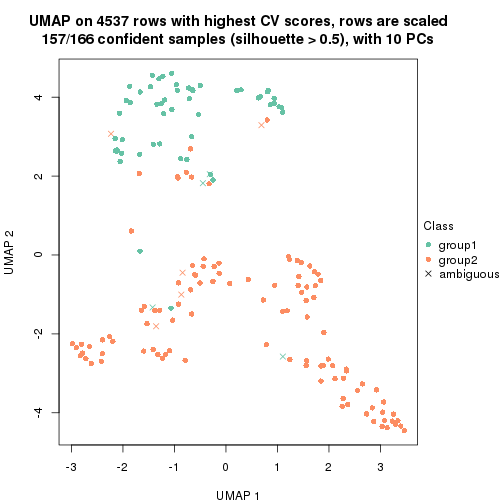</p>

</div>
<div id='tab-CV-NMF-dimension-reduction-2'>
<pre><code class="r">dimension_reduction(res, k = 3, method = &quot;UMAP&quot;)
</code></pre>

<p>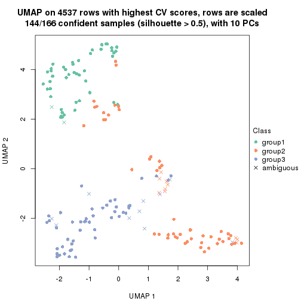</p>

</div>
<div id='tab-CV-NMF-dimension-reduction-3'>
<pre><code class="r">dimension_reduction(res, k = 4, method = &quot;UMAP&quot;)
</code></pre>

<p>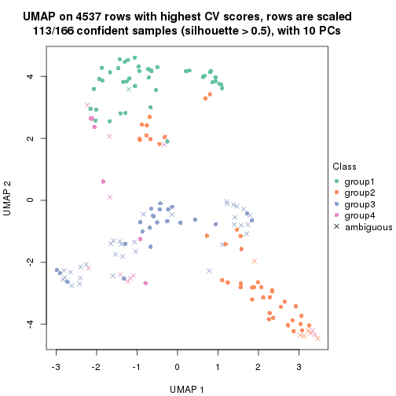</p>

</div>
<div id='tab-CV-NMF-dimension-reduction-4'>
<pre><code class="r">dimension_reduction(res, k = 5, method = &quot;UMAP&quot;)
</code></pre>

<p>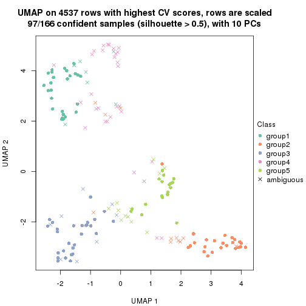</p>

</div>
<div id='tab-CV-NMF-dimension-reduction-5'>
<pre><code class="r">dimension_reduction(res, k = 6, method = &quot;UMAP&quot;)
</code></pre>

<p>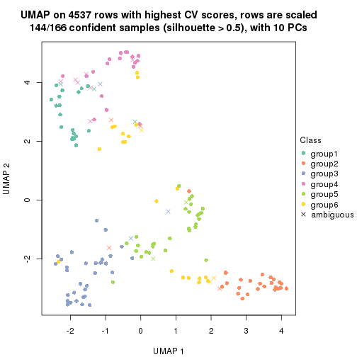</p>

</div>
</div>


Following heatmap shows how subgroups are split when increasing `k`:

```r
collect_classes(res)
```

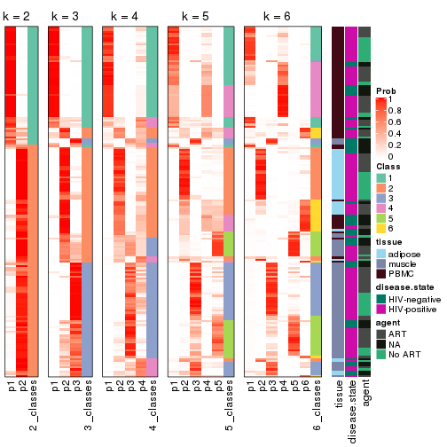


Test correlation between subgroups and known annotations. If the known
annotation is numeric, one-way ANOVA test is applied, and if the known
annotation is discrete, chi-squared contingency table test is applied.

```r
test_to_known_factors(res)
```

```
#>          n tissue(p) disease.state(p) agent(p) k
#> CV:NMF 157  1.94e-23          0.56581 0.735064 2
#> CV:NMF 144  2.23e-37          0.19944 0.482350 3
#> CV:NMF 113  4.21e-31          0.00903 0.051045 4
#> CV:NMF  97  3.59e-39          0.20309 0.117011 5
#> CV:NMF 144  3.69e-44          0.10057 0.000498 6
```


If matrix rows can be associated to genes, consider to use `GO_Enrichment(res,
...)` to perform function enrichment for the signature genes.


 

---------------------------------------------------


### MAD:hclust


The object with results only for a single top-value method and a single partition method 
can be extracted as:

```r
res = res_list["MAD", "hclust"]
# you can also extract it by
# res = res_list["MAD:hclust"]
```

A summary of `res` and all the functions that can be applied to it:

```r
res
```

```
#> A 'ConsensusPartition' object with k = 2, 3, 4, 5, 6.
#>   On a matrix with 4537 rows and 166 columns.
#>   Top rows (454, 908, 1361, 1814, 2268) are extracted by 'MAD' method.
#>   Subgroups are detected by 'hclust' method.
#>   Performed in total 1250 partitions by row resampling.
#>   Best k for subgroups seems to be 3.
#> 
#> Following methods can be applied to this 'ConsensusPartition' object:
#>  [1] "cola_report"             "collect_classes"         "collect_plots"          
#>  [4] "collect_stats"           "colnames"                "compare_signatures"     
#>  [7] "consensus_heatmap"       "dimension_reduction"     "functional_enrichment"  
#> [10] "get_anno_col"            "get_anno"                "get_classes"            
#> [13] "get_consensus"           "get_matrix"              "get_membership"         
#> [16] "get_param"               "get_signatures"          "get_stats"              
#> [19] "is_best_k"               "is_stable_k"             "membership_heatmap"     
#> [22] "ncol"                    "nrow"                    "plot_ecdf"              
#> [25] "rownames"                "select_partition_number" "show"                   
#> [28] "suggest_best_k"          "test_to_known_factors"
```

`collect_plots()` function collects all the plots made from `res` for all `k` (number of partitions)
into one single page to provide an easy and fast comparison between different `k`.

```r
collect_plots(res)
```

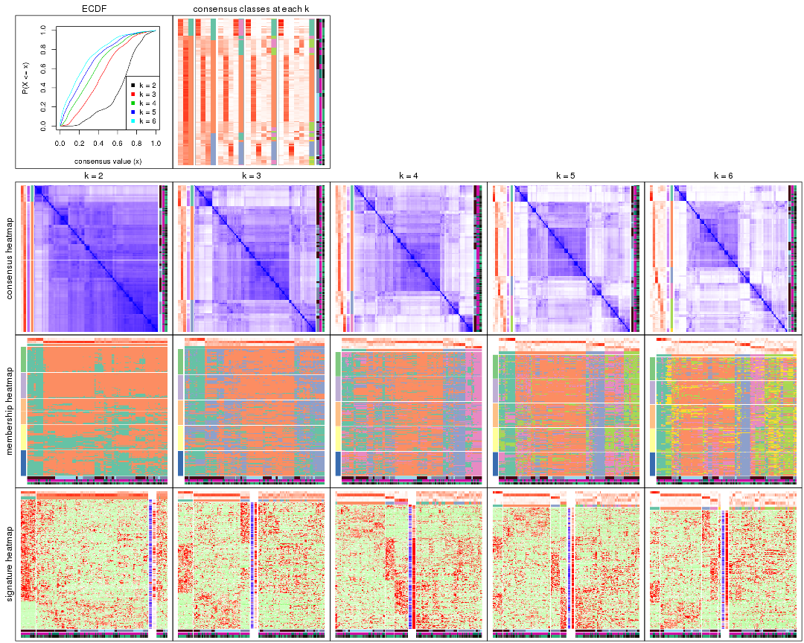

The plots are:

- The first row: a plot of the ECDF (Empirical cumulative distribution
  function) curves of the consensus matrix for each `k` and the heatmap of
  predicted classes for each `k`.
- The second row: heatmaps of the consensus matrix for each `k`.
- The third row: heatmaps of the membership matrix for each `k`.
- The fouth row: heatmaps of the signatures for each `k`.

All the plots in panels can be made by individual functions and they are
plotted later in this section.

`select_partition_number()` produces several plots showing different
statistics for choosing "optimized" `k`. There are following statistics:

- ECDF curves of the consensus matrix for each `k`;
- 1-PAC. [The PAC
  score](https://en.wikipedia.org/wiki/Consensus_clustering#Over-interpretation_potential_of_consensus_clustering)
  measures the proportion of the ambiguous subgrouping.
- Mean silhouette score.
- Concordance. The mean probability of fiting the consensus class ids in all
  partitions.
- Area increased. Denote $A_k$ as the area under the ECDF curve for current
  `k`, the area increased is defined as $A_k - A_{k-1}$.
- Rand index. The percent of pairs of samples that are both in a same cluster
  or both are not in a same cluster in the partition of k and k-1.
- Jaccard index. The ratio of pairs of samples are both in a same cluster in
  the partition of k and k-1 and the pairs of samples are both in a same
  cluster in the partition k or k-1.

The detailed explanations of these statistics can be found in [the cola
vignette](http://bioconductor.org/packages/devel/bioc/vignettes/cola/inst/doc/cola.html#toc_13).

Generally speaking, lower PAC score, higher mean silhouette score or higher
concordance corresponds to better partition. Rand index and Jaccard index
measure how similar the current partition is compared to partition with `k-1`.
If they are too similar, we won't accept `k` is better than `k-1`.

```r
select_partition_number(res)
```

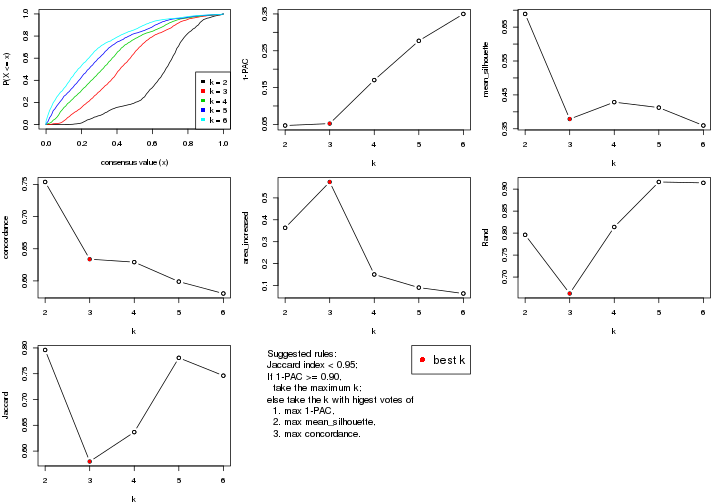

The numeric values for all these statistics can be obtained by `get_stats()`.

```r
get_stats(res)
```

```
#>   k  1-PAC mean_silhouette concordance area_increased  Rand Jaccard
#> 2 2 0.0469           0.689       0.754         0.3634 0.796   0.796
#> 3 3 0.0521           0.379       0.634         0.5726 0.663   0.580
#> 4 4 0.1703           0.429       0.629         0.1504 0.814   0.637
#> 5 5 0.2769           0.412       0.599         0.0905 0.916   0.781
#> 6 6 0.3499           0.360       0.580         0.0634 0.914   0.746
```

`suggest_best_k()` suggests the best $k$ based on these statistics. The rules are as follows:

- All $k$ with Jaccard index larger than 0.95 are removed because the increase of
  the partition number does not provides enough extra information. If all $k$ are removed,
  the best $k$ is assigned by `NA`.
- For $k$ with 1-PAC larger than 0.9, the maximal $k$ is taken as the "best k". Other $k$ is called "optional k".
- If it does not fit the second rule. The $k$ with the highest vote of highest
  1-PAC, mean silhouette and concordance is taken as the "best k".

```r
suggest_best_k(res)
```

```
#> [1] 3
```


Following shows the table of the partitions (You need to click the **show/hide
code output** link to see it). The membership matrix (columns with name `p*`)
is inferred by
[`clue::cl_consensus()`](https://www.rdocumentation.org/link/cl_consensus?package=clue)
function with the `SE` method. Basically the value in the membership matrix
represents the probability to belong to a certain group. The finall class
label for an item is determined with the group with highest probability it
belongs to.

In `get_classes()` function, the entropy is calculated from the membership
matrix and the silhouette score is calculated from the consensus matrix.


<script>
$( function() {
	$( '#tabs-MAD-hclust-get-classes' ).tabs();
} );
</script>
<div id='tabs-MAD-hclust-get-classes'>
<ul>
<li><a href='#tab-MAD-hclust-get-classes-1'>k = 2</a></li>
<li><a href='#tab-MAD-hclust-get-classes-2'>k = 3</a></li>
<li><a href='#tab-MAD-hclust-get-classes-3'>k = 4</a></li>
<li><a href='#tab-MAD-hclust-get-classes-4'>k = 5</a></li>
<li><a href='#tab-MAD-hclust-get-classes-5'>k = 6</a></li>
</ul>

<div id='tab-MAD-hclust-get-classes-1'>
<p><a id='tab-MAD-hclust-get-classes-1-a' style='color:#0366d6' href='#'>show/hide code output</a></p>
<pre><code class="r">cbind(get_classes(res, k = 2), get_membership(res, k = 2))
</code></pre>

<pre><code>#&gt;           class entropy silhouette    p1    p2
#&gt; GSM751298     1   0.697      0.832 0.812 0.188
#&gt; GSM751304     2   0.738      0.756 0.208 0.792
#&gt; GSM751305     2   0.738      0.756 0.208 0.792
#&gt; GSM751307     2   0.833      0.710 0.264 0.736
#&gt; GSM751310     2   0.866      0.653 0.288 0.712
#&gt; GSM751314     2   0.844      0.666 0.272 0.728
#&gt; GSM751316     2   0.881      0.656 0.300 0.700
#&gt; GSM751318     2   0.469      0.755 0.100 0.900
#&gt; GSM751342     2   0.456      0.755 0.096 0.904
#&gt; GSM751346     1   0.615      0.831 0.848 0.152
#&gt; GSM751347     1   0.615      0.831 0.848 0.152
#&gt; GSM751348     2   0.469      0.747 0.100 0.900
#&gt; GSM751349     2   0.430      0.750 0.088 0.912
#&gt; GSM751352     2   0.584      0.737 0.140 0.860
#&gt; GSM751353     2   0.552      0.744 0.128 0.872
#&gt; GSM751354     2   0.855      0.681 0.280 0.720
#&gt; GSM751355     2   0.855      0.681 0.280 0.720
#&gt; GSM751358     2   0.662      0.761 0.172 0.828
#&gt; GSM751359     2   0.662      0.761 0.172 0.828
#&gt; GSM751294     2   0.680      0.751 0.180 0.820
#&gt; GSM751296     1   0.871      0.734 0.708 0.292
#&gt; GSM751297     1   0.653      0.835 0.832 0.168
#&gt; GSM751299     2   0.634      0.730 0.160 0.840
#&gt; GSM751300     1   0.697      0.832 0.812 0.188
#&gt; GSM751301     2   0.662      0.711 0.172 0.828
#&gt; GSM751302     1   0.625      0.832 0.844 0.156
#&gt; GSM751303     2   0.844      0.678 0.272 0.728
#&gt; GSM751306     2   0.839      0.668 0.268 0.732
#&gt; GSM751308     2   0.730      0.748 0.204 0.796
#&gt; GSM751309     2   0.760      0.715 0.220 0.780
#&gt; GSM751311     2   0.760      0.715 0.220 0.780
#&gt; GSM751312     2   0.881      0.656 0.300 0.700
#&gt; GSM751313     1   0.876      0.777 0.704 0.296
#&gt; GSM751315     2   0.921      0.571 0.336 0.664
#&gt; GSM751317     2   0.886      0.615 0.304 0.696
#&gt; GSM751320     2   0.963      0.404 0.388 0.612
#&gt; GSM751321     2   0.886      0.619 0.304 0.696
#&gt; GSM751322     2   0.891      0.562 0.308 0.692
#&gt; GSM751324     2   0.745      0.695 0.212 0.788
#&gt; GSM751325     2   0.821      0.616 0.256 0.744
#&gt; GSM751332     2   0.904      0.600 0.320 0.680
#&gt; GSM751334     2   0.904      0.600 0.320 0.680
#&gt; GSM751339     2   0.985      0.453 0.428 0.572
#&gt; GSM751341     1   0.949      0.555 0.632 0.368
#&gt; GSM751343     2   0.634      0.737 0.160 0.840
#&gt; GSM751344     2   0.615      0.723 0.152 0.848
#&gt; GSM751345     2   0.615      0.723 0.152 0.848
#&gt; GSM751356     2   0.634      0.740 0.160 0.840
#&gt; GSM751357     2   0.634      0.740 0.160 0.840
#&gt; GSM751293     2   0.662      0.711 0.172 0.828
#&gt; GSM751295     1   0.625      0.832 0.844 0.156
#&gt; GSM751319     2   0.929      0.555 0.344 0.656
#&gt; GSM751323     2   0.961      0.390 0.384 0.616
#&gt; GSM751326     2   0.999     -0.075 0.480 0.520
#&gt; GSM751327     1   1.000      0.220 0.504 0.496
#&gt; GSM751328     2   0.904      0.600 0.320 0.680
#&gt; GSM751329     1   0.939      0.696 0.644 0.356
#&gt; GSM751330     1   0.939      0.696 0.644 0.356
#&gt; GSM751331     1   0.814      0.812 0.748 0.252
#&gt; GSM751333     1   0.895      0.759 0.688 0.312
#&gt; GSM751335     1   0.881      0.775 0.700 0.300
#&gt; GSM751336     1   0.814      0.812 0.748 0.252
#&gt; GSM751337     2   0.980      0.328 0.416 0.584
#&gt; GSM751338     2   0.990      0.414 0.440 0.560
#&gt; GSM751340     2   0.985      0.453 0.428 0.572
#&gt; GSM751350     1   0.625      0.832 0.844 0.156
#&gt; GSM751351     1   0.625      0.832 0.844 0.156
#&gt; GSM751362     2   0.987      0.515 0.432 0.568
#&gt; GSM751363     2   0.855      0.708 0.280 0.720
#&gt; GSM751367     2   0.985      0.497 0.428 0.572
#&gt; GSM751368     2   0.738      0.748 0.208 0.792
#&gt; GSM751371     2   0.781      0.745 0.232 0.768
#&gt; GSM751375     2   0.402      0.756 0.080 0.920
#&gt; GSM751376     2   0.795      0.725 0.240 0.760
#&gt; GSM751378     2   0.662      0.765 0.172 0.828
#&gt; GSM751379     2   0.795      0.725 0.240 0.760
#&gt; GSM751382     2   0.402      0.756 0.080 0.920
#&gt; GSM751386     2   0.358      0.756 0.068 0.932
#&gt; GSM751388     2   0.373      0.755 0.072 0.928
#&gt; GSM751391     2   0.781      0.752 0.232 0.768
#&gt; GSM751410     2   0.855      0.728 0.280 0.720
#&gt; GSM751414     2   0.939      0.626 0.356 0.644
#&gt; GSM751361     2   0.605      0.750 0.148 0.852
#&gt; GSM751365     2   0.808      0.739 0.248 0.752
#&gt; GSM751366     2   0.939      0.627 0.356 0.644
#&gt; GSM751369     2   0.814      0.732 0.252 0.748
#&gt; GSM751370     2   0.992      0.489 0.448 0.552
#&gt; GSM751372     2   0.980      0.557 0.416 0.584
#&gt; GSM751373     2   0.939      0.626 0.356 0.644
#&gt; GSM751374     2   0.795      0.725 0.240 0.760
#&gt; GSM751377     2   0.706      0.755 0.192 0.808
#&gt; GSM751380     2   0.904      0.699 0.320 0.680
#&gt; GSM751381     2   0.388      0.755 0.076 0.924
#&gt; GSM751383     2   0.416      0.758 0.084 0.916
#&gt; GSM751384     2   0.494      0.765 0.108 0.892
#&gt; GSM751385     2   0.615      0.769 0.152 0.848
#&gt; GSM751387     2   0.416      0.754 0.084 0.916
#&gt; GSM751389     2   0.833      0.730 0.264 0.736
#&gt; GSM751393     2   0.795      0.725 0.240 0.760
#&gt; GSM751394     2   0.343      0.756 0.064 0.936
#&gt; GSM751395     2   0.795      0.725 0.240 0.760
#&gt; GSM751397     2   0.388      0.757 0.076 0.924
#&gt; GSM751398     2   0.343      0.757 0.064 0.936
#&gt; GSM751404     2   0.981      0.546 0.420 0.580
#&gt; GSM751406     2   0.987      0.539 0.432 0.568
#&gt; GSM751411     2   0.775      0.746 0.228 0.772
#&gt; GSM751413     2   0.753      0.745 0.216 0.784
#&gt; GSM751415     2   0.833      0.730 0.264 0.736
#&gt; GSM751416     2   0.844      0.712 0.272 0.728
#&gt; GSM751417     2   0.844      0.712 0.272 0.728
#&gt; GSM751421     2   0.775      0.741 0.228 0.772
#&gt; GSM751422     2   0.775      0.741 0.228 0.772
#&gt; GSM751360     2   0.781      0.739 0.232 0.768
#&gt; GSM751364     2   0.844      0.712 0.272 0.728
#&gt; GSM751390     2   0.506      0.761 0.112 0.888
#&gt; GSM751392     2   0.416      0.756 0.084 0.916
#&gt; GSM751396     2   0.388      0.755 0.076 0.924
#&gt; GSM751399     2   0.932      0.644 0.348 0.652
#&gt; GSM751400     2   0.992      0.514 0.448 0.552
#&gt; GSM751401     2   0.991      0.521 0.444 0.556
#&gt; GSM751402     2   0.992      0.514 0.448 0.552
#&gt; GSM751403     2   0.991      0.522 0.444 0.556
#&gt; GSM751405     2   0.987      0.538 0.432 0.568
#&gt; GSM751407     2   0.992      0.514 0.448 0.552
#&gt; GSM751408     2   0.978      0.559 0.412 0.588
#&gt; GSM751409     2   0.753      0.752 0.216 0.784
#&gt; GSM751412     2   0.971      0.573 0.400 0.600
#&gt; GSM751418     2   0.795      0.735 0.240 0.760
#&gt; GSM751419     2   0.795      0.735 0.240 0.760
#&gt; GSM751420     2   0.983      0.560 0.424 0.576
#&gt; GSM751425     2   0.494      0.753 0.108 0.892
#&gt; GSM751429     2   0.985      0.488 0.428 0.572
#&gt; GSM751430     2   0.469      0.760 0.100 0.900
#&gt; GSM751433     2   0.388      0.739 0.076 0.924
#&gt; GSM751437     2   0.866      0.740 0.288 0.712
#&gt; GSM751448     2   0.998      0.433 0.476 0.524
#&gt; GSM751451     2   0.373      0.740 0.072 0.928
#&gt; GSM751423     2   0.814      0.759 0.252 0.748
#&gt; GSM751424     2   0.469      0.758 0.100 0.900
#&gt; GSM751428     2   0.584      0.757 0.140 0.860
#&gt; GSM751431     2   0.416      0.742 0.084 0.916
#&gt; GSM751432     2   0.469      0.760 0.100 0.900
#&gt; GSM751434     2   0.469      0.760 0.100 0.900
#&gt; GSM751435     2   0.574      0.758 0.136 0.864
#&gt; GSM751436     2   0.388      0.739 0.076 0.924
#&gt; GSM751440     2   0.574      0.761 0.136 0.864
#&gt; GSM751444     2   0.402      0.750 0.080 0.920
#&gt; GSM751446     2   0.482      0.752 0.104 0.896
#&gt; GSM751449     2   0.482      0.749 0.104 0.896
#&gt; GSM751450     2   0.456      0.756 0.096 0.904
#&gt; GSM751452     2   0.469      0.758 0.100 0.900
#&gt; GSM751426     2   0.443      0.753 0.092 0.908
#&gt; GSM751427     2   0.584      0.757 0.140 0.860
#&gt; GSM751438     2   0.584      0.762 0.140 0.860
#&gt; GSM751439     2   0.469      0.748 0.100 0.900
#&gt; GSM751441     2   0.506      0.750 0.112 0.888
#&gt; GSM751442     2   0.469      0.748 0.100 0.900
#&gt; GSM751443     2   0.995      0.456 0.460 0.540
#&gt; GSM751445     2   0.482      0.749 0.104 0.896
#&gt; GSM751447     2   0.506      0.750 0.112 0.888
#&gt; GSM751453     2   0.469      0.751 0.100 0.900
#&gt; GSM751454     2   0.469      0.751 0.100 0.900
#&gt; GSM751455     2   0.469      0.748 0.100 0.900
#&gt; GSM751456     2   0.469      0.748 0.100 0.900
#&gt; GSM751457     2   0.469      0.752 0.100 0.900
#&gt; GSM751458     2   0.469      0.752 0.100 0.900
</code></pre>

<script>
$('#tab-MAD-hclust-get-classes-1-a').parent().next().next().hide();
$('#tab-MAD-hclust-get-classes-1-a').click(function(){
  $('#tab-MAD-hclust-get-classes-1-a').parent().next().next().toggle();
  return(false);
});
</script>
</div>

<div id='tab-MAD-hclust-get-classes-2'>
<p><a id='tab-MAD-hclust-get-classes-2-a' style='color:#0366d6' href='#'>show/hide code output</a></p>
<pre><code class="r">cbind(get_classes(res, k = 3), get_membership(res, k = 3))
</code></pre>

<pre><code>#&gt;           class entropy silhouette    p1    p2    p3
#&gt; GSM751298     1   0.423   0.683195 0.872 0.084 0.044
#&gt; GSM751304     2   0.814   0.317143 0.112 0.620 0.268
#&gt; GSM751305     2   0.814   0.317143 0.112 0.620 0.268
#&gt; GSM751307     2   0.962  -0.022657 0.236 0.468 0.296
#&gt; GSM751310     2   0.981  -0.102214 0.256 0.424 0.320
#&gt; GSM751314     2   0.979  -0.125034 0.236 0.384 0.380
#&gt; GSM751316     2   0.971  -0.101042 0.224 0.424 0.352
#&gt; GSM751318     2   0.817   0.158444 0.072 0.512 0.416
#&gt; GSM751342     2   0.811   0.194532 0.072 0.536 0.392
#&gt; GSM751346     1   0.341   0.684596 0.904 0.068 0.028
#&gt; GSM751347     1   0.341   0.684596 0.904 0.068 0.028
#&gt; GSM751348     2   0.489   0.578604 0.060 0.844 0.096
#&gt; GSM751349     2   0.397   0.587827 0.044 0.884 0.072
#&gt; GSM751352     2   0.517   0.560799 0.092 0.832 0.076
#&gt; GSM751353     2   0.466   0.574482 0.076 0.856 0.068
#&gt; GSM751354     2   0.822   0.348282 0.184 0.640 0.176
#&gt; GSM751355     2   0.822   0.348282 0.184 0.640 0.176
#&gt; GSM751358     2   0.594   0.503352 0.028 0.748 0.224
#&gt; GSM751359     2   0.594   0.503352 0.028 0.748 0.224
#&gt; GSM751294     2   0.674   0.511425 0.100 0.744 0.156
#&gt; GSM751296     1   0.677   0.622121 0.744 0.144 0.112
#&gt; GSM751297     1   0.415   0.680266 0.876 0.080 0.044
#&gt; GSM751299     2   0.589   0.539713 0.104 0.796 0.100
#&gt; GSM751300     1   0.423   0.683195 0.872 0.084 0.044
#&gt; GSM751301     2   0.862   0.240356 0.132 0.572 0.296
#&gt; GSM751302     1   0.328   0.685852 0.908 0.068 0.024
#&gt; GSM751303     3   0.967   0.100494 0.212 0.392 0.396
#&gt; GSM751306     2   0.978  -0.119562 0.232 0.388 0.380
#&gt; GSM751308     2   0.874   0.235973 0.124 0.536 0.340
#&gt; GSM751309     2   0.948   0.059224 0.200 0.472 0.328
#&gt; GSM751311     2   0.948   0.059224 0.200 0.472 0.328
#&gt; GSM751312     2   0.971  -0.101042 0.224 0.424 0.352
#&gt; GSM751313     1   0.701   0.648234 0.720 0.092 0.188
#&gt; GSM751315     2   0.998  -0.167050 0.324 0.364 0.312
#&gt; GSM751317     2   0.989  -0.123914 0.272 0.396 0.332
#&gt; GSM751320     1   0.986   0.115125 0.392 0.256 0.352
#&gt; GSM751321     2   0.987  -0.103819 0.268 0.408 0.324
#&gt; GSM751322     2   0.997  -0.128251 0.304 0.368 0.328
#&gt; GSM751324     2   0.962  -0.068569 0.204 0.408 0.388
#&gt; GSM751325     2   0.982  -0.101074 0.244 0.392 0.364
#&gt; GSM751332     3   0.990  -0.001232 0.316 0.284 0.400
#&gt; GSM751334     3   0.990  -0.001232 0.316 0.284 0.400
#&gt; GSM751339     3   0.903   0.240413 0.308 0.160 0.532
#&gt; GSM751341     1   0.792   0.529412 0.664 0.184 0.152
#&gt; GSM751343     2   0.904   0.068269 0.136 0.472 0.392
#&gt; GSM751344     2   0.548   0.550934 0.108 0.816 0.076
#&gt; GSM751345     2   0.548   0.550934 0.108 0.816 0.076
#&gt; GSM751356     2   0.625   0.540361 0.104 0.776 0.120
#&gt; GSM751357     2   0.625   0.540361 0.104 0.776 0.120
#&gt; GSM751293     2   0.862   0.240356 0.132 0.572 0.296
#&gt; GSM751295     1   0.328   0.685852 0.908 0.068 0.024
#&gt; GSM751319     2   0.996  -0.160435 0.328 0.372 0.300
#&gt; GSM751323     1   0.986   0.133543 0.396 0.256 0.348
#&gt; GSM751326     1   0.946   0.365466 0.484 0.204 0.312
#&gt; GSM751327     1   0.934   0.375005 0.512 0.208 0.280
#&gt; GSM751328     3   0.989  -0.002214 0.316 0.280 0.404
#&gt; GSM751329     1   0.784   0.597643 0.668 0.140 0.192
#&gt; GSM751330     1   0.784   0.597643 0.668 0.140 0.192
#&gt; GSM751331     1   0.608   0.671923 0.784 0.088 0.128
#&gt; GSM751333     1   0.713   0.647608 0.716 0.104 0.180
#&gt; GSM751335     1   0.683   0.656849 0.736 0.096 0.168
#&gt; GSM751336     1   0.608   0.671923 0.784 0.088 0.128
#&gt; GSM751337     1   0.971   0.181262 0.408 0.220 0.372
#&gt; GSM751338     3   0.904   0.219434 0.320 0.156 0.524
#&gt; GSM751340     3   0.907   0.243407 0.308 0.164 0.528
#&gt; GSM751350     1   0.341   0.686902 0.904 0.068 0.028
#&gt; GSM751351     1   0.341   0.686902 0.904 0.068 0.028
#&gt; GSM751362     3   0.891   0.496228 0.220 0.208 0.572
#&gt; GSM751363     2   0.887  -0.024105 0.124 0.496 0.380
#&gt; GSM751367     1   0.999  -0.393896 0.360 0.320 0.320
#&gt; GSM751368     2   0.779   0.254798 0.064 0.588 0.348
#&gt; GSM751371     2   0.748   0.000796 0.036 0.508 0.456
#&gt; GSM751375     2   0.468   0.577545 0.040 0.848 0.112
#&gt; GSM751376     2   0.767   0.301704 0.072 0.628 0.300
#&gt; GSM751378     2   0.706   0.383818 0.048 0.664 0.288
#&gt; GSM751379     2   0.767   0.301704 0.072 0.628 0.300
#&gt; GSM751382     2   0.468   0.577545 0.040 0.848 0.112
#&gt; GSM751386     2   0.480   0.571341 0.032 0.836 0.132
#&gt; GSM751388     2   0.473   0.572332 0.032 0.840 0.128
#&gt; GSM751391     2   0.767   0.194566 0.052 0.568 0.380
#&gt; GSM751410     3   0.847   0.293500 0.092 0.404 0.504
#&gt; GSM751414     3   0.954   0.364939 0.208 0.328 0.464
#&gt; GSM751361     2   0.661   0.371098 0.016 0.628 0.356
#&gt; GSM751365     2   0.805   0.186764 0.076 0.568 0.356
#&gt; GSM751366     3   0.951   0.317372 0.200 0.336 0.464
#&gt; GSM751369     3   0.774   0.162332 0.048 0.448 0.504
#&gt; GSM751370     3   0.938   0.491804 0.232 0.256 0.512
#&gt; GSM751372     3   0.960   0.418359 0.216 0.328 0.456
#&gt; GSM751373     3   0.950   0.310383 0.196 0.344 0.460
#&gt; GSM751374     2   0.767   0.301704 0.072 0.628 0.300
#&gt; GSM751377     2   0.742   0.348748 0.060 0.640 0.300
#&gt; GSM751380     3   0.858   0.310314 0.100 0.396 0.504
#&gt; GSM751381     2   0.454   0.575944 0.028 0.848 0.124
#&gt; GSM751383     2   0.580   0.561646 0.044 0.780 0.176
#&gt; GSM751384     2   0.512   0.567781 0.028 0.812 0.160
#&gt; GSM751385     2   0.611   0.493920 0.028 0.732 0.240
#&gt; GSM751387     2   0.533   0.571660 0.044 0.812 0.144
#&gt; GSM751389     3   0.807   0.134841 0.064 0.464 0.472
#&gt; GSM751393     2   0.756   0.320302 0.072 0.644 0.284
#&gt; GSM751394     2   0.473   0.573408 0.032 0.840 0.128
#&gt; GSM751395     2   0.759   0.317932 0.072 0.640 0.288
#&gt; GSM751397     2   0.506   0.566043 0.032 0.820 0.148
#&gt; GSM751398     2   0.499   0.568776 0.032 0.824 0.144
#&gt; GSM751404     3   0.891   0.521551 0.176 0.260 0.564
#&gt; GSM751406     3   0.781   0.555175 0.144 0.184 0.672
#&gt; GSM751411     2   0.806   0.039827 0.068 0.532 0.400
#&gt; GSM751413     2   0.786   0.091442 0.056 0.528 0.416
#&gt; GSM751415     3   0.807   0.134841 0.064 0.464 0.472
#&gt; GSM751416     2   0.851   0.036024 0.096 0.512 0.392
#&gt; GSM751417     2   0.851   0.036024 0.096 0.512 0.392
#&gt; GSM751421     3   0.730   0.067938 0.028 0.484 0.488
#&gt; GSM751422     3   0.730   0.067938 0.028 0.484 0.488
#&gt; GSM751360     2   0.716   0.052565 0.024 0.524 0.452
#&gt; GSM751364     2   0.851   0.036024 0.096 0.512 0.392
#&gt; GSM751390     2   0.585   0.562695 0.048 0.780 0.172
#&gt; GSM751392     2   0.468   0.577971 0.040 0.848 0.112
#&gt; GSM751396     2   0.493   0.581630 0.032 0.828 0.140
#&gt; GSM751399     3   0.796   0.499831 0.092 0.288 0.620
#&gt; GSM751400     3   0.802   0.561675 0.160 0.184 0.656
#&gt; GSM751401     3   0.797   0.561295 0.160 0.180 0.660
#&gt; GSM751402     3   0.788   0.559180 0.160 0.172 0.668
#&gt; GSM751403     3   0.787   0.559314 0.156 0.176 0.668
#&gt; GSM751405     3   0.771   0.553447 0.144 0.176 0.680
#&gt; GSM751407     3   0.802   0.561675 0.160 0.184 0.656
#&gt; GSM751408     3   0.829   0.541019 0.140 0.236 0.624
#&gt; GSM751409     2   0.774   0.009004 0.048 0.504 0.448
#&gt; GSM751412     3   0.837   0.526187 0.132 0.260 0.608
#&gt; GSM751418     2   0.830   0.081511 0.080 0.508 0.412
#&gt; GSM751419     2   0.830   0.081511 0.080 0.508 0.412
#&gt; GSM751420     3   0.865   0.510234 0.136 0.292 0.572
#&gt; GSM751425     2   0.427   0.584650 0.052 0.872 0.076
#&gt; GSM751429     3   0.983   0.340213 0.368 0.244 0.388
#&gt; GSM751430     2   0.536   0.579566 0.064 0.820 0.116
#&gt; GSM751433     2   0.459   0.554689 0.032 0.848 0.120
#&gt; GSM751437     3   0.868   0.234323 0.104 0.420 0.476
#&gt; GSM751448     3   0.875   0.437469 0.276 0.152 0.572
#&gt; GSM751451     2   0.480   0.552397 0.032 0.836 0.132
#&gt; GSM751423     2   0.788   0.311021 0.072 0.592 0.336
#&gt; GSM751424     2   0.529   0.581821 0.064 0.824 0.112
#&gt; GSM751428     2   0.613   0.560010 0.084 0.780 0.136
#&gt; GSM751431     2   0.478   0.554801 0.036 0.840 0.124
#&gt; GSM751432     2   0.536   0.579566 0.064 0.820 0.116
#&gt; GSM751434     2   0.536   0.579566 0.064 0.820 0.116
#&gt; GSM751435     2   0.600   0.574407 0.084 0.788 0.128
#&gt; GSM751436     2   0.459   0.554689 0.032 0.848 0.120
#&gt; GSM751440     2   0.649   0.557398 0.084 0.756 0.160
#&gt; GSM751444     2   0.452   0.577690 0.032 0.852 0.116
#&gt; GSM751446     2   0.552   0.566332 0.068 0.812 0.120
#&gt; GSM751449     2   0.459   0.572636 0.048 0.856 0.096
#&gt; GSM751450     2   0.514   0.577013 0.044 0.824 0.132
#&gt; GSM751452     2   0.529   0.581821 0.064 0.824 0.112
#&gt; GSM751426     2   0.453   0.579705 0.040 0.856 0.104
#&gt; GSM751427     2   0.613   0.560010 0.084 0.780 0.136
#&gt; GSM751438     2   0.624   0.547282 0.072 0.768 0.160
#&gt; GSM751439     2   0.530   0.568463 0.068 0.824 0.108
#&gt; GSM751441     2   0.487   0.581072 0.056 0.844 0.100
#&gt; GSM751442     2   0.523   0.569374 0.068 0.828 0.104
#&gt; GSM751443     3   0.895   0.455856 0.272 0.172 0.556
#&gt; GSM751445     2   0.459   0.572636 0.048 0.856 0.096
#&gt; GSM751447     2   0.487   0.581072 0.056 0.844 0.100
#&gt; GSM751453     2   0.492   0.578998 0.052 0.840 0.108
#&gt; GSM751454     2   0.492   0.578998 0.052 0.840 0.108
#&gt; GSM751455     2   0.523   0.569374 0.068 0.828 0.104
#&gt; GSM751456     2   0.523   0.569374 0.068 0.828 0.104
#&gt; GSM751457     2   0.448   0.575407 0.044 0.860 0.096
#&gt; GSM751458     2   0.448   0.575407 0.044 0.860 0.096
</code></pre>

<script>
$('#tab-MAD-hclust-get-classes-2-a').parent().next().next().hide();
$('#tab-MAD-hclust-get-classes-2-a').click(function(){
  $('#tab-MAD-hclust-get-classes-2-a').parent().next().next().toggle();
  return(false);
});
</script>
</div>

<div id='tab-MAD-hclust-get-classes-3'>
<p><a id='tab-MAD-hclust-get-classes-3-a' style='color:#0366d6' href='#'>show/hide code output</a></p>
<pre><code class="r">cbind(get_classes(res, k = 4), get_membership(res, k = 4))
</code></pre>

<pre><code>#&gt;           class entropy silhouette    p1    p2    p3    p4
#&gt; GSM751298     4   0.427    0.70963 0.040 0.056 0.056 0.848
#&gt; GSM751304     2   0.814    0.32840 0.192 0.572 0.156 0.080
#&gt; GSM751305     2   0.814    0.32840 0.192 0.572 0.156 0.080
#&gt; GSM751307     2   0.948   -0.10385 0.228 0.412 0.148 0.212
#&gt; GSM751310     1   0.916    0.44005 0.380 0.336 0.092 0.192
#&gt; GSM751314     1   0.912    0.50653 0.432 0.284 0.104 0.180
#&gt; GSM751316     1   0.926    0.41524 0.360 0.352 0.108 0.180
#&gt; GSM751318     1   0.738    0.23763 0.476 0.396 0.116 0.012
#&gt; GSM751342     1   0.728    0.19449 0.464 0.420 0.104 0.012
#&gt; GSM751346     4   0.292    0.72375 0.004 0.036 0.060 0.900
#&gt; GSM751347     4   0.292    0.72375 0.004 0.036 0.060 0.900
#&gt; GSM751348     2   0.519    0.61248 0.104 0.792 0.072 0.032
#&gt; GSM751349     2   0.436    0.62723 0.084 0.836 0.060 0.020
#&gt; GSM751352     2   0.514    0.61047 0.060 0.800 0.092 0.048
#&gt; GSM751353     2   0.460    0.62219 0.052 0.828 0.084 0.036
#&gt; GSM751354     2   0.780    0.44368 0.056 0.592 0.196 0.156
#&gt; GSM751355     2   0.780    0.44368 0.056 0.592 0.196 0.156
#&gt; GSM751358     2   0.619    0.57209 0.112 0.688 0.192 0.008
#&gt; GSM751359     2   0.619    0.57209 0.112 0.688 0.192 0.008
#&gt; GSM751294     2   0.632    0.56672 0.072 0.704 0.184 0.040
#&gt; GSM751296     4   0.658    0.61600 0.132 0.096 0.064 0.708
#&gt; GSM751297     4   0.399    0.71237 0.020 0.048 0.076 0.856
#&gt; GSM751299     2   0.588    0.59508 0.060 0.756 0.112 0.072
#&gt; GSM751300     4   0.427    0.70963 0.040 0.056 0.056 0.848
#&gt; GSM751301     2   0.763   -0.10180 0.408 0.472 0.056 0.064
#&gt; GSM751302     4   0.256    0.72372 0.000 0.032 0.056 0.912
#&gt; GSM751303     1   0.919    0.48535 0.416 0.300 0.112 0.172
#&gt; GSM751306     1   0.915    0.50262 0.428 0.288 0.108 0.176
#&gt; GSM751308     2   0.857    0.17820 0.272 0.476 0.196 0.056
#&gt; GSM751309     1   0.893    0.43267 0.392 0.372 0.104 0.132
#&gt; GSM751311     1   0.893    0.43267 0.392 0.372 0.104 0.132
#&gt; GSM751312     1   0.926    0.41524 0.360 0.352 0.108 0.180
#&gt; GSM751313     4   0.618    0.56580 0.272 0.028 0.040 0.660
#&gt; GSM751315     1   0.914    0.48838 0.392 0.280 0.076 0.252
#&gt; GSM751317     1   0.914    0.49063 0.392 0.312 0.084 0.212
#&gt; GSM751320     1   0.829    0.32347 0.516 0.160 0.056 0.268
#&gt; GSM751321     1   0.915    0.48762 0.384 0.320 0.084 0.212
#&gt; GSM751322     1   0.869    0.48604 0.460 0.292 0.064 0.184
#&gt; GSM751324     1   0.795    0.43547 0.532 0.308 0.076 0.084
#&gt; GSM751325     1   0.825    0.44268 0.508 0.304 0.068 0.120
#&gt; GSM751332     1   0.835    0.38959 0.520 0.192 0.056 0.232
#&gt; GSM751334     1   0.835    0.38959 0.520 0.192 0.056 0.232
#&gt; GSM751339     3   0.897    0.03592 0.352 0.072 0.380 0.196
#&gt; GSM751341     4   0.750    0.51004 0.168 0.132 0.068 0.632
#&gt; GSM751343     1   0.771    0.35027 0.508 0.356 0.092 0.044
#&gt; GSM751344     2   0.567    0.60585 0.064 0.772 0.088 0.076
#&gt; GSM751345     2   0.567    0.60585 0.064 0.772 0.088 0.076
#&gt; GSM751356     2   0.602    0.58990 0.068 0.744 0.128 0.060
#&gt; GSM751357     2   0.602    0.58990 0.068 0.744 0.128 0.060
#&gt; GSM751293     2   0.763   -0.10180 0.408 0.472 0.056 0.064
#&gt; GSM751295     4   0.275    0.72374 0.004 0.032 0.056 0.908
#&gt; GSM751319     1   0.910    0.48120 0.392 0.284 0.072 0.252
#&gt; GSM751323     1   0.844    0.30352 0.504 0.164 0.064 0.268
#&gt; GSM751326     1   0.812    0.02952 0.432 0.132 0.040 0.396
#&gt; GSM751327     1   0.838    0.08000 0.440 0.144 0.052 0.364
#&gt; GSM751328     1   0.841    0.39076 0.516 0.192 0.060 0.232
#&gt; GSM751329     4   0.688    0.41920 0.336 0.072 0.020 0.572
#&gt; GSM751330     4   0.688    0.41920 0.336 0.072 0.020 0.572
#&gt; GSM751331     4   0.514    0.63883 0.188 0.028 0.024 0.760
#&gt; GSM751333     4   0.625    0.53853 0.312 0.028 0.032 0.628
#&gt; GSM751335     4   0.591    0.55424 0.300 0.024 0.024 0.652
#&gt; GSM751336     4   0.514    0.63883 0.188 0.028 0.024 0.760
#&gt; GSM751337     1   0.851    0.22824 0.500 0.132 0.084 0.284
#&gt; GSM751338     3   0.901    0.02704 0.352 0.072 0.372 0.204
#&gt; GSM751340     3   0.902    0.03490 0.352 0.076 0.376 0.196
#&gt; GSM751350     4   0.248    0.72473 0.000 0.032 0.052 0.916
#&gt; GSM751351     4   0.248    0.72473 0.000 0.032 0.052 0.916
#&gt; GSM751362     3   0.865    0.30781 0.300 0.116 0.480 0.104
#&gt; GSM751363     2   0.906   -0.08317 0.292 0.420 0.204 0.084
#&gt; GSM751367     4   0.986   -0.24678 0.244 0.256 0.180 0.320
#&gt; GSM751368     2   0.808    0.27421 0.248 0.544 0.156 0.052
#&gt; GSM751371     2   0.821    0.07629 0.284 0.404 0.300 0.012
#&gt; GSM751375     2   0.454    0.62458 0.044 0.828 0.096 0.032
#&gt; GSM751376     2   0.650    0.32084 0.028 0.564 0.376 0.032
#&gt; GSM751378     2   0.676    0.44148 0.092 0.604 0.292 0.012
#&gt; GSM751379     2   0.650    0.32084 0.028 0.564 0.376 0.032
#&gt; GSM751382     2   0.454    0.62458 0.044 0.828 0.096 0.032
#&gt; GSM751386     2   0.468    0.61422 0.060 0.816 0.104 0.020
#&gt; GSM751388     2   0.462    0.61636 0.060 0.820 0.100 0.020
#&gt; GSM751391     2   0.815    0.26119 0.220 0.480 0.276 0.024
#&gt; GSM751410     3   0.881    0.12770 0.320 0.304 0.336 0.040
#&gt; GSM751414     1   0.913    0.13305 0.436 0.252 0.216 0.096
#&gt; GSM751361     2   0.726    0.39387 0.248 0.560 0.188 0.004
#&gt; GSM751365     2   0.809    0.25994 0.164 0.504 0.296 0.036
#&gt; GSM751366     1   0.946    0.15398 0.380 0.288 0.208 0.124
#&gt; GSM751369     2   0.833   -0.10242 0.236 0.376 0.368 0.020
#&gt; GSM751370     3   0.913    0.24290 0.328 0.160 0.404 0.108
#&gt; GSM751372     3   0.940    0.18768 0.304 0.240 0.356 0.100
#&gt; GSM751373     1   0.943    0.16224 0.388 0.284 0.204 0.124
#&gt; GSM751374     2   0.650    0.32084 0.028 0.564 0.376 0.032
#&gt; GSM751377     2   0.787    0.37236 0.196 0.576 0.180 0.048
#&gt; GSM751380     3   0.899    0.11588 0.224 0.348 0.364 0.064
#&gt; GSM751381     2   0.435    0.62078 0.056 0.836 0.088 0.020
#&gt; GSM751383     2   0.583    0.59270 0.108 0.748 0.116 0.028
#&gt; GSM751384     2   0.501    0.61977 0.052 0.788 0.140 0.020
#&gt; GSM751385     2   0.577    0.56284 0.068 0.692 0.236 0.004
#&gt; GSM751387     2   0.521    0.61173 0.072 0.788 0.112 0.028
#&gt; GSM751389     3   0.831    0.09080 0.180 0.388 0.400 0.032
#&gt; GSM751393     2   0.645    0.35377 0.028 0.580 0.360 0.032
#&gt; GSM751394     2   0.464    0.61648 0.064 0.816 0.104 0.016
#&gt; GSM751395     2   0.646    0.34823 0.028 0.576 0.364 0.032
#&gt; GSM751397     2   0.481    0.61146 0.064 0.804 0.116 0.016
#&gt; GSM751398     2   0.495    0.61044 0.072 0.800 0.108 0.020
#&gt; GSM751404     3   0.724    0.49935 0.140 0.184 0.636 0.040
#&gt; GSM751406     3   0.278    0.57613 0.008 0.072 0.904 0.016
#&gt; GSM751411     2   0.814    0.06429 0.168 0.440 0.364 0.028
#&gt; GSM751413     2   0.863    0.11159 0.280 0.448 0.224 0.048
#&gt; GSM751415     3   0.831    0.09080 0.180 0.388 0.400 0.032
#&gt; GSM751416     2   0.866    0.03119 0.296 0.436 0.220 0.048
#&gt; GSM751417     2   0.866    0.03119 0.296 0.436 0.220 0.048
#&gt; GSM751421     2   0.821    0.00554 0.280 0.400 0.308 0.012
#&gt; GSM751422     2   0.821    0.00554 0.280 0.400 0.308 0.012
#&gt; GSM751360     2   0.828    0.13597 0.280 0.436 0.264 0.020
#&gt; GSM751364     2   0.866    0.03119 0.296 0.436 0.220 0.048
#&gt; GSM751390     2   0.569    0.60775 0.076 0.756 0.136 0.032
#&gt; GSM751392     2   0.454    0.62450 0.044 0.828 0.096 0.032
#&gt; GSM751396     2   0.510    0.62233 0.100 0.792 0.088 0.020
#&gt; GSM751399     3   0.542    0.54543 0.064 0.188 0.740 0.008
#&gt; GSM751400     3   0.456    0.58622 0.056 0.088 0.828 0.028
#&gt; GSM751401     3   0.426    0.58443 0.048 0.080 0.844 0.028
#&gt; GSM751402     3   0.402    0.58432 0.040 0.076 0.856 0.028
#&gt; GSM751403     3   0.381    0.58491 0.032 0.080 0.864 0.024
#&gt; GSM751405     3   0.233    0.56277 0.004 0.056 0.924 0.016
#&gt; GSM751407     3   0.456    0.58622 0.056 0.088 0.828 0.028
#&gt; GSM751408     3   0.595    0.56070 0.084 0.164 0.728 0.024
#&gt; GSM751409     3   0.758   -0.01128 0.136 0.420 0.432 0.012
#&gt; GSM751412     3   0.595    0.55132 0.084 0.184 0.716 0.016
#&gt; GSM751418     2   0.871    0.06934 0.292 0.456 0.188 0.064
#&gt; GSM751419     2   0.871    0.06934 0.292 0.456 0.188 0.064
#&gt; GSM751420     3   0.477    0.56641 0.016 0.192 0.772 0.020
#&gt; GSM751425     2   0.443    0.62966 0.060 0.840 0.052 0.048
#&gt; GSM751429     4   0.968   -0.15973 0.196 0.160 0.316 0.328
#&gt; GSM751430     2   0.490    0.59736 0.104 0.808 0.032 0.056
#&gt; GSM751433     2   0.391    0.57060 0.180 0.808 0.004 0.008
#&gt; GSM751437     3   0.903    0.13573 0.248 0.304 0.384 0.064
#&gt; GSM751448     3   0.610    0.45549 0.064 0.048 0.728 0.160
#&gt; GSM751451     2   0.433    0.56552 0.184 0.792 0.016 0.008
#&gt; GSM751423     2   0.829    0.33408 0.252 0.500 0.208 0.040
#&gt; GSM751424     2   0.496    0.59588 0.108 0.804 0.032 0.056
#&gt; GSM751428     2   0.602    0.58701 0.112 0.748 0.064 0.076
#&gt; GSM751431     2   0.418    0.57051 0.180 0.800 0.008 0.012
#&gt; GSM751432     2   0.490    0.59736 0.104 0.808 0.032 0.056
#&gt; GSM751434     2   0.490    0.59736 0.104 0.808 0.032 0.056
#&gt; GSM751435     2   0.601    0.60060 0.128 0.744 0.052 0.076
#&gt; GSM751436     2   0.391    0.57060 0.180 0.808 0.004 0.008
#&gt; GSM751440     2   0.617    0.57321 0.164 0.720 0.036 0.080
#&gt; GSM751444     2   0.449    0.61181 0.124 0.820 0.028 0.028
#&gt; GSM751446     2   0.532    0.58807 0.136 0.776 0.028 0.060
#&gt; GSM751449     2   0.506    0.61666 0.072 0.804 0.084 0.040
#&gt; GSM751450     2   0.517    0.58772 0.164 0.772 0.028 0.036
#&gt; GSM751452     2   0.496    0.59588 0.108 0.804 0.032 0.056
#&gt; GSM751426     2   0.452    0.60511 0.136 0.812 0.016 0.036
#&gt; GSM751427     2   0.602    0.58701 0.112 0.748 0.064 0.076
#&gt; GSM751438     2   0.647    0.59232 0.084 0.704 0.164 0.048
#&gt; GSM751439     2   0.523    0.59559 0.128 0.784 0.032 0.056
#&gt; GSM751441     2   0.501    0.61940 0.080 0.808 0.068 0.044
#&gt; GSM751442     2   0.523    0.59527 0.128 0.784 0.032 0.056
#&gt; GSM751443     3   0.656    0.47477 0.068 0.072 0.704 0.156
#&gt; GSM751445     2   0.506    0.61666 0.072 0.804 0.084 0.040
#&gt; GSM751447     2   0.501    0.61940 0.080 0.808 0.068 0.044
#&gt; GSM751453     2   0.503    0.61318 0.096 0.804 0.060 0.040
#&gt; GSM751454     2   0.503    0.61318 0.096 0.804 0.060 0.040
#&gt; GSM751455     2   0.523    0.59527 0.128 0.784 0.032 0.056
#&gt; GSM751456     2   0.523    0.59527 0.128 0.784 0.032 0.056
#&gt; GSM751457     2   0.497    0.62037 0.060 0.808 0.092 0.040
#&gt; GSM751458     2   0.497    0.62037 0.060 0.808 0.092 0.040
</code></pre>

<script>
$('#tab-MAD-hclust-get-classes-3-a').parent().next().next().hide();
$('#tab-MAD-hclust-get-classes-3-a').click(function(){
  $('#tab-MAD-hclust-get-classes-3-a').parent().next().next().toggle();
  return(false);
});
</script>
</div>

<div id='tab-MAD-hclust-get-classes-4'>
<p><a id='tab-MAD-hclust-get-classes-4-a' style='color:#0366d6' href='#'>show/hide code output</a></p>
<pre><code class="r">cbind(get_classes(res, k = 5), get_membership(res, k = 5))
</code></pre>

<pre><code>#&gt;           class entropy silhouette    p1    p2    p3    p4    p5
#&gt; GSM751298     1  0.2732     0.6842 0.904 0.024 0.008 0.032 0.032
#&gt; GSM751304     2  0.7286     0.1885 0.028 0.544 0.080 0.280 0.068
#&gt; GSM751305     2  0.7286     0.1885 0.028 0.544 0.080 0.280 0.068
#&gt; GSM751307     2  0.9164    -0.3453 0.176 0.332 0.076 0.304 0.112
#&gt; GSM751310     4  0.7820     0.4791 0.088 0.252 0.028 0.512 0.120
#&gt; GSM751314     4  0.8469     0.2917 0.096 0.204 0.028 0.416 0.256
#&gt; GSM751316     4  0.7898     0.4821 0.084 0.276 0.036 0.496 0.108
#&gt; GSM751318     5  0.5717     0.4363 0.000 0.256 0.040 0.056 0.648
#&gt; GSM751342     5  0.5785     0.4096 0.000 0.280 0.040 0.052 0.628
#&gt; GSM751346     1  0.1130     0.7025 0.968 0.012 0.012 0.004 0.004
#&gt; GSM751347     1  0.1130     0.7025 0.968 0.012 0.012 0.004 0.004
#&gt; GSM751348     2  0.5278     0.5863 0.012 0.716 0.048 0.024 0.200
#&gt; GSM751349     2  0.4451     0.6080 0.012 0.780 0.032 0.016 0.160
#&gt; GSM751352     2  0.5242     0.5963 0.032 0.756 0.072 0.020 0.120
#&gt; GSM751353     2  0.4683     0.6095 0.028 0.796 0.060 0.020 0.096
#&gt; GSM751354     2  0.7602     0.4154 0.144 0.576 0.156 0.084 0.040
#&gt; GSM751355     2  0.7602     0.4154 0.144 0.576 0.156 0.084 0.040
#&gt; GSM751358     2  0.6631     0.5070 0.004 0.620 0.136 0.060 0.180
#&gt; GSM751359     2  0.6631     0.5070 0.004 0.620 0.136 0.060 0.180
#&gt; GSM751294     2  0.6452     0.5388 0.020 0.648 0.156 0.032 0.144
#&gt; GSM751296     1  0.4912     0.5758 0.748 0.052 0.008 0.020 0.172
#&gt; GSM751297     1  0.2405     0.6864 0.920 0.020 0.024 0.024 0.012
#&gt; GSM751299     2  0.5848     0.5795 0.048 0.720 0.092 0.024 0.116
#&gt; GSM751300     1  0.2732     0.6842 0.904 0.024 0.008 0.032 0.032
#&gt; GSM751301     5  0.5942     0.3550 0.032 0.344 0.012 0.032 0.580
#&gt; GSM751302     1  0.0740     0.7017 0.980 0.008 0.008 0.000 0.004
#&gt; GSM751303     4  0.8412     0.3485 0.088 0.228 0.028 0.424 0.232
#&gt; GSM751306     4  0.8479     0.3115 0.096 0.212 0.028 0.416 0.248
#&gt; GSM751308     2  0.7481     0.0803 0.020 0.408 0.172 0.024 0.376
#&gt; GSM751309     5  0.8482    -0.1677 0.064 0.256 0.032 0.320 0.328
#&gt; GSM751311     5  0.8482    -0.1677 0.064 0.256 0.032 0.320 0.328
#&gt; GSM751312     4  0.7898     0.4821 0.084 0.276 0.036 0.496 0.108
#&gt; GSM751313     1  0.6490     0.4679 0.516 0.008 0.008 0.344 0.124
#&gt; GSM751315     4  0.8211     0.3847 0.140 0.192 0.024 0.488 0.156
#&gt; GSM751317     4  0.8281     0.4141 0.116 0.224 0.028 0.472 0.160
#&gt; GSM751320     5  0.7302     0.4820 0.192 0.064 0.008 0.188 0.548
#&gt; GSM751321     4  0.8244     0.4240 0.116 0.228 0.028 0.476 0.152
#&gt; GSM751322     5  0.7680     0.5159 0.140 0.168 0.012 0.140 0.540
#&gt; GSM751324     5  0.6074     0.5538 0.060 0.176 0.004 0.088 0.672
#&gt; GSM751325     5  0.6247     0.5643 0.072 0.176 0.004 0.088 0.660
#&gt; GSM751332     5  0.6890     0.5525 0.164 0.096 0.000 0.144 0.596
#&gt; GSM751334     5  0.6890     0.5525 0.164 0.096 0.000 0.144 0.596
#&gt; GSM751339     3  0.8528     0.0635 0.092 0.024 0.356 0.308 0.220
#&gt; GSM751341     1  0.5925     0.4776 0.664 0.084 0.012 0.024 0.216
#&gt; GSM751343     5  0.5200     0.5121 0.016 0.216 0.020 0.036 0.712
#&gt; GSM751344     2  0.5527     0.5919 0.052 0.740 0.064 0.020 0.124
#&gt; GSM751345     2  0.5527     0.5919 0.052 0.740 0.064 0.020 0.124
#&gt; GSM751356     2  0.6237     0.5667 0.040 0.688 0.108 0.032 0.132
#&gt; GSM751357     2  0.6237     0.5667 0.040 0.688 0.108 0.032 0.132
#&gt; GSM751293     5  0.5942     0.3550 0.032 0.344 0.012 0.032 0.580
#&gt; GSM751295     1  0.0902     0.7018 0.976 0.008 0.008 0.004 0.004
#&gt; GSM751319     4  0.8199     0.3965 0.140 0.200 0.024 0.488 0.148
#&gt; GSM751323     5  0.7184     0.5053 0.196 0.076 0.008 0.148 0.572
#&gt; GSM751326     5  0.7564     0.2533 0.288 0.060 0.000 0.212 0.440
#&gt; GSM751327     5  0.7839     0.3378 0.244 0.068 0.008 0.228 0.452
#&gt; GSM751328     5  0.6855     0.5526 0.164 0.096 0.000 0.140 0.600
#&gt; GSM751329     1  0.7411     0.2481 0.424 0.028 0.004 0.292 0.252
#&gt; GSM751330     1  0.7411     0.2481 0.424 0.028 0.004 0.292 0.252
#&gt; GSM751331     1  0.5342     0.5856 0.676 0.004 0.004 0.228 0.088
#&gt; GSM751333     1  0.6880     0.4060 0.460 0.008 0.004 0.324 0.204
#&gt; GSM751335     1  0.6664     0.4337 0.488 0.004 0.004 0.316 0.188
#&gt; GSM751336     1  0.5342     0.5856 0.676 0.004 0.004 0.228 0.088
#&gt; GSM751337     5  0.7563     0.4335 0.196 0.048 0.036 0.172 0.548
#&gt; GSM751338     3  0.8597     0.0560 0.100 0.024 0.352 0.300 0.224
#&gt; GSM751340     3  0.8589     0.0601 0.092 0.028 0.356 0.304 0.220
#&gt; GSM751350     1  0.1473     0.7029 0.956 0.008 0.008 0.020 0.008
#&gt; GSM751351     1  0.1473     0.7029 0.956 0.008 0.008 0.020 0.008
#&gt; GSM751362     4  0.6679     0.0177 0.016 0.052 0.344 0.536 0.052
#&gt; GSM751363     4  0.7693     0.4418 0.024 0.316 0.100 0.480 0.080
#&gt; GSM751367     4  0.9273     0.2883 0.300 0.196 0.108 0.312 0.084
#&gt; GSM751368     2  0.7413     0.0169 0.020 0.480 0.064 0.344 0.092
#&gt; GSM751371     2  0.8514    -0.1720 0.000 0.312 0.228 0.192 0.268
#&gt; GSM751375     2  0.5073     0.6021 0.028 0.780 0.048 0.060 0.084
#&gt; GSM751376     2  0.6835     0.3251 0.024 0.528 0.344 0.044 0.060
#&gt; GSM751378     2  0.7545     0.3715 0.016 0.528 0.240 0.072 0.144
#&gt; GSM751379     2  0.6835     0.3251 0.024 0.528 0.344 0.044 0.060
#&gt; GSM751382     2  0.5073     0.6021 0.028 0.780 0.048 0.060 0.084
#&gt; GSM751386     2  0.5472     0.5823 0.024 0.752 0.056 0.092 0.076
#&gt; GSM751388     2  0.5309     0.5905 0.024 0.764 0.056 0.080 0.076
#&gt; GSM751391     2  0.8340     0.0424 0.004 0.404 0.200 0.160 0.232
#&gt; GSM751410     4  0.8792     0.1359 0.008 0.248 0.224 0.296 0.224
#&gt; GSM751414     4  0.7306     0.4428 0.032 0.156 0.080 0.600 0.132
#&gt; GSM751361     2  0.7804     0.2294 0.004 0.484 0.104 0.220 0.188
#&gt; GSM751365     2  0.8616     0.0370 0.024 0.408 0.216 0.220 0.132
#&gt; GSM751366     4  0.7875     0.4482 0.036 0.224 0.112 0.528 0.100
#&gt; GSM751369     3  0.8621    -0.1010 0.008 0.296 0.328 0.188 0.180
#&gt; GSM751370     4  0.7161     0.1521 0.020 0.092 0.280 0.548 0.060
#&gt; GSM751372     4  0.7553     0.2507 0.020 0.164 0.248 0.516 0.052
#&gt; GSM751373     4  0.7815     0.4487 0.036 0.228 0.108 0.532 0.096
#&gt; GSM751374     2  0.6835     0.3251 0.024 0.528 0.344 0.044 0.060
#&gt; GSM751377     2  0.7320     0.1073 0.028 0.496 0.080 0.340 0.056
#&gt; GSM751380     4  0.8650     0.2161 0.016 0.256 0.264 0.340 0.124
#&gt; GSM751381     2  0.4975     0.5961 0.024 0.784 0.040 0.076 0.076
#&gt; GSM751383     2  0.6358     0.5698 0.032 0.692 0.096 0.088 0.092
#&gt; GSM751384     2  0.5767     0.5913 0.020 0.728 0.096 0.060 0.096
#&gt; GSM751385     2  0.6670     0.5145 0.012 0.628 0.188 0.060 0.112
#&gt; GSM751387     2  0.5852     0.5887 0.028 0.728 0.088 0.068 0.088
#&gt; GSM751389     3  0.8467    -0.0053 0.008 0.312 0.348 0.188 0.144
#&gt; GSM751393     2  0.6683     0.3574 0.024 0.544 0.336 0.036 0.060
#&gt; GSM751394     2  0.5270     0.5927 0.020 0.764 0.060 0.092 0.064
#&gt; GSM751395     2  0.6695     0.3519 0.024 0.540 0.340 0.036 0.060
#&gt; GSM751397     2  0.5617     0.5790 0.020 0.740 0.064 0.096 0.080
#&gt; GSM751398     2  0.5686     0.5753 0.024 0.736 0.060 0.104 0.076
#&gt; GSM751404     3  0.6655     0.4128 0.008 0.152 0.604 0.200 0.036
#&gt; GSM751406     3  0.1918     0.5832 0.004 0.048 0.932 0.012 0.004
#&gt; GSM751411     2  0.8785    -0.1280 0.020 0.328 0.268 0.248 0.136
#&gt; GSM751413     2  0.8668    -0.2367 0.016 0.352 0.180 0.292 0.160
#&gt; GSM751415     3  0.8467    -0.0053 0.008 0.312 0.348 0.188 0.144
#&gt; GSM751416     4  0.7624     0.3421 0.012 0.340 0.124 0.452 0.072
#&gt; GSM751417     4  0.7624     0.3421 0.012 0.340 0.124 0.452 0.072
#&gt; GSM751421     2  0.8767    -0.2116 0.008 0.312 0.232 0.216 0.232
#&gt; GSM751422     2  0.8767    -0.2116 0.008 0.312 0.232 0.216 0.232
#&gt; GSM751360     2  0.8693    -0.1735 0.008 0.336 0.196 0.248 0.212
#&gt; GSM751364     4  0.7624     0.3421 0.012 0.340 0.124 0.452 0.072
#&gt; GSM751390     2  0.6302     0.5841 0.032 0.692 0.112 0.060 0.104
#&gt; GSM751392     2  0.5009     0.6039 0.028 0.784 0.048 0.056 0.084
#&gt; GSM751396     2  0.5326     0.6080 0.020 0.760 0.056 0.072 0.092
#&gt; GSM751399     3  0.5604     0.5094 0.008 0.152 0.712 0.096 0.032
#&gt; GSM751400     3  0.3200     0.5961 0.012 0.068 0.876 0.032 0.012
#&gt; GSM751401     3  0.3064     0.5941 0.016 0.052 0.888 0.020 0.024
#&gt; GSM751402     3  0.2674     0.5941 0.012 0.052 0.904 0.016 0.016
#&gt; GSM751403     3  0.2744     0.5945 0.012 0.056 0.900 0.016 0.016
#&gt; GSM751405     3  0.2074     0.5677 0.004 0.032 0.928 0.032 0.004
#&gt; GSM751407     3  0.3200     0.5961 0.012 0.068 0.876 0.032 0.012
#&gt; GSM751408     3  0.5161     0.5512 0.008 0.140 0.748 0.072 0.032
#&gt; GSM751409     3  0.8128     0.0783 0.016 0.336 0.404 0.100 0.144
#&gt; GSM751412     3  0.5374     0.5364 0.008 0.152 0.732 0.068 0.040
#&gt; GSM751418     2  0.8052    -0.2050 0.024 0.384 0.128 0.380 0.084
#&gt; GSM751419     2  0.8052    -0.2050 0.024 0.384 0.128 0.380 0.084
#&gt; GSM751420     3  0.4009     0.5526 0.004 0.168 0.792 0.028 0.008
#&gt; GSM751425     2  0.4044     0.6135 0.032 0.840 0.024 0.040 0.064
#&gt; GSM751429     1  0.9521    -0.1327 0.296 0.116 0.212 0.268 0.108
#&gt; GSM751430     2  0.5555     0.5738 0.060 0.744 0.020 0.096 0.080
#&gt; GSM751433     2  0.4754     0.5648 0.004 0.732 0.016 0.036 0.212
#&gt; GSM751437     3  0.9287    -0.0560 0.040 0.216 0.276 0.228 0.240
#&gt; GSM751448     3  0.6297     0.4583 0.148 0.024 0.672 0.120 0.036
#&gt; GSM751451     2  0.5036     0.5596 0.004 0.716 0.024 0.040 0.216
#&gt; GSM751423     2  0.8479     0.1588 0.024 0.428 0.136 0.160 0.252
#&gt; GSM751424     2  0.5560     0.5731 0.060 0.744 0.020 0.088 0.088
#&gt; GSM751428     2  0.5970     0.5614 0.052 0.724 0.048 0.084 0.092
#&gt; GSM751431     2  0.4889     0.5664 0.004 0.728 0.020 0.040 0.208
#&gt; GSM751432     2  0.5555     0.5738 0.060 0.744 0.020 0.096 0.080
#&gt; GSM751434     2  0.5555     0.5738 0.060 0.744 0.020 0.096 0.080
#&gt; GSM751435     2  0.6042     0.5769 0.060 0.708 0.028 0.076 0.128
#&gt; GSM751436     2  0.4754     0.5648 0.004 0.732 0.016 0.036 0.212
#&gt; GSM751440     2  0.6133     0.5493 0.060 0.684 0.016 0.076 0.164
#&gt; GSM751444     2  0.4444     0.6013 0.004 0.796 0.044 0.036 0.120
#&gt; GSM751446     2  0.5041     0.5733 0.028 0.776 0.032 0.060 0.104
#&gt; GSM751449     2  0.4559     0.5972 0.016 0.808 0.076 0.048 0.052
#&gt; GSM751450     2  0.5265     0.5746 0.008 0.720 0.012 0.092 0.168
#&gt; GSM751452     2  0.5560     0.5731 0.060 0.744 0.020 0.088 0.088
#&gt; GSM751426     2  0.4703     0.5957 0.008 0.776 0.020 0.064 0.132
#&gt; GSM751427     2  0.5970     0.5614 0.052 0.724 0.048 0.084 0.092
#&gt; GSM751438     2  0.5804     0.5697 0.020 0.716 0.144 0.060 0.060
#&gt; GSM751439     2  0.4885     0.5815 0.028 0.788 0.036 0.052 0.096
#&gt; GSM751441     2  0.4383     0.6002 0.016 0.820 0.056 0.052 0.056
#&gt; GSM751442     2  0.4885     0.5809 0.028 0.788 0.036 0.052 0.096
#&gt; GSM751443     3  0.6725     0.4593 0.144 0.048 0.652 0.116 0.040
#&gt; GSM751445     2  0.4559     0.5972 0.016 0.808 0.076 0.048 0.052
#&gt; GSM751447     2  0.4383     0.6002 0.016 0.820 0.056 0.052 0.056
#&gt; GSM751453     2  0.4422     0.5931 0.016 0.816 0.040 0.072 0.056
#&gt; GSM751454     2  0.4422     0.5931 0.016 0.816 0.040 0.072 0.056
#&gt; GSM751455     2  0.4885     0.5809 0.028 0.788 0.036 0.052 0.096
#&gt; GSM751456     2  0.4885     0.5809 0.028 0.788 0.036 0.052 0.096
#&gt; GSM751457     2  0.4345     0.6004 0.016 0.820 0.076 0.040 0.048
#&gt; GSM751458     2  0.4345     0.6004 0.016 0.820 0.076 0.040 0.048
</code></pre>

<script>
$('#tab-MAD-hclust-get-classes-4-a').parent().next().next().hide();
$('#tab-MAD-hclust-get-classes-4-a').click(function(){
  $('#tab-MAD-hclust-get-classes-4-a').parent().next().next().toggle();
  return(false);
});
</script>
</div>

<div id='tab-MAD-hclust-get-classes-5'>
<p><a id='tab-MAD-hclust-get-classes-5-a' style='color:#0366d6' href='#'>show/hide code output</a></p>
<pre><code class="r">cbind(get_classes(res, k = 6), get_membership(res, k = 6))
</code></pre>

<pre><code>#&gt;           class entropy silhouette    p1    p2    p3    p4    p5    p6
#&gt; GSM751298     1  0.2341    0.66188 0.908 0.008 0.000 0.044 0.016 0.024
#&gt; GSM751304     2  0.6510    0.19458 0.004 0.520 0.048 0.068 0.328 0.032
#&gt; GSM751305     2  0.6510    0.19458 0.004 0.520 0.048 0.068 0.328 0.032
#&gt; GSM751307     5  0.8286   -0.03410 0.132 0.300 0.024 0.052 0.380 0.112
#&gt; GSM751310     5  0.5941    0.28612 0.036 0.184 0.008 0.084 0.656 0.032
#&gt; GSM751314     5  0.6540    0.27300 0.044 0.144 0.004 0.236 0.556 0.016
#&gt; GSM751316     5  0.5548    0.26285 0.024 0.224 0.012 0.064 0.660 0.016
#&gt; GSM751318     4  0.4735    0.45344 0.000 0.152 0.020 0.744 0.052 0.032
#&gt; GSM751342     4  0.4876    0.42751 0.000 0.176 0.020 0.724 0.048 0.032
#&gt; GSM751346     1  0.0551    0.68224 0.984 0.000 0.004 0.000 0.008 0.004
#&gt; GSM751347     1  0.0551    0.68224 0.984 0.000 0.004 0.000 0.008 0.004
#&gt; GSM751348     2  0.5602    0.50068 0.000 0.644 0.020 0.220 0.024 0.092
#&gt; GSM751349     2  0.4861    0.55344 0.000 0.716 0.016 0.184 0.020 0.064
#&gt; GSM751352     2  0.5342    0.54850 0.012 0.704 0.024 0.160 0.016 0.084
#&gt; GSM751353     2  0.5004    0.56971 0.012 0.732 0.020 0.156 0.020 0.060
#&gt; GSM751354     2  0.7288    0.38146 0.120 0.592 0.084 0.040 0.060 0.104
#&gt; GSM751355     2  0.7288    0.38146 0.120 0.592 0.084 0.040 0.060 0.104
#&gt; GSM751358     2  0.7040    0.28720 0.000 0.568 0.112 0.144 0.056 0.120
#&gt; GSM751359     2  0.7040    0.28720 0.000 0.568 0.112 0.144 0.056 0.120
#&gt; GSM751294     2  0.6352    0.45055 0.008 0.632 0.108 0.148 0.020 0.084
#&gt; GSM751296     1  0.4340    0.55281 0.752 0.032 0.000 0.180 0.016 0.020
#&gt; GSM751297     1  0.2144    0.66424 0.924 0.008 0.012 0.016 0.012 0.028
#&gt; GSM751299     2  0.5464    0.52975 0.028 0.720 0.036 0.120 0.016 0.080
#&gt; GSM751300     1  0.2341    0.66188 0.908 0.008 0.000 0.044 0.016 0.024
#&gt; GSM751301     4  0.5251    0.36527 0.024 0.260 0.008 0.656 0.016 0.036
#&gt; GSM751302     1  0.0717    0.68267 0.976 0.000 0.000 0.000 0.008 0.016
#&gt; GSM751303     5  0.6437    0.29618 0.028 0.176 0.008 0.216 0.560 0.012
#&gt; GSM751306     5  0.6503    0.28985 0.040 0.152 0.004 0.228 0.560 0.016
#&gt; GSM751308     4  0.7248   -0.08482 0.008 0.384 0.128 0.388 0.016 0.076
#&gt; GSM751309     5  0.6569    0.16396 0.020 0.180 0.008 0.352 0.436 0.004
#&gt; GSM751311     5  0.6569    0.16396 0.020 0.180 0.008 0.352 0.436 0.004
#&gt; GSM751312     5  0.5548    0.26285 0.024 0.224 0.012 0.064 0.660 0.016
#&gt; GSM751313     1  0.7108    0.36217 0.372 0.000 0.000 0.092 0.340 0.196
#&gt; GSM751315     5  0.6013    0.30532 0.064 0.140 0.004 0.108 0.660 0.024
#&gt; GSM751317     5  0.5801    0.30774 0.048 0.156 0.004 0.120 0.660 0.012
#&gt; GSM751320     4  0.6377    0.50263 0.124 0.024 0.000 0.568 0.244 0.040
#&gt; GSM751321     5  0.5890    0.30746 0.052 0.164 0.004 0.108 0.656 0.016
#&gt; GSM751322     4  0.6637    0.52798 0.088 0.096 0.000 0.580 0.204 0.032
#&gt; GSM751324     4  0.4745    0.57444 0.044 0.100 0.000 0.744 0.108 0.004
#&gt; GSM751325     4  0.5053    0.58799 0.048 0.100 0.000 0.728 0.112 0.012
#&gt; GSM751332     4  0.5735    0.56507 0.128 0.036 0.000 0.652 0.168 0.016
#&gt; GSM751334     4  0.5735    0.56507 0.128 0.036 0.000 0.652 0.168 0.016
#&gt; GSM751339     5  0.8043   -0.01061 0.028 0.012 0.304 0.140 0.368 0.148
#&gt; GSM751341     1  0.5376    0.45823 0.668 0.060 0.004 0.224 0.024 0.020
#&gt; GSM751343     4  0.3978    0.53817 0.012 0.112 0.008 0.808 0.044 0.016
#&gt; GSM751344     2  0.5070    0.54692 0.028 0.744 0.020 0.120 0.016 0.072
#&gt; GSM751345     2  0.5070    0.54692 0.028 0.744 0.020 0.120 0.016 0.072
#&gt; GSM751356     2  0.5880    0.49619 0.020 0.684 0.064 0.136 0.016 0.080
#&gt; GSM751357     2  0.5880    0.49619 0.020 0.684 0.064 0.136 0.016 0.080
#&gt; GSM751293     4  0.5251    0.36527 0.024 0.260 0.008 0.656 0.016 0.036
#&gt; GSM751295     1  0.0820    0.68284 0.972 0.000 0.000 0.000 0.012 0.016
#&gt; GSM751319     5  0.5981    0.30665 0.072 0.148 0.004 0.096 0.660 0.020
#&gt; GSM751323     4  0.6499    0.52817 0.136 0.032 0.004 0.600 0.180 0.048
#&gt; GSM751326     4  0.7197    0.32129 0.204 0.012 0.000 0.480 0.196 0.108
#&gt; GSM751327     4  0.7586    0.39161 0.140 0.028 0.004 0.468 0.224 0.136
#&gt; GSM751328     4  0.5649    0.56634 0.128 0.036 0.000 0.656 0.168 0.012
#&gt; GSM751329     1  0.7901    0.12887 0.296 0.012 0.000 0.232 0.284 0.176
#&gt; GSM751330     1  0.7901    0.12887 0.296 0.012 0.000 0.232 0.284 0.176
#&gt; GSM751331     1  0.5918    0.53040 0.580 0.000 0.000 0.048 0.256 0.116
#&gt; GSM751333     1  0.7532    0.28747 0.316 0.000 0.000 0.168 0.316 0.200
#&gt; GSM751335     1  0.7422    0.32645 0.352 0.000 0.000 0.148 0.308 0.192
#&gt; GSM751336     1  0.5918    0.53040 0.580 0.000 0.000 0.048 0.256 0.116
#&gt; GSM751337     4  0.6955    0.47279 0.124 0.016 0.032 0.564 0.208 0.056
#&gt; GSM751338     5  0.8078   -0.00619 0.032 0.012 0.304 0.144 0.368 0.140
#&gt; GSM751340     5  0.8022   -0.01275 0.028 0.012 0.304 0.140 0.372 0.144
#&gt; GSM751350     1  0.1644    0.68218 0.932 0.000 0.000 0.000 0.028 0.040
#&gt; GSM751351     1  0.1644    0.68218 0.932 0.000 0.000 0.000 0.028 0.040
#&gt; GSM751362     5  0.6817    0.00703 0.000 0.032 0.228 0.008 0.372 0.360
#&gt; GSM751363     5  0.7302    0.08747 0.000 0.228 0.052 0.060 0.492 0.168
#&gt; GSM751367     5  0.8713   -0.04469 0.256 0.152 0.048 0.036 0.348 0.160
#&gt; GSM751368     2  0.7544   -0.06601 0.000 0.384 0.040 0.080 0.344 0.152
#&gt; GSM751371     2  0.8950   -0.73234 0.000 0.228 0.168 0.184 0.208 0.212
#&gt; GSM751375     2  0.4840    0.56594 0.012 0.768 0.016 0.080 0.072 0.052
#&gt; GSM751376     2  0.7240    0.28599 0.024 0.504 0.272 0.052 0.028 0.120
#&gt; GSM751378     2  0.7787    0.08477 0.004 0.484 0.204 0.088 0.096 0.124
#&gt; GSM751379     2  0.7240    0.28599 0.024 0.504 0.272 0.052 0.028 0.120
#&gt; GSM751382     2  0.4840    0.56594 0.012 0.768 0.016 0.080 0.072 0.052
#&gt; GSM751386     2  0.5480    0.54551 0.008 0.716 0.024 0.076 0.116 0.060
#&gt; GSM751388     2  0.5579    0.55024 0.008 0.716 0.036 0.076 0.100 0.064
#&gt; GSM751391     2  0.8676   -0.51361 0.000 0.336 0.152 0.144 0.176 0.192
#&gt; GSM751410     6  0.8500    0.56390 0.000 0.180 0.136 0.108 0.224 0.352
#&gt; GSM751414     5  0.6279    0.08614 0.000 0.096 0.020 0.060 0.588 0.236
#&gt; GSM751361     2  0.8201   -0.02456 0.000 0.400 0.076 0.136 0.204 0.184
#&gt; GSM751365     2  0.8513   -0.25682 0.008 0.328 0.204 0.072 0.268 0.120
#&gt; GSM751366     5  0.7315    0.13374 0.004 0.140 0.092 0.056 0.540 0.168
#&gt; GSM751369     3  0.8802   -0.60967 0.000 0.228 0.252 0.116 0.176 0.228
#&gt; GSM751370     5  0.6917    0.04853 0.000 0.044 0.180 0.016 0.436 0.324
#&gt; GSM751372     5  0.7306    0.04067 0.000 0.116 0.160 0.008 0.412 0.304
#&gt; GSM751373     5  0.7305    0.13650 0.004 0.144 0.088 0.056 0.540 0.168
#&gt; GSM751374     2  0.7240    0.28599 0.024 0.504 0.272 0.052 0.028 0.120
#&gt; GSM751377     2  0.7453    0.01980 0.008 0.412 0.040 0.044 0.328 0.168
#&gt; GSM751380     5  0.8545   -0.29335 0.004 0.176 0.216 0.084 0.356 0.164
#&gt; GSM751381     2  0.5171    0.55895 0.008 0.736 0.016 0.080 0.108 0.052
#&gt; GSM751383     2  0.6383    0.53616 0.012 0.660 0.072 0.088 0.100 0.068
#&gt; GSM751384     2  0.6207    0.52752 0.008 0.672 0.068 0.088 0.088 0.076
#&gt; GSM751385     2  0.7149    0.36903 0.004 0.568 0.164 0.096 0.084 0.084
#&gt; GSM751387     2  0.5976    0.55508 0.012 0.692 0.072 0.088 0.088 0.048
#&gt; GSM751389     3  0.8517   -0.29277 0.004 0.244 0.316 0.072 0.232 0.132
#&gt; GSM751393     2  0.7097    0.31432 0.024 0.524 0.260 0.052 0.024 0.116
#&gt; GSM751394     2  0.5524    0.55373 0.008 0.712 0.024 0.064 0.120 0.072
#&gt; GSM751395     2  0.7078    0.31256 0.024 0.524 0.264 0.052 0.024 0.112
#&gt; GSM751397     2  0.5802    0.53571 0.008 0.692 0.028 0.076 0.120 0.076
#&gt; GSM751398     2  0.5718    0.53025 0.008 0.696 0.024 0.076 0.124 0.072
#&gt; GSM751404     3  0.6160    0.37560 0.000 0.100 0.624 0.020 0.184 0.072
#&gt; GSM751406     3  0.1633    0.58615 0.000 0.024 0.932 0.000 0.000 0.044
#&gt; GSM751411     5  0.8750   -0.31379 0.008 0.264 0.216 0.076 0.272 0.164
#&gt; GSM751413     5  0.8405   -0.30794 0.000 0.288 0.096 0.100 0.300 0.216
#&gt; GSM751415     3  0.8517   -0.29277 0.004 0.244 0.316 0.072 0.232 0.132
#&gt; GSM751416     5  0.7513    0.11742 0.000 0.232 0.064 0.052 0.456 0.196
#&gt; GSM751417     5  0.7513    0.11742 0.000 0.232 0.064 0.052 0.456 0.196
#&gt; GSM751421     6  0.8858    0.68826 0.000 0.228 0.152 0.148 0.224 0.248
#&gt; GSM751422     6  0.8858    0.68826 0.000 0.228 0.152 0.148 0.224 0.248
#&gt; GSM751360     5  0.8640   -0.52364 0.000 0.244 0.108 0.128 0.260 0.260
#&gt; GSM751364     5  0.7509    0.11384 0.000 0.236 0.064 0.052 0.456 0.192
#&gt; GSM751390     2  0.6323    0.54194 0.012 0.664 0.092 0.096 0.080 0.056
#&gt; GSM751392     2  0.4779    0.56910 0.012 0.772 0.016 0.080 0.072 0.048
#&gt; GSM751396     2  0.5366    0.57909 0.008 0.724 0.020 0.088 0.104 0.056
#&gt; GSM751399     3  0.5613    0.48398 0.000 0.108 0.692 0.024 0.064 0.112
#&gt; GSM751400     3  0.2151    0.60980 0.004 0.040 0.920 0.008 0.016 0.012
#&gt; GSM751401     3  0.1916    0.60800 0.008 0.028 0.932 0.020 0.008 0.004
#&gt; GSM751402     3  0.1476    0.60855 0.004 0.028 0.948 0.012 0.008 0.000
#&gt; GSM751403     3  0.1698    0.60723 0.004 0.032 0.940 0.008 0.004 0.012
#&gt; GSM751405     3  0.2262    0.56213 0.000 0.016 0.896 0.000 0.008 0.080
#&gt; GSM751407     3  0.2151    0.60980 0.004 0.040 0.920 0.008 0.016 0.012
#&gt; GSM751408     3  0.4334    0.54632 0.004 0.100 0.784 0.020 0.080 0.012
#&gt; GSM751409     3  0.8181   -0.20205 0.004 0.292 0.380 0.088 0.132 0.104
#&gt; GSM751412     3  0.4703    0.52206 0.004 0.116 0.760 0.028 0.076 0.016
#&gt; GSM751418     5  0.8195    0.06734 0.004 0.280 0.116 0.072 0.380 0.148
#&gt; GSM751419     5  0.8195    0.06734 0.004 0.280 0.116 0.072 0.380 0.148
#&gt; GSM751420     3  0.3804    0.52977 0.000 0.152 0.792 0.004 0.020 0.032
#&gt; GSM751425     2  0.4766    0.57608 0.008 0.764 0.008 0.068 0.060 0.092
#&gt; GSM751429     5  0.9376   -0.12885 0.252 0.096 0.144 0.056 0.260 0.192
#&gt; GSM751430     2  0.6106    0.55220 0.028 0.668 0.020 0.116 0.124 0.044
#&gt; GSM751433     2  0.5775    0.53594 0.000 0.644 0.020 0.212 0.068 0.056
#&gt; GSM751437     6  0.9260    0.47949 0.020 0.168 0.220 0.144 0.208 0.240
#&gt; GSM751448     3  0.6488    0.38311 0.148 0.016 0.588 0.012 0.040 0.196
#&gt; GSM751451     2  0.5929    0.53023 0.000 0.632 0.024 0.216 0.064 0.064
#&gt; GSM751423     2  0.8704   -0.36924 0.008 0.360 0.108 0.156 0.188 0.180
#&gt; GSM751424     2  0.6039    0.55720 0.028 0.668 0.016 0.128 0.120 0.040
#&gt; GSM751428     2  0.6536    0.51085 0.028 0.648 0.040 0.068 0.124 0.092
#&gt; GSM751431     2  0.5774    0.54202 0.000 0.648 0.020 0.204 0.072 0.056
#&gt; GSM751432     2  0.6106    0.55220 0.028 0.668 0.020 0.116 0.124 0.044
#&gt; GSM751434     2  0.6106    0.55220 0.028 0.668 0.020 0.116 0.124 0.044
#&gt; GSM751435     2  0.6781    0.52885 0.040 0.624 0.032 0.116 0.128 0.060
#&gt; GSM751436     2  0.5775    0.53594 0.000 0.644 0.020 0.212 0.068 0.056
#&gt; GSM751440     2  0.6865    0.48987 0.040 0.604 0.020 0.140 0.132 0.064
#&gt; GSM751444     2  0.5254    0.56182 0.000 0.716 0.028 0.140 0.044 0.072
#&gt; GSM751446     2  0.5891    0.51986 0.012 0.688 0.024 0.108 0.092 0.076
#&gt; GSM751449     2  0.5052    0.56771 0.004 0.756 0.052 0.068 0.048 0.072
#&gt; GSM751450     2  0.6169    0.53349 0.008 0.628 0.012 0.164 0.136 0.052
#&gt; GSM751452     2  0.6039    0.55720 0.028 0.668 0.016 0.128 0.120 0.040
#&gt; GSM751426     2  0.5853    0.56732 0.008 0.676 0.024 0.152 0.084 0.056
#&gt; GSM751427     2  0.6536    0.51085 0.028 0.648 0.040 0.068 0.124 0.092
#&gt; GSM751438     2  0.6109    0.53021 0.008 0.672 0.112 0.064 0.044 0.100
#&gt; GSM751439     2  0.5655    0.53413 0.012 0.712 0.032 0.100 0.080 0.064
#&gt; GSM751441     2  0.5015    0.57870 0.004 0.756 0.036 0.084 0.056 0.064
#&gt; GSM751442     2  0.5655    0.53424 0.012 0.712 0.032 0.100 0.080 0.064
#&gt; GSM751443     3  0.6876    0.37642 0.144 0.040 0.576 0.016 0.040 0.184
#&gt; GSM751445     2  0.5052    0.56771 0.004 0.756 0.052 0.068 0.048 0.072
#&gt; GSM751447     2  0.5015    0.57870 0.004 0.756 0.036 0.084 0.056 0.064
#&gt; GSM751453     2  0.5323    0.56209 0.004 0.732 0.036 0.064 0.096 0.068
#&gt; GSM751454     2  0.5323    0.56209 0.004 0.732 0.036 0.064 0.096 0.068
#&gt; GSM751455     2  0.5655    0.53424 0.012 0.712 0.032 0.100 0.080 0.064
#&gt; GSM751456     2  0.5655    0.53424 0.012 0.712 0.032 0.100 0.080 0.064
#&gt; GSM751457     2  0.4827    0.57292 0.004 0.772 0.052 0.064 0.044 0.064
#&gt; GSM751458     2  0.4827    0.57292 0.004 0.772 0.052 0.064 0.044 0.064
</code></pre>

<script>
$('#tab-MAD-hclust-get-classes-5-a').parent().next().next().hide();
$('#tab-MAD-hclust-get-classes-5-a').click(function(){
  $('#tab-MAD-hclust-get-classes-5-a').parent().next().next().toggle();
  return(false);
});
</script>
</div>
</div>

Heatmaps for the consensus matrix. It visualizes the probability of two
samples to be in a same group.


<script>
$( function() {
	$( '#tabs-MAD-hclust-consensus-heatmap' ).tabs();
} );
</script>
<div id='tabs-MAD-hclust-consensus-heatmap'>
<ul>
<li><a href='#tab-MAD-hclust-consensus-heatmap-1'>k = 2</a></li>
<li><a href='#tab-MAD-hclust-consensus-heatmap-2'>k = 3</a></li>
<li><a href='#tab-MAD-hclust-consensus-heatmap-3'>k = 4</a></li>
<li><a href='#tab-MAD-hclust-consensus-heatmap-4'>k = 5</a></li>
<li><a href='#tab-MAD-hclust-consensus-heatmap-5'>k = 6</a></li>
</ul>
<div id='tab-MAD-hclust-consensus-heatmap-1'>
<pre><code class="r">consensus_heatmap(res, k = 2)
</code></pre>

<p>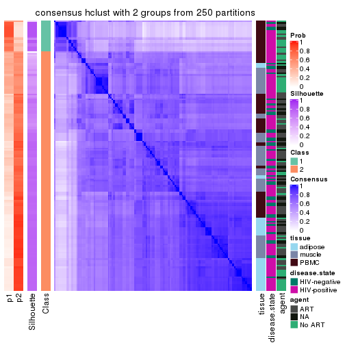</p>

</div>
<div id='tab-MAD-hclust-consensus-heatmap-2'>
<pre><code class="r">consensus_heatmap(res, k = 3)
</code></pre>

<p>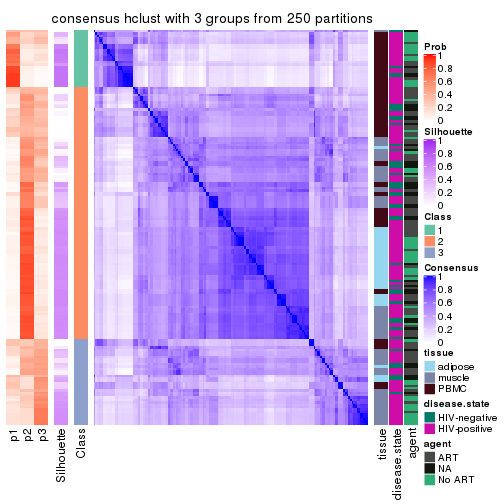</p>

</div>
<div id='tab-MAD-hclust-consensus-heatmap-3'>
<pre><code class="r">consensus_heatmap(res, k = 4)
</code></pre>

<p>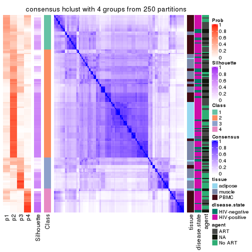</p>

</div>
<div id='tab-MAD-hclust-consensus-heatmap-4'>
<pre><code class="r">consensus_heatmap(res, k = 5)
</code></pre>

<p>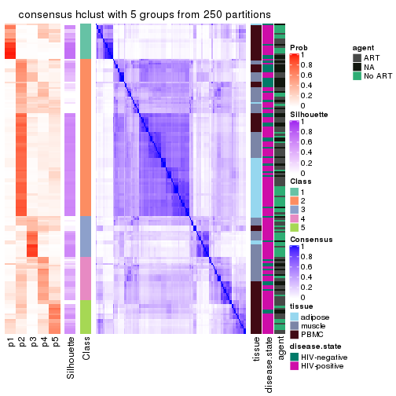</p>

</div>
<div id='tab-MAD-hclust-consensus-heatmap-5'>
<pre><code class="r">consensus_heatmap(res, k = 6)
</code></pre>

<p>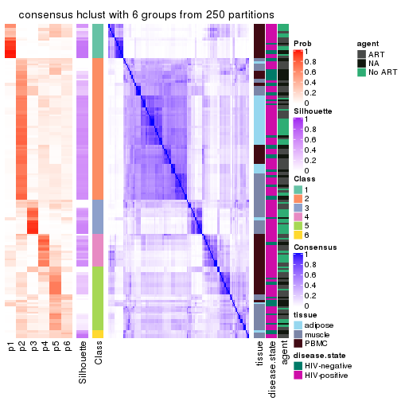</p>

</div>
</div>

Heatmaps for the membership of samples in all partitions to see how consistent they are:


<script>
$( function() {
	$( '#tabs-MAD-hclust-membership-heatmap' ).tabs();
} );
</script>
<div id='tabs-MAD-hclust-membership-heatmap'>
<ul>
<li><a href='#tab-MAD-hclust-membership-heatmap-1'>k = 2</a></li>
<li><a href='#tab-MAD-hclust-membership-heatmap-2'>k = 3</a></li>
<li><a href='#tab-MAD-hclust-membership-heatmap-3'>k = 4</a></li>
<li><a href='#tab-MAD-hclust-membership-heatmap-4'>k = 5</a></li>
<li><a href='#tab-MAD-hclust-membership-heatmap-5'>k = 6</a></li>
</ul>
<div id='tab-MAD-hclust-membership-heatmap-1'>
<pre><code class="r">membership_heatmap(res, k = 2)
</code></pre>

<p>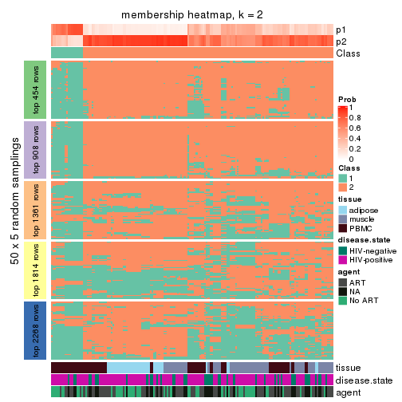</p>

</div>
<div id='tab-MAD-hclust-membership-heatmap-2'>
<pre><code class="r">membership_heatmap(res, k = 3)
</code></pre>

<p>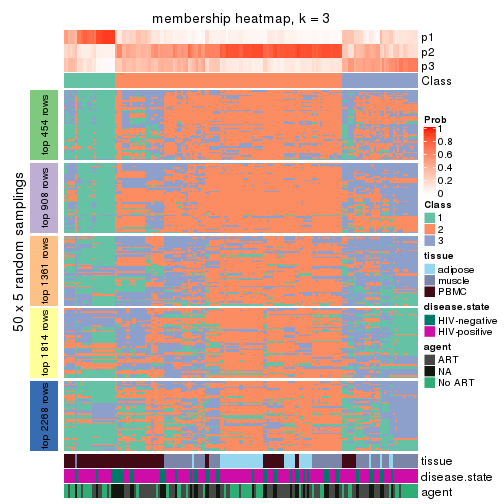</p>

</div>
<div id='tab-MAD-hclust-membership-heatmap-3'>
<pre><code class="r">membership_heatmap(res, k = 4)
</code></pre>

<p>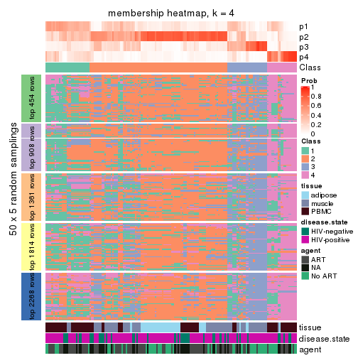</p>

</div>
<div id='tab-MAD-hclust-membership-heatmap-4'>
<pre><code class="r">membership_heatmap(res, k = 5)
</code></pre>

<p>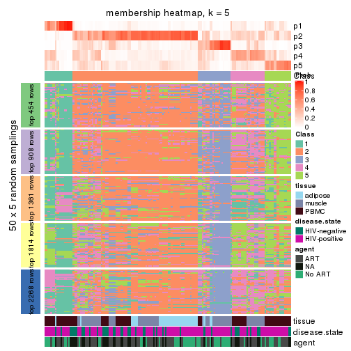</p>

</div>
<div id='tab-MAD-hclust-membership-heatmap-5'>
<pre><code class="r">membership_heatmap(res, k = 6)
</code></pre>

<p>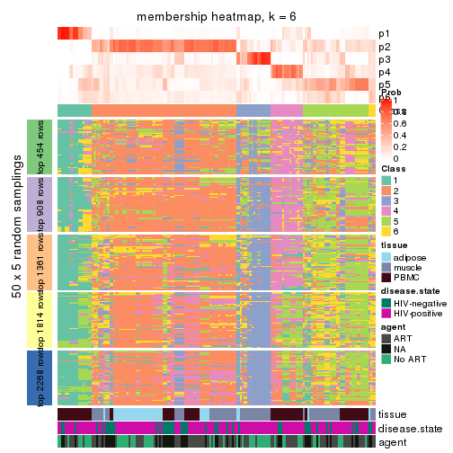</p>

</div>
</div>

As soon as we have had the classes for columns, we can look for signatures
which are significantly different between classes which can be candidate marks
for certain classes. Following are the heatmaps for signatures.


Signature heatmaps where rows are scaled:


<script>
$( function() {
	$( '#tabs-MAD-hclust-get-signatures' ).tabs();
} );
</script>
<div id='tabs-MAD-hclust-get-signatures'>
<ul>
<li><a href='#tab-MAD-hclust-get-signatures-1'>k = 2</a></li>
<li><a href='#tab-MAD-hclust-get-signatures-2'>k = 3</a></li>
<li><a href='#tab-MAD-hclust-get-signatures-3'>k = 4</a></li>
<li><a href='#tab-MAD-hclust-get-signatures-4'>k = 5</a></li>
<li><a href='#tab-MAD-hclust-get-signatures-5'>k = 6</a></li>
</ul>
<div id='tab-MAD-hclust-get-signatures-1'>
<pre><code class="r">get_signatures(res, k = 2)
</code></pre>

<p>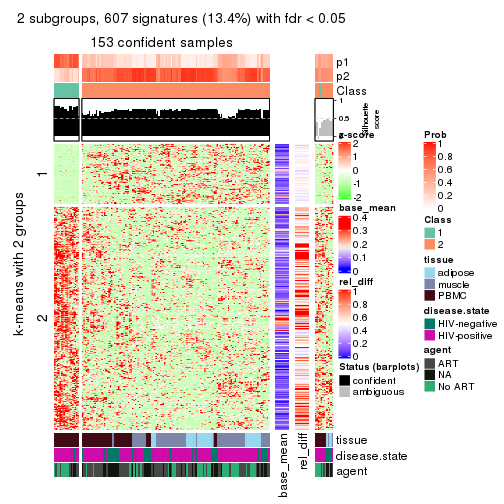</p>

</div>
<div id='tab-MAD-hclust-get-signatures-2'>
<pre><code class="r">get_signatures(res, k = 3)
</code></pre>

<p>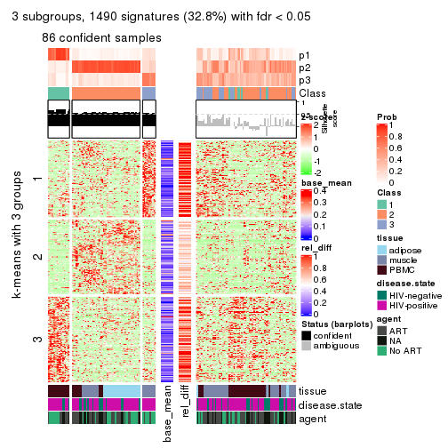</p>

</div>
<div id='tab-MAD-hclust-get-signatures-3'>
<pre><code class="r">get_signatures(res, k = 4)
</code></pre>

<p>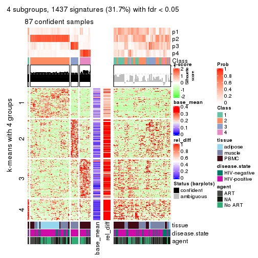</p>

</div>
<div id='tab-MAD-hclust-get-signatures-4'>
<pre><code class="r">get_signatures(res, k = 5)
</code></pre>

<p>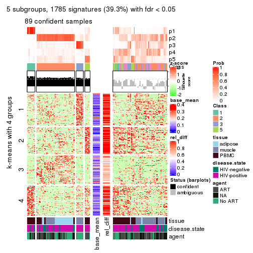</p>

</div>
<div id='tab-MAD-hclust-get-signatures-5'>
<pre><code class="r">get_signatures(res, k = 6)
</code></pre>

<p>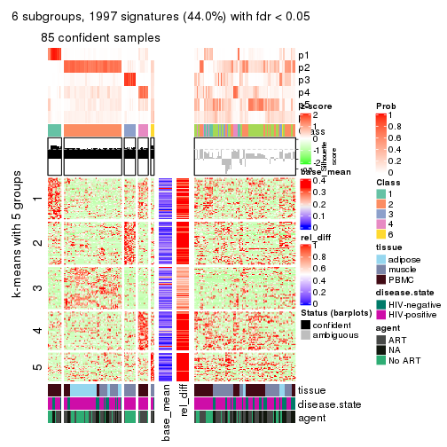</p>

</div>
</div>


Signature heatmaps where rows are not scaled:


<script>
$( function() {
	$( '#tabs-MAD-hclust-get-signatures-no-scale' ).tabs();
} );
</script>
<div id='tabs-MAD-hclust-get-signatures-no-scale'>
<ul>
<li><a href='#tab-MAD-hclust-get-signatures-no-scale-1'>k = 2</a></li>
<li><a href='#tab-MAD-hclust-get-signatures-no-scale-2'>k = 3</a></li>
<li><a href='#tab-MAD-hclust-get-signatures-no-scale-3'>k = 4</a></li>
<li><a href='#tab-MAD-hclust-get-signatures-no-scale-4'>k = 5</a></li>
<li><a href='#tab-MAD-hclust-get-signatures-no-scale-5'>k = 6</a></li>
</ul>
<div id='tab-MAD-hclust-get-signatures-no-scale-1'>
<pre><code class="r">get_signatures(res, k = 2, scale_rows = FALSE)
</code></pre>

<p>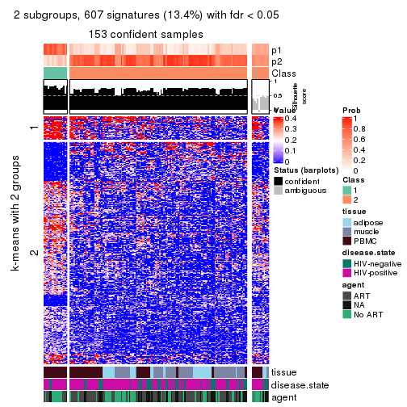</p>

</div>
<div id='tab-MAD-hclust-get-signatures-no-scale-2'>
<pre><code class="r">get_signatures(res, k = 3, scale_rows = FALSE)
</code></pre>

<p>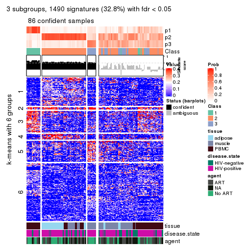</p>

</div>
<div id='tab-MAD-hclust-get-signatures-no-scale-3'>
<pre><code class="r">get_signatures(res, k = 4, scale_rows = FALSE)
</code></pre>

<p>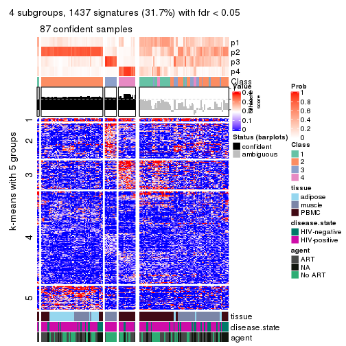</p>

</div>
<div id='tab-MAD-hclust-get-signatures-no-scale-4'>
<pre><code class="r">get_signatures(res, k = 5, scale_rows = FALSE)
</code></pre>

<p>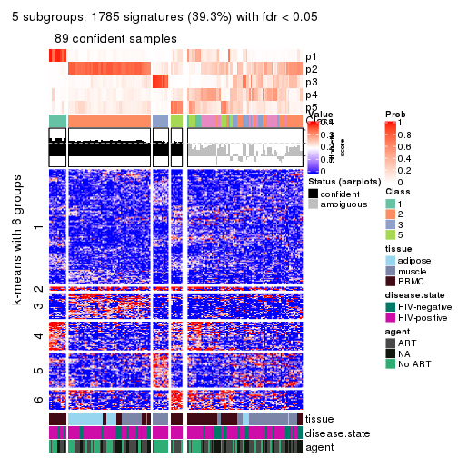</p>

</div>
<div id='tab-MAD-hclust-get-signatures-no-scale-5'>
<pre><code class="r">get_signatures(res, k = 6, scale_rows = FALSE)
</code></pre>

<p>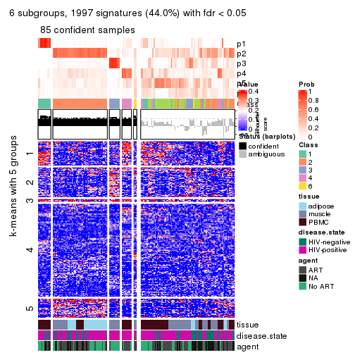</p>

</div>
</div>


Compare the overlap of signatures from different k:

```r
compare_signatures(res)
```

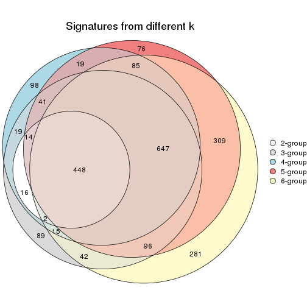

`get_signature()` returns a data frame invisibly. TO get the list of signatures, the function
call should be assigned to a variable explicitly. In following code, if `plot` argument is set
to `FALSE`, no heatmap is plotted while only the differential analysis is performed.

```r
# code only for demonstration
tb = get_signature(res, k = ..., plot = FALSE)
```

An example of the output of `tb` is:

```
#>   which_row         fdr    mean_1    mean_2 scaled_mean_1 scaled_mean_2 km
#> 1        38 0.042760348  8.373488  9.131774    -0.5533452     0.5164555  1
#> 2        40 0.018707592  7.106213  8.469186    -0.6173731     0.5762149  1
#> 3        55 0.019134737 10.221463 11.207825    -0.6159697     0.5749050  1
#> 4        59 0.006059896  5.921854  7.869574    -0.6899429     0.6439467  1
#> 5        60 0.018055526  8.928898 10.211722    -0.6204761     0.5791110  1
#> 6        98 0.009384629 15.714769 14.887706     0.6635654    -0.6193277  2
...
```

The columns in `tb` are:

1. `which_row`: row indices corresponding to the input matrix.
2. `fdr`: FDR for the differential test. 
3. `mean_x`: The mean value in group x.
4. `scaled_mean_x`: The mean value in group x after rows are scaled.
5. `km`: Row groups if k-means clustering is applied to rows.


UMAP plot which shows how samples are separated.


<script>
$( function() {
	$( '#tabs-MAD-hclust-dimension-reduction' ).tabs();
} );
</script>
<div id='tabs-MAD-hclust-dimension-reduction'>
<ul>
<li><a href='#tab-MAD-hclust-dimension-reduction-1'>k = 2</a></li>
<li><a href='#tab-MAD-hclust-dimension-reduction-2'>k = 3</a></li>
<li><a href='#tab-MAD-hclust-dimension-reduction-3'>k = 4</a></li>
<li><a href='#tab-MAD-hclust-dimension-reduction-4'>k = 5</a></li>
<li><a href='#tab-MAD-hclust-dimension-reduction-5'>k = 6</a></li>
</ul>
<div id='tab-MAD-hclust-dimension-reduction-1'>
<pre><code class="r">dimension_reduction(res, k = 2, method = &quot;UMAP&quot;)
</code></pre>

<p>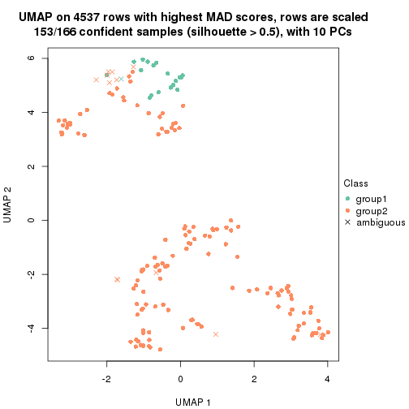</p>

</div>
<div id='tab-MAD-hclust-dimension-reduction-2'>
<pre><code class="r">dimension_reduction(res, k = 3, method = &quot;UMAP&quot;)
</code></pre>

<p>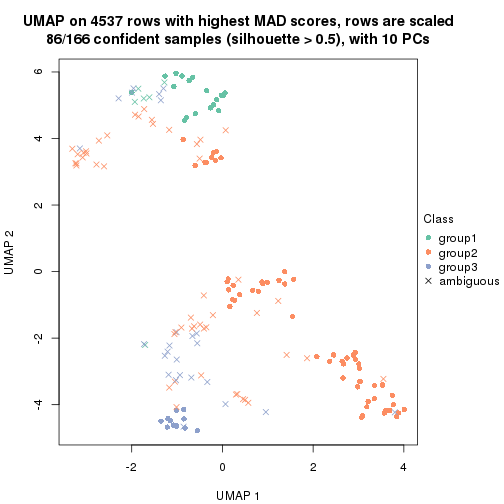</p>

</div>
<div id='tab-MAD-hclust-dimension-reduction-3'>
<pre><code class="r">dimension_reduction(res, k = 4, method = &quot;UMAP&quot;)
</code></pre>

<p>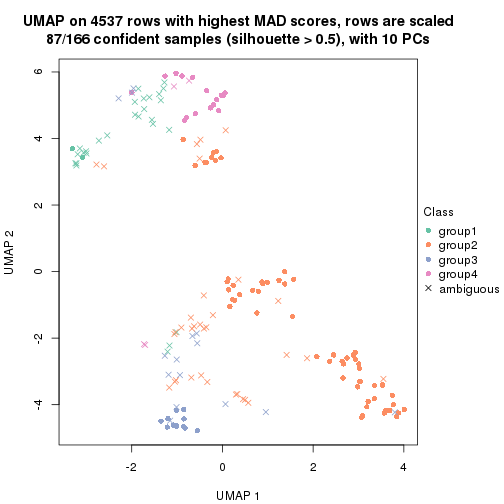</p>

</div>
<div id='tab-MAD-hclust-dimension-reduction-4'>
<pre><code class="r">dimension_reduction(res, k = 5, method = &quot;UMAP&quot;)
</code></pre>

<p>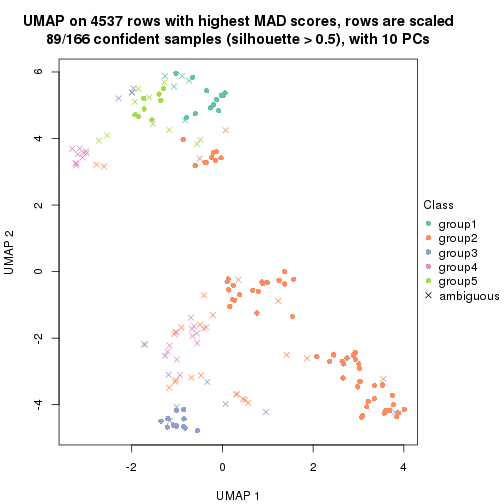</p>

</div>
<div id='tab-MAD-hclust-dimension-reduction-5'>
<pre><code class="r">dimension_reduction(res, k = 6, method = &quot;UMAP&quot;)
</code></pre>

<p>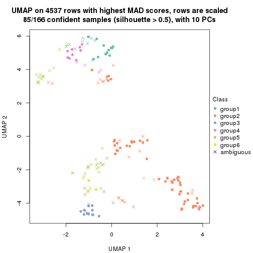</p>

</div>
</div>


Following heatmap shows how subgroups are split when increasing `k`:

```r
collect_classes(res)
```

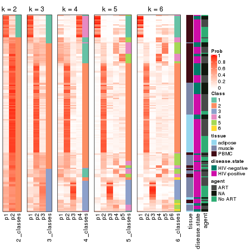


Test correlation between subgroups and known annotations. If the known
annotation is numeric, one-way ANOVA test is applied, and if the known
annotation is discrete, chi-squared contingency table test is applied.

```r
test_to_known_factors(res)
```

```
#>              n tissue(p) disease.state(p) agent(p) k
#> MAD:hclust 153  8.76e-08            0.573  0.10539 2
#> MAD:hclust  86  3.22e-14            0.162  0.02139 3
#> MAD:hclust  87  7.59e-13            0.224  0.01078 4
#> MAD:hclust  89  1.56e-13            0.127  0.00335 5
#> MAD:hclust  85  5.53e-15            0.210  0.01231 6
```


If matrix rows can be associated to genes, consider to use `GO_Enrichment(res,
...)` to perform function enrichment for the signature genes.


 

---------------------------------------------------


### MAD:kmeans**


The object with results only for a single top-value method and a single partition method 
can be extracted as:

```r
res = res_list["MAD", "kmeans"]
# you can also extract it by
# res = res_list["MAD:kmeans"]
```

A summary of `res` and all the functions that can be applied to it:

```r
res
```

```
#> A 'ConsensusPartition' object with k = 2, 3, 4, 5, 6.
#>   On a matrix with 4537 rows and 166 columns.
#>   Top rows (454, 908, 1361, 1814, 2268) are extracted by 'MAD' method.
#>   Subgroups are detected by 'kmeans' method.
#>   Performed in total 1250 partitions by row resampling.
#>   Best k for subgroups seems to be 2.
#> 
#> Following methods can be applied to this 'ConsensusPartition' object:
#>  [1] "cola_report"             "collect_classes"         "collect_plots"          
#>  [4] "collect_stats"           "colnames"                "compare_signatures"     
#>  [7] "consensus_heatmap"       "dimension_reduction"     "functional_enrichment"  
#> [10] "get_anno_col"            "get_anno"                "get_classes"            
#> [13] "get_consensus"           "get_matrix"              "get_membership"         
#> [16] "get_param"               "get_signatures"          "get_stats"              
#> [19] "is_best_k"               "is_stable_k"             "membership_heatmap"     
#> [22] "ncol"                    "nrow"                    "plot_ecdf"              
#> [25] "rownames"                "select_partition_number" "show"                   
#> [28] "suggest_best_k"          "test_to_known_factors"
```

`collect_plots()` function collects all the plots made from `res` for all `k` (number of partitions)
into one single page to provide an easy and fast comparison between different `k`.

```r
collect_plots(res)
```

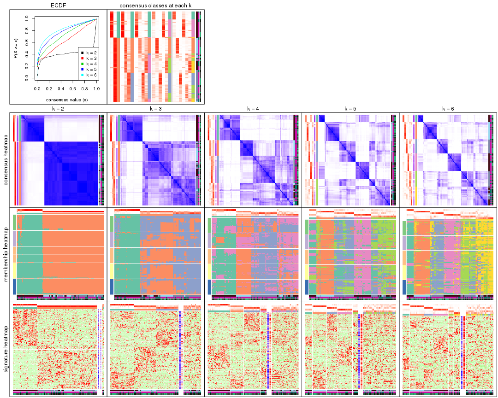

The plots are:

- The first row: a plot of the ECDF (Empirical cumulative distribution
  function) curves of the consensus matrix for each `k` and the heatmap of
  predicted classes for each `k`.
- The second row: heatmaps of the consensus matrix for each `k`.
- The third row: heatmaps of the membership matrix for each `k`.
- The fouth row: heatmaps of the signatures for each `k`.

All the plots in panels can be made by individual functions and they are
plotted later in this section.

`select_partition_number()` produces several plots showing different
statistics for choosing "optimized" `k`. There are following statistics:

- ECDF curves of the consensus matrix for each `k`;
- 1-PAC. [The PAC
  score](https://en.wikipedia.org/wiki/Consensus_clustering#Over-interpretation_potential_of_consensus_clustering)
  measures the proportion of the ambiguous subgrouping.
- Mean silhouette score.
- Concordance. The mean probability of fiting the consensus class ids in all
  partitions.
- Area increased. Denote $A_k$ as the area under the ECDF curve for current
  `k`, the area increased is defined as $A_k - A_{k-1}$.
- Rand index. The percent of pairs of samples that are both in a same cluster
  or both are not in a same cluster in the partition of k and k-1.
- Jaccard index. The ratio of pairs of samples are both in a same cluster in
  the partition of k and k-1 and the pairs of samples are both in a same
  cluster in the partition k or k-1.

The detailed explanations of these statistics can be found in [the cola
vignette](http://bioconductor.org/packages/devel/bioc/vignettes/cola/inst/doc/cola.html#toc_13).

Generally speaking, lower PAC score, higher mean silhouette score or higher
concordance corresponds to better partition. Rand index and Jaccard index
measure how similar the current partition is compared to partition with `k-1`.
If they are too similar, we won't accept `k` is better than `k-1`.

```r
select_partition_number(res)
```

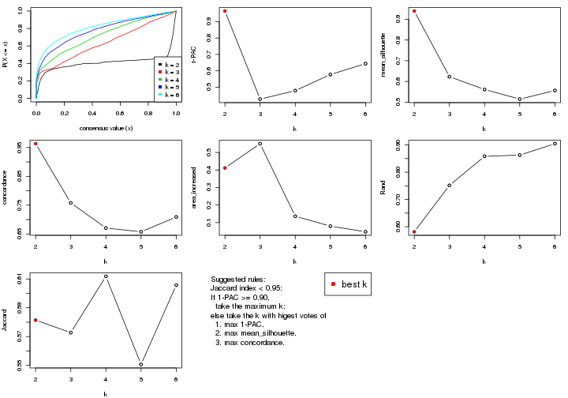

The numeric values for all these statistics can be obtained by `get_stats()`.

```r
get_stats(res)
```

```
#>   k 1-PAC mean_silhouette concordance area_increased  Rand Jaccard
#> 2 2 0.964           0.940       0.963         0.4117 0.581   0.581
#> 3 3 0.427           0.623       0.758         0.5500 0.752   0.573
#> 4 4 0.479           0.561       0.671         0.1364 0.858   0.612
#> 5 5 0.577           0.515       0.658         0.0797 0.863   0.551
#> 6 6 0.644           0.556       0.709         0.0477 0.905   0.606
```

`suggest_best_k()` suggests the best $k$ based on these statistics. The rules are as follows:

- All $k$ with Jaccard index larger than 0.95 are removed because the increase of
  the partition number does not provides enough extra information. If all $k$ are removed,
  the best $k$ is assigned by `NA`.
- For $k$ with 1-PAC larger than 0.9, the maximal $k$ is taken as the "best k". Other $k$ is called "optional k".
- If it does not fit the second rule. The $k$ with the highest vote of highest
  1-PAC, mean silhouette and concordance is taken as the "best k".

```r
suggest_best_k(res)
```

```
#> [1] 2
```


Following shows the table of the partitions (You need to click the **show/hide
code output** link to see it). The membership matrix (columns with name `p*`)
is inferred by
[`clue::cl_consensus()`](https://www.rdocumentation.org/link/cl_consensus?package=clue)
function with the `SE` method. Basically the value in the membership matrix
represents the probability to belong to a certain group. The finall class
label for an item is determined with the group with highest probability it
belongs to.

In `get_classes()` function, the entropy is calculated from the membership
matrix and the silhouette score is calculated from the consensus matrix.


<script>
$( function() {
	$( '#tabs-MAD-kmeans-get-classes' ).tabs();
} );
</script>
<div id='tabs-MAD-kmeans-get-classes'>
<ul>
<li><a href='#tab-MAD-kmeans-get-classes-1'>k = 2</a></li>
<li><a href='#tab-MAD-kmeans-get-classes-2'>k = 3</a></li>
<li><a href='#tab-MAD-kmeans-get-classes-3'>k = 4</a></li>
<li><a href='#tab-MAD-kmeans-get-classes-4'>k = 5</a></li>
<li><a href='#tab-MAD-kmeans-get-classes-5'>k = 6</a></li>
</ul>

<div id='tab-MAD-kmeans-get-classes-1'>
<p><a id='tab-MAD-kmeans-get-classes-1-a' style='color:#0366d6' href='#'>show/hide code output</a></p>
<pre><code class="r">cbind(get_classes(res, k = 2), get_membership(res, k = 2))
</code></pre>

<pre><code>#&gt;           class entropy silhouette    p1    p2
#&gt; GSM751298     1  0.1184      0.932 0.984 0.016
#&gt; GSM751304     2  0.1184      0.978 0.016 0.984
#&gt; GSM751305     2  0.1184      0.977 0.016 0.984
#&gt; GSM751307     2  0.2236      0.970 0.036 0.964
#&gt; GSM751310     1  0.8016      0.729 0.756 0.244
#&gt; GSM751314     1  0.2423      0.923 0.960 0.040
#&gt; GSM751316     1  0.9970      0.218 0.532 0.468
#&gt; GSM751318     1  0.8555      0.668 0.720 0.280
#&gt; GSM751342     1  0.9963      0.231 0.536 0.464
#&gt; GSM751346     1  0.1184      0.930 0.984 0.016
#&gt; GSM751347     1  0.4431      0.887 0.908 0.092
#&gt; GSM751348     2  0.1414      0.976 0.020 0.980
#&gt; GSM751349     2  0.0672      0.978 0.008 0.992
#&gt; GSM751352     2  0.2423      0.970 0.040 0.960
#&gt; GSM751353     2  0.0938      0.979 0.012 0.988
#&gt; GSM751354     2  0.0938      0.977 0.012 0.988
#&gt; GSM751355     2  0.0672      0.978 0.008 0.992
#&gt; GSM751358     2  0.0376      0.979 0.004 0.996
#&gt; GSM751359     2  0.0672      0.978 0.008 0.992
#&gt; GSM751294     2  0.0938      0.977 0.012 0.988
#&gt; GSM751296     1  0.1184      0.930 0.984 0.016
#&gt; GSM751297     1  0.4431      0.894 0.908 0.092
#&gt; GSM751299     2  0.2423      0.967 0.040 0.960
#&gt; GSM751300     1  0.1184      0.930 0.984 0.016
#&gt; GSM751301     1  0.0938      0.932 0.988 0.012
#&gt; GSM751302     1  0.1184      0.930 0.984 0.016
#&gt; GSM751303     1  0.8267      0.705 0.740 0.260
#&gt; GSM751306     1  0.7056      0.797 0.808 0.192
#&gt; GSM751308     2  0.9661      0.331 0.392 0.608
#&gt; GSM751309     1  0.6438      0.828 0.836 0.164
#&gt; GSM751311     1  0.0938      0.932 0.988 0.012
#&gt; GSM751312     1  0.4022      0.900 0.920 0.080
#&gt; GSM751313     1  0.0376      0.932 0.996 0.004
#&gt; GSM751315     1  0.0938      0.932 0.988 0.012
#&gt; GSM751317     1  0.5737      0.856 0.864 0.136
#&gt; GSM751320     1  0.0376      0.933 0.996 0.004
#&gt; GSM751321     1  0.0938      0.932 0.988 0.012
#&gt; GSM751322     1  0.0938      0.932 0.988 0.012
#&gt; GSM751324     1  0.0938      0.932 0.988 0.012
#&gt; GSM751325     1  0.0938      0.932 0.988 0.012
#&gt; GSM751332     1  0.0938      0.932 0.988 0.012
#&gt; GSM751334     1  0.0938      0.932 0.988 0.012
#&gt; GSM751339     1  0.4815      0.879 0.896 0.104
#&gt; GSM751341     1  0.2778      0.919 0.952 0.048
#&gt; GSM751343     1  0.0376      0.933 0.996 0.004
#&gt; GSM751344     2  0.2236      0.972 0.036 0.964
#&gt; GSM751345     2  0.2236      0.972 0.036 0.964
#&gt; GSM751356     2  0.1184      0.978 0.016 0.984
#&gt; GSM751357     2  0.1184      0.978 0.016 0.984
#&gt; GSM751293     1  0.0938      0.932 0.988 0.012
#&gt; GSM751295     1  0.1184      0.930 0.984 0.016
#&gt; GSM751319     1  0.0938      0.932 0.988 0.012
#&gt; GSM751323     1  0.0376      0.933 0.996 0.004
#&gt; GSM751326     1  0.0000      0.933 1.000 0.000
#&gt; GSM751327     1  0.0376      0.933 0.996 0.004
#&gt; GSM751328     1  0.0938      0.932 0.988 0.012
#&gt; GSM751329     1  0.0938      0.932 0.988 0.012
#&gt; GSM751330     1  0.0376      0.933 0.996 0.004
#&gt; GSM751331     1  0.0000      0.933 1.000 0.000
#&gt; GSM751333     1  0.0000      0.933 1.000 0.000
#&gt; GSM751335     1  0.0376      0.933 0.996 0.004
#&gt; GSM751336     1  0.0672      0.931 0.992 0.008
#&gt; GSM751337     1  0.0672      0.931 0.992 0.008
#&gt; GSM751338     1  0.0376      0.932 0.996 0.004
#&gt; GSM751340     1  0.9000      0.597 0.684 0.316
#&gt; GSM751350     1  0.1184      0.930 0.984 0.016
#&gt; GSM751351     1  0.1184      0.930 0.984 0.016
#&gt; GSM751362     2  0.1184      0.978 0.016 0.984
#&gt; GSM751363     2  0.1184      0.977 0.016 0.984
#&gt; GSM751367     2  0.3274      0.947 0.060 0.940
#&gt; GSM751368     2  0.1184      0.977 0.016 0.984
#&gt; GSM751371     2  0.1184      0.977 0.016 0.984
#&gt; GSM751375     2  0.0672      0.978 0.008 0.992
#&gt; GSM751376     2  0.0938      0.977 0.012 0.988
#&gt; GSM751378     2  0.0376      0.978 0.004 0.996
#&gt; GSM751379     2  0.0938      0.977 0.012 0.988
#&gt; GSM751382     2  0.0672      0.978 0.008 0.992
#&gt; GSM751386     2  0.0376      0.979 0.004 0.996
#&gt; GSM751388     2  0.0672      0.978 0.008 0.992
#&gt; GSM751391     2  0.0938      0.978 0.012 0.988
#&gt; GSM751410     2  0.0938      0.978 0.012 0.988
#&gt; GSM751414     2  0.1184      0.977 0.016 0.984
#&gt; GSM751361     2  0.1184      0.977 0.016 0.984
#&gt; GSM751365     2  0.0938      0.978 0.012 0.988
#&gt; GSM751366     2  0.0938      0.978 0.012 0.988
#&gt; GSM751369     2  0.0938      0.978 0.012 0.988
#&gt; GSM751370     2  0.0938      0.978 0.012 0.988
#&gt; GSM751372     2  0.0938      0.978 0.012 0.988
#&gt; GSM751373     2  0.2423      0.968 0.040 0.960
#&gt; GSM751374     2  0.0938      0.977 0.012 0.988
#&gt; GSM751377     2  0.0672      0.978 0.008 0.992
#&gt; GSM751380     2  0.0672      0.978 0.008 0.992
#&gt; GSM751381     2  0.0672      0.978 0.008 0.992
#&gt; GSM751383     2  0.2043      0.971 0.032 0.968
#&gt; GSM751384     2  0.0000      0.979 0.000 1.000
#&gt; GSM751385     2  0.0000      0.979 0.000 1.000
#&gt; GSM751387     2  0.0376      0.979 0.004 0.996
#&gt; GSM751389     2  0.0376      0.978 0.004 0.996
#&gt; GSM751393     2  0.0376      0.978 0.004 0.996
#&gt; GSM751394     2  0.0672      0.978 0.008 0.992
#&gt; GSM751395     2  0.0376      0.978 0.004 0.996
#&gt; GSM751397     2  0.0672      0.978 0.008 0.992
#&gt; GSM751398     2  0.0672      0.978 0.008 0.992
#&gt; GSM751404     2  0.0938      0.978 0.012 0.988
#&gt; GSM751406     2  0.0938      0.977 0.012 0.988
#&gt; GSM751411     2  0.0376      0.979 0.004 0.996
#&gt; GSM751413     2  0.1184      0.977 0.016 0.984
#&gt; GSM751415     2  0.0938      0.978 0.012 0.988
#&gt; GSM751416     2  0.1184      0.977 0.016 0.984
#&gt; GSM751417     2  0.1184      0.977 0.016 0.984
#&gt; GSM751421     2  0.1184      0.977 0.016 0.984
#&gt; GSM751422     2  0.1184      0.977 0.016 0.984
#&gt; GSM751360     2  0.1184      0.977 0.016 0.984
#&gt; GSM751364     2  0.1184      0.977 0.016 0.984
#&gt; GSM751390     2  0.0376      0.979 0.004 0.996
#&gt; GSM751392     2  0.0672      0.978 0.008 0.992
#&gt; GSM751396     2  0.1184      0.978 0.016 0.984
#&gt; GSM751399     2  0.0376      0.978 0.004 0.996
#&gt; GSM751400     2  0.2236      0.968 0.036 0.964
#&gt; GSM751401     2  0.2043      0.970 0.032 0.968
#&gt; GSM751402     2  0.2236      0.968 0.036 0.964
#&gt; GSM751403     2  0.1184      0.977 0.016 0.984
#&gt; GSM751405     2  0.0938      0.977 0.012 0.988
#&gt; GSM751407     2  0.2043      0.970 0.032 0.968
#&gt; GSM751408     2  0.1633      0.974 0.024 0.976
#&gt; GSM751409     2  0.0376      0.978 0.004 0.996
#&gt; GSM751412     2  0.0672      0.979 0.008 0.992
#&gt; GSM751418     2  0.2423      0.968 0.040 0.960
#&gt; GSM751419     2  0.2423      0.968 0.040 0.960
#&gt; GSM751420     2  0.0938      0.977 0.012 0.988
#&gt; GSM751425     2  0.0672      0.978 0.008 0.992
#&gt; GSM751429     2  0.1843      0.973 0.028 0.972
#&gt; GSM751430     2  0.0672      0.978 0.008 0.992
#&gt; GSM751433     2  0.2236      0.970 0.036 0.964
#&gt; GSM751437     2  0.0938      0.977 0.012 0.988
#&gt; GSM751448     2  0.0938      0.977 0.012 0.988
#&gt; GSM751451     2  0.2423      0.968 0.040 0.960
#&gt; GSM751423     2  0.0938      0.979 0.012 0.988
#&gt; GSM751424     2  0.2236      0.970 0.036 0.964
#&gt; GSM751428     2  0.2043      0.972 0.032 0.968
#&gt; GSM751431     2  0.1843      0.973 0.028 0.972
#&gt; GSM751432     2  0.2043      0.972 0.032 0.968
#&gt; GSM751434     2  0.2948      0.959 0.052 0.948
#&gt; GSM751435     2  0.3114      0.958 0.056 0.944
#&gt; GSM751436     2  0.2948      0.959 0.052 0.948
#&gt; GSM751440     2  0.2778      0.962 0.048 0.952
#&gt; GSM751444     2  0.2423      0.970 0.040 0.960
#&gt; GSM751446     2  0.2043      0.971 0.032 0.968
#&gt; GSM751449     2  0.0938      0.977 0.012 0.988
#&gt; GSM751450     2  0.1843      0.973 0.028 0.972
#&gt; GSM751452     2  0.2236      0.970 0.036 0.964
#&gt; GSM751426     2  0.2948      0.959 0.052 0.948
#&gt; GSM751427     2  0.1184      0.977 0.016 0.984
#&gt; GSM751438     2  0.0938      0.977 0.012 0.988
#&gt; GSM751439     2  0.2778      0.963 0.048 0.952
#&gt; GSM751441     2  0.0938      0.977 0.012 0.988
#&gt; GSM751442     2  0.3114      0.957 0.056 0.944
#&gt; GSM751443     2  0.0938      0.977 0.012 0.988
#&gt; GSM751445     2  0.0938      0.977 0.012 0.988
#&gt; GSM751447     2  0.0938      0.978 0.012 0.988
#&gt; GSM751453     2  0.3114      0.959 0.056 0.944
#&gt; GSM751454     2  0.3114      0.959 0.056 0.944
#&gt; GSM751455     2  0.3114      0.957 0.056 0.944
#&gt; GSM751456     2  0.3114      0.957 0.056 0.944
#&gt; GSM751457     2  0.0938      0.977 0.012 0.988
#&gt; GSM751458     2  0.0938      0.977 0.012 0.988
</code></pre>

<script>
$('#tab-MAD-kmeans-get-classes-1-a').parent().next().next().hide();
$('#tab-MAD-kmeans-get-classes-1-a').click(function(){
  $('#tab-MAD-kmeans-get-classes-1-a').parent().next().next().toggle();
  return(false);
});
</script>
</div>

<div id='tab-MAD-kmeans-get-classes-2'>
<p><a id='tab-MAD-kmeans-get-classes-2-a' style='color:#0366d6' href='#'>show/hide code output</a></p>
<pre><code class="r">cbind(get_classes(res, k = 3), get_membership(res, k = 3))
</code></pre>

<pre><code>#&gt;           class entropy silhouette    p1    p2    p3
#&gt; GSM751298     1  0.2050     0.8924 0.952 0.020 0.028
#&gt; GSM751304     2  0.6228     0.3213 0.012 0.672 0.316
#&gt; GSM751305     2  0.5775     0.4491 0.012 0.728 0.260
#&gt; GSM751307     2  0.4059     0.6388 0.012 0.860 0.128
#&gt; GSM751310     1  0.6025     0.7195 0.740 0.232 0.028
#&gt; GSM751314     1  0.2280     0.8809 0.940 0.052 0.008
#&gt; GSM751316     1  0.8425     0.3774 0.552 0.348 0.100
#&gt; GSM751318     1  0.7810     0.5745 0.640 0.268 0.092
#&gt; GSM751342     1  0.7184     0.2393 0.504 0.472 0.024
#&gt; GSM751346     1  0.2939     0.8842 0.916 0.012 0.072
#&gt; GSM751347     1  0.3973     0.8740 0.880 0.032 0.088
#&gt; GSM751348     2  0.4531     0.5872 0.008 0.824 0.168
#&gt; GSM751349     2  0.3116     0.6435 0.000 0.892 0.108
#&gt; GSM751352     2  0.4062     0.5972 0.000 0.836 0.164
#&gt; GSM751353     2  0.3412     0.6380 0.000 0.876 0.124
#&gt; GSM751354     2  0.5591     0.4216 0.000 0.696 0.304
#&gt; GSM751355     2  0.5178     0.4754 0.000 0.744 0.256
#&gt; GSM751358     2  0.5325     0.4957 0.004 0.748 0.248
#&gt; GSM751359     2  0.4291     0.5818 0.000 0.820 0.180
#&gt; GSM751294     2  0.5138     0.4895 0.000 0.748 0.252
#&gt; GSM751296     1  0.2173     0.8905 0.944 0.008 0.048
#&gt; GSM751297     1  0.6425     0.7952 0.764 0.140 0.096
#&gt; GSM751299     2  0.4399     0.5789 0.000 0.812 0.188
#&gt; GSM751300     1  0.2939     0.8842 0.916 0.012 0.072
#&gt; GSM751301     1  0.4291     0.8140 0.840 0.152 0.008
#&gt; GSM751302     1  0.2939     0.8842 0.916 0.012 0.072
#&gt; GSM751303     1  0.6490     0.6792 0.708 0.256 0.036
#&gt; GSM751306     1  0.5220     0.7614 0.780 0.208 0.012
#&gt; GSM751308     2  0.8688     0.3561 0.208 0.596 0.196
#&gt; GSM751309     1  0.4912     0.7767 0.796 0.196 0.008
#&gt; GSM751311     1  0.1525     0.8904 0.964 0.032 0.004
#&gt; GSM751312     1  0.6208     0.7604 0.752 0.200 0.048
#&gt; GSM751313     1  0.1643     0.8920 0.956 0.000 0.044
#&gt; GSM751315     1  0.0237     0.8957 0.996 0.004 0.000
#&gt; GSM751317     1  0.5020     0.7792 0.796 0.192 0.012
#&gt; GSM751320     1  0.0000     0.8957 1.000 0.000 0.000
#&gt; GSM751321     1  0.0237     0.8957 0.996 0.004 0.000
#&gt; GSM751322     1  0.0424     0.8954 0.992 0.008 0.000
#&gt; GSM751324     1  0.0829     0.8946 0.984 0.012 0.004
#&gt; GSM751325     1  0.0592     0.8949 0.988 0.012 0.000
#&gt; GSM751332     1  0.0592     0.8949 0.988 0.012 0.000
#&gt; GSM751334     1  0.0424     0.8954 0.992 0.008 0.000
#&gt; GSM751339     1  0.7085     0.6927 0.716 0.188 0.096
#&gt; GSM751341     1  0.2947     0.8829 0.920 0.060 0.020
#&gt; GSM751343     1  0.0592     0.8949 0.988 0.012 0.000
#&gt; GSM751344     2  0.3619     0.6109 0.000 0.864 0.136
#&gt; GSM751345     2  0.3619     0.6109 0.000 0.864 0.136
#&gt; GSM751356     2  0.5325     0.4883 0.004 0.748 0.248
#&gt; GSM751357     2  0.5325     0.4883 0.004 0.748 0.248
#&gt; GSM751293     1  0.4473     0.8013 0.828 0.164 0.008
#&gt; GSM751295     1  0.2939     0.8842 0.916 0.012 0.072
#&gt; GSM751319     1  0.0592     0.8953 0.988 0.012 0.000
#&gt; GSM751323     1  0.0000     0.8957 1.000 0.000 0.000
#&gt; GSM751326     1  0.0747     0.8952 0.984 0.000 0.016
#&gt; GSM751327     1  0.0000     0.8957 1.000 0.000 0.000
#&gt; GSM751328     1  0.0592     0.8949 0.988 0.012 0.000
#&gt; GSM751329     1  0.0661     0.8959 0.988 0.008 0.004
#&gt; GSM751330     1  0.2096     0.8903 0.944 0.004 0.052
#&gt; GSM751331     1  0.2550     0.8883 0.932 0.012 0.056
#&gt; GSM751333     1  0.1643     0.8920 0.956 0.000 0.044
#&gt; GSM751335     1  0.2096     0.8903 0.944 0.004 0.052
#&gt; GSM751336     1  0.2550     0.8883 0.932 0.012 0.056
#&gt; GSM751337     1  0.0237     0.8957 0.996 0.000 0.004
#&gt; GSM751338     1  0.0237     0.8957 0.996 0.000 0.004
#&gt; GSM751340     1  0.9446     0.2684 0.500 0.272 0.228
#&gt; GSM751350     1  0.2939     0.8842 0.916 0.012 0.072
#&gt; GSM751351     1  0.2939     0.8842 0.916 0.012 0.072
#&gt; GSM751362     3  0.5285     0.6829 0.004 0.244 0.752
#&gt; GSM751363     3  0.6696     0.6658 0.020 0.348 0.632
#&gt; GSM751367     3  0.8976     0.5424 0.152 0.316 0.532
#&gt; GSM751368     3  0.6260     0.1352 0.000 0.448 0.552
#&gt; GSM751371     3  0.7263     0.5851 0.036 0.372 0.592
#&gt; GSM751375     2  0.3412     0.6413 0.000 0.876 0.124
#&gt; GSM751376     2  0.6309    -0.2551 0.000 0.504 0.496
#&gt; GSM751378     3  0.6274     0.4034 0.000 0.456 0.544
#&gt; GSM751379     3  0.6267     0.3749 0.000 0.452 0.548
#&gt; GSM751382     2  0.3551     0.6374 0.000 0.868 0.132
#&gt; GSM751386     2  0.6204    -0.0380 0.000 0.576 0.424
#&gt; GSM751388     3  0.6260     0.0265 0.000 0.448 0.552
#&gt; GSM751391     2  0.6632     0.0867 0.012 0.596 0.392
#&gt; GSM751410     3  0.6387     0.6564 0.020 0.300 0.680
#&gt; GSM751414     3  0.6016     0.7115 0.020 0.256 0.724
#&gt; GSM751361     3  0.6735     0.5208 0.012 0.424 0.564
#&gt; GSM751365     3  0.4261     0.6571 0.012 0.140 0.848
#&gt; GSM751366     3  0.4418     0.7029 0.020 0.132 0.848
#&gt; GSM751369     3  0.5815     0.6473 0.004 0.304 0.692
#&gt; GSM751370     3  0.5977     0.7099 0.020 0.252 0.728
#&gt; GSM751372     3  0.5578     0.7071 0.012 0.240 0.748
#&gt; GSM751373     3  0.5036     0.6192 0.020 0.172 0.808
#&gt; GSM751374     3  0.6274     0.3652 0.000 0.456 0.544
#&gt; GSM751377     3  0.5835     0.6205 0.000 0.340 0.660
#&gt; GSM751380     3  0.4840     0.7177 0.016 0.168 0.816
#&gt; GSM751381     2  0.6192    -0.0218 0.000 0.580 0.420
#&gt; GSM751383     3  0.6180     0.1304 0.000 0.416 0.584
#&gt; GSM751384     3  0.5678     0.6852 0.000 0.316 0.684
#&gt; GSM751385     3  0.5835     0.6568 0.000 0.340 0.660
#&gt; GSM751387     3  0.6260     0.0258 0.000 0.448 0.552
#&gt; GSM751389     3  0.4654     0.7078 0.000 0.208 0.792
#&gt; GSM751393     3  0.5327     0.6866 0.000 0.272 0.728
#&gt; GSM751394     2  0.6215    -0.0536 0.000 0.572 0.428
#&gt; GSM751395     2  0.6305    -0.2509 0.000 0.516 0.484
#&gt; GSM751397     2  0.6286    -0.2647 0.000 0.536 0.464
#&gt; GSM751398     2  0.6225    -0.0679 0.000 0.568 0.432
#&gt; GSM751404     3  0.2448     0.6795 0.000 0.076 0.924
#&gt; GSM751406     3  0.5016     0.6895 0.000 0.240 0.760
#&gt; GSM751411     3  0.5016     0.7188 0.000 0.240 0.760
#&gt; GSM751413     3  0.6745     0.5625 0.012 0.428 0.560
#&gt; GSM751415     3  0.4452     0.7114 0.000 0.192 0.808
#&gt; GSM751416     3  0.5992     0.6909 0.016 0.268 0.716
#&gt; GSM751417     3  0.5992     0.6909 0.016 0.268 0.716
#&gt; GSM751421     3  0.6161     0.6879 0.020 0.272 0.708
#&gt; GSM751422     3  0.6229     0.6840 0.020 0.280 0.700
#&gt; GSM751360     3  0.6627     0.6682 0.020 0.336 0.644
#&gt; GSM751364     3  0.5803     0.6889 0.016 0.248 0.736
#&gt; GSM751390     3  0.5650     0.4238 0.000 0.312 0.688
#&gt; GSM751392     2  0.6154     0.0364 0.000 0.592 0.408
#&gt; GSM751396     2  0.6280     0.2660 0.000 0.540 0.460
#&gt; GSM751399     3  0.4235     0.7189 0.000 0.176 0.824
#&gt; GSM751400     3  0.2711     0.6748 0.000 0.088 0.912
#&gt; GSM751401     3  0.2448     0.6795 0.000 0.076 0.924
#&gt; GSM751402     3  0.2625     0.6797 0.000 0.084 0.916
#&gt; GSM751403     3  0.2959     0.6850 0.000 0.100 0.900
#&gt; GSM751405     3  0.5058     0.6886 0.000 0.244 0.756
#&gt; GSM751407     3  0.2448     0.6795 0.000 0.076 0.924
#&gt; GSM751408     3  0.2959     0.6722 0.000 0.100 0.900
#&gt; GSM751409     3  0.4452     0.7181 0.000 0.192 0.808
#&gt; GSM751412     3  0.3038     0.6703 0.000 0.104 0.896
#&gt; GSM751418     3  0.4953     0.6176 0.016 0.176 0.808
#&gt; GSM751419     3  0.4953     0.6176 0.016 0.176 0.808
#&gt; GSM751420     3  0.4399     0.6870 0.000 0.188 0.812
#&gt; GSM751425     2  0.2066     0.6584 0.000 0.940 0.060
#&gt; GSM751429     3  0.6307     0.3007 0.000 0.488 0.512
#&gt; GSM751430     2  0.5216     0.6463 0.000 0.740 0.260
#&gt; GSM751433     2  0.4605     0.6501 0.000 0.796 0.204
#&gt; GSM751437     3  0.6154     0.4694 0.000 0.408 0.592
#&gt; GSM751448     3  0.6111     0.4929 0.000 0.396 0.604
#&gt; GSM751451     2  0.4733     0.6426 0.004 0.800 0.196
#&gt; GSM751423     2  0.2261     0.6598 0.000 0.932 0.068
#&gt; GSM751424     2  0.4702     0.6513 0.000 0.788 0.212
#&gt; GSM751428     2  0.4974     0.6495 0.000 0.764 0.236
#&gt; GSM751431     2  0.4605     0.6501 0.000 0.796 0.204
#&gt; GSM751432     2  0.4842     0.6505 0.000 0.776 0.224
#&gt; GSM751434     2  0.4702     0.6513 0.000 0.788 0.212
#&gt; GSM751435     2  0.4931     0.6492 0.000 0.768 0.232
#&gt; GSM751436     2  0.4702     0.6513 0.000 0.788 0.212
#&gt; GSM751440     2  0.4887     0.6445 0.000 0.772 0.228
#&gt; GSM751444     2  0.4750     0.6560 0.000 0.784 0.216
#&gt; GSM751446     2  0.3816     0.6669 0.000 0.852 0.148
#&gt; GSM751449     2  0.3340     0.6629 0.000 0.880 0.120
#&gt; GSM751450     2  0.4654     0.6539 0.000 0.792 0.208
#&gt; GSM751452     2  0.4702     0.6513 0.000 0.788 0.212
#&gt; GSM751426     2  0.4702     0.6513 0.000 0.788 0.212
#&gt; GSM751427     2  0.4842     0.6570 0.000 0.776 0.224
#&gt; GSM751438     2  0.3551     0.6647 0.000 0.868 0.132
#&gt; GSM751439     2  0.5560     0.6197 0.000 0.700 0.300
#&gt; GSM751441     2  0.4974     0.6617 0.000 0.764 0.236
#&gt; GSM751442     2  0.5058     0.6486 0.000 0.756 0.244
#&gt; GSM751443     2  0.5882     0.3140 0.000 0.652 0.348
#&gt; GSM751445     2  0.2959     0.6524 0.000 0.900 0.100
#&gt; GSM751447     2  0.4605     0.6610 0.000 0.796 0.204
#&gt; GSM751453     2  0.4750     0.6535 0.000 0.784 0.216
#&gt; GSM751454     2  0.4750     0.6535 0.000 0.784 0.216
#&gt; GSM751455     2  0.5138     0.6503 0.000 0.748 0.252
#&gt; GSM751456     2  0.5138     0.6503 0.000 0.748 0.252
#&gt; GSM751457     2  0.4291     0.6058 0.000 0.820 0.180
#&gt; GSM751458     2  0.4291     0.6058 0.000 0.820 0.180
</code></pre>

<script>
$('#tab-MAD-kmeans-get-classes-2-a').parent().next().next().hide();
$('#tab-MAD-kmeans-get-classes-2-a').click(function(){
  $('#tab-MAD-kmeans-get-classes-2-a').parent().next().next().toggle();
  return(false);
});
</script>
</div>

<div id='tab-MAD-kmeans-get-classes-3'>
<p><a id='tab-MAD-kmeans-get-classes-3-a' style='color:#0366d6' href='#'>show/hide code output</a></p>
<pre><code class="r">cbind(get_classes(res, k = 4), get_membership(res, k = 4))
</code></pre>

<pre><code>#&gt;           class entropy silhouette    p1    p2    p3    p4
#&gt; GSM751298     1  0.3335    0.79741 0.860 0.120 0.000 0.020
#&gt; GSM751304     4  0.3707    0.57176 0.004 0.032 0.112 0.852
#&gt; GSM751305     4  0.4253    0.56172 0.004 0.044 0.132 0.820
#&gt; GSM751307     4  0.6567    0.46479 0.016 0.136 0.176 0.672
#&gt; GSM751310     1  0.6542    0.58521 0.668 0.020 0.100 0.212
#&gt; GSM751314     1  0.4080    0.75120 0.848 0.016 0.088 0.048
#&gt; GSM751316     4  0.7398    0.18374 0.336 0.020 0.112 0.532
#&gt; GSM751318     1  0.6700    0.53798 0.640 0.068 0.032 0.260
#&gt; GSM751342     1  0.6460    0.40024 0.580 0.048 0.016 0.356
#&gt; GSM751346     1  0.5658    0.72712 0.632 0.328 0.000 0.040
#&gt; GSM751347     1  0.6381    0.71252 0.604 0.328 0.012 0.056
#&gt; GSM751348     4  0.3846    0.53736 0.024 0.088 0.028 0.860
#&gt; GSM751349     4  0.5998    0.40692 0.000 0.200 0.116 0.684
#&gt; GSM751352     4  0.3108    0.50458 0.000 0.112 0.016 0.872
#&gt; GSM751353     4  0.4916    0.42734 0.000 0.184 0.056 0.760
#&gt; GSM751354     4  0.4462    0.54093 0.000 0.132 0.064 0.804
#&gt; GSM751355     4  0.5280    0.51136 0.000 0.124 0.124 0.752
#&gt; GSM751358     4  0.3508    0.56400 0.004 0.064 0.060 0.872
#&gt; GSM751359     4  0.5010    0.52119 0.000 0.120 0.108 0.772
#&gt; GSM751294     4  0.2936    0.56023 0.004 0.056 0.040 0.900
#&gt; GSM751296     1  0.4361    0.77751 0.772 0.208 0.000 0.020
#&gt; GSM751297     1  0.7866    0.60615 0.488 0.328 0.020 0.164
#&gt; GSM751299     4  0.4290    0.44561 0.000 0.212 0.016 0.772
#&gt; GSM751300     1  0.5658    0.72712 0.632 0.328 0.000 0.040
#&gt; GSM751301     1  0.4332    0.72526 0.800 0.040 0.000 0.160
#&gt; GSM751302     1  0.5658    0.72712 0.632 0.328 0.000 0.040
#&gt; GSM751303     1  0.6864    0.48406 0.600 0.016 0.092 0.292
#&gt; GSM751306     1  0.6429    0.59816 0.676 0.020 0.092 0.212
#&gt; GSM751308     4  0.6380    0.31429 0.300 0.064 0.012 0.624
#&gt; GSM751309     1  0.5515    0.66179 0.740 0.016 0.056 0.188
#&gt; GSM751311     1  0.3215    0.77459 0.888 0.016 0.020 0.076
#&gt; GSM751312     1  0.8919    0.47001 0.460 0.152 0.104 0.284
#&gt; GSM751313     1  0.4663    0.75884 0.716 0.272 0.000 0.012
#&gt; GSM751315     1  0.2231    0.80907 0.932 0.044 0.012 0.012
#&gt; GSM751317     1  0.6396    0.58854 0.668 0.016 0.088 0.228
#&gt; GSM751320     1  0.0564    0.80602 0.988 0.004 0.004 0.004
#&gt; GSM751321     1  0.2465    0.80809 0.924 0.044 0.020 0.012
#&gt; GSM751322     1  0.0992    0.80259 0.976 0.008 0.004 0.012
#&gt; GSM751324     1  0.1394    0.80089 0.964 0.008 0.012 0.016
#&gt; GSM751325     1  0.0859    0.80314 0.980 0.008 0.004 0.008
#&gt; GSM751332     1  0.0992    0.80346 0.976 0.008 0.012 0.004
#&gt; GSM751334     1  0.0712    0.80391 0.984 0.008 0.004 0.004
#&gt; GSM751339     1  0.7032    0.50289 0.576 0.048 0.048 0.328
#&gt; GSM751341     1  0.2207    0.80344 0.932 0.024 0.004 0.040
#&gt; GSM751343     1  0.1339    0.80102 0.964 0.008 0.004 0.024
#&gt; GSM751344     4  0.3495    0.49335 0.000 0.140 0.016 0.844
#&gt; GSM751345     4  0.3495    0.49335 0.000 0.140 0.016 0.844
#&gt; GSM751356     4  0.3001    0.55436 0.004 0.064 0.036 0.896
#&gt; GSM751357     4  0.3001    0.55436 0.004 0.064 0.036 0.896
#&gt; GSM751293     1  0.4332    0.72526 0.800 0.040 0.000 0.160
#&gt; GSM751295     1  0.5658    0.72712 0.632 0.328 0.000 0.040
#&gt; GSM751319     1  0.2529    0.80978 0.920 0.048 0.008 0.024
#&gt; GSM751323     1  0.0817    0.80765 0.976 0.024 0.000 0.000
#&gt; GSM751326     1  0.1940    0.80650 0.924 0.076 0.000 0.000
#&gt; GSM751327     1  0.0895    0.80759 0.976 0.020 0.000 0.004
#&gt; GSM751328     1  0.0712    0.80391 0.984 0.008 0.004 0.004
#&gt; GSM751329     1  0.0469    0.80545 0.988 0.012 0.000 0.000
#&gt; GSM751330     1  0.5108    0.74349 0.672 0.308 0.000 0.020
#&gt; GSM751331     1  0.5639    0.72888 0.636 0.324 0.000 0.040
#&gt; GSM751333     1  0.4284    0.77273 0.764 0.224 0.000 0.012
#&gt; GSM751335     1  0.5108    0.74349 0.672 0.308 0.000 0.020
#&gt; GSM751336     1  0.5432    0.73542 0.652 0.316 0.000 0.032
#&gt; GSM751337     1  0.1716    0.80734 0.936 0.064 0.000 0.000
#&gt; GSM751338     1  0.2179    0.80879 0.924 0.064 0.000 0.012
#&gt; GSM751340     4  0.8339    0.14405 0.288 0.048 0.172 0.492
#&gt; GSM751350     1  0.5658    0.72712 0.632 0.328 0.000 0.040
#&gt; GSM751351     1  0.5658    0.72712 0.632 0.328 0.000 0.040
#&gt; GSM751362     3  0.4964    0.56655 0.000 0.032 0.724 0.244
#&gt; GSM751363     3  0.5321    0.48166 0.000 0.032 0.672 0.296
#&gt; GSM751367     3  0.7516    0.36973 0.096 0.048 0.580 0.276
#&gt; GSM751368     3  0.6673    0.28609 0.000 0.140 0.608 0.252
#&gt; GSM751371     4  0.7073    0.11664 0.108 0.008 0.348 0.536
#&gt; GSM751375     4  0.6240    0.37564 0.000 0.200 0.136 0.664
#&gt; GSM751376     4  0.5489    0.38178 0.000 0.060 0.240 0.700
#&gt; GSM751378     4  0.5658    0.21932 0.000 0.040 0.328 0.632
#&gt; GSM751379     4  0.5861    0.27437 0.000 0.060 0.296 0.644
#&gt; GSM751382     4  0.6429    0.38383 0.000 0.192 0.160 0.648
#&gt; GSM751386     4  0.6970   -0.06091 0.000 0.112 0.444 0.444
#&gt; GSM751388     3  0.7133    0.15586 0.000 0.148 0.520 0.332
#&gt; GSM751391     4  0.4872    0.50231 0.004 0.032 0.212 0.752
#&gt; GSM751410     3  0.5353    0.31529 0.000 0.012 0.556 0.432
#&gt; GSM751414     3  0.3390    0.62889 0.000 0.016 0.852 0.132
#&gt; GSM751361     3  0.5681    0.29903 0.000 0.028 0.568 0.404
#&gt; GSM751365     3  0.2032    0.63195 0.000 0.036 0.936 0.028
#&gt; GSM751366     3  0.1820    0.64645 0.000 0.020 0.944 0.036
#&gt; GSM751369     3  0.5774    0.23675 0.000 0.028 0.508 0.464
#&gt; GSM751370     3  0.3224    0.63129 0.000 0.016 0.864 0.120
#&gt; GSM751372     3  0.2949    0.63977 0.000 0.024 0.888 0.088
#&gt; GSM751373     3  0.2565    0.62413 0.000 0.056 0.912 0.032
#&gt; GSM751374     4  0.5861    0.27437 0.000 0.060 0.296 0.644
#&gt; GSM751377     3  0.5759    0.50879 0.000 0.080 0.688 0.232
#&gt; GSM751380     3  0.3501    0.63267 0.000 0.020 0.848 0.132
#&gt; GSM751381     4  0.7003   -0.00521 0.000 0.116 0.424 0.460
#&gt; GSM751383     3  0.7300    0.19190 0.000 0.180 0.516 0.304
#&gt; GSM751384     3  0.5367    0.50494 0.000 0.032 0.664 0.304
#&gt; GSM751385     3  0.5771    0.28665 0.000 0.028 0.512 0.460
#&gt; GSM751387     3  0.7385    0.11417 0.000 0.176 0.484 0.340
#&gt; GSM751389     3  0.5256    0.56172 0.000 0.040 0.700 0.260
#&gt; GSM751393     3  0.5861    0.30408 0.000 0.032 0.492 0.476
#&gt; GSM751394     3  0.6969    0.04389 0.000 0.112 0.452 0.436
#&gt; GSM751395     4  0.4877    0.43954 0.000 0.044 0.204 0.752
#&gt; GSM751397     4  0.6844   -0.07932 0.000 0.100 0.444 0.456
#&gt; GSM751398     3  0.6969    0.03886 0.000 0.112 0.448 0.440
#&gt; GSM751404     3  0.4419    0.61985 0.000 0.084 0.812 0.104
#&gt; GSM751406     3  0.5574    0.53889 0.000 0.048 0.668 0.284
#&gt; GSM751411     3  0.3196    0.64202 0.000 0.008 0.856 0.136
#&gt; GSM751413     3  0.6189    0.28666 0.000 0.060 0.568 0.372
#&gt; GSM751415     3  0.4008    0.62951 0.000 0.032 0.820 0.148
#&gt; GSM751416     3  0.3694    0.62863 0.000 0.032 0.844 0.124
#&gt; GSM751417     3  0.3694    0.62863 0.000 0.032 0.844 0.124
#&gt; GSM751421     3  0.4372    0.54171 0.000 0.004 0.728 0.268
#&gt; GSM751422     3  0.4584    0.51001 0.000 0.004 0.696 0.300
#&gt; GSM751360     3  0.5313    0.40502 0.000 0.016 0.608 0.376
#&gt; GSM751364     3  0.3149    0.63813 0.000 0.032 0.880 0.088
#&gt; GSM751390     3  0.6874    0.29445 0.000 0.136 0.568 0.296
#&gt; GSM751392     4  0.7042    0.10412 0.000 0.124 0.388 0.488
#&gt; GSM751396     3  0.7731    0.01967 0.000 0.248 0.436 0.316
#&gt; GSM751399     3  0.4511    0.62334 0.000 0.040 0.784 0.176
#&gt; GSM751400     3  0.4784    0.60967 0.000 0.100 0.788 0.112
#&gt; GSM751401     3  0.4786    0.60976 0.000 0.104 0.788 0.108
#&gt; GSM751402     3  0.4718    0.61133 0.000 0.092 0.792 0.116
#&gt; GSM751403     3  0.4700    0.61299 0.000 0.084 0.792 0.124
#&gt; GSM751405     3  0.5442    0.53977 0.000 0.040 0.672 0.288
#&gt; GSM751407     3  0.4728    0.61154 0.000 0.104 0.792 0.104
#&gt; GSM751408     3  0.4168    0.62337 0.000 0.080 0.828 0.092
#&gt; GSM751409     3  0.4590    0.61619 0.000 0.036 0.772 0.192
#&gt; GSM751412     3  0.4235    0.62254 0.000 0.084 0.824 0.092
#&gt; GSM751418     3  0.2623    0.62262 0.000 0.064 0.908 0.028
#&gt; GSM751419     3  0.2623    0.62262 0.000 0.064 0.908 0.028
#&gt; GSM751420     3  0.5861    0.49380 0.000 0.060 0.644 0.296
#&gt; GSM751425     4  0.5784   -0.26477 0.000 0.412 0.032 0.556
#&gt; GSM751429     4  0.7458    0.25111 0.012 0.136 0.340 0.512
#&gt; GSM751430     4  0.7613   -0.52958 0.004 0.404 0.172 0.420
#&gt; GSM751433     2  0.6751    0.85877 0.004 0.588 0.108 0.300
#&gt; GSM751437     4  0.6495    0.11587 0.000 0.084 0.356 0.560
#&gt; GSM751448     4  0.6822   -0.07567 0.000 0.100 0.412 0.488
#&gt; GSM751451     2  0.7034    0.81544 0.008 0.548 0.108 0.336
#&gt; GSM751423     2  0.5861    0.47374 0.000 0.492 0.032 0.476
#&gt; GSM751424     2  0.6799    0.86023 0.004 0.584 0.112 0.300
#&gt; GSM751428     2  0.6167    0.87595 0.000 0.648 0.096 0.256
#&gt; GSM751431     2  0.6669    0.87131 0.004 0.604 0.108 0.284
#&gt; GSM751432     2  0.6799    0.86023 0.004 0.584 0.112 0.300
#&gt; GSM751434     2  0.6780    0.86118 0.004 0.588 0.112 0.296
#&gt; GSM751435     2  0.6221    0.87633 0.000 0.644 0.100 0.256
#&gt; GSM751436     2  0.6731    0.86135 0.004 0.592 0.108 0.296
#&gt; GSM751440     2  0.6370    0.87519 0.004 0.644 0.100 0.252
#&gt; GSM751444     2  0.6323    0.87324 0.000 0.628 0.100 0.272
#&gt; GSM751446     2  0.6310    0.73311 0.000 0.576 0.072 0.352
#&gt; GSM751449     2  0.6188    0.63906 0.000 0.548 0.056 0.396
#&gt; GSM751450     2  0.6476    0.87750 0.004 0.632 0.104 0.260
#&gt; GSM751452     2  0.6799    0.86023 0.004 0.584 0.112 0.300
#&gt; GSM751426     2  0.6552    0.87513 0.004 0.624 0.108 0.264
#&gt; GSM751427     2  0.6182    0.86883 0.000 0.636 0.088 0.276
#&gt; GSM751438     2  0.6223    0.68043 0.000 0.556 0.060 0.384
#&gt; GSM751439     2  0.6552    0.78722 0.000 0.628 0.144 0.228
#&gt; GSM751441     2  0.6430    0.86026 0.000 0.596 0.092 0.312
#&gt; GSM751442     2  0.6323    0.86283 0.000 0.628 0.100 0.272
#&gt; GSM751443     4  0.7456    0.25135 0.000 0.316 0.196 0.488
#&gt; GSM751445     2  0.5696    0.47790 0.000 0.496 0.024 0.480
#&gt; GSM751447     2  0.6415    0.87784 0.000 0.612 0.100 0.288
#&gt; GSM751453     2  0.6426    0.87921 0.000 0.620 0.108 0.272
#&gt; GSM751454     2  0.6426    0.87921 0.000 0.620 0.108 0.272
#&gt; GSM751455     2  0.6323    0.86283 0.000 0.628 0.100 0.272
#&gt; GSM751456     2  0.6323    0.86283 0.000 0.628 0.100 0.272
#&gt; GSM751457     4  0.5678    0.16135 0.000 0.316 0.044 0.640
#&gt; GSM751458     4  0.5678    0.16135 0.000 0.316 0.044 0.640
</code></pre>

<script>
$('#tab-MAD-kmeans-get-classes-3-a').parent().next().next().hide();
$('#tab-MAD-kmeans-get-classes-3-a').click(function(){
  $('#tab-MAD-kmeans-get-classes-3-a').parent().next().next().toggle();
  return(false);
});
</script>
</div>

<div id='tab-MAD-kmeans-get-classes-4'>
<p><a id='tab-MAD-kmeans-get-classes-4-a' style='color:#0366d6' href='#'>show/hide code output</a></p>
<pre><code class="r">cbind(get_classes(res, k = 5), get_membership(res, k = 5))
</code></pre>

<pre><code>#&gt;           class entropy silhouette    p1    p2    p3    p4    p5
#&gt; GSM751298     4  0.2798    0.58751 0.140 0.008 0.000 0.852 0.000
#&gt; GSM751304     5  0.4601    0.51704 0.084 0.080 0.032 0.008 0.796
#&gt; GSM751305     5  0.4470    0.51605 0.096 0.084 0.016 0.008 0.796
#&gt; GSM751307     5  0.7591    0.45029 0.200 0.196 0.052 0.024 0.528
#&gt; GSM751310     4  0.5937    0.56862 0.128 0.012 0.008 0.652 0.200
#&gt; GSM751314     4  0.3680    0.70790 0.088 0.020 0.000 0.840 0.052
#&gt; GSM751316     5  0.6664    0.27796 0.132 0.028 0.008 0.256 0.576
#&gt; GSM751318     4  0.5299    0.62682 0.052 0.060 0.000 0.724 0.164
#&gt; GSM751342     4  0.5338    0.60683 0.056 0.040 0.000 0.704 0.200
#&gt; GSM751346     1  0.4438    0.94232 0.608 0.004 0.000 0.384 0.004
#&gt; GSM751347     1  0.4790    0.89554 0.632 0.004 0.008 0.344 0.012
#&gt; GSM751348     5  0.5227    0.50164 0.032 0.136 0.012 0.072 0.748
#&gt; GSM751349     5  0.6311    0.46472 0.096 0.224 0.056 0.000 0.624
#&gt; GSM751352     5  0.4715    0.48144 0.048 0.168 0.016 0.008 0.760
#&gt; GSM751353     5  0.4943    0.47899 0.076 0.200 0.008 0.000 0.716
#&gt; GSM751354     5  0.5875    0.50948 0.128 0.148 0.044 0.000 0.680
#&gt; GSM751355     5  0.6269    0.50446 0.136 0.148 0.064 0.000 0.652
#&gt; GSM751358     5  0.4697    0.51659 0.028 0.124 0.036 0.024 0.788
#&gt; GSM751359     5  0.5041    0.52516 0.080 0.152 0.028 0.000 0.740
#&gt; GSM751294     5  0.4966    0.50892 0.040 0.124 0.048 0.016 0.772
#&gt; GSM751296     4  0.3949    0.01062 0.300 0.000 0.000 0.696 0.004
#&gt; GSM751297     1  0.5312    0.78602 0.644 0.004 0.004 0.288 0.060
#&gt; GSM751299     5  0.5152    0.46779 0.104 0.164 0.004 0.008 0.720
#&gt; GSM751300     1  0.4438    0.94232 0.608 0.004 0.000 0.384 0.004
#&gt; GSM751301     4  0.3898    0.67111 0.032 0.028 0.000 0.820 0.120
#&gt; GSM751302     1  0.4438    0.94232 0.608 0.004 0.000 0.384 0.004
#&gt; GSM751303     4  0.5950    0.57396 0.112 0.020 0.004 0.648 0.216
#&gt; GSM751306     4  0.5576    0.61509 0.112 0.020 0.004 0.696 0.168
#&gt; GSM751308     5  0.6910    0.00869 0.040 0.072 0.020 0.372 0.496
#&gt; GSM751309     4  0.4857    0.65689 0.088 0.020 0.000 0.752 0.140
#&gt; GSM751311     4  0.2949    0.73310 0.048 0.016 0.000 0.884 0.052
#&gt; GSM751312     5  0.7213   -0.09626 0.324 0.008 0.008 0.264 0.396
#&gt; GSM751313     1  0.4557    0.81615 0.516 0.000 0.000 0.476 0.008
#&gt; GSM751315     4  0.2871    0.70802 0.088 0.000 0.000 0.872 0.040
#&gt; GSM751317     4  0.5657    0.58348 0.116 0.012 0.000 0.656 0.216
#&gt; GSM751320     4  0.1041    0.72000 0.032 0.000 0.000 0.964 0.004
#&gt; GSM751321     4  0.2813    0.71130 0.084 0.000 0.000 0.876 0.040
#&gt; GSM751322     4  0.0613    0.74371 0.004 0.008 0.000 0.984 0.004
#&gt; GSM751324     4  0.1686    0.74521 0.028 0.020 0.000 0.944 0.008
#&gt; GSM751325     4  0.0854    0.73953 0.008 0.012 0.000 0.976 0.004
#&gt; GSM751332     4  0.1485    0.73670 0.032 0.020 0.000 0.948 0.000
#&gt; GSM751334     4  0.1153    0.72835 0.024 0.008 0.000 0.964 0.004
#&gt; GSM751339     4  0.7030    0.35494 0.128 0.000 0.052 0.492 0.328
#&gt; GSM751341     4  0.1960    0.73912 0.048 0.020 0.000 0.928 0.004
#&gt; GSM751343     4  0.0968    0.74543 0.004 0.012 0.000 0.972 0.012
#&gt; GSM751344     5  0.4557    0.48051 0.056 0.172 0.004 0.008 0.760
#&gt; GSM751345     5  0.4557    0.48051 0.056 0.172 0.004 0.008 0.760
#&gt; GSM751356     5  0.5078    0.50690 0.044 0.124 0.040 0.024 0.768
#&gt; GSM751357     5  0.5078    0.50690 0.044 0.124 0.040 0.024 0.768
#&gt; GSM751293     4  0.3946    0.67092 0.032 0.028 0.000 0.816 0.124
#&gt; GSM751295     1  0.4438    0.94232 0.608 0.004 0.000 0.384 0.004
#&gt; GSM751319     4  0.3215    0.69899 0.092 0.000 0.000 0.852 0.056
#&gt; GSM751323     4  0.1557    0.70132 0.052 0.000 0.000 0.940 0.008
#&gt; GSM751326     4  0.2612    0.59181 0.124 0.000 0.000 0.868 0.008
#&gt; GSM751327     4  0.1628    0.69755 0.056 0.000 0.000 0.936 0.008
#&gt; GSM751328     4  0.1012    0.73185 0.020 0.012 0.000 0.968 0.000
#&gt; GSM751329     4  0.1443    0.71194 0.044 0.004 0.000 0.948 0.004
#&gt; GSM751330     1  0.4446    0.92816 0.592 0.000 0.000 0.400 0.008
#&gt; GSM751331     1  0.4438    0.94044 0.608 0.004 0.000 0.384 0.004
#&gt; GSM751333     1  0.4561    0.79042 0.504 0.000 0.000 0.488 0.008
#&gt; GSM751335     1  0.4446    0.92816 0.592 0.000 0.000 0.400 0.008
#&gt; GSM751336     1  0.4564    0.93709 0.600 0.004 0.000 0.388 0.008
#&gt; GSM751337     4  0.2304    0.64204 0.100 0.000 0.000 0.892 0.008
#&gt; GSM751338     4  0.2570    0.68928 0.084 0.000 0.000 0.888 0.028
#&gt; GSM751340     5  0.7769    0.17096 0.156 0.012 0.088 0.248 0.496
#&gt; GSM751350     1  0.4438    0.94232 0.608 0.004 0.000 0.384 0.004
#&gt; GSM751351     1  0.4438    0.94232 0.608 0.004 0.000 0.384 0.004
#&gt; GSM751362     3  0.5694    0.41170 0.136 0.004 0.636 0.000 0.224
#&gt; GSM751363     5  0.7467   -0.19242 0.296 0.032 0.312 0.000 0.360
#&gt; GSM751367     3  0.8585    0.15350 0.232 0.040 0.344 0.068 0.316
#&gt; GSM751368     3  0.8251    0.23751 0.216 0.144 0.380 0.000 0.260
#&gt; GSM751371     5  0.7399    0.33583 0.132 0.024 0.152 0.104 0.588
#&gt; GSM751375     5  0.6813    0.44336 0.108 0.240 0.076 0.000 0.576
#&gt; GSM751376     5  0.6441    0.39470 0.064 0.080 0.260 0.000 0.596
#&gt; GSM751378     5  0.5616    0.33219 0.024 0.040 0.360 0.000 0.576
#&gt; GSM751379     5  0.6645    0.35317 0.072 0.076 0.292 0.000 0.560
#&gt; GSM751382     5  0.7132    0.43544 0.108 0.240 0.104 0.000 0.548
#&gt; GSM751386     5  0.7996    0.09508 0.188 0.116 0.284 0.000 0.412
#&gt; GSM751388     5  0.8140   -0.01224 0.176 0.136 0.324 0.000 0.364
#&gt; GSM751391     5  0.6228    0.47256 0.092 0.064 0.136 0.020 0.688
#&gt; GSM751410     5  0.6833   -0.00401 0.160 0.020 0.376 0.000 0.444
#&gt; GSM751414     3  0.6701    0.48716 0.260 0.020 0.532 0.000 0.188
#&gt; GSM751361     5  0.7489   -0.12639 0.252 0.040 0.308 0.000 0.400
#&gt; GSM751365     3  0.6442    0.54362 0.196 0.052 0.620 0.000 0.132
#&gt; GSM751366     3  0.3559    0.60170 0.096 0.004 0.836 0.000 0.064
#&gt; GSM751369     5  0.6650    0.05013 0.120 0.024 0.420 0.000 0.436
#&gt; GSM751370     3  0.6765    0.49046 0.264 0.028 0.536 0.000 0.172
#&gt; GSM751372     3  0.6551    0.50732 0.260 0.024 0.560 0.000 0.156
#&gt; GSM751373     3  0.6414    0.55778 0.184 0.056 0.628 0.000 0.132
#&gt; GSM751374     5  0.6645    0.35317 0.072 0.076 0.292 0.000 0.560
#&gt; GSM751377     3  0.7730    0.24072 0.240 0.064 0.404 0.000 0.292
#&gt; GSM751380     3  0.3421    0.58002 0.080 0.000 0.840 0.000 0.080
#&gt; GSM751381     5  0.7945    0.12323 0.176 0.120 0.276 0.000 0.428
#&gt; GSM751383     3  0.8298    0.09311 0.176 0.168 0.348 0.000 0.308
#&gt; GSM751384     3  0.7467    0.11849 0.188 0.052 0.404 0.000 0.356
#&gt; GSM751385     5  0.6991    0.17886 0.168 0.040 0.276 0.000 0.516
#&gt; GSM751387     5  0.8312   -0.02008 0.172 0.176 0.304 0.000 0.348
#&gt; GSM751389     3  0.2920    0.51016 0.016 0.000 0.852 0.000 0.132
#&gt; GSM751393     5  0.6175    0.21120 0.100 0.012 0.376 0.000 0.512
#&gt; GSM751394     5  0.7978    0.06428 0.196 0.108 0.288 0.000 0.408
#&gt; GSM751395     5  0.5395    0.45839 0.040 0.052 0.216 0.000 0.692
#&gt; GSM751397     5  0.7790    0.11968 0.188 0.096 0.272 0.000 0.444
#&gt; GSM751398     5  0.8001    0.08075 0.200 0.112 0.276 0.000 0.412
#&gt; GSM751404     3  0.1934    0.60060 0.008 0.040 0.932 0.000 0.020
#&gt; GSM751406     3  0.3890    0.45547 0.036 0.004 0.792 0.000 0.168
#&gt; GSM751411     3  0.5693    0.54840 0.196 0.016 0.664 0.000 0.124
#&gt; GSM751413     5  0.7688   -0.04617 0.288 0.060 0.244 0.000 0.408
#&gt; GSM751415     3  0.1753    0.59939 0.032 0.000 0.936 0.000 0.032
#&gt; GSM751416     3  0.7123    0.45150 0.264 0.040 0.500 0.000 0.196
#&gt; GSM751417     3  0.7123    0.45150 0.264 0.040 0.500 0.000 0.196
#&gt; GSM751421     3  0.6848    0.25754 0.196 0.012 0.436 0.000 0.356
#&gt; GSM751422     3  0.6854    0.18496 0.192 0.012 0.408 0.000 0.388
#&gt; GSM751360     5  0.7568   -0.16628 0.264 0.028 0.300 0.008 0.400
#&gt; GSM751364     3  0.6905    0.48132 0.264 0.036 0.528 0.000 0.172
#&gt; GSM751390     3  0.7813    0.21123 0.140 0.128 0.444 0.000 0.288
#&gt; GSM751392     5  0.7725    0.23609 0.172 0.132 0.204 0.000 0.492
#&gt; GSM751396     2  0.8392   -0.25097 0.148 0.320 0.248 0.000 0.284
#&gt; GSM751399     3  0.1082    0.59958 0.008 0.000 0.964 0.000 0.028
#&gt; GSM751400     3  0.2032    0.59904 0.004 0.052 0.924 0.000 0.020
#&gt; GSM751401     3  0.2142    0.59581 0.004 0.048 0.920 0.000 0.028
#&gt; GSM751402     3  0.2283    0.59099 0.008 0.036 0.916 0.000 0.040
#&gt; GSM751403     3  0.2661    0.58021 0.008 0.044 0.896 0.000 0.052
#&gt; GSM751405     3  0.4426    0.42088 0.052 0.004 0.748 0.000 0.196
#&gt; GSM751407     3  0.1960    0.59848 0.004 0.048 0.928 0.000 0.020
#&gt; GSM751408     3  0.1960    0.60001 0.004 0.048 0.928 0.000 0.020
#&gt; GSM751409     3  0.1408    0.59759 0.008 0.000 0.948 0.000 0.044
#&gt; GSM751412     3  0.2011    0.60126 0.008 0.044 0.928 0.000 0.020
#&gt; GSM751418     3  0.6302    0.56104 0.156 0.064 0.648 0.000 0.132
#&gt; GSM751419     3  0.6302    0.56104 0.156 0.064 0.648 0.000 0.132
#&gt; GSM751420     3  0.4640    0.39899 0.032 0.024 0.740 0.000 0.204
#&gt; GSM751425     2  0.5014    0.23729 0.020 0.560 0.008 0.000 0.412
#&gt; GSM751429     5  0.8321    0.28027 0.136 0.132 0.288 0.020 0.424
#&gt; GSM751430     2  0.6902    0.23687 0.120 0.564 0.040 0.012 0.264
#&gt; GSM751433     2  0.3098    0.76447 0.028 0.884 0.008 0.024 0.056
#&gt; GSM751437     5  0.6703    0.20057 0.052 0.080 0.408 0.000 0.460
#&gt; GSM751448     3  0.6813    0.00897 0.072 0.076 0.508 0.000 0.344
#&gt; GSM751451     2  0.2816    0.77176 0.024 0.896 0.004 0.024 0.052
#&gt; GSM751423     2  0.4216    0.56484 0.008 0.720 0.012 0.000 0.260
#&gt; GSM751424     2  0.2822    0.76783 0.024 0.896 0.008 0.016 0.056
#&gt; GSM751428     2  0.1243    0.79229 0.008 0.960 0.004 0.000 0.028
#&gt; GSM751431     2  0.2243    0.78088 0.024 0.924 0.004 0.016 0.032
#&gt; GSM751432     2  0.2918    0.76593 0.028 0.892 0.012 0.012 0.056
#&gt; GSM751434     2  0.2909    0.76579 0.028 0.892 0.008 0.016 0.056
#&gt; GSM751435     2  0.0807    0.79090 0.000 0.976 0.012 0.000 0.012
#&gt; GSM751436     2  0.2919    0.76684 0.024 0.892 0.008 0.020 0.056
#&gt; GSM751440     2  0.1362    0.78896 0.012 0.960 0.016 0.008 0.004
#&gt; GSM751444     2  0.1978    0.78713 0.032 0.932 0.012 0.000 0.024
#&gt; GSM751446     2  0.3331    0.75930 0.032 0.864 0.032 0.000 0.072
#&gt; GSM751449     2  0.4082    0.70622 0.028 0.804 0.032 0.000 0.136
#&gt; GSM751450     2  0.1975    0.78337 0.024 0.936 0.004 0.016 0.020
#&gt; GSM751452     2  0.2822    0.76783 0.024 0.896 0.008 0.016 0.056
#&gt; GSM751426     2  0.1871    0.78196 0.020 0.940 0.004 0.012 0.024
#&gt; GSM751427     2  0.2087    0.78401 0.020 0.928 0.020 0.000 0.032
#&gt; GSM751438     2  0.3809    0.73370 0.036 0.832 0.032 0.000 0.100
#&gt; GSM751439     2  0.3372    0.75649 0.032 0.864 0.044 0.000 0.060
#&gt; GSM751441     2  0.2266    0.78100 0.016 0.912 0.008 0.000 0.064
#&gt; GSM751442     2  0.2249    0.77967 0.020 0.920 0.020 0.000 0.040
#&gt; GSM751443     2  0.7778   -0.09594 0.056 0.336 0.308 0.000 0.300
#&gt; GSM751445     2  0.4818    0.56691 0.028 0.700 0.020 0.000 0.252
#&gt; GSM751447     2  0.1701    0.78600 0.016 0.936 0.000 0.000 0.048
#&gt; GSM751453     2  0.1179    0.79079 0.016 0.964 0.004 0.000 0.016
#&gt; GSM751454     2  0.1179    0.79079 0.016 0.964 0.004 0.000 0.016
#&gt; GSM751455     2  0.2249    0.77967 0.020 0.920 0.020 0.000 0.040
#&gt; GSM751456     2  0.2249    0.77967 0.020 0.920 0.020 0.000 0.040
#&gt; GSM751457     2  0.5977    0.06202 0.036 0.464 0.040 0.000 0.460
#&gt; GSM751458     2  0.5977    0.06202 0.036 0.464 0.040 0.000 0.460
</code></pre>

<script>
$('#tab-MAD-kmeans-get-classes-4-a').parent().next().next().hide();
$('#tab-MAD-kmeans-get-classes-4-a').click(function(){
  $('#tab-MAD-kmeans-get-classes-4-a').parent().next().next().toggle();
  return(false);
});
</script>
</div>

<div id='tab-MAD-kmeans-get-classes-5'>
<p><a id='tab-MAD-kmeans-get-classes-5-a' style='color:#0366d6' href='#'>show/hide code output</a></p>
<pre><code class="r">cbind(get_classes(res, k = 6), get_membership(res, k = 6))
</code></pre>

<pre><code>#&gt;           class entropy silhouette    p1    p2    p3    p4    p5    p6
#&gt; GSM751298     4  0.3761   0.610261 0.236 0.004 0.000 0.740 0.016 0.004
#&gt; GSM751304     6  0.3880   0.548015 0.016 0.008 0.008 0.044 0.112 0.812
#&gt; GSM751305     6  0.4145   0.538248 0.020 0.004 0.012 0.048 0.124 0.792
#&gt; GSM751307     5  0.7056  -0.081541 0.044 0.072 0.020 0.044 0.472 0.348
#&gt; GSM751310     4  0.5589   0.560831 0.016 0.000 0.008 0.624 0.216 0.136
#&gt; GSM751314     4  0.3469   0.730666 0.020 0.000 0.004 0.828 0.112 0.036
#&gt; GSM751316     6  0.6447   0.335326 0.028 0.000 0.012 0.232 0.204 0.524
#&gt; GSM751318     4  0.2893   0.744474 0.032 0.008 0.000 0.868 0.008 0.084
#&gt; GSM751342     4  0.3469   0.735998 0.028 0.008 0.000 0.832 0.024 0.108
#&gt; GSM751346     1  0.3262   0.936055 0.820 0.004 0.000 0.148 0.020 0.008
#&gt; GSM751347     1  0.3293   0.924238 0.828 0.004 0.000 0.132 0.020 0.016
#&gt; GSM751348     6  0.3894   0.565577 0.016 0.028 0.004 0.020 0.124 0.808
#&gt; GSM751349     6  0.5961   0.252479 0.040 0.052 0.024 0.000 0.336 0.548
#&gt; GSM751352     6  0.2439   0.587462 0.016 0.028 0.000 0.004 0.052 0.900
#&gt; GSM751353     6  0.4804   0.467910 0.036 0.036 0.008 0.000 0.220 0.700
#&gt; GSM751354     6  0.4857   0.526095 0.068 0.012 0.020 0.000 0.188 0.712
#&gt; GSM751355     6  0.5543   0.343083 0.052 0.016 0.024 0.000 0.332 0.576
#&gt; GSM751358     6  0.2387   0.589115 0.016 0.012 0.008 0.016 0.036 0.912
#&gt; GSM751359     6  0.5050   0.400709 0.032 0.036 0.008 0.000 0.276 0.648
#&gt; GSM751294     6  0.2064   0.589370 0.012 0.016 0.008 0.012 0.024 0.928
#&gt; GSM751296     4  0.4493   0.055476 0.436 0.004 0.000 0.540 0.016 0.004
#&gt; GSM751297     1  0.4290   0.843664 0.792 0.004 0.012 0.104 0.036 0.052
#&gt; GSM751299     6  0.2688   0.583302 0.048 0.024 0.000 0.000 0.044 0.884
#&gt; GSM751300     1  0.3262   0.936055 0.820 0.004 0.000 0.148 0.020 0.008
#&gt; GSM751301     4  0.4094   0.675714 0.040 0.008 0.004 0.768 0.008 0.172
#&gt; GSM751302     1  0.2845   0.939527 0.836 0.000 0.000 0.148 0.008 0.008
#&gt; GSM751303     4  0.5446   0.588124 0.020 0.000 0.004 0.644 0.140 0.192
#&gt; GSM751306     4  0.4569   0.670853 0.016 0.000 0.004 0.740 0.132 0.108
#&gt; GSM751308     6  0.4900   0.157483 0.012 0.012 0.008 0.368 0.012 0.588
#&gt; GSM751309     4  0.3332   0.737157 0.020 0.000 0.000 0.840 0.068 0.072
#&gt; GSM751311     4  0.1092   0.773940 0.000 0.000 0.000 0.960 0.020 0.020
#&gt; GSM751312     6  0.7456   0.201060 0.148 0.000 0.008 0.228 0.188 0.428
#&gt; GSM751313     1  0.4250   0.824629 0.720 0.000 0.004 0.224 0.048 0.004
#&gt; GSM751315     4  0.4222   0.715858 0.088 0.000 0.004 0.784 0.092 0.032
#&gt; GSM751317     4  0.5240   0.612687 0.016 0.000 0.004 0.664 0.132 0.184
#&gt; GSM751320     4  0.1983   0.773395 0.072 0.000 0.000 0.908 0.020 0.000
#&gt; GSM751321     4  0.4220   0.712514 0.084 0.000 0.004 0.784 0.096 0.032
#&gt; GSM751322     4  0.1007   0.776967 0.044 0.000 0.000 0.956 0.000 0.000
#&gt; GSM751324     4  0.0858   0.778548 0.028 0.000 0.000 0.968 0.004 0.000
#&gt; GSM751325     4  0.1364   0.775311 0.048 0.000 0.004 0.944 0.004 0.000
#&gt; GSM751332     4  0.2179   0.768535 0.064 0.000 0.008 0.908 0.016 0.004
#&gt; GSM751334     4  0.2806   0.758273 0.084 0.000 0.012 0.872 0.028 0.004
#&gt; GSM751339     4  0.6864   0.254488 0.068 0.000 0.040 0.440 0.072 0.380
#&gt; GSM751341     4  0.2365   0.768709 0.084 0.004 0.000 0.892 0.012 0.008
#&gt; GSM751343     4  0.1082   0.777175 0.040 0.000 0.000 0.956 0.004 0.000
#&gt; GSM751344     6  0.2677   0.576307 0.016 0.024 0.000 0.000 0.084 0.876
#&gt; GSM751345     6  0.2677   0.576307 0.016 0.024 0.000 0.000 0.084 0.876
#&gt; GSM751356     6  0.2074   0.586406 0.012 0.016 0.008 0.016 0.020 0.928
#&gt; GSM751357     6  0.2074   0.586406 0.012 0.016 0.008 0.016 0.020 0.928
#&gt; GSM751293     4  0.4127   0.674524 0.040 0.008 0.004 0.764 0.008 0.176
#&gt; GSM751295     1  0.2944   0.939109 0.832 0.000 0.000 0.148 0.012 0.008
#&gt; GSM751319     4  0.4242   0.715075 0.092 0.000 0.004 0.784 0.084 0.036
#&gt; GSM751323     4  0.3234   0.737025 0.120 0.000 0.012 0.836 0.028 0.004
#&gt; GSM751326     4  0.3925   0.653229 0.196 0.000 0.012 0.760 0.028 0.004
#&gt; GSM751327     4  0.3190   0.740853 0.116 0.000 0.012 0.840 0.028 0.004
#&gt; GSM751328     4  0.2119   0.769022 0.060 0.000 0.008 0.912 0.016 0.004
#&gt; GSM751329     4  0.2858   0.752877 0.096 0.000 0.008 0.864 0.028 0.004
#&gt; GSM751330     1  0.3380   0.926896 0.812 0.000 0.008 0.152 0.024 0.004
#&gt; GSM751331     1  0.2692   0.936819 0.840 0.000 0.000 0.148 0.012 0.000
#&gt; GSM751333     1  0.4384   0.773168 0.688 0.000 0.012 0.268 0.028 0.004
#&gt; GSM751335     1  0.3380   0.926896 0.812 0.000 0.008 0.152 0.024 0.004
#&gt; GSM751336     1  0.3048   0.931871 0.824 0.000 0.000 0.152 0.020 0.004
#&gt; GSM751337     4  0.3349   0.706383 0.164 0.000 0.008 0.804 0.024 0.000
#&gt; GSM751338     4  0.4572   0.715390 0.124 0.000 0.004 0.756 0.044 0.072
#&gt; GSM751340     6  0.7180   0.375736 0.052 0.000 0.056 0.168 0.212 0.512
#&gt; GSM751350     1  0.2624   0.940632 0.844 0.000 0.000 0.148 0.004 0.004
#&gt; GSM751351     1  0.2624   0.940632 0.844 0.000 0.000 0.148 0.004 0.004
#&gt; GSM751362     3  0.5874   0.387983 0.040 0.000 0.576 0.000 0.264 0.120
#&gt; GSM751363     5  0.4708   0.478769 0.016 0.004 0.152 0.016 0.744 0.068
#&gt; GSM751367     5  0.7316   0.107971 0.052 0.000 0.264 0.052 0.468 0.164
#&gt; GSM751368     5  0.6132   0.420778 0.000 0.084 0.288 0.008 0.560 0.060
#&gt; GSM751371     6  0.7671   0.320396 0.036 0.004 0.132 0.144 0.216 0.468
#&gt; GSM751375     6  0.6364   0.025663 0.044 0.060 0.032 0.000 0.408 0.456
#&gt; GSM751376     6  0.6227   0.472723 0.048 0.016 0.228 0.000 0.120 0.588
#&gt; GSM751378     6  0.6826   0.211767 0.040 0.012 0.324 0.000 0.188 0.436
#&gt; GSM751379     6  0.6396   0.433979 0.048 0.016 0.256 0.000 0.124 0.556
#&gt; GSM751382     6  0.6536  -0.000312 0.048 0.052 0.048 0.000 0.404 0.448
#&gt; GSM751386     5  0.6350   0.507250 0.036 0.024 0.128 0.000 0.568 0.244
#&gt; GSM751388     5  0.6581   0.547473 0.036 0.040 0.168 0.000 0.572 0.184
#&gt; GSM751391     6  0.6000   0.488057 0.028 0.008 0.116 0.052 0.128 0.668
#&gt; GSM751410     3  0.7441  -0.001838 0.048 0.000 0.324 0.028 0.308 0.292
#&gt; GSM751414     5  0.5152   0.202090 0.020 0.000 0.372 0.016 0.568 0.024
#&gt; GSM751361     5  0.5868   0.534669 0.020 0.012 0.152 0.016 0.648 0.152
#&gt; GSM751365     3  0.4697  -0.007657 0.008 0.028 0.500 0.000 0.464 0.000
#&gt; GSM751366     3  0.3329   0.536293 0.004 0.008 0.768 0.000 0.220 0.000
#&gt; GSM751369     3  0.7067  -0.006197 0.044 0.000 0.400 0.016 0.216 0.324
#&gt; GSM751370     5  0.4502   0.266913 0.016 0.000 0.368 0.000 0.600 0.016
#&gt; GSM751372     5  0.4595   0.247437 0.016 0.008 0.380 0.000 0.588 0.008
#&gt; GSM751373     3  0.5314   0.129323 0.008 0.052 0.516 0.012 0.412 0.000
#&gt; GSM751374     6  0.6396   0.433979 0.048 0.016 0.256 0.000 0.124 0.556
#&gt; GSM751377     5  0.5131   0.516747 0.020 0.016 0.232 0.000 0.672 0.060
#&gt; GSM751380     3  0.2865   0.629072 0.004 0.004 0.848 0.000 0.128 0.016
#&gt; GSM751381     5  0.6481   0.486523 0.040 0.024 0.128 0.000 0.548 0.260
#&gt; GSM751383     5  0.7409   0.513722 0.036 0.100 0.232 0.000 0.480 0.152
#&gt; GSM751384     5  0.6555   0.529944 0.040 0.012 0.208 0.000 0.528 0.212
#&gt; GSM751385     5  0.6393   0.396779 0.036 0.008 0.144 0.000 0.504 0.308
#&gt; GSM751387     5  0.7318   0.510741 0.036 0.100 0.164 0.000 0.504 0.196
#&gt; GSM751389     3  0.2689   0.649049 0.012 0.004 0.884 0.000 0.040 0.060
#&gt; GSM751393     6  0.6698   0.310141 0.036 0.004 0.276 0.000 0.240 0.444
#&gt; GSM751394     5  0.6127   0.521133 0.036 0.020 0.120 0.000 0.596 0.228
#&gt; GSM751395     6  0.5672   0.508855 0.028 0.004 0.180 0.000 0.160 0.628
#&gt; GSM751397     5  0.6414   0.496634 0.040 0.024 0.124 0.000 0.560 0.252
#&gt; GSM751398     5  0.6199   0.525773 0.032 0.028 0.124 0.000 0.596 0.220
#&gt; GSM751404     3  0.2164   0.666843 0.000 0.056 0.908 0.000 0.028 0.008
#&gt; GSM751406     3  0.3419   0.601220 0.008 0.000 0.820 0.000 0.056 0.116
#&gt; GSM751411     3  0.4593   0.092273 0.020 0.000 0.556 0.000 0.412 0.012
#&gt; GSM751413     5  0.4333   0.506619 0.016 0.004 0.104 0.016 0.784 0.076
#&gt; GSM751415     3  0.2178   0.667471 0.012 0.008 0.912 0.000 0.056 0.012
#&gt; GSM751416     5  0.4365   0.338163 0.012 0.008 0.332 0.000 0.640 0.008
#&gt; GSM751417     5  0.4365   0.338163 0.012 0.008 0.332 0.000 0.640 0.008
#&gt; GSM751421     5  0.7000  -0.037414 0.036 0.000 0.372 0.028 0.396 0.168
#&gt; GSM751422     5  0.7062  -0.001959 0.036 0.000 0.352 0.028 0.400 0.184
#&gt; GSM751360     5  0.6065   0.362310 0.024 0.004 0.168 0.032 0.632 0.140
#&gt; GSM751364     5  0.4329   0.304844 0.012 0.008 0.352 0.000 0.624 0.004
#&gt; GSM751390     5  0.7687   0.445562 0.040 0.100 0.304 0.000 0.400 0.156
#&gt; GSM751392     5  0.6540   0.359493 0.044 0.028 0.096 0.000 0.508 0.324
#&gt; GSM751396     5  0.7999   0.345992 0.040 0.284 0.124 0.008 0.396 0.148
#&gt; GSM751399     3  0.1536   0.670006 0.000 0.004 0.940 0.000 0.040 0.016
#&gt; GSM751400     3  0.2462   0.665532 0.000 0.064 0.892 0.000 0.012 0.032
#&gt; GSM751401     3  0.1942   0.667228 0.000 0.064 0.916 0.000 0.012 0.008
#&gt; GSM751402     3  0.1767   0.677426 0.000 0.036 0.932 0.000 0.012 0.020
#&gt; GSM751403     3  0.1980   0.670608 0.000 0.036 0.920 0.000 0.008 0.036
#&gt; GSM751405     3  0.3743   0.578166 0.008 0.000 0.792 0.000 0.064 0.136
#&gt; GSM751407     3  0.2123   0.664484 0.000 0.064 0.908 0.000 0.020 0.008
#&gt; GSM751408     3  0.2228   0.665022 0.004 0.056 0.908 0.000 0.024 0.008
#&gt; GSM751409     3  0.2228   0.672538 0.004 0.008 0.908 0.000 0.056 0.024
#&gt; GSM751412     3  0.2271   0.663007 0.004 0.056 0.904 0.000 0.032 0.004
#&gt; GSM751418     3  0.4929   0.199168 0.008 0.052 0.564 0.000 0.376 0.000
#&gt; GSM751419     3  0.4929   0.199168 0.008 0.052 0.564 0.000 0.376 0.000
#&gt; GSM751420     3  0.3728   0.604064 0.004 0.024 0.812 0.000 0.044 0.116
#&gt; GSM751425     2  0.5923   0.072310 0.016 0.464 0.000 0.000 0.136 0.384
#&gt; GSM751429     6  0.8802   0.256564 0.096 0.108 0.252 0.016 0.228 0.300
#&gt; GSM751430     2  0.7357   0.064605 0.036 0.428 0.020 0.020 0.304 0.192
#&gt; GSM751433     2  0.3912   0.776251 0.012 0.824 0.008 0.028 0.076 0.052
#&gt; GSM751437     6  0.7464   0.203599 0.044 0.080 0.356 0.000 0.128 0.392
#&gt; GSM751448     3  0.7393   0.124124 0.072 0.080 0.484 0.000 0.100 0.264
#&gt; GSM751451     2  0.3557   0.787164 0.008 0.848 0.008 0.040 0.048 0.048
#&gt; GSM751423     2  0.5187   0.514037 0.020 0.648 0.000 0.004 0.080 0.248
#&gt; GSM751424     2  0.3933   0.775144 0.012 0.824 0.012 0.024 0.076 0.052
#&gt; GSM751428     2  0.1514   0.811969 0.004 0.944 0.012 0.000 0.036 0.004
#&gt; GSM751431     2  0.3152   0.796329 0.008 0.868 0.004 0.028 0.056 0.036
#&gt; GSM751432     2  0.3852   0.774944 0.012 0.828 0.012 0.020 0.076 0.052
#&gt; GSM751434     2  0.3880   0.775989 0.012 0.828 0.012 0.024 0.072 0.052
#&gt; GSM751435     2  0.0993   0.811302 0.000 0.964 0.012 0.000 0.024 0.000
#&gt; GSM751436     2  0.3912   0.776251 0.012 0.824 0.008 0.028 0.076 0.052
#&gt; GSM751440     2  0.1198   0.811720 0.004 0.960 0.004 0.012 0.020 0.000
#&gt; GSM751444     2  0.1558   0.805223 0.012 0.948 0.004 0.004 0.020 0.012
#&gt; GSM751446     2  0.3949   0.753358 0.040 0.820 0.032 0.000 0.032 0.076
#&gt; GSM751449     2  0.4790   0.703829 0.040 0.764 0.044 0.000 0.056 0.096
#&gt; GSM751450     2  0.2638   0.802336 0.008 0.892 0.000 0.028 0.052 0.020
#&gt; GSM751452     2  0.3933   0.775144 0.012 0.824 0.012 0.024 0.076 0.052
#&gt; GSM751426     2  0.2781   0.800963 0.008 0.888 0.004 0.028 0.052 0.020
#&gt; GSM751427     2  0.2138   0.803511 0.028 0.920 0.012 0.000 0.028 0.012
#&gt; GSM751438     2  0.4571   0.719220 0.040 0.780 0.040 0.000 0.052 0.088
#&gt; GSM751439     2  0.3890   0.760544 0.040 0.828 0.044 0.000 0.040 0.048
#&gt; GSM751441     2  0.3046   0.787108 0.036 0.868 0.004 0.000 0.036 0.056
#&gt; GSM751442     2  0.2658   0.792322 0.032 0.896 0.008 0.004 0.020 0.040
#&gt; GSM751443     2  0.7923  -0.066990 0.044 0.332 0.312 0.000 0.092 0.220
#&gt; GSM751445     2  0.5602   0.554353 0.044 0.660 0.024 0.000 0.064 0.208
#&gt; GSM751447     2  0.2640   0.793803 0.032 0.892 0.004 0.000 0.032 0.040
#&gt; GSM751453     2  0.1325   0.811746 0.004 0.956 0.008 0.004 0.024 0.004
#&gt; GSM751454     2  0.1325   0.811746 0.004 0.956 0.008 0.004 0.024 0.004
#&gt; GSM751455     2  0.2820   0.790356 0.032 0.888 0.008 0.004 0.028 0.040
#&gt; GSM751456     2  0.2820   0.790356 0.032 0.888 0.008 0.004 0.028 0.040
#&gt; GSM751457     6  0.7437   0.225286 0.052 0.332 0.072 0.000 0.124 0.420
#&gt; GSM751458     6  0.7437   0.225286 0.052 0.332 0.072 0.000 0.124 0.420
</code></pre>

<script>
$('#tab-MAD-kmeans-get-classes-5-a').parent().next().next().hide();
$('#tab-MAD-kmeans-get-classes-5-a').click(function(){
  $('#tab-MAD-kmeans-get-classes-5-a').parent().next().next().toggle();
  return(false);
});
</script>
</div>
</div>

Heatmaps for the consensus matrix. It visualizes the probability of two
samples to be in a same group.


<script>
$( function() {
	$( '#tabs-MAD-kmeans-consensus-heatmap' ).tabs();
} );
</script>
<div id='tabs-MAD-kmeans-consensus-heatmap'>
<ul>
<li><a href='#tab-MAD-kmeans-consensus-heatmap-1'>k = 2</a></li>
<li><a href='#tab-MAD-kmeans-consensus-heatmap-2'>k = 3</a></li>
<li><a href='#tab-MAD-kmeans-consensus-heatmap-3'>k = 4</a></li>
<li><a href='#tab-MAD-kmeans-consensus-heatmap-4'>k = 5</a></li>
<li><a href='#tab-MAD-kmeans-consensus-heatmap-5'>k = 6</a></li>
</ul>
<div id='tab-MAD-kmeans-consensus-heatmap-1'>
<pre><code class="r">consensus_heatmap(res, k = 2)
</code></pre>

<p>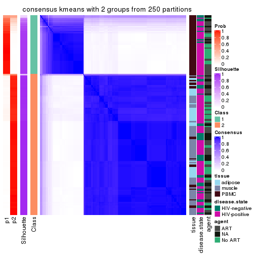</p>

</div>
<div id='tab-MAD-kmeans-consensus-heatmap-2'>
<pre><code class="r">consensus_heatmap(res, k = 3)
</code></pre>

<p>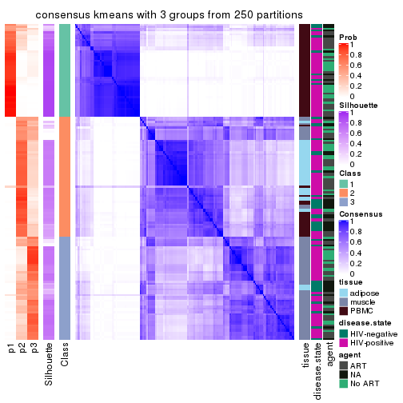</p>

</div>
<div id='tab-MAD-kmeans-consensus-heatmap-3'>
<pre><code class="r">consensus_heatmap(res, k = 4)
</code></pre>

<p>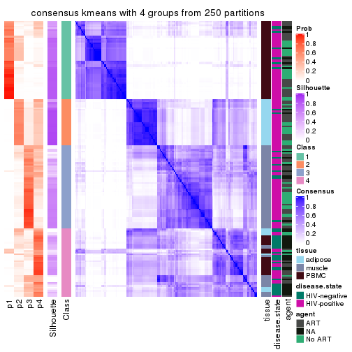</p>

</div>
<div id='tab-MAD-kmeans-consensus-heatmap-4'>
<pre><code class="r">consensus_heatmap(res, k = 5)
</code></pre>

<p>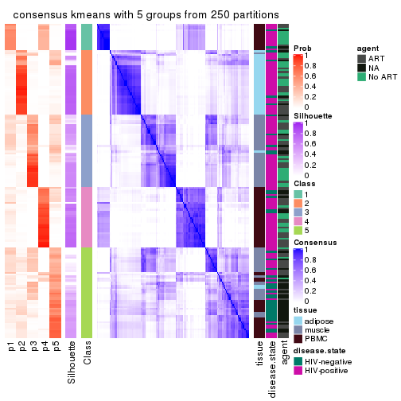</p>

</div>
<div id='tab-MAD-kmeans-consensus-heatmap-5'>
<pre><code class="r">consensus_heatmap(res, k = 6)
</code></pre>

<p>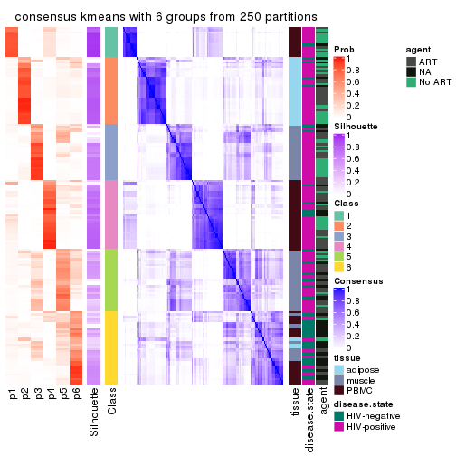</p>

</div>
</div>

Heatmaps for the membership of samples in all partitions to see how consistent they are:


<script>
$( function() {
	$( '#tabs-MAD-kmeans-membership-heatmap' ).tabs();
} );
</script>
<div id='tabs-MAD-kmeans-membership-heatmap'>
<ul>
<li><a href='#tab-MAD-kmeans-membership-heatmap-1'>k = 2</a></li>
<li><a href='#tab-MAD-kmeans-membership-heatmap-2'>k = 3</a></li>
<li><a href='#tab-MAD-kmeans-membership-heatmap-3'>k = 4</a></li>
<li><a href='#tab-MAD-kmeans-membership-heatmap-4'>k = 5</a></li>
<li><a href='#tab-MAD-kmeans-membership-heatmap-5'>k = 6</a></li>
</ul>
<div id='tab-MAD-kmeans-membership-heatmap-1'>
<pre><code class="r">membership_heatmap(res, k = 2)
</code></pre>

<p>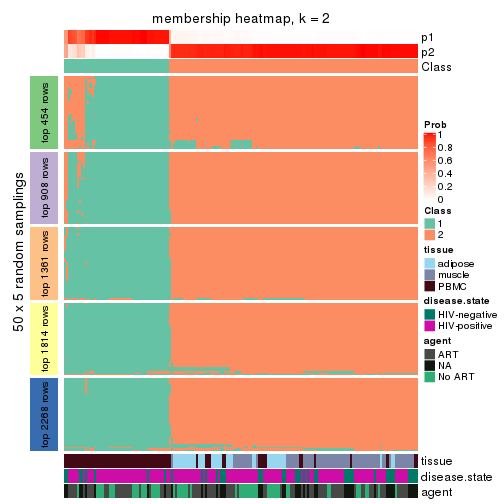</p>

</div>
<div id='tab-MAD-kmeans-membership-heatmap-2'>
<pre><code class="r">membership_heatmap(res, k = 3)
</code></pre>

<p>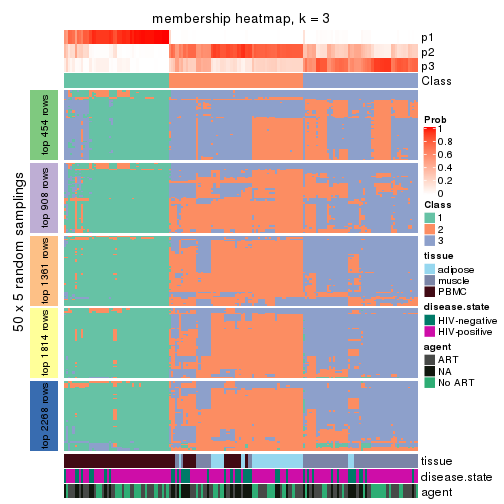</p>

</div>
<div id='tab-MAD-kmeans-membership-heatmap-3'>
<pre><code class="r">membership_heatmap(res, k = 4)
</code></pre>

<p>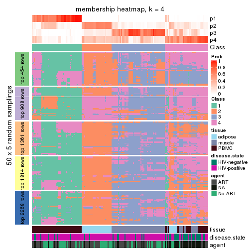</p>

</div>
<div id='tab-MAD-kmeans-membership-heatmap-4'>
<pre><code class="r">membership_heatmap(res, k = 5)
</code></pre>

<p>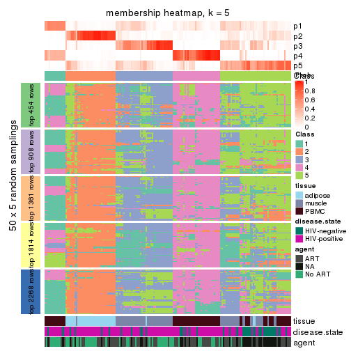</p>

</div>
<div id='tab-MAD-kmeans-membership-heatmap-5'>
<pre><code class="r">membership_heatmap(res, k = 6)
</code></pre>

<p>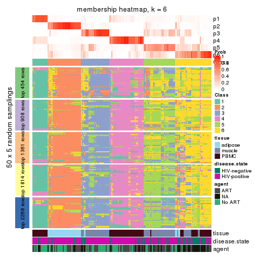</p>

</div>
</div>

As soon as we have had the classes for columns, we can look for signatures
which are significantly different between classes which can be candidate marks
for certain classes. Following are the heatmaps for signatures.


Signature heatmaps where rows are scaled:


<script>
$( function() {
	$( '#tabs-MAD-kmeans-get-signatures' ).tabs();
} );
</script>
<div id='tabs-MAD-kmeans-get-signatures'>
<ul>
<li><a href='#tab-MAD-kmeans-get-signatures-1'>k = 2</a></li>
<li><a href='#tab-MAD-kmeans-get-signatures-2'>k = 3</a></li>
<li><a href='#tab-MAD-kmeans-get-signatures-3'>k = 4</a></li>
<li><a href='#tab-MAD-kmeans-get-signatures-4'>k = 5</a></li>
<li><a href='#tab-MAD-kmeans-get-signatures-5'>k = 6</a></li>
</ul>
<div id='tab-MAD-kmeans-get-signatures-1'>
<pre><code class="r">get_signatures(res, k = 2)
</code></pre>

<p>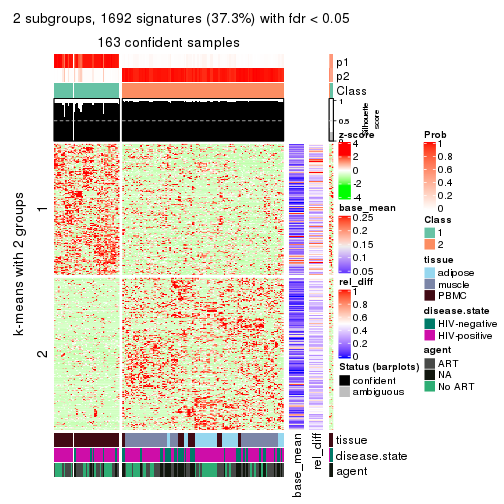</p>

</div>
<div id='tab-MAD-kmeans-get-signatures-2'>
<pre><code class="r">get_signatures(res, k = 3)
</code></pre>

<p>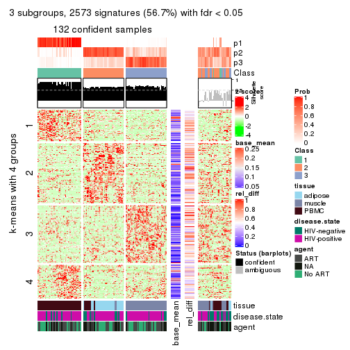</p>

</div>
<div id='tab-MAD-kmeans-get-signatures-3'>
<pre><code class="r">get_signatures(res, k = 4)
</code></pre>

<p>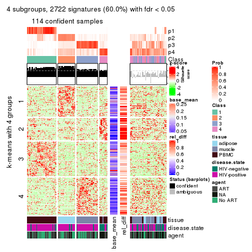</p>

</div>
<div id='tab-MAD-kmeans-get-signatures-4'>
<pre><code class="r">get_signatures(res, k = 5)
</code></pre>

<p>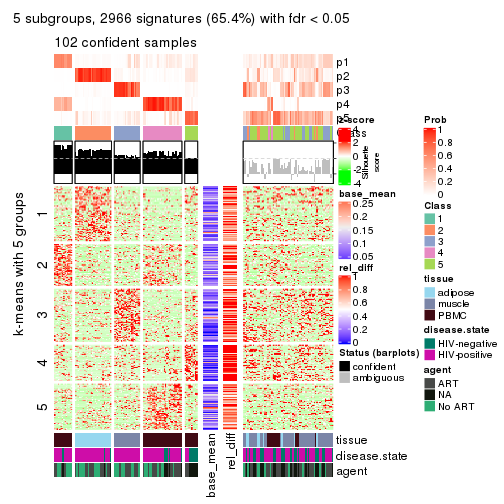</p>

</div>
<div id='tab-MAD-kmeans-get-signatures-5'>
<pre><code class="r">get_signatures(res, k = 6)
</code></pre>

<p>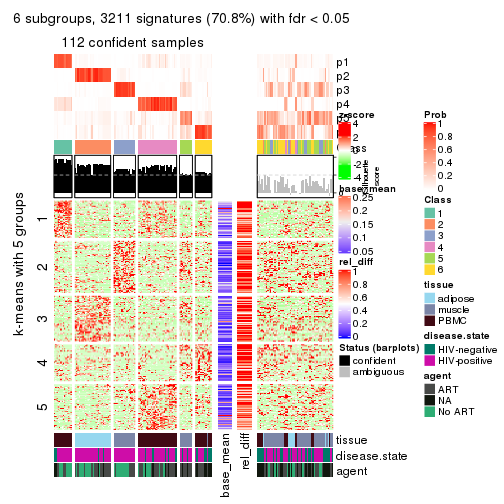</p>

</div>
</div>


Signature heatmaps where rows are not scaled:


<script>
$( function() {
	$( '#tabs-MAD-kmeans-get-signatures-no-scale' ).tabs();
} );
</script>
<div id='tabs-MAD-kmeans-get-signatures-no-scale'>
<ul>
<li><a href='#tab-MAD-kmeans-get-signatures-no-scale-1'>k = 2</a></li>
<li><a href='#tab-MAD-kmeans-get-signatures-no-scale-2'>k = 3</a></li>
<li><a href='#tab-MAD-kmeans-get-signatures-no-scale-3'>k = 4</a></li>
<li><a href='#tab-MAD-kmeans-get-signatures-no-scale-4'>k = 5</a></li>
<li><a href='#tab-MAD-kmeans-get-signatures-no-scale-5'>k = 6</a></li>
</ul>
<div id='tab-MAD-kmeans-get-signatures-no-scale-1'>
<pre><code class="r">get_signatures(res, k = 2, scale_rows = FALSE)
</code></pre>

<p>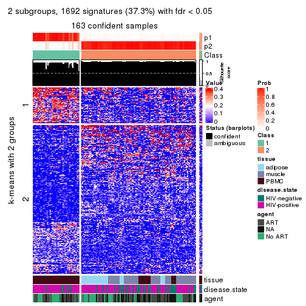</p>

</div>
<div id='tab-MAD-kmeans-get-signatures-no-scale-2'>
<pre><code class="r">get_signatures(res, k = 3, scale_rows = FALSE)
</code></pre>

<p>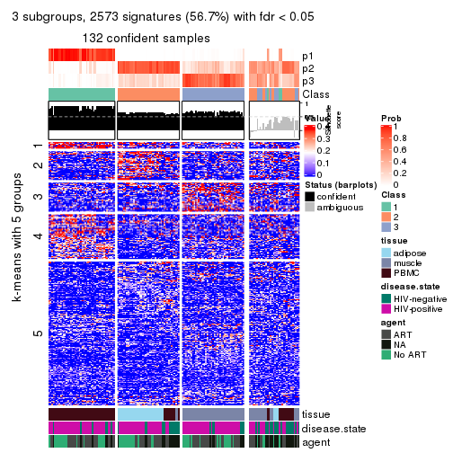</p>

</div>
<div id='tab-MAD-kmeans-get-signatures-no-scale-3'>
<pre><code class="r">get_signatures(res, k = 4, scale_rows = FALSE)
</code></pre>

<pre><code>#&gt; Error in mat[ceiling(1:nr/h_ratio), ceiling(1:nc/w_ratio), drop = FALSE]: subscript out of bounds
</code></pre>

<p>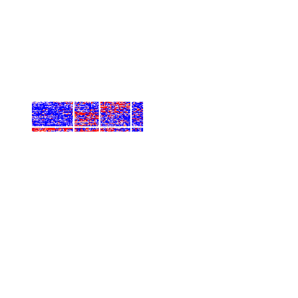</p>

</div>
<div id='tab-MAD-kmeans-get-signatures-no-scale-4'>
<pre><code class="r">get_signatures(res, k = 5, scale_rows = FALSE)
</code></pre>

<p>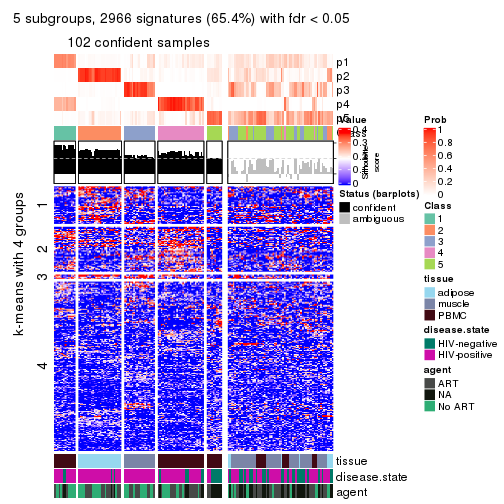</p>

</div>
<div id='tab-MAD-kmeans-get-signatures-no-scale-5'>
<pre><code class="r">get_signatures(res, k = 6, scale_rows = FALSE)
</code></pre>

<p>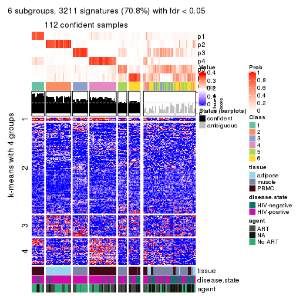</p>

</div>
</div>


Compare the overlap of signatures from different k:

```r
compare_signatures(res)
```

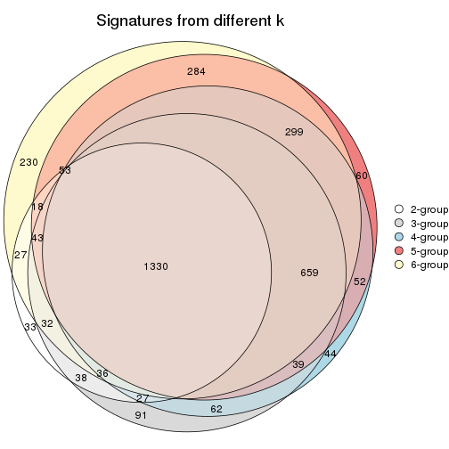

`get_signature()` returns a data frame invisibly. TO get the list of signatures, the function
call should be assigned to a variable explicitly. In following code, if `plot` argument is set
to `FALSE`, no heatmap is plotted while only the differential analysis is performed.

```r
# code only for demonstration
tb = get_signature(res, k = ..., plot = FALSE)
```

An example of the output of `tb` is:

```
#>   which_row         fdr    mean_1    mean_2 scaled_mean_1 scaled_mean_2 km
#> 1        38 0.042760348  8.373488  9.131774    -0.5533452     0.5164555  1
#> 2        40 0.018707592  7.106213  8.469186    -0.6173731     0.5762149  1
#> 3        55 0.019134737 10.221463 11.207825    -0.6159697     0.5749050  1
#> 4        59 0.006059896  5.921854  7.869574    -0.6899429     0.6439467  1
#> 5        60 0.018055526  8.928898 10.211722    -0.6204761     0.5791110  1
#> 6        98 0.009384629 15.714769 14.887706     0.6635654    -0.6193277  2
...
```

The columns in `tb` are:

1. `which_row`: row indices corresponding to the input matrix.
2. `fdr`: FDR for the differential test. 
3. `mean_x`: The mean value in group x.
4. `scaled_mean_x`: The mean value in group x after rows are scaled.
5. `km`: Row groups if k-means clustering is applied to rows.


UMAP plot which shows how samples are separated.


<script>
$( function() {
	$( '#tabs-MAD-kmeans-dimension-reduction' ).tabs();
} );
</script>
<div id='tabs-MAD-kmeans-dimension-reduction'>
<ul>
<li><a href='#tab-MAD-kmeans-dimension-reduction-1'>k = 2</a></li>
<li><a href='#tab-MAD-kmeans-dimension-reduction-2'>k = 3</a></li>
<li><a href='#tab-MAD-kmeans-dimension-reduction-3'>k = 4</a></li>
<li><a href='#tab-MAD-kmeans-dimension-reduction-4'>k = 5</a></li>
<li><a href='#tab-MAD-kmeans-dimension-reduction-5'>k = 6</a></li>
</ul>
<div id='tab-MAD-kmeans-dimension-reduction-1'>
<pre><code class="r">dimension_reduction(res, k = 2, method = &quot;UMAP&quot;)
</code></pre>

<p>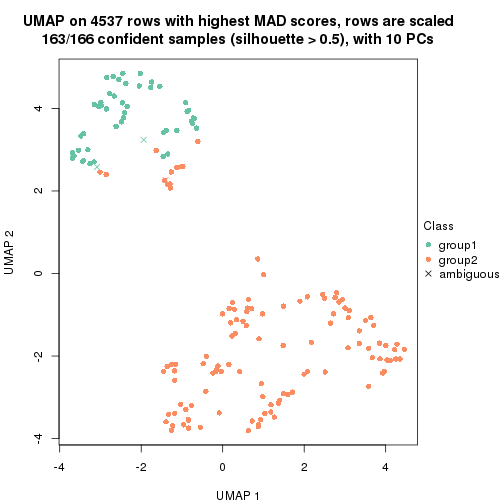</p>

</div>
<div id='tab-MAD-kmeans-dimension-reduction-2'>
<pre><code class="r">dimension_reduction(res, k = 3, method = &quot;UMAP&quot;)
</code></pre>

<p>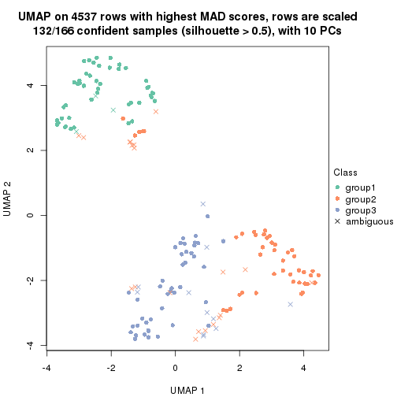</p>

</div>
<div id='tab-MAD-kmeans-dimension-reduction-3'>
<pre><code class="r">dimension_reduction(res, k = 4, method = &quot;UMAP&quot;)
</code></pre>

<p>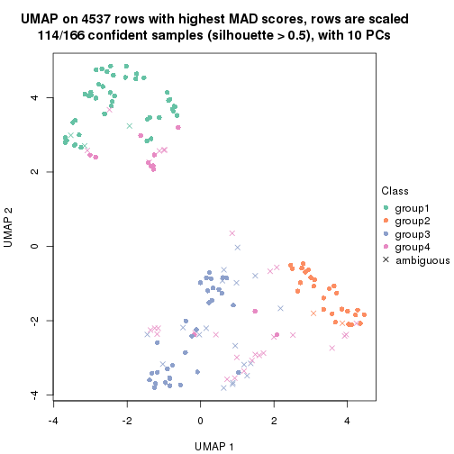</p>

</div>
<div id='tab-MAD-kmeans-dimension-reduction-4'>
<pre><code class="r">dimension_reduction(res, k = 5, method = &quot;UMAP&quot;)
</code></pre>

<p>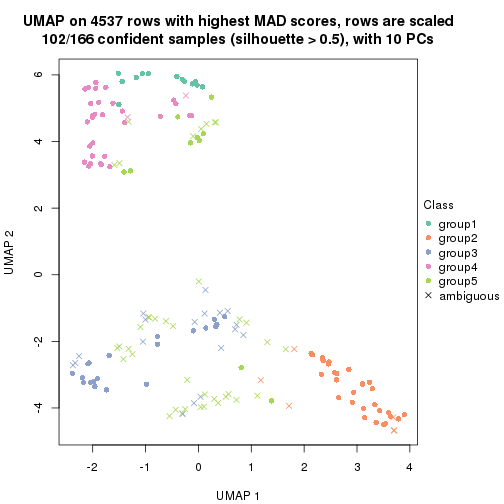</p>

</div>
<div id='tab-MAD-kmeans-dimension-reduction-5'>
<pre><code class="r">dimension_reduction(res, k = 6, method = &quot;UMAP&quot;)
</code></pre>

<p>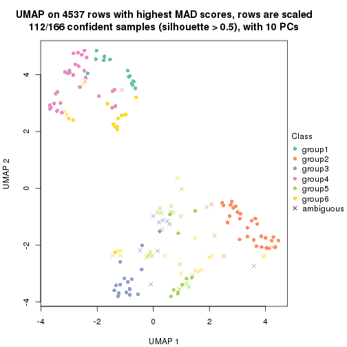</p>

</div>
</div>


Following heatmap shows how subgroups are split when increasing `k`:

```r
collect_classes(res)
```

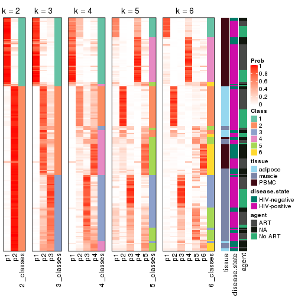


Test correlation between subgroups and known annotations. If the known
annotation is numeric, one-way ANOVA test is applied, and if the known
annotation is discrete, chi-squared contingency table test is applied.

```r
test_to_known_factors(res)
```

```
#>              n tissue(p) disease.state(p) agent(p) k
#> MAD:kmeans 163  6.55e-23         5.45e-02 9.40e-02 2
#> MAD:kmeans 132  8.90e-44         1.31e-01 3.79e-01 3
#> MAD:kmeans 114  2.46e-45         2.29e-07 5.39e-06 4
#> MAD:kmeans 102  9.17e-40         1.49e-05 8.16e-05 5
#> MAD:kmeans 112  2.24e-41         1.34e-02 6.18e-04 6
```


If matrix rows can be associated to genes, consider to use `GO_Enrichment(res,
...)` to perform function enrichment for the signature genes.


 

---------------------------------------------------


### MAD:skmeans


The object with results only for a single top-value method and a single partition method 
can be extracted as:

```r
res = res_list["MAD", "skmeans"]
# you can also extract it by
# res = res_list["MAD:skmeans"]
```

A summary of `res` and all the functions that can be applied to it:

```r
res
```

```
#> A 'ConsensusPartition' object with k = 2, 3, 4, 5, 6.
#>   On a matrix with 4537 rows and 166 columns.
#>   Top rows (454, 908, 1361, 1814, 2268) are extracted by 'MAD' method.
#>   Subgroups are detected by 'skmeans' method.
#>   Performed in total 1250 partitions by row resampling.
#>   Best k for subgroups seems to be 2.
#> 
#> Following methods can be applied to this 'ConsensusPartition' object:
#>  [1] "cola_report"             "collect_classes"         "collect_plots"          
#>  [4] "collect_stats"           "colnames"                "compare_signatures"     
#>  [7] "consensus_heatmap"       "dimension_reduction"     "functional_enrichment"  
#> [10] "get_anno_col"            "get_anno"                "get_classes"            
#> [13] "get_consensus"           "get_matrix"              "get_membership"         
#> [16] "get_param"               "get_signatures"          "get_stats"              
#> [19] "is_best_k"               "is_stable_k"             "membership_heatmap"     
#> [22] "ncol"                    "nrow"                    "plot_ecdf"              
#> [25] "rownames"                "select_partition_number" "show"                   
#> [28] "suggest_best_k"          "test_to_known_factors"
```

`collect_plots()` function collects all the plots made from `res` for all `k` (number of partitions)
into one single page to provide an easy and fast comparison between different `k`.

```r
collect_plots(res)
```

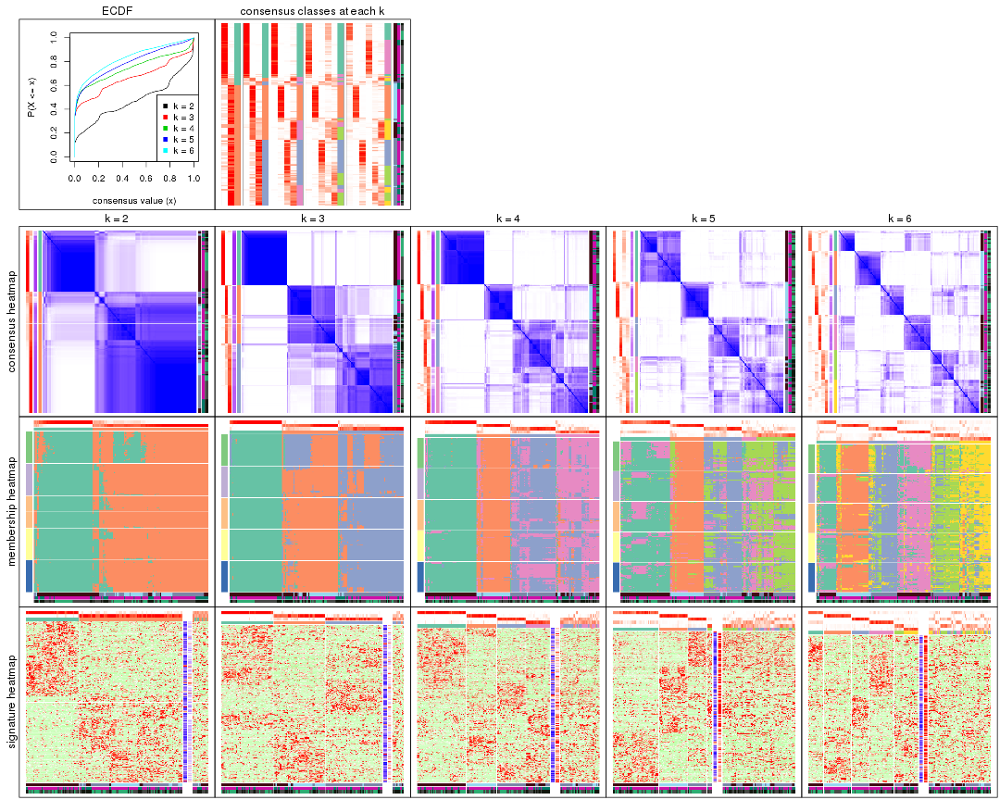

The plots are:

- The first row: a plot of the ECDF (Empirical cumulative distribution
  function) curves of the consensus matrix for each `k` and the heatmap of
  predicted classes for each `k`.
- The second row: heatmaps of the consensus matrix for each `k`.
- The third row: heatmaps of the membership matrix for each `k`.
- The fouth row: heatmaps of the signatures for each `k`.

All the plots in panels can be made by individual functions and they are
plotted later in this section.

`select_partition_number()` produces several plots showing different
statistics for choosing "optimized" `k`. There are following statistics:

- ECDF curves of the consensus matrix for each `k`;
- 1-PAC. [The PAC
  score](https://en.wikipedia.org/wiki/Consensus_clustering#Over-interpretation_potential_of_consensus_clustering)
  measures the proportion of the ambiguous subgrouping.
- Mean silhouette score.
- Concordance. The mean probability of fiting the consensus class ids in all
  partitions.
- Area increased. Denote $A_k$ as the area under the ECDF curve for current
  `k`, the area increased is defined as $A_k - A_{k-1}$.
- Rand index. The percent of pairs of samples that are both in a same cluster
  or both are not in a same cluster in the partition of k and k-1.
- Jaccard index. The ratio of pairs of samples are both in a same cluster in
  the partition of k and k-1 and the pairs of samples are both in a same
  cluster in the partition k or k-1.

The detailed explanations of these statistics can be found in [the cola
vignette](http://bioconductor.org/packages/devel/bioc/vignettes/cola/inst/doc/cola.html#toc_13).

Generally speaking, lower PAC score, higher mean silhouette score or higher
concordance corresponds to better partition. Rand index and Jaccard index
measure how similar the current partition is compared to partition with `k-1`.
If they are too similar, we won't accept `k` is better than `k-1`.

```r
select_partition_number(res)
```

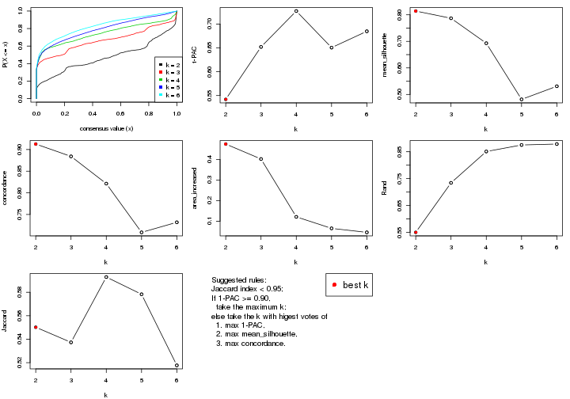

The numeric values for all these statistics can be obtained by `get_stats()`.

```r
get_stats(res)
```

```
#>   k 1-PAC mean_silhouette concordance area_increased  Rand Jaccard
#> 2 2 0.542           0.814       0.913         0.4752 0.550   0.550
#> 3 3 0.652           0.787       0.884         0.4024 0.734   0.537
#> 4 4 0.727           0.693       0.821         0.1210 0.851   0.593
#> 5 5 0.650           0.481       0.709         0.0650 0.875   0.578
#> 6 6 0.685           0.531       0.732         0.0456 0.879   0.518
```

`suggest_best_k()` suggests the best $k$ based on these statistics. The rules are as follows:

- All $k$ with Jaccard index larger than 0.95 are removed because the increase of
  the partition number does not provides enough extra information. If all $k$ are removed,
  the best $k$ is assigned by `NA`.
- For $k$ with 1-PAC larger than 0.9, the maximal $k$ is taken as the "best k". Other $k$ is called "optional k".
- If it does not fit the second rule. The $k$ with the highest vote of highest
  1-PAC, mean silhouette and concordance is taken as the "best k".

```r
suggest_best_k(res)
```

```
#> [1] 2
```


Following shows the table of the partitions (You need to click the **show/hide
code output** link to see it). The membership matrix (columns with name `p*`)
is inferred by
[`clue::cl_consensus()`](https://www.rdocumentation.org/link/cl_consensus?package=clue)
function with the `SE` method. Basically the value in the membership matrix
represents the probability to belong to a certain group. The finall class
label for an item is determined with the group with highest probability it
belongs to.

In `get_classes()` function, the entropy is calculated from the membership
matrix and the silhouette score is calculated from the consensus matrix.


<script>
$( function() {
	$( '#tabs-MAD-skmeans-get-classes' ).tabs();
} );
</script>
<div id='tabs-MAD-skmeans-get-classes'>
<ul>
<li><a href='#tab-MAD-skmeans-get-classes-1'>k = 2</a></li>
<li><a href='#tab-MAD-skmeans-get-classes-2'>k = 3</a></li>
<li><a href='#tab-MAD-skmeans-get-classes-3'>k = 4</a></li>
<li><a href='#tab-MAD-skmeans-get-classes-4'>k = 5</a></li>
<li><a href='#tab-MAD-skmeans-get-classes-5'>k = 6</a></li>
</ul>

<div id='tab-MAD-skmeans-get-classes-1'>
<p><a id='tab-MAD-skmeans-get-classes-1-a' style='color:#0366d6' href='#'>show/hide code output</a></p>
<pre><code class="r">cbind(get_classes(res, k = 2), get_membership(res, k = 2))
</code></pre>

<pre><code>#&gt;           class entropy silhouette    p1    p2
#&gt; GSM751298     1  0.0000     0.9371 1.000 0.000
#&gt; GSM751304     2  0.2778     0.8631 0.048 0.952
#&gt; GSM751305     2  0.1843     0.8728 0.028 0.972
#&gt; GSM751307     1  0.7745     0.7034 0.772 0.228
#&gt; GSM751310     1  0.3431     0.8889 0.936 0.064
#&gt; GSM751314     1  0.0000     0.9371 1.000 0.000
#&gt; GSM751316     1  0.7219     0.7362 0.800 0.200
#&gt; GSM751318     1  0.0672     0.9330 0.992 0.008
#&gt; GSM751342     1  0.5519     0.8245 0.872 0.128
#&gt; GSM751346     1  0.0000     0.9371 1.000 0.000
#&gt; GSM751347     1  0.1184     0.9272 0.984 0.016
#&gt; GSM751348     2  0.9977     0.0349 0.472 0.528
#&gt; GSM751349     2  0.0000     0.8811 0.000 1.000
#&gt; GSM751352     1  0.9087     0.4704 0.676 0.324
#&gt; GSM751353     2  0.0000     0.8811 0.000 1.000
#&gt; GSM751354     2  0.0672     0.8796 0.008 0.992
#&gt; GSM751355     2  0.0000     0.8811 0.000 1.000
#&gt; GSM751358     2  0.1843     0.8730 0.028 0.972
#&gt; GSM751359     2  0.0000     0.8811 0.000 1.000
#&gt; GSM751294     2  0.8016     0.6398 0.244 0.756
#&gt; GSM751296     1  0.0000     0.9371 1.000 0.000
#&gt; GSM751297     1  0.2948     0.8994 0.948 0.052
#&gt; GSM751299     1  0.9815     0.2806 0.580 0.420
#&gt; GSM751300     1  0.0000     0.9371 1.000 0.000
#&gt; GSM751301     1  0.0000     0.9371 1.000 0.000
#&gt; GSM751302     1  0.0000     0.9371 1.000 0.000
#&gt; GSM751303     1  0.3879     0.8777 0.924 0.076
#&gt; GSM751306     1  0.1843     0.9189 0.972 0.028
#&gt; GSM751308     1  0.0672     0.9331 0.992 0.008
#&gt; GSM751309     1  0.0672     0.9331 0.992 0.008
#&gt; GSM751311     1  0.0000     0.9371 1.000 0.000
#&gt; GSM751312     1  0.0938     0.9303 0.988 0.012
#&gt; GSM751313     1  0.0000     0.9371 1.000 0.000
#&gt; GSM751315     1  0.0000     0.9371 1.000 0.000
#&gt; GSM751317     1  0.0672     0.9330 0.992 0.008
#&gt; GSM751320     1  0.0000     0.9371 1.000 0.000
#&gt; GSM751321     1  0.0000     0.9371 1.000 0.000
#&gt; GSM751322     1  0.0000     0.9371 1.000 0.000
#&gt; GSM751324     1  0.0000     0.9371 1.000 0.000
#&gt; GSM751325     1  0.0000     0.9371 1.000 0.000
#&gt; GSM751332     1  0.0000     0.9371 1.000 0.000
#&gt; GSM751334     1  0.0000     0.9371 1.000 0.000
#&gt; GSM751339     1  0.2043     0.9159 0.968 0.032
#&gt; GSM751341     1  0.0000     0.9371 1.000 0.000
#&gt; GSM751343     1  0.0000     0.9371 1.000 0.000
#&gt; GSM751344     2  0.9754     0.2559 0.408 0.592
#&gt; GSM751345     2  0.9775     0.2434 0.412 0.588
#&gt; GSM751356     2  0.9866     0.1741 0.432 0.568
#&gt; GSM751357     2  0.9866     0.1741 0.432 0.568
#&gt; GSM751293     1  0.0000     0.9371 1.000 0.000
#&gt; GSM751295     1  0.0000     0.9371 1.000 0.000
#&gt; GSM751319     1  0.0000     0.9371 1.000 0.000
#&gt; GSM751323     1  0.0000     0.9371 1.000 0.000
#&gt; GSM751326     1  0.0000     0.9371 1.000 0.000
#&gt; GSM751327     1  0.0000     0.9371 1.000 0.000
#&gt; GSM751328     1  0.0000     0.9371 1.000 0.000
#&gt; GSM751329     1  0.0000     0.9371 1.000 0.000
#&gt; GSM751330     1  0.0000     0.9371 1.000 0.000
#&gt; GSM751331     1  0.0000     0.9371 1.000 0.000
#&gt; GSM751333     1  0.0000     0.9371 1.000 0.000
#&gt; GSM751335     1  0.0000     0.9371 1.000 0.000
#&gt; GSM751336     1  0.0000     0.9371 1.000 0.000
#&gt; GSM751337     1  0.0000     0.9371 1.000 0.000
#&gt; GSM751338     1  0.0000     0.9371 1.000 0.000
#&gt; GSM751340     1  0.6531     0.7761 0.832 0.168
#&gt; GSM751350     1  0.0000     0.9371 1.000 0.000
#&gt; GSM751351     1  0.0000     0.9371 1.000 0.000
#&gt; GSM751362     2  0.7056     0.7318 0.192 0.808
#&gt; GSM751363     2  0.4431     0.8355 0.092 0.908
#&gt; GSM751367     1  0.9552     0.4336 0.624 0.376
#&gt; GSM751368     2  0.0000     0.8811 0.000 1.000
#&gt; GSM751371     2  0.9922     0.1582 0.448 0.552
#&gt; GSM751375     2  0.0000     0.8811 0.000 1.000
#&gt; GSM751376     2  0.0000     0.8811 0.000 1.000
#&gt; GSM751378     2  0.0000     0.8811 0.000 1.000
#&gt; GSM751379     2  0.0000     0.8811 0.000 1.000
#&gt; GSM751382     2  0.0000     0.8811 0.000 1.000
#&gt; GSM751386     2  0.0000     0.8811 0.000 1.000
#&gt; GSM751388     2  0.0000     0.8811 0.000 1.000
#&gt; GSM751391     2  0.1414     0.8767 0.020 0.980
#&gt; GSM751410     2  0.8267     0.6332 0.260 0.740
#&gt; GSM751414     2  0.9460     0.4085 0.364 0.636
#&gt; GSM751361     2  0.0000     0.8811 0.000 1.000
#&gt; GSM751365     2  0.0672     0.8801 0.008 0.992
#&gt; GSM751366     2  0.9988     0.1830 0.480 0.520
#&gt; GSM751369     2  0.4298     0.8378 0.088 0.912
#&gt; GSM751370     2  0.9323     0.4505 0.348 0.652
#&gt; GSM751372     2  0.2948     0.8623 0.052 0.948
#&gt; GSM751373     1  0.9754     0.1202 0.592 0.408
#&gt; GSM751374     2  0.0000     0.8811 0.000 1.000
#&gt; GSM751377     2  0.0000     0.8811 0.000 1.000
#&gt; GSM751380     2  0.9954     0.2595 0.460 0.540
#&gt; GSM751381     2  0.0000     0.8811 0.000 1.000
#&gt; GSM751383     2  0.6247     0.8171 0.156 0.844
#&gt; GSM751384     2  0.0000     0.8811 0.000 1.000
#&gt; GSM751385     2  0.0000     0.8811 0.000 1.000
#&gt; GSM751387     2  0.0000     0.8811 0.000 1.000
#&gt; GSM751389     2  0.0000     0.8811 0.000 1.000
#&gt; GSM751393     2  0.0000     0.8811 0.000 1.000
#&gt; GSM751394     2  0.0000     0.8811 0.000 1.000
#&gt; GSM751395     2  0.0000     0.8811 0.000 1.000
#&gt; GSM751397     2  0.0000     0.8811 0.000 1.000
#&gt; GSM751398     2  0.0000     0.8811 0.000 1.000
#&gt; GSM751404     2  0.6623     0.8085 0.172 0.828
#&gt; GSM751406     2  0.0000     0.8811 0.000 1.000
#&gt; GSM751411     2  0.0000     0.8811 0.000 1.000
#&gt; GSM751413     2  0.0672     0.8797 0.008 0.992
#&gt; GSM751415     2  0.0938     0.8791 0.012 0.988
#&gt; GSM751416     2  0.0000     0.8811 0.000 1.000
#&gt; GSM751417     2  0.0000     0.8811 0.000 1.000
#&gt; GSM751421     2  0.5519     0.8038 0.128 0.872
#&gt; GSM751422     2  0.4298     0.8377 0.088 0.912
#&gt; GSM751360     2  0.4161     0.8406 0.084 0.916
#&gt; GSM751364     2  0.0672     0.8801 0.008 0.992
#&gt; GSM751390     2  0.1843     0.8764 0.028 0.972
#&gt; GSM751392     2  0.0000     0.8811 0.000 1.000
#&gt; GSM751396     2  0.4939     0.8455 0.108 0.892
#&gt; GSM751399     2  0.0000     0.8811 0.000 1.000
#&gt; GSM751400     2  0.7219     0.7828 0.200 0.800
#&gt; GSM751401     2  0.7376     0.7766 0.208 0.792
#&gt; GSM751402     2  0.7815     0.7533 0.232 0.768
#&gt; GSM751403     2  0.2778     0.8706 0.048 0.952
#&gt; GSM751405     2  0.0000     0.8811 0.000 1.000
#&gt; GSM751407     2  0.7376     0.7766 0.208 0.792
#&gt; GSM751408     2  0.7139     0.7874 0.196 0.804
#&gt; GSM751409     2  0.0000     0.8811 0.000 1.000
#&gt; GSM751412     2  0.4815     0.8493 0.104 0.896
#&gt; GSM751418     2  0.7376     0.7775 0.208 0.792
#&gt; GSM751419     2  0.7376     0.7775 0.208 0.792
#&gt; GSM751420     2  0.0000     0.8811 0.000 1.000
#&gt; GSM751425     2  0.0000     0.8811 0.000 1.000
#&gt; GSM751429     1  0.9977     0.1492 0.528 0.472
#&gt; GSM751430     2  0.4022     0.8598 0.080 0.920
#&gt; GSM751433     2  0.7602     0.7669 0.220 0.780
#&gt; GSM751437     2  0.2043     0.8724 0.032 0.968
#&gt; GSM751448     2  0.6623     0.7649 0.172 0.828
#&gt; GSM751451     2  0.5737     0.8357 0.136 0.864
#&gt; GSM751423     2  0.0000     0.8811 0.000 1.000
#&gt; GSM751424     2  0.5294     0.8414 0.120 0.880
#&gt; GSM751428     2  0.6048     0.8244 0.148 0.852
#&gt; GSM751431     2  0.1414     0.8779 0.020 0.980
#&gt; GSM751432     2  0.6712     0.8040 0.176 0.824
#&gt; GSM751434     2  0.7376     0.7766 0.208 0.792
#&gt; GSM751435     2  0.7528     0.7682 0.216 0.784
#&gt; GSM751436     2  0.7376     0.7766 0.208 0.792
#&gt; GSM751440     2  0.7528     0.7682 0.216 0.784
#&gt; GSM751444     2  0.5737     0.8330 0.136 0.864
#&gt; GSM751446     2  0.0000     0.8811 0.000 1.000
#&gt; GSM751449     2  0.0000     0.8811 0.000 1.000
#&gt; GSM751450     2  0.4939     0.8479 0.108 0.892
#&gt; GSM751452     2  0.6148     0.8221 0.152 0.848
#&gt; GSM751426     2  0.7376     0.7766 0.208 0.792
#&gt; GSM751427     2  0.0000     0.8811 0.000 1.000
#&gt; GSM751438     2  0.0000     0.8811 0.000 1.000
#&gt; GSM751439     2  0.6973     0.7939 0.188 0.812
#&gt; GSM751441     2  0.0000     0.8811 0.000 1.000
#&gt; GSM751442     2  0.7453     0.7723 0.212 0.788
#&gt; GSM751443     2  0.0376     0.8808 0.004 0.996
#&gt; GSM751445     2  0.0000     0.8811 0.000 1.000
#&gt; GSM751447     2  0.1414     0.8782 0.020 0.980
#&gt; GSM751453     2  0.6712     0.8036 0.176 0.824
#&gt; GSM751454     2  0.6712     0.8036 0.176 0.824
#&gt; GSM751455     2  0.7299     0.7795 0.204 0.796
#&gt; GSM751456     2  0.7299     0.7795 0.204 0.796
#&gt; GSM751457     2  0.0000     0.8811 0.000 1.000
#&gt; GSM751458     2  0.0000     0.8811 0.000 1.000
</code></pre>

<script>
$('#tab-MAD-skmeans-get-classes-1-a').parent().next().next().hide();
$('#tab-MAD-skmeans-get-classes-1-a').click(function(){
  $('#tab-MAD-skmeans-get-classes-1-a').parent().next().next().toggle();
  return(false);
});
</script>
</div>

<div id='tab-MAD-skmeans-get-classes-2'>
<p><a id='tab-MAD-skmeans-get-classes-2-a' style='color:#0366d6' href='#'>show/hide code output</a></p>
<pre><code class="r">cbind(get_classes(res, k = 3), get_membership(res, k = 3))
</code></pre>

<pre><code>#&gt;           class entropy silhouette    p1    p2    p3
#&gt; GSM751298     1  0.0000     0.9868 1.000 0.000 0.000
#&gt; GSM751304     2  0.6204     0.4649 0.000 0.576 0.424
#&gt; GSM751305     2  0.5678     0.6763 0.000 0.684 0.316
#&gt; GSM751307     2  0.9517     0.4157 0.320 0.472 0.208
#&gt; GSM751310     1  0.0000     0.9868 1.000 0.000 0.000
#&gt; GSM751314     1  0.0000     0.9868 1.000 0.000 0.000
#&gt; GSM751316     1  0.4834     0.7182 0.792 0.004 0.204
#&gt; GSM751318     1  0.0747     0.9726 0.984 0.016 0.000
#&gt; GSM751342     1  0.2173     0.9309 0.944 0.008 0.048
#&gt; GSM751346     1  0.0000     0.9868 1.000 0.000 0.000
#&gt; GSM751347     1  0.0000     0.9868 1.000 0.000 0.000
#&gt; GSM751348     2  0.7984     0.6744 0.132 0.652 0.216
#&gt; GSM751349     2  0.4702     0.7690 0.000 0.788 0.212
#&gt; GSM751352     2  0.6141     0.6657 0.232 0.736 0.032
#&gt; GSM751353     2  0.4750     0.7672 0.000 0.784 0.216
#&gt; GSM751354     2  0.5560     0.6958 0.000 0.700 0.300
#&gt; GSM751355     2  0.5760     0.6522 0.000 0.672 0.328
#&gt; GSM751358     2  0.5465     0.7136 0.000 0.712 0.288
#&gt; GSM751359     2  0.5529     0.7005 0.000 0.704 0.296
#&gt; GSM751294     2  0.5497     0.7096 0.000 0.708 0.292
#&gt; GSM751296     1  0.0000     0.9868 1.000 0.000 0.000
#&gt; GSM751297     1  0.0000     0.9868 1.000 0.000 0.000
#&gt; GSM751299     2  0.6337     0.6754 0.220 0.736 0.044
#&gt; GSM751300     1  0.0000     0.9868 1.000 0.000 0.000
#&gt; GSM751301     1  0.0000     0.9868 1.000 0.000 0.000
#&gt; GSM751302     1  0.0000     0.9868 1.000 0.000 0.000
#&gt; GSM751303     1  0.0592     0.9758 0.988 0.000 0.012
#&gt; GSM751306     1  0.0000     0.9868 1.000 0.000 0.000
#&gt; GSM751308     1  0.3293     0.8801 0.900 0.088 0.012
#&gt; GSM751309     1  0.0000     0.9868 1.000 0.000 0.000
#&gt; GSM751311     1  0.0000     0.9868 1.000 0.000 0.000
#&gt; GSM751312     1  0.0000     0.9868 1.000 0.000 0.000
#&gt; GSM751313     1  0.0000     0.9868 1.000 0.000 0.000
#&gt; GSM751315     1  0.0000     0.9868 1.000 0.000 0.000
#&gt; GSM751317     1  0.0000     0.9868 1.000 0.000 0.000
#&gt; GSM751320     1  0.0000     0.9868 1.000 0.000 0.000
#&gt; GSM751321     1  0.0000     0.9868 1.000 0.000 0.000
#&gt; GSM751322     1  0.0000     0.9868 1.000 0.000 0.000
#&gt; GSM751324     1  0.0000     0.9868 1.000 0.000 0.000
#&gt; GSM751325     1  0.0000     0.9868 1.000 0.000 0.000
#&gt; GSM751332     1  0.0000     0.9868 1.000 0.000 0.000
#&gt; GSM751334     1  0.0000     0.9868 1.000 0.000 0.000
#&gt; GSM751339     1  0.0424     0.9800 0.992 0.000 0.008
#&gt; GSM751341     1  0.0000     0.9868 1.000 0.000 0.000
#&gt; GSM751343     1  0.0000     0.9868 1.000 0.000 0.000
#&gt; GSM751344     2  0.4931     0.7688 0.004 0.784 0.212
#&gt; GSM751345     2  0.4931     0.7688 0.004 0.784 0.212
#&gt; GSM751356     2  0.6685     0.7305 0.048 0.708 0.244
#&gt; GSM751357     2  0.6685     0.7305 0.048 0.708 0.244
#&gt; GSM751293     1  0.0000     0.9868 1.000 0.000 0.000
#&gt; GSM751295     1  0.0000     0.9868 1.000 0.000 0.000
#&gt; GSM751319     1  0.0000     0.9868 1.000 0.000 0.000
#&gt; GSM751323     1  0.0000     0.9868 1.000 0.000 0.000
#&gt; GSM751326     1  0.0000     0.9868 1.000 0.000 0.000
#&gt; GSM751327     1  0.0000     0.9868 1.000 0.000 0.000
#&gt; GSM751328     1  0.0000     0.9868 1.000 0.000 0.000
#&gt; GSM751329     1  0.0000     0.9868 1.000 0.000 0.000
#&gt; GSM751330     1  0.0000     0.9868 1.000 0.000 0.000
#&gt; GSM751331     1  0.0000     0.9868 1.000 0.000 0.000
#&gt; GSM751333     1  0.0000     0.9868 1.000 0.000 0.000
#&gt; GSM751335     1  0.0000     0.9868 1.000 0.000 0.000
#&gt; GSM751336     1  0.0000     0.9868 1.000 0.000 0.000
#&gt; GSM751337     1  0.0000     0.9868 1.000 0.000 0.000
#&gt; GSM751338     1  0.0000     0.9868 1.000 0.000 0.000
#&gt; GSM751340     1  0.4291     0.7683 0.820 0.000 0.180
#&gt; GSM751350     1  0.0000     0.9868 1.000 0.000 0.000
#&gt; GSM751351     1  0.0000     0.9868 1.000 0.000 0.000
#&gt; GSM751362     3  0.0237     0.7884 0.000 0.004 0.996
#&gt; GSM751363     3  0.0892     0.7897 0.000 0.020 0.980
#&gt; GSM751367     3  0.7152     0.1167 0.444 0.024 0.532
#&gt; GSM751368     3  0.6126     0.5608 0.000 0.400 0.600
#&gt; GSM751371     3  0.3875     0.7452 0.068 0.044 0.888
#&gt; GSM751375     2  0.4796     0.7680 0.000 0.780 0.220
#&gt; GSM751376     3  0.5905     0.2578 0.000 0.352 0.648
#&gt; GSM751378     3  0.3482     0.7346 0.000 0.128 0.872
#&gt; GSM751379     3  0.5760     0.3287 0.000 0.328 0.672
#&gt; GSM751382     2  0.5138     0.7472 0.000 0.748 0.252
#&gt; GSM751386     3  0.4796     0.6324 0.000 0.220 0.780
#&gt; GSM751388     3  0.6140     0.5393 0.000 0.404 0.596
#&gt; GSM751391     3  0.5882     0.3052 0.000 0.348 0.652
#&gt; GSM751410     3  0.0424     0.7885 0.000 0.008 0.992
#&gt; GSM751414     3  0.0237     0.7895 0.004 0.000 0.996
#&gt; GSM751361     3  0.3116     0.7605 0.000 0.108 0.892
#&gt; GSM751365     3  0.4654     0.7292 0.000 0.208 0.792
#&gt; GSM751366     3  0.4654     0.7274 0.000 0.208 0.792
#&gt; GSM751369     3  0.0892     0.7875 0.000 0.020 0.980
#&gt; GSM751370     3  0.0475     0.7907 0.004 0.004 0.992
#&gt; GSM751372     3  0.1529     0.7932 0.000 0.040 0.960
#&gt; GSM751373     3  0.5109     0.7219 0.008 0.212 0.780
#&gt; GSM751374     3  0.5785     0.3170 0.000 0.332 0.668
#&gt; GSM751377     3  0.1860     0.7870 0.000 0.052 0.948
#&gt; GSM751380     3  0.4324     0.7662 0.028 0.112 0.860
#&gt; GSM751381     3  0.4702     0.6440 0.000 0.212 0.788
#&gt; GSM751383     3  0.6111     0.5678 0.000 0.396 0.604
#&gt; GSM751384     3  0.1529     0.7862 0.000 0.040 0.960
#&gt; GSM751385     3  0.0892     0.7880 0.000 0.020 0.980
#&gt; GSM751387     3  0.6244     0.4845 0.000 0.440 0.560
#&gt; GSM751389     3  0.1163     0.7923 0.000 0.028 0.972
#&gt; GSM751393     3  0.0747     0.7882 0.000 0.016 0.984
#&gt; GSM751394     3  0.4555     0.6596 0.000 0.200 0.800
#&gt; GSM751395     3  0.4346     0.6780 0.000 0.184 0.816
#&gt; GSM751397     3  0.4346     0.6794 0.000 0.184 0.816
#&gt; GSM751398     3  0.4555     0.6598 0.000 0.200 0.800
#&gt; GSM751404     3  0.4702     0.7245 0.000 0.212 0.788
#&gt; GSM751406     3  0.0237     0.7884 0.000 0.004 0.996
#&gt; GSM751411     3  0.0000     0.7892 0.000 0.000 1.000
#&gt; GSM751413     3  0.2261     0.7739 0.000 0.068 0.932
#&gt; GSM751415     3  0.1529     0.7916 0.000 0.040 0.960
#&gt; GSM751416     3  0.1031     0.7910 0.000 0.024 0.976
#&gt; GSM751417     3  0.1031     0.7910 0.000 0.024 0.976
#&gt; GSM751421     3  0.0237     0.7884 0.000 0.004 0.996
#&gt; GSM751422     3  0.0237     0.7884 0.000 0.004 0.996
#&gt; GSM751360     3  0.0892     0.7894 0.000 0.020 0.980
#&gt; GSM751364     3  0.3340     0.7781 0.000 0.120 0.880
#&gt; GSM751390     3  0.5785     0.6423 0.000 0.332 0.668
#&gt; GSM751392     3  0.5497     0.5257 0.000 0.292 0.708
#&gt; GSM751396     2  0.5988     0.0578 0.000 0.632 0.368
#&gt; GSM751399     3  0.0592     0.7918 0.000 0.012 0.988
#&gt; GSM751400     3  0.4702     0.7245 0.000 0.212 0.788
#&gt; GSM751401     3  0.4702     0.7245 0.000 0.212 0.788
#&gt; GSM751402     3  0.4750     0.7253 0.000 0.216 0.784
#&gt; GSM751403     3  0.4702     0.7280 0.000 0.212 0.788
#&gt; GSM751405     3  0.0237     0.7884 0.000 0.004 0.996
#&gt; GSM751407     3  0.4702     0.7245 0.000 0.212 0.788
#&gt; GSM751408     3  0.4702     0.7245 0.000 0.212 0.788
#&gt; GSM751409     3  0.0892     0.7921 0.000 0.020 0.980
#&gt; GSM751412     3  0.4702     0.7245 0.000 0.212 0.788
#&gt; GSM751418     3  0.4796     0.7217 0.000 0.220 0.780
#&gt; GSM751419     3  0.4796     0.7217 0.000 0.220 0.780
#&gt; GSM751420     3  0.4504     0.7371 0.000 0.196 0.804
#&gt; GSM751425     2  0.4702     0.7690 0.000 0.788 0.212
#&gt; GSM751429     3  0.9431     0.1576 0.280 0.220 0.500
#&gt; GSM751430     2  0.0424     0.8081 0.000 0.992 0.008
#&gt; GSM751433     2  0.0237     0.8075 0.000 0.996 0.004
#&gt; GSM751437     3  0.4654     0.6046 0.000 0.208 0.792
#&gt; GSM751448     3  0.5656     0.4365 0.004 0.284 0.712
#&gt; GSM751451     2  0.0237     0.8075 0.000 0.996 0.004
#&gt; GSM751423     2  0.4702     0.7690 0.000 0.788 0.212
#&gt; GSM751424     2  0.0237     0.8075 0.000 0.996 0.004
#&gt; GSM751428     2  0.0237     0.8075 0.000 0.996 0.004
#&gt; GSM751431     2  0.0237     0.8075 0.000 0.996 0.004
#&gt; GSM751432     2  0.0237     0.8075 0.000 0.996 0.004
#&gt; GSM751434     2  0.0237     0.8075 0.000 0.996 0.004
#&gt; GSM751435     2  0.0592     0.8041 0.000 0.988 0.012
#&gt; GSM751436     2  0.0237     0.8075 0.000 0.996 0.004
#&gt; GSM751440     2  0.0747     0.8021 0.000 0.984 0.016
#&gt; GSM751444     2  0.0424     0.8059 0.000 0.992 0.008
#&gt; GSM751446     2  0.2356     0.8061 0.000 0.928 0.072
#&gt; GSM751449     2  0.4452     0.7792 0.000 0.808 0.192
#&gt; GSM751450     2  0.0237     0.8075 0.000 0.996 0.004
#&gt; GSM751452     2  0.0237     0.8075 0.000 0.996 0.004
#&gt; GSM751426     2  0.0237     0.8075 0.000 0.996 0.004
#&gt; GSM751427     2  0.0592     0.8032 0.000 0.988 0.012
#&gt; GSM751438     2  0.3192     0.8003 0.000 0.888 0.112
#&gt; GSM751439     2  0.1964     0.7720 0.000 0.944 0.056
#&gt; GSM751441     2  0.0237     0.8084 0.000 0.996 0.004
#&gt; GSM751442     2  0.0592     0.8032 0.000 0.988 0.012
#&gt; GSM751443     2  0.5926     0.6199 0.000 0.644 0.356
#&gt; GSM751445     2  0.4702     0.7690 0.000 0.788 0.212
#&gt; GSM751447     2  0.0000     0.8076 0.000 1.000 0.000
#&gt; GSM751453     2  0.0237     0.8075 0.000 0.996 0.004
#&gt; GSM751454     2  0.0237     0.8075 0.000 0.996 0.004
#&gt; GSM751455     2  0.0592     0.8032 0.000 0.988 0.012
#&gt; GSM751456     2  0.0592     0.8032 0.000 0.988 0.012
#&gt; GSM751457     2  0.4887     0.7627 0.000 0.772 0.228
#&gt; GSM751458     2  0.4887     0.7627 0.000 0.772 0.228
</code></pre>

<script>
$('#tab-MAD-skmeans-get-classes-2-a').parent().next().next().hide();
$('#tab-MAD-skmeans-get-classes-2-a').click(function(){
  $('#tab-MAD-skmeans-get-classes-2-a').parent().next().next().toggle();
  return(false);
});
</script>
</div>

<div id='tab-MAD-skmeans-get-classes-3'>
<p><a id='tab-MAD-skmeans-get-classes-3-a' style='color:#0366d6' href='#'>show/hide code output</a></p>
<pre><code class="r">cbind(get_classes(res, k = 4), get_membership(res, k = 4))
</code></pre>

<pre><code>#&gt;           class entropy silhouette    p1    p2    p3    p4
#&gt; GSM751298     1  0.0188     0.9624 0.996 0.000 0.000 0.004
#&gt; GSM751304     4  0.1452     0.6852 0.000 0.008 0.036 0.956
#&gt; GSM751305     4  0.1297     0.6880 0.000 0.016 0.020 0.964
#&gt; GSM751307     4  0.7640     0.4079 0.264 0.180 0.016 0.540
#&gt; GSM751310     1  0.0672     0.9574 0.984 0.000 0.008 0.008
#&gt; GSM751314     1  0.0188     0.9619 0.996 0.000 0.004 0.000
#&gt; GSM751316     1  0.5047     0.5043 0.668 0.000 0.016 0.316
#&gt; GSM751318     1  0.1209     0.9427 0.964 0.032 0.000 0.004
#&gt; GSM751342     1  0.3625     0.7796 0.828 0.012 0.000 0.160
#&gt; GSM751346     1  0.1022     0.9536 0.968 0.000 0.000 0.032
#&gt; GSM751347     1  0.1209     0.9517 0.964 0.000 0.004 0.032
#&gt; GSM751348     4  0.2831     0.6854 0.040 0.044 0.008 0.908
#&gt; GSM751349     4  0.4677     0.6259 0.000 0.176 0.048 0.776
#&gt; GSM751352     4  0.2909     0.6795 0.036 0.052 0.008 0.904
#&gt; GSM751353     4  0.2647     0.6698 0.000 0.120 0.000 0.880
#&gt; GSM751354     4  0.1284     0.6866 0.000 0.012 0.024 0.964
#&gt; GSM751355     4  0.2596     0.6728 0.000 0.024 0.068 0.908
#&gt; GSM751358     4  0.2317     0.6850 0.004 0.036 0.032 0.928
#&gt; GSM751359     4  0.2586     0.6817 0.000 0.040 0.048 0.912
#&gt; GSM751294     4  0.1406     0.6831 0.000 0.016 0.024 0.960
#&gt; GSM751296     1  0.0336     0.9614 0.992 0.000 0.000 0.008
#&gt; GSM751297     1  0.2076     0.9299 0.932 0.004 0.008 0.056
#&gt; GSM751299     4  0.2586     0.6749 0.048 0.040 0.000 0.912
#&gt; GSM751300     1  0.1022     0.9536 0.968 0.000 0.000 0.032
#&gt; GSM751301     1  0.1022     0.9478 0.968 0.000 0.000 0.032
#&gt; GSM751302     1  0.1022     0.9536 0.968 0.000 0.000 0.032
#&gt; GSM751303     1  0.1938     0.9199 0.936 0.000 0.012 0.052
#&gt; GSM751306     1  0.0336     0.9605 0.992 0.000 0.008 0.000
#&gt; GSM751308     4  0.5815    -0.0115 0.476 0.012 0.012 0.500
#&gt; GSM751309     1  0.0188     0.9620 0.996 0.000 0.000 0.004
#&gt; GSM751311     1  0.0000     0.9629 1.000 0.000 0.000 0.000
#&gt; GSM751312     1  0.1584     0.9444 0.952 0.000 0.012 0.036
#&gt; GSM751313     1  0.0188     0.9627 0.996 0.000 0.000 0.004
#&gt; GSM751315     1  0.0000     0.9629 1.000 0.000 0.000 0.000
#&gt; GSM751317     1  0.0188     0.9619 0.996 0.000 0.004 0.000
#&gt; GSM751320     1  0.0000     0.9629 1.000 0.000 0.000 0.000
#&gt; GSM751321     1  0.0000     0.9629 1.000 0.000 0.000 0.000
#&gt; GSM751322     1  0.0000     0.9629 1.000 0.000 0.000 0.000
#&gt; GSM751324     1  0.0000     0.9629 1.000 0.000 0.000 0.000
#&gt; GSM751325     1  0.0000     0.9629 1.000 0.000 0.000 0.000
#&gt; GSM751332     1  0.0000     0.9629 1.000 0.000 0.000 0.000
#&gt; GSM751334     1  0.0000     0.9629 1.000 0.000 0.000 0.000
#&gt; GSM751339     1  0.4088     0.7889 0.820 0.000 0.040 0.140
#&gt; GSM751341     1  0.0336     0.9614 0.992 0.000 0.000 0.008
#&gt; GSM751343     1  0.0000     0.9629 1.000 0.000 0.000 0.000
#&gt; GSM751344     4  0.1489     0.6893 0.000 0.044 0.004 0.952
#&gt; GSM751345     4  0.1302     0.6892 0.000 0.044 0.000 0.956
#&gt; GSM751356     4  0.1406     0.6831 0.000 0.016 0.024 0.960
#&gt; GSM751357     4  0.1406     0.6831 0.000 0.016 0.024 0.960
#&gt; GSM751293     1  0.1302     0.9373 0.956 0.000 0.000 0.044
#&gt; GSM751295     1  0.1022     0.9536 0.968 0.000 0.000 0.032
#&gt; GSM751319     1  0.0000     0.9629 1.000 0.000 0.000 0.000
#&gt; GSM751323     1  0.0000     0.9629 1.000 0.000 0.000 0.000
#&gt; GSM751326     1  0.0000     0.9629 1.000 0.000 0.000 0.000
#&gt; GSM751327     1  0.0000     0.9629 1.000 0.000 0.000 0.000
#&gt; GSM751328     1  0.0000     0.9629 1.000 0.000 0.000 0.000
#&gt; GSM751329     1  0.0000     0.9629 1.000 0.000 0.000 0.000
#&gt; GSM751330     1  0.0188     0.9627 0.996 0.000 0.000 0.004
#&gt; GSM751331     1  0.0921     0.9550 0.972 0.000 0.000 0.028
#&gt; GSM751333     1  0.0188     0.9627 0.996 0.000 0.000 0.004
#&gt; GSM751335     1  0.0000     0.9629 1.000 0.000 0.000 0.000
#&gt; GSM751336     1  0.0921     0.9550 0.972 0.000 0.000 0.028
#&gt; GSM751337     1  0.0000     0.9629 1.000 0.000 0.000 0.000
#&gt; GSM751338     1  0.0188     0.9627 0.996 0.000 0.000 0.004
#&gt; GSM751340     1  0.6150     0.3393 0.580 0.000 0.060 0.360
#&gt; GSM751350     1  0.1022     0.9536 0.968 0.000 0.000 0.032
#&gt; GSM751351     1  0.1022     0.9536 0.968 0.000 0.000 0.032
#&gt; GSM751362     3  0.3942     0.5876 0.000 0.000 0.764 0.236
#&gt; GSM751363     3  0.4605     0.4075 0.000 0.000 0.664 0.336
#&gt; GSM751367     3  0.8375     0.1309 0.332 0.028 0.424 0.216
#&gt; GSM751368     3  0.6572     0.3957 0.000 0.272 0.608 0.120
#&gt; GSM751371     4  0.5974     0.3338 0.036 0.008 0.348 0.608
#&gt; GSM751375     4  0.4758     0.6260 0.000 0.156 0.064 0.780
#&gt; GSM751376     4  0.3208     0.6157 0.000 0.004 0.148 0.848
#&gt; GSM751378     4  0.3311     0.6315 0.000 0.000 0.172 0.828
#&gt; GSM751379     4  0.4877     0.3331 0.000 0.008 0.328 0.664
#&gt; GSM751382     4  0.5272     0.6094 0.000 0.172 0.084 0.744
#&gt; GSM751386     4  0.4950     0.3402 0.000 0.004 0.376 0.620
#&gt; GSM751388     4  0.5590     0.1269 0.000 0.020 0.456 0.524
#&gt; GSM751391     4  0.4611     0.6113 0.008 0.032 0.172 0.788
#&gt; GSM751410     4  0.5147     0.0808 0.000 0.004 0.460 0.536
#&gt; GSM751414     3  0.1022     0.7263 0.000 0.000 0.968 0.032
#&gt; GSM751361     3  0.4998    -0.0440 0.000 0.000 0.512 0.488
#&gt; GSM751365     3  0.1820     0.7242 0.000 0.020 0.944 0.036
#&gt; GSM751366     3  0.0000     0.7306 0.000 0.000 1.000 0.000
#&gt; GSM751369     3  0.4992     0.1282 0.000 0.000 0.524 0.476
#&gt; GSM751370     3  0.1211     0.7266 0.000 0.000 0.960 0.040
#&gt; GSM751372     3  0.1211     0.7252 0.000 0.000 0.960 0.040
#&gt; GSM751373     3  0.2019     0.7248 0.004 0.024 0.940 0.032
#&gt; GSM751374     4  0.4836     0.3515 0.000 0.008 0.320 0.672
#&gt; GSM751377     3  0.3908     0.5794 0.000 0.004 0.784 0.212
#&gt; GSM751380     3  0.1557     0.7252 0.000 0.000 0.944 0.056
#&gt; GSM751381     4  0.5070     0.3455 0.000 0.008 0.372 0.620
#&gt; GSM751383     3  0.6919     0.1769 0.000 0.116 0.516 0.368
#&gt; GSM751384     3  0.4989     0.0027 0.000 0.000 0.528 0.472
#&gt; GSM751385     4  0.4193     0.5222 0.000 0.000 0.268 0.732
#&gt; GSM751387     4  0.6491     0.1028 0.000 0.072 0.432 0.496
#&gt; GSM751389     3  0.3726     0.6131 0.000 0.000 0.788 0.212
#&gt; GSM751393     4  0.4585     0.4236 0.000 0.000 0.332 0.668
#&gt; GSM751394     4  0.5231     0.3265 0.000 0.012 0.384 0.604
#&gt; GSM751395     4  0.2011     0.6726 0.000 0.000 0.080 0.920
#&gt; GSM751397     4  0.4679     0.3863 0.000 0.000 0.352 0.648
#&gt; GSM751398     4  0.4991     0.3148 0.000 0.004 0.388 0.608
#&gt; GSM751404     3  0.2021     0.7309 0.000 0.024 0.936 0.040
#&gt; GSM751406     3  0.4585     0.4552 0.000 0.000 0.668 0.332
#&gt; GSM751411     3  0.1118     0.7290 0.000 0.000 0.964 0.036
#&gt; GSM751413     3  0.5236     0.1339 0.000 0.008 0.560 0.432
#&gt; GSM751415     3  0.1792     0.7211 0.000 0.000 0.932 0.068
#&gt; GSM751416     3  0.2081     0.7073 0.000 0.000 0.916 0.084
#&gt; GSM751417     3  0.2081     0.7073 0.000 0.000 0.916 0.084
#&gt; GSM751421     3  0.4072     0.5525 0.000 0.000 0.748 0.252
#&gt; GSM751422     3  0.4585     0.4232 0.000 0.000 0.668 0.332
#&gt; GSM751360     3  0.4855     0.3356 0.000 0.000 0.600 0.400
#&gt; GSM751364     3  0.1867     0.7136 0.000 0.000 0.928 0.072
#&gt; GSM751390     3  0.6607     0.1207 0.000 0.084 0.516 0.400
#&gt; GSM751392     4  0.5207     0.4651 0.000 0.028 0.292 0.680
#&gt; GSM751396     2  0.7606     0.1008 0.000 0.476 0.248 0.276
#&gt; GSM751399     3  0.1389     0.7300 0.000 0.000 0.952 0.048
#&gt; GSM751400     3  0.3245     0.7164 0.000 0.056 0.880 0.064
#&gt; GSM751401     3  0.2816     0.7237 0.000 0.036 0.900 0.064
#&gt; GSM751402     3  0.2730     0.7149 0.000 0.016 0.896 0.088
#&gt; GSM751403     3  0.3047     0.6985 0.000 0.012 0.872 0.116
#&gt; GSM751405     3  0.4522     0.4778 0.000 0.000 0.680 0.320
#&gt; GSM751407     3  0.2589     0.7260 0.000 0.044 0.912 0.044
#&gt; GSM751408     3  0.1733     0.7318 0.000 0.024 0.948 0.028
#&gt; GSM751409     3  0.1557     0.7284 0.000 0.000 0.944 0.056
#&gt; GSM751412     3  0.1520     0.7318 0.000 0.024 0.956 0.020
#&gt; GSM751418     3  0.1833     0.7249 0.000 0.024 0.944 0.032
#&gt; GSM751419     3  0.1833     0.7249 0.000 0.024 0.944 0.032
#&gt; GSM751420     3  0.5599     0.4072 0.000 0.032 0.616 0.352
#&gt; GSM751425     2  0.4992     0.0452 0.000 0.524 0.000 0.476
#&gt; GSM751429     4  0.9052     0.3565 0.140 0.192 0.184 0.484
#&gt; GSM751430     2  0.4776     0.5669 0.000 0.712 0.016 0.272
#&gt; GSM751433     2  0.0707     0.8947 0.000 0.980 0.000 0.020
#&gt; GSM751437     4  0.5062     0.4265 0.000 0.024 0.284 0.692
#&gt; GSM751448     3  0.5295     0.1230 0.000 0.008 0.504 0.488
#&gt; GSM751451     2  0.0469     0.8989 0.000 0.988 0.000 0.012
#&gt; GSM751423     2  0.4304     0.5471 0.000 0.716 0.000 0.284
#&gt; GSM751424     2  0.0707     0.8947 0.000 0.980 0.000 0.020
#&gt; GSM751428     2  0.0188     0.8995 0.000 0.996 0.000 0.004
#&gt; GSM751431     2  0.0336     0.8984 0.000 0.992 0.000 0.008
#&gt; GSM751432     2  0.0707     0.8947 0.000 0.980 0.000 0.020
#&gt; GSM751434     2  0.0707     0.8947 0.000 0.980 0.000 0.020
#&gt; GSM751435     2  0.0000     0.8998 0.000 1.000 0.000 0.000
#&gt; GSM751436     2  0.0707     0.8947 0.000 0.980 0.000 0.020
#&gt; GSM751440     2  0.0000     0.8998 0.000 1.000 0.000 0.000
#&gt; GSM751444     2  0.0469     0.8991 0.000 0.988 0.000 0.012
#&gt; GSM751446     2  0.1109     0.8930 0.000 0.968 0.004 0.028
#&gt; GSM751449     2  0.2376     0.8536 0.000 0.916 0.016 0.068
#&gt; GSM751450     2  0.0000     0.8998 0.000 1.000 0.000 0.000
#&gt; GSM751452     2  0.0707     0.8947 0.000 0.980 0.000 0.020
#&gt; GSM751426     2  0.0000     0.8998 0.000 1.000 0.000 0.000
#&gt; GSM751427     2  0.0592     0.8986 0.000 0.984 0.000 0.016
#&gt; GSM751438     2  0.1510     0.8859 0.000 0.956 0.016 0.028
#&gt; GSM751439     2  0.1042     0.8953 0.000 0.972 0.008 0.020
#&gt; GSM751441     2  0.0707     0.8975 0.000 0.980 0.000 0.020
#&gt; GSM751442     2  0.0707     0.8975 0.000 0.980 0.000 0.020
#&gt; GSM751443     2  0.6523     0.3150 0.000 0.564 0.088 0.348
#&gt; GSM751445     2  0.4454     0.5249 0.000 0.692 0.000 0.308
#&gt; GSM751447     2  0.0592     0.8984 0.000 0.984 0.000 0.016
#&gt; GSM751453     2  0.0000     0.8998 0.000 1.000 0.000 0.000
#&gt; GSM751454     2  0.0000     0.8998 0.000 1.000 0.000 0.000
#&gt; GSM751455     2  0.0707     0.8975 0.000 0.980 0.000 0.020
#&gt; GSM751456     2  0.0707     0.8975 0.000 0.980 0.000 0.020
#&gt; GSM751457     4  0.5244     0.2725 0.000 0.388 0.012 0.600
#&gt; GSM751458     4  0.5244     0.2725 0.000 0.388 0.012 0.600
</code></pre>

<script>
$('#tab-MAD-skmeans-get-classes-3-a').parent().next().next().hide();
$('#tab-MAD-skmeans-get-classes-3-a').click(function(){
  $('#tab-MAD-skmeans-get-classes-3-a').parent().next().next().toggle();
  return(false);
});
</script>
</div>

<div id='tab-MAD-skmeans-get-classes-4'>
<p><a id='tab-MAD-skmeans-get-classes-4-a' style='color:#0366d6' href='#'>show/hide code output</a></p>
<pre><code class="r">cbind(get_classes(res, k = 5), get_membership(res, k = 5))
</code></pre>

<pre><code>#&gt;           class entropy silhouette    p1    p2    p3    p4    p5
#&gt; GSM751298     1  0.3003     0.7450 0.812 0.000 0.000 0.188 0.000
#&gt; GSM751304     4  0.5820     0.2779 0.004 0.004 0.068 0.504 0.420
#&gt; GSM751305     4  0.5775     0.2422 0.004 0.012 0.048 0.500 0.436
#&gt; GSM751307     5  0.7505    -0.0369 0.104 0.112 0.000 0.340 0.444
#&gt; GSM751310     1  0.3835     0.6479 0.744 0.000 0.000 0.244 0.012
#&gt; GSM751314     1  0.2074     0.7260 0.896 0.000 0.000 0.104 0.000
#&gt; GSM751316     4  0.6054     0.2185 0.284 0.000 0.004 0.572 0.140
#&gt; GSM751318     1  0.3247     0.6741 0.840 0.008 0.000 0.136 0.016
#&gt; GSM751342     1  0.3798     0.6348 0.808 0.000 0.000 0.128 0.064
#&gt; GSM751346     1  0.4359     0.6452 0.584 0.000 0.004 0.412 0.000
#&gt; GSM751347     1  0.4689     0.6240 0.560 0.000 0.016 0.424 0.000
#&gt; GSM751348     5  0.6629    -0.2344 0.140 0.004 0.012 0.352 0.492
#&gt; GSM751349     5  0.4559     0.2711 0.000 0.088 0.004 0.152 0.756
#&gt; GSM751352     4  0.5205     0.2903 0.012 0.008 0.020 0.612 0.348
#&gt; GSM751353     5  0.5769    -0.0196 0.000 0.072 0.020 0.296 0.612
#&gt; GSM751354     5  0.5180    -0.1833 0.000 0.012 0.020 0.480 0.488
#&gt; GSM751355     5  0.4791     0.0627 0.000 0.008 0.016 0.360 0.616
#&gt; GSM751358     5  0.6413    -0.2772 0.036 0.000 0.076 0.400 0.488
#&gt; GSM751359     5  0.4698     0.1140 0.000 0.008 0.040 0.244 0.708
#&gt; GSM751294     5  0.6033    -0.2984 0.004 0.000 0.100 0.428 0.468
#&gt; GSM751296     1  0.3661     0.7213 0.724 0.000 0.000 0.276 0.000
#&gt; GSM751297     1  0.5384     0.5719 0.512 0.000 0.032 0.444 0.012
#&gt; GSM751299     4  0.4762     0.2926 0.020 0.004 0.008 0.672 0.296
#&gt; GSM751300     1  0.4219     0.6464 0.584 0.000 0.000 0.416 0.000
#&gt; GSM751301     1  0.2748     0.7283 0.880 0.008 0.000 0.096 0.016
#&gt; GSM751302     1  0.4219     0.6464 0.584 0.000 0.000 0.416 0.000
#&gt; GSM751303     1  0.3662     0.5629 0.744 0.000 0.000 0.252 0.004
#&gt; GSM751306     1  0.3048     0.6662 0.820 0.000 0.000 0.176 0.004
#&gt; GSM751308     1  0.6863    -0.2733 0.440 0.000 0.024 0.384 0.152
#&gt; GSM751309     1  0.2179     0.7133 0.888 0.000 0.000 0.112 0.000
#&gt; GSM751311     1  0.1544     0.7380 0.932 0.000 0.000 0.068 0.000
#&gt; GSM751312     4  0.4375    -0.5052 0.420 0.000 0.000 0.576 0.004
#&gt; GSM751313     1  0.3949     0.6930 0.668 0.000 0.000 0.332 0.000
#&gt; GSM751315     1  0.3274     0.7548 0.780 0.000 0.000 0.220 0.000
#&gt; GSM751317     1  0.3336     0.6576 0.772 0.000 0.000 0.228 0.000
#&gt; GSM751320     1  0.1608     0.7670 0.928 0.000 0.000 0.072 0.000
#&gt; GSM751321     1  0.3452     0.7453 0.756 0.000 0.000 0.244 0.000
#&gt; GSM751322     1  0.0794     0.7518 0.972 0.000 0.000 0.028 0.000
#&gt; GSM751324     1  0.1043     0.7487 0.960 0.000 0.000 0.040 0.000
#&gt; GSM751325     1  0.0794     0.7518 0.972 0.000 0.000 0.028 0.000
#&gt; GSM751332     1  0.0404     0.7585 0.988 0.000 0.000 0.012 0.000
#&gt; GSM751334     1  0.0404     0.7585 0.988 0.000 0.000 0.012 0.000
#&gt; GSM751339     1  0.5719     0.4601 0.588 0.000 0.072 0.328 0.012
#&gt; GSM751341     1  0.0963     0.7619 0.964 0.000 0.000 0.036 0.000
#&gt; GSM751343     1  0.1043     0.7485 0.960 0.000 0.000 0.040 0.000
#&gt; GSM751344     5  0.4769    -0.1669 0.000 0.012 0.004 0.440 0.544
#&gt; GSM751345     5  0.4887    -0.1799 0.000 0.012 0.008 0.444 0.536
#&gt; GSM751356     4  0.6037     0.2654 0.016 0.000 0.072 0.464 0.448
#&gt; GSM751357     4  0.6038     0.2601 0.016 0.000 0.072 0.460 0.452
#&gt; GSM751293     1  0.2452     0.7243 0.896 0.004 0.000 0.084 0.016
#&gt; GSM751295     1  0.4219     0.6464 0.584 0.000 0.000 0.416 0.000
#&gt; GSM751319     1  0.3586     0.7420 0.736 0.000 0.000 0.264 0.000
#&gt; GSM751323     1  0.1478     0.7677 0.936 0.000 0.000 0.064 0.000
#&gt; GSM751326     1  0.2424     0.7640 0.868 0.000 0.000 0.132 0.000
#&gt; GSM751327     1  0.1478     0.7672 0.936 0.000 0.000 0.064 0.000
#&gt; GSM751328     1  0.0510     0.7589 0.984 0.000 0.000 0.016 0.000
#&gt; GSM751329     1  0.0794     0.7628 0.972 0.000 0.000 0.028 0.000
#&gt; GSM751330     1  0.4126     0.6689 0.620 0.000 0.000 0.380 0.000
#&gt; GSM751331     1  0.4219     0.6464 0.584 0.000 0.000 0.416 0.000
#&gt; GSM751333     1  0.3816     0.7072 0.696 0.000 0.000 0.304 0.000
#&gt; GSM751335     1  0.4126     0.6687 0.620 0.000 0.000 0.380 0.000
#&gt; GSM751336     1  0.4219     0.6464 0.584 0.000 0.000 0.416 0.000
#&gt; GSM751337     1  0.1965     0.7669 0.904 0.000 0.000 0.096 0.000
#&gt; GSM751338     1  0.2648     0.7642 0.848 0.000 0.000 0.152 0.000
#&gt; GSM751340     4  0.6808     0.2622 0.268 0.000 0.104 0.560 0.068
#&gt; GSM751350     1  0.4219     0.6464 0.584 0.000 0.000 0.416 0.000
#&gt; GSM751351     1  0.4219     0.6464 0.584 0.000 0.000 0.416 0.000
#&gt; GSM751362     3  0.4933     0.5138 0.000 0.000 0.704 0.096 0.200
#&gt; GSM751363     5  0.5727     0.3554 0.008 0.004 0.172 0.152 0.664
#&gt; GSM751367     4  0.8817     0.1487 0.184 0.016 0.248 0.340 0.212
#&gt; GSM751368     5  0.6990     0.1201 0.000 0.100 0.352 0.064 0.484
#&gt; GSM751371     4  0.8319     0.2937 0.164 0.000 0.248 0.376 0.212
#&gt; GSM751375     5  0.3745     0.3623 0.000 0.068 0.008 0.096 0.828
#&gt; GSM751376     4  0.6796     0.2433 0.000 0.000 0.316 0.380 0.304
#&gt; GSM751378     5  0.5930    -0.0436 0.000 0.000 0.372 0.112 0.516
#&gt; GSM751379     3  0.6746    -0.2485 0.000 0.000 0.380 0.360 0.260
#&gt; GSM751382     5  0.4607     0.3479 0.000 0.112 0.016 0.100 0.772
#&gt; GSM751386     5  0.2516     0.5153 0.000 0.000 0.140 0.000 0.860
#&gt; GSM751388     5  0.3509     0.4769 0.000 0.008 0.196 0.004 0.792
#&gt; GSM751391     4  0.7625     0.2962 0.032 0.008 0.252 0.392 0.316
#&gt; GSM751410     3  0.6587     0.1955 0.008 0.000 0.520 0.240 0.232
#&gt; GSM751414     3  0.5798     0.3334 0.000 0.000 0.556 0.108 0.336
#&gt; GSM751361     5  0.5211     0.4172 0.000 0.000 0.212 0.112 0.676
#&gt; GSM751365     3  0.5083     0.4210 0.000 0.000 0.652 0.068 0.280
#&gt; GSM751366     3  0.3116     0.6004 0.000 0.000 0.860 0.064 0.076
#&gt; GSM751369     3  0.6335     0.0963 0.000 0.000 0.520 0.276 0.204
#&gt; GSM751370     3  0.5934     0.2128 0.000 0.000 0.496 0.108 0.396
#&gt; GSM751372     3  0.5779     0.2177 0.000 0.000 0.508 0.092 0.400
#&gt; GSM751373     3  0.5506     0.4221 0.000 0.008 0.644 0.088 0.260
#&gt; GSM751374     3  0.6752    -0.2450 0.000 0.000 0.384 0.352 0.264
#&gt; GSM751377     5  0.5246     0.1913 0.000 0.000 0.344 0.060 0.596
#&gt; GSM751380     3  0.2026     0.6325 0.016 0.000 0.928 0.044 0.012
#&gt; GSM751381     5  0.2583     0.5140 0.000 0.000 0.132 0.004 0.864
#&gt; GSM751383     5  0.5030     0.3820 0.000 0.060 0.264 0.004 0.672
#&gt; GSM751384     5  0.3612     0.4267 0.000 0.000 0.268 0.000 0.732
#&gt; GSM751385     5  0.3427     0.4437 0.000 0.000 0.108 0.056 0.836
#&gt; GSM751387     5  0.4510     0.4784 0.000 0.056 0.184 0.008 0.752
#&gt; GSM751389     3  0.2012     0.6108 0.000 0.000 0.920 0.020 0.060
#&gt; GSM751393     5  0.6626    -0.0358 0.000 0.000 0.352 0.224 0.424
#&gt; GSM751394     5  0.2894     0.5149 0.000 0.008 0.124 0.008 0.860
#&gt; GSM751395     5  0.6301    -0.1515 0.000 0.000 0.180 0.308 0.512
#&gt; GSM751397     5  0.2179     0.5087 0.000 0.000 0.112 0.000 0.888
#&gt; GSM751398     5  0.2674     0.5154 0.000 0.000 0.140 0.004 0.856
#&gt; GSM751404     3  0.1357     0.6351 0.000 0.004 0.948 0.000 0.048
#&gt; GSM751406     3  0.3365     0.5493 0.000 0.000 0.836 0.044 0.120
#&gt; GSM751411     3  0.4967     0.4515 0.000 0.000 0.660 0.060 0.280
#&gt; GSM751413     5  0.5523     0.3923 0.000 0.016 0.144 0.152 0.688
#&gt; GSM751415     3  0.0451     0.6400 0.000 0.000 0.988 0.008 0.004
#&gt; GSM751416     5  0.5896    -0.1262 0.000 0.000 0.448 0.100 0.452
#&gt; GSM751417     5  0.5896    -0.1262 0.000 0.000 0.448 0.100 0.452
#&gt; GSM751421     3  0.5628     0.4819 0.000 0.000 0.632 0.148 0.220
#&gt; GSM751422     3  0.6118     0.3740 0.000 0.000 0.548 0.164 0.288
#&gt; GSM751360     5  0.6625     0.2248 0.012 0.000 0.232 0.228 0.528
#&gt; GSM751364     3  0.5857     0.1056 0.000 0.000 0.460 0.096 0.444
#&gt; GSM751390     5  0.5464     0.3051 0.000 0.064 0.348 0.004 0.584
#&gt; GSM751392     5  0.2403     0.4893 0.000 0.012 0.072 0.012 0.904
#&gt; GSM751396     5  0.6041     0.3032 0.000 0.344 0.104 0.008 0.544
#&gt; GSM751399     3  0.1638     0.6322 0.000 0.000 0.932 0.004 0.064
#&gt; GSM751400     3  0.2027     0.6351 0.000 0.024 0.928 0.008 0.040
#&gt; GSM751401     3  0.1106     0.6388 0.000 0.012 0.964 0.000 0.024
#&gt; GSM751402     3  0.0566     0.6392 0.000 0.004 0.984 0.000 0.012
#&gt; GSM751403     3  0.1117     0.6348 0.000 0.000 0.964 0.016 0.020
#&gt; GSM751405     3  0.3868     0.5228 0.000 0.000 0.800 0.060 0.140
#&gt; GSM751407     3  0.1522     0.6348 0.000 0.012 0.944 0.000 0.044
#&gt; GSM751408     3  0.1430     0.6342 0.000 0.004 0.944 0.000 0.052
#&gt; GSM751409     3  0.0880     0.6395 0.000 0.000 0.968 0.000 0.032
#&gt; GSM751412     3  0.1430     0.6342 0.000 0.004 0.944 0.000 0.052
#&gt; GSM751418     3  0.5295     0.3825 0.000 0.004 0.628 0.064 0.304
#&gt; GSM751419     3  0.5276     0.3888 0.000 0.004 0.632 0.064 0.300
#&gt; GSM751420     3  0.3420     0.5485 0.000 0.004 0.836 0.036 0.124
#&gt; GSM751425     2  0.6203     0.1824 0.000 0.504 0.004 0.128 0.364
#&gt; GSM751429     4  0.8456     0.1545 0.036 0.072 0.320 0.376 0.196
#&gt; GSM751430     2  0.4921     0.3699 0.000 0.604 0.000 0.036 0.360
#&gt; GSM751433     2  0.1492     0.8591 0.004 0.948 0.000 0.008 0.040
#&gt; GSM751437     3  0.7166     0.0216 0.000 0.048 0.500 0.176 0.276
#&gt; GSM751448     3  0.6335     0.2422 0.000 0.024 0.604 0.192 0.180
#&gt; GSM751451     2  0.1405     0.8658 0.008 0.956 0.000 0.020 0.016
#&gt; GSM751423     2  0.4708     0.5892 0.000 0.712 0.000 0.068 0.220
#&gt; GSM751424     2  0.1331     0.8605 0.000 0.952 0.000 0.008 0.040
#&gt; GSM751428     2  0.0324     0.8715 0.000 0.992 0.000 0.004 0.004
#&gt; GSM751431     2  0.0771     0.8687 0.000 0.976 0.000 0.004 0.020
#&gt; GSM751432     2  0.1331     0.8605 0.000 0.952 0.000 0.008 0.040
#&gt; GSM751434     2  0.1492     0.8591 0.004 0.948 0.000 0.008 0.040
#&gt; GSM751435     2  0.0162     0.8716 0.000 0.996 0.000 0.004 0.000
#&gt; GSM751436     2  0.1492     0.8591 0.004 0.948 0.000 0.008 0.040
#&gt; GSM751440     2  0.0162     0.8715 0.000 0.996 0.000 0.004 0.000
#&gt; GSM751444     2  0.0865     0.8699 0.000 0.972 0.000 0.024 0.004
#&gt; GSM751446     2  0.1412     0.8643 0.000 0.952 0.008 0.036 0.004
#&gt; GSM751449     2  0.2409     0.8373 0.000 0.908 0.008 0.056 0.028
#&gt; GSM751450     2  0.0451     0.8710 0.000 0.988 0.000 0.004 0.008
#&gt; GSM751452     2  0.1331     0.8605 0.000 0.952 0.000 0.008 0.040
#&gt; GSM751426     2  0.0671     0.8696 0.000 0.980 0.000 0.004 0.016
#&gt; GSM751427     2  0.0771     0.8701 0.000 0.976 0.000 0.020 0.004
#&gt; GSM751438     2  0.2027     0.8520 0.000 0.928 0.008 0.040 0.024
#&gt; GSM751439     2  0.1822     0.8576 0.000 0.936 0.024 0.036 0.004
#&gt; GSM751441     2  0.1168     0.8672 0.000 0.960 0.000 0.032 0.008
#&gt; GSM751442     2  0.1041     0.8681 0.000 0.964 0.000 0.032 0.004
#&gt; GSM751443     3  0.8155    -0.0886 0.000 0.332 0.356 0.168 0.144
#&gt; GSM751445     2  0.5503     0.5401 0.000 0.672 0.008 0.128 0.192
#&gt; GSM751447     2  0.0955     0.8691 0.000 0.968 0.000 0.028 0.004
#&gt; GSM751453     2  0.0324     0.8716 0.000 0.992 0.000 0.004 0.004
#&gt; GSM751454     2  0.0324     0.8716 0.000 0.992 0.000 0.004 0.004
#&gt; GSM751455     2  0.1041     0.8681 0.000 0.964 0.000 0.032 0.004
#&gt; GSM751456     2  0.1041     0.8681 0.000 0.964 0.000 0.032 0.004
#&gt; GSM751457     2  0.7806    -0.2218 0.000 0.348 0.060 0.308 0.284
#&gt; GSM751458     2  0.7806    -0.2218 0.000 0.348 0.060 0.308 0.284
</code></pre>

<script>
$('#tab-MAD-skmeans-get-classes-4-a').parent().next().next().hide();
$('#tab-MAD-skmeans-get-classes-4-a').click(function(){
  $('#tab-MAD-skmeans-get-classes-4-a').parent().next().next().toggle();
  return(false);
});
</script>
</div>

<div id='tab-MAD-skmeans-get-classes-5'>
<p><a id='tab-MAD-skmeans-get-classes-5-a' style='color:#0366d6' href='#'>show/hide code output</a></p>
<pre><code class="r">cbind(get_classes(res, k = 6), get_membership(res, k = 6))
</code></pre>

<pre><code>#&gt;           class entropy silhouette    p1    p2    p3    p4    p5    p6
#&gt; GSM751298     4  0.3737    0.26224 0.392 0.000 0.000 0.608 0.000 0.000
#&gt; GSM751304     6  0.3716    0.59488 0.048 0.000 0.024 0.016 0.084 0.828
#&gt; GSM751305     6  0.3949    0.58874 0.044 0.004 0.008 0.032 0.100 0.812
#&gt; GSM751307     5  0.8345   -0.12812 0.208 0.116 0.000 0.080 0.336 0.260
#&gt; GSM751310     4  0.4557    0.63452 0.120 0.000 0.000 0.752 0.080 0.048
#&gt; GSM751314     4  0.1977    0.72933 0.032 0.000 0.000 0.920 0.040 0.008
#&gt; GSM751316     1  0.7299    0.06039 0.316 0.000 0.000 0.276 0.096 0.312
#&gt; GSM751318     4  0.2377    0.70597 0.024 0.008 0.000 0.892 0.000 0.076
#&gt; GSM751342     4  0.2637    0.69485 0.024 0.000 0.000 0.876 0.012 0.088
#&gt; GSM751346     1  0.2805    0.77477 0.812 0.000 0.000 0.184 0.000 0.004
#&gt; GSM751347     1  0.2944    0.75422 0.832 0.000 0.008 0.148 0.000 0.012
#&gt; GSM751348     6  0.4365    0.54462 0.020 0.000 0.008 0.120 0.084 0.768
#&gt; GSM751349     6  0.5470    0.34131 0.036 0.048 0.012 0.004 0.264 0.636
#&gt; GSM751352     6  0.3504    0.58581 0.172 0.000 0.008 0.008 0.016 0.796
#&gt; GSM751353     6  0.3650    0.56931 0.056 0.020 0.000 0.000 0.112 0.812
#&gt; GSM751354     6  0.5900    0.51662 0.280 0.012 0.020 0.000 0.116 0.572
#&gt; GSM751355     6  0.5933    0.45662 0.224 0.008 0.008 0.000 0.204 0.556
#&gt; GSM751358     6  0.2469    0.60739 0.020 0.000 0.028 0.012 0.036 0.904
#&gt; GSM751359     6  0.3635    0.50489 0.016 0.008 0.004 0.004 0.184 0.784
#&gt; GSM751294     6  0.2489    0.61184 0.032 0.008 0.040 0.008 0.008 0.904
#&gt; GSM751296     1  0.3838    0.26087 0.552 0.000 0.000 0.448 0.000 0.000
#&gt; GSM751297     1  0.3315    0.72413 0.836 0.000 0.016 0.116 0.008 0.024
#&gt; GSM751299     6  0.4367    0.29285 0.408 0.004 0.004 0.000 0.012 0.572
#&gt; GSM751300     1  0.2730    0.77348 0.808 0.000 0.000 0.192 0.000 0.000
#&gt; GSM751301     4  0.3633    0.69906 0.120 0.000 0.000 0.800 0.004 0.076
#&gt; GSM751302     1  0.2697    0.77522 0.812 0.000 0.000 0.188 0.000 0.000
#&gt; GSM751303     4  0.3671    0.65957 0.036 0.000 0.000 0.820 0.056 0.088
#&gt; GSM751306     4  0.2847    0.70521 0.036 0.000 0.000 0.876 0.048 0.040
#&gt; GSM751308     4  0.5491    0.11228 0.044 0.004 0.024 0.480 0.004 0.444
#&gt; GSM751309     4  0.2046    0.72580 0.032 0.000 0.000 0.916 0.008 0.044
#&gt; GSM751311     4  0.0922    0.74518 0.004 0.000 0.000 0.968 0.004 0.024
#&gt; GSM751312     1  0.5416    0.52600 0.656 0.000 0.000 0.204 0.056 0.084
#&gt; GSM751313     1  0.3555    0.66680 0.712 0.000 0.000 0.280 0.000 0.008
#&gt; GSM751315     4  0.4288    0.41406 0.308 0.000 0.000 0.660 0.020 0.012
#&gt; GSM751317     4  0.3848    0.67396 0.084 0.000 0.000 0.808 0.036 0.072
#&gt; GSM751320     4  0.1863    0.73433 0.104 0.000 0.000 0.896 0.000 0.000
#&gt; GSM751321     4  0.4364    0.40897 0.308 0.000 0.000 0.656 0.024 0.012
#&gt; GSM751322     4  0.0632    0.74773 0.024 0.000 0.000 0.976 0.000 0.000
#&gt; GSM751324     4  0.0458    0.74758 0.016 0.000 0.000 0.984 0.000 0.000
#&gt; GSM751325     4  0.0937    0.74697 0.040 0.000 0.000 0.960 0.000 0.000
#&gt; GSM751332     4  0.1714    0.73494 0.092 0.000 0.000 0.908 0.000 0.000
#&gt; GSM751334     4  0.1814    0.73233 0.100 0.000 0.000 0.900 0.000 0.000
#&gt; GSM751339     4  0.6775    0.27138 0.248 0.000 0.040 0.492 0.016 0.204
#&gt; GSM751341     4  0.2234    0.72328 0.124 0.000 0.000 0.872 0.000 0.004
#&gt; GSM751343     4  0.0891    0.74931 0.024 0.000 0.000 0.968 0.000 0.008
#&gt; GSM751344     6  0.3411    0.58469 0.084 0.008 0.004 0.000 0.072 0.832
#&gt; GSM751345     6  0.3356    0.58630 0.084 0.008 0.004 0.000 0.068 0.836
#&gt; GSM751356     6  0.2582    0.61004 0.060 0.000 0.028 0.012 0.008 0.892
#&gt; GSM751357     6  0.2582    0.61004 0.060 0.000 0.028 0.012 0.008 0.892
#&gt; GSM751293     4  0.3424    0.70027 0.092 0.000 0.000 0.812 0.000 0.096
#&gt; GSM751295     1  0.2697    0.77522 0.812 0.000 0.000 0.188 0.000 0.000
#&gt; GSM751319     4  0.4389   -0.02569 0.444 0.000 0.000 0.536 0.008 0.012
#&gt; GSM751323     4  0.2762    0.67112 0.196 0.000 0.000 0.804 0.000 0.000
#&gt; GSM751326     4  0.3647    0.39132 0.360 0.000 0.000 0.640 0.000 0.000
#&gt; GSM751327     4  0.2597    0.68899 0.176 0.000 0.000 0.824 0.000 0.000
#&gt; GSM751328     4  0.1714    0.73456 0.092 0.000 0.000 0.908 0.000 0.000
#&gt; GSM751329     4  0.2416    0.70381 0.156 0.000 0.000 0.844 0.000 0.000
#&gt; GSM751330     1  0.2823    0.76494 0.796 0.000 0.000 0.204 0.000 0.000
#&gt; GSM751331     1  0.2697    0.77470 0.812 0.000 0.000 0.188 0.000 0.000
#&gt; GSM751333     1  0.3636    0.59515 0.676 0.000 0.000 0.320 0.000 0.004
#&gt; GSM751335     1  0.2854    0.76121 0.792 0.000 0.000 0.208 0.000 0.000
#&gt; GSM751336     1  0.2697    0.77470 0.812 0.000 0.000 0.188 0.000 0.000
#&gt; GSM751337     4  0.3351    0.54813 0.288 0.000 0.000 0.712 0.000 0.000
#&gt; GSM751338     4  0.4071    0.45438 0.304 0.000 0.000 0.672 0.004 0.020
#&gt; GSM751340     6  0.7765   -0.07998 0.296 0.000 0.044 0.264 0.064 0.332
#&gt; GSM751350     1  0.2664    0.77532 0.816 0.000 0.000 0.184 0.000 0.000
#&gt; GSM751351     1  0.2664    0.77532 0.816 0.000 0.000 0.184 0.000 0.000
#&gt; GSM751362     3  0.5977    0.41449 0.024 0.000 0.508 0.000 0.332 0.136
#&gt; GSM751363     5  0.3023    0.54191 0.012 0.000 0.072 0.016 0.868 0.032
#&gt; GSM751367     1  0.8367    0.07484 0.368 0.020 0.136 0.072 0.304 0.100
#&gt; GSM751368     5  0.6584    0.36597 0.040 0.092 0.256 0.004 0.564 0.044
#&gt; GSM751371     6  0.7774    0.26833 0.032 0.000 0.132 0.288 0.156 0.392
#&gt; GSM751375     6  0.6193    0.09725 0.060 0.052 0.020 0.000 0.352 0.516
#&gt; GSM751376     6  0.5995    0.38676 0.052 0.004 0.256 0.000 0.104 0.584
#&gt; GSM751378     6  0.5873    0.33256 0.024 0.000 0.296 0.000 0.136 0.544
#&gt; GSM751379     6  0.6324    0.32032 0.056 0.004 0.280 0.000 0.124 0.536
#&gt; GSM751382     6  0.6741    0.02664 0.052 0.076 0.044 0.000 0.352 0.476
#&gt; GSM751386     5  0.5212    0.49975 0.032 0.000 0.060 0.000 0.620 0.288
#&gt; GSM751388     5  0.5600    0.52641 0.036 0.004 0.092 0.000 0.620 0.248
#&gt; GSM751391     6  0.6028    0.49741 0.028 0.000 0.172 0.060 0.096 0.644
#&gt; GSM751410     3  0.7184    0.12894 0.028 0.004 0.364 0.020 0.288 0.296
#&gt; GSM751414     5  0.4015    0.28765 0.008 0.000 0.328 0.008 0.656 0.000
#&gt; GSM751361     5  0.4672    0.54953 0.024 0.000 0.040 0.012 0.716 0.208
#&gt; GSM751365     5  0.3995    0.04047 0.004 0.000 0.480 0.000 0.516 0.000
#&gt; GSM751366     3  0.3052    0.56031 0.004 0.000 0.780 0.000 0.216 0.000
#&gt; GSM751369     3  0.6391    0.04889 0.020 0.000 0.408 0.004 0.184 0.384
#&gt; GSM751370     5  0.3383    0.40714 0.004 0.000 0.268 0.000 0.728 0.000
#&gt; GSM751372     5  0.3351    0.38623 0.000 0.000 0.288 0.000 0.712 0.000
#&gt; GSM751373     3  0.4393    0.09816 0.012 0.000 0.532 0.000 0.448 0.008
#&gt; GSM751374     6  0.6290    0.32640 0.056 0.004 0.280 0.000 0.120 0.540
#&gt; GSM751377     5  0.3820    0.56551 0.016 0.004 0.148 0.000 0.792 0.040
#&gt; GSM751380     3  0.2442    0.64897 0.004 0.000 0.852 0.000 0.144 0.000
#&gt; GSM751381     5  0.5371    0.46007 0.032 0.000 0.064 0.000 0.588 0.316
#&gt; GSM751383     5  0.6364    0.55235 0.040 0.012 0.232 0.000 0.556 0.160
#&gt; GSM751384     5  0.5853    0.50402 0.032 0.000 0.128 0.000 0.568 0.272
#&gt; GSM751385     6  0.6150   -0.19435 0.032 0.000 0.128 0.000 0.420 0.420
#&gt; GSM751387     5  0.6088    0.49358 0.040 0.008 0.112 0.000 0.564 0.276
#&gt; GSM751389     3  0.2213    0.68980 0.012 0.000 0.908 0.000 0.032 0.048
#&gt; GSM751393     6  0.6185    0.26214 0.020 0.000 0.312 0.000 0.188 0.480
#&gt; GSM751394     5  0.4880    0.53271 0.032 0.004 0.044 0.000 0.680 0.240
#&gt; GSM751395     6  0.4605    0.55958 0.024 0.000 0.164 0.000 0.084 0.728
#&gt; GSM751397     5  0.5229    0.49158 0.032 0.000 0.060 0.000 0.616 0.292
#&gt; GSM751398     5  0.5056    0.51972 0.036 0.004 0.044 0.000 0.656 0.260
#&gt; GSM751404     3  0.0547    0.69657 0.000 0.000 0.980 0.000 0.020 0.000
#&gt; GSM751406     3  0.3220    0.64845 0.016 0.000 0.844 0.000 0.052 0.088
#&gt; GSM751411     3  0.4222   -0.00737 0.004 0.000 0.516 0.000 0.472 0.008
#&gt; GSM751413     5  0.3172    0.55557 0.020 0.020 0.028 0.008 0.872 0.052
#&gt; GSM751415     3  0.1007    0.69458 0.000 0.000 0.956 0.000 0.044 0.000
#&gt; GSM751416     5  0.2969    0.47036 0.000 0.000 0.224 0.000 0.776 0.000
#&gt; GSM751417     5  0.2969    0.47036 0.000 0.000 0.224 0.000 0.776 0.000
#&gt; GSM751421     3  0.6412    0.25475 0.020 0.000 0.420 0.012 0.396 0.152
#&gt; GSM751422     5  0.6622   -0.18360 0.024 0.000 0.344 0.012 0.432 0.188
#&gt; GSM751360     5  0.5395    0.41077 0.020 0.000 0.088 0.048 0.700 0.144
#&gt; GSM751364     5  0.3101    0.45453 0.000 0.000 0.244 0.000 0.756 0.000
#&gt; GSM751390     5  0.7149    0.38189 0.036 0.024 0.340 0.000 0.372 0.228
#&gt; GSM751392     5  0.5706    0.37068 0.044 0.008 0.048 0.000 0.540 0.360
#&gt; GSM751396     5  0.8089    0.24736 0.080 0.300 0.104 0.000 0.368 0.148
#&gt; GSM751399     3  0.2149    0.67736 0.004 0.000 0.900 0.000 0.080 0.016
#&gt; GSM751400     3  0.0964    0.69673 0.000 0.004 0.968 0.000 0.012 0.016
#&gt; GSM751401     3  0.0146    0.69702 0.000 0.000 0.996 0.000 0.004 0.000
#&gt; GSM751402     3  0.0508    0.69791 0.000 0.000 0.984 0.000 0.004 0.012
#&gt; GSM751403     3  0.1149    0.69633 0.008 0.000 0.960 0.000 0.008 0.024
#&gt; GSM751405     3  0.4052    0.61668 0.024 0.000 0.784 0.000 0.076 0.116
#&gt; GSM751407     3  0.0363    0.69646 0.000 0.000 0.988 0.000 0.012 0.000
#&gt; GSM751408     3  0.1075    0.68443 0.000 0.000 0.952 0.000 0.048 0.000
#&gt; GSM751409     3  0.1010    0.69410 0.000 0.000 0.960 0.000 0.036 0.004
#&gt; GSM751412     3  0.1333    0.67943 0.000 0.000 0.944 0.000 0.048 0.008
#&gt; GSM751418     3  0.3867   -0.01478 0.000 0.000 0.512 0.000 0.488 0.000
#&gt; GSM751419     3  0.3867   -0.01478 0.000 0.000 0.512 0.000 0.488 0.000
#&gt; GSM751420     3  0.2457    0.66989 0.008 0.004 0.896 0.000 0.036 0.056
#&gt; GSM751425     2  0.5463   -0.07123 0.016 0.464 0.000 0.000 0.076 0.444
#&gt; GSM751429     1  0.8478   -0.05114 0.424 0.124 0.132 0.012 0.160 0.148
#&gt; GSM751430     2  0.6689    0.41977 0.080 0.544 0.012 0.000 0.220 0.144
#&gt; GSM751433     2  0.3176    0.80835 0.056 0.860 0.004 0.000 0.048 0.032
#&gt; GSM751437     3  0.7545   -0.10415 0.056 0.096 0.384 0.004 0.084 0.376
#&gt; GSM751448     3  0.7159    0.25381 0.084 0.052 0.516 0.000 0.104 0.244
#&gt; GSM751451     2  0.2968    0.81688 0.032 0.880 0.004 0.008 0.036 0.040
#&gt; GSM751423     2  0.5099    0.53679 0.036 0.672 0.000 0.000 0.076 0.216
#&gt; GSM751424     2  0.3176    0.80835 0.056 0.860 0.004 0.000 0.048 0.032
#&gt; GSM751428     2  0.1478    0.83249 0.032 0.944 0.000 0.000 0.004 0.020
#&gt; GSM751431     2  0.2602    0.81852 0.052 0.888 0.000 0.000 0.040 0.020
#&gt; GSM751432     2  0.3176    0.80835 0.056 0.860 0.004 0.000 0.048 0.032
#&gt; GSM751434     2  0.3176    0.80835 0.056 0.860 0.004 0.000 0.048 0.032
#&gt; GSM751435     2  0.0779    0.83218 0.008 0.976 0.008 0.000 0.008 0.000
#&gt; GSM751436     2  0.3176    0.80835 0.056 0.860 0.004 0.000 0.048 0.032
#&gt; GSM751440     2  0.0291    0.83244 0.004 0.992 0.004 0.000 0.000 0.000
#&gt; GSM751444     2  0.2170    0.82856 0.044 0.916 0.008 0.000 0.016 0.016
#&gt; GSM751446     2  0.2795    0.81118 0.044 0.884 0.008 0.000 0.044 0.020
#&gt; GSM751449     2  0.3692    0.77231 0.048 0.828 0.004 0.000 0.056 0.064
#&gt; GSM751450     2  0.2058    0.82607 0.048 0.916 0.000 0.000 0.024 0.012
#&gt; GSM751452     2  0.3176    0.80835 0.056 0.860 0.004 0.000 0.048 0.032
#&gt; GSM751426     2  0.2444    0.82099 0.052 0.896 0.000 0.000 0.036 0.016
#&gt; GSM751427     2  0.2351    0.82108 0.040 0.908 0.008 0.000 0.028 0.016
#&gt; GSM751438     2  0.3434    0.78988 0.048 0.848 0.008 0.000 0.044 0.052
#&gt; GSM751439     2  0.3070    0.80656 0.044 0.872 0.016 0.000 0.044 0.024
#&gt; GSM751441     2  0.2750    0.81328 0.040 0.888 0.008 0.000 0.028 0.036
#&gt; GSM751442     2  0.2439    0.81907 0.040 0.904 0.008 0.000 0.028 0.020
#&gt; GSM751443     2  0.8035   -0.00952 0.080 0.352 0.308 0.000 0.076 0.184
#&gt; GSM751445     2  0.5491    0.41214 0.052 0.596 0.000 0.000 0.056 0.296
#&gt; GSM751447     2  0.2258    0.82163 0.040 0.912 0.008 0.000 0.028 0.012
#&gt; GSM751453     2  0.1237    0.83243 0.020 0.956 0.000 0.000 0.020 0.004
#&gt; GSM751454     2  0.1237    0.83243 0.020 0.956 0.000 0.000 0.020 0.004
#&gt; GSM751455     2  0.2439    0.81907 0.040 0.904 0.008 0.000 0.028 0.020
#&gt; GSM751456     2  0.2439    0.81907 0.040 0.904 0.008 0.000 0.028 0.020
#&gt; GSM751457     6  0.6569    0.18698 0.064 0.356 0.016 0.000 0.088 0.476
#&gt; GSM751458     6  0.6569    0.18698 0.064 0.356 0.016 0.000 0.088 0.476
</code></pre>

<script>
$('#tab-MAD-skmeans-get-classes-5-a').parent().next().next().hide();
$('#tab-MAD-skmeans-get-classes-5-a').click(function(){
  $('#tab-MAD-skmeans-get-classes-5-a').parent().next().next().toggle();
  return(false);
});
</script>
</div>
</div>

Heatmaps for the consensus matrix. It visualizes the probability of two
samples to be in a same group.


<script>
$( function() {
	$( '#tabs-MAD-skmeans-consensus-heatmap' ).tabs();
} );
</script>
<div id='tabs-MAD-skmeans-consensus-heatmap'>
<ul>
<li><a href='#tab-MAD-skmeans-consensus-heatmap-1'>k = 2</a></li>
<li><a href='#tab-MAD-skmeans-consensus-heatmap-2'>k = 3</a></li>
<li><a href='#tab-MAD-skmeans-consensus-heatmap-3'>k = 4</a></li>
<li><a href='#tab-MAD-skmeans-consensus-heatmap-4'>k = 5</a></li>
<li><a href='#tab-MAD-skmeans-consensus-heatmap-5'>k = 6</a></li>
</ul>
<div id='tab-MAD-skmeans-consensus-heatmap-1'>
<pre><code class="r">consensus_heatmap(res, k = 2)
</code></pre>

<p>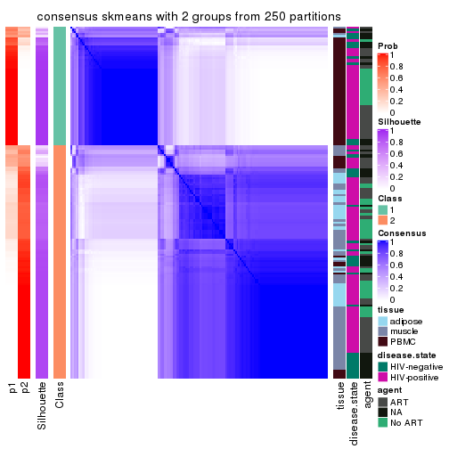</p>

</div>
<div id='tab-MAD-skmeans-consensus-heatmap-2'>
<pre><code class="r">consensus_heatmap(res, k = 3)
</code></pre>

<p>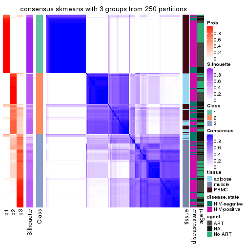</p>

</div>
<div id='tab-MAD-skmeans-consensus-heatmap-3'>
<pre><code class="r">consensus_heatmap(res, k = 4)
</code></pre>

<p>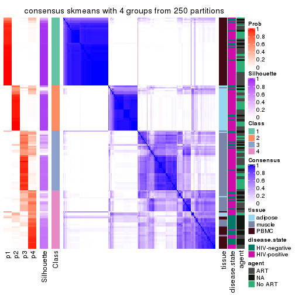</p>

</div>
<div id='tab-MAD-skmeans-consensus-heatmap-4'>
<pre><code class="r">consensus_heatmap(res, k = 5)
</code></pre>

<p>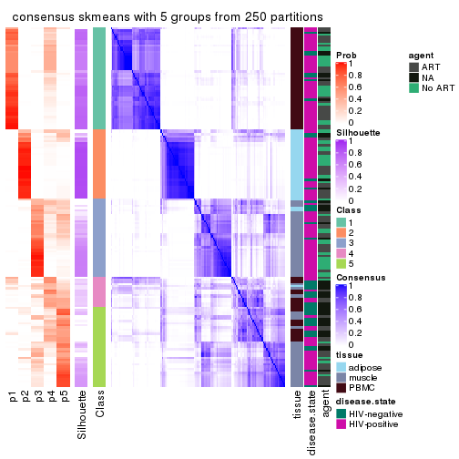</p>

</div>
<div id='tab-MAD-skmeans-consensus-heatmap-5'>
<pre><code class="r">consensus_heatmap(res, k = 6)
</code></pre>

<p>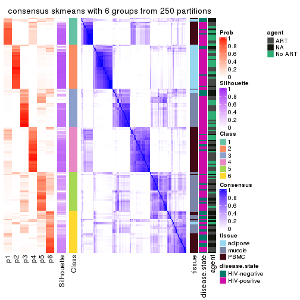</p>

</div>
</div>

Heatmaps for the membership of samples in all partitions to see how consistent they are:


<script>
$( function() {
	$( '#tabs-MAD-skmeans-membership-heatmap' ).tabs();
} );
</script>
<div id='tabs-MAD-skmeans-membership-heatmap'>
<ul>
<li><a href='#tab-MAD-skmeans-membership-heatmap-1'>k = 2</a></li>
<li><a href='#tab-MAD-skmeans-membership-heatmap-2'>k = 3</a></li>
<li><a href='#tab-MAD-skmeans-membership-heatmap-3'>k = 4</a></li>
<li><a href='#tab-MAD-skmeans-membership-heatmap-4'>k = 5</a></li>
<li><a href='#tab-MAD-skmeans-membership-heatmap-5'>k = 6</a></li>
</ul>
<div id='tab-MAD-skmeans-membership-heatmap-1'>
<pre><code class="r">membership_heatmap(res, k = 2)
</code></pre>

<p>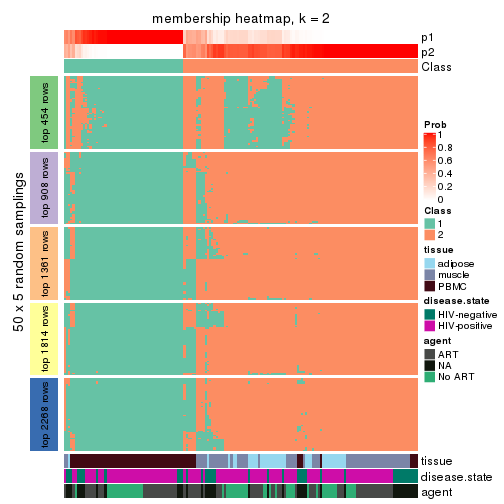</p>

</div>
<div id='tab-MAD-skmeans-membership-heatmap-2'>
<pre><code class="r">membership_heatmap(res, k = 3)
</code></pre>

<p>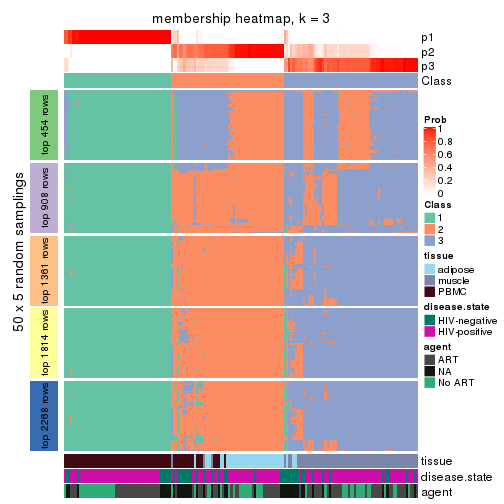</p>

</div>
<div id='tab-MAD-skmeans-membership-heatmap-3'>
<pre><code class="r">membership_heatmap(res, k = 4)
</code></pre>

<p>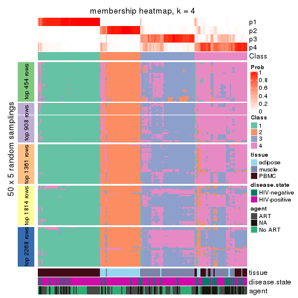</p>

</div>
<div id='tab-MAD-skmeans-membership-heatmap-4'>
<pre><code class="r">membership_heatmap(res, k = 5)
</code></pre>

<p>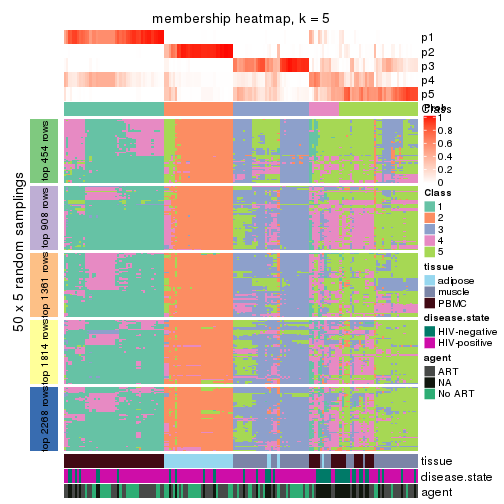</p>

</div>
<div id='tab-MAD-skmeans-membership-heatmap-5'>
<pre><code class="r">membership_heatmap(res, k = 6)
</code></pre>

<p>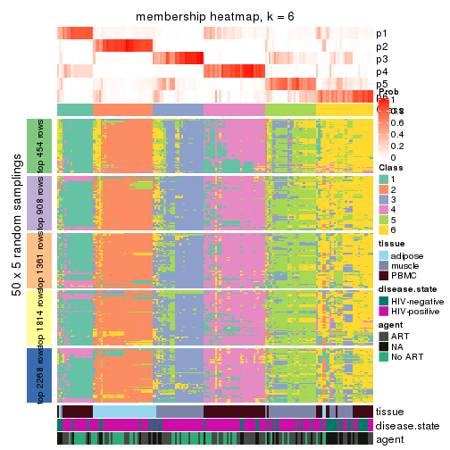</p>

</div>
</div>

As soon as we have had the classes for columns, we can look for signatures
which are significantly different between classes which can be candidate marks
for certain classes. Following are the heatmaps for signatures.


Signature heatmaps where rows are scaled:


<script>
$( function() {
	$( '#tabs-MAD-skmeans-get-signatures' ).tabs();
} );
</script>
<div id='tabs-MAD-skmeans-get-signatures'>
<ul>
<li><a href='#tab-MAD-skmeans-get-signatures-1'>k = 2</a></li>
<li><a href='#tab-MAD-skmeans-get-signatures-2'>k = 3</a></li>
<li><a href='#tab-MAD-skmeans-get-signatures-3'>k = 4</a></li>
<li><a href='#tab-MAD-skmeans-get-signatures-4'>k = 5</a></li>
<li><a href='#tab-MAD-skmeans-get-signatures-5'>k = 6</a></li>
</ul>
<div id='tab-MAD-skmeans-get-signatures-1'>
<pre><code class="r">get_signatures(res, k = 2)
</code></pre>

<p>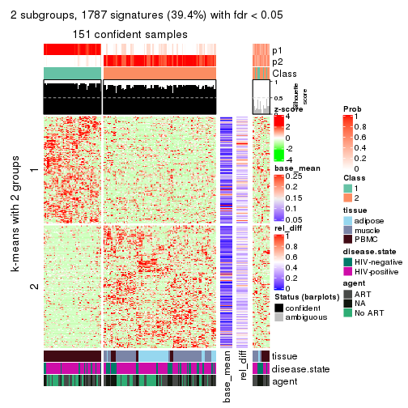</p>

</div>
<div id='tab-MAD-skmeans-get-signatures-2'>
<pre><code class="r">get_signatures(res, k = 3)
</code></pre>

<p>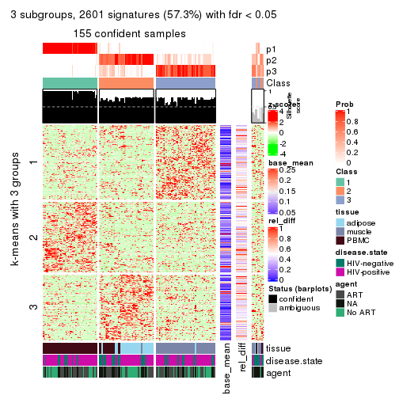</p>

</div>
<div id='tab-MAD-skmeans-get-signatures-3'>
<pre><code class="r">get_signatures(res, k = 4)
</code></pre>

<p>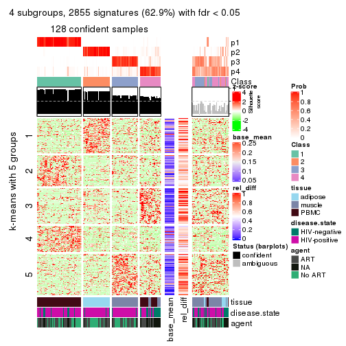</p>

</div>
<div id='tab-MAD-skmeans-get-signatures-4'>
<pre><code class="r">get_signatures(res, k = 5)
</code></pre>

<p>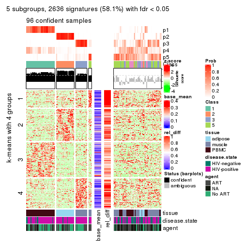</p>

</div>
<div id='tab-MAD-skmeans-get-signatures-5'>
<pre><code class="r">get_signatures(res, k = 6)
</code></pre>

<p>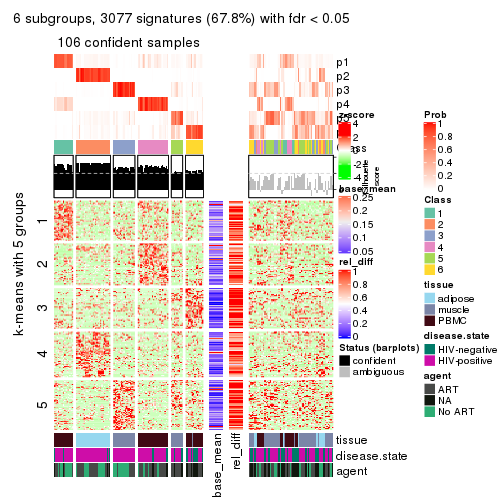</p>

</div>
</div>


Signature heatmaps where rows are not scaled:


<script>
$( function() {
	$( '#tabs-MAD-skmeans-get-signatures-no-scale' ).tabs();
} );
</script>
<div id='tabs-MAD-skmeans-get-signatures-no-scale'>
<ul>
<li><a href='#tab-MAD-skmeans-get-signatures-no-scale-1'>k = 2</a></li>
<li><a href='#tab-MAD-skmeans-get-signatures-no-scale-2'>k = 3</a></li>
<li><a href='#tab-MAD-skmeans-get-signatures-no-scale-3'>k = 4</a></li>
<li><a href='#tab-MAD-skmeans-get-signatures-no-scale-4'>k = 5</a></li>
<li><a href='#tab-MAD-skmeans-get-signatures-no-scale-5'>k = 6</a></li>
</ul>
<div id='tab-MAD-skmeans-get-signatures-no-scale-1'>
<pre><code class="r">get_signatures(res, k = 2, scale_rows = FALSE)
</code></pre>

<p>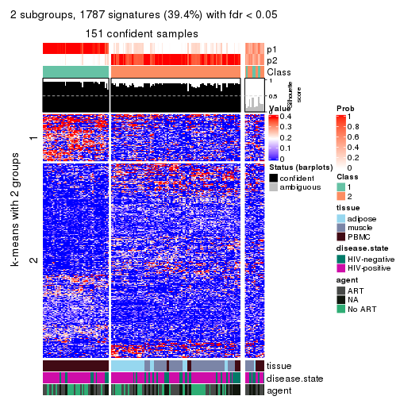</p>

</div>
<div id='tab-MAD-skmeans-get-signatures-no-scale-2'>
<pre><code class="r">get_signatures(res, k = 3, scale_rows = FALSE)
</code></pre>

<p>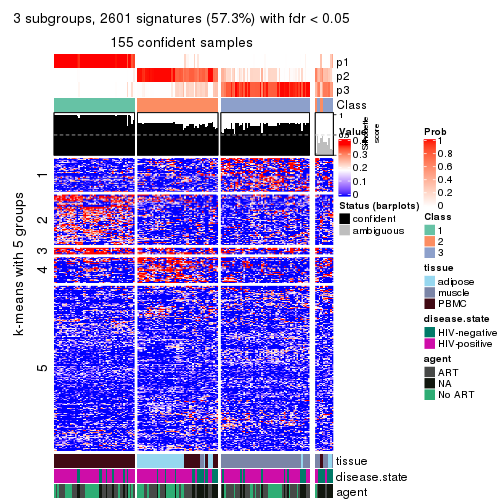</p>

</div>
<div id='tab-MAD-skmeans-get-signatures-no-scale-3'>
<pre><code class="r">get_signatures(res, k = 4, scale_rows = FALSE)
</code></pre>

<p>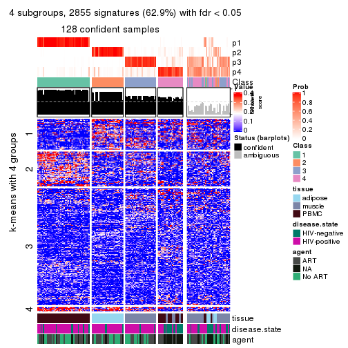</p>

</div>
<div id='tab-MAD-skmeans-get-signatures-no-scale-4'>
<pre><code class="r">get_signatures(res, k = 5, scale_rows = FALSE)
</code></pre>

<p>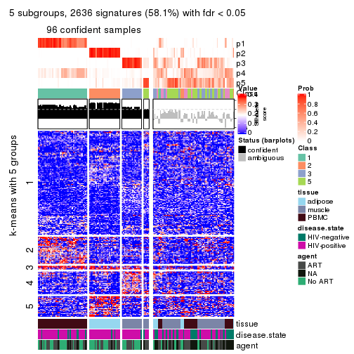</p>

</div>
<div id='tab-MAD-skmeans-get-signatures-no-scale-5'>
<pre><code class="r">get_signatures(res, k = 6, scale_rows = FALSE)
</code></pre>

<p>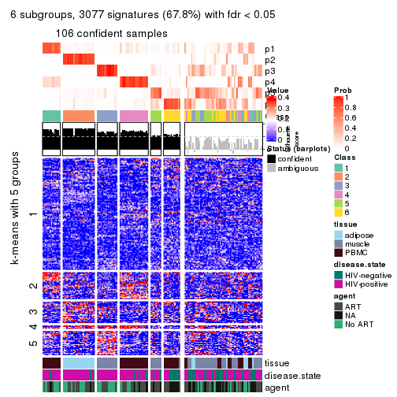</p>

</div>
</div>


Compare the overlap of signatures from different k:

```r
compare_signatures(res)
```

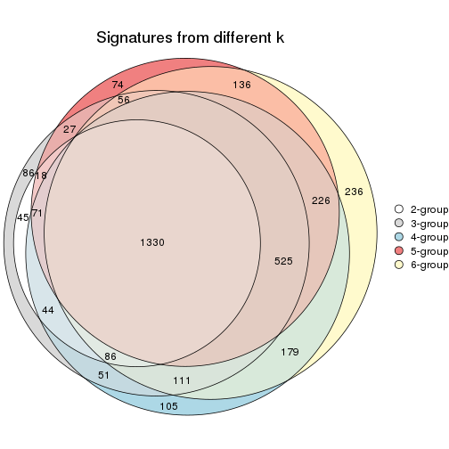

`get_signature()` returns a data frame invisibly. TO get the list of signatures, the function
call should be assigned to a variable explicitly. In following code, if `plot` argument is set
to `FALSE`, no heatmap is plotted while only the differential analysis is performed.

```r
# code only for demonstration
tb = get_signature(res, k = ..., plot = FALSE)
```

An example of the output of `tb` is:

```
#>   which_row         fdr    mean_1    mean_2 scaled_mean_1 scaled_mean_2 km
#> 1        38 0.042760348  8.373488  9.131774    -0.5533452     0.5164555  1
#> 2        40 0.018707592  7.106213  8.469186    -0.6173731     0.5762149  1
#> 3        55 0.019134737 10.221463 11.207825    -0.6159697     0.5749050  1
#> 4        59 0.006059896  5.921854  7.869574    -0.6899429     0.6439467  1
#> 5        60 0.018055526  8.928898 10.211722    -0.6204761     0.5791110  1
#> 6        98 0.009384629 15.714769 14.887706     0.6635654    -0.6193277  2
...
```

The columns in `tb` are:

1. `which_row`: row indices corresponding to the input matrix.
2. `fdr`: FDR for the differential test. 
3. `mean_x`: The mean value in group x.
4. `scaled_mean_x`: The mean value in group x after rows are scaled.
5. `km`: Row groups if k-means clustering is applied to rows.


UMAP plot which shows how samples are separated.


<script>
$( function() {
	$( '#tabs-MAD-skmeans-dimension-reduction' ).tabs();
} );
</script>
<div id='tabs-MAD-skmeans-dimension-reduction'>
<ul>
<li><a href='#tab-MAD-skmeans-dimension-reduction-1'>k = 2</a></li>
<li><a href='#tab-MAD-skmeans-dimension-reduction-2'>k = 3</a></li>
<li><a href='#tab-MAD-skmeans-dimension-reduction-3'>k = 4</a></li>
<li><a href='#tab-MAD-skmeans-dimension-reduction-4'>k = 5</a></li>
<li><a href='#tab-MAD-skmeans-dimension-reduction-5'>k = 6</a></li>
</ul>
<div id='tab-MAD-skmeans-dimension-reduction-1'>
<pre><code class="r">dimension_reduction(res, k = 2, method = &quot;UMAP&quot;)
</code></pre>

<p>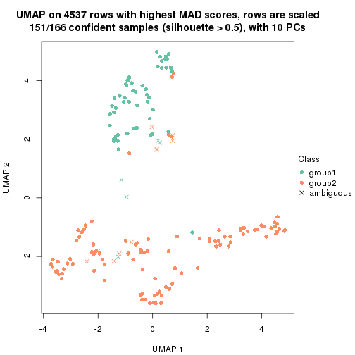</p>

</div>
<div id='tab-MAD-skmeans-dimension-reduction-2'>
<pre><code class="r">dimension_reduction(res, k = 3, method = &quot;UMAP&quot;)
</code></pre>

<p>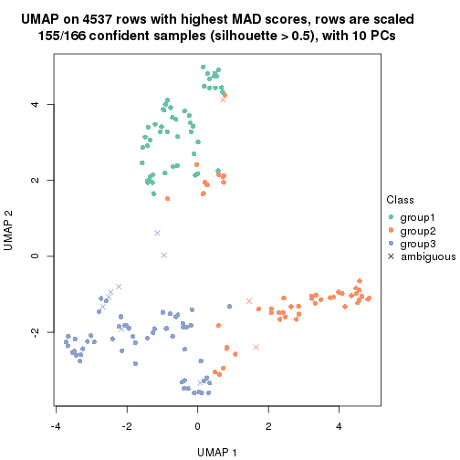</p>

</div>
<div id='tab-MAD-skmeans-dimension-reduction-3'>
<pre><code class="r">dimension_reduction(res, k = 4, method = &quot;UMAP&quot;)
</code></pre>

<p>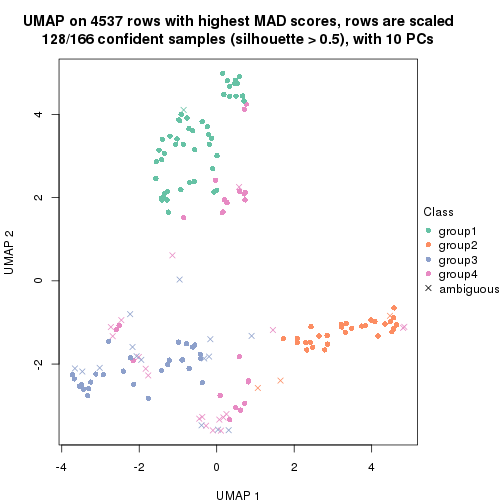</p>

</div>
<div id='tab-MAD-skmeans-dimension-reduction-4'>
<pre><code class="r">dimension_reduction(res, k = 5, method = &quot;UMAP&quot;)
</code></pre>

<p>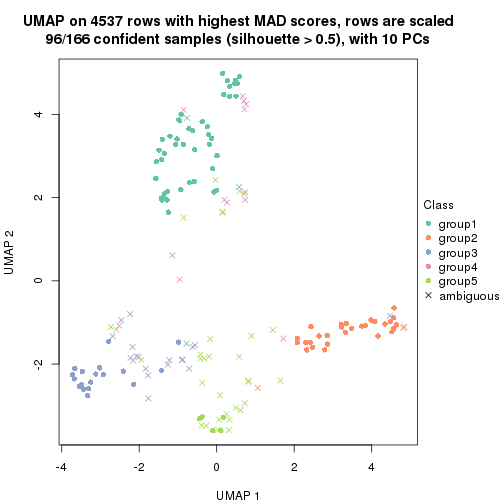</p>

</div>
<div id='tab-MAD-skmeans-dimension-reduction-5'>
<pre><code class="r">dimension_reduction(res, k = 6, method = &quot;UMAP&quot;)
</code></pre>

<p>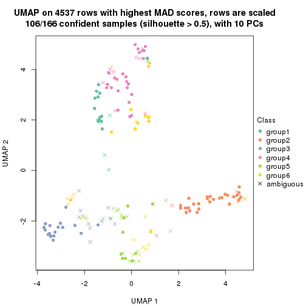</p>

</div>
</div>


Following heatmap shows how subgroups are split when increasing `k`:

```r
collect_classes(res)
```

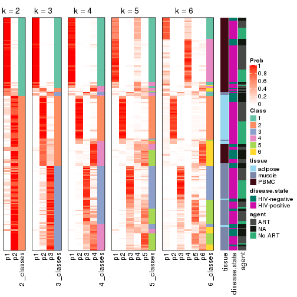


Test correlation between subgroups and known annotations. If the known
annotation is numeric, one-way ANOVA test is applied, and if the known
annotation is discrete, chi-squared contingency table test is applied.

```r
test_to_known_factors(res)
```

```
#>               n tissue(p) disease.state(p) agent(p) k
#> MAD:skmeans 151  4.34e-26         3.44e-01 5.07e-01 2
#> MAD:skmeans 155  9.83e-47         1.81e-01 4.45e-01 3
#> MAD:skmeans 128  1.64e-46         5.61e-07 4.24e-06 4
#> MAD:skmeans  96  9.56e-39         5.25e-01 2.53e-01 5
#> MAD:skmeans 106  7.24e-39         6.32e-04 6.80e-05 6
```


If matrix rows can be associated to genes, consider to use `GO_Enrichment(res,
...)` to perform function enrichment for the signature genes.


 

---------------------------------------------------


### MAD:pam


The object with results only for a single top-value method and a single partition method 
can be extracted as:

```r
res = res_list["MAD", "pam"]
# you can also extract it by
# res = res_list["MAD:pam"]
```

A summary of `res` and all the functions that can be applied to it:

```r
res
```

```
#> A 'ConsensusPartition' object with k = 2, 3, 4, 5, 6.
#>   On a matrix with 4537 rows and 166 columns.
#>   Top rows (454, 908, 1361, 1814, 2268) are extracted by 'MAD' method.
#>   Subgroups are detected by 'pam' method.
#>   Performed in total 1250 partitions by row resampling.
#>   Best k for subgroups seems to be 2.
#> 
#> Following methods can be applied to this 'ConsensusPartition' object:
#>  [1] "cola_report"             "collect_classes"         "collect_plots"          
#>  [4] "collect_stats"           "colnames"                "compare_signatures"     
#>  [7] "consensus_heatmap"       "dimension_reduction"     "functional_enrichment"  
#> [10] "get_anno_col"            "get_anno"                "get_classes"            
#> [13] "get_consensus"           "get_matrix"              "get_membership"         
#> [16] "get_param"               "get_signatures"          "get_stats"              
#> [19] "is_best_k"               "is_stable_k"             "membership_heatmap"     
#> [22] "ncol"                    "nrow"                    "plot_ecdf"              
#> [25] "rownames"                "select_partition_number" "show"                   
#> [28] "suggest_best_k"          "test_to_known_factors"
```

`collect_plots()` function collects all the plots made from `res` for all `k` (number of partitions)
into one single page to provide an easy and fast comparison between different `k`.

```r
collect_plots(res)
```

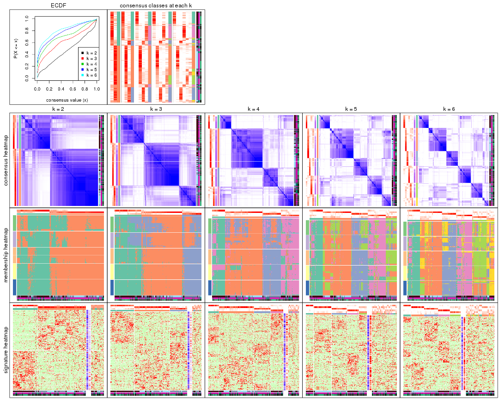

The plots are:

- The first row: a plot of the ECDF (Empirical cumulative distribution
  function) curves of the consensus matrix for each `k` and the heatmap of
  predicted classes for each `k`.
- The second row: heatmaps of the consensus matrix for each `k`.
- The third row: heatmaps of the membership matrix for each `k`.
- The fouth row: heatmaps of the signatures for each `k`.

All the plots in panels can be made by individual functions and they are
plotted later in this section.

`select_partition_number()` produces several plots showing different
statistics for choosing "optimized" `k`. There are following statistics:

- ECDF curves of the consensus matrix for each `k`;
- 1-PAC. [The PAC
  score](https://en.wikipedia.org/wiki/Consensus_clustering#Over-interpretation_potential_of_consensus_clustering)
  measures the proportion of the ambiguous subgrouping.
- Mean silhouette score.
- Concordance. The mean probability of fiting the consensus class ids in all
  partitions.
- Area increased. Denote $A_k$ as the area under the ECDF curve for current
  `k`, the area increased is defined as $A_k - A_{k-1}$.
- Rand index. The percent of pairs of samples that are both in a same cluster
  or both are not in a same cluster in the partition of k and k-1.
- Jaccard index. The ratio of pairs of samples are both in a same cluster in
  the partition of k and k-1 and the pairs of samples are both in a same
  cluster in the partition k or k-1.

The detailed explanations of these statistics can be found in [the cola
vignette](http://bioconductor.org/packages/devel/bioc/vignettes/cola/inst/doc/cola.html#toc_13).

Generally speaking, lower PAC score, higher mean silhouette score or higher
concordance corresponds to better partition. Rand index and Jaccard index
measure how similar the current partition is compared to partition with `k-1`.
If they are too similar, we won't accept `k` is better than `k-1`.

```r
select_partition_number(res)
```

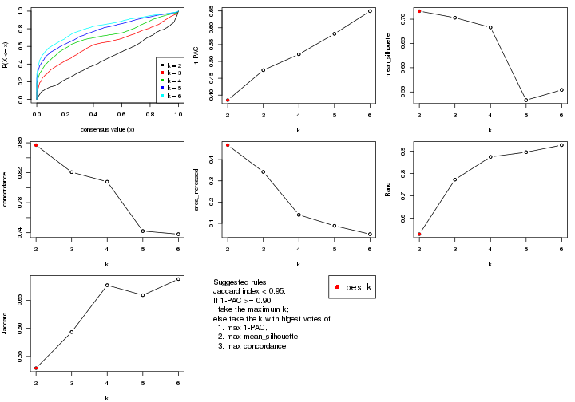

The numeric values for all these statistics can be obtained by `get_stats()`.

```r
get_stats(res)
```

```
#>   k 1-PAC mean_silhouette concordance area_increased  Rand Jaccard
#> 2 2 0.385           0.717       0.857         0.4680 0.529   0.529
#> 3 3 0.474           0.703       0.821         0.3421 0.773   0.593
#> 4 4 0.521           0.683       0.808         0.1402 0.874   0.677
#> 5 5 0.582           0.533       0.742         0.0887 0.895   0.659
#> 6 6 0.649           0.554       0.738         0.0494 0.927   0.688
```

`suggest_best_k()` suggests the best $k$ based on these statistics. The rules are as follows:

- All $k$ with Jaccard index larger than 0.95 are removed because the increase of
  the partition number does not provides enough extra information. If all $k$ are removed,
  the best $k$ is assigned by `NA`.
- For $k$ with 1-PAC larger than 0.9, the maximal $k$ is taken as the "best k". Other $k$ is called "optional k".
- If it does not fit the second rule. The $k$ with the highest vote of highest
  1-PAC, mean silhouette and concordance is taken as the "best k".

```r
suggest_best_k(res)
```

```
#> [1] 2
```


Following shows the table of the partitions (You need to click the **show/hide
code output** link to see it). The membership matrix (columns with name `p*`)
is inferred by
[`clue::cl_consensus()`](https://www.rdocumentation.org/link/cl_consensus?package=clue)
function with the `SE` method. Basically the value in the membership matrix
represents the probability to belong to a certain group. The finall class
label for an item is determined with the group with highest probability it
belongs to.

In `get_classes()` function, the entropy is calculated from the membership
matrix and the silhouette score is calculated from the consensus matrix.


<script>
$( function() {
	$( '#tabs-MAD-pam-get-classes' ).tabs();
} );
</script>
<div id='tabs-MAD-pam-get-classes'>
<ul>
<li><a href='#tab-MAD-pam-get-classes-1'>k = 2</a></li>
<li><a href='#tab-MAD-pam-get-classes-2'>k = 3</a></li>
<li><a href='#tab-MAD-pam-get-classes-3'>k = 4</a></li>
<li><a href='#tab-MAD-pam-get-classes-4'>k = 5</a></li>
<li><a href='#tab-MAD-pam-get-classes-5'>k = 6</a></li>
</ul>

<div id='tab-MAD-pam-get-classes-1'>
<p><a id='tab-MAD-pam-get-classes-1-a' style='color:#0366d6' href='#'>show/hide code output</a></p>
<pre><code class="r">cbind(get_classes(res, k = 2), get_membership(res, k = 2))
</code></pre>

<pre><code>#&gt;           class entropy silhouette    p1    p2
#&gt; GSM751298     1  0.3274     0.7859 0.940 0.060
#&gt; GSM751304     2  0.8813     0.5987 0.300 0.700
#&gt; GSM751305     2  0.9491     0.4782 0.368 0.632
#&gt; GSM751307     1  0.5842     0.7547 0.860 0.140
#&gt; GSM751310     1  0.1633     0.7839 0.976 0.024
#&gt; GSM751314     1  0.0376     0.7887 0.996 0.004
#&gt; GSM751316     1  0.7139     0.6879 0.804 0.196
#&gt; GSM751318     1  0.0672     0.7881 0.992 0.008
#&gt; GSM751342     1  0.1633     0.7839 0.976 0.024
#&gt; GSM751346     1  0.7815     0.6951 0.768 0.232
#&gt; GSM751347     1  0.9993     0.3528 0.516 0.484
#&gt; GSM751348     2  0.9988     0.0961 0.480 0.520
#&gt; GSM751349     2  0.0000     0.8556 0.000 1.000
#&gt; GSM751352     2  0.0672     0.8559 0.008 0.992
#&gt; GSM751353     2  0.0000     0.8556 0.000 1.000
#&gt; GSM751354     2  0.8443     0.6366 0.272 0.728
#&gt; GSM751355     2  0.5629     0.7904 0.132 0.868
#&gt; GSM751358     2  0.9909     0.2967 0.444 0.556
#&gt; GSM751359     2  0.7745     0.6947 0.228 0.772
#&gt; GSM751294     2  0.8016     0.6744 0.244 0.756
#&gt; GSM751296     1  0.1184     0.7906 0.984 0.016
#&gt; GSM751297     1  0.9850     0.1999 0.572 0.428
#&gt; GSM751299     2  0.0672     0.8557 0.008 0.992
#&gt; GSM751300     1  0.6623     0.7449 0.828 0.172
#&gt; GSM751301     1  0.7674     0.7049 0.776 0.224
#&gt; GSM751302     1  0.9850     0.4433 0.572 0.428
#&gt; GSM751303     1  0.3733     0.7738 0.928 0.072
#&gt; GSM751306     1  0.1633     0.7839 0.976 0.024
#&gt; GSM751308     2  0.9635     0.4682 0.388 0.612
#&gt; GSM751309     1  0.1184     0.7858 0.984 0.016
#&gt; GSM751311     1  0.0000     0.7886 1.000 0.000
#&gt; GSM751312     1  0.9427     0.3835 0.640 0.360
#&gt; GSM751313     1  0.0000     0.7886 1.000 0.000
#&gt; GSM751315     1  0.0376     0.7887 0.996 0.004
#&gt; GSM751317     1  0.1633     0.7839 0.976 0.024
#&gt; GSM751320     1  0.0000     0.7886 1.000 0.000
#&gt; GSM751321     1  0.0672     0.7880 0.992 0.008
#&gt; GSM751322     1  0.0000     0.7886 1.000 0.000
#&gt; GSM751324     1  0.0000     0.7886 1.000 0.000
#&gt; GSM751325     1  0.0000     0.7886 1.000 0.000
#&gt; GSM751332     1  0.0938     0.7906 0.988 0.012
#&gt; GSM751334     1  0.1414     0.7901 0.980 0.020
#&gt; GSM751339     1  0.3879     0.7755 0.924 0.076
#&gt; GSM751341     1  0.0376     0.7887 0.996 0.004
#&gt; GSM751343     1  0.0000     0.7886 1.000 0.000
#&gt; GSM751344     2  0.3879     0.8280 0.076 0.924
#&gt; GSM751345     2  0.3584     0.8335 0.068 0.932
#&gt; GSM751356     2  0.7528     0.7101 0.216 0.784
#&gt; GSM751357     2  0.8016     0.6764 0.244 0.756
#&gt; GSM751293     1  0.6438     0.7447 0.836 0.164
#&gt; GSM751295     1  0.8386     0.6581 0.732 0.268
#&gt; GSM751319     1  0.4431     0.7756 0.908 0.092
#&gt; GSM751323     1  0.5629     0.7555 0.868 0.132
#&gt; GSM751326     1  0.8499     0.6576 0.724 0.276
#&gt; GSM751327     1  0.5737     0.7607 0.864 0.136
#&gt; GSM751328     1  0.2236     0.7886 0.964 0.036
#&gt; GSM751329     1  0.8386     0.6609 0.732 0.268
#&gt; GSM751330     1  0.8608     0.6489 0.716 0.284
#&gt; GSM751331     1  0.9909     0.4119 0.556 0.444
#&gt; GSM751333     1  0.8081     0.6821 0.752 0.248
#&gt; GSM751335     1  0.8909     0.6199 0.692 0.308
#&gt; GSM751336     1  0.9909     0.4119 0.556 0.444
#&gt; GSM751337     1  0.0672     0.7904 0.992 0.008
#&gt; GSM751338     1  0.0000     0.7886 1.000 0.000
#&gt; GSM751340     1  0.9248     0.4730 0.660 0.340
#&gt; GSM751350     1  0.9209     0.5886 0.664 0.336
#&gt; GSM751351     1  0.9000     0.6112 0.684 0.316
#&gt; GSM751362     2  0.9710     0.4090 0.400 0.600
#&gt; GSM751363     1  0.6247     0.7261 0.844 0.156
#&gt; GSM751367     1  0.9686     0.3481 0.604 0.396
#&gt; GSM751368     2  0.0672     0.8560 0.008 0.992
#&gt; GSM751371     2  0.9977     0.2116 0.472 0.528
#&gt; GSM751375     2  0.0000     0.8556 0.000 1.000
#&gt; GSM751376     2  0.8144     0.6672 0.252 0.748
#&gt; GSM751378     2  0.6801     0.7461 0.180 0.820
#&gt; GSM751379     2  0.8763     0.6136 0.296 0.704
#&gt; GSM751382     2  0.3274     0.8383 0.060 0.940
#&gt; GSM751386     2  0.0000     0.8556 0.000 1.000
#&gt; GSM751388     2  0.0376     0.8559 0.004 0.996
#&gt; GSM751391     2  0.9087     0.5624 0.324 0.676
#&gt; GSM751410     1  0.7815     0.6362 0.768 0.232
#&gt; GSM751414     1  0.2948     0.7824 0.948 0.052
#&gt; GSM751361     2  0.3114     0.8338 0.056 0.944
#&gt; GSM751365     2  0.9996     0.0128 0.488 0.512
#&gt; GSM751366     1  0.6438     0.7126 0.836 0.164
#&gt; GSM751369     2  0.4298     0.8263 0.088 0.912
#&gt; GSM751370     1  0.9522     0.3938 0.628 0.372
#&gt; GSM751372     2  0.7453     0.7192 0.212 0.788
#&gt; GSM751373     1  0.9988     0.3324 0.520 0.480
#&gt; GSM751374     2  0.8144     0.6643 0.252 0.748
#&gt; GSM751377     2  0.2236     0.8490 0.036 0.964
#&gt; GSM751380     1  0.9775     0.1961 0.588 0.412
#&gt; GSM751381     2  0.6531     0.7568 0.168 0.832
#&gt; GSM751383     2  0.1184     0.8549 0.016 0.984
#&gt; GSM751384     2  0.6247     0.7687 0.156 0.844
#&gt; GSM751385     2  0.0000     0.8556 0.000 1.000
#&gt; GSM751387     2  0.0000     0.8556 0.000 1.000
#&gt; GSM751389     2  0.7602     0.7081 0.220 0.780
#&gt; GSM751393     2  0.1633     0.8530 0.024 0.976
#&gt; GSM751394     2  0.0376     0.8559 0.004 0.996
#&gt; GSM751395     2  0.1633     0.8528 0.024 0.976
#&gt; GSM751397     2  0.0376     0.8560 0.004 0.996
#&gt; GSM751398     2  0.0000     0.8556 0.000 1.000
#&gt; GSM751404     2  0.6438     0.7861 0.164 0.836
#&gt; GSM751406     2  0.5842     0.7860 0.140 0.860
#&gt; GSM751411     1  0.7056     0.6935 0.808 0.192
#&gt; GSM751413     2  0.8499     0.6149 0.276 0.724
#&gt; GSM751415     1  0.9661     0.2878 0.608 0.392
#&gt; GSM751416     2  0.0000     0.8556 0.000 1.000
#&gt; GSM751417     2  0.0000     0.8556 0.000 1.000
#&gt; GSM751421     2  0.6343     0.7713 0.160 0.840
#&gt; GSM751422     2  0.3733     0.8336 0.072 0.928
#&gt; GSM751360     2  0.9944     0.2613 0.456 0.544
#&gt; GSM751364     2  0.2043     0.8506 0.032 0.968
#&gt; GSM751390     2  0.2043     0.8502 0.032 0.968
#&gt; GSM751392     2  0.0000     0.8556 0.000 1.000
#&gt; GSM751396     2  0.1184     0.8549 0.016 0.984
#&gt; GSM751399     2  0.0376     0.8560 0.004 0.996
#&gt; GSM751400     2  0.1633     0.8533 0.024 0.976
#&gt; GSM751401     2  0.2948     0.8411 0.052 0.948
#&gt; GSM751402     2  0.2948     0.8448 0.052 0.948
#&gt; GSM751403     2  0.1414     0.8544 0.020 0.980
#&gt; GSM751405     2  0.8955     0.5767 0.312 0.688
#&gt; GSM751407     2  0.2043     0.8542 0.032 0.968
#&gt; GSM751408     2  0.1414     0.8544 0.020 0.980
#&gt; GSM751409     2  0.5946     0.7785 0.144 0.856
#&gt; GSM751412     2  0.8555     0.5737 0.280 0.720
#&gt; GSM751418     1  0.9909     0.4278 0.556 0.444
#&gt; GSM751419     2  0.8016     0.5504 0.244 0.756
#&gt; GSM751420     2  0.1843     0.8560 0.028 0.972
#&gt; GSM751425     2  0.0000     0.8556 0.000 1.000
#&gt; GSM751429     1  0.9393     0.4448 0.644 0.356
#&gt; GSM751430     2  0.0000     0.8556 0.000 1.000
#&gt; GSM751433     2  0.4022     0.8128 0.080 0.920
#&gt; GSM751437     2  0.9896     0.3065 0.440 0.560
#&gt; GSM751448     2  0.9833     0.3905 0.424 0.576
#&gt; GSM751451     2  0.2603     0.8467 0.044 0.956
#&gt; GSM751423     2  0.2948     0.8416 0.052 0.948
#&gt; GSM751424     2  0.0376     0.8560 0.004 0.996
#&gt; GSM751428     2  0.1414     0.8544 0.020 0.980
#&gt; GSM751431     2  0.0000     0.8556 0.000 1.000
#&gt; GSM751432     2  0.0376     0.8560 0.004 0.996
#&gt; GSM751434     2  0.1633     0.8533 0.024 0.976
#&gt; GSM751435     2  0.1633     0.8533 0.024 0.976
#&gt; GSM751436     2  0.1633     0.8533 0.024 0.976
#&gt; GSM751440     2  0.1633     0.8533 0.024 0.976
#&gt; GSM751444     2  0.1633     0.8533 0.024 0.976
#&gt; GSM751446     2  0.1633     0.8533 0.024 0.976
#&gt; GSM751449     2  0.1633     0.8533 0.024 0.976
#&gt; GSM751450     2  0.9922    -0.0103 0.448 0.552
#&gt; GSM751452     2  0.0938     0.8556 0.012 0.988
#&gt; GSM751426     2  0.1633     0.8533 0.024 0.976
#&gt; GSM751427     2  0.1414     0.8544 0.020 0.980
#&gt; GSM751438     2  0.1633     0.8533 0.024 0.976
#&gt; GSM751439     2  0.1633     0.8533 0.024 0.976
#&gt; GSM751441     2  0.1633     0.8533 0.024 0.976
#&gt; GSM751442     2  0.1633     0.8533 0.024 0.976
#&gt; GSM751443     2  0.1633     0.8533 0.024 0.976
#&gt; GSM751445     2  0.0000     0.8556 0.000 1.000
#&gt; GSM751447     2  0.1633     0.8533 0.024 0.976
#&gt; GSM751453     2  0.1633     0.8533 0.024 0.976
#&gt; GSM751454     2  0.1633     0.8533 0.024 0.976
#&gt; GSM751455     2  0.1633     0.8533 0.024 0.976
#&gt; GSM751456     2  0.1633     0.8533 0.024 0.976
#&gt; GSM751457     2  0.0672     0.8557 0.008 0.992
#&gt; GSM751458     2  0.0672     0.8557 0.008 0.992
</code></pre>

<script>
$('#tab-MAD-pam-get-classes-1-a').parent().next().next().hide();
$('#tab-MAD-pam-get-classes-1-a').click(function(){
  $('#tab-MAD-pam-get-classes-1-a').parent().next().next().toggle();
  return(false);
});
</script>
</div>

<div id='tab-MAD-pam-get-classes-2'>
<p><a id='tab-MAD-pam-get-classes-2-a' style='color:#0366d6' href='#'>show/hide code output</a></p>
<pre><code class="r">cbind(get_classes(res, k = 3), get_membership(res, k = 3))
</code></pre>

<pre><code>#&gt;           class entropy silhouette    p1    p2    p3
#&gt; GSM751298     1  0.6142     0.7874 0.748 0.040 0.212
#&gt; GSM751304     2  0.6696     0.5444 0.020 0.632 0.348
#&gt; GSM751305     2  0.7209     0.4975 0.036 0.604 0.360
#&gt; GSM751307     1  0.8442     0.6024 0.548 0.100 0.352
#&gt; GSM751310     1  0.6102     0.7368 0.672 0.008 0.320
#&gt; GSM751314     1  0.5327     0.7696 0.728 0.000 0.272
#&gt; GSM751316     1  0.9587     0.4122 0.440 0.204 0.356
#&gt; GSM751318     1  0.6771     0.7562 0.684 0.040 0.276
#&gt; GSM751342     1  0.5810     0.7263 0.664 0.000 0.336
#&gt; GSM751346     1  0.1832     0.7704 0.956 0.008 0.036
#&gt; GSM751347     1  0.5988     0.6584 0.776 0.168 0.056
#&gt; GSM751348     3  0.8085     0.4069 0.084 0.332 0.584
#&gt; GSM751349     2  0.3482     0.7993 0.000 0.872 0.128
#&gt; GSM751352     2  0.1585     0.8215 0.028 0.964 0.008
#&gt; GSM751353     2  0.3038     0.8098 0.000 0.896 0.104
#&gt; GSM751354     2  0.6169     0.5496 0.004 0.636 0.360
#&gt; GSM751355     2  0.4887     0.7263 0.000 0.772 0.228
#&gt; GSM751358     3  0.6565     0.4788 0.048 0.232 0.720
#&gt; GSM751359     2  0.5327     0.6749 0.000 0.728 0.272
#&gt; GSM751294     2  0.5810     0.5944 0.000 0.664 0.336
#&gt; GSM751296     1  0.2066     0.7879 0.940 0.000 0.060
#&gt; GSM751297     3  0.2527     0.6851 0.044 0.020 0.936
#&gt; GSM751299     2  0.2165     0.8215 0.000 0.936 0.064
#&gt; GSM751300     1  0.0892     0.7749 0.980 0.020 0.000
#&gt; GSM751301     1  0.6107     0.6916 0.764 0.184 0.052
#&gt; GSM751302     1  0.2711     0.7421 0.912 0.088 0.000
#&gt; GSM751303     1  0.7622     0.6762 0.608 0.060 0.332
#&gt; GSM751306     1  0.6075     0.7398 0.676 0.008 0.316
#&gt; GSM751308     2  0.7830     0.5070 0.136 0.668 0.196
#&gt; GSM751309     1  0.5785     0.7295 0.668 0.000 0.332
#&gt; GSM751311     1  0.5216     0.7752 0.740 0.000 0.260
#&gt; GSM751312     2  0.9947    -0.0573 0.288 0.376 0.336
#&gt; GSM751313     1  0.1289     0.7879 0.968 0.000 0.032
#&gt; GSM751315     1  0.5216     0.7752 0.740 0.000 0.260
#&gt; GSM751317     1  0.6369     0.7369 0.668 0.016 0.316
#&gt; GSM751320     1  0.5016     0.7826 0.760 0.000 0.240
#&gt; GSM751321     1  0.5216     0.7752 0.740 0.000 0.260
#&gt; GSM751322     1  0.5016     0.7824 0.760 0.000 0.240
#&gt; GSM751324     1  0.5216     0.7752 0.740 0.000 0.260
#&gt; GSM751325     1  0.5058     0.7810 0.756 0.000 0.244
#&gt; GSM751332     1  0.3038     0.7957 0.896 0.000 0.104
#&gt; GSM751334     1  0.2400     0.7897 0.932 0.004 0.064
#&gt; GSM751339     1  0.8341     0.3215 0.468 0.080 0.452
#&gt; GSM751341     1  0.5706     0.7386 0.680 0.000 0.320
#&gt; GSM751343     1  0.5058     0.7810 0.756 0.000 0.244
#&gt; GSM751344     2  0.4235     0.7683 0.000 0.824 0.176
#&gt; GSM751345     2  0.4062     0.7786 0.000 0.836 0.164
#&gt; GSM751356     2  0.5591     0.6354 0.000 0.696 0.304
#&gt; GSM751357     2  0.5650     0.6232 0.000 0.688 0.312
#&gt; GSM751293     1  0.5237     0.7454 0.824 0.120 0.056
#&gt; GSM751295     1  0.2772     0.7474 0.916 0.080 0.004
#&gt; GSM751319     1  0.2749     0.7903 0.924 0.012 0.064
#&gt; GSM751323     1  0.2116     0.7833 0.948 0.012 0.040
#&gt; GSM751326     1  0.1411     0.7689 0.964 0.036 0.000
#&gt; GSM751327     1  0.1015     0.7764 0.980 0.012 0.008
#&gt; GSM751328     1  0.2448     0.7921 0.924 0.000 0.076
#&gt; GSM751329     1  0.2297     0.7806 0.944 0.020 0.036
#&gt; GSM751330     1  0.1529     0.7670 0.960 0.040 0.000
#&gt; GSM751331     1  0.2878     0.7369 0.904 0.096 0.000
#&gt; GSM751333     1  0.0747     0.7730 0.984 0.016 0.000
#&gt; GSM751335     1  0.0892     0.7716 0.980 0.020 0.000
#&gt; GSM751336     1  0.2878     0.7369 0.904 0.096 0.000
#&gt; GSM751337     1  0.3619     0.7943 0.864 0.000 0.136
#&gt; GSM751338     1  0.3686     0.7939 0.860 0.000 0.140
#&gt; GSM751340     1  0.9818     0.2978 0.408 0.248 0.344
#&gt; GSM751350     1  0.1529     0.7670 0.960 0.040 0.000
#&gt; GSM751351     1  0.0892     0.7716 0.980 0.020 0.000
#&gt; GSM751362     3  0.1129     0.6921 0.004 0.020 0.976
#&gt; GSM751363     1  0.9193     0.4834 0.480 0.156 0.364
#&gt; GSM751367     2  0.9997    -0.1601 0.324 0.344 0.332
#&gt; GSM751368     2  0.0661     0.8224 0.008 0.988 0.004
#&gt; GSM751371     2  0.8457     0.3931 0.100 0.544 0.356
#&gt; GSM751375     2  0.3412     0.8010 0.000 0.876 0.124
#&gt; GSM751376     3  0.3192     0.7544 0.000 0.112 0.888
#&gt; GSM751378     3  0.4235     0.7516 0.000 0.176 0.824
#&gt; GSM751379     3  0.2590     0.7292 0.004 0.072 0.924
#&gt; GSM751382     2  0.3686     0.7961 0.000 0.860 0.140
#&gt; GSM751386     2  0.3551     0.7997 0.000 0.868 0.132
#&gt; GSM751388     2  0.2878     0.8126 0.000 0.904 0.096
#&gt; GSM751391     2  0.7099     0.4504 0.028 0.588 0.384
#&gt; GSM751410     3  0.6488     0.4162 0.160 0.084 0.756
#&gt; GSM751414     1  0.7065     0.6794 0.616 0.032 0.352
#&gt; GSM751361     2  0.3141     0.8182 0.020 0.912 0.068
#&gt; GSM751365     3  0.4195     0.7559 0.012 0.136 0.852
#&gt; GSM751366     3  0.2569     0.6649 0.032 0.032 0.936
#&gt; GSM751369     3  0.5138     0.7297 0.000 0.252 0.748
#&gt; GSM751370     3  0.9996    -0.1805 0.320 0.336 0.344
#&gt; GSM751372     2  0.5737     0.6245 0.012 0.732 0.256
#&gt; GSM751373     1  0.6786     0.3159 0.540 0.448 0.012
#&gt; GSM751374     3  0.2625     0.7388 0.000 0.084 0.916
#&gt; GSM751377     3  0.5431     0.7005 0.000 0.284 0.716
#&gt; GSM751380     3  0.4335     0.6648 0.036 0.100 0.864
#&gt; GSM751381     2  0.5008     0.7485 0.016 0.804 0.180
#&gt; GSM751383     2  0.0237     0.8238 0.000 0.996 0.004
#&gt; GSM751384     2  0.6451     0.3904 0.008 0.608 0.384
#&gt; GSM751385     2  0.6302    -0.0703 0.000 0.520 0.480
#&gt; GSM751387     2  0.0892     0.8242 0.000 0.980 0.020
#&gt; GSM751389     3  0.4002     0.7561 0.000 0.160 0.840
#&gt; GSM751393     3  0.5138     0.7139 0.000 0.252 0.748
#&gt; GSM751394     2  0.3192     0.8064 0.000 0.888 0.112
#&gt; GSM751395     3  0.5058     0.7196 0.000 0.244 0.756
#&gt; GSM751397     2  0.3412     0.8022 0.000 0.876 0.124
#&gt; GSM751398     2  0.2959     0.8130 0.000 0.900 0.100
#&gt; GSM751404     3  0.5988     0.7171 0.008 0.304 0.688
#&gt; GSM751406     3  0.4121     0.7566 0.000 0.168 0.832
#&gt; GSM751411     3  0.0983     0.6707 0.016 0.004 0.980
#&gt; GSM751413     2  0.7398     0.6385 0.120 0.700 0.180
#&gt; GSM751415     3  0.1267     0.6612 0.024 0.004 0.972
#&gt; GSM751416     2  0.0592     0.8253 0.000 0.988 0.012
#&gt; GSM751417     2  0.0237     0.8237 0.000 0.996 0.004
#&gt; GSM751421     2  0.5138     0.6884 0.000 0.748 0.252
#&gt; GSM751422     2  0.4514     0.7827 0.012 0.832 0.156
#&gt; GSM751360     2  0.8102     0.4193 0.076 0.556 0.368
#&gt; GSM751364     2  0.1765     0.8253 0.004 0.956 0.040
#&gt; GSM751390     2  0.2703     0.8021 0.016 0.928 0.056
#&gt; GSM751392     2  0.2711     0.8152 0.000 0.912 0.088
#&gt; GSM751396     2  0.0000     0.8229 0.000 1.000 0.000
#&gt; GSM751399     3  0.5529     0.6985 0.000 0.296 0.704
#&gt; GSM751400     2  0.0592     0.8184 0.000 0.988 0.012
#&gt; GSM751401     3  0.6111     0.6357 0.000 0.396 0.604
#&gt; GSM751402     3  0.6026     0.6555 0.000 0.376 0.624
#&gt; GSM751403     3  0.5988     0.6566 0.000 0.368 0.632
#&gt; GSM751405     3  0.1999     0.7076 0.012 0.036 0.952
#&gt; GSM751407     3  0.6026     0.6571 0.000 0.376 0.624
#&gt; GSM751408     3  0.6180     0.6109 0.000 0.416 0.584
#&gt; GSM751409     3  0.4504     0.7456 0.000 0.196 0.804
#&gt; GSM751412     3  0.6200     0.7110 0.012 0.312 0.676
#&gt; GSM751418     3  0.7328     0.6688 0.044 0.344 0.612
#&gt; GSM751419     3  0.6111     0.6357 0.000 0.396 0.604
#&gt; GSM751420     3  0.6282     0.6516 0.004 0.384 0.612
#&gt; GSM751425     2  0.3412     0.8010 0.000 0.876 0.124
#&gt; GSM751429     3  0.1647     0.7093 0.004 0.036 0.960
#&gt; GSM751430     2  0.0237     0.8237 0.000 0.996 0.004
#&gt; GSM751433     2  0.1964     0.7872 0.056 0.944 0.000
#&gt; GSM751437     3  0.0237     0.6823 0.000 0.004 0.996
#&gt; GSM751448     3  0.1647     0.6840 0.036 0.004 0.960
#&gt; GSM751451     2  0.0592     0.8200 0.012 0.988 0.000
#&gt; GSM751423     2  0.3879     0.7866 0.000 0.848 0.152
#&gt; GSM751424     2  0.0237     0.8237 0.000 0.996 0.004
#&gt; GSM751428     2  0.0000     0.8229 0.000 1.000 0.000
#&gt; GSM751431     2  0.0000     0.8229 0.000 1.000 0.000
#&gt; GSM751432     2  0.0000     0.8229 0.000 1.000 0.000
#&gt; GSM751434     2  0.0000     0.8229 0.000 1.000 0.000
#&gt; GSM751435     2  0.0000     0.8229 0.000 1.000 0.000
#&gt; GSM751436     2  0.0000     0.8229 0.000 1.000 0.000
#&gt; GSM751440     2  0.0424     0.8243 0.000 0.992 0.008
#&gt; GSM751444     2  0.0000     0.8229 0.000 1.000 0.000
#&gt; GSM751446     2  0.0592     0.8253 0.000 0.988 0.012
#&gt; GSM751449     2  0.1031     0.8235 0.000 0.976 0.024
#&gt; GSM751450     2  0.8389     0.1456 0.372 0.536 0.092
#&gt; GSM751452     2  0.0000     0.8229 0.000 1.000 0.000
#&gt; GSM751426     2  0.0000     0.8229 0.000 1.000 0.000
#&gt; GSM751427     2  0.0000     0.8229 0.000 1.000 0.000
#&gt; GSM751438     2  0.1643     0.8214 0.000 0.956 0.044
#&gt; GSM751439     2  0.0892     0.8229 0.000 0.980 0.020
#&gt; GSM751441     2  0.0000     0.8229 0.000 1.000 0.000
#&gt; GSM751442     2  0.0000     0.8229 0.000 1.000 0.000
#&gt; GSM751443     2  0.2448     0.8172 0.000 0.924 0.076
#&gt; GSM751445     2  0.2959     0.8119 0.000 0.900 0.100
#&gt; GSM751447     2  0.0000     0.8229 0.000 1.000 0.000
#&gt; GSM751453     2  0.0000     0.8229 0.000 1.000 0.000
#&gt; GSM751454     2  0.0000     0.8229 0.000 1.000 0.000
#&gt; GSM751455     2  0.0000     0.8229 0.000 1.000 0.000
#&gt; GSM751456     2  0.0000     0.8229 0.000 1.000 0.000
#&gt; GSM751457     2  0.3340     0.8023 0.000 0.880 0.120
#&gt; GSM751458     2  0.3340     0.8023 0.000 0.880 0.120
</code></pre>

<script>
$('#tab-MAD-pam-get-classes-2-a').parent().next().next().hide();
$('#tab-MAD-pam-get-classes-2-a').click(function(){
  $('#tab-MAD-pam-get-classes-2-a').parent().next().next().toggle();
  return(false);
});
</script>
</div>

<div id='tab-MAD-pam-get-classes-3'>
<p><a id='tab-MAD-pam-get-classes-3-a' style='color:#0366d6' href='#'>show/hide code output</a></p>
<pre><code class="r">cbind(get_classes(res, k = 4), get_membership(res, k = 4))
</code></pre>

<pre><code>#&gt;           class entropy silhouette    p1    p2    p3    p4
#&gt; GSM751298     1  0.6439    0.00647 0.488 0.048 0.008 0.456
#&gt; GSM751304     2  0.7169    0.37496 0.000 0.508 0.148 0.344
#&gt; GSM751305     4  0.5266    0.58949 0.000 0.140 0.108 0.752
#&gt; GSM751307     4  0.7544    0.41873 0.276 0.104 0.044 0.576
#&gt; GSM751310     4  0.2530    0.70682 0.100 0.000 0.004 0.896
#&gt; GSM751314     4  0.2469    0.70433 0.108 0.000 0.000 0.892
#&gt; GSM751316     4  0.5805    0.63975 0.160 0.048 0.048 0.744
#&gt; GSM751318     4  0.3933    0.65477 0.196 0.004 0.004 0.796
#&gt; GSM751342     4  0.3249    0.69771 0.140 0.000 0.008 0.852
#&gt; GSM751346     1  0.0336    0.78738 0.992 0.000 0.008 0.000
#&gt; GSM751347     1  0.2271    0.73910 0.928 0.052 0.012 0.008
#&gt; GSM751348     3  0.7888   -0.01622 0.004 0.228 0.400 0.368
#&gt; GSM751349     2  0.4867    0.77099 0.000 0.736 0.232 0.032
#&gt; GSM751352     2  0.1724    0.83181 0.000 0.948 0.020 0.032
#&gt; GSM751353     2  0.3249    0.81757 0.000 0.852 0.140 0.008
#&gt; GSM751354     2  0.6656    0.65796 0.000 0.608 0.256 0.136
#&gt; GSM751355     2  0.6549    0.69524 0.000 0.612 0.268 0.120
#&gt; GSM751358     4  0.5035    0.59437 0.000 0.052 0.204 0.744
#&gt; GSM751359     2  0.5890    0.71614 0.000 0.660 0.268 0.072
#&gt; GSM751294     2  0.6594    0.65965 0.000 0.624 0.228 0.148
#&gt; GSM751296     1  0.4406    0.52709 0.700 0.000 0.000 0.300
#&gt; GSM751297     3  0.7778    0.28839 0.216 0.008 0.488 0.288
#&gt; GSM751299     2  0.3791    0.81307 0.016 0.844 0.128 0.012
#&gt; GSM751300     1  0.0188    0.79096 0.996 0.000 0.000 0.004
#&gt; GSM751301     4  0.7001    0.29346 0.352 0.112 0.004 0.532
#&gt; GSM751302     1  0.0000    0.79150 1.000 0.000 0.000 0.000
#&gt; GSM751303     4  0.2401    0.70660 0.092 0.004 0.000 0.904
#&gt; GSM751306     4  0.2408    0.70595 0.104 0.000 0.000 0.896
#&gt; GSM751308     4  0.6094    0.23928 0.032 0.416 0.008 0.544
#&gt; GSM751309     4  0.2345    0.70671 0.100 0.000 0.000 0.900
#&gt; GSM751311     4  0.3024    0.68832 0.148 0.000 0.000 0.852
#&gt; GSM751312     4  0.3174    0.69245 0.048 0.052 0.008 0.892
#&gt; GSM751313     1  0.2868    0.70079 0.864 0.000 0.000 0.136
#&gt; GSM751315     4  0.2814    0.69625 0.132 0.000 0.000 0.868
#&gt; GSM751317     4  0.2345    0.70671 0.100 0.000 0.000 0.900
#&gt; GSM751320     4  0.4331    0.55744 0.288 0.000 0.000 0.712
#&gt; GSM751321     4  0.2647    0.70086 0.120 0.000 0.000 0.880
#&gt; GSM751322     4  0.3975    0.61017 0.240 0.000 0.000 0.760
#&gt; GSM751324     4  0.2647    0.70088 0.120 0.000 0.000 0.880
#&gt; GSM751325     4  0.4382    0.54320 0.296 0.000 0.000 0.704
#&gt; GSM751332     1  0.4857    0.55953 0.700 0.000 0.016 0.284
#&gt; GSM751334     1  0.4018    0.63772 0.772 0.004 0.000 0.224
#&gt; GSM751339     4  0.5658    0.48789 0.280 0.012 0.032 0.676
#&gt; GSM751341     4  0.2593    0.70719 0.104 0.000 0.004 0.892
#&gt; GSM751343     4  0.4008    0.60751 0.244 0.000 0.000 0.756
#&gt; GSM751344     2  0.6327    0.73110 0.000 0.648 0.228 0.124
#&gt; GSM751345     2  0.5136    0.76767 0.000 0.728 0.224 0.048
#&gt; GSM751356     2  0.6626    0.66088 0.000 0.624 0.216 0.160
#&gt; GSM751357     2  0.6678    0.65764 0.000 0.620 0.208 0.172
#&gt; GSM751293     4  0.6440    0.33646 0.356 0.080 0.000 0.564
#&gt; GSM751295     1  0.0336    0.78867 0.992 0.000 0.000 0.008
#&gt; GSM751319     4  0.5132    0.15998 0.448 0.004 0.000 0.548
#&gt; GSM751323     1  0.4961    0.10742 0.552 0.000 0.000 0.448
#&gt; GSM751326     1  0.0188    0.79081 0.996 0.000 0.000 0.004
#&gt; GSM751327     1  0.3907    0.59092 0.768 0.000 0.000 0.232
#&gt; GSM751328     1  0.4134    0.60203 0.740 0.000 0.000 0.260
#&gt; GSM751329     1  0.3908    0.65066 0.784 0.004 0.000 0.212
#&gt; GSM751330     1  0.0000    0.79150 1.000 0.000 0.000 0.000
#&gt; GSM751331     1  0.0000    0.79150 1.000 0.000 0.000 0.000
#&gt; GSM751333     1  0.0000    0.79150 1.000 0.000 0.000 0.000
#&gt; GSM751335     1  0.0000    0.79150 1.000 0.000 0.000 0.000
#&gt; GSM751336     1  0.0000    0.79150 1.000 0.000 0.000 0.000
#&gt; GSM751337     1  0.3444    0.65408 0.816 0.000 0.000 0.184
#&gt; GSM751338     1  0.4382    0.47786 0.704 0.000 0.000 0.296
#&gt; GSM751340     1  0.8365   -0.10131 0.416 0.156 0.044 0.384
#&gt; GSM751350     1  0.0000    0.79150 1.000 0.000 0.000 0.000
#&gt; GSM751351     1  0.0000    0.79150 1.000 0.000 0.000 0.000
#&gt; GSM751362     3  0.3402    0.74281 0.000 0.004 0.832 0.164
#&gt; GSM751363     4  0.4397    0.59140 0.020 0.012 0.168 0.800
#&gt; GSM751367     4  0.8810    0.14867 0.328 0.224 0.052 0.396
#&gt; GSM751368     2  0.1743    0.82288 0.000 0.940 0.056 0.004
#&gt; GSM751371     4  0.2124    0.66845 0.000 0.028 0.040 0.932
#&gt; GSM751375     2  0.5558    0.76733 0.000 0.712 0.208 0.080
#&gt; GSM751376     3  0.2522    0.78028 0.000 0.016 0.908 0.076
#&gt; GSM751378     3  0.1798    0.78326 0.000 0.040 0.944 0.016
#&gt; GSM751379     3  0.3080    0.77819 0.000 0.024 0.880 0.096
#&gt; GSM751382     2  0.5633    0.77179 0.000 0.716 0.184 0.100
#&gt; GSM751386     2  0.6138    0.72794 0.000 0.648 0.260 0.092
#&gt; GSM751388     2  0.4718    0.79707 0.000 0.792 0.116 0.092
#&gt; GSM751391     4  0.7620    0.21446 0.000 0.316 0.224 0.460
#&gt; GSM751410     4  0.6524    0.37103 0.016 0.056 0.336 0.592
#&gt; GSM751414     4  0.6281    0.41660 0.236 0.008 0.092 0.664
#&gt; GSM751361     2  0.5833    0.69893 0.000 0.692 0.096 0.212
#&gt; GSM751365     3  0.3758    0.76616 0.000 0.048 0.848 0.104
#&gt; GSM751366     3  0.4609    0.68040 0.000 0.024 0.752 0.224
#&gt; GSM751369     3  0.3354    0.78673 0.000 0.084 0.872 0.044
#&gt; GSM751370     4  0.9275    0.05196 0.320 0.140 0.144 0.396
#&gt; GSM751372     2  0.6205    0.64735 0.000 0.668 0.136 0.196
#&gt; GSM751373     2  0.6770   -0.12313 0.464 0.468 0.044 0.024
#&gt; GSM751374     3  0.2882    0.77938 0.000 0.024 0.892 0.084
#&gt; GSM751377     3  0.4419    0.74520 0.000 0.104 0.812 0.084
#&gt; GSM751380     3  0.4692    0.68990 0.000 0.032 0.756 0.212
#&gt; GSM751381     2  0.6198    0.73591 0.000 0.672 0.152 0.176
#&gt; GSM751383     2  0.2542    0.81128 0.000 0.904 0.012 0.084
#&gt; GSM751384     2  0.6979    0.46821 0.000 0.504 0.376 0.120
#&gt; GSM751385     3  0.6336    0.21245 0.000 0.304 0.608 0.088
#&gt; GSM751387     2  0.3453    0.81087 0.000 0.868 0.052 0.080
#&gt; GSM751389     3  0.1398    0.78904 0.000 0.004 0.956 0.040
#&gt; GSM751393     3  0.1767    0.78288 0.000 0.044 0.944 0.012
#&gt; GSM751394     2  0.5220    0.78521 0.000 0.752 0.156 0.092
#&gt; GSM751395     3  0.1767    0.78288 0.000 0.044 0.944 0.012
#&gt; GSM751397     2  0.5705    0.76263 0.000 0.704 0.204 0.092
#&gt; GSM751398     2  0.5309    0.78341 0.000 0.744 0.164 0.092
#&gt; GSM751404     3  0.4465    0.76385 0.000 0.144 0.800 0.056
#&gt; GSM751406     3  0.1888    0.78545 0.000 0.044 0.940 0.016
#&gt; GSM751411     3  0.3400    0.73921 0.000 0.000 0.820 0.180
#&gt; GSM751413     2  0.7307    0.71028 0.040 0.628 0.192 0.140
#&gt; GSM751415     3  0.3583    0.71935 0.000 0.004 0.816 0.180
#&gt; GSM751416     2  0.3745    0.79417 0.000 0.852 0.060 0.088
#&gt; GSM751417     2  0.3286    0.79972 0.000 0.876 0.044 0.080
#&gt; GSM751421     2  0.6282    0.70530 0.000 0.664 0.176 0.160
#&gt; GSM751422     2  0.4800    0.77584 0.000 0.760 0.196 0.044
#&gt; GSM751360     4  0.2944    0.65258 0.004 0.044 0.052 0.900
#&gt; GSM751364     2  0.4300    0.79730 0.000 0.820 0.088 0.092
#&gt; GSM751390     2  0.4541    0.79429 0.004 0.812 0.100 0.084
#&gt; GSM751392     2  0.4931    0.79226 0.000 0.776 0.132 0.092
#&gt; GSM751396     2  0.2342    0.81296 0.000 0.912 0.008 0.080
#&gt; GSM751399     3  0.1807    0.79566 0.000 0.052 0.940 0.008
#&gt; GSM751400     2  0.0592    0.82619 0.000 0.984 0.016 0.000
#&gt; GSM751401     3  0.4193    0.71354 0.000 0.268 0.732 0.000
#&gt; GSM751402     3  0.4088    0.74074 0.000 0.232 0.764 0.004
#&gt; GSM751403     3  0.3400    0.76469 0.000 0.180 0.820 0.000
#&gt; GSM751405     3  0.3196    0.76036 0.000 0.008 0.856 0.136
#&gt; GSM751407     3  0.4122    0.73299 0.000 0.236 0.760 0.004
#&gt; GSM751408     3  0.4454    0.68705 0.000 0.308 0.692 0.000
#&gt; GSM751409     3  0.1297    0.79167 0.000 0.020 0.964 0.016
#&gt; GSM751412     3  0.4188    0.76471 0.000 0.148 0.812 0.040
#&gt; GSM751418     3  0.5744    0.71038 0.004 0.224 0.700 0.072
#&gt; GSM751419     3  0.4193    0.71440 0.000 0.268 0.732 0.000
#&gt; GSM751420     3  0.4831    0.72071 0.000 0.280 0.704 0.016
#&gt; GSM751425     2  0.4019    0.79476 0.000 0.792 0.196 0.012
#&gt; GSM751429     3  0.3217    0.75012 0.000 0.012 0.860 0.128
#&gt; GSM751430     2  0.0336    0.83070 0.000 0.992 0.008 0.000
#&gt; GSM751433     2  0.1411    0.81945 0.020 0.960 0.000 0.020
#&gt; GSM751437     3  0.2408    0.75979 0.000 0.000 0.896 0.104
#&gt; GSM751448     3  0.3172    0.77042 0.012 0.004 0.872 0.112
#&gt; GSM751451     2  0.0817    0.82595 0.000 0.976 0.000 0.024
#&gt; GSM751423     2  0.4139    0.80340 0.000 0.800 0.176 0.024
#&gt; GSM751424     2  0.0188    0.82979 0.000 0.996 0.004 0.000
#&gt; GSM751428     2  0.0000    0.82894 0.000 1.000 0.000 0.000
#&gt; GSM751431     2  0.0000    0.82894 0.000 1.000 0.000 0.000
#&gt; GSM751432     2  0.0000    0.82894 0.000 1.000 0.000 0.000
#&gt; GSM751434     2  0.0000    0.82894 0.000 1.000 0.000 0.000
#&gt; GSM751435     2  0.0000    0.82894 0.000 1.000 0.000 0.000
#&gt; GSM751436     2  0.0000    0.82894 0.000 1.000 0.000 0.000
#&gt; GSM751440     2  0.0895    0.83147 0.000 0.976 0.020 0.004
#&gt; GSM751444     2  0.0188    0.82838 0.000 0.996 0.000 0.004
#&gt; GSM751446     2  0.1109    0.83310 0.000 0.968 0.028 0.004
#&gt; GSM751449     2  0.2466    0.82170 0.000 0.900 0.096 0.004
#&gt; GSM751450     2  0.5925    0.69006 0.156 0.736 0.032 0.076
#&gt; GSM751452     2  0.0000    0.82894 0.000 1.000 0.000 0.000
#&gt; GSM751426     2  0.0000    0.82894 0.000 1.000 0.000 0.000
#&gt; GSM751427     2  0.0000    0.82894 0.000 1.000 0.000 0.000
#&gt; GSM751438     2  0.2773    0.81454 0.000 0.880 0.116 0.004
#&gt; GSM751439     2  0.1661    0.82666 0.000 0.944 0.052 0.004
#&gt; GSM751441     2  0.0000    0.82894 0.000 1.000 0.000 0.000
#&gt; GSM751442     2  0.0188    0.82838 0.000 0.996 0.000 0.004
#&gt; GSM751443     2  0.3808    0.79404 0.000 0.812 0.176 0.012
#&gt; GSM751445     2  0.3545    0.80078 0.000 0.828 0.164 0.008
#&gt; GSM751447     2  0.0000    0.82894 0.000 1.000 0.000 0.000
#&gt; GSM751453     2  0.0000    0.82894 0.000 1.000 0.000 0.000
#&gt; GSM751454     2  0.0000    0.82894 0.000 1.000 0.000 0.000
#&gt; GSM751455     2  0.0188    0.82838 0.000 0.996 0.000 0.004
#&gt; GSM751456     2  0.0188    0.82838 0.000 0.996 0.000 0.004
#&gt; GSM751457     2  0.3933    0.78288 0.000 0.792 0.200 0.008
#&gt; GSM751458     2  0.3852    0.78705 0.000 0.800 0.192 0.008
</code></pre>

<script>
$('#tab-MAD-pam-get-classes-3-a').parent().next().next().hide();
$('#tab-MAD-pam-get-classes-3-a').click(function(){
  $('#tab-MAD-pam-get-classes-3-a').parent().next().next().toggle();
  return(false);
});
</script>
</div>

<div id='tab-MAD-pam-get-classes-4'>
<p><a id='tab-MAD-pam-get-classes-4-a' style='color:#0366d6' href='#'>show/hide code output</a></p>
<pre><code class="r">cbind(get_classes(res, k = 5), get_membership(res, k = 5))
</code></pre>

<pre><code>#&gt;           class entropy silhouette    p1    p2    p3    p4    p5
#&gt; GSM751298     4  0.5972     0.1169 0.416 0.056 0.000 0.504 0.024
#&gt; GSM751304     2  0.7349     0.0616 0.000 0.356 0.024 0.296 0.324
#&gt; GSM751305     4  0.4848     0.5758 0.000 0.092 0.008 0.736 0.164
#&gt; GSM751307     4  0.7854     0.1922 0.248 0.084 0.000 0.420 0.248
#&gt; GSM751310     4  0.1430     0.7179 0.052 0.000 0.000 0.944 0.004
#&gt; GSM751314     4  0.1270     0.7180 0.052 0.000 0.000 0.948 0.000
#&gt; GSM751316     4  0.5499     0.5867 0.136 0.036 0.004 0.720 0.104
#&gt; GSM751318     4  0.2660     0.6881 0.128 0.000 0.000 0.864 0.008
#&gt; GSM751342     4  0.2130     0.7124 0.080 0.000 0.000 0.908 0.012
#&gt; GSM751346     1  0.2589     0.7091 0.888 0.000 0.008 0.012 0.092
#&gt; GSM751347     1  0.1728     0.7376 0.940 0.036 0.004 0.000 0.020
#&gt; GSM751348     4  0.8203     0.1191 0.004 0.148 0.160 0.408 0.280
#&gt; GSM751349     2  0.4538    -0.0544 0.000 0.540 0.008 0.000 0.452
#&gt; GSM751352     2  0.3697     0.5901 0.000 0.820 0.000 0.080 0.100
#&gt; GSM751353     2  0.3359     0.5791 0.000 0.816 0.020 0.000 0.164
#&gt; GSM751354     2  0.6011     0.0223 0.000 0.488 0.020 0.064 0.428
#&gt; GSM751355     5  0.4822     0.5495 0.000 0.288 0.048 0.000 0.664
#&gt; GSM751358     4  0.5031     0.5146 0.000 0.012 0.036 0.656 0.296
#&gt; GSM751359     2  0.5403     0.2129 0.000 0.556 0.052 0.004 0.388
#&gt; GSM751294     2  0.6929     0.2204 0.000 0.428 0.032 0.140 0.400
#&gt; GSM751296     1  0.5091     0.2913 0.584 0.000 0.000 0.372 0.044
#&gt; GSM751297     3  0.8524     0.3091 0.164 0.004 0.348 0.228 0.256
#&gt; GSM751299     2  0.6317     0.4741 0.032 0.636 0.048 0.040 0.244
#&gt; GSM751300     1  0.0486     0.7611 0.988 0.000 0.004 0.004 0.004
#&gt; GSM751301     4  0.5257     0.4773 0.284 0.060 0.000 0.648 0.008
#&gt; GSM751302     1  0.0162     0.7610 0.996 0.000 0.004 0.000 0.000
#&gt; GSM751303     4  0.1043     0.7153 0.040 0.000 0.000 0.960 0.000
#&gt; GSM751306     4  0.1270     0.7180 0.052 0.000 0.000 0.948 0.000
#&gt; GSM751308     4  0.6364     0.1959 0.008 0.356 0.000 0.500 0.136
#&gt; GSM751309     4  0.1270     0.7180 0.052 0.000 0.000 0.948 0.000
#&gt; GSM751311     4  0.1732     0.7119 0.080 0.000 0.000 0.920 0.000
#&gt; GSM751312     4  0.2273     0.6972 0.032 0.024 0.000 0.920 0.024
#&gt; GSM751313     1  0.2674     0.6798 0.856 0.000 0.004 0.140 0.000
#&gt; GSM751315     4  0.1478     0.7165 0.064 0.000 0.000 0.936 0.000
#&gt; GSM751317     4  0.1270     0.7180 0.052 0.000 0.000 0.948 0.000
#&gt; GSM751320     4  0.3461     0.6133 0.224 0.000 0.000 0.772 0.004
#&gt; GSM751321     4  0.1410     0.7174 0.060 0.000 0.000 0.940 0.000
#&gt; GSM751322     4  0.2930     0.6638 0.164 0.000 0.000 0.832 0.004
#&gt; GSM751324     4  0.1341     0.7177 0.056 0.000 0.000 0.944 0.000
#&gt; GSM751325     4  0.3676     0.6005 0.232 0.004 0.000 0.760 0.004
#&gt; GSM751332     1  0.5228     0.4124 0.620 0.004 0.020 0.336 0.020
#&gt; GSM751334     1  0.4081     0.4909 0.696 0.004 0.000 0.296 0.004
#&gt; GSM751339     4  0.7150     0.1471 0.264 0.016 0.012 0.492 0.216
#&gt; GSM751341     4  0.1502     0.7183 0.056 0.000 0.000 0.940 0.004
#&gt; GSM751343     4  0.3010     0.6587 0.172 0.000 0.000 0.824 0.004
#&gt; GSM751344     5  0.4691     0.5030 0.000 0.276 0.000 0.044 0.680
#&gt; GSM751345     2  0.5252     0.3785 0.000 0.580 0.000 0.056 0.364
#&gt; GSM751356     2  0.6799     0.2480 0.000 0.472 0.024 0.148 0.356
#&gt; GSM751357     2  0.6596     0.2339 0.000 0.472 0.012 0.152 0.364
#&gt; GSM751293     4  0.4797     0.5065 0.280 0.040 0.000 0.676 0.004
#&gt; GSM751295     1  0.0451     0.7590 0.988 0.000 0.004 0.008 0.000
#&gt; GSM751319     4  0.4286     0.4239 0.340 0.004 0.000 0.652 0.004
#&gt; GSM751323     4  0.4420     0.2020 0.448 0.000 0.000 0.548 0.004
#&gt; GSM751326     1  0.0671     0.7570 0.980 0.004 0.000 0.016 0.000
#&gt; GSM751327     1  0.3928     0.4543 0.700 0.000 0.000 0.296 0.004
#&gt; GSM751328     1  0.4253     0.4388 0.660 0.004 0.000 0.332 0.004
#&gt; GSM751329     1  0.4059     0.4970 0.700 0.004 0.000 0.292 0.004
#&gt; GSM751330     1  0.0162     0.7608 0.996 0.000 0.000 0.000 0.004
#&gt; GSM751331     1  0.0162     0.7610 0.996 0.000 0.004 0.000 0.000
#&gt; GSM751333     1  0.0162     0.7607 0.996 0.000 0.000 0.004 0.000
#&gt; GSM751335     1  0.0162     0.7608 0.996 0.000 0.000 0.000 0.004
#&gt; GSM751336     1  0.0162     0.7610 0.996 0.000 0.004 0.000 0.000
#&gt; GSM751337     1  0.2813     0.6631 0.832 0.000 0.000 0.168 0.000
#&gt; GSM751338     1  0.5170     0.4775 0.660 0.000 0.004 0.268 0.068
#&gt; GSM751340     1  0.8388     0.0512 0.344 0.104 0.012 0.328 0.212
#&gt; GSM751350     1  0.0162     0.7610 0.996 0.000 0.004 0.000 0.000
#&gt; GSM751351     1  0.0162     0.7610 0.996 0.000 0.004 0.000 0.000
#&gt; GSM751362     3  0.4599     0.7291 0.000 0.000 0.744 0.100 0.156
#&gt; GSM751363     5  0.4874     0.1791 0.000 0.000 0.032 0.368 0.600
#&gt; GSM751367     1  0.8541     0.0264 0.332 0.144 0.008 0.304 0.212
#&gt; GSM751368     2  0.3934     0.4701 0.000 0.748 0.236 0.004 0.012
#&gt; GSM751371     4  0.2681     0.6688 0.000 0.012 0.004 0.876 0.108
#&gt; GSM751375     5  0.4219     0.5066 0.000 0.416 0.000 0.000 0.584
#&gt; GSM751376     3  0.4015     0.7085 0.000 0.004 0.724 0.008 0.264
#&gt; GSM751378     3  0.4512     0.6916 0.000 0.020 0.676 0.004 0.300
#&gt; GSM751379     3  0.4234     0.7128 0.000 0.004 0.724 0.020 0.252
#&gt; GSM751382     5  0.4310     0.5868 0.000 0.392 0.000 0.004 0.604
#&gt; GSM751386     5  0.5461     0.6289 0.000 0.284 0.096 0.000 0.620
#&gt; GSM751388     5  0.5125     0.5625 0.000 0.416 0.040 0.000 0.544
#&gt; GSM751391     4  0.7681     0.1915 0.000 0.264 0.108 0.472 0.156
#&gt; GSM751410     4  0.7042     0.2893 0.008 0.028 0.140 0.480 0.344
#&gt; GSM751414     5  0.7355     0.3037 0.096 0.004 0.148 0.204 0.548
#&gt; GSM751361     2  0.5516     0.2843 0.000 0.644 0.000 0.136 0.220
#&gt; GSM751365     3  0.1924     0.7481 0.000 0.008 0.924 0.004 0.064
#&gt; GSM751366     3  0.2438     0.7423 0.000 0.000 0.900 0.060 0.040
#&gt; GSM751369     3  0.4486     0.7086 0.000 0.012 0.712 0.020 0.256
#&gt; GSM751370     5  0.8798    -0.0229 0.284 0.012 0.192 0.208 0.304
#&gt; GSM751372     2  0.6464     0.2178 0.000 0.560 0.304 0.096 0.040
#&gt; GSM751373     1  0.7166     0.2268 0.424 0.292 0.268 0.008 0.008
#&gt; GSM751374     3  0.4015     0.7085 0.000 0.004 0.724 0.008 0.264
#&gt; GSM751377     3  0.4552    -0.0492 0.000 0.008 0.524 0.000 0.468
#&gt; GSM751380     3  0.1740     0.7467 0.000 0.012 0.932 0.056 0.000
#&gt; GSM751381     5  0.5640     0.6121 0.000 0.336 0.012 0.064 0.588
#&gt; GSM751383     2  0.4666    -0.3066 0.000 0.572 0.016 0.000 0.412
#&gt; GSM751384     5  0.5217     0.5822 0.000 0.168 0.088 0.024 0.720
#&gt; GSM751385     5  0.5489     0.5430 0.000 0.216 0.136 0.000 0.648
#&gt; GSM751387     2  0.4278    -0.3572 0.000 0.548 0.000 0.000 0.452
#&gt; GSM751389     3  0.1410     0.7621 0.000 0.000 0.940 0.000 0.060
#&gt; GSM751393     3  0.3884     0.7073 0.000 0.004 0.708 0.000 0.288
#&gt; GSM751394     5  0.4201     0.5769 0.000 0.408 0.000 0.000 0.592
#&gt; GSM751395     3  0.3861     0.7071 0.000 0.004 0.712 0.000 0.284
#&gt; GSM751397     5  0.4114     0.5921 0.000 0.376 0.000 0.000 0.624
#&gt; GSM751398     5  0.4219     0.5710 0.000 0.416 0.000 0.000 0.584
#&gt; GSM751404     3  0.1717     0.7457 0.000 0.008 0.936 0.004 0.052
#&gt; GSM751406     3  0.4260     0.6935 0.000 0.008 0.680 0.004 0.308
#&gt; GSM751411     5  0.5414     0.0922 0.000 0.000 0.412 0.060 0.528
#&gt; GSM751413     5  0.5892     0.5758 0.028 0.292 0.052 0.008 0.620
#&gt; GSM751415     3  0.2685     0.7396 0.000 0.000 0.880 0.092 0.028
#&gt; GSM751416     5  0.6710     0.5034 0.000 0.340 0.252 0.000 0.408
#&gt; GSM751417     5  0.6571     0.4893 0.000 0.392 0.204 0.000 0.404
#&gt; GSM751421     2  0.6365     0.2369 0.000 0.564 0.056 0.064 0.316
#&gt; GSM751422     2  0.5392     0.4666 0.000 0.668 0.056 0.024 0.252
#&gt; GSM751360     4  0.4925     0.4083 0.000 0.020 0.012 0.624 0.344
#&gt; GSM751364     5  0.6752     0.4809 0.000 0.352 0.264 0.000 0.384
#&gt; GSM751390     2  0.5123    -0.3991 0.004 0.492 0.028 0.000 0.476
#&gt; GSM751392     5  0.4262     0.5391 0.000 0.440 0.000 0.000 0.560
#&gt; GSM751396     2  0.4192    -0.2557 0.000 0.596 0.000 0.000 0.404
#&gt; GSM751399     3  0.1410     0.7500 0.000 0.000 0.940 0.000 0.060
#&gt; GSM751400     2  0.1357     0.6538 0.000 0.948 0.048 0.000 0.004
#&gt; GSM751401     3  0.1410     0.7382 0.000 0.060 0.940 0.000 0.000
#&gt; GSM751402     3  0.2588     0.7346 0.000 0.060 0.892 0.000 0.048
#&gt; GSM751403     3  0.2376     0.7562 0.000 0.044 0.904 0.000 0.052
#&gt; GSM751405     3  0.4850     0.7119 0.000 0.000 0.700 0.076 0.224
#&gt; GSM751407     3  0.1668     0.7448 0.000 0.032 0.940 0.000 0.028
#&gt; GSM751408     3  0.2124     0.7194 0.000 0.096 0.900 0.000 0.004
#&gt; GSM751409     3  0.2561     0.7533 0.000 0.000 0.856 0.000 0.144
#&gt; GSM751412     3  0.1638     0.7436 0.000 0.004 0.932 0.000 0.064
#&gt; GSM751418     3  0.2369     0.7350 0.000 0.056 0.908 0.032 0.004
#&gt; GSM751419     3  0.1410     0.7382 0.000 0.060 0.940 0.000 0.000
#&gt; GSM751420     3  0.5040     0.5630 0.000 0.284 0.664 0.012 0.040
#&gt; GSM751425     2  0.3366     0.5483 0.000 0.784 0.004 0.000 0.212
#&gt; GSM751429     3  0.5986     0.5661 0.000 0.008 0.508 0.088 0.396
#&gt; GSM751430     2  0.0290     0.6634 0.000 0.992 0.000 0.000 0.008
#&gt; GSM751433     2  0.1372     0.6560 0.016 0.956 0.000 0.024 0.004
#&gt; GSM751437     3  0.5534     0.5635 0.000 0.000 0.508 0.068 0.424
#&gt; GSM751448     3  0.5196     0.6256 0.000 0.004 0.576 0.040 0.380
#&gt; GSM751451     2  0.0963     0.6563 0.000 0.964 0.000 0.036 0.000
#&gt; GSM751423     2  0.3439     0.5616 0.000 0.800 0.004 0.008 0.188
#&gt; GSM751424     2  0.0162     0.6634 0.000 0.996 0.000 0.000 0.004
#&gt; GSM751428     2  0.0000     0.6640 0.000 1.000 0.000 0.000 0.000
#&gt; GSM751431     2  0.0000     0.6640 0.000 1.000 0.000 0.000 0.000
#&gt; GSM751432     2  0.0162     0.6633 0.000 0.996 0.004 0.000 0.000
#&gt; GSM751434     2  0.0000     0.6640 0.000 1.000 0.000 0.000 0.000
#&gt; GSM751435     2  0.0000     0.6640 0.000 1.000 0.000 0.000 0.000
#&gt; GSM751436     2  0.0162     0.6626 0.000 0.996 0.000 0.000 0.004
#&gt; GSM751440     2  0.3039     0.6129 0.000 0.836 0.000 0.012 0.152
#&gt; GSM751444     2  0.2771     0.6151 0.000 0.860 0.000 0.012 0.128
#&gt; GSM751446     2  0.3203     0.6079 0.000 0.820 0.000 0.012 0.168
#&gt; GSM751449     2  0.4815     0.5776 0.000 0.724 0.056 0.012 0.208
#&gt; GSM751450     2  0.4974     0.5343 0.120 0.760 0.000 0.060 0.060
#&gt; GSM751452     2  0.0000     0.6640 0.000 1.000 0.000 0.000 0.000
#&gt; GSM751426     2  0.0000     0.6640 0.000 1.000 0.000 0.000 0.000
#&gt; GSM751427     2  0.1571     0.6533 0.000 0.936 0.000 0.004 0.060
#&gt; GSM751438     2  0.5017     0.5579 0.000 0.696 0.056 0.012 0.236
#&gt; GSM751439     2  0.4007     0.5953 0.000 0.776 0.020 0.012 0.192
#&gt; GSM751441     2  0.0000     0.6640 0.000 1.000 0.000 0.000 0.000
#&gt; GSM751442     2  0.2909     0.6083 0.000 0.848 0.000 0.012 0.140
#&gt; GSM751443     2  0.5699     0.4849 0.000 0.612 0.072 0.016 0.300
#&gt; GSM751445     2  0.4199     0.5557 0.000 0.764 0.056 0.000 0.180
#&gt; GSM751447     2  0.0000     0.6640 0.000 1.000 0.000 0.000 0.000
#&gt; GSM751453     2  0.0000     0.6640 0.000 1.000 0.000 0.000 0.000
#&gt; GSM751454     2  0.0000     0.6640 0.000 1.000 0.000 0.000 0.000
#&gt; GSM751455     2  0.2909     0.6083 0.000 0.848 0.000 0.012 0.140
#&gt; GSM751456     2  0.2909     0.6083 0.000 0.848 0.000 0.012 0.140
#&gt; GSM751457     2  0.4639     0.5057 0.000 0.708 0.056 0.000 0.236
#&gt; GSM751458     2  0.4465     0.5256 0.000 0.732 0.056 0.000 0.212
</code></pre>

<script>
$('#tab-MAD-pam-get-classes-4-a').parent().next().next().hide();
$('#tab-MAD-pam-get-classes-4-a').click(function(){
  $('#tab-MAD-pam-get-classes-4-a').parent().next().next().toggle();
  return(false);
});
</script>
</div>

<div id='tab-MAD-pam-get-classes-5'>
<p><a id='tab-MAD-pam-get-classes-5-a' style='color:#0366d6' href='#'>show/hide code output</a></p>
<pre><code class="r">cbind(get_classes(res, k = 6), get_membership(res, k = 6))
</code></pre>

<pre><code>#&gt;           class entropy silhouette    p1    p2    p3    p4    p5    p6
#&gt; GSM751298     4  0.6476    0.11895 0.328 0.072 0.000 0.516 0.032 0.052
#&gt; GSM751304     6  0.6009    0.48511 0.000 0.108 0.004 0.212 0.068 0.608
#&gt; GSM751305     4  0.4356    0.54713 0.000 0.032 0.000 0.764 0.092 0.112
#&gt; GSM751307     4  0.7491    0.02628 0.212 0.128 0.000 0.360 0.296 0.004
#&gt; GSM751310     4  0.0000    0.76705 0.000 0.000 0.000 1.000 0.000 0.000
#&gt; GSM751314     4  0.0000    0.76705 0.000 0.000 0.000 1.000 0.000 0.000
#&gt; GSM751316     4  0.6106    0.44823 0.108 0.020 0.004 0.648 0.072 0.148
#&gt; GSM751318     4  0.1320    0.75191 0.036 0.000 0.000 0.948 0.000 0.016
#&gt; GSM751342     4  0.0665    0.76538 0.008 0.000 0.000 0.980 0.004 0.008
#&gt; GSM751346     1  0.3599    0.62521 0.820 0.000 0.000 0.020 0.076 0.084
#&gt; GSM751347     1  0.2358    0.72108 0.908 0.016 0.000 0.020 0.044 0.012
#&gt; GSM751348     4  0.8498   -0.08861 0.004 0.140 0.144 0.384 0.212 0.116
#&gt; GSM751349     5  0.4808    0.21106 0.000 0.472 0.000 0.000 0.476 0.052
#&gt; GSM751352     2  0.5100    0.26111 0.000 0.596 0.000 0.036 0.036 0.332
#&gt; GSM751353     2  0.3533    0.62298 0.000 0.816 0.012 0.000 0.112 0.060
#&gt; GSM751354     2  0.6700    0.11811 0.000 0.480 0.012 0.044 0.300 0.164
#&gt; GSM751355     5  0.4950    0.67874 0.000 0.236 0.016 0.000 0.664 0.084
#&gt; GSM751358     6  0.5732    0.26942 0.000 0.004 0.024 0.348 0.088 0.536
#&gt; GSM751359     2  0.6062    0.19968 0.000 0.512 0.020 0.000 0.292 0.176
#&gt; GSM751294     6  0.5089    0.51689 0.000 0.100 0.008 0.060 0.108 0.724
#&gt; GSM751296     1  0.5720    0.16758 0.468 0.000 0.000 0.428 0.044 0.060
#&gt; GSM751297     6  0.8659    0.15776 0.128 0.004 0.196 0.112 0.224 0.336
#&gt; GSM751299     6  0.4386    0.36111 0.012 0.292 0.012 0.000 0.012 0.672
#&gt; GSM751300     1  0.1408    0.75054 0.944 0.000 0.000 0.020 0.000 0.036
#&gt; GSM751301     4  0.4383    0.59377 0.172 0.024 0.000 0.748 0.004 0.052
#&gt; GSM751302     1  0.0909    0.74902 0.968 0.000 0.000 0.020 0.000 0.012
#&gt; GSM751303     4  0.0260    0.76260 0.000 0.000 0.000 0.992 0.000 0.008
#&gt; GSM751306     4  0.0000    0.76705 0.000 0.000 0.000 1.000 0.000 0.000
#&gt; GSM751308     6  0.6128    0.32359 0.012 0.180 0.000 0.316 0.004 0.488
#&gt; GSM751309     4  0.0000    0.76705 0.000 0.000 0.000 1.000 0.000 0.000
#&gt; GSM751311     4  0.0622    0.76424 0.012 0.000 0.000 0.980 0.000 0.008
#&gt; GSM751312     4  0.1490    0.74713 0.024 0.008 0.000 0.948 0.004 0.016
#&gt; GSM751313     1  0.2378    0.69428 0.848 0.000 0.000 0.152 0.000 0.000
#&gt; GSM751315     4  0.0000    0.76705 0.000 0.000 0.000 1.000 0.000 0.000
#&gt; GSM751317     4  0.0000    0.76705 0.000 0.000 0.000 1.000 0.000 0.000
#&gt; GSM751320     4  0.3027    0.66724 0.148 0.000 0.000 0.824 0.000 0.028
#&gt; GSM751321     4  0.0000    0.76705 0.000 0.000 0.000 1.000 0.000 0.000
#&gt; GSM751322     4  0.2325    0.72422 0.060 0.000 0.000 0.892 0.000 0.048
#&gt; GSM751324     4  0.0260    0.76561 0.008 0.000 0.000 0.992 0.000 0.000
#&gt; GSM751325     4  0.3473    0.65350 0.144 0.004 0.000 0.804 0.000 0.048
#&gt; GSM751332     1  0.5658    0.35837 0.532 0.004 0.024 0.380 0.012 0.048
#&gt; GSM751334     1  0.4551    0.44068 0.608 0.000 0.000 0.344 0.000 0.048
#&gt; GSM751339     6  0.5851    0.30526 0.208 0.008 0.000 0.252 0.000 0.532
#&gt; GSM751341     4  0.0000    0.76705 0.000 0.000 0.000 1.000 0.000 0.000
#&gt; GSM751343     4  0.2499    0.71838 0.072 0.000 0.000 0.880 0.000 0.048
#&gt; GSM751344     5  0.5478    0.03588 0.000 0.124 0.000 0.000 0.452 0.424
#&gt; GSM751345     6  0.6046    0.27349 0.000 0.312 0.004 0.000 0.232 0.452
#&gt; GSM751356     6  0.5941    0.49707 0.000 0.192 0.004 0.076 0.104 0.624
#&gt; GSM751357     6  0.6461    0.46438 0.000 0.208 0.004 0.072 0.160 0.556
#&gt; GSM751293     4  0.3835    0.61425 0.164 0.004 0.000 0.772 0.000 0.060
#&gt; GSM751295     1  0.1074    0.74665 0.960 0.000 0.000 0.028 0.000 0.012
#&gt; GSM751319     4  0.3941    0.56176 0.208 0.004 0.000 0.744 0.000 0.044
#&gt; GSM751323     4  0.4436    0.38512 0.312 0.000 0.000 0.640 0.000 0.048
#&gt; GSM751326     1  0.1719    0.74883 0.932 0.004 0.000 0.032 0.000 0.032
#&gt; GSM751327     1  0.4620    0.34576 0.584 0.000 0.000 0.368 0.000 0.048
#&gt; GSM751328     1  0.4640    0.38600 0.576 0.000 0.000 0.376 0.000 0.048
#&gt; GSM751329     1  0.4551    0.44068 0.608 0.000 0.000 0.344 0.000 0.048
#&gt; GSM751330     1  0.1616    0.74761 0.932 0.000 0.000 0.020 0.000 0.048
#&gt; GSM751331     1  0.0909    0.74902 0.968 0.000 0.000 0.020 0.000 0.012
#&gt; GSM751333     1  0.0993    0.75111 0.964 0.000 0.000 0.024 0.000 0.012
#&gt; GSM751335     1  0.1616    0.74761 0.932 0.000 0.000 0.020 0.000 0.048
#&gt; GSM751336     1  0.0909    0.74902 0.968 0.000 0.000 0.020 0.000 0.012
#&gt; GSM751337     1  0.3236    0.67911 0.796 0.000 0.000 0.180 0.000 0.024
#&gt; GSM751338     1  0.5352    0.39132 0.592 0.000 0.000 0.204 0.000 0.204
#&gt; GSM751340     6  0.5815    0.37001 0.168 0.012 0.000 0.248 0.004 0.568
#&gt; GSM751350     1  0.0909    0.74902 0.968 0.000 0.000 0.020 0.000 0.012
#&gt; GSM751351     1  0.0909    0.74902 0.968 0.000 0.000 0.020 0.000 0.012
#&gt; GSM751362     3  0.4971    0.68103 0.000 0.000 0.688 0.072 0.036 0.204
#&gt; GSM751363     5  0.3990    0.48302 0.000 0.004 0.012 0.240 0.728 0.016
#&gt; GSM751367     1  0.8224    0.05314 0.320 0.156 0.000 0.268 0.212 0.044
#&gt; GSM751368     2  0.3690    0.47281 0.000 0.700 0.288 0.000 0.012 0.000
#&gt; GSM751371     4  0.2043    0.71348 0.000 0.012 0.000 0.912 0.064 0.012
#&gt; GSM751375     5  0.3565    0.66226 0.000 0.304 0.000 0.000 0.692 0.004
#&gt; GSM751376     3  0.4473    0.67130 0.000 0.000 0.676 0.000 0.072 0.252
#&gt; GSM751378     3  0.4861    0.61882 0.000 0.008 0.660 0.000 0.244 0.088
#&gt; GSM751379     3  0.4444    0.67086 0.000 0.000 0.676 0.000 0.068 0.256
#&gt; GSM751382     5  0.2996    0.73275 0.000 0.228 0.000 0.000 0.772 0.000
#&gt; GSM751386     5  0.3587    0.73381 0.000 0.188 0.040 0.000 0.772 0.000
#&gt; GSM751388     5  0.3394    0.73391 0.000 0.236 0.012 0.000 0.752 0.000
#&gt; GSM751391     4  0.7490    0.09699 0.000 0.220 0.080 0.500 0.096 0.104
#&gt; GSM751410     4  0.7632   -0.21943 0.020 0.000 0.092 0.340 0.316 0.232
#&gt; GSM751414     5  0.4990    0.44495 0.056 0.000 0.084 0.148 0.712 0.000
#&gt; GSM751361     2  0.5599    0.21048 0.000 0.568 0.000 0.136 0.284 0.012
#&gt; GSM751365     3  0.2404    0.74740 0.000 0.000 0.872 0.016 0.112 0.000
#&gt; GSM751366     3  0.2016    0.75803 0.000 0.000 0.920 0.016 0.040 0.024
#&gt; GSM751369     3  0.4830    0.66796 0.000 0.004 0.668 0.008 0.072 0.248
#&gt; GSM751370     5  0.7651    0.13012 0.276 0.012 0.196 0.140 0.376 0.000
#&gt; GSM751372     2  0.5480    0.30391 0.000 0.560 0.344 0.056 0.040 0.000
#&gt; GSM751373     1  0.7196    0.13775 0.376 0.256 0.316 0.024 0.012 0.016
#&gt; GSM751374     3  0.4444    0.67086 0.000 0.000 0.676 0.000 0.068 0.256
#&gt; GSM751377     5  0.3899    0.45162 0.000 0.008 0.364 0.000 0.628 0.000
#&gt; GSM751380     3  0.0692    0.76990 0.000 0.004 0.976 0.020 0.000 0.000
#&gt; GSM751381     5  0.3359    0.73343 0.000 0.196 0.012 0.008 0.784 0.000
#&gt; GSM751383     5  0.4428    0.60659 0.000 0.388 0.032 0.000 0.580 0.000
#&gt; GSM751384     5  0.2152    0.61158 0.000 0.036 0.040 0.000 0.912 0.012
#&gt; GSM751385     5  0.5818    0.59977 0.000 0.192 0.092 0.000 0.628 0.088
#&gt; GSM751387     5  0.3728    0.66516 0.000 0.344 0.000 0.000 0.652 0.004
#&gt; GSM751389     3  0.2230    0.77164 0.000 0.000 0.892 0.000 0.024 0.084
#&gt; GSM751393     3  0.4675    0.68267 0.000 0.000 0.672 0.000 0.104 0.224
#&gt; GSM751394     5  0.2996    0.73033 0.000 0.228 0.000 0.000 0.772 0.000
#&gt; GSM751395     3  0.4596    0.67788 0.000 0.000 0.672 0.000 0.088 0.240
#&gt; GSM751397     5  0.3052    0.73132 0.000 0.216 0.000 0.000 0.780 0.004
#&gt; GSM751398     5  0.3215    0.73136 0.000 0.240 0.000 0.000 0.756 0.004
#&gt; GSM751404     3  0.0837    0.77159 0.004 0.000 0.972 0.004 0.020 0.000
#&gt; GSM751406     3  0.5063    0.60261 0.000 0.000 0.604 0.000 0.112 0.284
#&gt; GSM751411     5  0.4072    0.51635 0.000 0.000 0.260 0.032 0.704 0.004
#&gt; GSM751413     5  0.5778    0.66064 0.024 0.204 0.016 0.000 0.628 0.128
#&gt; GSM751415     3  0.2344    0.75198 0.000 0.000 0.892 0.076 0.028 0.004
#&gt; GSM751416     5  0.5461    0.65293 0.000 0.200 0.228 0.000 0.572 0.000
#&gt; GSM751417     5  0.5504    0.65678 0.000 0.252 0.188 0.000 0.560 0.000
#&gt; GSM751421     2  0.6725    0.22127 0.000 0.528 0.020 0.052 0.240 0.160
#&gt; GSM751422     2  0.5935    0.46857 0.000 0.620 0.020 0.024 0.164 0.172
#&gt; GSM751360     4  0.4507    0.17592 0.000 0.008 0.004 0.544 0.432 0.012
#&gt; GSM751364     5  0.5956    0.56129 0.000 0.256 0.292 0.000 0.452 0.000
#&gt; GSM751390     5  0.4601    0.63730 0.000 0.308 0.028 0.000 0.644 0.020
#&gt; GSM751392     5  0.3126    0.72744 0.000 0.248 0.000 0.000 0.752 0.000
#&gt; GSM751396     5  0.3854    0.50879 0.000 0.464 0.000 0.000 0.536 0.000
#&gt; GSM751399     3  0.1049    0.77206 0.000 0.000 0.960 0.000 0.032 0.008
#&gt; GSM751400     2  0.1668    0.68791 0.000 0.928 0.060 0.000 0.008 0.004
#&gt; GSM751401     3  0.0717    0.76731 0.000 0.016 0.976 0.000 0.000 0.008
#&gt; GSM751402     3  0.3241    0.68428 0.000 0.016 0.836 0.000 0.036 0.112
#&gt; GSM751403     3  0.3048    0.72846 0.000 0.012 0.844 0.000 0.028 0.116
#&gt; GSM751405     3  0.5426    0.66259 0.000 0.000 0.676 0.072 0.104 0.148
#&gt; GSM751407     3  0.1237    0.77180 0.000 0.004 0.956 0.000 0.020 0.020
#&gt; GSM751408     3  0.1707    0.74580 0.000 0.056 0.928 0.000 0.012 0.004
#&gt; GSM751409     3  0.3270    0.75012 0.000 0.000 0.820 0.000 0.060 0.120
#&gt; GSM751412     3  0.1462    0.76983 0.000 0.000 0.936 0.000 0.056 0.008
#&gt; GSM751418     3  0.1624    0.75645 0.000 0.008 0.936 0.044 0.012 0.000
#&gt; GSM751419     3  0.0893    0.76712 0.000 0.016 0.972 0.004 0.004 0.004
#&gt; GSM751420     3  0.5303    0.53900 0.000 0.244 0.652 0.008 0.036 0.060
#&gt; GSM751425     2  0.3588    0.57184 0.000 0.776 0.000 0.000 0.180 0.044
#&gt; GSM751429     6  0.7105    0.00158 0.024 0.000 0.292 0.032 0.252 0.400
#&gt; GSM751430     2  0.0146    0.70392 0.000 0.996 0.000 0.000 0.000 0.004
#&gt; GSM751433     2  0.1396    0.69510 0.012 0.952 0.000 0.024 0.008 0.004
#&gt; GSM751437     6  0.6913    0.06965 0.020 0.000 0.268 0.020 0.304 0.388
#&gt; GSM751448     6  0.6594   -0.04802 0.020 0.004 0.308 0.004 0.224 0.440
#&gt; GSM751451     2  0.1204    0.68488 0.000 0.944 0.000 0.056 0.000 0.000
#&gt; GSM751423     2  0.3364    0.56524 0.000 0.780 0.000 0.000 0.196 0.024
#&gt; GSM751424     2  0.0146    0.70392 0.000 0.996 0.000 0.000 0.000 0.004
#&gt; GSM751428     2  0.0000    0.70364 0.000 1.000 0.000 0.000 0.000 0.000
#&gt; GSM751431     2  0.0000    0.70364 0.000 1.000 0.000 0.000 0.000 0.000
#&gt; GSM751432     2  0.0146    0.70392 0.000 0.996 0.000 0.000 0.000 0.004
#&gt; GSM751434     2  0.0146    0.70338 0.000 0.996 0.004 0.000 0.000 0.000
#&gt; GSM751435     2  0.0547    0.70465 0.000 0.980 0.000 0.000 0.000 0.020
#&gt; GSM751436     2  0.0260    0.70129 0.000 0.992 0.000 0.000 0.008 0.000
#&gt; GSM751440     2  0.5614    0.44825 0.020 0.608 0.000 0.000 0.196 0.176
#&gt; GSM751444     2  0.5479    0.44467 0.016 0.620 0.000 0.000 0.168 0.196
#&gt; GSM751446     2  0.5862    0.40836 0.020 0.568 0.000 0.000 0.204 0.208
#&gt; GSM751449     2  0.6645    0.22295 0.020 0.420 0.016 0.000 0.188 0.356
#&gt; GSM751450     2  0.4433    0.62685 0.068 0.792 0.000 0.048 0.056 0.036
#&gt; GSM751452     2  0.0146    0.70392 0.000 0.996 0.000 0.000 0.000 0.004
#&gt; GSM751426     2  0.0000    0.70364 0.000 1.000 0.000 0.000 0.000 0.000
#&gt; GSM751427     2  0.3047    0.65706 0.008 0.852 0.000 0.000 0.060 0.080
#&gt; GSM751438     2  0.6675    0.17748 0.020 0.392 0.016 0.000 0.192 0.380
#&gt; GSM751439     2  0.6349    0.31707 0.020 0.492 0.008 0.000 0.184 0.296
#&gt; GSM751441     2  0.0547    0.70465 0.000 0.980 0.000 0.000 0.000 0.020
#&gt; GSM751442     2  0.5639    0.42706 0.020 0.604 0.000 0.000 0.176 0.200
#&gt; GSM751443     6  0.6697   -0.12916 0.020 0.328 0.016 0.000 0.208 0.428
#&gt; GSM751445     2  0.4253    0.55821 0.000 0.732 0.020 0.000 0.040 0.208
#&gt; GSM751447     2  0.0547    0.70465 0.000 0.980 0.000 0.000 0.000 0.020
#&gt; GSM751453     2  0.0547    0.70465 0.000 0.980 0.000 0.000 0.000 0.020
#&gt; GSM751454     2  0.0547    0.70465 0.000 0.980 0.000 0.000 0.000 0.020
#&gt; GSM751455     2  0.5639    0.42706 0.020 0.604 0.000 0.000 0.176 0.200
#&gt; GSM751456     2  0.5639    0.42706 0.020 0.604 0.000 0.000 0.176 0.200
#&gt; GSM751457     2  0.4807    0.50894 0.000 0.680 0.024 0.000 0.060 0.236
#&gt; GSM751458     2  0.4557    0.53692 0.000 0.712 0.028 0.000 0.048 0.212
</code></pre>

<script>
$('#tab-MAD-pam-get-classes-5-a').parent().next().next().hide();
$('#tab-MAD-pam-get-classes-5-a').click(function(){
  $('#tab-MAD-pam-get-classes-5-a').parent().next().next().toggle();
  return(false);
});
</script>
</div>
</div>

Heatmaps for the consensus matrix. It visualizes the probability of two
samples to be in a same group.


<script>
$( function() {
	$( '#tabs-MAD-pam-consensus-heatmap' ).tabs();
} );
</script>
<div id='tabs-MAD-pam-consensus-heatmap'>
<ul>
<li><a href='#tab-MAD-pam-consensus-heatmap-1'>k = 2</a></li>
<li><a href='#tab-MAD-pam-consensus-heatmap-2'>k = 3</a></li>
<li><a href='#tab-MAD-pam-consensus-heatmap-3'>k = 4</a></li>
<li><a href='#tab-MAD-pam-consensus-heatmap-4'>k = 5</a></li>
<li><a href='#tab-MAD-pam-consensus-heatmap-5'>k = 6</a></li>
</ul>
<div id='tab-MAD-pam-consensus-heatmap-1'>
<pre><code class="r">consensus_heatmap(res, k = 2)
</code></pre>

<p>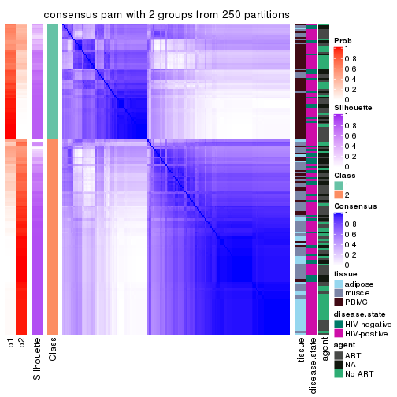</p>

</div>
<div id='tab-MAD-pam-consensus-heatmap-2'>
<pre><code class="r">consensus_heatmap(res, k = 3)
</code></pre>

<p>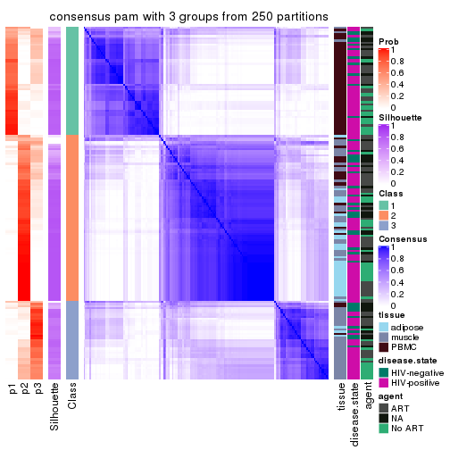</p>

</div>
<div id='tab-MAD-pam-consensus-heatmap-3'>
<pre><code class="r">consensus_heatmap(res, k = 4)
</code></pre>

<p>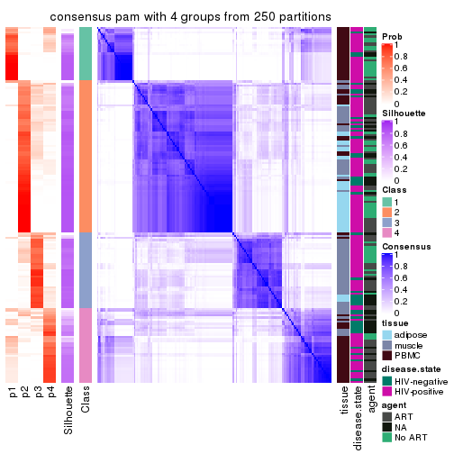</p>

</div>
<div id='tab-MAD-pam-consensus-heatmap-4'>
<pre><code class="r">consensus_heatmap(res, k = 5)
</code></pre>

<p>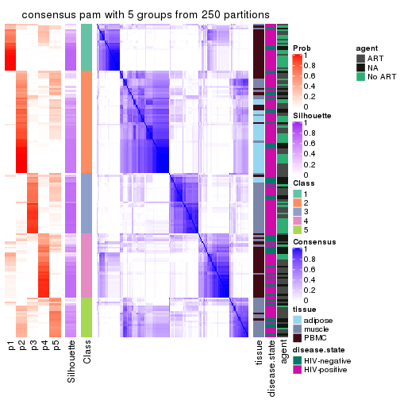</p>

</div>
<div id='tab-MAD-pam-consensus-heatmap-5'>
<pre><code class="r">consensus_heatmap(res, k = 6)
</code></pre>

<p>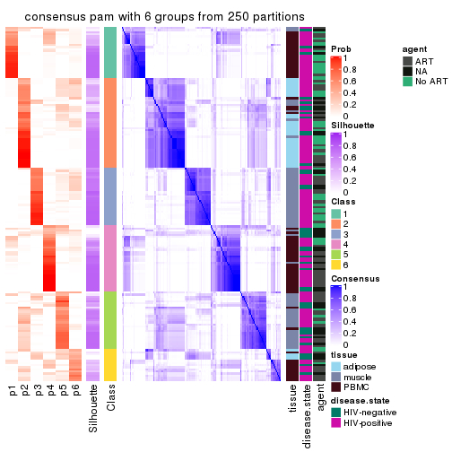</p>

</div>
</div>

Heatmaps for the membership of samples in all partitions to see how consistent they are:


<script>
$( function() {
	$( '#tabs-MAD-pam-membership-heatmap' ).tabs();
} );
</script>
<div id='tabs-MAD-pam-membership-heatmap'>
<ul>
<li><a href='#tab-MAD-pam-membership-heatmap-1'>k = 2</a></li>
<li><a href='#tab-MAD-pam-membership-heatmap-2'>k = 3</a></li>
<li><a href='#tab-MAD-pam-membership-heatmap-3'>k = 4</a></li>
<li><a href='#tab-MAD-pam-membership-heatmap-4'>k = 5</a></li>
<li><a href='#tab-MAD-pam-membership-heatmap-5'>k = 6</a></li>
</ul>
<div id='tab-MAD-pam-membership-heatmap-1'>
<pre><code class="r">membership_heatmap(res, k = 2)
</code></pre>

<p>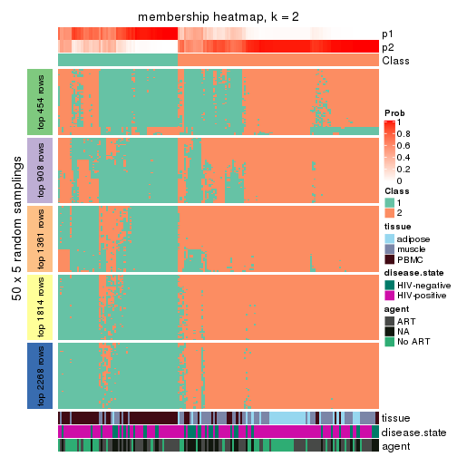</p>

</div>
<div id='tab-MAD-pam-membership-heatmap-2'>
<pre><code class="r">membership_heatmap(res, k = 3)
</code></pre>

<p>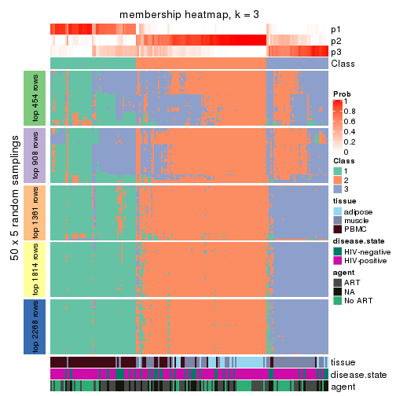</p>

</div>
<div id='tab-MAD-pam-membership-heatmap-3'>
<pre><code class="r">membership_heatmap(res, k = 4)
</code></pre>

<p>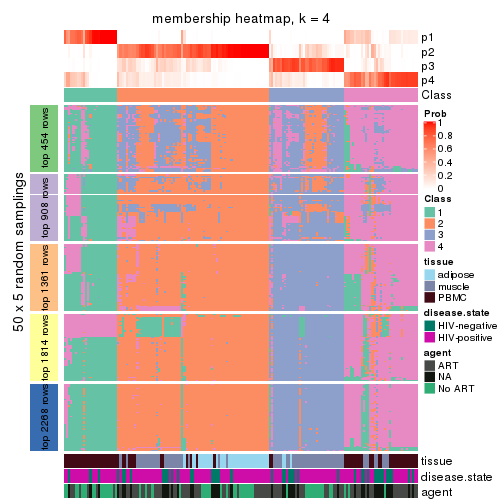</p>

</div>
<div id='tab-MAD-pam-membership-heatmap-4'>
<pre><code class="r">membership_heatmap(res, k = 5)
</code></pre>

<p>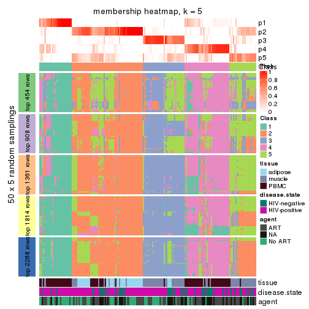</p>

</div>
<div id='tab-MAD-pam-membership-heatmap-5'>
<pre><code class="r">membership_heatmap(res, k = 6)
</code></pre>

<p>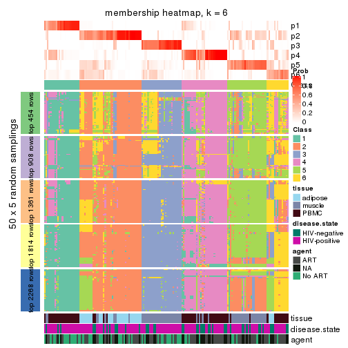</p>

</div>
</div>

As soon as we have had the classes for columns, we can look for signatures
which are significantly different between classes which can be candidate marks
for certain classes. Following are the heatmaps for signatures.


Signature heatmaps where rows are scaled:


<script>
$( function() {
	$( '#tabs-MAD-pam-get-signatures' ).tabs();
} );
</script>
<div id='tabs-MAD-pam-get-signatures'>
<ul>
<li><a href='#tab-MAD-pam-get-signatures-1'>k = 2</a></li>
<li><a href='#tab-MAD-pam-get-signatures-2'>k = 3</a></li>
<li><a href='#tab-MAD-pam-get-signatures-3'>k = 4</a></li>
<li><a href='#tab-MAD-pam-get-signatures-4'>k = 5</a></li>
<li><a href='#tab-MAD-pam-get-signatures-5'>k = 6</a></li>
</ul>
<div id='tab-MAD-pam-get-signatures-1'>
<pre><code class="r">get_signatures(res, k = 2)
</code></pre>

<p>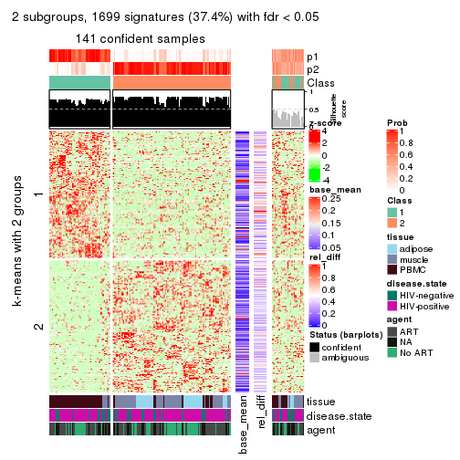</p>

</div>
<div id='tab-MAD-pam-get-signatures-2'>
<pre><code class="r">get_signatures(res, k = 3)
</code></pre>

<p>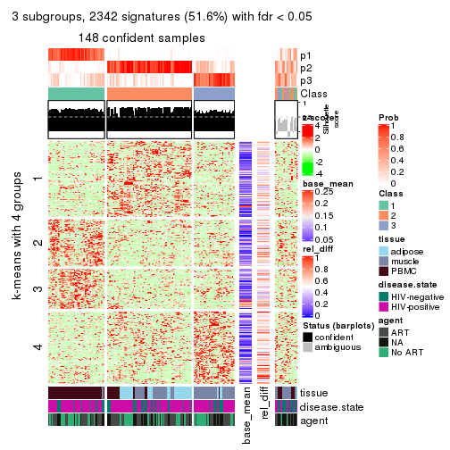</p>

</div>
<div id='tab-MAD-pam-get-signatures-3'>
<pre><code class="r">get_signatures(res, k = 4)
</code></pre>

<p>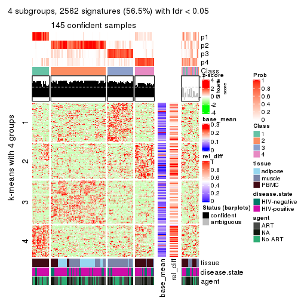</p>

</div>
<div id='tab-MAD-pam-get-signatures-4'>
<pre><code class="r">get_signatures(res, k = 5)
</code></pre>

<p>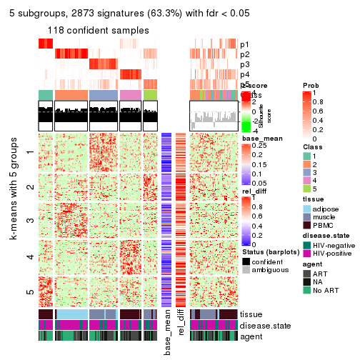</p>

</div>
<div id='tab-MAD-pam-get-signatures-5'>
<pre><code class="r">get_signatures(res, k = 6)
</code></pre>

<p>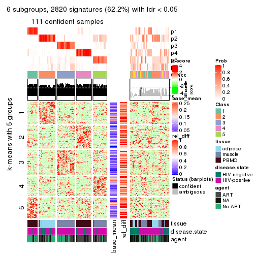</p>

</div>
</div>


Signature heatmaps where rows are not scaled:


<script>
$( function() {
	$( '#tabs-MAD-pam-get-signatures-no-scale' ).tabs();
} );
</script>
<div id='tabs-MAD-pam-get-signatures-no-scale'>
<ul>
<li><a href='#tab-MAD-pam-get-signatures-no-scale-1'>k = 2</a></li>
<li><a href='#tab-MAD-pam-get-signatures-no-scale-2'>k = 3</a></li>
<li><a href='#tab-MAD-pam-get-signatures-no-scale-3'>k = 4</a></li>
<li><a href='#tab-MAD-pam-get-signatures-no-scale-4'>k = 5</a></li>
<li><a href='#tab-MAD-pam-get-signatures-no-scale-5'>k = 6</a></li>
</ul>
<div id='tab-MAD-pam-get-signatures-no-scale-1'>
<pre><code class="r">get_signatures(res, k = 2, scale_rows = FALSE)
</code></pre>

<p>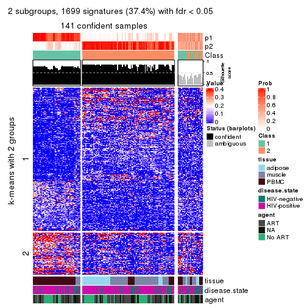</p>

</div>
<div id='tab-MAD-pam-get-signatures-no-scale-2'>
<pre><code class="r">get_signatures(res, k = 3, scale_rows = FALSE)
</code></pre>

<p>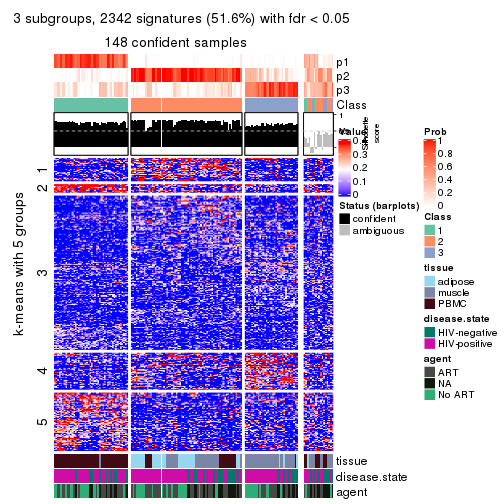</p>

</div>
<div id='tab-MAD-pam-get-signatures-no-scale-3'>
<pre><code class="r">get_signatures(res, k = 4, scale_rows = FALSE)
</code></pre>

<p></p>

</div>
<div id='tab-MAD-pam-get-signatures-no-scale-4'>
<pre><code class="r">get_signatures(res, k = 5, scale_rows = FALSE)
</code></pre>

<p>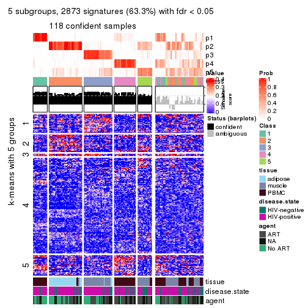</p>

</div>
<div id='tab-MAD-pam-get-signatures-no-scale-5'>
<pre><code class="r">get_signatures(res, k = 6, scale_rows = FALSE)
</code></pre>

<p>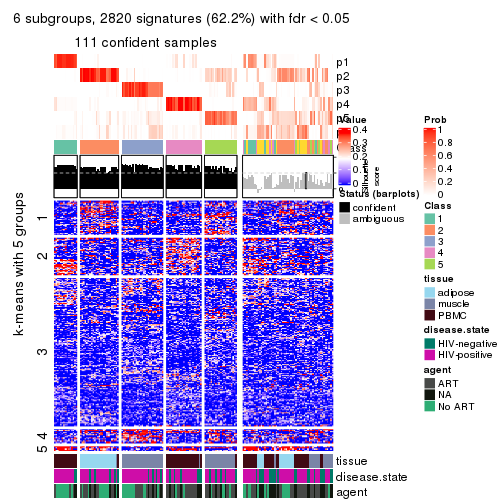</p>

</div>
</div>


Compare the overlap of signatures from different k:

```r
compare_signatures(res)
```

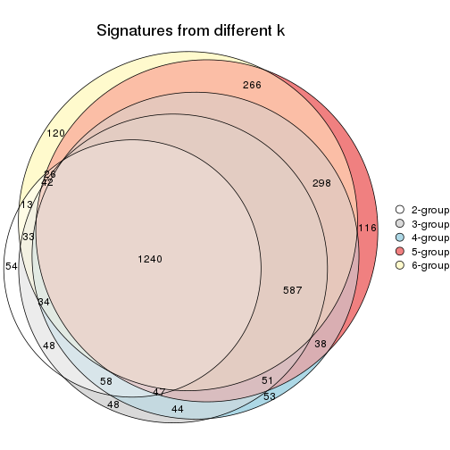

`get_signature()` returns a data frame invisibly. TO get the list of signatures, the function
call should be assigned to a variable explicitly. In following code, if `plot` argument is set
to `FALSE`, no heatmap is plotted while only the differential analysis is performed.

```r
# code only for demonstration
tb = get_signature(res, k = ..., plot = FALSE)
```

An example of the output of `tb` is:

```
#>   which_row         fdr    mean_1    mean_2 scaled_mean_1 scaled_mean_2 km
#> 1        38 0.042760348  8.373488  9.131774    -0.5533452     0.5164555  1
#> 2        40 0.018707592  7.106213  8.469186    -0.6173731     0.5762149  1
#> 3        55 0.019134737 10.221463 11.207825    -0.6159697     0.5749050  1
#> 4        59 0.006059896  5.921854  7.869574    -0.6899429     0.6439467  1
#> 5        60 0.018055526  8.928898 10.211722    -0.6204761     0.5791110  1
#> 6        98 0.009384629 15.714769 14.887706     0.6635654    -0.6193277  2
...
```

The columns in `tb` are:

1. `which_row`: row indices corresponding to the input matrix.
2. `fdr`: FDR for the differential test. 
3. `mean_x`: The mean value in group x.
4. `scaled_mean_x`: The mean value in group x after rows are scaled.
5. `km`: Row groups if k-means clustering is applied to rows.


UMAP plot which shows how samples are separated.


<script>
$( function() {
	$( '#tabs-MAD-pam-dimension-reduction' ).tabs();
} );
</script>
<div id='tabs-MAD-pam-dimension-reduction'>
<ul>
<li><a href='#tab-MAD-pam-dimension-reduction-1'>k = 2</a></li>
<li><a href='#tab-MAD-pam-dimension-reduction-2'>k = 3</a></li>
<li><a href='#tab-MAD-pam-dimension-reduction-3'>k = 4</a></li>
<li><a href='#tab-MAD-pam-dimension-reduction-4'>k = 5</a></li>
<li><a href='#tab-MAD-pam-dimension-reduction-5'>k = 6</a></li>
</ul>
<div id='tab-MAD-pam-dimension-reduction-1'>
<pre><code class="r">dimension_reduction(res, k = 2, method = &quot;UMAP&quot;)
</code></pre>

<p>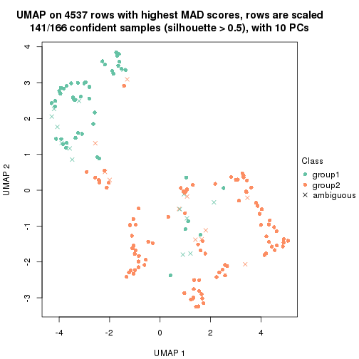</p>

</div>
<div id='tab-MAD-pam-dimension-reduction-2'>
<pre><code class="r">dimension_reduction(res, k = 3, method = &quot;UMAP&quot;)
</code></pre>

<p>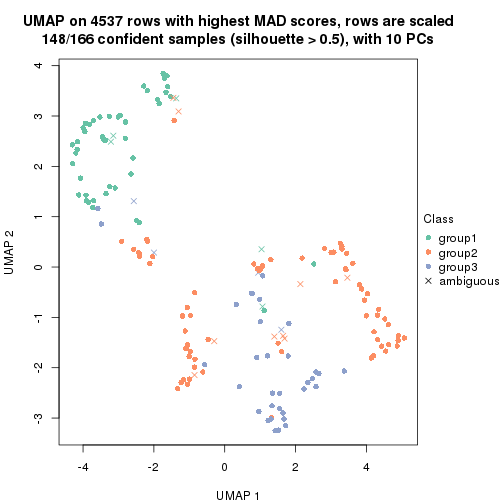</p>

</div>
<div id='tab-MAD-pam-dimension-reduction-3'>
<pre><code class="r">dimension_reduction(res, k = 4, method = &quot;UMAP&quot;)
</code></pre>

<p>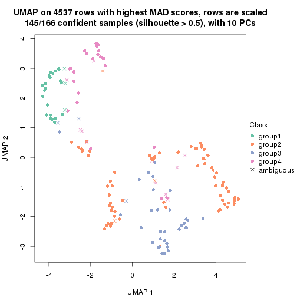</p>

</div>
<div id='tab-MAD-pam-dimension-reduction-4'>
<pre><code class="r">dimension_reduction(res, k = 5, method = &quot;UMAP&quot;)
</code></pre>

<p>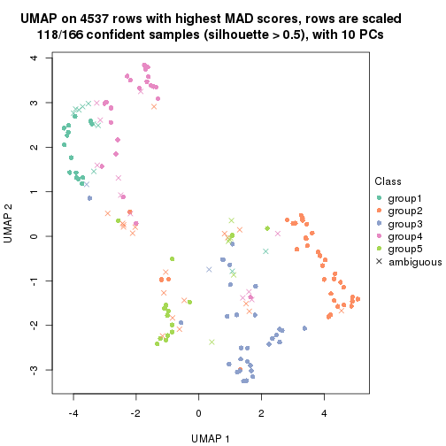</p>

</div>
<div id='tab-MAD-pam-dimension-reduction-5'>
<pre><code class="r">dimension_reduction(res, k = 6, method = &quot;UMAP&quot;)
</code></pre>

<p>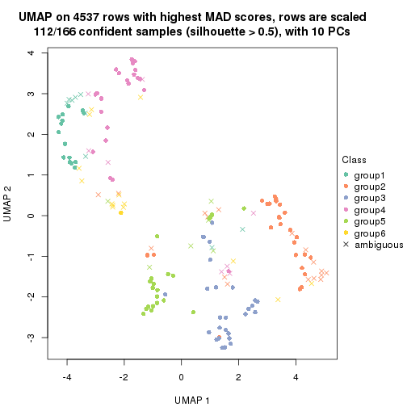</p>

</div>
</div>


Following heatmap shows how subgroups are split when increasing `k`:

```r
collect_classes(res)
```

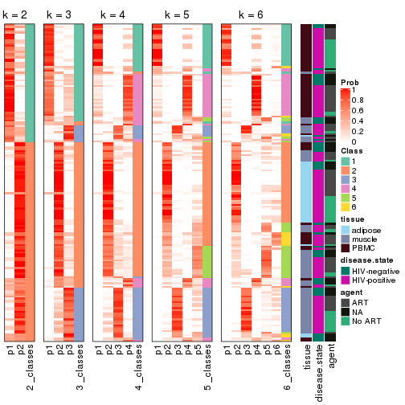


Test correlation between subgroups and known annotations. If the known
annotation is numeric, one-way ANOVA test is applied, and if the known
annotation is discrete, chi-squared contingency table test is applied.

```r
test_to_known_factors(res)
```

```
#>           n tissue(p) disease.state(p) agent(p) k
#> MAD:pam 141  2.60e-17            1.000  0.96370 2
#> MAD:pam 148  6.73e-26            0.897  0.90556 3
#> MAD:pam 145  4.13e-24            0.165  0.00479 4
#> MAD:pam 118  4.21e-36            0.399  0.00282 5
#> MAD:pam 112  1.30e-37            0.868  0.04072 6
```


If matrix rows can be associated to genes, consider to use `GO_Enrichment(res,
...)` to perform function enrichment for the signature genes.


 

---------------------------------------------------


### MAD:mclust*


The object with results only for a single top-value method and a single partition method 
can be extracted as:

```r
res = res_list["MAD", "mclust"]
# you can also extract it by
# res = res_list["MAD:mclust"]
```

A summary of `res` and all the functions that can be applied to it:

```r
res
```

```
#> A 'ConsensusPartition' object with k = 2, 3, 4, 5, 6.
#>   On a matrix with 4537 rows and 166 columns.
#>   Top rows (454, 908, 1361, 1814, 2268) are extracted by 'MAD' method.
#>   Subgroups are detected by 'mclust' method.
#>   Performed in total 1250 partitions by row resampling.
#>   Best k for subgroups seems to be 2.
#> 
#> Following methods can be applied to this 'ConsensusPartition' object:
#>  [1] "cola_report"             "collect_classes"         "collect_plots"          
#>  [4] "collect_stats"           "colnames"                "compare_signatures"     
#>  [7] "consensus_heatmap"       "dimension_reduction"     "functional_enrichment"  
#> [10] "get_anno_col"            "get_anno"                "get_classes"            
#> [13] "get_consensus"           "get_matrix"              "get_membership"         
#> [16] "get_param"               "get_signatures"          "get_stats"              
#> [19] "is_best_k"               "is_stable_k"             "membership_heatmap"     
#> [22] "ncol"                    "nrow"                    "plot_ecdf"              
#> [25] "rownames"                "select_partition_number" "show"                   
#> [28] "suggest_best_k"          "test_to_known_factors"
```

`collect_plots()` function collects all the plots made from `res` for all `k` (number of partitions)
into one single page to provide an easy and fast comparison between different `k`.

```r
collect_plots(res)
```

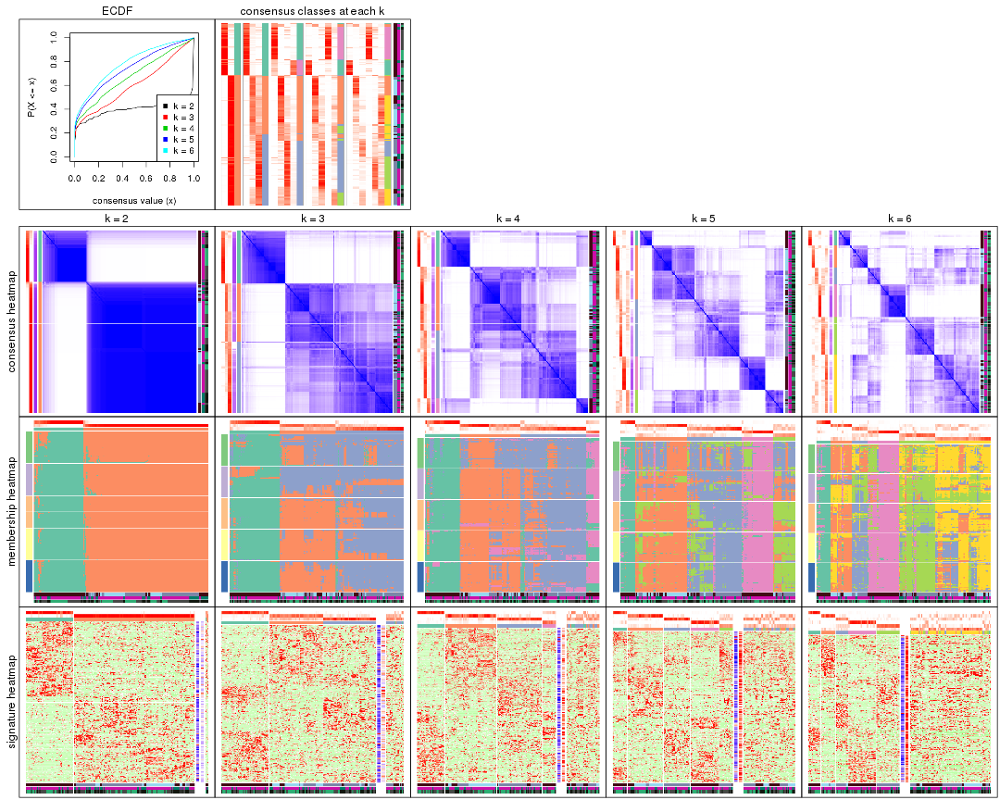

The plots are:

- The first row: a plot of the ECDF (Empirical cumulative distribution
  function) curves of the consensus matrix for each `k` and the heatmap of
  predicted classes for each `k`.
- The second row: heatmaps of the consensus matrix for each `k`.
- The third row: heatmaps of the membership matrix for each `k`.
- The fouth row: heatmaps of the signatures for each `k`.

All the plots in panels can be made by individual functions and they are
plotted later in this section.

`select_partition_number()` produces several plots showing different
statistics for choosing "optimized" `k`. There are following statistics:

- ECDF curves of the consensus matrix for each `k`;
- 1-PAC. [The PAC
  score](https://en.wikipedia.org/wiki/Consensus_clustering#Over-interpretation_potential_of_consensus_clustering)
  measures the proportion of the ambiguous subgrouping.
- Mean silhouette score.
- Concordance. The mean probability of fiting the consensus class ids in all
  partitions.
- Area increased. Denote $A_k$ as the area under the ECDF curve for current
  `k`, the area increased is defined as $A_k - A_{k-1}$.
- Rand index. The percent of pairs of samples that are both in a same cluster
  or both are not in a same cluster in the partition of k and k-1.
- Jaccard index. The ratio of pairs of samples are both in a same cluster in
  the partition of k and k-1 and the pairs of samples are both in a same
  cluster in the partition k or k-1.

The detailed explanations of these statistics can be found in [the cola
vignette](http://bioconductor.org/packages/devel/bioc/vignettes/cola/inst/doc/cola.html#toc_13).

Generally speaking, lower PAC score, higher mean silhouette score or higher
concordance corresponds to better partition. Rand index and Jaccard index
measure how similar the current partition is compared to partition with `k-1`.
If they are too similar, we won't accept `k` is better than `k-1`.

```r
select_partition_number(res)
```

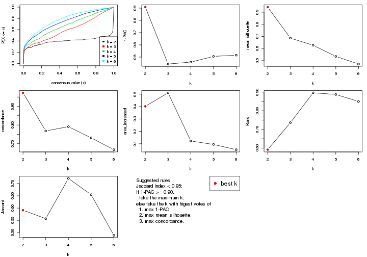

The numeric values for all these statistics can be obtained by `get_stats()`.

```r
get_stats(res)
```

```
#>   k 1-PAC mean_silhouette concordance area_increased  Rand Jaccard
#> 2 2 0.908           0.942       0.973         0.4021 0.592   0.592
#> 3 3 0.443           0.686       0.768         0.5112 0.736   0.557
#> 4 4 0.459           0.627       0.791         0.1223 0.896   0.721
#> 5 5 0.506           0.535       0.731         0.0944 0.887   0.655
#> 6 6 0.516           0.472       0.668         0.0523 0.850   0.489
```

`suggest_best_k()` suggests the best $k$ based on these statistics. The rules are as follows:

- All $k$ with Jaccard index larger than 0.95 are removed because the increase of
  the partition number does not provides enough extra information. If all $k$ are removed,
  the best $k$ is assigned by `NA`.
- For $k$ with 1-PAC larger than 0.9, the maximal $k$ is taken as the "best k". Other $k$ is called "optional k".
- If it does not fit the second rule. The $k$ with the highest vote of highest
  1-PAC, mean silhouette and concordance is taken as the "best k".

```r
suggest_best_k(res)
```

```
#> [1] 2
```


Following shows the table of the partitions (You need to click the **show/hide
code output** link to see it). The membership matrix (columns with name `p*`)
is inferred by
[`clue::cl_consensus()`](https://www.rdocumentation.org/link/cl_consensus?package=clue)
function with the `SE` method. Basically the value in the membership matrix
represents the probability to belong to a certain group. The finall class
label for an item is determined with the group with highest probability it
belongs to.

In `get_classes()` function, the entropy is calculated from the membership
matrix and the silhouette score is calculated from the consensus matrix.


<script>
$( function() {
	$( '#tabs-MAD-mclust-get-classes' ).tabs();
} );
</script>
<div id='tabs-MAD-mclust-get-classes'>
<ul>
<li><a href='#tab-MAD-mclust-get-classes-1'>k = 2</a></li>
<li><a href='#tab-MAD-mclust-get-classes-2'>k = 3</a></li>
<li><a href='#tab-MAD-mclust-get-classes-3'>k = 4</a></li>
<li><a href='#tab-MAD-mclust-get-classes-4'>k = 5</a></li>
<li><a href='#tab-MAD-mclust-get-classes-5'>k = 6</a></li>
</ul>

<div id='tab-MAD-mclust-get-classes-1'>
<p><a id='tab-MAD-mclust-get-classes-1-a' style='color:#0366d6' href='#'>show/hide code output</a></p>
<pre><code class="r">cbind(get_classes(res, k = 2), get_membership(res, k = 2))
</code></pre>

<pre><code>#&gt;           class entropy silhouette    p1    p2
#&gt; GSM751298     1  0.1843     0.9277 0.972 0.028
#&gt; GSM751304     2  0.0000     0.9834 0.000 1.000
#&gt; GSM751305     2  0.0000     0.9834 0.000 1.000
#&gt; GSM751307     2  0.0376     0.9818 0.004 0.996
#&gt; GSM751310     1  0.7219     0.7840 0.800 0.200
#&gt; GSM751314     1  0.1414     0.9317 0.980 0.020
#&gt; GSM751316     2  0.9993    -0.0548 0.484 0.516
#&gt; GSM751318     1  0.2236     0.9242 0.964 0.036
#&gt; GSM751342     2  0.9087     0.4889 0.324 0.676
#&gt; GSM751346     1  0.0000     0.9402 1.000 0.000
#&gt; GSM751347     1  0.7528     0.7605 0.784 0.216
#&gt; GSM751348     2  0.0000     0.9834 0.000 1.000
#&gt; GSM751349     2  0.0000     0.9834 0.000 1.000
#&gt; GSM751352     2  0.2043     0.9601 0.032 0.968
#&gt; GSM751353     2  0.0000     0.9834 0.000 1.000
#&gt; GSM751354     2  0.0376     0.9816 0.004 0.996
#&gt; GSM751355     2  0.0000     0.9834 0.000 1.000
#&gt; GSM751358     2  0.0672     0.9791 0.008 0.992
#&gt; GSM751359     2  0.0000     0.9834 0.000 1.000
#&gt; GSM751294     2  0.0000     0.9834 0.000 1.000
#&gt; GSM751296     1  0.0000     0.9402 1.000 0.000
#&gt; GSM751297     1  0.5946     0.8461 0.856 0.144
#&gt; GSM751299     2  0.6343     0.8028 0.160 0.840
#&gt; GSM751300     1  0.0000     0.9402 1.000 0.000
#&gt; GSM751301     1  0.9209     0.5485 0.664 0.336
#&gt; GSM751302     1  0.0000     0.9402 1.000 0.000
#&gt; GSM751303     1  0.8081     0.7163 0.752 0.248
#&gt; GSM751306     1  0.5059     0.8742 0.888 0.112
#&gt; GSM751308     2  0.6343     0.8025 0.160 0.840
#&gt; GSM751309     1  0.4298     0.8922 0.912 0.088
#&gt; GSM751311     1  0.0000     0.9402 1.000 0.000
#&gt; GSM751312     1  0.6148     0.8378 0.848 0.152
#&gt; GSM751313     1  0.0000     0.9402 1.000 0.000
#&gt; GSM751315     1  0.0000     0.9402 1.000 0.000
#&gt; GSM751317     1  0.4690     0.8835 0.900 0.100
#&gt; GSM751320     1  0.0000     0.9402 1.000 0.000
#&gt; GSM751321     1  0.0000     0.9402 1.000 0.000
#&gt; GSM751322     1  0.0000     0.9402 1.000 0.000
#&gt; GSM751324     1  0.0000     0.9402 1.000 0.000
#&gt; GSM751325     1  0.0000     0.9402 1.000 0.000
#&gt; GSM751332     1  0.0000     0.9402 1.000 0.000
#&gt; GSM751334     1  0.0000     0.9402 1.000 0.000
#&gt; GSM751339     1  0.7528     0.7621 0.784 0.216
#&gt; GSM751341     1  0.4562     0.8862 0.904 0.096
#&gt; GSM751343     1  0.0000     0.9402 1.000 0.000
#&gt; GSM751344     2  0.0000     0.9834 0.000 1.000
#&gt; GSM751345     2  0.0376     0.9817 0.004 0.996
#&gt; GSM751356     2  0.1184     0.9724 0.016 0.984
#&gt; GSM751357     2  0.0672     0.9790 0.008 0.992
#&gt; GSM751293     1  0.8327     0.6778 0.736 0.264
#&gt; GSM751295     1  0.0000     0.9402 1.000 0.000
#&gt; GSM751319     1  0.0000     0.9402 1.000 0.000
#&gt; GSM751323     1  0.0000     0.9402 1.000 0.000
#&gt; GSM751326     1  0.0000     0.9402 1.000 0.000
#&gt; GSM751327     1  0.0000     0.9402 1.000 0.000
#&gt; GSM751328     1  0.0000     0.9402 1.000 0.000
#&gt; GSM751329     1  0.0000     0.9402 1.000 0.000
#&gt; GSM751330     1  0.0000     0.9402 1.000 0.000
#&gt; GSM751331     1  0.0000     0.9402 1.000 0.000
#&gt; GSM751333     1  0.0000     0.9402 1.000 0.000
#&gt; GSM751335     1  0.0000     0.9402 1.000 0.000
#&gt; GSM751336     1  0.0000     0.9402 1.000 0.000
#&gt; GSM751337     1  0.0000     0.9402 1.000 0.000
#&gt; GSM751338     1  0.0000     0.9402 1.000 0.000
#&gt; GSM751340     1  0.9881     0.3003 0.564 0.436
#&gt; GSM751350     1  0.0000     0.9402 1.000 0.000
#&gt; GSM751351     1  0.0000     0.9402 1.000 0.000
#&gt; GSM751362     2  0.0000     0.9834 0.000 1.000
#&gt; GSM751363     2  0.0000     0.9834 0.000 1.000
#&gt; GSM751367     2  0.7219     0.7290 0.200 0.800
#&gt; GSM751368     2  0.0376     0.9831 0.004 0.996
#&gt; GSM751371     2  0.3274     0.9304 0.060 0.940
#&gt; GSM751375     2  0.0000     0.9834 0.000 1.000
#&gt; GSM751376     2  0.0000     0.9834 0.000 1.000
#&gt; GSM751378     2  0.0000     0.9834 0.000 1.000
#&gt; GSM751379     2  0.0000     0.9834 0.000 1.000
#&gt; GSM751382     2  0.0000     0.9834 0.000 1.000
#&gt; GSM751386     2  0.0000     0.9834 0.000 1.000
#&gt; GSM751388     2  0.0376     0.9831 0.004 0.996
#&gt; GSM751391     2  0.1843     0.9637 0.028 0.972
#&gt; GSM751410     2  0.0000     0.9834 0.000 1.000
#&gt; GSM751414     2  0.0376     0.9831 0.004 0.996
#&gt; GSM751361     2  0.1414     0.9713 0.020 0.980
#&gt; GSM751365     2  0.0376     0.9831 0.004 0.996
#&gt; GSM751366     2  0.0376     0.9831 0.004 0.996
#&gt; GSM751369     2  0.0000     0.9834 0.000 1.000
#&gt; GSM751370     2  0.0000     0.9834 0.000 1.000
#&gt; GSM751372     2  0.0000     0.9834 0.000 1.000
#&gt; GSM751373     2  0.2236     0.9559 0.036 0.964
#&gt; GSM751374     2  0.0000     0.9834 0.000 1.000
#&gt; GSM751377     2  0.0000     0.9834 0.000 1.000
#&gt; GSM751380     2  0.1414     0.9708 0.020 0.980
#&gt; GSM751381     2  0.0000     0.9834 0.000 1.000
#&gt; GSM751383     2  0.0376     0.9831 0.004 0.996
#&gt; GSM751384     2  0.0000     0.9834 0.000 1.000
#&gt; GSM751385     2  0.0000     0.9834 0.000 1.000
#&gt; GSM751387     2  0.0376     0.9831 0.004 0.996
#&gt; GSM751389     2  0.0000     0.9834 0.000 1.000
#&gt; GSM751393     2  0.0000     0.9834 0.000 1.000
#&gt; GSM751394     2  0.0000     0.9834 0.000 1.000
#&gt; GSM751395     2  0.0000     0.9834 0.000 1.000
#&gt; GSM751397     2  0.0000     0.9834 0.000 1.000
#&gt; GSM751398     2  0.0000     0.9834 0.000 1.000
#&gt; GSM751404     2  0.0376     0.9831 0.004 0.996
#&gt; GSM751406     2  0.0000     0.9834 0.000 1.000
#&gt; GSM751411     2  0.0000     0.9834 0.000 1.000
#&gt; GSM751413     2  0.0000     0.9834 0.000 1.000
#&gt; GSM751415     2  0.0376     0.9831 0.004 0.996
#&gt; GSM751416     2  0.0000     0.9834 0.000 1.000
#&gt; GSM751417     2  0.0000     0.9834 0.000 1.000
#&gt; GSM751421     2  0.0000     0.9834 0.000 1.000
#&gt; GSM751422     2  0.0000     0.9834 0.000 1.000
#&gt; GSM751360     2  0.1184     0.9724 0.016 0.984
#&gt; GSM751364     2  0.0376     0.9831 0.004 0.996
#&gt; GSM751390     2  0.0376     0.9831 0.004 0.996
#&gt; GSM751392     2  0.0000     0.9834 0.000 1.000
#&gt; GSM751396     2  0.0376     0.9831 0.004 0.996
#&gt; GSM751399     2  0.0000     0.9834 0.000 1.000
#&gt; GSM751400     2  0.0376     0.9831 0.004 0.996
#&gt; GSM751401     2  0.0672     0.9808 0.008 0.992
#&gt; GSM751402     2  0.0672     0.9809 0.008 0.992
#&gt; GSM751403     2  0.0376     0.9831 0.004 0.996
#&gt; GSM751405     2  0.0000     0.9834 0.000 1.000
#&gt; GSM751407     2  0.0376     0.9831 0.004 0.996
#&gt; GSM751408     2  0.0376     0.9831 0.004 0.996
#&gt; GSM751409     2  0.0000     0.9834 0.000 1.000
#&gt; GSM751412     2  0.0376     0.9831 0.004 0.996
#&gt; GSM751418     2  0.0376     0.9831 0.004 0.996
#&gt; GSM751419     2  0.0376     0.9831 0.004 0.996
#&gt; GSM751420     2  0.0000     0.9834 0.000 1.000
#&gt; GSM751425     2  0.0000     0.9834 0.000 1.000
#&gt; GSM751429     2  0.0376     0.9818 0.004 0.996
#&gt; GSM751430     2  0.0376     0.9831 0.004 0.996
#&gt; GSM751433     2  0.1633     0.9673 0.024 0.976
#&gt; GSM751437     2  0.0000     0.9834 0.000 1.000
#&gt; GSM751448     2  0.0376     0.9831 0.004 0.996
#&gt; GSM751451     2  0.2603     0.9481 0.044 0.956
#&gt; GSM751423     2  0.0000     0.9834 0.000 1.000
#&gt; GSM751424     2  0.0376     0.9831 0.004 0.996
#&gt; GSM751428     2  0.0376     0.9831 0.004 0.996
#&gt; GSM751431     2  0.0672     0.9807 0.008 0.992
#&gt; GSM751432     2  0.0376     0.9831 0.004 0.996
#&gt; GSM751434     2  0.0376     0.9831 0.004 0.996
#&gt; GSM751435     2  0.0376     0.9831 0.004 0.996
#&gt; GSM751436     2  0.0376     0.9831 0.004 0.996
#&gt; GSM751440     2  0.0376     0.9831 0.004 0.996
#&gt; GSM751444     2  0.0376     0.9831 0.004 0.996
#&gt; GSM751446     2  0.0000     0.9834 0.000 1.000
#&gt; GSM751449     2  0.0000     0.9834 0.000 1.000
#&gt; GSM751450     2  0.0376     0.9831 0.004 0.996
#&gt; GSM751452     2  0.0376     0.9831 0.004 0.996
#&gt; GSM751426     2  0.0376     0.9831 0.004 0.996
#&gt; GSM751427     2  0.0000     0.9834 0.000 1.000
#&gt; GSM751438     2  0.0000     0.9834 0.000 1.000
#&gt; GSM751439     2  0.0376     0.9831 0.004 0.996
#&gt; GSM751441     2  0.0000     0.9834 0.000 1.000
#&gt; GSM751442     2  0.0376     0.9831 0.004 0.996
#&gt; GSM751443     2  0.0672     0.9808 0.008 0.992
#&gt; GSM751445     2  0.0000     0.9834 0.000 1.000
#&gt; GSM751447     2  0.0376     0.9831 0.004 0.996
#&gt; GSM751453     2  0.0376     0.9831 0.004 0.996
#&gt; GSM751454     2  0.0376     0.9831 0.004 0.996
#&gt; GSM751455     2  0.0376     0.9831 0.004 0.996
#&gt; GSM751456     2  0.0376     0.9831 0.004 0.996
#&gt; GSM751457     2  0.0000     0.9834 0.000 1.000
#&gt; GSM751458     2  0.0000     0.9834 0.000 1.000
</code></pre>

<script>
$('#tab-MAD-mclust-get-classes-1-a').parent().next().next().hide();
$('#tab-MAD-mclust-get-classes-1-a').click(function(){
  $('#tab-MAD-mclust-get-classes-1-a').parent().next().next().toggle();
  return(false);
});
</script>
</div>

<div id='tab-MAD-mclust-get-classes-2'>
<p><a id='tab-MAD-mclust-get-classes-2-a' style='color:#0366d6' href='#'>show/hide code output</a></p>
<pre><code class="r">cbind(get_classes(res, k = 3), get_membership(res, k = 3))
</code></pre>

<pre><code>#&gt;           class entropy silhouette    p1    p2    p3
#&gt; GSM751298     1  0.2866     0.9064 0.916 0.076 0.008
#&gt; GSM751304     3  0.3816     0.6997 0.000 0.148 0.852
#&gt; GSM751305     3  0.5098     0.5307 0.000 0.248 0.752
#&gt; GSM751307     2  0.6398     0.7353 0.008 0.620 0.372
#&gt; GSM751310     1  0.7403     0.6996 0.688 0.096 0.216
#&gt; GSM751314     1  0.3293     0.9002 0.900 0.088 0.012
#&gt; GSM751316     3  0.7396    -0.0606 0.480 0.032 0.488
#&gt; GSM751318     1  0.5165     0.8703 0.832 0.096 0.072
#&gt; GSM751342     1  0.9918     0.0294 0.384 0.276 0.340
#&gt; GSM751346     1  0.1643     0.9092 0.956 0.044 0.000
#&gt; GSM751347     1  0.7672     0.7440 0.684 0.160 0.156
#&gt; GSM751348     3  0.6252    -0.2761 0.000 0.444 0.556
#&gt; GSM751349     2  0.5706     0.7582 0.000 0.680 0.320
#&gt; GSM751352     2  0.6905     0.5802 0.016 0.544 0.440
#&gt; GSM751353     2  0.6045     0.7195 0.000 0.620 0.380
#&gt; GSM751354     3  0.6680    -0.4922 0.008 0.484 0.508
#&gt; GSM751355     2  0.6509     0.6077 0.004 0.524 0.472
#&gt; GSM751358     3  0.4399     0.6373 0.000 0.188 0.812
#&gt; GSM751359     2  0.6295     0.5225 0.000 0.528 0.472
#&gt; GSM751294     3  0.4931     0.5974 0.000 0.232 0.768
#&gt; GSM751296     1  0.1529     0.9112 0.960 0.040 0.000
#&gt; GSM751297     1  0.5657     0.8652 0.808 0.104 0.088
#&gt; GSM751299     2  0.8771     0.4772 0.132 0.544 0.324
#&gt; GSM751300     1  0.1643     0.9092 0.956 0.044 0.000
#&gt; GSM751301     1  0.6956     0.6422 0.660 0.300 0.040
#&gt; GSM751302     1  0.1643     0.9092 0.956 0.044 0.000
#&gt; GSM751303     1  0.7444     0.7033 0.684 0.096 0.220
#&gt; GSM751306     1  0.5663     0.8464 0.808 0.096 0.096
#&gt; GSM751308     3  0.8647     0.4332 0.192 0.208 0.600
#&gt; GSM751309     1  0.4790     0.8775 0.848 0.096 0.056
#&gt; GSM751311     1  0.2590     0.9057 0.924 0.072 0.004
#&gt; GSM751312     1  0.5554     0.8399 0.812 0.076 0.112
#&gt; GSM751313     1  0.0747     0.9121 0.984 0.016 0.000
#&gt; GSM751315     1  0.2165     0.9071 0.936 0.064 0.000
#&gt; GSM751317     1  0.5075     0.8692 0.836 0.096 0.068
#&gt; GSM751320     1  0.0592     0.9125 0.988 0.012 0.000
#&gt; GSM751321     1  0.2749     0.9061 0.924 0.064 0.012
#&gt; GSM751322     1  0.1289     0.9116 0.968 0.032 0.000
#&gt; GSM751324     1  0.2165     0.9071 0.936 0.064 0.000
#&gt; GSM751325     1  0.0892     0.9122 0.980 0.020 0.000
#&gt; GSM751332     1  0.2261     0.9069 0.932 0.068 0.000
#&gt; GSM751334     1  0.0892     0.9122 0.980 0.020 0.000
#&gt; GSM751339     1  0.4677     0.8256 0.840 0.028 0.132
#&gt; GSM751341     1  0.4423     0.8856 0.864 0.088 0.048
#&gt; GSM751343     1  0.1411     0.9112 0.964 0.036 0.000
#&gt; GSM751344     2  0.5882     0.7547 0.000 0.652 0.348
#&gt; GSM751345     2  0.5905     0.7537 0.000 0.648 0.352
#&gt; GSM751356     3  0.4796     0.6173 0.000 0.220 0.780
#&gt; GSM751357     3  0.5397     0.4946 0.000 0.280 0.720
#&gt; GSM751293     1  0.6414     0.7259 0.716 0.248 0.036
#&gt; GSM751295     1  0.1643     0.9092 0.956 0.044 0.000
#&gt; GSM751319     1  0.2066     0.9076 0.940 0.060 0.000
#&gt; GSM751323     1  0.0592     0.9125 0.988 0.012 0.000
#&gt; GSM751326     1  0.0592     0.9125 0.988 0.012 0.000
#&gt; GSM751327     1  0.0237     0.9127 0.996 0.004 0.000
#&gt; GSM751328     1  0.2165     0.9075 0.936 0.064 0.000
#&gt; GSM751329     1  0.0592     0.9123 0.988 0.012 0.000
#&gt; GSM751330     1  0.1289     0.9113 0.968 0.032 0.000
#&gt; GSM751331     1  0.1643     0.9092 0.956 0.044 0.000
#&gt; GSM751333     1  0.0592     0.9125 0.988 0.012 0.000
#&gt; GSM751335     1  0.1289     0.9113 0.968 0.032 0.000
#&gt; GSM751336     1  0.1643     0.9092 0.956 0.044 0.000
#&gt; GSM751337     1  0.0747     0.9121 0.984 0.016 0.000
#&gt; GSM751338     1  0.0592     0.9125 0.988 0.012 0.000
#&gt; GSM751340     1  0.6896     0.3810 0.588 0.020 0.392
#&gt; GSM751350     1  0.1643     0.9092 0.956 0.044 0.000
#&gt; GSM751351     1  0.1643     0.9092 0.956 0.044 0.000
#&gt; GSM751362     3  0.2537     0.7261 0.000 0.080 0.920
#&gt; GSM751363     3  0.2165     0.7174 0.000 0.064 0.936
#&gt; GSM751367     3  0.6977     0.4904 0.212 0.076 0.712
#&gt; GSM751368     2  0.6305     0.5426 0.000 0.516 0.484
#&gt; GSM751371     3  0.2152     0.7024 0.036 0.016 0.948
#&gt; GSM751375     2  0.5650     0.7447 0.000 0.688 0.312
#&gt; GSM751376     3  0.5291     0.5531 0.000 0.268 0.732
#&gt; GSM751378     3  0.5497     0.5263 0.000 0.292 0.708
#&gt; GSM751379     3  0.4291     0.6595 0.000 0.180 0.820
#&gt; GSM751382     2  0.5810     0.7575 0.000 0.664 0.336
#&gt; GSM751386     2  0.6204     0.6195 0.000 0.576 0.424
#&gt; GSM751388     2  0.5431     0.7064 0.000 0.716 0.284
#&gt; GSM751391     3  0.1289     0.7264 0.000 0.032 0.968
#&gt; GSM751410     3  0.1289     0.7290 0.000 0.032 0.968
#&gt; GSM751414     3  0.0475     0.7144 0.004 0.004 0.992
#&gt; GSM751361     3  0.1399     0.7243 0.004 0.028 0.968
#&gt; GSM751365     3  0.3482     0.6663 0.000 0.128 0.872
#&gt; GSM751366     3  0.1453     0.7152 0.008 0.024 0.968
#&gt; GSM751369     3  0.1860     0.7301 0.000 0.052 0.948
#&gt; GSM751370     3  0.0424     0.7176 0.000 0.008 0.992
#&gt; GSM751372     3  0.1031     0.7249 0.000 0.024 0.976
#&gt; GSM751373     3  0.7058     0.5180 0.100 0.180 0.720
#&gt; GSM751374     3  0.5058     0.5404 0.000 0.244 0.756
#&gt; GSM751377     2  0.6235     0.5920 0.000 0.564 0.436
#&gt; GSM751380     3  0.1399     0.7145 0.004 0.028 0.968
#&gt; GSM751381     2  0.6267     0.5150 0.000 0.548 0.452
#&gt; GSM751383     2  0.5754     0.6776 0.004 0.700 0.296
#&gt; GSM751384     3  0.5706     0.4784 0.000 0.320 0.680
#&gt; GSM751385     3  0.5926     0.3727 0.000 0.356 0.644
#&gt; GSM751387     2  0.5517     0.7010 0.004 0.728 0.268
#&gt; GSM751389     3  0.3267     0.7185 0.000 0.116 0.884
#&gt; GSM751393     3  0.5988     0.3247 0.000 0.368 0.632
#&gt; GSM751394     2  0.6095     0.6719 0.000 0.608 0.392
#&gt; GSM751395     3  0.6126     0.1724 0.000 0.400 0.600
#&gt; GSM751397     3  0.6274    -0.1297 0.000 0.456 0.544
#&gt; GSM751398     2  0.6126     0.6442 0.000 0.600 0.400
#&gt; GSM751404     3  0.4605     0.6762 0.000 0.204 0.796
#&gt; GSM751406     3  0.2959     0.7222 0.000 0.100 0.900
#&gt; GSM751411     3  0.1753     0.7304 0.000 0.048 0.952
#&gt; GSM751413     3  0.6225    -0.3089 0.000 0.432 0.568
#&gt; GSM751415     3  0.0592     0.7201 0.000 0.012 0.988
#&gt; GSM751416     3  0.1289     0.7239 0.000 0.032 0.968
#&gt; GSM751417     3  0.1529     0.7229 0.000 0.040 0.960
#&gt; GSM751421     3  0.0592     0.7201 0.000 0.012 0.988
#&gt; GSM751422     3  0.1031     0.7240 0.000 0.024 0.976
#&gt; GSM751360     3  0.0892     0.7232 0.000 0.020 0.980
#&gt; GSM751364     3  0.1753     0.7227 0.000 0.048 0.952
#&gt; GSM751390     3  0.6280     0.1739 0.000 0.460 0.540
#&gt; GSM751392     2  0.5988     0.6962 0.000 0.632 0.368
#&gt; GSM751396     2  0.4629     0.7443 0.004 0.808 0.188
#&gt; GSM751399     3  0.3192     0.7200 0.000 0.112 0.888
#&gt; GSM751400     3  0.6081     0.5108 0.004 0.344 0.652
#&gt; GSM751401     3  0.6247     0.6282 0.044 0.212 0.744
#&gt; GSM751402     3  0.6109     0.6705 0.080 0.140 0.780
#&gt; GSM751403     3  0.4002     0.7114 0.000 0.160 0.840
#&gt; GSM751405     3  0.2959     0.7217 0.000 0.100 0.900
#&gt; GSM751407     3  0.5461     0.6281 0.008 0.244 0.748
#&gt; GSM751408     3  0.5325     0.6329 0.004 0.248 0.748
#&gt; GSM751409     3  0.3482     0.7147 0.000 0.128 0.872
#&gt; GSM751412     3  0.4974     0.6458 0.000 0.236 0.764
#&gt; GSM751418     3  0.4682     0.5941 0.004 0.192 0.804
#&gt; GSM751419     3  0.4409     0.6120 0.004 0.172 0.824
#&gt; GSM751420     3  0.4121     0.6819 0.000 0.168 0.832
#&gt; GSM751425     2  0.5810     0.7476 0.000 0.664 0.336
#&gt; GSM751429     3  0.6105     0.5275 0.024 0.252 0.724
#&gt; GSM751430     2  0.4351     0.7376 0.004 0.828 0.168
#&gt; GSM751433     2  0.6542     0.7283 0.060 0.736 0.204
#&gt; GSM751437     3  0.2959     0.7228 0.000 0.100 0.900
#&gt; GSM751448     3  0.4868     0.7117 0.056 0.100 0.844
#&gt; GSM751451     2  0.8132     0.6215 0.096 0.600 0.304
#&gt; GSM751423     2  0.6111     0.7200 0.000 0.604 0.396
#&gt; GSM751424     2  0.4629     0.7396 0.004 0.808 0.188
#&gt; GSM751428     2  0.4883     0.7575 0.004 0.788 0.208
#&gt; GSM751431     2  0.5986     0.7688 0.012 0.704 0.284
#&gt; GSM751432     2  0.4351     0.7344 0.004 0.828 0.168
#&gt; GSM751434     2  0.4521     0.7364 0.004 0.816 0.180
#&gt; GSM751435     2  0.4755     0.7429 0.008 0.808 0.184
#&gt; GSM751436     2  0.4575     0.7362 0.004 0.812 0.184
#&gt; GSM751440     2  0.5461     0.7522 0.016 0.768 0.216
#&gt; GSM751444     2  0.5650     0.7636 0.000 0.688 0.312
#&gt; GSM751446     2  0.5905     0.7505 0.000 0.648 0.352
#&gt; GSM751449     2  0.5968     0.7199 0.000 0.636 0.364
#&gt; GSM751450     2  0.5365     0.7655 0.004 0.744 0.252
#&gt; GSM751452     2  0.4575     0.7362 0.004 0.812 0.184
#&gt; GSM751426     2  0.4575     0.7362 0.004 0.812 0.184
#&gt; GSM751427     2  0.5905     0.7474 0.000 0.648 0.352
#&gt; GSM751438     2  0.6079     0.7124 0.000 0.612 0.388
#&gt; GSM751439     3  0.6483     0.0401 0.008 0.392 0.600
#&gt; GSM751441     2  0.5810     0.7580 0.000 0.664 0.336
#&gt; GSM751442     2  0.4931     0.7508 0.004 0.784 0.212
#&gt; GSM751443     3  0.4963     0.6360 0.008 0.200 0.792
#&gt; GSM751445     2  0.5905     0.7172 0.000 0.648 0.352
#&gt; GSM751447     2  0.4452     0.7545 0.000 0.808 0.192
#&gt; GSM751453     2  0.4465     0.7360 0.004 0.820 0.176
#&gt; GSM751454     2  0.4351     0.7344 0.004 0.828 0.168
#&gt; GSM751455     2  0.4978     0.7536 0.004 0.780 0.216
#&gt; GSM751456     2  0.4931     0.7502 0.004 0.784 0.212
#&gt; GSM751457     2  0.6140     0.6465 0.000 0.596 0.404
#&gt; GSM751458     2  0.6180     0.6160 0.000 0.584 0.416
</code></pre>

<script>
$('#tab-MAD-mclust-get-classes-2-a').parent().next().next().hide();
$('#tab-MAD-mclust-get-classes-2-a').click(function(){
  $('#tab-MAD-mclust-get-classes-2-a').parent().next().next().toggle();
  return(false);
});
</script>
</div>

<div id='tab-MAD-mclust-get-classes-3'>
<p><a id='tab-MAD-mclust-get-classes-3-a' style='color:#0366d6' href='#'>show/hide code output</a></p>
<pre><code class="r">cbind(get_classes(res, k = 4), get_membership(res, k = 4))
</code></pre>

<pre><code>#&gt;           class entropy silhouette    p1    p2    p3    p4
#&gt; GSM751298     1  0.5735    -0.3468 0.576 0.032 0.000 0.392
#&gt; GSM751304     3  0.4015     0.6969 0.000 0.116 0.832 0.052
#&gt; GSM751305     3  0.6219     0.4459 0.000 0.264 0.640 0.096
#&gt; GSM751307     2  0.4381     0.7442 0.008 0.780 0.200 0.012
#&gt; GSM751310     1  0.5265     0.3857 0.684 0.024 0.288 0.004
#&gt; GSM751314     1  0.0712     0.7753 0.984 0.004 0.008 0.004
#&gt; GSM751316     3  0.5918     0.2561 0.396 0.032 0.568 0.004
#&gt; GSM751318     1  0.2473     0.7118 0.908 0.012 0.080 0.000
#&gt; GSM751342     3  0.7571     0.2733 0.336 0.180 0.480 0.004
#&gt; GSM751346     4  0.4406     0.8491 0.300 0.000 0.000 0.700
#&gt; GSM751347     4  0.6534     0.7849 0.284 0.060 0.024 0.632
#&gt; GSM751348     2  0.5842     0.3369 0.000 0.520 0.448 0.032
#&gt; GSM751349     2  0.4636     0.7484 0.000 0.772 0.188 0.040
#&gt; GSM751352     2  0.4408     0.7286 0.004 0.756 0.232 0.008
#&gt; GSM751353     2  0.5132     0.7410 0.000 0.748 0.184 0.068
#&gt; GSM751354     2  0.5710     0.7145 0.004 0.700 0.228 0.068
#&gt; GSM751355     2  0.5842     0.7118 0.000 0.688 0.220 0.092
#&gt; GSM751358     3  0.4724     0.6795 0.000 0.112 0.792 0.096
#&gt; GSM751359     2  0.6963     0.3140 0.000 0.464 0.424 0.112
#&gt; GSM751294     3  0.5392     0.5658 0.000 0.204 0.724 0.072
#&gt; GSM751296     4  0.4730     0.7918 0.364 0.000 0.000 0.636
#&gt; GSM751297     4  0.6789     0.7243 0.280 0.020 0.084 0.616
#&gt; GSM751299     2  0.4822     0.7324 0.024 0.756 0.212 0.008
#&gt; GSM751300     4  0.4134     0.8668 0.260 0.000 0.000 0.740
#&gt; GSM751301     1  0.6099     0.0791 0.500 0.464 0.012 0.024
#&gt; GSM751302     4  0.3726     0.8659 0.212 0.000 0.000 0.788
#&gt; GSM751303     1  0.5110     0.2992 0.620 0.004 0.372 0.004
#&gt; GSM751306     1  0.3072     0.6496 0.868 0.004 0.124 0.004
#&gt; GSM751308     3  0.6439     0.5851 0.108 0.188 0.684 0.020
#&gt; GSM751309     1  0.2651     0.6894 0.896 0.004 0.096 0.004
#&gt; GSM751311     1  0.0000     0.7805 1.000 0.000 0.000 0.000
#&gt; GSM751312     1  0.6333     0.2767 0.604 0.040 0.336 0.020
#&gt; GSM751313     1  0.1637     0.7508 0.940 0.000 0.000 0.060
#&gt; GSM751315     1  0.0336     0.7814 0.992 0.000 0.000 0.008
#&gt; GSM751317     1  0.2586     0.6950 0.900 0.004 0.092 0.004
#&gt; GSM751320     1  0.0469     0.7805 0.988 0.000 0.000 0.012
#&gt; GSM751321     1  0.0336     0.7814 0.992 0.000 0.000 0.008
#&gt; GSM751322     1  0.0336     0.7811 0.992 0.000 0.000 0.008
#&gt; GSM751324     1  0.0188     0.7811 0.996 0.000 0.000 0.004
#&gt; GSM751325     1  0.0336     0.7811 0.992 0.000 0.000 0.008
#&gt; GSM751332     1  0.0000     0.7805 1.000 0.000 0.000 0.000
#&gt; GSM751334     1  0.0336     0.7811 0.992 0.000 0.000 0.008
#&gt; GSM751339     1  0.4356     0.6122 0.804 0.000 0.148 0.048
#&gt; GSM751341     1  0.5682     0.5306 0.748 0.016 0.116 0.120
#&gt; GSM751343     1  0.0469     0.7805 0.988 0.000 0.000 0.012
#&gt; GSM751344     2  0.3925     0.7480 0.000 0.808 0.176 0.016
#&gt; GSM751345     2  0.3969     0.7475 0.000 0.804 0.180 0.016
#&gt; GSM751356     3  0.5292     0.5635 0.000 0.216 0.724 0.060
#&gt; GSM751357     3  0.6013     0.4049 0.000 0.288 0.640 0.072
#&gt; GSM751293     1  0.6387     0.0897 0.532 0.412 0.008 0.048
#&gt; GSM751295     4  0.3726     0.8659 0.212 0.000 0.000 0.788
#&gt; GSM751319     1  0.0469     0.7804 0.988 0.000 0.000 0.012
#&gt; GSM751323     1  0.0592     0.7797 0.984 0.000 0.000 0.016
#&gt; GSM751326     1  0.1302     0.7626 0.956 0.000 0.000 0.044
#&gt; GSM751327     1  0.0592     0.7797 0.984 0.000 0.000 0.016
#&gt; GSM751328     1  0.0188     0.7808 0.996 0.000 0.000 0.004
#&gt; GSM751329     1  0.1557     0.7417 0.944 0.000 0.000 0.056
#&gt; GSM751330     4  0.4972     0.6584 0.456 0.000 0.000 0.544
#&gt; GSM751331     4  0.3726     0.8659 0.212 0.000 0.000 0.788
#&gt; GSM751333     1  0.1389     0.7597 0.952 0.000 0.000 0.048
#&gt; GSM751335     4  0.4977     0.6497 0.460 0.000 0.000 0.540
#&gt; GSM751336     4  0.4250     0.8626 0.276 0.000 0.000 0.724
#&gt; GSM751337     1  0.1474     0.7569 0.948 0.000 0.000 0.052
#&gt; GSM751338     1  0.1389     0.7597 0.952 0.000 0.000 0.048
#&gt; GSM751340     3  0.6096     0.2266 0.376 0.004 0.576 0.044
#&gt; GSM751350     4  0.3726     0.8659 0.212 0.000 0.000 0.788
#&gt; GSM751351     4  0.3726     0.8659 0.212 0.000 0.000 0.788
#&gt; GSM751362     3  0.1174     0.7361 0.000 0.020 0.968 0.012
#&gt; GSM751363     3  0.3948     0.7235 0.000 0.064 0.840 0.096
#&gt; GSM751367     3  0.7659     0.3775 0.200 0.240 0.544 0.016
#&gt; GSM751368     3  0.6278     0.1220 0.000 0.408 0.532 0.060
#&gt; GSM751371     3  0.2522     0.7318 0.016 0.000 0.908 0.076
#&gt; GSM751375     2  0.5212     0.7399 0.000 0.740 0.192 0.068
#&gt; GSM751376     3  0.6249     0.2642 0.000 0.336 0.592 0.072
#&gt; GSM751378     3  0.5361     0.6049 0.000 0.148 0.744 0.108
#&gt; GSM751379     3  0.6170     0.2886 0.000 0.332 0.600 0.068
#&gt; GSM751382     2  0.4669     0.7553 0.000 0.780 0.168 0.052
#&gt; GSM751386     2  0.6587     0.6168 0.000 0.596 0.292 0.112
#&gt; GSM751388     2  0.5710     0.5992 0.000 0.708 0.192 0.100
#&gt; GSM751391     3  0.2342     0.7389 0.000 0.008 0.912 0.080
#&gt; GSM751410     3  0.1722     0.7403 0.000 0.008 0.944 0.048
#&gt; GSM751414     3  0.1978     0.7364 0.000 0.004 0.928 0.068
#&gt; GSM751361     3  0.2960     0.7351 0.004 0.020 0.892 0.084
#&gt; GSM751365     3  0.5395     0.6562 0.000 0.184 0.732 0.084
#&gt; GSM751366     3  0.2441     0.7376 0.004 0.020 0.920 0.056
#&gt; GSM751369     3  0.1520     0.7406 0.000 0.020 0.956 0.024
#&gt; GSM751370     3  0.1978     0.7367 0.000 0.004 0.928 0.068
#&gt; GSM751372     3  0.2919     0.7389 0.000 0.044 0.896 0.060
#&gt; GSM751373     3  0.6324     0.6321 0.068 0.160 0.716 0.056
#&gt; GSM751374     3  0.6599    -0.1366 0.000 0.432 0.488 0.080
#&gt; GSM751377     2  0.6587     0.5235 0.000 0.576 0.324 0.100
#&gt; GSM751380     3  0.1970     0.7377 0.000 0.008 0.932 0.060
#&gt; GSM751381     2  0.6980     0.3785 0.000 0.484 0.400 0.116
#&gt; GSM751383     2  0.5690     0.5683 0.000 0.708 0.196 0.096
#&gt; GSM751384     3  0.5781     0.4782 0.000 0.252 0.676 0.072
#&gt; GSM751385     3  0.6495     0.3411 0.000 0.284 0.608 0.108
#&gt; GSM751387     2  0.4487     0.7031 0.000 0.808 0.092 0.100
#&gt; GSM751389     3  0.2227     0.7305 0.000 0.036 0.928 0.036
#&gt; GSM751393     3  0.6876     0.0724 0.000 0.352 0.532 0.116
#&gt; GSM751394     2  0.6806     0.5083 0.000 0.544 0.344 0.112
#&gt; GSM751395     3  0.6995    -0.0771 0.000 0.384 0.496 0.120
#&gt; GSM751397     3  0.6974    -0.0835 0.000 0.396 0.488 0.116
#&gt; GSM751398     2  0.6809     0.5162 0.000 0.552 0.332 0.116
#&gt; GSM751404     3  0.3324     0.7032 0.000 0.136 0.852 0.012
#&gt; GSM751406     3  0.1929     0.7320 0.000 0.036 0.940 0.024
#&gt; GSM751411     3  0.1820     0.7432 0.000 0.020 0.944 0.036
#&gt; GSM751413     3  0.6489     0.1107 0.000 0.372 0.548 0.080
#&gt; GSM751415     3  0.1209     0.7392 0.000 0.004 0.964 0.032
#&gt; GSM751416     3  0.2984     0.7355 0.000 0.028 0.888 0.084
#&gt; GSM751417     3  0.3439     0.7327 0.000 0.048 0.868 0.084
#&gt; GSM751421     3  0.2053     0.7361 0.000 0.004 0.924 0.072
#&gt; GSM751422     3  0.2271     0.7365 0.000 0.008 0.916 0.076
#&gt; GSM751360     3  0.2473     0.7359 0.000 0.012 0.908 0.080
#&gt; GSM751364     3  0.4297     0.7175 0.000 0.096 0.820 0.084
#&gt; GSM751390     2  0.6412     0.3420 0.000 0.592 0.320 0.088
#&gt; GSM751392     2  0.6104     0.6877 0.000 0.664 0.232 0.104
#&gt; GSM751396     2  0.1388     0.7397 0.000 0.960 0.028 0.012
#&gt; GSM751399     3  0.1837     0.7331 0.000 0.028 0.944 0.028
#&gt; GSM751400     2  0.6253     0.2146 0.000 0.564 0.372 0.064
#&gt; GSM751401     3  0.4554     0.6642 0.028 0.164 0.796 0.012
#&gt; GSM751402     3  0.3607     0.7184 0.032 0.096 0.864 0.008
#&gt; GSM751403     3  0.3015     0.7246 0.000 0.092 0.884 0.024
#&gt; GSM751405     3  0.1837     0.7331 0.000 0.028 0.944 0.028
#&gt; GSM751407     3  0.4453     0.6211 0.000 0.244 0.744 0.012
#&gt; GSM751408     3  0.4776     0.6244 0.000 0.244 0.732 0.024
#&gt; GSM751409     3  0.2751     0.7295 0.000 0.056 0.904 0.040
#&gt; GSM751412     3  0.4079     0.6656 0.000 0.180 0.800 0.020
#&gt; GSM751418     3  0.6015     0.5710 0.000 0.268 0.652 0.080
#&gt; GSM751419     3  0.5723     0.6122 0.000 0.220 0.696 0.084
#&gt; GSM751420     3  0.5690     0.4765 0.000 0.268 0.672 0.060
#&gt; GSM751425     2  0.5292     0.7353 0.000 0.728 0.208 0.064
#&gt; GSM751429     2  0.6383     0.4490 0.004 0.556 0.380 0.060
#&gt; GSM751430     2  0.0336     0.7376 0.000 0.992 0.008 0.000
#&gt; GSM751433     2  0.2751     0.7288 0.040 0.904 0.056 0.000
#&gt; GSM751437     3  0.1798     0.7327 0.000 0.040 0.944 0.016
#&gt; GSM751448     3  0.3708     0.6713 0.000 0.148 0.832 0.020
#&gt; GSM751451     2  0.6276     0.2339 0.048 0.576 0.368 0.008
#&gt; GSM751423     2  0.6071     0.6154 0.000 0.612 0.324 0.064
#&gt; GSM751424     2  0.0188     0.7354 0.000 0.996 0.004 0.000
#&gt; GSM751428     2  0.0895     0.7433 0.000 0.976 0.020 0.004
#&gt; GSM751431     2  0.2587     0.7525 0.012 0.908 0.076 0.004
#&gt; GSM751432     2  0.0188     0.7354 0.000 0.996 0.004 0.000
#&gt; GSM751434     2  0.0188     0.7354 0.000 0.996 0.004 0.000
#&gt; GSM751435     2  0.0336     0.7376 0.000 0.992 0.008 0.000
#&gt; GSM751436     2  0.0524     0.7346 0.004 0.988 0.008 0.000
#&gt; GSM751440     2  0.1256     0.7399 0.008 0.964 0.028 0.000
#&gt; GSM751444     2  0.3172     0.7546 0.000 0.840 0.160 0.000
#&gt; GSM751446     2  0.4049     0.7403 0.000 0.780 0.212 0.008
#&gt; GSM751449     2  0.5179     0.7297 0.000 0.728 0.220 0.052
#&gt; GSM751450     2  0.1716     0.7526 0.000 0.936 0.064 0.000
#&gt; GSM751452     2  0.0188     0.7354 0.000 0.996 0.004 0.000
#&gt; GSM751426     2  0.0188     0.7354 0.000 0.996 0.004 0.000
#&gt; GSM751427     2  0.4839     0.7434 0.000 0.756 0.200 0.044
#&gt; GSM751438     2  0.5022     0.7328 0.000 0.736 0.220 0.044
#&gt; GSM751439     2  0.5760     0.2808 0.000 0.524 0.448 0.028
#&gt; GSM751441     2  0.4633     0.7551 0.000 0.780 0.172 0.048
#&gt; GSM751442     2  0.0592     0.7405 0.000 0.984 0.016 0.000
#&gt; GSM751443     3  0.6435     0.0486 0.000 0.396 0.532 0.072
#&gt; GSM751445     2  0.5533     0.7230 0.000 0.708 0.220 0.072
#&gt; GSM751447     2  0.1151     0.7443 0.000 0.968 0.024 0.008
#&gt; GSM751453     2  0.0188     0.7354 0.000 0.996 0.004 0.000
#&gt; GSM751454     2  0.0188     0.7354 0.000 0.996 0.004 0.000
#&gt; GSM751455     2  0.0927     0.7423 0.000 0.976 0.016 0.008
#&gt; GSM751456     2  0.0779     0.7416 0.000 0.980 0.016 0.004
#&gt; GSM751457     2  0.5810     0.6921 0.000 0.672 0.256 0.072
#&gt; GSM751458     2  0.6111     0.6794 0.000 0.652 0.256 0.092
</code></pre>

<script>
$('#tab-MAD-mclust-get-classes-3-a').parent().next().next().hide();
$('#tab-MAD-mclust-get-classes-3-a').click(function(){
  $('#tab-MAD-mclust-get-classes-3-a').parent().next().next().toggle();
  return(false);
});
</script>
</div>

<div id='tab-MAD-mclust-get-classes-4'>
<p><a id='tab-MAD-mclust-get-classes-4-a' style='color:#0366d6' href='#'>show/hide code output</a></p>
<pre><code class="r">cbind(get_classes(res, k = 5), get_membership(res, k = 5))
</code></pre>

<pre><code>#&gt;           class entropy silhouette    p1    p2    p3    p4    p5
#&gt; GSM751298     1  0.5749    0.52844 0.580 0.052 0.004 0.348 0.016
#&gt; GSM751304     3  0.4668    0.21067 0.000 0.044 0.684 0.000 0.272
#&gt; GSM751305     3  0.5864   -0.23278 0.000 0.128 0.572 0.000 0.300
#&gt; GSM751307     2  0.5792    0.44874 0.004 0.632 0.184 0.000 0.180
#&gt; GSM751310     4  0.5544    0.63249 0.000 0.004 0.192 0.660 0.144
#&gt; GSM751314     4  0.3525    0.78864 0.000 0.004 0.024 0.816 0.156
#&gt; GSM751316     3  0.5179    0.32301 0.000 0.004 0.600 0.352 0.044
#&gt; GSM751318     4  0.5867    0.66681 0.000 0.024 0.124 0.656 0.196
#&gt; GSM751342     3  0.7664    0.25982 0.000 0.072 0.424 0.192 0.312
#&gt; GSM751346     1  0.1768    0.88268 0.924 0.000 0.000 0.072 0.004
#&gt; GSM751347     1  0.4145    0.82390 0.824 0.088 0.016 0.056 0.016
#&gt; GSM751348     3  0.6678   -0.49537 0.000 0.256 0.432 0.000 0.312
#&gt; GSM751349     2  0.5668    0.50888 0.000 0.632 0.172 0.000 0.196
#&gt; GSM751352     2  0.5159    0.59693 0.004 0.708 0.184 0.004 0.100
#&gt; GSM751353     2  0.5610    0.54513 0.000 0.640 0.180 0.000 0.180
#&gt; GSM751354     2  0.5581    0.52071 0.000 0.636 0.224 0.000 0.140
#&gt; GSM751355     2  0.6156    0.39365 0.000 0.560 0.224 0.000 0.216
#&gt; GSM751358     3  0.4589    0.24589 0.000 0.048 0.704 0.000 0.248
#&gt; GSM751359     5  0.6458    0.65497 0.000 0.224 0.280 0.000 0.496
#&gt; GSM751294     5  0.5236    0.42029 0.000 0.048 0.408 0.000 0.544
#&gt; GSM751296     1  0.3300    0.79921 0.792 0.000 0.000 0.204 0.004
#&gt; GSM751297     1  0.4242    0.81752 0.828 0.044 0.056 0.056 0.016
#&gt; GSM751299     2  0.5835    0.58247 0.016 0.680 0.188 0.016 0.100
#&gt; GSM751300     1  0.1043    0.88864 0.960 0.000 0.000 0.040 0.000
#&gt; GSM751301     2  0.6969    0.27725 0.112 0.560 0.012 0.268 0.048
#&gt; GSM751302     1  0.0609    0.88750 0.980 0.000 0.000 0.020 0.000
#&gt; GSM751303     4  0.6328    0.51824 0.000 0.004 0.252 0.548 0.196
#&gt; GSM751306     4  0.4565    0.75024 0.000 0.008 0.064 0.752 0.176
#&gt; GSM751308     3  0.7004    0.28930 0.008 0.092 0.496 0.052 0.352
#&gt; GSM751309     4  0.4184    0.76394 0.000 0.004 0.048 0.772 0.176
#&gt; GSM751311     4  0.1124    0.84972 0.000 0.004 0.000 0.960 0.036
#&gt; GSM751312     4  0.5884    0.40508 0.000 0.016 0.320 0.584 0.080
#&gt; GSM751313     4  0.1043    0.84597 0.040 0.000 0.000 0.960 0.000
#&gt; GSM751315     4  0.0898    0.85370 0.008 0.000 0.000 0.972 0.020
#&gt; GSM751317     4  0.4252    0.76113 0.000 0.004 0.052 0.768 0.176
#&gt; GSM751320     4  0.0510    0.85353 0.016 0.000 0.000 0.984 0.000
#&gt; GSM751321     4  0.1041    0.85279 0.000 0.000 0.004 0.964 0.032
#&gt; GSM751322     4  0.0162    0.85417 0.004 0.000 0.000 0.996 0.000
#&gt; GSM751324     4  0.0510    0.85502 0.000 0.000 0.000 0.984 0.016
#&gt; GSM751325     4  0.0162    0.85417 0.004 0.000 0.000 0.996 0.000
#&gt; GSM751332     4  0.0963    0.85167 0.000 0.000 0.000 0.964 0.036
#&gt; GSM751334     4  0.0162    0.85417 0.004 0.000 0.000 0.996 0.000
#&gt; GSM751339     4  0.5719    0.67235 0.012 0.004 0.124 0.668 0.192
#&gt; GSM751341     4  0.7776    0.31390 0.268 0.036 0.108 0.512 0.076
#&gt; GSM751343     4  0.0510    0.85301 0.016 0.000 0.000 0.984 0.000
#&gt; GSM751344     2  0.5245    0.59437 0.012 0.704 0.180 0.000 0.104
#&gt; GSM751345     2  0.5279    0.59525 0.016 0.704 0.184 0.000 0.096
#&gt; GSM751356     3  0.5670   -0.21522 0.004 0.068 0.512 0.000 0.416
#&gt; GSM751357     3  0.6232   -0.40954 0.004 0.124 0.464 0.000 0.408
#&gt; GSM751293     2  0.7159    0.17100 0.120 0.496 0.008 0.328 0.048
#&gt; GSM751295     1  0.0609    0.88750 0.980 0.000 0.000 0.020 0.000
#&gt; GSM751319     4  0.1403    0.85039 0.024 0.000 0.000 0.952 0.024
#&gt; GSM751323     4  0.0609    0.85256 0.020 0.000 0.000 0.980 0.000
#&gt; GSM751326     4  0.0703    0.85170 0.024 0.000 0.000 0.976 0.000
#&gt; GSM751327     4  0.0510    0.85301 0.016 0.000 0.000 0.984 0.000
#&gt; GSM751328     4  0.0703    0.85228 0.000 0.000 0.000 0.976 0.024
#&gt; GSM751329     4  0.3305    0.59352 0.224 0.000 0.000 0.776 0.000
#&gt; GSM751330     1  0.3210    0.77901 0.788 0.000 0.000 0.212 0.000
#&gt; GSM751331     1  0.0609    0.88750 0.980 0.000 0.000 0.020 0.000
#&gt; GSM751333     4  0.0880    0.84990 0.032 0.000 0.000 0.968 0.000
#&gt; GSM751335     1  0.3452    0.74440 0.756 0.000 0.000 0.244 0.000
#&gt; GSM751336     1  0.1478    0.88536 0.936 0.000 0.000 0.064 0.000
#&gt; GSM751337     4  0.0880    0.84990 0.032 0.000 0.000 0.968 0.000
#&gt; GSM751338     4  0.0794    0.85052 0.028 0.000 0.000 0.972 0.000
#&gt; GSM751340     3  0.6071    0.24653 0.008 0.004 0.548 0.348 0.092
#&gt; GSM751350     1  0.0609    0.88750 0.980 0.000 0.000 0.020 0.000
#&gt; GSM751351     1  0.0609    0.88750 0.980 0.000 0.000 0.020 0.000
#&gt; GSM751362     3  0.2763    0.59352 0.000 0.004 0.848 0.000 0.148
#&gt; GSM751363     3  0.2077    0.58033 0.000 0.040 0.920 0.000 0.040
#&gt; GSM751367     3  0.7914    0.00917 0.052 0.184 0.540 0.072 0.152
#&gt; GSM751368     3  0.6688   -0.30704 0.000 0.220 0.460 0.004 0.316
#&gt; GSM751371     3  0.3467    0.58134 0.000 0.004 0.832 0.036 0.128
#&gt; GSM751375     2  0.5597    0.52417 0.000 0.640 0.160 0.000 0.200
#&gt; GSM751376     5  0.5448    0.56255 0.000 0.076 0.340 0.000 0.584
#&gt; GSM751378     5  0.5185    0.51936 0.000 0.048 0.384 0.000 0.568
#&gt; GSM751379     5  0.5449    0.48369 0.000 0.068 0.376 0.000 0.556
#&gt; GSM751382     2  0.5399    0.54671 0.000 0.664 0.148 0.000 0.188
#&gt; GSM751386     5  0.6454    0.53402 0.000 0.304 0.208 0.000 0.488
#&gt; GSM751388     2  0.5895   -0.29655 0.000 0.456 0.100 0.000 0.444
#&gt; GSM751391     3  0.2513    0.61521 0.000 0.000 0.876 0.008 0.116
#&gt; GSM751410     3  0.0963    0.60561 0.000 0.000 0.964 0.000 0.036
#&gt; GSM751414     3  0.0798    0.62092 0.000 0.008 0.976 0.000 0.016
#&gt; GSM751361     3  0.2679    0.61810 0.008 0.016 0.896 0.008 0.072
#&gt; GSM751365     3  0.3769    0.55978 0.004 0.172 0.796 0.000 0.028
#&gt; GSM751366     3  0.2673    0.62047 0.000 0.028 0.892 0.008 0.072
#&gt; GSM751369     3  0.1197    0.60974 0.000 0.000 0.952 0.000 0.048
#&gt; GSM751370     3  0.0807    0.62097 0.000 0.012 0.976 0.000 0.012
#&gt; GSM751372     3  0.1668    0.62113 0.000 0.028 0.940 0.000 0.032
#&gt; GSM751373     3  0.4504    0.55188 0.000 0.156 0.772 0.024 0.048
#&gt; GSM751374     5  0.6284    0.61550 0.000 0.172 0.320 0.000 0.508
#&gt; GSM751377     5  0.6374    0.47337 0.000 0.360 0.172 0.000 0.468
#&gt; GSM751380     3  0.2577    0.61741 0.000 0.016 0.892 0.008 0.084
#&gt; GSM751381     5  0.6417    0.61336 0.000 0.264 0.228 0.000 0.508
#&gt; GSM751383     2  0.5790   -0.21608 0.000 0.500 0.092 0.000 0.408
#&gt; GSM751384     5  0.5820    0.54090 0.000 0.100 0.376 0.000 0.524
#&gt; GSM751385     5  0.5756    0.64959 0.000 0.112 0.312 0.000 0.576
#&gt; GSM751387     2  0.5423    0.01155 0.000 0.548 0.064 0.000 0.388
#&gt; GSM751389     3  0.4415    0.21588 0.000 0.008 0.604 0.000 0.388
#&gt; GSM751393     5  0.5738    0.67691 0.000 0.132 0.264 0.000 0.604
#&gt; GSM751394     5  0.6444    0.52667 0.000 0.316 0.200 0.000 0.484
#&gt; GSM751395     5  0.5993    0.69228 0.000 0.164 0.260 0.000 0.576
#&gt; GSM751397     5  0.6166    0.69134 0.000 0.180 0.272 0.000 0.548
#&gt; GSM751398     5  0.6410    0.53312 0.000 0.320 0.192 0.000 0.488
#&gt; GSM751404     3  0.5516    0.49948 0.000 0.136 0.644 0.000 0.220
#&gt; GSM751406     3  0.3876    0.47463 0.000 0.000 0.684 0.000 0.316
#&gt; GSM751411     3  0.2136    0.59670 0.000 0.008 0.904 0.000 0.088
#&gt; GSM751413     3  0.6387   -0.36496 0.000 0.196 0.500 0.000 0.304
#&gt; GSM751415     3  0.2177    0.62150 0.000 0.008 0.908 0.004 0.080
#&gt; GSM751416     3  0.1200    0.61912 0.008 0.012 0.964 0.000 0.016
#&gt; GSM751417     3  0.1756    0.61345 0.008 0.016 0.940 0.000 0.036
#&gt; GSM751421     3  0.0324    0.61559 0.000 0.004 0.992 0.000 0.004
#&gt; GSM751422     3  0.0566    0.61355 0.000 0.004 0.984 0.000 0.012
#&gt; GSM751360     3  0.1779    0.62043 0.004 0.008 0.940 0.008 0.040
#&gt; GSM751364     3  0.3096    0.60270 0.008 0.108 0.860 0.000 0.024
#&gt; GSM751390     5  0.6107    0.44193 0.000 0.372 0.132 0.000 0.496
#&gt; GSM751392     2  0.6274   -0.29402 0.000 0.428 0.148 0.000 0.424
#&gt; GSM751396     2  0.2848    0.55513 0.000 0.840 0.004 0.000 0.156
#&gt; GSM751399     3  0.3586    0.48451 0.000 0.000 0.736 0.000 0.264
#&gt; GSM751400     5  0.6206    0.48919 0.000 0.304 0.168 0.000 0.528
#&gt; GSM751401     3  0.5632    0.53586 0.000 0.140 0.668 0.012 0.180
#&gt; GSM751402     3  0.5510    0.52032 0.000 0.100 0.640 0.004 0.256
#&gt; GSM751403     3  0.5443    0.47560 0.000 0.084 0.604 0.000 0.312
#&gt; GSM751405     3  0.3928    0.49699 0.000 0.004 0.700 0.000 0.296
#&gt; GSM751407     3  0.6416    0.26717 0.000 0.180 0.464 0.000 0.356
#&gt; GSM751408     3  0.6456    0.21335 0.000 0.184 0.448 0.000 0.368
#&gt; GSM751409     3  0.4674    0.09639 0.000 0.016 0.568 0.000 0.416
#&gt; GSM751412     3  0.5798    0.46243 0.000 0.156 0.608 0.000 0.236
#&gt; GSM751418     3  0.3779    0.53877 0.000 0.200 0.776 0.000 0.024
#&gt; GSM751419     3  0.3807    0.55041 0.004 0.176 0.792 0.000 0.028
#&gt; GSM751420     5  0.4980    0.46450 0.000 0.036 0.380 0.000 0.584
#&gt; GSM751425     2  0.5849    0.47575 0.000 0.608 0.196 0.000 0.196
#&gt; GSM751429     2  0.6913   -0.20348 0.004 0.388 0.320 0.000 0.288
#&gt; GSM751430     2  0.0865    0.64592 0.000 0.972 0.004 0.000 0.024
#&gt; GSM751433     2  0.2171    0.63481 0.000 0.924 0.028 0.032 0.016
#&gt; GSM751437     3  0.3857    0.44842 0.000 0.000 0.688 0.000 0.312
#&gt; GSM751448     3  0.5039    0.19746 0.000 0.032 0.512 0.000 0.456
#&gt; GSM751451     3  0.7629   -0.00661 0.000 0.272 0.384 0.048 0.296
#&gt; GSM751423     5  0.6807    0.48034 0.000 0.336 0.300 0.000 0.364
#&gt; GSM751424     2  0.0404    0.64328 0.000 0.988 0.000 0.000 0.012
#&gt; GSM751428     2  0.2299    0.66004 0.004 0.912 0.032 0.000 0.052
#&gt; GSM751431     2  0.2476    0.65506 0.000 0.904 0.064 0.012 0.020
#&gt; GSM751432     2  0.0703    0.64350 0.000 0.976 0.000 0.000 0.024
#&gt; GSM751434     2  0.0510    0.64271 0.000 0.984 0.000 0.000 0.016
#&gt; GSM751435     2  0.1173    0.65415 0.004 0.964 0.012 0.000 0.020
#&gt; GSM751436     2  0.0566    0.64319 0.000 0.984 0.000 0.004 0.012
#&gt; GSM751440     2  0.2308    0.65167 0.000 0.912 0.048 0.004 0.036
#&gt; GSM751444     2  0.4105    0.64531 0.008 0.804 0.128 0.004 0.056
#&gt; GSM751446     2  0.5605    0.55338 0.012 0.656 0.228 0.000 0.104
#&gt; GSM751449     2  0.5964    0.50239 0.004 0.608 0.208 0.000 0.180
#&gt; GSM751450     2  0.1717    0.66197 0.000 0.936 0.052 0.004 0.008
#&gt; GSM751452     2  0.0510    0.64188 0.000 0.984 0.000 0.000 0.016
#&gt; GSM751426     2  0.0510    0.64188 0.000 0.984 0.000 0.000 0.016
#&gt; GSM751427     2  0.5411    0.57021 0.000 0.664 0.160 0.000 0.176
#&gt; GSM751438     2  0.5592    0.52208 0.000 0.636 0.220 0.000 0.144
#&gt; GSM751439     2  0.6226    0.26163 0.004 0.524 0.332 0.000 0.140
#&gt; GSM751441     2  0.4901    0.60745 0.000 0.716 0.116 0.000 0.168
#&gt; GSM751442     2  0.2438    0.65747 0.008 0.908 0.044 0.000 0.040
#&gt; GSM751443     5  0.6717    0.30662 0.000 0.264 0.320 0.000 0.416
#&gt; GSM751445     2  0.6132    0.47210 0.004 0.584 0.200 0.000 0.212
#&gt; GSM751447     2  0.2450    0.65878 0.000 0.896 0.028 0.000 0.076
#&gt; GSM751453     2  0.0510    0.64271 0.000 0.984 0.000 0.000 0.016
#&gt; GSM751454     2  0.0404    0.64419 0.000 0.988 0.000 0.000 0.012
#&gt; GSM751455     2  0.2766    0.65652 0.012 0.892 0.040 0.000 0.056
#&gt; GSM751456     2  0.2846    0.65552 0.012 0.888 0.048 0.000 0.052
#&gt; GSM751457     2  0.6369    0.40098 0.004 0.544 0.216 0.000 0.236
#&gt; GSM751458     2  0.6595    0.25052 0.004 0.488 0.212 0.000 0.296
</code></pre>

<script>
$('#tab-MAD-mclust-get-classes-4-a').parent().next().next().hide();
$('#tab-MAD-mclust-get-classes-4-a').click(function(){
  $('#tab-MAD-mclust-get-classes-4-a').parent().next().next().toggle();
  return(false);
});
</script>
</div>

<div id='tab-MAD-mclust-get-classes-5'>
<p><a id='tab-MAD-mclust-get-classes-5-a' style='color:#0366d6' href='#'>show/hide code output</a></p>
<pre><code class="r">cbind(get_classes(res, k = 6), get_membership(res, k = 6))
</code></pre>

<pre><code>#&gt;           class entropy silhouette    p1    p2    p3    p4    p5    p6
#&gt; GSM751298     1  0.5208     0.4394 0.540 0.040 0.016 0.396 0.000 0.008
#&gt; GSM751304     5  0.6019     0.0539 0.000 0.000 0.244 0.000 0.400 0.356
#&gt; GSM751305     6  0.5660    -0.2313 0.000 0.012 0.108 0.000 0.412 0.468
#&gt; GSM751307     2  0.4591     0.2789 0.004 0.640 0.008 0.004 0.024 0.320
#&gt; GSM751310     4  0.5685     0.6049 0.004 0.016 0.072 0.616 0.268 0.024
#&gt; GSM751314     4  0.4146     0.7383 0.004 0.012 0.060 0.764 0.160 0.000
#&gt; GSM751316     5  0.7434     0.2798 0.008 0.008 0.100 0.308 0.412 0.164
#&gt; GSM751318     4  0.5650     0.5659 0.000 0.028 0.080 0.564 0.324 0.004
#&gt; GSM751342     5  0.6617     0.2850 0.000 0.080 0.100 0.188 0.592 0.040
#&gt; GSM751346     1  0.1714     0.8242 0.908 0.000 0.000 0.092 0.000 0.000
#&gt; GSM751347     1  0.5752     0.6875 0.688 0.008 0.112 0.056 0.020 0.116
#&gt; GSM751348     6  0.6890     0.1333 0.000 0.196 0.080 0.000 0.272 0.452
#&gt; GSM751349     6  0.4542     0.2646 0.000 0.412 0.028 0.000 0.004 0.556
#&gt; GSM751352     6  0.5142     0.1450 0.004 0.328 0.020 0.004 0.040 0.604
#&gt; GSM751353     6  0.2636     0.4469 0.000 0.120 0.016 0.000 0.004 0.860
#&gt; GSM751354     6  0.3993     0.4242 0.000 0.148 0.040 0.000 0.032 0.780
#&gt; GSM751355     6  0.2829     0.4859 0.000 0.096 0.024 0.000 0.016 0.864
#&gt; GSM751358     5  0.5876     0.2401 0.000 0.004 0.152 0.004 0.472 0.368
#&gt; GSM751359     6  0.5870     0.3105 0.000 0.100 0.244 0.000 0.060 0.596
#&gt; GSM751294     6  0.5536    -0.0785 0.000 0.004 0.380 0.000 0.120 0.496
#&gt; GSM751296     1  0.3101     0.7212 0.756 0.000 0.000 0.244 0.000 0.000
#&gt; GSM751297     1  0.4906     0.7525 0.744 0.004 0.136 0.052 0.016 0.048
#&gt; GSM751299     6  0.6027     0.1238 0.008 0.244 0.120 0.004 0.032 0.592
#&gt; GSM751300     1  0.0632     0.8314 0.976 0.000 0.000 0.024 0.000 0.000
#&gt; GSM751301     2  0.7261     0.2528 0.128 0.480 0.028 0.276 0.004 0.084
#&gt; GSM751302     1  0.0146     0.8285 0.996 0.000 0.000 0.004 0.000 0.000
#&gt; GSM751303     4  0.5704     0.4782 0.004 0.020 0.084 0.500 0.392 0.000
#&gt; GSM751306     4  0.4782     0.7006 0.004 0.016 0.080 0.704 0.196 0.000
#&gt; GSM751308     5  0.7550     0.2598 0.020 0.080 0.160 0.052 0.532 0.156
#&gt; GSM751309     4  0.4694     0.7035 0.004 0.012 0.080 0.708 0.196 0.000
#&gt; GSM751311     4  0.1074     0.8338 0.000 0.012 0.028 0.960 0.000 0.000
#&gt; GSM751312     4  0.7409     0.2242 0.008 0.016 0.184 0.452 0.260 0.080
#&gt; GSM751313     4  0.1010     0.8260 0.036 0.000 0.000 0.960 0.004 0.000
#&gt; GSM751315     4  0.0653     0.8376 0.004 0.004 0.012 0.980 0.000 0.000
#&gt; GSM751317     4  0.4782     0.7008 0.004 0.016 0.080 0.704 0.196 0.000
#&gt; GSM751320     4  0.0405     0.8350 0.008 0.000 0.000 0.988 0.004 0.000
#&gt; GSM751321     4  0.1053     0.8358 0.000 0.004 0.012 0.964 0.020 0.000
#&gt; GSM751322     4  0.0260     0.8370 0.000 0.000 0.008 0.992 0.000 0.000
#&gt; GSM751324     4  0.0820     0.8369 0.000 0.000 0.016 0.972 0.012 0.000
#&gt; GSM751325     4  0.0260     0.8370 0.000 0.000 0.008 0.992 0.000 0.000
#&gt; GSM751332     4  0.1053     0.8357 0.000 0.004 0.020 0.964 0.012 0.000
#&gt; GSM751334     4  0.0405     0.8367 0.004 0.000 0.008 0.988 0.000 0.000
#&gt; GSM751339     4  0.5810     0.6079 0.024 0.008 0.136 0.604 0.228 0.000
#&gt; GSM751341     4  0.7966     0.1115 0.300 0.052 0.072 0.440 0.084 0.052
#&gt; GSM751343     4  0.0405     0.8372 0.004 0.000 0.008 0.988 0.000 0.000
#&gt; GSM751344     6  0.4096     0.2686 0.000 0.268 0.020 0.000 0.012 0.700
#&gt; GSM751345     6  0.4233     0.2645 0.004 0.268 0.020 0.000 0.012 0.696
#&gt; GSM751356     6  0.6296    -0.1499 0.004 0.008 0.304 0.000 0.244 0.440
#&gt; GSM751357     6  0.6124     0.0861 0.004 0.020 0.248 0.000 0.192 0.536
#&gt; GSM751293     2  0.7484     0.1433 0.144 0.428 0.028 0.316 0.008 0.076
#&gt; GSM751295     1  0.0260     0.8296 0.992 0.000 0.000 0.008 0.000 0.000
#&gt; GSM751319     4  0.0665     0.8374 0.008 0.004 0.008 0.980 0.000 0.000
#&gt; GSM751323     4  0.0405     0.8350 0.008 0.000 0.000 0.988 0.004 0.000
#&gt; GSM751326     4  0.0935     0.8280 0.032 0.000 0.000 0.964 0.004 0.000
#&gt; GSM751327     4  0.0508     0.8343 0.012 0.000 0.000 0.984 0.004 0.000
#&gt; GSM751328     4  0.0603     0.8365 0.000 0.004 0.016 0.980 0.000 0.000
#&gt; GSM751329     4  0.1296     0.8186 0.044 0.004 0.004 0.948 0.000 0.000
#&gt; GSM751330     1  0.3592     0.5471 0.656 0.000 0.000 0.344 0.000 0.000
#&gt; GSM751331     1  0.0146     0.8285 0.996 0.000 0.000 0.004 0.000 0.000
#&gt; GSM751333     4  0.1010     0.8255 0.036 0.000 0.000 0.960 0.004 0.000
#&gt; GSM751335     1  0.3737     0.4566 0.608 0.000 0.000 0.392 0.000 0.000
#&gt; GSM751336     1  0.1663     0.8260 0.912 0.000 0.000 0.088 0.000 0.000
#&gt; GSM751337     4  0.0935     0.8268 0.032 0.000 0.000 0.964 0.004 0.000
#&gt; GSM751338     4  0.0935     0.8282 0.032 0.000 0.000 0.964 0.004 0.000
#&gt; GSM751340     5  0.6968     0.2781 0.016 0.008 0.200 0.244 0.492 0.040
#&gt; GSM751350     1  0.0146     0.8285 0.996 0.000 0.000 0.004 0.000 0.000
#&gt; GSM751351     1  0.0146     0.8285 0.996 0.000 0.000 0.004 0.000 0.000
#&gt; GSM751362     5  0.5468     0.1581 0.000 0.000 0.380 0.000 0.492 0.128
#&gt; GSM751363     5  0.3876     0.6056 0.000 0.000 0.024 0.000 0.700 0.276
#&gt; GSM751367     5  0.7883     0.2450 0.032 0.096 0.076 0.048 0.376 0.372
#&gt; GSM751368     5  0.5945     0.3839 0.000 0.104 0.036 0.000 0.512 0.348
#&gt; GSM751371     5  0.3098     0.5671 0.000 0.012 0.032 0.028 0.868 0.060
#&gt; GSM751375     6  0.4456     0.3891 0.000 0.276 0.044 0.000 0.008 0.672
#&gt; GSM751376     6  0.4948     0.1732 0.000 0.004 0.316 0.000 0.076 0.604
#&gt; GSM751378     6  0.5366    -0.0443 0.000 0.004 0.380 0.000 0.100 0.516
#&gt; GSM751379     6  0.5603    -0.0991 0.000 0.004 0.384 0.000 0.128 0.484
#&gt; GSM751382     6  0.4976     0.2917 0.000 0.388 0.036 0.000 0.020 0.556
#&gt; GSM751386     6  0.5785     0.3675 0.000 0.140 0.224 0.000 0.036 0.600
#&gt; GSM751388     6  0.6438     0.2876 0.000 0.304 0.204 0.000 0.032 0.460
#&gt; GSM751391     5  0.3370     0.6365 0.000 0.000 0.044 0.004 0.812 0.140
#&gt; GSM751410     5  0.4418     0.6197 0.000 0.000 0.100 0.000 0.708 0.192
#&gt; GSM751414     5  0.3748     0.6441 0.000 0.004 0.064 0.000 0.784 0.148
#&gt; GSM751361     5  0.2757     0.6486 0.000 0.008 0.004 0.004 0.848 0.136
#&gt; GSM751365     5  0.4411     0.5879 0.000 0.124 0.008 0.000 0.736 0.132
#&gt; GSM751366     5  0.3858     0.5933 0.000 0.024 0.108 0.000 0.800 0.068
#&gt; GSM751369     5  0.4707     0.5773 0.000 0.000 0.112 0.000 0.672 0.216
#&gt; GSM751370     5  0.4243     0.6346 0.000 0.004 0.104 0.000 0.744 0.148
#&gt; GSM751372     5  0.4500     0.6087 0.000 0.008 0.068 0.000 0.700 0.224
#&gt; GSM751373     5  0.5664     0.5389 0.000 0.140 0.068 0.032 0.688 0.072
#&gt; GSM751374     6  0.4946     0.2551 0.000 0.008 0.260 0.000 0.088 0.644
#&gt; GSM751377     6  0.6476     0.3345 0.000 0.200 0.216 0.000 0.060 0.524
#&gt; GSM751380     5  0.3315     0.6027 0.000 0.008 0.092 0.000 0.832 0.068
#&gt; GSM751381     6  0.5916     0.3236 0.000 0.120 0.248 0.000 0.048 0.584
#&gt; GSM751383     2  0.6674    -0.2438 0.000 0.376 0.236 0.000 0.036 0.352
#&gt; GSM751384     6  0.5091     0.0812 0.000 0.004 0.364 0.000 0.076 0.556
#&gt; GSM751385     6  0.5095     0.1331 0.000 0.008 0.344 0.000 0.072 0.576
#&gt; GSM751387     6  0.6161     0.2668 0.000 0.320 0.168 0.000 0.024 0.488
#&gt; GSM751389     3  0.5828     0.5381 0.000 0.004 0.512 0.000 0.200 0.284
#&gt; GSM751393     6  0.4973     0.1557 0.000 0.016 0.368 0.000 0.044 0.572
#&gt; GSM751394     6  0.6050     0.3577 0.000 0.184 0.204 0.000 0.040 0.572
#&gt; GSM751395     6  0.4624     0.1983 0.000 0.012 0.340 0.000 0.032 0.616
#&gt; GSM751397     6  0.5623     0.2552 0.000 0.064 0.304 0.000 0.052 0.580
#&gt; GSM751398     6  0.6085     0.3406 0.000 0.164 0.224 0.000 0.044 0.568
#&gt; GSM751404     3  0.6674     0.6124 0.000 0.136 0.500 0.000 0.268 0.096
#&gt; GSM751406     3  0.4316     0.6223 0.000 0.000 0.728 0.000 0.144 0.128
#&gt; GSM751411     5  0.5045     0.5442 0.000 0.004 0.116 0.000 0.636 0.244
#&gt; GSM751413     5  0.5976     0.2757 0.000 0.092 0.040 0.000 0.464 0.404
#&gt; GSM751415     5  0.4125     0.5941 0.000 0.004 0.140 0.000 0.756 0.100
#&gt; GSM751416     5  0.3323     0.6431 0.000 0.008 0.008 0.000 0.780 0.204
#&gt; GSM751417     5  0.3357     0.6358 0.000 0.008 0.004 0.000 0.764 0.224
#&gt; GSM751421     5  0.3945     0.6367 0.000 0.004 0.048 0.000 0.748 0.200
#&gt; GSM751422     5  0.3798     0.6350 0.000 0.004 0.032 0.000 0.748 0.216
#&gt; GSM751360     5  0.2562     0.6418 0.000 0.004 0.004 0.004 0.860 0.128
#&gt; GSM751364     5  0.4317     0.6173 0.000 0.088 0.016 0.000 0.752 0.144
#&gt; GSM751390     6  0.6857     0.0734 0.000 0.224 0.324 0.000 0.056 0.396
#&gt; GSM751392     6  0.5920     0.3915 0.000 0.212 0.176 0.000 0.032 0.580
#&gt; GSM751396     2  0.3313     0.6040 0.000 0.812 0.036 0.000 0.004 0.148
#&gt; GSM751399     3  0.5628     0.5725 0.000 0.000 0.540 0.000 0.240 0.220
#&gt; GSM751400     3  0.7000     0.1851 0.000 0.176 0.388 0.000 0.088 0.348
#&gt; GSM751401     3  0.6335     0.3398 0.000 0.132 0.432 0.008 0.400 0.028
#&gt; GSM751402     3  0.5570     0.5969 0.000 0.104 0.596 0.000 0.272 0.028
#&gt; GSM751403     3  0.5325     0.6335 0.000 0.092 0.680 0.000 0.164 0.064
#&gt; GSM751405     3  0.4563     0.6094 0.000 0.004 0.708 0.000 0.176 0.112
#&gt; GSM751407     3  0.6779     0.6389 0.000 0.172 0.520 0.000 0.180 0.128
#&gt; GSM751408     3  0.6927     0.6306 0.000 0.160 0.500 0.000 0.184 0.156
#&gt; GSM751409     3  0.6018     0.4473 0.000 0.004 0.444 0.000 0.212 0.340
#&gt; GSM751412     3  0.6979     0.5850 0.000 0.156 0.452 0.000 0.280 0.112
#&gt; GSM751418     5  0.4389     0.5313 0.000 0.168 0.012 0.000 0.736 0.084
#&gt; GSM751419     5  0.4225     0.5380 0.000 0.160 0.008 0.000 0.748 0.084
#&gt; GSM751420     6  0.5817    -0.1431 0.000 0.012 0.384 0.000 0.132 0.472
#&gt; GSM751425     6  0.4452     0.4279 0.000 0.288 0.040 0.000 0.008 0.664
#&gt; GSM751429     6  0.5845     0.3574 0.004 0.080 0.156 0.000 0.116 0.644
#&gt; GSM751430     2  0.2213     0.6866 0.000 0.888 0.008 0.000 0.004 0.100
#&gt; GSM751433     2  0.2645     0.6745 0.000 0.896 0.024 0.016 0.028 0.036
#&gt; GSM751437     3  0.4896     0.5986 0.000 0.000 0.652 0.000 0.216 0.132
#&gt; GSM751448     3  0.4917     0.5451 0.004 0.000 0.668 0.000 0.140 0.188
#&gt; GSM751451     5  0.6832     0.2706 0.000 0.300 0.056 0.024 0.492 0.128
#&gt; GSM751423     6  0.6124     0.3336 0.000 0.300 0.088 0.000 0.072 0.540
#&gt; GSM751424     2  0.1340     0.6874 0.000 0.948 0.008 0.000 0.004 0.040
#&gt; GSM751428     2  0.4467     0.2467 0.000 0.496 0.004 0.000 0.020 0.480
#&gt; GSM751431     2  0.3528     0.6091 0.000 0.820 0.012 0.012 0.028 0.128
#&gt; GSM751432     2  0.3161     0.6344 0.000 0.776 0.008 0.000 0.000 0.216
#&gt; GSM751434     2  0.3163     0.6244 0.000 0.764 0.004 0.000 0.000 0.232
#&gt; GSM751435     2  0.3890     0.4476 0.000 0.596 0.000 0.000 0.004 0.400
#&gt; GSM751436     2  0.1268     0.6873 0.000 0.952 0.008 0.000 0.004 0.036
#&gt; GSM751440     2  0.3409     0.6385 0.000 0.840 0.016 0.008 0.048 0.088
#&gt; GSM751444     6  0.5071    -0.0391 0.000 0.376 0.012 0.000 0.056 0.556
#&gt; GSM751446     6  0.4438     0.3443 0.000 0.208 0.020 0.000 0.052 0.720
#&gt; GSM751449     6  0.2122     0.4856 0.000 0.076 0.000 0.000 0.024 0.900
#&gt; GSM751450     2  0.2723     0.6588 0.000 0.856 0.004 0.000 0.020 0.120
#&gt; GSM751452     2  0.1340     0.6882 0.000 0.948 0.008 0.000 0.004 0.040
#&gt; GSM751426     2  0.1477     0.6900 0.000 0.940 0.008 0.000 0.004 0.048
#&gt; GSM751427     6  0.3352     0.4312 0.000 0.148 0.008 0.000 0.032 0.812
#&gt; GSM751438     6  0.3187     0.4565 0.000 0.112 0.008 0.000 0.044 0.836
#&gt; GSM751439     6  0.5299     0.3735 0.000 0.120 0.036 0.000 0.176 0.668
#&gt; GSM751441     6  0.3525     0.3813 0.000 0.180 0.004 0.000 0.032 0.784
#&gt; GSM751442     6  0.4262    -0.2700 0.000 0.476 0.000 0.000 0.016 0.508
#&gt; GSM751443     6  0.6093     0.1146 0.004 0.032 0.312 0.000 0.124 0.528
#&gt; GSM751445     6  0.1957     0.4882 0.000 0.072 0.008 0.000 0.008 0.912
#&gt; GSM751447     6  0.4546    -0.1989 0.000 0.444 0.008 0.000 0.020 0.528
#&gt; GSM751453     2  0.3847     0.5161 0.000 0.644 0.008 0.000 0.000 0.348
#&gt; GSM751454     2  0.3833     0.5205 0.000 0.648 0.008 0.000 0.000 0.344
#&gt; GSM751455     6  0.4268    -0.1490 0.000 0.428 0.012 0.000 0.004 0.556
#&gt; GSM751456     6  0.4457    -0.1486 0.000 0.432 0.008 0.000 0.016 0.544
#&gt; GSM751457     6  0.2351     0.5043 0.000 0.052 0.036 0.000 0.012 0.900
#&gt; GSM751458     6  0.2358     0.4994 0.000 0.040 0.048 0.000 0.012 0.900
</code></pre>

<script>
$('#tab-MAD-mclust-get-classes-5-a').parent().next().next().hide();
$('#tab-MAD-mclust-get-classes-5-a').click(function(){
  $('#tab-MAD-mclust-get-classes-5-a').parent().next().next().toggle();
  return(false);
});
</script>
</div>
</div>

Heatmaps for the consensus matrix. It visualizes the probability of two
samples to be in a same group.


<script>
$( function() {
	$( '#tabs-MAD-mclust-consensus-heatmap' ).tabs();
} );
</script>
<div id='tabs-MAD-mclust-consensus-heatmap'>
<ul>
<li><a href='#tab-MAD-mclust-consensus-heatmap-1'>k = 2</a></li>
<li><a href='#tab-MAD-mclust-consensus-heatmap-2'>k = 3</a></li>
<li><a href='#tab-MAD-mclust-consensus-heatmap-3'>k = 4</a></li>
<li><a href='#tab-MAD-mclust-consensus-heatmap-4'>k = 5</a></li>
<li><a href='#tab-MAD-mclust-consensus-heatmap-5'>k = 6</a></li>
</ul>
<div id='tab-MAD-mclust-consensus-heatmap-1'>
<pre><code class="r">consensus_heatmap(res, k = 2)
</code></pre>

<p>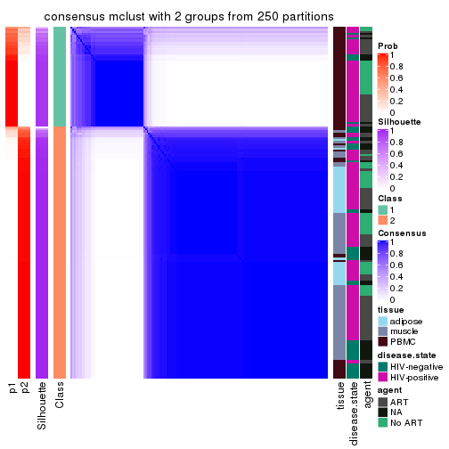</p>

</div>
<div id='tab-MAD-mclust-consensus-heatmap-2'>
<pre><code class="r">consensus_heatmap(res, k = 3)
</code></pre>

<p>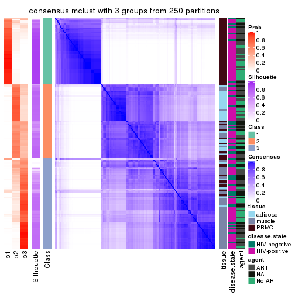</p>

</div>
<div id='tab-MAD-mclust-consensus-heatmap-3'>
<pre><code class="r">consensus_heatmap(res, k = 4)
</code></pre>

<p>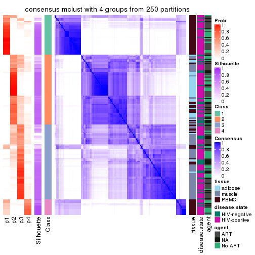</p>

</div>
<div id='tab-MAD-mclust-consensus-heatmap-4'>
<pre><code class="r">consensus_heatmap(res, k = 5)
</code></pre>

<p>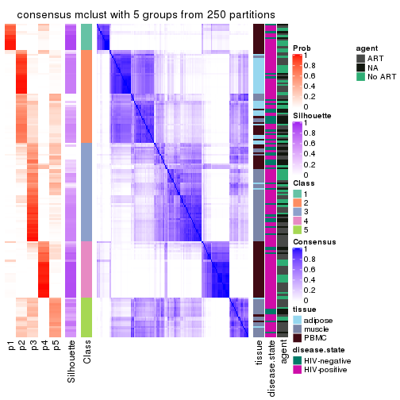</p>

</div>
<div id='tab-MAD-mclust-consensus-heatmap-5'>
<pre><code class="r">consensus_heatmap(res, k = 6)
</code></pre>

<p>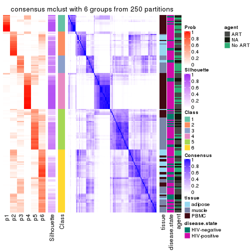</p>

</div>
</div>

Heatmaps for the membership of samples in all partitions to see how consistent they are:


<script>
$( function() {
	$( '#tabs-MAD-mclust-membership-heatmap' ).tabs();
} );
</script>
<div id='tabs-MAD-mclust-membership-heatmap'>
<ul>
<li><a href='#tab-MAD-mclust-membership-heatmap-1'>k = 2</a></li>
<li><a href='#tab-MAD-mclust-membership-heatmap-2'>k = 3</a></li>
<li><a href='#tab-MAD-mclust-membership-heatmap-3'>k = 4</a></li>
<li><a href='#tab-MAD-mclust-membership-heatmap-4'>k = 5</a></li>
<li><a href='#tab-MAD-mclust-membership-heatmap-5'>k = 6</a></li>
</ul>
<div id='tab-MAD-mclust-membership-heatmap-1'>
<pre><code class="r">membership_heatmap(res, k = 2)
</code></pre>

<p>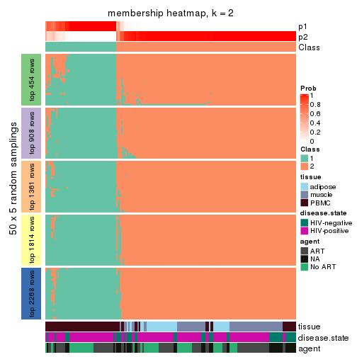</p>

</div>
<div id='tab-MAD-mclust-membership-heatmap-2'>
<pre><code class="r">membership_heatmap(res, k = 3)
</code></pre>

<p>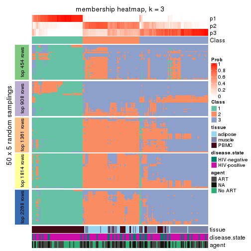</p>

</div>
<div id='tab-MAD-mclust-membership-heatmap-3'>
<pre><code class="r">membership_heatmap(res, k = 4)
</code></pre>

<p>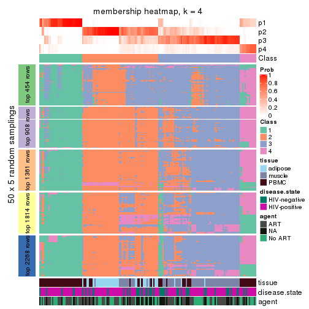</p>

</div>
<div id='tab-MAD-mclust-membership-heatmap-4'>
<pre><code class="r">membership_heatmap(res, k = 5)
</code></pre>

<p>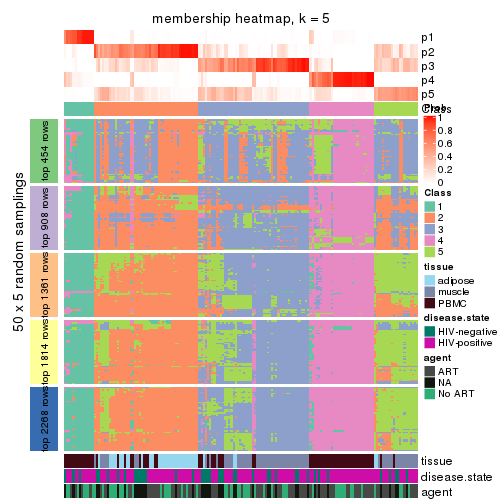</p>

</div>
<div id='tab-MAD-mclust-membership-heatmap-5'>
<pre><code class="r">membership_heatmap(res, k = 6)
</code></pre>

<p>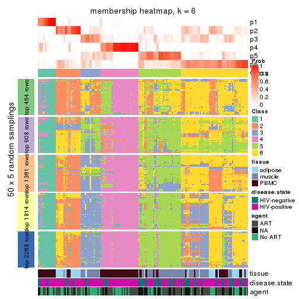</p>

</div>
</div>

As soon as we have had the classes for columns, we can look for signatures
which are significantly different between classes which can be candidate marks
for certain classes. Following are the heatmaps for signatures.


Signature heatmaps where rows are scaled:


<script>
$( function() {
	$( '#tabs-MAD-mclust-get-signatures' ).tabs();
} );
</script>
<div id='tabs-MAD-mclust-get-signatures'>
<ul>
<li><a href='#tab-MAD-mclust-get-signatures-1'>k = 2</a></li>
<li><a href='#tab-MAD-mclust-get-signatures-2'>k = 3</a></li>
<li><a href='#tab-MAD-mclust-get-signatures-3'>k = 4</a></li>
<li><a href='#tab-MAD-mclust-get-signatures-4'>k = 5</a></li>
<li><a href='#tab-MAD-mclust-get-signatures-5'>k = 6</a></li>
</ul>
<div id='tab-MAD-mclust-get-signatures-1'>
<pre><code class="r">get_signatures(res, k = 2)
</code></pre>

<p>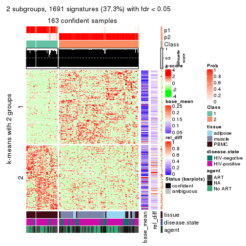</p>

</div>
<div id='tab-MAD-mclust-get-signatures-2'>
<pre><code class="r">get_signatures(res, k = 3)
</code></pre>

<p>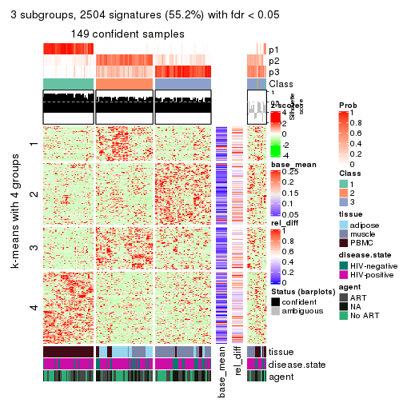</p>

</div>
<div id='tab-MAD-mclust-get-signatures-3'>
<pre><code class="r">get_signatures(res, k = 4)
</code></pre>

<p>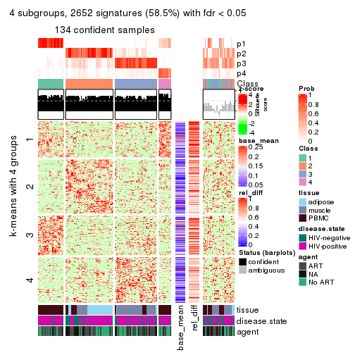</p>

</div>
<div id='tab-MAD-mclust-get-signatures-4'>
<pre><code class="r">get_signatures(res, k = 5)
</code></pre>

<p>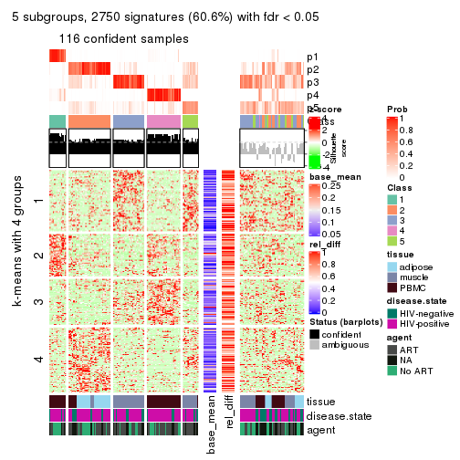</p>

</div>
<div id='tab-MAD-mclust-get-signatures-5'>
<pre><code class="r">get_signatures(res, k = 6)
</code></pre>

<p>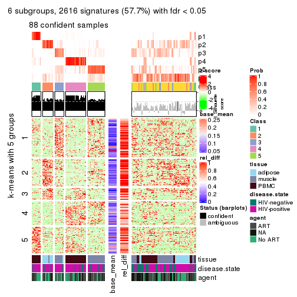</p>

</div>
</div>


Signature heatmaps where rows are not scaled:


<script>
$( function() {
	$( '#tabs-MAD-mclust-get-signatures-no-scale' ).tabs();
} );
</script>
<div id='tabs-MAD-mclust-get-signatures-no-scale'>
<ul>
<li><a href='#tab-MAD-mclust-get-signatures-no-scale-1'>k = 2</a></li>
<li><a href='#tab-MAD-mclust-get-signatures-no-scale-2'>k = 3</a></li>
<li><a href='#tab-MAD-mclust-get-signatures-no-scale-3'>k = 4</a></li>
<li><a href='#tab-MAD-mclust-get-signatures-no-scale-4'>k = 5</a></li>
<li><a href='#tab-MAD-mclust-get-signatures-no-scale-5'>k = 6</a></li>
</ul>
<div id='tab-MAD-mclust-get-signatures-no-scale-1'>
<pre><code class="r">get_signatures(res, k = 2, scale_rows = FALSE)
</code></pre>

<p>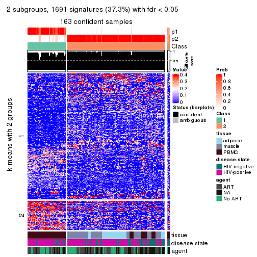</p>

</div>
<div id='tab-MAD-mclust-get-signatures-no-scale-2'>
<pre><code class="r">get_signatures(res, k = 3, scale_rows = FALSE)
</code></pre>

<p>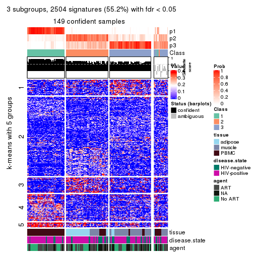</p>

</div>
<div id='tab-MAD-mclust-get-signatures-no-scale-3'>
<pre><code class="r">get_signatures(res, k = 4, scale_rows = FALSE)
</code></pre>

<p>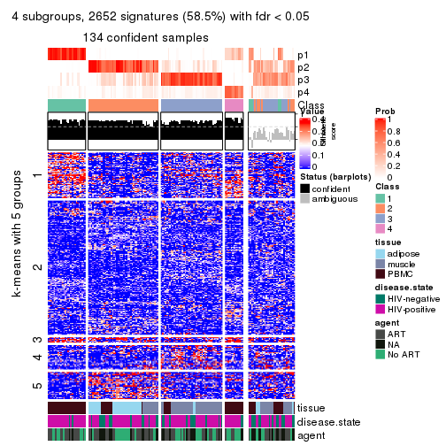</p>

</div>
<div id='tab-MAD-mclust-get-signatures-no-scale-4'>
<pre><code class="r">get_signatures(res, k = 5, scale_rows = FALSE)
</code></pre>

<p>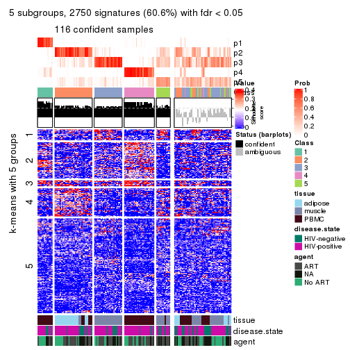</p>

</div>
<div id='tab-MAD-mclust-get-signatures-no-scale-5'>
<pre><code class="r">get_signatures(res, k = 6, scale_rows = FALSE)
</code></pre>

<p>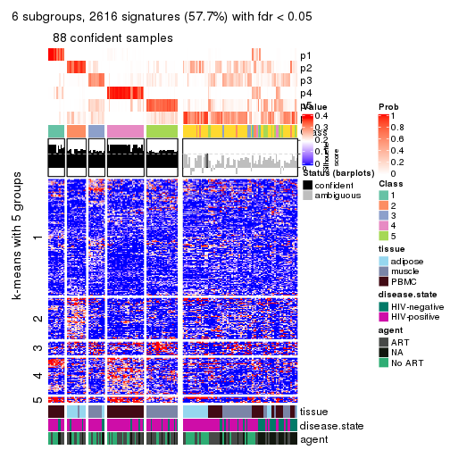</p>

</div>
</div>


Compare the overlap of signatures from different k:

```r
compare_signatures(res)
```

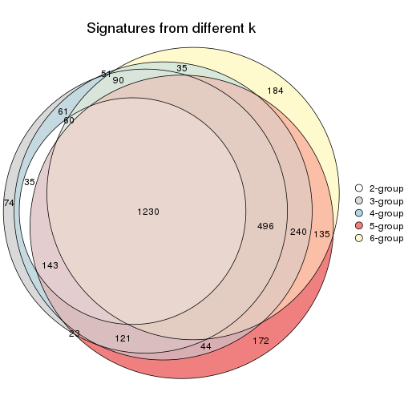

`get_signature()` returns a data frame invisibly. TO get the list of signatures, the function
call should be assigned to a variable explicitly. In following code, if `plot` argument is set
to `FALSE`, no heatmap is plotted while only the differential analysis is performed.

```r
# code only for demonstration
tb = get_signature(res, k = ..., plot = FALSE)
```

An example of the output of `tb` is:

```
#>   which_row         fdr    mean_1    mean_2 scaled_mean_1 scaled_mean_2 km
#> 1        38 0.042760348  8.373488  9.131774    -0.5533452     0.5164555  1
#> 2        40 0.018707592  7.106213  8.469186    -0.6173731     0.5762149  1
#> 3        55 0.019134737 10.221463 11.207825    -0.6159697     0.5749050  1
#> 4        59 0.006059896  5.921854  7.869574    -0.6899429     0.6439467  1
#> 5        60 0.018055526  8.928898 10.211722    -0.6204761     0.5791110  1
#> 6        98 0.009384629 15.714769 14.887706     0.6635654    -0.6193277  2
...
```

The columns in `tb` are:

1. `which_row`: row indices corresponding to the input matrix.
2. `fdr`: FDR for the differential test. 
3. `mean_x`: The mean value in group x.
4. `scaled_mean_x`: The mean value in group x after rows are scaled.
5. `km`: Row groups if k-means clustering is applied to rows.


UMAP plot which shows how samples are separated.


<script>
$( function() {
	$( '#tabs-MAD-mclust-dimension-reduction' ).tabs();
} );
</script>
<div id='tabs-MAD-mclust-dimension-reduction'>
<ul>
<li><a href='#tab-MAD-mclust-dimension-reduction-1'>k = 2</a></li>
<li><a href='#tab-MAD-mclust-dimension-reduction-2'>k = 3</a></li>
<li><a href='#tab-MAD-mclust-dimension-reduction-3'>k = 4</a></li>
<li><a href='#tab-MAD-mclust-dimension-reduction-4'>k = 5</a></li>
<li><a href='#tab-MAD-mclust-dimension-reduction-5'>k = 6</a></li>
</ul>
<div id='tab-MAD-mclust-dimension-reduction-1'>
<pre><code class="r">dimension_reduction(res, k = 2, method = &quot;UMAP&quot;)
</code></pre>

<p>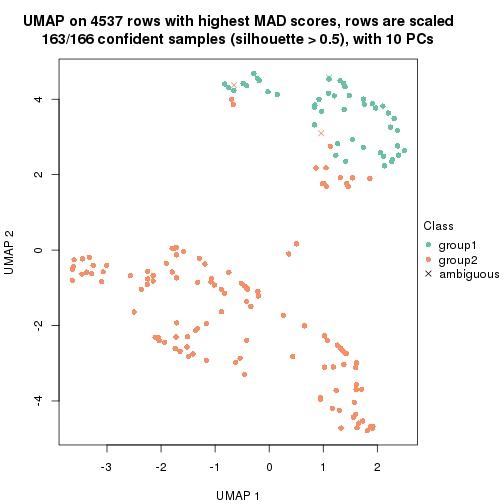</p>

</div>
<div id='tab-MAD-mclust-dimension-reduction-2'>
<pre><code class="r">dimension_reduction(res, k = 3, method = &quot;UMAP&quot;)
</code></pre>

<p>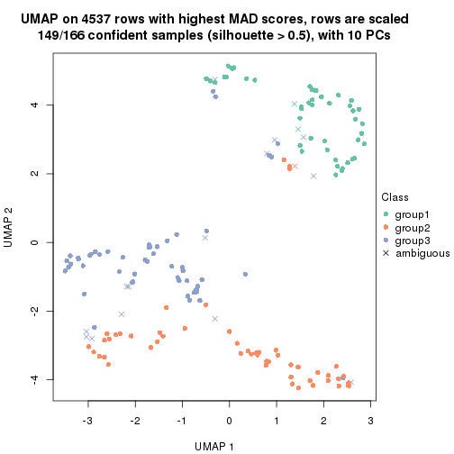</p>

</div>
<div id='tab-MAD-mclust-dimension-reduction-3'>
<pre><code class="r">dimension_reduction(res, k = 4, method = &quot;UMAP&quot;)
</code></pre>

<p>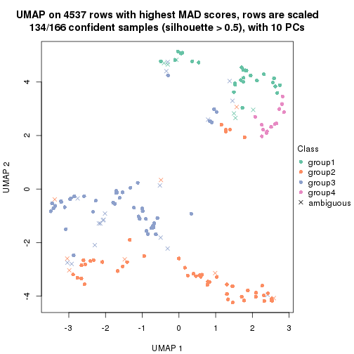</p>

</div>
<div id='tab-MAD-mclust-dimension-reduction-4'>
<pre><code class="r">dimension_reduction(res, k = 5, method = &quot;UMAP&quot;)
</code></pre>

<p>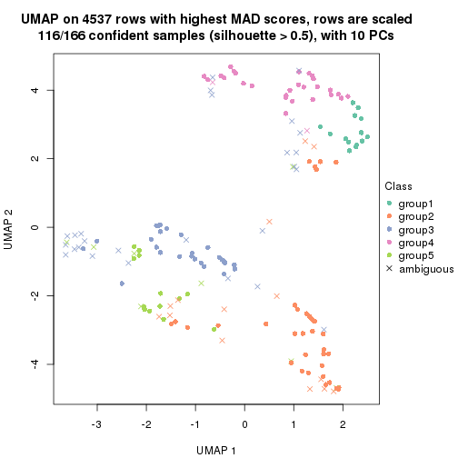</p>

</div>
<div id='tab-MAD-mclust-dimension-reduction-5'>
<pre><code class="r">dimension_reduction(res, k = 6, method = &quot;UMAP&quot;)
</code></pre>

<p>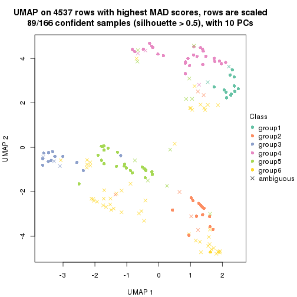</p>

</div>
</div>


Following heatmap shows how subgroups are split when increasing `k`:

```r
collect_classes(res)
```

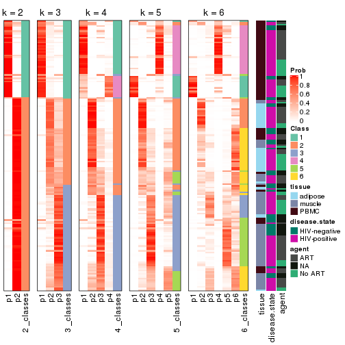


Test correlation between subgroups and known annotations. If the known
annotation is numeric, one-way ANOVA test is applied, and if the known
annotation is discrete, chi-squared contingency table test is applied.

```r
test_to_known_factors(res)
```

```
#>              n tissue(p) disease.state(p) agent(p) k
#> MAD:mclust 163  2.98e-22            0.066    0.117 2
#> MAD:mclust 149  2.78e-32            0.106    0.331 3
#> MAD:mclust 134  9.74e-28            0.217    0.298 4
#> MAD:mclust 116  2.56e-33            0.610    0.185 5
#> MAD:mclust  89  1.50e-28            0.936    0.378 6
```


If matrix rows can be associated to genes, consider to use `GO_Enrichment(res,
...)` to perform function enrichment for the signature genes.


 

---------------------------------------------------


### MAD:NMF


The object with results only for a single top-value method and a single partition method 
can be extracted as:

```r
res = res_list["MAD", "NMF"]
# you can also extract it by
# res = res_list["MAD:NMF"]
```

A summary of `res` and all the functions that can be applied to it:

```r
res
```

```
#> A 'ConsensusPartition' object with k = 2, 3, 4, 5, 6.
#>   On a matrix with 4537 rows and 166 columns.
#>   Top rows (454, 908, 1361, 1814, 2268) are extracted by 'MAD' method.
#>   Subgroups are detected by 'NMF' method.
#>   Performed in total 1250 partitions by row resampling.
#>   Best k for subgroups seems to be 2.
#> 
#> Following methods can be applied to this 'ConsensusPartition' object:
#>  [1] "cola_report"             "collect_classes"         "collect_plots"          
#>  [4] "collect_stats"           "colnames"                "compare_signatures"     
#>  [7] "consensus_heatmap"       "dimension_reduction"     "functional_enrichment"  
#> [10] "get_anno_col"            "get_anno"                "get_classes"            
#> [13] "get_consensus"           "get_matrix"              "get_membership"         
#> [16] "get_param"               "get_signatures"          "get_stats"              
#> [19] "is_best_k"               "is_stable_k"             "membership_heatmap"     
#> [22] "ncol"                    "nrow"                    "plot_ecdf"              
#> [25] "rownames"                "select_partition_number" "show"                   
#> [28] "suggest_best_k"          "test_to_known_factors"
```

`collect_plots()` function collects all the plots made from `res` for all `k` (number of partitions)
into one single page to provide an easy and fast comparison between different `k`.

```r
collect_plots(res)
```

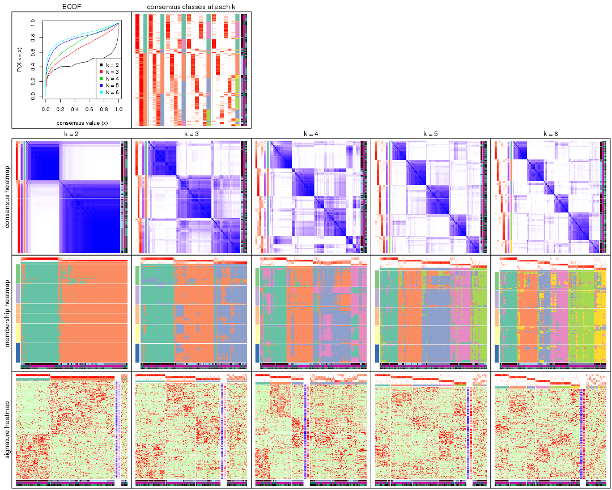

The plots are:

- The first row: a plot of the ECDF (Empirical cumulative distribution
  function) curves of the consensus matrix for each `k` and the heatmap of
  predicted classes for each `k`.
- The second row: heatmaps of the consensus matrix for each `k`.
- The third row: heatmaps of the membership matrix for each `k`.
- The fouth row: heatmaps of the signatures for each `k`.

All the plots in panels can be made by individual functions and they are
plotted later in this section.

`select_partition_number()` produces several plots showing different
statistics for choosing "optimized" `k`. There are following statistics:

- ECDF curves of the consensus matrix for each `k`;
- 1-PAC. [The PAC
  score](https://en.wikipedia.org/wiki/Consensus_clustering#Over-interpretation_potential_of_consensus_clustering)
  measures the proportion of the ambiguous subgrouping.
- Mean silhouette score.
- Concordance. The mean probability of fiting the consensus class ids in all
  partitions.
- Area increased. Denote $A_k$ as the area under the ECDF curve for current
  `k`, the area increased is defined as $A_k - A_{k-1}$.
- Rand index. The percent of pairs of samples that are both in a same cluster
  or both are not in a same cluster in the partition of k and k-1.
- Jaccard index. The ratio of pairs of samples are both in a same cluster in
  the partition of k and k-1 and the pairs of samples are both in a same
  cluster in the partition k or k-1.

The detailed explanations of these statistics can be found in [the cola
vignette](http://bioconductor.org/packages/devel/bioc/vignettes/cola/inst/doc/cola.html#toc_13).

Generally speaking, lower PAC score, higher mean silhouette score or higher
concordance corresponds to better partition. Rand index and Jaccard index
measure how similar the current partition is compared to partition with `k-1`.
If they are too similar, we won't accept `k` is better than `k-1`.

```r
select_partition_number(res)
```

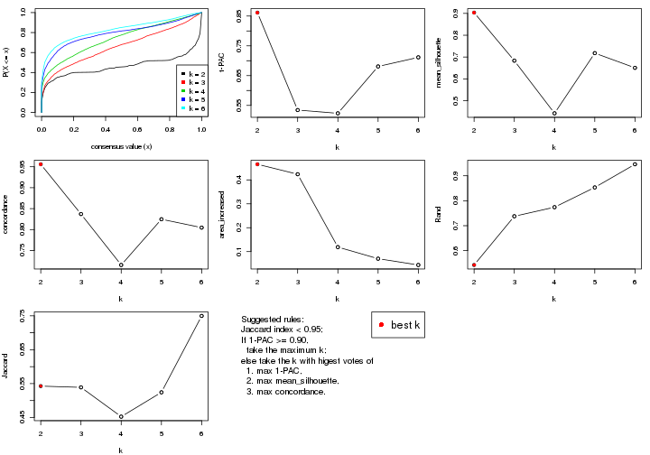

The numeric values for all these statistics can be obtained by `get_stats()`.

```r
get_stats(res)
```

```
#>   k 1-PAC mean_silhouette concordance area_increased  Rand Jaccard
#> 2 2 0.862           0.904       0.956         0.4653 0.543   0.543
#> 3 3 0.534           0.683       0.837         0.4237 0.738   0.539
#> 4 4 0.523           0.442       0.715         0.1189 0.774   0.452
#> 5 5 0.681           0.718       0.825         0.0704 0.853   0.524
#> 6 6 0.711           0.650       0.805         0.0441 0.946   0.750
```

`suggest_best_k()` suggests the best $k$ based on these statistics. The rules are as follows:

- All $k$ with Jaccard index larger than 0.95 are removed because the increase of
  the partition number does not provides enough extra information. If all $k$ are removed,
  the best $k$ is assigned by `NA`.
- For $k$ with 1-PAC larger than 0.9, the maximal $k$ is taken as the "best k". Other $k$ is called "optional k".
- If it does not fit the second rule. The $k$ with the highest vote of highest
  1-PAC, mean silhouette and concordance is taken as the "best k".

```r
suggest_best_k(res)
```

```
#> [1] 2
```


Following shows the table of the partitions (You need to click the **show/hide
code output** link to see it). The membership matrix (columns with name `p*`)
is inferred by
[`clue::cl_consensus()`](https://www.rdocumentation.org/link/cl_consensus?package=clue)
function with the `SE` method. Basically the value in the membership matrix
represents the probability to belong to a certain group. The finall class
label for an item is determined with the group with highest probability it
belongs to.

In `get_classes()` function, the entropy is calculated from the membership
matrix and the silhouette score is calculated from the consensus matrix.


<script>
$( function() {
	$( '#tabs-MAD-NMF-get-classes' ).tabs();
} );
</script>
<div id='tabs-MAD-NMF-get-classes'>
<ul>
<li><a href='#tab-MAD-NMF-get-classes-1'>k = 2</a></li>
<li><a href='#tab-MAD-NMF-get-classes-2'>k = 3</a></li>
<li><a href='#tab-MAD-NMF-get-classes-3'>k = 4</a></li>
<li><a href='#tab-MAD-NMF-get-classes-4'>k = 5</a></li>
<li><a href='#tab-MAD-NMF-get-classes-5'>k = 6</a></li>
</ul>

<div id='tab-MAD-NMF-get-classes-1'>
<p><a id='tab-MAD-NMF-get-classes-1-a' style='color:#0366d6' href='#'>show/hide code output</a></p>
<pre><code class="r">cbind(get_classes(res, k = 2), get_membership(res, k = 2))
</code></pre>

<pre><code>#&gt;           class entropy silhouette    p1    p2
#&gt; GSM751298     1  0.0000      0.956 1.000 0.000
#&gt; GSM751304     2  0.2423      0.938 0.040 0.960
#&gt; GSM751305     2  0.1414      0.948 0.020 0.980
#&gt; GSM751307     1  0.1414      0.946 0.980 0.020
#&gt; GSM751310     1  0.0000      0.956 1.000 0.000
#&gt; GSM751314     1  0.0000      0.956 1.000 0.000
#&gt; GSM751316     1  0.0000      0.956 1.000 0.000
#&gt; GSM751318     1  0.1843      0.940 0.972 0.028
#&gt; GSM751342     1  0.1414      0.945 0.980 0.020
#&gt; GSM751346     1  0.0000      0.956 1.000 0.000
#&gt; GSM751347     1  0.4298      0.881 0.912 0.088
#&gt; GSM751348     2  0.9954      0.161 0.460 0.540
#&gt; GSM751349     2  0.0000      0.953 0.000 1.000
#&gt; GSM751352     2  0.9754      0.365 0.408 0.592
#&gt; GSM751353     2  0.2603      0.935 0.044 0.956
#&gt; GSM751354     2  0.4022      0.908 0.080 0.920
#&gt; GSM751355     2  0.1414      0.947 0.020 0.980
#&gt; GSM751358     2  0.0000      0.953 0.000 1.000
#&gt; GSM751359     2  0.0000      0.953 0.000 1.000
#&gt; GSM751294     2  0.0672      0.951 0.008 0.992
#&gt; GSM751296     1  0.0000      0.956 1.000 0.000
#&gt; GSM751297     1  0.1184      0.946 0.984 0.016
#&gt; GSM751299     2  0.7139      0.781 0.196 0.804
#&gt; GSM751300     1  0.0000      0.956 1.000 0.000
#&gt; GSM751301     1  0.0672      0.953 0.992 0.008
#&gt; GSM751302     1  0.0000      0.956 1.000 0.000
#&gt; GSM751303     1  0.0376      0.955 0.996 0.004
#&gt; GSM751306     1  0.0000      0.956 1.000 0.000
#&gt; GSM751308     1  0.6247      0.804 0.844 0.156
#&gt; GSM751309     1  0.0000      0.956 1.000 0.000
#&gt; GSM751311     1  0.0376      0.955 0.996 0.004
#&gt; GSM751312     1  0.0000      0.956 1.000 0.000
#&gt; GSM751313     1  0.0000      0.956 1.000 0.000
#&gt; GSM751315     1  0.0000      0.956 1.000 0.000
#&gt; GSM751317     1  0.0376      0.955 0.996 0.004
#&gt; GSM751320     1  0.0000      0.956 1.000 0.000
#&gt; GSM751321     1  0.0000      0.956 1.000 0.000
#&gt; GSM751322     1  0.0000      0.956 1.000 0.000
#&gt; GSM751324     1  0.0672      0.953 0.992 0.008
#&gt; GSM751325     1  0.0376      0.955 0.996 0.004
#&gt; GSM751332     1  0.1184      0.948 0.984 0.016
#&gt; GSM751334     1  0.0672      0.953 0.992 0.008
#&gt; GSM751339     1  0.0376      0.954 0.996 0.004
#&gt; GSM751341     1  0.0000      0.956 1.000 0.000
#&gt; GSM751343     1  0.0376      0.955 0.996 0.004
#&gt; GSM751344     2  0.1843      0.945 0.028 0.972
#&gt; GSM751345     2  0.4431      0.899 0.092 0.908
#&gt; GSM751356     2  0.2043      0.943 0.032 0.968
#&gt; GSM751357     2  0.1184      0.949 0.016 0.984
#&gt; GSM751293     1  0.0672      0.953 0.992 0.008
#&gt; GSM751295     1  0.0000      0.956 1.000 0.000
#&gt; GSM751319     1  0.0000      0.956 1.000 0.000
#&gt; GSM751323     1  0.0000      0.956 1.000 0.000
#&gt; GSM751326     1  0.0000      0.956 1.000 0.000
#&gt; GSM751327     1  0.0000      0.956 1.000 0.000
#&gt; GSM751328     1  0.0938      0.951 0.988 0.012
#&gt; GSM751329     1  0.0672      0.953 0.992 0.008
#&gt; GSM751330     1  0.0000      0.956 1.000 0.000
#&gt; GSM751331     1  0.0000      0.956 1.000 0.000
#&gt; GSM751333     1  0.0000      0.956 1.000 0.000
#&gt; GSM751335     1  0.0000      0.956 1.000 0.000
#&gt; GSM751336     1  0.0000      0.956 1.000 0.000
#&gt; GSM751337     1  0.0000      0.956 1.000 0.000
#&gt; GSM751338     1  0.0000      0.956 1.000 0.000
#&gt; GSM751340     1  0.4298      0.884 0.912 0.088
#&gt; GSM751350     1  0.0000      0.956 1.000 0.000
#&gt; GSM751351     1  0.0000      0.956 1.000 0.000
#&gt; GSM751362     2  0.2423      0.938 0.040 0.960
#&gt; GSM751363     2  0.9248      0.487 0.340 0.660
#&gt; GSM751367     1  0.0376      0.954 0.996 0.004
#&gt; GSM751368     2  0.0376      0.952 0.004 0.996
#&gt; GSM751371     1  0.5946      0.832 0.856 0.144
#&gt; GSM751375     2  0.0000      0.953 0.000 1.000
#&gt; GSM751376     2  0.2043      0.942 0.032 0.968
#&gt; GSM751378     2  0.0000      0.953 0.000 1.000
#&gt; GSM751379     2  0.2043      0.942 0.032 0.968
#&gt; GSM751382     2  0.0672      0.951 0.008 0.992
#&gt; GSM751386     2  0.0000      0.953 0.000 1.000
#&gt; GSM751388     2  0.0000      0.953 0.000 1.000
#&gt; GSM751391     2  0.3584      0.915 0.068 0.932
#&gt; GSM751410     1  0.9954      0.107 0.540 0.460
#&gt; GSM751414     1  0.6148      0.818 0.848 0.152
#&gt; GSM751361     2  0.0000      0.953 0.000 1.000
#&gt; GSM751365     2  0.0000      0.953 0.000 1.000
#&gt; GSM751366     2  0.9661      0.343 0.392 0.608
#&gt; GSM751369     2  0.1633      0.946 0.024 0.976
#&gt; GSM751370     2  0.5294      0.869 0.120 0.880
#&gt; GSM751372     2  0.0000      0.953 0.000 1.000
#&gt; GSM751373     1  0.9580      0.423 0.620 0.380
#&gt; GSM751374     2  0.2423      0.938 0.040 0.960
#&gt; GSM751377     2  0.0000      0.953 0.000 1.000
#&gt; GSM751380     2  0.9815      0.303 0.420 0.580
#&gt; GSM751381     2  0.0000      0.953 0.000 1.000
#&gt; GSM751383     2  0.0000      0.953 0.000 1.000
#&gt; GSM751384     2  0.0000      0.953 0.000 1.000
#&gt; GSM751385     2  0.0000      0.953 0.000 1.000
#&gt; GSM751387     2  0.0000      0.953 0.000 1.000
#&gt; GSM751389     2  0.0672      0.951 0.008 0.992
#&gt; GSM751393     2  0.0000      0.953 0.000 1.000
#&gt; GSM751394     2  0.0000      0.953 0.000 1.000
#&gt; GSM751395     2  0.0376      0.952 0.004 0.996
#&gt; GSM751397     2  0.0000      0.953 0.000 1.000
#&gt; GSM751398     2  0.0000      0.953 0.000 1.000
#&gt; GSM751404     2  0.0000      0.953 0.000 1.000
#&gt; GSM751406     2  0.1414      0.947 0.020 0.980
#&gt; GSM751411     2  0.0000      0.953 0.000 1.000
#&gt; GSM751413     2  0.0672      0.951 0.008 0.992
#&gt; GSM751415     2  0.0376      0.952 0.004 0.996
#&gt; GSM751416     2  0.0000      0.953 0.000 1.000
#&gt; GSM751417     2  0.0000      0.953 0.000 1.000
#&gt; GSM751421     2  0.3114      0.924 0.056 0.944
#&gt; GSM751422     2  0.0000      0.953 0.000 1.000
#&gt; GSM751360     2  0.3114      0.922 0.056 0.944
#&gt; GSM751364     2  0.0000      0.953 0.000 1.000
#&gt; GSM751390     2  0.0000      0.953 0.000 1.000
#&gt; GSM751392     2  0.0000      0.953 0.000 1.000
#&gt; GSM751396     2  0.0000      0.953 0.000 1.000
#&gt; GSM751399     2  0.0672      0.951 0.008 0.992
#&gt; GSM751400     2  0.0000      0.953 0.000 1.000
#&gt; GSM751401     2  0.1184      0.949 0.016 0.984
#&gt; GSM751402     2  0.1843      0.944 0.028 0.972
#&gt; GSM751403     2  0.0000      0.953 0.000 1.000
#&gt; GSM751405     2  0.1633      0.946 0.024 0.976
#&gt; GSM751407     2  0.0000      0.953 0.000 1.000
#&gt; GSM751408     2  0.0000      0.953 0.000 1.000
#&gt; GSM751409     2  0.0000      0.953 0.000 1.000
#&gt; GSM751412     2  0.0000      0.953 0.000 1.000
#&gt; GSM751418     2  0.0000      0.953 0.000 1.000
#&gt; GSM751419     2  0.0000      0.953 0.000 1.000
#&gt; GSM751420     2  0.0672      0.951 0.008 0.992
#&gt; GSM751425     2  0.0000      0.953 0.000 1.000
#&gt; GSM751429     1  0.9635      0.334 0.612 0.388
#&gt; GSM751430     2  0.4022      0.904 0.080 0.920
#&gt; GSM751433     1  0.9491      0.441 0.632 0.368
#&gt; GSM751437     2  0.4161      0.906 0.084 0.916
#&gt; GSM751448     2  0.4022      0.909 0.080 0.920
#&gt; GSM751451     2  0.9522      0.401 0.372 0.628
#&gt; GSM751423     2  0.0000      0.953 0.000 1.000
#&gt; GSM751424     2  0.0376      0.952 0.004 0.996
#&gt; GSM751428     2  0.2043      0.943 0.032 0.968
#&gt; GSM751431     2  0.0000      0.953 0.000 1.000
#&gt; GSM751432     2  0.0672      0.951 0.008 0.992
#&gt; GSM751434     2  0.6623      0.804 0.172 0.828
#&gt; GSM751435     2  0.3274      0.922 0.060 0.940
#&gt; GSM751436     2  0.6438      0.811 0.164 0.836
#&gt; GSM751440     2  0.6801      0.792 0.180 0.820
#&gt; GSM751444     2  0.0000      0.953 0.000 1.000
#&gt; GSM751446     2  0.0672      0.951 0.008 0.992
#&gt; GSM751449     2  0.0000      0.953 0.000 1.000
#&gt; GSM751450     2  0.4022      0.904 0.080 0.920
#&gt; GSM751452     2  0.1843      0.942 0.028 0.972
#&gt; GSM751426     2  0.5294      0.864 0.120 0.880
#&gt; GSM751427     2  0.0000      0.953 0.000 1.000
#&gt; GSM751438     2  0.0376      0.952 0.004 0.996
#&gt; GSM751439     2  0.2778      0.933 0.048 0.952
#&gt; GSM751441     2  0.0000      0.953 0.000 1.000
#&gt; GSM751442     2  0.4431      0.894 0.092 0.908
#&gt; GSM751443     2  0.3114      0.927 0.056 0.944
#&gt; GSM751445     2  0.0000      0.953 0.000 1.000
#&gt; GSM751447     2  0.0000      0.953 0.000 1.000
#&gt; GSM751453     2  0.0376      0.952 0.004 0.996
#&gt; GSM751454     2  0.0000      0.953 0.000 1.000
#&gt; GSM751455     2  0.0376      0.952 0.004 0.996
#&gt; GSM751456     2  0.0938      0.950 0.012 0.988
#&gt; GSM751457     2  0.0938      0.950 0.012 0.988
#&gt; GSM751458     2  0.0376      0.952 0.004 0.996
</code></pre>

<script>
$('#tab-MAD-NMF-get-classes-1-a').parent().next().next().hide();
$('#tab-MAD-NMF-get-classes-1-a').click(function(){
  $('#tab-MAD-NMF-get-classes-1-a').parent().next().next().toggle();
  return(false);
});
</script>
</div>

<div id='tab-MAD-NMF-get-classes-2'>
<p><a id='tab-MAD-NMF-get-classes-2-a' style='color:#0366d6' href='#'>show/hide code output</a></p>
<pre><code class="r">cbind(get_classes(res, k = 3), get_membership(res, k = 3))
</code></pre>

<pre><code>#&gt;           class entropy silhouette    p1    p2    p3
#&gt; GSM751298     1  0.0983    0.89440 0.980 0.004 0.016
#&gt; GSM751304     3  0.2152    0.76248 0.016 0.036 0.948
#&gt; GSM751305     2  0.7181    0.28393 0.028 0.564 0.408
#&gt; GSM751307     1  0.6298    0.41847 0.608 0.388 0.004
#&gt; GSM751310     1  0.2152    0.89266 0.948 0.036 0.016
#&gt; GSM751314     1  0.2793    0.88861 0.928 0.044 0.028
#&gt; GSM751316     1  0.3482    0.84487 0.872 0.000 0.128
#&gt; GSM751318     1  0.3692    0.87614 0.896 0.056 0.048
#&gt; GSM751342     1  0.3134    0.88470 0.916 0.052 0.032
#&gt; GSM751346     1  0.6169    0.48113 0.636 0.004 0.360
#&gt; GSM751347     1  0.6516    0.14359 0.516 0.004 0.480
#&gt; GSM751348     2  0.9579    0.04017 0.368 0.432 0.200
#&gt; GSM751349     2  0.1753    0.79234 0.000 0.952 0.048
#&gt; GSM751352     2  0.9937   -0.02167 0.328 0.384 0.288
#&gt; GSM751353     2  0.3983    0.75648 0.048 0.884 0.068
#&gt; GSM751354     3  0.5588    0.69614 0.068 0.124 0.808
#&gt; GSM751355     3  0.6282    0.39713 0.004 0.384 0.612
#&gt; GSM751358     3  0.6057    0.47392 0.004 0.340 0.656
#&gt; GSM751359     2  0.3619    0.75660 0.000 0.864 0.136
#&gt; GSM751294     3  0.1860    0.76125 0.000 0.052 0.948
#&gt; GSM751296     1  0.1399    0.89123 0.968 0.004 0.028
#&gt; GSM751297     3  0.6247    0.27568 0.376 0.004 0.620
#&gt; GSM751299     3  0.9074    0.31019 0.156 0.328 0.516
#&gt; GSM751300     1  0.2200    0.88131 0.940 0.004 0.056
#&gt; GSM751301     1  0.5244    0.70451 0.756 0.240 0.004
#&gt; GSM751302     1  0.3349    0.84850 0.888 0.004 0.108
#&gt; GSM751303     1  0.3155    0.88516 0.916 0.044 0.040
#&gt; GSM751306     1  0.2689    0.89043 0.932 0.036 0.032
#&gt; GSM751308     1  0.7464    0.35889 0.560 0.040 0.400
#&gt; GSM751309     1  0.3042    0.88690 0.920 0.040 0.040
#&gt; GSM751311     1  0.2663    0.88951 0.932 0.044 0.024
#&gt; GSM751312     1  0.1753    0.88809 0.952 0.000 0.048
#&gt; GSM751313     1  0.1411    0.89279 0.964 0.000 0.036
#&gt; GSM751315     1  0.0424    0.89583 0.992 0.000 0.008
#&gt; GSM751317     1  0.2443    0.89254 0.940 0.028 0.032
#&gt; GSM751320     1  0.0592    0.89559 0.988 0.000 0.012
#&gt; GSM751321     1  0.0424    0.89583 0.992 0.000 0.008
#&gt; GSM751322     1  0.2152    0.89233 0.948 0.036 0.016
#&gt; GSM751324     1  0.3039    0.88647 0.920 0.044 0.036
#&gt; GSM751325     1  0.2383    0.89091 0.940 0.044 0.016
#&gt; GSM751332     1  0.2527    0.88985 0.936 0.044 0.020
#&gt; GSM751334     1  0.2414    0.89105 0.940 0.040 0.020
#&gt; GSM751339     1  0.6148    0.53884 0.640 0.004 0.356
#&gt; GSM751341     1  0.1129    0.89311 0.976 0.004 0.020
#&gt; GSM751343     1  0.2793    0.88861 0.928 0.044 0.028
#&gt; GSM751344     2  0.5060    0.70786 0.028 0.816 0.156
#&gt; GSM751345     2  0.7256    0.56817 0.124 0.712 0.164
#&gt; GSM751356     3  0.3722    0.74161 0.024 0.088 0.888
#&gt; GSM751357     3  0.5723    0.62124 0.016 0.240 0.744
#&gt; GSM751293     1  0.5443    0.67730 0.736 0.260 0.004
#&gt; GSM751295     1  0.4233    0.79977 0.836 0.004 0.160
#&gt; GSM751319     1  0.0237    0.89549 0.996 0.000 0.004
#&gt; GSM751323     1  0.0424    0.89507 0.992 0.000 0.008
#&gt; GSM751326     1  0.0592    0.89443 0.988 0.000 0.012
#&gt; GSM751327     1  0.1905    0.89414 0.956 0.028 0.016
#&gt; GSM751328     1  0.2229    0.89071 0.944 0.044 0.012
#&gt; GSM751329     1  0.1950    0.89264 0.952 0.040 0.008
#&gt; GSM751330     1  0.0983    0.89363 0.980 0.004 0.016
#&gt; GSM751331     1  0.2301    0.87954 0.936 0.004 0.060
#&gt; GSM751333     1  0.0747    0.89424 0.984 0.000 0.016
#&gt; GSM751335     1  0.0829    0.89400 0.984 0.004 0.012
#&gt; GSM751336     1  0.2400    0.87747 0.932 0.004 0.064
#&gt; GSM751337     1  0.1163    0.89486 0.972 0.000 0.028
#&gt; GSM751338     1  0.2261    0.88628 0.932 0.000 0.068
#&gt; GSM751340     3  0.6309   -0.19710 0.500 0.000 0.500
#&gt; GSM751350     1  0.3112    0.85883 0.900 0.004 0.096
#&gt; GSM751351     1  0.2496    0.87566 0.928 0.004 0.068
#&gt; GSM751362     3  0.1015    0.75652 0.008 0.012 0.980
#&gt; GSM751363     3  0.9577   -0.00331 0.196 0.400 0.404
#&gt; GSM751367     1  0.4047    0.81770 0.848 0.004 0.148
#&gt; GSM751368     2  0.1878    0.79485 0.004 0.952 0.044
#&gt; GSM751371     1  0.6761    0.65596 0.700 0.048 0.252
#&gt; GSM751375     2  0.1753    0.79234 0.000 0.952 0.048
#&gt; GSM751376     3  0.1647    0.75991 0.004 0.036 0.960
#&gt; GSM751378     3  0.4291    0.70759 0.000 0.180 0.820
#&gt; GSM751379     3  0.1399    0.75984 0.004 0.028 0.968
#&gt; GSM751382     2  0.1289    0.79328 0.000 0.968 0.032
#&gt; GSM751386     2  0.4399    0.70045 0.000 0.812 0.188
#&gt; GSM751388     2  0.1529    0.79314 0.000 0.960 0.040
#&gt; GSM751391     3  0.6431    0.67344 0.084 0.156 0.760
#&gt; GSM751410     3  0.2031    0.73941 0.032 0.016 0.952
#&gt; GSM751414     3  0.7839    0.27740 0.380 0.060 0.560
#&gt; GSM751361     2  0.6081    0.44998 0.004 0.652 0.344
#&gt; GSM751365     2  0.6008    0.39040 0.000 0.628 0.372
#&gt; GSM751366     3  0.5731    0.70372 0.088 0.108 0.804
#&gt; GSM751369     3  0.1267    0.75871 0.004 0.024 0.972
#&gt; GSM751370     3  0.6148    0.61114 0.028 0.244 0.728
#&gt; GSM751372     3  0.6468    0.18320 0.004 0.444 0.552
#&gt; GSM751373     2  0.7782    0.49310 0.248 0.652 0.100
#&gt; GSM751374     3  0.1877    0.75993 0.012 0.032 0.956
#&gt; GSM751377     2  0.4062    0.72655 0.000 0.836 0.164
#&gt; GSM751380     3  0.4887    0.71381 0.096 0.060 0.844
#&gt; GSM751381     2  0.4796    0.66051 0.000 0.780 0.220
#&gt; GSM751383     2  0.3038    0.77045 0.000 0.896 0.104
#&gt; GSM751384     2  0.6235    0.22344 0.000 0.564 0.436
#&gt; GSM751385     3  0.6244    0.21057 0.000 0.440 0.560
#&gt; GSM751387     2  0.1643    0.79283 0.000 0.956 0.044
#&gt; GSM751389     3  0.2165    0.75831 0.000 0.064 0.936
#&gt; GSM751393     3  0.5291    0.60799 0.000 0.268 0.732
#&gt; GSM751394     2  0.2066    0.79126 0.000 0.940 0.060
#&gt; GSM751395     3  0.5431    0.57103 0.000 0.284 0.716
#&gt; GSM751397     2  0.5760    0.49878 0.000 0.672 0.328
#&gt; GSM751398     2  0.2711    0.78119 0.000 0.912 0.088
#&gt; GSM751404     3  0.4178    0.71392 0.000 0.172 0.828
#&gt; GSM751406     3  0.1163    0.75913 0.000 0.028 0.972
#&gt; GSM751411     3  0.6111    0.34535 0.000 0.396 0.604
#&gt; GSM751413     2  0.3459    0.78094 0.012 0.892 0.096
#&gt; GSM751415     3  0.1878    0.76133 0.004 0.044 0.952
#&gt; GSM751416     2  0.6111    0.37191 0.000 0.604 0.396
#&gt; GSM751417     2  0.5859    0.47450 0.000 0.656 0.344
#&gt; GSM751421     3  0.4280    0.73425 0.020 0.124 0.856
#&gt; GSM751422     3  0.4047    0.72697 0.004 0.148 0.848
#&gt; GSM751360     2  0.8206    0.03602 0.072 0.480 0.448
#&gt; GSM751364     2  0.6264    0.37918 0.004 0.616 0.380
#&gt; GSM751390     2  0.5988    0.39828 0.000 0.632 0.368
#&gt; GSM751392     2  0.1753    0.79234 0.000 0.952 0.048
#&gt; GSM751396     2  0.1129    0.79153 0.004 0.976 0.020
#&gt; GSM751399     3  0.3116    0.74936 0.000 0.108 0.892
#&gt; GSM751400     3  0.6286    0.11631 0.000 0.464 0.536
#&gt; GSM751401     3  0.2448    0.76006 0.000 0.076 0.924
#&gt; GSM751402     3  0.0747    0.75819 0.000 0.016 0.984
#&gt; GSM751403     3  0.2066    0.75973 0.000 0.060 0.940
#&gt; GSM751405     3  0.1163    0.75913 0.000 0.028 0.972
#&gt; GSM751407     3  0.4654    0.68154 0.000 0.208 0.792
#&gt; GSM751408     3  0.6062    0.40432 0.000 0.384 0.616
#&gt; GSM751409     3  0.5138    0.63871 0.000 0.252 0.748
#&gt; GSM751412     3  0.5591    0.57115 0.000 0.304 0.696
#&gt; GSM751418     2  0.5785    0.52899 0.004 0.696 0.300
#&gt; GSM751419     2  0.5982    0.47975 0.004 0.668 0.328
#&gt; GSM751420     3  0.3116    0.74818 0.000 0.108 0.892
#&gt; GSM751425     2  0.1753    0.79234 0.000 0.952 0.048
#&gt; GSM751429     3  0.5202    0.60622 0.220 0.008 0.772
#&gt; GSM751430     2  0.1315    0.78532 0.020 0.972 0.008
#&gt; GSM751433     2  0.2383    0.75500 0.044 0.940 0.016
#&gt; GSM751437     3  0.1015    0.75552 0.012 0.008 0.980
#&gt; GSM751448     3  0.1643    0.74048 0.044 0.000 0.956
#&gt; GSM751451     2  0.2806    0.75112 0.040 0.928 0.032
#&gt; GSM751423     2  0.1753    0.79448 0.000 0.952 0.048
#&gt; GSM751424     2  0.0592    0.78243 0.012 0.988 0.000
#&gt; GSM751428     2  0.2269    0.79314 0.016 0.944 0.040
#&gt; GSM751431     2  0.0829    0.78359 0.012 0.984 0.004
#&gt; GSM751432     2  0.1031    0.79306 0.000 0.976 0.024
#&gt; GSM751434     2  0.1031    0.77959 0.024 0.976 0.000
#&gt; GSM751435     2  0.1620    0.79005 0.024 0.964 0.012
#&gt; GSM751436     2  0.1399    0.77377 0.028 0.968 0.004
#&gt; GSM751440     2  0.1585    0.77486 0.028 0.964 0.008
#&gt; GSM751444     2  0.2066    0.79357 0.000 0.940 0.060
#&gt; GSM751446     2  0.5178    0.62222 0.000 0.744 0.256
#&gt; GSM751449     2  0.5650    0.50573 0.000 0.688 0.312
#&gt; GSM751450     2  0.1289    0.77364 0.032 0.968 0.000
#&gt; GSM751452     2  0.0592    0.78243 0.012 0.988 0.000
#&gt; GSM751426     2  0.0892    0.77953 0.020 0.980 0.000
#&gt; GSM751427     2  0.2625    0.78526 0.000 0.916 0.084
#&gt; GSM751438     2  0.6308   -0.01800 0.000 0.508 0.492
#&gt; GSM751439     3  0.5036    0.66937 0.020 0.172 0.808
#&gt; GSM751441     2  0.2165    0.79105 0.000 0.936 0.064
#&gt; GSM751442     2  0.4563    0.70971 0.036 0.852 0.112
#&gt; GSM751443     3  0.2116    0.74566 0.040 0.012 0.948
#&gt; GSM751445     2  0.4555    0.68671 0.000 0.800 0.200
#&gt; GSM751447     2  0.1643    0.79283 0.000 0.956 0.044
#&gt; GSM751453     2  0.1031    0.79306 0.000 0.976 0.024
#&gt; GSM751454     2  0.1163    0.79314 0.000 0.972 0.028
#&gt; GSM751455     2  0.4293    0.71205 0.004 0.832 0.164
#&gt; GSM751456     2  0.4110    0.71605 0.004 0.844 0.152
#&gt; GSM751457     3  0.5859    0.46167 0.000 0.344 0.656
#&gt; GSM751458     3  0.5465    0.57317 0.000 0.288 0.712
</code></pre>

<script>
$('#tab-MAD-NMF-get-classes-2-a').parent().next().next().hide();
$('#tab-MAD-NMF-get-classes-2-a').click(function(){
  $('#tab-MAD-NMF-get-classes-2-a').parent().next().next().toggle();
  return(false);
});
</script>
</div>

<div id='tab-MAD-NMF-get-classes-3'>
<p><a id='tab-MAD-NMF-get-classes-3-a' style='color:#0366d6' href='#'>show/hide code output</a></p>
<pre><code class="r">cbind(get_classes(res, k = 4), get_membership(res, k = 4))
</code></pre>

<pre><code>#&gt;           class entropy silhouette    p1    p2    p3    p4
#&gt; GSM751298     4  0.4981  -0.026454 0.464 0.000 0.000 0.536
#&gt; GSM751304     3  0.6159   0.374347 0.112 0.004 0.680 0.204
#&gt; GSM751305     3  0.7298   0.421554 0.292 0.128 0.564 0.016
#&gt; GSM751307     1  0.8007   0.084403 0.380 0.268 0.004 0.348
#&gt; GSM751310     1  0.1824   0.662636 0.936 0.000 0.004 0.060
#&gt; GSM751314     1  0.0188   0.675324 0.996 0.000 0.000 0.004
#&gt; GSM751316     1  0.4706   0.582472 0.788 0.000 0.072 0.140
#&gt; GSM751318     1  0.0564   0.671690 0.988 0.004 0.004 0.004
#&gt; GSM751342     1  0.0524   0.671625 0.988 0.008 0.000 0.004
#&gt; GSM751346     4  0.1661   0.462388 0.052 0.000 0.004 0.944
#&gt; GSM751347     4  0.1978   0.456705 0.068 0.000 0.004 0.928
#&gt; GSM751348     1  0.7516   0.237817 0.560 0.280 0.024 0.136
#&gt; GSM751349     2  0.0000   0.818674 0.000 1.000 0.000 0.000
#&gt; GSM751352     4  0.6284   0.369823 0.012 0.228 0.088 0.672
#&gt; GSM751353     2  0.3498   0.724373 0.000 0.832 0.008 0.160
#&gt; GSM751354     4  0.3351   0.460731 0.000 0.008 0.148 0.844
#&gt; GSM751355     4  0.6646   0.205765 0.000 0.156 0.224 0.620
#&gt; GSM751358     1  0.9690  -0.035968 0.364 0.176 0.268 0.192
#&gt; GSM751359     2  0.4855   0.073847 0.000 0.600 0.400 0.000
#&gt; GSM751294     3  0.6370  -0.033356 0.032 0.016 0.476 0.476
#&gt; GSM751296     4  0.4916   0.073748 0.424 0.000 0.000 0.576
#&gt; GSM751297     4  0.0657   0.469882 0.004 0.000 0.012 0.984
#&gt; GSM751299     4  0.4102   0.460985 0.004 0.056 0.104 0.836
#&gt; GSM751300     4  0.4907   0.082104 0.420 0.000 0.000 0.580
#&gt; GSM751301     1  0.7811   0.130305 0.412 0.268 0.000 0.320
#&gt; GSM751302     4  0.4222   0.314349 0.272 0.000 0.000 0.728
#&gt; GSM751303     1  0.0524   0.672385 0.988 0.000 0.008 0.004
#&gt; GSM751306     1  0.0376   0.675379 0.992 0.000 0.004 0.004
#&gt; GSM751308     1  0.7469   0.048350 0.504 0.052 0.060 0.384
#&gt; GSM751309     1  0.0524   0.672385 0.988 0.000 0.008 0.004
#&gt; GSM751311     1  0.0000   0.674767 1.000 0.000 0.000 0.000
#&gt; GSM751312     1  0.5161   0.123093 0.520 0.000 0.004 0.476
#&gt; GSM751313     1  0.5000   0.060079 0.500 0.000 0.000 0.500
#&gt; GSM751315     1  0.4304   0.487995 0.716 0.000 0.000 0.284
#&gt; GSM751317     1  0.0524   0.674166 0.988 0.000 0.004 0.008
#&gt; GSM751320     1  0.3024   0.616566 0.852 0.000 0.000 0.148
#&gt; GSM751321     1  0.4477   0.449710 0.688 0.000 0.000 0.312
#&gt; GSM751322     1  0.0469   0.675205 0.988 0.000 0.000 0.012
#&gt; GSM751324     1  0.0000   0.674767 1.000 0.000 0.000 0.000
#&gt; GSM751325     1  0.0336   0.675590 0.992 0.000 0.000 0.008
#&gt; GSM751332     1  0.1398   0.668245 0.956 0.004 0.000 0.040
#&gt; GSM751334     1  0.0336   0.675238 0.992 0.000 0.000 0.008
#&gt; GSM751339     1  0.5664   0.420706 0.720 0.000 0.156 0.124
#&gt; GSM751341     1  0.5396   0.116934 0.524 0.000 0.012 0.464
#&gt; GSM751343     1  0.0188   0.673896 0.996 0.000 0.000 0.004
#&gt; GSM751344     2  0.4544   0.687293 0.000 0.788 0.048 0.164
#&gt; GSM751345     2  0.5325   0.626591 0.000 0.728 0.068 0.204
#&gt; GSM751356     4  0.7566   0.085769 0.100 0.028 0.388 0.484
#&gt; GSM751357     4  0.8341   0.075541 0.092 0.088 0.352 0.468
#&gt; GSM751293     1  0.7694   0.192328 0.448 0.308 0.000 0.244
#&gt; GSM751295     4  0.3486   0.390161 0.188 0.000 0.000 0.812
#&gt; GSM751319     1  0.4916   0.248374 0.576 0.000 0.000 0.424
#&gt; GSM751323     1  0.3528   0.581927 0.808 0.000 0.000 0.192
#&gt; GSM751326     1  0.4730   0.353474 0.636 0.000 0.000 0.364
#&gt; GSM751327     1  0.0707   0.674669 0.980 0.000 0.000 0.020
#&gt; GSM751328     1  0.2281   0.644547 0.904 0.000 0.000 0.096
#&gt; GSM751329     1  0.4585   0.403943 0.668 0.000 0.000 0.332
#&gt; GSM751330     4  0.4989  -0.048535 0.472 0.000 0.000 0.528
#&gt; GSM751331     4  0.4941   0.046089 0.436 0.000 0.000 0.564
#&gt; GSM751333     1  0.5165   0.095147 0.512 0.000 0.004 0.484
#&gt; GSM751335     4  0.4992  -0.060303 0.476 0.000 0.000 0.524
#&gt; GSM751336     4  0.4925   0.065354 0.428 0.000 0.000 0.572
#&gt; GSM751337     1  0.4164   0.507488 0.736 0.000 0.000 0.264
#&gt; GSM751338     1  0.2282   0.646148 0.924 0.000 0.052 0.024
#&gt; GSM751340     1  0.7540   0.056441 0.480 0.000 0.304 0.216
#&gt; GSM751350     4  0.4103   0.330471 0.256 0.000 0.000 0.744
#&gt; GSM751351     4  0.4500   0.254811 0.316 0.000 0.000 0.684
#&gt; GSM751362     3  0.2408   0.494704 0.000 0.000 0.896 0.104
#&gt; GSM751363     3  0.6537   0.501274 0.200 0.164 0.636 0.000
#&gt; GSM751367     4  0.7393  -0.032944 0.400 0.000 0.164 0.436
#&gt; GSM751368     2  0.5320   0.000393 0.012 0.572 0.416 0.000
#&gt; GSM751371     1  0.2924   0.604107 0.884 0.000 0.100 0.016
#&gt; GSM751375     2  0.0188   0.817289 0.000 0.996 0.004 0.000
#&gt; GSM751376     3  0.5158   0.008940 0.000 0.004 0.524 0.472
#&gt; GSM751378     3  0.7401   0.369862 0.004 0.164 0.512 0.320
#&gt; GSM751379     3  0.4989   0.015206 0.000 0.000 0.528 0.472
#&gt; GSM751382     2  0.0188   0.817289 0.000 0.996 0.004 0.000
#&gt; GSM751386     3  0.4948   0.369055 0.000 0.440 0.560 0.000
#&gt; GSM751388     2  0.4955  -0.101741 0.000 0.556 0.444 0.000
#&gt; GSM751391     1  0.8087   0.191177 0.536 0.064 0.280 0.120
#&gt; GSM751410     3  0.5962   0.333152 0.080 0.000 0.660 0.260
#&gt; GSM751414     3  0.4615   0.480382 0.240 0.008 0.744 0.008
#&gt; GSM751361     3  0.7413   0.419242 0.252 0.232 0.516 0.000
#&gt; GSM751365     3  0.5465   0.424224 0.020 0.392 0.588 0.000
#&gt; GSM751366     3  0.2197   0.565480 0.048 0.024 0.928 0.000
#&gt; GSM751369     3  0.5349   0.246250 0.024 0.000 0.640 0.336
#&gt; GSM751370     3  0.4126   0.586977 0.040 0.088 0.848 0.024
#&gt; GSM751372     3  0.4661   0.543464 0.016 0.256 0.728 0.000
#&gt; GSM751373     3  0.7250   0.371124 0.160 0.336 0.504 0.000
#&gt; GSM751374     3  0.4989   0.015206 0.000 0.000 0.528 0.472
#&gt; GSM751377     3  0.4916   0.387729 0.000 0.424 0.576 0.000
#&gt; GSM751380     3  0.3271   0.536530 0.132 0.000 0.856 0.012
#&gt; GSM751381     3  0.4941   0.374234 0.000 0.436 0.564 0.000
#&gt; GSM751383     3  0.4967   0.345272 0.000 0.452 0.548 0.000
#&gt; GSM751384     3  0.4804   0.441707 0.000 0.384 0.616 0.000
#&gt; GSM751385     3  0.4406   0.520506 0.000 0.300 0.700 0.000
#&gt; GSM751387     2  0.4585   0.253038 0.000 0.668 0.332 0.000
#&gt; GSM751389     3  0.3219   0.445714 0.000 0.000 0.836 0.164
#&gt; GSM751393     3  0.4327   0.564033 0.000 0.216 0.768 0.016
#&gt; GSM751394     3  0.5000   0.235924 0.000 0.496 0.504 0.000
#&gt; GSM751395     3  0.6440   0.542595 0.000 0.208 0.644 0.148
#&gt; GSM751397     3  0.4888   0.407308 0.000 0.412 0.588 0.000
#&gt; GSM751398     3  0.5163   0.282162 0.000 0.480 0.516 0.004
#&gt; GSM751404     3  0.3547   0.582123 0.000 0.144 0.840 0.016
#&gt; GSM751406     3  0.4961   0.063144 0.000 0.000 0.552 0.448
#&gt; GSM751411     3  0.4072   0.548954 0.000 0.252 0.748 0.000
#&gt; GSM751413     3  0.5838   0.323879 0.032 0.444 0.524 0.000
#&gt; GSM751415     3  0.3176   0.536298 0.084 0.000 0.880 0.036
#&gt; GSM751416     3  0.4522   0.491152 0.000 0.320 0.680 0.000
#&gt; GSM751417     3  0.4776   0.445997 0.000 0.376 0.624 0.000
#&gt; GSM751421     3  0.2799   0.539996 0.108 0.000 0.884 0.008
#&gt; GSM751422     3  0.3249   0.535291 0.140 0.000 0.852 0.008
#&gt; GSM751360     3  0.5643   0.236810 0.440 0.016 0.540 0.004
#&gt; GSM751364     3  0.4872   0.464180 0.004 0.356 0.640 0.000
#&gt; GSM751390     3  0.4948   0.372281 0.000 0.440 0.560 0.000
#&gt; GSM751392     2  0.4830   0.070632 0.000 0.608 0.392 0.000
#&gt; GSM751396     2  0.2125   0.759572 0.004 0.920 0.076 0.000
#&gt; GSM751399     3  0.1356   0.566257 0.000 0.032 0.960 0.008
#&gt; GSM751400     3  0.5007   0.467150 0.000 0.356 0.636 0.008
#&gt; GSM751401     3  0.2739   0.543468 0.000 0.036 0.904 0.060
#&gt; GSM751402     3  0.4605   0.243095 0.000 0.000 0.664 0.336
#&gt; GSM751403     3  0.5062   0.313982 0.000 0.020 0.680 0.300
#&gt; GSM751405     3  0.4790   0.184111 0.000 0.000 0.620 0.380
#&gt; GSM751407     3  0.4158   0.554965 0.000 0.224 0.768 0.008
#&gt; GSM751408     3  0.4535   0.527216 0.000 0.292 0.704 0.004
#&gt; GSM751409     3  0.3157   0.585179 0.000 0.144 0.852 0.004
#&gt; GSM751412     3  0.4222   0.538910 0.000 0.272 0.728 0.000
#&gt; GSM751418     3  0.5070   0.401562 0.004 0.416 0.580 0.000
#&gt; GSM751419     3  0.5039   0.417299 0.004 0.404 0.592 0.000
#&gt; GSM751420     3  0.6659   0.091605 0.000 0.084 0.468 0.448
#&gt; GSM751425     2  0.0000   0.818674 0.000 1.000 0.000 0.000
#&gt; GSM751429     4  0.3289   0.461450 0.004 0.004 0.140 0.852
#&gt; GSM751430     2  0.1847   0.786331 0.004 0.940 0.052 0.004
#&gt; GSM751433     2  0.3208   0.735339 0.148 0.848 0.004 0.000
#&gt; GSM751437     3  0.5147   0.035688 0.004 0.000 0.536 0.460
#&gt; GSM751448     4  0.5167   0.016915 0.004 0.000 0.488 0.508
#&gt; GSM751451     2  0.4843   0.333437 0.396 0.604 0.000 0.000
#&gt; GSM751423     2  0.0657   0.820018 0.004 0.984 0.012 0.000
#&gt; GSM751424     2  0.0895   0.820405 0.020 0.976 0.004 0.000
#&gt; GSM751428     2  0.1209   0.816683 0.000 0.964 0.004 0.032
#&gt; GSM751431     2  0.0817   0.820243 0.024 0.976 0.000 0.000
#&gt; GSM751432     2  0.0376   0.818463 0.004 0.992 0.004 0.000
#&gt; GSM751434     2  0.1004   0.820059 0.024 0.972 0.004 0.000
#&gt; GSM751435     2  0.0921   0.818560 0.000 0.972 0.000 0.028
#&gt; GSM751436     2  0.1576   0.811945 0.048 0.948 0.004 0.000
#&gt; GSM751440     2  0.2714   0.768111 0.112 0.884 0.000 0.004
#&gt; GSM751444     2  0.2731   0.772812 0.004 0.896 0.092 0.008
#&gt; GSM751446     2  0.4290   0.633721 0.000 0.772 0.212 0.016
#&gt; GSM751449     2  0.4595   0.653065 0.000 0.776 0.184 0.040
#&gt; GSM751450     2  0.2081   0.790383 0.084 0.916 0.000 0.000
#&gt; GSM751452     2  0.0657   0.820356 0.012 0.984 0.004 0.000
#&gt; GSM751426     2  0.1211   0.815268 0.040 0.960 0.000 0.000
#&gt; GSM751427     2  0.0927   0.819514 0.000 0.976 0.016 0.008
#&gt; GSM751438     2  0.6712   0.294387 0.000 0.552 0.344 0.104
#&gt; GSM751439     4  0.6642   0.074189 0.000 0.084 0.424 0.492
#&gt; GSM751441     2  0.0927   0.819131 0.000 0.976 0.016 0.008
#&gt; GSM751442     2  0.3501   0.786855 0.044 0.884 0.040 0.032
#&gt; GSM751443     4  0.5406   0.030611 0.000 0.012 0.480 0.508
#&gt; GSM751445     2  0.3051   0.769331 0.000 0.884 0.088 0.028
#&gt; GSM751447     2  0.0336   0.819440 0.000 0.992 0.000 0.008
#&gt; GSM751453     2  0.0000   0.818674 0.000 1.000 0.000 0.000
#&gt; GSM751454     2  0.0188   0.819578 0.004 0.996 0.000 0.000
#&gt; GSM751455     2  0.2140   0.803574 0.008 0.932 0.052 0.008
#&gt; GSM751456     2  0.2271   0.803238 0.012 0.928 0.052 0.008
#&gt; GSM751457     3  0.7768  -0.025337 0.000 0.240 0.400 0.360
#&gt; GSM751458     3  0.7697  -0.014375 0.000 0.220 0.404 0.376
</code></pre>

<script>
$('#tab-MAD-NMF-get-classes-3-a').parent().next().next().hide();
$('#tab-MAD-NMF-get-classes-3-a').click(function(){
  $('#tab-MAD-NMF-get-classes-3-a').parent().next().next().toggle();
  return(false);
});
</script>
</div>

<div id='tab-MAD-NMF-get-classes-4'>
<p><a id='tab-MAD-NMF-get-classes-4-a' style='color:#0366d6' href='#'>show/hide code output</a></p>
<pre><code class="r">cbind(get_classes(res, k = 5), get_membership(res, k = 5))
</code></pre>

<pre><code>#&gt;           class entropy silhouette    p1    p2    p3    p4    p5
#&gt; GSM751298     1  0.1644     0.8248 0.940 0.004 0.008 0.048 0.000
#&gt; GSM751304     5  0.7060     0.2096 0.032 0.028 0.084 0.368 0.488
#&gt; GSM751305     4  0.7554     0.3852 0.020 0.088 0.204 0.552 0.136
#&gt; GSM751307     1  0.4850     0.7385 0.772 0.080 0.052 0.096 0.000
#&gt; GSM751310     4  0.4835     0.2959 0.384 0.004 0.020 0.592 0.000
#&gt; GSM751314     4  0.1924     0.7781 0.064 0.008 0.004 0.924 0.000
#&gt; GSM751316     4  0.6536     0.3019 0.372 0.028 0.012 0.516 0.072
#&gt; GSM751318     4  0.0912     0.7793 0.012 0.016 0.000 0.972 0.000
#&gt; GSM751342     4  0.1012     0.7789 0.012 0.020 0.000 0.968 0.000
#&gt; GSM751346     1  0.3242     0.7339 0.816 0.000 0.000 0.012 0.172
#&gt; GSM751347     1  0.1717     0.8106 0.936 0.000 0.004 0.008 0.052
#&gt; GSM751348     4  0.5216     0.5943 0.024 0.180 0.000 0.716 0.080
#&gt; GSM751349     2  0.2017     0.8622 0.000 0.912 0.080 0.008 0.000
#&gt; GSM751352     5  0.7510     0.2938 0.256 0.284 0.000 0.044 0.416
#&gt; GSM751353     2  0.4189     0.7581 0.152 0.796 0.012 0.012 0.028
#&gt; GSM751354     1  0.5435     0.0940 0.512 0.000 0.060 0.000 0.428
#&gt; GSM751355     3  0.6047     0.3770 0.292 0.016 0.588 0.000 0.104
#&gt; GSM751358     4  0.5724     0.5178 0.020 0.088 0.004 0.664 0.224
#&gt; GSM751359     2  0.6317     0.0546 0.012 0.464 0.448 0.044 0.032
#&gt; GSM751294     5  0.4025     0.7178 0.020 0.048 0.020 0.076 0.836
#&gt; GSM751296     1  0.1281     0.8286 0.956 0.000 0.000 0.032 0.012
#&gt; GSM751297     1  0.2625     0.7788 0.876 0.000 0.016 0.000 0.108
#&gt; GSM751299     5  0.6838     0.3388 0.328 0.104 0.004 0.044 0.520
#&gt; GSM751300     1  0.0609     0.8271 0.980 0.000 0.000 0.020 0.000
#&gt; GSM751301     1  0.7044     0.0309 0.360 0.332 0.000 0.300 0.008
#&gt; GSM751302     1  0.1469     0.8203 0.948 0.000 0.000 0.016 0.036
#&gt; GSM751303     4  0.1365     0.7822 0.040 0.004 0.004 0.952 0.000
#&gt; GSM751306     4  0.1443     0.7815 0.044 0.004 0.004 0.948 0.000
#&gt; GSM751308     4  0.5544     0.4657 0.028 0.048 0.000 0.636 0.288
#&gt; GSM751309     4  0.1205     0.7822 0.040 0.000 0.004 0.956 0.000
#&gt; GSM751311     4  0.1626     0.7814 0.044 0.016 0.000 0.940 0.000
#&gt; GSM751312     1  0.1526     0.8263 0.948 0.004 0.004 0.040 0.004
#&gt; GSM751313     1  0.2761     0.7983 0.872 0.000 0.024 0.104 0.000
#&gt; GSM751315     1  0.3816     0.5434 0.696 0.000 0.000 0.304 0.000
#&gt; GSM751317     4  0.2767     0.7733 0.040 0.024 0.004 0.900 0.032
#&gt; GSM751320     4  0.3730     0.5698 0.288 0.000 0.000 0.712 0.000
#&gt; GSM751321     1  0.3388     0.7213 0.792 0.000 0.008 0.200 0.000
#&gt; GSM751322     4  0.1774     0.7803 0.052 0.016 0.000 0.932 0.000
#&gt; GSM751324     4  0.1626     0.7814 0.044 0.016 0.000 0.940 0.000
#&gt; GSM751325     4  0.1701     0.7812 0.048 0.016 0.000 0.936 0.000
#&gt; GSM751332     4  0.3777     0.6799 0.192 0.020 0.004 0.784 0.000
#&gt; GSM751334     4  0.1956     0.7733 0.076 0.008 0.000 0.916 0.000
#&gt; GSM751339     4  0.4245     0.6662 0.016 0.028 0.000 0.768 0.188
#&gt; GSM751341     1  0.6756     0.3980 0.532 0.012 0.008 0.272 0.176
#&gt; GSM751343     4  0.1626     0.7814 0.044 0.016 0.000 0.940 0.000
#&gt; GSM751344     2  0.6588     0.6039 0.144 0.660 0.036 0.044 0.116
#&gt; GSM751345     2  0.7092     0.4694 0.148 0.588 0.024 0.044 0.196
#&gt; GSM751356     5  0.4524     0.7009 0.028 0.056 0.016 0.096 0.804
#&gt; GSM751357     5  0.5610     0.6621 0.032 0.096 0.024 0.116 0.732
#&gt; GSM751293     4  0.6873     0.2508 0.216 0.316 0.000 0.456 0.012
#&gt; GSM751295     1  0.1710     0.8186 0.940 0.000 0.004 0.016 0.040
#&gt; GSM751319     1  0.1965     0.8063 0.904 0.000 0.000 0.096 0.000
#&gt; GSM751323     4  0.3366     0.6652 0.232 0.000 0.000 0.768 0.000
#&gt; GSM751326     1  0.3766     0.6348 0.728 0.004 0.000 0.268 0.000
#&gt; GSM751327     4  0.2130     0.7770 0.080 0.012 0.000 0.908 0.000
#&gt; GSM751328     4  0.3852     0.6460 0.220 0.020 0.000 0.760 0.000
#&gt; GSM751329     1  0.3427     0.7262 0.796 0.012 0.000 0.192 0.000
#&gt; GSM751330     1  0.1043     0.8251 0.960 0.000 0.000 0.040 0.000
#&gt; GSM751331     1  0.0510     0.8270 0.984 0.000 0.000 0.016 0.000
#&gt; GSM751333     1  0.3982     0.7297 0.792 0.020 0.000 0.168 0.020
#&gt; GSM751335     1  0.1043     0.8251 0.960 0.000 0.000 0.040 0.000
#&gt; GSM751336     1  0.0880     0.8266 0.968 0.000 0.000 0.032 0.000
#&gt; GSM751337     4  0.4537     0.3354 0.396 0.012 0.000 0.592 0.000
#&gt; GSM751338     4  0.3566     0.7620 0.056 0.028 0.000 0.852 0.064
#&gt; GSM751340     4  0.5498     0.1157 0.020 0.028 0.000 0.484 0.468
#&gt; GSM751350     1  0.0898     0.8220 0.972 0.000 0.000 0.008 0.020
#&gt; GSM751351     1  0.0451     0.8252 0.988 0.000 0.000 0.008 0.004
#&gt; GSM751362     3  0.4294     0.0478 0.000 0.000 0.532 0.000 0.468
#&gt; GSM751363     3  0.1808     0.8373 0.000 0.004 0.936 0.040 0.020
#&gt; GSM751367     1  0.5099     0.6622 0.716 0.000 0.204 0.044 0.036
#&gt; GSM751368     3  0.3093     0.8305 0.000 0.168 0.824 0.008 0.000
#&gt; GSM751371     4  0.1988     0.7636 0.008 0.016 0.000 0.928 0.048
#&gt; GSM751375     2  0.3642     0.8119 0.020 0.820 0.144 0.016 0.000
#&gt; GSM751376     5  0.1708     0.7796 0.016 0.004 0.032 0.004 0.944
#&gt; GSM751378     5  0.5145     0.7228 0.004 0.068 0.128 0.048 0.752
#&gt; GSM751379     5  0.1648     0.7821 0.020 0.000 0.040 0.000 0.940
#&gt; GSM751382     2  0.3003     0.8447 0.020 0.872 0.092 0.016 0.000
#&gt; GSM751386     3  0.1671     0.8644 0.000 0.076 0.924 0.000 0.000
#&gt; GSM751388     3  0.2230     0.8539 0.000 0.116 0.884 0.000 0.000
#&gt; GSM751391     4  0.3759     0.6808 0.004 0.036 0.004 0.816 0.140
#&gt; GSM751410     5  0.5951     0.2979 0.000 0.000 0.116 0.364 0.520
#&gt; GSM751414     3  0.1830     0.8268 0.000 0.000 0.932 0.040 0.028
#&gt; GSM751361     3  0.5515     0.6578 0.000 0.056 0.680 0.224 0.040
#&gt; GSM751365     3  0.1831     0.8670 0.000 0.076 0.920 0.004 0.000
#&gt; GSM751366     3  0.1877     0.8161 0.000 0.000 0.924 0.012 0.064
#&gt; GSM751369     5  0.2589     0.7733 0.000 0.008 0.048 0.044 0.900
#&gt; GSM751370     3  0.1195     0.8350 0.000 0.000 0.960 0.012 0.028
#&gt; GSM751372     3  0.0898     0.8602 0.000 0.020 0.972 0.000 0.008
#&gt; GSM751373     3  0.2504     0.8629 0.000 0.064 0.896 0.040 0.000
#&gt; GSM751374     5  0.1893     0.7821 0.024 0.000 0.048 0.000 0.928
#&gt; GSM751377     3  0.1608     0.8656 0.000 0.072 0.928 0.000 0.000
#&gt; GSM751380     3  0.4312     0.7202 0.000 0.000 0.772 0.104 0.124
#&gt; GSM751381     3  0.2574     0.8513 0.000 0.112 0.876 0.012 0.000
#&gt; GSM751383     3  0.2561     0.8438 0.000 0.144 0.856 0.000 0.000
#&gt; GSM751384     3  0.1544     0.8662 0.000 0.068 0.932 0.000 0.000
#&gt; GSM751385     3  0.2396     0.8664 0.004 0.068 0.904 0.000 0.024
#&gt; GSM751387     3  0.4395     0.6799 0.012 0.272 0.704 0.012 0.000
#&gt; GSM751389     5  0.4161     0.3751 0.000 0.000 0.392 0.000 0.608
#&gt; GSM751393     3  0.3323     0.8443 0.012 0.044 0.864 0.004 0.076
#&gt; GSM751394     3  0.1792     0.8630 0.000 0.084 0.916 0.000 0.000
#&gt; GSM751395     5  0.6631     0.2539 0.024 0.040 0.384 0.044 0.508
#&gt; GSM751397     3  0.1732     0.8637 0.000 0.080 0.920 0.000 0.000
#&gt; GSM751398     3  0.1732     0.8637 0.000 0.080 0.920 0.000 0.000
#&gt; GSM751404     3  0.2863     0.8392 0.000 0.060 0.876 0.000 0.064
#&gt; GSM751406     5  0.1830     0.7810 0.008 0.000 0.068 0.000 0.924
#&gt; GSM751411     3  0.0609     0.8440 0.000 0.000 0.980 0.000 0.020
#&gt; GSM751413     3  0.1798     0.8671 0.000 0.064 0.928 0.004 0.004
#&gt; GSM751415     3  0.5516     0.4368 0.000 0.000 0.608 0.096 0.296
#&gt; GSM751416     3  0.1412     0.8646 0.000 0.036 0.952 0.008 0.004
#&gt; GSM751417     3  0.1270     0.8662 0.000 0.052 0.948 0.000 0.000
#&gt; GSM751421     3  0.4177     0.7116 0.000 0.004 0.776 0.052 0.168
#&gt; GSM751422     3  0.4859     0.6690 0.000 0.004 0.732 0.112 0.152
#&gt; GSM751360     4  0.5378     0.3450 0.000 0.024 0.352 0.596 0.028
#&gt; GSM751364     3  0.0963     0.8649 0.000 0.036 0.964 0.000 0.000
#&gt; GSM751390     3  0.3196     0.8112 0.000 0.192 0.804 0.000 0.004
#&gt; GSM751392     3  0.3611     0.7743 0.004 0.208 0.780 0.008 0.000
#&gt; GSM751396     2  0.4029     0.5154 0.004 0.680 0.316 0.000 0.000
#&gt; GSM751399     3  0.2561     0.7831 0.000 0.000 0.856 0.000 0.144
#&gt; GSM751400     3  0.3048     0.8230 0.000 0.176 0.820 0.000 0.004
#&gt; GSM751401     3  0.4464     0.5646 0.000 0.028 0.684 0.000 0.288
#&gt; GSM751402     5  0.3266     0.7193 0.004 0.000 0.200 0.000 0.796
#&gt; GSM751403     5  0.3013     0.7511 0.000 0.008 0.160 0.000 0.832
#&gt; GSM751405     5  0.2074     0.7770 0.000 0.000 0.104 0.000 0.896
#&gt; GSM751407     3  0.3098     0.8359 0.000 0.148 0.836 0.000 0.016
#&gt; GSM751408     3  0.1894     0.8661 0.000 0.072 0.920 0.000 0.008
#&gt; GSM751409     3  0.2079     0.8333 0.000 0.020 0.916 0.000 0.064
#&gt; GSM751412     3  0.1872     0.8630 0.000 0.052 0.928 0.000 0.020
#&gt; GSM751418     3  0.1608     0.8678 0.000 0.072 0.928 0.000 0.000
#&gt; GSM751419     3  0.1792     0.8661 0.000 0.084 0.916 0.000 0.000
#&gt; GSM751420     5  0.3359     0.7746 0.016 0.064 0.060 0.000 0.860
#&gt; GSM751425     2  0.2278     0.8571 0.000 0.908 0.060 0.000 0.032
#&gt; GSM751429     1  0.4757     0.6200 0.716 0.000 0.080 0.000 0.204
#&gt; GSM751430     2  0.5037     0.5659 0.056 0.664 0.276 0.004 0.000
#&gt; GSM751433     2  0.1952     0.8345 0.000 0.912 0.004 0.084 0.000
#&gt; GSM751437     5  0.2189     0.7783 0.012 0.000 0.084 0.000 0.904
#&gt; GSM751448     5  0.1877     0.7799 0.012 0.000 0.064 0.000 0.924
#&gt; GSM751451     2  0.3424     0.6700 0.000 0.760 0.000 0.240 0.000
#&gt; GSM751423     2  0.3320     0.8371 0.000 0.856 0.096 0.016 0.032
#&gt; GSM751424     2  0.1124     0.8717 0.000 0.960 0.036 0.004 0.000
#&gt; GSM751428     2  0.1549     0.8708 0.016 0.944 0.040 0.000 0.000
#&gt; GSM751431     2  0.1106     0.8715 0.000 0.964 0.024 0.012 0.000
#&gt; GSM751432     2  0.1768     0.8600 0.004 0.924 0.072 0.000 0.000
#&gt; GSM751434     2  0.2238     0.8591 0.020 0.912 0.064 0.004 0.000
#&gt; GSM751435     2  0.1168     0.8726 0.008 0.960 0.032 0.000 0.000
#&gt; GSM751436     2  0.1195     0.8712 0.000 0.960 0.028 0.012 0.000
#&gt; GSM751440     2  0.1717     0.8547 0.000 0.936 0.008 0.052 0.004
#&gt; GSM751444     2  0.3018     0.8220 0.000 0.876 0.024 0.020 0.080
#&gt; GSM751446     2  0.4149     0.7417 0.004 0.792 0.080 0.000 0.124
#&gt; GSM751449     2  0.3595     0.8000 0.004 0.828 0.048 0.000 0.120
#&gt; GSM751450     2  0.1522     0.8587 0.000 0.944 0.012 0.044 0.000
#&gt; GSM751452     2  0.1124     0.8717 0.000 0.960 0.036 0.004 0.000
#&gt; GSM751426     2  0.1195     0.8712 0.000 0.960 0.028 0.012 0.000
#&gt; GSM751427     2  0.2152     0.8674 0.004 0.920 0.044 0.000 0.032
#&gt; GSM751438     2  0.4443     0.6401 0.008 0.724 0.028 0.000 0.240
#&gt; GSM751439     5  0.3745     0.7591 0.012 0.088 0.068 0.000 0.832
#&gt; GSM751441     2  0.1988     0.8714 0.008 0.928 0.048 0.000 0.016
#&gt; GSM751442     2  0.1777     0.8625 0.012 0.944 0.004 0.020 0.020
#&gt; GSM751443     5  0.1970     0.7806 0.012 0.004 0.060 0.000 0.924
#&gt; GSM751445     2  0.3130     0.8301 0.000 0.856 0.048 0.000 0.096
#&gt; GSM751447     2  0.1484     0.8713 0.000 0.944 0.048 0.000 0.008
#&gt; GSM751453     2  0.1043     0.8704 0.000 0.960 0.040 0.000 0.000
#&gt; GSM751454     2  0.1043     0.8704 0.000 0.960 0.040 0.000 0.000
#&gt; GSM751455     2  0.1554     0.8720 0.004 0.952 0.024 0.008 0.012
#&gt; GSM751456     2  0.1554     0.8708 0.004 0.952 0.024 0.008 0.012
#&gt; GSM751457     5  0.4408     0.6285 0.008 0.224 0.032 0.000 0.736
#&gt; GSM751458     5  0.3463     0.7428 0.008 0.124 0.032 0.000 0.836
</code></pre>

<script>
$('#tab-MAD-NMF-get-classes-4-a').parent().next().next().hide();
$('#tab-MAD-NMF-get-classes-4-a').click(function(){
  $('#tab-MAD-NMF-get-classes-4-a').parent().next().next().toggle();
  return(false);
});
</script>
</div>

<div id='tab-MAD-NMF-get-classes-5'>
<p><a id='tab-MAD-NMF-get-classes-5-a' style='color:#0366d6' href='#'>show/hide code output</a></p>
<pre><code class="r">cbind(get_classes(res, k = 6), get_membership(res, k = 6))
</code></pre>

<pre><code>#&gt;           class entropy silhouette    p1    p2    p3    p4    p5    p6
#&gt; GSM751298     1  0.1988    0.82077 0.912 0.000 0.004 0.072 0.004 0.008
#&gt; GSM751304     6  0.3181    0.65239 0.000 0.004 0.068 0.052 0.020 0.856
#&gt; GSM751305     6  0.4534    0.53422 0.000 0.008 0.020 0.204 0.044 0.724
#&gt; GSM751307     1  0.5882    0.67672 0.700 0.064 0.012 0.092 0.052 0.080
#&gt; GSM751310     4  0.4960    0.42443 0.312 0.000 0.000 0.620 0.028 0.040
#&gt; GSM751314     4  0.1837    0.79088 0.044 0.000 0.004 0.928 0.004 0.020
#&gt; GSM751316     4  0.6472    0.35663 0.280 0.000 0.008 0.440 0.012 0.260
#&gt; GSM751318     4  0.0993    0.79465 0.000 0.012 0.000 0.964 0.000 0.024
#&gt; GSM751342     4  0.0820    0.79584 0.000 0.012 0.000 0.972 0.000 0.016
#&gt; GSM751346     1  0.1088    0.83370 0.960 0.000 0.024 0.000 0.000 0.016
#&gt; GSM751347     1  0.0520    0.83816 0.984 0.000 0.008 0.000 0.000 0.008
#&gt; GSM751348     6  0.5674    0.45987 0.000 0.116 0.008 0.348 0.004 0.524
#&gt; GSM751349     2  0.4813    0.44049 0.000 0.648 0.000 0.000 0.104 0.248
#&gt; GSM751352     6  0.4195    0.64674 0.172 0.024 0.040 0.004 0.000 0.760
#&gt; GSM751353     6  0.4962    0.54912 0.092 0.276 0.004 0.000 0.000 0.628
#&gt; GSM751354     1  0.5126    0.08738 0.544 0.000 0.052 0.000 0.016 0.388
#&gt; GSM751355     5  0.6261    0.15116 0.292 0.000 0.016 0.000 0.460 0.232
#&gt; GSM751358     6  0.3720    0.60064 0.000 0.012 0.020 0.208 0.000 0.760
#&gt; GSM751359     6  0.4769    0.53565 0.000 0.068 0.000 0.008 0.272 0.652
#&gt; GSM751294     6  0.2760    0.65821 0.000 0.016 0.100 0.012 0.004 0.868
#&gt; GSM751296     1  0.1053    0.83754 0.964 0.000 0.004 0.020 0.000 0.012
#&gt; GSM751297     1  0.1321    0.83023 0.952 0.000 0.024 0.000 0.004 0.020
#&gt; GSM751299     6  0.4041    0.64221 0.172 0.020 0.044 0.000 0.000 0.764
#&gt; GSM751300     1  0.0146    0.83855 0.996 0.000 0.000 0.000 0.000 0.004
#&gt; GSM751301     6  0.6584    0.45314 0.244 0.064 0.000 0.188 0.000 0.504
#&gt; GSM751302     1  0.0146    0.83796 0.996 0.000 0.000 0.000 0.004 0.000
#&gt; GSM751303     4  0.1285    0.79185 0.000 0.000 0.000 0.944 0.004 0.052
#&gt; GSM751306     4  0.1080    0.79692 0.004 0.000 0.000 0.960 0.004 0.032
#&gt; GSM751308     6  0.3819    0.63088 0.000 0.004 0.052 0.176 0.000 0.768
#&gt; GSM751309     4  0.0713    0.79591 0.000 0.000 0.000 0.972 0.000 0.028
#&gt; GSM751311     4  0.1078    0.79737 0.008 0.012 0.000 0.964 0.000 0.016
#&gt; GSM751312     1  0.1801    0.82427 0.924 0.000 0.000 0.016 0.004 0.056
#&gt; GSM751313     1  0.2252    0.81732 0.900 0.000 0.012 0.072 0.000 0.016
#&gt; GSM751315     1  0.4079    0.33951 0.608 0.000 0.000 0.380 0.004 0.008
#&gt; GSM751317     4  0.2879    0.72736 0.004 0.000 0.000 0.816 0.004 0.176
#&gt; GSM751320     4  0.3298    0.62763 0.236 0.000 0.000 0.756 0.000 0.008
#&gt; GSM751321     1  0.3680    0.66792 0.744 0.000 0.000 0.232 0.004 0.020
#&gt; GSM751322     4  0.0713    0.79781 0.028 0.000 0.000 0.972 0.000 0.000
#&gt; GSM751324     4  0.0260    0.79716 0.008 0.000 0.000 0.992 0.000 0.000
#&gt; GSM751325     4  0.0891    0.79828 0.024 0.008 0.000 0.968 0.000 0.000
#&gt; GSM751332     4  0.2165    0.76008 0.108 0.000 0.000 0.884 0.000 0.008
#&gt; GSM751334     4  0.1141    0.79139 0.052 0.000 0.000 0.948 0.000 0.000
#&gt; GSM751339     4  0.4393    0.52070 0.000 0.000 0.044 0.640 0.000 0.316
#&gt; GSM751341     1  0.4702    0.35340 0.572 0.000 0.016 0.388 0.000 0.024
#&gt; GSM751343     4  0.0820    0.79554 0.000 0.012 0.000 0.972 0.000 0.016
#&gt; GSM751344     6  0.4316    0.66561 0.072 0.124 0.012 0.004 0.012 0.776
#&gt; GSM751345     6  0.3350    0.68287 0.068 0.076 0.012 0.004 0.000 0.840
#&gt; GSM751356     6  0.2685    0.66706 0.000 0.016 0.080 0.020 0.004 0.880
#&gt; GSM751357     6  0.2730    0.67289 0.004 0.028 0.068 0.012 0.004 0.884
#&gt; GSM751293     6  0.6767    0.48234 0.140 0.092 0.004 0.260 0.000 0.504
#&gt; GSM751295     1  0.0405    0.83659 0.988 0.000 0.008 0.000 0.004 0.000
#&gt; GSM751319     1  0.1686    0.82390 0.924 0.000 0.000 0.064 0.000 0.012
#&gt; GSM751323     4  0.3287    0.67896 0.220 0.000 0.000 0.768 0.000 0.012
#&gt; GSM751326     1  0.3861    0.50319 0.640 0.000 0.000 0.352 0.000 0.008
#&gt; GSM751327     4  0.2407    0.79165 0.056 0.004 0.000 0.892 0.000 0.048
#&gt; GSM751328     4  0.2695    0.73123 0.144 0.008 0.000 0.844 0.000 0.004
#&gt; GSM751329     1  0.3782    0.68943 0.752 0.016 0.000 0.216 0.000 0.016
#&gt; GSM751330     1  0.0508    0.83834 0.984 0.000 0.000 0.004 0.000 0.012
#&gt; GSM751331     1  0.0603    0.83771 0.980 0.000 0.004 0.000 0.000 0.016
#&gt; GSM751333     1  0.3068    0.77740 0.840 0.000 0.000 0.072 0.000 0.088
#&gt; GSM751335     1  0.0508    0.83834 0.984 0.000 0.000 0.004 0.000 0.012
#&gt; GSM751336     1  0.0363    0.83788 0.988 0.000 0.000 0.000 0.000 0.012
#&gt; GSM751337     4  0.3976    0.30799 0.380 0.000 0.004 0.612 0.000 0.004
#&gt; GSM751338     4  0.3736    0.63796 0.008 0.000 0.008 0.716 0.000 0.268
#&gt; GSM751340     4  0.6054    0.12741 0.004 0.000 0.180 0.412 0.004 0.400
#&gt; GSM751350     1  0.0603    0.83687 0.980 0.000 0.004 0.000 0.000 0.016
#&gt; GSM751351     1  0.0603    0.83687 0.980 0.000 0.004 0.000 0.000 0.016
#&gt; GSM751362     3  0.3014    0.63518 0.000 0.000 0.804 0.000 0.184 0.012
#&gt; GSM751363     5  0.2165    0.79133 0.004 0.000 0.008 0.024 0.912 0.052
#&gt; GSM751367     1  0.6066    0.60780 0.652 0.000 0.128 0.064 0.124 0.032
#&gt; GSM751368     5  0.3264    0.74812 0.000 0.136 0.004 0.000 0.820 0.040
#&gt; GSM751371     4  0.2700    0.73844 0.000 0.000 0.004 0.836 0.004 0.156
#&gt; GSM751375     6  0.5879    0.24961 0.000 0.376 0.008 0.000 0.156 0.460
#&gt; GSM751376     3  0.3742    0.42284 0.004 0.000 0.648 0.000 0.000 0.348
#&gt; GSM751378     3  0.6460   -0.04645 0.000 0.032 0.412 0.000 0.188 0.368
#&gt; GSM751379     3  0.3052    0.59957 0.004 0.000 0.780 0.000 0.000 0.216
#&gt; GSM751382     2  0.5602   -0.10683 0.004 0.476 0.004 0.000 0.108 0.408
#&gt; GSM751386     5  0.2263    0.77307 0.000 0.016 0.000 0.000 0.884 0.100
#&gt; GSM751388     5  0.2201    0.78828 0.000 0.048 0.000 0.000 0.900 0.052
#&gt; GSM751391     4  0.3915    0.61114 0.000 0.000 0.020 0.704 0.004 0.272
#&gt; GSM751410     3  0.3676    0.63970 0.000 0.000 0.808 0.088 0.092 0.012
#&gt; GSM751414     5  0.3250    0.77109 0.012 0.000 0.052 0.048 0.860 0.028
#&gt; GSM751361     5  0.5956    0.20119 0.000 0.004 0.000 0.316 0.472 0.208
#&gt; GSM751365     5  0.0976    0.79909 0.000 0.008 0.008 0.016 0.968 0.000
#&gt; GSM751366     5  0.3352    0.73414 0.000 0.000 0.144 0.024 0.816 0.016
#&gt; GSM751369     3  0.4644    0.50528 0.000 0.000 0.660 0.068 0.004 0.268
#&gt; GSM751370     5  0.1605    0.79627 0.000 0.000 0.012 0.016 0.940 0.032
#&gt; GSM751372     5  0.1586    0.79935 0.000 0.004 0.004 0.012 0.940 0.040
#&gt; GSM751373     5  0.2289    0.79703 0.000 0.024 0.008 0.036 0.912 0.020
#&gt; GSM751374     3  0.3337    0.57110 0.004 0.000 0.736 0.000 0.000 0.260
#&gt; GSM751377     5  0.0862    0.79990 0.000 0.008 0.004 0.000 0.972 0.016
#&gt; GSM751380     5  0.5184    0.52708 0.000 0.000 0.256 0.088 0.636 0.020
#&gt; GSM751381     5  0.3534    0.60610 0.000 0.016 0.000 0.000 0.740 0.244
#&gt; GSM751383     5  0.2488    0.78790 0.000 0.076 0.000 0.000 0.880 0.044
#&gt; GSM751384     5  0.1668    0.79429 0.000 0.008 0.004 0.000 0.928 0.060
#&gt; GSM751385     5  0.4092    0.39156 0.000 0.020 0.000 0.000 0.636 0.344
#&gt; GSM751387     5  0.5728    0.03967 0.000 0.168 0.000 0.000 0.452 0.380
#&gt; GSM751389     3  0.4991   -0.01238 0.000 0.000 0.476 0.000 0.456 0.068
#&gt; GSM751393     6  0.5014    0.23956 0.000 0.008 0.056 0.000 0.392 0.544
#&gt; GSM751394     5  0.1720    0.79576 0.000 0.040 0.000 0.000 0.928 0.032
#&gt; GSM751395     6  0.4208    0.59406 0.000 0.028 0.140 0.000 0.064 0.768
#&gt; GSM751397     5  0.1802    0.78786 0.000 0.012 0.000 0.000 0.916 0.072
#&gt; GSM751398     5  0.2641    0.78102 0.000 0.048 0.004 0.000 0.876 0.072
#&gt; GSM751404     5  0.3796    0.69648 0.000 0.032 0.188 0.000 0.768 0.012
#&gt; GSM751406     3  0.1901    0.67329 0.004 0.000 0.912 0.000 0.008 0.076
#&gt; GSM751411     5  0.1377    0.79775 0.000 0.004 0.024 0.004 0.952 0.016
#&gt; GSM751413     5  0.3151    0.77500 0.000 0.052 0.004 0.016 0.856 0.072
#&gt; GSM751415     3  0.5029    0.01119 0.000 0.000 0.492 0.052 0.448 0.008
#&gt; GSM751416     5  0.0972    0.79913 0.000 0.008 0.000 0.000 0.964 0.028
#&gt; GSM751417     5  0.0891    0.79863 0.000 0.008 0.000 0.000 0.968 0.024
#&gt; GSM751421     5  0.5302    0.38594 0.000 0.000 0.340 0.048 0.576 0.036
#&gt; GSM751422     5  0.5902    0.49231 0.000 0.000 0.184 0.156 0.608 0.052
#&gt; GSM751360     4  0.4932    0.52430 0.000 0.000 0.000 0.644 0.228 0.128
#&gt; GSM751364     5  0.1218    0.79900 0.000 0.004 0.000 0.012 0.956 0.028
#&gt; GSM751390     5  0.4424    0.71193 0.000 0.156 0.016 0.000 0.740 0.088
#&gt; GSM751392     5  0.5335    0.37454 0.000 0.140 0.000 0.000 0.568 0.292
#&gt; GSM751396     2  0.5121   -0.00238 0.000 0.492 0.008 0.000 0.440 0.060
#&gt; GSM751399     5  0.2618    0.75860 0.000 0.000 0.116 0.000 0.860 0.024
#&gt; GSM751400     5  0.4457    0.69069 0.000 0.168 0.028 0.000 0.740 0.064
#&gt; GSM751401     5  0.4803    0.12706 0.000 0.020 0.464 0.000 0.496 0.020
#&gt; GSM751402     3  0.2346    0.66255 0.000 0.000 0.868 0.000 0.124 0.008
#&gt; GSM751403     3  0.3992    0.63991 0.000 0.000 0.760 0.000 0.136 0.104
#&gt; GSM751405     3  0.2003    0.68277 0.000 0.000 0.912 0.000 0.044 0.044
#&gt; GSM751407     5  0.4029    0.73166 0.000 0.124 0.068 0.000 0.784 0.024
#&gt; GSM751408     5  0.2475    0.78808 0.000 0.060 0.036 0.000 0.892 0.012
#&gt; GSM751409     5  0.3287    0.67425 0.000 0.000 0.220 0.000 0.768 0.012
#&gt; GSM751412     5  0.2476    0.78633 0.000 0.032 0.072 0.000 0.888 0.008
#&gt; GSM751418     5  0.1490    0.79971 0.000 0.024 0.008 0.016 0.948 0.004
#&gt; GSM751419     5  0.1268    0.79901 0.000 0.036 0.008 0.004 0.952 0.000
#&gt; GSM751420     3  0.3253    0.67592 0.004 0.040 0.856 0.000 0.044 0.056
#&gt; GSM751425     2  0.2781    0.80506 0.000 0.868 0.008 0.000 0.040 0.084
#&gt; GSM751429     1  0.5191    0.18771 0.496 0.000 0.448 0.020 0.016 0.020
#&gt; GSM751430     2  0.5732    0.46713 0.020 0.604 0.008 0.000 0.240 0.128
#&gt; GSM751433     2  0.2334    0.82592 0.000 0.904 0.004 0.040 0.008 0.044
#&gt; GSM751437     3  0.1204    0.67620 0.004 0.016 0.960 0.000 0.016 0.004
#&gt; GSM751448     3  0.1082    0.67484 0.004 0.000 0.956 0.000 0.000 0.040
#&gt; GSM751451     2  0.2520    0.75755 0.000 0.844 0.000 0.152 0.000 0.004
#&gt; GSM751423     2  0.3594    0.78451 0.000 0.832 0.016 0.012 0.064 0.076
#&gt; GSM751424     2  0.2206    0.82137 0.000 0.904 0.008 0.000 0.024 0.064
#&gt; GSM751428     2  0.2208    0.83342 0.012 0.912 0.008 0.000 0.016 0.052
#&gt; GSM751431     2  0.0748    0.84254 0.000 0.976 0.004 0.004 0.000 0.016
#&gt; GSM751432     2  0.2753    0.80232 0.000 0.872 0.008 0.000 0.048 0.072
#&gt; GSM751434     2  0.2905    0.80531 0.004 0.872 0.008 0.004 0.040 0.072
#&gt; GSM751435     2  0.1116    0.84632 0.008 0.960 0.028 0.000 0.000 0.004
#&gt; GSM751436     2  0.2232    0.82449 0.000 0.908 0.008 0.008 0.016 0.060
#&gt; GSM751440     2  0.1370    0.84519 0.000 0.948 0.036 0.012 0.000 0.004
#&gt; GSM751444     2  0.2257    0.81000 0.000 0.876 0.116 0.000 0.000 0.008
#&gt; GSM751446     2  0.3340    0.72539 0.000 0.784 0.196 0.000 0.016 0.004
#&gt; GSM751449     2  0.3348    0.76934 0.000 0.812 0.152 0.000 0.020 0.016
#&gt; GSM751450     2  0.1251    0.84584 0.000 0.956 0.012 0.024 0.000 0.008
#&gt; GSM751452     2  0.2123    0.82302 0.000 0.908 0.008 0.000 0.020 0.064
#&gt; GSM751426     2  0.0748    0.84195 0.000 0.976 0.004 0.004 0.000 0.016
#&gt; GSM751427     2  0.2110    0.83305 0.000 0.900 0.084 0.000 0.012 0.004
#&gt; GSM751438     2  0.3534    0.65749 0.000 0.740 0.244 0.000 0.000 0.016
#&gt; GSM751439     3  0.3448    0.47441 0.000 0.280 0.716 0.000 0.000 0.004
#&gt; GSM751441     2  0.2208    0.84137 0.008 0.912 0.052 0.000 0.012 0.016
#&gt; GSM751442     2  0.1555    0.84049 0.004 0.932 0.060 0.000 0.000 0.004
#&gt; GSM751443     3  0.1320    0.66836 0.000 0.036 0.948 0.000 0.000 0.016
#&gt; GSM751445     2  0.3171    0.81736 0.000 0.856 0.060 0.000 0.040 0.044
#&gt; GSM751447     2  0.1555    0.84384 0.000 0.940 0.040 0.000 0.008 0.012
#&gt; GSM751453     2  0.0260    0.84424 0.000 0.992 0.000 0.000 0.000 0.008
#&gt; GSM751454     2  0.0146    0.84479 0.000 0.996 0.000 0.000 0.000 0.004
#&gt; GSM751455     2  0.1471    0.83991 0.000 0.932 0.064 0.000 0.000 0.004
#&gt; GSM751456     2  0.1387    0.83934 0.000 0.932 0.068 0.000 0.000 0.000
#&gt; GSM751457     3  0.5361    0.01077 0.000 0.444 0.448 0.000 0.000 0.108
#&gt; GSM751458     3  0.5479    0.17800 0.000 0.388 0.484 0.000 0.000 0.128
</code></pre>

<script>
$('#tab-MAD-NMF-get-classes-5-a').parent().next().next().hide();
$('#tab-MAD-NMF-get-classes-5-a').click(function(){
  $('#tab-MAD-NMF-get-classes-5-a').parent().next().next().toggle();
  return(false);
});
</script>
</div>
</div>

Heatmaps for the consensus matrix. It visualizes the probability of two
samples to be in a same group.


<script>
$( function() {
	$( '#tabs-MAD-NMF-consensus-heatmap' ).tabs();
} );
</script>
<div id='tabs-MAD-NMF-consensus-heatmap'>
<ul>
<li><a href='#tab-MAD-NMF-consensus-heatmap-1'>k = 2</a></li>
<li><a href='#tab-MAD-NMF-consensus-heatmap-2'>k = 3</a></li>
<li><a href='#tab-MAD-NMF-consensus-heatmap-3'>k = 4</a></li>
<li><a href='#tab-MAD-NMF-consensus-heatmap-4'>k = 5</a></li>
<li><a href='#tab-MAD-NMF-consensus-heatmap-5'>k = 6</a></li>
</ul>
<div id='tab-MAD-NMF-consensus-heatmap-1'>
<pre><code class="r">consensus_heatmap(res, k = 2)
</code></pre>

<p>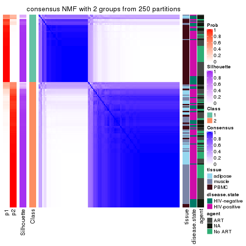</p>

</div>
<div id='tab-MAD-NMF-consensus-heatmap-2'>
<pre><code class="r">consensus_heatmap(res, k = 3)
</code></pre>

<p>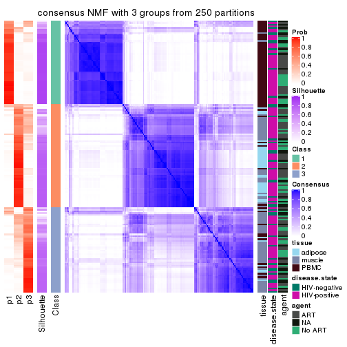</p>

</div>
<div id='tab-MAD-NMF-consensus-heatmap-3'>
<pre><code class="r">consensus_heatmap(res, k = 4)
</code></pre>

<p>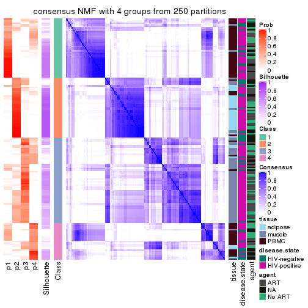</p>

</div>
<div id='tab-MAD-NMF-consensus-heatmap-4'>
<pre><code class="r">consensus_heatmap(res, k = 5)
</code></pre>

<p>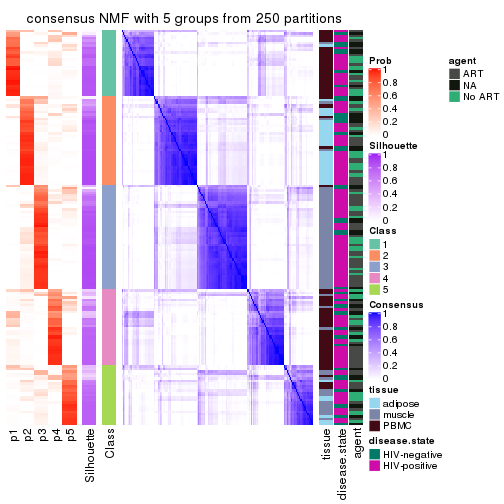</p>

</div>
<div id='tab-MAD-NMF-consensus-heatmap-5'>
<pre><code class="r">consensus_heatmap(res, k = 6)
</code></pre>

<p>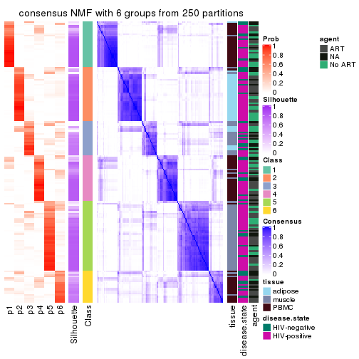</p>

</div>
</div>

Heatmaps for the membership of samples in all partitions to see how consistent they are:


<script>
$( function() {
	$( '#tabs-MAD-NMF-membership-heatmap' ).tabs();
} );
</script>
<div id='tabs-MAD-NMF-membership-heatmap'>
<ul>
<li><a href='#tab-MAD-NMF-membership-heatmap-1'>k = 2</a></li>
<li><a href='#tab-MAD-NMF-membership-heatmap-2'>k = 3</a></li>
<li><a href='#tab-MAD-NMF-membership-heatmap-3'>k = 4</a></li>
<li><a href='#tab-MAD-NMF-membership-heatmap-4'>k = 5</a></li>
<li><a href='#tab-MAD-NMF-membership-heatmap-5'>k = 6</a></li>
</ul>
<div id='tab-MAD-NMF-membership-heatmap-1'>
<pre><code class="r">membership_heatmap(res, k = 2)
</code></pre>

<p>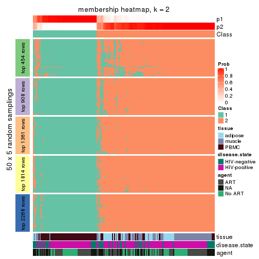</p>

</div>
<div id='tab-MAD-NMF-membership-heatmap-2'>
<pre><code class="r">membership_heatmap(res, k = 3)
</code></pre>

<p>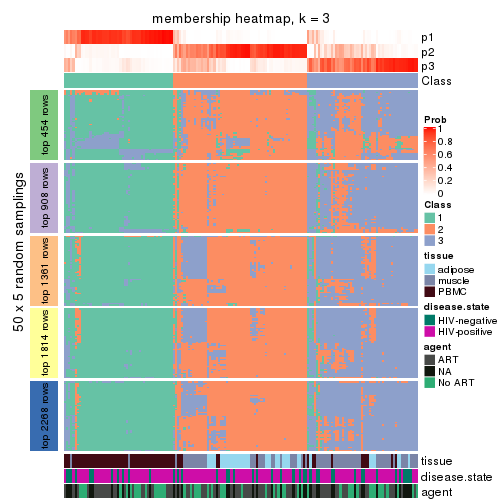</p>

</div>
<div id='tab-MAD-NMF-membership-heatmap-3'>
<pre><code class="r">membership_heatmap(res, k = 4)
</code></pre>

<p>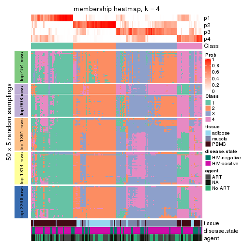</p>

</div>
<div id='tab-MAD-NMF-membership-heatmap-4'>
<pre><code class="r">membership_heatmap(res, k = 5)
</code></pre>

<p>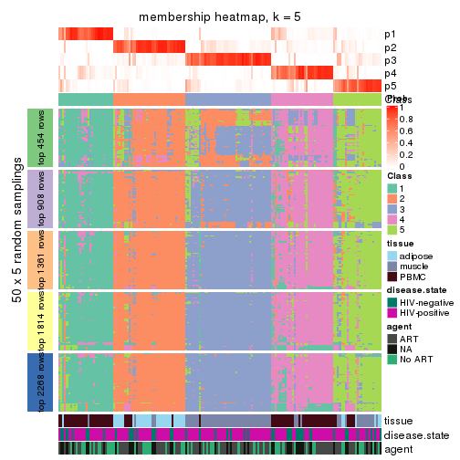</p>

</div>
<div id='tab-MAD-NMF-membership-heatmap-5'>
<pre><code class="r">membership_heatmap(res, k = 6)
</code></pre>

<p>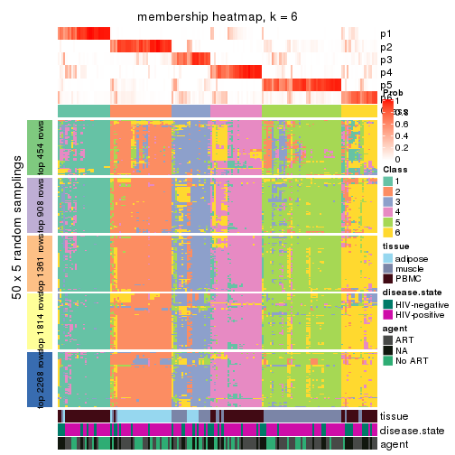</p>

</div>
</div>

As soon as we have had the classes for columns, we can look for signatures
which are significantly different between classes which can be candidate marks
for certain classes. Following are the heatmaps for signatures.


Signature heatmaps where rows are scaled:


<script>
$( function() {
	$( '#tabs-MAD-NMF-get-signatures' ).tabs();
} );
</script>
<div id='tabs-MAD-NMF-get-signatures'>
<ul>
<li><a href='#tab-MAD-NMF-get-signatures-1'>k = 2</a></li>
<li><a href='#tab-MAD-NMF-get-signatures-2'>k = 3</a></li>
<li><a href='#tab-MAD-NMF-get-signatures-3'>k = 4</a></li>
<li><a href='#tab-MAD-NMF-get-signatures-4'>k = 5</a></li>
<li><a href='#tab-MAD-NMF-get-signatures-5'>k = 6</a></li>
</ul>
<div id='tab-MAD-NMF-get-signatures-1'>
<pre><code class="r">get_signatures(res, k = 2)
</code></pre>

<p>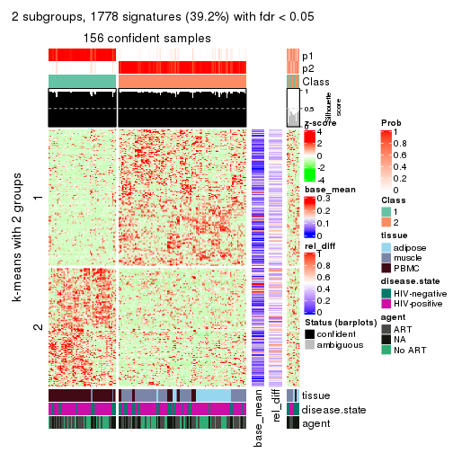</p>

</div>
<div id='tab-MAD-NMF-get-signatures-2'>
<pre><code class="r">get_signatures(res, k = 3)
</code></pre>

<p>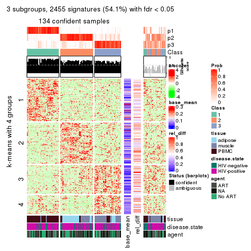</p>

</div>
<div id='tab-MAD-NMF-get-signatures-3'>
<pre><code class="r">get_signatures(res, k = 4)
</code></pre>

<p>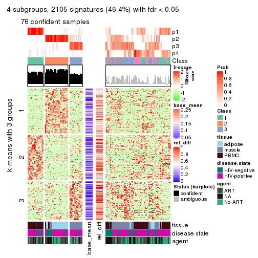</p>

</div>
<div id='tab-MAD-NMF-get-signatures-4'>
<pre><code class="r">get_signatures(res, k = 5)
</code></pre>

<p>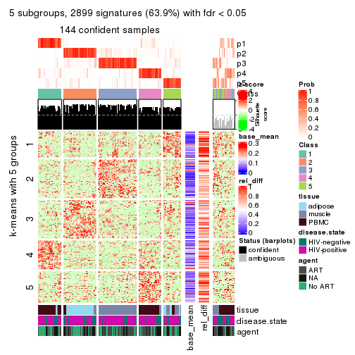</p>

</div>
<div id='tab-MAD-NMF-get-signatures-5'>
<pre><code class="r">get_signatures(res, k = 6)
</code></pre>

<p>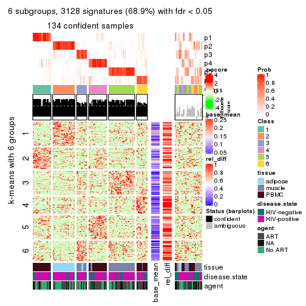</p>

</div>
</div>


Signature heatmaps where rows are not scaled:


<script>
$( function() {
	$( '#tabs-MAD-NMF-get-signatures-no-scale' ).tabs();
} );
</script>
<div id='tabs-MAD-NMF-get-signatures-no-scale'>
<ul>
<li><a href='#tab-MAD-NMF-get-signatures-no-scale-1'>k = 2</a></li>
<li><a href='#tab-MAD-NMF-get-signatures-no-scale-2'>k = 3</a></li>
<li><a href='#tab-MAD-NMF-get-signatures-no-scale-3'>k = 4</a></li>
<li><a href='#tab-MAD-NMF-get-signatures-no-scale-4'>k = 5</a></li>
<li><a href='#tab-MAD-NMF-get-signatures-no-scale-5'>k = 6</a></li>
</ul>
<div id='tab-MAD-NMF-get-signatures-no-scale-1'>
<pre><code class="r">get_signatures(res, k = 2, scale_rows = FALSE)
</code></pre>

<p>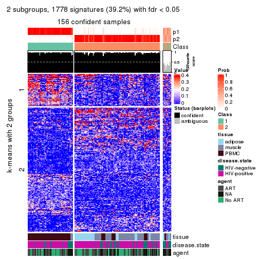</p>

</div>
<div id='tab-MAD-NMF-get-signatures-no-scale-2'>
<pre><code class="r">get_signatures(res, k = 3, scale_rows = FALSE)
</code></pre>

<p>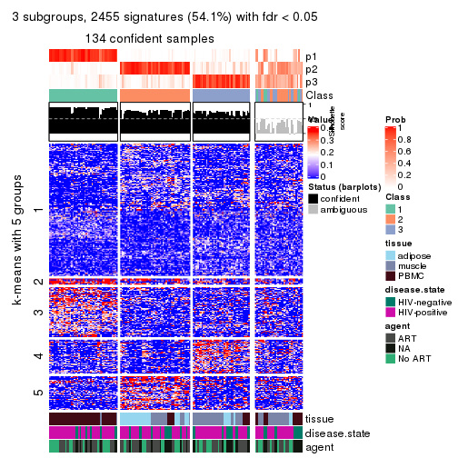</p>

</div>
<div id='tab-MAD-NMF-get-signatures-no-scale-3'>
<pre><code class="r">get_signatures(res, k = 4, scale_rows = FALSE)
</code></pre>

<p>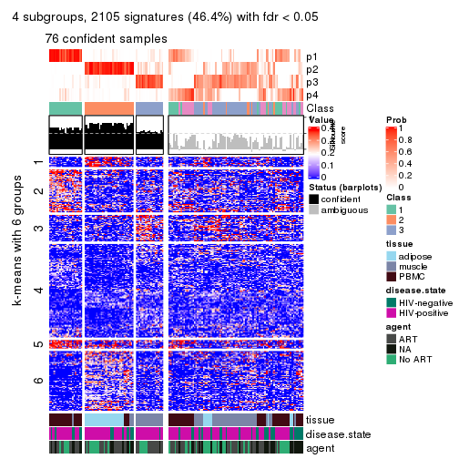</p>

</div>
<div id='tab-MAD-NMF-get-signatures-no-scale-4'>
<pre><code class="r">get_signatures(res, k = 5, scale_rows = FALSE)
</code></pre>

<p>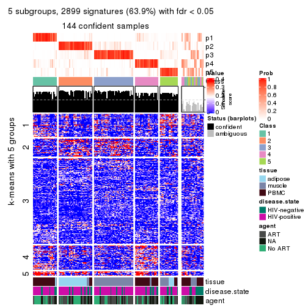</p>

</div>
<div id='tab-MAD-NMF-get-signatures-no-scale-5'>
<pre><code class="r">get_signatures(res, k = 6, scale_rows = FALSE)
</code></pre>

<p>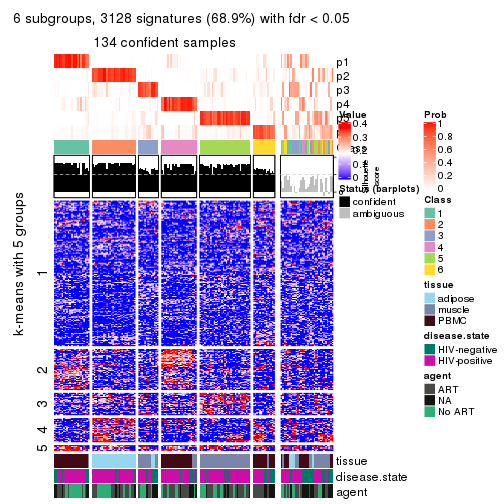</p>

</div>
</div>


Compare the overlap of signatures from different k:

```r
compare_signatures(res)
```

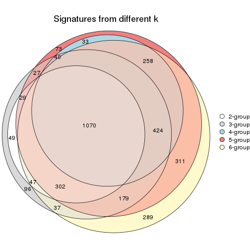

`get_signature()` returns a data frame invisibly. TO get the list of signatures, the function
call should be assigned to a variable explicitly. In following code, if `plot` argument is set
to `FALSE`, no heatmap is plotted while only the differential analysis is performed.

```r
# code only for demonstration
tb = get_signature(res, k = ..., plot = FALSE)
```

An example of the output of `tb` is:

```
#>   which_row         fdr    mean_1    mean_2 scaled_mean_1 scaled_mean_2 km
#> 1        38 0.042760348  8.373488  9.131774    -0.5533452     0.5164555  1
#> 2        40 0.018707592  7.106213  8.469186    -0.6173731     0.5762149  1
#> 3        55 0.019134737 10.221463 11.207825    -0.6159697     0.5749050  1
#> 4        59 0.006059896  5.921854  7.869574    -0.6899429     0.6439467  1
#> 5        60 0.018055526  8.928898 10.211722    -0.6204761     0.5791110  1
#> 6        98 0.009384629 15.714769 14.887706     0.6635654    -0.6193277  2
...
```

The columns in `tb` are:

1. `which_row`: row indices corresponding to the input matrix.
2. `fdr`: FDR for the differential test. 
3. `mean_x`: The mean value in group x.
4. `scaled_mean_x`: The mean value in group x after rows are scaled.
5. `km`: Row groups if k-means clustering is applied to rows.


UMAP plot which shows how samples are separated.


<script>
$( function() {
	$( '#tabs-MAD-NMF-dimension-reduction' ).tabs();
} );
</script>
<div id='tabs-MAD-NMF-dimension-reduction'>
<ul>
<li><a href='#tab-MAD-NMF-dimension-reduction-1'>k = 2</a></li>
<li><a href='#tab-MAD-NMF-dimension-reduction-2'>k = 3</a></li>
<li><a href='#tab-MAD-NMF-dimension-reduction-3'>k = 4</a></li>
<li><a href='#tab-MAD-NMF-dimension-reduction-4'>k = 5</a></li>
<li><a href='#tab-MAD-NMF-dimension-reduction-5'>k = 6</a></li>
</ul>
<div id='tab-MAD-NMF-dimension-reduction-1'>
<pre><code class="r">dimension_reduction(res, k = 2, method = &quot;UMAP&quot;)
</code></pre>

<p>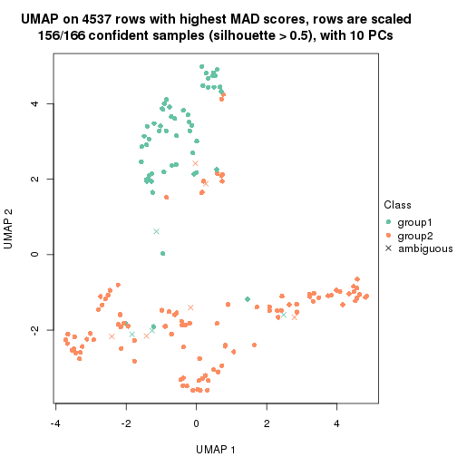</p>

</div>
<div id='tab-MAD-NMF-dimension-reduction-2'>
<pre><code class="r">dimension_reduction(res, k = 3, method = &quot;UMAP&quot;)
</code></pre>

<p>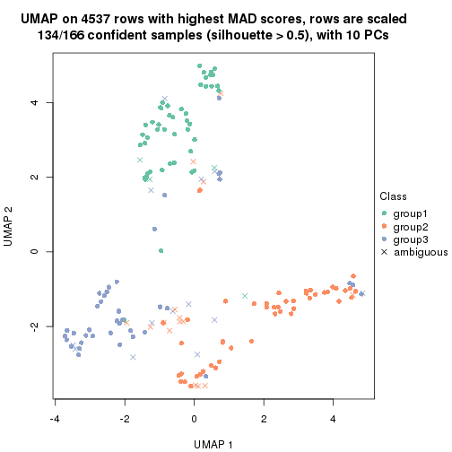</p>

</div>
<div id='tab-MAD-NMF-dimension-reduction-3'>
<pre><code class="r">dimension_reduction(res, k = 4, method = &quot;UMAP&quot;)
</code></pre>

<p>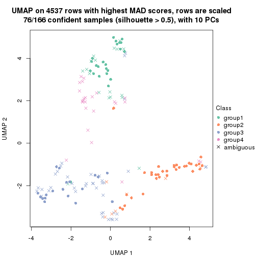</p>

</div>
<div id='tab-MAD-NMF-dimension-reduction-4'>
<pre><code class="r">dimension_reduction(res, k = 5, method = &quot;UMAP&quot;)
</code></pre>

<p>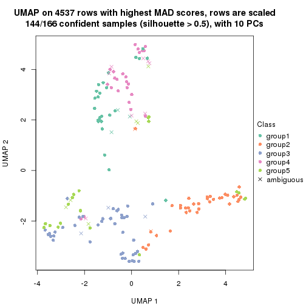</p>

</div>
<div id='tab-MAD-NMF-dimension-reduction-5'>
<pre><code class="r">dimension_reduction(res, k = 6, method = &quot;UMAP&quot;)
</code></pre>

<p>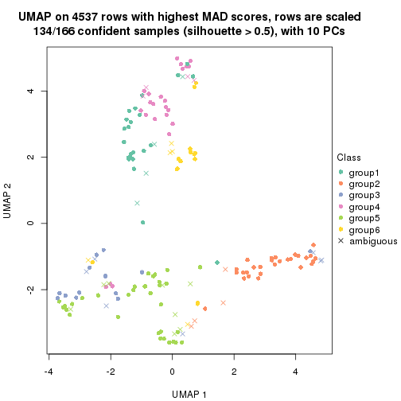</p>

</div>
</div>


Following heatmap shows how subgroups are split when increasing `k`:

```r
collect_classes(res)
```

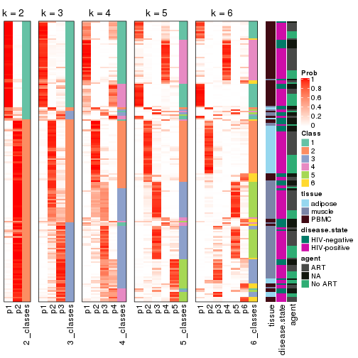


Test correlation between subgroups and known annotations. If the known
annotation is numeric, one-way ANOVA test is applied, and if the known
annotation is discrete, chi-squared contingency table test is applied.

```r
test_to_known_factors(res)
```

```
#>           n tissue(p) disease.state(p) agent(p) k
#> MAD:NMF 156  2.47e-21            1.000   0.9812 2
#> MAD:NMF 134  4.04e-24            0.439   0.7087 3
#> MAD:NMF  76  4.36e-23            0.202   0.4334 4
#> MAD:NMF 144  3.24e-38            0.505   0.2700 5
#> MAD:NMF 134  2.16e-43            0.123   0.0433 6
```


If matrix rows can be associated to genes, consider to use `GO_Enrichment(res,
...)` to perform function enrichment for the signature genes.


 

---------------------------------------------------


### ATC:hclust


The object with results only for a single top-value method and a single partition method 
can be extracted as:

```r
res = res_list["ATC", "hclust"]
# you can also extract it by
# res = res_list["ATC:hclust"]
```

A summary of `res` and all the functions that can be applied to it:

```r
res
```

```
#> A 'ConsensusPartition' object with k = 2, 3, 4, 5, 6.
#>   On a matrix with 4537 rows and 166 columns.
#>   Top rows (454, 908, 1361, 1814, 2268) are extracted by 'ATC' method.
#>   Subgroups are detected by 'hclust' method.
#>   Performed in total 1250 partitions by row resampling.
#>   Best k for subgroups seems to be 2.
#> 
#> Following methods can be applied to this 'ConsensusPartition' object:
#>  [1] "cola_report"             "collect_classes"         "collect_plots"          
#>  [4] "collect_stats"           "colnames"                "compare_signatures"     
#>  [7] "consensus_heatmap"       "dimension_reduction"     "functional_enrichment"  
#> [10] "get_anno_col"            "get_anno"                "get_classes"            
#> [13] "get_consensus"           "get_matrix"              "get_membership"         
#> [16] "get_param"               "get_signatures"          "get_stats"              
#> [19] "is_best_k"               "is_stable_k"             "membership_heatmap"     
#> [22] "ncol"                    "nrow"                    "plot_ecdf"              
#> [25] "rownames"                "select_partition_number" "show"                   
#> [28] "suggest_best_k"          "test_to_known_factors"
```

`collect_plots()` function collects all the plots made from `res` for all `k` (number of partitions)
into one single page to provide an easy and fast comparison between different `k`.

```r
collect_plots(res)
```

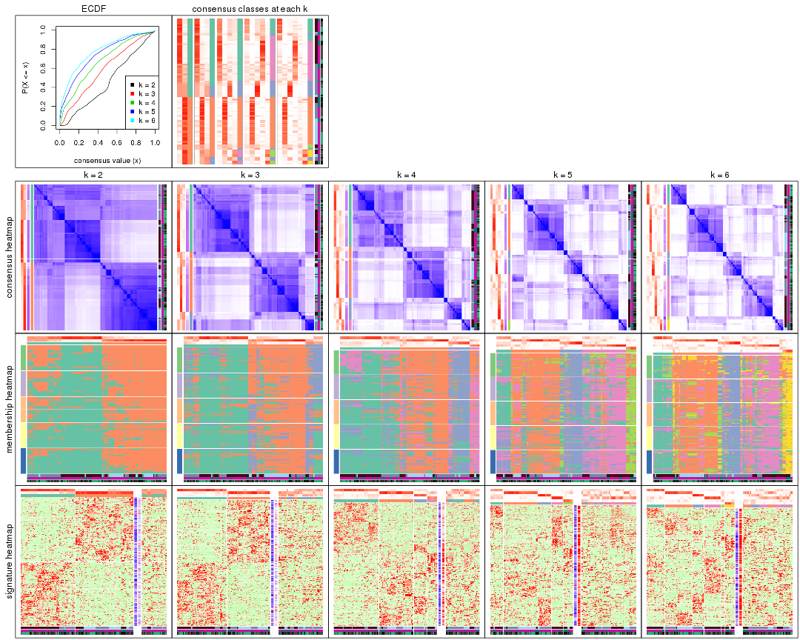

The plots are:

- The first row: a plot of the ECDF (Empirical cumulative distribution
  function) curves of the consensus matrix for each `k` and the heatmap of
  predicted classes for each `k`.
- The second row: heatmaps of the consensus matrix for each `k`.
- The third row: heatmaps of the membership matrix for each `k`.
- The fouth row: heatmaps of the signatures for each `k`.

All the plots in panels can be made by individual functions and they are
plotted later in this section.

`select_partition_number()` produces several plots showing different
statistics for choosing "optimized" `k`. There are following statistics:

- ECDF curves of the consensus matrix for each `k`;
- 1-PAC. [The PAC
  score](https://en.wikipedia.org/wiki/Consensus_clustering#Over-interpretation_potential_of_consensus_clustering)
  measures the proportion of the ambiguous subgrouping.
- Mean silhouette score.
- Concordance. The mean probability of fiting the consensus class ids in all
  partitions.
- Area increased. Denote $A_k$ as the area under the ECDF curve for current
  `k`, the area increased is defined as $A_k - A_{k-1}$.
- Rand index. The percent of pairs of samples that are both in a same cluster
  or both are not in a same cluster in the partition of k and k-1.
- Jaccard index. The ratio of pairs of samples are both in a same cluster in
  the partition of k and k-1 and the pairs of samples are both in a same
  cluster in the partition k or k-1.

The detailed explanations of these statistics can be found in [the cola
vignette](http://bioconductor.org/packages/devel/bioc/vignettes/cola/inst/doc/cola.html#toc_13).

Generally speaking, lower PAC score, higher mean silhouette score or higher
concordance corresponds to better partition. Rand index and Jaccard index
measure how similar the current partition is compared to partition with `k-1`.
If they are too similar, we won't accept `k` is better than `k-1`.

```r
select_partition_number(res)
```

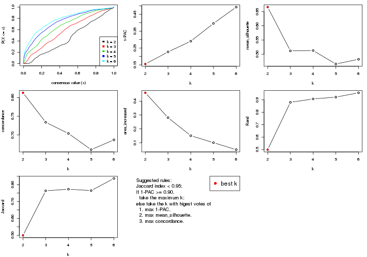

The numeric values for all these statistics can be obtained by `get_stats()`.

```r
get_stats(res)
```

```
#>   k 1-PAC mean_silhouette concordance area_increased  Rand Jaccard
#> 2 2 0.155           0.666       0.813         0.4599 0.500   0.500
#> 3 3 0.227           0.512       0.734         0.2806 0.880   0.763
#> 4 4 0.290           0.513       0.704         0.1510 0.907   0.773
#> 5 5 0.396           0.465       0.661         0.1006 0.922   0.765
#> 6 6 0.493           0.482       0.687         0.0503 0.957   0.837
```

`suggest_best_k()` suggests the best $k$ based on these statistics. The rules are as follows:

- All $k$ with Jaccard index larger than 0.95 are removed because the increase of
  the partition number does not provides enough extra information. If all $k$ are removed,
  the best $k$ is assigned by `NA`.
- For $k$ with 1-PAC larger than 0.9, the maximal $k$ is taken as the "best k". Other $k$ is called "optional k".
- If it does not fit the second rule. The $k$ with the highest vote of highest
  1-PAC, mean silhouette and concordance is taken as the "best k".

```r
suggest_best_k(res)
```

```
#> [1] 2
```


Following shows the table of the partitions (You need to click the **show/hide
code output** link to see it). The membership matrix (columns with name `p*`)
is inferred by
[`clue::cl_consensus()`](https://www.rdocumentation.org/link/cl_consensus?package=clue)
function with the `SE` method. Basically the value in the membership matrix
represents the probability to belong to a certain group. The finall class
label for an item is determined with the group with highest probability it
belongs to.

In `get_classes()` function, the entropy is calculated from the membership
matrix and the silhouette score is calculated from the consensus matrix.


<script>
$( function() {
	$( '#tabs-ATC-hclust-get-classes' ).tabs();
} );
</script>
<div id='tabs-ATC-hclust-get-classes'>
<ul>
<li><a href='#tab-ATC-hclust-get-classes-1'>k = 2</a></li>
<li><a href='#tab-ATC-hclust-get-classes-2'>k = 3</a></li>
<li><a href='#tab-ATC-hclust-get-classes-3'>k = 4</a></li>
<li><a href='#tab-ATC-hclust-get-classes-4'>k = 5</a></li>
<li><a href='#tab-ATC-hclust-get-classes-5'>k = 6</a></li>
</ul>

<div id='tab-ATC-hclust-get-classes-1'>
<p><a id='tab-ATC-hclust-get-classes-1-a' style='color:#0366d6' href='#'>show/hide code output</a></p>
<pre><code class="r">cbind(get_classes(res, k = 2), get_membership(res, k = 2))
</code></pre>

<pre><code>#&gt;           class entropy silhouette    p1    p2
#&gt; GSM751298     1   0.574     0.7504 0.864 0.136
#&gt; GSM751304     2   0.563     0.8022 0.132 0.868
#&gt; GSM751305     2   0.563     0.8022 0.132 0.868
#&gt; GSM751307     2   0.456     0.8233 0.096 0.904
#&gt; GSM751310     1   0.388     0.7540 0.924 0.076
#&gt; GSM751314     1   0.373     0.7536 0.928 0.072
#&gt; GSM751316     1   0.388     0.7540 0.924 0.076
#&gt; GSM751318     1   0.595     0.7340 0.856 0.144
#&gt; GSM751342     1   0.781     0.7017 0.768 0.232
#&gt; GSM751346     1   0.563     0.7481 0.868 0.132
#&gt; GSM751347     1   0.574     0.7476 0.864 0.136
#&gt; GSM751348     2   0.634     0.7916 0.160 0.840
#&gt; GSM751349     2   0.204     0.8375 0.032 0.968
#&gt; GSM751352     2   0.327     0.8361 0.060 0.940
#&gt; GSM751353     2   0.295     0.8333 0.052 0.948
#&gt; GSM751354     2   0.402     0.8152 0.080 0.920
#&gt; GSM751355     2   0.402     0.8152 0.080 0.920
#&gt; GSM751358     2   0.529     0.8221 0.120 0.880
#&gt; GSM751359     2   0.327     0.8384 0.060 0.940
#&gt; GSM751294     2   0.955     0.3605 0.376 0.624
#&gt; GSM751296     1   0.574     0.7519 0.864 0.136
#&gt; GSM751297     1   0.563     0.7481 0.868 0.132
#&gt; GSM751299     2   0.662     0.7631 0.172 0.828
#&gt; GSM751300     1   0.541     0.7510 0.876 0.124
#&gt; GSM751301     2   0.402     0.8365 0.080 0.920
#&gt; GSM751302     1   0.552     0.7488 0.872 0.128
#&gt; GSM751303     1   0.373     0.7536 0.928 0.072
#&gt; GSM751306     1   0.373     0.7536 0.928 0.072
#&gt; GSM751308     2   0.992     0.0425 0.448 0.552
#&gt; GSM751309     1   0.416     0.7527 0.916 0.084
#&gt; GSM751311     1   0.416     0.7527 0.916 0.084
#&gt; GSM751312     1   0.388     0.7540 0.924 0.076
#&gt; GSM751313     1   0.163     0.7356 0.976 0.024
#&gt; GSM751315     1   0.388     0.7540 0.924 0.076
#&gt; GSM751317     1   0.388     0.7540 0.924 0.076
#&gt; GSM751320     1   0.278     0.7466 0.952 0.048
#&gt; GSM751321     1   0.388     0.7540 0.924 0.076
#&gt; GSM751322     1   0.278     0.7466 0.952 0.048
#&gt; GSM751324     1   0.278     0.7466 0.952 0.048
#&gt; GSM751325     1   0.278     0.7466 0.952 0.048
#&gt; GSM751332     1   0.327     0.7484 0.940 0.060
#&gt; GSM751334     1   0.327     0.7484 0.940 0.060
#&gt; GSM751339     1   0.343     0.7488 0.936 0.064
#&gt; GSM751341     1   0.574     0.7534 0.864 0.136
#&gt; GSM751343     1   0.456     0.7420 0.904 0.096
#&gt; GSM751344     2   0.278     0.8308 0.048 0.952
#&gt; GSM751345     2   0.278     0.8308 0.048 0.952
#&gt; GSM751356     2   0.952     0.3723 0.372 0.628
#&gt; GSM751357     2   0.952     0.3723 0.372 0.628
#&gt; GSM751293     2   0.402     0.8365 0.080 0.920
#&gt; GSM751295     1   0.552     0.7488 0.872 0.128
#&gt; GSM751319     1   0.388     0.7540 0.924 0.076
#&gt; GSM751323     1   0.278     0.7466 0.952 0.048
#&gt; GSM751326     1   0.184     0.7378 0.972 0.028
#&gt; GSM751327     1   0.184     0.7378 0.972 0.028
#&gt; GSM751328     1   0.327     0.7484 0.940 0.060
#&gt; GSM751329     1   0.278     0.7495 0.952 0.048
#&gt; GSM751330     1   0.343     0.7543 0.936 0.064
#&gt; GSM751331     1   0.402     0.7533 0.920 0.080
#&gt; GSM751333     1   0.184     0.7378 0.972 0.028
#&gt; GSM751335     1   0.343     0.7543 0.936 0.064
#&gt; GSM751336     1   0.278     0.7473 0.952 0.048
#&gt; GSM751337     1   0.204     0.7431 0.968 0.032
#&gt; GSM751338     1   0.343     0.7488 0.936 0.064
#&gt; GSM751340     1   0.343     0.7488 0.936 0.064
#&gt; GSM751350     1   0.430     0.7535 0.912 0.088
#&gt; GSM751351     1   0.430     0.7535 0.912 0.088
#&gt; GSM751362     1   0.921     0.5809 0.664 0.336
#&gt; GSM751363     1   0.999     0.1871 0.520 0.480
#&gt; GSM751367     1   0.584     0.7473 0.860 0.140
#&gt; GSM751368     1   0.999     0.1825 0.516 0.484
#&gt; GSM751371     1   0.839     0.6796 0.732 0.268
#&gt; GSM751375     2   0.224     0.8401 0.036 0.964
#&gt; GSM751376     2   0.494     0.8220 0.108 0.892
#&gt; GSM751378     2   0.494     0.8250 0.108 0.892
#&gt; GSM751379     2   0.494     0.8220 0.108 0.892
#&gt; GSM751382     2   0.224     0.8401 0.036 0.964
#&gt; GSM751386     2   0.260     0.8424 0.044 0.956
#&gt; GSM751388     2   0.242     0.8412 0.040 0.960
#&gt; GSM751391     1   0.895     0.6359 0.688 0.312
#&gt; GSM751410     1   0.904     0.6215 0.680 0.320
#&gt; GSM751414     1   0.722     0.7260 0.800 0.200
#&gt; GSM751361     1   0.996     0.2703 0.536 0.464
#&gt; GSM751365     1   0.932     0.5798 0.652 0.348
#&gt; GSM751366     1   0.839     0.6753 0.732 0.268
#&gt; GSM751369     1   0.929     0.6060 0.656 0.344
#&gt; GSM751370     1   0.821     0.6808 0.744 0.256
#&gt; GSM751372     1   0.891     0.6300 0.692 0.308
#&gt; GSM751373     1   0.821     0.6867 0.744 0.256
#&gt; GSM751374     2   0.494     0.8220 0.108 0.892
#&gt; GSM751377     2   0.855     0.6396 0.280 0.720
#&gt; GSM751380     1   0.943     0.5597 0.640 0.360
#&gt; GSM751381     2   0.242     0.8412 0.040 0.960
#&gt; GSM751383     2   0.327     0.8444 0.060 0.940
#&gt; GSM751384     2   0.295     0.8427 0.052 0.948
#&gt; GSM751385     2   0.469     0.8396 0.100 0.900
#&gt; GSM751387     2   0.224     0.8401 0.036 0.964
#&gt; GSM751389     1   0.999     0.2759 0.520 0.480
#&gt; GSM751393     2   0.494     0.8220 0.108 0.892
#&gt; GSM751394     2   0.224     0.8401 0.036 0.964
#&gt; GSM751395     2   0.494     0.8220 0.108 0.892
#&gt; GSM751397     2   0.242     0.8412 0.040 0.960
#&gt; GSM751398     2   0.278     0.8424 0.048 0.952
#&gt; GSM751404     1   0.993     0.3466 0.548 0.452
#&gt; GSM751406     1   1.000     0.2313 0.508 0.492
#&gt; GSM751411     2   0.946     0.3731 0.364 0.636
#&gt; GSM751413     1   1.000     0.1268 0.504 0.496
#&gt; GSM751415     1   0.999     0.2759 0.520 0.480
#&gt; GSM751416     1   0.992     0.3224 0.552 0.448
#&gt; GSM751417     1   0.992     0.3224 0.552 0.448
#&gt; GSM751421     1   0.839     0.6796 0.732 0.268
#&gt; GSM751422     1   0.839     0.6796 0.732 0.268
#&gt; GSM751360     1   0.855     0.6729 0.720 0.280
#&gt; GSM751364     1   0.985     0.3992 0.572 0.428
#&gt; GSM751390     2   0.295     0.8427 0.052 0.948
#&gt; GSM751392     2   0.224     0.8401 0.036 0.964
#&gt; GSM751396     2   0.224     0.8401 0.036 0.964
#&gt; GSM751399     1   1.000     0.2313 0.508 0.492
#&gt; GSM751400     1   1.000     0.2313 0.508 0.492
#&gt; GSM751401     1   1.000     0.2313 0.508 0.492
#&gt; GSM751402     1   1.000     0.2313 0.508 0.492
#&gt; GSM751403     1   1.000     0.2313 0.508 0.492
#&gt; GSM751405     1   1.000     0.2313 0.508 0.492
#&gt; GSM751407     1   1.000     0.2043 0.500 0.500
#&gt; GSM751408     1   1.000     0.2229 0.504 0.496
#&gt; GSM751409     2   0.963     0.2708 0.388 0.612
#&gt; GSM751412     1   1.000     0.2237 0.504 0.496
#&gt; GSM751418     1   0.895     0.6185 0.688 0.312
#&gt; GSM751419     1   0.895     0.6185 0.688 0.312
#&gt; GSM751420     1   0.999     0.2561 0.516 0.484
#&gt; GSM751425     2   0.224     0.8395 0.036 0.964
#&gt; GSM751429     1   0.584     0.7473 0.860 0.140
#&gt; GSM751430     2   0.541     0.8221 0.124 0.876
#&gt; GSM751433     2   0.895     0.5715 0.312 0.688
#&gt; GSM751437     2   0.991     0.0198 0.444 0.556
#&gt; GSM751448     1   0.998     0.2953 0.528 0.472
#&gt; GSM751451     2   0.921     0.5026 0.336 0.664
#&gt; GSM751423     2   0.653     0.7848 0.168 0.832
#&gt; GSM751424     2   0.886     0.5898 0.304 0.696
#&gt; GSM751428     2   0.529     0.8262 0.120 0.880
#&gt; GSM751431     2   0.895     0.5715 0.312 0.688
#&gt; GSM751432     2   0.541     0.8221 0.124 0.876
#&gt; GSM751434     2   0.541     0.8221 0.124 0.876
#&gt; GSM751435     2   0.775     0.7159 0.228 0.772
#&gt; GSM751436     2   0.895     0.5715 0.312 0.688
#&gt; GSM751440     2   0.775     0.7159 0.228 0.772
#&gt; GSM751444     2   0.260     0.8399 0.044 0.956
#&gt; GSM751446     2   0.745     0.7356 0.212 0.788
#&gt; GSM751449     2   0.278     0.8421 0.048 0.952
#&gt; GSM751450     2   0.671     0.7788 0.176 0.824
#&gt; GSM751452     2   0.886     0.5898 0.304 0.696
#&gt; GSM751426     2   0.886     0.5898 0.304 0.696
#&gt; GSM751427     2   0.529     0.8262 0.120 0.880
#&gt; GSM751438     2   0.278     0.8413 0.048 0.952
#&gt; GSM751439     2   0.775     0.7147 0.228 0.772
#&gt; GSM751441     2   0.260     0.8399 0.044 0.956
#&gt; GSM751442     2   0.745     0.7356 0.212 0.788
#&gt; GSM751443     1   0.998     0.2953 0.528 0.472
#&gt; GSM751445     2   0.242     0.8406 0.040 0.960
#&gt; GSM751447     2   0.260     0.8399 0.044 0.956
#&gt; GSM751453     2   0.260     0.8399 0.044 0.956
#&gt; GSM751454     2   0.260     0.8399 0.044 0.956
#&gt; GSM751455     2   0.745     0.7356 0.212 0.788
#&gt; GSM751456     2   0.745     0.7356 0.212 0.788
#&gt; GSM751457     2   0.260     0.8421 0.044 0.956
#&gt; GSM751458     2   0.260     0.8421 0.044 0.956
</code></pre>

<script>
$('#tab-ATC-hclust-get-classes-1-a').parent().next().next().hide();
$('#tab-ATC-hclust-get-classes-1-a').click(function(){
  $('#tab-ATC-hclust-get-classes-1-a').parent().next().next().toggle();
  return(false);
});
</script>
</div>

<div id='tab-ATC-hclust-get-classes-2'>
<p><a id='tab-ATC-hclust-get-classes-2-a' style='color:#0366d6' href='#'>show/hide code output</a></p>
<pre><code class="r">cbind(get_classes(res, k = 3), get_membership(res, k = 3))
</code></pre>

<pre><code>#&gt;           class entropy silhouette    p1    p2    p3
#&gt; GSM751298     1   0.453     0.6919 0.856 0.040 0.104
#&gt; GSM751304     3   0.779    -0.2150 0.052 0.420 0.528
#&gt; GSM751305     3   0.779    -0.2150 0.052 0.420 0.528
#&gt; GSM751307     2   0.695     0.2858 0.016 0.500 0.484
#&gt; GSM751310     1   0.421     0.7217 0.872 0.088 0.040
#&gt; GSM751314     1   0.432     0.7215 0.868 0.088 0.044
#&gt; GSM751316     1   0.421     0.7217 0.872 0.088 0.040
#&gt; GSM751318     1   0.621     0.6669 0.768 0.164 0.068
#&gt; GSM751342     1   0.709     0.5889 0.688 0.248 0.064
#&gt; GSM751346     1   0.445     0.6747 0.856 0.032 0.112
#&gt; GSM751347     1   0.456     0.6735 0.852 0.036 0.112
#&gt; GSM751348     2   0.479     0.6561 0.112 0.844 0.044
#&gt; GSM751349     2   0.127     0.6900 0.004 0.972 0.024
#&gt; GSM751352     2   0.614     0.5285 0.012 0.684 0.304
#&gt; GSM751353     2   0.593     0.5256 0.008 0.696 0.296
#&gt; GSM751354     3   0.655    -0.1497 0.008 0.412 0.580
#&gt; GSM751355     3   0.655    -0.1497 0.008 0.412 0.580
#&gt; GSM751358     2   0.447     0.6551 0.060 0.864 0.076
#&gt; GSM751359     2   0.240     0.6835 0.004 0.932 0.064
#&gt; GSM751294     2   0.930     0.1774 0.300 0.508 0.192
#&gt; GSM751296     1   0.497     0.7044 0.840 0.060 0.100
#&gt; GSM751297     1   0.445     0.6747 0.856 0.032 0.112
#&gt; GSM751299     2   0.760     0.5390 0.124 0.684 0.192
#&gt; GSM751300     1   0.417     0.6845 0.868 0.028 0.104
#&gt; GSM751301     2   0.703     0.4229 0.024 0.580 0.396
#&gt; GSM751302     1   0.432     0.6765 0.860 0.028 0.112
#&gt; GSM751303     1   0.432     0.7215 0.868 0.088 0.044
#&gt; GSM751306     1   0.432     0.7215 0.868 0.088 0.044
#&gt; GSM751308     2   0.939     0.0276 0.368 0.456 0.176
#&gt; GSM751309     1   0.466     0.7187 0.852 0.100 0.048
#&gt; GSM751311     1   0.466     0.7187 0.852 0.100 0.048
#&gt; GSM751312     1   0.421     0.7217 0.872 0.088 0.040
#&gt; GSM751313     1   0.103     0.6993 0.976 0.000 0.024
#&gt; GSM751315     1   0.409     0.7218 0.876 0.088 0.036
#&gt; GSM751317     1   0.421     0.7217 0.872 0.088 0.040
#&gt; GSM751320     1   0.331     0.7220 0.908 0.064 0.028
#&gt; GSM751321     1   0.421     0.7217 0.872 0.088 0.040
#&gt; GSM751322     1   0.331     0.7220 0.908 0.064 0.028
#&gt; GSM751324     1   0.331     0.7220 0.908 0.064 0.028
#&gt; GSM751325     1   0.331     0.7220 0.908 0.064 0.028
#&gt; GSM751332     1   0.333     0.7256 0.904 0.076 0.020
#&gt; GSM751334     1   0.333     0.7256 0.904 0.076 0.020
#&gt; GSM751339     1   0.386     0.6933 0.888 0.040 0.072
#&gt; GSM751341     1   0.523     0.7079 0.828 0.068 0.104
#&gt; GSM751343     1   0.543     0.6977 0.816 0.120 0.064
#&gt; GSM751344     2   0.615     0.4165 0.000 0.592 0.408
#&gt; GSM751345     2   0.615     0.4165 0.000 0.592 0.408
#&gt; GSM751356     2   0.928     0.1836 0.296 0.512 0.192
#&gt; GSM751357     2   0.928     0.1836 0.296 0.512 0.192
#&gt; GSM751293     2   0.703     0.4229 0.024 0.580 0.396
#&gt; GSM751295     1   0.432     0.6765 0.860 0.028 0.112
#&gt; GSM751319     1   0.421     0.7217 0.872 0.088 0.040
#&gt; GSM751323     1   0.331     0.7220 0.908 0.064 0.028
#&gt; GSM751326     1   0.145     0.7041 0.968 0.008 0.024
#&gt; GSM751327     1   0.145     0.7041 0.968 0.008 0.024
#&gt; GSM751328     1   0.333     0.7256 0.904 0.076 0.020
#&gt; GSM751329     1   0.188     0.7179 0.956 0.032 0.012
#&gt; GSM751330     1   0.268     0.7190 0.932 0.040 0.028
#&gt; GSM751331     1   0.318     0.7026 0.912 0.024 0.064
#&gt; GSM751333     1   0.127     0.7022 0.972 0.004 0.024
#&gt; GSM751335     1   0.268     0.7190 0.932 0.040 0.028
#&gt; GSM751336     1   0.223     0.7030 0.944 0.012 0.044
#&gt; GSM751337     1   0.257     0.7141 0.936 0.032 0.032
#&gt; GSM751338     1   0.386     0.6933 0.888 0.040 0.072
#&gt; GSM751340     1   0.386     0.6933 0.888 0.040 0.072
#&gt; GSM751350     1   0.346     0.6994 0.900 0.024 0.076
#&gt; GSM751351     1   0.346     0.6994 0.900 0.024 0.076
#&gt; GSM751362     1   0.842     0.2563 0.584 0.116 0.300
#&gt; GSM751363     1   0.940     0.1002 0.432 0.396 0.172
#&gt; GSM751367     1   0.507     0.6746 0.832 0.052 0.116
#&gt; GSM751368     1   0.874     0.1260 0.452 0.440 0.108
#&gt; GSM751371     1   0.738     0.5908 0.684 0.228 0.088
#&gt; GSM751375     2   0.176     0.6879 0.004 0.956 0.040
#&gt; GSM751376     3   0.713     0.1546 0.028 0.392 0.580
#&gt; GSM751378     2   0.446     0.6486 0.056 0.864 0.080
#&gt; GSM751379     3   0.713     0.1546 0.028 0.392 0.580
#&gt; GSM751382     2   0.176     0.6879 0.004 0.956 0.040
#&gt; GSM751386     2   0.176     0.6884 0.004 0.956 0.040
#&gt; GSM751388     2   0.153     0.6878 0.004 0.964 0.032
#&gt; GSM751391     1   0.808     0.5306 0.632 0.252 0.116
#&gt; GSM751410     1   0.868     0.4125 0.596 0.212 0.192
#&gt; GSM751414     1   0.631     0.6758 0.768 0.148 0.084
#&gt; GSM751361     1   0.814     0.2249 0.480 0.452 0.068
#&gt; GSM751365     1   0.856     0.4602 0.600 0.244 0.156
#&gt; GSM751366     1   0.765     0.5743 0.684 0.140 0.176
#&gt; GSM751369     1   0.891     0.4277 0.572 0.200 0.228
#&gt; GSM751370     1   0.750     0.5434 0.696 0.140 0.164
#&gt; GSM751372     1   0.830     0.4937 0.632 0.196 0.172
#&gt; GSM751373     1   0.677     0.6274 0.720 0.216 0.064
#&gt; GSM751374     3   0.713     0.1546 0.028 0.392 0.580
#&gt; GSM751377     2   0.676     0.5348 0.224 0.716 0.060
#&gt; GSM751380     1   0.899     0.2893 0.560 0.192 0.248
#&gt; GSM751381     2   0.153     0.6878 0.004 0.964 0.032
#&gt; GSM751383     2   0.219     0.6934 0.024 0.948 0.028
#&gt; GSM751384     2   0.218     0.6859 0.020 0.948 0.032
#&gt; GSM751385     2   0.440     0.6838 0.044 0.864 0.092
#&gt; GSM751387     2   0.165     0.6878 0.004 0.960 0.036
#&gt; GSM751389     1   0.982    -0.1763 0.420 0.260 0.320
#&gt; GSM751393     3   0.713     0.1546 0.028 0.392 0.580
#&gt; GSM751394     2   0.165     0.6878 0.004 0.960 0.036
#&gt; GSM751395     3   0.713     0.1546 0.028 0.392 0.580
#&gt; GSM751397     2   0.165     0.6879 0.004 0.960 0.036
#&gt; GSM751398     2   0.183     0.6887 0.008 0.956 0.036
#&gt; GSM751404     1   0.944    -0.1350 0.468 0.188 0.344
#&gt; GSM751406     3   0.909     0.4137 0.400 0.140 0.460
#&gt; GSM751411     2   0.867     0.0952 0.324 0.552 0.124
#&gt; GSM751413     1   0.943     0.0449 0.416 0.408 0.176
#&gt; GSM751415     1   0.983    -0.1741 0.420 0.264 0.316
#&gt; GSM751416     1   0.806     0.2792 0.496 0.440 0.064
#&gt; GSM751417     1   0.806     0.2792 0.496 0.440 0.064
#&gt; GSM751421     1   0.749     0.5925 0.680 0.224 0.096
#&gt; GSM751422     1   0.749     0.5925 0.680 0.224 0.096
#&gt; GSM751360     1   0.770     0.5786 0.664 0.232 0.104
#&gt; GSM751364     1   0.855     0.3425 0.516 0.384 0.100
#&gt; GSM751390     2   0.218     0.6859 0.020 0.948 0.032
#&gt; GSM751392     2   0.176     0.6879 0.004 0.956 0.040
#&gt; GSM751396     2   0.165     0.6878 0.004 0.960 0.036
#&gt; GSM751399     3   0.909     0.4137 0.400 0.140 0.460
#&gt; GSM751400     3   0.909     0.4137 0.400 0.140 0.460
#&gt; GSM751401     3   0.914     0.4063 0.404 0.144 0.452
#&gt; GSM751402     3   0.910     0.4063 0.404 0.140 0.456
#&gt; GSM751403     3   0.909     0.4137 0.400 0.140 0.460
#&gt; GSM751405     3   0.909     0.4137 0.400 0.140 0.460
#&gt; GSM751407     3   0.940     0.3683 0.404 0.172 0.424
#&gt; GSM751408     3   0.937     0.3453 0.408 0.168 0.424
#&gt; GSM751409     2   0.969    -0.1908 0.292 0.456 0.252
#&gt; GSM751412     1   0.955    -0.3585 0.412 0.192 0.396
#&gt; GSM751418     1   0.748     0.5337 0.648 0.284 0.068
#&gt; GSM751419     1   0.748     0.5337 0.648 0.284 0.068
#&gt; GSM751420     3   0.910     0.3965 0.408 0.140 0.452
#&gt; GSM751425     2   0.268     0.6860 0.008 0.924 0.068
#&gt; GSM751429     1   0.496     0.6740 0.836 0.048 0.116
#&gt; GSM751430     2   0.767     0.3035 0.044 0.500 0.456
#&gt; GSM751433     2   0.686     0.5075 0.252 0.696 0.052
#&gt; GSM751437     2   0.997    -0.3577 0.340 0.360 0.300
#&gt; GSM751448     3   0.878     0.3479 0.420 0.112 0.468
#&gt; GSM751451     2   0.703     0.4541 0.284 0.668 0.048
#&gt; GSM751423     2   0.485     0.6595 0.128 0.836 0.036
#&gt; GSM751424     2   0.678     0.5188 0.244 0.704 0.052
#&gt; GSM751428     2   0.509     0.6820 0.088 0.836 0.076
#&gt; GSM751431     2   0.686     0.5075 0.252 0.696 0.052
#&gt; GSM751432     2   0.767     0.3035 0.044 0.500 0.456
#&gt; GSM751434     2   0.767     0.3035 0.044 0.500 0.456
#&gt; GSM751435     2   0.616     0.6018 0.188 0.760 0.052
#&gt; GSM751436     2   0.686     0.5075 0.252 0.696 0.052
#&gt; GSM751440     2   0.616     0.6018 0.188 0.760 0.052
#&gt; GSM751444     2   0.407     0.6652 0.016 0.864 0.120
#&gt; GSM751446     2   0.632     0.6062 0.172 0.760 0.068
#&gt; GSM751449     2   0.435     0.6608 0.020 0.852 0.128
#&gt; GSM751450     2   0.503     0.6549 0.132 0.828 0.040
#&gt; GSM751452     2   0.678     0.5188 0.244 0.704 0.052
#&gt; GSM751426     2   0.678     0.5188 0.244 0.704 0.052
#&gt; GSM751427     2   0.509     0.6820 0.088 0.836 0.076
#&gt; GSM751438     2   0.421     0.6643 0.020 0.860 0.120
#&gt; GSM751439     2   0.754     0.5273 0.172 0.692 0.136
#&gt; GSM751441     2   0.400     0.6673 0.016 0.868 0.116
#&gt; GSM751442     2   0.632     0.6062 0.172 0.760 0.068
#&gt; GSM751443     3   0.878     0.3479 0.420 0.112 0.468
#&gt; GSM751445     2   0.406     0.6628 0.012 0.860 0.128
#&gt; GSM751447     2   0.385     0.6711 0.016 0.876 0.108
#&gt; GSM751453     2   0.385     0.6711 0.016 0.876 0.108
#&gt; GSM751454     2   0.385     0.6711 0.016 0.876 0.108
#&gt; GSM751455     2   0.632     0.6062 0.172 0.760 0.068
#&gt; GSM751456     2   0.632     0.6062 0.172 0.760 0.068
#&gt; GSM751457     2   0.441     0.6536 0.016 0.844 0.140
#&gt; GSM751458     2   0.441     0.6536 0.016 0.844 0.140
</code></pre>

<script>
$('#tab-ATC-hclust-get-classes-2-a').parent().next().next().hide();
$('#tab-ATC-hclust-get-classes-2-a').click(function(){
  $('#tab-ATC-hclust-get-classes-2-a').parent().next().next().toggle();
  return(false);
});
</script>
</div>

<div id='tab-ATC-hclust-get-classes-3'>
<p><a id='tab-ATC-hclust-get-classes-3-a' style='color:#0366d6' href='#'>show/hide code output</a></p>
<pre><code class="r">cbind(get_classes(res, k = 4), get_membership(res, k = 4))
</code></pre>

<pre><code>#&gt;           class entropy silhouette    p1    p2    p3    p4
#&gt; GSM751298     1   0.699   0.549767 0.632 0.020 0.212 0.136
#&gt; GSM751304     4   0.552   0.732916 0.036 0.180 0.036 0.748
#&gt; GSM751305     4   0.552   0.732916 0.036 0.180 0.036 0.748
#&gt; GSM751307     4   0.559   0.777550 0.016 0.280 0.024 0.680
#&gt; GSM751310     1   0.250   0.646814 0.924 0.032 0.012 0.032
#&gt; GSM751314     1   0.283   0.644837 0.912 0.032 0.020 0.036
#&gt; GSM751316     1   0.250   0.646814 0.924 0.032 0.012 0.032
#&gt; GSM751318     1   0.610   0.554582 0.744 0.072 0.108 0.076
#&gt; GSM751342     1   0.702   0.508648 0.672 0.160 0.100 0.068
#&gt; GSM751346     1   0.704   0.510226 0.596 0.008 0.248 0.148
#&gt; GSM751347     1   0.717   0.507706 0.592 0.012 0.244 0.152
#&gt; GSM751348     2   0.495   0.597917 0.100 0.808 0.044 0.048
#&gt; GSM751349     2   0.175   0.634377 0.012 0.952 0.024 0.012
#&gt; GSM751352     2   0.628  -0.268309 0.000 0.556 0.064 0.380
#&gt; GSM751353     2   0.625  -0.237810 0.000 0.564 0.064 0.372
#&gt; GSM751354     4   0.693   0.686094 0.004 0.196 0.192 0.608
#&gt; GSM751355     4   0.693   0.686094 0.004 0.196 0.192 0.608
#&gt; GSM751358     2   0.571   0.557317 0.064 0.768 0.100 0.068
#&gt; GSM751359     2   0.438   0.609607 0.028 0.836 0.092 0.044
#&gt; GSM751294     2   0.949   0.074975 0.200 0.388 0.276 0.136
#&gt; GSM751296     1   0.658   0.594252 0.676 0.020 0.176 0.128
#&gt; GSM751297     1   0.704   0.510226 0.596 0.008 0.248 0.148
#&gt; GSM751299     2   0.866   0.017522 0.076 0.500 0.208 0.216
#&gt; GSM751300     1   0.683   0.534549 0.624 0.008 0.224 0.144
#&gt; GSM751301     4   0.637   0.602627 0.024 0.444 0.024 0.508
#&gt; GSM751302     1   0.701   0.515097 0.600 0.008 0.244 0.148
#&gt; GSM751303     1   0.271   0.645602 0.916 0.032 0.016 0.036
#&gt; GSM751306     1   0.271   0.645602 0.916 0.032 0.016 0.036
#&gt; GSM751308     2   0.955  -0.032776 0.268 0.344 0.272 0.116
#&gt; GSM751309     1   0.312   0.640087 0.900 0.032 0.044 0.024
#&gt; GSM751311     1   0.312   0.640087 0.900 0.032 0.044 0.024
#&gt; GSM751312     1   0.250   0.646814 0.924 0.032 0.012 0.032
#&gt; GSM751313     1   0.604   0.574498 0.684 0.000 0.188 0.128
#&gt; GSM751315     1   0.262   0.646652 0.920 0.032 0.016 0.032
#&gt; GSM751317     1   0.262   0.645896 0.920 0.032 0.016 0.032
#&gt; GSM751320     1   0.290   0.644173 0.904 0.008 0.056 0.032
#&gt; GSM751321     1   0.262   0.645896 0.920 0.032 0.016 0.032
#&gt; GSM751322     1   0.290   0.644173 0.904 0.008 0.056 0.032
#&gt; GSM751324     1   0.281   0.644176 0.908 0.008 0.052 0.032
#&gt; GSM751325     1   0.281   0.644176 0.908 0.008 0.052 0.032
#&gt; GSM751332     1   0.338   0.647649 0.884 0.016 0.068 0.032
#&gt; GSM751334     1   0.338   0.647649 0.884 0.016 0.068 0.032
#&gt; GSM751339     1   0.625   0.516272 0.644 0.000 0.252 0.104
#&gt; GSM751341     1   0.672   0.596370 0.668 0.024 0.176 0.132
#&gt; GSM751343     1   0.489   0.598272 0.812 0.044 0.096 0.048
#&gt; GSM751344     4   0.556   0.646885 0.000 0.432 0.020 0.548
#&gt; GSM751345     4   0.556   0.646885 0.000 0.432 0.020 0.548
#&gt; GSM751356     2   0.948   0.077754 0.200 0.392 0.272 0.136
#&gt; GSM751357     2   0.948   0.077754 0.200 0.392 0.272 0.136
#&gt; GSM751293     4   0.637   0.602627 0.024 0.444 0.024 0.508
#&gt; GSM751295     1   0.701   0.515097 0.600 0.008 0.244 0.148
#&gt; GSM751319     1   0.262   0.645896 0.920 0.032 0.016 0.032
#&gt; GSM751323     1   0.291   0.644911 0.904 0.008 0.052 0.036
#&gt; GSM751326     1   0.562   0.600500 0.724 0.000 0.152 0.124
#&gt; GSM751327     1   0.562   0.600500 0.724 0.000 0.152 0.124
#&gt; GSM751328     1   0.338   0.647649 0.884 0.016 0.068 0.032
#&gt; GSM751329     1   0.445   0.637693 0.816 0.008 0.124 0.052
#&gt; GSM751330     1   0.562   0.620146 0.748 0.012 0.124 0.116
#&gt; GSM751331     1   0.676   0.557285 0.644 0.012 0.200 0.144
#&gt; GSM751333     1   0.576   0.591763 0.712 0.000 0.160 0.128
#&gt; GSM751335     1   0.567   0.618779 0.744 0.012 0.124 0.120
#&gt; GSM751336     1   0.623   0.570765 0.680 0.004 0.184 0.132
#&gt; GSM751337     1   0.599   0.599971 0.700 0.004 0.180 0.116
#&gt; GSM751338     1   0.625   0.516272 0.644 0.000 0.252 0.104
#&gt; GSM751340     1   0.625   0.516272 0.644 0.000 0.252 0.104
#&gt; GSM751350     1   0.688   0.550174 0.632 0.012 0.204 0.152
#&gt; GSM751351     1   0.688   0.550174 0.632 0.012 0.204 0.152
#&gt; GSM751362     3   0.703   0.227443 0.356 0.032 0.552 0.060
#&gt; GSM751363     1   0.864   0.182503 0.456 0.280 0.052 0.212
#&gt; GSM751367     1   0.741   0.506652 0.584 0.028 0.260 0.128
#&gt; GSM751368     1   0.810   0.127748 0.468 0.372 0.060 0.100
#&gt; GSM751371     1   0.712   0.521866 0.656 0.152 0.144 0.048
#&gt; GSM751375     2   0.138   0.633224 0.008 0.964 0.020 0.008
#&gt; GSM751376     3   0.792  -0.045775 0.024 0.192 0.520 0.264
#&gt; GSM751378     2   0.483   0.567026 0.036 0.780 0.172 0.012
#&gt; GSM751379     3   0.792  -0.045775 0.024 0.192 0.520 0.264
#&gt; GSM751382     2   0.138   0.633224 0.008 0.964 0.020 0.008
#&gt; GSM751386     2   0.172   0.634700 0.008 0.952 0.028 0.012
#&gt; GSM751388     2   0.144   0.635194 0.008 0.960 0.028 0.004
#&gt; GSM751391     1   0.760   0.462942 0.604 0.180 0.172 0.044
#&gt; GSM751410     1   0.846   0.096033 0.436 0.132 0.368 0.064
#&gt; GSM751414     1   0.711   0.565024 0.652 0.080 0.200 0.068
#&gt; GSM751361     1   0.771   0.203915 0.488 0.384 0.068 0.060
#&gt; GSM751365     1   0.856   0.253226 0.464 0.148 0.320 0.068
#&gt; GSM751366     1   0.730   0.361011 0.548 0.056 0.344 0.052
#&gt; GSM751369     1   0.793   0.294185 0.528 0.112 0.308 0.052
#&gt; GSM751370     1   0.805   0.223413 0.456 0.068 0.392 0.084
#&gt; GSM751372     1   0.834   0.275604 0.480 0.120 0.332 0.068
#&gt; GSM751373     1   0.749   0.550956 0.632 0.144 0.160 0.064
#&gt; GSM751374     3   0.792  -0.045775 0.024 0.192 0.520 0.264
#&gt; GSM751377     2   0.625   0.480425 0.228 0.684 0.060 0.028
#&gt; GSM751380     3   0.754   0.224493 0.368 0.088 0.508 0.036
#&gt; GSM751381     2   0.144   0.635194 0.008 0.960 0.028 0.004
#&gt; GSM751383     2   0.225   0.641742 0.020 0.932 0.040 0.008
#&gt; GSM751384     2   0.233   0.636653 0.016 0.924 0.056 0.004
#&gt; GSM751385     2   0.540   0.555015 0.040 0.780 0.064 0.116
#&gt; GSM751387     2   0.123   0.633869 0.008 0.968 0.020 0.004
#&gt; GSM751389     3   0.689   0.545832 0.240 0.128 0.620 0.012
#&gt; GSM751393     3   0.792  -0.045775 0.024 0.192 0.520 0.264
#&gt; GSM751394     2   0.134   0.633487 0.008 0.964 0.024 0.004
#&gt; GSM751395     3   0.792  -0.045775 0.024 0.192 0.520 0.264
#&gt; GSM751397     2   0.154   0.635638 0.008 0.956 0.032 0.004
#&gt; GSM751398     2   0.172   0.634678 0.008 0.952 0.028 0.012
#&gt; GSM751404     3   0.593   0.554558 0.264 0.076 0.660 0.000
#&gt; GSM751406     3   0.348   0.697543 0.148 0.012 0.840 0.000
#&gt; GSM751411     2   0.804  -0.000578 0.200 0.448 0.336 0.016
#&gt; GSM751413     1   0.874   0.145492 0.440 0.288 0.056 0.216
#&gt; GSM751415     3   0.698   0.537856 0.240 0.136 0.612 0.012
#&gt; GSM751416     1   0.752   0.255395 0.508 0.376 0.060 0.056
#&gt; GSM751417     1   0.752   0.255395 0.508 0.376 0.060 0.056
#&gt; GSM751421     1   0.723   0.525498 0.652 0.144 0.148 0.056
#&gt; GSM751422     1   0.723   0.525498 0.652 0.144 0.148 0.056
#&gt; GSM751360     1   0.733   0.510820 0.636 0.156 0.160 0.048
#&gt; GSM751364     1   0.811   0.343789 0.504 0.328 0.100 0.068
#&gt; GSM751390     2   0.233   0.636653 0.016 0.924 0.056 0.004
#&gt; GSM751392     2   0.138   0.633224 0.008 0.964 0.020 0.008
#&gt; GSM751396     2   0.134   0.633487 0.008 0.964 0.024 0.004
#&gt; GSM751399     3   0.348   0.697543 0.148 0.012 0.840 0.000
#&gt; GSM751400     3   0.380   0.697474 0.148 0.012 0.832 0.008
#&gt; GSM751401     3   0.365   0.696727 0.152 0.016 0.832 0.000
#&gt; GSM751402     3   0.353   0.695783 0.152 0.012 0.836 0.000
#&gt; GSM751403     3   0.348   0.697543 0.148 0.012 0.840 0.000
#&gt; GSM751405     3   0.348   0.697543 0.148 0.012 0.840 0.000
#&gt; GSM751407     3   0.462   0.681502 0.164 0.052 0.784 0.000
#&gt; GSM751408     3   0.483   0.673444 0.176 0.056 0.768 0.000
#&gt; GSM751409     3   0.772   0.370378 0.172 0.324 0.492 0.012
#&gt; GSM751412     3   0.540   0.659351 0.184 0.084 0.732 0.000
#&gt; GSM751418     1   0.776   0.480761 0.588 0.224 0.132 0.056
#&gt; GSM751419     1   0.776   0.480761 0.588 0.224 0.132 0.056
#&gt; GSM751420     3   0.390   0.694173 0.156 0.012 0.824 0.008
#&gt; GSM751425     2   0.322   0.618302 0.012 0.892 0.052 0.044
#&gt; GSM751429     1   0.735   0.505767 0.584 0.024 0.264 0.128
#&gt; GSM751430     4   0.649   0.775701 0.044 0.280 0.036 0.640
#&gt; GSM751433     2   0.584   0.444095 0.300 0.648 0.004 0.048
#&gt; GSM751437     3   0.773   0.476464 0.196 0.240 0.544 0.020
#&gt; GSM751448     3   0.363   0.659491 0.156 0.004 0.832 0.008
#&gt; GSM751451     2   0.627   0.409189 0.328 0.612 0.016 0.044
#&gt; GSM751423     2   0.521   0.599278 0.140 0.780 0.028 0.052
#&gt; GSM751424     2   0.575   0.451990 0.296 0.656 0.004 0.044
#&gt; GSM751428     2   0.487   0.621515 0.076 0.816 0.044 0.064
#&gt; GSM751431     2   0.584   0.444095 0.300 0.648 0.004 0.048
#&gt; GSM751432     4   0.649   0.775701 0.044 0.280 0.036 0.640
#&gt; GSM751434     4   0.649   0.775701 0.044 0.280 0.036 0.640
#&gt; GSM751435     2   0.631   0.574463 0.156 0.716 0.084 0.044
#&gt; GSM751436     2   0.584   0.444095 0.300 0.648 0.004 0.048
#&gt; GSM751440     2   0.639   0.573044 0.156 0.712 0.084 0.048
#&gt; GSM751444     2   0.500   0.571827 0.012 0.788 0.128 0.072
#&gt; GSM751446     2   0.643   0.576233 0.144 0.712 0.096 0.048
#&gt; GSM751449     2   0.510   0.561725 0.012 0.780 0.136 0.072
#&gt; GSM751450     2   0.534   0.594994 0.144 0.772 0.028 0.056
#&gt; GSM751452     2   0.575   0.451990 0.296 0.656 0.004 0.044
#&gt; GSM751426     2   0.575   0.451990 0.296 0.656 0.004 0.044
#&gt; GSM751427     2   0.487   0.621515 0.076 0.816 0.044 0.064
#&gt; GSM751438     2   0.512   0.571294 0.016 0.784 0.128 0.072
#&gt; GSM751439     2   0.725   0.513930 0.144 0.644 0.164 0.048
#&gt; GSM751441     2   0.495   0.574088 0.012 0.792 0.124 0.072
#&gt; GSM751442     2   0.643   0.576233 0.144 0.712 0.096 0.048
#&gt; GSM751443     3   0.363   0.659491 0.156 0.004 0.832 0.008
#&gt; GSM751445     2   0.494   0.562234 0.008 0.788 0.128 0.076
#&gt; GSM751447     2   0.484   0.580094 0.012 0.800 0.116 0.072
#&gt; GSM751453     2   0.484   0.580094 0.012 0.800 0.116 0.072
#&gt; GSM751454     2   0.484   0.580094 0.012 0.800 0.116 0.072
#&gt; GSM751455     2   0.643   0.576233 0.144 0.712 0.096 0.048
#&gt; GSM751456     2   0.643   0.576233 0.144 0.712 0.096 0.048
#&gt; GSM751457     2   0.522   0.553262 0.012 0.772 0.140 0.076
#&gt; GSM751458     2   0.522   0.553262 0.012 0.772 0.140 0.076
</code></pre>

<script>
$('#tab-ATC-hclust-get-classes-3-a').parent().next().next().hide();
$('#tab-ATC-hclust-get-classes-3-a').click(function(){
  $('#tab-ATC-hclust-get-classes-3-a').parent().next().next().toggle();
  return(false);
});
</script>
</div>

<div id='tab-ATC-hclust-get-classes-4'>
<p><a id='tab-ATC-hclust-get-classes-4-a' style='color:#0366d6' href='#'>show/hide code output</a></p>
<pre><code class="r">cbind(get_classes(res, k = 5), get_membership(res, k = 5))
</code></pre>

<pre><code>#&gt;           class entropy silhouette    p1    p2    p3    p4    p5
#&gt; GSM751298     1  0.6477     0.8206 0.524 0.008 0.176 0.292 0.000
#&gt; GSM751304     5  0.3826     0.7203 0.032 0.080 0.000 0.052 0.836
#&gt; GSM751305     5  0.3826     0.7203 0.032 0.080 0.000 0.052 0.836
#&gt; GSM751307     5  0.3845     0.7876 0.008 0.160 0.004 0.024 0.804
#&gt; GSM751310     4  0.1554     0.5281 0.024 0.008 0.004 0.952 0.012
#&gt; GSM751314     4  0.1375     0.5303 0.016 0.008 0.008 0.960 0.008
#&gt; GSM751316     4  0.1554     0.5281 0.024 0.008 0.004 0.952 0.012
#&gt; GSM751318     4  0.5488     0.5035 0.108 0.044 0.044 0.752 0.052
#&gt; GSM751342     4  0.6300     0.4937 0.100 0.120 0.040 0.692 0.048
#&gt; GSM751346     1  0.6076     0.8432 0.572 0.000 0.196 0.232 0.000
#&gt; GSM751347     1  0.6175     0.8383 0.576 0.004 0.192 0.228 0.000
#&gt; GSM751348     2  0.5412     0.5921 0.112 0.740 0.012 0.100 0.036
#&gt; GSM751349     2  0.1809     0.6590 0.060 0.928 0.000 0.000 0.012
#&gt; GSM751352     2  0.6311    -0.1521 0.080 0.500 0.020 0.004 0.396
#&gt; GSM751353     2  0.5928    -0.0953 0.084 0.520 0.008 0.000 0.388
#&gt; GSM751354     5  0.5981     0.6583 0.060 0.104 0.144 0.004 0.688
#&gt; GSM751355     5  0.5981     0.6583 0.060 0.104 0.144 0.004 0.688
#&gt; GSM751358     2  0.6349     0.5226 0.160 0.680 0.060 0.040 0.060
#&gt; GSM751359     2  0.4929     0.5892 0.152 0.756 0.052 0.004 0.036
#&gt; GSM751294     2  0.9285     0.0494 0.200 0.344 0.260 0.096 0.100
#&gt; GSM751296     1  0.6372     0.5591 0.456 0.008 0.128 0.408 0.000
#&gt; GSM751297     1  0.6076     0.8432 0.572 0.000 0.196 0.232 0.000
#&gt; GSM751299     2  0.8598    -0.0551 0.148 0.408 0.200 0.020 0.224
#&gt; GSM751300     1  0.6130     0.8445 0.556 0.000 0.180 0.264 0.000
#&gt; GSM751301     5  0.6863     0.6204 0.120 0.328 0.004 0.036 0.512
#&gt; GSM751302     1  0.6049     0.8444 0.576 0.000 0.192 0.232 0.000
#&gt; GSM751303     4  0.1347     0.5293 0.020 0.008 0.004 0.960 0.008
#&gt; GSM751306     4  0.1347     0.5293 0.020 0.008 0.004 0.960 0.008
#&gt; GSM751308     2  0.9526    -0.0235 0.168 0.308 0.264 0.168 0.092
#&gt; GSM751309     4  0.1794     0.5343 0.024 0.008 0.012 0.944 0.012
#&gt; GSM751311     4  0.1794     0.5343 0.024 0.008 0.012 0.944 0.012
#&gt; GSM751312     4  0.1554     0.5281 0.024 0.008 0.004 0.952 0.012
#&gt; GSM751313     1  0.7392     0.6850 0.412 0.000 0.172 0.364 0.052
#&gt; GSM751315     4  0.1587     0.5303 0.020 0.008 0.008 0.952 0.012
#&gt; GSM751317     4  0.1460     0.5293 0.020 0.008 0.004 0.956 0.012
#&gt; GSM751320     4  0.3781     0.4699 0.092 0.000 0.036 0.836 0.036
#&gt; GSM751321     4  0.1587     0.5298 0.020 0.008 0.008 0.952 0.012
#&gt; GSM751322     4  0.3781     0.4699 0.092 0.000 0.036 0.836 0.036
#&gt; GSM751324     4  0.3702     0.4736 0.092 0.000 0.032 0.840 0.036
#&gt; GSM751325     4  0.3702     0.4736 0.092 0.000 0.032 0.840 0.036
#&gt; GSM751332     4  0.5123     0.3740 0.180 0.004 0.048 0.732 0.036
#&gt; GSM751334     4  0.5123     0.3740 0.180 0.004 0.048 0.732 0.036
#&gt; GSM751339     4  0.7605    -0.0521 0.240 0.000 0.248 0.448 0.064
#&gt; GSM751341     1  0.6442     0.4975 0.444 0.012 0.124 0.420 0.000
#&gt; GSM751343     4  0.4960     0.5011 0.120 0.024 0.040 0.776 0.040
#&gt; GSM751344     5  0.6055     0.6565 0.100 0.316 0.004 0.008 0.572
#&gt; GSM751345     5  0.6055     0.6565 0.100 0.316 0.004 0.008 0.572
#&gt; GSM751356     2  0.9278     0.0529 0.200 0.348 0.256 0.096 0.100
#&gt; GSM751357     2  0.9278     0.0529 0.200 0.348 0.256 0.096 0.100
#&gt; GSM751293     5  0.6863     0.6204 0.120 0.328 0.004 0.036 0.512
#&gt; GSM751295     1  0.6049     0.8444 0.576 0.000 0.192 0.232 0.000
#&gt; GSM751319     4  0.1460     0.5293 0.020 0.008 0.004 0.956 0.012
#&gt; GSM751323     4  0.3756     0.4725 0.096 0.000 0.032 0.836 0.036
#&gt; GSM751326     4  0.7128    -0.5812 0.384 0.000 0.136 0.432 0.048
#&gt; GSM751327     4  0.7125    -0.5741 0.380 0.000 0.136 0.436 0.048
#&gt; GSM751328     4  0.5123     0.3740 0.180 0.004 0.048 0.732 0.036
#&gt; GSM751329     4  0.6598    -0.3684 0.336 0.000 0.112 0.520 0.032
#&gt; GSM751330     4  0.6781    -0.5809 0.412 0.000 0.112 0.440 0.036
#&gt; GSM751331     1  0.6943     0.8225 0.512 0.000 0.164 0.288 0.036
#&gt; GSM751333     1  0.7237     0.6487 0.420 0.000 0.144 0.384 0.052
#&gt; GSM751335     4  0.6783    -0.5888 0.416 0.000 0.112 0.436 0.036
#&gt; GSM751336     1  0.7040     0.7872 0.480 0.000 0.164 0.320 0.036
#&gt; GSM751337     4  0.7158    -0.3424 0.328 0.000 0.152 0.472 0.048
#&gt; GSM751338     4  0.7605    -0.0521 0.240 0.000 0.248 0.448 0.064
#&gt; GSM751340     4  0.7605    -0.0521 0.240 0.000 0.248 0.448 0.064
#&gt; GSM751350     1  0.6818     0.8317 0.520 0.000 0.168 0.284 0.028
#&gt; GSM751351     1  0.6818     0.8317 0.520 0.000 0.168 0.284 0.028
#&gt; GSM751362     3  0.6767     0.2776 0.212 0.012 0.596 0.144 0.036
#&gt; GSM751363     4  0.7567     0.2191 0.048 0.184 0.012 0.480 0.276
#&gt; GSM751367     1  0.6899     0.8090 0.516 0.012 0.220 0.244 0.008
#&gt; GSM751368     4  0.7595     0.2219 0.076 0.320 0.012 0.472 0.120
#&gt; GSM751371     4  0.7108     0.4604 0.104 0.120 0.104 0.632 0.040
#&gt; GSM751375     2  0.1492     0.6599 0.040 0.948 0.004 0.000 0.008
#&gt; GSM751376     3  0.8024     0.0856 0.168 0.104 0.440 0.008 0.280
#&gt; GSM751378     2  0.5075     0.5673 0.092 0.740 0.148 0.012 0.008
#&gt; GSM751379     3  0.8024     0.0856 0.168 0.104 0.440 0.008 0.280
#&gt; GSM751382     2  0.1492     0.6599 0.040 0.948 0.004 0.000 0.008
#&gt; GSM751386     2  0.2043     0.6595 0.048 0.928 0.008 0.004 0.012
#&gt; GSM751388     2  0.1569     0.6593 0.044 0.944 0.008 0.000 0.004
#&gt; GSM751391     4  0.7676     0.4214 0.120 0.152 0.128 0.568 0.032
#&gt; GSM751410     3  0.8516     0.0540 0.160 0.096 0.384 0.324 0.036
#&gt; GSM751414     4  0.7637     0.1559 0.208 0.052 0.184 0.528 0.028
#&gt; GSM751361     4  0.7103     0.2472 0.072 0.352 0.020 0.500 0.056
#&gt; GSM751365     4  0.8881     0.1049 0.176 0.124 0.292 0.364 0.044
#&gt; GSM751366     4  0.7683    -0.0736 0.208 0.032 0.344 0.400 0.016
#&gt; GSM751369     4  0.8238     0.2742 0.164 0.056 0.276 0.452 0.052
#&gt; GSM751370     3  0.8290    -0.1228 0.224 0.048 0.420 0.264 0.044
#&gt; GSM751372     4  0.8803     0.0532 0.184 0.104 0.328 0.340 0.044
#&gt; GSM751373     4  0.7971     0.2585 0.184 0.116 0.148 0.524 0.028
#&gt; GSM751374     3  0.8024     0.0856 0.168 0.104 0.440 0.008 0.280
#&gt; GSM751377     2  0.6324     0.4949 0.076 0.648 0.016 0.212 0.048
#&gt; GSM751380     3  0.7157     0.3646 0.128 0.040 0.560 0.248 0.024
#&gt; GSM751381     2  0.1569     0.6593 0.044 0.944 0.008 0.000 0.004
#&gt; GSM751383     2  0.2467     0.6628 0.052 0.912 0.012 0.012 0.012
#&gt; GSM751384     2  0.2637     0.6535 0.060 0.900 0.028 0.008 0.004
#&gt; GSM751385     2  0.5737     0.5423 0.076 0.720 0.044 0.020 0.140
#&gt; GSM751387     2  0.1443     0.6597 0.044 0.948 0.004 0.000 0.004
#&gt; GSM751389     3  0.6256     0.5653 0.104 0.108 0.680 0.100 0.008
#&gt; GSM751393     3  0.8024     0.0856 0.168 0.104 0.440 0.008 0.280
#&gt; GSM751394     2  0.1443     0.6599 0.044 0.948 0.004 0.000 0.004
#&gt; GSM751395     3  0.8024     0.0856 0.168 0.104 0.440 0.008 0.280
#&gt; GSM751397     2  0.1644     0.6600 0.048 0.940 0.008 0.000 0.004
#&gt; GSM751398     2  0.1913     0.6594 0.044 0.932 0.008 0.000 0.016
#&gt; GSM751404     3  0.4968     0.5936 0.068 0.052 0.760 0.120 0.000
#&gt; GSM751406     3  0.0865     0.6845 0.000 0.000 0.972 0.024 0.004
#&gt; GSM751411     2  0.8122    -0.0480 0.144 0.388 0.348 0.108 0.012
#&gt; GSM751413     4  0.7797     0.1844 0.056 0.192 0.016 0.464 0.272
#&gt; GSM751415     3  0.6406     0.5608 0.104 0.112 0.672 0.100 0.012
#&gt; GSM751416     4  0.7168     0.2941 0.084 0.344 0.020 0.500 0.052
#&gt; GSM751417     4  0.7168     0.2941 0.084 0.344 0.020 0.500 0.052
#&gt; GSM751421     4  0.7195     0.4549 0.120 0.112 0.104 0.624 0.040
#&gt; GSM751422     4  0.7195     0.4549 0.120 0.112 0.104 0.624 0.040
#&gt; GSM751360     4  0.7485     0.4433 0.128 0.116 0.120 0.596 0.040
#&gt; GSM751364     4  0.7887     0.3452 0.136 0.300 0.052 0.472 0.040
#&gt; GSM751390     2  0.2637     0.6535 0.060 0.900 0.028 0.008 0.004
#&gt; GSM751392     2  0.1492     0.6599 0.040 0.948 0.004 0.000 0.008
#&gt; GSM751396     2  0.1443     0.6599 0.044 0.948 0.004 0.000 0.004
#&gt; GSM751399     3  0.0703     0.6850 0.000 0.000 0.976 0.024 0.000
#&gt; GSM751400     3  0.1153     0.6856 0.004 0.000 0.964 0.024 0.008
#&gt; GSM751401     3  0.1026     0.6851 0.004 0.004 0.968 0.024 0.000
#&gt; GSM751402     3  0.0865     0.6841 0.004 0.000 0.972 0.024 0.000
#&gt; GSM751403     3  0.0703     0.6850 0.000 0.000 0.976 0.024 0.000
#&gt; GSM751405     3  0.0865     0.6845 0.000 0.000 0.972 0.024 0.004
#&gt; GSM751407     3  0.2696     0.6752 0.028 0.032 0.900 0.040 0.000
#&gt; GSM751408     3  0.3018     0.6708 0.036 0.036 0.884 0.044 0.000
#&gt; GSM751409     3  0.7277     0.3896 0.140 0.292 0.508 0.052 0.008
#&gt; GSM751412     3  0.3742     0.6587 0.044 0.064 0.844 0.048 0.000
#&gt; GSM751418     4  0.8061     0.3699 0.140 0.188 0.096 0.528 0.048
#&gt; GSM751419     4  0.8061     0.3699 0.140 0.188 0.096 0.528 0.048
#&gt; GSM751420     3  0.1393     0.6839 0.012 0.000 0.956 0.024 0.008
#&gt; GSM751425     2  0.3089     0.6517 0.068 0.880 0.012 0.008 0.032
#&gt; GSM751429     1  0.6809     0.8092 0.516 0.012 0.224 0.244 0.004
#&gt; GSM751430     5  0.4715     0.7881 0.016 0.168 0.008 0.048 0.760
#&gt; GSM751433     2  0.5014     0.4568 0.008 0.628 0.000 0.332 0.032
#&gt; GSM751437     3  0.7314     0.4996 0.132 0.216 0.556 0.088 0.008
#&gt; GSM751448     3  0.2930     0.6458 0.076 0.000 0.880 0.032 0.012
#&gt; GSM751451     2  0.5313     0.4272 0.024 0.596 0.000 0.356 0.024
#&gt; GSM751423     2  0.4569     0.6148 0.032 0.772 0.004 0.160 0.032
#&gt; GSM751424     2  0.4922     0.4648 0.008 0.636 0.000 0.328 0.028
#&gt; GSM751428     2  0.4624     0.6481 0.080 0.804 0.020 0.060 0.036
#&gt; GSM751431     2  0.5014     0.4568 0.008 0.628 0.000 0.332 0.032
#&gt; GSM751432     5  0.4715     0.7881 0.016 0.168 0.008 0.048 0.760
#&gt; GSM751434     5  0.4715     0.7881 0.016 0.168 0.008 0.048 0.760
#&gt; GSM751435     2  0.5792     0.6042 0.104 0.720 0.052 0.108 0.016
#&gt; GSM751436     2  0.5014     0.4568 0.008 0.628 0.000 0.332 0.032
#&gt; GSM751440     2  0.5884     0.6031 0.104 0.716 0.052 0.108 0.020
#&gt; GSM751444     2  0.4954     0.6062 0.116 0.768 0.060 0.004 0.052
#&gt; GSM751446     2  0.6249     0.5995 0.100 0.700 0.064 0.100 0.036
#&gt; GSM751449     2  0.5099     0.5989 0.108 0.760 0.076 0.004 0.052
#&gt; GSM751450     2  0.4565     0.6112 0.032 0.768 0.004 0.168 0.028
#&gt; GSM751452     2  0.4922     0.4648 0.008 0.636 0.000 0.328 0.028
#&gt; GSM751426     2  0.4922     0.4648 0.008 0.636 0.000 0.328 0.028
#&gt; GSM751427     2  0.4624     0.6481 0.080 0.804 0.020 0.060 0.036
#&gt; GSM751438     2  0.5016     0.6045 0.116 0.764 0.064 0.004 0.052
#&gt; GSM751439     2  0.7028     0.5476 0.100 0.636 0.128 0.100 0.036
#&gt; GSM751441     2  0.4889     0.6081 0.116 0.772 0.056 0.004 0.052
#&gt; GSM751442     2  0.6249     0.5995 0.100 0.700 0.064 0.100 0.036
#&gt; GSM751443     3  0.2930     0.6458 0.076 0.000 0.880 0.032 0.012
#&gt; GSM751445     2  0.4998     0.6016 0.104 0.768 0.068 0.004 0.056
#&gt; GSM751447     2  0.4755     0.6136 0.116 0.780 0.048 0.004 0.052
#&gt; GSM751453     2  0.4755     0.6136 0.116 0.780 0.048 0.004 0.052
#&gt; GSM751454     2  0.4755     0.6136 0.116 0.780 0.048 0.004 0.052
#&gt; GSM751455     2  0.6249     0.5995 0.100 0.700 0.064 0.100 0.036
#&gt; GSM751456     2  0.6249     0.5995 0.100 0.700 0.064 0.100 0.036
#&gt; GSM751457     2  0.5227     0.5926 0.104 0.752 0.084 0.004 0.056
#&gt; GSM751458     2  0.5227     0.5926 0.104 0.752 0.084 0.004 0.056
</code></pre>

<script>
$('#tab-ATC-hclust-get-classes-4-a').parent().next().next().hide();
$('#tab-ATC-hclust-get-classes-4-a').click(function(){
  $('#tab-ATC-hclust-get-classes-4-a').parent().next().next().toggle();
  return(false);
});
</script>
</div>

<div id='tab-ATC-hclust-get-classes-5'>
<p><a id='tab-ATC-hclust-get-classes-5-a' style='color:#0366d6' href='#'>show/hide code output</a></p>
<pre><code class="r">cbind(get_classes(res, k = 6), get_membership(res, k = 6))
</code></pre>

<pre><code>#&gt;           class entropy silhouette    p1    p2    p3    p4    p5    p6
#&gt; GSM751298     1  0.3327    0.77529 0.836 0.008 0.040 0.108 0.008 0.000
#&gt; GSM751304     6  0.3023    0.67065 0.000 0.028 0.000 0.056 0.052 0.864
#&gt; GSM751305     6  0.3023    0.67065 0.000 0.028 0.000 0.056 0.052 0.864
#&gt; GSM751307     6  0.2622    0.72283 0.008 0.088 0.000 0.016 0.008 0.880
#&gt; GSM751310     4  0.2574    0.59165 0.080 0.008 0.000 0.884 0.024 0.004
#&gt; GSM751314     4  0.2382    0.59291 0.072 0.008 0.000 0.896 0.020 0.004
#&gt; GSM751316     4  0.2574    0.59165 0.080 0.008 0.000 0.884 0.024 0.004
#&gt; GSM751318     4  0.4611    0.55796 0.016 0.036 0.016 0.764 0.144 0.024
#&gt; GSM751342     4  0.5381    0.51720 0.020 0.112 0.016 0.712 0.120 0.020
#&gt; GSM751346     1  0.2583    0.78001 0.884 0.000 0.056 0.052 0.008 0.000
#&gt; GSM751347     1  0.2775    0.77823 0.880 0.008 0.052 0.052 0.008 0.000
#&gt; GSM751348     2  0.5580    0.44495 0.016 0.700 0.012 0.100 0.128 0.044
#&gt; GSM751349     2  0.2195    0.60314 0.012 0.916 0.004 0.004 0.044 0.020
#&gt; GSM751352     2  0.6212   -0.15866 0.004 0.428 0.004 0.008 0.168 0.388
#&gt; GSM751353     2  0.5979   -0.04381 0.008 0.464 0.004 0.000 0.152 0.372
#&gt; GSM751354     6  0.4930    0.60574 0.016 0.052 0.104 0.000 0.084 0.744
#&gt; GSM751355     6  0.4930    0.60574 0.016 0.052 0.104 0.000 0.084 0.744
#&gt; GSM751358     2  0.6559    0.05837 0.048 0.564 0.040 0.032 0.284 0.032
#&gt; GSM751359     2  0.5667    0.30493 0.048 0.640 0.032 0.008 0.248 0.024
#&gt; GSM751294     5  0.8375    0.94271 0.040 0.292 0.248 0.068 0.316 0.036
#&gt; GSM751296     1  0.4706    0.58095 0.664 0.008 0.032 0.280 0.016 0.000
#&gt; GSM751297     1  0.2583    0.78001 0.884 0.000 0.056 0.052 0.008 0.000
#&gt; GSM751299     2  0.8493   -0.58566 0.028 0.296 0.192 0.016 0.252 0.216
#&gt; GSM751300     1  0.2617    0.78625 0.876 0.000 0.040 0.080 0.004 0.000
#&gt; GSM751301     6  0.6718    0.51408 0.016 0.244 0.004 0.020 0.236 0.480
#&gt; GSM751302     1  0.2520    0.78120 0.888 0.000 0.052 0.052 0.008 0.000
#&gt; GSM751303     4  0.2599    0.59217 0.076 0.008 0.000 0.884 0.028 0.004
#&gt; GSM751306     4  0.2599    0.59217 0.076 0.008 0.000 0.884 0.028 0.004
#&gt; GSM751308     5  0.8855    0.84192 0.048 0.264 0.244 0.136 0.272 0.036
#&gt; GSM751309     4  0.2037    0.59546 0.036 0.008 0.004 0.924 0.024 0.004
#&gt; GSM751311     4  0.2037    0.59546 0.036 0.008 0.004 0.924 0.024 0.004
#&gt; GSM751312     4  0.2574    0.59165 0.080 0.008 0.000 0.884 0.024 0.004
#&gt; GSM751313     1  0.5586    0.71386 0.640 0.000 0.040 0.160 0.160 0.000
#&gt; GSM751315     4  0.2350    0.59317 0.076 0.008 0.000 0.896 0.016 0.004
#&gt; GSM751317     4  0.2520    0.59235 0.076 0.008 0.000 0.888 0.024 0.004
#&gt; GSM751320     4  0.4032    0.51541 0.120 0.000 0.004 0.784 0.080 0.012
#&gt; GSM751321     4  0.2350    0.59282 0.076 0.008 0.000 0.896 0.016 0.004
#&gt; GSM751322     4  0.4032    0.51541 0.120 0.000 0.004 0.784 0.080 0.012
#&gt; GSM751324     4  0.3990    0.51909 0.116 0.000 0.004 0.788 0.080 0.012
#&gt; GSM751325     4  0.3990    0.51909 0.116 0.000 0.004 0.788 0.080 0.012
#&gt; GSM751332     4  0.4909    0.36397 0.248 0.000 0.004 0.668 0.064 0.016
#&gt; GSM751334     4  0.4909    0.36397 0.248 0.000 0.004 0.668 0.064 0.016
#&gt; GSM751339     4  0.7619   -0.01617 0.216 0.000 0.192 0.328 0.264 0.000
#&gt; GSM751341     1  0.5132    0.52057 0.624 0.012 0.028 0.304 0.032 0.000
#&gt; GSM751343     4  0.4326    0.54983 0.032 0.016 0.012 0.776 0.148 0.016
#&gt; GSM751344     6  0.6155    0.56474 0.016 0.228 0.004 0.004 0.204 0.544
#&gt; GSM751345     6  0.6155    0.56474 0.016 0.228 0.004 0.004 0.204 0.544
#&gt; GSM751356     5  0.8369    0.94516 0.040 0.292 0.244 0.068 0.320 0.036
#&gt; GSM751357     5  0.8369    0.94516 0.040 0.292 0.244 0.068 0.320 0.036
#&gt; GSM751293     6  0.6718    0.51408 0.016 0.244 0.004 0.020 0.236 0.480
#&gt; GSM751295     1  0.2520    0.78120 0.888 0.000 0.052 0.052 0.008 0.000
#&gt; GSM751319     4  0.2520    0.59235 0.076 0.008 0.000 0.888 0.024 0.004
#&gt; GSM751323     4  0.4131    0.51404 0.120 0.000 0.004 0.776 0.088 0.012
#&gt; GSM751326     1  0.5894    0.65156 0.572 0.000 0.032 0.252 0.144 0.000
#&gt; GSM751327     1  0.5924    0.64685 0.568 0.000 0.032 0.252 0.148 0.000
#&gt; GSM751328     4  0.4909    0.36397 0.248 0.000 0.004 0.668 0.064 0.016
#&gt; GSM751329     1  0.5398    0.52684 0.572 0.000 0.012 0.344 0.056 0.016
#&gt; GSM751330     1  0.5130    0.67758 0.640 0.000 0.012 0.260 0.084 0.004
#&gt; GSM751331     1  0.3860    0.78619 0.804 0.000 0.028 0.084 0.084 0.000
#&gt; GSM751333     1  0.5508    0.71086 0.636 0.000 0.028 0.176 0.160 0.000
#&gt; GSM751335     1  0.5154    0.68097 0.640 0.000 0.012 0.256 0.088 0.004
#&gt; GSM751336     1  0.4465    0.77246 0.752 0.000 0.028 0.112 0.108 0.000
#&gt; GSM751337     1  0.6711    0.34889 0.412 0.000 0.068 0.368 0.152 0.000
#&gt; GSM751338     4  0.7619   -0.01617 0.216 0.000 0.192 0.328 0.264 0.000
#&gt; GSM751340     4  0.7619   -0.01617 0.216 0.000 0.192 0.328 0.264 0.000
#&gt; GSM751350     1  0.3597    0.78860 0.824 0.000 0.028 0.080 0.068 0.000
#&gt; GSM751351     1  0.3597    0.78860 0.824 0.000 0.028 0.080 0.068 0.000
#&gt; GSM751362     3  0.6762    0.36475 0.296 0.008 0.528 0.080 0.052 0.036
#&gt; GSM751363     4  0.7213    0.24755 0.056 0.120 0.004 0.448 0.040 0.332
#&gt; GSM751367     1  0.4174    0.75187 0.800 0.012 0.080 0.084 0.012 0.012
#&gt; GSM751368     4  0.7567    0.25298 0.068 0.288 0.008 0.460 0.060 0.116
#&gt; GSM751371     4  0.6507    0.49482 0.064 0.112 0.076 0.656 0.068 0.024
#&gt; GSM751375     2  0.1655    0.59738 0.000 0.936 0.004 0.004 0.044 0.012
#&gt; GSM751376     3  0.7358    0.06295 0.012 0.052 0.384 0.008 0.300 0.244
#&gt; GSM751378     2  0.5518    0.28921 0.024 0.680 0.152 0.012 0.124 0.008
#&gt; GSM751379     3  0.7358    0.06295 0.012 0.052 0.384 0.008 0.300 0.244
#&gt; GSM751382     2  0.1655    0.59738 0.000 0.936 0.004 0.004 0.044 0.012
#&gt; GSM751386     2  0.2946    0.58179 0.004 0.872 0.008 0.008 0.072 0.036
#&gt; GSM751388     2  0.2322    0.58642 0.004 0.904 0.008 0.004 0.064 0.016
#&gt; GSM751391     4  0.7159    0.41905 0.072 0.140 0.104 0.592 0.068 0.024
#&gt; GSM751410     3  0.8313    0.06016 0.160 0.068 0.368 0.308 0.068 0.028
#&gt; GSM751414     4  0.7283    0.26318 0.300 0.048 0.132 0.472 0.032 0.016
#&gt; GSM751361     4  0.6848    0.25817 0.056 0.324 0.016 0.508 0.056 0.040
#&gt; GSM751365     4  0.8651    0.13804 0.240 0.104 0.264 0.312 0.044 0.036
#&gt; GSM751366     4  0.7594    0.06749 0.284 0.028 0.292 0.348 0.032 0.016
#&gt; GSM751369     4  0.8009    0.30825 0.104 0.048 0.240 0.472 0.092 0.044
#&gt; GSM751370     3  0.8072    0.07171 0.320 0.044 0.360 0.196 0.044 0.036
#&gt; GSM751372     4  0.8573    0.11335 0.244 0.096 0.280 0.304 0.040 0.036
#&gt; GSM751373     4  0.7550    0.34319 0.268 0.112 0.096 0.476 0.032 0.016
#&gt; GSM751374     3  0.7358    0.06295 0.012 0.052 0.384 0.008 0.300 0.244
#&gt; GSM751377     2  0.6467    0.35041 0.048 0.616 0.016 0.208 0.048 0.064
#&gt; GSM751380     3  0.7293    0.31126 0.144 0.032 0.516 0.236 0.048 0.024
#&gt; GSM751381     2  0.2322    0.58642 0.004 0.904 0.008 0.004 0.064 0.016
#&gt; GSM751383     2  0.3381    0.57961 0.008 0.852 0.012 0.012 0.076 0.040
#&gt; GSM751384     2  0.2849    0.56006 0.004 0.872 0.028 0.004 0.084 0.008
#&gt; GSM751385     2  0.5982    0.40165 0.012 0.656 0.036 0.024 0.100 0.172
#&gt; GSM751387     2  0.2006    0.59300 0.000 0.916 0.004 0.004 0.060 0.016
#&gt; GSM751389     3  0.6533    0.42353 0.132 0.092 0.636 0.076 0.056 0.008
#&gt; GSM751393     3  0.7358    0.06295 0.012 0.052 0.384 0.008 0.300 0.244
#&gt; GSM751394     2  0.1723    0.59618 0.000 0.932 0.004 0.004 0.048 0.012
#&gt; GSM751395     3  0.7358    0.06295 0.012 0.052 0.384 0.008 0.300 0.244
#&gt; GSM751397     2  0.1956    0.58953 0.004 0.920 0.004 0.004 0.060 0.008
#&gt; GSM751398     2  0.2663    0.58487 0.004 0.888 0.008 0.008 0.068 0.024
#&gt; GSM751404     3  0.4972    0.51983 0.084 0.044 0.752 0.092 0.024 0.004
#&gt; GSM751406     3  0.0935    0.60794 0.032 0.000 0.964 0.000 0.004 0.000
#&gt; GSM751411     2  0.8326   -0.35446 0.124 0.344 0.316 0.076 0.132 0.008
#&gt; GSM751413     4  0.7436    0.21231 0.060 0.124 0.008 0.432 0.044 0.332
#&gt; GSM751415     3  0.6575    0.41616 0.132 0.096 0.632 0.076 0.056 0.008
#&gt; GSM751416     4  0.7102    0.28766 0.076 0.316 0.016 0.492 0.060 0.040
#&gt; GSM751417     4  0.7102    0.28766 0.076 0.316 0.016 0.492 0.060 0.040
#&gt; GSM751421     4  0.6644    0.49968 0.080 0.104 0.076 0.648 0.064 0.028
#&gt; GSM751422     4  0.6644    0.49968 0.080 0.104 0.076 0.648 0.064 0.028
#&gt; GSM751360     4  0.6900    0.48805 0.080 0.108 0.084 0.624 0.080 0.024
#&gt; GSM751364     4  0.7818    0.29775 0.136 0.272 0.048 0.456 0.056 0.032
#&gt; GSM751390     2  0.2849    0.56006 0.004 0.872 0.028 0.004 0.084 0.008
#&gt; GSM751392     2  0.1655    0.59738 0.000 0.936 0.004 0.004 0.044 0.012
#&gt; GSM751396     2  0.1723    0.59618 0.000 0.932 0.004 0.004 0.048 0.012
#&gt; GSM751399     3  0.0790    0.60847 0.032 0.000 0.968 0.000 0.000 0.000
#&gt; GSM751400     3  0.1155    0.60901 0.036 0.000 0.956 0.000 0.004 0.004
#&gt; GSM751401     3  0.1010    0.60882 0.036 0.004 0.960 0.000 0.000 0.000
#&gt; GSM751402     3  0.0865    0.60957 0.036 0.000 0.964 0.000 0.000 0.000
#&gt; GSM751403     3  0.0790    0.60847 0.032 0.000 0.968 0.000 0.000 0.000
#&gt; GSM751405     3  0.0935    0.60794 0.032 0.000 0.964 0.000 0.004 0.000
#&gt; GSM751407     3  0.2775    0.59158 0.048 0.024 0.888 0.020 0.020 0.000
#&gt; GSM751408     3  0.2918    0.58800 0.052 0.020 0.880 0.020 0.028 0.000
#&gt; GSM751409     3  0.7472    0.00671 0.100 0.240 0.492 0.036 0.124 0.008
#&gt; GSM751412     3  0.3646    0.56438 0.056 0.048 0.840 0.024 0.032 0.000
#&gt; GSM751418     4  0.7682    0.43918 0.180 0.184 0.072 0.500 0.032 0.032
#&gt; GSM751419     4  0.7682    0.43918 0.180 0.184 0.072 0.500 0.032 0.032
#&gt; GSM751420     3  0.1296    0.60906 0.044 0.000 0.948 0.000 0.004 0.004
#&gt; GSM751425     2  0.2633    0.59278 0.000 0.864 0.000 0.004 0.112 0.020
#&gt; GSM751429     1  0.4076    0.75383 0.804 0.012 0.080 0.084 0.012 0.008
#&gt; GSM751430     6  0.3481    0.72181 0.004 0.100 0.000 0.040 0.024 0.832
#&gt; GSM751433     2  0.5313    0.35366 0.016 0.608 0.000 0.312 0.028 0.036
#&gt; GSM751437     3  0.7292    0.19472 0.108 0.160 0.560 0.076 0.088 0.008
#&gt; GSM751448     3  0.3060    0.56683 0.088 0.000 0.852 0.004 0.052 0.004
#&gt; GSM751451     2  0.5297    0.31214 0.024 0.584 0.000 0.344 0.028 0.020
#&gt; GSM751423     2  0.4253    0.55286 0.004 0.772 0.004 0.148 0.048 0.024
#&gt; GSM751424     2  0.5233    0.36408 0.016 0.616 0.000 0.308 0.028 0.032
#&gt; GSM751428     2  0.4414    0.58575 0.040 0.796 0.004 0.060 0.072 0.028
#&gt; GSM751431     2  0.5313    0.35366 0.016 0.608 0.000 0.312 0.028 0.036
#&gt; GSM751432     6  0.3481    0.72181 0.004 0.100 0.000 0.040 0.024 0.832
#&gt; GSM751434     6  0.3481    0.72181 0.004 0.100 0.000 0.040 0.024 0.832
#&gt; GSM751435     2  0.5459    0.51526 0.116 0.716 0.020 0.096 0.036 0.016
#&gt; GSM751436     2  0.5313    0.35366 0.016 0.608 0.000 0.312 0.028 0.036
#&gt; GSM751440     2  0.5525    0.51318 0.116 0.712 0.020 0.096 0.040 0.016
#&gt; GSM751444     2  0.4912    0.51406 0.012 0.724 0.028 0.008 0.180 0.048
#&gt; GSM751446     2  0.6070    0.50496 0.104 0.688 0.024 0.088 0.048 0.048
#&gt; GSM751449     2  0.5021    0.50107 0.008 0.716 0.040 0.008 0.180 0.048
#&gt; GSM751450     2  0.4246    0.54677 0.004 0.768 0.004 0.156 0.048 0.020
#&gt; GSM751452     2  0.5233    0.36408 0.016 0.616 0.000 0.308 0.028 0.032
#&gt; GSM751426     2  0.5233    0.36408 0.016 0.616 0.000 0.308 0.028 0.032
#&gt; GSM751427     2  0.4414    0.58575 0.040 0.796 0.004 0.060 0.072 0.028
#&gt; GSM751438     2  0.4983    0.51069 0.012 0.720 0.032 0.008 0.180 0.048
#&gt; GSM751439     2  0.6846    0.42458 0.104 0.632 0.088 0.088 0.052 0.036
#&gt; GSM751441     2  0.4850    0.51778 0.012 0.728 0.028 0.008 0.180 0.044
#&gt; GSM751442     2  0.6070    0.50496 0.104 0.688 0.024 0.088 0.048 0.048
#&gt; GSM751443     3  0.3060    0.56683 0.088 0.000 0.852 0.004 0.052 0.004
#&gt; GSM751445     2  0.4879    0.50695 0.008 0.720 0.036 0.004 0.184 0.048
#&gt; GSM751447     2  0.4759    0.52583 0.012 0.732 0.020 0.008 0.180 0.048
#&gt; GSM751453     2  0.4759    0.52583 0.012 0.732 0.020 0.008 0.180 0.048
#&gt; GSM751454     2  0.4759    0.52583 0.012 0.732 0.020 0.008 0.180 0.048
#&gt; GSM751455     2  0.6070    0.50496 0.104 0.688 0.024 0.088 0.048 0.048
#&gt; GSM751456     2  0.6070    0.50496 0.104 0.688 0.024 0.088 0.048 0.048
#&gt; GSM751457     2  0.5069    0.49078 0.008 0.708 0.048 0.004 0.184 0.048
#&gt; GSM751458     2  0.5069    0.49078 0.008 0.708 0.048 0.004 0.184 0.048
</code></pre>

<script>
$('#tab-ATC-hclust-get-classes-5-a').parent().next().next().hide();
$('#tab-ATC-hclust-get-classes-5-a').click(function(){
  $('#tab-ATC-hclust-get-classes-5-a').parent().next().next().toggle();
  return(false);
});
</script>
</div>
</div>

Heatmaps for the consensus matrix. It visualizes the probability of two
samples to be in a same group.


<script>
$( function() {
	$( '#tabs-ATC-hclust-consensus-heatmap' ).tabs();
} );
</script>
<div id='tabs-ATC-hclust-consensus-heatmap'>
<ul>
<li><a href='#tab-ATC-hclust-consensus-heatmap-1'>k = 2</a></li>
<li><a href='#tab-ATC-hclust-consensus-heatmap-2'>k = 3</a></li>
<li><a href='#tab-ATC-hclust-consensus-heatmap-3'>k = 4</a></li>
<li><a href='#tab-ATC-hclust-consensus-heatmap-4'>k = 5</a></li>
<li><a href='#tab-ATC-hclust-consensus-heatmap-5'>k = 6</a></li>
</ul>
<div id='tab-ATC-hclust-consensus-heatmap-1'>
<pre><code class="r">consensus_heatmap(res, k = 2)
</code></pre>

<p>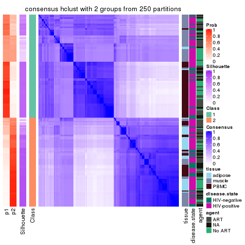</p>

</div>
<div id='tab-ATC-hclust-consensus-heatmap-2'>
<pre><code class="r">consensus_heatmap(res, k = 3)
</code></pre>

<p>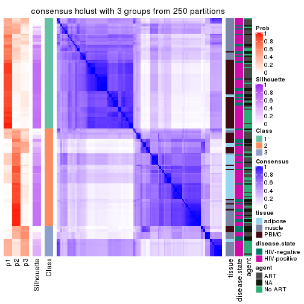</p>

</div>
<div id='tab-ATC-hclust-consensus-heatmap-3'>
<pre><code class="r">consensus_heatmap(res, k = 4)
</code></pre>

<p>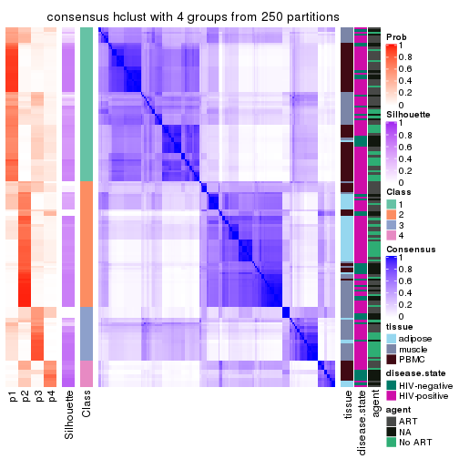</p>

</div>
<div id='tab-ATC-hclust-consensus-heatmap-4'>
<pre><code class="r">consensus_heatmap(res, k = 5)
</code></pre>

<p>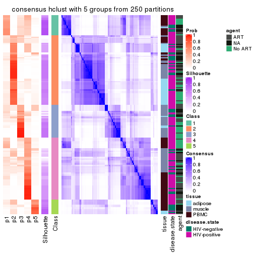</p>

</div>
<div id='tab-ATC-hclust-consensus-heatmap-5'>
<pre><code class="r">consensus_heatmap(res, k = 6)
</code></pre>

<p>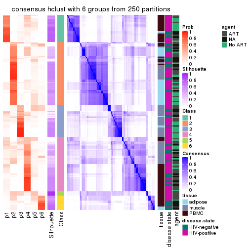</p>

</div>
</div>

Heatmaps for the membership of samples in all partitions to see how consistent they are:


<script>
$( function() {
	$( '#tabs-ATC-hclust-membership-heatmap' ).tabs();
} );
</script>
<div id='tabs-ATC-hclust-membership-heatmap'>
<ul>
<li><a href='#tab-ATC-hclust-membership-heatmap-1'>k = 2</a></li>
<li><a href='#tab-ATC-hclust-membership-heatmap-2'>k = 3</a></li>
<li><a href='#tab-ATC-hclust-membership-heatmap-3'>k = 4</a></li>
<li><a href='#tab-ATC-hclust-membership-heatmap-4'>k = 5</a></li>
<li><a href='#tab-ATC-hclust-membership-heatmap-5'>k = 6</a></li>
</ul>
<div id='tab-ATC-hclust-membership-heatmap-1'>
<pre><code class="r">membership_heatmap(res, k = 2)
</code></pre>

<p>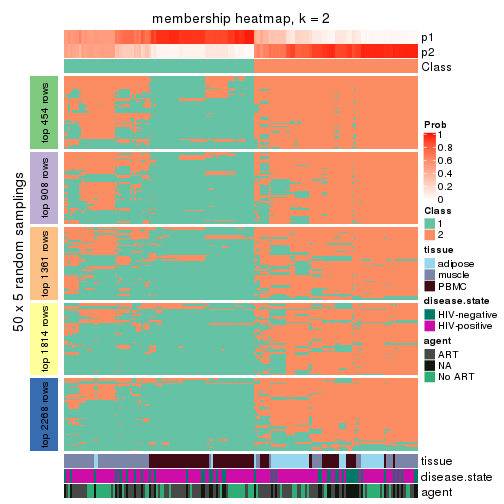</p>

</div>
<div id='tab-ATC-hclust-membership-heatmap-2'>
<pre><code class="r">membership_heatmap(res, k = 3)
</code></pre>

<p>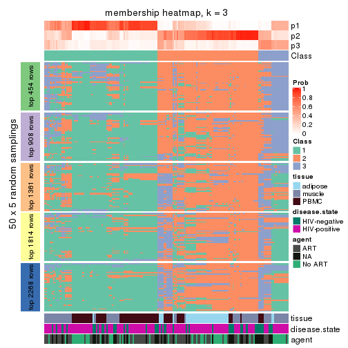</p>

</div>
<div id='tab-ATC-hclust-membership-heatmap-3'>
<pre><code class="r">membership_heatmap(res, k = 4)
</code></pre>

<p>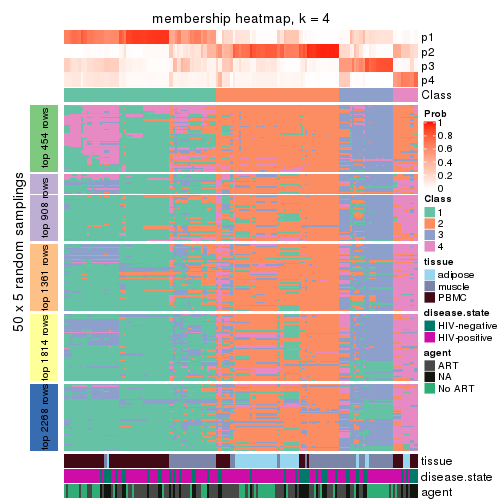</p>

</div>
<div id='tab-ATC-hclust-membership-heatmap-4'>
<pre><code class="r">membership_heatmap(res, k = 5)
</code></pre>

<p>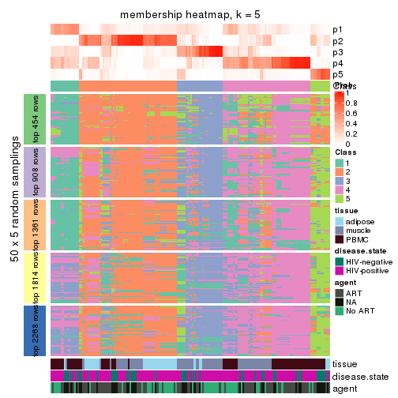</p>

</div>
<div id='tab-ATC-hclust-membership-heatmap-5'>
<pre><code class="r">membership_heatmap(res, k = 6)
</code></pre>

<p>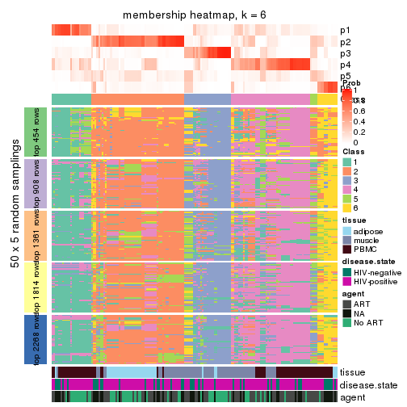</p>

</div>
</div>

As soon as we have had the classes for columns, we can look for signatures
which are significantly different between classes which can be candidate marks
for certain classes. Following are the heatmaps for signatures.


Signature heatmaps where rows are scaled:


<script>
$( function() {
	$( '#tabs-ATC-hclust-get-signatures' ).tabs();
} );
</script>
<div id='tabs-ATC-hclust-get-signatures'>
<ul>
<li><a href='#tab-ATC-hclust-get-signatures-1'>k = 2</a></li>
<li><a href='#tab-ATC-hclust-get-signatures-2'>k = 3</a></li>
<li><a href='#tab-ATC-hclust-get-signatures-3'>k = 4</a></li>
<li><a href='#tab-ATC-hclust-get-signatures-4'>k = 5</a></li>
<li><a href='#tab-ATC-hclust-get-signatures-5'>k = 6</a></li>
</ul>
<div id='tab-ATC-hclust-get-signatures-1'>
<pre><code class="r">get_signatures(res, k = 2)
</code></pre>

<p>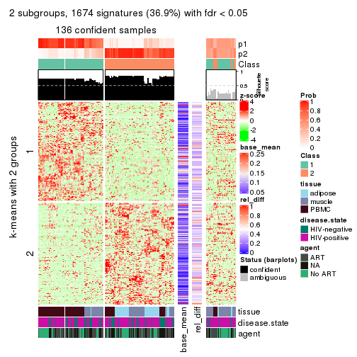</p>

</div>
<div id='tab-ATC-hclust-get-signatures-2'>
<pre><code class="r">get_signatures(res, k = 3)
</code></pre>

<p>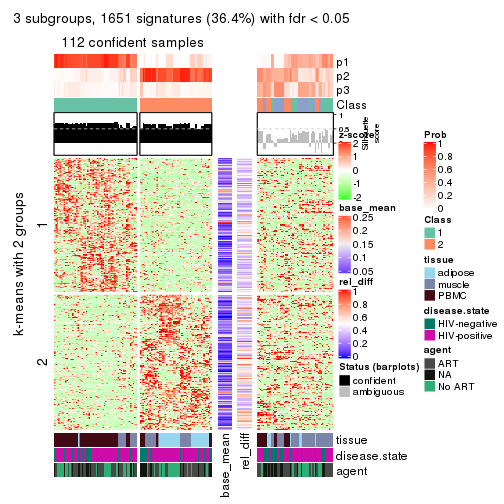</p>

</div>
<div id='tab-ATC-hclust-get-signatures-3'>
<pre><code class="r">get_signatures(res, k = 4)
</code></pre>

<p>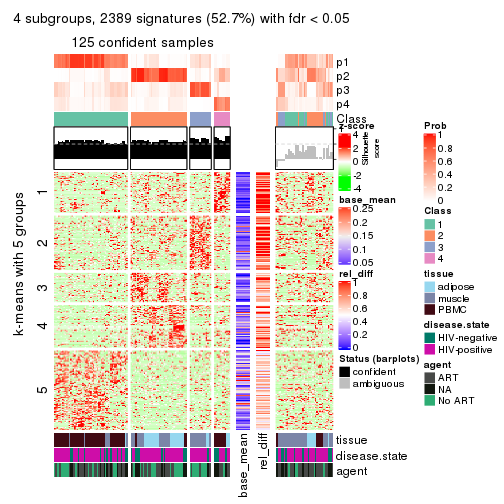</p>

</div>
<div id='tab-ATC-hclust-get-signatures-4'>
<pre><code class="r">get_signatures(res, k = 5)
</code></pre>

<p>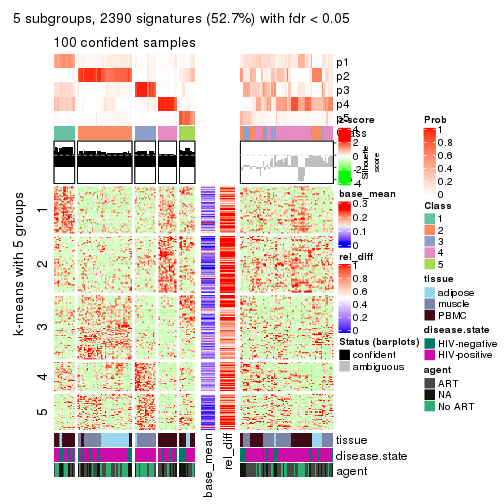</p>

</div>
<div id='tab-ATC-hclust-get-signatures-5'>
<pre><code class="r">get_signatures(res, k = 6)
</code></pre>

<p>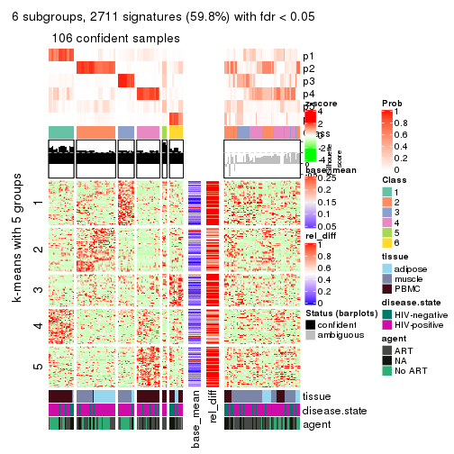</p>

</div>
</div>


Signature heatmaps where rows are not scaled:


<script>
$( function() {
	$( '#tabs-ATC-hclust-get-signatures-no-scale' ).tabs();
} );
</script>
<div id='tabs-ATC-hclust-get-signatures-no-scale'>
<ul>
<li><a href='#tab-ATC-hclust-get-signatures-no-scale-1'>k = 2</a></li>
<li><a href='#tab-ATC-hclust-get-signatures-no-scale-2'>k = 3</a></li>
<li><a href='#tab-ATC-hclust-get-signatures-no-scale-3'>k = 4</a></li>
<li><a href='#tab-ATC-hclust-get-signatures-no-scale-4'>k = 5</a></li>
<li><a href='#tab-ATC-hclust-get-signatures-no-scale-5'>k = 6</a></li>
</ul>
<div id='tab-ATC-hclust-get-signatures-no-scale-1'>
<pre><code class="r">get_signatures(res, k = 2, scale_rows = FALSE)
</code></pre>

<p>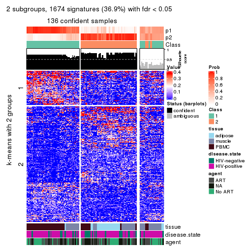</p>

</div>
<div id='tab-ATC-hclust-get-signatures-no-scale-2'>
<pre><code class="r">get_signatures(res, k = 3, scale_rows = FALSE)
</code></pre>

<p>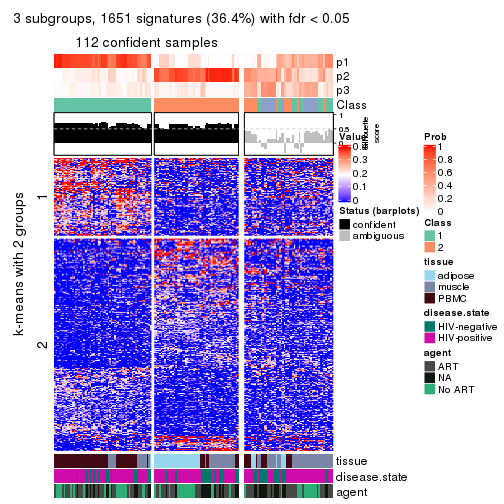</p>

</div>
<div id='tab-ATC-hclust-get-signatures-no-scale-3'>
<pre><code class="r">get_signatures(res, k = 4, scale_rows = FALSE)
</code></pre>

<p>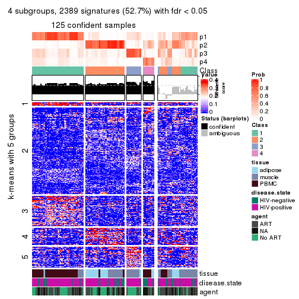</p>

</div>
<div id='tab-ATC-hclust-get-signatures-no-scale-4'>
<pre><code class="r">get_signatures(res, k = 5, scale_rows = FALSE)
</code></pre>

<p>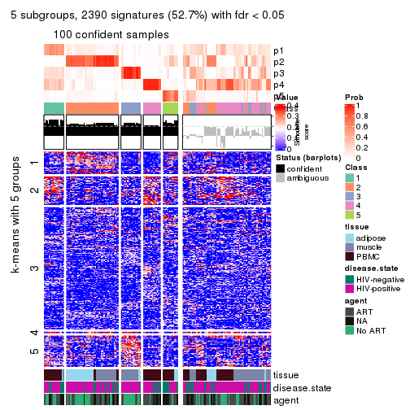</p>

</div>
<div id='tab-ATC-hclust-get-signatures-no-scale-5'>
<pre><code class="r">get_signatures(res, k = 6, scale_rows = FALSE)
</code></pre>

<p>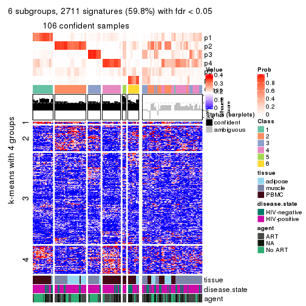</p>

</div>
</div>


Compare the overlap of signatures from different k:

```r
compare_signatures(res)
```

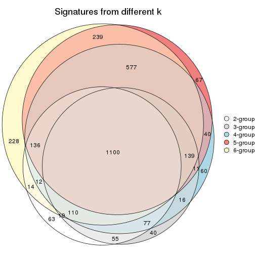

`get_signature()` returns a data frame invisibly. TO get the list of signatures, the function
call should be assigned to a variable explicitly. In following code, if `plot` argument is set
to `FALSE`, no heatmap is plotted while only the differential analysis is performed.

```r
# code only for demonstration
tb = get_signature(res, k = ..., plot = FALSE)
```

An example of the output of `tb` is:

```
#>   which_row         fdr    mean_1    mean_2 scaled_mean_1 scaled_mean_2 km
#> 1        38 0.042760348  8.373488  9.131774    -0.5533452     0.5164555  1
#> 2        40 0.018707592  7.106213  8.469186    -0.6173731     0.5762149  1
#> 3        55 0.019134737 10.221463 11.207825    -0.6159697     0.5749050  1
#> 4        59 0.006059896  5.921854  7.869574    -0.6899429     0.6439467  1
#> 5        60 0.018055526  8.928898 10.211722    -0.6204761     0.5791110  1
#> 6        98 0.009384629 15.714769 14.887706     0.6635654    -0.6193277  2
...
```

The columns in `tb` are:

1. `which_row`: row indices corresponding to the input matrix.
2. `fdr`: FDR for the differential test. 
3. `mean_x`: The mean value in group x.
4. `scaled_mean_x`: The mean value in group x after rows are scaled.
5. `km`: Row groups if k-means clustering is applied to rows.


UMAP plot which shows how samples are separated.


<script>
$( function() {
	$( '#tabs-ATC-hclust-dimension-reduction' ).tabs();
} );
</script>
<div id='tabs-ATC-hclust-dimension-reduction'>
<ul>
<li><a href='#tab-ATC-hclust-dimension-reduction-1'>k = 2</a></li>
<li><a href='#tab-ATC-hclust-dimension-reduction-2'>k = 3</a></li>
<li><a href='#tab-ATC-hclust-dimension-reduction-3'>k = 4</a></li>
<li><a href='#tab-ATC-hclust-dimension-reduction-4'>k = 5</a></li>
<li><a href='#tab-ATC-hclust-dimension-reduction-5'>k = 6</a></li>
</ul>
<div id='tab-ATC-hclust-dimension-reduction-1'>
<pre><code class="r">dimension_reduction(res, k = 2, method = &quot;UMAP&quot;)
</code></pre>

<p>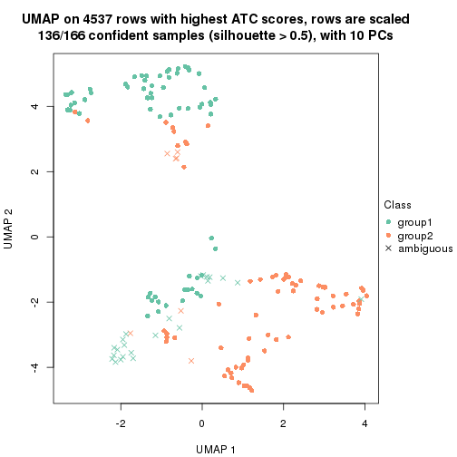</p>

</div>
<div id='tab-ATC-hclust-dimension-reduction-2'>
<pre><code class="r">dimension_reduction(res, k = 3, method = &quot;UMAP&quot;)
</code></pre>

<p>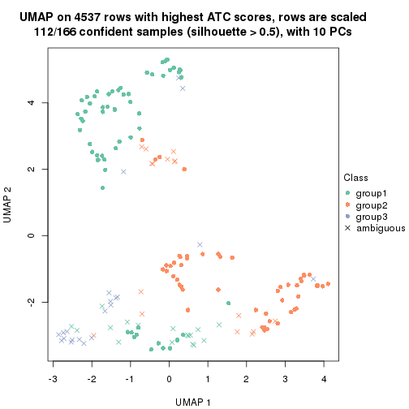</p>

</div>
<div id='tab-ATC-hclust-dimension-reduction-3'>
<pre><code class="r">dimension_reduction(res, k = 4, method = &quot;UMAP&quot;)
</code></pre>

<p>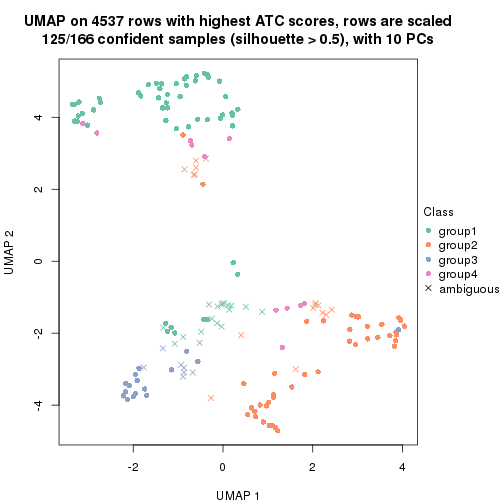</p>

</div>
<div id='tab-ATC-hclust-dimension-reduction-4'>
<pre><code class="r">dimension_reduction(res, k = 5, method = &quot;UMAP&quot;)
</code></pre>

<p>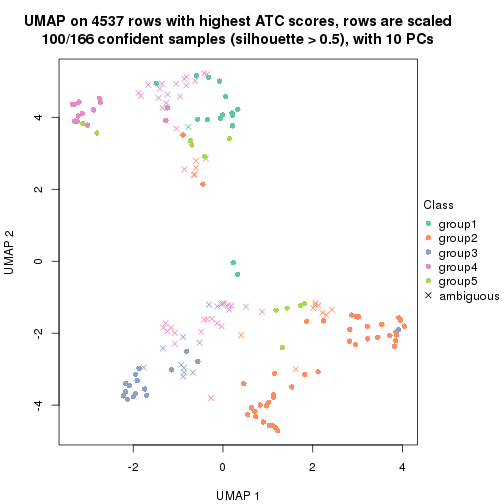</p>

</div>
<div id='tab-ATC-hclust-dimension-reduction-5'>
<pre><code class="r">dimension_reduction(res, k = 6, method = &quot;UMAP&quot;)
</code></pre>

<p>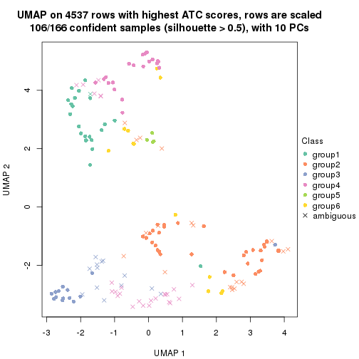</p>

</div>
</div>


Following heatmap shows how subgroups are split when increasing `k`:

```r
collect_classes(res)
```

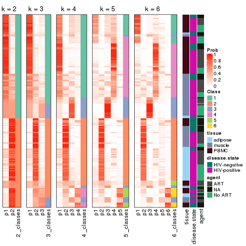


Test correlation between subgroups and known annotations. If the known
annotation is numeric, one-way ANOVA test is applied, and if the known
annotation is discrete, chi-squared contingency table test is applied.

```r
test_to_known_factors(res)
```

```
#>              n tissue(p) disease.state(p) agent(p) k
#> ATC:hclust 136  1.97e-10           0.3437 0.514406 2
#> ATC:hclust 112  9.62e-13           0.8475 0.912583 3
#> ATC:hclust 125  3.50e-18           0.0579 0.024978 4
#> ATC:hclust 100  3.38e-15           0.1248 0.011913 5
#> ATC:hclust 106  1.43e-17           0.1098 0.000332 6
```


If matrix rows can be associated to genes, consider to use `GO_Enrichment(res,
...)` to perform function enrichment for the signature genes.


 

---------------------------------------------------


### ATC:kmeans


The object with results only for a single top-value method and a single partition method 
can be extracted as:

```r
res = res_list["ATC", "kmeans"]
# you can also extract it by
# res = res_list["ATC:kmeans"]
```

A summary of `res` and all the functions that can be applied to it:

```r
res
```

```
#> A 'ConsensusPartition' object with k = 2, 3, 4, 5, 6.
#>   On a matrix with 4537 rows and 166 columns.
#>   Top rows (454, 908, 1361, 1814, 2268) are extracted by 'ATC' method.
#>   Subgroups are detected by 'kmeans' method.
#>   Performed in total 1250 partitions by row resampling.
#>   Best k for subgroups seems to be 3.
#> 
#> Following methods can be applied to this 'ConsensusPartition' object:
#>  [1] "cola_report"             "collect_classes"         "collect_plots"          
#>  [4] "collect_stats"           "colnames"                "compare_signatures"     
#>  [7] "consensus_heatmap"       "dimension_reduction"     "functional_enrichment"  
#> [10] "get_anno_col"            "get_anno"                "get_classes"            
#> [13] "get_consensus"           "get_matrix"              "get_membership"         
#> [16] "get_param"               "get_signatures"          "get_stats"              
#> [19] "is_best_k"               "is_stable_k"             "membership_heatmap"     
#> [22] "ncol"                    "nrow"                    "plot_ecdf"              
#> [25] "rownames"                "select_partition_number" "show"                   
#> [28] "suggest_best_k"          "test_to_known_factors"
```

`collect_plots()` function collects all the plots made from `res` for all `k` (number of partitions)
into one single page to provide an easy and fast comparison between different `k`.

```r
collect_plots(res)
```

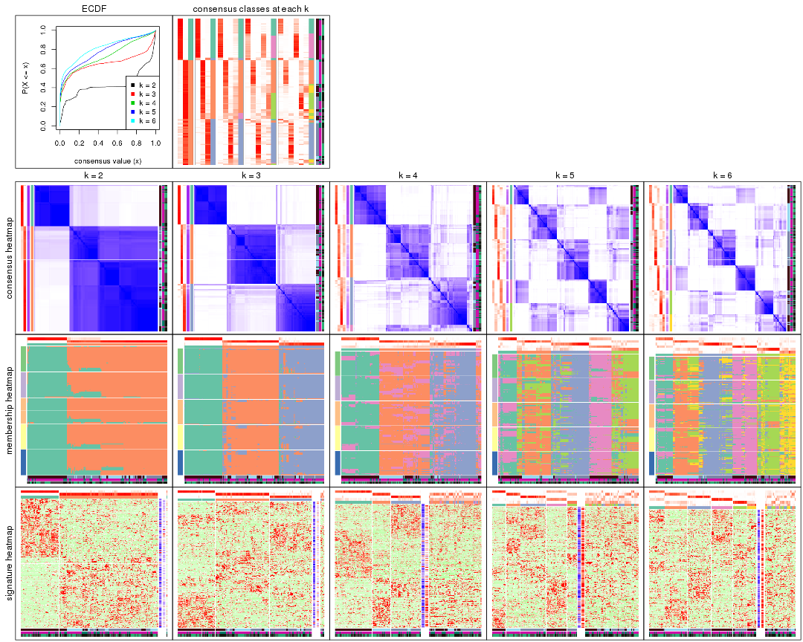

The plots are:

- The first row: a plot of the ECDF (Empirical cumulative distribution
  function) curves of the consensus matrix for each `k` and the heatmap of
  predicted classes for each `k`.
- The second row: heatmaps of the consensus matrix for each `k`.
- The third row: heatmaps of the membership matrix for each `k`.
- The fouth row: heatmaps of the signatures for each `k`.

All the plots in panels can be made by individual functions and they are
plotted later in this section.

`select_partition_number()` produces several plots showing different
statistics for choosing "optimized" `k`. There are following statistics:

- ECDF curves of the consensus matrix for each `k`;
- 1-PAC. [The PAC
  score](https://en.wikipedia.org/wiki/Consensus_clustering#Over-interpretation_potential_of_consensus_clustering)
  measures the proportion of the ambiguous subgrouping.
- Mean silhouette score.
- Concordance. The mean probability of fiting the consensus class ids in all
  partitions.
- Area increased. Denote $A_k$ as the area under the ECDF curve for current
  `k`, the area increased is defined as $A_k - A_{k-1}$.
- Rand index. The percent of pairs of samples that are both in a same cluster
  or both are not in a same cluster in the partition of k and k-1.
- Jaccard index. The ratio of pairs of samples are both in a same cluster in
  the partition of k and k-1 and the pairs of samples are both in a same
  cluster in the partition k or k-1.

The detailed explanations of these statistics can be found in [the cola
vignette](http://bioconductor.org/packages/devel/bioc/vignettes/cola/inst/doc/cola.html#toc_13).

Generally speaking, lower PAC score, higher mean silhouette score or higher
concordance corresponds to better partition. Rand index and Jaccard index
measure how similar the current partition is compared to partition with `k-1`.
If they are too similar, we won't accept `k` is better than `k-1`.

```r
select_partition_number(res)
```

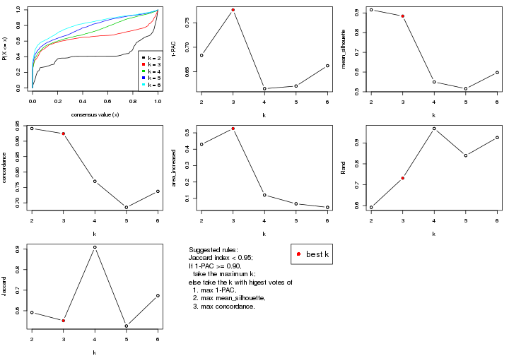

The numeric values for all these statistics can be obtained by `get_stats()`.

```r
get_stats(res)
```

```
#>   k 1-PAC mean_silhouette concordance area_increased  Rand Jaccard
#> 2 2 0.683           0.915       0.941         0.4298 0.592   0.592
#> 3 3 0.776           0.884       0.925         0.5263 0.731   0.552
#> 4 4 0.615           0.550       0.770         0.1203 0.969   0.909
#> 5 5 0.621           0.516       0.685         0.0671 0.840   0.526
#> 6 6 0.662           0.598       0.737         0.0455 0.926   0.673
```

`suggest_best_k()` suggests the best $k$ based on these statistics. The rules are as follows:

- All $k$ with Jaccard index larger than 0.95 are removed because the increase of
  the partition number does not provides enough extra information. If all $k$ are removed,
  the best $k$ is assigned by `NA`.
- For $k$ with 1-PAC larger than 0.9, the maximal $k$ is taken as the "best k". Other $k$ is called "optional k".
- If it does not fit the second rule. The $k$ with the highest vote of highest
  1-PAC, mean silhouette and concordance is taken as the "best k".

```r
suggest_best_k(res)
```

```
#> [1] 3
```


Following shows the table of the partitions (You need to click the **show/hide
code output** link to see it). The membership matrix (columns with name `p*`)
is inferred by
[`clue::cl_consensus()`](https://www.rdocumentation.org/link/cl_consensus?package=clue)
function with the `SE` method. Basically the value in the membership matrix
represents the probability to belong to a certain group. The finall class
label for an item is determined with the group with highest probability it
belongs to.

In `get_classes()` function, the entropy is calculated from the membership
matrix and the silhouette score is calculated from the consensus matrix.


<script>
$( function() {
	$( '#tabs-ATC-kmeans-get-classes' ).tabs();
} );
</script>
<div id='tabs-ATC-kmeans-get-classes'>
<ul>
<li><a href='#tab-ATC-kmeans-get-classes-1'>k = 2</a></li>
<li><a href='#tab-ATC-kmeans-get-classes-2'>k = 3</a></li>
<li><a href='#tab-ATC-kmeans-get-classes-3'>k = 4</a></li>
<li><a href='#tab-ATC-kmeans-get-classes-4'>k = 5</a></li>
<li><a href='#tab-ATC-kmeans-get-classes-5'>k = 6</a></li>
</ul>

<div id='tab-ATC-kmeans-get-classes-1'>
<p><a id='tab-ATC-kmeans-get-classes-1-a' style='color:#0366d6' href='#'>show/hide code output</a></p>
<pre><code class="r">cbind(get_classes(res, k = 2), get_membership(res, k = 2))
</code></pre>

<pre><code>#&gt;           class entropy silhouette    p1    p2
#&gt; GSM751298     1  0.0376      0.981 0.996 0.004
#&gt; GSM751304     2  0.0672      0.926 0.008 0.992
#&gt; GSM751305     2  0.0672      0.926 0.008 0.992
#&gt; GSM751307     2  0.2236      0.921 0.036 0.964
#&gt; GSM751310     1  0.1184      0.983 0.984 0.016
#&gt; GSM751314     1  0.1184      0.983 0.984 0.016
#&gt; GSM751316     1  0.1184      0.983 0.984 0.016
#&gt; GSM751318     1  0.1184      0.983 0.984 0.016
#&gt; GSM751342     1  0.2236      0.966 0.964 0.036
#&gt; GSM751346     1  0.0672      0.974 0.992 0.008
#&gt; GSM751347     2  0.7528      0.827 0.216 0.784
#&gt; GSM751348     2  0.0938      0.926 0.012 0.988
#&gt; GSM751349     2  0.0672      0.926 0.008 0.992
#&gt; GSM751352     2  0.0938      0.926 0.012 0.988
#&gt; GSM751353     2  0.0376      0.925 0.004 0.996
#&gt; GSM751354     2  0.1184      0.924 0.016 0.984
#&gt; GSM751355     2  0.1184      0.924 0.016 0.984
#&gt; GSM751358     2  0.0376      0.925 0.004 0.996
#&gt; GSM751359     2  0.0672      0.926 0.008 0.992
#&gt; GSM751294     2  0.1184      0.922 0.016 0.984
#&gt; GSM751296     1  0.0000      0.980 1.000 0.000
#&gt; GSM751297     1  0.2423      0.950 0.960 0.040
#&gt; GSM751299     2  0.1633      0.924 0.024 0.976
#&gt; GSM751300     1  0.0000      0.980 1.000 0.000
#&gt; GSM751301     2  0.2603      0.917 0.044 0.956
#&gt; GSM751302     1  0.0000      0.980 1.000 0.000
#&gt; GSM751303     1  0.1184      0.983 0.984 0.016
#&gt; GSM751306     1  0.1184      0.983 0.984 0.016
#&gt; GSM751308     2  0.6973      0.841 0.188 0.812
#&gt; GSM751309     1  0.1184      0.983 0.984 0.016
#&gt; GSM751311     1  0.1184      0.983 0.984 0.016
#&gt; GSM751312     1  0.1184      0.983 0.984 0.016
#&gt; GSM751313     1  0.0000      0.980 1.000 0.000
#&gt; GSM751315     1  0.1184      0.983 0.984 0.016
#&gt; GSM751317     1  0.1184      0.983 0.984 0.016
#&gt; GSM751320     1  0.1184      0.983 0.984 0.016
#&gt; GSM751321     1  0.1184      0.983 0.984 0.016
#&gt; GSM751322     1  0.1184      0.983 0.984 0.016
#&gt; GSM751324     1  0.1184      0.983 0.984 0.016
#&gt; GSM751325     1  0.1184      0.983 0.984 0.016
#&gt; GSM751332     1  0.1184      0.983 0.984 0.016
#&gt; GSM751334     1  0.1184      0.983 0.984 0.016
#&gt; GSM751339     1  0.0672      0.974 0.992 0.008
#&gt; GSM751341     1  0.0000      0.980 1.000 0.000
#&gt; GSM751343     1  0.1184      0.983 0.984 0.016
#&gt; GSM751344     2  0.0672      0.926 0.008 0.992
#&gt; GSM751345     2  0.0672      0.926 0.008 0.992
#&gt; GSM751356     2  0.0672      0.925 0.008 0.992
#&gt; GSM751357     2  0.0672      0.925 0.008 0.992
#&gt; GSM751293     2  0.2603      0.917 0.044 0.956
#&gt; GSM751295     1  0.0000      0.980 1.000 0.000
#&gt; GSM751319     1  0.1184      0.983 0.984 0.016
#&gt; GSM751323     1  0.0938      0.983 0.988 0.012
#&gt; GSM751326     1  0.0000      0.980 1.000 0.000
#&gt; GSM751327     1  0.0938      0.983 0.988 0.012
#&gt; GSM751328     1  0.1184      0.983 0.984 0.016
#&gt; GSM751329     1  0.1184      0.983 0.984 0.016
#&gt; GSM751330     1  0.1184      0.983 0.984 0.016
#&gt; GSM751331     1  0.0376      0.981 0.996 0.004
#&gt; GSM751333     1  0.0000      0.980 1.000 0.000
#&gt; GSM751335     1  0.1184      0.983 0.984 0.016
#&gt; GSM751336     1  0.0000      0.980 1.000 0.000
#&gt; GSM751337     1  0.0672      0.974 0.992 0.008
#&gt; GSM751338     1  0.0376      0.977 0.996 0.004
#&gt; GSM751340     1  0.0672      0.974 0.992 0.008
#&gt; GSM751350     1  0.0000      0.980 1.000 0.000
#&gt; GSM751351     1  0.0000      0.980 1.000 0.000
#&gt; GSM751362     2  0.6973      0.841 0.188 0.812
#&gt; GSM751363     2  0.0672      0.926 0.008 0.992
#&gt; GSM751367     1  0.8813      0.481 0.700 0.300
#&gt; GSM751368     2  0.0672      0.926 0.008 0.992
#&gt; GSM751371     2  0.8713      0.705 0.292 0.708
#&gt; GSM751375     2  0.0672      0.926 0.008 0.992
#&gt; GSM751376     2  0.1184      0.922 0.016 0.984
#&gt; GSM751378     2  0.0938      0.923 0.012 0.988
#&gt; GSM751379     2  0.1843      0.922 0.028 0.972
#&gt; GSM751382     2  0.0672      0.926 0.008 0.992
#&gt; GSM751386     2  0.0672      0.926 0.008 0.992
#&gt; GSM751388     2  0.0672      0.926 0.008 0.992
#&gt; GSM751391     2  0.3584      0.910 0.068 0.932
#&gt; GSM751410     2  0.7056      0.838 0.192 0.808
#&gt; GSM751414     2  0.8499      0.736 0.276 0.724
#&gt; GSM751361     2  0.0672      0.926 0.008 0.992
#&gt; GSM751365     2  0.6247      0.863 0.156 0.844
#&gt; GSM751366     2  0.8955      0.680 0.312 0.688
#&gt; GSM751369     2  0.6973      0.841 0.188 0.812
#&gt; GSM751370     2  0.8386      0.738 0.268 0.732
#&gt; GSM751372     2  0.6712      0.847 0.176 0.824
#&gt; GSM751373     2  0.8608      0.728 0.284 0.716
#&gt; GSM751374     2  0.1843      0.922 0.028 0.972
#&gt; GSM751377     2  0.0672      0.926 0.008 0.992
#&gt; GSM751380     2  0.7299      0.826 0.204 0.796
#&gt; GSM751381     2  0.0672      0.926 0.008 0.992
#&gt; GSM751383     2  0.0672      0.926 0.008 0.992
#&gt; GSM751384     2  0.0000      0.925 0.000 1.000
#&gt; GSM751385     2  0.0376      0.924 0.004 0.996
#&gt; GSM751387     2  0.0672      0.926 0.008 0.992
#&gt; GSM751389     2  0.5294      0.887 0.120 0.880
#&gt; GSM751393     2  0.1184      0.922 0.016 0.984
#&gt; GSM751394     2  0.0672      0.926 0.008 0.992
#&gt; GSM751395     2  0.1184      0.922 0.016 0.984
#&gt; GSM751397     2  0.0672      0.926 0.008 0.992
#&gt; GSM751398     2  0.0672      0.926 0.008 0.992
#&gt; GSM751404     2  0.6973      0.841 0.188 0.812
#&gt; GSM751406     2  0.6973      0.841 0.188 0.812
#&gt; GSM751411     2  0.5519      0.877 0.128 0.872
#&gt; GSM751413     2  0.0672      0.926 0.008 0.992
#&gt; GSM751415     2  0.6973      0.841 0.188 0.812
#&gt; GSM751416     2  0.0672      0.926 0.008 0.992
#&gt; GSM751417     2  0.0672      0.926 0.008 0.992
#&gt; GSM751421     2  0.6973      0.839 0.188 0.812
#&gt; GSM751422     2  0.6801      0.843 0.180 0.820
#&gt; GSM751360     2  0.6712      0.844 0.176 0.824
#&gt; GSM751364     2  0.4690      0.897 0.100 0.900
#&gt; GSM751390     2  0.0000      0.925 0.000 1.000
#&gt; GSM751392     2  0.0672      0.926 0.008 0.992
#&gt; GSM751396     2  0.0672      0.926 0.008 0.992
#&gt; GSM751399     2  0.6048      0.870 0.148 0.852
#&gt; GSM751400     2  0.4022      0.906 0.080 0.920
#&gt; GSM751401     2  0.6973      0.841 0.188 0.812
#&gt; GSM751402     2  0.6973      0.841 0.188 0.812
#&gt; GSM751403     2  0.6438      0.860 0.164 0.836
#&gt; GSM751405     2  0.6973      0.841 0.188 0.812
#&gt; GSM751407     2  0.6973      0.841 0.188 0.812
#&gt; GSM751408     2  0.6048      0.870 0.148 0.852
#&gt; GSM751409     2  0.5059      0.891 0.112 0.888
#&gt; GSM751412     2  0.6801      0.848 0.180 0.820
#&gt; GSM751418     2  0.6973      0.840 0.188 0.812
#&gt; GSM751419     2  0.6801      0.844 0.180 0.820
#&gt; GSM751420     2  0.5408      0.884 0.124 0.876
#&gt; GSM751425     2  0.0672      0.926 0.008 0.992
#&gt; GSM751429     2  0.7528      0.824 0.216 0.784
#&gt; GSM751430     2  0.0672      0.926 0.008 0.992
#&gt; GSM751433     2  0.2236      0.921 0.036 0.964
#&gt; GSM751437     2  0.6973      0.841 0.188 0.812
#&gt; GSM751448     2  0.6973      0.841 0.188 0.812
#&gt; GSM751451     2  0.2236      0.921 0.036 0.964
#&gt; GSM751423     2  0.2236      0.921 0.036 0.964
#&gt; GSM751424     2  0.2236      0.921 0.036 0.964
#&gt; GSM751428     2  0.2236      0.921 0.036 0.964
#&gt; GSM751431     2  0.2236      0.921 0.036 0.964
#&gt; GSM751432     2  0.2236      0.921 0.036 0.964
#&gt; GSM751434     2  0.2236      0.921 0.036 0.964
#&gt; GSM751435     2  0.2236      0.921 0.036 0.964
#&gt; GSM751436     2  0.2236      0.921 0.036 0.964
#&gt; GSM751440     2  0.2236      0.921 0.036 0.964
#&gt; GSM751444     2  0.2778      0.922 0.048 0.952
#&gt; GSM751446     2  0.2778      0.922 0.048 0.952
#&gt; GSM751449     2  0.1184      0.922 0.016 0.984
#&gt; GSM751450     2  0.2236      0.921 0.036 0.964
#&gt; GSM751452     2  0.2236      0.921 0.036 0.964
#&gt; GSM751426     2  0.2236      0.921 0.036 0.964
#&gt; GSM751427     2  0.2236      0.922 0.036 0.964
#&gt; GSM751438     2  0.1184      0.922 0.016 0.984
#&gt; GSM751439     2  0.6247      0.874 0.156 0.844
#&gt; GSM751441     2  0.1184      0.924 0.016 0.984
#&gt; GSM751442     2  0.2423      0.922 0.040 0.960
#&gt; GSM751443     2  0.5519      0.882 0.128 0.872
#&gt; GSM751445     2  0.0938      0.923 0.012 0.988
#&gt; GSM751447     2  0.2236      0.921 0.036 0.964
#&gt; GSM751453     2  0.2236      0.921 0.036 0.964
#&gt; GSM751454     2  0.2236      0.921 0.036 0.964
#&gt; GSM751455     2  0.2423      0.922 0.040 0.960
#&gt; GSM751456     2  0.2423      0.922 0.040 0.960
#&gt; GSM751457     2  0.1184      0.922 0.016 0.984
#&gt; GSM751458     2  0.1184      0.922 0.016 0.984
</code></pre>

<script>
$('#tab-ATC-kmeans-get-classes-1-a').parent().next().next().hide();
$('#tab-ATC-kmeans-get-classes-1-a').click(function(){
  $('#tab-ATC-kmeans-get-classes-1-a').parent().next().next().toggle();
  return(false);
});
</script>
</div>

<div id='tab-ATC-kmeans-get-classes-2'>
<p><a id='tab-ATC-kmeans-get-classes-2-a' style='color:#0366d6' href='#'>show/hide code output</a></p>
<pre><code class="r">cbind(get_classes(res, k = 3), get_membership(res, k = 3))
</code></pre>

<pre><code>#&gt;           class entropy silhouette    p1    p2    p3
#&gt; GSM751298     1  0.0983      0.978 0.980 0.004 0.016
#&gt; GSM751304     2  0.3941      0.827 0.000 0.844 0.156
#&gt; GSM751305     2  0.3941      0.827 0.000 0.844 0.156
#&gt; GSM751307     2  0.1031      0.925 0.000 0.976 0.024
#&gt; GSM751310     1  0.0829      0.979 0.984 0.004 0.012
#&gt; GSM751314     1  0.0424      0.981 0.992 0.000 0.008
#&gt; GSM751316     1  0.0829      0.979 0.984 0.004 0.012
#&gt; GSM751318     1  0.1182      0.975 0.976 0.012 0.012
#&gt; GSM751342     1  0.2339      0.942 0.940 0.048 0.012
#&gt; GSM751346     1  0.1267      0.977 0.972 0.004 0.024
#&gt; GSM751347     3  0.6306      0.729 0.052 0.200 0.748
#&gt; GSM751348     2  0.1031      0.927 0.000 0.976 0.024
#&gt; GSM751349     2  0.1031      0.926 0.000 0.976 0.024
#&gt; GSM751352     2  0.1753      0.919 0.000 0.952 0.048
#&gt; GSM751353     2  0.1163      0.925 0.000 0.972 0.028
#&gt; GSM751354     2  0.3941      0.836 0.000 0.844 0.156
#&gt; GSM751355     2  0.1411      0.925 0.000 0.964 0.036
#&gt; GSM751358     2  0.6664      0.132 0.008 0.528 0.464
#&gt; GSM751359     2  0.2066      0.920 0.000 0.940 0.060
#&gt; GSM751294     3  0.3192      0.870 0.000 0.112 0.888
#&gt; GSM751296     1  0.1267      0.977 0.972 0.004 0.024
#&gt; GSM751297     3  0.5873      0.517 0.312 0.004 0.684
#&gt; GSM751299     2  0.1860      0.917 0.000 0.948 0.052
#&gt; GSM751300     1  0.1267      0.977 0.972 0.004 0.024
#&gt; GSM751301     2  0.1337      0.920 0.012 0.972 0.016
#&gt; GSM751302     1  0.1267      0.977 0.972 0.004 0.024
#&gt; GSM751303     1  0.1182      0.975 0.976 0.012 0.012
#&gt; GSM751306     1  0.0829      0.979 0.984 0.004 0.012
#&gt; GSM751308     3  0.3998      0.865 0.060 0.056 0.884
#&gt; GSM751309     1  0.1015      0.977 0.980 0.008 0.012
#&gt; GSM751311     1  0.1015      0.977 0.980 0.008 0.012
#&gt; GSM751312     1  0.0829      0.979 0.984 0.004 0.012
#&gt; GSM751313     1  0.1129      0.978 0.976 0.004 0.020
#&gt; GSM751315     1  0.0424      0.981 0.992 0.000 0.008
#&gt; GSM751317     1  0.1015      0.977 0.980 0.008 0.012
#&gt; GSM751320     1  0.0424      0.981 0.992 0.000 0.008
#&gt; GSM751321     1  0.0424      0.981 0.992 0.000 0.008
#&gt; GSM751322     1  0.0424      0.981 0.992 0.000 0.008
#&gt; GSM751324     1  0.0424      0.981 0.992 0.000 0.008
#&gt; GSM751325     1  0.0424      0.981 0.992 0.000 0.008
#&gt; GSM751332     1  0.0237      0.981 0.996 0.000 0.004
#&gt; GSM751334     1  0.0237      0.981 0.996 0.000 0.004
#&gt; GSM751339     1  0.1031      0.979 0.976 0.000 0.024
#&gt; GSM751341     1  0.0983      0.978 0.980 0.004 0.016
#&gt; GSM751343     1  0.0424      0.981 0.992 0.000 0.008
#&gt; GSM751344     2  0.1163      0.924 0.000 0.972 0.028
#&gt; GSM751345     2  0.1163      0.924 0.000 0.972 0.028
#&gt; GSM751356     2  0.4452      0.794 0.000 0.808 0.192
#&gt; GSM751357     2  0.4452      0.794 0.000 0.808 0.192
#&gt; GSM751293     2  0.1337      0.920 0.012 0.972 0.016
#&gt; GSM751295     1  0.1267      0.977 0.972 0.004 0.024
#&gt; GSM751319     1  0.0424      0.981 0.992 0.000 0.008
#&gt; GSM751323     1  0.0237      0.981 0.996 0.000 0.004
#&gt; GSM751326     1  0.1129      0.978 0.976 0.004 0.020
#&gt; GSM751327     1  0.0237      0.981 0.996 0.000 0.004
#&gt; GSM751328     1  0.0237      0.981 0.996 0.000 0.004
#&gt; GSM751329     1  0.0237      0.981 0.996 0.000 0.004
#&gt; GSM751330     1  0.1129      0.978 0.976 0.004 0.020
#&gt; GSM751331     1  0.1267      0.977 0.972 0.004 0.024
#&gt; GSM751333     1  0.1129      0.978 0.976 0.004 0.020
#&gt; GSM751335     1  0.1129      0.978 0.976 0.004 0.020
#&gt; GSM751336     1  0.1129      0.978 0.976 0.004 0.020
#&gt; GSM751337     1  0.1129      0.978 0.976 0.004 0.020
#&gt; GSM751338     1  0.0747      0.981 0.984 0.000 0.016
#&gt; GSM751340     1  0.4887      0.716 0.772 0.000 0.228
#&gt; GSM751350     1  0.1267      0.977 0.972 0.004 0.024
#&gt; GSM751351     1  0.1267      0.977 0.972 0.004 0.024
#&gt; GSM751362     3  0.1529      0.903 0.000 0.040 0.960
#&gt; GSM751363     2  0.3030      0.891 0.004 0.904 0.092
#&gt; GSM751367     3  0.7286      0.113 0.464 0.028 0.508
#&gt; GSM751368     2  0.2096      0.913 0.004 0.944 0.052
#&gt; GSM751371     3  0.6526      0.644 0.260 0.036 0.704
#&gt; GSM751375     2  0.0892      0.926 0.000 0.980 0.020
#&gt; GSM751376     3  0.2878      0.876 0.000 0.096 0.904
#&gt; GSM751378     3  0.5465      0.627 0.000 0.288 0.712
#&gt; GSM751379     3  0.2878      0.876 0.000 0.096 0.904
#&gt; GSM751382     2  0.1031      0.926 0.000 0.976 0.024
#&gt; GSM751386     2  0.2625      0.904 0.000 0.916 0.084
#&gt; GSM751388     2  0.2625      0.904 0.000 0.916 0.084
#&gt; GSM751391     3  0.5692      0.690 0.008 0.268 0.724
#&gt; GSM751410     3  0.1832      0.900 0.008 0.036 0.956
#&gt; GSM751414     3  0.4887      0.852 0.096 0.060 0.844
#&gt; GSM751361     2  0.6057      0.496 0.004 0.656 0.340
#&gt; GSM751365     3  0.2860      0.890 0.004 0.084 0.912
#&gt; GSM751366     3  0.2269      0.897 0.016 0.040 0.944
#&gt; GSM751369     3  0.1411      0.900 0.000 0.036 0.964
#&gt; GSM751370     3  0.3375      0.889 0.044 0.048 0.908
#&gt; GSM751372     3  0.1753      0.901 0.000 0.048 0.952
#&gt; GSM751373     3  0.7500      0.734 0.164 0.140 0.696
#&gt; GSM751374     3  0.2878      0.876 0.000 0.096 0.904
#&gt; GSM751377     2  0.2537      0.903 0.000 0.920 0.080
#&gt; GSM751380     3  0.2063      0.899 0.008 0.044 0.948
#&gt; GSM751381     2  0.2625      0.904 0.000 0.916 0.084
#&gt; GSM751383     2  0.2625      0.904 0.000 0.916 0.084
#&gt; GSM751384     3  0.6095      0.401 0.000 0.392 0.608
#&gt; GSM751385     2  0.5621      0.627 0.000 0.692 0.308
#&gt; GSM751387     2  0.2625      0.904 0.000 0.916 0.084
#&gt; GSM751389     3  0.1411      0.902 0.000 0.036 0.964
#&gt; GSM751393     3  0.1411      0.902 0.000 0.036 0.964
#&gt; GSM751394     2  0.2625      0.904 0.000 0.916 0.084
#&gt; GSM751395     3  0.2066      0.897 0.000 0.060 0.940
#&gt; GSM751397     2  0.2711      0.901 0.000 0.912 0.088
#&gt; GSM751398     2  0.2625      0.904 0.000 0.916 0.084
#&gt; GSM751404     3  0.1643      0.903 0.000 0.044 0.956
#&gt; GSM751406     3  0.1643      0.903 0.000 0.044 0.956
#&gt; GSM751411     3  0.2165      0.898 0.000 0.064 0.936
#&gt; GSM751413     2  0.1878      0.920 0.004 0.952 0.044
#&gt; GSM751415     3  0.1529      0.903 0.000 0.040 0.960
#&gt; GSM751416     2  0.5902      0.553 0.004 0.680 0.316
#&gt; GSM751417     2  0.5902      0.553 0.004 0.680 0.316
#&gt; GSM751421     3  0.2527      0.896 0.020 0.044 0.936
#&gt; GSM751422     3  0.2527      0.896 0.020 0.044 0.936
#&gt; GSM751360     3  0.2998      0.888 0.016 0.068 0.916
#&gt; GSM751364     3  0.5443      0.709 0.004 0.260 0.736
#&gt; GSM751390     3  0.6008      0.453 0.000 0.372 0.628
#&gt; GSM751392     2  0.2625      0.904 0.000 0.916 0.084
#&gt; GSM751396     2  0.0592      0.927 0.000 0.988 0.012
#&gt; GSM751399     3  0.1643      0.903 0.000 0.044 0.956
#&gt; GSM751400     3  0.1643      0.903 0.000 0.044 0.956
#&gt; GSM751401     3  0.1643      0.903 0.000 0.044 0.956
#&gt; GSM751402     3  0.1529      0.903 0.000 0.040 0.960
#&gt; GSM751403     3  0.1643      0.903 0.000 0.044 0.956
#&gt; GSM751405     3  0.1643      0.903 0.000 0.044 0.956
#&gt; GSM751407     3  0.1643      0.903 0.000 0.044 0.956
#&gt; GSM751408     3  0.1643      0.903 0.000 0.044 0.956
#&gt; GSM751409     3  0.1643      0.903 0.000 0.044 0.956
#&gt; GSM751412     3  0.1643      0.903 0.000 0.044 0.956
#&gt; GSM751418     3  0.5070      0.762 0.004 0.224 0.772
#&gt; GSM751419     3  0.5024      0.766 0.004 0.220 0.776
#&gt; GSM751420     3  0.1529      0.903 0.000 0.040 0.960
#&gt; GSM751425     2  0.0892      0.926 0.000 0.980 0.020
#&gt; GSM751429     3  0.1585      0.893 0.008 0.028 0.964
#&gt; GSM751430     2  0.0892      0.926 0.000 0.980 0.020
#&gt; GSM751433     2  0.0475      0.923 0.004 0.992 0.004
#&gt; GSM751437     3  0.1643      0.903 0.000 0.044 0.956
#&gt; GSM751448     3  0.1031      0.896 0.000 0.024 0.976
#&gt; GSM751451     2  0.1170      0.918 0.008 0.976 0.016
#&gt; GSM751423     2  0.0661      0.926 0.004 0.988 0.008
#&gt; GSM751424     2  0.0475      0.926 0.004 0.992 0.004
#&gt; GSM751428     2  0.0424      0.925 0.000 0.992 0.008
#&gt; GSM751431     2  0.0475      0.923 0.004 0.992 0.004
#&gt; GSM751432     2  0.0424      0.926 0.000 0.992 0.008
#&gt; GSM751434     2  0.0424      0.925 0.000 0.992 0.008
#&gt; GSM751435     2  0.0747      0.926 0.000 0.984 0.016
#&gt; GSM751436     2  0.0475      0.926 0.004 0.992 0.004
#&gt; GSM751440     2  0.0661      0.926 0.004 0.988 0.008
#&gt; GSM751444     2  0.0592      0.926 0.000 0.988 0.012
#&gt; GSM751446     2  0.0747      0.926 0.000 0.984 0.016
#&gt; GSM751449     2  0.3116      0.867 0.000 0.892 0.108
#&gt; GSM751450     2  0.0475      0.926 0.004 0.992 0.004
#&gt; GSM751452     2  0.0475      0.926 0.004 0.992 0.004
#&gt; GSM751426     2  0.0475      0.926 0.004 0.992 0.004
#&gt; GSM751427     2  0.1411      0.922 0.000 0.964 0.036
#&gt; GSM751438     2  0.5431      0.588 0.000 0.716 0.284
#&gt; GSM751439     3  0.3412      0.865 0.000 0.124 0.876
#&gt; GSM751441     2  0.0892      0.926 0.000 0.980 0.020
#&gt; GSM751442     2  0.2066      0.909 0.000 0.940 0.060
#&gt; GSM751443     3  0.2878      0.878 0.000 0.096 0.904
#&gt; GSM751445     2  0.1163      0.925 0.000 0.972 0.028
#&gt; GSM751447     2  0.0592      0.926 0.000 0.988 0.012
#&gt; GSM751453     2  0.0592      0.926 0.000 0.988 0.012
#&gt; GSM751454     2  0.0592      0.926 0.000 0.988 0.012
#&gt; GSM751455     2  0.2066      0.909 0.000 0.940 0.060
#&gt; GSM751456     2  0.2066      0.909 0.000 0.940 0.060
#&gt; GSM751457     3  0.4062      0.829 0.000 0.164 0.836
#&gt; GSM751458     3  0.4062      0.829 0.000 0.164 0.836
</code></pre>

<script>
$('#tab-ATC-kmeans-get-classes-2-a').parent().next().next().hide();
$('#tab-ATC-kmeans-get-classes-2-a').click(function(){
  $('#tab-ATC-kmeans-get-classes-2-a').parent().next().next().toggle();
  return(false);
});
</script>
</div>

<div id='tab-ATC-kmeans-get-classes-3'>
<p><a id='tab-ATC-kmeans-get-classes-3-a' style='color:#0366d6' href='#'>show/hide code output</a></p>
<pre><code class="r">cbind(get_classes(res, k = 4), get_membership(res, k = 4))
</code></pre>

<pre><code>#&gt;           class entropy silhouette    p1    p2    p3    p4
#&gt; GSM751298     1  0.4086      0.830 0.776 0.000 0.008 0.216
#&gt; GSM751304     4  0.7062      0.160 0.016 0.452 0.076 0.456
#&gt; GSM751305     2  0.6956     -0.267 0.016 0.460 0.068 0.456
#&gt; GSM751307     2  0.4516      0.471 0.000 0.736 0.012 0.252
#&gt; GSM751310     1  0.2081      0.860 0.916 0.000 0.000 0.084
#&gt; GSM751314     1  0.2081      0.860 0.916 0.000 0.000 0.084
#&gt; GSM751316     1  0.2530      0.845 0.888 0.000 0.000 0.112
#&gt; GSM751318     1  0.2814      0.831 0.868 0.000 0.000 0.132
#&gt; GSM751342     1  0.3552      0.811 0.848 0.024 0.000 0.128
#&gt; GSM751346     1  0.4422      0.811 0.736 0.000 0.008 0.256
#&gt; GSM751347     3  0.8289      0.310 0.136 0.056 0.484 0.324
#&gt; GSM751348     2  0.4500      0.422 0.000 0.684 0.000 0.316
#&gt; GSM751349     2  0.3975      0.453 0.000 0.760 0.000 0.240
#&gt; GSM751352     2  0.5038      0.310 0.000 0.652 0.012 0.336
#&gt; GSM751353     2  0.4277      0.428 0.000 0.720 0.000 0.280
#&gt; GSM751354     2  0.6840      0.120 0.000 0.520 0.108 0.372
#&gt; GSM751355     2  0.4663      0.473 0.000 0.716 0.012 0.272
#&gt; GSM751358     4  0.8375      0.484 0.064 0.216 0.192 0.528
#&gt; GSM751359     2  0.5837      0.121 0.000 0.564 0.036 0.400
#&gt; GSM751294     3  0.6698      0.301 0.000 0.104 0.556 0.340
#&gt; GSM751296     1  0.4328      0.818 0.748 0.000 0.008 0.244
#&gt; GSM751297     3  0.7614      0.268 0.232 0.000 0.468 0.300
#&gt; GSM751299     2  0.5498      0.252 0.000 0.576 0.020 0.404
#&gt; GSM751300     1  0.4422      0.811 0.736 0.000 0.008 0.256
#&gt; GSM751301     2  0.4584      0.422 0.000 0.696 0.004 0.300
#&gt; GSM751302     1  0.4422      0.811 0.736 0.000 0.008 0.256
#&gt; GSM751303     1  0.2589      0.841 0.884 0.000 0.000 0.116
#&gt; GSM751306     1  0.2216      0.856 0.908 0.000 0.000 0.092
#&gt; GSM751308     3  0.7820      0.376 0.128 0.040 0.540 0.292
#&gt; GSM751309     1  0.2149      0.858 0.912 0.000 0.000 0.088
#&gt; GSM751311     1  0.2149      0.858 0.912 0.000 0.000 0.088
#&gt; GSM751312     1  0.2281      0.854 0.904 0.000 0.000 0.096
#&gt; GSM751313     1  0.3486      0.848 0.812 0.000 0.000 0.188
#&gt; GSM751315     1  0.1389      0.872 0.952 0.000 0.000 0.048
#&gt; GSM751317     1  0.2408      0.849 0.896 0.000 0.000 0.104
#&gt; GSM751320     1  0.0000      0.878 1.000 0.000 0.000 0.000
#&gt; GSM751321     1  0.1792      0.866 0.932 0.000 0.000 0.068
#&gt; GSM751322     1  0.1302      0.872 0.956 0.000 0.000 0.044
#&gt; GSM751324     1  0.1302      0.872 0.956 0.000 0.000 0.044
#&gt; GSM751325     1  0.1302      0.872 0.956 0.000 0.000 0.044
#&gt; GSM751332     1  0.0817      0.879 0.976 0.000 0.000 0.024
#&gt; GSM751334     1  0.0592      0.878 0.984 0.000 0.000 0.016
#&gt; GSM751339     1  0.2706      0.871 0.900 0.000 0.020 0.080
#&gt; GSM751341     1  0.3498      0.852 0.832 0.000 0.008 0.160
#&gt; GSM751343     1  0.0592      0.876 0.984 0.000 0.000 0.016
#&gt; GSM751344     2  0.4477      0.392 0.000 0.688 0.000 0.312
#&gt; GSM751345     2  0.4477      0.392 0.000 0.688 0.000 0.312
#&gt; GSM751356     4  0.7242      0.277 0.016 0.416 0.092 0.476
#&gt; GSM751357     4  0.7197      0.265 0.016 0.420 0.088 0.476
#&gt; GSM751293     2  0.4509      0.430 0.000 0.708 0.004 0.288
#&gt; GSM751295     1  0.4422      0.811 0.736 0.000 0.008 0.256
#&gt; GSM751319     1  0.1792      0.866 0.932 0.000 0.000 0.068
#&gt; GSM751323     1  0.0000      0.878 1.000 0.000 0.000 0.000
#&gt; GSM751326     1  0.3486      0.848 0.812 0.000 0.000 0.188
#&gt; GSM751327     1  0.0469      0.879 0.988 0.000 0.000 0.012
#&gt; GSM751328     1  0.0921      0.879 0.972 0.000 0.000 0.028
#&gt; GSM751329     1  0.1557      0.875 0.944 0.000 0.000 0.056
#&gt; GSM751330     1  0.3649      0.842 0.796 0.000 0.000 0.204
#&gt; GSM751331     1  0.3764      0.837 0.784 0.000 0.000 0.216
#&gt; GSM751333     1  0.3486      0.848 0.812 0.000 0.000 0.188
#&gt; GSM751335     1  0.3649      0.842 0.796 0.000 0.000 0.204
#&gt; GSM751336     1  0.3649      0.842 0.796 0.000 0.000 0.204
#&gt; GSM751337     1  0.3400      0.850 0.820 0.000 0.000 0.180
#&gt; GSM751338     1  0.1557      0.878 0.944 0.000 0.000 0.056
#&gt; GSM751340     1  0.6509      0.555 0.632 0.000 0.228 0.140
#&gt; GSM751350     1  0.4422      0.811 0.736 0.000 0.008 0.256
#&gt; GSM751351     1  0.4422      0.811 0.736 0.000 0.008 0.256
#&gt; GSM751362     3  0.0376      0.702 0.000 0.004 0.992 0.004
#&gt; GSM751363     2  0.7010     -0.216 0.004 0.452 0.100 0.444
#&gt; GSM751367     3  0.7726      0.194 0.296 0.000 0.444 0.260
#&gt; GSM751368     2  0.6135      0.247 0.000 0.608 0.068 0.324
#&gt; GSM751371     3  0.8069      0.206 0.320 0.016 0.452 0.212
#&gt; GSM751375     2  0.4372      0.421 0.000 0.728 0.004 0.268
#&gt; GSM751376     3  0.5328      0.524 0.000 0.048 0.704 0.248
#&gt; GSM751378     3  0.7276     -0.117 0.000 0.224 0.540 0.236
#&gt; GSM751379     3  0.5328      0.524 0.000 0.048 0.704 0.248
#&gt; GSM751382     2  0.4567      0.410 0.000 0.716 0.008 0.276
#&gt; GSM751386     2  0.5979      0.298 0.000 0.652 0.076 0.272
#&gt; GSM751388     2  0.5979      0.298 0.000 0.652 0.076 0.272
#&gt; GSM751391     3  0.7163      0.275 0.016 0.104 0.556 0.324
#&gt; GSM751410     3  0.2843      0.670 0.020 0.000 0.892 0.088
#&gt; GSM751414     3  0.5893      0.505 0.048 0.020 0.696 0.236
#&gt; GSM751361     4  0.8013      0.504 0.004 0.324 0.280 0.392
#&gt; GSM751365     3  0.5052      0.507 0.000 0.036 0.720 0.244
#&gt; GSM751366     3  0.2198      0.683 0.008 0.000 0.920 0.072
#&gt; GSM751369     3  0.1675      0.698 0.004 0.004 0.948 0.044
#&gt; GSM751370     3  0.5060      0.547 0.028 0.008 0.736 0.228
#&gt; GSM751372     3  0.3402      0.632 0.000 0.004 0.832 0.164
#&gt; GSM751373     3  0.7437      0.362 0.064 0.092 0.616 0.228
#&gt; GSM751374     3  0.5328      0.524 0.000 0.048 0.704 0.248
#&gt; GSM751377     2  0.6194      0.273 0.000 0.628 0.084 0.288
#&gt; GSM751380     3  0.0779      0.700 0.004 0.000 0.980 0.016
#&gt; GSM751381     2  0.5979      0.298 0.000 0.652 0.076 0.272
#&gt; GSM751383     2  0.5979      0.298 0.000 0.652 0.076 0.272
#&gt; GSM751384     3  0.7811     -0.422 0.000 0.308 0.416 0.276
#&gt; GSM751385     2  0.7515     -0.251 0.000 0.448 0.188 0.364
#&gt; GSM751387     2  0.5979      0.298 0.000 0.652 0.076 0.272
#&gt; GSM751389     3  0.0657      0.702 0.000 0.004 0.984 0.012
#&gt; GSM751393     3  0.3257      0.641 0.000 0.004 0.844 0.152
#&gt; GSM751394     2  0.5785      0.320 0.000 0.664 0.064 0.272
#&gt; GSM751395     3  0.5968      0.425 0.000 0.084 0.664 0.252
#&gt; GSM751397     2  0.6065      0.279 0.000 0.644 0.080 0.276
#&gt; GSM751398     2  0.6052      0.279 0.000 0.640 0.076 0.284
#&gt; GSM751404     3  0.0188      0.702 0.000 0.004 0.996 0.000
#&gt; GSM751406     3  0.0524      0.702 0.000 0.004 0.988 0.008
#&gt; GSM751411     3  0.4574      0.544 0.000 0.024 0.756 0.220
#&gt; GSM751413     2  0.5936      0.144 0.000 0.576 0.044 0.380
#&gt; GSM751415     3  0.0188      0.702 0.000 0.004 0.996 0.000
#&gt; GSM751416     4  0.8078      0.495 0.004 0.332 0.320 0.344
#&gt; GSM751417     4  0.8077      0.494 0.004 0.336 0.316 0.344
#&gt; GSM751421     3  0.3554      0.649 0.020 0.000 0.844 0.136
#&gt; GSM751422     3  0.3554      0.649 0.020 0.000 0.844 0.136
#&gt; GSM751360     3  0.5750      0.504 0.028 0.024 0.688 0.260
#&gt; GSM751364     3  0.6911      0.187 0.004 0.120 0.572 0.304
#&gt; GSM751390     3  0.7793     -0.405 0.000 0.300 0.424 0.276
#&gt; GSM751392     2  0.5979      0.298 0.000 0.652 0.076 0.272
#&gt; GSM751396     2  0.4690      0.407 0.000 0.712 0.012 0.276
#&gt; GSM751399     3  0.0188      0.702 0.000 0.004 0.996 0.000
#&gt; GSM751400     3  0.0376      0.702 0.000 0.004 0.992 0.004
#&gt; GSM751401     3  0.0188      0.702 0.000 0.004 0.996 0.000
#&gt; GSM751402     3  0.0188      0.702 0.000 0.004 0.996 0.000
#&gt; GSM751403     3  0.0524      0.702 0.000 0.004 0.988 0.008
#&gt; GSM751405     3  0.0524      0.702 0.000 0.004 0.988 0.008
#&gt; GSM751407     3  0.0188      0.702 0.000 0.004 0.996 0.000
#&gt; GSM751408     3  0.0779      0.699 0.000 0.004 0.980 0.016
#&gt; GSM751409     3  0.0188      0.702 0.000 0.004 0.996 0.000
#&gt; GSM751412     3  0.1004      0.696 0.000 0.004 0.972 0.024
#&gt; GSM751418     3  0.6420      0.364 0.004 0.108 0.644 0.244
#&gt; GSM751419     3  0.6420      0.364 0.004 0.108 0.644 0.244
#&gt; GSM751420     3  0.1211      0.694 0.000 0.000 0.960 0.040
#&gt; GSM751425     2  0.2530      0.553 0.000 0.896 0.004 0.100
#&gt; GSM751429     3  0.4610      0.574 0.020 0.000 0.744 0.236
#&gt; GSM751430     2  0.4434      0.494 0.000 0.756 0.016 0.228
#&gt; GSM751433     2  0.2142      0.577 0.000 0.928 0.016 0.056
#&gt; GSM751437     3  0.1109      0.696 0.000 0.004 0.968 0.028
#&gt; GSM751448     3  0.3105      0.648 0.000 0.004 0.856 0.140
#&gt; GSM751451     2  0.3881      0.475 0.000 0.812 0.016 0.172
#&gt; GSM751423     2  0.2593      0.567 0.000 0.904 0.016 0.080
#&gt; GSM751424     2  0.2222      0.577 0.000 0.924 0.016 0.060
#&gt; GSM751428     2  0.2796      0.574 0.000 0.892 0.016 0.092
#&gt; GSM751431     2  0.1975      0.579 0.000 0.936 0.016 0.048
#&gt; GSM751432     2  0.2796      0.568 0.000 0.892 0.016 0.092
#&gt; GSM751434     2  0.2796      0.568 0.000 0.892 0.016 0.092
#&gt; GSM751435     2  0.3280      0.549 0.000 0.860 0.016 0.124
#&gt; GSM751436     2  0.2222      0.577 0.000 0.924 0.016 0.060
#&gt; GSM751440     2  0.2928      0.569 0.000 0.880 0.012 0.108
#&gt; GSM751444     2  0.3925      0.525 0.000 0.808 0.016 0.176
#&gt; GSM751446     2  0.3881      0.517 0.000 0.812 0.016 0.172
#&gt; GSM751449     2  0.4880      0.464 0.000 0.760 0.052 0.188
#&gt; GSM751450     2  0.2060      0.578 0.000 0.932 0.016 0.052
#&gt; GSM751452     2  0.2222      0.577 0.000 0.924 0.016 0.060
#&gt; GSM751426     2  0.2060      0.578 0.000 0.932 0.016 0.052
#&gt; GSM751427     2  0.3790      0.532 0.000 0.820 0.016 0.164
#&gt; GSM751438     2  0.5889      0.360 0.000 0.696 0.116 0.188
#&gt; GSM751439     3  0.7042      0.306 0.000 0.240 0.572 0.188
#&gt; GSM751441     2  0.3991      0.518 0.000 0.808 0.020 0.172
#&gt; GSM751442     2  0.4466      0.495 0.000 0.784 0.036 0.180
#&gt; GSM751443     3  0.4669      0.583 0.000 0.036 0.764 0.200
#&gt; GSM751445     2  0.3881      0.518 0.000 0.812 0.016 0.172
#&gt; GSM751447     2  0.3390      0.542 0.000 0.852 0.016 0.132
#&gt; GSM751453     2  0.2662      0.570 0.000 0.900 0.016 0.084
#&gt; GSM751454     2  0.2522      0.570 0.000 0.908 0.016 0.076
#&gt; GSM751455     2  0.4466      0.495 0.000 0.784 0.036 0.180
#&gt; GSM751456     2  0.4466      0.495 0.000 0.784 0.036 0.180
#&gt; GSM751457     3  0.7576      0.142 0.000 0.256 0.484 0.260
#&gt; GSM751458     3  0.7576      0.142 0.000 0.256 0.484 0.260
</code></pre>

<script>
$('#tab-ATC-kmeans-get-classes-3-a').parent().next().next().hide();
$('#tab-ATC-kmeans-get-classes-3-a').click(function(){
  $('#tab-ATC-kmeans-get-classes-3-a').parent().next().next().toggle();
  return(false);
});
</script>
</div>

<div id='tab-ATC-kmeans-get-classes-4'>
<p><a id='tab-ATC-kmeans-get-classes-4-a' style='color:#0366d6' href='#'>show/hide code output</a></p>
<pre><code class="r">cbind(get_classes(res, k = 5), get_membership(res, k = 5))
</code></pre>

<pre><code>#&gt;           class entropy silhouette    p1    p2    p3    p4    p5
#&gt; GSM751298     1  0.1285     0.7335 0.956 0.000 0.004 0.036 0.004
#&gt; GSM751304     5  0.7408     0.0670 0.000 0.164 0.056 0.384 0.396
#&gt; GSM751305     5  0.7386     0.0689 0.000 0.160 0.056 0.388 0.396
#&gt; GSM751307     2  0.6807     0.2345 0.012 0.428 0.000 0.184 0.376
#&gt; GSM751310     4  0.4402     0.8171 0.352 0.000 0.000 0.636 0.012
#&gt; GSM751314     4  0.4354     0.8180 0.368 0.000 0.000 0.624 0.008
#&gt; GSM751316     4  0.4503     0.7833 0.312 0.000 0.000 0.664 0.024
#&gt; GSM751318     4  0.4109     0.7650 0.288 0.000 0.000 0.700 0.012
#&gt; GSM751342     4  0.4695     0.7649 0.296 0.008 0.000 0.672 0.024
#&gt; GSM751346     1  0.0867     0.7486 0.976 0.008 0.008 0.000 0.008
#&gt; GSM751347     1  0.5708     0.4603 0.684 0.044 0.220 0.020 0.032
#&gt; GSM751348     5  0.6723     0.2143 0.000 0.356 0.020 0.148 0.476
#&gt; GSM751349     5  0.4196     0.4311 0.000 0.356 0.000 0.004 0.640
#&gt; GSM751352     5  0.7554    -0.0481 0.012 0.304 0.024 0.248 0.412
#&gt; GSM751353     5  0.6189     0.0134 0.000 0.384 0.000 0.140 0.476
#&gt; GSM751354     2  0.9194     0.1019 0.080 0.324 0.100 0.200 0.296
#&gt; GSM751355     2  0.6728     0.1029 0.012 0.428 0.004 0.144 0.412
#&gt; GSM751358     5  0.7372     0.1961 0.000 0.072 0.132 0.360 0.436
#&gt; GSM751359     5  0.4843     0.4880 0.000 0.216 0.016 0.048 0.720
#&gt; GSM751294     3  0.8189     0.1381 0.000 0.128 0.368 0.208 0.296
#&gt; GSM751296     1  0.0486     0.7481 0.988 0.000 0.004 0.004 0.004
#&gt; GSM751297     1  0.4916     0.4861 0.716 0.032 0.228 0.016 0.008
#&gt; GSM751299     2  0.8136     0.0950 0.044 0.380 0.028 0.236 0.312
#&gt; GSM751300     1  0.0867     0.7486 0.976 0.008 0.008 0.000 0.008
#&gt; GSM751301     2  0.6972     0.2235 0.012 0.416 0.000 0.228 0.344
#&gt; GSM751302     1  0.0867     0.7486 0.976 0.008 0.008 0.000 0.008
#&gt; GSM751303     4  0.4232     0.7925 0.312 0.000 0.000 0.676 0.012
#&gt; GSM751306     4  0.4371     0.8146 0.344 0.000 0.000 0.644 0.012
#&gt; GSM751308     3  0.8466     0.3174 0.040 0.072 0.380 0.324 0.184
#&gt; GSM751309     4  0.4182     0.8184 0.352 0.000 0.000 0.644 0.004
#&gt; GSM751311     4  0.4252     0.8141 0.340 0.000 0.000 0.652 0.008
#&gt; GSM751312     4  0.4555     0.8109 0.344 0.000 0.000 0.636 0.020
#&gt; GSM751313     1  0.2519     0.6618 0.884 0.000 0.000 0.100 0.016
#&gt; GSM751315     4  0.4436     0.8094 0.396 0.000 0.000 0.596 0.008
#&gt; GSM751317     4  0.4251     0.7968 0.316 0.000 0.000 0.672 0.012
#&gt; GSM751320     4  0.4420     0.7557 0.448 0.000 0.000 0.548 0.004
#&gt; GSM751321     4  0.4380     0.8166 0.376 0.000 0.000 0.616 0.008
#&gt; GSM751322     4  0.4192     0.8043 0.404 0.000 0.000 0.596 0.000
#&gt; GSM751324     4  0.4192     0.8043 0.404 0.000 0.000 0.596 0.000
#&gt; GSM751325     4  0.4192     0.8043 0.404 0.000 0.000 0.596 0.000
#&gt; GSM751332     4  0.4655     0.7093 0.476 0.000 0.000 0.512 0.012
#&gt; GSM751334     4  0.4655     0.7093 0.476 0.000 0.000 0.512 0.012
#&gt; GSM751339     4  0.6527     0.5170 0.416 0.000 0.056 0.468 0.060
#&gt; GSM751341     1  0.2877     0.5711 0.848 0.000 0.004 0.144 0.004
#&gt; GSM751343     4  0.4397     0.7745 0.432 0.000 0.000 0.564 0.004
#&gt; GSM751344     2  0.6929     0.1933 0.012 0.424 0.000 0.216 0.348
#&gt; GSM751345     2  0.6929     0.1933 0.012 0.424 0.000 0.216 0.348
#&gt; GSM751356     5  0.7896     0.1646 0.000 0.188 0.104 0.284 0.424
#&gt; GSM751357     5  0.7896     0.1646 0.000 0.188 0.104 0.284 0.424
#&gt; GSM751293     2  0.6946     0.2277 0.012 0.428 0.000 0.224 0.336
#&gt; GSM751295     1  0.0867     0.7486 0.976 0.008 0.008 0.000 0.008
#&gt; GSM751319     4  0.4341     0.8188 0.364 0.000 0.000 0.628 0.008
#&gt; GSM751323     4  0.4637     0.7442 0.452 0.000 0.000 0.536 0.012
#&gt; GSM751326     1  0.2270     0.6967 0.904 0.000 0.000 0.076 0.020
#&gt; GSM751327     4  0.4827     0.7011 0.476 0.000 0.000 0.504 0.020
#&gt; GSM751328     4  0.4542     0.7444 0.456 0.000 0.000 0.536 0.008
#&gt; GSM751329     1  0.4590    -0.5048 0.568 0.000 0.000 0.420 0.012
#&gt; GSM751330     1  0.1877     0.7109 0.924 0.000 0.000 0.064 0.012
#&gt; GSM751331     1  0.1267     0.7419 0.960 0.004 0.000 0.024 0.012
#&gt; GSM751333     1  0.2208     0.6989 0.908 0.000 0.000 0.072 0.020
#&gt; GSM751335     1  0.1877     0.7109 0.924 0.000 0.000 0.064 0.012
#&gt; GSM751336     1  0.1399     0.7353 0.952 0.000 0.000 0.028 0.020
#&gt; GSM751337     1  0.2625     0.6525 0.876 0.000 0.000 0.108 0.016
#&gt; GSM751338     1  0.5044    -0.6529 0.504 0.000 0.000 0.464 0.032
#&gt; GSM751340     4  0.7901     0.2747 0.292 0.000 0.200 0.412 0.096
#&gt; GSM751350     1  0.0867     0.7486 0.976 0.008 0.008 0.000 0.008
#&gt; GSM751351     1  0.0867     0.7486 0.976 0.008 0.008 0.000 0.008
#&gt; GSM751362     3  0.0579     0.7507 0.000 0.000 0.984 0.008 0.008
#&gt; GSM751363     5  0.6753     0.2754 0.000 0.176 0.040 0.216 0.568
#&gt; GSM751367     1  0.6557     0.2253 0.564 0.012 0.316 0.056 0.052
#&gt; GSM751368     5  0.5932     0.3072 0.000 0.320 0.016 0.084 0.580
#&gt; GSM751371     4  0.7499     0.0173 0.072 0.008 0.312 0.480 0.128
#&gt; GSM751375     5  0.4200     0.4878 0.000 0.320 0.004 0.004 0.672
#&gt; GSM751376     3  0.7869     0.4758 0.056 0.108 0.560 0.168 0.108
#&gt; GSM751378     3  0.6015     0.0492 0.000 0.088 0.484 0.008 0.420
#&gt; GSM751379     3  0.7869     0.4758 0.056 0.108 0.560 0.168 0.108
#&gt; GSM751382     5  0.4251     0.5043 0.000 0.316 0.012 0.000 0.672
#&gt; GSM751386     5  0.4526     0.5235 0.000 0.300 0.028 0.000 0.672
#&gt; GSM751388     5  0.4526     0.5235 0.000 0.300 0.028 0.000 0.672
#&gt; GSM751391     3  0.7200     0.4264 0.000 0.032 0.464 0.276 0.228
#&gt; GSM751410     3  0.4063     0.6993 0.000 0.004 0.800 0.112 0.084
#&gt; GSM751414     3  0.5963     0.5419 0.008 0.008 0.604 0.092 0.288
#&gt; GSM751361     5  0.6771     0.3041 0.000 0.076 0.240 0.104 0.580
#&gt; GSM751365     3  0.5427     0.5601 0.000 0.008 0.636 0.072 0.284
#&gt; GSM751366     3  0.3604     0.7119 0.004 0.004 0.836 0.048 0.108
#&gt; GSM751369     3  0.2504     0.7426 0.000 0.000 0.896 0.040 0.064
#&gt; GSM751370     3  0.5553     0.5569 0.004 0.004 0.624 0.076 0.292
#&gt; GSM751372     3  0.4525     0.6454 0.000 0.000 0.724 0.056 0.220
#&gt; GSM751373     3  0.6846     0.4860 0.020 0.032 0.560 0.100 0.288
#&gt; GSM751374     3  0.7869     0.4758 0.056 0.108 0.560 0.168 0.108
#&gt; GSM751377     5  0.5044     0.5254 0.000 0.272 0.044 0.012 0.672
#&gt; GSM751380     3  0.1630     0.7452 0.000 0.004 0.944 0.016 0.036
#&gt; GSM751381     5  0.4526     0.5235 0.000 0.300 0.028 0.000 0.672
#&gt; GSM751383     5  0.4526     0.5235 0.000 0.300 0.028 0.000 0.672
#&gt; GSM751384     5  0.5940     0.4015 0.000 0.140 0.292 0.000 0.568
#&gt; GSM751385     5  0.6467     0.4587 0.000 0.168 0.112 0.084 0.636
#&gt; GSM751387     5  0.4526     0.5235 0.000 0.300 0.028 0.000 0.672
#&gt; GSM751389     3  0.1300     0.7412 0.000 0.000 0.956 0.028 0.016
#&gt; GSM751393     3  0.5244     0.6138 0.004 0.024 0.728 0.160 0.084
#&gt; GSM751394     5  0.4380     0.5158 0.000 0.304 0.020 0.000 0.676
#&gt; GSM751395     3  0.7159     0.4258 0.004 0.060 0.552 0.184 0.200
#&gt; GSM751397     5  0.4691     0.5293 0.000 0.276 0.044 0.000 0.680
#&gt; GSM751398     5  0.4622     0.5296 0.000 0.276 0.040 0.000 0.684
#&gt; GSM751404     3  0.0324     0.7500 0.000 0.004 0.992 0.000 0.004
#&gt; GSM751406     3  0.0162     0.7496 0.000 0.000 0.996 0.004 0.000
#&gt; GSM751411     3  0.4886     0.5648 0.000 0.008 0.668 0.036 0.288
#&gt; GSM751413     5  0.6487     0.1196 0.000 0.256 0.004 0.220 0.520
#&gt; GSM751415     3  0.0740     0.7504 0.000 0.004 0.980 0.008 0.008
#&gt; GSM751416     5  0.6915     0.2277 0.000 0.088 0.300 0.080 0.532
#&gt; GSM751417     5  0.6915     0.2277 0.000 0.088 0.300 0.080 0.532
#&gt; GSM751421     3  0.4732     0.6790 0.000 0.004 0.744 0.144 0.108
#&gt; GSM751422     3  0.4732     0.6790 0.000 0.004 0.744 0.144 0.108
#&gt; GSM751360     3  0.5726     0.6080 0.000 0.004 0.640 0.188 0.168
#&gt; GSM751364     3  0.6451     0.2543 0.000 0.040 0.464 0.072 0.424
#&gt; GSM751390     5  0.5901     0.3836 0.000 0.132 0.300 0.000 0.568
#&gt; GSM751392     5  0.4526     0.5235 0.000 0.300 0.028 0.000 0.672
#&gt; GSM751396     5  0.4270     0.5003 0.000 0.320 0.012 0.000 0.668
#&gt; GSM751399     3  0.0451     0.7503 0.000 0.000 0.988 0.004 0.008
#&gt; GSM751400     3  0.0000     0.7496 0.000 0.000 1.000 0.000 0.000
#&gt; GSM751401     3  0.0324     0.7500 0.000 0.004 0.992 0.000 0.004
#&gt; GSM751402     3  0.0000     0.7496 0.000 0.000 1.000 0.000 0.000
#&gt; GSM751403     3  0.0162     0.7496 0.000 0.000 0.996 0.004 0.000
#&gt; GSM751405     3  0.0162     0.7496 0.000 0.000 0.996 0.004 0.000
#&gt; GSM751407     3  0.0162     0.7499 0.000 0.000 0.996 0.000 0.004
#&gt; GSM751408     3  0.0609     0.7492 0.000 0.000 0.980 0.000 0.020
#&gt; GSM751409     3  0.0566     0.7499 0.000 0.004 0.984 0.000 0.012
#&gt; GSM751412     3  0.1704     0.7311 0.000 0.004 0.928 0.000 0.068
#&gt; GSM751418     3  0.6177     0.4834 0.000 0.036 0.580 0.076 0.308
#&gt; GSM751419     3  0.6177     0.4834 0.000 0.036 0.580 0.076 0.308
#&gt; GSM751420     3  0.1538     0.7368 0.036 0.000 0.948 0.008 0.008
#&gt; GSM751425     2  0.4101     0.2619 0.000 0.628 0.000 0.000 0.372
#&gt; GSM751429     3  0.6324     0.3071 0.368 0.076 0.528 0.020 0.008
#&gt; GSM751430     2  0.6356     0.2611 0.000 0.468 0.000 0.168 0.364
#&gt; GSM751433     2  0.4793     0.4946 0.000 0.684 0.000 0.056 0.260
#&gt; GSM751437     3  0.2253     0.7333 0.020 0.036 0.924 0.012 0.008
#&gt; GSM751448     3  0.4893     0.6567 0.072 0.068 0.788 0.056 0.016
#&gt; GSM751451     2  0.5600     0.3465 0.000 0.588 0.000 0.096 0.316
#&gt; GSM751423     2  0.4380     0.4273 0.000 0.676 0.000 0.020 0.304
#&gt; GSM751424     2  0.4793     0.4946 0.000 0.684 0.000 0.056 0.260
#&gt; GSM751428     2  0.4765     0.5160 0.000 0.704 0.000 0.068 0.228
#&gt; GSM751431     2  0.4666     0.5032 0.000 0.704 0.000 0.056 0.240
#&gt; GSM751432     2  0.5112     0.4909 0.000 0.664 0.000 0.080 0.256
#&gt; GSM751434     2  0.5112     0.4909 0.000 0.664 0.000 0.080 0.256
#&gt; GSM751435     2  0.2464     0.5508 0.016 0.888 0.000 0.000 0.096
#&gt; GSM751436     2  0.4793     0.4946 0.000 0.684 0.000 0.056 0.260
#&gt; GSM751440     2  0.4096     0.4623 0.004 0.724 0.000 0.012 0.260
#&gt; GSM751444     2  0.1211     0.5551 0.000 0.960 0.000 0.024 0.016
#&gt; GSM751446     2  0.2087     0.5369 0.020 0.928 0.000 0.032 0.020
#&gt; GSM751449     2  0.3195     0.5111 0.028 0.884 0.016 0.040 0.032
#&gt; GSM751450     2  0.4693     0.5053 0.000 0.700 0.000 0.056 0.244
#&gt; GSM751452     2  0.4769     0.4983 0.000 0.688 0.000 0.056 0.256
#&gt; GSM751426     2  0.4719     0.5019 0.000 0.696 0.000 0.056 0.248
#&gt; GSM751427     2  0.2513     0.5290 0.008 0.900 0.004 0.012 0.076
#&gt; GSM751438     2  0.4065     0.4707 0.032 0.840 0.060 0.040 0.028
#&gt; GSM751439     2  0.6663     0.1887 0.064 0.576 0.296 0.040 0.024
#&gt; GSM751441     2  0.2082     0.5366 0.016 0.928 0.000 0.032 0.024
#&gt; GSM751442     2  0.2429     0.5315 0.028 0.916 0.004 0.032 0.020
#&gt; GSM751443     3  0.6540     0.4708 0.072 0.288 0.584 0.044 0.012
#&gt; GSM751445     2  0.1753     0.5456 0.000 0.936 0.000 0.032 0.032
#&gt; GSM751447     2  0.1281     0.5555 0.000 0.956 0.000 0.012 0.032
#&gt; GSM751453     2  0.1952     0.5567 0.000 0.912 0.000 0.004 0.084
#&gt; GSM751454     2  0.1952     0.5565 0.000 0.912 0.000 0.004 0.084
#&gt; GSM751455     2  0.2522     0.5292 0.028 0.912 0.004 0.032 0.024
#&gt; GSM751456     2  0.2522     0.5292 0.028 0.912 0.004 0.032 0.024
#&gt; GSM751457     2  0.8049    -0.0527 0.036 0.424 0.352 0.096 0.092
#&gt; GSM751458     2  0.8049    -0.0527 0.036 0.424 0.352 0.096 0.092
</code></pre>

<script>
$('#tab-ATC-kmeans-get-classes-4-a').parent().next().next().hide();
$('#tab-ATC-kmeans-get-classes-4-a').click(function(){
  $('#tab-ATC-kmeans-get-classes-4-a').parent().next().next().toggle();
  return(false);
});
</script>
</div>

<div id='tab-ATC-kmeans-get-classes-5'>
<p><a id='tab-ATC-kmeans-get-classes-5-a' style='color:#0366d6' href='#'>show/hide code output</a></p>
<pre><code class="r">cbind(get_classes(res, k = 6), get_membership(res, k = 6))
</code></pre>

<pre><code>#&gt;           class entropy silhouette    p1    p2    p3    p4    p5    p6
#&gt; GSM751298     1  0.3634    0.78853 0.696 0.000 0.008 0.296 0.000 0.000
#&gt; GSM751304     6  0.2638    0.59255 0.008 0.028 0.000 0.020 0.052 0.892
#&gt; GSM751305     6  0.2831    0.59217 0.016 0.028 0.000 0.020 0.052 0.884
#&gt; GSM751307     6  0.6571    0.39644 0.056 0.156 0.000 0.004 0.284 0.500
#&gt; GSM751310     4  0.1409    0.85175 0.008 0.012 0.000 0.948 0.000 0.032
#&gt; GSM751314     4  0.1409    0.85231 0.008 0.012 0.000 0.948 0.000 0.032
#&gt; GSM751316     4  0.2222    0.82443 0.008 0.012 0.000 0.896 0.000 0.084
#&gt; GSM751318     4  0.2758    0.77373 0.036 0.012 0.000 0.872 0.000 0.080
#&gt; GSM751342     4  0.2472    0.80914 0.016 0.024 0.000 0.900 0.008 0.052
#&gt; GSM751346     1  0.3507    0.82854 0.764 0.008 0.012 0.216 0.000 0.000
#&gt; GSM751347     1  0.3974    0.69097 0.784 0.008 0.140 0.060 0.008 0.000
#&gt; GSM751348     5  0.5572    0.14160 0.024 0.060 0.004 0.012 0.604 0.296
#&gt; GSM751349     5  0.1340    0.68716 0.008 0.040 0.000 0.000 0.948 0.004
#&gt; GSM751352     6  0.4603    0.58053 0.020 0.068 0.000 0.000 0.200 0.712
#&gt; GSM751353     5  0.5218    0.00438 0.012 0.072 0.000 0.000 0.560 0.356
#&gt; GSM751354     6  0.7559    0.51413 0.112 0.140 0.068 0.000 0.176 0.504
#&gt; GSM751355     5  0.6538   -0.16951 0.072 0.124 0.000 0.000 0.464 0.340
#&gt; GSM751358     6  0.6899    0.46572 0.068 0.048 0.028 0.072 0.184 0.600
#&gt; GSM751359     5  0.3060    0.58818 0.020 0.012 0.000 0.000 0.836 0.132
#&gt; GSM751294     6  0.7237    0.44858 0.052 0.092 0.168 0.008 0.124 0.556
#&gt; GSM751296     1  0.3420    0.82573 0.748 0.000 0.012 0.240 0.000 0.000
#&gt; GSM751297     1  0.3922    0.69312 0.784 0.008 0.140 0.064 0.000 0.004
#&gt; GSM751299     6  0.5811    0.56369 0.048 0.148 0.000 0.000 0.188 0.616
#&gt; GSM751300     1  0.3507    0.82854 0.764 0.008 0.012 0.216 0.000 0.000
#&gt; GSM751301     6  0.5644    0.53419 0.020 0.140 0.000 0.004 0.224 0.612
#&gt; GSM751302     1  0.3507    0.82854 0.764 0.008 0.012 0.216 0.000 0.000
#&gt; GSM751303     4  0.1921    0.83661 0.012 0.012 0.000 0.920 0.000 0.056
#&gt; GSM751306     4  0.1296    0.85085 0.004 0.012 0.000 0.952 0.000 0.032
#&gt; GSM751308     6  0.7328    0.33955 0.060 0.064 0.196 0.128 0.012 0.540
#&gt; GSM751309     4  0.1151    0.85189 0.000 0.012 0.000 0.956 0.000 0.032
#&gt; GSM751311     4  0.1225    0.85133 0.000 0.012 0.000 0.952 0.000 0.036
#&gt; GSM751312     4  0.1888    0.83864 0.004 0.012 0.000 0.916 0.000 0.068
#&gt; GSM751313     1  0.4652    0.76226 0.628 0.032 0.000 0.324 0.000 0.016
#&gt; GSM751315     4  0.1434    0.85159 0.012 0.012 0.000 0.948 0.000 0.028
#&gt; GSM751317     4  0.1769    0.83929 0.004 0.012 0.000 0.924 0.000 0.060
#&gt; GSM751320     4  0.0922    0.84226 0.024 0.004 0.000 0.968 0.000 0.004
#&gt; GSM751321     4  0.1332    0.85199 0.008 0.012 0.000 0.952 0.000 0.028
#&gt; GSM751322     4  0.0692    0.84650 0.020 0.000 0.000 0.976 0.000 0.004
#&gt; GSM751324     4  0.0547    0.84580 0.020 0.000 0.000 0.980 0.000 0.000
#&gt; GSM751325     4  0.0547    0.84580 0.020 0.000 0.000 0.980 0.000 0.000
#&gt; GSM751332     4  0.2095    0.79448 0.076 0.016 0.000 0.904 0.000 0.004
#&gt; GSM751334     4  0.2377    0.78560 0.076 0.024 0.000 0.892 0.000 0.008
#&gt; GSM751339     4  0.6416    0.45246 0.148 0.040 0.040 0.600 0.000 0.172
#&gt; GSM751341     1  0.4083    0.49450 0.532 0.000 0.008 0.460 0.000 0.000
#&gt; GSM751343     4  0.0837    0.84412 0.020 0.004 0.000 0.972 0.000 0.004
#&gt; GSM751344     6  0.5422    0.54183 0.020 0.120 0.000 0.000 0.240 0.620
#&gt; GSM751345     6  0.5422    0.54183 0.020 0.120 0.000 0.000 0.240 0.620
#&gt; GSM751356     6  0.6153    0.51766 0.040 0.076 0.012 0.036 0.196 0.640
#&gt; GSM751357     6  0.6153    0.51766 0.040 0.076 0.012 0.036 0.196 0.640
#&gt; GSM751293     6  0.5666    0.53314 0.020 0.140 0.000 0.004 0.228 0.608
#&gt; GSM751295     1  0.3507    0.82854 0.764 0.008 0.012 0.216 0.000 0.000
#&gt; GSM751319     4  0.1218    0.85250 0.004 0.012 0.000 0.956 0.000 0.028
#&gt; GSM751323     4  0.1666    0.82558 0.036 0.020 0.000 0.936 0.000 0.008
#&gt; GSM751326     1  0.4638    0.76927 0.632 0.032 0.000 0.320 0.000 0.016
#&gt; GSM751327     4  0.2724    0.77415 0.076 0.032 0.000 0.876 0.000 0.016
#&gt; GSM751328     4  0.1152    0.83147 0.044 0.004 0.000 0.952 0.000 0.000
#&gt; GSM751329     4  0.3652    0.54090 0.212 0.020 0.000 0.760 0.000 0.008
#&gt; GSM751330     1  0.4122    0.79971 0.680 0.020 0.000 0.292 0.000 0.008
#&gt; GSM751331     1  0.3783    0.82044 0.728 0.008 0.004 0.252 0.000 0.008
#&gt; GSM751333     1  0.4652    0.76308 0.628 0.032 0.000 0.324 0.000 0.016
#&gt; GSM751335     1  0.4216    0.79824 0.676 0.020 0.000 0.292 0.000 0.012
#&gt; GSM751336     1  0.4362    0.81243 0.692 0.028 0.004 0.264 0.000 0.012
#&gt; GSM751337     1  0.4828    0.67196 0.568 0.032 0.000 0.384 0.000 0.016
#&gt; GSM751338     4  0.4426    0.63059 0.156 0.032 0.000 0.748 0.000 0.064
#&gt; GSM751340     4  0.7468    0.32686 0.116 0.044 0.120 0.504 0.004 0.212
#&gt; GSM751350     1  0.3507    0.82854 0.764 0.008 0.012 0.216 0.000 0.000
#&gt; GSM751351     1  0.3507    0.82854 0.764 0.008 0.012 0.216 0.000 0.000
#&gt; GSM751362     3  0.1887    0.71857 0.024 0.020 0.932 0.000 0.008 0.016
#&gt; GSM751363     6  0.7103    0.08629 0.076 0.056 0.036 0.016 0.380 0.436
#&gt; GSM751367     1  0.6042    0.50137 0.624 0.028 0.216 0.096 0.004 0.032
#&gt; GSM751368     5  0.6743    0.35066 0.068 0.092 0.044 0.008 0.592 0.196
#&gt; GSM751371     4  0.7617    0.13236 0.076 0.020 0.192 0.420 0.012 0.280
#&gt; GSM751375     5  0.0713    0.70029 0.000 0.028 0.000 0.000 0.972 0.000
#&gt; GSM751376     3  0.7569    0.19779 0.128 0.184 0.432 0.000 0.020 0.236
#&gt; GSM751378     5  0.4326    0.39725 0.004 0.016 0.304 0.000 0.664 0.012
#&gt; GSM751379     3  0.7569    0.19779 0.128 0.184 0.432 0.000 0.020 0.236
#&gt; GSM751382     5  0.0713    0.70029 0.000 0.028 0.000 0.000 0.972 0.000
#&gt; GSM751386     5  0.0717    0.70860 0.000 0.016 0.008 0.000 0.976 0.000
#&gt; GSM751388     5  0.0717    0.70860 0.000 0.016 0.008 0.000 0.976 0.000
#&gt; GSM751391     6  0.6905    0.04051 0.072 0.036 0.308 0.048 0.020 0.516
#&gt; GSM751410     3  0.5244    0.64068 0.064 0.024 0.728 0.024 0.020 0.140
#&gt; GSM751414     3  0.7177    0.52500 0.068 0.032 0.560 0.024 0.184 0.132
#&gt; GSM751361     5  0.7465    0.24995 0.080 0.028 0.168 0.016 0.504 0.204
#&gt; GSM751365     3  0.6579    0.52925 0.064 0.028 0.592 0.008 0.212 0.096
#&gt; GSM751366     3  0.3921    0.68709 0.048 0.024 0.828 0.008 0.024 0.068
#&gt; GSM751369     3  0.4920    0.65889 0.080 0.052 0.740 0.000 0.012 0.116
#&gt; GSM751370     3  0.6879    0.51876 0.068 0.032 0.572 0.012 0.208 0.108
#&gt; GSM751372     3  0.5990    0.60762 0.060 0.020 0.664 0.008 0.140 0.108
#&gt; GSM751373     3  0.7489    0.47477 0.072 0.036 0.524 0.028 0.208 0.132
#&gt; GSM751374     3  0.7569    0.19779 0.128 0.184 0.432 0.000 0.020 0.236
#&gt; GSM751377     5  0.2827    0.64685 0.040 0.012 0.020 0.000 0.884 0.044
#&gt; GSM751380     3  0.3075    0.70326 0.040 0.012 0.872 0.004 0.016 0.056
#&gt; GSM751381     5  0.0717    0.70860 0.000 0.016 0.008 0.000 0.976 0.000
#&gt; GSM751383     5  0.0820    0.70778 0.000 0.016 0.012 0.000 0.972 0.000
#&gt; GSM751384     5  0.3261    0.54503 0.004 0.004 0.192 0.000 0.792 0.008
#&gt; GSM751385     5  0.4445    0.36272 0.008 0.008 0.036 0.000 0.696 0.252
#&gt; GSM751387     5  0.0717    0.70860 0.000 0.016 0.008 0.000 0.976 0.000
#&gt; GSM751389     3  0.3220    0.67195 0.064 0.048 0.856 0.000 0.004 0.028
#&gt; GSM751393     3  0.6989    0.34932 0.104 0.112 0.540 0.000 0.032 0.212
#&gt; GSM751394     5  0.0717    0.70860 0.000 0.016 0.008 0.000 0.976 0.000
#&gt; GSM751395     3  0.7610   -0.02105 0.108 0.124 0.372 0.000 0.040 0.356
#&gt; GSM751397     5  0.1053    0.70159 0.004 0.012 0.020 0.000 0.964 0.000
#&gt; GSM751398     5  0.0725    0.70663 0.000 0.012 0.012 0.000 0.976 0.000
#&gt; GSM751404     3  0.0146    0.72623 0.000 0.000 0.996 0.000 0.004 0.000
#&gt; GSM751406     3  0.1294    0.71915 0.008 0.024 0.956 0.000 0.004 0.008
#&gt; GSM751411     3  0.5302    0.58966 0.040 0.020 0.684 0.000 0.200 0.056
#&gt; GSM751413     6  0.6641    0.30590 0.072 0.080 0.012 0.008 0.316 0.512
#&gt; GSM751415     3  0.0665    0.72600 0.008 0.000 0.980 0.000 0.004 0.008
#&gt; GSM751416     5  0.7403    0.19005 0.064 0.036 0.272 0.012 0.480 0.136
#&gt; GSM751417     5  0.7403    0.19005 0.064 0.036 0.272 0.012 0.480 0.136
#&gt; GSM751421     3  0.6271    0.58367 0.088 0.028 0.632 0.028 0.028 0.196
#&gt; GSM751422     3  0.6271    0.58367 0.088 0.028 0.632 0.028 0.028 0.196
#&gt; GSM751360     3  0.7251    0.46861 0.100 0.028 0.516 0.040 0.048 0.268
#&gt; GSM751364     3  0.7324    0.25453 0.064 0.032 0.440 0.012 0.340 0.112
#&gt; GSM751390     5  0.3402    0.54331 0.004 0.008 0.196 0.000 0.784 0.008
#&gt; GSM751392     5  0.0717    0.70860 0.000 0.016 0.008 0.000 0.976 0.000
#&gt; GSM751396     5  0.1080    0.69766 0.004 0.032 0.000 0.000 0.960 0.004
#&gt; GSM751399     3  0.0665    0.72633 0.000 0.008 0.980 0.000 0.008 0.004
#&gt; GSM751400     3  0.0912    0.72321 0.008 0.012 0.972 0.000 0.004 0.004
#&gt; GSM751401     3  0.0146    0.72623 0.000 0.000 0.996 0.000 0.004 0.000
#&gt; GSM751402     3  0.0798    0.72485 0.004 0.012 0.976 0.000 0.004 0.004
#&gt; GSM751403     3  0.1180    0.72045 0.008 0.024 0.960 0.000 0.004 0.004
#&gt; GSM751405     3  0.1294    0.71915 0.008 0.024 0.956 0.000 0.004 0.008
#&gt; GSM751407     3  0.0146    0.72623 0.000 0.000 0.996 0.000 0.004 0.000
#&gt; GSM751408     3  0.0260    0.72642 0.000 0.000 0.992 0.000 0.008 0.000
#&gt; GSM751409     3  0.0551    0.72615 0.008 0.000 0.984 0.000 0.004 0.004
#&gt; GSM751412     3  0.1116    0.72264 0.008 0.000 0.960 0.000 0.028 0.004
#&gt; GSM751418     3  0.7001    0.47423 0.064 0.036 0.548 0.012 0.236 0.104
#&gt; GSM751419     3  0.7001    0.47423 0.064 0.036 0.548 0.012 0.236 0.104
#&gt; GSM751420     3  0.1899    0.70971 0.028 0.032 0.928 0.000 0.004 0.008
#&gt; GSM751425     5  0.3971   -0.35190 0.000 0.448 0.000 0.000 0.548 0.004
#&gt; GSM751429     1  0.5186    0.20785 0.560 0.064 0.364 0.008 0.000 0.004
#&gt; GSM751430     6  0.6554    0.28906 0.048 0.172 0.000 0.000 0.332 0.448
#&gt; GSM751433     2  0.6163    0.61614 0.036 0.512 0.000 0.000 0.308 0.144
#&gt; GSM751437     3  0.2315    0.70731 0.032 0.040 0.908 0.000 0.004 0.016
#&gt; GSM751448     3  0.5189    0.54567 0.108 0.152 0.696 0.000 0.004 0.040
#&gt; GSM751451     2  0.6662    0.51004 0.040 0.476 0.000 0.020 0.332 0.132
#&gt; GSM751423     2  0.5418    0.56673 0.032 0.520 0.000 0.000 0.396 0.052
#&gt; GSM751424     2  0.6163    0.61614 0.036 0.512 0.000 0.000 0.308 0.144
#&gt; GSM751428     2  0.6258    0.61240 0.044 0.524 0.000 0.000 0.276 0.156
#&gt; GSM751431     2  0.6013    0.62701 0.032 0.528 0.000 0.000 0.308 0.132
#&gt; GSM751432     2  0.6507    0.53905 0.044 0.484 0.000 0.000 0.268 0.204
#&gt; GSM751434     2  0.6535    0.52483 0.044 0.480 0.000 0.000 0.260 0.216
#&gt; GSM751435     2  0.4273    0.69625 0.012 0.704 0.000 0.000 0.248 0.036
#&gt; GSM751436     2  0.6163    0.61614 0.036 0.512 0.000 0.000 0.308 0.144
#&gt; GSM751440     2  0.5208    0.62821 0.032 0.584 0.004 0.000 0.344 0.036
#&gt; GSM751444     2  0.2957    0.68796 0.008 0.836 0.000 0.000 0.140 0.016
#&gt; GSM751446     2  0.2968    0.68223 0.016 0.816 0.000 0.000 0.168 0.000
#&gt; GSM751449     2  0.3184    0.65281 0.032 0.832 0.004 0.000 0.128 0.004
#&gt; GSM751450     2  0.6074    0.62542 0.036 0.524 0.000 0.000 0.308 0.132
#&gt; GSM751452     2  0.6163    0.61614 0.036 0.512 0.000 0.000 0.308 0.144
#&gt; GSM751426     2  0.6074    0.62542 0.036 0.524 0.000 0.000 0.308 0.132
#&gt; GSM751427     2  0.3605    0.69555 0.008 0.756 0.004 0.000 0.224 0.008
#&gt; GSM751438     2  0.3397    0.63706 0.032 0.832 0.020 0.000 0.112 0.004
#&gt; GSM751439     2  0.4453    0.46348 0.036 0.752 0.164 0.000 0.040 0.008
#&gt; GSM751441     2  0.3239    0.67854 0.024 0.808 0.000 0.000 0.164 0.004
#&gt; GSM751442     2  0.3421    0.67469 0.028 0.804 0.004 0.000 0.160 0.004
#&gt; GSM751443     3  0.5758    0.30853 0.076 0.392 0.500 0.000 0.004 0.028
#&gt; GSM751445     2  0.2975    0.66286 0.016 0.840 0.000 0.000 0.132 0.012
#&gt; GSM751447     2  0.3340    0.69639 0.004 0.784 0.000 0.000 0.196 0.016
#&gt; GSM751453     2  0.4184    0.69904 0.008 0.720 0.000 0.000 0.228 0.044
#&gt; GSM751454     2  0.4012    0.69975 0.008 0.728 0.000 0.000 0.232 0.032
#&gt; GSM751455     2  0.3421    0.67469 0.028 0.804 0.004 0.000 0.160 0.004
#&gt; GSM751456     2  0.3421    0.67469 0.028 0.804 0.004 0.000 0.160 0.004
#&gt; GSM751457     2  0.7044    0.03028 0.112 0.516 0.236 0.000 0.024 0.112
#&gt; GSM751458     2  0.7044    0.03028 0.112 0.516 0.236 0.000 0.024 0.112
</code></pre>

<script>
$('#tab-ATC-kmeans-get-classes-5-a').parent().next().next().hide();
$('#tab-ATC-kmeans-get-classes-5-a').click(function(){
  $('#tab-ATC-kmeans-get-classes-5-a').parent().next().next().toggle();
  return(false);
});
</script>
</div>
</div>

Heatmaps for the consensus matrix. It visualizes the probability of two
samples to be in a same group.


<script>
$( function() {
	$( '#tabs-ATC-kmeans-consensus-heatmap' ).tabs();
} );
</script>
<div id='tabs-ATC-kmeans-consensus-heatmap'>
<ul>
<li><a href='#tab-ATC-kmeans-consensus-heatmap-1'>k = 2</a></li>
<li><a href='#tab-ATC-kmeans-consensus-heatmap-2'>k = 3</a></li>
<li><a href='#tab-ATC-kmeans-consensus-heatmap-3'>k = 4</a></li>
<li><a href='#tab-ATC-kmeans-consensus-heatmap-4'>k = 5</a></li>
<li><a href='#tab-ATC-kmeans-consensus-heatmap-5'>k = 6</a></li>
</ul>
<div id='tab-ATC-kmeans-consensus-heatmap-1'>
<pre><code class="r">consensus_heatmap(res, k = 2)
</code></pre>

<p>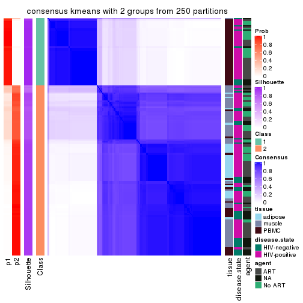</p>

</div>
<div id='tab-ATC-kmeans-consensus-heatmap-2'>
<pre><code class="r">consensus_heatmap(res, k = 3)
</code></pre>

<p>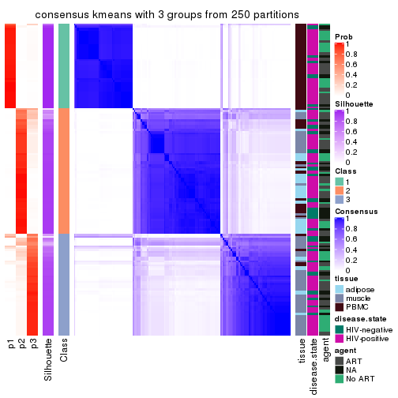</p>

</div>
<div id='tab-ATC-kmeans-consensus-heatmap-3'>
<pre><code class="r">consensus_heatmap(res, k = 4)
</code></pre>

<p>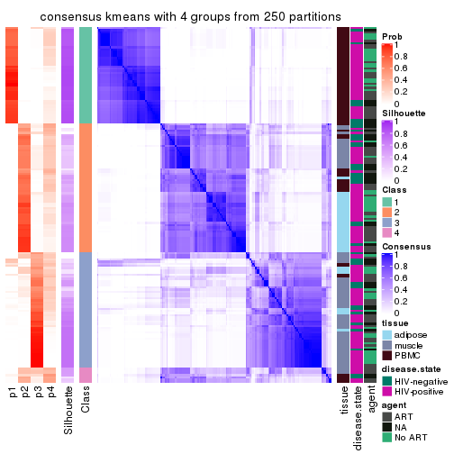</p>

</div>
<div id='tab-ATC-kmeans-consensus-heatmap-4'>
<pre><code class="r">consensus_heatmap(res, k = 5)
</code></pre>

<p>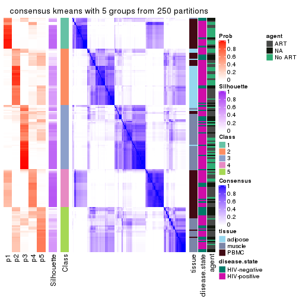</p>

</div>
<div id='tab-ATC-kmeans-consensus-heatmap-5'>
<pre><code class="r">consensus_heatmap(res, k = 6)
</code></pre>

<p>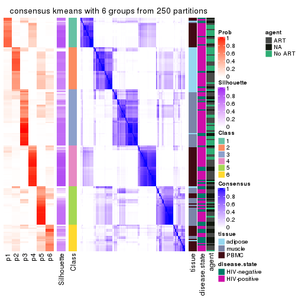</p>

</div>
</div>

Heatmaps for the membership of samples in all partitions to see how consistent they are:


<script>
$( function() {
	$( '#tabs-ATC-kmeans-membership-heatmap' ).tabs();
} );
</script>
<div id='tabs-ATC-kmeans-membership-heatmap'>
<ul>
<li><a href='#tab-ATC-kmeans-membership-heatmap-1'>k = 2</a></li>
<li><a href='#tab-ATC-kmeans-membership-heatmap-2'>k = 3</a></li>
<li><a href='#tab-ATC-kmeans-membership-heatmap-3'>k = 4</a></li>
<li><a href='#tab-ATC-kmeans-membership-heatmap-4'>k = 5</a></li>
<li><a href='#tab-ATC-kmeans-membership-heatmap-5'>k = 6</a></li>
</ul>
<div id='tab-ATC-kmeans-membership-heatmap-1'>
<pre><code class="r">membership_heatmap(res, k = 2)
</code></pre>

<p>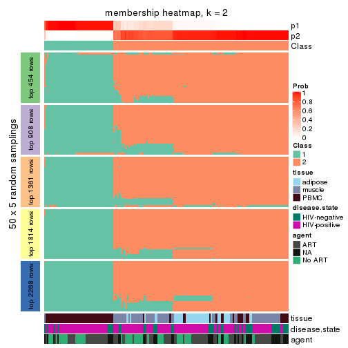</p>

</div>
<div id='tab-ATC-kmeans-membership-heatmap-2'>
<pre><code class="r">membership_heatmap(res, k = 3)
</code></pre>

<p>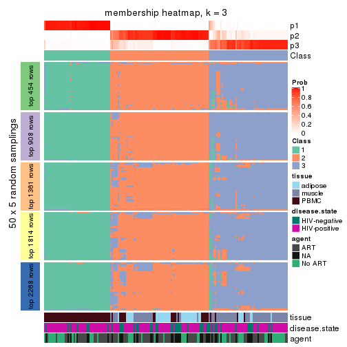</p>

</div>
<div id='tab-ATC-kmeans-membership-heatmap-3'>
<pre><code class="r">membership_heatmap(res, k = 4)
</code></pre>

<p>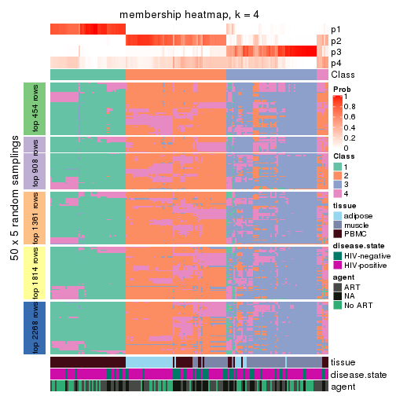</p>

</div>
<div id='tab-ATC-kmeans-membership-heatmap-4'>
<pre><code class="r">membership_heatmap(res, k = 5)
</code></pre>

<p>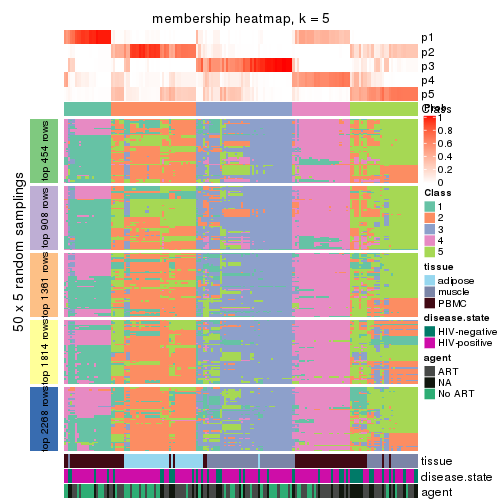</p>

</div>
<div id='tab-ATC-kmeans-membership-heatmap-5'>
<pre><code class="r">membership_heatmap(res, k = 6)
</code></pre>

<p>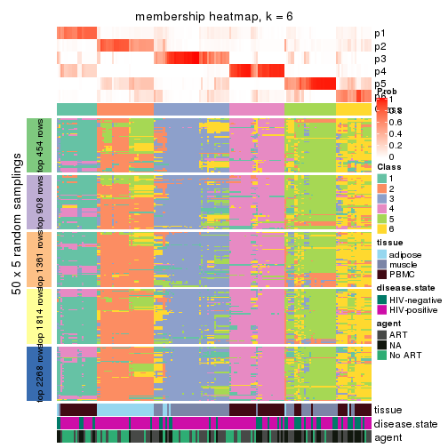</p>

</div>
</div>

As soon as we have had the classes for columns, we can look for signatures
which are significantly different between classes which can be candidate marks
for certain classes. Following are the heatmaps for signatures.


Signature heatmaps where rows are scaled:


<script>
$( function() {
	$( '#tabs-ATC-kmeans-get-signatures' ).tabs();
} );
</script>
<div id='tabs-ATC-kmeans-get-signatures'>
<ul>
<li><a href='#tab-ATC-kmeans-get-signatures-1'>k = 2</a></li>
<li><a href='#tab-ATC-kmeans-get-signatures-2'>k = 3</a></li>
<li><a href='#tab-ATC-kmeans-get-signatures-3'>k = 4</a></li>
<li><a href='#tab-ATC-kmeans-get-signatures-4'>k = 5</a></li>
<li><a href='#tab-ATC-kmeans-get-signatures-5'>k = 6</a></li>
</ul>
<div id='tab-ATC-kmeans-get-signatures-1'>
<pre><code class="r">get_signatures(res, k = 2)
</code></pre>

<p>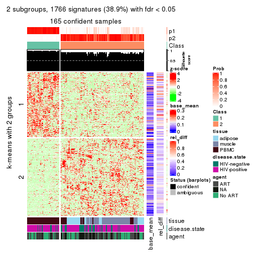</p>

</div>
<div id='tab-ATC-kmeans-get-signatures-2'>
<pre><code class="r">get_signatures(res, k = 3)
</code></pre>

<p>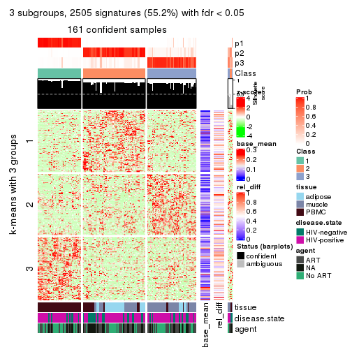</p>

</div>
<div id='tab-ATC-kmeans-get-signatures-3'>
<pre><code class="r">get_signatures(res, k = 4)
</code></pre>

<p>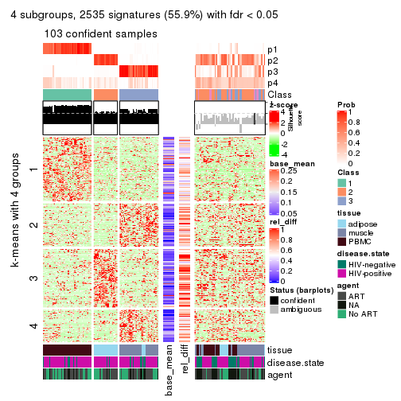</p>

</div>
<div id='tab-ATC-kmeans-get-signatures-4'>
<pre><code class="r">get_signatures(res, k = 5)
</code></pre>

<p>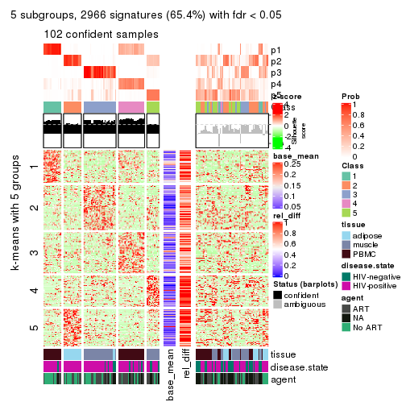</p>

</div>
<div id='tab-ATC-kmeans-get-signatures-5'>
<pre><code class="r">get_signatures(res, k = 6)
</code></pre>

<p>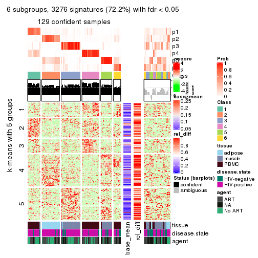</p>

</div>
</div>


Signature heatmaps where rows are not scaled:


<script>
$( function() {
	$( '#tabs-ATC-kmeans-get-signatures-no-scale' ).tabs();
} );
</script>
<div id='tabs-ATC-kmeans-get-signatures-no-scale'>
<ul>
<li><a href='#tab-ATC-kmeans-get-signatures-no-scale-1'>k = 2</a></li>
<li><a href='#tab-ATC-kmeans-get-signatures-no-scale-2'>k = 3</a></li>
<li><a href='#tab-ATC-kmeans-get-signatures-no-scale-3'>k = 4</a></li>
<li><a href='#tab-ATC-kmeans-get-signatures-no-scale-4'>k = 5</a></li>
<li><a href='#tab-ATC-kmeans-get-signatures-no-scale-5'>k = 6</a></li>
</ul>
<div id='tab-ATC-kmeans-get-signatures-no-scale-1'>
<pre><code class="r">get_signatures(res, k = 2, scale_rows = FALSE)
</code></pre>

<p>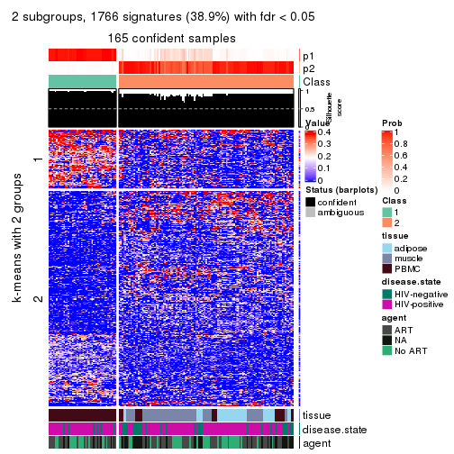</p>

</div>
<div id='tab-ATC-kmeans-get-signatures-no-scale-2'>
<pre><code class="r">get_signatures(res, k = 3, scale_rows = FALSE)
</code></pre>

<p>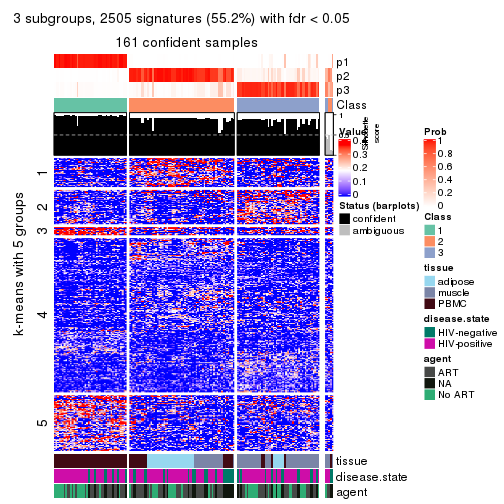</p>

</div>
<div id='tab-ATC-kmeans-get-signatures-no-scale-3'>
<pre><code class="r">get_signatures(res, k = 4, scale_rows = FALSE)
</code></pre>

<p>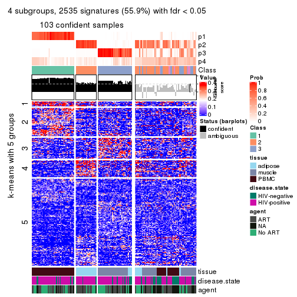</p>

</div>
<div id='tab-ATC-kmeans-get-signatures-no-scale-4'>
<pre><code class="r">get_signatures(res, k = 5, scale_rows = FALSE)
</code></pre>

<p>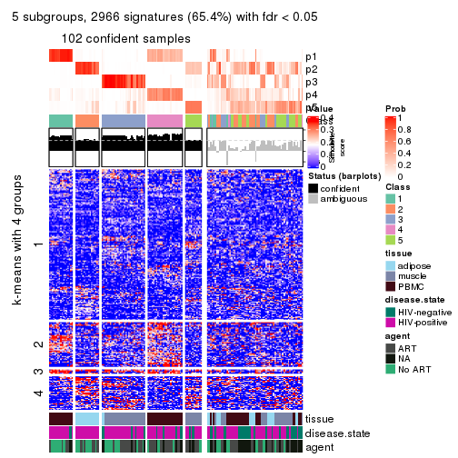</p>

</div>
<div id='tab-ATC-kmeans-get-signatures-no-scale-5'>
<pre><code class="r">get_signatures(res, k = 6, scale_rows = FALSE)
</code></pre>

<p>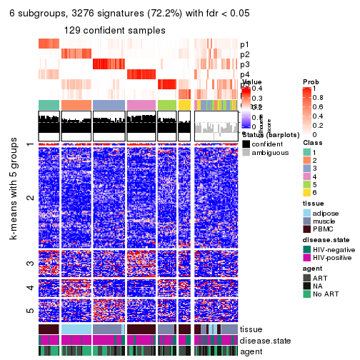</p>

</div>
</div>


Compare the overlap of signatures from different k:

```r
compare_signatures(res)
```

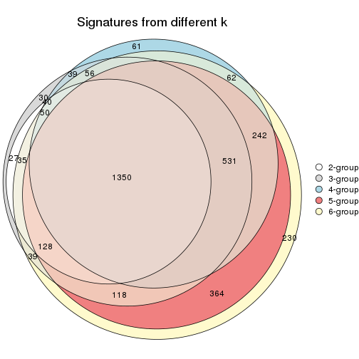

`get_signature()` returns a data frame invisibly. TO get the list of signatures, the function
call should be assigned to a variable explicitly. In following code, if `plot` argument is set
to `FALSE`, no heatmap is plotted while only the differential analysis is performed.

```r
# code only for demonstration
tb = get_signature(res, k = ..., plot = FALSE)
```

An example of the output of `tb` is:

```
#>   which_row         fdr    mean_1    mean_2 scaled_mean_1 scaled_mean_2 km
#> 1        38 0.042760348  8.373488  9.131774    -0.5533452     0.5164555  1
#> 2        40 0.018707592  7.106213  8.469186    -0.6173731     0.5762149  1
#> 3        55 0.019134737 10.221463 11.207825    -0.6159697     0.5749050  1
#> 4        59 0.006059896  5.921854  7.869574    -0.6899429     0.6439467  1
#> 5        60 0.018055526  8.928898 10.211722    -0.6204761     0.5791110  1
#> 6        98 0.009384629 15.714769 14.887706     0.6635654    -0.6193277  2
...
```

The columns in `tb` are:

1. `which_row`: row indices corresponding to the input matrix.
2. `fdr`: FDR for the differential test. 
3. `mean_x`: The mean value in group x.
4. `scaled_mean_x`: The mean value in group x after rows are scaled.
5. `km`: Row groups if k-means clustering is applied to rows.


UMAP plot which shows how samples are separated.


<script>
$( function() {
	$( '#tabs-ATC-kmeans-dimension-reduction' ).tabs();
} );
</script>
<div id='tabs-ATC-kmeans-dimension-reduction'>
<ul>
<li><a href='#tab-ATC-kmeans-dimension-reduction-1'>k = 2</a></li>
<li><a href='#tab-ATC-kmeans-dimension-reduction-2'>k = 3</a></li>
<li><a href='#tab-ATC-kmeans-dimension-reduction-3'>k = 4</a></li>
<li><a href='#tab-ATC-kmeans-dimension-reduction-4'>k = 5</a></li>
<li><a href='#tab-ATC-kmeans-dimension-reduction-5'>k = 6</a></li>
</ul>
<div id='tab-ATC-kmeans-dimension-reduction-1'>
<pre><code class="r">dimension_reduction(res, k = 2, method = &quot;UMAP&quot;)
</code></pre>

<p>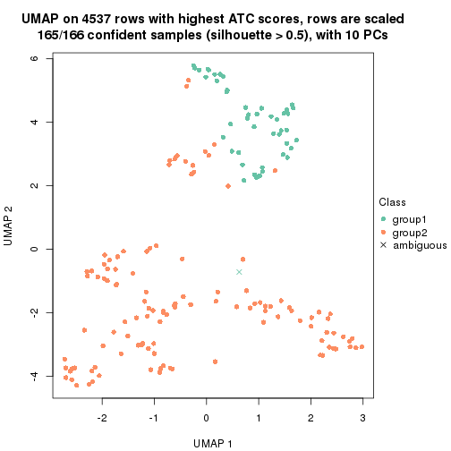</p>

</div>
<div id='tab-ATC-kmeans-dimension-reduction-2'>
<pre><code class="r">dimension_reduction(res, k = 3, method = &quot;UMAP&quot;)
</code></pre>

<p>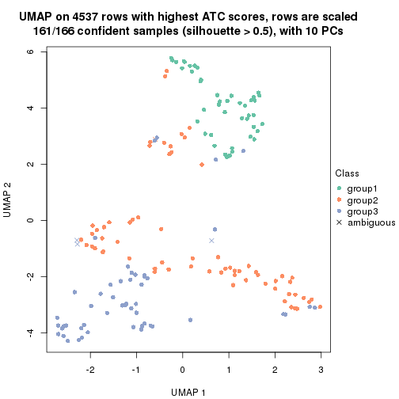</p>

</div>
<div id='tab-ATC-kmeans-dimension-reduction-3'>
<pre><code class="r">dimension_reduction(res, k = 4, method = &quot;UMAP&quot;)
</code></pre>

<p>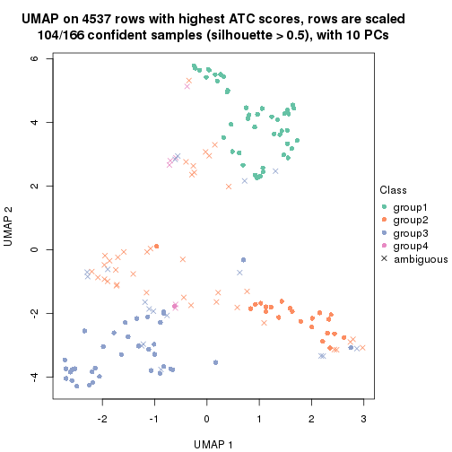</p>

</div>
<div id='tab-ATC-kmeans-dimension-reduction-4'>
<pre><code class="r">dimension_reduction(res, k = 5, method = &quot;UMAP&quot;)
</code></pre>

<p>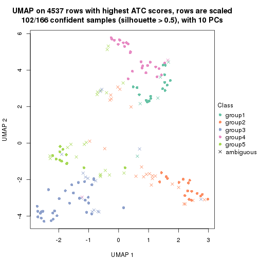</p>

</div>
<div id='tab-ATC-kmeans-dimension-reduction-5'>
<pre><code class="r">dimension_reduction(res, k = 6, method = &quot;UMAP&quot;)
</code></pre>

<p>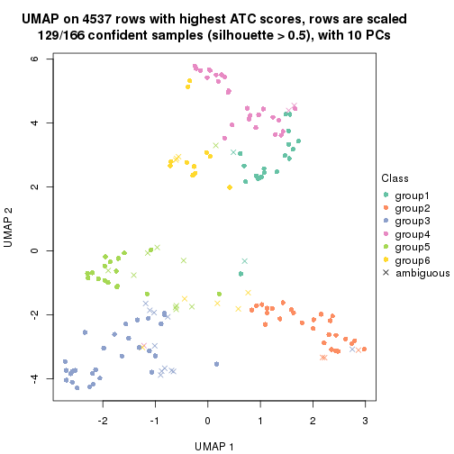</p>

</div>
</div>


Following heatmap shows how subgroups are split when increasing `k`:

```r
collect_classes(res)
```

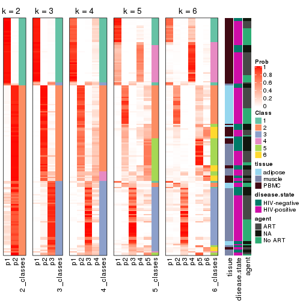


Test correlation between subgroups and known annotations. If the known
annotation is numeric, one-way ANOVA test is applied, and if the known
annotation is discrete, chi-squared contingency table test is applied.

```r
test_to_known_factors(res)
```

```
#>              n tissue(p) disease.state(p) agent(p) k
#> ATC:kmeans 165  5.52e-21            0.139   0.2205 2
#> ATC:kmeans 161  1.05e-25            0.185   0.1813 3
#> ATC:kmeans 104  9.64e-37            0.578   0.7308 4
#> ATC:kmeans 102  1.14e-36            0.323   0.0472 5
#> ATC:kmeans 129  9.20e-44            0.212   0.1239 6
```


If matrix rows can be associated to genes, consider to use `GO_Enrichment(res,
...)` to perform function enrichment for the signature genes.


 

---------------------------------------------------


### ATC:skmeans*


The object with results only for a single top-value method and a single partition method 
can be extracted as:

```r
res = res_list["ATC", "skmeans"]
# you can also extract it by
# res = res_list["ATC:skmeans"]
```

A summary of `res` and all the functions that can be applied to it:

```r
res
```

```
#> A 'ConsensusPartition' object with k = 2, 3, 4, 5, 6.
#>   On a matrix with 4537 rows and 166 columns.
#>   Top rows (454, 908, 1361, 1814, 2268) are extracted by 'ATC' method.
#>   Subgroups are detected by 'skmeans' method.
#>   Performed in total 1250 partitions by row resampling.
#>   Best k for subgroups seems to be 2.
#> 
#> Following methods can be applied to this 'ConsensusPartition' object:
#>  [1] "cola_report"             "collect_classes"         "collect_plots"          
#>  [4] "collect_stats"           "colnames"                "compare_signatures"     
#>  [7] "consensus_heatmap"       "dimension_reduction"     "functional_enrichment"  
#> [10] "get_anno_col"            "get_anno"                "get_classes"            
#> [13] "get_consensus"           "get_matrix"              "get_membership"         
#> [16] "get_param"               "get_signatures"          "get_stats"              
#> [19] "is_best_k"               "is_stable_k"             "membership_heatmap"     
#> [22] "ncol"                    "nrow"                    "plot_ecdf"              
#> [25] "rownames"                "select_partition_number" "show"                   
#> [28] "suggest_best_k"          "test_to_known_factors"
```

`collect_plots()` function collects all the plots made from `res` for all `k` (number of partitions)
into one single page to provide an easy and fast comparison between different `k`.

```r
collect_plots(res)
```

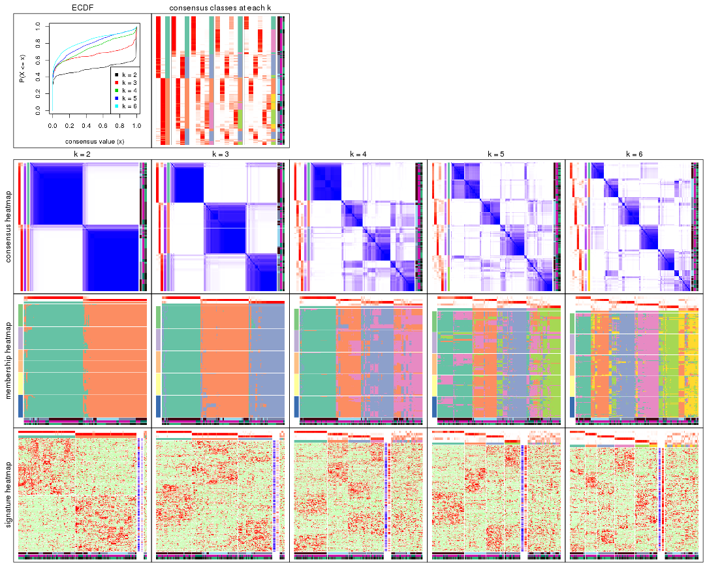

The plots are:

- The first row: a plot of the ECDF (Empirical cumulative distribution
  function) curves of the consensus matrix for each `k` and the heatmap of
  predicted classes for each `k`.
- The second row: heatmaps of the consensus matrix for each `k`.
- The third row: heatmaps of the membership matrix for each `k`.
- The fouth row: heatmaps of the signatures for each `k`.

All the plots in panels can be made by individual functions and they are
plotted later in this section.

`select_partition_number()` produces several plots showing different
statistics for choosing "optimized" `k`. There are following statistics:

- ECDF curves of the consensus matrix for each `k`;
- 1-PAC. [The PAC
  score](https://en.wikipedia.org/wiki/Consensus_clustering#Over-interpretation_potential_of_consensus_clustering)
  measures the proportion of the ambiguous subgrouping.
- Mean silhouette score.
- Concordance. The mean probability of fiting the consensus class ids in all
  partitions.
- Area increased. Denote $A_k$ as the area under the ECDF curve for current
  `k`, the area increased is defined as $A_k - A_{k-1}$.
- Rand index. The percent of pairs of samples that are both in a same cluster
  or both are not in a same cluster in the partition of k and k-1.
- Jaccard index. The ratio of pairs of samples are both in a same cluster in
  the partition of k and k-1 and the pairs of samples are both in a same
  cluster in the partition k or k-1.

The detailed explanations of these statistics can be found in [the cola
vignette](http://bioconductor.org/packages/devel/bioc/vignettes/cola/inst/doc/cola.html#toc_13).

Generally speaking, lower PAC score, higher mean silhouette score or higher
concordance corresponds to better partition. Rand index and Jaccard index
measure how similar the current partition is compared to partition with `k-1`.
If they are too similar, we won't accept `k` is better than `k-1`.

```r
select_partition_number(res)
```

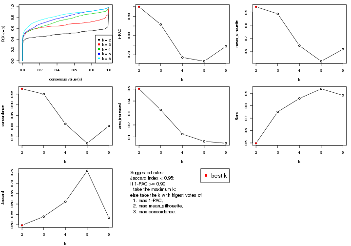

The numeric values for all these statistics can be obtained by `get_stats()`.

```r
get_stats(res)
```

```
#>   k 1-PAC mean_silhouette concordance area_increased  Rand Jaccard
#> 2 2 0.950           0.940       0.975         0.5021 0.498   0.498
#> 3 3 0.858           0.886       0.950         0.3257 0.751   0.540
#> 4 4 0.686           0.646       0.811         0.1238 0.859   0.612
#> 5 5 0.666           0.528       0.721         0.0629 0.937   0.760
#> 6 6 0.744           0.618       0.801         0.0469 0.884   0.534
```

`suggest_best_k()` suggests the best $k$ based on these statistics. The rules are as follows:

- All $k$ with Jaccard index larger than 0.95 are removed because the increase of
  the partition number does not provides enough extra information. If all $k$ are removed,
  the best $k$ is assigned by `NA`.
- For $k$ with 1-PAC larger than 0.9, the maximal $k$ is taken as the "best k". Other $k$ is called "optional k".
- If it does not fit the second rule. The $k$ with the highest vote of highest
  1-PAC, mean silhouette and concordance is taken as the "best k".

```r
suggest_best_k(res)
```

```
#> [1] 2
```


Following shows the table of the partitions (You need to click the **show/hide
code output** link to see it). The membership matrix (columns with name `p*`)
is inferred by
[`clue::cl_consensus()`](https://www.rdocumentation.org/link/cl_consensus?package=clue)
function with the `SE` method. Basically the value in the membership matrix
represents the probability to belong to a certain group. The finall class
label for an item is determined with the group with highest probability it
belongs to.

In `get_classes()` function, the entropy is calculated from the membership
matrix and the silhouette score is calculated from the consensus matrix.


<script>
$( function() {
	$( '#tabs-ATC-skmeans-get-classes' ).tabs();
} );
</script>
<div id='tabs-ATC-skmeans-get-classes'>
<ul>
<li><a href='#tab-ATC-skmeans-get-classes-1'>k = 2</a></li>
<li><a href='#tab-ATC-skmeans-get-classes-2'>k = 3</a></li>
<li><a href='#tab-ATC-skmeans-get-classes-3'>k = 4</a></li>
<li><a href='#tab-ATC-skmeans-get-classes-4'>k = 5</a></li>
<li><a href='#tab-ATC-skmeans-get-classes-5'>k = 6</a></li>
</ul>

<div id='tab-ATC-skmeans-get-classes-1'>
<p><a id='tab-ATC-skmeans-get-classes-1-a' style='color:#0366d6' href='#'>show/hide code output</a></p>
<pre><code class="r">cbind(get_classes(res, k = 2), get_membership(res, k = 2))
</code></pre>

<pre><code>#&gt;           class entropy silhouette    p1    p2
#&gt; GSM751298     1  0.0000      0.974 1.000 0.000
#&gt; GSM751304     2  0.0376      0.971 0.004 0.996
#&gt; GSM751305     2  0.0376      0.971 0.004 0.996
#&gt; GSM751307     2  0.0000      0.974 0.000 1.000
#&gt; GSM751310     1  0.0000      0.974 1.000 0.000
#&gt; GSM751314     1  0.0000      0.974 1.000 0.000
#&gt; GSM751316     1  0.0000      0.974 1.000 0.000
#&gt; GSM751318     1  0.0000      0.974 1.000 0.000
#&gt; GSM751342     1  0.1184      0.962 0.984 0.016
#&gt; GSM751346     1  0.0000      0.974 1.000 0.000
#&gt; GSM751347     1  0.0376      0.971 0.996 0.004
#&gt; GSM751348     2  0.0000      0.974 0.000 1.000
#&gt; GSM751349     2  0.0000      0.974 0.000 1.000
#&gt; GSM751352     2  0.0000      0.974 0.000 1.000
#&gt; GSM751353     2  0.0000      0.974 0.000 1.000
#&gt; GSM751354     2  0.0000      0.974 0.000 1.000
#&gt; GSM751355     2  0.0000      0.974 0.000 1.000
#&gt; GSM751358     2  0.0000      0.974 0.000 1.000
#&gt; GSM751359     2  0.0000      0.974 0.000 1.000
#&gt; GSM751294     2  0.0000      0.974 0.000 1.000
#&gt; GSM751296     1  0.0000      0.974 1.000 0.000
#&gt; GSM751297     1  0.0000      0.974 1.000 0.000
#&gt; GSM751299     2  0.0000      0.974 0.000 1.000
#&gt; GSM751300     1  0.0000      0.974 1.000 0.000
#&gt; GSM751301     2  0.0376      0.971 0.004 0.996
#&gt; GSM751302     1  0.0000      0.974 1.000 0.000
#&gt; GSM751303     1  0.0000      0.974 1.000 0.000
#&gt; GSM751306     1  0.0000      0.974 1.000 0.000
#&gt; GSM751308     1  0.0000      0.974 1.000 0.000
#&gt; GSM751309     1  0.0000      0.974 1.000 0.000
#&gt; GSM751311     1  0.0000      0.974 1.000 0.000
#&gt; GSM751312     1  0.0000      0.974 1.000 0.000
#&gt; GSM751313     1  0.0000      0.974 1.000 0.000
#&gt; GSM751315     1  0.0000      0.974 1.000 0.000
#&gt; GSM751317     1  0.0000      0.974 1.000 0.000
#&gt; GSM751320     1  0.0000      0.974 1.000 0.000
#&gt; GSM751321     1  0.0000      0.974 1.000 0.000
#&gt; GSM751322     1  0.0000      0.974 1.000 0.000
#&gt; GSM751324     1  0.0000      0.974 1.000 0.000
#&gt; GSM751325     1  0.0000      0.974 1.000 0.000
#&gt; GSM751332     1  0.0000      0.974 1.000 0.000
#&gt; GSM751334     1  0.0000      0.974 1.000 0.000
#&gt; GSM751339     1  0.0000      0.974 1.000 0.000
#&gt; GSM751341     1  0.0000      0.974 1.000 0.000
#&gt; GSM751343     1  0.0000      0.974 1.000 0.000
#&gt; GSM751344     2  0.0000      0.974 0.000 1.000
#&gt; GSM751345     2  0.0000      0.974 0.000 1.000
#&gt; GSM751356     2  0.0000      0.974 0.000 1.000
#&gt; GSM751357     2  0.0000      0.974 0.000 1.000
#&gt; GSM751293     2  0.0376      0.971 0.004 0.996
#&gt; GSM751295     1  0.0000      0.974 1.000 0.000
#&gt; GSM751319     1  0.0000      0.974 1.000 0.000
#&gt; GSM751323     1  0.0000      0.974 1.000 0.000
#&gt; GSM751326     1  0.0000      0.974 1.000 0.000
#&gt; GSM751327     1  0.0000      0.974 1.000 0.000
#&gt; GSM751328     1  0.0000      0.974 1.000 0.000
#&gt; GSM751329     1  0.0000      0.974 1.000 0.000
#&gt; GSM751330     1  0.0000      0.974 1.000 0.000
#&gt; GSM751331     1  0.0000      0.974 1.000 0.000
#&gt; GSM751333     1  0.0000      0.974 1.000 0.000
#&gt; GSM751335     1  0.0000      0.974 1.000 0.000
#&gt; GSM751336     1  0.0000      0.974 1.000 0.000
#&gt; GSM751337     1  0.0000      0.974 1.000 0.000
#&gt; GSM751338     1  0.0000      0.974 1.000 0.000
#&gt; GSM751340     1  0.0000      0.974 1.000 0.000
#&gt; GSM751350     1  0.0000      0.974 1.000 0.000
#&gt; GSM751351     1  0.0000      0.974 1.000 0.000
#&gt; GSM751362     1  0.0000      0.974 1.000 0.000
#&gt; GSM751363     2  0.1633      0.954 0.024 0.976
#&gt; GSM751367     1  0.0000      0.974 1.000 0.000
#&gt; GSM751368     2  0.0000      0.974 0.000 1.000
#&gt; GSM751371     1  0.0000      0.974 1.000 0.000
#&gt; GSM751375     2  0.0000      0.974 0.000 1.000
#&gt; GSM751376     2  0.0000      0.974 0.000 1.000
#&gt; GSM751378     2  0.0000      0.974 0.000 1.000
#&gt; GSM751379     2  0.0000      0.974 0.000 1.000
#&gt; GSM751382     2  0.0000      0.974 0.000 1.000
#&gt; GSM751386     2  0.0000      0.974 0.000 1.000
#&gt; GSM751388     2  0.0000      0.974 0.000 1.000
#&gt; GSM751391     2  0.9427      0.449 0.360 0.640
#&gt; GSM751410     1  0.0000      0.974 1.000 0.000
#&gt; GSM751414     1  0.0000      0.974 1.000 0.000
#&gt; GSM751361     2  0.0376      0.971 0.004 0.996
#&gt; GSM751365     1  0.6973      0.769 0.812 0.188
#&gt; GSM751366     1  0.0000      0.974 1.000 0.000
#&gt; GSM751369     1  0.0000      0.974 1.000 0.000
#&gt; GSM751370     1  0.0000      0.974 1.000 0.000
#&gt; GSM751372     1  0.4022      0.902 0.920 0.080
#&gt; GSM751373     1  0.0000      0.974 1.000 0.000
#&gt; GSM751374     2  0.0000      0.974 0.000 1.000
#&gt; GSM751377     2  0.0000      0.974 0.000 1.000
#&gt; GSM751380     1  0.0000      0.974 1.000 0.000
#&gt; GSM751381     2  0.0000      0.974 0.000 1.000
#&gt; GSM751383     2  0.0000      0.974 0.000 1.000
#&gt; GSM751384     2  0.0000      0.974 0.000 1.000
#&gt; GSM751385     2  0.0000      0.974 0.000 1.000
#&gt; GSM751387     2  0.0000      0.974 0.000 1.000
#&gt; GSM751389     2  0.6247      0.809 0.156 0.844
#&gt; GSM751393     2  0.0000      0.974 0.000 1.000
#&gt; GSM751394     2  0.0000      0.974 0.000 1.000
#&gt; GSM751395     2  0.0000      0.974 0.000 1.000
#&gt; GSM751397     2  0.0000      0.974 0.000 1.000
#&gt; GSM751398     2  0.0000      0.974 0.000 1.000
#&gt; GSM751404     1  0.0376      0.971 0.996 0.004
#&gt; GSM751406     1  0.2236      0.946 0.964 0.036
#&gt; GSM751411     1  0.9209      0.508 0.664 0.336
#&gt; GSM751413     2  0.0376      0.971 0.004 0.996
#&gt; GSM751415     1  0.0000      0.974 1.000 0.000
#&gt; GSM751416     2  0.1184      0.961 0.016 0.984
#&gt; GSM751417     2  0.0376      0.971 0.004 0.996
#&gt; GSM751421     1  0.0000      0.974 1.000 0.000
#&gt; GSM751422     1  0.0000      0.974 1.000 0.000
#&gt; GSM751360     1  0.0672      0.968 0.992 0.008
#&gt; GSM751364     1  0.9963      0.150 0.536 0.464
#&gt; GSM751390     2  0.0000      0.974 0.000 1.000
#&gt; GSM751392     2  0.0000      0.974 0.000 1.000
#&gt; GSM751396     2  0.0000      0.974 0.000 1.000
#&gt; GSM751399     2  0.9896      0.213 0.440 0.560
#&gt; GSM751400     2  0.5059      0.863 0.112 0.888
#&gt; GSM751401     1  0.0376      0.971 0.996 0.004
#&gt; GSM751402     1  0.0376      0.971 0.996 0.004
#&gt; GSM751403     1  0.8555      0.616 0.720 0.280
#&gt; GSM751405     1  0.2236      0.946 0.964 0.036
#&gt; GSM751407     1  0.2603      0.939 0.956 0.044
#&gt; GSM751408     1  0.9580      0.395 0.620 0.380
#&gt; GSM751409     2  0.5629      0.840 0.132 0.868
#&gt; GSM751412     1  0.3431      0.920 0.936 0.064
#&gt; GSM751418     1  0.1184      0.962 0.984 0.016
#&gt; GSM751419     1  0.1633      0.956 0.976 0.024
#&gt; GSM751420     2  0.8016      0.682 0.244 0.756
#&gt; GSM751425     2  0.0000      0.974 0.000 1.000
#&gt; GSM751429     1  0.0376      0.971 0.996 0.004
#&gt; GSM751430     2  0.0000      0.974 0.000 1.000
#&gt; GSM751433     2  0.0000      0.974 0.000 1.000
#&gt; GSM751437     1  0.2423      0.943 0.960 0.040
#&gt; GSM751448     1  0.0376      0.971 0.996 0.004
#&gt; GSM751451     2  0.0376      0.971 0.004 0.996
#&gt; GSM751423     2  0.0000      0.974 0.000 1.000
#&gt; GSM751424     2  0.0000      0.974 0.000 1.000
#&gt; GSM751428     2  0.0000      0.974 0.000 1.000
#&gt; GSM751431     2  0.0000      0.974 0.000 1.000
#&gt; GSM751432     2  0.0000      0.974 0.000 1.000
#&gt; GSM751434     2  0.0000      0.974 0.000 1.000
#&gt; GSM751435     2  0.0000      0.974 0.000 1.000
#&gt; GSM751436     2  0.0000      0.974 0.000 1.000
#&gt; GSM751440     2  0.0000      0.974 0.000 1.000
#&gt; GSM751444     2  0.0000      0.974 0.000 1.000
#&gt; GSM751446     2  0.0000      0.974 0.000 1.000
#&gt; GSM751449     2  0.0000      0.974 0.000 1.000
#&gt; GSM751450     2  0.0000      0.974 0.000 1.000
#&gt; GSM751452     2  0.0000      0.974 0.000 1.000
#&gt; GSM751426     2  0.0000      0.974 0.000 1.000
#&gt; GSM751427     2  0.0000      0.974 0.000 1.000
#&gt; GSM751438     2  0.0000      0.974 0.000 1.000
#&gt; GSM751439     2  0.9170      0.512 0.332 0.668
#&gt; GSM751441     2  0.0000      0.974 0.000 1.000
#&gt; GSM751442     2  0.0000      0.974 0.000 1.000
#&gt; GSM751443     2  0.9000      0.547 0.316 0.684
#&gt; GSM751445     2  0.0000      0.974 0.000 1.000
#&gt; GSM751447     2  0.0000      0.974 0.000 1.000
#&gt; GSM751453     2  0.0000      0.974 0.000 1.000
#&gt; GSM751454     2  0.0000      0.974 0.000 1.000
#&gt; GSM751455     2  0.0000      0.974 0.000 1.000
#&gt; GSM751456     2  0.0000      0.974 0.000 1.000
#&gt; GSM751457     2  0.0000      0.974 0.000 1.000
#&gt; GSM751458     2  0.0000      0.974 0.000 1.000
</code></pre>

<script>
$('#tab-ATC-skmeans-get-classes-1-a').parent().next().next().hide();
$('#tab-ATC-skmeans-get-classes-1-a').click(function(){
  $('#tab-ATC-skmeans-get-classes-1-a').parent().next().next().toggle();
  return(false);
});
</script>
</div>

<div id='tab-ATC-skmeans-get-classes-2'>
<p><a id='tab-ATC-skmeans-get-classes-2-a' style='color:#0366d6' href='#'>show/hide code output</a></p>
<pre><code class="r">cbind(get_classes(res, k = 3), get_membership(res, k = 3))
</code></pre>

<pre><code>#&gt;           class entropy silhouette    p1    p2    p3
#&gt; GSM751298     1  0.0000     0.9533 1.000 0.000 0.000
#&gt; GSM751304     2  0.3412     0.8543 0.000 0.876 0.124
#&gt; GSM751305     2  0.3116     0.8709 0.000 0.892 0.108
#&gt; GSM751307     2  0.0000     0.9523 0.000 1.000 0.000
#&gt; GSM751310     1  0.0000     0.9533 1.000 0.000 0.000
#&gt; GSM751314     1  0.0000     0.9533 1.000 0.000 0.000
#&gt; GSM751316     1  0.0000     0.9533 1.000 0.000 0.000
#&gt; GSM751318     1  0.0000     0.9533 1.000 0.000 0.000
#&gt; GSM751342     1  0.0237     0.9496 0.996 0.004 0.000
#&gt; GSM751346     1  0.0000     0.9533 1.000 0.000 0.000
#&gt; GSM751347     1  0.5831     0.6067 0.708 0.008 0.284
#&gt; GSM751348     2  0.0000     0.9523 0.000 1.000 0.000
#&gt; GSM751349     2  0.0000     0.9523 0.000 1.000 0.000
#&gt; GSM751352     2  0.0747     0.9451 0.000 0.984 0.016
#&gt; GSM751353     2  0.0000     0.9523 0.000 1.000 0.000
#&gt; GSM751354     2  0.2796     0.8866 0.000 0.908 0.092
#&gt; GSM751355     2  0.0000     0.9523 0.000 1.000 0.000
#&gt; GSM751358     3  0.6432     0.2586 0.004 0.428 0.568
#&gt; GSM751359     2  0.1289     0.9390 0.000 0.968 0.032
#&gt; GSM751294     3  0.1964     0.9050 0.000 0.056 0.944
#&gt; GSM751296     1  0.0000     0.9533 1.000 0.000 0.000
#&gt; GSM751297     1  0.5621     0.5698 0.692 0.000 0.308
#&gt; GSM751299     2  0.1031     0.9410 0.000 0.976 0.024
#&gt; GSM751300     1  0.0000     0.9533 1.000 0.000 0.000
#&gt; GSM751301     2  0.0237     0.9505 0.004 0.996 0.000
#&gt; GSM751302     1  0.0000     0.9533 1.000 0.000 0.000
#&gt; GSM751303     1  0.0000     0.9533 1.000 0.000 0.000
#&gt; GSM751306     1  0.0000     0.9533 1.000 0.000 0.000
#&gt; GSM751308     1  0.6286     0.1628 0.536 0.000 0.464
#&gt; GSM751309     1  0.0000     0.9533 1.000 0.000 0.000
#&gt; GSM751311     1  0.0000     0.9533 1.000 0.000 0.000
#&gt; GSM751312     1  0.0000     0.9533 1.000 0.000 0.000
#&gt; GSM751313     1  0.0000     0.9533 1.000 0.000 0.000
#&gt; GSM751315     1  0.0000     0.9533 1.000 0.000 0.000
#&gt; GSM751317     1  0.0000     0.9533 1.000 0.000 0.000
#&gt; GSM751320     1  0.0000     0.9533 1.000 0.000 0.000
#&gt; GSM751321     1  0.0000     0.9533 1.000 0.000 0.000
#&gt; GSM751322     1  0.0000     0.9533 1.000 0.000 0.000
#&gt; GSM751324     1  0.0000     0.9533 1.000 0.000 0.000
#&gt; GSM751325     1  0.0000     0.9533 1.000 0.000 0.000
#&gt; GSM751332     1  0.0000     0.9533 1.000 0.000 0.000
#&gt; GSM751334     1  0.0000     0.9533 1.000 0.000 0.000
#&gt; GSM751339     1  0.0237     0.9501 0.996 0.000 0.004
#&gt; GSM751341     1  0.0000     0.9533 1.000 0.000 0.000
#&gt; GSM751343     1  0.0000     0.9533 1.000 0.000 0.000
#&gt; GSM751344     2  0.0000     0.9523 0.000 1.000 0.000
#&gt; GSM751345     2  0.0000     0.9523 0.000 1.000 0.000
#&gt; GSM751356     2  0.4121     0.8000 0.000 0.832 0.168
#&gt; GSM751357     2  0.4062     0.8054 0.000 0.836 0.164
#&gt; GSM751293     2  0.0237     0.9505 0.004 0.996 0.000
#&gt; GSM751295     1  0.0000     0.9533 1.000 0.000 0.000
#&gt; GSM751319     1  0.0000     0.9533 1.000 0.000 0.000
#&gt; GSM751323     1  0.0000     0.9533 1.000 0.000 0.000
#&gt; GSM751326     1  0.0000     0.9533 1.000 0.000 0.000
#&gt; GSM751327     1  0.0000     0.9533 1.000 0.000 0.000
#&gt; GSM751328     1  0.0000     0.9533 1.000 0.000 0.000
#&gt; GSM751329     1  0.0000     0.9533 1.000 0.000 0.000
#&gt; GSM751330     1  0.0000     0.9533 1.000 0.000 0.000
#&gt; GSM751331     1  0.0000     0.9533 1.000 0.000 0.000
#&gt; GSM751333     1  0.0000     0.9533 1.000 0.000 0.000
#&gt; GSM751335     1  0.0000     0.9533 1.000 0.000 0.000
#&gt; GSM751336     1  0.0000     0.9533 1.000 0.000 0.000
#&gt; GSM751337     1  0.0000     0.9533 1.000 0.000 0.000
#&gt; GSM751338     1  0.0000     0.9533 1.000 0.000 0.000
#&gt; GSM751340     1  0.1964     0.9064 0.944 0.000 0.056
#&gt; GSM751350     1  0.0000     0.9533 1.000 0.000 0.000
#&gt; GSM751351     1  0.0000     0.9533 1.000 0.000 0.000
#&gt; GSM751362     3  0.0000     0.9294 0.000 0.000 1.000
#&gt; GSM751363     2  0.3116     0.8771 0.000 0.892 0.108
#&gt; GSM751367     1  0.1529     0.9197 0.960 0.000 0.040
#&gt; GSM751368     2  0.1163     0.9410 0.000 0.972 0.028
#&gt; GSM751371     1  0.5363     0.6123 0.724 0.000 0.276
#&gt; GSM751375     2  0.0000     0.9523 0.000 1.000 0.000
#&gt; GSM751376     3  0.1289     0.9164 0.000 0.032 0.968
#&gt; GSM751378     3  0.2165     0.8988 0.000 0.064 0.936
#&gt; GSM751379     3  0.1289     0.9164 0.000 0.032 0.968
#&gt; GSM751382     2  0.0000     0.9523 0.000 1.000 0.000
#&gt; GSM751386     2  0.1411     0.9369 0.000 0.964 0.036
#&gt; GSM751388     2  0.1411     0.9369 0.000 0.964 0.036
#&gt; GSM751391     3  0.3116     0.8725 0.000 0.108 0.892
#&gt; GSM751410     3  0.0000     0.9294 0.000 0.000 1.000
#&gt; GSM751414     1  0.6308     0.0359 0.508 0.000 0.492
#&gt; GSM751361     3  0.6309    -0.0121 0.000 0.496 0.504
#&gt; GSM751365     3  0.0000     0.9294 0.000 0.000 1.000
#&gt; GSM751366     3  0.1031     0.9186 0.024 0.000 0.976
#&gt; GSM751369     3  0.0000     0.9294 0.000 0.000 1.000
#&gt; GSM751370     3  0.4555     0.7403 0.200 0.000 0.800
#&gt; GSM751372     3  0.0000     0.9294 0.000 0.000 1.000
#&gt; GSM751373     1  0.5835     0.4763 0.660 0.000 0.340
#&gt; GSM751374     3  0.1289     0.9164 0.000 0.032 0.968
#&gt; GSM751377     2  0.1643     0.9321 0.000 0.956 0.044
#&gt; GSM751380     3  0.0000     0.9294 0.000 0.000 1.000
#&gt; GSM751381     2  0.1411     0.9369 0.000 0.964 0.036
#&gt; GSM751383     2  0.1411     0.9369 0.000 0.964 0.036
#&gt; GSM751384     3  0.3412     0.8471 0.000 0.124 0.876
#&gt; GSM751385     2  0.5785     0.5299 0.000 0.668 0.332
#&gt; GSM751387     2  0.1411     0.9369 0.000 0.964 0.036
#&gt; GSM751389     3  0.0000     0.9294 0.000 0.000 1.000
#&gt; GSM751393     3  0.0000     0.9294 0.000 0.000 1.000
#&gt; GSM751394     2  0.1411     0.9369 0.000 0.964 0.036
#&gt; GSM751395     3  0.0237     0.9284 0.000 0.004 0.996
#&gt; GSM751397     2  0.2165     0.9179 0.000 0.936 0.064
#&gt; GSM751398     2  0.1643     0.9322 0.000 0.956 0.044
#&gt; GSM751404     3  0.0000     0.9294 0.000 0.000 1.000
#&gt; GSM751406     3  0.0000     0.9294 0.000 0.000 1.000
#&gt; GSM751411     3  0.0000     0.9294 0.000 0.000 1.000
#&gt; GSM751413     2  0.1163     0.9418 0.000 0.972 0.028
#&gt; GSM751415     3  0.0000     0.9294 0.000 0.000 1.000
#&gt; GSM751416     2  0.6302     0.0739 0.000 0.520 0.480
#&gt; GSM751417     2  0.6302     0.0739 0.000 0.520 0.480
#&gt; GSM751421     3  0.1643     0.9067 0.044 0.000 0.956
#&gt; GSM751422     3  0.1643     0.9067 0.044 0.000 0.956
#&gt; GSM751360     3  0.2796     0.8674 0.092 0.000 0.908
#&gt; GSM751364     3  0.3295     0.8735 0.008 0.096 0.896
#&gt; GSM751390     3  0.2959     0.8709 0.000 0.100 0.900
#&gt; GSM751392     2  0.1411     0.9369 0.000 0.964 0.036
#&gt; GSM751396     2  0.0424     0.9497 0.000 0.992 0.008
#&gt; GSM751399     3  0.0000     0.9294 0.000 0.000 1.000
#&gt; GSM751400     3  0.0000     0.9294 0.000 0.000 1.000
#&gt; GSM751401     3  0.0000     0.9294 0.000 0.000 1.000
#&gt; GSM751402     3  0.0000     0.9294 0.000 0.000 1.000
#&gt; GSM751403     3  0.0000     0.9294 0.000 0.000 1.000
#&gt; GSM751405     3  0.0000     0.9294 0.000 0.000 1.000
#&gt; GSM751407     3  0.0000     0.9294 0.000 0.000 1.000
#&gt; GSM751408     3  0.0000     0.9294 0.000 0.000 1.000
#&gt; GSM751409     3  0.0000     0.9294 0.000 0.000 1.000
#&gt; GSM751412     3  0.0000     0.9294 0.000 0.000 1.000
#&gt; GSM751418     3  0.4708     0.8244 0.120 0.036 0.844
#&gt; GSM751419     3  0.3572     0.8807 0.060 0.040 0.900
#&gt; GSM751420     3  0.0000     0.9294 0.000 0.000 1.000
#&gt; GSM751425     2  0.0000     0.9523 0.000 1.000 0.000
#&gt; GSM751429     3  0.5098     0.6440 0.248 0.000 0.752
#&gt; GSM751430     2  0.0000     0.9523 0.000 1.000 0.000
#&gt; GSM751433     2  0.0000     0.9523 0.000 1.000 0.000
#&gt; GSM751437     3  0.0000     0.9294 0.000 0.000 1.000
#&gt; GSM751448     3  0.0592     0.9240 0.012 0.000 0.988
#&gt; GSM751451     2  0.0000     0.9523 0.000 1.000 0.000
#&gt; GSM751423     2  0.0000     0.9523 0.000 1.000 0.000
#&gt; GSM751424     2  0.0000     0.9523 0.000 1.000 0.000
#&gt; GSM751428     2  0.0000     0.9523 0.000 1.000 0.000
#&gt; GSM751431     2  0.0000     0.9523 0.000 1.000 0.000
#&gt; GSM751432     2  0.0000     0.9523 0.000 1.000 0.000
#&gt; GSM751434     2  0.0000     0.9523 0.000 1.000 0.000
#&gt; GSM751435     2  0.0000     0.9523 0.000 1.000 0.000
#&gt; GSM751436     2  0.0000     0.9523 0.000 1.000 0.000
#&gt; GSM751440     2  0.0000     0.9523 0.000 1.000 0.000
#&gt; GSM751444     2  0.0000     0.9523 0.000 1.000 0.000
#&gt; GSM751446     2  0.0000     0.9523 0.000 1.000 0.000
#&gt; GSM751449     2  0.1529     0.9295 0.000 0.960 0.040
#&gt; GSM751450     2  0.0000     0.9523 0.000 1.000 0.000
#&gt; GSM751452     2  0.0000     0.9523 0.000 1.000 0.000
#&gt; GSM751426     2  0.0000     0.9523 0.000 1.000 0.000
#&gt; GSM751427     2  0.0000     0.9523 0.000 1.000 0.000
#&gt; GSM751438     2  0.4750     0.7118 0.000 0.784 0.216
#&gt; GSM751439     3  0.4178     0.7990 0.000 0.172 0.828
#&gt; GSM751441     2  0.0000     0.9523 0.000 1.000 0.000
#&gt; GSM751442     2  0.0237     0.9509 0.000 0.996 0.004
#&gt; GSM751443     3  0.1411     0.9140 0.000 0.036 0.964
#&gt; GSM751445     2  0.0000     0.9523 0.000 1.000 0.000
#&gt; GSM751447     2  0.0000     0.9523 0.000 1.000 0.000
#&gt; GSM751453     2  0.0000     0.9523 0.000 1.000 0.000
#&gt; GSM751454     2  0.0000     0.9523 0.000 1.000 0.000
#&gt; GSM751455     2  0.0237     0.9509 0.000 0.996 0.004
#&gt; GSM751456     2  0.0237     0.9509 0.000 0.996 0.004
#&gt; GSM751457     3  0.4750     0.7381 0.000 0.216 0.784
#&gt; GSM751458     3  0.4702     0.7439 0.000 0.212 0.788
</code></pre>

<script>
$('#tab-ATC-skmeans-get-classes-2-a').parent().next().next().hide();
$('#tab-ATC-skmeans-get-classes-2-a').click(function(){
  $('#tab-ATC-skmeans-get-classes-2-a').parent().next().next().toggle();
  return(false);
});
</script>
</div>

<div id='tab-ATC-skmeans-get-classes-3'>
<p><a id='tab-ATC-skmeans-get-classes-3-a' style='color:#0366d6' href='#'>show/hide code output</a></p>
<pre><code class="r">cbind(get_classes(res, k = 4), get_membership(res, k = 4))
</code></pre>

<pre><code>#&gt;           class entropy silhouette    p1    p2    p3    p4
#&gt; GSM751298     1  0.0469    0.95081 0.988 0.012 0.000 0.000
#&gt; GSM751304     4  0.5850    0.45082 0.000 0.116 0.184 0.700
#&gt; GSM751305     4  0.5731    0.46065 0.000 0.116 0.172 0.712
#&gt; GSM751307     4  0.4933    0.10387 0.000 0.432 0.000 0.568
#&gt; GSM751310     1  0.0707    0.95246 0.980 0.000 0.000 0.020
#&gt; GSM751314     1  0.0707    0.95246 0.980 0.000 0.000 0.020
#&gt; GSM751316     1  0.0817    0.95054 0.976 0.000 0.000 0.024
#&gt; GSM751318     1  0.1022    0.94573 0.968 0.000 0.000 0.032
#&gt; GSM751342     1  0.0707    0.95246 0.980 0.000 0.000 0.020
#&gt; GSM751346     1  0.0592    0.94922 0.984 0.016 0.000 0.000
#&gt; GSM751347     1  0.7691    0.24035 0.520 0.168 0.296 0.016
#&gt; GSM751348     2  0.5406   -0.13793 0.012 0.508 0.000 0.480
#&gt; GSM751349     4  0.4356    0.45638 0.000 0.292 0.000 0.708
#&gt; GSM751352     2  0.6214   -0.08742 0.000 0.480 0.052 0.468
#&gt; GSM751353     4  0.4830    0.26472 0.000 0.392 0.000 0.608
#&gt; GSM751354     4  0.7581    0.16114 0.000 0.360 0.200 0.440
#&gt; GSM751355     4  0.5004    0.29125 0.000 0.392 0.004 0.604
#&gt; GSM751358     4  0.7112    0.35732 0.012 0.160 0.224 0.604
#&gt; GSM751359     4  0.3015    0.65381 0.000 0.092 0.024 0.884
#&gt; GSM751294     3  0.7752    0.15594 0.000 0.264 0.436 0.300
#&gt; GSM751296     1  0.0592    0.94922 0.984 0.016 0.000 0.000
#&gt; GSM751297     1  0.5947    0.43715 0.628 0.060 0.312 0.000
#&gt; GSM751299     2  0.5720    0.19547 0.000 0.652 0.052 0.296
#&gt; GSM751300     1  0.0592    0.94922 0.984 0.016 0.000 0.000
#&gt; GSM751301     4  0.5155    0.00667 0.004 0.468 0.000 0.528
#&gt; GSM751302     1  0.0592    0.94922 0.984 0.016 0.000 0.000
#&gt; GSM751303     1  0.1022    0.94573 0.968 0.000 0.000 0.032
#&gt; GSM751306     1  0.0707    0.95246 0.980 0.000 0.000 0.020
#&gt; GSM751308     3  0.8676    0.23295 0.332 0.220 0.404 0.044
#&gt; GSM751309     1  0.0707    0.95246 0.980 0.000 0.000 0.020
#&gt; GSM751311     1  0.0707    0.95246 0.980 0.000 0.000 0.020
#&gt; GSM751312     1  0.0592    0.95369 0.984 0.000 0.000 0.016
#&gt; GSM751313     1  0.0000    0.95449 1.000 0.000 0.000 0.000
#&gt; GSM751315     1  0.0592    0.95369 0.984 0.000 0.000 0.016
#&gt; GSM751317     1  0.0817    0.95054 0.976 0.000 0.000 0.024
#&gt; GSM751320     1  0.0188    0.95456 0.996 0.000 0.000 0.004
#&gt; GSM751321     1  0.0592    0.95369 0.984 0.000 0.000 0.016
#&gt; GSM751322     1  0.0592    0.95369 0.984 0.000 0.000 0.016
#&gt; GSM751324     1  0.0592    0.95369 0.984 0.000 0.000 0.016
#&gt; GSM751325     1  0.0592    0.95369 0.984 0.000 0.000 0.016
#&gt; GSM751332     1  0.0000    0.95449 1.000 0.000 0.000 0.000
#&gt; GSM751334     1  0.0000    0.95449 1.000 0.000 0.000 0.000
#&gt; GSM751339     1  0.2124    0.89565 0.924 0.000 0.068 0.008
#&gt; GSM751341     1  0.0469    0.95101 0.988 0.012 0.000 0.000
#&gt; GSM751343     1  0.0336    0.95445 0.992 0.000 0.000 0.008
#&gt; GSM751344     4  0.4941    0.11880 0.000 0.436 0.000 0.564
#&gt; GSM751345     4  0.4941    0.11880 0.000 0.436 0.000 0.564
#&gt; GSM751356     4  0.7550    0.23602 0.000 0.372 0.192 0.436
#&gt; GSM751357     4  0.7550    0.23602 0.000 0.372 0.192 0.436
#&gt; GSM751293     4  0.5163   -0.01217 0.004 0.480 0.000 0.516
#&gt; GSM751295     1  0.0592    0.94922 0.984 0.016 0.000 0.000
#&gt; GSM751319     1  0.0592    0.95369 0.984 0.000 0.000 0.016
#&gt; GSM751323     1  0.0188    0.95456 0.996 0.000 0.000 0.004
#&gt; GSM751326     1  0.0000    0.95449 1.000 0.000 0.000 0.000
#&gt; GSM751327     1  0.0188    0.95456 0.996 0.000 0.000 0.004
#&gt; GSM751328     1  0.0000    0.95449 1.000 0.000 0.000 0.000
#&gt; GSM751329     1  0.0000    0.95449 1.000 0.000 0.000 0.000
#&gt; GSM751330     1  0.0000    0.95449 1.000 0.000 0.000 0.000
#&gt; GSM751331     1  0.0000    0.95449 1.000 0.000 0.000 0.000
#&gt; GSM751333     1  0.0000    0.95449 1.000 0.000 0.000 0.000
#&gt; GSM751335     1  0.0000    0.95449 1.000 0.000 0.000 0.000
#&gt; GSM751336     1  0.0000    0.95449 1.000 0.000 0.000 0.000
#&gt; GSM751337     1  0.0000    0.95449 1.000 0.000 0.000 0.000
#&gt; GSM751338     1  0.0336    0.95445 0.992 0.000 0.000 0.008
#&gt; GSM751340     1  0.3852    0.74563 0.800 0.000 0.192 0.008
#&gt; GSM751350     1  0.0592    0.94922 0.984 0.016 0.000 0.000
#&gt; GSM751351     1  0.0592    0.94922 0.984 0.016 0.000 0.000
#&gt; GSM751362     3  0.0000    0.77190 0.000 0.000 1.000 0.000
#&gt; GSM751363     4  0.0804    0.63496 0.000 0.008 0.012 0.980
#&gt; GSM751367     1  0.2928    0.84620 0.880 0.012 0.108 0.000
#&gt; GSM751368     4  0.1867    0.63961 0.000 0.072 0.000 0.928
#&gt; GSM751371     1  0.6746    0.32174 0.572 0.012 0.340 0.076
#&gt; GSM751375     4  0.2868    0.64196 0.000 0.136 0.000 0.864
#&gt; GSM751376     3  0.5756    0.58408 0.000 0.224 0.692 0.084
#&gt; GSM751378     4  0.7221    0.06958 0.000 0.140 0.424 0.436
#&gt; GSM751379     3  0.5756    0.58408 0.000 0.224 0.692 0.084
#&gt; GSM751382     4  0.2704    0.65005 0.000 0.124 0.000 0.876
#&gt; GSM751386     4  0.2737    0.66364 0.000 0.104 0.008 0.888
#&gt; GSM751388     4  0.2737    0.66364 0.000 0.104 0.008 0.888
#&gt; GSM751391     3  0.5742    0.59559 0.004 0.068 0.696 0.232
#&gt; GSM751410     3  0.1661    0.76044 0.000 0.004 0.944 0.052
#&gt; GSM751414     3  0.7212    0.42114 0.160 0.000 0.516 0.324
#&gt; GSM751361     4  0.4011    0.46322 0.000 0.008 0.208 0.784
#&gt; GSM751365     3  0.4843    0.47409 0.000 0.000 0.604 0.396
#&gt; GSM751366     3  0.4011    0.66643 0.008 0.000 0.784 0.208
#&gt; GSM751369     3  0.0804    0.76781 0.000 0.008 0.980 0.012
#&gt; GSM751370     3  0.6309    0.49480 0.076 0.000 0.588 0.336
#&gt; GSM751372     3  0.4356    0.59887 0.000 0.000 0.708 0.292
#&gt; GSM751373     3  0.7782    0.32078 0.296 0.000 0.428 0.276
#&gt; GSM751374     3  0.5756    0.58408 0.000 0.224 0.692 0.084
#&gt; GSM751377     4  0.2737    0.66364 0.000 0.104 0.008 0.888
#&gt; GSM751380     3  0.0000    0.77190 0.000 0.000 1.000 0.000
#&gt; GSM751381     4  0.2737    0.66364 0.000 0.104 0.008 0.888
#&gt; GSM751383     4  0.2737    0.66364 0.000 0.104 0.008 0.888
#&gt; GSM751384     4  0.6091    0.27393 0.000 0.060 0.344 0.596
#&gt; GSM751385     4  0.3761    0.64769 0.000 0.080 0.068 0.852
#&gt; GSM751387     4  0.2737    0.66364 0.000 0.104 0.008 0.888
#&gt; GSM751389     3  0.0336    0.77061 0.000 0.008 0.992 0.000
#&gt; GSM751393     3  0.3505    0.71106 0.000 0.048 0.864 0.088
#&gt; GSM751394     4  0.2593    0.66196 0.000 0.104 0.004 0.892
#&gt; GSM751395     3  0.6764    0.26692 0.000 0.112 0.556 0.332
#&gt; GSM751397     4  0.2737    0.66364 0.000 0.104 0.008 0.888
#&gt; GSM751398     4  0.2675    0.66360 0.000 0.100 0.008 0.892
#&gt; GSM751404     3  0.0336    0.77141 0.000 0.000 0.992 0.008
#&gt; GSM751406     3  0.0000    0.77190 0.000 0.000 1.000 0.000
#&gt; GSM751411     3  0.4790    0.48981 0.000 0.000 0.620 0.380
#&gt; GSM751413     4  0.2011    0.62631 0.000 0.080 0.000 0.920
#&gt; GSM751415     3  0.0000    0.77190 0.000 0.000 1.000 0.000
#&gt; GSM751416     4  0.4770    0.32314 0.000 0.012 0.288 0.700
#&gt; GSM751417     4  0.4770    0.32314 0.000 0.012 0.288 0.700
#&gt; GSM751421     3  0.2441    0.75326 0.012 0.004 0.916 0.068
#&gt; GSM751422     3  0.2310    0.75445 0.008 0.004 0.920 0.068
#&gt; GSM751360     3  0.4053    0.65502 0.004 0.000 0.768 0.228
#&gt; GSM751364     3  0.4967    0.38007 0.000 0.000 0.548 0.452
#&gt; GSM751390     4  0.6041    0.30758 0.000 0.060 0.332 0.608
#&gt; GSM751392     4  0.2737    0.66364 0.000 0.104 0.008 0.888
#&gt; GSM751396     4  0.2589    0.65161 0.000 0.116 0.000 0.884
#&gt; GSM751399     3  0.0336    0.77141 0.000 0.000 0.992 0.008
#&gt; GSM751400     3  0.0188    0.77177 0.000 0.000 0.996 0.004
#&gt; GSM751401     3  0.0000    0.77190 0.000 0.000 1.000 0.000
#&gt; GSM751402     3  0.0000    0.77190 0.000 0.000 1.000 0.000
#&gt; GSM751403     3  0.0000    0.77190 0.000 0.000 1.000 0.000
#&gt; GSM751405     3  0.0000    0.77190 0.000 0.000 1.000 0.000
#&gt; GSM751407     3  0.0336    0.77141 0.000 0.000 0.992 0.008
#&gt; GSM751408     3  0.2081    0.74182 0.000 0.000 0.916 0.084
#&gt; GSM751409     3  0.0000    0.77190 0.000 0.000 1.000 0.000
#&gt; GSM751412     3  0.3311    0.68214 0.000 0.000 0.828 0.172
#&gt; GSM751418     3  0.4877    0.45959 0.000 0.000 0.592 0.408
#&gt; GSM751419     3  0.4866    0.46591 0.000 0.000 0.596 0.404
#&gt; GSM751420     3  0.1637    0.75315 0.000 0.060 0.940 0.000
#&gt; GSM751425     2  0.4500    0.57442 0.000 0.684 0.000 0.316
#&gt; GSM751429     3  0.7196    0.48049 0.212 0.236 0.552 0.000
#&gt; GSM751430     4  0.4961    0.05787 0.000 0.448 0.000 0.552
#&gt; GSM751433     2  0.4382    0.60957 0.000 0.704 0.000 0.296
#&gt; GSM751437     3  0.2589    0.72576 0.000 0.116 0.884 0.000
#&gt; GSM751448     3  0.3356    0.68676 0.000 0.176 0.824 0.000
#&gt; GSM751451     2  0.4761    0.54551 0.000 0.628 0.000 0.372
#&gt; GSM751423     2  0.4382    0.60855 0.000 0.704 0.000 0.296
#&gt; GSM751424     2  0.4382    0.60957 0.000 0.704 0.000 0.296
#&gt; GSM751428     2  0.4277    0.62342 0.000 0.720 0.000 0.280
#&gt; GSM751431     2  0.4304    0.62032 0.000 0.716 0.000 0.284
#&gt; GSM751432     2  0.4356    0.61395 0.000 0.708 0.000 0.292
#&gt; GSM751434     2  0.4382    0.61356 0.000 0.704 0.000 0.296
#&gt; GSM751435     2  0.2345    0.68507 0.000 0.900 0.000 0.100
#&gt; GSM751436     2  0.4382    0.60957 0.000 0.704 0.000 0.296
#&gt; GSM751440     2  0.3610    0.66424 0.000 0.800 0.000 0.200
#&gt; GSM751444     2  0.0921    0.68242 0.000 0.972 0.000 0.028
#&gt; GSM751446     2  0.0000    0.67542 0.000 1.000 0.000 0.000
#&gt; GSM751449     2  0.0336    0.66988 0.000 0.992 0.008 0.000
#&gt; GSM751450     2  0.4304    0.62058 0.000 0.716 0.000 0.284
#&gt; GSM751452     2  0.4382    0.60957 0.000 0.704 0.000 0.296
#&gt; GSM751426     2  0.4356    0.61395 0.000 0.708 0.000 0.292
#&gt; GSM751427     2  0.0921    0.68112 0.000 0.972 0.000 0.028
#&gt; GSM751438     2  0.1867    0.61396 0.000 0.928 0.072 0.000
#&gt; GSM751439     2  0.3942    0.44486 0.000 0.764 0.236 0.000
#&gt; GSM751441     2  0.0000    0.67542 0.000 1.000 0.000 0.000
#&gt; GSM751442     2  0.0000    0.67542 0.000 1.000 0.000 0.000
#&gt; GSM751443     3  0.4730    0.47918 0.000 0.364 0.636 0.000
#&gt; GSM751445     2  0.0336    0.67589 0.000 0.992 0.000 0.008
#&gt; GSM751447     2  0.1211    0.68411 0.000 0.960 0.000 0.040
#&gt; GSM751453     2  0.3172    0.67701 0.000 0.840 0.000 0.160
#&gt; GSM751454     2  0.3074    0.67845 0.000 0.848 0.000 0.152
#&gt; GSM751455     2  0.0000    0.67542 0.000 1.000 0.000 0.000
#&gt; GSM751456     2  0.0000    0.67542 0.000 1.000 0.000 0.000
#&gt; GSM751457     2  0.5784   -0.01282 0.000 0.556 0.412 0.032
#&gt; GSM751458     2  0.5792   -0.02521 0.000 0.552 0.416 0.032
</code></pre>

<script>
$('#tab-ATC-skmeans-get-classes-3-a').parent().next().next().hide();
$('#tab-ATC-skmeans-get-classes-3-a').click(function(){
  $('#tab-ATC-skmeans-get-classes-3-a').parent().next().next().toggle();
  return(false);
});
</script>
</div>

<div id='tab-ATC-skmeans-get-classes-4'>
<p><a id='tab-ATC-skmeans-get-classes-4-a' style='color:#0366d6' href='#'>show/hide code output</a></p>
<pre><code class="r">cbind(get_classes(res, k = 5), get_membership(res, k = 5))
</code></pre>

<pre><code>#&gt;           class entropy silhouette    p1    p2    p3    p4    p5
#&gt; GSM751298     1  0.4219     0.6363 0.584 0.000 0.000 0.416 0.000
#&gt; GSM751304     4  0.7648     0.2221 0.156 0.028 0.052 0.516 0.248
#&gt; GSM751305     4  0.7521     0.2178 0.160 0.024 0.044 0.516 0.256
#&gt; GSM751307     4  0.6748     0.1410 0.000 0.284 0.000 0.408 0.308
#&gt; GSM751310     1  0.0609     0.7299 0.980 0.000 0.000 0.020 0.000
#&gt; GSM751314     1  0.0609     0.7301 0.980 0.000 0.000 0.020 0.000
#&gt; GSM751316     1  0.1544     0.7035 0.932 0.000 0.000 0.068 0.000
#&gt; GSM751318     1  0.1908     0.6822 0.908 0.000 0.000 0.092 0.000
#&gt; GSM751342     1  0.1502     0.7089 0.940 0.004 0.000 0.056 0.000
#&gt; GSM751346     1  0.4287     0.6102 0.540 0.000 0.000 0.460 0.000
#&gt; GSM751347     4  0.8557    -0.0894 0.196 0.140 0.164 0.460 0.040
#&gt; GSM751348     5  0.7547     0.1110 0.080 0.256 0.000 0.184 0.480
#&gt; GSM751349     5  0.3010     0.5457 0.000 0.172 0.000 0.004 0.824
#&gt; GSM751352     4  0.6972     0.1723 0.000 0.224 0.012 0.404 0.360
#&gt; GSM751353     5  0.6342    -0.0223 0.000 0.208 0.000 0.272 0.520
#&gt; GSM751354     4  0.7741     0.1904 0.000 0.128 0.120 0.428 0.324
#&gt; GSM751355     5  0.6438    -0.0460 0.000 0.220 0.000 0.280 0.500
#&gt; GSM751358     4  0.8747     0.0510 0.288 0.028 0.100 0.296 0.288
#&gt; GSM751359     5  0.2532     0.6424 0.000 0.012 0.008 0.088 0.892
#&gt; GSM751294     3  0.8677    -0.0579 0.012 0.156 0.348 0.232 0.252
#&gt; GSM751296     1  0.4273     0.6201 0.552 0.000 0.000 0.448 0.000
#&gt; GSM751297     4  0.7111    -0.2359 0.276 0.024 0.240 0.460 0.000
#&gt; GSM751299     2  0.7207    -0.2478 0.000 0.360 0.016 0.328 0.296
#&gt; GSM751300     1  0.4283     0.6140 0.544 0.000 0.000 0.456 0.000
#&gt; GSM751301     4  0.7130     0.1458 0.016 0.284 0.000 0.412 0.288
#&gt; GSM751302     1  0.4287     0.6102 0.540 0.000 0.000 0.460 0.000
#&gt; GSM751303     1  0.1544     0.7035 0.932 0.000 0.000 0.068 0.000
#&gt; GSM751306     1  0.1043     0.7211 0.960 0.000 0.000 0.040 0.000
#&gt; GSM751308     1  0.8348    -0.1534 0.388 0.140 0.248 0.220 0.004
#&gt; GSM751309     1  0.1043     0.7211 0.960 0.000 0.000 0.040 0.000
#&gt; GSM751311     1  0.1121     0.7191 0.956 0.000 0.000 0.044 0.000
#&gt; GSM751312     1  0.0963     0.7231 0.964 0.000 0.000 0.036 0.000
#&gt; GSM751313     1  0.4182     0.6474 0.600 0.000 0.000 0.400 0.000
#&gt; GSM751315     1  0.0162     0.7348 0.996 0.000 0.000 0.004 0.000
#&gt; GSM751317     1  0.1544     0.7034 0.932 0.000 0.000 0.068 0.000
#&gt; GSM751320     1  0.1043     0.7397 0.960 0.000 0.000 0.040 0.000
#&gt; GSM751321     1  0.0404     0.7326 0.988 0.000 0.000 0.012 0.000
#&gt; GSM751322     1  0.0000     0.7357 1.000 0.000 0.000 0.000 0.000
#&gt; GSM751324     1  0.0000     0.7357 1.000 0.000 0.000 0.000 0.000
#&gt; GSM751325     1  0.0162     0.7363 0.996 0.000 0.000 0.004 0.000
#&gt; GSM751332     1  0.2424     0.7298 0.868 0.000 0.000 0.132 0.000
#&gt; GSM751334     1  0.2424     0.7298 0.868 0.000 0.000 0.132 0.000
#&gt; GSM751339     1  0.3112     0.6987 0.856 0.000 0.044 0.100 0.000
#&gt; GSM751341     1  0.4088     0.6573 0.632 0.000 0.000 0.368 0.000
#&gt; GSM751343     1  0.0609     0.7380 0.980 0.000 0.000 0.020 0.000
#&gt; GSM751344     4  0.6625     0.2223 0.000 0.220 0.000 0.412 0.368
#&gt; GSM751345     4  0.6625     0.2223 0.000 0.220 0.000 0.412 0.368
#&gt; GSM751356     5  0.9272    -0.0734 0.112 0.148 0.108 0.280 0.352
#&gt; GSM751357     5  0.9204    -0.0649 0.104 0.152 0.104 0.280 0.360
#&gt; GSM751293     4  0.7383     0.1823 0.032 0.268 0.000 0.408 0.292
#&gt; GSM751295     1  0.4287     0.6102 0.540 0.000 0.000 0.460 0.000
#&gt; GSM751319     1  0.0880     0.7251 0.968 0.000 0.000 0.032 0.000
#&gt; GSM751323     1  0.1121     0.7398 0.956 0.000 0.000 0.044 0.000
#&gt; GSM751326     1  0.4249     0.6306 0.568 0.000 0.000 0.432 0.000
#&gt; GSM751327     1  0.1544     0.7392 0.932 0.000 0.000 0.068 0.000
#&gt; GSM751328     1  0.2690     0.7243 0.844 0.000 0.000 0.156 0.000
#&gt; GSM751329     1  0.3661     0.6891 0.724 0.000 0.000 0.276 0.000
#&gt; GSM751330     1  0.4262     0.6258 0.560 0.000 0.000 0.440 0.000
#&gt; GSM751331     1  0.4283     0.6140 0.544 0.000 0.000 0.456 0.000
#&gt; GSM751333     1  0.4227     0.6375 0.580 0.000 0.000 0.420 0.000
#&gt; GSM751335     1  0.4262     0.6258 0.560 0.000 0.000 0.440 0.000
#&gt; GSM751336     1  0.4273     0.6205 0.552 0.000 0.000 0.448 0.000
#&gt; GSM751337     1  0.4192     0.6458 0.596 0.000 0.000 0.404 0.000
#&gt; GSM751338     1  0.1410     0.7396 0.940 0.000 0.000 0.060 0.000
#&gt; GSM751340     1  0.4386     0.5824 0.764 0.000 0.140 0.096 0.000
#&gt; GSM751350     1  0.4283     0.6140 0.544 0.000 0.000 0.456 0.000
#&gt; GSM751351     1  0.4283     0.6140 0.544 0.000 0.000 0.456 0.000
#&gt; GSM751362     3  0.0000     0.7367 0.000 0.000 1.000 0.000 0.000
#&gt; GSM751363     5  0.5686     0.4074 0.052 0.008 0.012 0.324 0.604
#&gt; GSM751367     4  0.6241    -0.4757 0.412 0.008 0.112 0.468 0.000
#&gt; GSM751368     5  0.4798     0.5219 0.004 0.052 0.004 0.224 0.716
#&gt; GSM751371     1  0.5693     0.3123 0.644 0.000 0.188 0.164 0.004
#&gt; GSM751375     5  0.1195     0.6934 0.000 0.028 0.000 0.012 0.960
#&gt; GSM751376     3  0.5938     0.4634 0.000 0.128 0.648 0.200 0.024
#&gt; GSM751378     5  0.5083     0.3117 0.000 0.036 0.364 0.004 0.596
#&gt; GSM751379     3  0.5938     0.4634 0.000 0.128 0.648 0.200 0.024
#&gt; GSM751382     5  0.0794     0.7021 0.000 0.028 0.000 0.000 0.972
#&gt; GSM751386     5  0.0451     0.7093 0.000 0.008 0.004 0.000 0.988
#&gt; GSM751388     5  0.0451     0.7093 0.000 0.008 0.004 0.000 0.988
#&gt; GSM751391     4  0.7676    -0.0132 0.332 0.012 0.296 0.336 0.024
#&gt; GSM751410     3  0.3636     0.6644 0.080 0.000 0.832 0.084 0.004
#&gt; GSM751414     3  0.7924     0.2037 0.192 0.000 0.404 0.100 0.304
#&gt; GSM751361     5  0.4758     0.5912 0.040 0.000 0.068 0.120 0.772
#&gt; GSM751365     3  0.6021     0.1598 0.008 0.000 0.476 0.088 0.428
#&gt; GSM751366     3  0.3735     0.6744 0.016 0.000 0.836 0.076 0.072
#&gt; GSM751369     3  0.0865     0.7293 0.000 0.000 0.972 0.024 0.004
#&gt; GSM751370     3  0.7142     0.1701 0.076 0.000 0.440 0.096 0.388
#&gt; GSM751372     3  0.5576     0.4158 0.004 0.000 0.604 0.084 0.308
#&gt; GSM751373     3  0.8348     0.1230 0.268 0.000 0.324 0.136 0.272
#&gt; GSM751374     3  0.5938     0.4634 0.000 0.128 0.648 0.200 0.024
#&gt; GSM751377     5  0.1153     0.7023 0.000 0.008 0.004 0.024 0.964
#&gt; GSM751380     3  0.0609     0.7332 0.000 0.000 0.980 0.020 0.000
#&gt; GSM751381     5  0.0451     0.7093 0.000 0.008 0.004 0.000 0.988
#&gt; GSM751383     5  0.0451     0.7093 0.000 0.008 0.004 0.000 0.988
#&gt; GSM751384     5  0.3047     0.6100 0.000 0.004 0.160 0.004 0.832
#&gt; GSM751385     5  0.3292     0.6088 0.000 0.004 0.032 0.120 0.844
#&gt; GSM751387     5  0.0451     0.7093 0.000 0.008 0.004 0.000 0.988
#&gt; GSM751389     3  0.0324     0.7340 0.000 0.000 0.992 0.004 0.004
#&gt; GSM751393     3  0.4682     0.5775 0.000 0.036 0.760 0.164 0.040
#&gt; GSM751394     5  0.0451     0.7093 0.000 0.008 0.004 0.000 0.988
#&gt; GSM751395     3  0.7176     0.2529 0.000 0.072 0.540 0.220 0.168
#&gt; GSM751397     5  0.0451     0.7093 0.000 0.008 0.004 0.000 0.988
#&gt; GSM751398     5  0.0613     0.7086 0.000 0.008 0.004 0.004 0.984
#&gt; GSM751404     3  0.0000     0.7367 0.000 0.000 1.000 0.000 0.000
#&gt; GSM751406     3  0.0000     0.7367 0.000 0.000 1.000 0.000 0.000
#&gt; GSM751411     3  0.5320     0.2153 0.000 0.000 0.524 0.052 0.424
#&gt; GSM751413     5  0.5882     0.1654 0.028 0.044 0.000 0.424 0.504
#&gt; GSM751415     3  0.0162     0.7365 0.000 0.000 0.996 0.004 0.000
#&gt; GSM751416     5  0.5384     0.5204 0.012 0.004 0.184 0.100 0.700
#&gt; GSM751417     5  0.5384     0.5204 0.012 0.004 0.184 0.100 0.700
#&gt; GSM751421     3  0.4788     0.5939 0.136 0.000 0.740 0.120 0.004
#&gt; GSM751422     3  0.4877     0.5886 0.136 0.000 0.732 0.128 0.004
#&gt; GSM751360     3  0.7171     0.3602 0.256 0.000 0.520 0.164 0.060
#&gt; GSM751364     5  0.5916     0.2113 0.012 0.000 0.328 0.088 0.572
#&gt; GSM751390     5  0.2732     0.6126 0.000 0.000 0.160 0.000 0.840
#&gt; GSM751392     5  0.0451     0.7093 0.000 0.008 0.004 0.000 0.988
#&gt; GSM751396     5  0.0794     0.7029 0.000 0.028 0.000 0.000 0.972
#&gt; GSM751399     3  0.0162     0.7364 0.000 0.000 0.996 0.000 0.004
#&gt; GSM751400     3  0.0000     0.7367 0.000 0.000 1.000 0.000 0.000
#&gt; GSM751401     3  0.0000     0.7367 0.000 0.000 1.000 0.000 0.000
#&gt; GSM751402     3  0.0000     0.7367 0.000 0.000 1.000 0.000 0.000
#&gt; GSM751403     3  0.0000     0.7367 0.000 0.000 1.000 0.000 0.000
#&gt; GSM751405     3  0.0000     0.7367 0.000 0.000 1.000 0.000 0.000
#&gt; GSM751407     3  0.0000     0.7367 0.000 0.000 1.000 0.000 0.000
#&gt; GSM751408     3  0.0510     0.7335 0.000 0.000 0.984 0.000 0.016
#&gt; GSM751409     3  0.0162     0.7365 0.000 0.000 0.996 0.004 0.000
#&gt; GSM751412     3  0.1894     0.7075 0.000 0.000 0.920 0.008 0.072
#&gt; GSM751418     3  0.6666     0.1121 0.040 0.000 0.436 0.092 0.432
#&gt; GSM751419     3  0.6666     0.1121 0.040 0.000 0.436 0.092 0.432
#&gt; GSM751420     3  0.0912     0.7267 0.000 0.012 0.972 0.016 0.000
#&gt; GSM751425     2  0.4166     0.5104 0.000 0.648 0.000 0.004 0.348
#&gt; GSM751429     4  0.6964    -0.0876 0.028 0.156 0.392 0.424 0.000
#&gt; GSM751430     2  0.6817    -0.0614 0.000 0.348 0.000 0.344 0.308
#&gt; GSM751433     2  0.5372     0.6281 0.000 0.668 0.000 0.180 0.152
#&gt; GSM751437     3  0.2130     0.6908 0.000 0.080 0.908 0.012 0.000
#&gt; GSM751448     3  0.2595     0.6784 0.000 0.080 0.888 0.032 0.000
#&gt; GSM751451     2  0.6864     0.5269 0.104 0.600 0.000 0.128 0.168
#&gt; GSM751423     2  0.4701     0.6471 0.000 0.720 0.000 0.076 0.204
#&gt; GSM751424     2  0.5372     0.6281 0.000 0.668 0.000 0.180 0.152
#&gt; GSM751428     2  0.5050     0.6497 0.000 0.700 0.000 0.180 0.120
#&gt; GSM751431     2  0.5120     0.6481 0.000 0.696 0.000 0.164 0.140
#&gt; GSM751432     2  0.5460     0.6162 0.000 0.656 0.000 0.196 0.148
#&gt; GSM751434     2  0.5460     0.6162 0.000 0.656 0.000 0.196 0.148
#&gt; GSM751435     2  0.2221     0.7098 0.000 0.912 0.000 0.036 0.052
#&gt; GSM751436     2  0.5372     0.6281 0.000 0.668 0.000 0.180 0.152
#&gt; GSM751440     2  0.2921     0.6965 0.000 0.856 0.000 0.020 0.124
#&gt; GSM751444     2  0.0955     0.7060 0.000 0.968 0.000 0.028 0.004
#&gt; GSM751446     2  0.0162     0.6996 0.000 0.996 0.000 0.004 0.000
#&gt; GSM751449     2  0.0162     0.6996 0.000 0.996 0.000 0.004 0.000
#&gt; GSM751450     2  0.5074     0.6508 0.000 0.700 0.000 0.168 0.132
#&gt; GSM751452     2  0.5372     0.6281 0.000 0.668 0.000 0.180 0.152
#&gt; GSM751426     2  0.5046     0.6522 0.000 0.704 0.000 0.156 0.140
#&gt; GSM751427     2  0.0671     0.7005 0.000 0.980 0.000 0.004 0.016
#&gt; GSM751438     2  0.1430     0.6589 0.000 0.944 0.052 0.004 0.000
#&gt; GSM751439     2  0.3013     0.5321 0.000 0.832 0.160 0.008 0.000
#&gt; GSM751441     2  0.0162     0.6996 0.000 0.996 0.000 0.004 0.000
#&gt; GSM751442     2  0.0162     0.6996 0.000 0.996 0.000 0.004 0.000
#&gt; GSM751443     3  0.5002     0.3718 0.000 0.364 0.596 0.040 0.000
#&gt; GSM751445     2  0.0324     0.6975 0.000 0.992 0.000 0.004 0.004
#&gt; GSM751447     2  0.0451     0.7036 0.000 0.988 0.000 0.008 0.004
#&gt; GSM751453     2  0.2989     0.7050 0.000 0.868 0.000 0.060 0.072
#&gt; GSM751454     2  0.2661     0.7082 0.000 0.888 0.000 0.056 0.056
#&gt; GSM751455     2  0.0162     0.6996 0.000 0.996 0.000 0.004 0.000
#&gt; GSM751456     2  0.0162     0.6996 0.000 0.996 0.000 0.004 0.000
#&gt; GSM751457     2  0.6380     0.1155 0.000 0.520 0.336 0.132 0.012
#&gt; GSM751458     2  0.6380     0.1155 0.000 0.520 0.336 0.132 0.012
</code></pre>

<script>
$('#tab-ATC-skmeans-get-classes-4-a').parent().next().next().hide();
$('#tab-ATC-skmeans-get-classes-4-a').click(function(){
  $('#tab-ATC-skmeans-get-classes-4-a').parent().next().next().toggle();
  return(false);
});
</script>
</div>

<div id='tab-ATC-skmeans-get-classes-5'>
<p><a id='tab-ATC-skmeans-get-classes-5-a' style='color:#0366d6' href='#'>show/hide code output</a></p>
<pre><code class="r">cbind(get_classes(res, k = 6), get_membership(res, k = 6))
</code></pre>

<pre><code>#&gt;           class entropy silhouette    p1    p2    p3    p4    p5    p6
#&gt; GSM751298     1  0.2260    0.89474 0.860 0.000 0.000 0.140 0.000 0.000
#&gt; GSM751304     6  0.2066    0.55122 0.012 0.000 0.004 0.040 0.024 0.920
#&gt; GSM751305     6  0.2201    0.54985 0.012 0.000 0.004 0.048 0.024 0.912
#&gt; GSM751307     6  0.4133    0.55782 0.060 0.052 0.000 0.000 0.100 0.788
#&gt; GSM751310     4  0.0632    0.87538 0.024 0.000 0.000 0.976 0.000 0.000
#&gt; GSM751314     4  0.0632    0.87538 0.024 0.000 0.000 0.976 0.000 0.000
#&gt; GSM751316     4  0.0458    0.87024 0.016 0.000 0.000 0.984 0.000 0.000
#&gt; GSM751318     4  0.0622    0.85415 0.012 0.000 0.000 0.980 0.000 0.008
#&gt; GSM751342     4  0.0508    0.86862 0.012 0.000 0.000 0.984 0.000 0.004
#&gt; GSM751346     1  0.1387    0.93240 0.932 0.000 0.000 0.068 0.000 0.000
#&gt; GSM751347     1  0.2077    0.85981 0.916 0.032 0.044 0.004 0.004 0.000
#&gt; GSM751348     5  0.6890    0.17572 0.008 0.172 0.000 0.088 0.508 0.224
#&gt; GSM751349     5  0.2633    0.68990 0.000 0.104 0.000 0.000 0.864 0.032
#&gt; GSM751352     6  0.5222    0.50927 0.044 0.080 0.000 0.004 0.188 0.684
#&gt; GSM751353     6  0.4605    0.38028 0.004 0.040 0.000 0.000 0.356 0.600
#&gt; GSM751354     6  0.5754    0.52678 0.096 0.076 0.020 0.000 0.132 0.676
#&gt; GSM751355     6  0.5151    0.46024 0.016 0.060 0.004 0.000 0.312 0.608
#&gt; GSM751358     4  0.6927    0.00964 0.020 0.004 0.016 0.404 0.248 0.308
#&gt; GSM751359     5  0.3206    0.63531 0.004 0.008 0.000 0.008 0.808 0.172
#&gt; GSM751294     6  0.8341    0.17580 0.016 0.204 0.236 0.020 0.196 0.328
#&gt; GSM751296     1  0.1556    0.93047 0.920 0.000 0.000 0.080 0.000 0.000
#&gt; GSM751297     1  0.2000    0.88766 0.920 0.004 0.044 0.028 0.000 0.004
#&gt; GSM751299     6  0.6615    0.24661 0.048 0.332 0.000 0.000 0.184 0.436
#&gt; GSM751300     1  0.1387    0.93240 0.932 0.000 0.000 0.068 0.000 0.000
#&gt; GSM751301     6  0.3479    0.56477 0.032 0.048 0.000 0.016 0.056 0.848
#&gt; GSM751302     1  0.1387    0.93240 0.932 0.000 0.000 0.068 0.000 0.000
#&gt; GSM751303     4  0.0458    0.87360 0.016 0.000 0.000 0.984 0.000 0.000
#&gt; GSM751306     4  0.0632    0.87538 0.024 0.000 0.000 0.976 0.000 0.000
#&gt; GSM751308     4  0.6833    0.34278 0.024 0.076 0.120 0.528 0.000 0.252
#&gt; GSM751309     4  0.0547    0.87476 0.020 0.000 0.000 0.980 0.000 0.000
#&gt; GSM751311     4  0.0547    0.87476 0.020 0.000 0.000 0.980 0.000 0.000
#&gt; GSM751312     4  0.0937    0.87207 0.040 0.000 0.000 0.960 0.000 0.000
#&gt; GSM751313     1  0.2823    0.82352 0.796 0.000 0.000 0.204 0.000 0.000
#&gt; GSM751315     4  0.0713    0.87484 0.028 0.000 0.000 0.972 0.000 0.000
#&gt; GSM751317     4  0.0458    0.87383 0.016 0.000 0.000 0.984 0.000 0.000
#&gt; GSM751320     4  0.1387    0.85683 0.068 0.000 0.000 0.932 0.000 0.000
#&gt; GSM751321     4  0.0713    0.87484 0.028 0.000 0.000 0.972 0.000 0.000
#&gt; GSM751322     4  0.0632    0.87538 0.024 0.000 0.000 0.976 0.000 0.000
#&gt; GSM751324     4  0.0632    0.87538 0.024 0.000 0.000 0.976 0.000 0.000
#&gt; GSM751325     4  0.0632    0.87538 0.024 0.000 0.000 0.976 0.000 0.000
#&gt; GSM751332     4  0.2762    0.72764 0.196 0.000 0.000 0.804 0.000 0.000
#&gt; GSM751334     4  0.2697    0.74066 0.188 0.000 0.000 0.812 0.000 0.000
#&gt; GSM751339     4  0.2637    0.81501 0.096 0.000 0.008 0.872 0.000 0.024
#&gt; GSM751341     1  0.3244    0.72964 0.732 0.000 0.000 0.268 0.000 0.000
#&gt; GSM751343     4  0.1007    0.86892 0.044 0.000 0.000 0.956 0.000 0.000
#&gt; GSM751344     6  0.3667    0.57388 0.028 0.032 0.000 0.000 0.136 0.804
#&gt; GSM751345     6  0.3667    0.57388 0.028 0.032 0.000 0.000 0.136 0.804
#&gt; GSM751356     6  0.8048    0.21450 0.016 0.208 0.024 0.108 0.264 0.380
#&gt; GSM751357     6  0.7998    0.21623 0.016 0.208 0.024 0.100 0.268 0.384
#&gt; GSM751293     6  0.3801    0.56981 0.036 0.044 0.000 0.020 0.072 0.828
#&gt; GSM751295     1  0.1387    0.93240 0.932 0.000 0.000 0.068 0.000 0.000
#&gt; GSM751319     4  0.0713    0.87484 0.028 0.000 0.000 0.972 0.000 0.000
#&gt; GSM751323     4  0.1610    0.84625 0.084 0.000 0.000 0.916 0.000 0.000
#&gt; GSM751326     1  0.2003    0.91249 0.884 0.000 0.000 0.116 0.000 0.000
#&gt; GSM751327     4  0.1910    0.82907 0.108 0.000 0.000 0.892 0.000 0.000
#&gt; GSM751328     4  0.2631    0.74762 0.180 0.000 0.000 0.820 0.000 0.000
#&gt; GSM751329     4  0.3817    0.17730 0.432 0.000 0.000 0.568 0.000 0.000
#&gt; GSM751330     1  0.1663    0.92784 0.912 0.000 0.000 0.088 0.000 0.000
#&gt; GSM751331     1  0.1387    0.93240 0.932 0.000 0.000 0.068 0.000 0.000
#&gt; GSM751333     1  0.2378    0.88313 0.848 0.000 0.000 0.152 0.000 0.000
#&gt; GSM751335     1  0.1765    0.92419 0.904 0.000 0.000 0.096 0.000 0.000
#&gt; GSM751336     1  0.1501    0.93155 0.924 0.000 0.000 0.076 0.000 0.000
#&gt; GSM751337     1  0.2854    0.82095 0.792 0.000 0.000 0.208 0.000 0.000
#&gt; GSM751338     4  0.2146    0.82318 0.116 0.000 0.000 0.880 0.000 0.004
#&gt; GSM751340     4  0.3657    0.76833 0.072 0.000 0.060 0.824 0.000 0.044
#&gt; GSM751350     1  0.1387    0.93240 0.932 0.000 0.000 0.068 0.000 0.000
#&gt; GSM751351     1  0.1387    0.93240 0.932 0.000 0.000 0.068 0.000 0.000
#&gt; GSM751362     3  0.0291    0.78306 0.000 0.000 0.992 0.000 0.004 0.004
#&gt; GSM751363     6  0.4900    0.29543 0.024 0.000 0.008 0.032 0.288 0.648
#&gt; GSM751367     1  0.1716    0.90569 0.932 0.000 0.028 0.036 0.000 0.004
#&gt; GSM751368     5  0.4758    0.17956 0.020 0.012 0.004 0.000 0.528 0.436
#&gt; GSM751371     4  0.2450    0.80026 0.032 0.000 0.016 0.900 0.004 0.048
#&gt; GSM751375     5  0.1410    0.76680 0.004 0.008 0.000 0.000 0.944 0.044
#&gt; GSM751376     3  0.6097    0.24334 0.024 0.152 0.488 0.000 0.000 0.336
#&gt; GSM751378     5  0.4141    0.49427 0.000 0.008 0.296 0.000 0.676 0.020
#&gt; GSM751379     3  0.6105    0.23523 0.024 0.152 0.484 0.000 0.000 0.340
#&gt; GSM751382     5  0.0717    0.78672 0.000 0.008 0.000 0.000 0.976 0.016
#&gt; GSM751386     5  0.0603    0.78867 0.000 0.004 0.000 0.000 0.980 0.016
#&gt; GSM751388     5  0.0603    0.78867 0.000 0.004 0.000 0.000 0.980 0.016
#&gt; GSM751391     4  0.6898    0.02210 0.032 0.004 0.256 0.380 0.004 0.324
#&gt; GSM751410     3  0.4201    0.70391 0.028 0.000 0.792 0.108 0.016 0.056
#&gt; GSM751414     3  0.7715    0.11651 0.040 0.000 0.380 0.180 0.312 0.088
#&gt; GSM751361     5  0.4114    0.68467 0.036 0.000 0.044 0.016 0.800 0.104
#&gt; GSM751365     3  0.5995    0.07360 0.028 0.000 0.464 0.008 0.412 0.088
#&gt; GSM751366     3  0.3021    0.73346 0.028 0.000 0.872 0.008 0.048 0.044
#&gt; GSM751369     3  0.1584    0.76166 0.000 0.000 0.928 0.008 0.000 0.064
#&gt; GSM751370     3  0.6873    0.02203 0.032 0.000 0.412 0.064 0.404 0.088
#&gt; GSM751372     3  0.5663    0.38271 0.032 0.000 0.584 0.004 0.296 0.084
#&gt; GSM751373     3  0.8265    0.05670 0.084 0.000 0.312 0.228 0.288 0.088
#&gt; GSM751374     3  0.6105    0.23523 0.024 0.152 0.484 0.000 0.000 0.340
#&gt; GSM751377     5  0.1340    0.77776 0.008 0.004 0.000 0.000 0.948 0.040
#&gt; GSM751380     3  0.0653    0.78073 0.004 0.000 0.980 0.000 0.004 0.012
#&gt; GSM751381     5  0.0603    0.78867 0.000 0.004 0.000 0.000 0.980 0.016
#&gt; GSM751383     5  0.0603    0.78867 0.000 0.004 0.000 0.000 0.980 0.016
#&gt; GSM751384     5  0.0865    0.77344 0.000 0.000 0.036 0.000 0.964 0.000
#&gt; GSM751385     5  0.4177    0.45873 0.000 0.004 0.032 0.000 0.684 0.280
#&gt; GSM751387     5  0.0603    0.78867 0.000 0.004 0.000 0.000 0.980 0.016
#&gt; GSM751389     3  0.0547    0.77879 0.000 0.000 0.980 0.000 0.000 0.020
#&gt; GSM751393     3  0.5189    0.43669 0.004 0.056 0.620 0.000 0.024 0.296
#&gt; GSM751394     5  0.0603    0.78867 0.000 0.004 0.000 0.000 0.980 0.016
#&gt; GSM751395     6  0.6202   -0.09837 0.004 0.080 0.424 0.000 0.056 0.436
#&gt; GSM751397     5  0.0603    0.78867 0.000 0.004 0.000 0.000 0.980 0.016
#&gt; GSM751398     5  0.0603    0.78867 0.000 0.004 0.000 0.000 0.980 0.016
#&gt; GSM751404     3  0.0260    0.78245 0.000 0.000 0.992 0.000 0.008 0.000
#&gt; GSM751406     3  0.0363    0.78133 0.000 0.000 0.988 0.000 0.000 0.012
#&gt; GSM751411     3  0.5323    0.31874 0.020 0.000 0.576 0.004 0.340 0.060
#&gt; GSM751413     6  0.3342    0.52728 0.028 0.000 0.004 0.008 0.140 0.820
#&gt; GSM751415     3  0.0291    0.78252 0.000 0.000 0.992 0.000 0.004 0.004
#&gt; GSM751416     5  0.4775    0.64508 0.036 0.000 0.100 0.012 0.748 0.104
#&gt; GSM751417     5  0.4730    0.64846 0.036 0.000 0.096 0.012 0.752 0.104
#&gt; GSM751421     3  0.4770    0.67789 0.036 0.000 0.748 0.112 0.012 0.092
#&gt; GSM751422     3  0.4816    0.67610 0.036 0.000 0.744 0.112 0.012 0.096
#&gt; GSM751360     3  0.6595    0.21526 0.036 0.000 0.436 0.388 0.020 0.120
#&gt; GSM751364     5  0.5493    0.46069 0.032 0.000 0.240 0.004 0.632 0.092
#&gt; GSM751390     5  0.1010    0.77604 0.000 0.004 0.036 0.000 0.960 0.000
#&gt; GSM751392     5  0.0603    0.78867 0.000 0.004 0.000 0.000 0.980 0.016
#&gt; GSM751396     5  0.1410    0.76997 0.004 0.008 0.000 0.000 0.944 0.044
#&gt; GSM751399     3  0.0291    0.78314 0.000 0.000 0.992 0.000 0.004 0.004
#&gt; GSM751400     3  0.0363    0.78133 0.000 0.000 0.988 0.000 0.000 0.012
#&gt; GSM751401     3  0.0146    0.78276 0.000 0.000 0.996 0.000 0.004 0.000
#&gt; GSM751402     3  0.0000    0.78250 0.000 0.000 1.000 0.000 0.000 0.000
#&gt; GSM751403     3  0.0363    0.78133 0.000 0.000 0.988 0.000 0.000 0.012
#&gt; GSM751405     3  0.0363    0.78133 0.000 0.000 0.988 0.000 0.000 0.012
#&gt; GSM751407     3  0.0146    0.78276 0.000 0.000 0.996 0.000 0.004 0.000
#&gt; GSM751408     3  0.0363    0.78187 0.000 0.000 0.988 0.000 0.012 0.000
#&gt; GSM751409     3  0.0146    0.78276 0.000 0.000 0.996 0.000 0.004 0.000
#&gt; GSM751412     3  0.1082    0.76978 0.000 0.000 0.956 0.000 0.040 0.004
#&gt; GSM751418     5  0.6287    0.02786 0.032 0.000 0.404 0.020 0.456 0.088
#&gt; GSM751419     5  0.6287    0.02786 0.032 0.000 0.404 0.020 0.456 0.088
#&gt; GSM751420     3  0.1149    0.77157 0.008 0.008 0.960 0.000 0.000 0.024
#&gt; GSM751425     2  0.4481    0.28052 0.004 0.556 0.000 0.000 0.416 0.024
#&gt; GSM751429     1  0.3685    0.73951 0.796 0.120 0.080 0.000 0.000 0.004
#&gt; GSM751430     6  0.3822    0.55516 0.020 0.068 0.000 0.000 0.112 0.800
#&gt; GSM751433     6  0.5487    0.14230 0.016 0.416 0.000 0.000 0.080 0.488
#&gt; GSM751437     3  0.2491    0.71500 0.000 0.112 0.868 0.000 0.000 0.020
#&gt; GSM751448     3  0.3054    0.70734 0.028 0.088 0.856 0.000 0.000 0.028
#&gt; GSM751451     2  0.7672    0.17730 0.036 0.448 0.000 0.188 0.120 0.208
#&gt; GSM751423     2  0.5848    0.29361 0.016 0.560 0.000 0.000 0.200 0.224
#&gt; GSM751424     6  0.5484    0.15196 0.016 0.412 0.000 0.000 0.080 0.492
#&gt; GSM751428     6  0.4970    0.12966 0.016 0.436 0.000 0.000 0.036 0.512
#&gt; GSM751431     6  0.5464    0.04605 0.016 0.452 0.000 0.000 0.076 0.456
#&gt; GSM751432     6  0.5153    0.23395 0.016 0.376 0.000 0.000 0.056 0.552
#&gt; GSM751434     6  0.5193    0.25647 0.020 0.360 0.000 0.000 0.056 0.564
#&gt; GSM751435     2  0.2306    0.69213 0.004 0.888 0.000 0.000 0.016 0.092
#&gt; GSM751436     6  0.5484    0.15196 0.016 0.412 0.000 0.000 0.080 0.492
#&gt; GSM751440     2  0.4053    0.60337 0.012 0.772 0.000 0.000 0.136 0.080
#&gt; GSM751444     2  0.1434    0.72339 0.012 0.940 0.000 0.000 0.000 0.048
#&gt; GSM751446     2  0.0146    0.73956 0.000 0.996 0.000 0.000 0.000 0.004
#&gt; GSM751449     2  0.0291    0.73802 0.004 0.992 0.000 0.000 0.000 0.004
#&gt; GSM751450     2  0.5464   -0.09677 0.016 0.460 0.000 0.000 0.076 0.448
#&gt; GSM751452     6  0.5442    0.15566 0.016 0.412 0.000 0.000 0.076 0.496
#&gt; GSM751426     2  0.5464   -0.09677 0.016 0.460 0.000 0.000 0.076 0.448
#&gt; GSM751427     2  0.1074    0.73222 0.000 0.960 0.000 0.000 0.028 0.012
#&gt; GSM751438     2  0.0551    0.73396 0.004 0.984 0.008 0.000 0.000 0.004
#&gt; GSM751439     2  0.1410    0.70379 0.008 0.944 0.044 0.000 0.000 0.004
#&gt; GSM751441     2  0.0291    0.73974 0.004 0.992 0.000 0.000 0.000 0.004
#&gt; GSM751442     2  0.0146    0.73951 0.004 0.996 0.000 0.000 0.000 0.000
#&gt; GSM751443     2  0.4805    0.20190 0.024 0.584 0.368 0.000 0.000 0.024
#&gt; GSM751445     2  0.0291    0.73834 0.004 0.992 0.000 0.000 0.000 0.004
#&gt; GSM751447     2  0.0858    0.73374 0.000 0.968 0.000 0.000 0.004 0.028
#&gt; GSM751453     2  0.3043    0.64799 0.008 0.836 0.000 0.000 0.024 0.132
#&gt; GSM751454     2  0.2871    0.66366 0.008 0.852 0.000 0.000 0.024 0.116
#&gt; GSM751455     2  0.0146    0.73951 0.004 0.996 0.000 0.000 0.000 0.000
#&gt; GSM751456     2  0.0146    0.73951 0.004 0.996 0.000 0.000 0.000 0.000
#&gt; GSM751457     2  0.4507    0.45655 0.008 0.724 0.112 0.000 0.000 0.156
#&gt; GSM751458     2  0.4507    0.45655 0.008 0.724 0.112 0.000 0.000 0.156
</code></pre>

<script>
$('#tab-ATC-skmeans-get-classes-5-a').parent().next().next().hide();
$('#tab-ATC-skmeans-get-classes-5-a').click(function(){
  $('#tab-ATC-skmeans-get-classes-5-a').parent().next().next().toggle();
  return(false);
});
</script>
</div>
</div>

Heatmaps for the consensus matrix. It visualizes the probability of two
samples to be in a same group.


<script>
$( function() {
	$( '#tabs-ATC-skmeans-consensus-heatmap' ).tabs();
} );
</script>
<div id='tabs-ATC-skmeans-consensus-heatmap'>
<ul>
<li><a href='#tab-ATC-skmeans-consensus-heatmap-1'>k = 2</a></li>
<li><a href='#tab-ATC-skmeans-consensus-heatmap-2'>k = 3</a></li>
<li><a href='#tab-ATC-skmeans-consensus-heatmap-3'>k = 4</a></li>
<li><a href='#tab-ATC-skmeans-consensus-heatmap-4'>k = 5</a></li>
<li><a href='#tab-ATC-skmeans-consensus-heatmap-5'>k = 6</a></li>
</ul>
<div id='tab-ATC-skmeans-consensus-heatmap-1'>
<pre><code class="r">consensus_heatmap(res, k = 2)
</code></pre>

<p>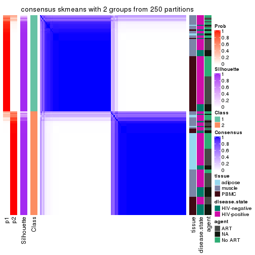</p>

</div>
<div id='tab-ATC-skmeans-consensus-heatmap-2'>
<pre><code class="r">consensus_heatmap(res, k = 3)
</code></pre>

<p>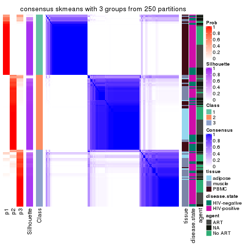</p>

</div>
<div id='tab-ATC-skmeans-consensus-heatmap-3'>
<pre><code class="r">consensus_heatmap(res, k = 4)
</code></pre>

<p>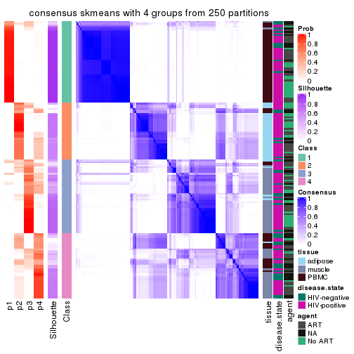</p>

</div>
<div id='tab-ATC-skmeans-consensus-heatmap-4'>
<pre><code class="r">consensus_heatmap(res, k = 5)
</code></pre>

<p>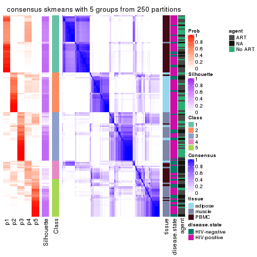</p>

</div>
<div id='tab-ATC-skmeans-consensus-heatmap-5'>
<pre><code class="r">consensus_heatmap(res, k = 6)
</code></pre>

<p>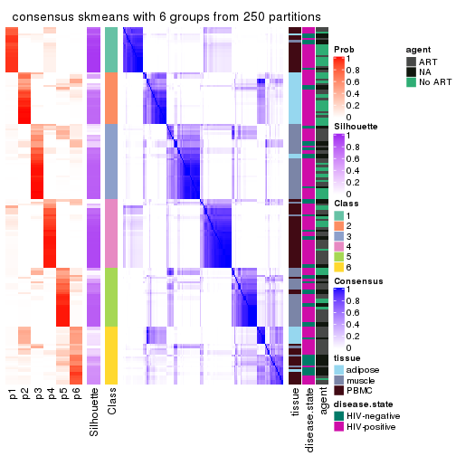</p>

</div>
</div>

Heatmaps for the membership of samples in all partitions to see how consistent they are:


<script>
$( function() {
	$( '#tabs-ATC-skmeans-membership-heatmap' ).tabs();
} );
</script>
<div id='tabs-ATC-skmeans-membership-heatmap'>
<ul>
<li><a href='#tab-ATC-skmeans-membership-heatmap-1'>k = 2</a></li>
<li><a href='#tab-ATC-skmeans-membership-heatmap-2'>k = 3</a></li>
<li><a href='#tab-ATC-skmeans-membership-heatmap-3'>k = 4</a></li>
<li><a href='#tab-ATC-skmeans-membership-heatmap-4'>k = 5</a></li>
<li><a href='#tab-ATC-skmeans-membership-heatmap-5'>k = 6</a></li>
</ul>
<div id='tab-ATC-skmeans-membership-heatmap-1'>
<pre><code class="r">membership_heatmap(res, k = 2)
</code></pre>

<p>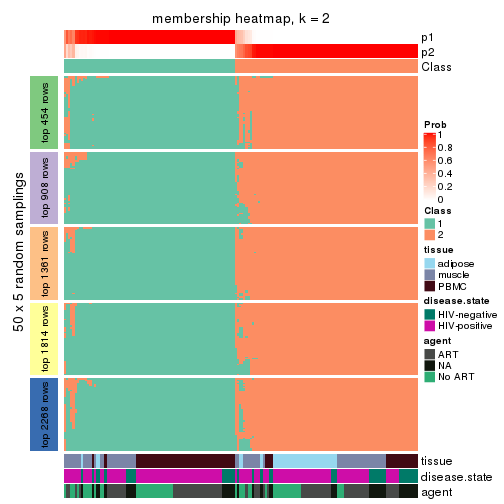</p>

</div>
<div id='tab-ATC-skmeans-membership-heatmap-2'>
<pre><code class="r">membership_heatmap(res, k = 3)
</code></pre>

<p>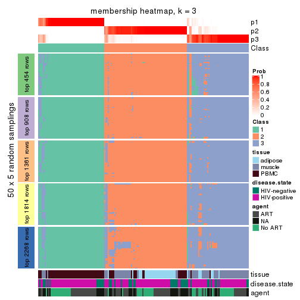</p>

</div>
<div id='tab-ATC-skmeans-membership-heatmap-3'>
<pre><code class="r">membership_heatmap(res, k = 4)
</code></pre>

<p>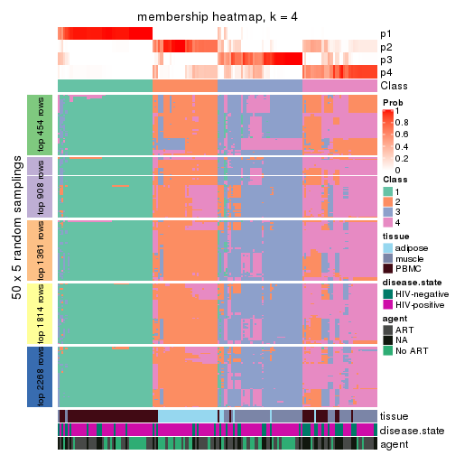</p>

</div>
<div id='tab-ATC-skmeans-membership-heatmap-4'>
<pre><code class="r">membership_heatmap(res, k = 5)
</code></pre>

<p>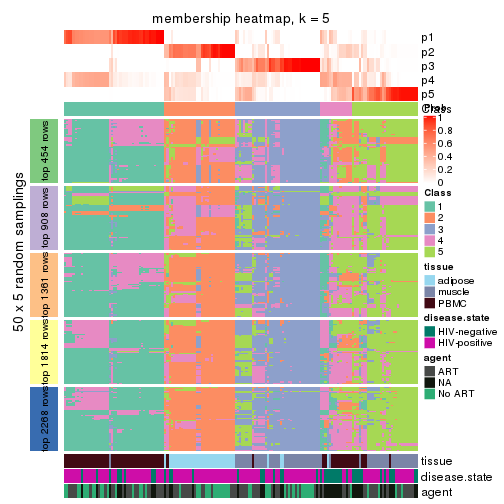</p>

</div>
<div id='tab-ATC-skmeans-membership-heatmap-5'>
<pre><code class="r">membership_heatmap(res, k = 6)
</code></pre>

<p>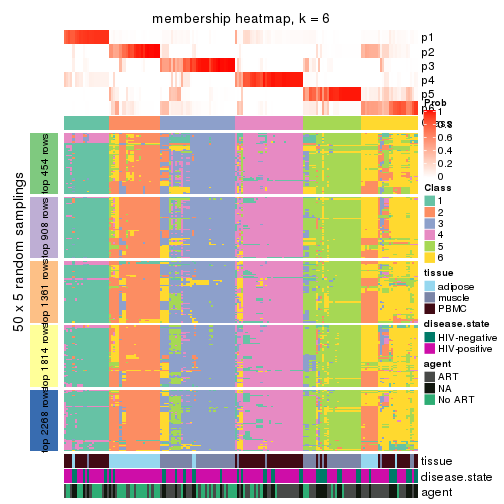</p>

</div>
</div>

As soon as we have had the classes for columns, we can look for signatures
which are significantly different between classes which can be candidate marks
for certain classes. Following are the heatmaps for signatures.


Signature heatmaps where rows are scaled:


<script>
$( function() {
	$( '#tabs-ATC-skmeans-get-signatures' ).tabs();
} );
</script>
<div id='tabs-ATC-skmeans-get-signatures'>
<ul>
<li><a href='#tab-ATC-skmeans-get-signatures-1'>k = 2</a></li>
<li><a href='#tab-ATC-skmeans-get-signatures-2'>k = 3</a></li>
<li><a href='#tab-ATC-skmeans-get-signatures-3'>k = 4</a></li>
<li><a href='#tab-ATC-skmeans-get-signatures-4'>k = 5</a></li>
<li><a href='#tab-ATC-skmeans-get-signatures-5'>k = 6</a></li>
</ul>
<div id='tab-ATC-skmeans-get-signatures-1'>
<pre><code class="r">get_signatures(res, k = 2)
</code></pre>

<p>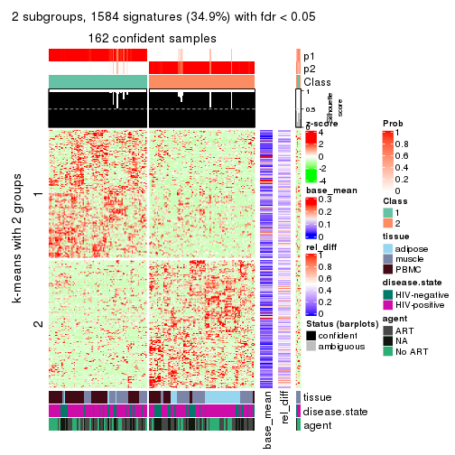</p>

</div>
<div id='tab-ATC-skmeans-get-signatures-2'>
<pre><code class="r">get_signatures(res, k = 3)
</code></pre>

<p>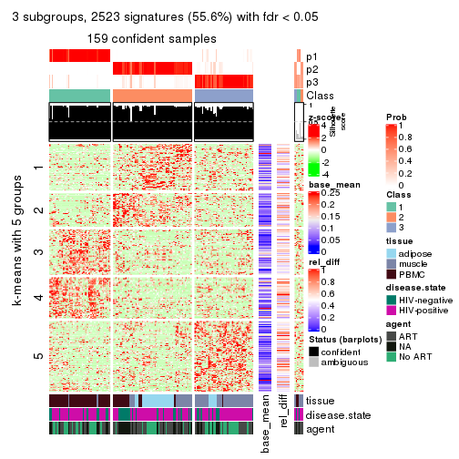</p>

</div>
<div id='tab-ATC-skmeans-get-signatures-3'>
<pre><code class="r">get_signatures(res, k = 4)
</code></pre>

<p>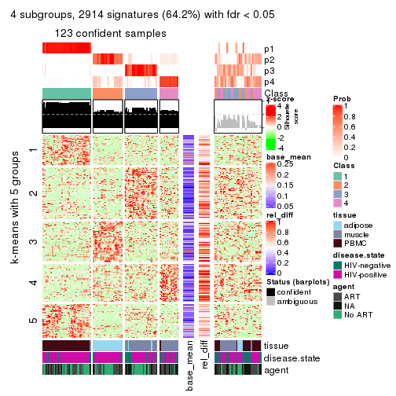</p>

</div>
<div id='tab-ATC-skmeans-get-signatures-4'>
<pre><code class="r">get_signatures(res, k = 5)
</code></pre>

<p>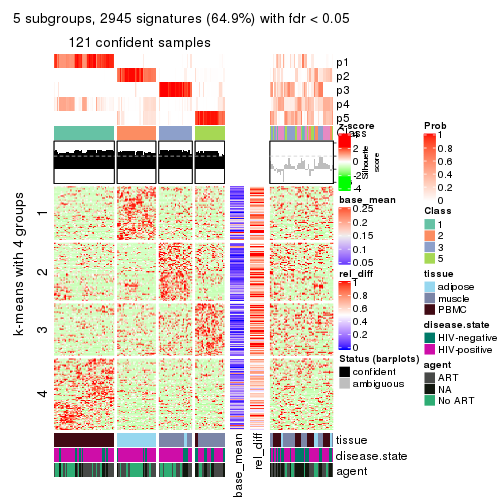</p>

</div>
<div id='tab-ATC-skmeans-get-signatures-5'>
<pre><code class="r">get_signatures(res, k = 6)
</code></pre>

<p>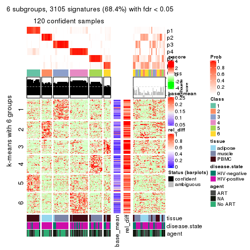</p>

</div>
</div>


Signature heatmaps where rows are not scaled:


<script>
$( function() {
	$( '#tabs-ATC-skmeans-get-signatures-no-scale' ).tabs();
} );
</script>
<div id='tabs-ATC-skmeans-get-signatures-no-scale'>
<ul>
<li><a href='#tab-ATC-skmeans-get-signatures-no-scale-1'>k = 2</a></li>
<li><a href='#tab-ATC-skmeans-get-signatures-no-scale-2'>k = 3</a></li>
<li><a href='#tab-ATC-skmeans-get-signatures-no-scale-3'>k = 4</a></li>
<li><a href='#tab-ATC-skmeans-get-signatures-no-scale-4'>k = 5</a></li>
<li><a href='#tab-ATC-skmeans-get-signatures-no-scale-5'>k = 6</a></li>
</ul>
<div id='tab-ATC-skmeans-get-signatures-no-scale-1'>
<pre><code class="r">get_signatures(res, k = 2, scale_rows = FALSE)
</code></pre>

<p>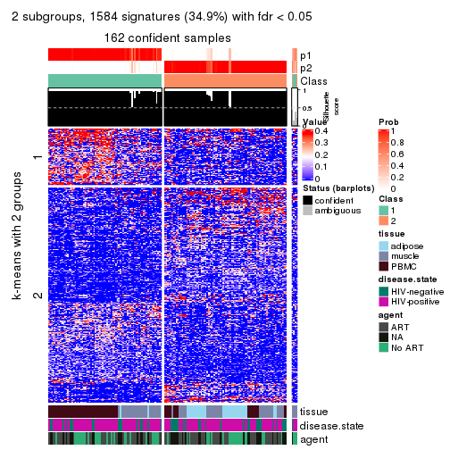</p>

</div>
<div id='tab-ATC-skmeans-get-signatures-no-scale-2'>
<pre><code class="r">get_signatures(res, k = 3, scale_rows = FALSE)
</code></pre>

<p>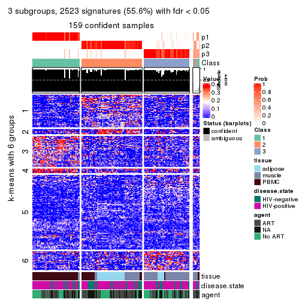</p>

</div>
<div id='tab-ATC-skmeans-get-signatures-no-scale-3'>
<pre><code class="r">get_signatures(res, k = 4, scale_rows = FALSE)
</code></pre>

<p>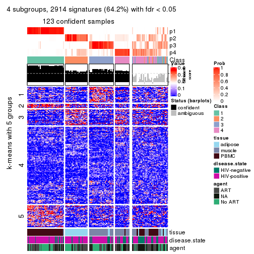</p>

</div>
<div id='tab-ATC-skmeans-get-signatures-no-scale-4'>
<pre><code class="r">get_signatures(res, k = 5, scale_rows = FALSE)
</code></pre>

<p>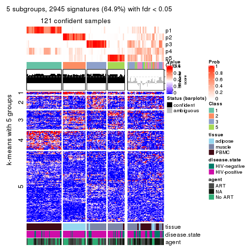</p>

</div>
<div id='tab-ATC-skmeans-get-signatures-no-scale-5'>
<pre><code class="r">get_signatures(res, k = 6, scale_rows = FALSE)
</code></pre>

<p>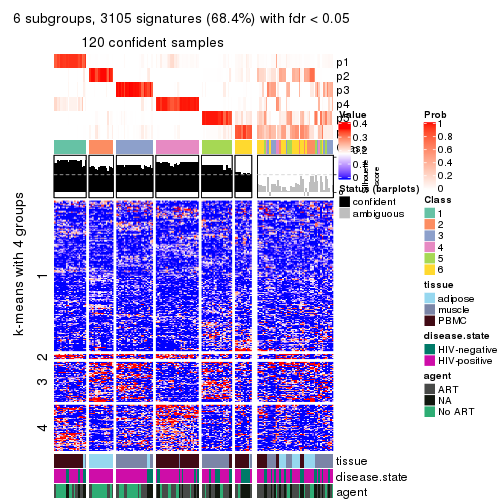</p>

</div>
</div>


Compare the overlap of signatures from different k:

```r
compare_signatures(res)
```

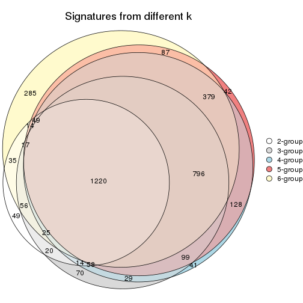

`get_signature()` returns a data frame invisibly. TO get the list of signatures, the function
call should be assigned to a variable explicitly. In following code, if `plot` argument is set
to `FALSE`, no heatmap is plotted while only the differential analysis is performed.

```r
# code only for demonstration
tb = get_signature(res, k = ..., plot = FALSE)
```

An example of the output of `tb` is:

```
#>   which_row         fdr    mean_1    mean_2 scaled_mean_1 scaled_mean_2 km
#> 1        38 0.042760348  8.373488  9.131774    -0.5533452     0.5164555  1
#> 2        40 0.018707592  7.106213  8.469186    -0.6173731     0.5762149  1
#> 3        55 0.019134737 10.221463 11.207825    -0.6159697     0.5749050  1
#> 4        59 0.006059896  5.921854  7.869574    -0.6899429     0.6439467  1
#> 5        60 0.018055526  8.928898 10.211722    -0.6204761     0.5791110  1
#> 6        98 0.009384629 15.714769 14.887706     0.6635654    -0.6193277  2
...
```

The columns in `tb` are:

1. `which_row`: row indices corresponding to the input matrix.
2. `fdr`: FDR for the differential test. 
3. `mean_x`: The mean value in group x.
4. `scaled_mean_x`: The mean value in group x after rows are scaled.
5. `km`: Row groups if k-means clustering is applied to rows.


UMAP plot which shows how samples are separated.


<script>
$( function() {
	$( '#tabs-ATC-skmeans-dimension-reduction' ).tabs();
} );
</script>
<div id='tabs-ATC-skmeans-dimension-reduction'>
<ul>
<li><a href='#tab-ATC-skmeans-dimension-reduction-1'>k = 2</a></li>
<li><a href='#tab-ATC-skmeans-dimension-reduction-2'>k = 3</a></li>
<li><a href='#tab-ATC-skmeans-dimension-reduction-3'>k = 4</a></li>
<li><a href='#tab-ATC-skmeans-dimension-reduction-4'>k = 5</a></li>
<li><a href='#tab-ATC-skmeans-dimension-reduction-5'>k = 6</a></li>
</ul>
<div id='tab-ATC-skmeans-dimension-reduction-1'>
<pre><code class="r">dimension_reduction(res, k = 2, method = &quot;UMAP&quot;)
</code></pre>

<p>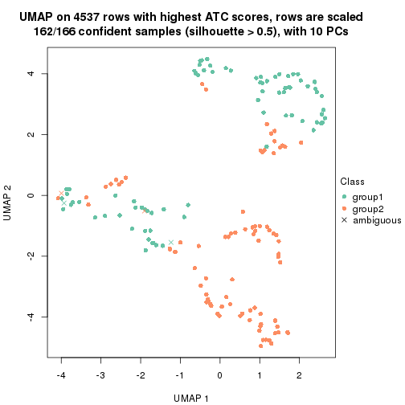</p>

</div>
<div id='tab-ATC-skmeans-dimension-reduction-2'>
<pre><code class="r">dimension_reduction(res, k = 3, method = &quot;UMAP&quot;)
</code></pre>

<p>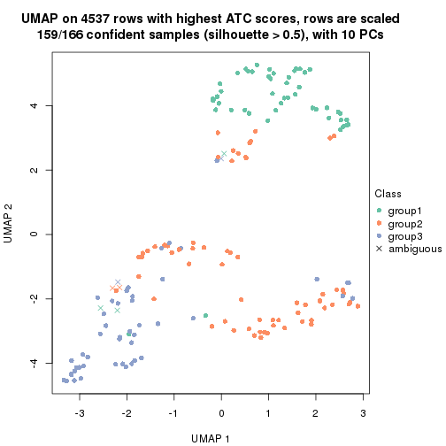</p>

</div>
<div id='tab-ATC-skmeans-dimension-reduction-3'>
<pre><code class="r">dimension_reduction(res, k = 4, method = &quot;UMAP&quot;)
</code></pre>

<p>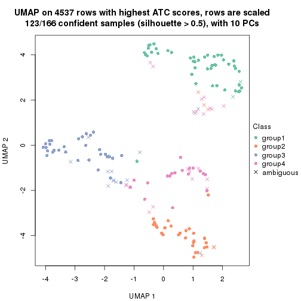</p>

</div>
<div id='tab-ATC-skmeans-dimension-reduction-4'>
<pre><code class="r">dimension_reduction(res, k = 5, method = &quot;UMAP&quot;)
</code></pre>

<p>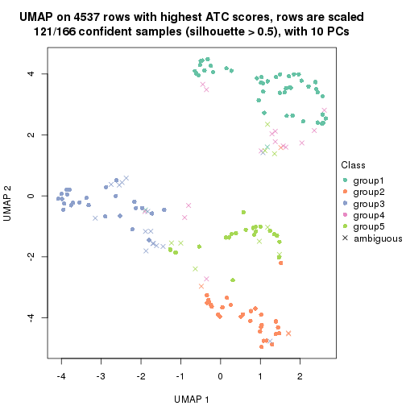</p>

</div>
<div id='tab-ATC-skmeans-dimension-reduction-5'>
<pre><code class="r">dimension_reduction(res, k = 6, method = &quot;UMAP&quot;)
</code></pre>

<p>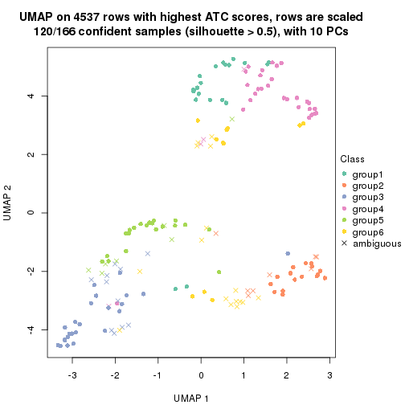</p>

</div>
</div>


Following heatmap shows how subgroups are split when increasing `k`:

```r
collect_classes(res)
```

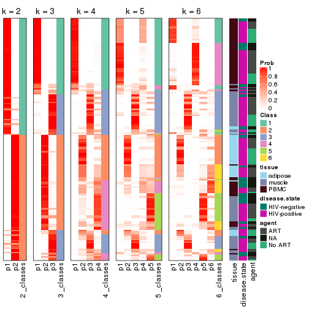


Test correlation between subgroups and known annotations. If the known
annotation is numeric, one-way ANOVA test is applied, and if the known
annotation is discrete, chi-squared contingency table test is applied.

```r
test_to_known_factors(res)
```

```
#>               n tissue(p) disease.state(p) agent(p) k
#> ATC:skmeans 162  6.17e-09           0.3143  0.41321 2
#> ATC:skmeans 159  1.25e-26           0.2280  0.18057 3
#> ATC:skmeans 123  2.10e-45           0.1234  0.20861 4
#> ATC:skmeans 121  1.12e-44           0.2274  0.24289 5
#> ATC:skmeans 120  9.36e-35           0.0312  0.00352 6
```


If matrix rows can be associated to genes, consider to use `GO_Enrichment(res,
...)` to perform function enrichment for the signature genes.


 

---------------------------------------------------


### ATC:pam


The object with results only for a single top-value method and a single partition method 
can be extracted as:

```r
res = res_list["ATC", "pam"]
# you can also extract it by
# res = res_list["ATC:pam"]
```

A summary of `res` and all the functions that can be applied to it:

```r
res
```

```
#> A 'ConsensusPartition' object with k = 2, 3, 4, 5, 6.
#>   On a matrix with 4537 rows and 166 columns.
#>   Top rows (454, 908, 1361, 1814, 2268) are extracted by 'ATC' method.
#>   Subgroups are detected by 'pam' method.
#>   Performed in total 1250 partitions by row resampling.
#>   Best k for subgroups seems to be 3.
#> 
#> Following methods can be applied to this 'ConsensusPartition' object:
#>  [1] "cola_report"             "collect_classes"         "collect_plots"          
#>  [4] "collect_stats"           "colnames"                "compare_signatures"     
#>  [7] "consensus_heatmap"       "dimension_reduction"     "functional_enrichment"  
#> [10] "get_anno_col"            "get_anno"                "get_classes"            
#> [13] "get_consensus"           "get_matrix"              "get_membership"         
#> [16] "get_param"               "get_signatures"          "get_stats"              
#> [19] "is_best_k"               "is_stable_k"             "membership_heatmap"     
#> [22] "ncol"                    "nrow"                    "plot_ecdf"              
#> [25] "rownames"                "select_partition_number" "show"                   
#> [28] "suggest_best_k"          "test_to_known_factors"
```

`collect_plots()` function collects all the plots made from `res` for all `k` (number of partitions)
into one single page to provide an easy and fast comparison between different `k`.

```r
collect_plots(res)
```

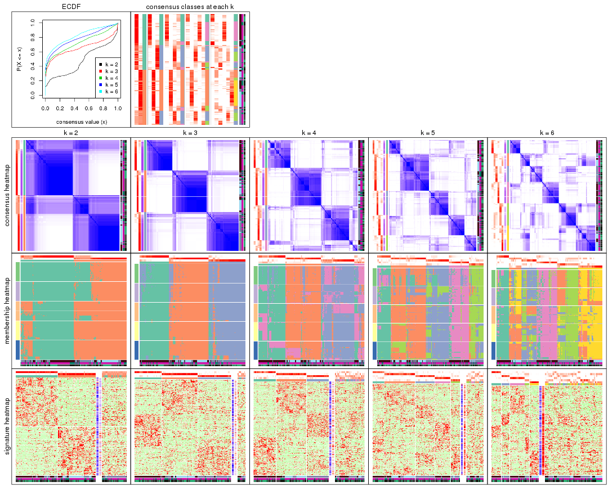

The plots are:

- The first row: a plot of the ECDF (Empirical cumulative distribution
  function) curves of the consensus matrix for each `k` and the heatmap of
  predicted classes for each `k`.
- The second row: heatmaps of the consensus matrix for each `k`.
- The third row: heatmaps of the membership matrix for each `k`.
- The fouth row: heatmaps of the signatures for each `k`.

All the plots in panels can be made by individual functions and they are
plotted later in this section.

`select_partition_number()` produces several plots showing different
statistics for choosing "optimized" `k`. There are following statistics:

- ECDF curves of the consensus matrix for each `k`;
- 1-PAC. [The PAC
  score](https://en.wikipedia.org/wiki/Consensus_clustering#Over-interpretation_potential_of_consensus_clustering)
  measures the proportion of the ambiguous subgrouping.
- Mean silhouette score.
- Concordance. The mean probability of fiting the consensus class ids in all
  partitions.
- Area increased. Denote $A_k$ as the area under the ECDF curve for current
  `k`, the area increased is defined as $A_k - A_{k-1}$.
- Rand index. The percent of pairs of samples that are both in a same cluster
  or both are not in a same cluster in the partition of k and k-1.
- Jaccard index. The ratio of pairs of samples are both in a same cluster in
  the partition of k and k-1 and the pairs of samples are both in a same
  cluster in the partition k or k-1.

The detailed explanations of these statistics can be found in [the cola
vignette](http://bioconductor.org/packages/devel/bioc/vignettes/cola/inst/doc/cola.html#toc_13).

Generally speaking, lower PAC score, higher mean silhouette score or higher
concordance corresponds to better partition. Rand index and Jaccard index
measure how similar the current partition is compared to partition with `k-1`.
If they are too similar, we won't accept `k` is better than `k-1`.

```r
select_partition_number(res)
```

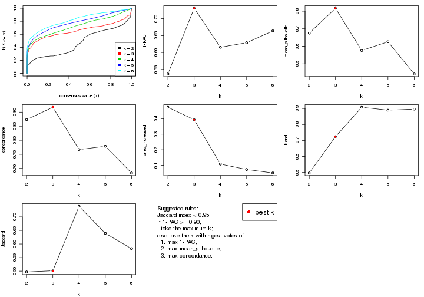

The numeric values for all these statistics can be obtained by `get_stats()`.

```r
get_stats(res)
```

```
#>   k 1-PAC mean_silhouette concordance area_increased  Rand Jaccard
#> 2 2 0.537           0.675       0.873         0.4730 0.497   0.497
#> 3 3 0.731           0.817       0.917         0.3931 0.724   0.501
#> 4 4 0.616           0.576       0.767         0.1084 0.908   0.739
#> 5 5 0.629           0.626       0.779         0.0733 0.889   0.639
#> 6 6 0.664           0.442       0.684         0.0512 0.896   0.583
```

`suggest_best_k()` suggests the best $k$ based on these statistics. The rules are as follows:

- All $k$ with Jaccard index larger than 0.95 are removed because the increase of
  the partition number does not provides enough extra information. If all $k$ are removed,
  the best $k$ is assigned by `NA`.
- For $k$ with 1-PAC larger than 0.9, the maximal $k$ is taken as the "best k". Other $k$ is called "optional k".
- If it does not fit the second rule. The $k$ with the highest vote of highest
  1-PAC, mean silhouette and concordance is taken as the "best k".

```r
suggest_best_k(res)
```

```
#> [1] 3
```


Following shows the table of the partitions (You need to click the **show/hide
code output** link to see it). The membership matrix (columns with name `p*`)
is inferred by
[`clue::cl_consensus()`](https://www.rdocumentation.org/link/cl_consensus?package=clue)
function with the `SE` method. Basically the value in the membership matrix
represents the probability to belong to a certain group. The finall class
label for an item is determined with the group with highest probability it
belongs to.

In `get_classes()` function, the entropy is calculated from the membership
matrix and the silhouette score is calculated from the consensus matrix.


<script>
$( function() {
	$( '#tabs-ATC-pam-get-classes' ).tabs();
} );
</script>
<div id='tabs-ATC-pam-get-classes'>
<ul>
<li><a href='#tab-ATC-pam-get-classes-1'>k = 2</a></li>
<li><a href='#tab-ATC-pam-get-classes-2'>k = 3</a></li>
<li><a href='#tab-ATC-pam-get-classes-3'>k = 4</a></li>
<li><a href='#tab-ATC-pam-get-classes-4'>k = 5</a></li>
<li><a href='#tab-ATC-pam-get-classes-5'>k = 6</a></li>
</ul>

<div id='tab-ATC-pam-get-classes-1'>
<p><a id='tab-ATC-pam-get-classes-1-a' style='color:#0366d6' href='#'>show/hide code output</a></p>
<pre><code class="r">cbind(get_classes(res, k = 2), get_membership(res, k = 2))
</code></pre>

<pre><code>#&gt;           class entropy silhouette    p1    p2
#&gt; GSM751298     1  0.0000    0.86328 1.000 0.000
#&gt; GSM751304     2  0.9491    0.45980 0.368 0.632
#&gt; GSM751305     2  0.9775    0.37724 0.412 0.588
#&gt; GSM751307     2  0.9170    0.52506 0.332 0.668
#&gt; GSM751310     1  0.0672    0.86025 0.992 0.008
#&gt; GSM751314     1  0.0000    0.86328 1.000 0.000
#&gt; GSM751316     1  0.0000    0.86328 1.000 0.000
#&gt; GSM751318     1  0.0000    0.86328 1.000 0.000
#&gt; GSM751342     1  0.0000    0.86328 1.000 0.000
#&gt; GSM751346     1  0.0000    0.86328 1.000 0.000
#&gt; GSM751347     1  0.9993   -0.11422 0.516 0.484
#&gt; GSM751348     2  0.2778    0.78386 0.048 0.952
#&gt; GSM751349     2  0.0000    0.80884 0.000 1.000
#&gt; GSM751352     2  0.0000    0.80884 0.000 1.000
#&gt; GSM751353     2  0.0000    0.80884 0.000 1.000
#&gt; GSM751354     2  0.8661    0.58039 0.288 0.712
#&gt; GSM751355     2  0.0000    0.80884 0.000 1.000
#&gt; GSM751358     1  0.9754    0.20196 0.592 0.408
#&gt; GSM751359     2  0.3114    0.79061 0.056 0.944
#&gt; GSM751294     2  0.1633    0.80340 0.024 0.976
#&gt; GSM751296     1  0.0000    0.86328 1.000 0.000
#&gt; GSM751297     1  0.2043    0.84879 0.968 0.032
#&gt; GSM751299     2  0.0000    0.80884 0.000 1.000
#&gt; GSM751300     1  0.0672    0.85911 0.992 0.008
#&gt; GSM751301     2  0.3114    0.77688 0.056 0.944
#&gt; GSM751302     1  0.0672    0.85911 0.992 0.008
#&gt; GSM751303     1  0.0000    0.86328 1.000 0.000
#&gt; GSM751306     1  0.0000    0.86328 1.000 0.000
#&gt; GSM751308     1  0.6531    0.68458 0.832 0.168
#&gt; GSM751309     1  0.0000    0.86328 1.000 0.000
#&gt; GSM751311     1  0.0000    0.86328 1.000 0.000
#&gt; GSM751312     1  0.0000    0.86328 1.000 0.000
#&gt; GSM751313     1  0.0000    0.86328 1.000 0.000
#&gt; GSM751315     1  0.0000    0.86328 1.000 0.000
#&gt; GSM751317     1  0.0000    0.86328 1.000 0.000
#&gt; GSM751320     1  0.0000    0.86328 1.000 0.000
#&gt; GSM751321     1  0.0000    0.86328 1.000 0.000
#&gt; GSM751322     1  0.0000    0.86328 1.000 0.000
#&gt; GSM751324     1  0.0000    0.86328 1.000 0.000
#&gt; GSM751325     1  0.0000    0.86328 1.000 0.000
#&gt; GSM751332     1  0.0000    0.86328 1.000 0.000
#&gt; GSM751334     1  0.0000    0.86328 1.000 0.000
#&gt; GSM751339     1  0.0000    0.86328 1.000 0.000
#&gt; GSM751341     1  0.0000    0.86328 1.000 0.000
#&gt; GSM751343     1  0.0000    0.86328 1.000 0.000
#&gt; GSM751344     2  0.0000    0.80884 0.000 1.000
#&gt; GSM751345     2  0.0000    0.80884 0.000 1.000
#&gt; GSM751356     2  0.0000    0.80884 0.000 1.000
#&gt; GSM751357     2  0.0000    0.80884 0.000 1.000
#&gt; GSM751293     2  0.3431    0.77228 0.064 0.936
#&gt; GSM751295     1  0.0376    0.86134 0.996 0.004
#&gt; GSM751319     1  0.0000    0.86328 1.000 0.000
#&gt; GSM751323     1  0.0000    0.86328 1.000 0.000
#&gt; GSM751326     1  0.0000    0.86328 1.000 0.000
#&gt; GSM751327     1  0.0000    0.86328 1.000 0.000
#&gt; GSM751328     1  0.0000    0.86328 1.000 0.000
#&gt; GSM751329     1  0.0000    0.86328 1.000 0.000
#&gt; GSM751330     1  0.0000    0.86328 1.000 0.000
#&gt; GSM751331     1  0.4298    0.80219 0.912 0.088
#&gt; GSM751333     1  0.0000    0.86328 1.000 0.000
#&gt; GSM751335     1  0.0938    0.85770 0.988 0.012
#&gt; GSM751336     1  0.0000    0.86328 1.000 0.000
#&gt; GSM751337     1  0.0000    0.86328 1.000 0.000
#&gt; GSM751338     1  0.0000    0.86328 1.000 0.000
#&gt; GSM751340     1  0.0000    0.86328 1.000 0.000
#&gt; GSM751350     1  0.5842    0.72615 0.860 0.140
#&gt; GSM751351     1  0.3274    0.81915 0.940 0.060
#&gt; GSM751362     1  0.2423    0.84091 0.960 0.040
#&gt; GSM751363     1  0.9833    0.12814 0.576 0.424
#&gt; GSM751367     1  0.9710    0.20712 0.600 0.400
#&gt; GSM751368     2  0.9944    0.28337 0.456 0.544
#&gt; GSM751371     1  0.0000    0.86328 1.000 0.000
#&gt; GSM751375     2  0.0000    0.80884 0.000 1.000
#&gt; GSM751376     2  0.2603    0.79587 0.044 0.956
#&gt; GSM751378     2  0.2236    0.79904 0.036 0.964
#&gt; GSM751379     2  0.8443    0.60375 0.272 0.728
#&gt; GSM751382     2  0.0000    0.80884 0.000 1.000
#&gt; GSM751386     2  0.8861    0.55960 0.304 0.696
#&gt; GSM751388     2  0.9608    0.43473 0.384 0.616
#&gt; GSM751391     2  1.0000    0.13291 0.496 0.504
#&gt; GSM751410     1  0.0000    0.86328 1.000 0.000
#&gt; GSM751414     1  0.2423    0.84285 0.960 0.040
#&gt; GSM751361     1  0.9993   -0.09262 0.516 0.484
#&gt; GSM751365     1  0.6247    0.72460 0.844 0.156
#&gt; GSM751366     1  0.0376    0.86191 0.996 0.004
#&gt; GSM751369     1  0.3114    0.83077 0.944 0.056
#&gt; GSM751370     1  0.1843    0.85025 0.972 0.028
#&gt; GSM751372     1  0.9983   -0.06349 0.524 0.476
#&gt; GSM751373     1  0.6438    0.71531 0.836 0.164
#&gt; GSM751374     2  0.9323    0.49736 0.348 0.652
#&gt; GSM751377     2  0.9944    0.28337 0.456 0.544
#&gt; GSM751380     1  0.0000    0.86328 1.000 0.000
#&gt; GSM751381     2  0.8267    0.61416 0.260 0.740
#&gt; GSM751383     2  0.9933    0.29340 0.452 0.548
#&gt; GSM751384     2  0.9954    0.27271 0.460 0.540
#&gt; GSM751385     2  0.9580    0.44098 0.380 0.620
#&gt; GSM751387     2  0.4690    0.76246 0.100 0.900
#&gt; GSM751389     2  0.9954    0.27271 0.460 0.540
#&gt; GSM751393     2  0.9954    0.27271 0.460 0.540
#&gt; GSM751394     2  0.0000    0.80884 0.000 1.000
#&gt; GSM751395     2  0.9933    0.29307 0.452 0.548
#&gt; GSM751397     2  0.9933    0.29334 0.452 0.548
#&gt; GSM751398     2  0.9944    0.28337 0.456 0.544
#&gt; GSM751404     1  0.1843    0.85025 0.972 0.028
#&gt; GSM751406     1  0.4161    0.81051 0.916 0.084
#&gt; GSM751411     1  0.7602    0.63077 0.780 0.220
#&gt; GSM751413     2  0.9850    0.34729 0.428 0.572
#&gt; GSM751415     1  0.0000    0.86328 1.000 0.000
#&gt; GSM751416     2  0.9944    0.28337 0.456 0.544
#&gt; GSM751417     2  0.9944    0.28337 0.456 0.544
#&gt; GSM751421     1  0.9754    0.19717 0.592 0.408
#&gt; GSM751422     1  0.3431    0.82778 0.936 0.064
#&gt; GSM751360     1  0.0000    0.86328 1.000 0.000
#&gt; GSM751364     1  0.9866    0.09607 0.568 0.432
#&gt; GSM751390     2  0.9993    0.20156 0.484 0.516
#&gt; GSM751392     2  0.0000    0.80884 0.000 1.000
#&gt; GSM751396     2  0.4690    0.76268 0.100 0.900
#&gt; GSM751399     1  0.9944    0.02511 0.544 0.456
#&gt; GSM751400     2  0.9944    0.28337 0.456 0.544
#&gt; GSM751401     1  0.1633    0.85319 0.976 0.024
#&gt; GSM751402     1  0.3114    0.83420 0.944 0.056
#&gt; GSM751403     1  0.9896    0.08469 0.560 0.440
#&gt; GSM751405     1  0.3879    0.81716 0.924 0.076
#&gt; GSM751407     1  0.8861    0.47757 0.696 0.304
#&gt; GSM751408     2  0.9954    0.27271 0.460 0.540
#&gt; GSM751409     2  0.9944    0.28337 0.456 0.544
#&gt; GSM751412     1  0.9983   -0.08294 0.524 0.476
#&gt; GSM751418     1  0.9944   -0.00319 0.544 0.456
#&gt; GSM751419     1  0.9977   -0.06622 0.528 0.472
#&gt; GSM751420     2  0.9922    0.30163 0.448 0.552
#&gt; GSM751425     2  0.0000    0.80884 0.000 1.000
#&gt; GSM751429     1  0.9983   -0.08119 0.524 0.476
#&gt; GSM751430     2  0.2603    0.79576 0.044 0.956
#&gt; GSM751433     2  0.1633    0.80005 0.024 0.976
#&gt; GSM751437     1  0.9044    0.44427 0.680 0.320
#&gt; GSM751448     1  0.3114    0.82917 0.944 0.056
#&gt; GSM751451     2  0.2603    0.79629 0.044 0.956
#&gt; GSM751423     2  0.0000    0.80884 0.000 1.000
#&gt; GSM751424     2  0.0000    0.80884 0.000 1.000
#&gt; GSM751428     2  0.1414    0.80477 0.020 0.980
#&gt; GSM751431     2  0.0000    0.80884 0.000 1.000
#&gt; GSM751432     2  0.0000    0.80884 0.000 1.000
#&gt; GSM751434     2  0.0376    0.80815 0.004 0.996
#&gt; GSM751435     2  0.0000    0.80884 0.000 1.000
#&gt; GSM751436     2  0.0000    0.80884 0.000 1.000
#&gt; GSM751440     2  0.5408    0.74840 0.124 0.876
#&gt; GSM751444     2  0.0000    0.80884 0.000 1.000
#&gt; GSM751446     2  0.0000    0.80884 0.000 1.000
#&gt; GSM751449     2  0.0000    0.80884 0.000 1.000
#&gt; GSM751450     2  0.1843    0.80251 0.028 0.972
#&gt; GSM751452     2  0.0000    0.80884 0.000 1.000
#&gt; GSM751426     2  0.0000    0.80884 0.000 1.000
#&gt; GSM751427     2  0.0000    0.80884 0.000 1.000
#&gt; GSM751438     2  0.0000    0.80884 0.000 1.000
#&gt; GSM751439     2  0.1633    0.79548 0.024 0.976
#&gt; GSM751441     2  0.0000    0.80884 0.000 1.000
#&gt; GSM751442     2  0.0000    0.80884 0.000 1.000
#&gt; GSM751443     2  0.1843    0.79270 0.028 0.972
#&gt; GSM751445     2  0.0000    0.80884 0.000 1.000
#&gt; GSM751447     2  0.0000    0.80884 0.000 1.000
#&gt; GSM751453     2  0.0000    0.80884 0.000 1.000
#&gt; GSM751454     2  0.0000    0.80884 0.000 1.000
#&gt; GSM751455     2  0.0000    0.80884 0.000 1.000
#&gt; GSM751456     2  0.0000    0.80884 0.000 1.000
#&gt; GSM751457     2  0.0000    0.80884 0.000 1.000
#&gt; GSM751458     2  0.0000    0.80884 0.000 1.000
</code></pre>

<script>
$('#tab-ATC-pam-get-classes-1-a').parent().next().next().hide();
$('#tab-ATC-pam-get-classes-1-a').click(function(){
  $('#tab-ATC-pam-get-classes-1-a').parent().next().next().toggle();
  return(false);
});
</script>
</div>

<div id='tab-ATC-pam-get-classes-2'>
<p><a id='tab-ATC-pam-get-classes-2-a' style='color:#0366d6' href='#'>show/hide code output</a></p>
<pre><code class="r">cbind(get_classes(res, k = 3), get_membership(res, k = 3))
</code></pre>

<pre><code>#&gt;           class entropy silhouette    p1    p2    p3
#&gt; GSM751298     1  0.0892     0.9017 0.980 0.000 0.020
#&gt; GSM751304     2  0.5882     0.4524 0.000 0.652 0.348
#&gt; GSM751305     2  0.6299     0.0694 0.000 0.524 0.476
#&gt; GSM751307     2  0.8386     0.5215 0.156 0.620 0.224
#&gt; GSM751310     3  0.6045     0.3715 0.380 0.000 0.620
#&gt; GSM751314     1  0.3038     0.8555 0.896 0.000 0.104
#&gt; GSM751316     1  0.6286     0.1752 0.536 0.000 0.464
#&gt; GSM751318     1  0.0237     0.9044 0.996 0.000 0.004
#&gt; GSM751342     1  0.2356     0.8792 0.928 0.000 0.072
#&gt; GSM751346     1  0.2448     0.8776 0.924 0.000 0.076
#&gt; GSM751347     3  0.6915     0.6974 0.140 0.124 0.736
#&gt; GSM751348     2  0.3784     0.8148 0.132 0.864 0.004
#&gt; GSM751349     2  0.0983     0.9147 0.016 0.980 0.004
#&gt; GSM751352     2  0.0237     0.9212 0.000 0.996 0.004
#&gt; GSM751353     2  0.0237     0.9212 0.000 0.996 0.004
#&gt; GSM751354     2  0.4931     0.6775 0.000 0.768 0.232
#&gt; GSM751355     2  0.0237     0.9212 0.000 0.996 0.004
#&gt; GSM751358     3  0.4887     0.8221 0.060 0.096 0.844
#&gt; GSM751359     2  0.3192     0.8479 0.000 0.888 0.112
#&gt; GSM751294     2  0.1643     0.9024 0.000 0.956 0.044
#&gt; GSM751296     1  0.0000     0.9046 1.000 0.000 0.000
#&gt; GSM751297     3  0.5815     0.5159 0.304 0.004 0.692
#&gt; GSM751299     2  0.0237     0.9212 0.000 0.996 0.004
#&gt; GSM751300     1  0.3116     0.8522 0.892 0.000 0.108
#&gt; GSM751301     2  0.4351     0.7738 0.168 0.828 0.004
#&gt; GSM751302     1  0.5178     0.6887 0.744 0.000 0.256
#&gt; GSM751303     1  0.6204     0.3215 0.576 0.000 0.424
#&gt; GSM751306     1  0.2261     0.8815 0.932 0.000 0.068
#&gt; GSM751308     1  0.2845     0.8766 0.920 0.012 0.068
#&gt; GSM751309     1  0.0237     0.9044 0.996 0.000 0.004
#&gt; GSM751311     1  0.4062     0.7998 0.836 0.000 0.164
#&gt; GSM751312     1  0.6235     0.2691 0.564 0.000 0.436
#&gt; GSM751313     1  0.0000     0.9046 1.000 0.000 0.000
#&gt; GSM751315     1  0.0747     0.9029 0.984 0.000 0.016
#&gt; GSM751317     1  0.1964     0.8879 0.944 0.000 0.056
#&gt; GSM751320     1  0.0000     0.9046 1.000 0.000 0.000
#&gt; GSM751321     1  0.0592     0.9035 0.988 0.000 0.012
#&gt; GSM751322     1  0.0000     0.9046 1.000 0.000 0.000
#&gt; GSM751324     1  0.0237     0.9044 0.996 0.000 0.004
#&gt; GSM751325     1  0.0000     0.9046 1.000 0.000 0.000
#&gt; GSM751332     1  0.0000     0.9046 1.000 0.000 0.000
#&gt; GSM751334     1  0.0000     0.9046 1.000 0.000 0.000
#&gt; GSM751339     1  0.1753     0.8835 0.952 0.000 0.048
#&gt; GSM751341     1  0.5178     0.6831 0.744 0.000 0.256
#&gt; GSM751343     1  0.0000     0.9046 1.000 0.000 0.000
#&gt; GSM751344     2  0.0237     0.9212 0.000 0.996 0.004
#&gt; GSM751345     2  0.0237     0.9212 0.000 0.996 0.004
#&gt; GSM751356     2  0.0000     0.9210 0.000 1.000 0.000
#&gt; GSM751357     2  0.0000     0.9210 0.000 1.000 0.000
#&gt; GSM751293     2  0.4351     0.7736 0.168 0.828 0.004
#&gt; GSM751295     1  0.5058     0.7068 0.756 0.000 0.244
#&gt; GSM751319     1  0.0747     0.9030 0.984 0.000 0.016
#&gt; GSM751323     1  0.0000     0.9046 1.000 0.000 0.000
#&gt; GSM751326     1  0.0000     0.9046 1.000 0.000 0.000
#&gt; GSM751327     1  0.0000     0.9046 1.000 0.000 0.000
#&gt; GSM751328     1  0.0000     0.9046 1.000 0.000 0.000
#&gt; GSM751329     1  0.0000     0.9046 1.000 0.000 0.000
#&gt; GSM751330     1  0.0000     0.9046 1.000 0.000 0.000
#&gt; GSM751331     1  0.2681     0.8766 0.932 0.040 0.028
#&gt; GSM751333     1  0.0000     0.9046 1.000 0.000 0.000
#&gt; GSM751335     1  0.0237     0.9045 0.996 0.000 0.004
#&gt; GSM751336     1  0.0237     0.9045 0.996 0.000 0.004
#&gt; GSM751337     1  0.0000     0.9046 1.000 0.000 0.000
#&gt; GSM751338     1  0.0000     0.9046 1.000 0.000 0.000
#&gt; GSM751340     1  0.3267     0.8500 0.884 0.000 0.116
#&gt; GSM751350     1  0.5236     0.7793 0.804 0.028 0.168
#&gt; GSM751351     1  0.5656     0.6316 0.712 0.004 0.284
#&gt; GSM751362     3  0.0237     0.8932 0.004 0.000 0.996
#&gt; GSM751363     3  0.2173     0.8756 0.048 0.008 0.944
#&gt; GSM751367     3  0.5202     0.7806 0.136 0.044 0.820
#&gt; GSM751368     3  0.1964     0.8764 0.000 0.056 0.944
#&gt; GSM751371     1  0.5254     0.6709 0.736 0.000 0.264
#&gt; GSM751375     2  0.0237     0.9212 0.000 0.996 0.004
#&gt; GSM751376     2  0.2796     0.8697 0.000 0.908 0.092
#&gt; GSM751378     2  0.3038     0.8632 0.000 0.896 0.104
#&gt; GSM751379     3  0.6302     0.0595 0.000 0.480 0.520
#&gt; GSM751382     2  0.0237     0.9212 0.000 0.996 0.004
#&gt; GSM751386     3  0.4555     0.7332 0.000 0.200 0.800
#&gt; GSM751388     3  0.3551     0.8151 0.000 0.132 0.868
#&gt; GSM751391     2  0.8404    -0.0122 0.084 0.464 0.452
#&gt; GSM751410     3  0.5690     0.5429 0.288 0.004 0.708
#&gt; GSM751414     3  0.1860     0.8742 0.052 0.000 0.948
#&gt; GSM751361     3  0.1529     0.8839 0.000 0.040 0.960
#&gt; GSM751365     3  0.0000     0.8940 0.000 0.000 1.000
#&gt; GSM751366     3  0.0424     0.8926 0.008 0.000 0.992
#&gt; GSM751369     3  0.3816     0.7732 0.148 0.000 0.852
#&gt; GSM751370     3  0.1529     0.8801 0.040 0.000 0.960
#&gt; GSM751372     3  0.0000     0.8940 0.000 0.000 1.000
#&gt; GSM751373     3  0.1964     0.8720 0.056 0.000 0.944
#&gt; GSM751374     2  0.6225     0.2430 0.000 0.568 0.432
#&gt; GSM751377     3  0.1964     0.8764 0.000 0.056 0.944
#&gt; GSM751380     3  0.0237     0.8932 0.004 0.000 0.996
#&gt; GSM751381     3  0.5138     0.6493 0.000 0.252 0.748
#&gt; GSM751383     3  0.1643     0.8818 0.000 0.044 0.956
#&gt; GSM751384     3  0.0000     0.8940 0.000 0.000 1.000
#&gt; GSM751385     3  0.6307     0.0192 0.000 0.488 0.512
#&gt; GSM751387     2  0.3340     0.8334 0.000 0.880 0.120
#&gt; GSM751389     3  0.0237     0.8932 0.000 0.004 0.996
#&gt; GSM751393     3  0.0000     0.8940 0.000 0.000 1.000
#&gt; GSM751394     2  0.0237     0.9212 0.000 0.996 0.004
#&gt; GSM751395     3  0.0592     0.8930 0.000 0.012 0.988
#&gt; GSM751397     3  0.1753     0.8802 0.000 0.048 0.952
#&gt; GSM751398     3  0.1964     0.8764 0.000 0.056 0.944
#&gt; GSM751404     3  0.0000     0.8940 0.000 0.000 1.000
#&gt; GSM751406     3  0.2448     0.8488 0.076 0.000 0.924
#&gt; GSM751411     3  0.0000     0.8940 0.000 0.000 1.000
#&gt; GSM751413     2  0.7188    -0.0352 0.024 0.488 0.488
#&gt; GSM751415     3  0.0237     0.8932 0.004 0.000 0.996
#&gt; GSM751416     3  0.1964     0.8764 0.000 0.056 0.944
#&gt; GSM751417     3  0.1964     0.8764 0.000 0.056 0.944
#&gt; GSM751421     3  0.0475     0.8941 0.004 0.004 0.992
#&gt; GSM751422     3  0.0424     0.8926 0.008 0.000 0.992
#&gt; GSM751360     3  0.5178     0.6349 0.256 0.000 0.744
#&gt; GSM751364     3  0.1525     0.8843 0.032 0.004 0.964
#&gt; GSM751390     3  0.0000     0.8940 0.000 0.000 1.000
#&gt; GSM751392     2  0.0592     0.9187 0.000 0.988 0.012
#&gt; GSM751396     2  0.2959     0.8535 0.000 0.900 0.100
#&gt; GSM751399     3  0.0000     0.8940 0.000 0.000 1.000
#&gt; GSM751400     3  0.1031     0.8879 0.000 0.024 0.976
#&gt; GSM751401     3  0.0237     0.8932 0.000 0.004 0.996
#&gt; GSM751402     3  0.0000     0.8940 0.000 0.000 1.000
#&gt; GSM751403     3  0.0237     0.8932 0.000 0.004 0.996
#&gt; GSM751405     3  0.0237     0.8932 0.000 0.004 0.996
#&gt; GSM751407     3  0.0000     0.8940 0.000 0.000 1.000
#&gt; GSM751408     3  0.0000     0.8940 0.000 0.000 1.000
#&gt; GSM751409     3  0.0000     0.8940 0.000 0.000 1.000
#&gt; GSM751412     3  0.0000     0.8940 0.000 0.000 1.000
#&gt; GSM751418     3  0.0237     0.8939 0.004 0.000 0.996
#&gt; GSM751419     3  0.0000     0.8940 0.000 0.000 1.000
#&gt; GSM751420     3  0.6126     0.2929 0.000 0.400 0.600
#&gt; GSM751425     2  0.0237     0.9212 0.000 0.996 0.004
#&gt; GSM751429     3  0.3752     0.8357 0.096 0.020 0.884
#&gt; GSM751430     2  0.1753     0.8981 0.000 0.952 0.048
#&gt; GSM751433     2  0.2280     0.8902 0.052 0.940 0.008
#&gt; GSM751437     3  0.1337     0.8891 0.012 0.016 0.972
#&gt; GSM751448     3  0.6330     0.2444 0.396 0.004 0.600
#&gt; GSM751451     2  0.2165     0.8881 0.000 0.936 0.064
#&gt; GSM751423     2  0.0237     0.9212 0.000 0.996 0.004
#&gt; GSM751424     2  0.0237     0.9212 0.000 0.996 0.004
#&gt; GSM751428     2  0.0892     0.9151 0.000 0.980 0.020
#&gt; GSM751431     2  0.0237     0.9212 0.000 0.996 0.004
#&gt; GSM751432     2  0.0237     0.9212 0.000 0.996 0.004
#&gt; GSM751434     2  0.0424     0.9202 0.000 0.992 0.008
#&gt; GSM751435     2  0.0000     0.9210 0.000 1.000 0.000
#&gt; GSM751436     2  0.0237     0.9212 0.000 0.996 0.004
#&gt; GSM751440     2  0.4731     0.8056 0.032 0.840 0.128
#&gt; GSM751444     2  0.0000     0.9210 0.000 1.000 0.000
#&gt; GSM751446     2  0.0000     0.9210 0.000 1.000 0.000
#&gt; GSM751449     2  0.0000     0.9210 0.000 1.000 0.000
#&gt; GSM751450     2  0.1751     0.9073 0.012 0.960 0.028
#&gt; GSM751452     2  0.0237     0.9212 0.000 0.996 0.004
#&gt; GSM751426     2  0.0237     0.9212 0.000 0.996 0.004
#&gt; GSM751427     2  0.0000     0.9210 0.000 1.000 0.000
#&gt; GSM751438     2  0.0000     0.9210 0.000 1.000 0.000
#&gt; GSM751439     2  0.0747     0.9148 0.000 0.984 0.016
#&gt; GSM751441     2  0.0000     0.9210 0.000 1.000 0.000
#&gt; GSM751442     2  0.0000     0.9210 0.000 1.000 0.000
#&gt; GSM751443     2  0.1753     0.8968 0.000 0.952 0.048
#&gt; GSM751445     2  0.0000     0.9210 0.000 1.000 0.000
#&gt; GSM751447     2  0.0000     0.9210 0.000 1.000 0.000
#&gt; GSM751453     2  0.0000     0.9210 0.000 1.000 0.000
#&gt; GSM751454     2  0.0000     0.9210 0.000 1.000 0.000
#&gt; GSM751455     2  0.0000     0.9210 0.000 1.000 0.000
#&gt; GSM751456     2  0.0000     0.9210 0.000 1.000 0.000
#&gt; GSM751457     2  0.0000     0.9210 0.000 1.000 0.000
#&gt; GSM751458     2  0.0000     0.9210 0.000 1.000 0.000
</code></pre>

<script>
$('#tab-ATC-pam-get-classes-2-a').parent().next().next().hide();
$('#tab-ATC-pam-get-classes-2-a').click(function(){
  $('#tab-ATC-pam-get-classes-2-a').parent().next().next().toggle();
  return(false);
});
</script>
</div>

<div id='tab-ATC-pam-get-classes-3'>
<p><a id='tab-ATC-pam-get-classes-3-a' style='color:#0366d6' href='#'>show/hide code output</a></p>
<pre><code class="r">cbind(get_classes(res, k = 4), get_membership(res, k = 4))
</code></pre>

<pre><code>#&gt;           class entropy silhouette    p1    p2    p3    p4
#&gt; GSM751298     1  0.1042     0.7352 0.972 0.000 0.020 0.008
#&gt; GSM751304     2  0.5057     0.3569 0.000 0.648 0.340 0.012
#&gt; GSM751305     2  0.5273     0.1110 0.000 0.536 0.456 0.008
#&gt; GSM751307     2  0.8289     0.1438 0.064 0.532 0.244 0.160
#&gt; GSM751310     1  0.7762     0.1974 0.428 0.012 0.400 0.160
#&gt; GSM751314     1  0.2654     0.6868 0.888 0.000 0.108 0.004
#&gt; GSM751316     1  0.7037     0.2209 0.464 0.000 0.416 0.120
#&gt; GSM751318     1  0.0000     0.7352 1.000 0.000 0.000 0.000
#&gt; GSM751342     1  0.1978     0.7134 0.928 0.000 0.068 0.004
#&gt; GSM751346     4  0.5366    -0.4095 0.440 0.000 0.012 0.548
#&gt; GSM751347     4  0.7358     0.1242 0.088 0.024 0.400 0.488
#&gt; GSM751348     2  0.5446     0.7373 0.100 0.760 0.012 0.128
#&gt; GSM751349     2  0.3237     0.8290 0.040 0.888 0.008 0.064
#&gt; GSM751352     2  0.2515     0.8417 0.012 0.912 0.004 0.072
#&gt; GSM751353     2  0.0524     0.8396 0.000 0.988 0.004 0.008
#&gt; GSM751354     2  0.6240     0.4769 0.000 0.664 0.200 0.136
#&gt; GSM751355     2  0.1545     0.8318 0.000 0.952 0.008 0.040
#&gt; GSM751358     1  0.8347    -0.0756 0.376 0.016 0.320 0.288
#&gt; GSM751359     2  0.4224     0.7657 0.000 0.824 0.100 0.076
#&gt; GSM751294     4  0.5167    -0.2137 0.000 0.488 0.004 0.508
#&gt; GSM751296     1  0.1940     0.7326 0.924 0.000 0.000 0.076
#&gt; GSM751297     4  0.4395     0.2662 0.016 0.004 0.204 0.776
#&gt; GSM751299     2  0.2266     0.8410 0.000 0.912 0.004 0.084
#&gt; GSM751300     1  0.7008     0.3881 0.448 0.000 0.116 0.436
#&gt; GSM751301     2  0.3072     0.7571 0.124 0.868 0.004 0.004
#&gt; GSM751302     4  0.7686    -0.2436 0.336 0.000 0.228 0.436
#&gt; GSM751303     1  0.4889     0.3732 0.636 0.000 0.360 0.004
#&gt; GSM751306     1  0.2053     0.7129 0.924 0.000 0.072 0.004
#&gt; GSM751308     1  0.3102     0.6565 0.872 0.004 0.008 0.116
#&gt; GSM751309     1  0.0188     0.7340 0.996 0.000 0.000 0.004
#&gt; GSM751311     1  0.3448     0.6288 0.828 0.000 0.168 0.004
#&gt; GSM751312     3  0.7910    -0.3336 0.304 0.000 0.352 0.344
#&gt; GSM751313     1  0.4916     0.5298 0.576 0.000 0.000 0.424
#&gt; GSM751315     1  0.4054     0.6929 0.796 0.000 0.016 0.188
#&gt; GSM751317     1  0.1824     0.7194 0.936 0.000 0.060 0.004
#&gt; GSM751320     1  0.0000     0.7352 1.000 0.000 0.000 0.000
#&gt; GSM751321     1  0.3937     0.6968 0.800 0.000 0.012 0.188
#&gt; GSM751322     1  0.0000     0.7352 1.000 0.000 0.000 0.000
#&gt; GSM751324     1  0.0188     0.7340 0.996 0.000 0.000 0.004
#&gt; GSM751325     1  0.0000     0.7352 1.000 0.000 0.000 0.000
#&gt; GSM751332     1  0.3975     0.6641 0.760 0.000 0.000 0.240
#&gt; GSM751334     1  0.3764     0.6780 0.784 0.000 0.000 0.216
#&gt; GSM751339     1  0.3668     0.6652 0.808 0.000 0.004 0.188
#&gt; GSM751341     1  0.4872     0.5171 0.728 0.000 0.244 0.028
#&gt; GSM751343     1  0.0000     0.7352 1.000 0.000 0.000 0.000
#&gt; GSM751344     2  0.0376     0.8395 0.000 0.992 0.004 0.004
#&gt; GSM751345     2  0.0376     0.8395 0.000 0.992 0.004 0.004
#&gt; GSM751356     2  0.2704     0.8229 0.000 0.876 0.000 0.124
#&gt; GSM751357     2  0.2647     0.8270 0.000 0.880 0.000 0.120
#&gt; GSM751293     2  0.4976     0.4031 0.340 0.652 0.004 0.004
#&gt; GSM751295     4  0.7516    -0.2267 0.328 0.000 0.200 0.472
#&gt; GSM751319     1  0.4661     0.6509 0.728 0.000 0.016 0.256
#&gt; GSM751323     1  0.0000     0.7352 1.000 0.000 0.000 0.000
#&gt; GSM751326     1  0.4916     0.5298 0.576 0.000 0.000 0.424
#&gt; GSM751327     1  0.0188     0.7358 0.996 0.000 0.000 0.004
#&gt; GSM751328     1  0.0592     0.7362 0.984 0.000 0.000 0.016
#&gt; GSM751329     1  0.4103     0.6539 0.744 0.000 0.000 0.256
#&gt; GSM751330     1  0.4916     0.5298 0.576 0.000 0.000 0.424
#&gt; GSM751331     1  0.5882     0.4916 0.536 0.016 0.012 0.436
#&gt; GSM751333     1  0.4916     0.5298 0.576 0.000 0.000 0.424
#&gt; GSM751335     1  0.4916     0.5298 0.576 0.000 0.000 0.424
#&gt; GSM751336     1  0.4933     0.5226 0.568 0.000 0.000 0.432
#&gt; GSM751337     1  0.0000     0.7352 1.000 0.000 0.000 0.000
#&gt; GSM751338     1  0.3219     0.6798 0.836 0.000 0.000 0.164
#&gt; GSM751340     1  0.4880     0.6451 0.760 0.000 0.052 0.188
#&gt; GSM751350     4  0.7596    -0.3132 0.380 0.004 0.172 0.444
#&gt; GSM751351     4  0.7862    -0.2101 0.316 0.004 0.240 0.440
#&gt; GSM751362     3  0.4713     0.5115 0.000 0.000 0.640 0.360
#&gt; GSM751363     3  0.0804     0.7315 0.008 0.012 0.980 0.000
#&gt; GSM751367     3  0.6908     0.3305 0.080 0.044 0.648 0.228
#&gt; GSM751368     3  0.0707     0.7308 0.000 0.020 0.980 0.000
#&gt; GSM751371     1  0.4053     0.5584 0.768 0.000 0.228 0.004
#&gt; GSM751375     2  0.1584     0.8299 0.000 0.952 0.012 0.036
#&gt; GSM751376     4  0.5594    -0.0893 0.000 0.460 0.020 0.520
#&gt; GSM751378     4  0.5971    -0.0372 0.000 0.428 0.040 0.532
#&gt; GSM751379     4  0.7845     0.1193 0.000 0.292 0.304 0.404
#&gt; GSM751382     2  0.2153     0.8343 0.020 0.936 0.008 0.036
#&gt; GSM751386     3  0.4332     0.5771 0.000 0.176 0.792 0.032
#&gt; GSM751388     3  0.3404     0.6615 0.000 0.104 0.864 0.032
#&gt; GSM751391     3  0.8616    -0.1839 0.036 0.364 0.368 0.232
#&gt; GSM751410     3  0.7656     0.1545 0.296 0.004 0.488 0.212
#&gt; GSM751414     3  0.0844     0.7303 0.004 0.004 0.980 0.012
#&gt; GSM751361     3  0.0707     0.7308 0.000 0.020 0.980 0.000
#&gt; GSM751365     3  0.0469     0.7329 0.000 0.000 0.988 0.012
#&gt; GSM751366     3  0.0592     0.7328 0.000 0.000 0.984 0.016
#&gt; GSM751369     3  0.7176     0.3753 0.132 0.004 0.524 0.340
#&gt; GSM751370     3  0.0779     0.7318 0.000 0.004 0.980 0.016
#&gt; GSM751372     3  0.0188     0.7336 0.000 0.000 0.996 0.004
#&gt; GSM751373     3  0.0967     0.7288 0.004 0.004 0.976 0.016
#&gt; GSM751374     4  0.7476     0.1743 0.000 0.412 0.176 0.412
#&gt; GSM751377     3  0.0921     0.7280 0.000 0.028 0.972 0.000
#&gt; GSM751380     3  0.2408     0.7093 0.000 0.000 0.896 0.104
#&gt; GSM751381     3  0.4833     0.4997 0.000 0.228 0.740 0.032
#&gt; GSM751383     3  0.1833     0.7185 0.000 0.024 0.944 0.032
#&gt; GSM751384     3  0.1488     0.7242 0.000 0.012 0.956 0.032
#&gt; GSM751385     3  0.7008    -0.0451 0.000 0.436 0.448 0.116
#&gt; GSM751387     2  0.3948     0.7359 0.000 0.828 0.136 0.036
#&gt; GSM751389     3  0.4855     0.4692 0.000 0.000 0.600 0.400
#&gt; GSM751393     3  0.5193     0.4603 0.000 0.008 0.580 0.412
#&gt; GSM751394     2  0.1833     0.8286 0.000 0.944 0.024 0.032
#&gt; GSM751395     3  0.6292     0.4011 0.000 0.060 0.524 0.416
#&gt; GSM751397     3  0.1833     0.7185 0.000 0.024 0.944 0.032
#&gt; GSM751398     3  0.2892     0.6892 0.000 0.068 0.896 0.036
#&gt; GSM751404     3  0.4406     0.5677 0.000 0.000 0.700 0.300
#&gt; GSM751406     3  0.5568     0.3598 0.012 0.004 0.516 0.468
#&gt; GSM751411     3  0.1557     0.7321 0.000 0.000 0.944 0.056
#&gt; GSM751413     2  0.5165     0.0655 0.000 0.512 0.484 0.004
#&gt; GSM751415     3  0.4855     0.4728 0.000 0.000 0.600 0.400
#&gt; GSM751416     3  0.0707     0.7308 0.000 0.020 0.980 0.000
#&gt; GSM751417     3  0.0707     0.7308 0.000 0.020 0.980 0.000
#&gt; GSM751421     3  0.0657     0.7347 0.000 0.004 0.984 0.012
#&gt; GSM751422     3  0.0524     0.7335 0.004 0.000 0.988 0.008
#&gt; GSM751360     3  0.7711     0.0682 0.400 0.028 0.460 0.112
#&gt; GSM751364     3  0.0336     0.7337 0.000 0.008 0.992 0.000
#&gt; GSM751390     3  0.2329     0.7267 0.000 0.012 0.916 0.072
#&gt; GSM751392     2  0.2722     0.8154 0.000 0.904 0.064 0.032
#&gt; GSM751396     2  0.3497     0.7567 0.000 0.860 0.104 0.036
#&gt; GSM751399     3  0.2973     0.6925 0.000 0.000 0.856 0.144
#&gt; GSM751400     3  0.2813     0.7172 0.000 0.024 0.896 0.080
#&gt; GSM751401     3  0.3266     0.6770 0.000 0.000 0.832 0.168
#&gt; GSM751402     3  0.4643     0.5339 0.000 0.000 0.656 0.344
#&gt; GSM751403     3  0.4888     0.4603 0.000 0.000 0.588 0.412
#&gt; GSM751405     3  0.4888     0.4603 0.000 0.000 0.588 0.412
#&gt; GSM751407     3  0.3074     0.6918 0.000 0.000 0.848 0.152
#&gt; GSM751408     3  0.1716     0.7253 0.000 0.000 0.936 0.064
#&gt; GSM751409     3  0.4866     0.4691 0.000 0.000 0.596 0.404
#&gt; GSM751412     3  0.2149     0.7186 0.000 0.000 0.912 0.088
#&gt; GSM751418     3  0.0188     0.7337 0.000 0.004 0.996 0.000
#&gt; GSM751419     3  0.0376     0.7339 0.000 0.004 0.992 0.004
#&gt; GSM751420     4  0.7426     0.2386 0.000 0.264 0.224 0.512
#&gt; GSM751425     2  0.1978     0.8409 0.000 0.928 0.004 0.068
#&gt; GSM751429     3  0.5460     0.3839 0.016 0.008 0.640 0.336
#&gt; GSM751430     2  0.1489     0.8270 0.000 0.952 0.044 0.004
#&gt; GSM751433     2  0.1229     0.8353 0.020 0.968 0.008 0.004
#&gt; GSM751437     4  0.5590    -0.2979 0.000 0.020 0.456 0.524
#&gt; GSM751448     4  0.5640     0.0823 0.052 0.004 0.256 0.688
#&gt; GSM751451     2  0.2149     0.8018 0.000 0.912 0.088 0.000
#&gt; GSM751423     2  0.0524     0.8412 0.000 0.988 0.008 0.004
#&gt; GSM751424     2  0.0376     0.8395 0.000 0.992 0.004 0.004
#&gt; GSM751428     2  0.1004     0.8374 0.000 0.972 0.024 0.004
#&gt; GSM751431     2  0.0376     0.8410 0.000 0.992 0.004 0.004
#&gt; GSM751432     2  0.0376     0.8395 0.000 0.992 0.004 0.004
#&gt; GSM751434     2  0.0524     0.8397 0.000 0.988 0.008 0.004
#&gt; GSM751435     2  0.2081     0.8362 0.000 0.916 0.000 0.084
#&gt; GSM751436     2  0.0524     0.8391 0.000 0.988 0.008 0.004
#&gt; GSM751440     2  0.5506     0.7028 0.004 0.744 0.136 0.116
#&gt; GSM751444     2  0.1637     0.8414 0.000 0.940 0.000 0.060
#&gt; GSM751446     2  0.2589     0.8236 0.000 0.884 0.000 0.116
#&gt; GSM751449     2  0.2589     0.8236 0.000 0.884 0.000 0.116
#&gt; GSM751450     2  0.1543     0.8327 0.008 0.956 0.032 0.004
#&gt; GSM751452     2  0.0376     0.8395 0.000 0.992 0.004 0.004
#&gt; GSM751426     2  0.0376     0.8395 0.000 0.992 0.004 0.004
#&gt; GSM751427     2  0.2589     0.8236 0.000 0.884 0.000 0.116
#&gt; GSM751438     2  0.2589     0.8236 0.000 0.884 0.000 0.116
#&gt; GSM751439     2  0.3583     0.7748 0.000 0.816 0.004 0.180
#&gt; GSM751441     2  0.2081     0.8362 0.000 0.916 0.000 0.084
#&gt; GSM751442     2  0.2589     0.8236 0.000 0.884 0.000 0.116
#&gt; GSM751443     4  0.5108     0.2356 0.000 0.308 0.020 0.672
#&gt; GSM751445     2  0.2345     0.8309 0.000 0.900 0.000 0.100
#&gt; GSM751447     2  0.2081     0.8362 0.000 0.916 0.000 0.084
#&gt; GSM751453     2  0.2011     0.8373 0.000 0.920 0.000 0.080
#&gt; GSM751454     2  0.2081     0.8362 0.000 0.916 0.000 0.084
#&gt; GSM751455     2  0.2589     0.8236 0.000 0.884 0.000 0.116
#&gt; GSM751456     2  0.2589     0.8236 0.000 0.884 0.000 0.116
#&gt; GSM751457     2  0.4916     0.3466 0.000 0.576 0.000 0.424
#&gt; GSM751458     2  0.4961     0.2828 0.000 0.552 0.000 0.448
</code></pre>

<script>
$('#tab-ATC-pam-get-classes-3-a').parent().next().next().hide();
$('#tab-ATC-pam-get-classes-3-a').click(function(){
  $('#tab-ATC-pam-get-classes-3-a').parent().next().next().toggle();
  return(false);
});
</script>
</div>

<div id='tab-ATC-pam-get-classes-4'>
<p><a id='tab-ATC-pam-get-classes-4-a' style='color:#0366d6' href='#'>show/hide code output</a></p>
<pre><code class="r">cbind(get_classes(res, k = 5), get_membership(res, k = 5))
</code></pre>

<pre><code>#&gt;           class entropy silhouette    p1    p2    p3    p4    p5
#&gt; GSM751298     4  0.2625     0.7441 0.108 0.000 0.016 0.876 0.000
#&gt; GSM751304     2  0.5102     0.4484 0.000 0.620 0.336 0.036 0.008
#&gt; GSM751305     2  0.5100     0.1895 0.000 0.516 0.448 0.036 0.000
#&gt; GSM751307     2  0.6455     0.3525 0.208 0.544 0.240 0.008 0.000
#&gt; GSM751310     4  0.6377     0.1179 0.336 0.000 0.180 0.484 0.000
#&gt; GSM751314     4  0.1908     0.7439 0.000 0.000 0.092 0.908 0.000
#&gt; GSM751316     4  0.6718     0.0910 0.272 0.000 0.308 0.420 0.000
#&gt; GSM751318     4  0.0794     0.7651 0.028 0.000 0.000 0.972 0.000
#&gt; GSM751342     4  0.1197     0.7638 0.000 0.000 0.048 0.952 0.000
#&gt; GSM751346     1  0.3670     0.7711 0.832 0.000 0.008 0.100 0.060
#&gt; GSM751347     1  0.3718     0.7063 0.784 0.000 0.196 0.004 0.016
#&gt; GSM751348     2  0.7214     0.6439 0.144 0.576 0.028 0.044 0.208
#&gt; GSM751349     2  0.5519     0.7304 0.152 0.704 0.020 0.004 0.120
#&gt; GSM751352     2  0.4959     0.7551 0.144 0.736 0.012 0.000 0.108
#&gt; GSM751353     2  0.1278     0.7877 0.020 0.960 0.016 0.000 0.004
#&gt; GSM751354     2  0.6484     0.6015 0.196 0.624 0.108 0.000 0.072
#&gt; GSM751355     2  0.3715     0.7406 0.112 0.832 0.024 0.000 0.032
#&gt; GSM751358     4  0.7385     0.2648 0.052 0.000 0.240 0.476 0.232
#&gt; GSM751359     2  0.6923     0.6153 0.140 0.628 0.104 0.016 0.112
#&gt; GSM751294     5  0.4835     0.3319 0.048 0.244 0.008 0.000 0.700
#&gt; GSM751296     4  0.3861     0.5224 0.284 0.000 0.000 0.712 0.004
#&gt; GSM751297     1  0.4757     0.6646 0.732 0.000 0.120 0.000 0.148
#&gt; GSM751299     2  0.4194     0.7783 0.084 0.800 0.012 0.000 0.104
#&gt; GSM751300     1  0.3301     0.7830 0.848 0.000 0.080 0.072 0.000
#&gt; GSM751301     2  0.2693     0.7689 0.028 0.896 0.016 0.060 0.000
#&gt; GSM751302     1  0.2909     0.7551 0.848 0.000 0.140 0.012 0.000
#&gt; GSM751303     4  0.2852     0.6784 0.000 0.000 0.172 0.828 0.000
#&gt; GSM751306     4  0.1478     0.7586 0.000 0.000 0.064 0.936 0.000
#&gt; GSM751308     4  0.1918     0.7544 0.012 0.004 0.004 0.932 0.048
#&gt; GSM751309     4  0.0000     0.7635 0.000 0.000 0.000 1.000 0.000
#&gt; GSM751311     4  0.2179     0.7293 0.000 0.000 0.112 0.888 0.000
#&gt; GSM751312     1  0.5205     0.6320 0.672 0.000 0.224 0.104 0.000
#&gt; GSM751313     1  0.2966     0.7744 0.816 0.000 0.000 0.184 0.000
#&gt; GSM751315     4  0.4740    -0.2608 0.468 0.000 0.016 0.516 0.000
#&gt; GSM751317     4  0.1270     0.7635 0.000 0.000 0.052 0.948 0.000
#&gt; GSM751320     4  0.0963     0.7631 0.036 0.000 0.000 0.964 0.000
#&gt; GSM751321     4  0.4627    -0.1860 0.444 0.000 0.012 0.544 0.000
#&gt; GSM751322     4  0.0794     0.7651 0.028 0.000 0.000 0.972 0.000
#&gt; GSM751324     4  0.0000     0.7635 0.000 0.000 0.000 1.000 0.000
#&gt; GSM751325     4  0.0794     0.7651 0.028 0.000 0.000 0.972 0.000
#&gt; GSM751332     1  0.4150     0.5504 0.612 0.000 0.000 0.388 0.000
#&gt; GSM751334     1  0.4306     0.3055 0.508 0.000 0.000 0.492 0.000
#&gt; GSM751339     4  0.3197     0.6780 0.140 0.000 0.000 0.836 0.024
#&gt; GSM751341     4  0.3829     0.6475 0.028 0.000 0.196 0.776 0.000
#&gt; GSM751343     4  0.0794     0.7651 0.028 0.000 0.000 0.972 0.000
#&gt; GSM751344     2  0.1549     0.7846 0.040 0.944 0.016 0.000 0.000
#&gt; GSM751345     2  0.0693     0.7868 0.008 0.980 0.012 0.000 0.000
#&gt; GSM751356     2  0.5322     0.7173 0.092 0.688 0.000 0.012 0.208
#&gt; GSM751357     2  0.5827     0.7117 0.112 0.660 0.012 0.008 0.208
#&gt; GSM751293     2  0.5358     0.4602 0.028 0.636 0.004 0.308 0.024
#&gt; GSM751295     1  0.3359     0.7638 0.848 0.000 0.112 0.016 0.024
#&gt; GSM751319     1  0.4482     0.6054 0.636 0.000 0.016 0.348 0.000
#&gt; GSM751323     4  0.0963     0.7631 0.036 0.000 0.000 0.964 0.000
#&gt; GSM751326     1  0.2966     0.7737 0.816 0.000 0.000 0.184 0.000
#&gt; GSM751327     4  0.1478     0.7567 0.064 0.000 0.000 0.936 0.000
#&gt; GSM751328     4  0.2074     0.7313 0.104 0.000 0.000 0.896 0.000
#&gt; GSM751329     1  0.3999     0.6174 0.656 0.000 0.000 0.344 0.000
#&gt; GSM751330     1  0.2891     0.7780 0.824 0.000 0.000 0.176 0.000
#&gt; GSM751331     1  0.2763     0.7823 0.848 0.000 0.004 0.148 0.000
#&gt; GSM751333     1  0.2891     0.7780 0.824 0.000 0.000 0.176 0.000
#&gt; GSM751335     1  0.2891     0.7780 0.824 0.000 0.000 0.176 0.000
#&gt; GSM751336     1  0.2648     0.7805 0.848 0.000 0.000 0.152 0.000
#&gt; GSM751337     4  0.1270     0.7607 0.052 0.000 0.000 0.948 0.000
#&gt; GSM751338     4  0.2929     0.6626 0.180 0.000 0.000 0.820 0.000
#&gt; GSM751340     4  0.4660     0.6492 0.136 0.000 0.060 0.772 0.032
#&gt; GSM751350     1  0.3393     0.7755 0.848 0.000 0.100 0.044 0.008
#&gt; GSM751351     1  0.3022     0.7564 0.848 0.000 0.136 0.012 0.004
#&gt; GSM751362     5  0.4283     0.3426 0.000 0.000 0.456 0.000 0.544
#&gt; GSM751363     3  0.0703     0.7588 0.000 0.024 0.976 0.000 0.000
#&gt; GSM751367     1  0.5179     0.2744 0.520 0.024 0.448 0.004 0.004
#&gt; GSM751368     3  0.0880     0.7576 0.000 0.032 0.968 0.000 0.000
#&gt; GSM751371     4  0.2966     0.6812 0.000 0.000 0.184 0.816 0.000
#&gt; GSM751375     2  0.4339     0.7129 0.140 0.788 0.024 0.000 0.048
#&gt; GSM751376     5  0.2362     0.6500 0.000 0.076 0.024 0.000 0.900
#&gt; GSM751378     5  0.4041     0.5681 0.136 0.044 0.016 0.000 0.804
#&gt; GSM751379     5  0.5605     0.6104 0.000 0.168 0.192 0.000 0.640
#&gt; GSM751382     2  0.4945     0.7121 0.144 0.752 0.036 0.000 0.068
#&gt; GSM751386     3  0.5736     0.5755 0.140 0.116 0.696 0.000 0.048
#&gt; GSM751388     3  0.5235     0.6184 0.140 0.076 0.736 0.000 0.048
#&gt; GSM751391     5  0.7119     0.3015 0.004 0.156 0.316 0.036 0.488
#&gt; GSM751410     3  0.6658    -0.0927 0.004 0.000 0.404 0.192 0.400
#&gt; GSM751414     3  0.1059     0.7577 0.004 0.020 0.968 0.008 0.000
#&gt; GSM751361     3  0.0609     0.7591 0.000 0.020 0.980 0.000 0.000
#&gt; GSM751365     3  0.0963     0.7432 0.000 0.000 0.964 0.000 0.036
#&gt; GSM751366     3  0.1831     0.7268 0.004 0.000 0.920 0.000 0.076
#&gt; GSM751369     5  0.5525     0.5297 0.000 0.000 0.240 0.124 0.636
#&gt; GSM751370     3  0.0693     0.7508 0.012 0.000 0.980 0.000 0.008
#&gt; GSM751372     3  0.0703     0.7466 0.000 0.000 0.976 0.000 0.024
#&gt; GSM751373     3  0.1173     0.7563 0.012 0.020 0.964 0.004 0.000
#&gt; GSM751374     5  0.5339     0.6130 0.000 0.224 0.116 0.000 0.660
#&gt; GSM751377     3  0.2946     0.7144 0.088 0.044 0.868 0.000 0.000
#&gt; GSM751380     3  0.3039     0.6009 0.000 0.000 0.808 0.000 0.192
#&gt; GSM751381     3  0.5906     0.5470 0.140 0.132 0.680 0.000 0.048
#&gt; GSM751383     3  0.4867     0.6448 0.140 0.048 0.760 0.000 0.052
#&gt; GSM751384     3  0.4867     0.6448 0.140 0.048 0.760 0.000 0.052
#&gt; GSM751385     2  0.8359    -0.1100 0.140 0.328 0.264 0.000 0.268
#&gt; GSM751387     2  0.5971     0.6378 0.140 0.676 0.132 0.000 0.052
#&gt; GSM751389     5  0.3796     0.5747 0.000 0.000 0.300 0.000 0.700
#&gt; GSM751393     5  0.4341     0.4211 0.000 0.004 0.404 0.000 0.592
#&gt; GSM751394     2  0.5177     0.6868 0.140 0.740 0.072 0.000 0.048
#&gt; GSM751395     5  0.5714     0.4615 0.000 0.116 0.292 0.000 0.592
#&gt; GSM751397     3  0.4799     0.6449 0.140 0.048 0.764 0.000 0.048
#&gt; GSM751398     3  0.5645     0.5947 0.140 0.108 0.704 0.000 0.048
#&gt; GSM751404     3  0.4306    -0.0475 0.000 0.000 0.508 0.000 0.492
#&gt; GSM751406     5  0.3003     0.6428 0.000 0.000 0.188 0.000 0.812
#&gt; GSM751411     3  0.5118     0.5756 0.068 0.008 0.684 0.000 0.240
#&gt; GSM751413     2  0.4287     0.2149 0.000 0.540 0.460 0.000 0.000
#&gt; GSM751415     5  0.3561     0.5995 0.000 0.000 0.260 0.000 0.740
#&gt; GSM751416     3  0.0609     0.7591 0.000 0.020 0.980 0.000 0.000
#&gt; GSM751417     3  0.0609     0.7591 0.000 0.020 0.980 0.000 0.000
#&gt; GSM751421     3  0.1686     0.7572 0.000 0.020 0.944 0.008 0.028
#&gt; GSM751422     3  0.1356     0.7481 0.000 0.004 0.956 0.012 0.028
#&gt; GSM751360     4  0.6915     0.0680 0.000 0.008 0.376 0.384 0.232
#&gt; GSM751364     3  0.0609     0.7591 0.000 0.020 0.980 0.000 0.000
#&gt; GSM751390     3  0.5449     0.6333 0.140 0.048 0.720 0.000 0.092
#&gt; GSM751392     2  0.5597     0.6722 0.140 0.708 0.104 0.000 0.048
#&gt; GSM751396     2  0.5290     0.6750 0.140 0.732 0.080 0.000 0.048
#&gt; GSM751399     3  0.3796     0.5042 0.000 0.000 0.700 0.000 0.300
#&gt; GSM751400     3  0.4114     0.5692 0.000 0.024 0.732 0.000 0.244
#&gt; GSM751401     3  0.4015     0.4106 0.000 0.000 0.652 0.000 0.348
#&gt; GSM751402     5  0.4227     0.2925 0.000 0.000 0.420 0.000 0.580
#&gt; GSM751403     5  0.3586     0.5947 0.000 0.000 0.264 0.000 0.736
#&gt; GSM751405     5  0.3508     0.6043 0.000 0.000 0.252 0.000 0.748
#&gt; GSM751407     3  0.3949     0.4432 0.000 0.000 0.668 0.000 0.332
#&gt; GSM751408     3  0.2424     0.6923 0.000 0.000 0.868 0.000 0.132
#&gt; GSM751409     5  0.3561     0.6006 0.000 0.000 0.260 0.000 0.740
#&gt; GSM751412     3  0.3661     0.5401 0.000 0.000 0.724 0.000 0.276
#&gt; GSM751418     3  0.1117     0.7587 0.000 0.020 0.964 0.000 0.016
#&gt; GSM751419     3  0.1117     0.7588 0.000 0.020 0.964 0.000 0.016
#&gt; GSM751420     5  0.2325     0.6656 0.000 0.028 0.068 0.000 0.904
#&gt; GSM751425     2  0.2992     0.7851 0.024 0.872 0.012 0.000 0.092
#&gt; GSM751429     3  0.6816     0.1456 0.220 0.012 0.480 0.000 0.288
#&gt; GSM751430     2  0.0880     0.7861 0.000 0.968 0.032 0.000 0.000
#&gt; GSM751433     2  0.0771     0.7867 0.004 0.976 0.020 0.000 0.000
#&gt; GSM751437     5  0.1788     0.6551 0.004 0.008 0.056 0.000 0.932
#&gt; GSM751448     5  0.1638     0.6583 0.004 0.000 0.064 0.000 0.932
#&gt; GSM751451     2  0.2424     0.7431 0.000 0.868 0.132 0.000 0.000
#&gt; GSM751423     2  0.1059     0.7875 0.008 0.968 0.020 0.000 0.004
#&gt; GSM751424     2  0.0404     0.7864 0.000 0.988 0.012 0.000 0.000
#&gt; GSM751428     2  0.0880     0.7863 0.000 0.968 0.032 0.000 0.000
#&gt; GSM751431     2  0.0566     0.7871 0.000 0.984 0.012 0.000 0.004
#&gt; GSM751432     2  0.0404     0.7864 0.000 0.988 0.012 0.000 0.000
#&gt; GSM751434     2  0.0510     0.7869 0.000 0.984 0.016 0.000 0.000
#&gt; GSM751435     2  0.2909     0.7625 0.012 0.848 0.000 0.000 0.140
#&gt; GSM751436     2  0.0609     0.7866 0.000 0.980 0.020 0.000 0.000
#&gt; GSM751440     2  0.5881     0.6467 0.012 0.636 0.144 0.000 0.208
#&gt; GSM751444     2  0.2522     0.7704 0.012 0.880 0.000 0.000 0.108
#&gt; GSM751446     2  0.3563     0.7303 0.012 0.780 0.000 0.000 0.208
#&gt; GSM751449     2  0.3563     0.7303 0.012 0.780 0.000 0.000 0.208
#&gt; GSM751450     2  0.1408     0.7831 0.008 0.948 0.044 0.000 0.000
#&gt; GSM751452     2  0.0404     0.7864 0.000 0.988 0.012 0.000 0.000
#&gt; GSM751426     2  0.0404     0.7864 0.000 0.988 0.012 0.000 0.000
#&gt; GSM751427     2  0.3563     0.7303 0.012 0.780 0.000 0.000 0.208
#&gt; GSM751438     2  0.3563     0.7303 0.012 0.780 0.000 0.000 0.208
#&gt; GSM751439     2  0.4444     0.5713 0.012 0.624 0.000 0.000 0.364
#&gt; GSM751441     2  0.2909     0.7625 0.012 0.848 0.000 0.000 0.140
#&gt; GSM751442     2  0.3563     0.7303 0.012 0.780 0.000 0.000 0.208
#&gt; GSM751443     5  0.3136     0.6253 0.052 0.072 0.008 0.000 0.868
#&gt; GSM751445     2  0.3163     0.7532 0.012 0.824 0.000 0.000 0.164
#&gt; GSM751447     2  0.2909     0.7625 0.012 0.848 0.000 0.000 0.140
#&gt; GSM751453     2  0.2864     0.7642 0.012 0.852 0.000 0.000 0.136
#&gt; GSM751454     2  0.2909     0.7625 0.012 0.848 0.000 0.000 0.140
#&gt; GSM751455     2  0.3563     0.7303 0.012 0.780 0.000 0.000 0.208
#&gt; GSM751456     2  0.3563     0.7303 0.012 0.780 0.000 0.000 0.208
#&gt; GSM751457     5  0.4574    -0.0366 0.012 0.412 0.000 0.000 0.576
#&gt; GSM751458     5  0.4371     0.1986 0.012 0.344 0.000 0.000 0.644
</code></pre>

<script>
$('#tab-ATC-pam-get-classes-4-a').parent().next().next().hide();
$('#tab-ATC-pam-get-classes-4-a').click(function(){
  $('#tab-ATC-pam-get-classes-4-a').parent().next().next().toggle();
  return(false);
});
</script>
</div>

<div id='tab-ATC-pam-get-classes-5'>
<p><a id='tab-ATC-pam-get-classes-5-a' style='color:#0366d6' href='#'>show/hide code output</a></p>
<pre><code class="r">cbind(get_classes(res, k = 6), get_membership(res, k = 6))
</code></pre>

<pre><code>#&gt;           class entropy silhouette    p1    p2    p3    p4    p5    p6
#&gt; GSM751298     4  0.2841     0.7119 0.164 0.012 0.000 0.824 0.000 0.000
#&gt; GSM751304     6  0.5513     0.2731 0.000 0.364 0.012 0.032 0.040 0.552
#&gt; GSM751305     6  0.5709     0.1623 0.000 0.404 0.008 0.032 0.056 0.500
#&gt; GSM751307     6  0.4874     0.4048 0.068 0.208 0.004 0.000 0.024 0.696
#&gt; GSM751310     4  0.5882     0.3291 0.312 0.156 0.004 0.520 0.008 0.000
#&gt; GSM751314     4  0.1843     0.7545 0.000 0.080 0.004 0.912 0.004 0.000
#&gt; GSM751316     4  0.7266     0.2424 0.236 0.260 0.020 0.424 0.060 0.000
#&gt; GSM751318     4  0.0713     0.7598 0.028 0.000 0.000 0.972 0.000 0.000
#&gt; GSM751342     4  0.1493     0.7590 0.000 0.056 0.004 0.936 0.004 0.000
#&gt; GSM751346     1  0.0603     0.8062 0.980 0.004 0.016 0.000 0.000 0.000
#&gt; GSM751347     1  0.2595     0.7506 0.880 0.084 0.016 0.000 0.020 0.000
#&gt; GSM751348     2  0.6693     0.1647 0.008 0.400 0.004 0.016 0.340 0.232
#&gt; GSM751349     6  0.6174     0.2117 0.020 0.164 0.000 0.000 0.404 0.412
#&gt; GSM751352     6  0.7134     0.1494 0.096 0.224 0.000 0.000 0.268 0.412
#&gt; GSM751353     6  0.1863     0.5582 0.000 0.000 0.000 0.000 0.104 0.896
#&gt; GSM751354     6  0.8309     0.1680 0.204 0.080 0.108 0.000 0.280 0.328
#&gt; GSM751355     6  0.3636     0.4417 0.000 0.000 0.004 0.000 0.320 0.676
#&gt; GSM751358     4  0.7286     0.2270 0.000 0.292 0.164 0.396 0.148 0.000
#&gt; GSM751359     5  0.6003    -0.1515 0.000 0.132 0.008 0.012 0.492 0.356
#&gt; GSM751294     2  0.5972     0.3687 0.000 0.560 0.256 0.000 0.152 0.032
#&gt; GSM751296     4  0.3971     0.3523 0.448 0.004 0.000 0.548 0.000 0.000
#&gt; GSM751297     1  0.3616     0.6855 0.792 0.076 0.132 0.000 0.000 0.000
#&gt; GSM751299     6  0.6534    -0.0245 0.080 0.348 0.004 0.000 0.096 0.472
#&gt; GSM751300     1  0.0146     0.8146 0.996 0.004 0.000 0.000 0.000 0.000
#&gt; GSM751301     6  0.3299     0.4674 0.028 0.000 0.000 0.140 0.012 0.820
#&gt; GSM751302     1  0.0146     0.8146 0.996 0.004 0.000 0.000 0.000 0.000
#&gt; GSM751303     4  0.2243     0.7388 0.000 0.112 0.004 0.880 0.004 0.000
#&gt; GSM751306     4  0.1615     0.7584 0.000 0.064 0.004 0.928 0.004 0.000
#&gt; GSM751308     4  0.2770     0.7465 0.004 0.084 0.024 0.876 0.008 0.004
#&gt; GSM751309     4  0.1296     0.7579 0.000 0.044 0.004 0.948 0.004 0.000
#&gt; GSM751311     4  0.1843     0.7545 0.000 0.080 0.004 0.912 0.004 0.000
#&gt; GSM751312     1  0.5404     0.5490 0.640 0.236 0.008 0.096 0.020 0.000
#&gt; GSM751313     1  0.2092     0.7835 0.876 0.000 0.000 0.124 0.000 0.000
#&gt; GSM751315     4  0.5014    -0.0519 0.460 0.048 0.004 0.484 0.004 0.000
#&gt; GSM751317     4  0.1555     0.7596 0.000 0.060 0.004 0.932 0.004 0.000
#&gt; GSM751320     4  0.0790     0.7589 0.032 0.000 0.000 0.968 0.000 0.000
#&gt; GSM751321     4  0.4939     0.0617 0.428 0.044 0.004 0.520 0.004 0.000
#&gt; GSM751322     4  0.0972     0.7609 0.028 0.008 0.000 0.964 0.000 0.000
#&gt; GSM751324     4  0.0146     0.7609 0.004 0.000 0.000 0.996 0.000 0.000
#&gt; GSM751325     4  0.0713     0.7598 0.028 0.000 0.000 0.972 0.000 0.000
#&gt; GSM751332     1  0.3810     0.3394 0.572 0.000 0.000 0.428 0.000 0.000
#&gt; GSM751334     4  0.3860    -0.0864 0.472 0.000 0.000 0.528 0.000 0.000
#&gt; GSM751339     4  0.3312     0.6421 0.180 0.000 0.028 0.792 0.000 0.000
#&gt; GSM751341     4  0.4364     0.6513 0.064 0.192 0.004 0.732 0.008 0.000
#&gt; GSM751343     4  0.0790     0.7589 0.032 0.000 0.000 0.968 0.000 0.000
#&gt; GSM751344     6  0.3419     0.5272 0.008 0.024 0.000 0.000 0.172 0.796
#&gt; GSM751345     6  0.3252     0.5421 0.008 0.048 0.000 0.000 0.112 0.832
#&gt; GSM751356     2  0.5438     0.4108 0.000 0.572 0.000 0.004 0.140 0.284
#&gt; GSM751357     2  0.6172     0.2042 0.000 0.432 0.000 0.008 0.328 0.232
#&gt; GSM751293     6  0.5371     0.1706 0.032 0.032 0.000 0.356 0.012 0.568
#&gt; GSM751295     1  0.0146     0.8141 0.996 0.000 0.004 0.000 0.000 0.000
#&gt; GSM751319     1  0.4722     0.4648 0.628 0.048 0.004 0.316 0.004 0.000
#&gt; GSM751323     4  0.0790     0.7589 0.032 0.000 0.000 0.968 0.000 0.000
#&gt; GSM751326     1  0.2219     0.7746 0.864 0.000 0.000 0.136 0.000 0.000
#&gt; GSM751327     4  0.1556     0.7477 0.080 0.000 0.000 0.920 0.000 0.000
#&gt; GSM751328     4  0.2048     0.7251 0.120 0.000 0.000 0.880 0.000 0.000
#&gt; GSM751329     1  0.3647     0.4819 0.640 0.000 0.000 0.360 0.000 0.000
#&gt; GSM751330     1  0.2048     0.7869 0.880 0.000 0.000 0.120 0.000 0.000
#&gt; GSM751331     1  0.0000     0.8147 1.000 0.000 0.000 0.000 0.000 0.000
#&gt; GSM751333     1  0.2048     0.7869 0.880 0.000 0.000 0.120 0.000 0.000
#&gt; GSM751335     1  0.2048     0.7869 0.880 0.000 0.000 0.120 0.000 0.000
#&gt; GSM751336     1  0.0000     0.8147 1.000 0.000 0.000 0.000 0.000 0.000
#&gt; GSM751337     4  0.1327     0.7530 0.064 0.000 0.000 0.936 0.000 0.000
#&gt; GSM751338     4  0.2996     0.6229 0.228 0.000 0.000 0.772 0.000 0.000
#&gt; GSM751340     4  0.5983     0.5676 0.172 0.132 0.048 0.632 0.016 0.000
#&gt; GSM751350     1  0.0000     0.8147 1.000 0.000 0.000 0.000 0.000 0.000
#&gt; GSM751351     1  0.0146     0.8146 0.996 0.004 0.000 0.000 0.000 0.000
#&gt; GSM751362     3  0.4537     0.4716 0.000 0.072 0.664 0.000 0.264 0.000
#&gt; GSM751363     5  0.6022     0.5004 0.000 0.348 0.100 0.000 0.508 0.044
#&gt; GSM751367     1  0.7382     0.1710 0.464 0.288 0.056 0.008 0.144 0.040
#&gt; GSM751368     5  0.6076     0.4999 0.000 0.348 0.100 0.000 0.504 0.048
#&gt; GSM751371     4  0.3386     0.6768 0.000 0.176 0.016 0.796 0.012 0.000
#&gt; GSM751375     6  0.3862     0.3295 0.000 0.000 0.000 0.000 0.476 0.524
#&gt; GSM751376     3  0.3273     0.4598 0.000 0.212 0.776 0.000 0.004 0.008
#&gt; GSM751378     3  0.5246     0.2564 0.000 0.064 0.496 0.000 0.428 0.012
#&gt; GSM751379     3  0.4024     0.6173 0.012 0.056 0.812 0.000 0.056 0.064
#&gt; GSM751382     5  0.4602    -0.3566 0.004 0.028 0.000 0.000 0.484 0.484
#&gt; GSM751386     5  0.1918     0.4042 0.000 0.008 0.000 0.000 0.904 0.088
#&gt; GSM751388     5  0.1610     0.4050 0.000 0.000 0.000 0.000 0.916 0.084
#&gt; GSM751391     3  0.6654     0.3712 0.000 0.348 0.484 0.032 0.056 0.080
#&gt; GSM751410     2  0.6696    -0.4064 0.000 0.432 0.360 0.116 0.092 0.000
#&gt; GSM751414     5  0.6167     0.5013 0.024 0.348 0.100 0.004 0.512 0.012
#&gt; GSM751361     5  0.5570     0.5099 0.000 0.348 0.100 0.000 0.536 0.016
#&gt; GSM751365     5  0.5556     0.4738 0.000 0.348 0.148 0.000 0.504 0.000
#&gt; GSM751366     5  0.5815     0.4200 0.000 0.328 0.200 0.000 0.472 0.000
#&gt; GSM751369     3  0.3182     0.6305 0.000 0.136 0.828 0.024 0.012 0.000
#&gt; GSM751370     5  0.5884     0.4934 0.020 0.348 0.112 0.004 0.516 0.000
#&gt; GSM751372     5  0.5409     0.4930 0.000 0.348 0.128 0.000 0.524 0.000
#&gt; GSM751373     5  0.6103     0.5007 0.028 0.348 0.100 0.000 0.512 0.012
#&gt; GSM751374     3  0.3241     0.6040 0.012 0.044 0.844 0.000 0.004 0.096
#&gt; GSM751377     5  0.5575     0.4496 0.000 0.192 0.096 0.000 0.648 0.064
#&gt; GSM751380     5  0.6067     0.2406 0.000 0.284 0.312 0.000 0.404 0.000
#&gt; GSM751381     5  0.1610     0.4050 0.000 0.000 0.000 0.000 0.916 0.084
#&gt; GSM751383     5  0.1753     0.4028 0.000 0.000 0.004 0.000 0.912 0.084
#&gt; GSM751384     5  0.1531     0.4042 0.000 0.000 0.004 0.000 0.928 0.068
#&gt; GSM751385     5  0.5552     0.0152 0.000 0.000 0.196 0.000 0.552 0.252
#&gt; GSM751387     5  0.4057    -0.1570 0.000 0.012 0.000 0.000 0.600 0.388
#&gt; GSM751389     3  0.2510     0.6471 0.000 0.028 0.872 0.000 0.100 0.000
#&gt; GSM751393     3  0.4384     0.5254 0.000 0.040 0.692 0.000 0.256 0.012
#&gt; GSM751394     6  0.3868     0.3059 0.000 0.000 0.000 0.000 0.496 0.504
#&gt; GSM751395     3  0.5729     0.4757 0.000 0.040 0.620 0.000 0.184 0.156
#&gt; GSM751397     5  0.1610     0.4050 0.000 0.000 0.000 0.000 0.916 0.084
#&gt; GSM751398     5  0.2454     0.3650 0.000 0.000 0.000 0.000 0.840 0.160
#&gt; GSM751404     3  0.4061     0.4961 0.000 0.044 0.708 0.000 0.248 0.000
#&gt; GSM751406     3  0.0260     0.6644 0.000 0.000 0.992 0.000 0.008 0.000
#&gt; GSM751411     5  0.5759     0.0175 0.000 0.148 0.336 0.000 0.508 0.008
#&gt; GSM751413     6  0.5002     0.2697 0.000 0.292 0.012 0.000 0.072 0.624
#&gt; GSM751415     3  0.1563     0.6649 0.000 0.012 0.932 0.000 0.056 0.000
#&gt; GSM751416     5  0.5478     0.5107 0.000 0.344 0.100 0.000 0.544 0.012
#&gt; GSM751417     5  0.5560     0.5109 0.000 0.344 0.100 0.000 0.540 0.016
#&gt; GSM751421     5  0.6081     0.4761 0.000 0.352 0.144 0.012 0.484 0.008
#&gt; GSM751422     5  0.5861     0.4738 0.000 0.360 0.132 0.016 0.492 0.000
#&gt; GSM751360     4  0.7074     0.0816 0.000 0.320 0.220 0.380 0.080 0.000
#&gt; GSM751364     5  0.5488     0.5102 0.000 0.348 0.100 0.000 0.540 0.012
#&gt; GSM751390     5  0.2846     0.3619 0.000 0.000 0.060 0.000 0.856 0.084
#&gt; GSM751392     5  0.3747    -0.1635 0.000 0.000 0.000 0.000 0.604 0.396
#&gt; GSM751396     6  0.3797     0.3645 0.000 0.000 0.000 0.000 0.420 0.580
#&gt; GSM751399     3  0.5824     0.1352 0.000 0.216 0.484 0.000 0.300 0.000
#&gt; GSM751400     3  0.6333     0.0224 0.000 0.256 0.440 0.000 0.288 0.016
#&gt; GSM751401     3  0.5597     0.2324 0.000 0.180 0.532 0.000 0.288 0.000
#&gt; GSM751402     3  0.3835     0.5584 0.000 0.056 0.756 0.000 0.188 0.000
#&gt; GSM751403     3  0.1349     0.6652 0.000 0.004 0.940 0.000 0.056 0.000
#&gt; GSM751405     3  0.0260     0.6646 0.000 0.000 0.992 0.000 0.008 0.000
#&gt; GSM751407     3  0.5592     0.2523 0.000 0.200 0.544 0.000 0.256 0.000
#&gt; GSM751408     5  0.5992     0.3188 0.000 0.292 0.268 0.000 0.440 0.000
#&gt; GSM751409     3  0.1745     0.6653 0.000 0.020 0.924 0.000 0.056 0.000
#&gt; GSM751412     3  0.5956     0.0509 0.000 0.256 0.452 0.000 0.292 0.000
#&gt; GSM751418     5  0.5728     0.4958 0.000 0.348 0.128 0.000 0.512 0.012
#&gt; GSM751419     5  0.5630     0.4835 0.000 0.348 0.140 0.000 0.508 0.004
#&gt; GSM751420     3  0.2214     0.5969 0.000 0.096 0.888 0.000 0.016 0.000
#&gt; GSM751425     6  0.4002     0.2352 0.000 0.260 0.000 0.000 0.036 0.704
#&gt; GSM751429     2  0.4503     0.1563 0.096 0.760 0.052 0.000 0.092 0.000
#&gt; GSM751430     6  0.0547     0.5772 0.000 0.020 0.000 0.000 0.000 0.980
#&gt; GSM751433     6  0.0363     0.5784 0.000 0.000 0.000 0.000 0.012 0.988
#&gt; GSM751437     2  0.3868     0.1291 0.000 0.508 0.492 0.000 0.000 0.000
#&gt; GSM751448     3  0.1765     0.5772 0.000 0.096 0.904 0.000 0.000 0.000
#&gt; GSM751451     6  0.3049     0.4963 0.000 0.048 0.004 0.000 0.104 0.844
#&gt; GSM751423     6  0.0632     0.5785 0.000 0.000 0.000 0.000 0.024 0.976
#&gt; GSM751424     6  0.0000     0.5764 0.000 0.000 0.000 0.000 0.000 1.000
#&gt; GSM751428     6  0.0622     0.5746 0.000 0.012 0.000 0.000 0.008 0.980
#&gt; GSM751431     6  0.0000     0.5764 0.000 0.000 0.000 0.000 0.000 1.000
#&gt; GSM751432     6  0.0000     0.5764 0.000 0.000 0.000 0.000 0.000 1.000
#&gt; GSM751434     6  0.0146     0.5772 0.000 0.004 0.000 0.000 0.000 0.996
#&gt; GSM751435     6  0.3737    -0.0992 0.000 0.392 0.000 0.000 0.000 0.608
#&gt; GSM751436     6  0.0363     0.5784 0.000 0.000 0.000 0.000 0.012 0.988
#&gt; GSM751440     2  0.4135     0.3701 0.000 0.584 0.004 0.000 0.008 0.404
#&gt; GSM751444     6  0.3351     0.1699 0.000 0.288 0.000 0.000 0.000 0.712
#&gt; GSM751446     2  0.3866     0.4176 0.000 0.516 0.000 0.000 0.000 0.484
#&gt; GSM751449     2  0.3864     0.4211 0.000 0.520 0.000 0.000 0.000 0.480
#&gt; GSM751450     6  0.1088     0.5756 0.000 0.024 0.000 0.000 0.016 0.960
#&gt; GSM751452     6  0.0000     0.5764 0.000 0.000 0.000 0.000 0.000 1.000
#&gt; GSM751426     6  0.0000     0.5764 0.000 0.000 0.000 0.000 0.000 1.000
#&gt; GSM751427     2  0.3866     0.4176 0.000 0.516 0.000 0.000 0.000 0.484
#&gt; GSM751438     2  0.3864     0.4211 0.000 0.520 0.000 0.000 0.000 0.480
#&gt; GSM751439     2  0.5409     0.4759 0.000 0.524 0.128 0.000 0.000 0.348
#&gt; GSM751441     6  0.3747    -0.1106 0.000 0.396 0.000 0.000 0.000 0.604
#&gt; GSM751442     2  0.3866     0.4176 0.000 0.516 0.000 0.000 0.000 0.484
#&gt; GSM751443     2  0.4481     0.2174 0.008 0.520 0.456 0.000 0.000 0.016
#&gt; GSM751445     6  0.3782    -0.1667 0.000 0.412 0.000 0.000 0.000 0.588
#&gt; GSM751447     6  0.3747    -0.1106 0.000 0.396 0.000 0.000 0.000 0.604
#&gt; GSM751453     6  0.3717    -0.0794 0.000 0.384 0.000 0.000 0.000 0.616
#&gt; GSM751454     6  0.3747    -0.1106 0.000 0.396 0.000 0.000 0.000 0.604
#&gt; GSM751455     2  0.3866     0.4176 0.000 0.516 0.000 0.000 0.000 0.484
#&gt; GSM751456     2  0.3866     0.4176 0.000 0.516 0.000 0.000 0.000 0.484
#&gt; GSM751457     2  0.5658     0.4823 0.000 0.520 0.292 0.000 0.000 0.188
#&gt; GSM751458     2  0.5547     0.4514 0.000 0.508 0.344 0.000 0.000 0.148
</code></pre>

<script>
$('#tab-ATC-pam-get-classes-5-a').parent().next().next().hide();
$('#tab-ATC-pam-get-classes-5-a').click(function(){
  $('#tab-ATC-pam-get-classes-5-a').parent().next().next().toggle();
  return(false);
});
</script>
</div>
</div>

Heatmaps for the consensus matrix. It visualizes the probability of two
samples to be in a same group.


<script>
$( function() {
	$( '#tabs-ATC-pam-consensus-heatmap' ).tabs();
} );
</script>
<div id='tabs-ATC-pam-consensus-heatmap'>
<ul>
<li><a href='#tab-ATC-pam-consensus-heatmap-1'>k = 2</a></li>
<li><a href='#tab-ATC-pam-consensus-heatmap-2'>k = 3</a></li>
<li><a href='#tab-ATC-pam-consensus-heatmap-3'>k = 4</a></li>
<li><a href='#tab-ATC-pam-consensus-heatmap-4'>k = 5</a></li>
<li><a href='#tab-ATC-pam-consensus-heatmap-5'>k = 6</a></li>
</ul>
<div id='tab-ATC-pam-consensus-heatmap-1'>
<pre><code class="r">consensus_heatmap(res, k = 2)
</code></pre>

<p>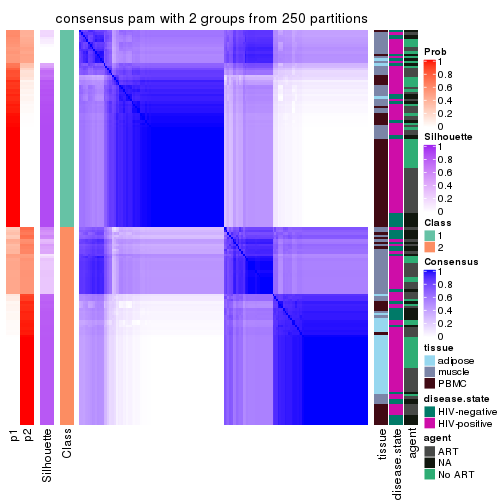</p>

</div>
<div id='tab-ATC-pam-consensus-heatmap-2'>
<pre><code class="r">consensus_heatmap(res, k = 3)
</code></pre>

<p>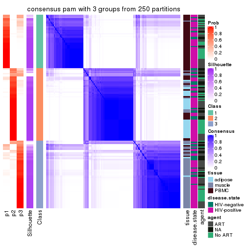</p>

</div>
<div id='tab-ATC-pam-consensus-heatmap-3'>
<pre><code class="r">consensus_heatmap(res, k = 4)
</code></pre>

<p>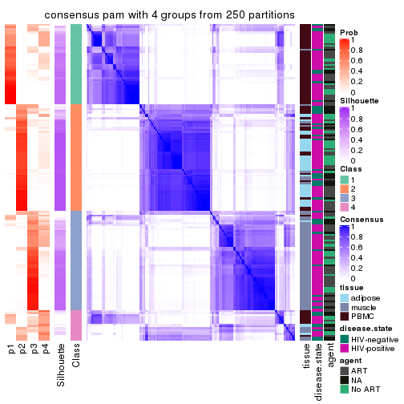</p>

</div>
<div id='tab-ATC-pam-consensus-heatmap-4'>
<pre><code class="r">consensus_heatmap(res, k = 5)
</code></pre>

<p>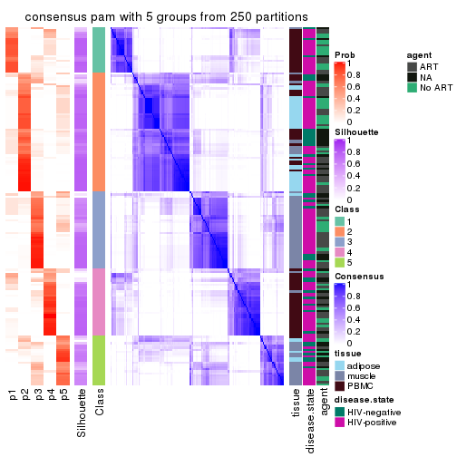</p>

</div>
<div id='tab-ATC-pam-consensus-heatmap-5'>
<pre><code class="r">consensus_heatmap(res, k = 6)
</code></pre>

<p>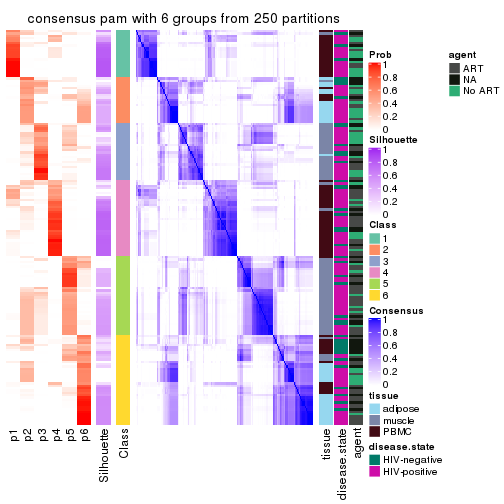</p>

</div>
</div>

Heatmaps for the membership of samples in all partitions to see how consistent they are:


<script>
$( function() {
	$( '#tabs-ATC-pam-membership-heatmap' ).tabs();
} );
</script>
<div id='tabs-ATC-pam-membership-heatmap'>
<ul>
<li><a href='#tab-ATC-pam-membership-heatmap-1'>k = 2</a></li>
<li><a href='#tab-ATC-pam-membership-heatmap-2'>k = 3</a></li>
<li><a href='#tab-ATC-pam-membership-heatmap-3'>k = 4</a></li>
<li><a href='#tab-ATC-pam-membership-heatmap-4'>k = 5</a></li>
<li><a href='#tab-ATC-pam-membership-heatmap-5'>k = 6</a></li>
</ul>
<div id='tab-ATC-pam-membership-heatmap-1'>
<pre><code class="r">membership_heatmap(res, k = 2)
</code></pre>

<p>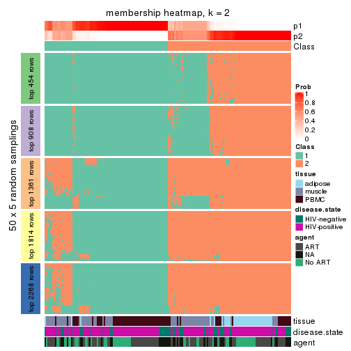</p>

</div>
<div id='tab-ATC-pam-membership-heatmap-2'>
<pre><code class="r">membership_heatmap(res, k = 3)
</code></pre>

<p>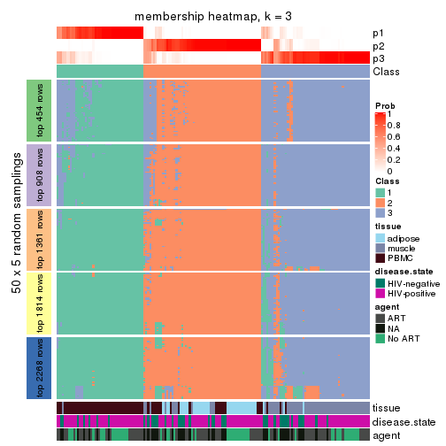</p>

</div>
<div id='tab-ATC-pam-membership-heatmap-3'>
<pre><code class="r">membership_heatmap(res, k = 4)
</code></pre>

<p>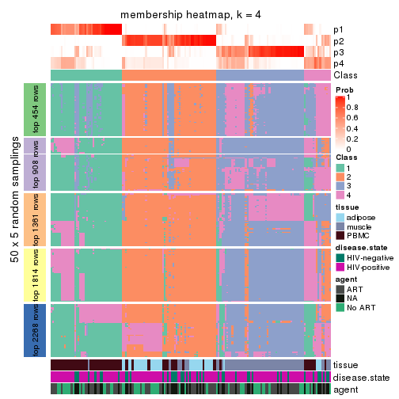</p>

</div>
<div id='tab-ATC-pam-membership-heatmap-4'>
<pre><code class="r">membership_heatmap(res, k = 5)
</code></pre>

<p>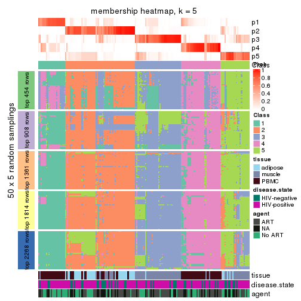</p>

</div>
<div id='tab-ATC-pam-membership-heatmap-5'>
<pre><code class="r">membership_heatmap(res, k = 6)
</code></pre>

<p>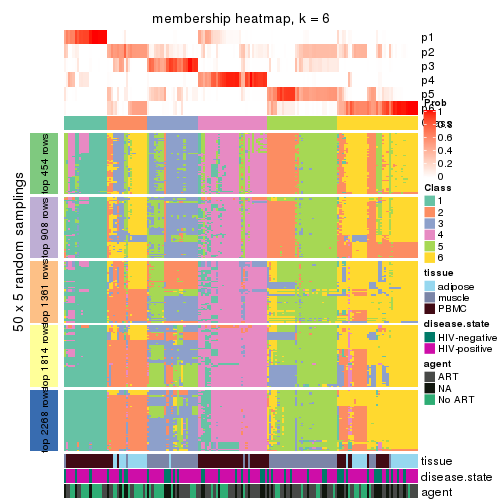</p>

</div>
</div>

As soon as we have had the classes for columns, we can look for signatures
which are significantly different between classes which can be candidate marks
for certain classes. Following are the heatmaps for signatures.


Signature heatmaps where rows are scaled:


<script>
$( function() {
	$( '#tabs-ATC-pam-get-signatures' ).tabs();
} );
</script>
<div id='tabs-ATC-pam-get-signatures'>
<ul>
<li><a href='#tab-ATC-pam-get-signatures-1'>k = 2</a></li>
<li><a href='#tab-ATC-pam-get-signatures-2'>k = 3</a></li>
<li><a href='#tab-ATC-pam-get-signatures-3'>k = 4</a></li>
<li><a href='#tab-ATC-pam-get-signatures-4'>k = 5</a></li>
<li><a href='#tab-ATC-pam-get-signatures-5'>k = 6</a></li>
</ul>
<div id='tab-ATC-pam-get-signatures-1'>
<pre><code class="r">get_signatures(res, k = 2)
</code></pre>

<p>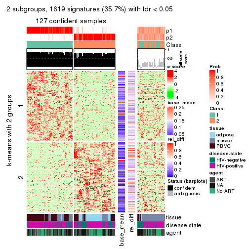</p>

</div>
<div id='tab-ATC-pam-get-signatures-2'>
<pre><code class="r">get_signatures(res, k = 3)
</code></pre>

<p>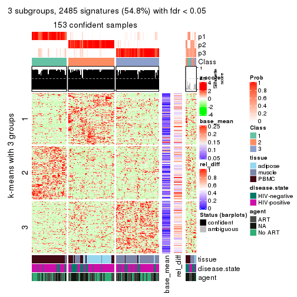</p>

</div>
<div id='tab-ATC-pam-get-signatures-3'>
<pre><code class="r">get_signatures(res, k = 4)
</code></pre>

<p>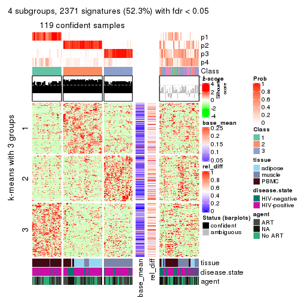</p>

</div>
<div id='tab-ATC-pam-get-signatures-4'>
<pre><code class="r">get_signatures(res, k = 5)
</code></pre>

<p>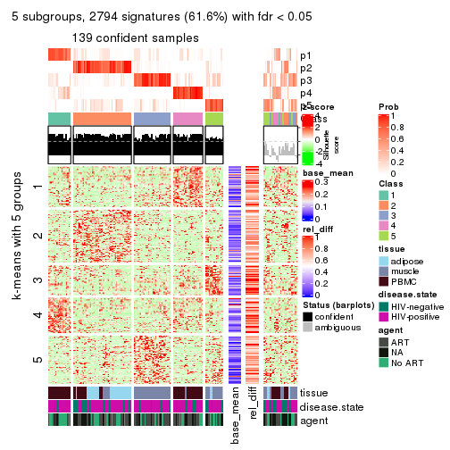</p>

</div>
<div id='tab-ATC-pam-get-signatures-5'>
<pre><code class="r">get_signatures(res, k = 6)
</code></pre>

<p>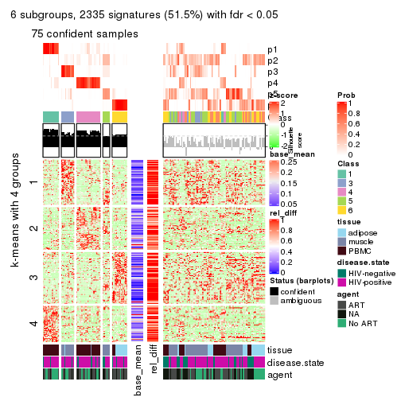</p>

</div>
</div>


Signature heatmaps where rows are not scaled:


<script>
$( function() {
	$( '#tabs-ATC-pam-get-signatures-no-scale' ).tabs();
} );
</script>
<div id='tabs-ATC-pam-get-signatures-no-scale'>
<ul>
<li><a href='#tab-ATC-pam-get-signatures-no-scale-1'>k = 2</a></li>
<li><a href='#tab-ATC-pam-get-signatures-no-scale-2'>k = 3</a></li>
<li><a href='#tab-ATC-pam-get-signatures-no-scale-3'>k = 4</a></li>
<li><a href='#tab-ATC-pam-get-signatures-no-scale-4'>k = 5</a></li>
<li><a href='#tab-ATC-pam-get-signatures-no-scale-5'>k = 6</a></li>
</ul>
<div id='tab-ATC-pam-get-signatures-no-scale-1'>
<pre><code class="r">get_signatures(res, k = 2, scale_rows = FALSE)
</code></pre>

<p>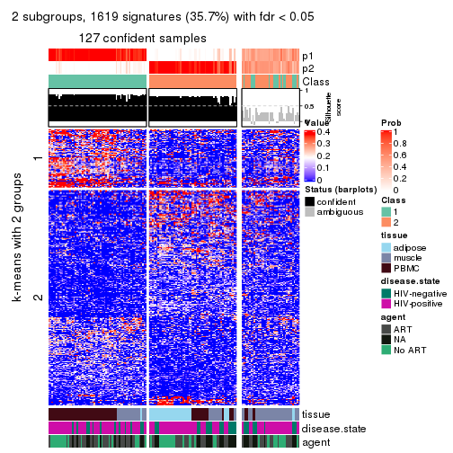</p>

</div>
<div id='tab-ATC-pam-get-signatures-no-scale-2'>
<pre><code class="r">get_signatures(res, k = 3, scale_rows = FALSE)
</code></pre>

<p>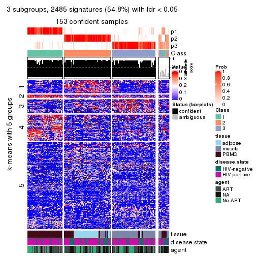</p>

</div>
<div id='tab-ATC-pam-get-signatures-no-scale-3'>
<pre><code class="r">get_signatures(res, k = 4, scale_rows = FALSE)
</code></pre>

<p>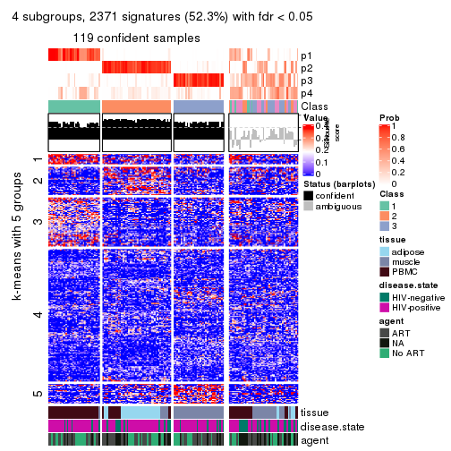</p>

</div>
<div id='tab-ATC-pam-get-signatures-no-scale-4'>
<pre><code class="r">get_signatures(res, k = 5, scale_rows = FALSE)
</code></pre>

<p>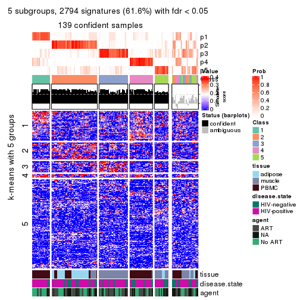</p>

</div>
<div id='tab-ATC-pam-get-signatures-no-scale-5'>
<pre><code class="r">get_signatures(res, k = 6, scale_rows = FALSE)
</code></pre>

<p>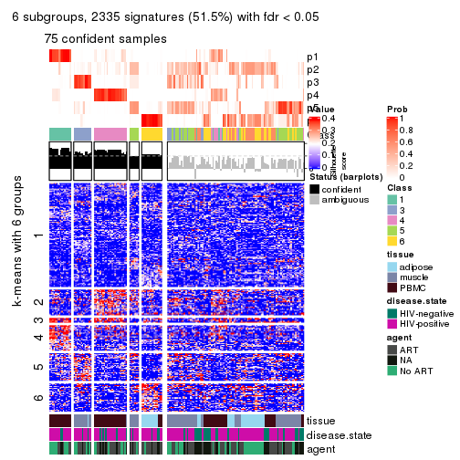</p>

</div>
</div>


Compare the overlap of signatures from different k:

```r
compare_signatures(res)
```

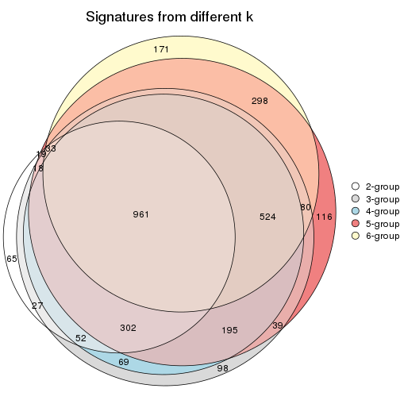

`get_signature()` returns a data frame invisibly. TO get the list of signatures, the function
call should be assigned to a variable explicitly. In following code, if `plot` argument is set
to `FALSE`, no heatmap is plotted while only the differential analysis is performed.

```r
# code only for demonstration
tb = get_signature(res, k = ..., plot = FALSE)
```

An example of the output of `tb` is:

```
#>   which_row         fdr    mean_1    mean_2 scaled_mean_1 scaled_mean_2 km
#> 1        38 0.042760348  8.373488  9.131774    -0.5533452     0.5164555  1
#> 2        40 0.018707592  7.106213  8.469186    -0.6173731     0.5762149  1
#> 3        55 0.019134737 10.221463 11.207825    -0.6159697     0.5749050  1
#> 4        59 0.006059896  5.921854  7.869574    -0.6899429     0.6439467  1
#> 5        60 0.018055526  8.928898 10.211722    -0.6204761     0.5791110  1
#> 6        98 0.009384629 15.714769 14.887706     0.6635654    -0.6193277  2
...
```

The columns in `tb` are:

1. `which_row`: row indices corresponding to the input matrix.
2. `fdr`: FDR for the differential test. 
3. `mean_x`: The mean value in group x.
4. `scaled_mean_x`: The mean value in group x after rows are scaled.
5. `km`: Row groups if k-means clustering is applied to rows.


UMAP plot which shows how samples are separated.


<script>
$( function() {
	$( '#tabs-ATC-pam-dimension-reduction' ).tabs();
} );
</script>
<div id='tabs-ATC-pam-dimension-reduction'>
<ul>
<li><a href='#tab-ATC-pam-dimension-reduction-1'>k = 2</a></li>
<li><a href='#tab-ATC-pam-dimension-reduction-2'>k = 3</a></li>
<li><a href='#tab-ATC-pam-dimension-reduction-3'>k = 4</a></li>
<li><a href='#tab-ATC-pam-dimension-reduction-4'>k = 5</a></li>
<li><a href='#tab-ATC-pam-dimension-reduction-5'>k = 6</a></li>
</ul>
<div id='tab-ATC-pam-dimension-reduction-1'>
<pre><code class="r">dimension_reduction(res, k = 2, method = &quot;UMAP&quot;)
</code></pre>

<p>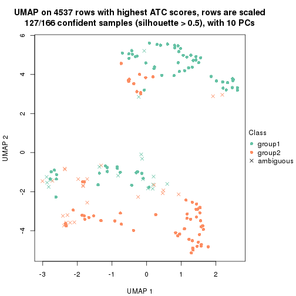</p>

</div>
<div id='tab-ATC-pam-dimension-reduction-2'>
<pre><code class="r">dimension_reduction(res, k = 3, method = &quot;UMAP&quot;)
</code></pre>

<p>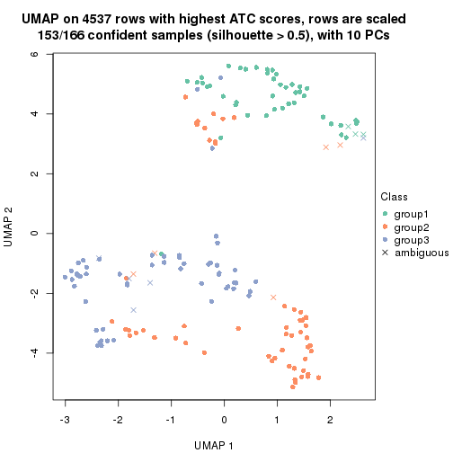</p>

</div>
<div id='tab-ATC-pam-dimension-reduction-3'>
<pre><code class="r">dimension_reduction(res, k = 4, method = &quot;UMAP&quot;)
</code></pre>

<p>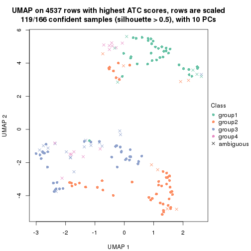</p>

</div>
<div id='tab-ATC-pam-dimension-reduction-4'>
<pre><code class="r">dimension_reduction(res, k = 5, method = &quot;UMAP&quot;)
</code></pre>

<p>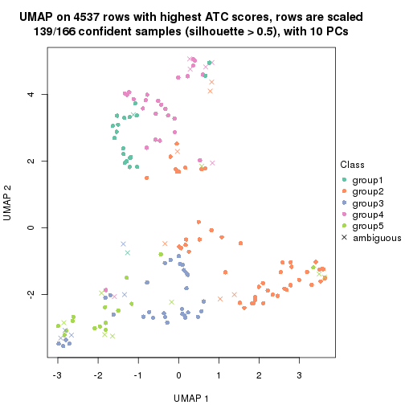</p>

</div>
<div id='tab-ATC-pam-dimension-reduction-5'>
<pre><code class="r">dimension_reduction(res, k = 6, method = &quot;UMAP&quot;)
</code></pre>

<p>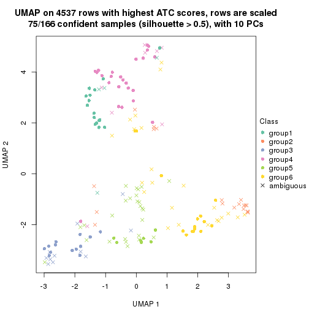</p>

</div>
</div>


Following heatmap shows how subgroups are split when increasing `k`:

```r
collect_classes(res)
```

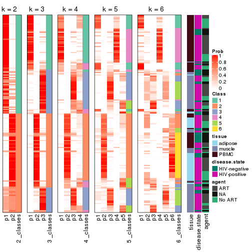


Test correlation between subgroups and known annotations. If the known
annotation is numeric, one-way ANOVA test is applied, and if the known
annotation is discrete, chi-squared contingency table test is applied.

```r
test_to_known_factors(res)
```

```
#>           n tissue(p) disease.state(p) agent(p) k
#> ATC:pam 127  5.46e-11            0.164    0.249 2
#> ATC:pam 153  1.12e-34            0.242    0.457 3
#> ATC:pam 119  1.59e-31            0.411    0.755 4
#> ATC:pam 139  2.27e-32            0.422    0.202 5
#> ATC:pam  75  9.54e-22            0.904    0.187 6
```


If matrix rows can be associated to genes, consider to use `GO_Enrichment(res,
...)` to perform function enrichment for the signature genes.


 

---------------------------------------------------


### ATC:mclust**


The object with results only for a single top-value method and a single partition method 
can be extracted as:

```r
res = res_list["ATC", "mclust"]
# you can also extract it by
# res = res_list["ATC:mclust"]
```

A summary of `res` and all the functions that can be applied to it:

```r
res
```

```
#> A 'ConsensusPartition' object with k = 2, 3, 4, 5, 6.
#>   On a matrix with 4537 rows and 166 columns.
#>   Top rows (454, 908, 1361, 1814, 2268) are extracted by 'ATC' method.
#>   Subgroups are detected by 'mclust' method.
#>   Performed in total 1250 partitions by row resampling.
#>   Best k for subgroups seems to be 2.
#> 
#> Following methods can be applied to this 'ConsensusPartition' object:
#>  [1] "cola_report"             "collect_classes"         "collect_plots"          
#>  [4] "collect_stats"           "colnames"                "compare_signatures"     
#>  [7] "consensus_heatmap"       "dimension_reduction"     "functional_enrichment"  
#> [10] "get_anno_col"            "get_anno"                "get_classes"            
#> [13] "get_consensus"           "get_matrix"              "get_membership"         
#> [16] "get_param"               "get_signatures"          "get_stats"              
#> [19] "is_best_k"               "is_stable_k"             "membership_heatmap"     
#> [22] "ncol"                    "nrow"                    "plot_ecdf"              
#> [25] "rownames"                "select_partition_number" "show"                   
#> [28] "suggest_best_k"          "test_to_known_factors"
```

`collect_plots()` function collects all the plots made from `res` for all `k` (number of partitions)
into one single page to provide an easy and fast comparison between different `k`.

```r
collect_plots(res)
```

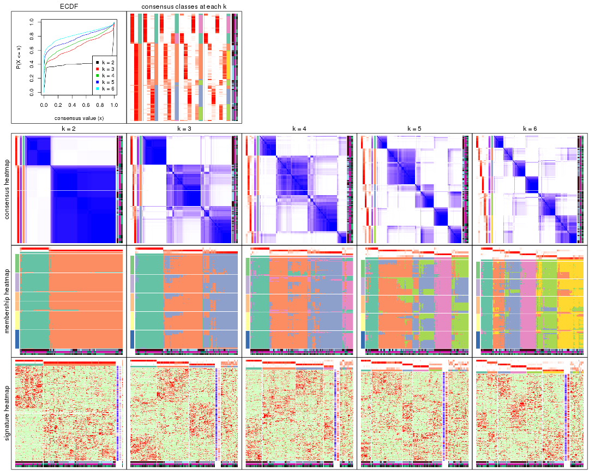

The plots are:

- The first row: a plot of the ECDF (Empirical cumulative distribution
  function) curves of the consensus matrix for each `k` and the heatmap of
  predicted classes for each `k`.
- The second row: heatmaps of the consensus matrix for each `k`.
- The third row: heatmaps of the membership matrix for each `k`.
- The fouth row: heatmaps of the signatures for each `k`.

All the plots in panels can be made by individual functions and they are
plotted later in this section.

`select_partition_number()` produces several plots showing different
statistics for choosing "optimized" `k`. There are following statistics:

- ECDF curves of the consensus matrix for each `k`;
- 1-PAC. [The PAC
  score](https://en.wikipedia.org/wiki/Consensus_clustering#Over-interpretation_potential_of_consensus_clustering)
  measures the proportion of the ambiguous subgrouping.
- Mean silhouette score.
- Concordance. The mean probability of fiting the consensus class ids in all
  partitions.
- Area increased. Denote $A_k$ as the area under the ECDF curve for current
  `k`, the area increased is defined as $A_k - A_{k-1}$.
- Rand index. The percent of pairs of samples that are both in a same cluster
  or both are not in a same cluster in the partition of k and k-1.
- Jaccard index. The ratio of pairs of samples are both in a same cluster in
  the partition of k and k-1 and the pairs of samples are both in a same
  cluster in the partition k or k-1.

The detailed explanations of these statistics can be found in [the cola
vignette](http://bioconductor.org/packages/devel/bioc/vignettes/cola/inst/doc/cola.html#toc_13).

Generally speaking, lower PAC score, higher mean silhouette score or higher
concordance corresponds to better partition. Rand index and Jaccard index
measure how similar the current partition is compared to partition with `k-1`.
If they are too similar, we won't accept `k` is better than `k-1`.

```r
select_partition_number(res)
```

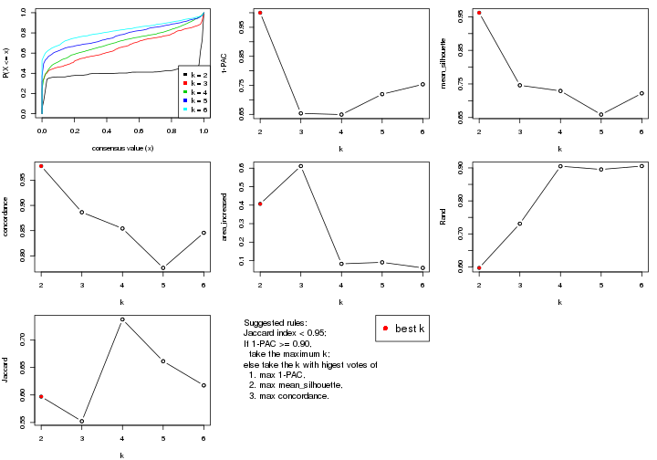

The numeric values for all these statistics can be obtained by `get_stats()`.

```r
get_stats(res)
```

```
#>   k 1-PAC mean_silhouette concordance area_increased  Rand Jaccard
#> 2 2 1.000           0.962       0.978         0.4070 0.597   0.597
#> 3 3 0.653           0.746       0.886         0.6114 0.731   0.552
#> 4 4 0.649           0.729       0.854         0.0827 0.905   0.737
#> 5 5 0.720           0.659       0.776         0.0906 0.895   0.661
#> 6 6 0.753           0.722       0.846         0.0607 0.906   0.617
```

`suggest_best_k()` suggests the best $k$ based on these statistics. The rules are as follows:

- All $k$ with Jaccard index larger than 0.95 are removed because the increase of
  the partition number does not provides enough extra information. If all $k$ are removed,
  the best $k$ is assigned by `NA`.
- For $k$ with 1-PAC larger than 0.9, the maximal $k$ is taken as the "best k". Other $k$ is called "optional k".
- If it does not fit the second rule. The $k$ with the highest vote of highest
  1-PAC, mean silhouette and concordance is taken as the "best k".

```r
suggest_best_k(res)
```

```
#> [1] 2
```


Following shows the table of the partitions (You need to click the **show/hide
code output** link to see it). The membership matrix (columns with name `p*`)
is inferred by
[`clue::cl_consensus()`](https://www.rdocumentation.org/link/cl_consensus?package=clue)
function with the `SE` method. Basically the value in the membership matrix
represents the probability to belong to a certain group. The finall class
label for an item is determined with the group with highest probability it
belongs to.

In `get_classes()` function, the entropy is calculated from the membership
matrix and the silhouette score is calculated from the consensus matrix.


<script>
$( function() {
	$( '#tabs-ATC-mclust-get-classes' ).tabs();
} );
</script>
<div id='tabs-ATC-mclust-get-classes'>
<ul>
<li><a href='#tab-ATC-mclust-get-classes-1'>k = 2</a></li>
<li><a href='#tab-ATC-mclust-get-classes-2'>k = 3</a></li>
<li><a href='#tab-ATC-mclust-get-classes-3'>k = 4</a></li>
<li><a href='#tab-ATC-mclust-get-classes-4'>k = 5</a></li>
<li><a href='#tab-ATC-mclust-get-classes-5'>k = 6</a></li>
</ul>

<div id='tab-ATC-mclust-get-classes-1'>
<p><a id='tab-ATC-mclust-get-classes-1-a' style='color:#0366d6' href='#'>show/hide code output</a></p>
<pre><code class="r">cbind(get_classes(res, k = 2), get_membership(res, k = 2))
</code></pre>

<pre><code>#&gt;           class entropy silhouette    p1    p2
#&gt; GSM751298     1  0.1414      0.967 0.980 0.020
#&gt; GSM751304     2  0.0672      0.980 0.008 0.992
#&gt; GSM751305     2  0.0672      0.980 0.008 0.992
#&gt; GSM751307     2  0.1184      0.977 0.016 0.984
#&gt; GSM751310     1  0.1184      0.974 0.984 0.016
#&gt; GSM751314     1  0.1184      0.974 0.984 0.016
#&gt; GSM751316     1  0.1184      0.974 0.984 0.016
#&gt; GSM751318     1  0.1633      0.971 0.976 0.024
#&gt; GSM751342     2  0.9944      0.135 0.456 0.544
#&gt; GSM751346     1  0.0938      0.970 0.988 0.012
#&gt; GSM751347     2  0.6712      0.797 0.176 0.824
#&gt; GSM751348     2  0.0000      0.981 0.000 1.000
#&gt; GSM751349     2  0.0376      0.980 0.004 0.996
#&gt; GSM751352     2  0.1184      0.977 0.016 0.984
#&gt; GSM751353     2  0.1184      0.977 0.016 0.984
#&gt; GSM751354     2  0.1184      0.977 0.016 0.984
#&gt; GSM751355     2  0.1184      0.977 0.016 0.984
#&gt; GSM751358     2  0.0672      0.980 0.008 0.992
#&gt; GSM751359     2  0.0376      0.981 0.004 0.996
#&gt; GSM751294     2  0.0672      0.980 0.008 0.992
#&gt; GSM751296     1  0.0938      0.970 0.988 0.012
#&gt; GSM751297     1  0.6247      0.824 0.844 0.156
#&gt; GSM751299     2  0.1184      0.977 0.016 0.984
#&gt; GSM751300     1  0.0938      0.970 0.988 0.012
#&gt; GSM751301     2  0.1633      0.973 0.024 0.976
#&gt; GSM751302     1  0.0938      0.970 0.988 0.012
#&gt; GSM751303     1  0.1184      0.974 0.984 0.016
#&gt; GSM751306     1  0.1184      0.974 0.984 0.016
#&gt; GSM751308     2  0.0672      0.980 0.008 0.992
#&gt; GSM751309     1  0.1184      0.974 0.984 0.016
#&gt; GSM751311     1  0.1184      0.974 0.984 0.016
#&gt; GSM751312     1  0.1184      0.974 0.984 0.016
#&gt; GSM751313     1  0.0672      0.972 0.992 0.008
#&gt; GSM751315     1  0.1184      0.974 0.984 0.016
#&gt; GSM751317     1  0.1184      0.974 0.984 0.016
#&gt; GSM751320     1  0.1184      0.974 0.984 0.016
#&gt; GSM751321     1  0.1184      0.974 0.984 0.016
#&gt; GSM751322     1  0.1184      0.974 0.984 0.016
#&gt; GSM751324     1  0.1184      0.974 0.984 0.016
#&gt; GSM751325     1  0.1184      0.974 0.984 0.016
#&gt; GSM751332     1  0.0938      0.973 0.988 0.012
#&gt; GSM751334     1  0.1184      0.974 0.984 0.016
#&gt; GSM751339     1  0.2603      0.956 0.956 0.044
#&gt; GSM751341     1  0.1184      0.969 0.984 0.016
#&gt; GSM751343     1  0.1184      0.974 0.984 0.016
#&gt; GSM751344     2  0.1184      0.977 0.016 0.984
#&gt; GSM751345     2  0.1184      0.977 0.016 0.984
#&gt; GSM751356     2  0.0672      0.980 0.008 0.992
#&gt; GSM751357     2  0.0672      0.980 0.008 0.992
#&gt; GSM751293     2  0.1843      0.970 0.028 0.972
#&gt; GSM751295     1  0.0938      0.970 0.988 0.012
#&gt; GSM751319     1  0.1184      0.974 0.984 0.016
#&gt; GSM751323     1  0.1184      0.974 0.984 0.016
#&gt; GSM751326     1  0.0938      0.970 0.988 0.012
#&gt; GSM751327     1  0.1184      0.974 0.984 0.016
#&gt; GSM751328     1  0.0672      0.973 0.992 0.008
#&gt; GSM751329     1  0.0938      0.970 0.988 0.012
#&gt; GSM751330     1  0.0938      0.970 0.988 0.012
#&gt; GSM751331     1  0.0938      0.970 0.988 0.012
#&gt; GSM751333     1  0.0376      0.971 0.996 0.004
#&gt; GSM751335     1  0.0938      0.970 0.988 0.012
#&gt; GSM751336     1  0.0938      0.970 0.988 0.012
#&gt; GSM751337     1  0.0376      0.971 0.996 0.004
#&gt; GSM751338     1  0.1414      0.973 0.980 0.020
#&gt; GSM751340     1  0.8499      0.645 0.724 0.276
#&gt; GSM751350     1  0.0938      0.970 0.988 0.012
#&gt; GSM751351     1  0.0938      0.970 0.988 0.012
#&gt; GSM751362     2  0.0672      0.980 0.008 0.992
#&gt; GSM751363     2  0.0672      0.980 0.008 0.992
#&gt; GSM751367     1  0.8763      0.594 0.704 0.296
#&gt; GSM751368     2  0.0376      0.981 0.004 0.996
#&gt; GSM751371     2  0.8081      0.671 0.248 0.752
#&gt; GSM751375     2  0.0000      0.981 0.000 1.000
#&gt; GSM751376     2  0.1414      0.978 0.020 0.980
#&gt; GSM751378     2  0.0672      0.980 0.008 0.992
#&gt; GSM751379     2  0.1184      0.977 0.016 0.984
#&gt; GSM751382     2  0.0000      0.981 0.000 1.000
#&gt; GSM751386     2  0.0000      0.981 0.000 1.000
#&gt; GSM751388     2  0.0000      0.981 0.000 1.000
#&gt; GSM751391     2  0.0672      0.980 0.008 0.992
#&gt; GSM751410     2  0.0672      0.980 0.008 0.992
#&gt; GSM751414     2  0.3733      0.922 0.072 0.928
#&gt; GSM751361     2  0.0672      0.980 0.008 0.992
#&gt; GSM751365     2  0.0672      0.980 0.008 0.992
#&gt; GSM751366     2  0.6712      0.789 0.176 0.824
#&gt; GSM751369     2  0.0672      0.980 0.008 0.992
#&gt; GSM751370     2  0.0672      0.980 0.008 0.992
#&gt; GSM751372     2  0.0672      0.980 0.008 0.992
#&gt; GSM751373     2  0.2778      0.948 0.048 0.952
#&gt; GSM751374     2  0.1184      0.977 0.016 0.984
#&gt; GSM751377     2  0.0000      0.981 0.000 1.000
#&gt; GSM751380     2  0.0672      0.980 0.008 0.992
#&gt; GSM751381     2  0.0000      0.981 0.000 1.000
#&gt; GSM751383     2  0.0000      0.981 0.000 1.000
#&gt; GSM751384     2  0.0672      0.980 0.008 0.992
#&gt; GSM751385     2  0.0000      0.981 0.000 1.000
#&gt; GSM751387     2  0.0000      0.981 0.000 1.000
#&gt; GSM751389     2  0.0672      0.980 0.008 0.992
#&gt; GSM751393     2  0.0376      0.981 0.004 0.996
#&gt; GSM751394     2  0.0000      0.981 0.000 1.000
#&gt; GSM751395     2  0.0376      0.981 0.004 0.996
#&gt; GSM751397     2  0.0672      0.980 0.008 0.992
#&gt; GSM751398     2  0.0000      0.981 0.000 1.000
#&gt; GSM751404     2  0.0672      0.980 0.008 0.992
#&gt; GSM751406     2  0.0672      0.980 0.008 0.992
#&gt; GSM751411     2  0.0672      0.980 0.008 0.992
#&gt; GSM751413     2  0.0376      0.981 0.004 0.996
#&gt; GSM751415     2  0.0672      0.980 0.008 0.992
#&gt; GSM751416     2  0.0672      0.980 0.008 0.992
#&gt; GSM751417     2  0.0672      0.980 0.008 0.992
#&gt; GSM751421     2  0.0672      0.980 0.008 0.992
#&gt; GSM751422     2  0.0672      0.980 0.008 0.992
#&gt; GSM751360     2  0.0672      0.980 0.008 0.992
#&gt; GSM751364     2  0.0672      0.980 0.008 0.992
#&gt; GSM751390     2  0.0672      0.980 0.008 0.992
#&gt; GSM751392     2  0.0000      0.981 0.000 1.000
#&gt; GSM751396     2  0.0000      0.981 0.000 1.000
#&gt; GSM751399     2  0.0672      0.980 0.008 0.992
#&gt; GSM751400     2  0.0376      0.981 0.004 0.996
#&gt; GSM751401     2  0.0672      0.980 0.008 0.992
#&gt; GSM751402     2  0.0672      0.980 0.008 0.992
#&gt; GSM751403     2  0.0672      0.980 0.008 0.992
#&gt; GSM751405     2  0.0672      0.980 0.008 0.992
#&gt; GSM751407     2  0.0672      0.980 0.008 0.992
#&gt; GSM751408     2  0.0672      0.980 0.008 0.992
#&gt; GSM751409     2  0.0672      0.980 0.008 0.992
#&gt; GSM751412     2  0.0672      0.980 0.008 0.992
#&gt; GSM751418     2  0.0672      0.980 0.008 0.992
#&gt; GSM751419     2  0.0672      0.980 0.008 0.992
#&gt; GSM751420     2  0.1184      0.977 0.016 0.984
#&gt; GSM751425     2  0.0000      0.981 0.000 1.000
#&gt; GSM751429     2  0.2236      0.964 0.036 0.964
#&gt; GSM751430     2  0.1184      0.977 0.016 0.984
#&gt; GSM751433     2  0.0000      0.981 0.000 1.000
#&gt; GSM751437     2  0.0672      0.980 0.008 0.992
#&gt; GSM751448     2  0.1633      0.978 0.024 0.976
#&gt; GSM751451     2  0.0672      0.980 0.008 0.992
#&gt; GSM751423     2  0.0376      0.981 0.004 0.996
#&gt; GSM751424     2  0.0672      0.979 0.008 0.992
#&gt; GSM751428     2  0.1184      0.977 0.016 0.984
#&gt; GSM751431     2  0.0000      0.981 0.000 1.000
#&gt; GSM751432     2  0.1184      0.977 0.016 0.984
#&gt; GSM751434     2  0.1184      0.977 0.016 0.984
#&gt; GSM751435     2  0.1184      0.977 0.016 0.984
#&gt; GSM751436     2  0.0672      0.979 0.008 0.992
#&gt; GSM751440     2  0.0000      0.981 0.000 1.000
#&gt; GSM751444     2  0.1184      0.977 0.016 0.984
#&gt; GSM751446     2  0.1184      0.977 0.016 0.984
#&gt; GSM751449     2  0.1184      0.977 0.016 0.984
#&gt; GSM751450     2  0.1184      0.977 0.016 0.984
#&gt; GSM751452     2  0.1184      0.977 0.016 0.984
#&gt; GSM751426     2  0.1184      0.977 0.016 0.984
#&gt; GSM751427     2  0.1184      0.977 0.016 0.984
#&gt; GSM751438     2  0.1184      0.977 0.016 0.984
#&gt; GSM751439     2  0.1184      0.977 0.016 0.984
#&gt; GSM751441     2  0.1184      0.977 0.016 0.984
#&gt; GSM751442     2  0.1184      0.977 0.016 0.984
#&gt; GSM751443     2  0.1184      0.977 0.016 0.984
#&gt; GSM751445     2  0.1184      0.977 0.016 0.984
#&gt; GSM751447     2  0.1184      0.977 0.016 0.984
#&gt; GSM751453     2  0.1184      0.977 0.016 0.984
#&gt; GSM751454     2  0.1184      0.977 0.016 0.984
#&gt; GSM751455     2  0.1184      0.977 0.016 0.984
#&gt; GSM751456     2  0.1184      0.977 0.016 0.984
#&gt; GSM751457     2  0.1184      0.977 0.016 0.984
#&gt; GSM751458     2  0.1184      0.977 0.016 0.984
</code></pre>

<script>
$('#tab-ATC-mclust-get-classes-1-a').parent().next().next().hide();
$('#tab-ATC-mclust-get-classes-1-a').click(function(){
  $('#tab-ATC-mclust-get-classes-1-a').parent().next().next().toggle();
  return(false);
});
</script>
</div>

<div id='tab-ATC-mclust-get-classes-2'>
<p><a id='tab-ATC-mclust-get-classes-2-a' style='color:#0366d6' href='#'>show/hide code output</a></p>
<pre><code class="r">cbind(get_classes(res, k = 3), get_membership(res, k = 3))
</code></pre>

<pre><code>#&gt;           class entropy silhouette    p1    p2    p3
#&gt; GSM751298     1  0.0237     0.9645 0.996 0.000 0.004
#&gt; GSM751304     2  0.6280     0.2612 0.000 0.540 0.460
#&gt; GSM751305     2  0.6244     0.3118 0.000 0.560 0.440
#&gt; GSM751307     2  0.0000     0.8303 0.000 1.000 0.000
#&gt; GSM751310     1  0.0000     0.9654 1.000 0.000 0.000
#&gt; GSM751314     1  0.0000     0.9654 1.000 0.000 0.000
#&gt; GSM751316     1  0.1753     0.9247 0.952 0.000 0.048
#&gt; GSM751318     1  0.4233     0.7939 0.836 0.004 0.160
#&gt; GSM751342     3  0.7489     0.0611 0.468 0.036 0.496
#&gt; GSM751346     1  0.0592     0.9621 0.988 0.000 0.012
#&gt; GSM751347     3  0.6925     0.2904 0.016 0.452 0.532
#&gt; GSM751348     2  0.4702     0.7332 0.000 0.788 0.212
#&gt; GSM751349     2  0.2165     0.8182 0.000 0.936 0.064
#&gt; GSM751352     2  0.0000     0.8303 0.000 1.000 0.000
#&gt; GSM751353     2  0.0000     0.8303 0.000 1.000 0.000
#&gt; GSM751354     2  0.0237     0.8294 0.000 0.996 0.004
#&gt; GSM751355     2  0.0000     0.8303 0.000 1.000 0.000
#&gt; GSM751358     3  0.1860     0.7971 0.000 0.052 0.948
#&gt; GSM751359     2  0.5678     0.5751 0.000 0.684 0.316
#&gt; GSM751294     3  0.1289     0.8044 0.000 0.032 0.968
#&gt; GSM751296     1  0.0424     0.9634 0.992 0.000 0.008
#&gt; GSM751297     3  0.8361     0.3544 0.092 0.364 0.544
#&gt; GSM751299     2  0.0237     0.8293 0.000 0.996 0.004
#&gt; GSM751300     1  0.0592     0.9621 0.988 0.000 0.012
#&gt; GSM751301     2  0.0000     0.8303 0.000 1.000 0.000
#&gt; GSM751302     1  0.0592     0.9621 0.988 0.000 0.012
#&gt; GSM751303     1  0.3686     0.8236 0.860 0.000 0.140
#&gt; GSM751306     1  0.0000     0.9654 1.000 0.000 0.000
#&gt; GSM751308     3  0.1170     0.8085 0.008 0.016 0.976
#&gt; GSM751309     1  0.0000     0.9654 1.000 0.000 0.000
#&gt; GSM751311     1  0.0000     0.9654 1.000 0.000 0.000
#&gt; GSM751312     1  0.0237     0.9633 0.996 0.000 0.004
#&gt; GSM751313     1  0.0000     0.9654 1.000 0.000 0.000
#&gt; GSM751315     1  0.0000     0.9654 1.000 0.000 0.000
#&gt; GSM751317     1  0.0237     0.9633 0.996 0.000 0.004
#&gt; GSM751320     1  0.0000     0.9654 1.000 0.000 0.000
#&gt; GSM751321     1  0.0000     0.9654 1.000 0.000 0.000
#&gt; GSM751322     1  0.0000     0.9654 1.000 0.000 0.000
#&gt; GSM751324     1  0.0000     0.9654 1.000 0.000 0.000
#&gt; GSM751325     1  0.0000     0.9654 1.000 0.000 0.000
#&gt; GSM751332     1  0.0000     0.9654 1.000 0.000 0.000
#&gt; GSM751334     1  0.0000     0.9654 1.000 0.000 0.000
#&gt; GSM751339     1  0.4504     0.7444 0.804 0.000 0.196
#&gt; GSM751341     1  0.0592     0.9571 0.988 0.012 0.000
#&gt; GSM751343     1  0.0000     0.9654 1.000 0.000 0.000
#&gt; GSM751344     2  0.0000     0.8303 0.000 1.000 0.000
#&gt; GSM751345     2  0.0000     0.8303 0.000 1.000 0.000
#&gt; GSM751356     3  0.2711     0.7772 0.000 0.088 0.912
#&gt; GSM751357     3  0.5529     0.5003 0.000 0.296 0.704
#&gt; GSM751293     2  0.0000     0.8303 0.000 1.000 0.000
#&gt; GSM751295     1  0.0592     0.9621 0.988 0.000 0.012
#&gt; GSM751319     1  0.0000     0.9654 1.000 0.000 0.000
#&gt; GSM751323     1  0.0000     0.9654 1.000 0.000 0.000
#&gt; GSM751326     1  0.0000     0.9654 1.000 0.000 0.000
#&gt; GSM751327     1  0.0000     0.9654 1.000 0.000 0.000
#&gt; GSM751328     1  0.0000     0.9654 1.000 0.000 0.000
#&gt; GSM751329     1  0.0000     0.9654 1.000 0.000 0.000
#&gt; GSM751330     1  0.0424     0.9634 0.992 0.000 0.008
#&gt; GSM751331     1  0.0592     0.9621 0.988 0.000 0.012
#&gt; GSM751333     1  0.0000     0.9654 1.000 0.000 0.000
#&gt; GSM751335     1  0.0237     0.9645 0.996 0.000 0.004
#&gt; GSM751336     1  0.0592     0.9621 0.988 0.000 0.012
#&gt; GSM751337     1  0.0000     0.9654 1.000 0.000 0.000
#&gt; GSM751338     1  0.0000     0.9654 1.000 0.000 0.000
#&gt; GSM751340     1  0.6111     0.3357 0.604 0.000 0.396
#&gt; GSM751350     1  0.0592     0.9621 0.988 0.000 0.012
#&gt; GSM751351     1  0.0592     0.9621 0.988 0.000 0.012
#&gt; GSM751362     3  0.0592     0.8091 0.000 0.012 0.988
#&gt; GSM751363     2  0.6274     0.2692 0.000 0.544 0.456
#&gt; GSM751367     1  0.8649     0.4642 0.596 0.232 0.172
#&gt; GSM751368     2  0.6180     0.3667 0.000 0.584 0.416
#&gt; GSM751371     3  0.5036     0.6873 0.172 0.020 0.808
#&gt; GSM751375     2  0.2165     0.8184 0.000 0.936 0.064
#&gt; GSM751376     3  0.6267     0.3034 0.000 0.452 0.548
#&gt; GSM751378     3  0.5988     0.3209 0.000 0.368 0.632
#&gt; GSM751379     3  0.6280     0.2868 0.000 0.460 0.540
#&gt; GSM751382     2  0.3038     0.8039 0.000 0.896 0.104
#&gt; GSM751386     2  0.4062     0.7708 0.000 0.836 0.164
#&gt; GSM751388     2  0.4555     0.7393 0.000 0.800 0.200
#&gt; GSM751391     3  0.1529     0.8033 0.000 0.040 0.960
#&gt; GSM751410     3  0.0747     0.8090 0.000 0.016 0.984
#&gt; GSM751414     3  0.3530     0.7717 0.068 0.032 0.900
#&gt; GSM751361     3  0.5291     0.5365 0.000 0.268 0.732
#&gt; GSM751365     3  0.1529     0.8031 0.000 0.040 0.960
#&gt; GSM751366     3  0.1585     0.7987 0.028 0.008 0.964
#&gt; GSM751369     3  0.0592     0.8091 0.000 0.012 0.988
#&gt; GSM751370     3  0.1399     0.8072 0.004 0.028 0.968
#&gt; GSM751372     3  0.1163     0.8071 0.000 0.028 0.972
#&gt; GSM751373     3  0.5842     0.6568 0.196 0.036 0.768
#&gt; GSM751374     3  0.6295     0.2578 0.000 0.472 0.528
#&gt; GSM751377     2  0.4291     0.7587 0.000 0.820 0.180
#&gt; GSM751380     3  0.0592     0.8091 0.000 0.012 0.988
#&gt; GSM751381     2  0.4605     0.7349 0.000 0.796 0.204
#&gt; GSM751383     2  0.4291     0.7586 0.000 0.820 0.180
#&gt; GSM751384     3  0.6154     0.1920 0.000 0.408 0.592
#&gt; GSM751385     2  0.4235     0.7626 0.000 0.824 0.176
#&gt; GSM751387     2  0.4291     0.7588 0.000 0.820 0.180
#&gt; GSM751389     3  0.1289     0.8043 0.000 0.032 0.968
#&gt; GSM751393     3  0.4842     0.6294 0.000 0.224 0.776
#&gt; GSM751394     2  0.4291     0.7587 0.000 0.820 0.180
#&gt; GSM751395     2  0.6154     0.3845 0.000 0.592 0.408
#&gt; GSM751397     2  0.6008     0.4668 0.000 0.628 0.372
#&gt; GSM751398     2  0.5178     0.6697 0.000 0.744 0.256
#&gt; GSM751404     3  0.0592     0.8091 0.000 0.012 0.988
#&gt; GSM751406     3  0.0592     0.8091 0.000 0.012 0.988
#&gt; GSM751411     3  0.1289     0.8061 0.000 0.032 0.968
#&gt; GSM751413     2  0.5968     0.4838 0.000 0.636 0.364
#&gt; GSM751415     3  0.0592     0.8091 0.000 0.012 0.988
#&gt; GSM751416     3  0.6192     0.1412 0.000 0.420 0.580
#&gt; GSM751417     3  0.6308    -0.1308 0.000 0.492 0.508
#&gt; GSM751421     3  0.0892     0.8087 0.000 0.020 0.980
#&gt; GSM751422     3  0.0892     0.8087 0.000 0.020 0.980
#&gt; GSM751360     3  0.1289     0.8061 0.000 0.032 0.968
#&gt; GSM751364     3  0.2448     0.7814 0.000 0.076 0.924
#&gt; GSM751390     3  0.6244     0.0769 0.000 0.440 0.560
#&gt; GSM751392     2  0.4062     0.7708 0.000 0.836 0.164
#&gt; GSM751396     2  0.3482     0.7930 0.000 0.872 0.128
#&gt; GSM751399     3  0.0592     0.8091 0.000 0.012 0.988
#&gt; GSM751400     3  0.2261     0.7857 0.000 0.068 0.932
#&gt; GSM751401     3  0.0592     0.8091 0.000 0.012 0.988
#&gt; GSM751402     3  0.0592     0.8091 0.000 0.012 0.988
#&gt; GSM751403     3  0.0592     0.8091 0.000 0.012 0.988
#&gt; GSM751405     3  0.0592     0.8091 0.000 0.012 0.988
#&gt; GSM751407     3  0.0592     0.8091 0.000 0.012 0.988
#&gt; GSM751408     3  0.0592     0.8091 0.000 0.012 0.988
#&gt; GSM751409     3  0.0592     0.8091 0.000 0.012 0.988
#&gt; GSM751412     3  0.0592     0.8091 0.000 0.012 0.988
#&gt; GSM751418     3  0.3482     0.7359 0.000 0.128 0.872
#&gt; GSM751419     3  0.1643     0.8012 0.000 0.044 0.956
#&gt; GSM751420     3  0.5948     0.4701 0.000 0.360 0.640
#&gt; GSM751425     2  0.3412     0.7948 0.000 0.876 0.124
#&gt; GSM751429     3  0.6252     0.3197 0.000 0.444 0.556
#&gt; GSM751430     2  0.0000     0.8303 0.000 1.000 0.000
#&gt; GSM751433     2  0.3686     0.7883 0.000 0.860 0.140
#&gt; GSM751437     3  0.0592     0.8091 0.000 0.012 0.988
#&gt; GSM751448     3  0.5016     0.6287 0.000 0.240 0.760
#&gt; GSM751451     2  0.6274     0.2692 0.000 0.544 0.456
#&gt; GSM751423     2  0.5621     0.5889 0.000 0.692 0.308
#&gt; GSM751424     2  0.0592     0.8301 0.000 0.988 0.012
#&gt; GSM751428     2  0.0000     0.8303 0.000 1.000 0.000
#&gt; GSM751431     2  0.4399     0.7527 0.000 0.812 0.188
#&gt; GSM751432     2  0.0000     0.8303 0.000 1.000 0.000
#&gt; GSM751434     2  0.0000     0.8303 0.000 1.000 0.000
#&gt; GSM751435     2  0.0000     0.8303 0.000 1.000 0.000
#&gt; GSM751436     2  0.0592     0.8301 0.000 0.988 0.012
#&gt; GSM751440     2  0.3412     0.7968 0.000 0.876 0.124
#&gt; GSM751444     2  0.0000     0.8303 0.000 1.000 0.000
#&gt; GSM751446     2  0.0000     0.8303 0.000 1.000 0.000
#&gt; GSM751449     2  0.1529     0.8077 0.000 0.960 0.040
#&gt; GSM751450     2  0.0592     0.8301 0.000 0.988 0.012
#&gt; GSM751452     2  0.0000     0.8303 0.000 1.000 0.000
#&gt; GSM751426     2  0.0237     0.8305 0.000 0.996 0.004
#&gt; GSM751427     2  0.0237     0.8294 0.000 0.996 0.004
#&gt; GSM751438     2  0.5216     0.4943 0.000 0.740 0.260
#&gt; GSM751439     3  0.6260     0.3117 0.000 0.448 0.552
#&gt; GSM751441     2  0.0000     0.8303 0.000 1.000 0.000
#&gt; GSM751442     2  0.0424     0.8277 0.000 0.992 0.008
#&gt; GSM751443     3  0.6260     0.3117 0.000 0.448 0.552
#&gt; GSM751445     2  0.0000     0.8303 0.000 1.000 0.000
#&gt; GSM751447     2  0.0000     0.8303 0.000 1.000 0.000
#&gt; GSM751453     2  0.0000     0.8303 0.000 1.000 0.000
#&gt; GSM751454     2  0.0000     0.8303 0.000 1.000 0.000
#&gt; GSM751455     2  0.0237     0.8294 0.000 0.996 0.004
#&gt; GSM751456     2  0.0747     0.8236 0.000 0.984 0.016
#&gt; GSM751457     2  0.5905     0.2746 0.000 0.648 0.352
#&gt; GSM751458     2  0.6026     0.2018 0.000 0.624 0.376
</code></pre>

<script>
$('#tab-ATC-mclust-get-classes-2-a').parent().next().next().hide();
$('#tab-ATC-mclust-get-classes-2-a').click(function(){
  $('#tab-ATC-mclust-get-classes-2-a').parent().next().next().toggle();
  return(false);
});
</script>
</div>

<div id='tab-ATC-mclust-get-classes-3'>
<p><a id='tab-ATC-mclust-get-classes-3-a' style='color:#0366d6' href='#'>show/hide code output</a></p>
<pre><code class="r">cbind(get_classes(res, k = 4), get_membership(res, k = 4))
</code></pre>

<pre><code>#&gt;           class entropy silhouette    p1    p2    p3    p4
#&gt; GSM751298     4  0.3668     0.8012 0.188 0.000 0.004 0.808
#&gt; GSM751304     3  0.6385     0.2009 0.012 0.428 0.520 0.040
#&gt; GSM751305     2  0.7142     0.0120 0.044 0.476 0.436 0.044
#&gt; GSM751307     2  0.1004     0.8451 0.004 0.972 0.000 0.024
#&gt; GSM751310     1  0.0376     0.8773 0.992 0.004 0.004 0.000
#&gt; GSM751314     1  0.0336     0.8757 0.992 0.008 0.000 0.000
#&gt; GSM751316     1  0.1953     0.8368 0.940 0.012 0.044 0.004
#&gt; GSM751318     1  0.3060     0.7779 0.888 0.016 0.088 0.008
#&gt; GSM751342     1  0.6345     0.1186 0.516 0.016 0.436 0.032
#&gt; GSM751346     4  0.3355     0.8196 0.160 0.000 0.004 0.836
#&gt; GSM751347     4  0.7200     0.3466 0.004 0.280 0.160 0.556
#&gt; GSM751348     2  0.4947     0.6808 0.024 0.752 0.212 0.012
#&gt; GSM751349     2  0.1509     0.8390 0.020 0.960 0.008 0.012
#&gt; GSM751352     2  0.2011     0.8349 0.000 0.920 0.000 0.080
#&gt; GSM751353     2  0.1474     0.8448 0.000 0.948 0.000 0.052
#&gt; GSM751354     2  0.2216     0.8320 0.000 0.908 0.000 0.092
#&gt; GSM751355     2  0.2216     0.8353 0.000 0.908 0.000 0.092
#&gt; GSM751358     3  0.3626     0.7981 0.012 0.056 0.872 0.060
#&gt; GSM751359     2  0.6223     0.5214 0.052 0.656 0.272 0.020
#&gt; GSM751294     3  0.0927     0.8200 0.000 0.008 0.976 0.016
#&gt; GSM751296     4  0.3355     0.8196 0.160 0.000 0.004 0.836
#&gt; GSM751297     4  0.2636     0.7056 0.012 0.020 0.052 0.916
#&gt; GSM751299     2  0.2401     0.8281 0.000 0.904 0.004 0.092
#&gt; GSM751300     4  0.3355     0.8196 0.160 0.000 0.004 0.836
#&gt; GSM751301     2  0.1677     0.8445 0.012 0.948 0.000 0.040
#&gt; GSM751302     4  0.3355     0.8196 0.160 0.000 0.004 0.836
#&gt; GSM751303     1  0.1863     0.8411 0.944 0.012 0.040 0.004
#&gt; GSM751306     1  0.0336     0.8757 0.992 0.008 0.000 0.000
#&gt; GSM751308     3  0.0188     0.8208 0.000 0.000 0.996 0.004
#&gt; GSM751309     1  0.0188     0.8775 0.996 0.004 0.000 0.000
#&gt; GSM751311     1  0.0524     0.8749 0.988 0.008 0.004 0.000
#&gt; GSM751312     1  0.1004     0.8680 0.972 0.004 0.024 0.000
#&gt; GSM751313     1  0.3052     0.7560 0.860 0.000 0.004 0.136
#&gt; GSM751315     1  0.0188     0.8792 0.996 0.000 0.000 0.004
#&gt; GSM751317     1  0.0712     0.8720 0.984 0.008 0.004 0.004
#&gt; GSM751320     1  0.0188     0.8792 0.996 0.000 0.000 0.004
#&gt; GSM751321     1  0.0188     0.8792 0.996 0.000 0.000 0.004
#&gt; GSM751322     1  0.0188     0.8792 0.996 0.000 0.000 0.004
#&gt; GSM751324     1  0.0188     0.8792 0.996 0.000 0.000 0.004
#&gt; GSM751325     1  0.0188     0.8792 0.996 0.000 0.000 0.004
#&gt; GSM751332     1  0.0188     0.8792 0.996 0.000 0.000 0.004
#&gt; GSM751334     1  0.0188     0.8792 0.996 0.000 0.000 0.004
#&gt; GSM751339     1  0.3550     0.7845 0.860 0.000 0.096 0.044
#&gt; GSM751341     4  0.4991     0.6193 0.316 0.008 0.004 0.672
#&gt; GSM751343     1  0.0707     0.8711 0.980 0.000 0.000 0.020
#&gt; GSM751344     2  0.1389     0.8431 0.000 0.952 0.000 0.048
#&gt; GSM751345     2  0.1474     0.8424 0.000 0.948 0.000 0.052
#&gt; GSM751356     3  0.2774     0.8143 0.004 0.044 0.908 0.044
#&gt; GSM751357     3  0.4090     0.7683 0.004 0.140 0.824 0.032
#&gt; GSM751293     2  0.1398     0.8442 0.004 0.956 0.000 0.040
#&gt; GSM751295     4  0.3355     0.8196 0.160 0.000 0.004 0.836
#&gt; GSM751319     1  0.0188     0.8792 0.996 0.000 0.000 0.004
#&gt; GSM751323     1  0.1302     0.8553 0.956 0.000 0.000 0.044
#&gt; GSM751326     4  0.4781     0.6230 0.336 0.000 0.004 0.660
#&gt; GSM751327     1  0.1637     0.8395 0.940 0.000 0.000 0.060
#&gt; GSM751328     1  0.0921     0.8683 0.972 0.000 0.000 0.028
#&gt; GSM751329     1  0.4250     0.5144 0.724 0.000 0.000 0.276
#&gt; GSM751330     4  0.4103     0.7399 0.256 0.000 0.000 0.744
#&gt; GSM751331     4  0.3355     0.8196 0.160 0.000 0.004 0.836
#&gt; GSM751333     1  0.4509     0.4889 0.708 0.000 0.004 0.288
#&gt; GSM751335     4  0.4477     0.6667 0.312 0.000 0.000 0.688
#&gt; GSM751336     4  0.3355     0.8196 0.160 0.000 0.004 0.836
#&gt; GSM751337     1  0.4872     0.3040 0.640 0.000 0.004 0.356
#&gt; GSM751338     1  0.1902     0.8346 0.932 0.000 0.004 0.064
#&gt; GSM751340     1  0.4955     0.4354 0.648 0.000 0.344 0.008
#&gt; GSM751350     4  0.3355     0.8196 0.160 0.000 0.004 0.836
#&gt; GSM751351     4  0.3355     0.8196 0.160 0.000 0.004 0.836
#&gt; GSM751362     3  0.0592     0.8209 0.000 0.000 0.984 0.016
#&gt; GSM751363     3  0.7330     0.1232 0.052 0.420 0.480 0.048
#&gt; GSM751367     4  0.6292     0.6481 0.080 0.128 0.064 0.728
#&gt; GSM751368     2  0.6009     0.4957 0.052 0.648 0.292 0.008
#&gt; GSM751371     3  0.4549     0.7445 0.108 0.016 0.820 0.056
#&gt; GSM751375     2  0.1624     0.8368 0.028 0.952 0.000 0.020
#&gt; GSM751376     3  0.6809     0.2748 0.000 0.360 0.532 0.108
#&gt; GSM751378     3  0.4426     0.6964 0.004 0.196 0.780 0.020
#&gt; GSM751379     3  0.6889     0.1754 0.000 0.396 0.496 0.108
#&gt; GSM751382     2  0.1958     0.8350 0.028 0.944 0.020 0.008
#&gt; GSM751386     2  0.3259     0.8194 0.032 0.892 0.056 0.020
#&gt; GSM751388     2  0.4696     0.7556 0.044 0.808 0.128 0.020
#&gt; GSM751391     3  0.2287     0.8121 0.004 0.012 0.924 0.060
#&gt; GSM751410     3  0.0707     0.8194 0.000 0.000 0.980 0.020
#&gt; GSM751414     3  0.1994     0.8126 0.008 0.004 0.936 0.052
#&gt; GSM751361     3  0.4633     0.7711 0.028 0.088 0.824 0.060
#&gt; GSM751365     3  0.2830     0.8081 0.004 0.032 0.904 0.060
#&gt; GSM751366     3  0.0817     0.8147 0.024 0.000 0.976 0.000
#&gt; GSM751369     3  0.0469     0.8210 0.000 0.000 0.988 0.012
#&gt; GSM751370     3  0.1661     0.8135 0.000 0.004 0.944 0.052
#&gt; GSM751372     3  0.1576     0.8148 0.000 0.004 0.948 0.048
#&gt; GSM751373     3  0.4922     0.7385 0.116 0.036 0.804 0.044
#&gt; GSM751374     2  0.6929    -0.0193 0.000 0.452 0.440 0.108
#&gt; GSM751377     2  0.4071     0.7802 0.036 0.840 0.112 0.012
#&gt; GSM751380     3  0.0188     0.8209 0.000 0.000 0.996 0.004
#&gt; GSM751381     2  0.4643     0.7600 0.044 0.812 0.124 0.020
#&gt; GSM751383     2  0.4182     0.7846 0.036 0.840 0.104 0.020
#&gt; GSM751384     3  0.4976     0.6293 0.004 0.260 0.716 0.020
#&gt; GSM751385     2  0.3873     0.7794 0.008 0.832 0.144 0.016
#&gt; GSM751387     2  0.4235     0.7869 0.044 0.840 0.096 0.020
#&gt; GSM751389     3  0.0927     0.8200 0.000 0.008 0.976 0.016
#&gt; GSM751393     3  0.4050     0.7190 0.000 0.168 0.808 0.024
#&gt; GSM751394     2  0.3954     0.7986 0.040 0.856 0.084 0.020
#&gt; GSM751395     3  0.5526     0.2657 0.000 0.416 0.564 0.020
#&gt; GSM751397     2  0.6428     0.4391 0.052 0.620 0.308 0.020
#&gt; GSM751398     2  0.5425     0.6888 0.052 0.752 0.176 0.020
#&gt; GSM751404     3  0.0592     0.8209 0.000 0.000 0.984 0.016
#&gt; GSM751406     3  0.0592     0.8209 0.000 0.000 0.984 0.016
#&gt; GSM751411     3  0.2409     0.8144 0.004 0.040 0.924 0.032
#&gt; GSM751413     2  0.5583     0.5999 0.048 0.704 0.240 0.008
#&gt; GSM751415     3  0.0469     0.8210 0.000 0.000 0.988 0.012
#&gt; GSM751416     3  0.6395     0.5767 0.028 0.248 0.664 0.060
#&gt; GSM751417     3  0.6428     0.4790 0.020 0.308 0.620 0.052
#&gt; GSM751421     3  0.1118     0.8169 0.000 0.000 0.964 0.036
#&gt; GSM751422     3  0.1389     0.8144 0.000 0.000 0.952 0.048
#&gt; GSM751360     3  0.3272     0.8021 0.004 0.052 0.884 0.060
#&gt; GSM751364     3  0.3104     0.8048 0.004 0.044 0.892 0.060
#&gt; GSM751390     3  0.5005     0.6125 0.004 0.264 0.712 0.020
#&gt; GSM751392     2  0.3817     0.8043 0.040 0.864 0.076 0.020
#&gt; GSM751396     2  0.2261     0.8311 0.036 0.932 0.024 0.008
#&gt; GSM751399     3  0.0592     0.8209 0.000 0.000 0.984 0.016
#&gt; GSM751400     3  0.1182     0.8188 0.000 0.016 0.968 0.016
#&gt; GSM751401     3  0.0592     0.8209 0.000 0.000 0.984 0.016
#&gt; GSM751402     3  0.0592     0.8209 0.000 0.000 0.984 0.016
#&gt; GSM751403     3  0.0592     0.8209 0.000 0.000 0.984 0.016
#&gt; GSM751405     3  0.0592     0.8209 0.000 0.000 0.984 0.016
#&gt; GSM751407     3  0.0592     0.8209 0.000 0.000 0.984 0.016
#&gt; GSM751408     3  0.0592     0.8209 0.000 0.000 0.984 0.016
#&gt; GSM751409     3  0.0592     0.8209 0.000 0.000 0.984 0.016
#&gt; GSM751412     3  0.0592     0.8209 0.000 0.000 0.984 0.016
#&gt; GSM751418     3  0.4490     0.7562 0.012 0.112 0.820 0.056
#&gt; GSM751419     3  0.2549     0.8110 0.004 0.024 0.916 0.056
#&gt; GSM751420     3  0.6483     0.3995 0.000 0.312 0.592 0.096
#&gt; GSM751425     2  0.2074     0.8343 0.032 0.940 0.016 0.012
#&gt; GSM751429     4  0.7896     0.0302 0.000 0.296 0.336 0.368
#&gt; GSM751430     2  0.0336     0.8440 0.000 0.992 0.000 0.008
#&gt; GSM751433     2  0.2055     0.8346 0.008 0.936 0.048 0.008
#&gt; GSM751437     3  0.0592     0.8209 0.000 0.000 0.984 0.016
#&gt; GSM751448     3  0.5375     0.6351 0.000 0.116 0.744 0.140
#&gt; GSM751451     3  0.6931     0.0930 0.040 0.440 0.484 0.036
#&gt; GSM751423     2  0.5040     0.6936 0.048 0.764 0.180 0.008
#&gt; GSM751424     2  0.0524     0.8423 0.004 0.988 0.000 0.008
#&gt; GSM751428     2  0.1792     0.8389 0.000 0.932 0.000 0.068
#&gt; GSM751431     2  0.3695     0.7909 0.028 0.856 0.108 0.008
#&gt; GSM751432     2  0.1022     0.8440 0.000 0.968 0.000 0.032
#&gt; GSM751434     2  0.1557     0.8413 0.000 0.944 0.000 0.056
#&gt; GSM751435     2  0.1940     0.8361 0.000 0.924 0.000 0.076
#&gt; GSM751436     2  0.0524     0.8423 0.004 0.988 0.000 0.008
#&gt; GSM751440     2  0.3091     0.8196 0.048 0.896 0.048 0.008
#&gt; GSM751444     2  0.2266     0.8323 0.000 0.912 0.004 0.084
#&gt; GSM751446     2  0.2334     0.8304 0.000 0.908 0.004 0.088
#&gt; GSM751449     2  0.4022     0.7843 0.000 0.836 0.068 0.096
#&gt; GSM751450     2  0.1545     0.8344 0.040 0.952 0.000 0.008
#&gt; GSM751452     2  0.0469     0.8438 0.000 0.988 0.000 0.012
#&gt; GSM751426     2  0.0524     0.8423 0.004 0.988 0.000 0.008
#&gt; GSM751427     2  0.1867     0.8377 0.000 0.928 0.000 0.072
#&gt; GSM751438     2  0.5280     0.6889 0.000 0.748 0.156 0.096
#&gt; GSM751439     3  0.7281     0.1535 0.000 0.380 0.468 0.152
#&gt; GSM751441     2  0.2149     0.8317 0.000 0.912 0.000 0.088
#&gt; GSM751442     2  0.2401     0.8281 0.000 0.904 0.004 0.092
#&gt; GSM751443     3  0.6938     0.1522 0.000 0.400 0.488 0.112
#&gt; GSM751445     2  0.2593     0.8276 0.000 0.892 0.004 0.104
#&gt; GSM751447     2  0.1940     0.8361 0.000 0.924 0.000 0.076
#&gt; GSM751453     2  0.1637     0.8409 0.000 0.940 0.000 0.060
#&gt; GSM751454     2  0.1792     0.8389 0.000 0.932 0.000 0.068
#&gt; GSM751455     2  0.2401     0.8281 0.000 0.904 0.004 0.092
#&gt; GSM751456     2  0.2401     0.8281 0.000 0.904 0.004 0.092
#&gt; GSM751457     2  0.6717     0.3279 0.000 0.560 0.332 0.108
#&gt; GSM751458     2  0.6875     0.2187 0.000 0.520 0.368 0.112
</code></pre>

<script>
$('#tab-ATC-mclust-get-classes-3-a').parent().next().next().hide();
$('#tab-ATC-mclust-get-classes-3-a').click(function(){
  $('#tab-ATC-mclust-get-classes-3-a').parent().next().next().toggle();
  return(false);
});
</script>
</div>

<div id='tab-ATC-mclust-get-classes-4'>
<p><a id='tab-ATC-mclust-get-classes-4-a' style='color:#0366d6' href='#'>show/hide code output</a></p>
<pre><code class="r">cbind(get_classes(res, k = 5), get_membership(res, k = 5))
</code></pre>

<pre><code>#&gt;           class entropy silhouette    p1    p2    p3    p4    p5
#&gt; GSM751298     1  0.0290     0.8702 0.992 0.000 0.000 0.008 0.000
#&gt; GSM751304     5  0.5668     0.6485 0.000 0.084 0.332 0.004 0.580
#&gt; GSM751305     5  0.5755     0.6254 0.000 0.088 0.312 0.008 0.592
#&gt; GSM751307     2  0.0609     0.8228 0.000 0.980 0.000 0.000 0.020
#&gt; GSM751310     4  0.0000     0.9328 0.000 0.000 0.000 1.000 0.000
#&gt; GSM751314     4  0.0000     0.9328 0.000 0.000 0.000 1.000 0.000
#&gt; GSM751316     4  0.0000     0.9328 0.000 0.000 0.000 1.000 0.000
#&gt; GSM751318     4  0.3102     0.7862 0.000 0.000 0.084 0.860 0.056
#&gt; GSM751342     3  0.7611    -0.3661 0.004 0.032 0.348 0.304 0.312
#&gt; GSM751346     1  0.0162     0.8709 0.996 0.000 0.000 0.004 0.000
#&gt; GSM751347     1  0.6578     0.4315 0.532 0.332 0.044 0.000 0.092
#&gt; GSM751348     2  0.6482     0.0417 0.000 0.468 0.200 0.000 0.332
#&gt; GSM751349     2  0.3395     0.7803 0.000 0.764 0.000 0.000 0.236
#&gt; GSM751352     2  0.0865     0.8161 0.000 0.972 0.004 0.000 0.024
#&gt; GSM751353     2  0.2377     0.8127 0.000 0.872 0.000 0.000 0.128
#&gt; GSM751354     2  0.2011     0.7738 0.000 0.908 0.004 0.000 0.088
#&gt; GSM751355     2  0.0955     0.8101 0.000 0.968 0.004 0.000 0.028
#&gt; GSM751358     5  0.4273     0.7333 0.000 0.000 0.448 0.000 0.552
#&gt; GSM751359     5  0.4602     0.0886 0.000 0.252 0.032 0.008 0.708
#&gt; GSM751294     3  0.1059     0.5719 0.004 0.020 0.968 0.000 0.008
#&gt; GSM751296     1  0.0162     0.8709 0.996 0.000 0.000 0.004 0.000
#&gt; GSM751297     1  0.1471     0.8495 0.952 0.020 0.024 0.000 0.004
#&gt; GSM751299     2  0.2136     0.7703 0.008 0.904 0.000 0.000 0.088
#&gt; GSM751300     1  0.0162     0.8709 0.996 0.000 0.000 0.004 0.000
#&gt; GSM751301     2  0.0162     0.8218 0.000 0.996 0.000 0.000 0.004
#&gt; GSM751302     1  0.0162     0.8709 0.996 0.000 0.000 0.004 0.000
#&gt; GSM751303     4  0.0912     0.9107 0.000 0.000 0.012 0.972 0.016
#&gt; GSM751306     4  0.0000     0.9328 0.000 0.000 0.000 1.000 0.000
#&gt; GSM751308     3  0.4102    -0.1522 0.004 0.004 0.692 0.000 0.300
#&gt; GSM751309     4  0.0000     0.9328 0.000 0.000 0.000 1.000 0.000
#&gt; GSM751311     4  0.0000     0.9328 0.000 0.000 0.000 1.000 0.000
#&gt; GSM751312     4  0.0000     0.9328 0.000 0.000 0.000 1.000 0.000
#&gt; GSM751313     4  0.4242     0.1858 0.428 0.000 0.000 0.572 0.000
#&gt; GSM751315     4  0.0000     0.9328 0.000 0.000 0.000 1.000 0.000
#&gt; GSM751317     4  0.0000     0.9328 0.000 0.000 0.000 1.000 0.000
#&gt; GSM751320     4  0.0404     0.9273 0.012 0.000 0.000 0.988 0.000
#&gt; GSM751321     4  0.0000     0.9328 0.000 0.000 0.000 1.000 0.000
#&gt; GSM751322     4  0.0000     0.9328 0.000 0.000 0.000 1.000 0.000
#&gt; GSM751324     4  0.0000     0.9328 0.000 0.000 0.000 1.000 0.000
#&gt; GSM751325     4  0.0000     0.9328 0.000 0.000 0.000 1.000 0.000
#&gt; GSM751332     4  0.0000     0.9328 0.000 0.000 0.000 1.000 0.000
#&gt; GSM751334     4  0.0000     0.9328 0.000 0.000 0.000 1.000 0.000
#&gt; GSM751339     4  0.3454     0.8001 0.100 0.000 0.064 0.836 0.000
#&gt; GSM751341     1  0.2787     0.7906 0.856 0.004 0.004 0.136 0.000
#&gt; GSM751343     4  0.0162     0.9307 0.004 0.000 0.000 0.996 0.000
#&gt; GSM751344     2  0.0162     0.8219 0.000 0.996 0.000 0.000 0.004
#&gt; GSM751345     2  0.0000     0.8208 0.000 1.000 0.000 0.000 0.000
#&gt; GSM751356     5  0.5396     0.6945 0.000 0.056 0.444 0.000 0.500
#&gt; GSM751357     5  0.5894     0.5786 0.000 0.112 0.356 0.000 0.532
#&gt; GSM751293     2  0.0162     0.8218 0.000 0.996 0.000 0.000 0.004
#&gt; GSM751295     1  0.0162     0.8709 0.996 0.000 0.000 0.004 0.000
#&gt; GSM751319     4  0.0000     0.9328 0.000 0.000 0.000 1.000 0.000
#&gt; GSM751323     4  0.0703     0.9201 0.024 0.000 0.000 0.976 0.000
#&gt; GSM751326     1  0.1544     0.8457 0.932 0.000 0.000 0.068 0.000
#&gt; GSM751327     4  0.0880     0.9145 0.032 0.000 0.000 0.968 0.000
#&gt; GSM751328     4  0.0290     0.9298 0.008 0.000 0.000 0.992 0.000
#&gt; GSM751329     4  0.3210     0.7155 0.212 0.000 0.000 0.788 0.000
#&gt; GSM751330     1  0.2020     0.8268 0.900 0.000 0.000 0.100 0.000
#&gt; GSM751331     1  0.0162     0.8709 0.996 0.000 0.000 0.004 0.000
#&gt; GSM751333     1  0.4045     0.4550 0.644 0.000 0.000 0.356 0.000
#&gt; GSM751335     1  0.2471     0.7970 0.864 0.000 0.000 0.136 0.000
#&gt; GSM751336     1  0.0609     0.8668 0.980 0.000 0.000 0.020 0.000
#&gt; GSM751337     1  0.3424     0.6683 0.760 0.000 0.000 0.240 0.000
#&gt; GSM751338     4  0.2074     0.8511 0.104 0.000 0.000 0.896 0.000
#&gt; GSM751340     4  0.5810     0.2816 0.004 0.000 0.364 0.544 0.088
#&gt; GSM751350     1  0.0162     0.8709 0.996 0.000 0.000 0.004 0.000
#&gt; GSM751351     1  0.0162     0.8709 0.996 0.000 0.000 0.004 0.000
#&gt; GSM751362     3  0.0162     0.5851 0.000 0.000 0.996 0.000 0.004
#&gt; GSM751363     5  0.5691     0.6986 0.000 0.064 0.392 0.008 0.536
#&gt; GSM751367     1  0.4280     0.7518 0.800 0.120 0.032 0.000 0.048
#&gt; GSM751368     2  0.6589     0.3350 0.000 0.516 0.212 0.008 0.264
#&gt; GSM751371     5  0.4632     0.7287 0.000 0.000 0.448 0.012 0.540
#&gt; GSM751375     2  0.3661     0.7625 0.000 0.724 0.000 0.000 0.276
#&gt; GSM751376     3  0.6126     0.4356 0.008 0.300 0.564 0.000 0.128
#&gt; GSM751378     3  0.5607     0.2192 0.004 0.064 0.524 0.000 0.408
#&gt; GSM751379     3  0.6113     0.3769 0.008 0.356 0.528 0.000 0.108
#&gt; GSM751382     2  0.3480     0.7749 0.000 0.752 0.000 0.000 0.248
#&gt; GSM751386     2  0.3999     0.7215 0.000 0.656 0.000 0.000 0.344
#&gt; GSM751388     2  0.4327     0.7039 0.000 0.632 0.000 0.008 0.360
#&gt; GSM751391     5  0.4278     0.7316 0.000 0.000 0.452 0.000 0.548
#&gt; GSM751410     3  0.4135    -0.2746 0.004 0.000 0.656 0.000 0.340
#&gt; GSM751414     5  0.4425     0.7307 0.000 0.000 0.452 0.004 0.544
#&gt; GSM751361     5  0.4415     0.7338 0.000 0.000 0.444 0.004 0.552
#&gt; GSM751365     5  0.4278     0.7316 0.000 0.000 0.452 0.000 0.548
#&gt; GSM751366     3  0.3266     0.2208 0.004 0.000 0.796 0.000 0.200
#&gt; GSM751369     3  0.2011     0.4805 0.004 0.000 0.908 0.000 0.088
#&gt; GSM751370     5  0.4300     0.7023 0.000 0.000 0.476 0.000 0.524
#&gt; GSM751372     3  0.4307    -0.6746 0.000 0.000 0.504 0.000 0.496
#&gt; GSM751373     5  0.5483     0.6828 0.000 0.000 0.424 0.064 0.512
#&gt; GSM751374     3  0.6061     0.3626 0.008 0.368 0.524 0.000 0.100
#&gt; GSM751377     2  0.3983     0.7257 0.000 0.660 0.000 0.000 0.340
#&gt; GSM751380     3  0.2719     0.3624 0.004 0.000 0.852 0.000 0.144
#&gt; GSM751381     2  0.4541     0.6839 0.000 0.608 0.004 0.008 0.380
#&gt; GSM751383     2  0.4060     0.7102 0.000 0.640 0.000 0.000 0.360
#&gt; GSM751384     5  0.5120     0.3858 0.004 0.104 0.192 0.000 0.700
#&gt; GSM751385     2  0.4976     0.5538 0.000 0.504 0.028 0.000 0.468
#&gt; GSM751387     2  0.4283     0.7140 0.000 0.644 0.000 0.008 0.348
#&gt; GSM751389     3  0.0162     0.5870 0.000 0.004 0.996 0.000 0.000
#&gt; GSM751393     3  0.5024     0.3386 0.004 0.040 0.628 0.000 0.328
#&gt; GSM751394     2  0.4135     0.7209 0.000 0.656 0.000 0.004 0.340
#&gt; GSM751395     5  0.6160    -0.0217 0.008 0.116 0.344 0.000 0.532
#&gt; GSM751397     5  0.4834    -0.0878 0.000 0.308 0.028 0.008 0.656
#&gt; GSM751398     2  0.4758     0.6285 0.000 0.560 0.008 0.008 0.424
#&gt; GSM751404     3  0.0000     0.5884 0.000 0.000 1.000 0.000 0.000
#&gt; GSM751406     3  0.0000     0.5884 0.000 0.000 1.000 0.000 0.000
#&gt; GSM751411     3  0.4448    -0.6570 0.004 0.000 0.516 0.000 0.480
#&gt; GSM751413     2  0.6233     0.4813 0.000 0.524 0.124 0.008 0.344
#&gt; GSM751415     3  0.0703     0.5644 0.000 0.000 0.976 0.000 0.024
#&gt; GSM751416     5  0.4562     0.7341 0.000 0.004 0.444 0.004 0.548
#&gt; GSM751417     5  0.4670     0.7340 0.000 0.008 0.440 0.004 0.548
#&gt; GSM751421     5  0.4446     0.7002 0.004 0.000 0.476 0.000 0.520
#&gt; GSM751422     5  0.4294     0.7130 0.000 0.000 0.468 0.000 0.532
#&gt; GSM751360     5  0.4278     0.7316 0.000 0.000 0.452 0.000 0.548
#&gt; GSM751364     5  0.4278     0.7316 0.000 0.000 0.452 0.000 0.548
#&gt; GSM751390     5  0.5198     0.3349 0.000 0.148 0.164 0.000 0.688
#&gt; GSM751392     2  0.4151     0.7183 0.000 0.652 0.000 0.004 0.344
#&gt; GSM751396     2  0.3534     0.7714 0.000 0.744 0.000 0.000 0.256
#&gt; GSM751399     3  0.0000     0.5884 0.000 0.000 1.000 0.000 0.000
#&gt; GSM751400     3  0.1471     0.5743 0.004 0.024 0.952 0.000 0.020
#&gt; GSM751401     3  0.0000     0.5884 0.000 0.000 1.000 0.000 0.000
#&gt; GSM751402     3  0.0000     0.5884 0.000 0.000 1.000 0.000 0.000
#&gt; GSM751403     3  0.0000     0.5884 0.000 0.000 1.000 0.000 0.000
#&gt; GSM751405     3  0.0000     0.5884 0.000 0.000 1.000 0.000 0.000
#&gt; GSM751407     3  0.0000     0.5884 0.000 0.000 1.000 0.000 0.000
#&gt; GSM751408     3  0.0000     0.5884 0.000 0.000 1.000 0.000 0.000
#&gt; GSM751409     3  0.0833     0.5741 0.004 0.004 0.976 0.000 0.016
#&gt; GSM751412     3  0.0000     0.5884 0.000 0.000 1.000 0.000 0.000
#&gt; GSM751418     5  0.4622     0.7335 0.000 0.012 0.440 0.000 0.548
#&gt; GSM751419     5  0.4278     0.7316 0.000 0.000 0.452 0.000 0.548
#&gt; GSM751420     3  0.5919     0.4296 0.004 0.316 0.568 0.000 0.112
#&gt; GSM751425     2  0.3730     0.7560 0.000 0.712 0.000 0.000 0.288
#&gt; GSM751429     1  0.7754     0.2742 0.420 0.316 0.176 0.000 0.088
#&gt; GSM751430     2  0.0794     0.8231 0.000 0.972 0.000 0.000 0.028
#&gt; GSM751433     2  0.4042     0.7749 0.000 0.756 0.032 0.000 0.212
#&gt; GSM751437     3  0.0000     0.5884 0.000 0.000 1.000 0.000 0.000
#&gt; GSM751448     3  0.6007     0.4717 0.072 0.160 0.676 0.000 0.092
#&gt; GSM751451     5  0.5986     0.6813 0.000 0.088 0.396 0.008 0.508
#&gt; GSM751423     2  0.4702     0.7470 0.000 0.700 0.036 0.008 0.256
#&gt; GSM751424     2  0.2852     0.8005 0.000 0.828 0.000 0.000 0.172
#&gt; GSM751428     2  0.0000     0.8208 0.000 1.000 0.000 0.000 0.000
#&gt; GSM751431     2  0.3534     0.7714 0.000 0.744 0.000 0.000 0.256
#&gt; GSM751432     2  0.0162     0.8214 0.000 0.996 0.000 0.000 0.004
#&gt; GSM751434     2  0.0000     0.8208 0.000 1.000 0.000 0.000 0.000
#&gt; GSM751435     2  0.0290     0.8189 0.000 0.992 0.000 0.000 0.008
#&gt; GSM751436     2  0.2424     0.8103 0.000 0.868 0.000 0.000 0.132
#&gt; GSM751440     2  0.3612     0.7909 0.000 0.832 0.064 0.004 0.100
#&gt; GSM751444     2  0.0693     0.8145 0.008 0.980 0.000 0.000 0.012
#&gt; GSM751446     2  0.0898     0.8118 0.008 0.972 0.000 0.000 0.020
#&gt; GSM751449     2  0.4224     0.6398 0.008 0.792 0.120 0.000 0.080
#&gt; GSM751450     2  0.2074     0.8153 0.000 0.896 0.000 0.000 0.104
#&gt; GSM751452     2  0.0290     0.8220 0.000 0.992 0.000 0.000 0.008
#&gt; GSM751426     2  0.0609     0.8232 0.000 0.980 0.000 0.000 0.020
#&gt; GSM751427     2  0.0703     0.8231 0.000 0.976 0.000 0.000 0.024
#&gt; GSM751438     2  0.5385     0.3911 0.008 0.660 0.248 0.000 0.084
#&gt; GSM751439     3  0.6875     0.3294 0.056 0.368 0.480 0.000 0.096
#&gt; GSM751441     2  0.0510     0.8194 0.000 0.984 0.000 0.000 0.016
#&gt; GSM751442     2  0.2136     0.7691 0.008 0.904 0.000 0.000 0.088
#&gt; GSM751443     3  0.6019     0.3652 0.008 0.368 0.528 0.000 0.096
#&gt; GSM751445     2  0.0898     0.8110 0.008 0.972 0.000 0.000 0.020
#&gt; GSM751447     2  0.0162     0.8198 0.000 0.996 0.000 0.000 0.004
#&gt; GSM751453     2  0.0000     0.8208 0.000 1.000 0.000 0.000 0.000
#&gt; GSM751454     2  0.0000     0.8208 0.000 1.000 0.000 0.000 0.000
#&gt; GSM751455     2  0.2017     0.7766 0.008 0.912 0.000 0.000 0.080
#&gt; GSM751456     2  0.2249     0.7644 0.008 0.896 0.000 0.000 0.096
#&gt; GSM751457     3  0.6023     0.3231 0.008 0.392 0.508 0.000 0.092
#&gt; GSM751458     3  0.6271     0.3476 0.008 0.360 0.508 0.000 0.124
</code></pre>

<script>
$('#tab-ATC-mclust-get-classes-4-a').parent().next().next().hide();
$('#tab-ATC-mclust-get-classes-4-a').click(function(){
  $('#tab-ATC-mclust-get-classes-4-a').parent().next().next().toggle();
  return(false);
});
</script>
</div>

<div id='tab-ATC-mclust-get-classes-5'>
<p><a id='tab-ATC-mclust-get-classes-5-a' style='color:#0366d6' href='#'>show/hide code output</a></p>
<pre><code class="r">cbind(get_classes(res, k = 6), get_membership(res, k = 6))
</code></pre>

<pre><code>#&gt;           class entropy silhouette    p1    p2    p3    p4    p5    p6
#&gt; GSM751298     1  0.0000     0.9302 1.000 0.000 0.000 0.000 0.000 0.000
#&gt; GSM751304     5  0.1865     0.7465 0.000 0.000 0.040 0.000 0.920 0.040
#&gt; GSM751305     5  0.1649     0.7441 0.000 0.000 0.032 0.000 0.932 0.036
#&gt; GSM751307     6  0.2340     0.7114 0.000 0.148 0.000 0.000 0.000 0.852
#&gt; GSM751310     4  0.0000     0.9608 0.000 0.000 0.000 1.000 0.000 0.000
#&gt; GSM751314     4  0.0000     0.9608 0.000 0.000 0.000 1.000 0.000 0.000
#&gt; GSM751316     4  0.0632     0.9427 0.000 0.000 0.000 0.976 0.024 0.000
#&gt; GSM751318     4  0.3078     0.7390 0.000 0.000 0.012 0.796 0.192 0.000
#&gt; GSM751342     5  0.5308     0.1952 0.000 0.000 0.088 0.424 0.484 0.004
#&gt; GSM751346     1  0.0000     0.9302 1.000 0.000 0.000 0.000 0.000 0.000
#&gt; GSM751347     2  0.3657     0.7114 0.168 0.788 0.020 0.000 0.000 0.024
#&gt; GSM751348     5  0.5552     0.2334 0.000 0.032 0.064 0.000 0.516 0.388
#&gt; GSM751349     6  0.2826     0.7271 0.000 0.052 0.000 0.000 0.092 0.856
#&gt; GSM751352     6  0.3838     0.1688 0.000 0.448 0.000 0.000 0.000 0.552
#&gt; GSM751353     6  0.3551     0.7187 0.000 0.192 0.000 0.000 0.036 0.772
#&gt; GSM751354     2  0.2219     0.7986 0.000 0.864 0.000 0.000 0.000 0.136
#&gt; GSM751355     2  0.2912     0.7218 0.000 0.784 0.000 0.000 0.000 0.216
#&gt; GSM751358     5  0.1957     0.7850 0.000 0.000 0.112 0.000 0.888 0.000
#&gt; GSM751359     5  0.4548     0.3252 0.000 0.056 0.000 0.000 0.632 0.312
#&gt; GSM751294     3  0.1176     0.8404 0.000 0.020 0.956 0.000 0.024 0.000
#&gt; GSM751296     1  0.0000     0.9302 1.000 0.000 0.000 0.000 0.000 0.000
#&gt; GSM751297     1  0.0777     0.9153 0.972 0.024 0.004 0.000 0.000 0.000
#&gt; GSM751299     2  0.2378     0.7899 0.000 0.848 0.000 0.000 0.000 0.152
#&gt; GSM751300     1  0.0000     0.9302 1.000 0.000 0.000 0.000 0.000 0.000
#&gt; GSM751301     6  0.2378     0.7093 0.000 0.152 0.000 0.000 0.000 0.848
#&gt; GSM751302     1  0.0000     0.9302 1.000 0.000 0.000 0.000 0.000 0.000
#&gt; GSM751303     4  0.1204     0.9125 0.000 0.000 0.000 0.944 0.056 0.000
#&gt; GSM751306     4  0.0000     0.9608 0.000 0.000 0.000 1.000 0.000 0.000
#&gt; GSM751308     3  0.3869    -0.0716 0.000 0.000 0.500 0.000 0.500 0.000
#&gt; GSM751309     4  0.0000     0.9608 0.000 0.000 0.000 1.000 0.000 0.000
#&gt; GSM751311     4  0.0000     0.9608 0.000 0.000 0.000 1.000 0.000 0.000
#&gt; GSM751312     4  0.0000     0.9608 0.000 0.000 0.000 1.000 0.000 0.000
#&gt; GSM751313     1  0.3817     0.2878 0.568 0.000 0.000 0.432 0.000 0.000
#&gt; GSM751315     4  0.0000     0.9608 0.000 0.000 0.000 1.000 0.000 0.000
#&gt; GSM751317     4  0.0000     0.9608 0.000 0.000 0.000 1.000 0.000 0.000
#&gt; GSM751320     4  0.0146     0.9590 0.004 0.000 0.000 0.996 0.000 0.000
#&gt; GSM751321     4  0.0000     0.9608 0.000 0.000 0.000 1.000 0.000 0.000
#&gt; GSM751322     4  0.0000     0.9608 0.000 0.000 0.000 1.000 0.000 0.000
#&gt; GSM751324     4  0.0000     0.9608 0.000 0.000 0.000 1.000 0.000 0.000
#&gt; GSM751325     4  0.0000     0.9608 0.000 0.000 0.000 1.000 0.000 0.000
#&gt; GSM751332     4  0.0000     0.9608 0.000 0.000 0.000 1.000 0.000 0.000
#&gt; GSM751334     4  0.0000     0.9608 0.000 0.000 0.000 1.000 0.000 0.000
#&gt; GSM751339     4  0.4494     0.6232 0.092 0.000 0.216 0.692 0.000 0.000
#&gt; GSM751341     1  0.0865     0.9173 0.964 0.000 0.000 0.036 0.000 0.000
#&gt; GSM751343     4  0.0000     0.9608 0.000 0.000 0.000 1.000 0.000 0.000
#&gt; GSM751344     6  0.2378     0.7093 0.000 0.152 0.000 0.000 0.000 0.848
#&gt; GSM751345     6  0.2378     0.7093 0.000 0.152 0.000 0.000 0.000 0.848
#&gt; GSM751356     5  0.2887     0.7758 0.000 0.000 0.120 0.000 0.844 0.036
#&gt; GSM751357     5  0.3602     0.7084 0.000 0.000 0.072 0.000 0.792 0.136
#&gt; GSM751293     6  0.2378     0.7093 0.000 0.152 0.000 0.000 0.000 0.848
#&gt; GSM751295     1  0.0000     0.9302 1.000 0.000 0.000 0.000 0.000 0.000
#&gt; GSM751319     4  0.0000     0.9608 0.000 0.000 0.000 1.000 0.000 0.000
#&gt; GSM751323     4  0.0363     0.9543 0.012 0.000 0.000 0.988 0.000 0.000
#&gt; GSM751326     1  0.0713     0.9211 0.972 0.000 0.000 0.028 0.000 0.000
#&gt; GSM751327     4  0.0260     0.9569 0.008 0.000 0.000 0.992 0.000 0.000
#&gt; GSM751328     4  0.0363     0.9548 0.012 0.000 0.000 0.988 0.000 0.000
#&gt; GSM751329     4  0.2340     0.8197 0.148 0.000 0.000 0.852 0.000 0.000
#&gt; GSM751330     1  0.1007     0.9133 0.956 0.000 0.000 0.044 0.000 0.000
#&gt; GSM751331     1  0.0000     0.9302 1.000 0.000 0.000 0.000 0.000 0.000
#&gt; GSM751333     1  0.2697     0.7811 0.812 0.000 0.000 0.188 0.000 0.000
#&gt; GSM751335     1  0.1141     0.9082 0.948 0.000 0.000 0.052 0.000 0.000
#&gt; GSM751336     1  0.0000     0.9302 1.000 0.000 0.000 0.000 0.000 0.000
#&gt; GSM751337     1  0.2048     0.8501 0.880 0.000 0.000 0.120 0.000 0.000
#&gt; GSM751338     4  0.2135     0.8393 0.128 0.000 0.000 0.872 0.000 0.000
#&gt; GSM751340     3  0.5392     0.2764 0.012 0.000 0.528 0.376 0.084 0.000
#&gt; GSM751350     1  0.0000     0.9302 1.000 0.000 0.000 0.000 0.000 0.000
#&gt; GSM751351     1  0.0000     0.9302 1.000 0.000 0.000 0.000 0.000 0.000
#&gt; GSM751362     3  0.0632     0.8486 0.000 0.000 0.976 0.000 0.024 0.000
#&gt; GSM751363     5  0.1908     0.7827 0.000 0.000 0.096 0.000 0.900 0.004
#&gt; GSM751367     1  0.3543     0.7575 0.812 0.124 0.012 0.000 0.052 0.000
#&gt; GSM751368     6  0.4615     0.2733 0.000 0.000 0.040 0.000 0.424 0.536
#&gt; GSM751371     5  0.3088     0.7568 0.000 0.000 0.120 0.048 0.832 0.000
#&gt; GSM751375     6  0.2812     0.7121 0.000 0.048 0.000 0.000 0.096 0.856
#&gt; GSM751376     3  0.3866    -0.0810 0.000 0.484 0.516 0.000 0.000 0.000
#&gt; GSM751378     5  0.6964     0.1660 0.000 0.128 0.288 0.000 0.452 0.132
#&gt; GSM751379     2  0.3240     0.6728 0.000 0.752 0.244 0.000 0.000 0.004
#&gt; GSM751382     6  0.2121     0.7325 0.000 0.012 0.000 0.000 0.096 0.892
#&gt; GSM751386     6  0.4038     0.6557 0.000 0.056 0.000 0.000 0.216 0.728
#&gt; GSM751388     6  0.4167     0.6383 0.000 0.056 0.000 0.000 0.236 0.708
#&gt; GSM751391     5  0.1957     0.7850 0.000 0.000 0.112 0.000 0.888 0.000
#&gt; GSM751410     5  0.3860     0.0911 0.000 0.000 0.472 0.000 0.528 0.000
#&gt; GSM751414     5  0.2784     0.7681 0.000 0.000 0.124 0.028 0.848 0.000
#&gt; GSM751361     5  0.1957     0.7850 0.000 0.000 0.112 0.000 0.888 0.000
#&gt; GSM751365     5  0.1957     0.7850 0.000 0.000 0.112 0.000 0.888 0.000
#&gt; GSM751366     3  0.3428     0.5254 0.000 0.000 0.696 0.000 0.304 0.000
#&gt; GSM751369     3  0.2823     0.6906 0.000 0.000 0.796 0.000 0.204 0.000
#&gt; GSM751370     5  0.2527     0.7475 0.000 0.000 0.168 0.000 0.832 0.000
#&gt; GSM751372     5  0.2416     0.7598 0.000 0.000 0.156 0.000 0.844 0.000
#&gt; GSM751373     5  0.3352     0.7436 0.000 0.000 0.112 0.072 0.816 0.000
#&gt; GSM751374     2  0.2362     0.7736 0.000 0.860 0.136 0.000 0.000 0.004
#&gt; GSM751377     6  0.3608     0.6326 0.000 0.012 0.000 0.000 0.272 0.716
#&gt; GSM751380     3  0.3076     0.6370 0.000 0.000 0.760 0.000 0.240 0.000
#&gt; GSM751381     6  0.4635     0.4929 0.000 0.056 0.000 0.000 0.336 0.608
#&gt; GSM751383     6  0.4427     0.5774 0.000 0.056 0.000 0.000 0.284 0.660
#&gt; GSM751384     5  0.4037     0.6359 0.000 0.056 0.036 0.000 0.788 0.120
#&gt; GSM751385     5  0.4975    -0.0616 0.000 0.068 0.000 0.000 0.504 0.428
#&gt; GSM751387     6  0.4167     0.6387 0.000 0.056 0.000 0.000 0.236 0.708
#&gt; GSM751389     3  0.0260     0.8519 0.000 0.000 0.992 0.000 0.008 0.000
#&gt; GSM751393     3  0.6191     0.4496 0.000 0.156 0.600 0.000 0.128 0.116
#&gt; GSM751394     6  0.3739     0.6764 0.000 0.056 0.000 0.000 0.176 0.768
#&gt; GSM751395     5  0.6160     0.3934 0.000 0.216 0.064 0.000 0.576 0.144
#&gt; GSM751397     5  0.4578     0.3013 0.000 0.056 0.000 0.000 0.624 0.320
#&gt; GSM751398     6  0.4829     0.2942 0.000 0.056 0.000 0.000 0.424 0.520
#&gt; GSM751404     3  0.0260     0.8519 0.000 0.000 0.992 0.000 0.008 0.000
#&gt; GSM751406     3  0.0260     0.8519 0.000 0.000 0.992 0.000 0.008 0.000
#&gt; GSM751411     5  0.2631     0.7398 0.000 0.000 0.180 0.000 0.820 0.000
#&gt; GSM751413     6  0.4155     0.4662 0.000 0.000 0.020 0.000 0.364 0.616
#&gt; GSM751415     3  0.2340     0.7544 0.000 0.000 0.852 0.000 0.148 0.000
#&gt; GSM751416     5  0.1957     0.7850 0.000 0.000 0.112 0.000 0.888 0.000
#&gt; GSM751417     5  0.1957     0.7850 0.000 0.000 0.112 0.000 0.888 0.000
#&gt; GSM751421     5  0.2854     0.7039 0.000 0.000 0.208 0.000 0.792 0.000
#&gt; GSM751422     5  0.2912     0.6916 0.000 0.000 0.216 0.000 0.784 0.000
#&gt; GSM751360     5  0.1957     0.7850 0.000 0.000 0.112 0.000 0.888 0.000
#&gt; GSM751364     5  0.1957     0.7850 0.000 0.000 0.112 0.000 0.888 0.000
#&gt; GSM751390     5  0.4072     0.6049 0.000 0.060 0.020 0.000 0.772 0.148
#&gt; GSM751392     6  0.4065     0.6530 0.000 0.056 0.000 0.000 0.220 0.724
#&gt; GSM751396     6  0.1814     0.7281 0.000 0.000 0.000 0.000 0.100 0.900
#&gt; GSM751399     3  0.0363     0.8516 0.000 0.000 0.988 0.000 0.012 0.000
#&gt; GSM751400     3  0.1003     0.8356 0.000 0.028 0.964 0.000 0.004 0.004
#&gt; GSM751401     3  0.0260     0.8519 0.000 0.000 0.992 0.000 0.008 0.000
#&gt; GSM751402     3  0.0260     0.8519 0.000 0.000 0.992 0.000 0.008 0.000
#&gt; GSM751403     3  0.0260     0.8519 0.000 0.000 0.992 0.000 0.008 0.000
#&gt; GSM751405     3  0.0260     0.8519 0.000 0.000 0.992 0.000 0.008 0.000
#&gt; GSM751407     3  0.0260     0.8519 0.000 0.000 0.992 0.000 0.008 0.000
#&gt; GSM751408     3  0.0363     0.8516 0.000 0.000 0.988 0.000 0.012 0.000
#&gt; GSM751409     3  0.1444     0.8211 0.000 0.000 0.928 0.000 0.072 0.000
#&gt; GSM751412     3  0.0547     0.8499 0.000 0.000 0.980 0.000 0.020 0.000
#&gt; GSM751418     5  0.1957     0.7850 0.000 0.000 0.112 0.000 0.888 0.000
#&gt; GSM751419     5  0.1957     0.7850 0.000 0.000 0.112 0.000 0.888 0.000
#&gt; GSM751420     2  0.4111     0.2122 0.000 0.536 0.456 0.000 0.004 0.004
#&gt; GSM751425     6  0.2842     0.7110 0.000 0.044 0.000 0.000 0.104 0.852
#&gt; GSM751429     2  0.3758     0.6956 0.176 0.772 0.048 0.000 0.000 0.004
#&gt; GSM751430     6  0.2260     0.7151 0.000 0.140 0.000 0.000 0.000 0.860
#&gt; GSM751433     6  0.1615     0.7366 0.000 0.004 0.004 0.000 0.064 0.928
#&gt; GSM751437     3  0.0260     0.8519 0.000 0.000 0.992 0.000 0.008 0.000
#&gt; GSM751448     3  0.2446     0.7016 0.012 0.124 0.864 0.000 0.000 0.000
#&gt; GSM751451     5  0.2311     0.7824 0.000 0.000 0.104 0.000 0.880 0.016
#&gt; GSM751423     6  0.3037     0.6993 0.000 0.000 0.016 0.000 0.176 0.808
#&gt; GSM751424     6  0.1003     0.7397 0.000 0.020 0.000 0.000 0.016 0.964
#&gt; GSM751428     6  0.2378     0.7093 0.000 0.152 0.000 0.000 0.000 0.848
#&gt; GSM751431     6  0.2006     0.7254 0.000 0.004 0.000 0.000 0.104 0.892
#&gt; GSM751432     6  0.2378     0.7093 0.000 0.152 0.000 0.000 0.000 0.848
#&gt; GSM751434     6  0.2378     0.7093 0.000 0.152 0.000 0.000 0.000 0.848
#&gt; GSM751435     6  0.2378     0.7093 0.000 0.152 0.000 0.000 0.000 0.848
#&gt; GSM751436     6  0.0972     0.7393 0.000 0.028 0.000 0.000 0.008 0.964
#&gt; GSM751440     6  0.2747     0.7353 0.000 0.040 0.024 0.000 0.056 0.880
#&gt; GSM751444     6  0.3288     0.5496 0.000 0.276 0.000 0.000 0.000 0.724
#&gt; GSM751446     6  0.3737     0.3137 0.000 0.392 0.000 0.000 0.000 0.608
#&gt; GSM751449     2  0.2383     0.8131 0.000 0.880 0.024 0.000 0.000 0.096
#&gt; GSM751450     6  0.1686     0.7359 0.000 0.064 0.000 0.000 0.012 0.924
#&gt; GSM751452     6  0.2300     0.7131 0.000 0.144 0.000 0.000 0.000 0.856
#&gt; GSM751426     6  0.2191     0.7223 0.000 0.120 0.000 0.000 0.004 0.876
#&gt; GSM751427     6  0.4136     0.2074 0.000 0.428 0.000 0.000 0.012 0.560
#&gt; GSM751438     2  0.2201     0.8146 0.000 0.896 0.028 0.000 0.000 0.076
#&gt; GSM751439     2  0.2501     0.7828 0.016 0.872 0.108 0.000 0.000 0.004
#&gt; GSM751441     2  0.3862     0.1075 0.000 0.524 0.000 0.000 0.000 0.476
#&gt; GSM751442     2  0.2178     0.7996 0.000 0.868 0.000 0.000 0.000 0.132
#&gt; GSM751443     2  0.3109     0.7032 0.000 0.772 0.224 0.000 0.000 0.004
#&gt; GSM751445     2  0.2912     0.6950 0.000 0.784 0.000 0.000 0.000 0.216
#&gt; GSM751447     6  0.2378     0.7093 0.000 0.152 0.000 0.000 0.000 0.848
#&gt; GSM751453     6  0.2378     0.7093 0.000 0.152 0.000 0.000 0.000 0.848
#&gt; GSM751454     6  0.2378     0.7093 0.000 0.152 0.000 0.000 0.000 0.848
#&gt; GSM751455     2  0.2378     0.7893 0.000 0.848 0.000 0.000 0.000 0.152
#&gt; GSM751456     2  0.2260     0.7959 0.000 0.860 0.000 0.000 0.000 0.140
#&gt; GSM751457     2  0.2199     0.7981 0.000 0.892 0.088 0.000 0.000 0.020
#&gt; GSM751458     2  0.2581     0.7772 0.000 0.856 0.128 0.000 0.000 0.016
</code></pre>

<script>
$('#tab-ATC-mclust-get-classes-5-a').parent().next().next().hide();
$('#tab-ATC-mclust-get-classes-5-a').click(function(){
  $('#tab-ATC-mclust-get-classes-5-a').parent().next().next().toggle();
  return(false);
});
</script>
</div>
</div>

Heatmaps for the consensus matrix. It visualizes the probability of two
samples to be in a same group.


<script>
$( function() {
	$( '#tabs-ATC-mclust-consensus-heatmap' ).tabs();
} );
</script>
<div id='tabs-ATC-mclust-consensus-heatmap'>
<ul>
<li><a href='#tab-ATC-mclust-consensus-heatmap-1'>k = 2</a></li>
<li><a href='#tab-ATC-mclust-consensus-heatmap-2'>k = 3</a></li>
<li><a href='#tab-ATC-mclust-consensus-heatmap-3'>k = 4</a></li>
<li><a href='#tab-ATC-mclust-consensus-heatmap-4'>k = 5</a></li>
<li><a href='#tab-ATC-mclust-consensus-heatmap-5'>k = 6</a></li>
</ul>
<div id='tab-ATC-mclust-consensus-heatmap-1'>
<pre><code class="r">consensus_heatmap(res, k = 2)
</code></pre>

<p>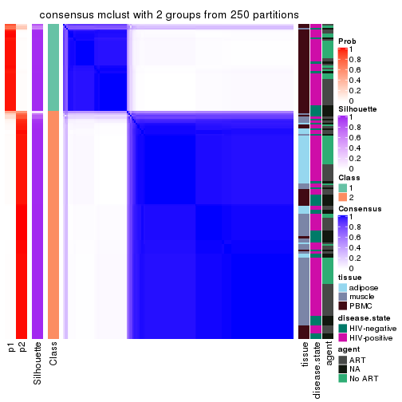</p>

</div>
<div id='tab-ATC-mclust-consensus-heatmap-2'>
<pre><code class="r">consensus_heatmap(res, k = 3)
</code></pre>

<p>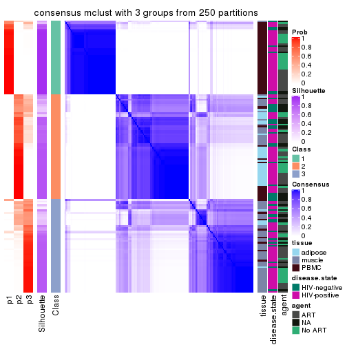</p>

</div>
<div id='tab-ATC-mclust-consensus-heatmap-3'>
<pre><code class="r">consensus_heatmap(res, k = 4)
</code></pre>

<p>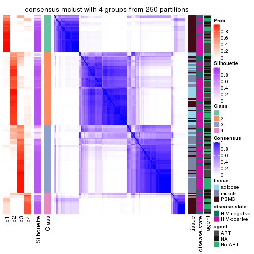</p>

</div>
<div id='tab-ATC-mclust-consensus-heatmap-4'>
<pre><code class="r">consensus_heatmap(res, k = 5)
</code></pre>

<p>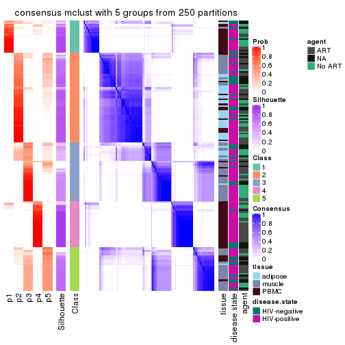</p>

</div>
<div id='tab-ATC-mclust-consensus-heatmap-5'>
<pre><code class="r">consensus_heatmap(res, k = 6)
</code></pre>

<p>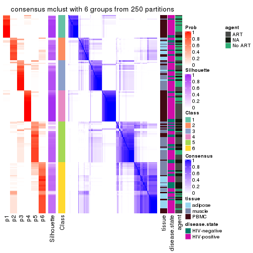</p>

</div>
</div>

Heatmaps for the membership of samples in all partitions to see how consistent they are:


<script>
$( function() {
	$( '#tabs-ATC-mclust-membership-heatmap' ).tabs();
} );
</script>
<div id='tabs-ATC-mclust-membership-heatmap'>
<ul>
<li><a href='#tab-ATC-mclust-membership-heatmap-1'>k = 2</a></li>
<li><a href='#tab-ATC-mclust-membership-heatmap-2'>k = 3</a></li>
<li><a href='#tab-ATC-mclust-membership-heatmap-3'>k = 4</a></li>
<li><a href='#tab-ATC-mclust-membership-heatmap-4'>k = 5</a></li>
<li><a href='#tab-ATC-mclust-membership-heatmap-5'>k = 6</a></li>
</ul>
<div id='tab-ATC-mclust-membership-heatmap-1'>
<pre><code class="r">membership_heatmap(res, k = 2)
</code></pre>

<p>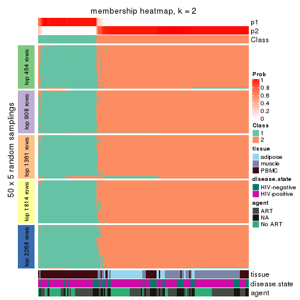</p>

</div>
<div id='tab-ATC-mclust-membership-heatmap-2'>
<pre><code class="r">membership_heatmap(res, k = 3)
</code></pre>

<p>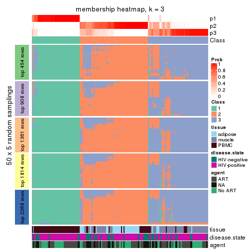</p>

</div>
<div id='tab-ATC-mclust-membership-heatmap-3'>
<pre><code class="r">membership_heatmap(res, k = 4)
</code></pre>

<p>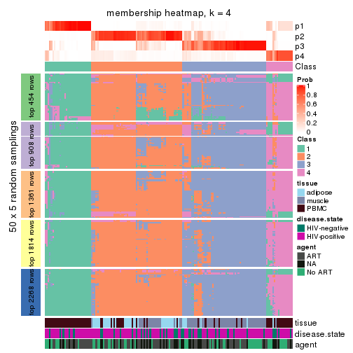</p>

</div>
<div id='tab-ATC-mclust-membership-heatmap-4'>
<pre><code class="r">membership_heatmap(res, k = 5)
</code></pre>

<p>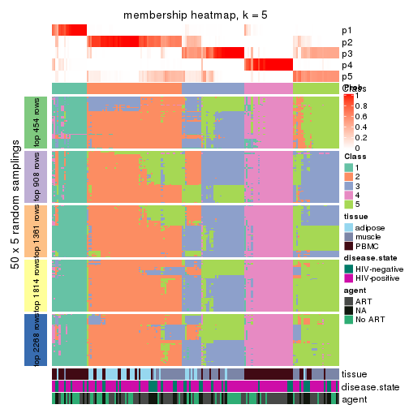</p>

</div>
<div id='tab-ATC-mclust-membership-heatmap-5'>
<pre><code class="r">membership_heatmap(res, k = 6)
</code></pre>

<p>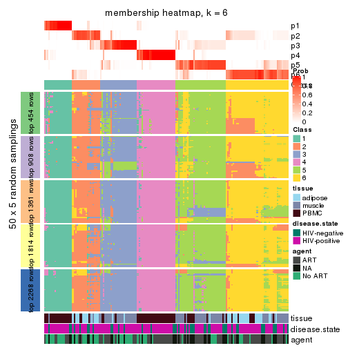</p>

</div>
</div>

As soon as we have had the classes for columns, we can look for signatures
which are significantly different between classes which can be candidate marks
for certain classes. Following are the heatmaps for signatures.


Signature heatmaps where rows are scaled:


<script>
$( function() {
	$( '#tabs-ATC-mclust-get-signatures' ).tabs();
} );
</script>
<div id='tabs-ATC-mclust-get-signatures'>
<ul>
<li><a href='#tab-ATC-mclust-get-signatures-1'>k = 2</a></li>
<li><a href='#tab-ATC-mclust-get-signatures-2'>k = 3</a></li>
<li><a href='#tab-ATC-mclust-get-signatures-3'>k = 4</a></li>
<li><a href='#tab-ATC-mclust-get-signatures-4'>k = 5</a></li>
<li><a href='#tab-ATC-mclust-get-signatures-5'>k = 6</a></li>
</ul>
<div id='tab-ATC-mclust-get-signatures-1'>
<pre><code class="r">get_signatures(res, k = 2)
</code></pre>

<p>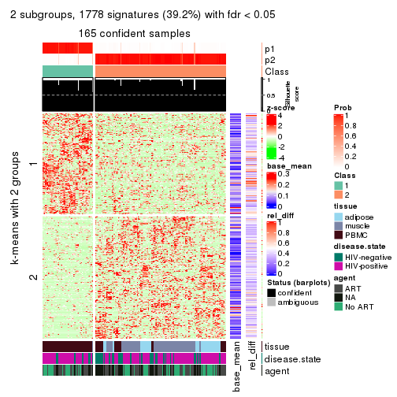</p>

</div>
<div id='tab-ATC-mclust-get-signatures-2'>
<pre><code class="r">get_signatures(res, k = 3)
</code></pre>

<p>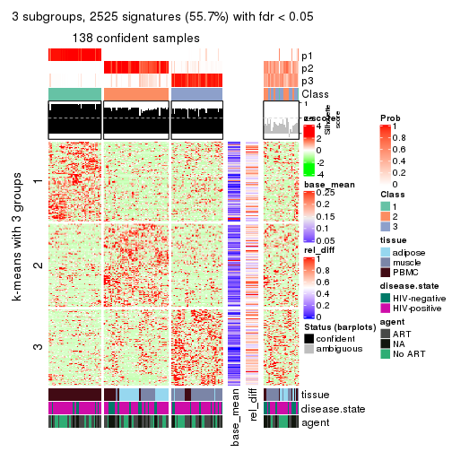</p>

</div>
<div id='tab-ATC-mclust-get-signatures-3'>
<pre><code class="r">get_signatures(res, k = 4)
</code></pre>

<p>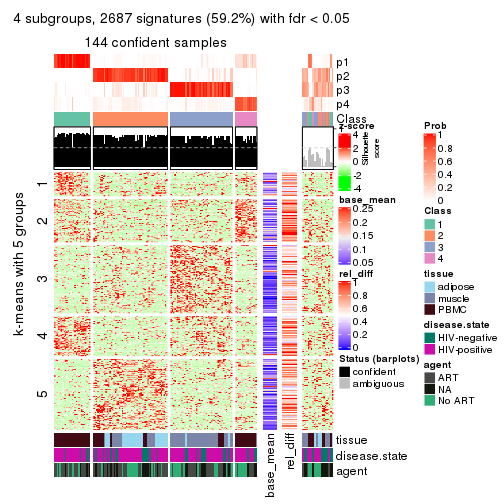</p>

</div>
<div id='tab-ATC-mclust-get-signatures-4'>
<pre><code class="r">get_signatures(res, k = 5)
</code></pre>

<p>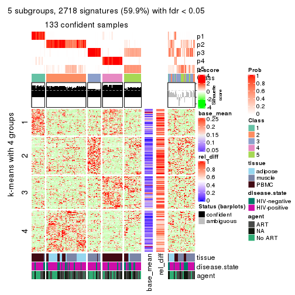</p>

</div>
<div id='tab-ATC-mclust-get-signatures-5'>
<pre><code class="r">get_signatures(res, k = 6)
</code></pre>

<p>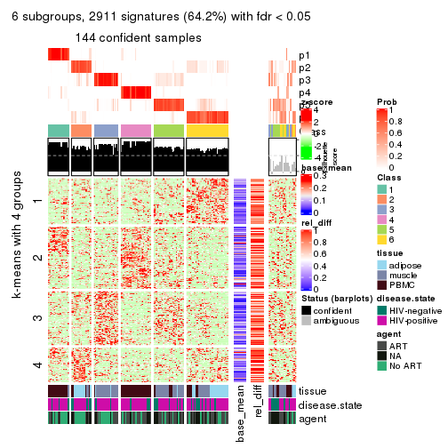</p>

</div>
</div>


Signature heatmaps where rows are not scaled:


<script>
$( function() {
	$( '#tabs-ATC-mclust-get-signatures-no-scale' ).tabs();
} );
</script>
<div id='tabs-ATC-mclust-get-signatures-no-scale'>
<ul>
<li><a href='#tab-ATC-mclust-get-signatures-no-scale-1'>k = 2</a></li>
<li><a href='#tab-ATC-mclust-get-signatures-no-scale-2'>k = 3</a></li>
<li><a href='#tab-ATC-mclust-get-signatures-no-scale-3'>k = 4</a></li>
<li><a href='#tab-ATC-mclust-get-signatures-no-scale-4'>k = 5</a></li>
<li><a href='#tab-ATC-mclust-get-signatures-no-scale-5'>k = 6</a></li>
</ul>
<div id='tab-ATC-mclust-get-signatures-no-scale-1'>
<pre><code class="r">get_signatures(res, k = 2, scale_rows = FALSE)
</code></pre>

<p>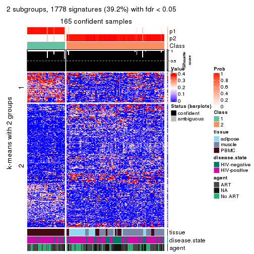</p>

</div>
<div id='tab-ATC-mclust-get-signatures-no-scale-2'>
<pre><code class="r">get_signatures(res, k = 3, scale_rows = FALSE)
</code></pre>

<p>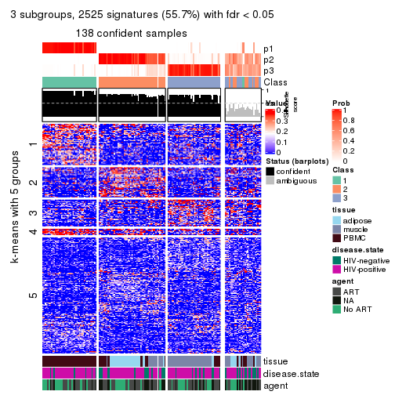</p>

</div>
<div id='tab-ATC-mclust-get-signatures-no-scale-3'>
<pre><code class="r">get_signatures(res, k = 4, scale_rows = FALSE)
</code></pre>

<p>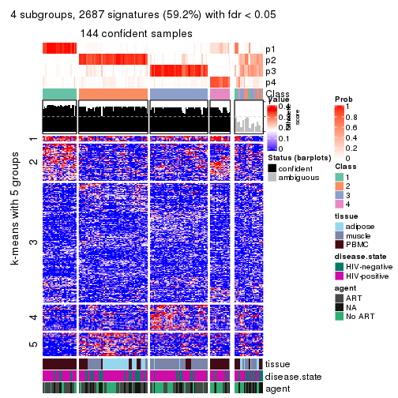</p>

</div>
<div id='tab-ATC-mclust-get-signatures-no-scale-4'>
<pre><code class="r">get_signatures(res, k = 5, scale_rows = FALSE)
</code></pre>

<p>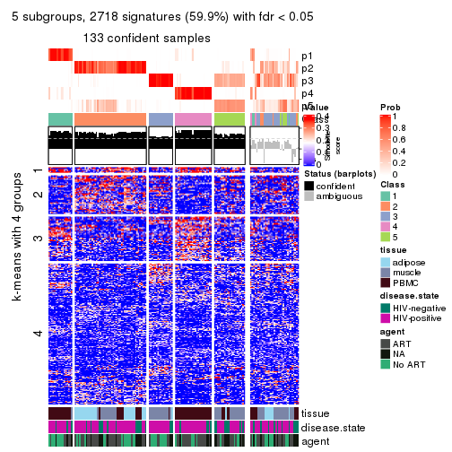</p>

</div>
<div id='tab-ATC-mclust-get-signatures-no-scale-5'>
<pre><code class="r">get_signatures(res, k = 6, scale_rows = FALSE)
</code></pre>

<p>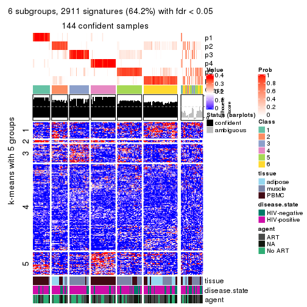</p>

</div>
</div>


Compare the overlap of signatures from different k:

```r
compare_signatures(res)
```

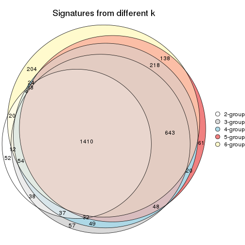

`get_signature()` returns a data frame invisibly. TO get the list of signatures, the function
call should be assigned to a variable explicitly. In following code, if `plot` argument is set
to `FALSE`, no heatmap is plotted while only the differential analysis is performed.

```r
# code only for demonstration
tb = get_signature(res, k = ..., plot = FALSE)
```

An example of the output of `tb` is:

```
#>   which_row         fdr    mean_1    mean_2 scaled_mean_1 scaled_mean_2 km
#> 1        38 0.042760348  8.373488  9.131774    -0.5533452     0.5164555  1
#> 2        40 0.018707592  7.106213  8.469186    -0.6173731     0.5762149  1
#> 3        55 0.019134737 10.221463 11.207825    -0.6159697     0.5749050  1
#> 4        59 0.006059896  5.921854  7.869574    -0.6899429     0.6439467  1
#> 5        60 0.018055526  8.928898 10.211722    -0.6204761     0.5791110  1
#> 6        98 0.009384629 15.714769 14.887706     0.6635654    -0.6193277  2
...
```

The columns in `tb` are:

1. `which_row`: row indices corresponding to the input matrix.
2. `fdr`: FDR for the differential test. 
3. `mean_x`: The mean value in group x.
4. `scaled_mean_x`: The mean value in group x after rows are scaled.
5. `km`: Row groups if k-means clustering is applied to rows.


UMAP plot which shows how samples are separated.


<script>
$( function() {
	$( '#tabs-ATC-mclust-dimension-reduction' ).tabs();
} );
</script>
<div id='tabs-ATC-mclust-dimension-reduction'>
<ul>
<li><a href='#tab-ATC-mclust-dimension-reduction-1'>k = 2</a></li>
<li><a href='#tab-ATC-mclust-dimension-reduction-2'>k = 3</a></li>
<li><a href='#tab-ATC-mclust-dimension-reduction-3'>k = 4</a></li>
<li><a href='#tab-ATC-mclust-dimension-reduction-4'>k = 5</a></li>
<li><a href='#tab-ATC-mclust-dimension-reduction-5'>k = 6</a></li>
</ul>
<div id='tab-ATC-mclust-dimension-reduction-1'>
<pre><code class="r">dimension_reduction(res, k = 2, method = &quot;UMAP&quot;)
</code></pre>

<p>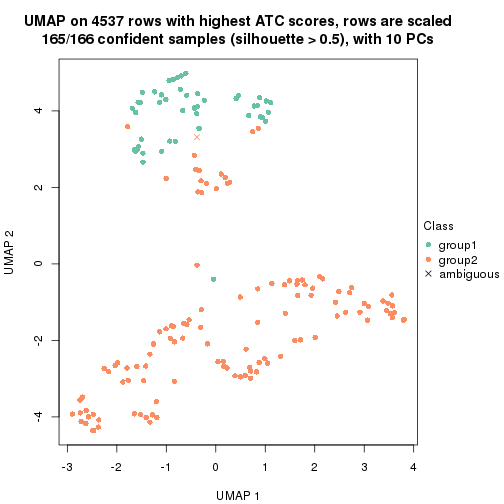</p>

</div>
<div id='tab-ATC-mclust-dimension-reduction-2'>
<pre><code class="r">dimension_reduction(res, k = 3, method = &quot;UMAP&quot;)
</code></pre>

<p>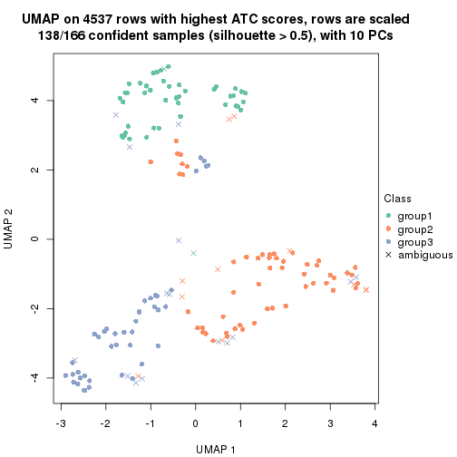</p>

</div>
<div id='tab-ATC-mclust-dimension-reduction-3'>
<pre><code class="r">dimension_reduction(res, k = 4, method = &quot;UMAP&quot;)
</code></pre>

<p>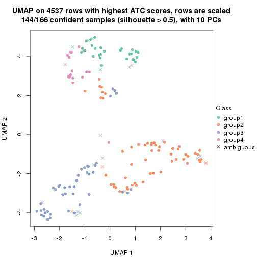</p>

</div>
<div id='tab-ATC-mclust-dimension-reduction-4'>
<pre><code class="r">dimension_reduction(res, k = 5, method = &quot;UMAP&quot;)
</code></pre>

<p>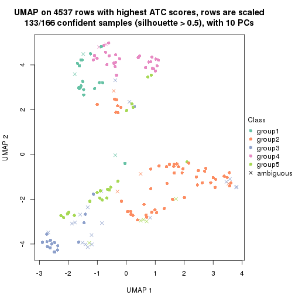</p>

</div>
<div id='tab-ATC-mclust-dimension-reduction-5'>
<pre><code class="r">dimension_reduction(res, k = 6, method = &quot;UMAP&quot;)
</code></pre>

<p>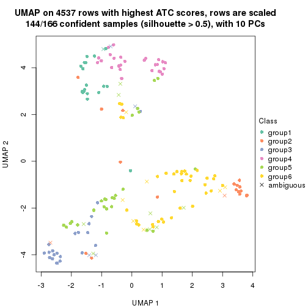</p>

</div>
</div>


Following heatmap shows how subgroups are split when increasing `k`:

```r
collect_classes(res)
```

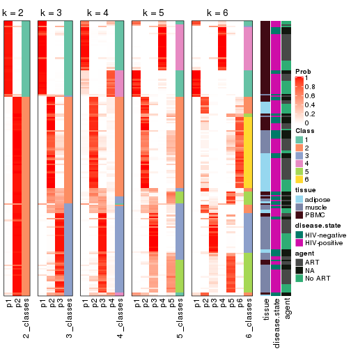


Test correlation between subgroups and known annotations. If the known
annotation is numeric, one-way ANOVA test is applied, and if the known
annotation is discrete, chi-squared contingency table test is applied.

```r
test_to_known_factors(res)
```

```
#>              n tissue(p) disease.state(p) agent(p) k
#> ATC:mclust 165  4.98e-20            0.139   0.2205 2
#> ATC:mclust 138  1.91e-26            0.214   0.4383 3
#> ATC:mclust 144  1.34e-25            0.578   0.3316 4
#> ATC:mclust 133  1.31e-21            0.310   0.0408 5
#> ATC:mclust 144  2.34e-24            0.562   0.0283 6
```


If matrix rows can be associated to genes, consider to use `GO_Enrichment(res,
...)` to perform function enrichment for the signature genes.


 

---------------------------------------------------


### ATC:NMF*


The object with results only for a single top-value method and a single partition method 
can be extracted as:

```r
res = res_list["ATC", "NMF"]
# you can also extract it by
# res = res_list["ATC:NMF"]
```

A summary of `res` and all the functions that can be applied to it:

```r
res
```

```
#> A 'ConsensusPartition' object with k = 2, 3, 4, 5, 6.
#>   On a matrix with 4537 rows and 166 columns.
#>   Top rows (454, 908, 1361, 1814, 2268) are extracted by 'ATC' method.
#>   Subgroups are detected by 'NMF' method.
#>   Performed in total 1250 partitions by row resampling.
#>   Best k for subgroups seems to be 3.
#> 
#> Following methods can be applied to this 'ConsensusPartition' object:
#>  [1] "cola_report"             "collect_classes"         "collect_plots"          
#>  [4] "collect_stats"           "colnames"                "compare_signatures"     
#>  [7] "consensus_heatmap"       "dimension_reduction"     "functional_enrichment"  
#> [10] "get_anno_col"            "get_anno"                "get_classes"            
#> [13] "get_consensus"           "get_matrix"              "get_membership"         
#> [16] "get_param"               "get_signatures"          "get_stats"              
#> [19] "is_best_k"               "is_stable_k"             "membership_heatmap"     
#> [22] "ncol"                    "nrow"                    "plot_ecdf"              
#> [25] "rownames"                "select_partition_number" "show"                   
#> [28] "suggest_best_k"          "test_to_known_factors"
```

`collect_plots()` function collects all the plots made from `res` for all `k` (number of partitions)
into one single page to provide an easy and fast comparison between different `k`.

```r
collect_plots(res)
```

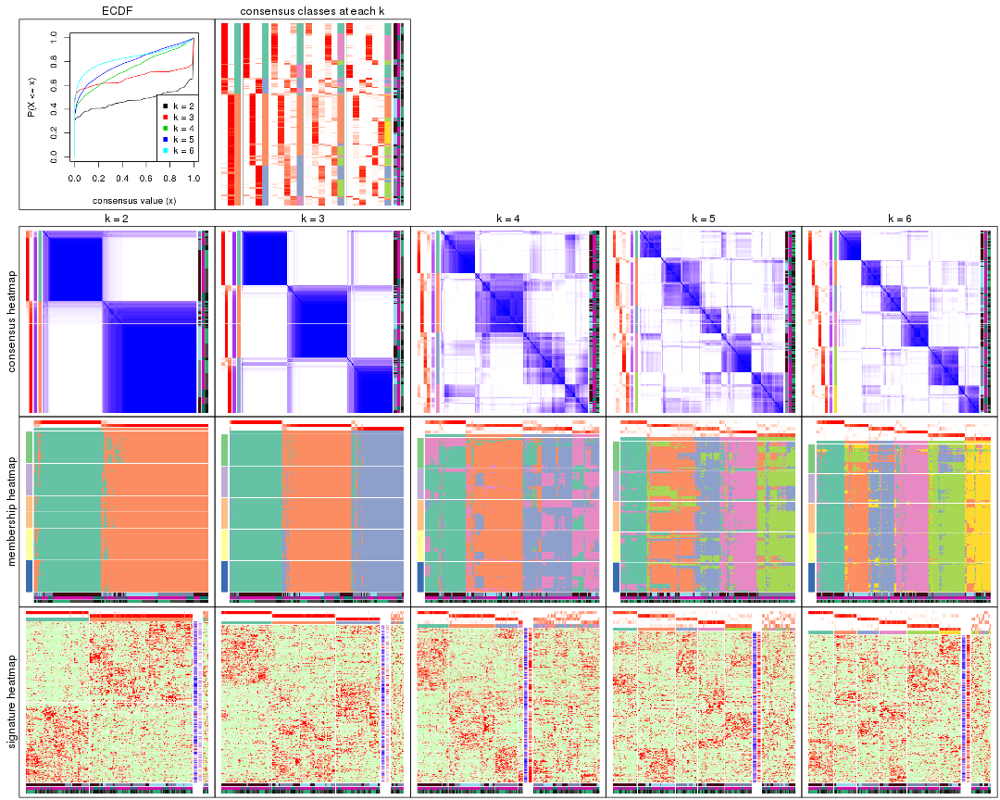

The plots are:

- The first row: a plot of the ECDF (Empirical cumulative distribution
  function) curves of the consensus matrix for each `k` and the heatmap of
  predicted classes for each `k`.
- The second row: heatmaps of the consensus matrix for each `k`.
- The third row: heatmaps of the membership matrix for each `k`.
- The fouth row: heatmaps of the signatures for each `k`.

All the plots in panels can be made by individual functions and they are
plotted later in this section.

`select_partition_number()` produces several plots showing different
statistics for choosing "optimized" `k`. There are following statistics:

- ECDF curves of the consensus matrix for each `k`;
- 1-PAC. [The PAC
  score](https://en.wikipedia.org/wiki/Consensus_clustering#Over-interpretation_potential_of_consensus_clustering)
  measures the proportion of the ambiguous subgrouping.
- Mean silhouette score.
- Concordance. The mean probability of fiting the consensus class ids in all
  partitions.
- Area increased. Denote $A_k$ as the area under the ECDF curve for current
  `k`, the area increased is defined as $A_k - A_{k-1}$.
- Rand index. The percent of pairs of samples that are both in a same cluster
  or both are not in a same cluster in the partition of k and k-1.
- Jaccard index. The ratio of pairs of samples are both in a same cluster in
  the partition of k and k-1 and the pairs of samples are both in a same
  cluster in the partition k or k-1.

The detailed explanations of these statistics can be found in [the cola
vignette](http://bioconductor.org/packages/devel/bioc/vignettes/cola/inst/doc/cola.html#toc_13).

Generally speaking, lower PAC score, higher mean silhouette score or higher
concordance corresponds to better partition. Rand index and Jaccard index
measure how similar the current partition is compared to partition with `k-1`.
If they are too similar, we won't accept `k` is better than `k-1`.

```r
select_partition_number(res)
```

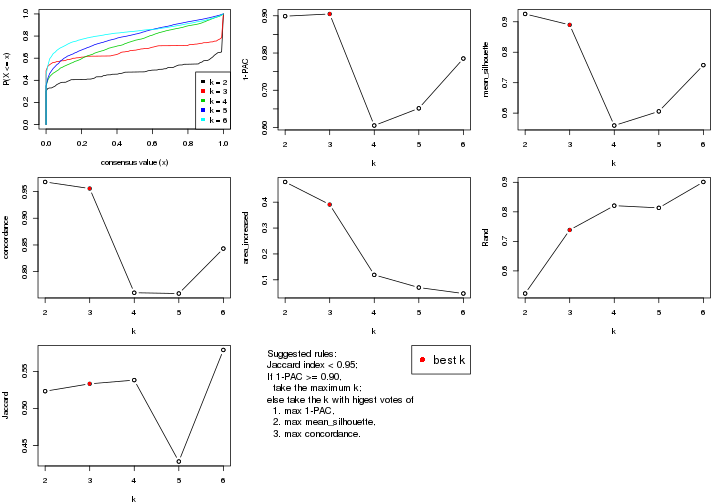

The numeric values for all these statistics can be obtained by `get_stats()`.

```r
get_stats(res)
```

```
#>   k 1-PAC mean_silhouette concordance area_increased  Rand Jaccard
#> 2 2 0.899           0.926       0.968         0.4782 0.523   0.523
#> 3 3 0.905           0.890       0.956         0.3907 0.739   0.533
#> 4 4 0.605           0.559       0.760         0.1190 0.821   0.538
#> 5 5 0.651           0.606       0.759         0.0701 0.813   0.428
#> 6 6 0.785           0.758       0.843         0.0470 0.901   0.579
```

`suggest_best_k()` suggests the best $k$ based on these statistics. The rules are as follows:

- All $k$ with Jaccard index larger than 0.95 are removed because the increase of
  the partition number does not provides enough extra information. If all $k$ are removed,
  the best $k$ is assigned by `NA`.
- For $k$ with 1-PAC larger than 0.9, the maximal $k$ is taken as the "best k". Other $k$ is called "optional k".
- If it does not fit the second rule. The $k$ with the highest vote of highest
  1-PAC, mean silhouette and concordance is taken as the "best k".

```r
suggest_best_k(res)
```

```
#> [1] 3
```


Following shows the table of the partitions (You need to click the **show/hide
code output** link to see it). The membership matrix (columns with name `p*`)
is inferred by
[`clue::cl_consensus()`](https://www.rdocumentation.org/link/cl_consensus?package=clue)
function with the `SE` method. Basically the value in the membership matrix
represents the probability to belong to a certain group. The finall class
label for an item is determined with the group with highest probability it
belongs to.

In `get_classes()` function, the entropy is calculated from the membership
matrix and the silhouette score is calculated from the consensus matrix.


<script>
$( function() {
	$( '#tabs-ATC-NMF-get-classes' ).tabs();
} );
</script>
<div id='tabs-ATC-NMF-get-classes'>
<ul>
<li><a href='#tab-ATC-NMF-get-classes-1'>k = 2</a></li>
<li><a href='#tab-ATC-NMF-get-classes-2'>k = 3</a></li>
<li><a href='#tab-ATC-NMF-get-classes-3'>k = 4</a></li>
<li><a href='#tab-ATC-NMF-get-classes-4'>k = 5</a></li>
<li><a href='#tab-ATC-NMF-get-classes-5'>k = 6</a></li>
</ul>

<div id='tab-ATC-NMF-get-classes-1'>
<p><a id='tab-ATC-NMF-get-classes-1-a' style='color:#0366d6' href='#'>show/hide code output</a></p>
<pre><code class="r">cbind(get_classes(res, k = 2), get_membership(res, k = 2))
</code></pre>

<pre><code>#&gt;           class entropy silhouette    p1    p2
#&gt; GSM751298     1  0.0000      0.963 1.000 0.000
#&gt; GSM751304     2  0.1184      0.958 0.016 0.984
#&gt; GSM751305     2  0.3733      0.914 0.072 0.928
#&gt; GSM751307     2  0.0000      0.968 0.000 1.000
#&gt; GSM751310     1  0.0000      0.963 1.000 0.000
#&gt; GSM751314     1  0.0000      0.963 1.000 0.000
#&gt; GSM751316     1  0.0000      0.963 1.000 0.000
#&gt; GSM751318     1  0.0000      0.963 1.000 0.000
#&gt; GSM751342     1  0.0000      0.963 1.000 0.000
#&gt; GSM751346     1  0.0000      0.963 1.000 0.000
#&gt; GSM751347     2  0.2948      0.930 0.052 0.948
#&gt; GSM751348     2  0.0000      0.968 0.000 1.000
#&gt; GSM751349     2  0.0000      0.968 0.000 1.000
#&gt; GSM751352     2  0.0000      0.968 0.000 1.000
#&gt; GSM751353     2  0.0000      0.968 0.000 1.000
#&gt; GSM751354     2  0.0000      0.968 0.000 1.000
#&gt; GSM751355     2  0.0000      0.968 0.000 1.000
#&gt; GSM751358     2  0.2778      0.935 0.048 0.952
#&gt; GSM751359     2  0.0000      0.968 0.000 1.000
#&gt; GSM751294     2  0.0000      0.968 0.000 1.000
#&gt; GSM751296     1  0.0000      0.963 1.000 0.000
#&gt; GSM751297     1  0.0376      0.959 0.996 0.004
#&gt; GSM751299     2  0.0000      0.968 0.000 1.000
#&gt; GSM751300     1  0.0000      0.963 1.000 0.000
#&gt; GSM751301     2  0.4161      0.902 0.084 0.916
#&gt; GSM751302     1  0.0000      0.963 1.000 0.000
#&gt; GSM751303     1  0.0000      0.963 1.000 0.000
#&gt; GSM751306     1  0.0000      0.963 1.000 0.000
#&gt; GSM751308     1  0.0000      0.963 1.000 0.000
#&gt; GSM751309     1  0.0000      0.963 1.000 0.000
#&gt; GSM751311     1  0.0000      0.963 1.000 0.000
#&gt; GSM751312     1  0.0000      0.963 1.000 0.000
#&gt; GSM751313     1  0.0000      0.963 1.000 0.000
#&gt; GSM751315     1  0.0000      0.963 1.000 0.000
#&gt; GSM751317     1  0.0000      0.963 1.000 0.000
#&gt; GSM751320     1  0.0000      0.963 1.000 0.000
#&gt; GSM751321     1  0.0000      0.963 1.000 0.000
#&gt; GSM751322     1  0.0000      0.963 1.000 0.000
#&gt; GSM751324     1  0.0000      0.963 1.000 0.000
#&gt; GSM751325     1  0.0000      0.963 1.000 0.000
#&gt; GSM751332     1  0.0000      0.963 1.000 0.000
#&gt; GSM751334     1  0.0000      0.963 1.000 0.000
#&gt; GSM751339     1  0.0000      0.963 1.000 0.000
#&gt; GSM751341     1  0.0000      0.963 1.000 0.000
#&gt; GSM751343     1  0.0000      0.963 1.000 0.000
#&gt; GSM751344     2  0.0000      0.968 0.000 1.000
#&gt; GSM751345     2  0.0000      0.968 0.000 1.000
#&gt; GSM751356     2  0.0000      0.968 0.000 1.000
#&gt; GSM751357     2  0.0000      0.968 0.000 1.000
#&gt; GSM751293     2  0.2236      0.944 0.036 0.964
#&gt; GSM751295     1  0.0000      0.963 1.000 0.000
#&gt; GSM751319     1  0.0000      0.963 1.000 0.000
#&gt; GSM751323     1  0.0000      0.963 1.000 0.000
#&gt; GSM751326     1  0.0000      0.963 1.000 0.000
#&gt; GSM751327     1  0.0000      0.963 1.000 0.000
#&gt; GSM751328     1  0.0000      0.963 1.000 0.000
#&gt; GSM751329     1  0.0000      0.963 1.000 0.000
#&gt; GSM751330     1  0.0000      0.963 1.000 0.000
#&gt; GSM751331     1  0.0000      0.963 1.000 0.000
#&gt; GSM751333     1  0.0000      0.963 1.000 0.000
#&gt; GSM751335     1  0.0000      0.963 1.000 0.000
#&gt; GSM751336     1  0.0000      0.963 1.000 0.000
#&gt; GSM751337     1  0.0000      0.963 1.000 0.000
#&gt; GSM751338     1  0.0000      0.963 1.000 0.000
#&gt; GSM751340     1  0.0000      0.963 1.000 0.000
#&gt; GSM751350     1  0.0000      0.963 1.000 0.000
#&gt; GSM751351     1  0.0000      0.963 1.000 0.000
#&gt; GSM751362     2  0.8386      0.646 0.268 0.732
#&gt; GSM751363     2  0.7815      0.709 0.232 0.768
#&gt; GSM751367     1  0.0000      0.963 1.000 0.000
#&gt; GSM751368     2  0.0672      0.964 0.008 0.992
#&gt; GSM751371     1  0.0000      0.963 1.000 0.000
#&gt; GSM751375     2  0.0000      0.968 0.000 1.000
#&gt; GSM751376     2  0.0000      0.968 0.000 1.000
#&gt; GSM751378     2  0.0000      0.968 0.000 1.000
#&gt; GSM751379     2  0.0000      0.968 0.000 1.000
#&gt; GSM751382     2  0.0000      0.968 0.000 1.000
#&gt; GSM751386     2  0.0000      0.968 0.000 1.000
#&gt; GSM751388     2  0.0000      0.968 0.000 1.000
#&gt; GSM751391     1  0.9775      0.298 0.588 0.412
#&gt; GSM751410     1  0.0000      0.963 1.000 0.000
#&gt; GSM751414     1  0.0000      0.963 1.000 0.000
#&gt; GSM751361     2  0.2778      0.935 0.048 0.952
#&gt; GSM751365     2  0.2043      0.947 0.032 0.968
#&gt; GSM751366     1  0.0000      0.963 1.000 0.000
#&gt; GSM751369     1  0.9248      0.487 0.660 0.340
#&gt; GSM751370     1  0.0376      0.959 0.996 0.004
#&gt; GSM751372     2  0.5178      0.868 0.116 0.884
#&gt; GSM751373     1  0.0000      0.963 1.000 0.000
#&gt; GSM751374     2  0.0000      0.968 0.000 1.000
#&gt; GSM751377     2  0.0000      0.968 0.000 1.000
#&gt; GSM751380     1  0.0000      0.963 1.000 0.000
#&gt; GSM751381     2  0.0000      0.968 0.000 1.000
#&gt; GSM751383     2  0.0000      0.968 0.000 1.000
#&gt; GSM751384     2  0.0000      0.968 0.000 1.000
#&gt; GSM751385     2  0.0000      0.968 0.000 1.000
#&gt; GSM751387     2  0.0000      0.968 0.000 1.000
#&gt; GSM751389     2  0.0000      0.968 0.000 1.000
#&gt; GSM751393     2  0.0000      0.968 0.000 1.000
#&gt; GSM751394     2  0.0000      0.968 0.000 1.000
#&gt; GSM751395     2  0.0000      0.968 0.000 1.000
#&gt; GSM751397     2  0.0000      0.968 0.000 1.000
#&gt; GSM751398     2  0.0000      0.968 0.000 1.000
#&gt; GSM751404     2  0.3431      0.919 0.064 0.936
#&gt; GSM751406     2  0.0000      0.968 0.000 1.000
#&gt; GSM751411     2  0.0000      0.968 0.000 1.000
#&gt; GSM751413     2  0.4022      0.906 0.080 0.920
#&gt; GSM751415     1  0.8555      0.622 0.720 0.280
#&gt; GSM751416     2  0.5842      0.840 0.140 0.860
#&gt; GSM751417     2  0.0672      0.963 0.008 0.992
#&gt; GSM751421     1  0.0000      0.963 1.000 0.000
#&gt; GSM751422     1  0.2948      0.916 0.948 0.052
#&gt; GSM751360     1  0.9044      0.529 0.680 0.320
#&gt; GSM751364     2  0.5059      0.872 0.112 0.888
#&gt; GSM751390     2  0.0000      0.968 0.000 1.000
#&gt; GSM751392     2  0.0000      0.968 0.000 1.000
#&gt; GSM751396     2  0.0000      0.968 0.000 1.000
#&gt; GSM751399     2  0.0000      0.968 0.000 1.000
#&gt; GSM751400     2  0.0000      0.968 0.000 1.000
#&gt; GSM751401     2  0.8207      0.658 0.256 0.744
#&gt; GSM751402     2  0.9522      0.398 0.372 0.628
#&gt; GSM751403     2  0.0000      0.968 0.000 1.000
#&gt; GSM751405     2  0.0000      0.968 0.000 1.000
#&gt; GSM751407     2  0.0000      0.968 0.000 1.000
#&gt; GSM751408     2  0.0000      0.968 0.000 1.000
#&gt; GSM751409     2  0.0000      0.968 0.000 1.000
#&gt; GSM751412     2  0.0000      0.968 0.000 1.000
#&gt; GSM751418     1  0.8555      0.609 0.720 0.280
#&gt; GSM751419     2  0.9866      0.253 0.432 0.568
#&gt; GSM751420     2  0.0000      0.968 0.000 1.000
#&gt; GSM751425     2  0.0000      0.968 0.000 1.000
#&gt; GSM751429     1  0.5408      0.843 0.876 0.124
#&gt; GSM751430     2  0.0000      0.968 0.000 1.000
#&gt; GSM751433     2  0.3114      0.928 0.056 0.944
#&gt; GSM751437     2  0.0376      0.966 0.004 0.996
#&gt; GSM751448     1  0.9909      0.223 0.556 0.444
#&gt; GSM751451     2  0.9000      0.553 0.316 0.684
#&gt; GSM751423     2  0.0000      0.968 0.000 1.000
#&gt; GSM751424     2  0.0000      0.968 0.000 1.000
#&gt; GSM751428     2  0.0000      0.968 0.000 1.000
#&gt; GSM751431     2  0.0000      0.968 0.000 1.000
#&gt; GSM751432     2  0.0000      0.968 0.000 1.000
#&gt; GSM751434     2  0.0000      0.968 0.000 1.000
#&gt; GSM751435     2  0.0000      0.968 0.000 1.000
#&gt; GSM751436     2  0.0000      0.968 0.000 1.000
#&gt; GSM751440     2  0.3584      0.917 0.068 0.932
#&gt; GSM751444     2  0.0000      0.968 0.000 1.000
#&gt; GSM751446     2  0.0000      0.968 0.000 1.000
#&gt; GSM751449     2  0.0000      0.968 0.000 1.000
#&gt; GSM751450     2  0.0000      0.968 0.000 1.000
#&gt; GSM751452     2  0.0000      0.968 0.000 1.000
#&gt; GSM751426     2  0.0000      0.968 0.000 1.000
#&gt; GSM751427     2  0.0000      0.968 0.000 1.000
#&gt; GSM751438     2  0.0000      0.968 0.000 1.000
#&gt; GSM751439     2  0.5629      0.843 0.132 0.868
#&gt; GSM751441     2  0.0000      0.968 0.000 1.000
#&gt; GSM751442     2  0.0000      0.968 0.000 1.000
#&gt; GSM751443     2  0.0000      0.968 0.000 1.000
#&gt; GSM751445     2  0.0000      0.968 0.000 1.000
#&gt; GSM751447     2  0.0000      0.968 0.000 1.000
#&gt; GSM751453     2  0.0000      0.968 0.000 1.000
#&gt; GSM751454     2  0.0000      0.968 0.000 1.000
#&gt; GSM751455     2  0.0000      0.968 0.000 1.000
#&gt; GSM751456     2  0.0000      0.968 0.000 1.000
#&gt; GSM751457     2  0.0000      0.968 0.000 1.000
#&gt; GSM751458     2  0.0000      0.968 0.000 1.000
</code></pre>

<script>
$('#tab-ATC-NMF-get-classes-1-a').parent().next().next().hide();
$('#tab-ATC-NMF-get-classes-1-a').click(function(){
  $('#tab-ATC-NMF-get-classes-1-a').parent().next().next().toggle();
  return(false);
});
</script>
</div>

<div id='tab-ATC-NMF-get-classes-2'>
<p><a id='tab-ATC-NMF-get-classes-2-a' style='color:#0366d6' href='#'>show/hide code output</a></p>
<pre><code class="r">cbind(get_classes(res, k = 3), get_membership(res, k = 3))
</code></pre>

<pre><code>#&gt;           class entropy silhouette    p1    p2    p3
#&gt; GSM751298     1  0.0000     0.9837 1.000 0.000 0.000
#&gt; GSM751304     2  0.1163     0.9292 0.028 0.972 0.000
#&gt; GSM751305     2  0.1860     0.9075 0.052 0.948 0.000
#&gt; GSM751307     2  0.0000     0.9516 0.000 1.000 0.000
#&gt; GSM751310     1  0.0000     0.9837 1.000 0.000 0.000
#&gt; GSM751314     1  0.0000     0.9837 1.000 0.000 0.000
#&gt; GSM751316     1  0.0000     0.9837 1.000 0.000 0.000
#&gt; GSM751318     1  0.0000     0.9837 1.000 0.000 0.000
#&gt; GSM751342     1  0.0000     0.9837 1.000 0.000 0.000
#&gt; GSM751346     3  0.6111     0.3443 0.396 0.000 0.604
#&gt; GSM751347     3  0.0475     0.9208 0.004 0.004 0.992
#&gt; GSM751348     2  0.0000     0.9516 0.000 1.000 0.000
#&gt; GSM751349     2  0.0000     0.9516 0.000 1.000 0.000
#&gt; GSM751352     2  0.0000     0.9516 0.000 1.000 0.000
#&gt; GSM751353     2  0.0000     0.9516 0.000 1.000 0.000
#&gt; GSM751354     3  0.6008     0.3943 0.000 0.372 0.628
#&gt; GSM751355     2  0.0000     0.9516 0.000 1.000 0.000
#&gt; GSM751358     2  0.8730     0.0398 0.108 0.472 0.420
#&gt; GSM751359     2  0.0000     0.9516 0.000 1.000 0.000
#&gt; GSM751294     3  0.0000     0.9247 0.000 0.000 1.000
#&gt; GSM751296     1  0.0000     0.9837 1.000 0.000 0.000
#&gt; GSM751297     3  0.0000     0.9247 0.000 0.000 1.000
#&gt; GSM751299     2  0.0237     0.9489 0.000 0.996 0.004
#&gt; GSM751300     1  0.0000     0.9837 1.000 0.000 0.000
#&gt; GSM751301     2  0.0000     0.9516 0.000 1.000 0.000
#&gt; GSM751302     1  0.0000     0.9837 1.000 0.000 0.000
#&gt; GSM751303     1  0.0000     0.9837 1.000 0.000 0.000
#&gt; GSM751306     1  0.0000     0.9837 1.000 0.000 0.000
#&gt; GSM751308     3  0.0747     0.9151 0.016 0.000 0.984
#&gt; GSM751309     1  0.0000     0.9837 1.000 0.000 0.000
#&gt; GSM751311     1  0.0000     0.9837 1.000 0.000 0.000
#&gt; GSM751312     1  0.0000     0.9837 1.000 0.000 0.000
#&gt; GSM751313     1  0.0000     0.9837 1.000 0.000 0.000
#&gt; GSM751315     1  0.0000     0.9837 1.000 0.000 0.000
#&gt; GSM751317     1  0.0000     0.9837 1.000 0.000 0.000
#&gt; GSM751320     1  0.0000     0.9837 1.000 0.000 0.000
#&gt; GSM751321     1  0.0000     0.9837 1.000 0.000 0.000
#&gt; GSM751322     1  0.0000     0.9837 1.000 0.000 0.000
#&gt; GSM751324     1  0.0000     0.9837 1.000 0.000 0.000
#&gt; GSM751325     1  0.0000     0.9837 1.000 0.000 0.000
#&gt; GSM751332     1  0.0000     0.9837 1.000 0.000 0.000
#&gt; GSM751334     1  0.0000     0.9837 1.000 0.000 0.000
#&gt; GSM751339     1  0.0237     0.9801 0.996 0.000 0.004
#&gt; GSM751341     1  0.0000     0.9837 1.000 0.000 0.000
#&gt; GSM751343     1  0.0000     0.9837 1.000 0.000 0.000
#&gt; GSM751344     2  0.0000     0.9516 0.000 1.000 0.000
#&gt; GSM751345     2  0.0000     0.9516 0.000 1.000 0.000
#&gt; GSM751356     2  0.6062     0.3719 0.000 0.616 0.384
#&gt; GSM751357     2  0.3619     0.8170 0.000 0.864 0.136
#&gt; GSM751293     2  0.0000     0.9516 0.000 1.000 0.000
#&gt; GSM751295     1  0.0592     0.9728 0.988 0.000 0.012
#&gt; GSM751319     1  0.0000     0.9837 1.000 0.000 0.000
#&gt; GSM751323     1  0.0000     0.9837 1.000 0.000 0.000
#&gt; GSM751326     1  0.0000     0.9837 1.000 0.000 0.000
#&gt; GSM751327     1  0.0000     0.9837 1.000 0.000 0.000
#&gt; GSM751328     1  0.0000     0.9837 1.000 0.000 0.000
#&gt; GSM751329     1  0.0000     0.9837 1.000 0.000 0.000
#&gt; GSM751330     1  0.0000     0.9837 1.000 0.000 0.000
#&gt; GSM751331     1  0.0000     0.9837 1.000 0.000 0.000
#&gt; GSM751333     1  0.0000     0.9837 1.000 0.000 0.000
#&gt; GSM751335     1  0.0000     0.9837 1.000 0.000 0.000
#&gt; GSM751336     1  0.0000     0.9837 1.000 0.000 0.000
#&gt; GSM751337     1  0.0000     0.9837 1.000 0.000 0.000
#&gt; GSM751338     1  0.0000     0.9837 1.000 0.000 0.000
#&gt; GSM751340     1  0.4452     0.7481 0.808 0.000 0.192
#&gt; GSM751350     1  0.0000     0.9837 1.000 0.000 0.000
#&gt; GSM751351     1  0.0000     0.9837 1.000 0.000 0.000
#&gt; GSM751362     3  0.0000     0.9247 0.000 0.000 1.000
#&gt; GSM751363     2  0.4121     0.7792 0.168 0.832 0.000
#&gt; GSM751367     1  0.0424     0.9765 0.992 0.000 0.008
#&gt; GSM751368     2  0.0000     0.9516 0.000 1.000 0.000
#&gt; GSM751371     1  0.0000     0.9837 1.000 0.000 0.000
#&gt; GSM751375     2  0.0000     0.9516 0.000 1.000 0.000
#&gt; GSM751376     3  0.0000     0.9247 0.000 0.000 1.000
#&gt; GSM751378     3  0.3267     0.8240 0.000 0.116 0.884
#&gt; GSM751379     3  0.0000     0.9247 0.000 0.000 1.000
#&gt; GSM751382     2  0.0000     0.9516 0.000 1.000 0.000
#&gt; GSM751386     2  0.0000     0.9516 0.000 1.000 0.000
#&gt; GSM751388     2  0.0000     0.9516 0.000 1.000 0.000
#&gt; GSM751391     3  0.9118     0.4762 0.220 0.232 0.548
#&gt; GSM751410     3  0.0000     0.9247 0.000 0.000 1.000
#&gt; GSM751414     1  0.0000     0.9837 1.000 0.000 0.000
#&gt; GSM751361     2  0.4629     0.7450 0.004 0.808 0.188
#&gt; GSM751365     3  0.1964     0.8851 0.056 0.000 0.944
#&gt; GSM751366     3  0.0237     0.9226 0.004 0.000 0.996
#&gt; GSM751369     3  0.0000     0.9247 0.000 0.000 1.000
#&gt; GSM751370     1  0.6308    -0.0606 0.508 0.000 0.492
#&gt; GSM751372     3  0.0237     0.9226 0.004 0.000 0.996
#&gt; GSM751373     1  0.0000     0.9837 1.000 0.000 0.000
#&gt; GSM751374     3  0.0000     0.9247 0.000 0.000 1.000
#&gt; GSM751377     2  0.0000     0.9516 0.000 1.000 0.000
#&gt; GSM751380     3  0.0000     0.9247 0.000 0.000 1.000
#&gt; GSM751381     2  0.0000     0.9516 0.000 1.000 0.000
#&gt; GSM751383     2  0.0000     0.9516 0.000 1.000 0.000
#&gt; GSM751384     2  0.6291     0.1171 0.000 0.532 0.468
#&gt; GSM751385     2  0.6026     0.3913 0.000 0.624 0.376
#&gt; GSM751387     2  0.0000     0.9516 0.000 1.000 0.000
#&gt; GSM751389     3  0.0000     0.9247 0.000 0.000 1.000
#&gt; GSM751393     3  0.0000     0.9247 0.000 0.000 1.000
#&gt; GSM751394     2  0.0000     0.9516 0.000 1.000 0.000
#&gt; GSM751395     3  0.0237     0.9224 0.000 0.004 0.996
#&gt; GSM751397     2  0.0000     0.9516 0.000 1.000 0.000
#&gt; GSM751398     2  0.0000     0.9516 0.000 1.000 0.000
#&gt; GSM751404     3  0.0000     0.9247 0.000 0.000 1.000
#&gt; GSM751406     3  0.0000     0.9247 0.000 0.000 1.000
#&gt; GSM751411     3  0.0000     0.9247 0.000 0.000 1.000
#&gt; GSM751413     2  0.0000     0.9516 0.000 1.000 0.000
#&gt; GSM751415     3  0.0000     0.9247 0.000 0.000 1.000
#&gt; GSM751416     2  0.1647     0.9211 0.036 0.960 0.004
#&gt; GSM751417     2  0.0592     0.9431 0.000 0.988 0.012
#&gt; GSM751421     3  0.3340     0.8251 0.120 0.000 0.880
#&gt; GSM751422     3  0.2537     0.8645 0.080 0.000 0.920
#&gt; GSM751360     3  0.6154     0.3428 0.408 0.000 0.592
#&gt; GSM751364     3  0.9152     0.0587 0.144 0.424 0.432
#&gt; GSM751390     3  0.6168     0.2810 0.000 0.412 0.588
#&gt; GSM751392     2  0.0000     0.9516 0.000 1.000 0.000
#&gt; GSM751396     2  0.0000     0.9516 0.000 1.000 0.000
#&gt; GSM751399     3  0.0000     0.9247 0.000 0.000 1.000
#&gt; GSM751400     3  0.0000     0.9247 0.000 0.000 1.000
#&gt; GSM751401     3  0.0000     0.9247 0.000 0.000 1.000
#&gt; GSM751402     3  0.0000     0.9247 0.000 0.000 1.000
#&gt; GSM751403     3  0.0000     0.9247 0.000 0.000 1.000
#&gt; GSM751405     3  0.0000     0.9247 0.000 0.000 1.000
#&gt; GSM751407     3  0.0000     0.9247 0.000 0.000 1.000
#&gt; GSM751408     3  0.0000     0.9247 0.000 0.000 1.000
#&gt; GSM751409     3  0.0000     0.9247 0.000 0.000 1.000
#&gt; GSM751412     3  0.0000     0.9247 0.000 0.000 1.000
#&gt; GSM751418     1  0.1711     0.9458 0.960 0.008 0.032
#&gt; GSM751419     3  0.7164     0.1839 0.452 0.024 0.524
#&gt; GSM751420     3  0.0000     0.9247 0.000 0.000 1.000
#&gt; GSM751425     2  0.0000     0.9516 0.000 1.000 0.000
#&gt; GSM751429     3  0.0592     0.9172 0.012 0.000 0.988
#&gt; GSM751430     2  0.0000     0.9516 0.000 1.000 0.000
#&gt; GSM751433     2  0.0000     0.9516 0.000 1.000 0.000
#&gt; GSM751437     3  0.0000     0.9247 0.000 0.000 1.000
#&gt; GSM751448     3  0.0000     0.9247 0.000 0.000 1.000
#&gt; GSM751451     2  0.0237     0.9488 0.004 0.996 0.000
#&gt; GSM751423     2  0.0000     0.9516 0.000 1.000 0.000
#&gt; GSM751424     2  0.0000     0.9516 0.000 1.000 0.000
#&gt; GSM751428     2  0.0000     0.9516 0.000 1.000 0.000
#&gt; GSM751431     2  0.0000     0.9516 0.000 1.000 0.000
#&gt; GSM751432     2  0.0000     0.9516 0.000 1.000 0.000
#&gt; GSM751434     2  0.0000     0.9516 0.000 1.000 0.000
#&gt; GSM751435     2  0.0000     0.9516 0.000 1.000 0.000
#&gt; GSM751436     2  0.0000     0.9516 0.000 1.000 0.000
#&gt; GSM751440     2  0.0000     0.9516 0.000 1.000 0.000
#&gt; GSM751444     2  0.0000     0.9516 0.000 1.000 0.000
#&gt; GSM751446     2  0.0000     0.9516 0.000 1.000 0.000
#&gt; GSM751449     2  0.6192     0.2634 0.000 0.580 0.420
#&gt; GSM751450     2  0.0000     0.9516 0.000 1.000 0.000
#&gt; GSM751452     2  0.0000     0.9516 0.000 1.000 0.000
#&gt; GSM751426     2  0.0000     0.9516 0.000 1.000 0.000
#&gt; GSM751427     2  0.0000     0.9516 0.000 1.000 0.000
#&gt; GSM751438     3  0.3752     0.7893 0.000 0.144 0.856
#&gt; GSM751439     3  0.0000     0.9247 0.000 0.000 1.000
#&gt; GSM751441     2  0.0000     0.9516 0.000 1.000 0.000
#&gt; GSM751442     2  0.1031     0.9337 0.000 0.976 0.024
#&gt; GSM751443     3  0.0000     0.9247 0.000 0.000 1.000
#&gt; GSM751445     2  0.0000     0.9516 0.000 1.000 0.000
#&gt; GSM751447     2  0.0000     0.9516 0.000 1.000 0.000
#&gt; GSM751453     2  0.0000     0.9516 0.000 1.000 0.000
#&gt; GSM751454     2  0.0000     0.9516 0.000 1.000 0.000
#&gt; GSM751455     2  0.1411     0.9236 0.000 0.964 0.036
#&gt; GSM751456     2  0.2711     0.8733 0.000 0.912 0.088
#&gt; GSM751457     3  0.0000     0.9247 0.000 0.000 1.000
#&gt; GSM751458     3  0.0000     0.9247 0.000 0.000 1.000
</code></pre>

<script>
$('#tab-ATC-NMF-get-classes-2-a').parent().next().next().hide();
$('#tab-ATC-NMF-get-classes-2-a').click(function(){
  $('#tab-ATC-NMF-get-classes-2-a').parent().next().next().toggle();
  return(false);
});
</script>
</div>

<div id='tab-ATC-NMF-get-classes-3'>
<p><a id='tab-ATC-NMF-get-classes-3-a' style='color:#0366d6' href='#'>show/hide code output</a></p>
<pre><code class="r">cbind(get_classes(res, k = 4), get_membership(res, k = 4))
</code></pre>

<pre><code>#&gt;           class entropy silhouette    p1    p2    p3    p4
#&gt; GSM751298     4  0.4948    0.06717 0.440 0.000 0.000 0.560
#&gt; GSM751304     2  0.7225    0.49591 0.208 0.628 0.128 0.036
#&gt; GSM751305     2  0.7608    0.37506 0.312 0.544 0.108 0.036
#&gt; GSM751307     2  0.1389    0.84309 0.000 0.952 0.000 0.048
#&gt; GSM751310     1  0.0592    0.80266 0.984 0.000 0.000 0.016
#&gt; GSM751314     1  0.0188    0.80416 0.996 0.000 0.000 0.004
#&gt; GSM751316     1  0.0000    0.80354 1.000 0.000 0.000 0.000
#&gt; GSM751318     1  0.0000    0.80354 1.000 0.000 0.000 0.000
#&gt; GSM751342     1  0.0000    0.80354 1.000 0.000 0.000 0.000
#&gt; GSM751346     4  0.2214    0.55066 0.044 0.000 0.028 0.928
#&gt; GSM751347     4  0.1716    0.52748 0.000 0.000 0.064 0.936
#&gt; GSM751348     2  0.2522    0.83920 0.016 0.920 0.012 0.052
#&gt; GSM751349     2  0.1406    0.84272 0.000 0.960 0.024 0.016
#&gt; GSM751352     2  0.1389    0.84537 0.000 0.952 0.000 0.048
#&gt; GSM751353     2  0.1022    0.84598 0.000 0.968 0.000 0.032
#&gt; GSM751354     4  0.5565    0.32625 0.000 0.232 0.068 0.700
#&gt; GSM751355     2  0.1389    0.84401 0.000 0.952 0.000 0.048
#&gt; GSM751358     3  0.6548    0.40901 0.336 0.064 0.588 0.012
#&gt; GSM751359     3  0.5774   -0.15422 0.004 0.480 0.496 0.020
#&gt; GSM751294     3  0.4920    0.39497 0.004 0.000 0.628 0.368
#&gt; GSM751296     4  0.4277    0.41120 0.280 0.000 0.000 0.720
#&gt; GSM751297     4  0.2469    0.50952 0.000 0.000 0.108 0.892
#&gt; GSM751299     2  0.4843    0.51074 0.000 0.604 0.000 0.396
#&gt; GSM751300     4  0.4585    0.33276 0.332 0.000 0.000 0.668
#&gt; GSM751301     2  0.1474    0.84186 0.000 0.948 0.000 0.052
#&gt; GSM751302     4  0.3801    0.46980 0.220 0.000 0.000 0.780
#&gt; GSM751303     1  0.0000    0.80354 1.000 0.000 0.000 0.000
#&gt; GSM751306     1  0.0000    0.80354 1.000 0.000 0.000 0.000
#&gt; GSM751308     4  0.7660    0.00446 0.276 0.000 0.260 0.464
#&gt; GSM751309     1  0.0000    0.80354 1.000 0.000 0.000 0.000
#&gt; GSM751311     1  0.0000    0.80354 1.000 0.000 0.000 0.000
#&gt; GSM751312     1  0.1389    0.79184 0.952 0.000 0.000 0.048
#&gt; GSM751313     1  0.4967    0.24215 0.548 0.000 0.000 0.452
#&gt; GSM751315     1  0.1389    0.79285 0.952 0.000 0.000 0.048
#&gt; GSM751317     1  0.0000    0.80354 1.000 0.000 0.000 0.000
#&gt; GSM751320     1  0.2589    0.75554 0.884 0.000 0.000 0.116
#&gt; GSM751321     1  0.2814    0.74016 0.868 0.000 0.000 0.132
#&gt; GSM751322     1  0.0188    0.80416 0.996 0.000 0.000 0.004
#&gt; GSM751324     1  0.0188    0.80416 0.996 0.000 0.000 0.004
#&gt; GSM751325     1  0.0336    0.80400 0.992 0.000 0.000 0.008
#&gt; GSM751332     1  0.3801    0.65702 0.780 0.000 0.000 0.220
#&gt; GSM751334     1  0.3610    0.67921 0.800 0.000 0.000 0.200
#&gt; GSM751339     1  0.0817    0.79150 0.976 0.000 0.000 0.024
#&gt; GSM751341     4  0.4643    0.31222 0.344 0.000 0.000 0.656
#&gt; GSM751343     1  0.0188    0.80416 0.996 0.000 0.000 0.004
#&gt; GSM751344     2  0.1118    0.84479 0.000 0.964 0.000 0.036
#&gt; GSM751345     2  0.1118    0.84479 0.000 0.964 0.000 0.036
#&gt; GSM751356     3  0.9714    0.33225 0.204 0.248 0.368 0.180
#&gt; GSM751357     2  0.7527    0.52359 0.072 0.624 0.196 0.108
#&gt; GSM751293     2  0.1389    0.84550 0.000 0.952 0.000 0.048
#&gt; GSM751295     4  0.2760    0.53494 0.128 0.000 0.000 0.872
#&gt; GSM751319     1  0.0469    0.80351 0.988 0.000 0.000 0.012
#&gt; GSM751323     1  0.2760    0.74493 0.872 0.000 0.000 0.128
#&gt; GSM751326     1  0.5000    0.08916 0.500 0.000 0.000 0.500
#&gt; GSM751327     1  0.2281    0.76613 0.904 0.000 0.000 0.096
#&gt; GSM751328     1  0.3801    0.65618 0.780 0.000 0.000 0.220
#&gt; GSM751329     1  0.4250    0.58401 0.724 0.000 0.000 0.276
#&gt; GSM751330     1  0.4941    0.28495 0.564 0.000 0.000 0.436
#&gt; GSM751331     4  0.4948    0.05609 0.440 0.000 0.000 0.560
#&gt; GSM751333     1  0.4948    0.27492 0.560 0.000 0.000 0.440
#&gt; GSM751335     1  0.4830    0.38461 0.608 0.000 0.000 0.392
#&gt; GSM751336     4  0.4961    0.04303 0.448 0.000 0.000 0.552
#&gt; GSM751337     4  0.4955    0.05685 0.444 0.000 0.000 0.556
#&gt; GSM751338     1  0.0188    0.80416 0.996 0.000 0.000 0.004
#&gt; GSM751340     1  0.2670    0.72421 0.904 0.000 0.024 0.072
#&gt; GSM751350     4  0.4193    0.42002 0.268 0.000 0.000 0.732
#&gt; GSM751351     4  0.4624    0.31179 0.340 0.000 0.000 0.660
#&gt; GSM751362     3  0.4406    0.46226 0.000 0.000 0.700 0.300
#&gt; GSM751363     1  0.7677    0.12020 0.524 0.116 0.328 0.032
#&gt; GSM751367     4  0.4855    0.28952 0.352 0.000 0.004 0.644
#&gt; GSM751368     2  0.3606    0.76991 0.000 0.840 0.140 0.020
#&gt; GSM751371     1  0.0336    0.79903 0.992 0.000 0.008 0.000
#&gt; GSM751375     2  0.1042    0.84387 0.000 0.972 0.020 0.008
#&gt; GSM751376     3  0.4916    0.27442 0.000 0.000 0.576 0.424
#&gt; GSM751378     3  0.2546    0.59871 0.000 0.092 0.900 0.008
#&gt; GSM751379     4  0.4981   -0.02102 0.000 0.000 0.464 0.536
#&gt; GSM751382     2  0.2300    0.82677 0.000 0.920 0.064 0.016
#&gt; GSM751386     2  0.4950    0.45300 0.000 0.620 0.376 0.004
#&gt; GSM751388     2  0.4720    0.54849 0.000 0.672 0.324 0.004
#&gt; GSM751391     1  0.6929    0.43673 0.676 0.128 0.144 0.052
#&gt; GSM751410     3  0.5994    0.49822 0.156 0.000 0.692 0.152
#&gt; GSM751414     1  0.4353    0.54683 0.756 0.000 0.232 0.012
#&gt; GSM751361     3  0.6547    0.46193 0.296 0.084 0.612 0.008
#&gt; GSM751365     3  0.3498    0.58301 0.160 0.008 0.832 0.000
#&gt; GSM751366     3  0.2623    0.60543 0.064 0.000 0.908 0.028
#&gt; GSM751369     3  0.4605    0.42554 0.000 0.000 0.664 0.336
#&gt; GSM751370     3  0.4718    0.53427 0.216 0.004 0.756 0.024
#&gt; GSM751372     3  0.0992    0.62237 0.008 0.004 0.976 0.012
#&gt; GSM751373     1  0.3795    0.74148 0.856 0.004 0.060 0.080
#&gt; GSM751374     4  0.4907    0.11097 0.000 0.000 0.420 0.580
#&gt; GSM751377     2  0.5229    0.33803 0.000 0.564 0.428 0.008
#&gt; GSM751380     3  0.5458    0.48779 0.076 0.000 0.720 0.204
#&gt; GSM751381     2  0.5204    0.45718 0.000 0.612 0.376 0.012
#&gt; GSM751383     2  0.5060    0.37985 0.000 0.584 0.412 0.004
#&gt; GSM751384     3  0.4086    0.53189 0.000 0.216 0.776 0.008
#&gt; GSM751385     3  0.5492    0.32747 0.000 0.328 0.640 0.032
#&gt; GSM751387     2  0.4999    0.54364 0.000 0.660 0.328 0.012
#&gt; GSM751389     3  0.4605    0.41972 0.000 0.000 0.664 0.336
#&gt; GSM751393     3  0.1489    0.62219 0.000 0.004 0.952 0.044
#&gt; GSM751394     2  0.4391    0.64681 0.000 0.740 0.252 0.008
#&gt; GSM751395     3  0.4137    0.57501 0.000 0.012 0.780 0.208
#&gt; GSM751397     3  0.5388   -0.04538 0.000 0.456 0.532 0.012
#&gt; GSM751398     3  0.5511   -0.15203 0.000 0.484 0.500 0.016
#&gt; GSM751404     3  0.3837    0.53775 0.000 0.000 0.776 0.224
#&gt; GSM751406     3  0.4624    0.41120 0.000 0.000 0.660 0.340
#&gt; GSM751411     3  0.0336    0.62046 0.000 0.008 0.992 0.000
#&gt; GSM751413     2  0.1452    0.84485 0.000 0.956 0.008 0.036
#&gt; GSM751415     3  0.2589    0.59924 0.000 0.000 0.884 0.116
#&gt; GSM751416     3  0.7038    0.46017 0.248 0.148 0.596 0.008
#&gt; GSM751417     3  0.6809    0.44480 0.152 0.228 0.616 0.004
#&gt; GSM751421     3  0.5742    0.42598 0.300 0.000 0.648 0.052
#&gt; GSM751422     3  0.4464    0.56648 0.208 0.000 0.768 0.024
#&gt; GSM751360     3  0.5214    0.45496 0.336 0.004 0.648 0.012
#&gt; GSM751364     3  0.5431    0.53091 0.224 0.064 0.712 0.000
#&gt; GSM751390     3  0.3810    0.55095 0.000 0.188 0.804 0.008
#&gt; GSM751392     2  0.4770    0.60042 0.000 0.700 0.288 0.012
#&gt; GSM751396     2  0.1151    0.84336 0.000 0.968 0.024 0.008
#&gt; GSM751399     3  0.0707    0.62125 0.000 0.000 0.980 0.020
#&gt; GSM751400     3  0.3688    0.54840 0.000 0.000 0.792 0.208
#&gt; GSM751401     3  0.4543    0.43540 0.000 0.000 0.676 0.324
#&gt; GSM751402     3  0.4843    0.30528 0.000 0.000 0.604 0.396
#&gt; GSM751403     3  0.3837    0.53839 0.000 0.000 0.776 0.224
#&gt; GSM751405     3  0.4477    0.44991 0.000 0.000 0.688 0.312
#&gt; GSM751407     3  0.2814    0.59255 0.000 0.000 0.868 0.132
#&gt; GSM751408     3  0.0592    0.62143 0.000 0.000 0.984 0.016
#&gt; GSM751409     3  0.1022    0.62027 0.000 0.000 0.968 0.032
#&gt; GSM751412     3  0.0336    0.62136 0.000 0.000 0.992 0.008
#&gt; GSM751418     3  0.6928    0.41121 0.268 0.024 0.616 0.092
#&gt; GSM751419     3  0.4225    0.56759 0.184 0.024 0.792 0.000
#&gt; GSM751420     4  0.4989    0.00753 0.000 0.000 0.472 0.528
#&gt; GSM751425     2  0.1411    0.84325 0.000 0.960 0.020 0.020
#&gt; GSM751429     4  0.2760    0.49302 0.000 0.000 0.128 0.872
#&gt; GSM751430     2  0.1118    0.84479 0.000 0.964 0.000 0.036
#&gt; GSM751433     2  0.0927    0.84665 0.000 0.976 0.008 0.016
#&gt; GSM751437     3  0.4961    0.18454 0.000 0.000 0.552 0.448
#&gt; GSM751448     4  0.4866    0.16795 0.000 0.000 0.404 0.596
#&gt; GSM751451     1  0.6749   -0.10139 0.468 0.464 0.048 0.020
#&gt; GSM751423     2  0.1411    0.84325 0.000 0.960 0.020 0.020
#&gt; GSM751424     2  0.0921    0.84574 0.000 0.972 0.000 0.028
#&gt; GSM751428     2  0.1211    0.84614 0.000 0.960 0.000 0.040
#&gt; GSM751431     2  0.1042    0.84511 0.000 0.972 0.008 0.020
#&gt; GSM751432     2  0.0921    0.84574 0.000 0.972 0.000 0.028
#&gt; GSM751434     2  0.0921    0.84574 0.000 0.972 0.000 0.028
#&gt; GSM751435     2  0.2760    0.80413 0.000 0.872 0.000 0.128
#&gt; GSM751436     2  0.1151    0.84627 0.000 0.968 0.008 0.024
#&gt; GSM751440     2  0.1820    0.84208 0.000 0.944 0.020 0.036
#&gt; GSM751444     2  0.2011    0.83188 0.000 0.920 0.000 0.080
#&gt; GSM751446     2  0.2216    0.82294 0.000 0.908 0.000 0.092
#&gt; GSM751449     2  0.6745    0.19479 0.000 0.480 0.092 0.428
#&gt; GSM751450     2  0.1042    0.84511 0.000 0.972 0.008 0.020
#&gt; GSM751452     2  0.0921    0.84574 0.000 0.972 0.000 0.028
#&gt; GSM751426     2  0.0779    0.84699 0.000 0.980 0.004 0.016
#&gt; GSM751427     2  0.2843    0.82676 0.000 0.892 0.020 0.088
#&gt; GSM751438     4  0.6506    0.27119 0.000 0.132 0.240 0.628
#&gt; GSM751439     4  0.4420    0.37514 0.000 0.012 0.240 0.748
#&gt; GSM751441     2  0.2011    0.82828 0.000 0.920 0.000 0.080
#&gt; GSM751442     2  0.5112    0.46559 0.000 0.608 0.008 0.384
#&gt; GSM751443     4  0.4585    0.27565 0.000 0.000 0.332 0.668
#&gt; GSM751445     2  0.2011    0.83188 0.000 0.920 0.000 0.080
#&gt; GSM751447     2  0.1474    0.83902 0.000 0.948 0.000 0.052
#&gt; GSM751453     2  0.1211    0.84456 0.000 0.960 0.000 0.040
#&gt; GSM751454     2  0.1118    0.84299 0.000 0.964 0.000 0.036
#&gt; GSM751455     2  0.4328    0.68528 0.000 0.748 0.008 0.244
#&gt; GSM751456     2  0.5016    0.46087 0.000 0.600 0.004 0.396
#&gt; GSM751457     4  0.5838   -0.04326 0.000 0.032 0.444 0.524
#&gt; GSM751458     3  0.5696    0.13447 0.000 0.024 0.496 0.480
</code></pre>

<script>
$('#tab-ATC-NMF-get-classes-3-a').parent().next().next().hide();
$('#tab-ATC-NMF-get-classes-3-a').click(function(){
  $('#tab-ATC-NMF-get-classes-3-a').parent().next().next().toggle();
  return(false);
});
</script>
</div>

<div id='tab-ATC-NMF-get-classes-4'>
<p><a id='tab-ATC-NMF-get-classes-4-a' style='color:#0366d6' href='#'>show/hide code output</a></p>
<pre><code class="r">cbind(get_classes(res, k = 5), get_membership(res, k = 5))
</code></pre>

<pre><code>#&gt;           class entropy silhouette    p1    p2    p3    p4    p5
#&gt; GSM751298     1  0.2471    0.86789 0.864 0.000 0.000 0.136 0.000
#&gt; GSM751304     2  0.5863    0.22130 0.012 0.588 0.048 0.336 0.016
#&gt; GSM751305     4  0.5895    0.19197 0.012 0.448 0.036 0.488 0.016
#&gt; GSM751307     2  0.1538    0.70362 0.036 0.948 0.008 0.000 0.008
#&gt; GSM751310     4  0.3053    0.64728 0.164 0.000 0.000 0.828 0.008
#&gt; GSM751314     4  0.1124    0.76612 0.036 0.000 0.000 0.960 0.004
#&gt; GSM751316     4  0.0451    0.77893 0.004 0.000 0.000 0.988 0.008
#&gt; GSM751318     4  0.0000    0.77909 0.000 0.000 0.000 1.000 0.000
#&gt; GSM751342     4  0.0290    0.77786 0.000 0.000 0.008 0.992 0.000
#&gt; GSM751346     1  0.2411    0.79958 0.884 0.000 0.108 0.008 0.000
#&gt; GSM751347     1  0.2074    0.79652 0.896 0.000 0.104 0.000 0.000
#&gt; GSM751348     2  0.9429    0.43596 0.096 0.308 0.264 0.220 0.112
#&gt; GSM751349     2  0.5957    0.70128 0.084 0.684 0.084 0.000 0.148
#&gt; GSM751352     2  0.2284    0.69742 0.020 0.920 0.044 0.004 0.012
#&gt; GSM751353     2  0.1854    0.71703 0.008 0.936 0.020 0.000 0.036
#&gt; GSM751354     2  0.5790   -0.07070 0.048 0.508 0.424 0.000 0.020
#&gt; GSM751355     2  0.1074    0.71383 0.004 0.968 0.016 0.000 0.012
#&gt; GSM751358     4  0.4360    0.67148 0.028 0.000 0.052 0.792 0.128
#&gt; GSM751359     5  0.6650    0.22605 0.024 0.336 0.088 0.016 0.536
#&gt; GSM751294     3  0.3182    0.70566 0.028 0.004 0.864 0.008 0.096
#&gt; GSM751296     1  0.2304    0.86987 0.892 0.000 0.008 0.100 0.000
#&gt; GSM751297     1  0.3884    0.54549 0.708 0.000 0.288 0.000 0.004
#&gt; GSM751299     2  0.6184    0.49071 0.088 0.576 0.312 0.004 0.020
#&gt; GSM751300     1  0.2074    0.87016 0.896 0.000 0.000 0.104 0.000
#&gt; GSM751301     2  0.1898    0.70234 0.016 0.940 0.024 0.008 0.012
#&gt; GSM751302     1  0.2585    0.85448 0.896 0.004 0.036 0.064 0.000
#&gt; GSM751303     4  0.0324    0.77907 0.004 0.000 0.000 0.992 0.004
#&gt; GSM751306     4  0.0451    0.77868 0.008 0.000 0.000 0.988 0.004
#&gt; GSM751308     4  0.5730    0.24937 0.032 0.000 0.404 0.532 0.032
#&gt; GSM751309     4  0.0324    0.77907 0.004 0.000 0.000 0.992 0.004
#&gt; GSM751311     4  0.0162    0.77892 0.004 0.000 0.000 0.996 0.000
#&gt; GSM751312     4  0.3430    0.57186 0.220 0.000 0.000 0.776 0.004
#&gt; GSM751313     1  0.2813    0.85773 0.832 0.000 0.000 0.168 0.000
#&gt; GSM751315     4  0.4249   -0.01319 0.432 0.000 0.000 0.568 0.000
#&gt; GSM751317     4  0.0451    0.77893 0.004 0.000 0.000 0.988 0.008
#&gt; GSM751320     4  0.4297   -0.17677 0.472 0.000 0.000 0.528 0.000
#&gt; GSM751321     4  0.3730    0.44050 0.288 0.000 0.000 0.712 0.000
#&gt; GSM751322     4  0.0404    0.77771 0.012 0.000 0.000 0.988 0.000
#&gt; GSM751324     4  0.0404    0.77771 0.012 0.000 0.000 0.988 0.000
#&gt; GSM751325     4  0.0404    0.77771 0.012 0.000 0.000 0.988 0.000
#&gt; GSM751332     1  0.3612    0.75712 0.732 0.000 0.000 0.268 0.000
#&gt; GSM751334     1  0.3983    0.64632 0.660 0.000 0.000 0.340 0.000
#&gt; GSM751339     4  0.1442    0.76956 0.012 0.000 0.032 0.952 0.004
#&gt; GSM751341     1  0.4700    0.77981 0.728 0.000 0.088 0.184 0.000
#&gt; GSM751343     4  0.0290    0.77846 0.008 0.000 0.000 0.992 0.000
#&gt; GSM751344     2  0.1667    0.70264 0.012 0.948 0.024 0.004 0.012
#&gt; GSM751345     2  0.1667    0.70264 0.012 0.948 0.024 0.004 0.012
#&gt; GSM751356     4  0.7559    0.26077 0.076 0.044 0.352 0.472 0.056
#&gt; GSM751357     3  0.8551   -0.13005 0.072 0.140 0.364 0.360 0.064
#&gt; GSM751293     2  0.1988    0.70377 0.016 0.936 0.028 0.008 0.012
#&gt; GSM751295     1  0.2520    0.84265 0.896 0.000 0.056 0.048 0.000
#&gt; GSM751319     4  0.0898    0.77554 0.020 0.000 0.000 0.972 0.008
#&gt; GSM751323     4  0.3508    0.51083 0.252 0.000 0.000 0.748 0.000
#&gt; GSM751326     1  0.2605    0.86450 0.852 0.000 0.000 0.148 0.000
#&gt; GSM751327     4  0.2074    0.71316 0.104 0.000 0.000 0.896 0.000
#&gt; GSM751328     1  0.4171    0.53509 0.604 0.000 0.000 0.396 0.000
#&gt; GSM751329     1  0.3242    0.81717 0.784 0.000 0.000 0.216 0.000
#&gt; GSM751330     1  0.2852    0.85282 0.828 0.000 0.000 0.172 0.000
#&gt; GSM751331     1  0.3176    0.84863 0.856 0.064 0.000 0.080 0.000
#&gt; GSM751333     1  0.2773    0.85768 0.836 0.000 0.000 0.164 0.000
#&gt; GSM751335     1  0.2891    0.84995 0.824 0.000 0.000 0.176 0.000
#&gt; GSM751336     1  0.2280    0.87011 0.880 0.000 0.000 0.120 0.000
#&gt; GSM751337     1  0.2516    0.86895 0.860 0.000 0.000 0.140 0.000
#&gt; GSM751338     4  0.0510    0.77782 0.016 0.000 0.000 0.984 0.000
#&gt; GSM751340     4  0.2796    0.72966 0.008 0.000 0.116 0.868 0.008
#&gt; GSM751350     1  0.2351    0.86569 0.896 0.000 0.016 0.088 0.000
#&gt; GSM751351     1  0.2408    0.87007 0.892 0.008 0.004 0.096 0.000
#&gt; GSM751362     3  0.4323    0.64873 0.012 0.000 0.656 0.000 0.332
#&gt; GSM751363     5  0.6328    0.41339 0.016 0.404 0.004 0.088 0.488
#&gt; GSM751367     1  0.3110    0.85141 0.876 0.044 0.020 0.060 0.000
#&gt; GSM751368     2  0.4738    0.00182 0.004 0.564 0.000 0.012 0.420
#&gt; GSM751371     4  0.0324    0.77868 0.000 0.000 0.004 0.992 0.004
#&gt; GSM751375     2  0.5268    0.70021 0.044 0.728 0.072 0.000 0.156
#&gt; GSM751376     3  0.3963    0.72720 0.028 0.004 0.788 0.004 0.176
#&gt; GSM751378     5  0.3739    0.59250 0.020 0.024 0.136 0.000 0.820
#&gt; GSM751379     3  0.4933    0.71722 0.048 0.056 0.756 0.000 0.140
#&gt; GSM751382     2  0.6712    0.18632 0.052 0.436 0.080 0.000 0.432
#&gt; GSM751386     5  0.4552    0.58292 0.004 0.240 0.040 0.000 0.716
#&gt; GSM751388     5  0.5079    0.54971 0.012 0.236 0.060 0.000 0.692
#&gt; GSM751391     4  0.3187    0.73209 0.012 0.016 0.084 0.872 0.016
#&gt; GSM751410     4  0.6792   -0.17719 0.004 0.000 0.364 0.404 0.228
#&gt; GSM751414     5  0.5045    0.43937 0.056 0.000 0.000 0.308 0.636
#&gt; GSM751361     5  0.4805    0.56640 0.004 0.032 0.008 0.260 0.696
#&gt; GSM751365     5  0.3213    0.61488 0.000 0.004 0.064 0.072 0.860
#&gt; GSM751366     5  0.3612    0.51017 0.004 0.000 0.184 0.016 0.796
#&gt; GSM751369     3  0.4231    0.71629 0.016 0.000 0.740 0.012 0.232
#&gt; GSM751370     5  0.4143    0.60225 0.048 0.000 0.060 0.072 0.820
#&gt; GSM751372     5  0.2674    0.56442 0.000 0.000 0.140 0.004 0.856
#&gt; GSM751373     5  0.6889    0.17591 0.192 0.016 0.000 0.340 0.452
#&gt; GSM751374     3  0.5084    0.71382 0.052 0.064 0.748 0.000 0.136
#&gt; GSM751377     5  0.4217    0.60981 0.012 0.244 0.012 0.000 0.732
#&gt; GSM751380     3  0.4897    0.60295 0.004 0.000 0.616 0.028 0.352
#&gt; GSM751381     5  0.5155    0.54145 0.016 0.216 0.068 0.000 0.700
#&gt; GSM751383     5  0.4544    0.60081 0.012 0.208 0.040 0.000 0.740
#&gt; GSM751384     5  0.2676    0.66459 0.000 0.080 0.036 0.000 0.884
#&gt; GSM751385     5  0.4906    0.60859 0.008 0.292 0.036 0.000 0.664
#&gt; GSM751387     5  0.5156    0.54380 0.020 0.220 0.060 0.000 0.700
#&gt; GSM751389     3  0.4026    0.71411 0.020 0.000 0.736 0.000 0.244
#&gt; GSM751393     5  0.4560   -0.29247 0.000 0.008 0.484 0.000 0.508
#&gt; GSM751394     5  0.5274    0.49970 0.020 0.268 0.048 0.000 0.664
#&gt; GSM751395     3  0.6659    0.57028 0.012 0.204 0.560 0.008 0.216
#&gt; GSM751397     5  0.4078    0.62397 0.004 0.180 0.040 0.000 0.776
#&gt; GSM751398     5  0.3550    0.63637 0.000 0.236 0.004 0.000 0.760
#&gt; GSM751404     5  0.4150    0.04719 0.000 0.000 0.388 0.000 0.612
#&gt; GSM751406     3  0.4276    0.71424 0.032 0.000 0.724 0.000 0.244
#&gt; GSM751411     5  0.2377    0.57637 0.000 0.000 0.128 0.000 0.872
#&gt; GSM751413     2  0.2053    0.69394 0.012 0.932 0.024 0.004 0.028
#&gt; GSM751415     3  0.4302    0.35421 0.000 0.000 0.520 0.000 0.480
#&gt; GSM751416     5  0.4873    0.66617 0.004 0.140 0.012 0.092 0.752
#&gt; GSM751417     5  0.4759    0.66872 0.004 0.156 0.012 0.072 0.756
#&gt; GSM751421     4  0.6087    0.27956 0.000 0.000 0.160 0.552 0.288
#&gt; GSM751422     4  0.6127    0.26535 0.000 0.000 0.152 0.532 0.316
#&gt; GSM751360     4  0.4219    0.54647 0.004 0.000 0.016 0.716 0.264
#&gt; GSM751364     5  0.3706    0.66162 0.000 0.064 0.020 0.076 0.840
#&gt; GSM751390     5  0.2236    0.66609 0.000 0.068 0.024 0.000 0.908
#&gt; GSM751392     5  0.5459    0.49967 0.028 0.240 0.060 0.000 0.672
#&gt; GSM751396     2  0.5782    0.41329 0.032 0.580 0.044 0.000 0.344
#&gt; GSM751399     5  0.3003    0.51486 0.000 0.000 0.188 0.000 0.812
#&gt; GSM751400     5  0.4118    0.19781 0.004 0.000 0.336 0.000 0.660
#&gt; GSM751401     3  0.4610    0.55834 0.016 0.000 0.596 0.000 0.388
#&gt; GSM751402     3  0.4536    0.71483 0.048 0.000 0.712 0.000 0.240
#&gt; GSM751403     3  0.3895    0.65697 0.000 0.000 0.680 0.000 0.320
#&gt; GSM751405     3  0.4181    0.70082 0.020 0.000 0.712 0.000 0.268
#&gt; GSM751407     5  0.3424    0.43587 0.000 0.000 0.240 0.000 0.760
#&gt; GSM751408     5  0.2648    0.55600 0.000 0.000 0.152 0.000 0.848
#&gt; GSM751409     5  0.3274    0.46844 0.000 0.000 0.220 0.000 0.780
#&gt; GSM751412     5  0.2561    0.56348 0.000 0.000 0.144 0.000 0.856
#&gt; GSM751418     5  0.4960    0.63047 0.108 0.028 0.020 0.068 0.776
#&gt; GSM751419     5  0.3302    0.64049 0.000 0.020 0.044 0.072 0.864
#&gt; GSM751420     3  0.4714    0.72092 0.084 0.000 0.724 0.000 0.192
#&gt; GSM751425     2  0.6051    0.70922 0.084 0.680 0.108 0.000 0.128
#&gt; GSM751429     1  0.4045    0.42955 0.644 0.000 0.356 0.000 0.000
#&gt; GSM751430     2  0.0854    0.71254 0.004 0.976 0.008 0.000 0.012
#&gt; GSM751433     2  0.2627    0.72347 0.020 0.908 0.008 0.024 0.040
#&gt; GSM751437     3  0.4017    0.72646 0.064 0.000 0.788 0.000 0.148
#&gt; GSM751448     3  0.4558    0.72250 0.088 0.000 0.744 0.000 0.168
#&gt; GSM751451     4  0.6059    0.57845 0.080 0.048 0.068 0.720 0.084
#&gt; GSM751423     2  0.5918    0.70978 0.088 0.692 0.096 0.000 0.124
#&gt; GSM751424     2  0.0609    0.72048 0.000 0.980 0.000 0.000 0.020
#&gt; GSM751428     2  0.0981    0.72342 0.012 0.972 0.008 0.000 0.008
#&gt; GSM751431     2  0.5568    0.71740 0.072 0.720 0.096 0.000 0.112
#&gt; GSM751432     2  0.0290    0.71891 0.000 0.992 0.000 0.000 0.008
#&gt; GSM751434     2  0.0162    0.71829 0.000 0.996 0.000 0.000 0.004
#&gt; GSM751435     2  0.6952    0.68832 0.096 0.576 0.216 0.000 0.112
#&gt; GSM751436     2  0.1116    0.72196 0.004 0.964 0.004 0.000 0.028
#&gt; GSM751440     2  0.7018    0.69578 0.092 0.588 0.192 0.004 0.124
#&gt; GSM751444     2  0.6364    0.69036 0.088 0.628 0.212 0.000 0.072
#&gt; GSM751446     2  0.7083    0.67393 0.092 0.552 0.240 0.000 0.116
#&gt; GSM751449     3  0.7445   -0.42552 0.092 0.352 0.440 0.000 0.116
#&gt; GSM751450     2  0.4772    0.73255 0.072 0.780 0.068 0.000 0.080
#&gt; GSM751452     2  0.0771    0.72110 0.000 0.976 0.004 0.000 0.020
#&gt; GSM751426     2  0.4956    0.72360 0.068 0.764 0.060 0.000 0.108
#&gt; GSM751427     2  0.7160    0.67665 0.096 0.548 0.232 0.000 0.124
#&gt; GSM751438     3  0.5930    0.27857 0.092 0.100 0.692 0.000 0.116
#&gt; GSM751439     3  0.4037    0.58168 0.152 0.012 0.796 0.000 0.040
#&gt; GSM751441     2  0.7043    0.67220 0.092 0.556 0.240 0.000 0.112
#&gt; GSM751442     2  0.7325    0.65831 0.092 0.528 0.260 0.004 0.116
#&gt; GSM751443     3  0.2574    0.66633 0.112 0.000 0.876 0.000 0.012
#&gt; GSM751445     2  0.6475    0.67085 0.088 0.600 0.248 0.000 0.064
#&gt; GSM751447     2  0.6978    0.68233 0.092 0.568 0.228 0.000 0.112
#&gt; GSM751453     2  0.6267    0.71231 0.088 0.660 0.140 0.000 0.112
#&gt; GSM751454     2  0.6825    0.69604 0.088 0.592 0.204 0.000 0.116
#&gt; GSM751455     2  0.7186    0.65218 0.088 0.524 0.272 0.000 0.116
#&gt; GSM751456     2  0.7217    0.64513 0.088 0.516 0.280 0.000 0.116
#&gt; GSM751457     3  0.2483    0.60582 0.048 0.028 0.908 0.000 0.016
#&gt; GSM751458     3  0.2395    0.63158 0.048 0.024 0.912 0.000 0.016
</code></pre>

<script>
$('#tab-ATC-NMF-get-classes-4-a').parent().next().next().hide();
$('#tab-ATC-NMF-get-classes-4-a').click(function(){
  $('#tab-ATC-NMF-get-classes-4-a').parent().next().next().toggle();
  return(false);
});
</script>
</div>

<div id='tab-ATC-NMF-get-classes-5'>
<p><a id='tab-ATC-NMF-get-classes-5-a' style='color:#0366d6' href='#'>show/hide code output</a></p>
<pre><code class="r">cbind(get_classes(res, k = 6), get_membership(res, k = 6))
</code></pre>

<pre><code>#&gt;           class entropy silhouette    p1    p2    p3    p4    p5    p6
#&gt; GSM751298     1  0.0436      0.917 0.988 0.004 0.000 0.004 0.000 0.004
#&gt; GSM751304     6  0.2053      0.759 0.000 0.000 0.004 0.108 0.000 0.888
#&gt; GSM751305     6  0.1958      0.764 0.000 0.000 0.004 0.100 0.000 0.896
#&gt; GSM751307     6  0.2231      0.807 0.028 0.048 0.000 0.000 0.016 0.908
#&gt; GSM751310     4  0.2886      0.770 0.144 0.000 0.000 0.836 0.016 0.004
#&gt; GSM751314     4  0.1096      0.859 0.008 0.004 0.000 0.964 0.020 0.004
#&gt; GSM751316     4  0.0603      0.856 0.000 0.000 0.000 0.980 0.004 0.016
#&gt; GSM751318     4  0.0951      0.858 0.000 0.004 0.000 0.968 0.020 0.008
#&gt; GSM751342     4  0.1218      0.857 0.000 0.004 0.000 0.956 0.028 0.012
#&gt; GSM751346     1  0.0547      0.913 0.980 0.000 0.020 0.000 0.000 0.000
#&gt; GSM751347     1  0.0000      0.920 1.000 0.000 0.000 0.000 0.000 0.000
#&gt; GSM751348     2  0.3972      0.732 0.000 0.792 0.000 0.104 0.024 0.080
#&gt; GSM751349     2  0.3053      0.757 0.000 0.812 0.000 0.000 0.168 0.020
#&gt; GSM751352     6  0.0982      0.797 0.004 0.020 0.004 0.000 0.004 0.968
#&gt; GSM751353     6  0.2398      0.794 0.000 0.104 0.000 0.000 0.020 0.876
#&gt; GSM751354     6  0.1269      0.783 0.020 0.012 0.012 0.000 0.000 0.956
#&gt; GSM751355     6  0.1151      0.805 0.000 0.032 0.000 0.000 0.012 0.956
#&gt; GSM751358     4  0.1225      0.844 0.000 0.000 0.012 0.952 0.000 0.036
#&gt; GSM751359     5  0.4472      0.708 0.000 0.124 0.008 0.004 0.740 0.124
#&gt; GSM751294     3  0.3801      0.759 0.000 0.040 0.788 0.020 0.000 0.152
#&gt; GSM751296     1  0.0551      0.917 0.984 0.004 0.008 0.000 0.000 0.004
#&gt; GSM751297     1  0.2877      0.764 0.820 0.000 0.168 0.000 0.000 0.012
#&gt; GSM751299     6  0.4451      0.532 0.000 0.248 0.072 0.000 0.000 0.680
#&gt; GSM751300     1  0.0000      0.920 1.000 0.000 0.000 0.000 0.000 0.000
#&gt; GSM751301     6  0.1863      0.809 0.004 0.060 0.000 0.000 0.016 0.920
#&gt; GSM751302     1  0.0000      0.920 1.000 0.000 0.000 0.000 0.000 0.000
#&gt; GSM751303     4  0.0363      0.859 0.000 0.000 0.000 0.988 0.012 0.000
#&gt; GSM751306     4  0.0547      0.859 0.000 0.000 0.000 0.980 0.020 0.000
#&gt; GSM751308     4  0.5311      0.214 0.000 0.032 0.396 0.528 0.000 0.044
#&gt; GSM751309     4  0.0603      0.859 0.000 0.004 0.000 0.980 0.016 0.000
#&gt; GSM751311     4  0.1116      0.858 0.000 0.004 0.000 0.960 0.028 0.008
#&gt; GSM751312     4  0.3121      0.742 0.180 0.000 0.000 0.804 0.004 0.012
#&gt; GSM751313     1  0.0146      0.919 0.996 0.000 0.000 0.004 0.000 0.000
#&gt; GSM751315     1  0.4161      0.177 0.540 0.000 0.000 0.448 0.012 0.000
#&gt; GSM751317     4  0.0291      0.858 0.000 0.000 0.000 0.992 0.004 0.004
#&gt; GSM751320     1  0.4396      0.481 0.636 0.004 0.000 0.332 0.024 0.004
#&gt; GSM751321     4  0.3938      0.494 0.324 0.000 0.000 0.660 0.016 0.000
#&gt; GSM751322     4  0.1116      0.857 0.000 0.004 0.000 0.960 0.028 0.008
#&gt; GSM751324     4  0.1116      0.857 0.000 0.004 0.000 0.960 0.028 0.008
#&gt; GSM751325     4  0.1218      0.857 0.000 0.004 0.000 0.956 0.028 0.012
#&gt; GSM751332     1  0.2214      0.883 0.912 0.004 0.000 0.044 0.028 0.012
#&gt; GSM751334     1  0.2508      0.869 0.892 0.004 0.000 0.068 0.024 0.012
#&gt; GSM751339     4  0.0622      0.855 0.000 0.000 0.012 0.980 0.000 0.008
#&gt; GSM751341     1  0.3228      0.821 0.840 0.004 0.020 0.120 0.008 0.008
#&gt; GSM751343     4  0.0767      0.859 0.000 0.004 0.000 0.976 0.012 0.008
#&gt; GSM751344     6  0.1398      0.808 0.000 0.052 0.000 0.000 0.008 0.940
#&gt; GSM751345     6  0.1152      0.807 0.000 0.044 0.000 0.000 0.004 0.952
#&gt; GSM751356     4  0.6772      0.387 0.000 0.128 0.132 0.508 0.000 0.232
#&gt; GSM751357     4  0.7368      0.194 0.000 0.180 0.128 0.396 0.004 0.292
#&gt; GSM751293     6  0.1707      0.810 0.004 0.056 0.000 0.000 0.012 0.928
#&gt; GSM751295     1  0.0000      0.920 1.000 0.000 0.000 0.000 0.000 0.000
#&gt; GSM751319     4  0.0665      0.859 0.008 0.000 0.000 0.980 0.008 0.004
#&gt; GSM751323     4  0.3926      0.646 0.232 0.004 0.000 0.736 0.020 0.008
#&gt; GSM751326     1  0.0405      0.917 0.988 0.004 0.000 0.000 0.000 0.008
#&gt; GSM751327     4  0.2631      0.786 0.124 0.004 0.000 0.860 0.004 0.008
#&gt; GSM751328     1  0.3894      0.726 0.764 0.004 0.000 0.192 0.028 0.012
#&gt; GSM751329     1  0.1375      0.904 0.952 0.004 0.000 0.008 0.028 0.008
#&gt; GSM751330     1  0.0000      0.920 1.000 0.000 0.000 0.000 0.000 0.000
#&gt; GSM751331     1  0.0000      0.920 1.000 0.000 0.000 0.000 0.000 0.000
#&gt; GSM751333     1  0.0146      0.919 0.996 0.000 0.000 0.004 0.000 0.000
#&gt; GSM751335     1  0.0000      0.920 1.000 0.000 0.000 0.000 0.000 0.000
#&gt; GSM751336     1  0.0000      0.920 1.000 0.000 0.000 0.000 0.000 0.000
#&gt; GSM751337     1  0.2383      0.880 0.904 0.004 0.060 0.012 0.008 0.012
#&gt; GSM751338     4  0.0260      0.857 0.000 0.000 0.000 0.992 0.000 0.008
#&gt; GSM751340     4  0.3287      0.672 0.000 0.000 0.220 0.768 0.000 0.012
#&gt; GSM751350     1  0.0000      0.920 1.000 0.000 0.000 0.000 0.000 0.000
#&gt; GSM751351     1  0.0000      0.920 1.000 0.000 0.000 0.000 0.000 0.000
#&gt; GSM751362     3  0.1814      0.814 0.000 0.000 0.900 0.000 0.100 0.000
#&gt; GSM751363     6  0.3794      0.646 0.000 0.000 0.000 0.028 0.248 0.724
#&gt; GSM751367     1  0.0000      0.920 1.000 0.000 0.000 0.000 0.000 0.000
#&gt; GSM751368     5  0.4844      0.435 0.000 0.064 0.000 0.008 0.628 0.300
#&gt; GSM751371     4  0.0260      0.857 0.000 0.000 0.000 0.992 0.000 0.008
#&gt; GSM751375     6  0.5865      0.226 0.000 0.360 0.000 0.000 0.200 0.440
#&gt; GSM751376     3  0.3098      0.767 0.000 0.024 0.812 0.000 0.000 0.164
#&gt; GSM751378     5  0.4393      0.710 0.000 0.112 0.172 0.000 0.716 0.000
#&gt; GSM751379     3  0.3236      0.755 0.000 0.024 0.796 0.000 0.000 0.180
#&gt; GSM751382     5  0.4331      0.090 0.000 0.464 0.000 0.000 0.516 0.020
#&gt; GSM751386     5  0.1549      0.839 0.000 0.044 0.000 0.000 0.936 0.020
#&gt; GSM751388     5  0.2163      0.819 0.000 0.092 0.000 0.000 0.892 0.016
#&gt; GSM751391     4  0.1088      0.849 0.000 0.000 0.016 0.960 0.000 0.024
#&gt; GSM751410     3  0.4129      0.126 0.000 0.000 0.564 0.424 0.012 0.000
#&gt; GSM751414     5  0.2941      0.806 0.024 0.000 0.048 0.060 0.868 0.000
#&gt; GSM751361     5  0.2006      0.812 0.000 0.004 0.000 0.104 0.892 0.000
#&gt; GSM751365     5  0.1563      0.827 0.000 0.000 0.056 0.012 0.932 0.000
#&gt; GSM751366     5  0.3454      0.703 0.004 0.000 0.224 0.012 0.760 0.000
#&gt; GSM751369     3  0.1807      0.824 0.000 0.000 0.920 0.020 0.000 0.060
#&gt; GSM751370     5  0.2485      0.812 0.056 0.000 0.040 0.012 0.892 0.000
#&gt; GSM751372     5  0.2494      0.794 0.000 0.000 0.120 0.016 0.864 0.000
#&gt; GSM751373     5  0.4509      0.662 0.148 0.000 0.004 0.116 0.728 0.004
#&gt; GSM751374     3  0.3236      0.756 0.000 0.024 0.796 0.000 0.000 0.180
#&gt; GSM751377     5  0.1297      0.841 0.000 0.040 0.000 0.000 0.948 0.012
#&gt; GSM751380     3  0.1411      0.832 0.000 0.000 0.936 0.004 0.060 0.000
#&gt; GSM751381     5  0.2214      0.817 0.000 0.096 0.000 0.000 0.888 0.016
#&gt; GSM751383     5  0.1528      0.838 0.000 0.048 0.000 0.000 0.936 0.016
#&gt; GSM751384     5  0.0964      0.842 0.000 0.016 0.012 0.000 0.968 0.004
#&gt; GSM751385     6  0.5019      0.269 0.000 0.012 0.052 0.000 0.376 0.560
#&gt; GSM751387     5  0.2163      0.819 0.000 0.092 0.000 0.000 0.892 0.016
#&gt; GSM751389     3  0.1500      0.830 0.000 0.000 0.936 0.000 0.012 0.052
#&gt; GSM751393     3  0.4910      0.681 0.000 0.000 0.656 0.000 0.152 0.192
#&gt; GSM751394     5  0.2350      0.811 0.000 0.100 0.000 0.000 0.880 0.020
#&gt; GSM751395     6  0.3468      0.463 0.000 0.008 0.264 0.000 0.000 0.728
#&gt; GSM751397     5  0.0993      0.842 0.000 0.024 0.000 0.000 0.964 0.012
#&gt; GSM751398     5  0.1088      0.842 0.000 0.024 0.000 0.000 0.960 0.016
#&gt; GSM751404     3  0.3198      0.606 0.000 0.000 0.740 0.000 0.260 0.000
#&gt; GSM751406     3  0.0547      0.834 0.000 0.000 0.980 0.000 0.020 0.000
#&gt; GSM751411     5  0.1501      0.824 0.000 0.000 0.076 0.000 0.924 0.000
#&gt; GSM751413     6  0.1779      0.809 0.000 0.064 0.000 0.000 0.016 0.920
#&gt; GSM751415     3  0.1610      0.821 0.000 0.000 0.916 0.000 0.084 0.000
#&gt; GSM751416     5  0.0779      0.843 0.000 0.008 0.000 0.008 0.976 0.008
#&gt; GSM751417     5  0.0964      0.843 0.000 0.016 0.000 0.004 0.968 0.012
#&gt; GSM751421     4  0.3993      0.538 0.000 0.000 0.300 0.676 0.024 0.000
#&gt; GSM751422     4  0.4003      0.604 0.000 0.000 0.248 0.716 0.032 0.004
#&gt; GSM751360     4  0.1251      0.847 0.000 0.000 0.012 0.956 0.024 0.008
#&gt; GSM751364     5  0.0363      0.840 0.000 0.000 0.012 0.000 0.988 0.000
#&gt; GSM751390     5  0.1232      0.841 0.000 0.016 0.024 0.000 0.956 0.004
#&gt; GSM751392     5  0.2404      0.806 0.000 0.112 0.000 0.000 0.872 0.016
#&gt; GSM751396     5  0.3221      0.725 0.000 0.188 0.000 0.000 0.792 0.020
#&gt; GSM751399     5  0.3330      0.605 0.000 0.000 0.284 0.000 0.716 0.000
#&gt; GSM751400     3  0.3592      0.454 0.000 0.000 0.656 0.000 0.344 0.000
#&gt; GSM751401     3  0.1556      0.823 0.000 0.000 0.920 0.000 0.080 0.000
#&gt; GSM751402     3  0.0713      0.835 0.000 0.000 0.972 0.000 0.028 0.000
#&gt; GSM751403     3  0.1387      0.829 0.000 0.000 0.932 0.000 0.068 0.000
#&gt; GSM751405     3  0.0937      0.835 0.000 0.000 0.960 0.000 0.040 0.000
#&gt; GSM751407     5  0.3851      0.172 0.000 0.000 0.460 0.000 0.540 0.000
#&gt; GSM751408     5  0.2454      0.767 0.000 0.000 0.160 0.000 0.840 0.000
#&gt; GSM751409     5  0.3843      0.216 0.000 0.000 0.452 0.000 0.548 0.000
#&gt; GSM751412     5  0.2135      0.796 0.000 0.000 0.128 0.000 0.872 0.000
#&gt; GSM751418     5  0.1515      0.833 0.020 0.000 0.028 0.008 0.944 0.000
#&gt; GSM751419     5  0.1616      0.829 0.000 0.000 0.048 0.020 0.932 0.000
#&gt; GSM751420     3  0.0260      0.833 0.000 0.000 0.992 0.000 0.008 0.000
#&gt; GSM751425     2  0.1867      0.863 0.000 0.916 0.000 0.000 0.064 0.020
#&gt; GSM751429     1  0.4375      0.617 0.700 0.032 0.248 0.000 0.000 0.020
#&gt; GSM751430     6  0.1779      0.809 0.000 0.064 0.000 0.000 0.016 0.920
#&gt; GSM751433     6  0.4697      0.486 0.000 0.368 0.000 0.004 0.044 0.584
#&gt; GSM751437     3  0.0790      0.828 0.000 0.032 0.968 0.000 0.000 0.000
#&gt; GSM751448     3  0.0692      0.828 0.000 0.020 0.976 0.000 0.000 0.004
#&gt; GSM751451     4  0.4273      0.460 0.000 0.324 0.000 0.648 0.016 0.012
#&gt; GSM751423     2  0.1807      0.867 0.000 0.920 0.000 0.000 0.060 0.020
#&gt; GSM751424     6  0.3841      0.688 0.000 0.256 0.000 0.000 0.028 0.716
#&gt; GSM751428     6  0.3898      0.640 0.000 0.296 0.000 0.000 0.020 0.684
#&gt; GSM751431     2  0.3534      0.730 0.000 0.796 0.000 0.008 0.036 0.160
#&gt; GSM751432     6  0.3315      0.741 0.000 0.200 0.000 0.000 0.020 0.780
#&gt; GSM751434     6  0.3202      0.757 0.000 0.176 0.000 0.000 0.024 0.800
#&gt; GSM751435     2  0.0520      0.896 0.000 0.984 0.000 0.000 0.008 0.008
#&gt; GSM751436     6  0.4201      0.625 0.000 0.300 0.000 0.000 0.036 0.664
#&gt; GSM751440     2  0.1168      0.890 0.000 0.956 0.000 0.000 0.028 0.016
#&gt; GSM751444     2  0.0806      0.891 0.000 0.972 0.008 0.000 0.000 0.020
#&gt; GSM751446     2  0.0146      0.897 0.000 0.996 0.000 0.000 0.000 0.004
#&gt; GSM751449     2  0.1320      0.877 0.000 0.948 0.036 0.000 0.000 0.016
#&gt; GSM751450     2  0.2831      0.792 0.000 0.840 0.000 0.000 0.024 0.136
#&gt; GSM751452     6  0.3719      0.696 0.000 0.248 0.000 0.000 0.024 0.728
#&gt; GSM751426     2  0.3730      0.710 0.000 0.772 0.000 0.000 0.060 0.168
#&gt; GSM751427     2  0.0405      0.897 0.000 0.988 0.000 0.000 0.008 0.004
#&gt; GSM751438     2  0.2432      0.817 0.000 0.876 0.100 0.000 0.000 0.024
#&gt; GSM751439     2  0.3652      0.497 0.000 0.672 0.324 0.000 0.000 0.004
#&gt; GSM751441     2  0.0520      0.896 0.000 0.984 0.008 0.000 0.000 0.008
#&gt; GSM751442     2  0.0508      0.895 0.000 0.984 0.012 0.000 0.000 0.004
#&gt; GSM751443     3  0.2632      0.737 0.000 0.164 0.832 0.000 0.000 0.004
#&gt; GSM751445     2  0.1524      0.872 0.000 0.932 0.008 0.000 0.000 0.060
#&gt; GSM751447     2  0.0260      0.897 0.000 0.992 0.000 0.000 0.000 0.008
#&gt; GSM751453     2  0.1334      0.882 0.000 0.948 0.000 0.000 0.020 0.032
#&gt; GSM751454     2  0.0891      0.892 0.000 0.968 0.000 0.000 0.008 0.024
#&gt; GSM751455     2  0.0363      0.895 0.000 0.988 0.012 0.000 0.000 0.000
#&gt; GSM751456     2  0.0547      0.894 0.000 0.980 0.020 0.000 0.000 0.000
#&gt; GSM751457     3  0.5042      0.428 0.000 0.332 0.576 0.000 0.000 0.092
#&gt; GSM751458     3  0.4728      0.579 0.000 0.256 0.652 0.000 0.000 0.092
</code></pre>

<script>
$('#tab-ATC-NMF-get-classes-5-a').parent().next().next().hide();
$('#tab-ATC-NMF-get-classes-5-a').click(function(){
  $('#tab-ATC-NMF-get-classes-5-a').parent().next().next().toggle();
  return(false);
});
</script>
</div>
</div>

Heatmaps for the consensus matrix. It visualizes the probability of two
samples to be in a same group.


<script>
$( function() {
	$( '#tabs-ATC-NMF-consensus-heatmap' ).tabs();
} );
</script>
<div id='tabs-ATC-NMF-consensus-heatmap'>
<ul>
<li><a href='#tab-ATC-NMF-consensus-heatmap-1'>k = 2</a></li>
<li><a href='#tab-ATC-NMF-consensus-heatmap-2'>k = 3</a></li>
<li><a href='#tab-ATC-NMF-consensus-heatmap-3'>k = 4</a></li>
<li><a href='#tab-ATC-NMF-consensus-heatmap-4'>k = 5</a></li>
<li><a href='#tab-ATC-NMF-consensus-heatmap-5'>k = 6</a></li>
</ul>
<div id='tab-ATC-NMF-consensus-heatmap-1'>
<pre><code class="r">consensus_heatmap(res, k = 2)
</code></pre>

<p>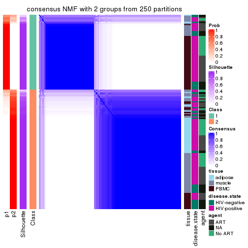</p>

</div>
<div id='tab-ATC-NMF-consensus-heatmap-2'>
<pre><code class="r">consensus_heatmap(res, k = 3)
</code></pre>

<p>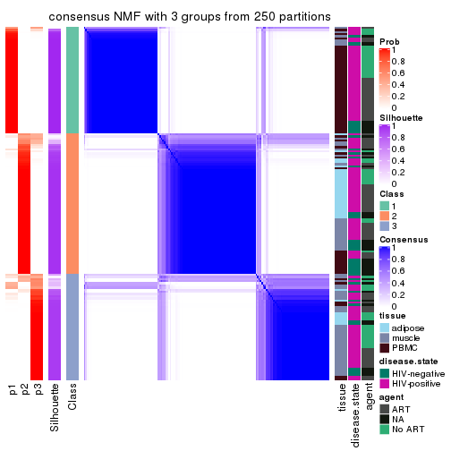</p>

</div>
<div id='tab-ATC-NMF-consensus-heatmap-3'>
<pre><code class="r">consensus_heatmap(res, k = 4)
</code></pre>

<p>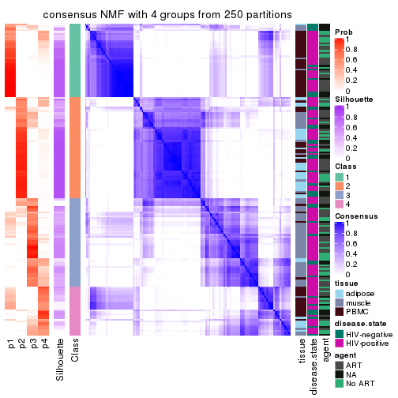</p>

</div>
<div id='tab-ATC-NMF-consensus-heatmap-4'>
<pre><code class="r">consensus_heatmap(res, k = 5)
</code></pre>

<p>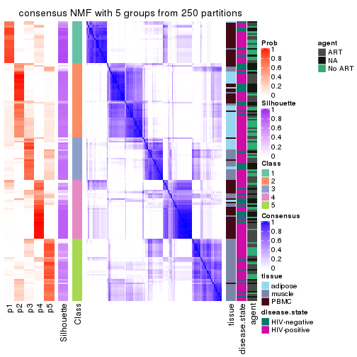</p>

</div>
<div id='tab-ATC-NMF-consensus-heatmap-5'>
<pre><code class="r">consensus_heatmap(res, k = 6)
</code></pre>

<p>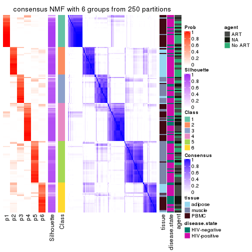</p>

</div>
</div>

Heatmaps for the membership of samples in all partitions to see how consistent they are:


<script>
$( function() {
	$( '#tabs-ATC-NMF-membership-heatmap' ).tabs();
} );
</script>
<div id='tabs-ATC-NMF-membership-heatmap'>
<ul>
<li><a href='#tab-ATC-NMF-membership-heatmap-1'>k = 2</a></li>
<li><a href='#tab-ATC-NMF-membership-heatmap-2'>k = 3</a></li>
<li><a href='#tab-ATC-NMF-membership-heatmap-3'>k = 4</a></li>
<li><a href='#tab-ATC-NMF-membership-heatmap-4'>k = 5</a></li>
<li><a href='#tab-ATC-NMF-membership-heatmap-5'>k = 6</a></li>
</ul>
<div id='tab-ATC-NMF-membership-heatmap-1'>
<pre><code class="r">membership_heatmap(res, k = 2)
</code></pre>

<p>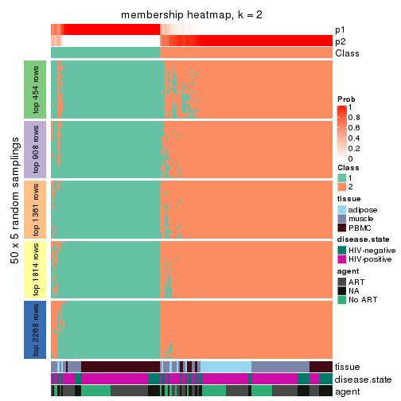</p>

</div>
<div id='tab-ATC-NMF-membership-heatmap-2'>
<pre><code class="r">membership_heatmap(res, k = 3)
</code></pre>

<p>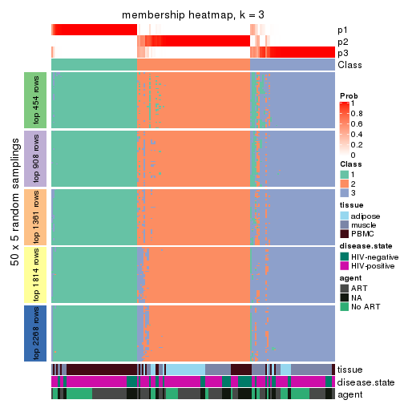</p>

</div>
<div id='tab-ATC-NMF-membership-heatmap-3'>
<pre><code class="r">membership_heatmap(res, k = 4)
</code></pre>

<p>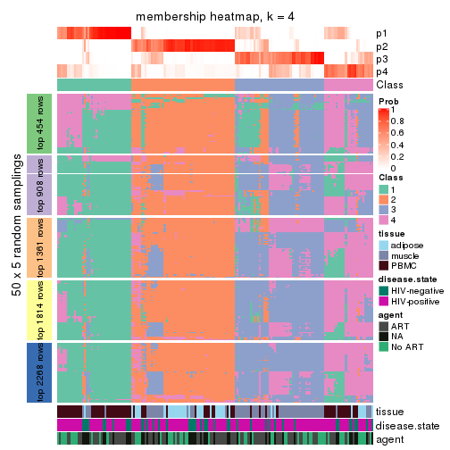</p>

</div>
<div id='tab-ATC-NMF-membership-heatmap-4'>
<pre><code class="r">membership_heatmap(res, k = 5)
</code></pre>

<p>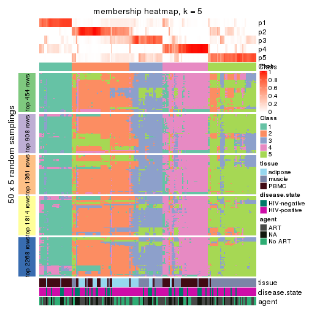</p>

</div>
<div id='tab-ATC-NMF-membership-heatmap-5'>
<pre><code class="r">membership_heatmap(res, k = 6)
</code></pre>

<p>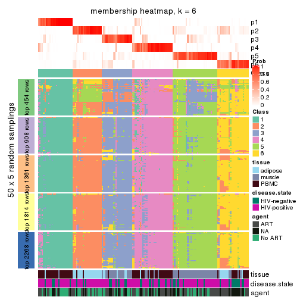</p>

</div>
</div>

As soon as we have had the classes for columns, we can look for signatures
which are significantly different between classes which can be candidate marks
for certain classes. Following are the heatmaps for signatures.


Signature heatmaps where rows are scaled:


<script>
$( function() {
	$( '#tabs-ATC-NMF-get-signatures' ).tabs();
} );
</script>
<div id='tabs-ATC-NMF-get-signatures'>
<ul>
<li><a href='#tab-ATC-NMF-get-signatures-1'>k = 2</a></li>
<li><a href='#tab-ATC-NMF-get-signatures-2'>k = 3</a></li>
<li><a href='#tab-ATC-NMF-get-signatures-3'>k = 4</a></li>
<li><a href='#tab-ATC-NMF-get-signatures-4'>k = 5</a></li>
<li><a href='#tab-ATC-NMF-get-signatures-5'>k = 6</a></li>
</ul>
<div id='tab-ATC-NMF-get-signatures-1'>
<pre><code class="r">get_signatures(res, k = 2)
</code></pre>

<p>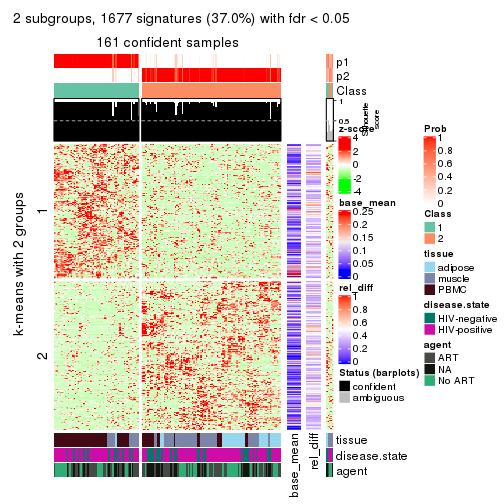</p>

</div>
<div id='tab-ATC-NMF-get-signatures-2'>
<pre><code class="r">get_signatures(res, k = 3)
</code></pre>

<p>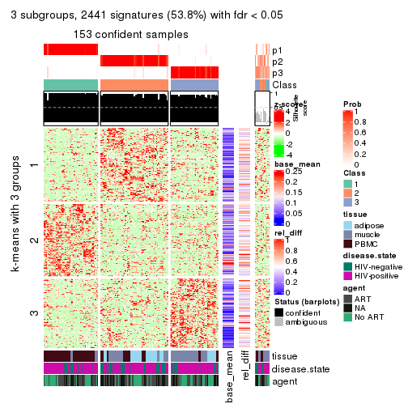</p>

</div>
<div id='tab-ATC-NMF-get-signatures-3'>
<pre><code class="r">get_signatures(res, k = 4)
</code></pre>

<p>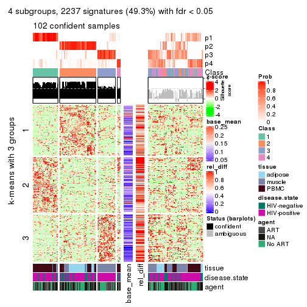</p>

</div>
<div id='tab-ATC-NMF-get-signatures-4'>
<pre><code class="r">get_signatures(res, k = 5)
</code></pre>

<p>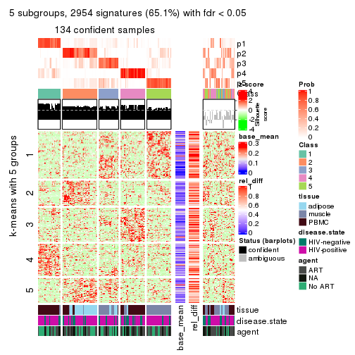</p>

</div>
<div id='tab-ATC-NMF-get-signatures-5'>
<pre><code class="r">get_signatures(res, k = 6)
</code></pre>

<p>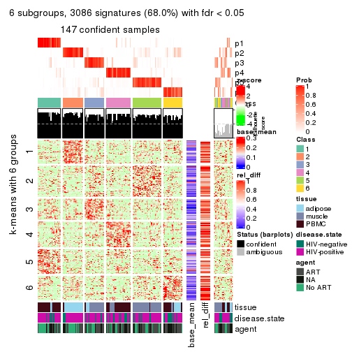</p>

</div>
</div>


Signature heatmaps where rows are not scaled:


<script>
$( function() {
	$( '#tabs-ATC-NMF-get-signatures-no-scale' ).tabs();
} );
</script>
<div id='tabs-ATC-NMF-get-signatures-no-scale'>
<ul>
<li><a href='#tab-ATC-NMF-get-signatures-no-scale-1'>k = 2</a></li>
<li><a href='#tab-ATC-NMF-get-signatures-no-scale-2'>k = 3</a></li>
<li><a href='#tab-ATC-NMF-get-signatures-no-scale-3'>k = 4</a></li>
<li><a href='#tab-ATC-NMF-get-signatures-no-scale-4'>k = 5</a></li>
<li><a href='#tab-ATC-NMF-get-signatures-no-scale-5'>k = 6</a></li>
</ul>
<div id='tab-ATC-NMF-get-signatures-no-scale-1'>
<pre><code class="r">get_signatures(res, k = 2, scale_rows = FALSE)
</code></pre>

<p>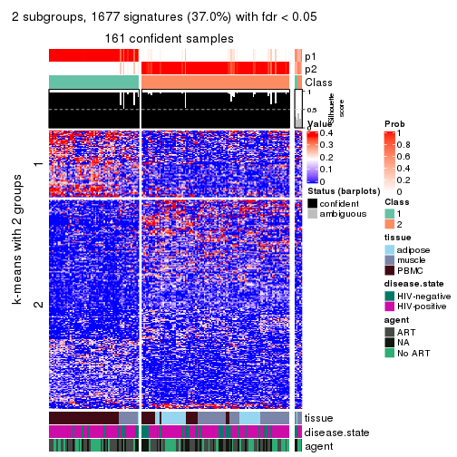</p>

</div>
<div id='tab-ATC-NMF-get-signatures-no-scale-2'>
<pre><code class="r">get_signatures(res, k = 3, scale_rows = FALSE)
</code></pre>

<p>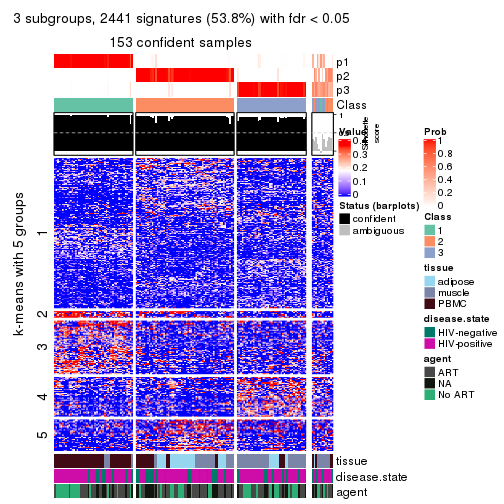</p>

</div>
<div id='tab-ATC-NMF-get-signatures-no-scale-3'>
<pre><code class="r">get_signatures(res, k = 4, scale_rows = FALSE)
</code></pre>

<p>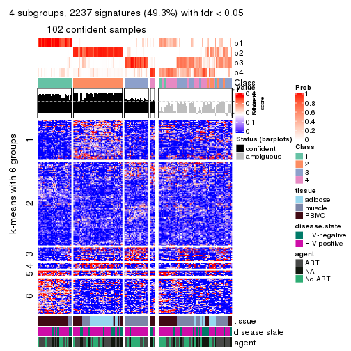</p>

</div>
<div id='tab-ATC-NMF-get-signatures-no-scale-4'>
<pre><code class="r">get_signatures(res, k = 5, scale_rows = FALSE)
</code></pre>

<p>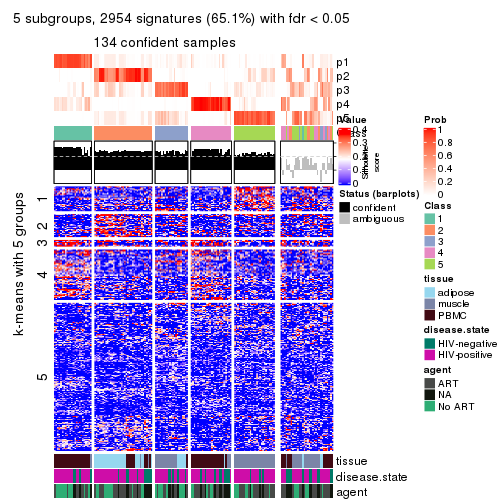</p>

</div>
<div id='tab-ATC-NMF-get-signatures-no-scale-5'>
<pre><code class="r">get_signatures(res, k = 6, scale_rows = FALSE)
</code></pre>

<p>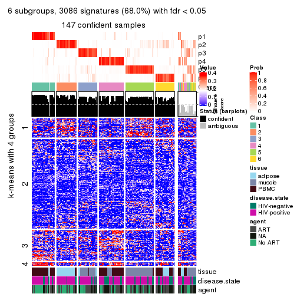</p>

</div>
</div>


Compare the overlap of signatures from different k:

```r
compare_signatures(res)
```

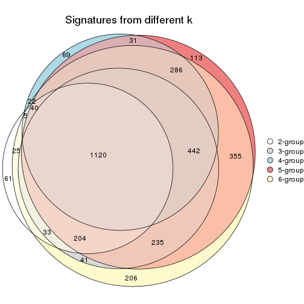

`get_signature()` returns a data frame invisibly. TO get the list of signatures, the function
call should be assigned to a variable explicitly. In following code, if `plot` argument is set
to `FALSE`, no heatmap is plotted while only the differential analysis is performed.

```r
# code only for demonstration
tb = get_signature(res, k = ..., plot = FALSE)
```

An example of the output of `tb` is:

```
#>   which_row         fdr    mean_1    mean_2 scaled_mean_1 scaled_mean_2 km
#> 1        38 0.042760348  8.373488  9.131774    -0.5533452     0.5164555  1
#> 2        40 0.018707592  7.106213  8.469186    -0.6173731     0.5762149  1
#> 3        55 0.019134737 10.221463 11.207825    -0.6159697     0.5749050  1
#> 4        59 0.006059896  5.921854  7.869574    -0.6899429     0.6439467  1
#> 5        60 0.018055526  8.928898 10.211722    -0.6204761     0.5791110  1
#> 6        98 0.009384629 15.714769 14.887706     0.6635654    -0.6193277  2
...
```

The columns in `tb` are:

1. `which_row`: row indices corresponding to the input matrix.
2. `fdr`: FDR for the differential test. 
3. `mean_x`: The mean value in group x.
4. `scaled_mean_x`: The mean value in group x after rows are scaled.
5. `km`: Row groups if k-means clustering is applied to rows.


UMAP plot which shows how samples are separated.


<script>
$( function() {
	$( '#tabs-ATC-NMF-dimension-reduction' ).tabs();
} );
</script>
<div id='tabs-ATC-NMF-dimension-reduction'>
<ul>
<li><a href='#tab-ATC-NMF-dimension-reduction-1'>k = 2</a></li>
<li><a href='#tab-ATC-NMF-dimension-reduction-2'>k = 3</a></li>
<li><a href='#tab-ATC-NMF-dimension-reduction-3'>k = 4</a></li>
<li><a href='#tab-ATC-NMF-dimension-reduction-4'>k = 5</a></li>
<li><a href='#tab-ATC-NMF-dimension-reduction-5'>k = 6</a></li>
</ul>
<div id='tab-ATC-NMF-dimension-reduction-1'>
<pre><code class="r">dimension_reduction(res, k = 2, method = &quot;UMAP&quot;)
</code></pre>

<p>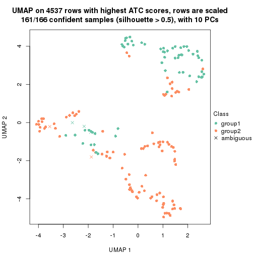</p>

</div>
<div id='tab-ATC-NMF-dimension-reduction-2'>
<pre><code class="r">dimension_reduction(res, k = 3, method = &quot;UMAP&quot;)
</code></pre>

<p>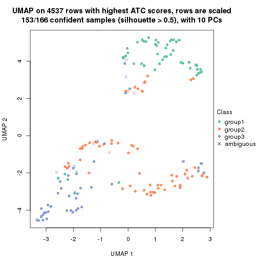</p>

</div>
<div id='tab-ATC-NMF-dimension-reduction-3'>
<pre><code class="r">dimension_reduction(res, k = 4, method = &quot;UMAP&quot;)
</code></pre>

<p>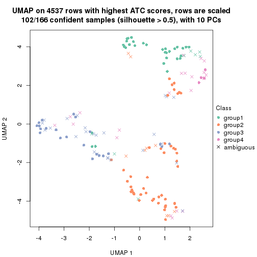</p>

</div>
<div id='tab-ATC-NMF-dimension-reduction-4'>
<pre><code class="r">dimension_reduction(res, k = 5, method = &quot;UMAP&quot;)
</code></pre>

<p>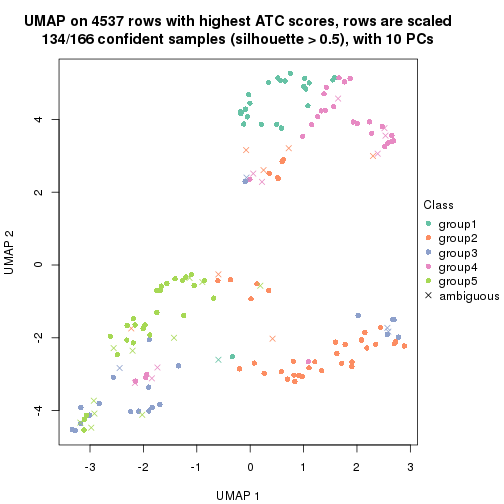</p>

</div>
<div id='tab-ATC-NMF-dimension-reduction-5'>
<pre><code class="r">dimension_reduction(res, k = 6, method = &quot;UMAP&quot;)
</code></pre>

<p>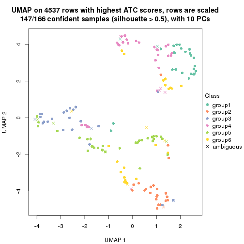</p>

</div>
</div>


Following heatmap shows how subgroups are split when increasing `k`:

```r
collect_classes(res)
```

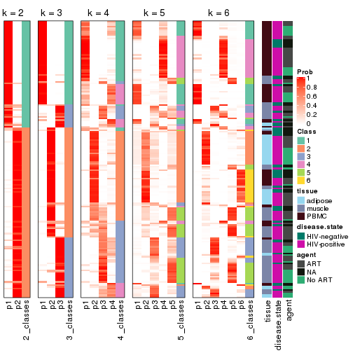


Test correlation between subgroups and known annotations. If the known
annotation is numeric, one-way ANOVA test is applied, and if the known
annotation is discrete, chi-squared contingency table test is applied.

```r
test_to_known_factors(res)
```

```
#>           n tissue(p) disease.state(p) agent(p) k
#> ATC:NMF 161  1.71e-12            0.388   0.5556 2
#> ATC:NMF 153  5.97e-19            0.251   0.2672 3
#> ATC:NMF 102  2.52e-19            0.077   0.1778 4
#> ATC:NMF 134  1.00e-29            0.336   0.2388 5
#> ATC:NMF 147  7.25e-33            0.208   0.0554 6
```


If matrix rows can be associated to genes, consider to use `GO_Enrichment(res,
...)` to perform function enrichment for the signature genes.


 

## Session info


```r
sessionInfo()
```

```
#> R version 3.6.0 (2019-04-26)
#> Platform: x86_64-pc-linux-gnu (64-bit)
#> Running under: CentOS Linux 7 (Core)
#> 
#> Matrix products: default
#> BLAS:   /usr/lib64/libblas.so.3.4.2
#> LAPACK: /usr/lib64/liblapack.so.3.4.2
#> 
#> locale:
#>  [1] LC_CTYPE=en_GB.UTF-8       LC_NUMERIC=C               LC_TIME=en_GB.UTF-8       
#>  [4] LC_COLLATE=en_GB.UTF-8     LC_MONETARY=en_GB.UTF-8    LC_MESSAGES=en_GB.UTF-8   
#>  [7] LC_PAPER=en_GB.UTF-8       LC_NAME=C                  LC_ADDRESS=C              
#> [10] LC_TELEPHONE=C             LC_MEASUREMENT=en_GB.UTF-8 LC_IDENTIFICATION=C       
#> 
#> attached base packages:
#> [1] grid      parallel  stats     graphics  grDevices utils     datasets  methods   base     
#> 
#> other attached packages:
#>  [1] genefilter_1.66.0     ComplexHeatmap_2.1.1  markdown_1.1          knitr_1.26           
#>  [5] preprocessCore_1.46.0 cola_1.3.2            GEOquery_2.52.0       Biobase_2.44.0       
#>  [9] BiocGenerics_0.30.0   GetoptLong_0.1.7     
#> 
#> loaded via a namespace (and not attached):
#>  [1] bitops_1.0-6         matrixStats_0.55.0   bit64_0.9-7          doParallel_1.0.15   
#>  [5] RColorBrewer_1.1-2   httr_1.4.1           tools_3.6.0          backports_1.1.5     
#>  [9] R6_2.4.1             DBI_1.0.0            lazyeval_0.2.2       colorspace_1.4-1    
#> [13] withr_2.1.2          tidyselect_0.2.5     gridExtra_2.3        bit_1.1-14          
#> [17] compiler_3.6.0       xml2_1.2.2           microbenchmark_1.4-7 pkgmaker_0.28       
#> [21] slam_0.1-46          scales_1.1.0         readr_1.3.1          NMF_0.23.6          
#> [25] stringr_1.4.0        digest_0.6.23        pkgconfig_2.0.3      bibtex_0.4.2        
#> [29] highr_0.8            limma_3.40.6         rlang_0.4.2          GlobalOptions_0.1.1 
#> [33] RSQLite_2.1.2        impute_1.58.0        shape_1.4.4          mclust_5.4.5        
#> [37] dendextend_1.12.0    dplyr_0.8.3          RCurl_1.95-4.12      magrittr_1.5        
#> [41] Matrix_1.2-17        Rcpp_1.0.3           munsell_0.5.0        S4Vectors_0.22.1    
#> [45] viridis_0.5.1        lifecycle_0.1.0      stringi_1.4.3        plyr_1.8.4          
#> [49] blob_1.2.0           crayon_1.3.4         lattice_0.20-38      splines_3.6.0       
#> [53] annotate_1.62.0      circlize_0.4.9       hms_0.5.2            zeallot_0.1.0       
#> [57] pillar_1.4.2         rjson_0.2.20         rngtools_1.4         reshape2_1.4.3      
#> [61] codetools_0.2-16     stats4_3.6.0         XML_3.98-1.20        glue_1.3.1          
#> [65] evaluate_0.14        png_0.1-7            vctrs_0.2.0          foreach_1.4.7       
#> [69] polyclip_1.10-0      gtable_0.3.0         purrr_0.3.3          tidyr_1.0.0         
#> [73] clue_0.3-57          assertthat_0.2.1     ggplot2_3.2.1        xfun_0.11           
#> [77] gridBase_0.4-7       eulerr_6.0.0         xtable_1.8-4         skmeans_0.2-11      
#> [81] survival_2.44-1.1    viridisLite_0.3.0    tibble_2.1.3         iterators_1.0.12    
#> [85] AnnotationDbi_1.46.1 registry_0.5-1       memoise_1.1.0        IRanges_2.18.3      
#> [89] cluster_2.1.0        brew_1.0-6
```


